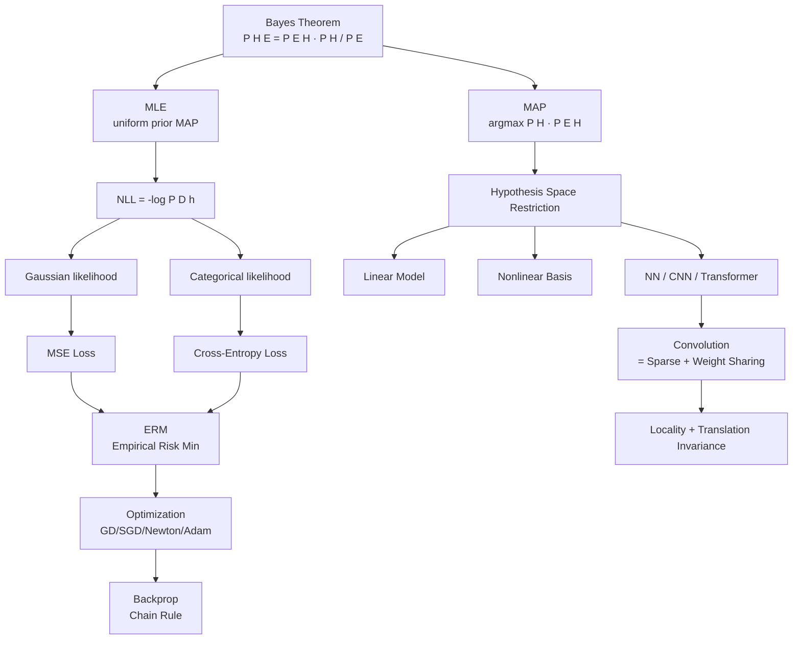

# A+ 시험대비 완전유도집 — 마스터 인덱스

> **목표**: "공식이 왜 그렇게 되는지" 완전 마스터하여 A+ 받기
> **방식**: 중1 산술 → 대학원 수식까지 **단계 건너뛰지 않음**, 모든 기호 Line-by-Line 해체
> **채점 철학(교수 명시)**: 답만 적으면 0점. 과정·논리·"왜"가 점수.

---

## 0. 이 자료의 사용법

### 0.1 학습 순서 (의존성 그래프)

```
[A] 수학 기초 (중1~대1)
   ↓
[B] 베이즈 정리 + MLE/MAP   ← 모든 것의 뿌리
   ↓
[C] NLL ↔ MSE / Cross-Entropy 유도   ← 6,7주차 핵심
   ↓
[D] Optimization (GD/Newton/Adam) + Backprop   ← 8주차
   ↓
[E] Convolution = Linear Transformation   ← 9주차
   ↓
[F] Inductive Bias 통합 시각   ← 전 주차 관통
```

각 토픽은 다음 6단계 구조:
1. **왜 시험에 나오나** — 출제 근거(강의 발언, 퀴즈, 중요도)
2. **필요한 사전 수학** — 중1~대학원 단계별 빌드업
3. **모든 기호 해체** — 한 줄 한 줄 무엇을 의미하는지
4. **유도 체인** — 처음부터 끝까지, 단계 건너뛰지 않음
5. **각 단계의 "왜"** — 왜 이렇게 변형하는가
6. **모범 답안 작성 템플릿** — 시험에서 그대로 옮길 수 있는 구조

---

## 1. 토픽별 파일 인덱스

### 🔴 매우 높음 (★★★★★) — 반드시 마스터

| # | 파일 | 핵심 유도 | 출제 근거 |
|---|------|----------|----------|
| 01 | [베이즈 정리 증명](01_베이즈정리_증명.md) | $P(H\mid E) = \dfrac{P(E\mid H)P(H)}{P(E)}$ 두 가지 유도 | 3주차 ★10, 퀴즈 9번 직접 출제 |
| 02 | [MLE for Bernoulli 완전유도](02_MLE_Bernoulli_완전유도.md) | $\theta^*_{ML} = k/n$ — 미분=0 끝까지 | 3주차 ★10, 퀴즈 10번, 중간 출제 |
| 03 | [MAP 일반화 유도](03_MAP_일반화_유도.md) | Prior $\theta^M(1-\theta)^M$ → $\theta^* = \dfrac{k+M}{n+2M}$ | 4주차 퀴즈 13, 중간 변형 출제 |
| 04 | [NLL → MSE 유도 (Gaussian)](04_NLL_MSE_Gaussian_유도.md) | exp/minus/square로 MSE가 떨어지는 전 과정 | 4주차 ★10, 6-7주차 반복 |
| 05 | [Cross-Entropy 유도 (Categorical)](05_CrossEntropy_Categorical_유도.md) | Categorical NLL → CE = $-\sum y_i \log \hat y_i$ | 6주차 ★9 |
| 06 | [Softmax 미분 (Jacobian)](06_Softmax_Jacobian.md) | $\partial s_i/\partial z_j = s_i(\delta_{ij} - s_j)$ 4가지 유도 | 2주차 퀴즈 6번, 중간 Q4 직접 |
| 07 | [Linear Regression Closed Form](07_LinearReg_ClosedForm.md) | $\theta^* = (X^TX)^{-1}X^Ty$ | 6,8주차 ★9, 퀴즈 27 |
| 08 | [Newton's Method = 2차 근사 최소화](08_Newton_2차근사.md) | Taylor 2차 → 미분=0 → 업데이트식 | 8주차 ★9, 퀴즈 25 |
| 09 | [Backpropagation + Chain Rule](09_Backprop_ChainRule.md) | Softmax+CE 결합 미분 = $\hat y - y$ | 8주차 ★10, 퀴즈 26 |
| 10 | [Convolution = Linear Transformation 증명](10_Conv_Linear_증명.md) | Linearity 4 case + Matrix 변환 | 9주차 ★10, 퀴즈 28-30 |
| 11 | [Output Size Formula 유도](11_OutputSize_유도.md) | $O = \lfloor (W - K + 2P)/S \rfloor + 1$ | 9주차 ★9, "외우지 말고 유도" |

### 🟠 높음 (★★★★)

| # | 파일 | 핵심 |
|---|------|------|
| 12 | [GD/SGD/Momentum/Adam 비교](12_GD_SGD_Adam.md) | 4가지 업데이트 식 + 왜 Adam=Momentum+RMSProp |
| 13 | [KL Divergence 정의와 성질](13_KL_Divergence.md) | KL≥0 증명, NLL과의 관계 |
| 14 | [Hypothesis Space Restriction = MAP](14_Hypothesis_MAP.md) | 6주차 핵심 통합 시각 |
| 15 | [Inductive Bias 강도 비교](15_Inductive_Bias_강도.md) | Linear→NN→CNN→Transformer prior 약화 |

### 🟡 중간 (★★★)

| # | 파일 | 핵심 |
|---|------|------|
| 16 | [Jacobian / Vector→Vector 미분](16_Jacobian.md) | 정의 + 계산 예시 |
| 17 | [Linearity 검증 (additivity, homogeneity)](17_Linearity_검증.md) | 1주차 퀴즈 1, Max Pooling 반례 |
| 18 | [Eigenvalue / Rank-Nullity](18_Eigen_RankNullity.md) | 2주차 |

### 📚 부록 (수학 기초)

| # | 파일 | 핵심 |
|---|------|------|
| A1 | [중1→대학원 수학 빌드업](A1_수학_빌드업.md) | log, 미분, 적분, 벡터, 행렬, 확률 |
| A2 | [Gaussian 적분 공식 모음](A2_Gaussian_적분.md) | $\int e^{-x^2}dx$, 모멘트 |
| A3 | [확률·통계 기초](A3_확률통계_기초.md) | E(X), Var(X), Bernoulli, Categorical, Gaussian PDF |

---

## 2. 전체 통합 시각 (한 장 요약)

이 시험의 큰 줄기 4문장 (이걸 답안 첫 줄에 쓸 수 있어야 함):

> **① Hypothesis space를 제한하는 것 = prior를 넣는 것 = inductive bias.**
> **② 확률모델의 NLL은 ERM이 되며, likelihood 가정이 loss를 결정한다.**
> **③ 학습 = parameter space에서 loss 최소화. Backprop = chain rule로 gradient 계산.**
> **④ Convolution = sparse + weight sharing이라는 제한된 linear transformation.**

### 2.1 통합 다이어그램 (Mermaid)



---

## 3. 시험 답안 작성 5계명 (강의 명시)

1. **답만 적으면 0점.** 과정 평가가 중심.
2. **수식만 쭉 적으면 의미 없음.** 논리 서술 필수 — IID 어디서 썼는지, 왜 미분=0인지.
3. 중간고사 변형이 약 1/3 출제 예상.
4. **영어 출제** (번역 가능). "Explain how to obtain..." 형식 → 과정 설명 요구.
5. 학생 다수가 못 푼 문제의 변형이 출제됨.

### 3.1 답안 표준 골격

```
[Step 0] Setup: 무엇을 구하려는가, 가정(IID 등) 명시
[Step 1] 수식 출발점: 정의 또는 likelihood 적기
[Step 2] 변형 이유 + 변형 (각 줄에 "왜")
[Step 3] 미분 / 극값 조건
[Step 4] 풀이
[Step 5] 결론 + 의미 해석
```

---

## 4. 색상 코딩 약속 (Obsidian)

본 자료는 다음 색상을 텍스트로 표기 (Obsidian에서 시각 구분):
- 🔵 **Prior** $P(H)$ — 데이터 보기 전의 믿음
- 🔴 **Posterior** $P(H\mid E)$ — 데이터 본 후의 믿음 (구하고 싶은 것)
- 🟢 **Likelihood** $P(E\mid H)$ — Hypothesis가 참일 때 데이터 확률

수식은 모두 LaTeX (`$...$` 인라인, `$$...$$` 블록).

---

## 5. 진도 체크리스트

- [ ] 01 베이즈 정리 증명 — 두 가지 방식 모두 외우지 말고 유도
- [ ] 02 MLE Bernoulli — 미분=0까지 직접 손으로
- [ ] 03 MAP 일반화 — General-$M$ 식 유도 직접
- [ ] 04 NLL→MSE — exp/minus/square 흐름 외우지 말고 재현
- [ ] 05 Cross-Entropy — Categorical NLL에서 시작
- [ ] 06 Softmax Jacobian — $i=j$ vs $i\neq j$ case 분리
- [ ] 07 Linear Regression Closed Form — $\nabla = 0$ 직접 풀기
- [ ] 08 Newton — 2차 Taylor → 미분=0
- [ ] 09 Backprop — softmax+CE 결합 미분 $\hat y - y$ 직접
- [ ] 10 Conv = LT — linearity 4-case 검증 + matrix 구성
- [ ] 11 Output Size — $\lfloor (W-K+2P)/S \rfloor + 1$ 유도

각 항목 옆에 "직접 백지에서 재현 가능한가?"를 ✅로 표시하면서 진행.
