# A+ 유도집 — 시각화 로드맵 (Mermaid 다이어그램 모음)

> 17개 문서의 학습 로드맵, 개념 관계, 시험 시나리오, 유도 흐름을 한눈에.
> Obsidian Mermaid 플러그인에서 모두 렌더링됨.

---

## 1. 학습 로드맵 (Learning Roadmap) — 의존성 그래프

> **의존성 순서**: 화살표를 따라 학습. 부모 노드 없이 자식부터 보면 막힘.

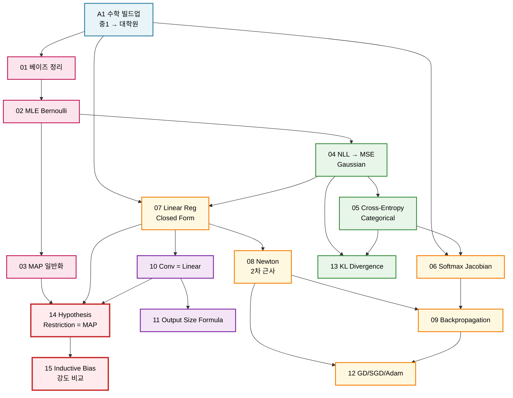

**색상 범례**

| 색 | 영역 | 토픽 |
|----|------|------|
| 🔵 파랑 | 수학 기초 | A1 |
| 🟣 분홍 | 베이즈 / 확률모델 | 01-03 |
| 🟢 초록 | 손실함수 (likelihood → loss) | 04, 05, 13 |
| 🟡 주황 | 미분 / 최적화 / Backprop | 06, 07, 08, 09, 12 |
| 🟪 보라 | CNN / Convolution | 10, 11 |
| 🔴 빨강 | 통합 시각 (가장 중요) | 14, 15 |

---

## 2. 시험 출제 가능성 매트릭스 (Quadrant)

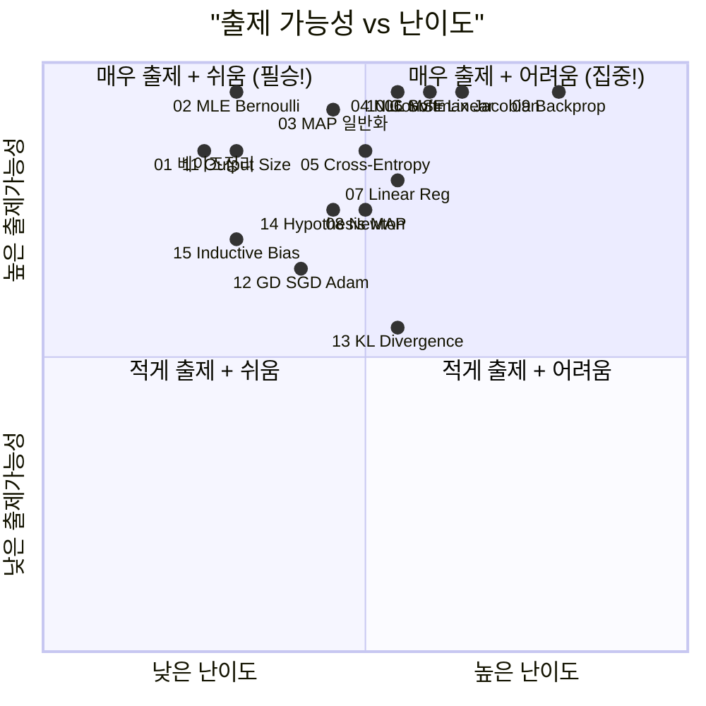

> 💡 **시험 직전 30분이 남는다면**: Q2 영역 (02 MLE, 11 Output Size) 부터 다시 보고 → Q1 영역 (06 Softmax, 09 Backprop, 10 Conv) 순으로.

---

## 3. 강의 메인 시각 — "두 축" 통합 그래프

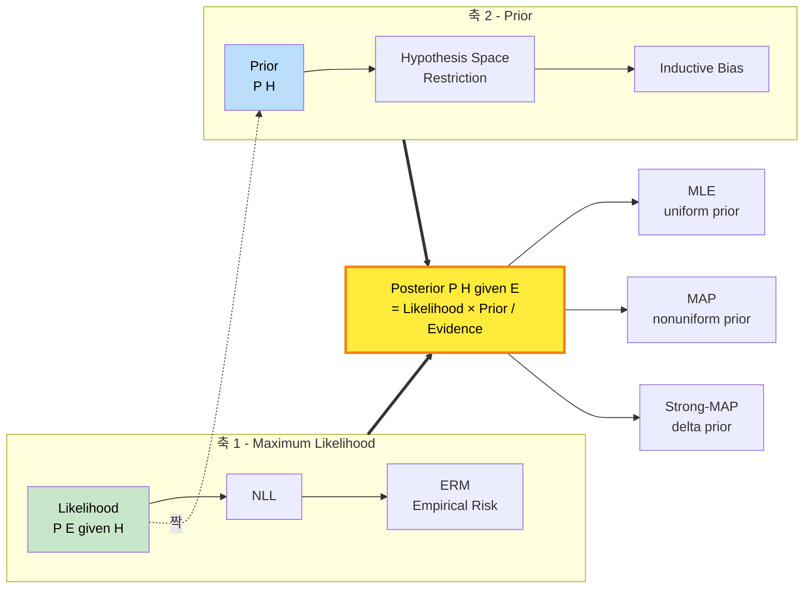

---

## 4. Likelihood → Loss 매핑 (회귀-분류 평행 구조)

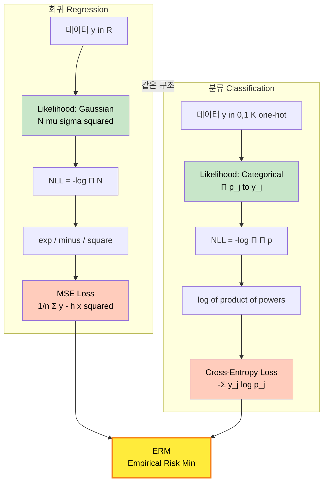

---

## 5. Optimization 알고리즘 진화 트리

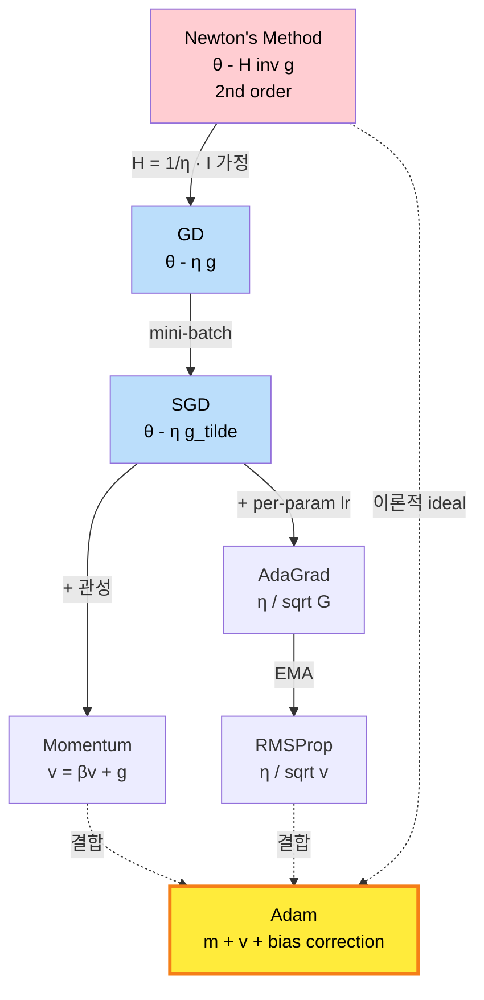

---

## 6. CNN 발전 — Linearity 의 점진적 제한

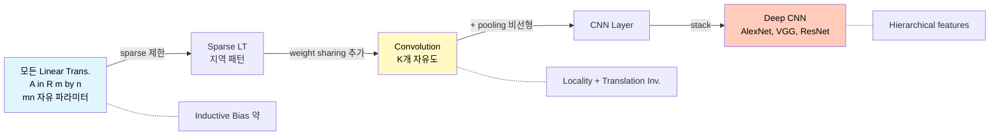

---

## 7. Inductive Bias 강도 스펙트럼

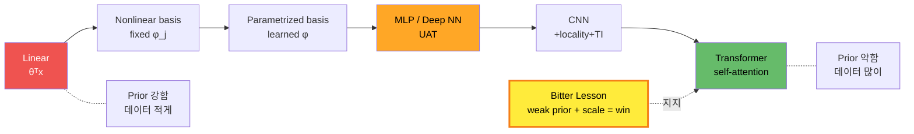

---

## 8. 시험 답안 작성 시나리오 (Sequence Diagram)

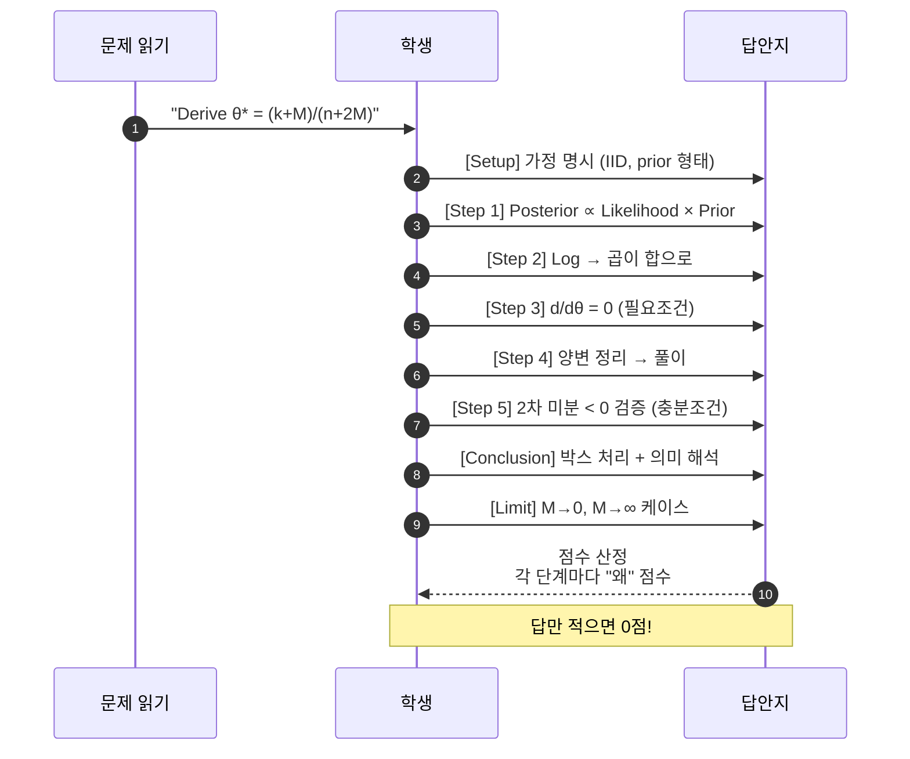

---

## 9. Backpropagation 데이터 흐름 (Forward + Backward)

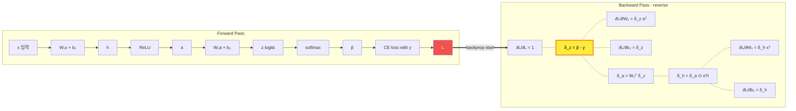

---

## 9.1. 학습의 전체 사이클 (The Big Picture: Training Loop)

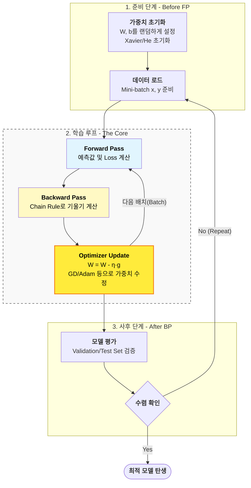

> 💡 **흐름 요약**: Forward에서 Loss를 구하고, Backward에서 각 가중치별 책임(기울기)을 묻고, Update에서 실제로 가중치를 고칩니다.

---

## 10. 개념 관계도 (Concept Graph) — 전체 17개 토픽

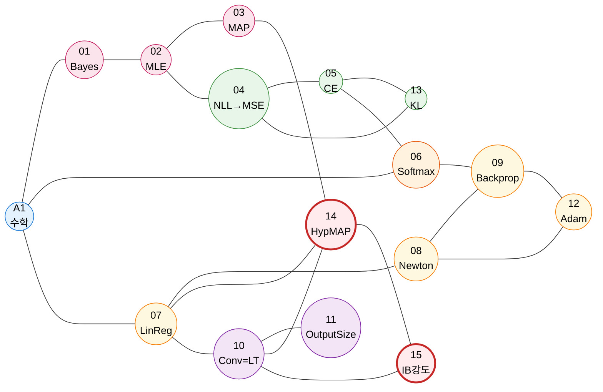

---

## 11. 시험 D-Day 학습 시나리오 (Gantt)

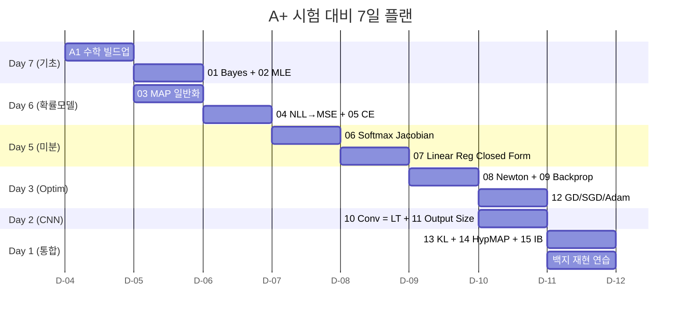

---

## 12. 답안 채점 기준 (Mind Map)

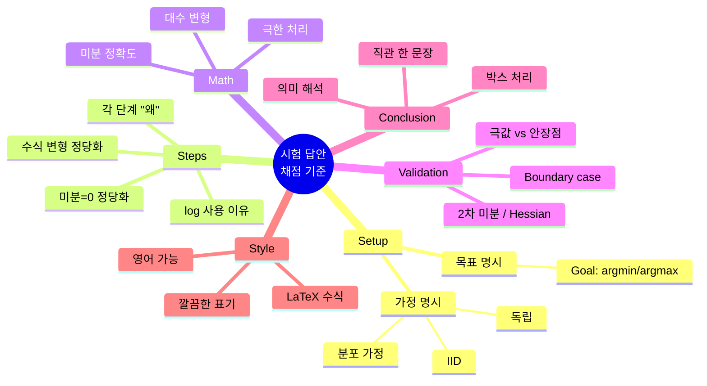

---

## 13. "답만 적으면 0점" — 점수 분배 시각화 (Pie)

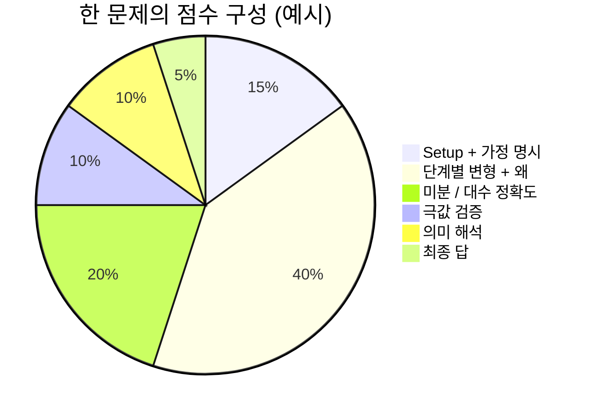

> 🎯 **"답"은 5점. "왜"가 95점.** — 강의 채점 철학.

---

## 14. 출제 시나리오 분기 (State Diagram)

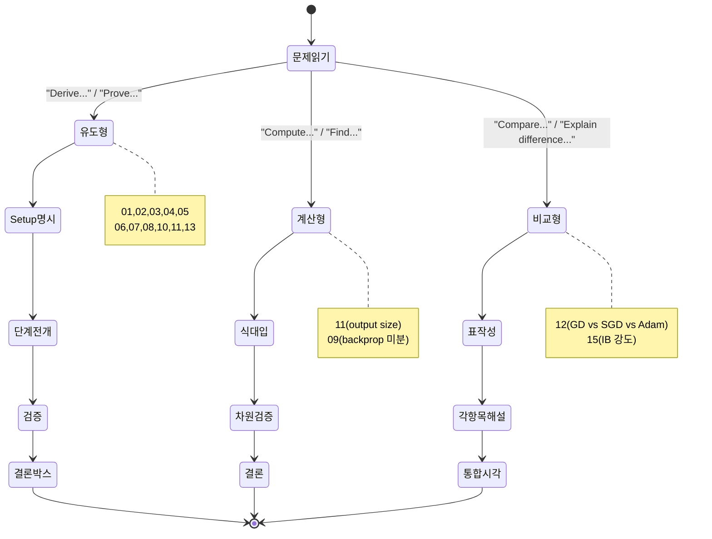

---

## 15. 최종 통합 — "하나의 그림으로 본 강의 전체"

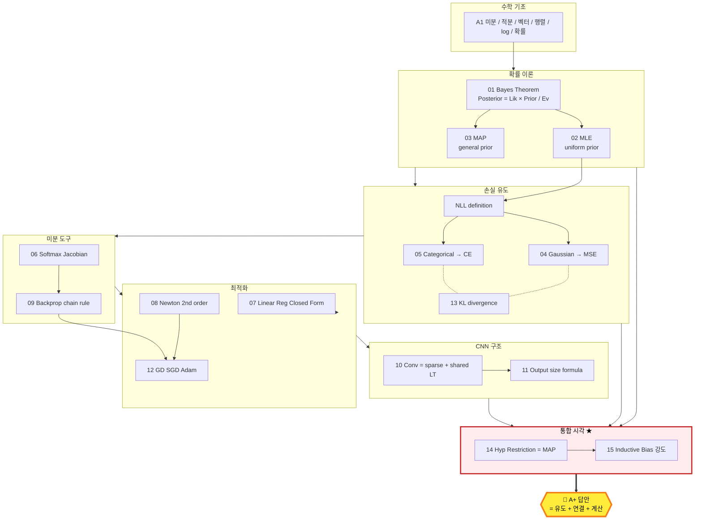

---

## 16. 한 줄 요약 (Slogan)

> **"강의 전체 = Likelihood + Prior 두 축으로 모든 것이 설명된다."**
>
> - Likelihood (어떤 분포 가정?) → Loss 가 결정 (Gaussian→MSE, Categorical→CE)
> - Prior (어떤 hypothesis 만 허용?) → Inductive Bias 가 결정 (Linear, NN, CNN, Transformer)
> - 두 축의 곱 = Posterior → MAP/MLE 가 그 위에서 답을 찾음
> - Optimization (Newton, Adam) + Backprop = 그 답을 "실제로 계산"하는 방법

이 한 단락이 시험에서 어떤 문제가 나와도 첫 줄에 적을 수 있는 "전체 지도".

---

## 17. 사용법

1. Obsidian 에서 `00_시각화_로드맵.md` 를 열기.
2. Mermaid 플러그인이 활성화되어 있으면 모든 다이어그램이 즉시 렌더링됨.
3. 각 다이어그램은 해당 토픽 학습 전에 "내가 어디 있는지" 확인용.
4. 시험 직전에는 #15 (전체 통합) + #2 (출제 매트릭스) 만 빠르게 훑어보면 충분.
