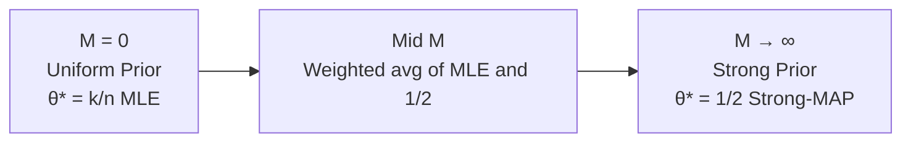

# 03. MAP 일반화 유도 — Prior $\theta^M(1-\theta)^M$

> **출제 근거**: 4주차 퀴즈 13번 (\"General-$M$ MAP 풀기\"), 중간고사 Q3(b)(c)(d) 직접
> **시험 출제 방식**: \"For prior $P(\theta) \propto \theta^M (1-\theta)^M$ and Bernoulli likelihood, derive the MAP estimator. Discuss the limit $M \to 0$ and $M \to \infty$.\"

---

## 1. 왜 시험에 나오는가

- **MLE/MAP/Strong-MAP 의 통합 시각**을 묻는 핵심 문제.
- General-$M$ 식 $\theta^* = (k+M)/(n+2M)$ 은 **MAP가 prior와 likelihood의 가중평균**임을 보여줌.
- $M=0$ → MLE, $M\to\infty$ → Strong prior (= 1/2 로 고정) — **prior 강도 = inductive bias 강도**의 직관적 예.
- 중간 출제 → 변형 매우 유력.

---

## 2. 사전 수학

(이전 토픽 [02 MLE Bernoulli](02_MLE_Bernoulli_완전유도.md) 의 모든 도구 + 다음)

### 2.1 \"비례\" 기호 $\propto$

$f(\theta) \propto g(\theta)$ 는 \"$f(\theta) = c \cdot g(\theta)$, 단 $c$ 는 $\theta$ 와 무관한 상수\".

**왜 중요한가?** $\arg\max$ 를 할 때 $\theta$ 와 무관한 상수는 무시 가능. → MAP 계산이 매우 간편해짐.

### 2.2 베이즈 정리 재방문

$$
\underbrace{P(\theta \mid D)}_{\text{🔴 posterior}}
=
\frac{
\underbrace{P(D \mid \theta)}_{\text{🟢 likelihood}}
\cdot
\underbrace{P(\theta)}_{\text{🔵 prior}}
}{
\underbrace{P(D)}_{\text{evidence}}
}
$$

$\theta$ 에 대해 $P(D)$ 는 상수 → MAP 에서 무시:

$$
\theta^*_{MAP} \;=\; \arg\max_\theta P(\theta \mid D) \;=\; \arg\max_\theta \; P(D \mid \theta)\, P(\theta)
$$

---

## 3. 문제 설정

- 데이터: 동전 $n$ 번 던져 $k$ 번 앞면. IID Bernoulli.
- 🔵 Prior: $P(\theta) \propto \theta^M (1-\theta)^M$, $\theta \in [0,1]$, $M \geq 0$.

**Prior 의 의미 (한 줄로)**:
> \"$M$ 번의 앞면과 $M$ 번의 뒷면을 **사전에** 봤다고 가정\" — pseudo-count 해석.

이렇게 보면 $M$ 이 클수록 \"내가 prior로 보는 상상의 데이터가 많아\" → prior 가 강해짐.

---

## 4. 유도 체인

### Step 1 — Posterior (proportional)

$$
P(\theta \mid D) \;\propto\; P(D \mid \theta)\, P(\theta)
$$

각 항 대입:

$$
P(\theta \mid D) \;\propto\; \underbrace{\theta^k(1-\theta)^{n-k}}_{\text{likelihood}} \cdot \underbrace{\theta^M (1-\theta)^M}_{\text{prior}}
$$

거듭제곱 합치기:

$$
P(\theta \mid D) \;\propto\; \theta^{k+M}(1-\theta)^{n-k+M}
\tag{1}
$$

> 💡 **관찰**: 이 식은 \"앞면 $k+M$ 번, 뒷면 $(n-k)+M$ 번 본 Bernoulli likelihood\" 와 **같은 형태**. 즉 prior 를 추가했더니 데이터를 \"$M$ 번 더 본 것처럼\" 해석할 수 있음 → **conjugate prior** 의 직관.

### Step 2 — Log Posterior

$$
\log P(\theta \mid D) \;=\; (k+M)\log\theta + (n-k+M)\log(1-\theta) + \text{const}
\tag{2}
$$

const = $\log P(D)$ 와 prior 정규화 상수 (모두 $\theta$ 무관, 미분 시 사라짐).

### Step 3 — 미분=0

$$
\frac{d}{d\theta}\log P(\theta \mid D) \;=\; \frac{k+M}{\theta} - \frac{n-k+M}{1-\theta} \;=\; 0
\tag{3}
$$

(02 토픽 Step 4와 같은 미분 규칙)

### Step 4 — 풀이

양변에 $\theta(1-\theta)$ 를 곱:

$$
(k+M)(1-\theta) \;=\; (n-k+M)\theta
$$

전개:

$$
(k+M) - (k+M)\theta \;=\; (n-k+M)\theta
$$

$\theta$ 항 모음:

$$
(k+M) \;=\; \big[(n-k+M) + (k+M)\big]\theta \;=\; (n+2M)\theta
$$

따라서:

$$
\boxed{\; \theta^*_{MAP} \;=\; \frac{k+M}{n+2M} \;}
\tag{4}
$$

---

## 5. 극한 케이스 분석 (시험에서 점수 따는 부분)

### 5.1 $M=0$ — Uniform Prior → MLE 복귀

$P(\theta) \propto \theta^0(1-\theta)^0 = 1$ → uniform prior.

$$
\theta^*_{MAP}\big|_{M=0} = \frac{k}{n} = \theta^*_{ML}
$$

> ✅ **MLE = uniform-prior MAP**. 이것이 강의 메인 시각.

### 5.2 $M \to \infty$ — Strong Prior → 1/2 로 고정

$$
\lim_{M\to\infty} \frac{k+M}{n+2M} \;=\; \lim_{M\to\infty} \frac{M(k/M + 1)}{M(n/M + 2)} \;=\; \frac{0+1}{0+2} \;=\; \frac{1}{2}
$$

> ✅ **Strong-MAP**: prior 가 너무 강해 데이터를 무시하고 prior 의 mode (= $1/2$) 로 고정.
> 이것이 \"hypothesis space restriction → 단 한 점\" = 무한한 inductive bias.

### 5.3 일반 $M$ — MLE와 prior mode의 가중평균

식 (4) 변형:

$$
\theta^*_{MAP} \;=\; \frac{k+M}{n+2M} \;=\; \frac{n}{n+2M}\cdot\frac{k}{n} + \frac{2M}{n+2M}\cdot\frac{1}{2}
$$

(체크: 두 가중치 합 $=\frac{n+2M}{n+2M}=1$ ✅)

| 항 | 의미 |
|------|------|
| $\frac{k}{n}$ | MLE (데이터에서 본 빈도) |
| $\frac{1}{2}$ | Prior mode (사전 믿음) |
| 가중치 $\frac{n}{n+2M}$ | 데이터 \"신뢰도\" — 데이터가 많을수록 ↑ |
| 가중치 $\frac{2M}{n+2M}$ | Prior \"신뢰도\" — $M$ 클수록 ↑ |

> 💡 **직관 한 줄**: MAP은 MLE와 prior mode를 **샘플 수 비율로 가중평균**. 이게 시험에서 \"왜 MAP이 inductive bias\" 인지 답할 때 핵심.

---

## 6. 시각화 (Obsidian Mermaid)



---

## 7. 다른 Prior 케이스 (중간고사 Q3 응용)

### 7.1 Prior $\propto \theta(1-\theta)$ (Q3(b)의 $M=1$)

위 식에 $M=1$:

$$
\theta^* = \frac{k+1}{n+2}
$$

(\"Laplace smoothing\" 으로도 알려짐)

### 7.2 Prior $\propto \theta^M$ (Q3(c) — 비대칭)

같은 방식으로:

$$
P(\theta \mid D) \propto \theta^{k+M}(1-\theta)^{n-k}
$$

미분=0:

$$
\frac{k+M}{\theta} - \frac{n-k}{1-\theta} = 0 \;\Longrightarrow\; \theta^* = \frac{k+M}{n+M}
$$

> 직관: prior 가 한쪽으로 치우치면 (앞면만 가산) → MAP 도 위로 편향.

### 7.3 조각함수 Prior (Q3(d))

조각별로 prior 가 다르면, 각 구간에서 위 절차를 따로 진행한 뒤 **boundary 와 비교**:
1. 각 구간 안쪽에서 $d/d\theta=0$ 풀이 (interior critical point)
2. 그 critical point가 구간 안에 있으면 후보, 없으면 boundary 에 있음
3. 모든 후보에서 $\log P(\theta\mid D)$ 값 비교 → 최대인 것 선택

→ 이 구조가 6주차 \"Restricted Uniform Prior\" 의 직접 출제 패턴.

---

## 8. 모범 답안 템플릿

```
[Setup]
Bernoulli IID, n tosses, k heads.
Prior: P(θ) ∝ θ^M (1-θ)^M, θ ∈ [0,1], M ≥ 0.
Goal: θ*_MAP = argmax P(θ | D).

[Step 1 — Posterior up to constant]
P(θ | D) ∝ P(D | θ) P(θ)
        ∝ θ^k (1-θ)^{n-k} · θ^M (1-θ)^M
        = θ^{k+M} (1-θ)^{n-k+M}

[Step 2 — Log-posterior]
log P(θ | D) = (k+M) log θ + (n-k+M) log(1-θ) + const.

[Step 3 — First-order condition]
d/dθ = (k+M)/θ - (n-k+M)/(1-θ) = 0
  ⇒ (k+M)(1-θ) = (n-k+M) θ
  ⇒ k + M = (n + 2M) θ
  ⇒ θ* = (k + M) / (n + 2M).

[Step 4 — Concavity]
Sum of two -log terms with positive coefficients ⇒ strictly concave on (0,1)
⇒ unique global maximum.

[Step 5 — Limits]
- M = 0:    θ* = k/n,  recovering MLE (uniform prior).
- M → ∞:    θ* → 1/2,  prior dominates ("Strong-MAP").
- General M:
   θ* = (n / (n+2M)) · (k/n) + (2M / (n+2M)) · (1/2),
   a convex combination of MLE and the prior mode 1/2.

[Interpretation]
Increasing M strengthens the prior, restricting the effective
hypothesis space toward θ = 1/2. This is exactly the lecture's
slogan: "stronger prior = stronger inductive bias = more
restricted hypothesis space."
```

---

## 9. 자주 틀리는 함정

1. **proportional ($\propto$) 와 equality ($=$) 혼동**: posterior 정규화 상수는 적분으로 결정되지만 MAP에서는 무시 가능 — 이걸 \"같다\"로 적으면 엄밀성 감점.
2. **boundary case ($\theta = 0$ 또는 $1$) 누락**: 일부 prior 에서 $\theta=0$이 더 큰 posterior를 줄 수 있음 (특히 $M=0$, $k=0$). 시험에서 \"interior critical point + boundary 비교\" 한 줄 추가.
3. **\"prior 의 의미\" 해석 누락**: 식만 적으면 점수 적음. \"prior가 데이터를 어떻게 편향시키는가\" 한 문단 필요.
4. **$M \to \infty$ 시 1/2가 되는 이유 추가설명 부족**: 강의의 \"Strong-MAP은 한 점에 hypothesis space를 가둠\" 한 줄.

---

## 10. 연결 개념

- ← [01 베이즈 정리](01_베이즈정리_증명.md): MAP의 출발점
- ← [02 MLE Bernoulli](02_MLE_Bernoulli_완전유도.md): $M=0$ 케이스
- → [14 Hypothesis Space Restriction = MAP](14_Hypothesis_MAP.md): prior 강도 = hypothesis 제한
- → [04 NLL → MSE](04_NLL_MSE_Gaussian_유도.md): 같은 패턴이 회귀에서
