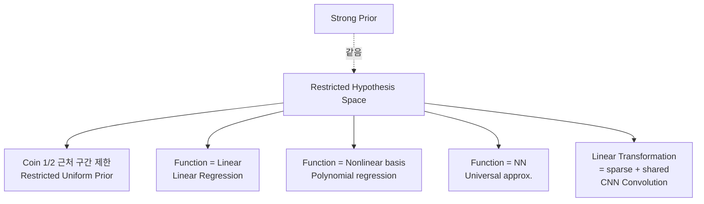

# 14. Hypothesis Space Restriction = MAP — 통합 시각

> **출제 근거**: 6주차 ★10 \"Hypothesis Space Restriction = MAP\", 1주차 ★10 \"Maximum Likelihood + Prior 두 축\"
> **시험 출제 방식**: \"Explain in what sense restricting a hypothesis space is equivalent to imposing a prior. Give an example with linear regression and a coin-flip prior.\"

---

## 1. 왜 시험에 나오는가

- 강의 전체 framework. 1주차에 \"수업의 목표\" 로 명시.
- 6주차 \"Restricted Uniform Prior\" 와 \"Linear Regression as Linear-Restricted MAP\" 직접 출제 가능성.
- 7-9주차 (NN, CNN) 모두 이 시각의 응용.

---

## 2. 핵심 통찰

> **Strong prior = restricted hypothesis space**. 둘은 같은 동전의 양면.

| Prior 강도 | Hypothesis 제한 |
|-----------|----------------|
| Uniform (no prior) | 무제한 (모든 가설) → MLE |
| Mid prior ($M$ 적당) | 일부 제한 → MAP |
| Strong prior ($M\to\infty$) | 한 점 (또는 작은 부분집합) → Strong-MAP |

---

## 3. 사례 1 — Bernoulli Coin (Restricted Uniform Prior)

[03 MAP 일반화](03_MAP_일반화_유도.md) 와 6주차 퀴즈 16-17 의 결합.

### 3.1 \"Restricted Uniform Prior\"

$\theta \in [1/2 - a, 1/2 + a]$ 에서 균등, 그 외 0:

$$
P(\theta) = \begin{cases} \frac{1}{2a} & |\theta - 1/2| \leq a \\ 0 & \text{otherwise} \end{cases}
$$

\"$1/2$ 근처의 $\theta$ 만 허용\" → **hypothesis space 를 구간으로 제한**.

### 3.2 MAP 풀이

$\arg\max_\theta P(\theta\mid D) = \arg\max_\theta \big[ P(D\mid\theta) \cdot P(\theta) \big]$.

$P(\theta) = 0$ 이면 곱이 0 → **outside the interval, posterior = 0**. 즉 후보가 구간 안쪽으로 자동 제한.

#### Case 분석

\"내부 critical point\" $\theta_{ML} = k/n$ 와 boundary $1/2 \pm a$ 비교:

- $|k/n - 1/2| \leq a$: $\theta^* = k/n$ (MLE 가 구간 내) — interior 우세
- $k/n > 1/2 + a$: $\theta^* = 1/2 + a$ (구간 오른쪽 끝)
- $k/n < 1/2 - a$: $\theta^* = 1/2 - a$ (구간 왼쪽 끝)

> 🎯 \"$a$ 가 작을수록 prior 가 강함 → hypothesis 가 1/2 근처에 가둠 → MAP은 boundary 에서 자주 잡힘\".

#### 극한
- $a = 0$: $\theta^* = 1/2$ 고정 → 데이터 무시 (Strong-MAP).
- $a \to \infty$: 사실상 uniform → MLE 복귀.

---

## 4. 사례 2 — Function Hypothesis: Linear Regression

### 4.1 \"Scalar → Function Hypothesis\" 패러다임 (6주차 ★10)

기존 (3주차): hypothesis $\theta \in \mathbb{R}$ — coin 의 한 숫자.
6주차: hypothesis $h : \mathbb{R}^d \to \mathbb{R}$ — **함수**.

이제 prior 는 \"function space 위의 분포\" 가 됨.

### 4.2 Linear restriction

$$
\mathcal{H}_{\text{linear}} = \{ h(\mathbf{x}) = \theta^\top \mathbf{x} \mid \theta \in \mathbb{R}^d \}
$$

→ \"가능한 함수 = 선형 함수만\". 다른 모든 함수의 prior 확률 = 0.

이 안에서 MLE = MSE minimization → [07 Linear Regression](07_LinearReg_ClosedForm.md).

> 💡 **시험 답안 한 줄**: \"Linear regression 은 hypothesis space 를 linear function 으로 제한한 MAP 의 special case\".

### 4.3 Inductive Bias 강도 비교 (7주차 ★10)

| 모델 | Hypothesis space | Prior 강도 |
|------|-----------------|-----------|
| Linear | $\theta^\top\mathbf{x}$ | 매우 강 |
| Nonlinear basis | $\sum_j \theta_j \phi_j(\mathbf{x})$ ($\phi$ 고정) | 강 |
| Parametrized basis | $\sum_j \theta_j \phi_j(\mathbf{x}; \alpha)$ ($\phi$ 도 학습) | 중 |
| 2-layer NN | Universal approximator | 약 |
| Deep NN | + hierarchical | 더 약 |
| Transformer | + permutation-near-invariant | 매우 약 |

→ [15 Inductive Bias 강도](15_Inductive_Bias_강도.md).

---

## 5. 사례 3 — CNN의 \"Linear Transformation Restriction\" (9주차 ★10)

[10 Conv = Linear](10_Conv_Linear_증명.md) 결론:
- 일반 linear transformation: $A \in \mathbb{R}^{m\times n}$, $mn$ 자유 파라미터
- Convolution: $A$ 가 sparse + weight-sharing — 자유도 $K$ 만큼만

→ **Conv = linear transformation hypothesis 위에 추가 제한 → 더 강한 prior**

이 prior 의 의미:
- Sparsity → Locality
- Weight sharing → Translation invariance

> 🎯 9주차 결론: \"Image processing 은 LT 의 restriction\" — 같은 \"strong prior = restricted space\" 시각의 다른 사례.

---

## 6. 통합 다이어그램



---

## 7. 모범 답안 템플릿

```
[Claim]
Imposing a prior P(h) and restricting the hypothesis space H are
two views of the same operation: both put zero (or near-zero)
posterior probability outside a chosen subset of hypotheses.

[Bayesian view]
MAP solves argmax_h P(D | h) P(h). If P(h) is zero outside H₀ ⊂ H,
then the MAP optimum lies inside H₀, regardless of data. So a
\"strong prior\" supported on H₀ is operationally identical to
restricting the search space to H₀.

[Example 1 — restricted uniform prior on a Bernoulli θ]
P(θ) ∝ 1{|θ - 1/2| ≤ a}.
MAP: argmax over [1/2-a, 1/2+a] of θ^k(1-θ)^{n-k}.
- Interior critical point: θ_ML = k/n if |k/n - 1/2| ≤ a.
- Otherwise, boundary: θ* = 1/2 + a (resp. 1/2 - a) when k/n > (resp. <) the interval.
As a → 0, θ* → 1/2: data is ignored ("Strong-MAP").
As a → ∞, θ* → k/n: prior vanishes ("MLE").

[Example 2 — linear regression]
The linear hypothesis class
   H_lin = { h(x) = θᵀx : θ ∈ R^d }
puts zero prior on all non-linear functions. MAP within H_lin
becomes MLE within H_lin, which under Gaussian likelihood becomes
ordinary least squares with closed form (XᵀX)^{-1} Xᵀ y.

[Example 3 — convolution as linear-transformation restriction]
Among all linear maps R^n → R^m, CNNs only allow those whose matrix
is sparse (locality) and weight-shared across rows (translation
equivariance). This corresponds to a delta-prior on the linear-map
parameters: most matrices have zero prior; only Toeplitz-like
matrices have non-zero prior.

[Conclusion]
"Stronger prior ↔ smaller hypothesis space ↔ stronger inductive bias."
This is the unifying lens of the course: MLE/MAP, basis functions,
deep nets, and CNNs are all instances of choosing how restrictive
to be in hypothesis space.
```

---

## 8. 자주 틀리는 함정

1. **\"prior 가 hypothesis space 를 만든다\" 라고 답함** — 정확히는 \"prior 가 hypothesis 일부에 0 확률을 줘서 effective space 를 줄인다\".
2. **사례 누락**: 추상적 답만 적으면 점수 적음. **3가지 사례** (coin restricted uniform / linear regression / CNN) 중 최소 둘.
3. **MLE = uniform-prior MAP 와 헷갈림**: 두 시각이 \"prior 강도\" 라는 한 spectrum 위에 있음을 보여야.

---

## 9. 연결 개념

- ← [01-03] 베이즈, MLE, MAP
- ← [07 Linear Regression](07_LinearReg_ClosedForm.md)
- ← [10 Conv = Linear](10_Conv_Linear_증명.md)
- → [15 Inductive Bias 강도 비교](15_Inductive_Bias_강도.md)
