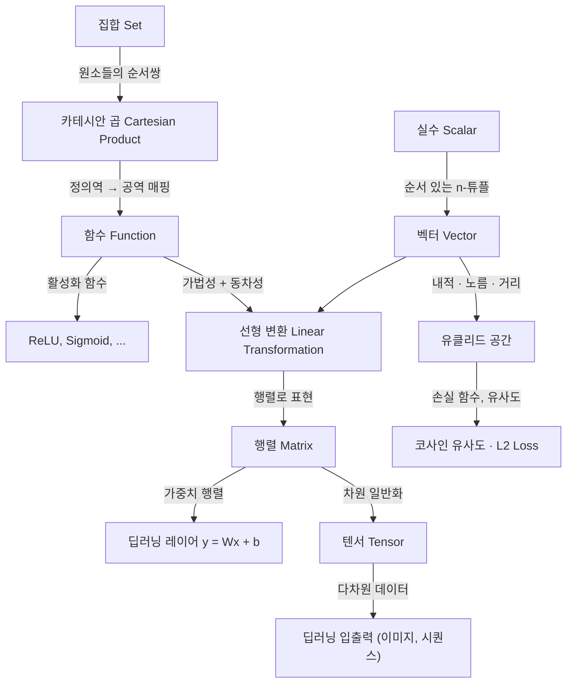

# 벡터, 함수, 집합 -- 딥러닝을 위한 수학 기초

> 교안: Sungyoon Lee, Deep Learning (slides 24-31)

---

## 1. 선행 개념 연결 다이어그램



---

## 2. 개념별 5단계 설명

---

### A. 집합 (Set)

> **슬라이드 정의**: An unordered collection of distinct **objects**, called elements.
> 카테시안 곱: $A \times B := \{(a, b) : a \in A, b \in B\}$

#### 1) 초등 -- 일상 비유

집합은 **가방**이다. 가방 안에 사과, 바나나, 딸기를 넣으면 {사과, 바나나, 딸기}. 순서는 상관없고, 같은 과일을 두 번 넣어도 하나로 친다.

"이걸 배우면 ChatGPT가 단어들을 어떻게 묶어서 관리하는지 이해할 수 있어."

#### 2) 중등 -- 간단한 수식

$A = \{1, 2, 3\}$, $B = \{x, y\}$일 때 카테시안 곱은:

$$A \times B = \{(1,x),(1,y),(2,x),(2,y),(3,x),(3,y)\}$$

이 수식이 말하는 것은 단순히 "A에서 하나, B에서 하나를 골라 짝짓는 모든 경우"이다.

- 원소 개수: $|A \times B| = |A| \cdot |B| = 6$

#### 3) 고등 -- 수학적 정의

**정의**: 집합 $S$는 원소 판별 함수 $\mathbf{1}_{x \in S}$가 잘 정의된 대상들의 모임이다.

**성질**:
- 교환법칙 없음: $A \times B \neq B \times A$ (순서쌍의 순서가 다르므로)
- $A \times (B \cup C) = (A \times B) \cup (A \times C)$

#### 4) 대학 -- 선형대수 기반

카테시안 곱은 함수의 **정의역**과 **공역**을 구성한다. 딥러닝에서 입력 공간 $\mathbb{R}^n$은 사실 $\mathbb{R} \times \mathbb{R} \times \cdots \times \mathbb{R}$ ($n$번)이다.

```python
import itertools
A = {1, 2, 3}
B = {'x', 'y'}
cartesian = set(itertools.product(A, B))
# {(1,'x'), (1,'y'), (2,'x'), (2,'y'), (3,'x'), (3,'y')}
```

#### 5) 대학원 -- 연구 관점

**연구 포인트**: 딥러닝의 입력 공간은 보통 $\mathbb{R}^n$의 부분집합(manifold)으로 가정한다. Manifold hypothesis는 고차원 데이터가 실제로 저차원 매니폴드 위에 놓여 있다는 것이다. 집합론적 기반 위에 위상(topology)을 부여해야 연속성과 수렴을 논할 수 있다.

- **오개념 경고**: "집합에 순서가 있다"고 이해하면 틀립니다. 집합 자체는 비순서(unordered)이며, 순서가 필요하면 순서쌍(tuple)이나 수열(sequence)을 써야 합니다.
- **설명하기 훈련**: "지금 배운 것을 초등학생에게 설명한다면?" -- "집합은 중복 없이 물건을 모아놓은 가방이야. 가방 안에서 물건 순서는 중요하지 않아."
- **성취 확인**: 당신은 이제 집합, 원소, 카테시안 곱의 정의를 설명할 수 있습니다.

---

### B. 함수 (Function)

> **슬라이드 정의**: An **assignment** of exactly one element of $B$ to each element of $A$.
> $f : A \to B$, $a \mapsto f(a)$
> 단사(one-to-one): $a \neq a' \to f(a) \neq f(a')$
> 지시 함수: $\mathbf{1}(p) = \begin{cases} 1 & \text{if } p \text{ is true} \\ 0 & \text{if } p \text{ is false} \end{cases}$
> 주석: function ~ algorithm, "Two-to-two" function may be a better name for injection.

#### 1) 초등 -- 일상 비유

함수는 **자판기**다. 동전(입력)을 넣으면 반드시 음료(출력) 하나가 나온다. 같은 동전을 넣으면 항상 같은 음료가 나온다. 하나의 동전에서 두 개의 음료가 동시에 나올 수는 없다.

"이걸 배우면 뉴럴 네트워크가 입력을 출력으로 바꾸는 과정을 이해할 수 있어."

#### 2) 중등 -- 구체적 예시

$A = \{1,2,3\}$, $B = \{a,b,c,d\}$이고 $f(1) = a,\; f(2) = b,\; f(3) = d$라 하자.

이 수식이 말하는 것은 단순히 "A의 모든 원소가 B의 딱 하나의 원소와 짝지어진다"는 것이다.

**단사(one-to-one)**: 서로 다른 입력이 서로 다른 출력을 낳는 함수. $1 \neq 2$이면 $f(1) \neq f(2)$.

**지시 함수 예시**: "오늘 비가 온다"가 참이면 $\mathbf{1}(\text{비}) = 1$, 거짓이면 $0$.

#### 3) 고등 -- 수학적 표현

**정의**: $f : A \to B$는 $A \times B$의 부분집합 $G_f$로서, 모든 $a \in A$에 대해 $(a, b) \in G_f$인 $b$가 **유일**하게 존재한다.

**단사의 대우**: $f(a) = f(a') \Rightarrow a = a'$

**핵심**: 함수는 "모든 입력에 대해 출력이 존재하고 유일"해야 한다. 이것이 함수와 관계(relation)의 차이다.

#### 4) 대학 -- 선형대수/딥러닝 연결

딥러닝의 각 레이어는 함수다: $f_\ell : \mathbb{R}^{n_{\ell-1}} \to \mathbb{R}^{n_\ell}$. 전체 네트워크는 함수의 합성:

$$f = f_L \circ f_{L-1} \circ \cdots \circ f_1$$

```python
import numpy as np

# 지시 함수 (indicator function)
def indicator(p: bool) -> int:
    return 1 if p else 0

# 단사 확인
def is_injective(f: dict) -> bool:
    return len(f.values()) == len(set(f.values()))

f = {1: 'a', 2: 'b', 3: 'd'}
print(is_injective(f))  # True
```

#### 5) 대학원 -- 논문 수준

**연구 포인트**: Universal Approximation Theorem은 충분히 넓은 단일 히든 레이어 네트워크가 임의의 연속 함수를 근사할 수 있음을 보장한다. 그러나 "근사 가능"과 "학습 가능"은 다르다. 단사 함수(injection)의 개념은 invertible neural network(normalizing flows)의 이론적 기반이다 -- 입출력 간 일대일 대응이 보장되어야 역변환이 가능하다.

- **오개념 경고**: "함수는 수식이다"라고 이해하면 틀립니다. 함수는 **매핑 규칙**이며, 수식 없이 테이블이나 그래프로도 정의됩니다. 딥러닝의 학습된 가중치도 하나의 함수를 정의합니다.
- **설명하기 훈련**: "지금 배운 것을 초등학생에게 설명한다면?" -- "함수는 규칙이야. 뭘 넣으면 반드시 하나만 나와. 자판기처럼!"
- **성취 확인**: 당신은 이제 함수, 단사, 지시 함수를 정의하고 딥러닝 레이어와 연결지을 수 있습니다.

---

### C. 스칼라 (Scalar)

> **슬라이드 정의**: A real number $s \in \mathbb{R}$. addition, multiplication (nonzero element has a multiplicative inverse)

#### 1) 초등 -- 일상 비유

스칼라는 **온도계의 숫자** 하나다. "오늘 기온 25도"에서 25가 스칼라. 방향이 없고, 크기만 있다.

"이걸 배우면 AI가 학습할 때 사용하는 학습률(learning rate)이 뭔지 이해할 수 있어."

#### 2) 중등 -- 간단한 수식

스칼라의 연산: $3 + 5 = 8$, $3 \times 5 = 15$, $5$의 곱셈 역원은 $\frac{1}{5}$.

이 수식이 말하는 것은 단순히 "실수는 사칙연산이 자유롭고, 0이 아닌 수는 나눌 수 있다"는 것이다.

#### 3) 고등 -- 수학적 표현

$(\mathbb{R}, +, \times)$는 **체(field)**를 이룬다:
- 덧셈 항등원: $0$, 곱셈 항등원: $1$
- $\forall s \neq 0,\; \exists s^{-1}$ s.t. $s \cdot s^{-1} = 1$

#### 4) 대학 -- 선형대수 기반

스칼라는 벡터 공간의 **계수(coefficient)** 역할을 한다. 스칼라곱 $s\mathbf{v}$는 벡터의 크기를 조절한다.

```python
import numpy as np
s = 0.01  # learning rate (스칼라)
gradient = np.array([2.0, -1.0, 0.5])
update = s * gradient  # 스칼라 * 벡터
# array([0.02, -0.01, 0.005])
```

#### 5) 대학원 -- 연구 관점

**연구 포인트**: 딥러닝에서 스칼라는 loss 값, learning rate, temperature (softmax scaling) 등에 등장한다. Mixed-precision training에서는 $\mathbb{R}$이 아닌 float16/bfloat16 체계를 사용하며, 이는 체(field)의 공리를 정확히 만족하지 않는다(overflow, underflow, 정밀도 손실).

- **오개념 경고**: "스칼라는 그냥 숫자다"라고 이해하면 부족합니다. 스칼라는 "벡터 공간 위의 체의 원소"라는 대수적 역할이 핵심입니다.
- **설명하기 훈련**: "지금 배운 것을 초등학생에게 설명한다면?" -- "스칼라는 크기만 알려주는 숫자야. 온도계에서 보이는 숫자처럼!"
- **성취 확인**: 당신은 이제 스칼라가 체의 원소이며 벡터의 크기를 조절하는 역할임을 설명할 수 있습니다.

---

### D. 벡터 (Vector)

> **슬라이드 정의**: An ordered tuple of real numbers.
> $v = [v_1, v_2, \cdots, v_n]^\top \in \mathbb{R}^n$
> 유클리드 공간: $\mathbb{R}^n \subset$ i.p.sp. $\subset$ n.sp. $\subset$ v.sp. $\cap$ m.sp.
> **내적**: $\langle v, w \rangle = v_1 w_1 + v_2 w_2 + \cdots + v_n w_n$ (유사도 측정, $v \perp w$ iff $\langle v, w \rangle = 0$)
> **노름**: $\|v\| = \sqrt{\langle v, v \rangle}$
> **거리**: $d(v, w) = \|v - w\|$ ($\|v - w\|^2 = \|v\|^2 + \|w\|^2 - 2\langle v, w \rangle$)
> **벡터 연산**: $v + w$, $sv$

#### 1) 초등 -- 일상 비유

벡터는 **레시피**다. 케이크를 만들 때 (밀가루 200g, 설탕 100g, 달걀 3개) = $[200, 100, 3]$. 숫자의 **순서**가 중요하다 -- 밀가루와 설탕을 바꾸면 다른 레시피가 된다.

두 레시피가 비슷한지 비교하는 것이 **내적**이다. 레시피 간 차이를 측정하는 것이 **거리**다.

"이걸 배우면 ChatGPT가 단어를 숫자 리스트로 바꿔서 의미를 비교하는 원리를 이해할 수 있어."

#### 2) 중등 -- 구체적 숫자 예시

$v = [1, 2, 3]^\top$, $w = [4, 5, 6]^\top$ 일 때:

$$\langle v, w \rangle = 1 \times 4 + 2 \times 5 + 3 \times 6 = 4 + 10 + 18 = 32$$

이 수식이 말하는 것은 단순히 "같은 위치끼리 곱해서 전부 더한다"이다.

$$\|v\| = \sqrt{1^2 + 2^2 + 3^2} = \sqrt{14} \approx 3.74$$

$$d(v, w) = \|v - w\| = \|[-3, -3, -3]^\top\| = \sqrt{27} \approx 5.20$$

**벡터 덧셈**: $v + w = [5, 7, 9]^\top$
**스칼라곱**: $2v = [2, 4, 6]^\top$

#### 3) 고등 -- 수학적 표현

**정의**: $\mathbb{R}^n$은 $n$개의 실수로 이루어진 순서 $n$-튜플의 집합이다.

**내적의 성질**:
- 대칭: $\langle v, w \rangle = \langle w, v \rangle$
- 선형: $\langle av + bu, w \rangle = a\langle v, w \rangle + b\langle u, w \rangle$
- 양정치: $\langle v, v \rangle \geq 0$, 등호는 $v = \mathbf{0}$일 때만

**거리 공식 유도** (슬라이드 각주 9):
$$\|v - w\|^2 = \langle v - w, v - w \rangle = \|v\|^2 + \|w\|^2 - 2\langle v, w \rangle$$

**핵심**: 거리와 내적은 반비례 관계 -- 내적이 클수록(유사할수록) 거리가 줄어든다.

**공간 계층** (슬라이드): metric space $\supset$ vector space $\supset$ normed space $\supset$ inner product space $\supset$ Euclidean space ($\mathbb{R}^n$)

#### 4) 대학 -- 선형대수/딥러닝 연결

```python
import numpy as np

v = np.array([1, 2, 3], dtype=np.float64)
w = np.array([4, 5, 6], dtype=np.float64)

# 내적
inner = np.dot(v, w)          # 32.0

# 노름
norm_v = np.linalg.norm(v)    # 3.7416...

# 거리
dist = np.linalg.norm(v - w)  # 5.1961...

# 직교 확인
u = np.array([1, 0, -1/3])
print(np.dot(v, u))  # ≈ 0 이면 직교

# 코사인 유사도 (딥러닝에서 임베딩 비교)
cosine_sim = np.dot(v, w) / (np.linalg.norm(v) * np.linalg.norm(w))
```

**핵심**: Word2Vec, Sentence-BERT 등의 임베딩 모델은 의미가 비슷한 단어/문장을 내적이 큰(코사인 유사도가 높은) 벡터로 매핑한다.

#### 5) 대학원 -- 논문 수준

**연구 포인트**:
- 고차원 벡터에서는 curse of dimensionality로 인해 모든 점 쌍의 거리가 비슷해진다. 이를 극복하기 위해 차원 축소(PCA, t-SNE, UMAP) 또는 구조적 가정(sparsity, manifold)을 도입한다.
- Transformer의 attention score는 query-key 벡터의 내적 $\langle q, k \rangle / \sqrt{d_k}$이다.
- $\|v - w\|^2 = \|v\|^2 + \|w\|^2 - 2\langle v, w \rangle$ 공식은 contrastive loss의 수학적 기반이다.

- **오개념 경고**: "벡터는 화살표다"라고만 이해하면 틀립니다. 기하학적 화살표는 $\mathbb{R}^2, \mathbb{R}^3$에서의 시각화일 뿐, 벡터는 덧셈과 스칼라곱이 정의된 추상적 대상입니다. 768차원 단어 임베딩도 벡터입니다.
- **설명하기 훈련**: "지금 배운 것을 초등학생에게 설명한다면?" -- "벡터는 숫자가 줄지어 있는 리스트야. 내적은 두 리스트가 얼마나 비슷한지 점수를 매기는 거야."
- **성취 확인**: 당신은 이제 벡터, 내적, 노름, 거리의 정의와 관계를 설명하고, 딥러닝의 임베딩/유사도와 연결지을 수 있습니다.

---

### E. 선형 변환 (Linear Transformation)

> **슬라이드 정의**: $L : v \in \mathbb{R}^n \mapsto L(v) \in \mathbb{R}^m$ s.t.
> $L(v + u) = L(v) + L(u)$ (가법성, additivity)
> $L(av) = aL(v)$ (동차성, homogeneity)
> for any $u, v \in \mathbb{R}^n$ and $a \in \mathbb{R}$.
> 주석: linear vs. affine

#### 1) 초등 -- 일상 비유

선형 변환은 **배율 복사기**다. 원본 문서의 글자 크기를 2배로 키우면, 모든 글자가 똑같이 2배가 된다. 두 장을 겹치고 복사하면, 각각 복사한 것을 겹친 것과 같다.

"이걸 배우면 뉴럴 네트워크의 핵심 연산이 왜 '행렬 곱셈'인지 이해할 수 있어."

#### 2) 중등 -- 구체적 예시

$L$이 "모든 원소를 2배로 만드는 변환"이라 하자.

- $v = [1, 3]^\top \Rightarrow L(v) = [2, 6]^\top$
- $w = [2, 1]^\top \Rightarrow L(w) = [4, 2]^\top$
- $v + w = [3, 4]^\top \Rightarrow L(v+w) = [6, 8]^\top = L(v) + L(w)$. 성립!
- $3v = [3, 9]^\top \Rightarrow L(3v) = [6, 18]^\top = 3 \times [2, 6]^\top = 3L(v)$. 성립!

이 수식이 말하는 것은 단순히 "더한 다음 변환하나, 변환한 다음 더하나 결과가 같다"는 것이다.

#### 3) 고등 -- 수학적 표현

**정의**: $L : \mathbb{R}^n \to \mathbb{R}^m$이 선형이란 것은 다음 두 조건을 만족한다는 것이다:

1. **가법성**: $L(v + u) = L(v) + L(u)$
2. **동차성**: $L(av) = aL(v)$

합쳐서: $L(\alpha v + \beta u) = \alpha L(v) + \beta L(u)$ (중첩 원리, superposition principle)

**주의**: $L(v) = 2v + 1$은 선형이 아니다 (affine). $L(\mathbf{0}) = 1 \neq \mathbf{0}$이므로.

#### 4) 대학 -- 선형대수 기반

모든 선형 변환은 행렬로 표현되고, 모든 행렬은 선형 변환을 정의한다 (다음 섹션에서 증명).

```python
import numpy as np

# 선형 변환 예: 90도 회전
theta = np.pi / 2
L = np.array([[np.cos(theta), -np.sin(theta)],
              [np.sin(theta),  np.cos(theta)]])

v = np.array([1, 0])
print(L @ v)  # [0, 1] -- 90도 회전됨

# 선형성 검증
u = np.array([0, 1])
assert np.allclose(L @ (v + u), L @ v + L @ u)   # 가법성
assert np.allclose(L @ (3 * v), 3 * (L @ v))     # 동차성
```

**핵심**: 딥러닝의 `nn.Linear(in_features, out_features)`는 정확히 $L(v) = Wv$ (bias 없을 때)다. bias를 더하면 **affine** 변환이 된다.

#### 5) 대학원 -- 논문 수준

**연구 포인트**:
- 선형 변환만으로는 XOR 문제도 풀 수 없다. 비선형 활성화 함수가 필수적인 이유.
- 그러나 Transformer의 핵심 연산(Q, K, V projection)은 선형 변환이다. 비선형성은 softmax와 FFN에서 온다.
- Linear vs. Affine: $y = Wx + b$에서 $b \neq 0$이면 affine. 딥러닝에서는 관례적으로 "linear layer"라 부르지만 수학적으로는 affine이다.

- **오개념 경고**: "$y = 2x + 3$이 선형 함수다"라고 이해하면 틀립니다. 수학에서 선형 변환은 반드시 $L(\mathbf{0}) = \mathbf{0}$을 만족해야 합니다. $+3$ 때문에 이것은 affine 변환입니다.
- **설명하기 훈련**: "지금 배운 것을 초등학생에게 설명한다면?" -- "선형 변환은 공정한 기계야. 두 개를 합쳐서 넣든, 따로 넣고 결과를 합치든, 답이 같아."
- **성취 확인**: 당신은 이제 선형 변환의 두 조건(가법성, 동차성)과 linear vs. affine의 차이를 설명할 수 있습니다.

---

### F. 행렬 (Matrix)

> **슬라이드 정의**: A representation of linear transformation (function).
> 선형 변환 $L : \mathbb{R}^n \to \mathbb{R}^m$의 행렬 표현:
> $A_L := [L(e_1) \quad L(e_2) \quad \cdots \quad L(e_n)]$ (각 열은 기저 벡터의 상)
> $A_L \in \mathbb{R}^{m \times n}$이고 $L_A : v \mapsto Av$
> 일대일 대응: $A \mapsto L_A \mapsto A_{L_A} = A$ 그리고 $L \mapsto A_L \mapsto L_{A_L} = L$
> 각주: $e_i^\top A$는 $A$의 $i$번째 행.
> **연습 문제**: $A = \begin{bmatrix} 1 & 1 & 1 \\ 1 & 2 & 3 \end{bmatrix}$에서 $Ae_1, Ae_2, Ae_3$은?
> $\mathbb{R}^3 \to \mathbb{R}^2$인 선형 변환이 $e_1, e_2, e_3$을 $[1,1]^\top, [1,2]^\top, [1,3]^\top$으로 보낼 때 행렬은?

#### 1) 초등 -- 일상 비유

행렬은 **변환 레시피 모음**이다. "빨간 물감 → 주황, 파란 물감 → 초록, 노란 물감 → 보라"라는 규칙을 표로 정리한 것이 행렬이다.

"이걸 배우면 AI가 이미지를 인식할 때 내부에서 무슨 계산을 하는지 이해할 수 있어."

#### 2) 중등 -- 구체적 예시

$A = \begin{bmatrix} 1 & 1 & 1 \\ 1 & 2 & 3 \end{bmatrix}$일 때:

$$Ae_1 = A \begin{bmatrix} 1 \\ 0 \\ 0 \end{bmatrix} = \begin{bmatrix} 1 \\ 1 \end{bmatrix}, \quad
Ae_2 = \begin{bmatrix} 1 \\ 2 \end{bmatrix}, \quad
Ae_3 = \begin{bmatrix} 1 \\ 3 \end{bmatrix}$$

이 수식이 말하는 것은 단순히 "행렬의 $j$번째 열이 곧 $e_j$를 변환한 결과"라는 것이다.

역으로, $e_1 \mapsto [1,1]^\top$, $e_2 \mapsto [1,2]^\top$, $e_3 \mapsto [1,3]^\top$이면 이들을 열로 나열한 $A = \begin{bmatrix} 1 & 1 & 1 \\ 1 & 2 & 3 \end{bmatrix}$가 해당 행렬이다.

#### 3) 고등 -- 수학적 표현

**핵심 정리**: 선형 변환과 행렬은 일대일 대응한다.

**증명 스케치**: 임의의 $v = \sum_{i=1}^n v_i e_i$에 대해 선형성으로부터:
$$L(v) = \sum_{i=1}^n v_i L(e_i) = A_L v$$

따라서 $L$은 기저 벡터의 상 $\{L(e_1), \ldots, L(e_n)\}$에 의해 완전히 결정된다.

#### 4) 대학 -- 선형대수/딥러닝 연결

```python
import numpy as np

A = np.array([[1, 1, 1],
              [1, 2, 3]])  # 2x3 행렬: R^3 -> R^2

# 기저 벡터에 대한 변환
e1, e2, e3 = np.eye(3)
print(A @ e1)  # [1, 1]
print(A @ e2)  # [1, 2]
print(A @ e3)  # [1, 3]

# 임의 벡터 변환
v = np.array([2, 3, 1])
print(A @ v)  # [2*1+3*1+1*1, 2*1+3*2+1*3] = [6, 11]

# i번째 행 추출 (슬라이드 각주: e_i^T A는 i번째 행)
print(e1[:2] @ A)  # 에러 -- e_i는 R^m의 기저여야 함
e1_m = np.array([1, 0])
print(e1_m @ A)  # [1, 1, 1] -- 첫 번째 행
```

**핵심**: `nn.Linear(3, 2)`의 weight은 $2 \times 3$ 행렬이다. `forward(x)`는 $Ax$를 계산한다.

#### 5) 대학원 -- 논문 수준

**연구 포인트**:
- 행렬 분해(SVD, eigendecomposition)는 모델 압축(LoRA)의 기반이다. LoRA는 $W = W_0 + BA$로 저랭크 행렬 $B \in \mathbb{R}^{m \times r}$, $A \in \mathbb{R}^{r \times n}$ ($r \ll \min(m,n)$)만 학습한다.
- Attention 행렬 $\text{softmax}(QK^\top / \sqrt{d_k})$는 $n \times n$ 행렬로, 시퀀스 길이에 대해 $O(n^2)$ 메모리/연산이 필요하다. 이를 줄이기 위한 sparse/linear attention 연구가 활발하다.

- **오개념 경고**: "행렬은 숫자를 사각형으로 배열한 것이다"라고만 이해하면 틀립니다. 행렬의 본질은 **선형 변환의 표현**입니다. 숫자 배열은 표현 형식일 뿐이며, 각 열은 기저 벡터가 어디로 가는지를 나타냅니다.
- **설명하기 훈련**: "지금 배운 것을 초등학생에게 설명한다면?" -- "행렬은 변환 규칙표야. 기본 재료 각각이 어떻게 바뀌는지 적어놓으면, 아무 재료 조합이든 결과를 알 수 있어."
- **성취 확인**: 당신은 이제 행렬이 선형 변환을 표현하는 방식, 열과 기저 벡터의 관계, 행렬-벡터 곱의 의미를 설명할 수 있습니다.

---

### G. 텐서 (Tensor)

> **슬라이드 정의**: A generalized matrix.
> $T \in \mathbb{R}^{m \times n \times p}$ (3차원), $T \in \mathbb{R}^{m_1 \times m_2 \times \cdots \times m_n}$ (일반)
> "All of machine learning" = Matrix multiplication (슬라이드 일러스트)

#### 1) 초등 -- 일상 비유

스칼라는 **점** 하나, 벡터는 **줄** 하나, 행렬은 **표** 하나, 텐서는 **상자**(표 여러 장을 쌓은 것)다.

컬러 사진을 생각해보자: 가로 x 세로 x 색상(RGB 3장) = 3차원 텐서.

"이걸 배우면 AI에 이미지를 넣을 때 데이터 형태가 왜 (배치, 채널, 높이, 너비)인지 이해할 수 있어."

#### 2) 중등 -- 구체적 예시

- 스칼라: $5$ (차원 0)
- 벡터: $[1, 2, 3]$ (차원 1)
- 행렬: $\begin{bmatrix} 1 & 2 \\ 3 & 4 \end{bmatrix}$ (차원 2: 2x2)
- 텐서: 2x2 행렬 3장을 쌓으면 2x2x3 텐서 (차원 3)

이 개념이 말하는 것은 단순히 "차원을 계속 늘려갈 수 있다"는 것이다.

#### 3) 고등 -- 수학적 표현

**정의**: $k$차 텐서는 $\mathbb{R}^{m_1 \times m_2 \times \cdots \times m_k}$의 원소이다.

| 차수 | 이름 | 예시 |
|------|------|------|
| 0 | 스칼라 | loss 값 |
| 1 | 벡터 | 단어 임베딩 |
| 2 | 행렬 | 가중치 $W$ |
| 3 | 3차 텐서 | 이미지 배치(RGB) |
| 4 | 4차 텐서 | 비디오(시간+RGB+높이+너비) |

#### 4) 대학 -- 선형대수/딥러닝 연결

```python
import torch

scalar = torch.tensor(3.14)          # 0차: shape ()
vector = torch.tensor([1, 2, 3])     # 1차: shape (3,)
matrix = torch.randn(2, 3)           # 2차: shape (2, 3)
tensor3 = torch.randn(4, 3, 224, 224)  # 4차: 배치4, 채널3, 높이224, 너비224

print(scalar.dim(), vector.dim(), matrix.dim(), tensor3.dim())
# 0, 1, 2, 4
```

**핵심**: PyTorch/TensorFlow의 이름 자체가 "Tensor"인 이유 -- 모든 데이터와 파라미터가 텐서로 표현된다.

#### 5) 대학원 -- 논문 수준

**연구 포인트**:
- 텐서 분해(Tucker decomposition, CP decomposition)는 모델 압축과 지식 증류에 활용된다.
- Einsum notation (`torch.einsum`)은 텐서 연산을 일반적으로 표현하는 방법이며, attention 구현에서 자주 사용된다.
- 슬라이드의 "All of machine learning = Matrix multiplication" 그림은 과장이 아니다. GPU가 빠른 이유도 행렬/텐서 곱셈(GEMM)에 최적화되어 있기 때문이다.

- **오개념 경고**: "텐서는 다차원 배열이다"라고만 이해하면 부족합니다. 수학적 텐서는 좌표 변환에 대한 특정 변환 규칙을 따르는 대상입니다. 다만 딥러닝에서는 "다차원 배열"의 의미로 사용하는 것이 관례입니다.
- **설명하기 훈련**: "지금 배운 것을 초등학생에게 설명한다면?" -- "숫자 하나는 점, 숫자 줄은 벡터, 숫자 표는 행렬, 표를 여러 장 쌓으면 텐서야."
- **성취 확인**: 당신은 이제 텐서의 차수 개념과 딥러닝 데이터 표현에서의 역할을 설명할 수 있습니다.

---

### H. 그리스 문자 (Greek Alphabets)

> 슬라이드 39: 딥러닝 논문에서 빈번히 등장하는 그리스 문자 표

| 기호 | 이름 | 딥러닝에서의 대표 용법 |
|------|------|----------------------|
| $\alpha$ (alpha) | 알파 | learning rate, 혼합 계수 |
| $\beta$ (beta) | 베타 | momentum 계수, Adam $\beta_1, \beta_2$ |
| $\gamma$ (gamma) | 감마 | discount factor (RL), BatchNorm scale |
| $\delta$ (delta) | 델타 | 변화량, 그래디언트 차이 |
| $\epsilon$ (epsilon) | 엡실론 | 아주 작은 수(수치 안정성), $\epsilon$-greedy |
| $\theta$ (theta) | 세타 | 모델 파라미터 전체 $\theta$ |
| $\lambda$ (lambda) | 람다 | 정규화 계수, eigenvalue |
| $\mu$ (mu) | 뮤 | 평균 |
| $\sigma$ (sigma) | 시그마 | 표준편차, sigmoid 함수 |
| $\phi, \varphi$ (phi) | 파이 | 모델 파라미터 (보통 보조 네트워크) |
| $\psi$ (psi) | 프사이 | 또 다른 파라미터 집합 |
| $\omega, \Omega$ (omega) | 오메가 | 가중치, 샘플 공간 |
| $\pi, \Pi$ (pi) | 파이 | 정책 (RL), 곱 연산 |
| $\Sigma$ (대문자 시그마) | 시그마 | 합 연산 $\sum$, 공분산 행렬 |

- **오개념 경고**: $\epsilon$과 $\varepsilon$은 같은 문자(epsilon)입니다. 논문마다 표기가 다를 수 있으니 혼동하지 마세요.
- **성취 확인**: 당신은 이제 딥러닝 논문에서 그리스 문자를 만났을 때 의미를 추론할 수 있습니다.

---

## 3. 수학-딥러닝 연결 지점 요약표

| 수학 개념 | 딥러닝 응용 | 왜 필요한가 |
|-----------|------------|------------|
| 집합 (Set) | 데이터셋, vocabulary, label space | 입력/출력 공간의 정의 |
| 카테시안 곱 | 입력-출력 쌍 $(x, y)$, 배치 구성 | 학습 데이터의 구조 |
| 함수 | 네트워크 $f_\theta(x)$, 활성화 함수, 손실 함수 | 모든 연산의 기본 단위 |
| 단사 함수 | Invertible networks (Normalizing Flows) | 역변환이 필요한 생성 모델 |
| 지시 함수 $\mathbf{1}(\cdot)$ | 마스킹, one-hot encoding, 조건부 연산 | 조건 분기 없이 미분 가능한 선택 |
| 스칼라 | learning rate, loss 값, temperature | 하이퍼파라미터 및 스칼라 출력 |
| 벡터 | 임베딩, hidden state, gradient | 데이터와 파라미터의 기본 표현 |
| 내적 | attention score, 코사인 유사도 | 유사도 측정의 핵심 연산 |
| 노름 | weight decay ($\|\|w\|\|^2$), gradient clipping | 크기 제어, 정규화 |
| 거리 | L2 loss, 클러스터링, k-NN | 오차 측정, 유사도의 역 |
| 선형 변환 | `nn.Linear`, projection (Q, K, V) | 차원 변환, 특성 추출 |
| 행렬 | 가중치 $W$, attention 행렬 | 선형 변환의 계산 가능한 표현 |
| 텐서 | 이미지 배치, 비디오, 모든 `torch.Tensor` | 다차원 데이터의 통합 표현 |

---

## 4. 핵심 킬러 요약

**한 줄 결론**: 딥러닝은 벡터를 입력받아 행렬(선형 변환)과 비선형 함수를 반복 적용하여 원하는 출력 벡터를 만드는 과정이다.

**쉽게 설명하면**: 데이터를 숫자 리스트(벡터)로 바꾸고, 변환 규칙표(행렬)로 계속 변환하면서, 중간중간 비선형 필터를 끼워넣는 것이 딥러닝이다.

**남에게 설명하는 한 문장**: "AI가 배우는 것은 결국 입력 벡터를 출력 벡터로 바꾸는 최적의 행렬(가중치)을 찾는 것입니다."

**핵심 정리**:
1. **집합** → 데이터의 정의역/공역을 규정
2. **함수** → 입출력 매핑의 추상화, 딥러닝 레이어의 본질
3. **벡터** → 데이터 표현의 기본 단위, 내적으로 유사도 측정
4. **선형 변환** → 가법성 + 동차성을 만족하는 "공정한" 변환
5. **행렬** → 선형 변환의 계산 가능한 표현, 기저 벡터의 상이 열
6. **텐서** → 모든 것을 일반화한 다차원 배열

---

## 5. 단계별 오개념 교정 카드 모음

### 카드 1: 집합의 순서
| | |
|---|---|
| **틀린 이해** | 집합 {1, 2, 3}에서 1이 첫 번째, 2가 두 번째 |
| **바른 이해** | 집합은 순서가 없다. {3, 1, 2} = {1, 2, 3}. 순서가 필요하면 벡터(튜플)를 써야 한다 |
| **왜 중요한가** | 벡터는 ordered tuple이므로 $[1,2,3] \neq [3,1,2]$. 이 차이가 딥러닝 입력 구조의 핵심 |

### 카드 2: 함수 = 수식?
| | |
|---|---|
| **틀린 이해** | 함수는 $f(x) = 2x + 1$ 같은 수식이다 |
| **바른 이해** | 함수는 매핑 규칙이다. 테이블, 그래프, 학습된 가중치 모두 함수를 정의한다 |
| **왜 중요한가** | 뉴럴 네트워크는 수식으로 쓸 수 없는 복잡한 함수를 데이터로부터 학습한다 |

### 카드 3: 선형 = 직선?
| | |
|---|---|
| **틀린 이해** | 선형 변환은 그래프가 직선인 함수다 ($y = ax + b$) |
| **바른 이해** | 선형 변환은 $L(\mathbf{0}) = \mathbf{0}$이고 가법성+동차성을 만족하는 함수다. $y = ax + b$ ($b \neq 0$)는 affine이다 |
| **왜 중요한가** | `nn.Linear`의 이름에 속지 말 것. bias가 있으면 affine이다. 이 구분이 수학적 증명에서 중요하다 |

### 카드 4: 벡터 = 화살표?
| | |
|---|---|
| **틀린 이해** | 벡터는 방향과 크기를 가진 화살표다 |
| **바른 이해** | 화살표는 $\mathbb{R}^2, \mathbb{R}^3$에서의 시각화일 뿐. 벡터는 덧셈과 스칼라곱이 정의된 추상 대상이다 |
| **왜 중요한가** | 768차원 단어 임베딩에 화살표를 그릴 수 없지만, 내적과 거리는 정의된다 |

### 카드 5: 행렬 = 숫자 표?
| | |
|---|---|
| **틀린 이해** | 행렬은 숫자를 직사각형으로 배열한 것이다 |
| **바른 이해** | 행렬의 본질은 선형 변환의 표현이다. 각 열은 기저 벡터가 어디로 가는지 나타낸다 |
| **왜 중요한가** | 이 관점이 있어야 SVD, eigendecomposition, LoRA 등 행렬 분해 기법의 의미를 이해할 수 있다 |

### 카드 6: 텐서 = 다차원 배열?
| | |
|---|---|
| **틀린 이해** | 텐서는 numpy ndarray와 같은 것이다 |
| **바른 이해** | 수학적 텐서는 좌표 변환 규칙을 따르는 대상이다. 딥러닝에서는 관례적으로 다차원 배열 의미로 사용한다 |
| **왜 중요한가** | 물리학/미분기하학의 텐서와 혼동하지 않기 위해. 다만 딥러닝 맥락에서는 "다차원 배열"로 이해해도 실용적으로 충분하다 |

### 카드 7: 내적 = 곱셈?
| | |
|---|---|
| **틀린 이해** | 내적은 벡터끼리 곱하는 것이다 |
| **바른 이해** | 내적은 두 벡터의 **유사도**를 측정하는 연산이다. 결과는 스칼라이며, 대응 원소끼리 곱한 뒤 합산한다 |
| **왜 중요한가** | Attention mechanism의 score = $\langle q, k \rangle$. 내적이 유사도라는 직관이 없으면 attention을 이해할 수 없다 |
