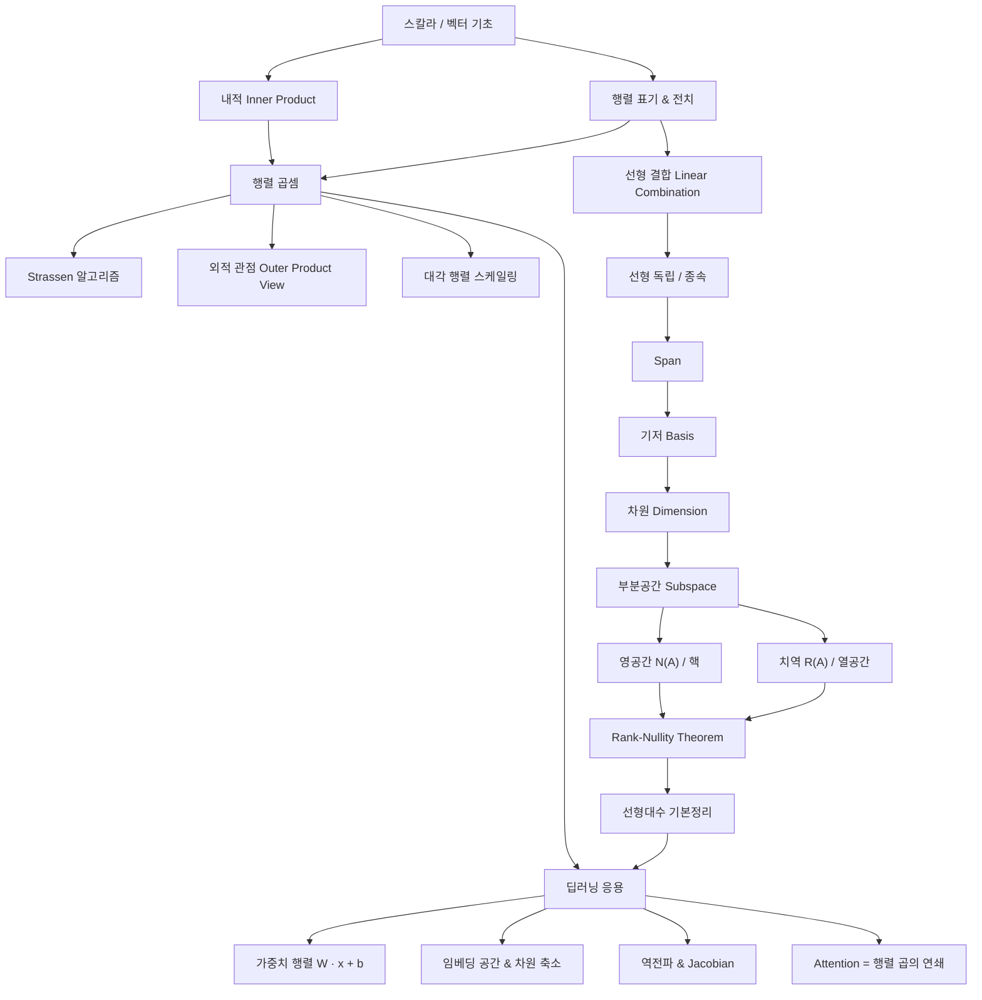

# 02. 행렬과 선형 공간 (Matrices & Linear Spaces)

> 딥러닝 교안 슬라이드 40~52 기반 학습 자료
> Sungyoon Lee, Deep Learning 강의 — Preliminaries: Linear Algebra

---

## 1. 선행 개념 연결 Mermaid 다이어그램



---

## 2. 개념별 5단계 완전 분리 설명

---

### 개념 A: 행렬 표기법과 전치 (Matrix Notation & Transpose)

> 슬라이드 41: $A \equiv (a_{ij})_{i,j}$, 전치 $A^\top$, 열벡터/행벡터, horizontal/vertical stack

#### ① 초등 (일상 비유, 수식 없음)

**동기 부여**: "이걸 배우면 ChatGPT가 단어를 어떻게 숫자 표로 바꿔서 이해하는지 알 수 있어!"

행렬은 **숫자가 적힌 직사각형 표**다. 엑셀 시트를 떠올려 보자. 가로줄(행)과 세로줄(열)이 있고, 각 칸에 숫자가 하나씩 들어간다.

"전치"는 **표를 대각선으로 뒤집는 것**이다. 가로줄이 세로줄이 되고, 세로줄이 가로줄이 된다. 마치 노트를 90도 돌려 보는 것과 비슷하다.

- **오개념 경고**: "행렬은 그냥 숫자 묶음이다" → 틀림! 행렬은 **행과 열의 위치 정보**가 핵심이다. 순서가 바뀌면 완전히 다른 행렬이다.
- **설명하기 훈련**: "지금 배운 것을 초등학생에게 설명한다면?" → 모범 답안: "행렬은 숫자를 표에 정리한 거야. 가로줄 번호랑 세로줄 번호로 어떤 숫자인지 찾을 수 있어."
- **성취 확인**: 당신은 이제 행렬이 무엇인지, 전치가 어떤 조작인지 일상어로 설명할 수 있습니다.

#### ② 중등 (간단한 수식, 시각적 예시)

구체적 예시부터:

$$A = \begin{bmatrix} 1 & 2 & 3 \\ 4 & 5 & 6 \end{bmatrix}$$

이 행렬은 2행 3열, 즉 $2 \times 3$ 크기다. $a_{12} = 2$는 "1번째 행, 2번째 열의 값"이다.

전치하면:

$$A^\top = \begin{bmatrix} 1 & 4 \\ 2 & 5 \\ 3 & 6 \end{bmatrix}$$

**이 수식이 말하는 것은 단순히** "행과 열의 인덱스를 바꾼다"는 것이다. $(A^\top)_{ij} = a_{ji}$.

**열벡터(column vector)**: $a_i$ 또는 $a_{*i}$ 또는 $a_{:,i} \in \mathbb{R}^m$ — 행렬의 $i$번째 세로줄을 뽑아낸 것.
**행벡터(row vector)**: $a_{i*}$ 또는 $a_{i,:} \in \mathbb{R}^{1 \times n}$ — 행렬의 $i$번째 가로줄.

**horizontal stack**: $[a_1 \; a_2 \; \cdots \; a_n] \in \mathbb{R}^{m \times n}$ — 열벡터를 옆으로 나란히 붙임.
**vertical stack**: $[a_1;\; a_2;\; \cdots;\; a_n] \in \mathbb{R}^{mn}$ — 열벡터를 위아래로 쌓아 하나의 긴 벡터로 만듦.

- **오개념 경고**: "전치하면 크기가 같다" → 틀림! $m \times n$ 행렬의 전치는 $n \times m$이다.
- **설명하기 훈련**: → 모범 답안: "행렬에서 세로줄 하나를 뽑으면 열벡터야. 전치는 행과 열을 바꾸는 거지."
- **성취 확인**: 당신은 이제 행렬의 원소 표기, 열/행 벡터 추출, 전치 연산을 구체적 수로 수행할 수 있습니다.

#### ③ 고등 (수학적 표현, 증명 입문)

$A \in \mathbb{R}^{m \times n}$은 실수 원소를 가지는 $m$행 $n$열 행렬이다.

**전치의 성질 (교안 강조)**:

$$(AB)^\top = B^\top A^\top$$

이것은 **순서가 뒤집힌다**는 핵심 성질이다.

> **증명 스케치**: $(AB)^\top$의 $(i,j)$ 원소 $= (AB)_{ji} = \sum_k a_{jk}b_{ki} = \sum_k (B^\top)_{ik}(A^\top)_{kj} = (B^\top A^\top)_{ij}$. $\square$

- **오개념 경고**: "$(AB)^\top = A^\top B^\top$이다" → 틀림! 순서가 반드시 뒤집힌다: $(AB)^\top = B^\top A^\top$.
- **설명하기 훈련**: → 모범 답안: "전치하면 곱셈 순서가 반대가 돼요. 양말 신고 신발 신으면, 벗을 때는 신발 먼저 벗잖아요."
- **성취 확인**: 당신은 이제 전치의 분배 법칙을 증명하고 활용할 수 있습니다.

#### ④ 대학 (선형대수 기반 + Python/NumPy 코드)

```python
import numpy as np

A = np.array([[1, 2, 3],
              [4, 5, 6]])  # shape (2, 3)

# 전치
AT = A.T  # shape (3, 2)
print(AT)
# [[1 4]
#  [2 5]
#  [3 6]]

# 열벡터 추출 (0-indexed)
col_0 = A[:, 0]  # array([1, 4])

# 행벡터 추출
row_1 = A[1, :]  # array([4, 5, 6])

# horizontal stack
a1 = np.array([[1], [4]])
a2 = np.array([[2], [5]])
H = np.hstack([a1, a2])  # shape (2, 2)

# vertical stack
V = np.vstack([a1, a2])  # shape (4, 1)

# (AB)^T = B^T A^T 검증
B = np.array([[1, 0], [0, 1], [1, 1]])
AB = A @ B
assert np.allclose((A @ B).T, B.T @ A.T)
```

- **오개념 경고**: NumPy에서 1차원 배열 `shape (n,)`은 열벡터도 행벡터도 아니다. 명시적으로 `reshape(-1, 1)`로 열벡터를 만들어야 한다.
- **설명하기 훈련**: → 모범 답안: "행렬은 2D 배열이고, 전치는 `.T`로 행과 열을 뒤집는 연산입니다."
- **성취 확인**: 당신은 이제 NumPy로 행렬 표기의 모든 연산을 구현할 수 있습니다.

#### ⑤ 대학원 (논문 수준, 한계/확장/변형)

- **Batch 연산**: 딥러닝에서는 $A \in \mathbb{R}^{B \times m \times n}$ 형태의 3차원 텐서가 흔하다. `torch.transpose(dim0, dim1)`로 특정 축만 전치한다.
- **Hermitian 전치**: 복소수 행렬에서는 전치 + 켤레(conjugate)를 함께 취하는 $A^*$ ($A^H$)가 사용된다. 양자 컴퓨팅/신호처리에서 핵심.
- **연구 포인트**: Transformer의 Attention에서 $QK^\top$은 전치의 가장 대표적 응용. 이때 $(QK^\top)^\top = KQ^\top$임을 이용해 메모리 효율적 attention을 설계한다 (FlashAttention 등).

- **오개념 경고**: "텐서의 전치는 항상 마지막 두 축을 교환한다" → 틀림! 어떤 축을 교환할지 명시해야 한다.
- **설명하기 훈련**: → 모범 답안: "전치는 행렬을 뒤집는 것이고, 텐서에서는 어떤 차원 쌍을 교환할지 지정해야 합니다."
- **성취 확인**: 당신은 이제 텐서 전치, Hermitian 전치, Attention에서의 전치 활용을 설명할 수 있습니다.

---

### 개념 B: 행렬-벡터 곱과 내적 관점 (Matrix-Vector Product as Inner Product)

> 슬라이드 42: "Just Like Inner Product" — 행렬 × 벡터 = 열벡터의 선형 결합, 행벡터 × 행렬 = 행벡터의 선형 결합

#### ① 초등 (일상 비유, 수식 없음)

**동기 부여**: "이걸 배우면 AI가 입력 데이터를 어떻게 변환하는지 이해할 수 있어!"

장바구니에 사과 3개, 바나나 2개를 담았다고 하자. 사과 가격이 1000원, 바나나가 500원이면, 총 금액 = 3×1000 + 2×500 = 4000원. 이것이 **내적(inner product)**이다.

이제 가게가 여러 개라면? 각 가게마다 가격이 다르니까, 가격표(행렬) × 장바구니(벡터) = 가게별 총 금액(결과 벡터). 이것이 **행렬 × 벡터 곱**이다.

- **오개념 경고**: "행렬 곱은 각 칸끼리 곱하는 것이다" → 틀림! 그것은 원소별 곱(element-wise)이고, 행렬 곱은 **행과 열의 내적**이다.
- **설명하기 훈련**: → 모범 답안: "각 가게의 가격 목록이 행이고, 장바구니가 벡터야. 곱하면 가게별 총 금액이 나와."
- **성취 확인**: 당신은 이제 행렬-벡터 곱이 "여러 내적을 한 번에 하는 것"임을 설명할 수 있습니다.

#### ② 중등 (간단한 수식, 시각적 예시)

슬라이드의 핵심 공식:

$$\begin{bmatrix} | & | & & | \\ a_1 & a_2 & \cdots & a_n \\ | & | & & | \end{bmatrix} \begin{bmatrix} v_1 \\ v_2 \\ \vdots \\ v_n \end{bmatrix} = v_1 a_1 + v_2 a_2 + \cdots + v_n a_n$$

**이 수식이 말하는 것은 단순히**: "행렬의 열벡터들을 $v_i$로 가중 합산한다"는 것이다.

숫자 예시:

$$\begin{bmatrix} 1 & 0 \\ 0 & 1 \\ 1 & 1 \end{bmatrix} \begin{bmatrix} 3 \\ 2 \end{bmatrix} = 3\begin{bmatrix}1\\0\\1\end{bmatrix} + 2\begin{bmatrix}0\\1\\1\end{bmatrix} = \begin{bmatrix}3\\2\\5\end{bmatrix}$$

행벡터 관점도 있다:

$$[u_1 \; u_2 \; \cdots \; u_n] \begin{bmatrix} — b_1^\top — \\ — b_2^\top — \\ \vdots \\ — b_n^\top — \end{bmatrix} = u_1 b_1^\top + u_2 b_2^\top + \cdots + u_n b_n^\top$$

- **오개념 경고**: "열 관점과 행 관점은 다른 연산이다" → 틀림! 같은 곱셈을 두 가지 방식으로 해석한 것이다.
- **설명하기 훈련**: → 모범 답안: "행렬에 벡터를 곱하면, 행렬의 열들을 벡터 값으로 섞어서 더하는 거야."
- **성취 확인**: 당신은 이제 행렬-벡터 곱을 열벡터 선형 결합으로 해석할 수 있습니다.

#### ③ 고등 (수학적 표현)

행렬 $A \in \mathbb{R}^{m \times n}$, 벡터 $v \in \mathbb{R}^n$에 대해:

$$Av = \sum_{i=1}^{n} v_i a_i \quad \text{(열 관점: column-wise view)}$$

행벡터 $u^\top \in \mathbb{R}^{1 \times n}$, 행렬 $B \in \mathbb{R}^{n \times p}$에 대해:

$$u^\top B = \sum_{i=1}^{n} u_i b_i^\top \quad \text{(행 관점: row-wise view)}$$

**핵심**: $Av$의 결과는 $A$의 **열공간(column space)**에 존재한다. 이것은 나중에 치역(range) 개념과 직결된다.

- **오개념 경고**: "$Av$의 결과가 아무 벡터나 될 수 있다" → 틀림! 결과는 반드시 $A$의 열벡터들의 선형 결합, 즉 열공간 안에 있다.
- **설명하기 훈련**: → 모범 답안: "행렬에 벡터를 곱하면 열벡터들의 가중합이 되므로, 결과는 열공간 안에 갇힙니다."
- **성취 확인**: 당신은 이제 행렬-벡터 곱의 기하학적 의미를 설명할 수 있습니다.

#### ④ 대학 (Python/NumPy 코드)

```python
import numpy as np

A = np.array([[1, 0],
              [0, 1],
              [1, 1]])  # (3, 2)
v = np.array([3, 2])

# 방법 1: 직접 곱
result = A @ v  # [3, 2, 5]

# 방법 2: 열벡터 선형 결합 (교안의 관점)
col_view = v[0] * A[:, 0] + v[1] * A[:, 1]
assert np.allclose(result, col_view)

# 행벡터 관점
u = np.array([1, 2, 3])  # (3,)
B = np.array([[1, 0], [0, 1], [1, 1]])  # (3, 2)
row_result = u @ B  # [4, 5]
row_view = u[0]*B[0] + u[1]*B[1] + u[2]*B[2]
assert np.allclose(row_result, row_view)
```

- **오개념 경고**: `np.dot(A, v)`와 `A @ v`는 2D 배열에서 같지만, 3D 이상 텐서에서는 동작이 다르다. `@`를 쓰는 것이 안전하다.
- **설명하기 훈련**: → 모범 답안: "`A @ v`는 A의 각 열에 v의 원소를 곱해서 더한 것입니다."
- **성취 확인**: 당신은 이제 두 가지 관점(열/행)으로 행렬-벡터 곱을 코드로 구현할 수 있습니다.

#### ⑤ 대학원 (논문 수준)

- 딥러닝의 **Linear Layer**: $y = Wx + b$에서 $Wx$가 정확히 이 연산이다. $W$의 각 행이 하나의 "특징 검출기"로 동작.
- **Attention의 $QK^\top V$**: $Q$와 $K$의 내적으로 유사도를 계산한 뒤, $V$의 열벡터를 가중합 — 본 슬라이드의 열 관점 그대로.
- **연구 포인트**: LoRA(Low-Rank Adaptation)는 $W = W_0 + BA$처럼 행렬-벡터 곱을 저랭크로 근사하여 파라미터를 줄인다.

- **오개념 경고**: "행렬 곱은 단순히 수치 연산이다" → 틀림! 이는 공간 변환이며, 열 관점/행 관점/내적 관점 모두 기하학적 의미를 가진다.
- **설명하기 훈련**: → 모범 답안: "행렬-벡터 곱은 입력 벡터를 열공간으로 투영하는 선형 변환입니다."
- **성취 확인**: 당신은 이제 Attention, Linear Layer 등에서 행렬-벡터 곱의 역할을 논문 수준으로 설명할 수 있습니다.

---

### 개념 C: 행렬 곱셈 (Matrix Multiplication)

> 슬라이드 43: $C = AB$, $c_{ij} = \sum_k a_{ik}b_{kj}$, 시간 복잡도 $O(mnp)$

#### ① 초등 (일상 비유, 수식 없음)

**동기 부여**: "이걸 배우면 AI가 데이터를 여러 단계로 변환하는 과정을 이해할 수 있어!"

한국어 → 영어 번역기, 영어 → 일본어 번역기가 있다면, 둘을 연결하면 한국어 → 일본어 번역기가 된다. 행렬 곱셈은 이렇게 **두 변환을 연결하는 것**이다.

- **오개념 경고**: "행렬 곱은 같은 위치 원소끼리 곱하는 것이다" → 틀림! 행렬 곱은 첫 행렬의 **행**과 두 번째 행렬의 **열**의 내적이다.
- **설명하기 훈련**: → 모범 답안: "두 가지 변환을 순서대로 하는 걸 하나로 합친 게 행렬 곱이야."
- **성취 확인**: 당신은 이제 행렬 곱이 "변환의 합성"임을 설명할 수 있습니다.

#### ② 중등 (간단한 수식, 시각적 예시)

$A \in \mathbb{R}^{m \times n}$, $B \in \mathbb{R}^{n \times p}$일 때, $C = AB \in \mathbb{R}^{m \times p}$.

$$c_{ij} = \sum_{k=1}^{n} a_{ik} b_{kj} = a_{i,:} \cdot b_{:,j}$$

**이 수식이 말하는 것은 단순히**: "C의 (i,j) 원소 = A의 i번째 행과 B의 j번째 열의 내적"이다.

숫자 예시:

$$\begin{bmatrix} 1 & 2 \\ 3 & 4 \end{bmatrix} \begin{bmatrix} 5 & 6 \\ 7 & 8 \end{bmatrix} = \begin{bmatrix} 1 \cdot 5 + 2 \cdot 7 & 1 \cdot 6 + 2 \cdot 8 \\ 3 \cdot 5 + 4 \cdot 7 & 3 \cdot 6 + 4 \cdot 8 \end{bmatrix} = \begin{bmatrix} 19 & 22 \\ 43 & 50 \end{bmatrix}$$

**주의**: A의 열 수 = B의 행 수여야 곱셈이 가능하다!

- **오개념 경고**: "$AB = BA$이다" → 거의 항상 틀림! 행렬 곱은 **교환법칙이 성립하지 않는다**.
- **설명하기 훈련**: → 모범 답안: "C의 각 칸은 A의 해당 행과 B의 해당 열을 짝지어 곱해서 더한 값이야."
- **성취 확인**: 당신은 이제 행렬 곱을 손으로 계산할 수 있습니다.

#### ③ 고등 (시간 복잡도)

**시간 복잡도** (교안):
- 일반: $T(m, n, p) = O(mnp)$
- 정방행렬 ($m = n = p$): $T(n) = O(n^3)$
- 행렬-벡터 곱 ($m = n$, $p = 1$): $T(n) = O(n^2)$

곱셈 횟수: 각 $c_{ij}$를 구하는 데 $n$번의 곱셈과 $n-1$번의 덧셈이 필요하고, 결과 행렬에 $m \times p$개의 원소가 있으므로 총 $O(mnp)$.

- **오개념 경고**: "행렬 곱은 항상 $O(n^3)$이다" → 틀림! $O(n^3)$은 **정방행렬**의 경우이고, 일반적으로는 $O(mnp)$이다.
- **설명하기 훈련**: → 모범 답안: "행렬 곱의 계산량은 결과 행렬의 각 칸마다 내적 하나를 계산하는 것의 합입니다."
- **성취 확인**: 당신은 이제 행렬 곱의 시간 복잡도를 유도할 수 있습니다.

#### ④ 대학 (Python/NumPy 코드)

```python
import numpy as np

A = np.array([[1, 2], [3, 4]])
B = np.array([[5, 6], [7, 8]])

# 행렬 곱
C = A @ B  # [[19, 22], [43, 50]]

# 원소별 계산으로 검증
m, n = A.shape
n2, p = B.shape
C_manual = np.zeros((m, p))
for i in range(m):
    for j in range(p):
        C_manual[i, j] = np.sum(A[i, :] * B[:, j])
assert np.allclose(C, C_manual)

# 시간 복잡도 실험
import time
for size in [100, 500, 1000, 2000]:
    X = np.random.randn(size, size)
    Y = np.random.randn(size, size)
    start = time.time()
    _ = X @ Y
    elapsed = time.time() - start
    print(f"n={size}: {elapsed:.4f}s")
```

- **오개념 경고**: NumPy의 `*`는 원소별 곱(Hadamard product)이고, `@`(또는 `np.matmul`)가 행렬 곱이다. 혼동하지 말 것.
- **설명하기 훈련**: → 모범 답안: "`A @ B`는 행렬 곱이고, `A * B`는 같은 위치 원소끼리 곱하는 것입니다."
- **성취 확인**: 당신은 이제 행렬 곱을 NumPy로 구현하고 복잡도를 실험적으로 확인할 수 있습니다.

#### ⑤ 대학원 (논문 수준)

- 딥러닝의 **forward pass** 전체가 행렬 곱의 연쇄: $h_L = \sigma(W_L \cdot \sigma(W_{L-1} \cdots \sigma(W_1 x)))$
- GPU가 빠른 이유: 행렬 곱은 **고도로 병렬화** 가능 (각 $c_{ij}$ 독립 계산)
- **연구 포인트**: Mixed-precision training (FP16/BF16)으로 행렬 곱 속도를 2~4배 향상. NVIDIA Tensor Core는 행렬 곱 전용 하드웨어.

- **오개념 경고**: "행렬 곱이 빠르면 딥러닝이 빠르다" → 부분적으로만 맞음. 메모리 대역폭(memory bandwidth)이 더 큰 병목인 경우가 많다 (memory-bound vs compute-bound).
- **설명하기 훈련**: → 모범 답안: "딥러닝의 핵심 연산은 행렬 곱이고, GPU는 이것을 병렬로 처리하도록 설계되어 있습니다."
- **성취 확인**: 당신은 이제 행렬 곱과 딥러닝 연산의 관계, GPU 최적화 방향을 설명할 수 있습니다.

---

### 개념 D: Strassen 알고리즘 (선택)

> 슬라이드 44: Strassen, $T(n) = O(n^{\log_2 7}) \approx O(n^{2.807})$

#### ① 초등

**동기 부여**: "이걸 배우면 컴퓨터가 어떻게 계산을 '속임수'로 빠르게 하는지 알 수 있어!"

보통 행렬 곱은 8번의 작은 곱셈이 필요한데, Strassen이라는 수학자가 **7번만으로 같은 결과**를 얻는 방법을 찾았다. 1번의 곱셈을 아낀 것이 큰 행렬에서는 엄청난 차이를 만든다.

- **오개념 경고**: "1번 줄이는 게 별 차이가 없다" → 틀림! 재귀적으로 적용하면 $O(n^3)$이 $O(n^{2.807})$로 줄어든다.
- **설명하기 훈련**: → 모범 답안: "8번 곱할 걸 7번만 곱하는 트릭인데, 이걸 계속 반복하면 엄청 빨라져."
- **성취 확인**: 당신은 이제 Strassen 알고리즘의 핵심 아이디어를 설명할 수 있습니다.

#### ② 중등

$2 \times 2$ 행렬 곱에서 나이브하게는 8번의 곱셈이 필요하다. Strassen은 7개의 중간값 $m_1, \ldots, m_7$을 정의한다:

- $m_1 = (a_{11} + a_{22})(b_{11} + b_{22})$
- $m_2 = (a_{21} + a_{22})b_{11}$
- $m_3 = a_{11}(b_{12} - b_{22})$
- $m_4 = a_{22}(b_{21} - b_{11})$
- $m_5 = (a_{11} + a_{12})b_{22}$
- $m_6 = (a_{22} - a_{11})(b_{11} + b_{12})$ (교안 기준: $(a_{22} - a_{11})(b_{11} + b_{12})$)
- $m_7 = (a_{12} - a_{22})(b_{21} + b_{22})$

결과:
- $c_{11} = m_1 + m_4 - m_5 + m_7$
- $c_{12} = m_3 + m_5$
- $c_{21} = m_2 + m_4$
- $c_{22} = m_1 - m_2 + m_3 + m_6$

- **오개념 경고**: "Strassen이 항상 더 빠르다" → 틀림! 작은 행렬에서는 오버헤드 때문에 나이브 방법이 더 빠르다.
- **설명하기 훈련**: → 모범 답안: "7개의 곱셈과 덧셈 조합으로 8개의 곱셈과 같은 결과를 만들어요."
- **성취 확인**: 당신은 이제 Strassen의 7개 중간값과 결과 조합을 작성할 수 있습니다.

#### ③ 고등

**재귀 & Master Theorem**:

$n = 2^k$일 때, 재귀 관계: $T(n) = 7T(n/2) + 18(n/2)^2$

Master Theorem 적용: $T(n) = O(n^{\log_2 7}) \approx O(n^{2.8074})$

$n \neq 2^m$이면? → 가장 가까운 $2^m$으로 패딩.

- **오개념 경고**: "$O(n^{2.807})$이 최적이다" → 틀림! 2025년 기준 최선은 약 $O(n^{2.37})$이며, $O(n^2)$이 하한인지는 미해결.
- **설명하기 훈련**: → 모범 답안: "Strassen은 분할정복으로 행렬 곱의 복잡도를 줄인 최초의 알고리즘입니다."
- **성취 확인**: 당신은 이제 Strassen의 복잡도를 Master Theorem으로 유도할 수 있습니다.

#### ④ 대학

```python
import numpy as np

def strassen(A, B):
    n = A.shape[0]
    if n <= 64:  # base case: 작은 행렬은 나이브하게
        return A @ B

    mid = n // 2
    A11, A12 = A[:mid, :mid], A[:mid, mid:]
    A21, A22 = A[mid:, :mid], A[mid:, mid:]
    B11, B12 = B[:mid, :mid], B[:mid, mid:]
    B21, B22 = B[mid:, :mid], B[mid:, mid:]

    M1 = strassen(A11 + A22, B11 + B22)
    M2 = strassen(A21 + A22, B11)
    M3 = strassen(A11, B12 - B22)
    M4 = strassen(A22, B21 - B11)
    M5 = strassen(A11 + A12, B22)
    M6 = strassen(A22 - A11, B11 + B12)
    M7 = strassen(A12 - A22, B21 + B22)

    C11 = M1 + M4 - M5 + M7
    C12 = M3 + M5
    C21 = M2 + M4
    C22 = M1 - M2 + M3 + M6

    return np.block([[C11, C12], [C21, C22]])

# 검증
n = 128
A = np.random.randn(n, n)
B = np.random.randn(n, n)
assert np.allclose(strassen(A, B), A @ B, atol=1e-8)
```

- **오개념 경고**: 실제 딥러닝 프레임워크(PyTorch, JAX)는 Strassen을 사용하지 않는다. GPU의 GEMM 루틴이 더 효율적이기 때문.
- **설명하기 훈련**: → 모범 답안: "Strassen은 이론적으로 빠르지만, 실제 GPU 행렬곱은 캐시/병렬성을 활용한 최적화가 더 효과적입니다."
- **성취 확인**: 당신은 이제 Strassen을 구현하고 이론 vs 실제의 차이를 설명할 수 있습니다.

#### ⑤ 대학원

- **행렬 곱 복잡도 하한**: $\omega$는 행렬 곱의 지수. 현재 $\omega < 2.373$ (Alman & Williams, 2024). 궁극적 하한 $\omega = 2$는 미해결 문제.
- **Tensor decomposition**: Strassen을 일반화하면 텐서 랭크 문제가 된다. 이는 NP-hard.
- **연구 포인트**: 딥러닝에서는 structured matrix (Toeplitz, circulant, butterfly) 등으로 $O(n \log n)$ 행렬-벡터 곱을 달성하는 연구가 활발 (Monarch matrices 등).

- **오개념 경고**: "행렬 곱 알고리즘의 발전이 딥러닝 속도를 바꿀 것이다" → 현재로서는 틀림. 실제 병목은 메모리 접근이며, 이론적 알고리즘은 상수 계수가 너무 크다.
- **설명하기 훈련**: → 모범 답안: "행렬 곱 복잡도 $\omega$의 하한은 open problem이며, 실제 딥러닝은 하드웨어 최적화에 더 의존합니다."
- **성취 확인**: 당신은 이제 행렬 곱 복잡도의 이론적 한계와 실용적 한계를 구분하여 설명할 수 있습니다.

---

### 개념 E: 외적 관점의 행렬 곱 (Outer Product View)

> 슬라이드 45: "Just Like Outer Product" — $AB = \sum a_i b_i^\top$

#### ① 초등

**동기 부여**: "이걸 배우면 AI가 두 종류의 정보를 어떻게 조합하는지 알 수 있어!"

사람의 키 목록과 좋아하는 색 목록이 있다면, 모든 가능한 (키, 색) 조합을 만드는 것이 **외적**이다. 행렬 곱을 "모든 가능한 조합을 만들어서 더하기"로 볼 수 있다.

- **오개념 경고**: "내적과 외적은 완전히 다른 연산이다" → 관점이 다를 뿐, 같은 행렬 곱의 두 가지 해석이다.
- **설명하기 훈련**: → 모범 답안: "내적은 두 벡터를 하나의 수로 요약하고, 외적은 두 벡터로 하나의 표(행렬)를 만들어."
- **성취 확인**: 당신은 이제 외적의 기본 개념을 설명할 수 있습니다.

#### ② 중등

슬라이드 핵심 공식 3가지:

**1) 열 단위 분배**:

$$A[b_1 \; b_2 \; \cdots \; b_n] = [Ab_1 \; Ab_2 \; \cdots \; Ab_n]$$

**2) 행 단위 분배**:

$$\begin{bmatrix} — a_1^\top — \\ — a_2^\top — \\ \vdots \\ — a_m^\top — \end{bmatrix} B = \begin{bmatrix} — a_1^\top B — \\ — a_2^\top B — \\ \vdots \\ — a_m^\top B — \end{bmatrix}$$

**3) 외적 합 (Outer Product Sum)**:

$$\begin{bmatrix} — a_1^\top — \\ \vdots \\ — a_n^\top — \end{bmatrix} [b_1 \; \cdots \; b_n] = \begin{bmatrix} a_1^\top b_1 & a_1^\top b_2 & \cdots & a_1^\top b_n \\ \vdots & & & \vdots \\ a_m^\top b_1 & a_m^\top b_2 & \cdots & a_m^\top b_n \end{bmatrix}$$

- **오개념 경고**: "외적 관점은 비효율적이다" → 틀림! 외적 관점은 low-rank approximation의 기초이며, 매우 유용한 관점이다.
- **설명하기 훈련**: → 모범 답안: "행렬 곱을 열 하나씩 나눠서 보면 열 단위, 행 하나씩 보면 행 단위, 외적들의 합으로 보면 외적 관점이야."
- **성취 확인**: 당신은 이제 행렬 곱의 3가지 관점을 구분하여 설명할 수 있습니다.

#### ③ 고등

외적(outer product): 열벡터 $a \in \mathbb{R}^m$, $b \in \mathbb{R}^n$에 대해 $ab^\top \in \mathbb{R}^{m \times n}$은 rank-1 행렬이다.

행렬 곱의 외적 분해:

$$AB = \sum_{k=1}^{n} a_k b_k^\top$$

여기서 $a_k$는 $A$의 $k$번째 열, $b_k^\top$은 $B$의 $k$번째 행이다. 이는 **rank-1 행렬들의 합**으로 해석된다.

- **오개념 경고**: "외적의 결과는 벡터이다" → 틀림! (물리의 cross product와 혼동). 선형대수의 외적(outer product) $ab^\top$의 결과는 **행렬**이다.
- **설명하기 훈련**: → 모범 답안: "행렬 곱 $AB$는 rank-1 행렬들의 합입니다. 각 rank-1 행렬은 A의 열과 B의 행의 외적입니다."
- **성취 확인**: 당신은 이제 외적 분해와 rank-1 행렬의 관계를 설명할 수 있습니다.

#### ④ 대학

```python
import numpy as np

A = np.array([[1, 2], [3, 4], [5, 6]])  # (3, 2)
B = np.array([[7, 8, 9], [10, 11, 12]])  # (2, 3)

# 표준 행렬 곱
C = A @ B

# 외적 관점: rank-1 행렬의 합
C_outer = np.zeros_like(C)
for k in range(A.shape[1]):
    # a_k: (3,1), b_k^T: (1,3) → outer product: (3,3)
    C_outer += np.outer(A[:, k], B[k, :])
assert np.allclose(C, C_outer)

# 열 단위 관점
C_col = np.column_stack([A @ B[:, j] for j in range(B.shape[1])])
assert np.allclose(C, C_col)
```

- **오개념 경고**: `np.outer(a, b)`는 1D 배열을 받는다. 2D 열벡터를 넣으면 flatten되어 예상과 다른 결과가 나올 수 있다.
- **설명하기 훈련**: → 모범 답안: "행렬 곱을 외적의 합으로 분해하면, 각 항이 rank-1이므로 SVD와 자연스럽게 연결됩니다."
- **성취 확인**: 당신은 이제 행렬 곱의 외적 분해를 코드로 구현하고 검증할 수 있습니다.

#### ⑤ 대학원

- **Low-Rank Approximation**: SVD에서 $A = \sum_i \sigma_i u_i v_i^\top$은 외적 분해의 최적 버전. 상위 $k$개만 취하면 rank-$k$ 근사.
- **LoRA**: $\Delta W = BA$에서 $B \in \mathbb{R}^{d \times r}$, $A \in \mathbb{R}^{r \times d}$, $r \ll d$. 이는 $r$개의 외적 합으로 가중치 업데이트를 근사.
- **연구 포인트**: 외적 관점은 Attention의 효율적 구현 (linear attention)에서도 핵심. $\text{Attn}(Q,K,V) \approx \phi(Q)\phi(K)^\top V$를 $\phi(Q)(\phi(K)^\top V)$로 순서를 바꾸면 $O(n^2) \to O(n)$.

- **오개념 경고**: "외적 관점은 이론적 장난감이다" → 틀림! LoRA, linear attention, matrix factorization 등 실용적 핵심 도구이다.
- **설명하기 훈련**: → 모범 답안: "외적 분해는 low-rank 구조를 발견하고 활용하는 핵심 도구이며, LoRA와 linear attention의 이론적 기반입니다."
- **성취 확인**: 당신은 이제 외적 관점이 딥러닝 최적화에 어떻게 활용되는지 논문 수준으로 설명할 수 있습니다.

---

### 개념 F: 대각 행렬 스케일링 (Diagonal Matrix Scaling)

> 슬라이드 46: $DX$ = scaling rows, $XD$ = scaling cols, 고유값 분해 $AU = U\Lambda$

#### ① 초등

**동기 부여**: "이걸 배우면 AI가 특정 특징을 강조하거나 줄이는 방법을 알 수 있어!"

볼륨 조절 노브가 여러 개 있다고 생각하자. 각 노브가 하나의 채널(악기)의 음량을 조절한다. 대각 행렬은 **각 채널에 따로 음량을 조절하는 것**이다.

- **오개념 경고**: "대각 행렬은 별로 중요하지 않다" → 틀림! 고유값 분해, 배치 정규화 등 핵심 개념의 기초이다.
- **설명하기 훈련**: → 모범 답안: "대각 행렬은 각 줄(행이나 열)에 따로따로 배수를 곱하는 거야."
- **성취 확인**: 당신은 이제 대각 행렬의 직관적 의미를 설명할 수 있습니다.

#### ② 중등

$$D = \begin{bmatrix} 2 & 0 \\ 0 & 3 \end{bmatrix}, \quad X = \begin{bmatrix} 1 & 4 \\ 5 & 6 \end{bmatrix}$$

$$DX = \begin{bmatrix} 2 & 8 \\ 15 & 18 \end{bmatrix} \quad \text{(행 스케일링: 1행 ×2, 2행 ×3)}$$

$$XD = \begin{bmatrix} 2 & 12 \\ 10 & 18 \end{bmatrix} \quad \text{(열 스케일링: 1열 ×2, 2열 ×3)}$$

**이 수식이 말하는 것은 단순히**: $DX$는 각 **행**에 다른 배수를 곱하고, $XD$는 각 **열**에 다른 배수를 곱한다.

- **오개념 경고**: "$DX$와 $XD$는 같다" → 틀림! $DX$는 행 스케일링, $XD$는 열 스케일링. 결과가 다르다.
- **설명하기 훈련**: → 모범 답안: "대각 행렬을 왼쪽에 곱하면 행을 스케일링하고, 오른쪽에 곱하면 열을 스케일링해."
- **성취 확인**: 당신은 이제 $DX$와 $XD$의 차이를 구체적 수로 보여줄 수 있습니다.

#### ③ 고등

**고유값 분해와의 연결** (교안 각주):

$$AU = U\Lambda, \quad A = U\Lambda U^\top$$

여기서 $\Lambda$는 고유값의 대각 행렬, $U$는 고유벡터 행렬. 대칭 행렬 $A$를 "좌표 변환 → 스케일링 → 역변환"으로 분해한 것이다.

- **오개념 경고**: "모든 행렬이 $U\Lambda U^\top$으로 분해된다" → 틀림! 이는 **대칭 행렬**에 대해서만 보장된다 (일반 행렬은 $A = P D P^{-1}$, 대각화 불가능한 경우도 있다).
- **설명하기 훈련**: → 모범 답안: "대칭 행렬의 본질은 특정 방향으로 늘이거나 줄이는 것이며, 대각 행렬이 그 '늘이는 양'을 나타냅니다."
- **성취 확인**: 당신은 이제 고유값 분해에서 대각 행렬의 역할을 설명할 수 있습니다.

#### ④ 대학

```python
import numpy as np

D = np.diag([2, 3])
X = np.array([[1, 4], [5, 6]])

# 행 스케일링
DX = D @ X  # [[2, 8], [15, 18]]

# 열 스케일링
XD = X @ D  # [[2, 12], [10, 18]]

# 고유값 분해
A = np.array([[4, 2], [2, 3]])  # 대칭 행렬
eigenvalues, U = np.linalg.eigh(A)  # eigh: symmetric
Lambda = np.diag(eigenvalues)
# A ≈ U @ Lambda @ U.T
assert np.allclose(A, U @ Lambda @ U.T)

# Batch Normalization의 스케일링도 대각 행렬
gamma = np.array([0.5, 1.2, 0.8])  # learnable scale per feature
x_normalized = np.random.randn(32, 3)  # batch=32, features=3
x_scaled = x_normalized * gamma  # broadcasting = XD와 동일
```

- **오개념 경고**: `np.linalg.eig`와 `np.linalg.eigh`는 다르다. 대칭 행렬에는 `eigh`를 사용해야 수치적으로 안정적이고 정렬된 실수 고유값을 보장한다.
- **설명하기 훈련**: → 모범 답안: "대각 행렬 곱은 각 행/열에 스칼라를 곱하는 것이며, BatchNorm의 gamma도 이 원리입니다."
- **성취 확인**: 당신은 이제 대각 스케일링을 코드로 구현하고 고유값 분해와 연결할 수 있습니다.

#### ⑤ 대학원

- **Spectral Normalization**: $W / \sigma_1(W)$로 가중치의 최대 특이값을 1로 제한 → GAN 학습 안정화 (Miyato et al., 2018).
- **Pre-conditioning**: 경사하강법에서 $D^{-1}\nabla f$로 스케일링하면 수렴 가속. Adam optimizer의 $v_t$가 사실상 대각 pre-conditioner.
- **연구 포인트**: Spectral normalization, weight normalization 모두 대각/스칼라 스케일링의 응용.

- **오개념 경고**: "Adam은 단순히 학습률을 조절하는 것이다" → 더 정확하게는 gradient의 각 차원을 대각 행렬로 스케일링하는 것이다.
- **설명하기 훈련**: → 모범 답안: "Adam optimizer는 사실상 대각 행렬 pre-conditioning이며, 각 파라미터 방향의 스케일을 자동 조정합니다."
- **성취 확인**: 당신은 이제 대각 스케일링이 optimization과 normalization에 어떻게 활용되는지 설명할 수 있습니다.

---

### 개념 G: 부분공간 (Subspace)

> 슬라이드 47: $\mathbb{R}^3$: space, $\mathbb{R}^2$: plane, $\mathbb{R}^1$: line, $\mathbb{R}^0$: dot (origin)

#### ① 초등

**동기 부여**: "이걸 배우면 AI가 데이터를 어떻게 낮은 차원으로 압축하는지 이해할 수 있어!"

3차원 세상(공간) 안에 2차원 종이(평면)가 있고, 종이 위에 1차원 선이 있고, 선 위에 0차원 점이 있다. 큰 공간 안에 작은 공간이 들어있는 구조가 **부분공간**이다.

- **오개념 경고**: "아무 평면이나 부분공간이다" → 틀림! 부분공간은 반드시 **원점을 포함**해야 한다.
- **설명하기 훈련**: → 모범 답안: "3D 공간 안에 원점을 지나는 평면, 선, 점이 부분공간이야."
- **성취 확인**: 당신은 이제 부분공간의 직관적 의미와 차원 계층을 설명할 수 있습니다.

#### ② 중등

부분공간의 조건 (3가지를 모두 만족):
1. 영벡터 $\mathbf{0}$을 포함
2. 덧셈에 닫힘: $u, v \in V \Rightarrow u + v \in V$
3. 스칼라 곱에 닫힘: $u \in V, c \in \mathbb{R} \Rightarrow cu \in V$

**이 수식이 말하는 것은 단순히**: 부분공간 안의 벡터를 아무리 더하거나 배수해도 부분공간을 벗어나지 않는다.

예: $\mathbb{R}^3$ 안에서 $\{(x, y, 0) : x, y \in \mathbb{R}\}$는 $xy$-평면이며 부분공간이다.
반례: $\{(x, y, 1) : x, y \in \mathbb{R}\}$는 원점을 포함하지 않으므로 부분공간이 **아니다**.

- **오개념 경고**: "원점을 지나는 직선이면 부분공간이다" → 맞다! 하지만 "원점을 지나지 않는 직선"은 부분공간이 아니다.
- **설명하기 훈련**: → 모범 답안: "부분공간은 원점을 포함하고, 안의 벡터를 더하거나 늘려도 밖으로 나가지 않는 공간이야."
- **성취 확인**: 당신은 이제 부분공간의 세 조건을 확인할 수 있습니다.

#### ③ 고등

$\mathbb{R}^n$의 부분공간 $V$의 차원은 $0$부터 $n$까지 가능하다:

| 차원 | $\mathbb{R}^3$에서의 모양 |
|------|--------------------------|
| 0 | 원점 (점) |
| 1 | 원점을 지나는 직선 |
| 2 | 원점을 지나는 평면 |
| 3 | 전체 공간 $\mathbb{R}^3$ |

부분공간의 교집합은 항상 부분공간이지만, **합집합은 일반적으로 부분공간이 아니다** (합(sum) $V + W$는 부분공간).

- **오개념 경고**: "두 부분공간의 합집합은 부분공간이다" → 틀림! $V \cup W$는 일반적으로 부분공간이 아니다. $V + W = \{v + w : v \in V, w \in W\}$가 부분공간이다.
- **설명하기 훈련**: → 모범 답안: "부분공간은 원점을 포함하는 '평평한' 공간이며, 차원이 낮을수록 제약이 강합니다."
- **성취 확인**: 당신은 이제 부분공간의 차원과 기하학적 의미를 설명할 수 있습니다.

#### ④ 대학

```python
import numpy as np

# 부분공간 확인: V = span{[1,0,1], [0,1,1]}
v1 = np.array([1, 0, 1])
v2 = np.array([0, 1, 1])

# 임의의 선형 결합은 V 안에 있어야 함
a, b = 3.5, -2.1
v = a * v1 + b * v2
print(v)  # V 안의 벡터

# 부분공간 포함 여부 확인: v가 V 안에 있는지?
# V의 기저로 행렬 구성
basis = np.column_stack([v1, v2])  # (3, 2)
# v = basis @ coeffs 가 해를 가지는지 확인
coeffs, residuals, rank, sv = np.linalg.lstsq(basis, v, rcond=None)
in_subspace = np.allclose(basis @ coeffs, v)
print(f"v in V: {in_subspace}")  # True
```

- **오개념 경고**: `np.linalg.lstsq`의 residuals가 빈 배열이면 full rank가 아닌 것이다. `np.allclose`로 잔차를 확인하는 것이 안전하다.
- **설명하기 훈련**: → 모범 답안: "부분공간 포함 여부는 기저 벡터의 선형 결합으로 표현 가능한지 확인하는 것입니다."
- **성취 확인**: 당신은 이제 부분공간 포함 여부를 코드로 판별할 수 있습니다.

#### ⑤ 대학원

- **임베딩 공간**: Word2Vec, BERT 등의 임베딩은 고차원 공간의 부분공간에 의미 정보를 인코딩한다.
- **Manifold Hypothesis**: 실제 데이터는 고차원 공간의 저차원 부분다양체(manifold)에 놓여 있다는 가설. 부분공간은 가장 단순한 manifold.
- **연구 포인트**: Intrinsic dimensionality 연구 — 대형 언어 모델의 가중치 공간은 겉보기보다 훨씬 낮은 차원의 부분공간에 있다 (Li et al., 2018, "Measuring the Intrinsic Dimension of Objective Landscapes").

- **오개념 경고**: "부분공간과 manifold는 같다" → 틀림! 부분공간은 선형(평평)이지만, manifold는 곡면일 수 있다.
- **설명하기 훈련**: → 모범 답안: "부분공간은 선형 manifold이며, 딥러닝에서는 비선형 manifold가 더 현실적인 모델입니다."
- **성취 확인**: 당신은 이제 부분공간과 manifold hypothesis의 관계를 설명할 수 있습니다.

---

### 개념 H: 선형 결합, 선형 독립, Span, 기저, 차원

> 슬라이드 48: Linear Combination, Linearly Independent, Span, Basis, Dimension

#### ① 초등

**동기 부여**: "이걸 배우면 AI가 왜 특정 수의 뉴런만 필요한지 이해할 수 있어!"

레고 블록으로 생각하자:
- **선형 결합**: 빨강 블록 3개 + 파랑 블록 2개 = 하나의 작품 → 블록들을 원하는 양만큼 섞은 것
- **선형 독립**: 빨강과 파랑은 서로 대체 불가 → 하나를 다른 것으로 만들 수 없다
- **Span**: 빨강과 파랑으로 만들 수 있는 **모든 작품의 집합**
- **기저**: 최소한의 블록 종류로 모든 것을 만들 수 있는 세트
- **차원**: 기저에 있는 블록 종류의 수

- **오개념 경고**: "벡터가 많으면 차원이 높다" → 틀림! 차원은 **독립인 벡터의 수**이다. 100개의 벡터가 있어도 모두 같은 직선 위면 차원은 1.
- **설명하기 훈련**: → 모범 답안: "선형 독립은 '쓸데없이 중복되는 블록이 없다'는 뜻이고, 차원은 꼭 필요한 블록의 수야."
- **성취 확인**: 당신은 이제 선형 결합, 독립, span, 기저, 차원을 일상어로 구분하여 설명할 수 있습니다.

#### ② 중등

**선형 결합**: $\sum_{i=1}^{n} a_i v_i$ (스칼라 $a_i$와 벡터 $v_i$)

숫자 예시: $3\begin{bmatrix}1\\0\end{bmatrix} + 2\begin{bmatrix}0\\1\end{bmatrix} = \begin{bmatrix}3\\2\end{bmatrix}$

**선형 독립**: $\{v_i\}_{i=1}^n$이 선형 독립 ⟺ $\sum_{i=1}^{n} a_i v_i = 0$ 이면 반드시 모든 $a_i = 0$

- 독립 예: $\{(1,0), (0,1)\}$ → $a(1,0) + b(0,1) = (0,0)$이면 $a = b = 0$
- 종속 예: $\{(1,0), (2,0)\}$ → $2(1,0) - 1(2,0) = (0,0)$인데 계수가 0이 아님!

**Span**: $S$의 모든 유한 선형 결합의 집합

**기저**: 선형 독립 + span이 전체 공간 = 기저

**차원**: $\dim(V) = |B|$ (기저의 벡터 수)

- **오개념 경고**: "기저는 유일하다" → 틀림! 기저는 무한히 많지만, 기저의 **크기(차원)**는 항상 같다.
- **설명하기 훈련**: → 모범 답안: "기저는 공간을 '빈틈없이, 겹침 없이' 표현하는 최소 벡터 집합이야."
- **성취 확인**: 당신은 이제 각 정의를 구체적 수로 확인할 수 있습니다.

#### ③ 고등

**주요 정리들**:

1. $\mathbb{R}^n$의 임의의 기저는 정확히 $n$개의 벡터를 가진다.
2. $n$개의 벡터가 선형 독립 ⟺ 이들을 열로 하는 행렬의 행렬식이 0이 아니다.
3. $\dim(V_1 + V_2) = \dim(V_1) + \dim(V_2) - \dim(V_1 \cap V_2)$

**증명 입문** (선형 독립의 판별):

$v_1, \ldots, v_n$을 열로 하는 행렬 $V = [v_1 \; \cdots \; v_n]$에 대해, $Vc = 0$의 해가 $c = 0$뿐 ⟺ $\text{rank}(V) = n$ ⟺ 선형 독립.

- **오개념 경고**: "행렬식이 0이면 벡터들이 모두 같다" → 틀림! 행렬식이 0이면 **적어도 하나**의 벡터가 나머지의 선형 결합이라는 뜻이다.
- **설명하기 훈련**: → 모범 답안: "선형 독립 여부는 행렬을 만들어 rank를 확인하면 됩니다. rank가 벡터 수와 같으면 독립."
- **성취 확인**: 당신은 이제 선형 독립을 rank로 판별하고 차원 공식을 활용할 수 있습니다.

#### ④ 대학

```python
import numpy as np

# 선형 독립 확인
v1 = np.array([1, 0, 1])
v2 = np.array([0, 1, 1])
v3 = np.array([1, 1, 2])  # v1 + v2 = v3 → 종속!

V = np.column_stack([v1, v2, v3])
rank = np.linalg.matrix_rank(V)
print(f"Rank: {rank}")  # 2 (< 3이므로 종속)

# 기저 추출 (SVD 이용)
U, S, Vt = np.linalg.svd(V)
# 유효 특이값 개수 = rank
tol = 1e-10
effective_rank = np.sum(S > tol)
print(f"Effective rank: {effective_rank}")  # 2

# span 확인: 벡터 w가 span{v1, v2}에 있는지?
w = np.array([3, 2, 5])  # = 3*v1 + 2*v2
basis = np.column_stack([v1, v2])
coeffs, _, _, _ = np.linalg.lstsq(basis, w, rcond=None)
print(f"w = {coeffs[0]:.1f}*v1 + {coeffs[1]:.1f}*v2")  # 3.0*v1 + 2.0*v2
```

- **오개념 경고**: 수치적으로 rank를 판별할 때 tolerance가 중요하다. 부동소수점 오차로 인해 이론적으로 0인 특이값이 $10^{-15}$ 정도로 나올 수 있다.
- **설명하기 훈련**: → 모범 답안: "선형 독립은 `matrix_rank`로, span 포함 여부는 `lstsq`로 확인합니다."
- **성취 확인**: 당신은 이제 선형 독립, span 포함, 차원을 NumPy로 판별할 수 있습니다.

#### ⑤ 대학원

- **Overparameterization**: 딥러닝 모델의 파라미터 수 ≫ 데이터 수이지만, 실효 차원은 훨씬 낮다. 이는 가중치 공간에서 기저의 수가 적다는 의미.
- **Pruning & Quantization**: 불필요한 (종속적인) 파라미터를 제거 = 기저만 남기는 것.
- **연구 포인트**: "Double descent" 현상 — 모델 복잡도(차원)가 증가하면 오히려 일반화 성능이 좋아지는 현상. 전통적 bias-variance 분석과 모순.

- **오개념 경고**: "파라미터가 많으면 overfitting된다" → 현대 딥러닝에서는 반드시 그렇지 않다. Implicit regularization 등 복잡한 요인이 있다.
- **설명하기 훈련**: → 모범 답안: "딥러닝에서 실효 차원은 파라미터 수보다 훨씬 작으며, 이를 이해하는 것이 일반화 이론의 핵심입니다."
- **성취 확인**: 당신은 이제 차원 개념이 현대 딥러닝 이론에 어떻게 연결되는지 설명할 수 있습니다.

---

### 개념 I: 치역(Range)과 영공간(Null Space)

> 슬라이드 49-50: $\mathscr{R}(A) = \{Av : v \in \mathbb{R}^n\}$, $\mathscr{N}(A) = \{v : Av = 0\}$, 다이어그램

#### ① 초등

**동기 부여**: "이걸 배우면 AI가 정보를 변환할 때 어떤 정보는 살아남고 어떤 정보는 사라지는지 이해할 수 있어!"

사진을 흑백으로 바꾸는 필터를 생각하자:
- **치역(Range)**: 필터를 거쳐 나올 수 있는 모든 흑백 사진의 집합
- **영공간(Null Space)**: 필터를 거치면 완전히 사라지는(검은 화면이 되는) 입력의 집합 — 순수한 색 정보만 있는 사진이 여기 해당

- **오개념 경고**: "영공간은 비어있다" → 틀림! 최소한 영벡터($\mathbf{0}$)는 항상 영공간에 속한다.
- **설명하기 훈련**: → 모범 답안: "치역은 변환 후 나올 수 있는 결과 모음이고, 영공간은 변환하면 0이 되어 사라지는 입력 모음이야."
- **성취 확인**: 당신은 이제 치역과 영공간을 일상어로 설명할 수 있습니다.

#### ② 중등

$$\mathscr{R}(A) := \{Av \in \mathbb{R}^m : v \in \mathbb{R}^n\}$$

"$A$에 모든 가능한 입력 $v$를 넣었을 때 나오는 출력의 집합"이다. **열공간(column space)**이라고도 한다 — $Av$는 $A$의 열벡터의 선형 결합이니까.

$$\mathscr{N}(A) := \{v \in \mathbb{R}^n : Av = 0\}$$

"$A$를 곱하면 영벡터가 되는 모든 입력의 집합"이다. **핵(kernel)**이라고도 한다.

슬라이드의 다이어그램:
- $x_1, x_3, x_4$는 $\mathscr{R}^n$에서 $\mathscr{R}^m$으로 매핑되어 $y_1, y_2$ 등의 출력을 만든다
- $x_2$는 영공간(Null space)에 있어서 $A x_2 = 0$으로 매핑된다

- **오개념 경고**: "치역 = 치역(codomain)이다" → 틀림! 치역(range/image)은 실제로 도달하는 출력이고, 공역(codomain)은 출력이 속하는 전체 공간이다.
- **설명하기 훈련**: → 모범 답안: "영공간의 벡터는 행렬을 통과하면 0이 되고, 치역의 벡터는 어떤 입력을 넣으면 나올 수 있는 출력이야."
- **성취 확인**: 당신은 이제 치역과 영공간의 정의를 수식으로 쓰고 다이어그램으로 설명할 수 있습니다.

#### ③ 고등

$A \in \mathbb{R}^{m \times n}$에 대해:

- $\mathscr{R}(A)$는 $\mathbb{R}^m$의 부분공간 (열공간)
- $\mathscr{N}(A)$는 $\mathbb{R}^n$의 부분공간

**증명**: $\mathscr{N}(A)$가 부분공간임을 보이자.
1. $A \cdot 0 = 0$ → $0 \in \mathscr{N}(A)$ ✓
2. $Av_1 = 0, Av_2 = 0 \Rightarrow A(v_1 + v_2) = Av_1 + Av_2 = 0$ → 덧셈에 닫힘 ✓
3. $Av = 0 \Rightarrow A(cv) = cAv = 0$ → 스칼라곱에 닫힘 ✓ $\square$

- **오개념 경고**: "영공간이 크면 좋다" → 맥락에 따라 다르다. 영공간이 크면 정보 손실이 크다는 뜻이다.
- **설명하기 훈련**: → 모범 답안: "치역과 영공간 모두 부분공간입니다. 증명은 세 조건(영벡터 포함, 덧셈/스칼라곱 닫힘)을 확인하면 됩니다."
- **성취 확인**: 당신은 이제 치역과 영공간이 부분공간임을 증명할 수 있습니다.

#### ④ 대학

```python
import numpy as np
from scipy.linalg import null_space

A = np.array([[1, 2, 3],
              [4, 5, 6],
              [7, 8, 9]])  # rank 2 (3행이 1행+2행의 선형 결합이 아님... 실제로는 rank 2)

# 치역 (열공간) — SVD로 구하기
U, S, Vt = np.linalg.svd(A)
rank = np.sum(S > 1e-10)
col_space_basis = U[:, :rank]  # 치역의 정규직교 기저
print(f"Range dimension: {rank}")  # 2

# 영공간
ns = null_space(A)
print(f"Null space dimension: {ns.shape[1]}")  # 1
print(f"Null space basis:\n{ns}")

# 검증: A @ ns ≈ 0
print(f"A @ null_vector = {A @ ns[:, 0]}")  # ≈ [0, 0, 0]

# Rank + Nullity = n 확인
print(f"rank + nullity = {rank} + {ns.shape[1]} = {rank + ns.shape[1]}")  # 3 = n
```

- **오개념 경고**: `scipy.linalg.null_space`는 SVD 기반으로 수치적 영공간을 계산한다. tolerance에 민감할 수 있다.
- **설명하기 훈련**: → 모범 답안: "치역은 SVD의 왼쪽 특이벡터로, 영공간은 `null_space`로 계산합니다."
- **성취 확인**: 당신은 이제 치역과 영공간을 코드로 계산하고 검증할 수 있습니다.

#### ⑤ 대학원

- **Neural Network의 영공간**: 학습된 네트워크 $f(x)$에서 입력의 작은 변화 $\delta$가 출력을 바꾸지 않으면, $\delta$는 Jacobian의 영공간에 있다. 이는 **adversarial robustness**와 관련.
- **Residual Connection**: $y = x + F(x)$에서, $F$의 영공간에 있는 입력은 그대로 통과 → 정보 보존.
- **연구 포인트**: Dropout은 무작위로 열을 제거하여 치역의 차원을 줄이는 효과. 이는 암묵적 정규화(implicit regularization).

- **오개념 경고**: "영공간은 선형대수에서만 쓰인다" → 틀림! Jacobian의 영공간은 비선형 네트워크 분석의 핵심 도구이다.
- **설명하기 훈련**: → 모범 답안: "영공간은 '정보가 사라지는 방향'이며, 이를 이해하면 adversarial attack이 왜 가능한지 설명할 수 있습니다."
- **성취 확인**: 당신은 이제 치역/영공간이 딥러닝 해석에 어떻게 활용되는지 설명할 수 있습니다.

---

### 개념 J: Rank-Nullity Theorem

> 슬라이드 50: $n = \text{rank}(A) + \text{null}(A)$, rank 성질들

#### ① 초등

**동기 부여**: "이걸 배우면 AI가 처리할 수 있는 정보량과 잃어버리는 정보량의 관계를 이해할 수 있어!"

교실에 30명의 학생이 있다. 시험을 치면 **합격자 수 + 불합격자 수 = 30명**. 마찬가지로, 행렬에 입력을 넣으면 **살아남는 차원(rank) + 사라지는 차원(nullity) = 전체 입력 차원**.

- **오개념 경고**: "rank가 높으면 항상 좋다" → 맥락에 따라 다르다. 차원 축소(PCA 등)에서는 의도적으로 rank를 낮춘다.
- **설명하기 훈련**: → 모범 답안: "입력 정보 = 살아남는 부분 + 사라지는 부분, 이 합이 항상 일정해."
- **성취 확인**: 당신은 이제 Rank-Nullity Theorem의 직관을 설명할 수 있습니다.

#### ② 중등

**정리**: $A \in \mathbb{R}^{m \times n}$에 대해:

$$n = \text{rank}(A) + \text{null}(A)$$

여기서:
- $\text{rank}(A) = \dim(\mathscr{R}(A))$ — 열공간(치역)의 차원
- $\text{null}(A) = \dim(\mathscr{N}(A))$ — 영공간의 차원

숫자 예시: $A = \begin{bmatrix} 1 & 2 & 3 \\ 2 & 4 & 6 \end{bmatrix}$ (2행이 1행의 2배)

- $\text{rank}(A) = 1$ (독립 행이 1개)
- $n = 3$이므로 $\text{null}(A) = 3 - 1 = 2$

- **오개념 경고**: "$n$이 아니라 $m$이다" → 틀림! Rank-Nullity에서 우변은 **열의 수 $n$**이다 (입력 공간의 차원).
- **설명하기 훈련**: → 모범 답안: "열의 수 = rank + nullity야. rank는 독립 열의 수, nullity는 영공간의 차원이야."
- **성취 확인**: 당신은 이제 Rank-Nullity Theorem을 구체적 수로 확인할 수 있습니다.

#### ③ 고등

**Rank의 주요 성질** (교안):

1. $\text{rank}(A) \leq \min(m, n)$
2. $\text{rank}(A) = \text{rank}(A^\top) = \text{rank}(A^\top A) = \text{rank}(AA^\top)$
3. $\text{rank}(AB) \leq \min(\text{rank}(A), \text{rank}(B))$
4. $\text{rank}(A + B) \leq \text{rank}(A) + \text{rank}(B)$

성질 2의 중요성: $A^\top A$는 정방 행렬이므로 계산이 편리한데, rank가 $A$와 같다! 이는 **최소제곱법**과 $X^\top X$의 가역성에서 핵심적이다 (교안 각주 21).

- **오개념 경고**: "$\text{rank}(AB) = \text{rank}(A) \cdot \text{rank}(B)$이다" → 완전히 틀림! rank는 곱이 아니라 min 이하로 떨어진다.
- **설명하기 훈련**: → 모범 답안: "rank는 합성하면 줄어들 수 있고, 전치해도 바뀌지 않으며, 더하면 최대 두 rank의 합까지 가능합니다."
- **성취 확인**: 당신은 이제 rank의 4가지 핵심 성질을 활용할 수 있습니다.

#### ④ 대학

```python
import numpy as np

A = np.array([[1, 2, 3],
              [2, 4, 6]])  # rank 1

print(f"rank(A) = {np.linalg.matrix_rank(A)}")  # 1
# null(A) = 3 - 1 = 2

# 성질 2 확인: rank(A) = rank(A^T) = rank(A^T A) = rank(A A^T)
AT = A.T
ATA = AT @ A
AAT = A @ AT
print(f"rank(A^T) = {np.linalg.matrix_rank(AT)}")      # 1
print(f"rank(A^T A) = {np.linalg.matrix_rank(ATA)}")    # 1
print(f"rank(A A^T) = {np.linalg.matrix_rank(AAT)}")    # 1

# 성질 3 확인: rank(AB) <= min(rank(A), rank(B))
B = np.random.randn(3, 4)
AB = A @ B
print(f"rank(AB) = {np.linalg.matrix_rank(AB)} <= min({np.linalg.matrix_rank(A)}, {np.linalg.matrix_rank(B)})")

# 최소제곱법에서 X^T X의 가역성
X = np.random.randn(100, 5)  # full rank
XTX = X.T @ X
print(f"rank(X^T X) = {np.linalg.matrix_rank(XTX)}")  # 5 (invertible!)
beta = np.linalg.solve(XTX, X.T @ np.random.randn(100))
```

- **오개념 경고**: 수치적으로 rank를 계산할 때, `matrix_rank`는 내부적으로 SVD를 사용하고 tolerance를 적용한다. 매우 작은 특이값이 있으면 rank가 부정확할 수 있다.
- **설명하기 훈련**: → 모범 답안: "Rank-Nullity Theorem은 입력 차원의 보존 법칙이며, 최소제곱법의 해 존재성을 보장합니다."
- **성취 확인**: 당신은 이제 rank 성질을 코드로 검증하고 최소제곱법과 연결할 수 있습니다.

#### ⑤ 대학원

- **Neural Collapse**: 학습 후기에 특징 벡터들의 rank가 클래스 수와 같아지는 현상 (Papyan et al., 2020).
- **Rank deficiency in training**: 학습된 가중치 행렬의 rank가 full이 아닌 경우가 많다 → LoRA의 이론적 근거.
- **연구 포인트**: "Effective rank" = $\exp(H(\sigma_1, \ldots, \sigma_r))$ (특이값의 엔트로피)는 수치적 rank보다 연속적이고 미분 가능한 지표.

- **오개념 경고**: "rank는 항상 정수이다" → 수학적으로는 맞지만, 실용적으로는 "effective rank" 같은 연속 지표가 더 유용하다.
- **설명하기 훈련**: → 모범 답안: "Rank-Nullity는 행렬의 정보 구조를 완벽히 기술하며, LoRA/pruning의 이론적 기반입니다."
- **성취 확인**: 당신은 이제 Rank-Nullity Theorem이 현대 딥러닝 연구에 어떻게 적용되는지 설명할 수 있습니다.

---

### 개념 K: 선형대수 기본정리 (Fundamental Theorem of Linear Algebra)

> 슬라이드 51-52: $\mathbb{R}^n = \mathscr{N}(A) \oplus \mathscr{R}(A^\top)$, 4개 부분공간, 직교 분해

#### ① 초등

**동기 부여**: "이걸 배우면 AI가 입력을 '의미 있는 부분'과 '의미 없는 부분'으로 어떻게 분리하는지 이해할 수 있어!"

방에 빛을 비추면 **그림자가 생기는 부분**과 **빛이 닿는 부분**이 있다. 이 두 부분은 겹치지 않고, 합치면 전체가 된다. 행렬도 마찬가지: 입력 공간은 "행렬이 보는 부분"과 "행렬이 무시하는 부분"으로 깨끗하게 나뉜다.

- **오개념 경고**: "행렬은 입력의 일부만 본다" → 더 정확하게는 **특정 방향의 성분만** 본다. 나머지 방향은 영공간으로 사라진다.
- **설명하기 훈련**: → 모범 답안: "입력을 두 부분으로 나눌 수 있어: 행렬이 반응하는 부분과 무시하는 부분. 합치면 원래 입력이 돼."
- **성취 확인**: 당신은 이제 FTLA의 핵심 아이디어를 비유로 설명할 수 있습니다.

#### ② 중등

**4개의 근본 부분공간** (슬라이드 52 퀴즈 기준, $A = [1, 1] \in \mathbb{R}^{1 \times 2}$):

| 부분공간 | 정의 | 소속 공간 |
|---------|------|----------|
| $\mathscr{R}(A)$ | 열공간 (column space) | $\mathbb{R}^m$ |
| $\mathscr{R}(A^\top)$ | 행공간 (row space) | $\mathbb{R}^n$ |
| $\mathscr{N}(A)$ | 영공간 (null space) | $\mathbb{R}^n$ |
| $\mathscr{N}(A^\top)$ | 왼쪽 영공간 (left null space) | $\mathbb{R}^m$ |

**핵심 관계**: $\mathbb{R}^n = \mathscr{N}(A) \oplus \mathscr{R}(A^\top)$

이것은 "모든 입력 벡터 $x$를 영공간 성분 + 행공간 성분으로 유일하게 분해할 수 있다"는 뜻이다.

- **오개념 경고**: "4개 부분공간이 모두 같은 공간에 있다" → 틀림! $\mathscr{R}(A)$와 $\mathscr{N}(A^\top)$은 $\mathbb{R}^m$에, $\mathscr{R}(A^\top)$과 $\mathscr{N}(A)$는 $\mathbb{R}^n$에 있다.
- **설명하기 훈련**: → 모범 답안: "행렬 하나에 4개의 부분공간이 있고, 입력 공간과 출력 공간 각각에서 직교 분해가 성립해."
- **성취 확인**: 당신은 이제 4개의 근본 부분공간을 표로 정리하고 관계를 설명할 수 있습니다.

#### ③ 고등

**직교 보충(orthogonal complement)** (슬라이드):

$$\mathscr{R}(A^\top) \perp \mathscr{N}(A)$$
$$\mathscr{R}(A^\top)^\perp = \mathscr{N}(A)$$

**증명**: $x \in \mathscr{N}(A)$이고 $y \in \mathscr{R}(A^\top)$이면:
- $Ax = 0$
- $y = A^\top z$ (어떤 $z$에 대해)
- $x^\top y = x^\top (A^\top z) = (Ax)^\top z = 0^\top z = 0$ → $x \perp y$ $\square$

**유일한 직교 분해** (교안): 모든 $x \in \mathbb{R}^n$에 대해:

$$x = x_r + x_{n-r}$$

여기서 $x_r \in \mathscr{N}(A)$, $x_{n-r} \in \mathscr{R}(A^\top)$.

- **오개념 경고**: "$\oplus$는 단순 합집합이다" → 틀림! $\oplus$는 **직합(direct sum)**으로, 교집합이 $\{0\}$이고 합이 전체 공간인 경우이다.
- **설명하기 훈련**: → 모범 답안: "영공간과 행공간은 직교이므로, 모든 벡터를 이 두 성분으로 유일하게 분해할 수 있습니다."
- **성취 확인**: 당신은 이제 직교 보충 관계를 증명하고 직합 분해의 유일성을 설명할 수 있습니다.

#### ④ 대학

```python
import numpy as np
from scipy.linalg import null_space

# 슬라이드 52 퀴즈: A = [1, 1] ∈ R^{1×2}
A = np.array([[1, 1]])

# 4개의 근본 부분공간
# R(A) = column space of A = span{[1]} ⊂ R^1
U, S, Vt = np.linalg.svd(A)
rank = np.sum(S > 1e-10)
range_A = U[:, :rank]
print(f"R(A) basis: {range_A.T}")  # [[1]] (R^1 전체)

# R(A^T) = row space = span{[1,1]} ⊂ R^2
range_AT = Vt[:rank, :].T
print(f"R(A^T) basis: {range_AT.T}")  # [[0.707, 0.707]]

# N(A) = null space = {v : Av = 0} ⊂ R^2
null_A = null_space(A)
print(f"N(A) basis: {null_A.T}")  # [[−0.707, 0.707]]

# N(A^T) = left null space ⊂ R^1
null_AT = null_space(A.T)
print(f"N(A^T) dimension: {null_AT.shape[1]}")  # 0 (trivial)

# 직교 확인: R(A^T) ⊥ N(A)
print(f"R(A^T) · N(A) = {range_AT.T @ null_A}")  # ≈ 0

# 직합 분해: x = x_r + x_{n-r}
x = np.array([3, 1])
# x_row = projection onto R(A^T)
x_row = range_AT @ (range_AT.T @ x)
# x_null = projection onto N(A)
x_null = null_A @ (null_A.T @ x)
print(f"x = {x}")
print(f"x_row + x_null = {(x_row + x_null).flatten()}")
assert np.allclose(x, (x_row + x_null).flatten())
```

- **오개념 경고**: SVD에서 `Vt`는 $V^\top$이다. `V = Vt.T`로 변환해야 열이 right singular vector가 된다.
- **설명하기 훈련**: → 모범 답안: "SVD가 4개의 근본 부분공간을 모두 제공합니다: U의 열은 열공간/왼쪽영공간, V의 열은 행공간/영공간."
- **성취 확인**: 당신은 이제 4개의 근본 부분공간을 SVD로 계산하고 직교성을 검증할 수 있습니다.

#### ⑤ 대학원

- **PCA**: 데이터 행렬 $X$의 $\mathscr{R}(X^\top)$이 주성분 방향. 영공간 방향은 분산이 0인 "쓸모없는" 방향.
- **Least Squares**: $Ax = b$의 최소제곱 해 $x^* = A^\dagger b$는 $\mathscr{R}(A^\top)$에 있는 최소 노름 해.
- **Transformer**: Self-attention의 $\text{softmax}(QK^\top/\sqrt{d})V$에서, $QK^\top$의 low-rank 구조가 attention의 4개 부분공간을 결정.
- **연구 포인트**: "Rank collapse in Transformers" — 깊은 Transformer에서 attention map의 rank가 줄어드는 현상 (Dong et al., 2021). 이는 FTLA의 관점에서 영공간이 커지는 것.

- **오개념 경고**: "FTLA는 이론적 정리일 뿐이다" → 틀림! SVD, PCA, 최소제곱법, attention 분석 등 모든 곳에서 실용적으로 사용된다.
- **설명하기 훈련**: → 모범 답안: "선형대수 기본정리는 행렬이 만드는 공간 구조의 완전한 지도이며, 딥러닝의 모든 선형 연산 분석의 출발점입니다."
- **성취 확인**: 당신은 이제 FTLA가 딥러닝 분석에서 갖는 의미를 논문 수준으로 설명할 수 있습니다.

---

## 3. 수학-딥러닝 연결 지점 요약표

| 수학 개념 | 수식 | 딥러닝 응용 | 구체적 사례 |
|-----------|------|------------|------------|
| 행렬-벡터 곱 | $y = Wx + b$ | Linear Layer | `nn.Linear(in, out)` |
| 행렬 곱셈 | $C = AB$ | Forward pass 전체 | 다층 신경망의 연쇄 변환 |
| 전치 | $(AB)^\top = B^\top A^\top$ | Attention score | $QK^\top$ |
| 외적 (Outer Product) | $AB = \sum a_k b_k^\top$ | Low-rank 근사 | LoRA: $\Delta W = BA$ |
| 대각 스케일링 | $DX$, $XD$ | BatchNorm, LayerNorm | 채널/특징별 스케일링 |
| Strassen / 복잡도 | $O(n^{2.807})$ | GPU 행렬곱 최적화 | Tensor Core, cuBLAS |
| 선형 결합 | $\sum a_i v_i$ | 임베딩 조합 | Token embedding의 가중합 |
| 선형 독립 / 기저 | $\text{rank}$, $\dim$ | 모델 용량 분석 | Effective rank of weights |
| 부분공간 | $\mathbb{R}^k \subset \mathbb{R}^n$ | 임베딩 공간 | Word2Vec, manifold |
| 열공간 $\mathscr{R}(A)$ | $\{Av\}$ | 네트워크 출력 범위 | 표현 가능한 함수의 집합 |
| 영공간 $\mathscr{N}(A)$ | $\{v : Av = 0\}$ | 정보 손실 방향 | Adversarial direction |
| Rank-Nullity | $n = r + (n-r)$ | 정보 보존 분석 | Skip connection, ResNet |
| FTLA | $\mathbb{R}^n = \mathscr{N} \oplus \mathscr{R}^\top$ | 직교 분해 | PCA, SVD 기반 분석 |

---

## 4. 핵심 킬러 요약

| 항목 | 내용 |
|------|------|
| **한 줄 결론** | 행렬은 공간을 변환하는 함수이며, 변환의 구조(치역/영공간/rank)가 딥러닝의 모든 선형 연산을 지배한다. |
| **쉽게 설명하면** | 행렬 곱은 "데이터를 새로운 관점에서 보기"이고, rank는 "몇 가지 관점으로 볼 수 있는가", 영공간은 "무시되는 정보"이다. |
| **남에게 설명하는 한 문장** | "딥러닝의 가중치 행렬은 입력을 변환하는 거울인데, rank가 높을수록 더 많은 정보를 반사하고, 영공간이 클수록 더 많은 정보를 흡수(소멸)합니다." |
| **핵심 정리** | $n = \text{rank}(A) + \text{null}(A)$: 입력 차원 = 살아남는 차원 + 사라지는 차원. 이것이 선형대수의 **보존 법칙**이다. |

---

## 5. 단계별 오개념 교정 카드 모음

### 카드 1: 행렬 곱의 교환법칙
| | |
|---|---|
| **틀린 이해** | $AB = BA$ (행렬 곱은 순서를 바꿔도 된다) |
| **올바른 이해** | 행렬 곱은 교환법칙이 **성립하지 않는다**. $AB \neq BA$가 일반적이며, 심지어 크기가 달라 한쪽은 정의조차 안 될 수 있다. |
| **왜 중요한가** | 딥러닝에서 $W_2 W_1 x \neq W_1 W_2 x$. 레이어 순서가 바뀌면 완전히 다른 네트워크가 된다. |

### 카드 2: 전치의 곱 순서
| | |
|---|---|
| **틀린 이해** | $(AB)^\top = A^\top B^\top$ |
| **올바른 이해** | $(AB)^\top = B^\top A^\top$ — 순서가 **뒤집힌다** (양말-신발 원리) |
| **왜 중요한가** | 역전파에서 gradient 계산 시 전치 순서를 틀리면 차원 불일치 에러 발생. |

### 카드 3: 원소별 곱 vs 행렬 곱
| | |
|---|---|
| **틀린 이해** | 행렬 곱 = 같은 위치 원소끼리 곱하기 |
| **올바른 이해** | 원소별 곱(Hadamard product, $\odot$)과 행렬 곱($@$)은 **완전히 다른 연산**. 행렬 곱은 행과 열의 내적. |
| **왜 중요한가** | PyTorch에서 `*`는 원소별 곱, `@`는 행렬 곱. 혼동하면 shape 에러 또는 잘못된 결과. |

### 카드 4: Rank = 벡터의 수
| | |
|---|---|
| **틀린 이해** | 열이 5개면 rank는 5 |
| **올바른 이해** | Rank는 **독립인 열의 수**. 종속 열이 있으면 rank < 열 수. |
| **왜 중요한가** | 모델의 실효 파라미터 수는 가중치 행렬의 rank에 의존. LoRA는 이 점을 활용. |

### 카드 5: 영공간은 비어있다
| | |
|---|---|
| **틀린 이해** | Full-rank 행렬의 영공간은 비어있다 |
| **올바른 이해** | 영공간은 최소한 $\{0\}$을 포함한다. Full-rank인 정방행렬의 영공간은 $\{0\}$**만** 포함하지, 비어있지 않다. |
| **왜 중요한가** | 수학적 엄밀성. "trivial null space"와 "empty set"은 다르다. |

### 카드 6: 부분공간 = 아무 부분집합
| | |
|---|---|
| **틀린 이해** | $\mathbb{R}^n$의 아무 부분집합이나 부분공간이다 |
| **올바른 이해** | 부분공간은 (1) 원점 포함, (2) 덧셈 닫힘, (3) 스칼라곱 닫힘을 **모두** 만족해야 한다. 원점을 지나지 않는 평면, 구 등은 부분공간이 아니다. |
| **왜 중요한가** | 임베딩 공간 분석 시 부분공간 구조를 잘못 가정하면 이론이 무너진다. |

### 카드 7: 치역 = 공역
| | |
|---|---|
| **틀린 이해** | $A \in \mathbb{R}^{m \times n}$이면 치역은 $\mathbb{R}^m$ 전체다 |
| **올바른 이해** | 치역 $\mathscr{R}(A) \subseteq \mathbb{R}^m$이며, rank < $m$이면 **$\mathbb{R}^m$의 진부분공간**이다. |
| **왜 중요한가** | 네트워크가 표현할 수 있는 출력이 제한적일 수 있다는 의미. Rank collapse 현상. |

### 카드 8: Strassen이 항상 빠르다
| | |
|---|---|
| **틀린 이해** | Strassen 알고리즘이 항상 나이브 행렬곱보다 빠르다 |
| **올바른 이해** | 작은 행렬에서는 오버헤드가 크고, GPU에서는 캐시/병렬성 최적화가 더 효과적. 실제 딥러닝은 GEMM 루틴 사용. |
| **왜 중요한가** | 이론적 복잡도와 실제 성능은 다르다는 것을 인식해야 한다. |

### 카드 9: $DX = XD$
| | |
|---|---|
| **틀린 이해** | 대각 행렬은 어디에 곱해도 같다 |
| **올바른 이해** | $DX$는 **행 스케일링**, $XD$는 **열 스케일링**. 결과가 다르다. |
| **왜 중요한가** | BatchNorm(행 스케일링)과 feature scaling(열 스케일링)을 구분해야 한다. |

### 카드 10: FTLA는 이론적 장식
| | |
|---|---|
| **틀린 이해** | 선형대수 기본정리는 수학 시험용 정리일 뿐이다 |
| **올바른 이해** | SVD, PCA, 최소제곱법, attention 분석, adversarial robustness 등 **현대 딥러닝의 거의 모든 분석**에서 사용된다. |
| **왜 중요한가** | 이 정리를 모르면 딥러닝의 선형 연산이 "왜" 작동하는지 설명할 수 없다. |

---

> **학습 완료 체크리스트**
> - [ ] 행렬 표기, 전치, $(AB)^\top = B^\top A^\top$
> - [ ] 행렬-벡터 곱의 열/행 관점
> - [ ] 행렬 곱셈과 시간 복잡도 $O(mnp)$
> - [ ] Strassen $O(n^{2.807})$의 아이디어
> - [ ] 외적 관점: $AB = \sum a_k b_k^\top$
> - [ ] 대각 행렬 스케일링 $DX$ vs $XD$
> - [ ] 부분공간의 정의와 조건
> - [ ] 선형 결합, 독립, span, 기저, 차원
> - [ ] 치역 $\mathscr{R}(A)$과 영공간 $\mathscr{N}(A)$
> - [ ] Rank-Nullity Theorem: $n = \text{rank} + \text{null}$
> - [ ] 선형대수 기본정리: $\mathbb{R}^n = \mathscr{N}(A) \oplus \mathscr{R}(A^\top)$
> - [ ] 퀴즈: $A = [1, 1]$의 4개 부분공간 계산
