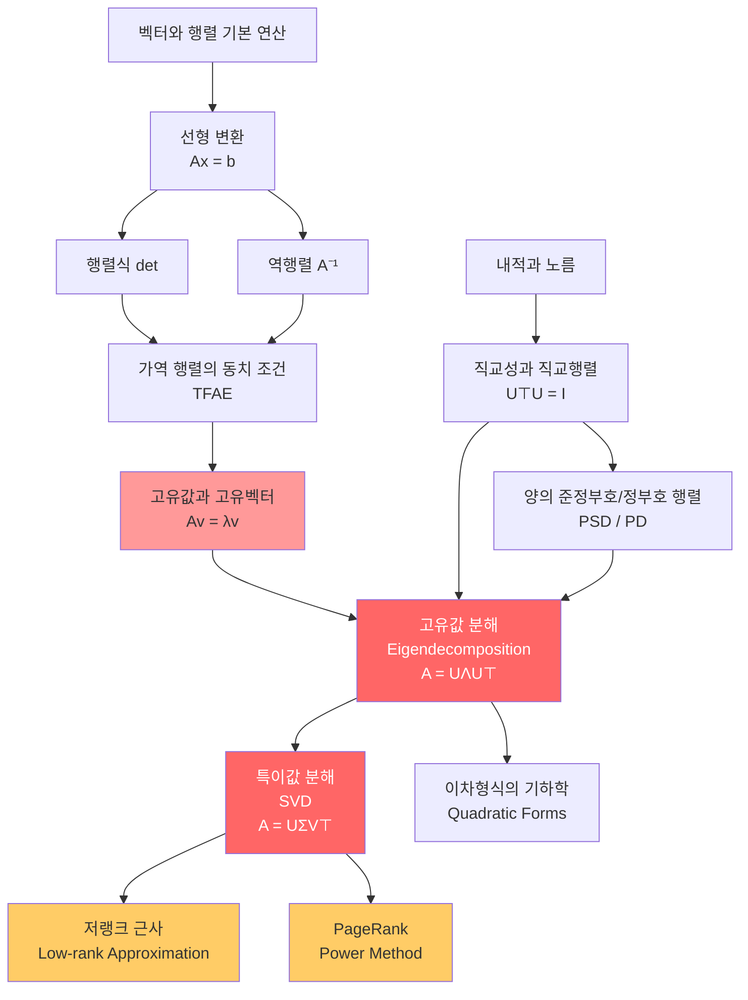

# 03. 고유값 분해(Eigendecomposition)와 특이값 분해(SVD)

> **동기부여:** 이걸 배우면 PCA(주성분 분석), 추천 시스템, 이미지 압축, Google PageRank, 딥러닝의 가중치 행렬 분석, 모델 압축(LoRA) 등의 핵심 원리를 이해할 수 있다.

---

## 1. 선행 개념 연결 Mermaid 다이어그램



---

## 2. 개념별 5단계 완전 분리 설명

---

### 2.1 가역 행렬의 동치 조건 (Invertible Matrix Theorem, TFAE)

> **핵심:** 정사각 행렬 $A \in \mathbb{R}^{n \times n}$에 대해, 아래 조건들은 모두 동치(TFAE: The Following Are Equivalent)이다.

**슬라이드 내용 (p.45):**
- $A$가 가역(invertible, non-singular)이다. 즉, $\exists A^{-1}$ s.t. $AA^{-1} = A^{-1}A = I$
- $\text{rank}(A) = n$ (full rank)
- $\text{null}(A) = 0$
- $Av = 0 \Rightarrow v = 0$
- $Ax = b$는 유일한 해를 가진다
- $\ker(A) = \{0\}$
- 모든 고유값이 0이 아니다
- $A$의 열(column)들이 선형독립이다
- $A$의 행(row)들이 선형독립이다
- $\det(A) \neq 0$

---

#### 1단계 (초등): 비유로 이해하기

"자물쇠와 열쇠"를 생각해보자. 행렬 $A$는 자물쇠이고, 역행렬 $A^{-1}$은 그 열쇠다. 열쇠가 존재한다는 것은 자물쇠를 열 수 있다는 뜻이다. 만약 자물쇠가 고장(det=0)이면 어떤 열쇠로도 열 수 없다.

#### 2단계 (중등): 숫자 예시

$$A = \begin{pmatrix} 2 & 1 \\ 1 & 3 \end{pmatrix}$$

- $\det(A) = 2 \times 3 - 1 \times 1 = 5 \neq 0$ --> 가역!
- $A^{-1} = \frac{1}{5}\begin{pmatrix} 3 & -1 \\ -1 & 2 \end{pmatrix}$

반면 $B = \begin{pmatrix} 1 & 2 \\ 2 & 4 \end{pmatrix}$이면 $\det(B) = 0$이므로 역행렬이 존재하지 않는다 (두 번째 행이 첫 번째 행의 2배).

#### 3단계 (고등): 동치 조건의 의미 연결

행렬식이 0이 아니라는 것은, 행렬이 공간을 "찌그러뜨려서 차원을 줄이지 않는다"는 뜻이다. 2x2 행렬이 2차원 평면을 1차원 직선으로 눌러버리면 정보가 손실되어 되돌릴 수 없다.

- rank = n: 모든 차원 방향을 유지
- ker = {0}: 0 벡터만 0으로 보냄 (정보 손실 없음)
- 고유값 모두 nonzero: 어떤 방향도 "소멸"시키지 않음

#### 4단계 (대학): 수학적 엄밀성 + 코드

```python
import numpy as np

A = np.array([[2, 1], [1, 3]])

# 동치 조건 확인
print(f"det(A) = {np.linalg.det(A):.2f}")           # 5.00 ≠ 0
print(f"rank(A) = {np.linalg.matrix_rank(A)}")       # 2 (full rank)
print(f"eigenvalues = {np.linalg.eigvals(A)}")       # 모두 nonzero

A_inv = np.linalg.inv(A)
print(f"A @ A_inv =\n{A @ A_inv}")                   # 단위행렬
```

**핵심:** 역행렬 계산의 시간복잡도는 $T(n) = O(n^3)$이다 (p.46). LU 분해 후 $Ax = e_i$를 $n$번 풀면 된다. 각 풀이는 $O(n^2)$.

#### 5단계 (대학원): 딥러닝 연결

**연구 포인트:** 딥러닝에서 가중치 행렬이 특이(singular)에 가까워지면 학습이 불안정해진다. Batch Normalization, Spectral Normalization 등은 가중치 행렬의 조건수(condition number)를 제어하여 학습을 안정화한다.

> **주의 (오개념 경고):** "역행렬이 존재하면 수치적으로도 안전하다"는 틀린 생각이다. $\det(A) \neq 0$이어도 매우 작은 고유값이 있으면 수치적으로 불안정하다 (ill-conditioned).

**설명하기 훈련:** "행렬식이 0이 아닌 것과 rank가 full인 것이 왜 같은 말인지, 고유값과 연결하여 설명해보세요."

**성취 확인:** 10개의 동치 조건 중 임의의 2개를 골라 서로의 관계를 증명할 수 있는가?

---

### 2.2 역행렬과 계산 복잡도 (Matrix Inversion)

> **핵심:** 가역 행렬 $A \in \mathbb{R}^{n \times n}$의 역행렬 계산 시간복잡도는 $O(n^3)$이다.

**슬라이드 내용 (p.46):**
- LU 분해 ($O(n^3)$) 후, $Ax = e_i$ ($i = 1, \ldots, n$)를 각각 $O(n^2)$에 풀 수 있다.
- $n \times n$ 행렬 곱셈의 시간복잡도 = $n \times n$ 역행렬 계산의 시간복잡도

---

#### 1단계 (초등): 비유로 이해하기

나눗셈을 생각해보자. $5 \times ? = 15$에서 $? = 15 \div 5 = 3$. 숫자에서는 나눗셈이 쉽지만, 행렬에서는 "나눗셈(=역행렬)"이 엄청나게 복잡한 계산이다.

#### 2단계 (중등): 구체적 이해

2x2 행렬은 공식이 있다: $A^{-1} = \frac{1}{\det(A)}\begin{pmatrix} d & -b \\ -c & a \end{pmatrix}$

하지만 1000x1000 행렬의 역행렬은? $O(n^3) = 10^9$ 연산이 필요하다!

#### 3단계 (고등): LU 분해 아이디어

$A = LU$ (하삼각 $\times$ 상삼각)로 분해하면, $Ax = b$를 $Ly = b$ (전진 대입), $Ux = y$ (후진 대입)으로 빠르게 풀 수 있다. 분해 자체가 $O(n^3)$이지만 한 번만 하면 된다.

#### 4단계 (대학): 코드로 체험

```python
import numpy as np
from scipy import linalg

n = 500
A = np.random.randn(n, n)
b = np.random.randn(n)

# 방법 1: 역행렬을 직접 구해서 곱하기 (비효율적)
x1 = np.linalg.inv(A) @ b

# 방법 2: LU 분해로 풀기 (효율적)
lu, piv = linalg.lu_factor(A)
x2 = linalg.lu_solve((lu, piv), b)

# 방법 3: np.linalg.solve (내부적으로 LU 사용)
x3 = np.linalg.solve(A, b)

print(f"오차 (inv vs solve): {np.linalg.norm(x1 - x3):.2e}")
```

**주의:** 실무에서는 역행렬을 명시적으로 구하지 않는다! `np.linalg.solve(A, b)`를 사용한다.

#### 5단계 (대학원): 딥러닝에서의 의미

**연구 포인트:** Natural Gradient Descent는 Fisher Information Matrix의 역행렬이 필요한데, 이것이 $O(n^3)$이라 실용적이지 않다. K-FAC, EKFAC 같은 근사 방법이 연구된다.

> **주의 (오개념 경고):** "역행렬을 구해서 곱하는 것"과 "연립방정식을 푸는 것"은 수학적으로 같지만, 수치적으로는 후자가 더 안정적이고 빠르다.

**설명하기 훈련:** "왜 딥러닝에서 역행렬 직접 계산을 피하는지 복잡도 관점에서 설명해보세요."

**성취 확인:** LU 분해를 이용한 연립방정식 풀이 과정을 단계별로 설명할 수 있는가?

---

### 2.3 고유값과 고유벡터 (Eigenvalues and Eigenvectors)

> **핵심:** 정사각 행렬 $A \in \mathbb{R}^{n \times n}$에 대해, $Av = \lambda v$를 만족하는 영이 아닌 벡터 $v$를 고유벡터(eigenvector), 스칼라 $\lambda$를 고유값(eigenvalue)이라 한다. 보통 $\|v\| = 1$로 정규화한다.

**슬라이드 내용 (p.47):**
- $A \in \mathbb{R}^{n \times n}$, $v \neq 0$ (보통 $\|v\| = 1$)
- $Av = \lambda v$: 행렬 $A$가 벡터 $v$에 작용하면, 방향은 유지하고 크기만 $\lambda$배 변한다.

---

#### 1단계 (초등): 비유로 이해하기

바람이 부는 상황을 상상하자. 대부분의 물체는 바람에 의해 방향이 바뀌지만, 풍향계(weathervane)처럼 바람 방향으로 정렬된 물체는 방향이 안 바뀌고 세기만 느낀다. 이 "바람 방향으로 정렬된 물체"가 고유벡터이고, "느끼는 세기"가 고유값이다.

#### 2단계 (중등): 숫자로 확인

$$A = \begin{pmatrix} 3 & 1 \\ 0 & 2 \end{pmatrix}, \quad v = \begin{pmatrix} 1 \\ 0 \end{pmatrix}$$

$Av = \begin{pmatrix} 3 \\ 0 \end{pmatrix} = 3 \begin{pmatrix} 1 \\ 0 \end{pmatrix} = 3v$

"행렬 $A$가 벡터 $v$에 곱해지면, $v$의 방향은 그대로이고 크기만 3배가 된다."

따라서 $v = (1, 0)^T$은 고유벡터, $\lambda = 3$은 고유값이다.

#### 3단계 (고등): 특성방정식

고유값을 구하려면: $Av = \lambda v \Leftrightarrow (A - \lambda I)v = 0$

$v \neq 0$인 해가 존재하려면: $\det(A - \lambda I) = 0$ (특성방정식)

위 예시: $\det\begin{pmatrix} 3-\lambda & 1 \\ 0 & 2-\lambda \end{pmatrix} = (3-\lambda)(2-\lambda) = 0$

따라서 $\lambda_1 = 3, \lambda_2 = 2$.

#### 4단계 (대학): 코드 + 일반화

```python
import numpy as np

A = np.array([[3, 1], [0, 2]])
eigenvalues, eigenvectors = np.linalg.eig(A)

print(f"고유값: {eigenvalues}")        # [3. 2.]
print(f"고유벡터:\n{eigenvectors}")    # 각 열이 고유벡터

# 검증: Av = λv
for i in range(len(eigenvalues)):
    v = eigenvectors[:, i]
    lam = eigenvalues[i]
    print(f"Av = {A @ v}, λv = {lam * v}, 일치: {np.allclose(A @ v, lam * v)}")
```

#### 5단계 (대학원): 딥러닝에서의 의미

"행렬은 벡터를 고유벡터 방향으로 늘이거나 줄이는 변환이다."

**연구 포인트:** Hessian 행렬의 고유값 스펙트럼은 손실 함수의 곡률(curvature)을 나타낸다. 가장 큰 고유값이 학습률 상한을 결정한다 ($\eta < 2/\lambda_{\max}$). 이것이 Edge of Stability 현상의 핵심이다.

> **주의 (오개념 경고):** "고유벡터는 유일하다"는 틀렸다. 고유벡터에 상수를 곱해도 여전히 고유벡터이다. 따라서 보통 $\|v\| = 1$로 정규화한다. 또한 고유값이 중복(repeated)이면 고유벡터는 고유공간(eigenspace)을 이룬다.

**설명하기 훈련:** "고유값이 음수인 행렬은 기하학적으로 어떤 의미인지 설명해보세요."

**성취 확인:** 3x3 대칭 행렬의 고유값과 고유벡터를 손으로 구할 수 있는가?

---

### 2.4 직교행렬, PSD, PD (Orthogonal, Positive Semi-Definite, Positive Definite)

> **핵심:** 직교행렬은 길이를 보존하는 변환이고, PSD/PD는 이차형식의 부호를 결정한다.

**슬라이드 내용 (p.48):**

**직교행렬(Orthogonal Matrix):**
- $U^{\top}U = UU^{\top} = I$, 즉 $U \in O(n)$
- 각 열(또는 행)이 정규직교: $u_i^{\top}u_i = 1$, $u_i^{\top}u_j = 0$ ($i \neq j$)
- 길이 보존: $\|Ux\| = \|x\|$

**양의 준정부호 행렬(PSD):**
- **대칭** 행렬 $A$에서 $v^{\top}Av \geq 0, \forall v \neq 0$
- 표기: $A \succeq 0$
- 모든 고유값이 $\geq 0$
- $BB^{\top}$와 $B^{\top}B$ (Gram matrix)는 항상 PSD

**양의 정부호 행렬(PD):**
- **대칭** 행렬 $A$에서 $v^{\top}Av > 0, \forall v \neq 0$
- 표기: $A \succ 0$
- 모든 고유값이 $> 0$
- 가역이다 (모든 고유값 > 0이므로)
- $BB^{\top} + \lambda I$ ($\lambda > 0$)은 PD

---

#### 1단계 (초등): 비유로 이해하기

**직교행렬:** 거울 반사나 회전. 물체의 모양이나 크기는 안 변하고 방향만 바뀐다.

**PSD/PD:** 그릇의 모양을 생각하자. PD는 모든 방향으로 올라가는 그릇(최솟값이 존재), PSD는 어떤 방향으로는 평평할 수 있는 그릇.

#### 2단계 (중등): 숫자 예시

직교행렬 (회전):
$$U = \begin{pmatrix} \cos\theta & -\sin\theta \\ \sin\theta & \cos\theta \end{pmatrix}, \quad U^{\top}U = I$$

PD 행렬:
$$A = \begin{pmatrix} 2 & 0 \\ 0 & 3 \end{pmatrix}, \quad v^{\top}Av = 2v_1^2 + 3v_2^2 > 0$$

#### 3단계 (고등): 왜 PSD/PD가 중요한가?

이차형식 $f(x) = x^{\top}Ax$에서:
- $A \succ 0$이면 $f$는 아래로 볼록 (convex) --> 유일한 최솟값 존재
- $A \succeq 0$이면 $f$는 볼록이지만 최솟값이 유일하지 않을 수 있음
- 고유값에 음수가 있으면 안장점(saddle point)이 존재

#### 4단계 (대학): 코드로 확인

```python
import numpy as np

# 직교행렬 검증
theta = np.pi / 4
U = np.array([[np.cos(theta), -np.sin(theta)],
              [np.sin(theta),  np.cos(theta)]])
print(f"U⊤U = I? {np.allclose(U.T @ U, np.eye(2))}")

x = np.array([3, 4])
print(f"||x|| = {np.linalg.norm(x):.2f}, ||Ux|| = {np.linalg.norm(U @ x):.2f}")  # 같음

# PSD 확인: BB⊤는 항상 PSD
B = np.random.randn(3, 5)
G = B @ B.T  # Gram matrix
eigvals = np.linalg.eigvalsh(G)
print(f"BB⊤의 고유값: {eigvals}")  # 모두 >= 0
print(f"PSD인가? {np.all(eigvals >= -1e-10)}")

# PD 만들기: BB⊤ + λI
lam = 0.1
G_pd = G + lam * np.eye(3)
eigvals_pd = np.linalg.eigvalsh(G_pd)
print(f"BB⊤ + λI의 고유값: {eigvals_pd}")  # 모두 > 0
```

#### 5단계 (대학원): 딥러닝에서의 의미

**연구 포인트:**
- 손실 함수의 Hessian이 PD이면 현재 점이 local minimum이다. PSD이면 경계 사례.
- $BB^{\top} + \lambda I$가 PD라는 성질은 **정규화(regularization)**의 수학적 근거다. Ridge regression에서 $(X^{\top}X + \lambda I)$의 역행렬이 항상 존재하게 된다.
- Gram matrix $X^{\top}X$는 커널 메서드, attention 메커니즘에서 핵심적으로 등장한다.

> **주의 (오개념 경고):** "PSD는 대칭이 아니어도 된다"고 생각하면 안 된다. 정의상 PSD/PD는 **대칭 행렬**에 대해서만 정의된다. 비대칭 행렬의 이차형식 $v^{\top}Av$는 항상 $v^{\top}\frac{A+A^{\top}}{2}v$로 대칭 부분만 기여한다.

**설명하기 훈련:** "$BB^{\top}$가 왜 항상 PSD인지 정의로부터 직접 증명해보세요."

**성취 확인:** 주어진 행렬이 PD/PSD/indefinite 중 어디에 해당하는지 고유값 분석 없이 판별할 수 있는가?

---

### 2.5 고유값 분해 / 스펙트럴 분해 (Eigendecomposition / Spectral Decomposition)

> **핵심:** 실수 대칭 행렬 $A$는 $A = U\Lambda U^{\top} = \sum_{i=1}^{n} \lambda_i u_i u_i^{\top}$로 분해된다.

**슬라이드 내용 (p.51):**
- 실수 대칭 행렬이면 모든 고유벡터가 직교한다 (주석 27)
- 스펙트럴 분해 (= Schur Decomposition, 주석 28):

$$A = U\Lambda U^{\top} = \begin{bmatrix} u_1 & u_2 & \cdots & u_n \end{bmatrix} \begin{bmatrix} \lambda_1 & & \\ & \lambda_2 & \\ & & \ddots \\ & & & \lambda_n \end{bmatrix} \begin{bmatrix} u_1^{\top} \\ u_2^{\top} \\ \vdots \\ u_n^{\top} \end{bmatrix}$$

$$= \sum_{i=1}^{n} \lambda_i u_i u_i^{\top}$$

- $Au_j = \lambda_j u_j$ (각 고유벡터에 대해 성립)
- $\Lambda = \text{diag}(\lambda) \in \mathbb{R}^{n \times n}$, $U \in \mathbb{R}^{n \times n}$은 직교행렬

---

#### 1단계 (초등): 비유로 이해하기

복잡한 변환(행렬 $A$)을 세 단계로 분해하는 것이다:
1. 좌표축을 고유벡터 방향으로 회전 ($U^{\top}$)
2. 각 축 방향으로 늘이거나 줄이기 ($\Lambda$)
3. 다시 원래 좌표로 돌리기 ($U$)

마치 복잡한 레시피를 "준비 - 조리 - 마무리"로 분해하는 것과 같다.

#### 2단계 (중등): 숫자 예시

$$A = \begin{pmatrix} 5 & 1 \\ 1 & 3 \end{pmatrix}$$

고유값: $\lambda_1 = 5.236, \lambda_2 = 2.764$
고유벡터: 각각에 대응하는 단위벡터 $u_1, u_2$

$A = \lambda_1 u_1 u_1^{\top} + \lambda_2 u_2 u_2^{\top}$: "행렬 $A$는 두 개의 '방향-크기' 조합의 합이다."

#### 3단계 (고등): 고유값 분해가 가능한 조건

- **대칭 행렬은 항상** 고유값 분해가 가능하다 (Spectral Theorem)
- 대칭이 아닌 행렬은 고유값 분해가 불가능할 수 있다 (예: $\begin{pmatrix} 0 & 1 \\ 0 & 0 \end{pmatrix}$)
- 대칭 행렬의 고유값은 항상 **실수**이다

#### 4단계 (대학): 코드 + 검증

```python
import numpy as np

A = np.array([[5, 1], [1, 3]])  # 대칭 행렬

# 대칭 행렬 전용 함수 (더 안정적)
eigenvalues, U = np.linalg.eigh(A)
Lambda = np.diag(eigenvalues)

print(f"고유값: {eigenvalues}")
print(f"U (직교행렬):\n{U}")

# 분해 검증: A = U Λ U⊤
A_reconstructed = U @ Lambda @ U.T
print(f"A 복원 성공? {np.allclose(A, A_reconstructed)}")

# U가 직교행렬인지 확인
print(f"U⊤U = I? {np.allclose(U.T @ U, np.eye(2))}")

# 외적 합 형태: A = Σ λ_i u_i u_i⊤
A_sum = sum(eigenvalues[i] * np.outer(U[:, i], U[:, i]) for i in range(2))
print(f"외적 합 복원 성공? {np.allclose(A, A_sum)}")
```

**주의:** `np.linalg.eigh`는 대칭 행렬 전용으로, `np.linalg.eig`보다 빠르고 안정적이다.

#### 5단계 (대학원): 딥러닝에서의 의미

**연구 포인트:**
- PCA(주성분 분석)는 공분산 행렬의 고유값 분해이다. 가장 큰 고유값의 고유벡터가 데이터의 주요 변동 방향이다.
- 딥러닝의 loss landscape 분석에서 Hessian의 고유값 분해가 핵심 도구다.
- 대칭이 아닌 행렬에 대해서는 SVD를 사용한다 (다음 절).

> **주의 (오개념 경고):** "모든 정사각 행렬에 고유값 분해가 가능하다"는 틀렸다. 고유값 분해($A = U\Lambda U^{-1}$)는 $n$개의 선형독립 고유벡터가 있어야 가능하다. 대칭 행렬은 이것이 보장되지만, 일반 행렬은 아니다. 일반 행렬에는 SVD를 쓴다.

**설명하기 훈련:** "$A = U\Lambda U^{\top}$에서 $U^{\top}$이 먼저 곱해지는 것의 기하학적 의미를 설명해보세요."

**성취 확인:** 대칭 행렬의 고유값 분해를 손으로 수행하고, 외적 합 형태($\sum \lambda_i u_i u_i^{\top}$)로 복원할 수 있는가?

---

### 2.6 고유값의 성질 (Properties of Eigenvalues)

> **핵심:** 행렬의 종류에 따라 고유값의 성질이 달라지며, 행렬 연산이 고유값에 어떤 영향을 미치는지 아는 것이 중요하다.

**슬라이드 내용 (p.52):**
- 대칭 행렬: 고유값이 **실수**
- PSD (대칭): 고유값이 **비음수** (nonneg)
- PD (대칭): 고유값이 **양수** (positive)
- 대각행렬: 고유값이 대각 원소 자체
- $A^{-1}$: 고유값이 $\lambda^{-1}$, 고유벡터 동일 (단, $A^{-1}$은 모든 고유값이 nonzero일 때만 존재, 주석 29)
- $cA$: 고유값이 $c\lambda$, 고유벡터 동일
- $A^{\top}$: 고유값이 동일
- $A^2$: 고유값이 $\lambda^2$, 고유벡터 동일
- $AB$, $A + B$: 일반적으로 고유값의 간단한 관계 없음 (?)
- 고유값 부등식: Gershgorin circle theorem, Weyl's inequality, Ky Fan's inequality, rank-one modification 등 (주석 30)
- Power method: 고유벡터/고유값을 반복적으로 계산하는 방법 (주석 31, Google PageRank에 사용)

---

#### 1단계 (초등): 패턴 인식

"행렬을 2배 하면 고유값도 2배", "행렬을 제곱하면 고유값도 제곱", "역행렬의 고유값은 원래의 역수". 규칙이 있다!

#### 2단계 (중등): 숫자로 확인

$A = \begin{pmatrix} 4 & 0 \\ 0 & 2 \end{pmatrix}$: 고유값 4, 2

- $2A$: 고유값 8, 4
- $A^2 = \begin{pmatrix} 16 & 0 \\ 0 & 4 \end{pmatrix}$: 고유값 16, 4
- $A^{-1} = \begin{pmatrix} 1/4 & 0 \\ 0 & 1/2 \end{pmatrix}$: 고유값 1/4, 1/2

#### 3단계 (고등): 왜 AB는 안 되는가?

$Av = \lambda v$이고 $Bv = \mu v$여도, $ABv = A(\mu v) = \mu(Av) = \mu\lambda v$가 성립하려면 $A$와 $B$가 **같은 고유벡터**를 가져야 한다. 일반적으로는 $B$의 고유벡터가 $A$의 고유벡터와 다르므로 $AB$의 고유값은 예측할 수 없다.

#### 4단계 (대학): 코드로 실험

```python
import numpy as np

A = np.array([[4, 1], [1, 3]])
vals_A, vecs_A = np.linalg.eigh(A)

# 성질 확인
vals_A2, _ = np.linalg.eigh(A @ A)
vals_Ainv, _ = np.linalg.eigh(np.linalg.inv(A))

print(f"A의 고유값: {vals_A}")
print(f"A²의 고유값: {vals_A2}, λ² 예측: {vals_A**2}")     # 일치
print(f"A⁻¹의 고유값: {vals_Ainv}, 1/λ 예측: {1/vals_A}")  # 일치

# AB는? (같은 고유벡터를 공유하지 않는 일반적인 경우)
B = np.array([[2, -1], [-1, 5]])
vals_AB = np.sort(np.linalg.eigvals(A @ B))
vals_A_times_B = np.sort(vals_A * np.linalg.eigvalsh(B))
print(f"AB의 고유값: {vals_AB}")
print(f"λ_A × λ_B (단순 곱): {vals_A_times_B}")  # 일반적으로 다름!
```

#### 5단계 (대학원): 딥러닝에서의 의미

**연구 포인트:**
- Weight decay ($\lambda \cdot I$를 더함)는 $A + \lambda I$의 고유값을 $\lambda_i + \lambda$로 만들어, 작은 고유값을 키우고 조건수(condition number)를 개선한다.
- Power method는 Google PageRank의 핵심 알고리즘이다 (p.52 주석 31): 웹의 전이 행렬의 주요 고유벡터를 반복적으로 계산한다.

> **주의 (오개념 경고):** "$A^{\top}$과 $A$가 같은 고유값을 가진다"는 맞지만, **고유벡터는 다를 수 있다**! 대칭 행렬에서만 고유벡터도 같다.

**설명하기 훈련:** "정규화(regularization)가 고유값 관점에서 왜 학습을 안정화하는지 설명해보세요."

**성취 확인:** 행렬의 연산(스칼라 곱, 거듭제곱, 역행렬)이 고유값에 미치는 영향을 증명할 수 있는가?

---

### 2.7 이차형식의 기하학 (Geometry of Quadratic Forms)

> **핵심:** 이차형식 $f(x) = x^{\top}Ax$는 고유값 분해를 통해 좌표 변환하면 각 축의 가중합으로 단순화된다.

**슬라이드 내용 (p.53):**

$$f(x) = x^{\top}Ax = x^{\top}U\Lambda U^{\top}x \quad (A = U\Lambda U^{\top})$$
$$= y^{\top}\Lambda y \quad (y = U^{\top}x)$$
$$= \sum_i \lambda_i y_i^2 \quad (y_i = u_i^{\top}x)$$
$$= \lambda_1 y_1^2 + \lambda_2 y_2^2 \quad \text{(2D)}$$

기하학적 의미: 등고선 $f(x) = c$는 타원(또는 쌍곡선)이며, 타원의 축은 고유벡터 방향이고 축의 길이는 $\lambda_i^{-1/2}$에 비례한다.

---

#### 1단계 (초등): 비유로 이해하기

울퉁불퉁한 산(복잡한 이차형식)을 특별한 방향(고유벡터)에서 보면, 그냥 "넓은 골짜기"와 "좁은 골짜기"의 조합으로 보인다.

#### 2단계 (중등): 2D 타원

$A = \begin{pmatrix} 5 & 0 \\ 0 & 1 \end{pmatrix}$이면 $f(x) = 5x_1^2 + x_2^2$

등고선: $5x_1^2 + x_2^2 = c$ --> $x_1$ 방향으로 좁고, $x_2$ 방향으로 넓은 타원

고유값이 클수록 그 방향의 곡률이 크다 (좁은 골짜기).

#### 3단계 (고등): 좌표 변환의 의미

원래 좌표계에서는 $x_1, x_2$가 섞여 있어 복잡하지만, 고유벡터 좌표계($y = U^{\top}x$)로 변환하면:
$$f = \sum \lambda_i y_i^2$$
각 변수가 독립적으로 분리된다! 이것이 "대각화"의 핵심 가치이다.

#### 4단계 (대학): 코드 + 시각화

```python
import numpy as np
import matplotlib.pyplot as plt

A = np.array([[5, 2], [2, 1]])
eigenvalues, U = np.linalg.eigh(A)

# 등고선 그리기
x1 = np.linspace(-2, 2, 200)
x2 = np.linspace(-2, 2, 200)
X1, X2 = np.meshgrid(x1, x2)
F = A[0,0]*X1**2 + 2*A[0,1]*X1*X2 + A[1,1]*X2**2

plt.figure(figsize=(6,6))
plt.contour(X1, X2, F, levels=20)

# 고유벡터 방향 표시
for i in range(2):
    scale = 1.0 / np.sqrt(eigenvalues[i]) if eigenvalues[i] > 0 else 1.0
    plt.arrow(0, 0, U[0,i]*scale, U[1,i]*scale,
              head_width=0.05, color=['red','blue'][i], linewidth=2)
    plt.text(U[0,i]*scale*1.2, U[1,i]*scale*1.2, f'λ={eigenvalues[i]:.2f}')

plt.axis('equal')
plt.title('Quadratic Form: Eigenvector Directions')
plt.grid(True)
plt.savefig('quadratic_form.png', dpi=100)
plt.show()
```

#### 5단계 (대학원): 딥러닝에서의 의미

**연구 포인트:**
- SGD 최적화에서 Hessian의 이차형식은 loss landscape의 곡률을 결정한다.
- 고유값 비율 $\lambda_{\max}/\lambda_{\min}$ = 조건수(condition number). 이것이 크면 "길쭉한 골짜기"가 되어 경사하강법이 느려진다 (zigzag 현상).
- Adam, AdaGrad 등의 적응적 학습률 방법은 이 문제를 축별로 다른 학습률을 적용하여 해결한다.

> **주의 (오개념 경고):** 타원의 "넓은 방향"이 "중요한 방향"이라고 착각하기 쉽다. 실제로는 고유값이 **큰** 방향(좁은 골짜기)이 곡률이 크고, 최적화에서 더 민감한 방향이다.

**설명하기 훈련:** "이차형식의 등고선이 타원인 이유를 고유값 분해로 설명해보세요."

**성취 확인:** 주어진 이차형식의 등고선 모양을 고유값만 보고 예측할 수 있는가?

---

### 2.8 특이값 분해 (Singular Value Decomposition, SVD)

> **핵심:** **임의의** 행렬 $A \in \mathbb{R}^{m \times n}$을 $A = U\Sigma V^{\top}$로 분해할 수 있다. 고유값 분해의 일반화이다.

**슬라이드 내용 (p.49-50):**

**$m \leq n$인 경우 (p.49):**
$$A = U\Sigma V^{\top} = \begin{bmatrix} u_1 & \cdots & u_m \end{bmatrix} \begin{bmatrix} \sigma_1 & & \\ & \ddots & \\ & & \sigma_m & \cdots \end{bmatrix} \begin{bmatrix} v_1^{\top} \\ \vdots \\ v_n^{\top} \end{bmatrix}$$

**$m \geq n$인 경우 (p.50):**
$$A = U\Sigma V^{\top} = \begin{bmatrix} u_1 & \cdots & u_m \end{bmatrix} \begin{bmatrix} \sigma_1 & \\ & \ddots \\ & & \sigma_n \\ & \vdots & \end{bmatrix} \begin{bmatrix} v_1^{\top} \\ \vdots \\ v_n^{\top} \end{bmatrix}$$

공통 성질:
- $A = \sum_{i=1}^{\min(m,n)} \sigma_i u_i v_i^{\top}$ (외적 합 형태)
- $Av_j = \sigma_j u_j$
- $\Sigma \in \mathbb{R}^{m \times n}$: 직사각형 대각행렬 (singular values $\sigma_i \geq 0$)
- $U \in \mathbb{R}^{m \times m}$, $V \in \mathbb{R}^{n \times n}$: 직교행렬

---

#### 1단계 (초등): 비유로 이해하기

어떤 변환이든 세 단계로 분해할 수 있다:
1. 오른쪽 공간에서 회전/반사 ($V^{\top}$)
2. 각 축 방향으로 늘이거나 줄이기 ($\Sigma$), 차원이 바뀔 수 있음
3. 왼쪽 공간에서 회전/반사 ($U$)

고유값 분해는 "같은 공간에서의 변환"에만 적용 가능하지만, SVD는 "다른 공간으로의 변환"에도 적용 가능하다.

#### 2단계 (중등): 숫자 예시

$$A = \begin{pmatrix} 1 & 0 \\ 0 & 1 \\ 0 & 0 \end{pmatrix}$$

이 행렬은 2D를 3D로 보낸다. SVD: $U = I_{3\times3}$, $\Sigma = \begin{pmatrix} 1 & 0 \\ 0 & 1 \\ 0 & 0 \end{pmatrix}$, $V = I_{2\times2}$

#### 3단계 (고등): 고유값 분해와의 관계

대칭 행렬 $A$에 대해:
- 고유값 분해: $A = U\Lambda U^{\top}$
- SVD: $A = U\Sigma V^{\top}$에서 $U = V$, $\Sigma = |\Lambda|$

일반 행렬의 SVD에서:
- $A^{\top}A = V\Sigma^{\top}\Sigma V^{\top}$: $V$의 열은 $A^{\top}A$의 고유벡터, $\sigma_i^2$이 고유값
- $AA^{\top} = U\Sigma\Sigma^{\top} U^{\top}$: $U$의 열은 $AA^{\top}$의 고유벡터

#### 4단계 (대학): 코드 + 활용

```python
import numpy as np

A = np.array([[1, 2], [3, 4], [5, 6]])  # 3x2 행렬 (m > n)

U, sigma, Vt = np.linalg.svd(A, full_matrices=True)

print(f"U ({U.shape}):\n{U}")
print(f"sigma: {sigma}")          # 특이값 (내림차순)
print(f"V⊤ ({Vt.shape}):\n{Vt}")

# 복원 검증
Sigma = np.zeros_like(A, dtype=float)
np.fill_diagonal(Sigma, sigma)
A_reconstructed = U @ Sigma @ Vt
print(f"복원 성공? {np.allclose(A, A_reconstructed)}")

# 외적 합 형태
A_sum = sum(sigma[i] * np.outer(U[:, i], Vt[i, :]) for i in range(len(sigma)))
print(f"외적 합 복원 성공? {np.allclose(A, A_sum)}")

# Av_j = σ_j u_j 확인
for j in range(len(sigma)):
    v_j = Vt[j, :]
    result = A @ v_j
    expected = sigma[j] * U[:, j]
    print(f"Av_{j} = σ_{j}u_{j}? {np.allclose(result, expected)}")
```

#### 5단계 (대학원): 딥러닝에서의 의미

**연구 포인트:**
- **LoRA (Low-Rank Adaptation):** 대형 가중치 행렬 $W$를 $W + BA$로 근사. $B, A$가 저랭크이므로 파라미터 수가 극적으로 줄어든다.
- **모델 압축:** SVD로 가중치 행렬을 저랭크 근사하면 계산량과 메모리를 줄일 수 있다.
- **Spectral Normalization:** 판별자(discriminator)의 가중치 행렬의 최대 특이값 $\sigma_1$으로 나누어 Lipschitz 조건을 강제한다.

> **주의 (오개념 경고):** "SVD는 정사각 행렬에만 적용 가능하다"는 틀렸다. SVD의 핵심 강점은 **임의의 직사각 행렬**에도 적용 가능하다는 것이다. 고유값 분해는 정사각 행렬에만, 스펙트럴 분해는 대칭 행렬에만 적용되지만, SVD는 제한이 없다.

**설명하기 훈련:** "고유값 분해와 SVD의 차이점과 관계를 예시를 들어 설명해보세요."

**성취 확인:** 임의의 3x2 행렬의 SVD를 직접 계산하고, $A^{\top}A$, $AA^{\top}$의 고유값 분해와의 관계를 보일 수 있는가?

---

### 2.9 저랭크 근사 (Low-Rank Approximation)

> **핵심:** SVD를 이용하여 행렬을 가장 가까운 저랭크 행렬로 근사할 수 있다 (Eckart-Young-Mirsky 정리).

**슬라이드 내용 (p.54):**
이미지 압축 예시:
- Original (Rank 200) --> Rank 1, 2, 5, 15, 50으로 점진적 근사
- $A = U\Sigma V^{\top}$
- $A_1 = \sigma_1 u_1 v_1^{\top}$ (Rank 1 근사)
- $A_2 = \sigma_1 u_1 v_1^{\top} + \sigma_2 u_2 v_2^{\top}$ (Rank 2 근사)
- 일반적으로: $A_r = \sum_{i=1}^{r} \sigma_i u_i v_i^{\top}$ (Rank $r$ 근사)

---

#### 1단계 (초등): 비유로 이해하기

사진을 JPEG로 압축하는 것과 비슷하다. 가장 중요한 특징부터 차례로 더해가면, 적은 정보로도 원본에 가까운 이미지를 만들 수 있다.

#### 2단계 (중등): 숫자로 이해하기

원본 200x200 이미지 = 40,000개 숫자
- Rank 1 근사: $\sigma_1 u_1 v_1^{\top}$ = 200 + 200 + 1 = 401개 숫자 (약 100배 압축!)
- Rank 50 근사: 50 x (200 + 200 + 1) = 20,050개 숫자 (약 2배 압축, 하지만 거의 원본과 같음)

#### 3단계 (고등): 왜 이것이 "최적" 근사인가?

특이값 $\sigma_1 \geq \sigma_2 \geq \cdots$은 각 랭크-1 성분의 "중요도"이다. 큰 특이값부터 차례로 더하면:
$$\|A - A_r\|_F = \sqrt{\sigma_{r+1}^2 + \cdots + \sigma_{\min(m,n)}^2}$$

이것이 랭크 $r$ 이하의 모든 행렬 중에서 $A$와 가장 가까운 행렬이다 (Frobenius norm 기준).

#### 4단계 (대학): 이미지 압축 코드

```python
import numpy as np
from PIL import Image
import matplotlib.pyplot as plt

# 이미지 로드 (그레이스케일)
img = np.random.randn(200, 200)  # 또는 실제 이미지 사용
# img = np.array(Image.open('image.jpg').convert('L'), dtype=float)

U, sigma, Vt = np.linalg.svd(img, full_matrices=False)

fig, axes = plt.subplots(2, 3, figsize=(12, 8))
ranks = [1, 2, 5, 15, 50, len(sigma)]

for ax, r in zip(axes.flat, ranks):
    # 랭크 r 근사
    img_r = sum(sigma[i] * np.outer(U[:, i], Vt[i, :]) for i in range(r))
    ax.imshow(img_r, cmap='gray')
    ax.set_title(f'Rank {r}')

    # 압축률 계산
    original = img.shape[0] * img.shape[1]
    compressed = r * (img.shape[0] + img.shape[1] + 1)
    ax.set_xlabel(f'압축률: {original/compressed:.1f}x')

plt.tight_layout()
plt.savefig('svd_compression.png', dpi=100)
plt.show()
```

#### 5단계 (대학원): 딥러닝에서의 의미

**연구 포인트:**
- **LoRA:** $W_{new} = W + BA$ where $B \in \mathbb{R}^{m \times r}, A \in \mathbb{R}^{r \times n}$. 이것은 저랭크 업데이트이다. SVD의 저랭크 근사와 직접 연결된다.
- **Knowledge Distillation + SVD:** 학습된 가중치 행렬을 SVD로 분석하면 "실질적 랭크"가 full rank보다 훨씬 낮은 경우가 많다. 이를 이용해 모델을 압축한다.
- **Truncated SVD:** 대규모 행렬에서 상위 $k$개 특이값만 효율적으로 계산하는 알고리즘 (Lanczos, randomized SVD).

> **주의 (오개념 경고):** "SVD 압축은 항상 좋다"는 틀렸다. 특이값이 급격히 감소하지 않으면(예: 노이즈가 많은 데이터) 저랭크 근사의 품질이 나쁘다. 또한 SVD 자체의 계산 비용이 $O(\min(m,n) \cdot mn)$이므로 대규모 행렬에서는 randomized SVD 등의 근사 알고리즘을 사용해야 한다.

**설명하기 훈련:** "LoRA가 왜 SVD의 저랭크 근사와 관련 있는지, 수식으로 설명해보세요."

**성취 확인:** 주어진 행렬의 Rank-k 근사 오차를 특이값으로 표현할 수 있는가?

---

### 2.10 PageRank와 Power Method

> **핵심:** 고유값/고유벡터의 실전 응용. 웹 페이지의 중요도를 전이 행렬의 주요 고유벡터로 계산한다.

**슬라이드 내용 (p.55-57):**
- Brin & Page (1998), "The Anatomy of a Large-Scale Hypertextual Web Search Engine"
- PageRank = 정규화된 링크 행렬의 **주요 고유벡터(principal eigenvector)**
- $PR(A) = (1-d) + d \cdot (PR(T_1)/C(T_1) + \cdots + PR(T_n)/C(T_n))$
  - $d$: damping factor (보통 0.85)
  - $C(A)$: 페이지 A에서 나가는 링크 수
  - $T_1, \ldots, T_n$: 페이지 A를 가리키는 페이지들
- PageRank는 확률 분포: 모든 페이지의 PR 합 = 1
- **Power method(거듭제곱법)**로 계산: 간단한 반복 알고리즘
- PageRank 그림 (p.56): B(38.4%), C(34.3%), E(8.1%) 등 -- 많은 링크를 받는 페이지가 높은 PR

---

#### 1단계 (초등): 비유로 이해하기

"인기투표"를 생각하자. 하지만 단순히 표 수(링크 수)가 아니라, "인기 있는 사람이 추천하면 더 가치 있다"는 규칙이다. B가 인기 많고(38.4%), B가 C를 추천하면 C도 인기가 올라간다(34.3%).

#### 2단계 (중등): 구체적 예시 (p.56 그래프)

| 페이지 | PR | 설명 |
|--------|-----|------|
| B | 38.4% | 가장 많은 페이지가 링크 |
| C | 34.3% | B에서 직접 링크 |
| E | 8.1% | 중간 수준의 링크 |
| A, D, F | 3.3~3.9% | 적은 링크 |
| 나머지 | 1.6% | 거의 링크 없음 |

#### 3단계 (고등): 수학적 구조

전이 행렬 $M$을 만들자: $M_{ij} = 1/C(j)$ (페이지 $j$가 $i$를 링크하면)

PageRank 벡터 $\pi$는 다음을 만족:
$$\pi = (1-d) \cdot \mathbf{1}/n + d \cdot M\pi$$

이것은 $\pi$가 행렬 $((1-d)/n \cdot \mathbf{1}\mathbf{1}^{\top} + d \cdot M)$의 **고유값 1에 대응하는 고유벡터**라는 뜻이다!

#### 4단계 (대학): Power Method 구현

```python
import numpy as np

# 간단한 웹 그래프 (4 페이지)
# 링크: 0->1, 0->2, 1->2, 2->0, 3->2
n = 4
links = {0: [1, 2], 1: [2], 2: [0], 3: [2]}

# 전이 행렬 M 구성
M = np.zeros((n, n))
for src, dests in links.items():
    for dst in dests:
        M[dst, src] = 1.0 / len(dests)

d = 0.85  # damping factor

# Power Method
pi = np.ones(n) / n  # 균등 초기화
for iteration in range(100):
    pi_new = (1 - d) / n + d * M @ pi
    if np.linalg.norm(pi_new - pi) < 1e-10:
        print(f"수렴: {iteration+1}회 반복")
        break
    pi = pi_new

print(f"PageRank: {pi}")
print(f"합계: {pi.sum():.6f}")  # ≈ 1.0

# 검증: numpy의 고유값 분해로도 확인
G = (1 - d) / n * np.ones((n, n)) + d * M
vals, vecs = np.linalg.eig(G)
idx = np.argmax(np.abs(vals))  # 최대 고유값 (≈1)
pi_eig = np.abs(vecs[:, idx])
pi_eig /= pi_eig.sum()
print(f"고유값 분해로 구한 PR: {pi_eig}")
```

#### 5단계 (대학원): 딥러닝에서의 의미

**연구 포인트:**
- Power method는 **최대 고유값/고유벡터**를 $O(n^2)$ per iteration으로 구한다. SVD 전체($O(n^3)$)를 구하지 않아도 된다.
- **Spectral Normalization (Miyato et al., 2018)**은 power iteration을 1~2회만 수행하여 최대 특이값을 근사적으로 구하고, 이를 GAN 판별자의 안정화에 사용한다.
- Graph Neural Networks (GNN)에서 그래프의 인접 행렬의 고유값 분해가 spectral convolution의 기반이다.

> **주의 (오개념 경고):** Power method는 **최대** 고유값의 고유벡터만 찾는다. 모든 고유값을 구하려면 deflation이나 QR algorithm 등이 필요하다. 또한 수렴 속도는 $|\lambda_2/\lambda_1|$에 의존하므로, 두 번째로 큰 고유값과의 gap이 작으면 느리게 수렴한다.

**설명하기 훈련:** "Power method가 왜 최대 고유값의 고유벡터로 수렴하는지, 고유벡터 전개로 설명해보세요."

**성취 확인:** PageRank 수식을 행렬 형태로 쓰고, power method로 해를 구하는 과정을 처음부터 끝까지 구현할 수 있는가?

---

## 3. 수학-딥러닝 연결 지점 요약표

| 수학 개념 | 수식 | 딥러닝 응용 | 중요도 |
|-----------|------|------------|--------|
| 가역 행렬 (TFAE) | $\det(A) \neq 0 \Leftrightarrow$ rank full | 가중치 행렬의 비특이성, 학습 안정성 | ★★★ |
| 역행렬 계산 $O(n^3)$ | $A^{-1}$ via LU | Natural Gradient, K-FAC 근사 | ★★☆ |
| 고유값/고유벡터 | $Av = \lambda v$ | Hessian 분석, PCA, 학습률 결정 | ★★★★★ |
| 직교행렬 | $U^{\top}U = I$, $\|Ux\|=\|x\|$ | Orthogonal initialization, 길이 보존 | ★★★ |
| PSD/PD 행렬 | $v^{\top}Av \geq 0$ / $> 0$ | 볼록 최적화, 정규화, Gram matrix | ★★★★ |
| 고유값 분해 (Spectral) | $A = U\Lambda U^{\top}$ | PCA, Hessian 분석, loss landscape | ★★★★★ |
| 고유값 성질 | $A^{-1}: \lambda^{-1}$, $cA: c\lambda$ | Weight decay의 고유값 shift | ★★★ |
| 이차형식 기하학 | $f(x) = \sum \lambda_i y_i^2$ | 조건수, 최적화 수렴속도, Adam | ★★★★ |
| SVD | $A = U\Sigma V^{\top}$ | LoRA, 모델 압축, Spectral Norm | ★★★★★ |
| 저랭크 근사 | $A_r = \sum_{i=1}^r \sigma_i u_i v_i^{\top}$ | LoRA, 행렬 분해 추천시스템 | ★★★★★ |
| PageRank / Power Method | $\pi = d \cdot M\pi + (1-d)/n$ | Spectral Norm (power iteration), GNN | ★★★★ |

---

## 4. 핵심 킬러 요약

1. **고유값 분해의 본질:** 대칭 행렬을 "회전 --> 스케일 --> 역회전"으로 분해한다. $A = U\Lambda U^{\top}$.

2. **SVD의 본질:** **모든** 행렬을 "회전 --> 스케일(+차원변환) --> 회전"으로 분해한다. $A = U\Sigma V^{\top}$.

3. **저랭크 근사:** 큰 특이값 몇 개만으로 원래 행렬을 잘 근사할 수 있다. 이것이 LoRA, 이미지 압축, 추천 시스템의 수학적 기반이다.

4. **PD/PSD의 핵심:** 고유값의 부호가 이차형식의 모양(볼록/오목/안장점)을 결정한다. 딥러닝의 최적화 지형(loss landscape)을 이해하는 열쇠.

5. **Power Method:** 반복 곱셈만으로 최대 고유벡터를 찾는다. Google PageRank의 수학적 핵심이자, Spectral Normalization의 계산 방법.

6. **역행렬은 구하지 마라:** $O(n^3)$이고 수치적으로 불안정하다. $Ax = b$를 직접 풀어라.

7. **조건수:** $\kappa(A) = \lambda_{\max}/\lambda_{\min}$. 이것이 크면 최적화가 어렵다. 정규화(regularization)는 조건수를 줄인다.

---

## 5. 단계별 오개념 교정 카드 모음

### 카드 1: "역행렬이 존재하면 수치적으로 안전하다"
- **틀림.** $\det(A) \neq 0$이어도 매우 작은 고유값이 있으면 ill-conditioned.
- **교정:** 조건수 $\kappa(A) = |\lambda_{\max}/\lambda_{\min}|$이 클수록 수치적으로 불안정하다.
- **단계:** ④대학 이상

### 카드 2: "고유벡터는 유일하다"
- **틀림.** 고유벡터에 임의의 상수를 곱해도 고유벡터이다. 고유값이 중복이면 고유공간(eigenspace) 전체가 고유벡터의 집합이다.
- **교정:** 보통 $\|v\| = 1$로 정규화하고, 그래도 부호(sign ambiguity)는 남는다.
- **단계:** ②중등 이상

### 카드 3: "모든 정사각 행렬은 고유값 분해가 가능하다"
- **틀림.** 고유값 분해($A = P\Lambda P^{-1}$)는 $n$개의 선형독립 고유벡터가 필요하다. defective matrix(예: $\begin{pmatrix} 0 & 1 \\ 0 & 0 \end{pmatrix}$)는 불가능.
- **교정:** 대칭 행렬은 항상 가능(Spectral Theorem). 일반 행렬에는 SVD를 사용한다.
- **단계:** ③고등 이상

### 카드 4: "SVD는 정사각 행렬에만 적용된다"
- **틀림.** SVD의 핵심 장점이 바로 **임의의 $m \times n$ 행렬**에 적용 가능하다는 것이다.
- **교정:** 고유값 분해(정사각) $\subset$ 스펙트럴 분해(대칭) $\subset$ SVD(임의).
- **단계:** ③고등 이상

### 카드 5: "PSD는 대칭이 아니어도 된다"
- **틀림.** PSD/PD의 정의는 **대칭 행렬**에 대해서만 적용된다.
- **교정:** 비대칭 행렬 $A$의 이차형식은 $x^{\top}Ax = x^{\top}\frac{A+A^{\top}}{2}x$이므로 대칭 부분만 기여한다.
- **단계:** ④대학 이상

### 카드 6: "$A^{\top}$은 $A$와 같은 고유벡터를 가진다"
- **틀림.** $A^{\top}$은 $A$와 같은 **고유값**을 가지지만, 고유벡터는 일반적으로 다르다.
- **교정:** 대칭 행렬($A = A^{\top}$)에서만 고유벡터도 같다.
- **단계:** ③고등 이상

### 카드 7: "SVD 저랭크 근사는 항상 좋은 압축을 제공한다"
- **틀림.** 특이값이 천천히 감소하는 행렬(예: 노이즈가 많은 데이터)에서는 효과적인 압축이 어렵다.
- **교정:** 특이값의 감소 속도(spectral decay)를 확인해야 한다. 처음 $k$개 특이값이 전체 에너지의 대부분을 차지할 때만 효과적이다.
- **단계:** ④대학 이상

### 카드 8: "Power method는 모든 고유값을 구할 수 있다"
- **틀림.** Power method는 **최대 고유값**의 고유벡터만 찾는다.
- **교정:** 모든 고유값을 구하려면 deflation, Inverse iteration, QR algorithm 등을 사용해야 한다. 수렴 속도는 $|\lambda_2/\lambda_1|$에 의존한다.
- **단계:** ④대학 이상

### 카드 9: "타원 등고선의 넓은 방향이 더 중요하다"
- **틀림.** 넓은 방향은 고유값이 **작은** 방향이다. 고유값이 **큰** 방향(좁은 골짜기)이 곡률이 크고 최적화에서 더 민감하다.
- **교정:** 최적화에서 문제가 되는 것은 조건수 $\lambda_{\max}/\lambda_{\min}$이 큰 경우, 즉 "좁은 방향과 넓은 방향의 차이가 큰 경우"이다.
- **단계:** ④대학 이상

### 카드 10: "역행렬을 구해서 곱하는 것이 연립방정식을 푸는 것과 같다"
- **틀림.** 수학적으로는 동치이지만, 수치적으로 `np.linalg.inv(A) @ b`보다 `np.linalg.solve(A, b)`가 더 안정적이고 빠르다.
- **교정:** 실무에서는 절대로 역행렬을 명시적으로 계산하지 않는다. LU/Cholesky 분해 후 직접 풀기를 사용한다.
- **단계:** ④대학 이상
