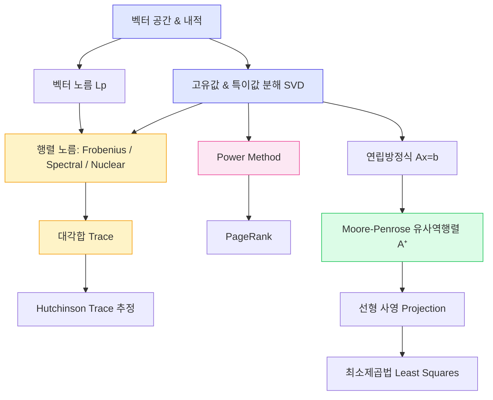

# 04. 노름(Norms), 대각합(Trace), 연립방정식 풀이 & 관련 기법

> "벡터와 행렬의 '크기'를 재는 방법을 알면, 딥러닝의 손실 함수부터 정규화까지 모든 것이 연결된다."

---

## 1. 선행 개념 연결 Mermaid 다이어그램



**읽는 법**: 파란색 = 선행 필수 개념, 노란색 = 이번 핵심 주제, 초록색 = 응용, 분홍색 = 선택(opt.) 주제

---

## 2. 개념별 5단계 완전 분리 설명

---

### 2-A. 벡터 노름 (Vector Norm)

#### ① 초등 단계 — "길이를 재는 자"

길이를 재려면 자가 필요하다. 수학에서 "벡터의 길이"를 재는 도구가 **노름(norm)** 이다.

- 화살표 `→` 의 길이 = 노름
- 예: 오른쪽 3칸, 위로 4칸 이동한 화살표의 길이는 `√(3²+4²) = 5`

#### ② 중등 단계 — "피타고라스에서 일반화로"

2차원 피타고라스 정리를 n차원으로 확장하면 **L2 노름(유클리드 노름)** 이 된다.

$$\|v\|_2 \equiv \|v\| := \sqrt{v_1^2 + v_2^2 + \cdots + v_n^2}$$

**핵심:** 이것은 우리가 일상에서 쓰는 "거리" 개념의 수학적 표현이다.

#### ③ 고등 단계 — "Lp 노름 패밀리"

L2만 있는 게 아니다. **p값에 따라 다른 노름** 이 존재한다:

| 노름 | 정의 | 직관 |
|------|------|------|
| $\|v\|_p$ | $(|v_1|^p + |v_2|^p + \cdots + |v_n|^p)^{1/p}$ | p에 따라 "크기"의 기준이 달라짐 |
| $\|v\|_1$ | $|v_1| + |v_2| + \cdots + |v_n|$ | 맨해튼 거리 (L1) |
| $\|v\|_2$ | $\sqrt{v_1^2 + \cdots + v_n^2}$ | 유클리드 거리 (L2) |
| $\|v\|_\infty$ | $\max_i |v_i|$ | 가장 큰 성분 하나 |
| $\|v\|_0$ | $\sum_i \mathbf{1}(v_i \neq 0)$ | 0이 아닌 원소 개수 (엄밀히는 노름 아님) |

**주의:** L0 "노름"은 삼각부등식을 만족하지 않아 진정한 의미의 노름이 아니다. 관례적으로 이름만 노름이다.

#### ④ 대학 단계 — "행렬 노름과 딥러닝"

벡터 노름에서 행렬 노름으로 확장한다. 슬라이드(p.65)에서 세 가지 핵심 행렬 노름을 정의한다:

| 행렬 노름 | 정의 | 의미 |
|-----------|------|------|
| **Nuclear (trace) norm** $\|A\|_*$ | $\sum_i |\sigma_i| = \|\sigma\|_1$ | 특이값의 L1 노름; 저랭크 근사에 사용 |
| **Frobenius norm** $\|A\|_F$ | $\sqrt{\sum_{i,j} a_{ij}^2} = \|\sigma\|_2$ | 모든 원소의 제곱합의 제곱근; 특이값의 L2 노름 |
| **Spectral (operator) norm** $\|A\|_\sigma$ | $\sup_{x \neq 0} \frac{\|Ax\|}{\|x\|} = \sigma_{\max}(A) = \|\sigma\|_\infty$ | 최대 특이값; 행렬이 벡터를 최대 얼마나 늘리는가 |

```python
import numpy as np

A = np.array([[1, 2], [3, 4], [5, 6]])

# 벡터 노름
v = np.array([3, 4])
print(f"L1 norm: {np.linalg.norm(v, ord=1)}")       # 7.0
print(f"L2 norm: {np.linalg.norm(v, ord=2)}")       # 5.0
print(f"Linf norm: {np.linalg.norm(v, ord=np.inf)}") # 4.0

# 행렬 노름
sigma = np.linalg.svd(A, compute_uv=False)
print(f"Nuclear norm: {np.sum(sigma)}")               # ||σ||_1
print(f"Frobenius norm: {np.linalg.norm(A, 'fro')}")  # ||σ||_2
print(f"Spectral norm: {np.linalg.norm(A, 2)}")       # σ_max
```

#### ⑤ 대학원 단계 — "노름의 쌍대성과 정규화 이론"

**연구 포인트:** 딥러닝에서 노름은 정규화(regularization)의 핵심 도구다.

- **L2 정규화 (weight decay)**: $\lambda\|W\|_F^2$ — 가중치를 골고루 작게 유지
- **L1 정규화**: $\lambda\|W\|_1$ — 희소성(sparsity) 유도
- **Nuclear norm 정규화**: $\lambda\|W\|_*$ — 저랭크 구조 유도 (행렬 완성 문제)
- **Spectral norm 정규화**: GAN의 판별자 안정화 (Spectral Normalization)

노름 간의 관계: $\|A\|_\sigma \leq \|A\|_F \leq \|A\|_*$ (항상 성립)

> **오개념 경고:** "Frobenius 노름은 L2 노름이다"라고 단순히 말하면 안 된다. Frobenius 노름은 **행렬 원소에 대한** L2 노름이자 **특이값 벡터에 대한** L2 노름이다. 벡터의 L2 노름과 혼동하지 말 것.

**설명하기 훈련:** "후배에게 Nuclear norm과 Frobenius norm의 차이를 특이값 관점에서 30초 안에 설명해보라."

**성취 확인:** $A = \text{diag}(3, 1, 0)$ 일 때 $\|A\|_*, \|A\|_F, \|A\|_\sigma$ 를 각각 구할 수 있는가?
→ 답: 4, $\sqrt{10}$, 3

---

### 2-B. Power Method (거듭제곱법)

#### ① 초등 단계 — "같은 규칙을 반복하면 답이 나온다"

같은 계산을 계속 반복하면, 어느 순간 값이 더 이상 변하지 않게 된다. 이것이 "수렴"이다.

#### ② 중등 단계 — "행렬을 계속 곱하면?"

행렬 $A$에 벡터 $u$를 계속 곱하면, 결과가 특정 방향으로 정렬된다. 이 방향이 **가장 큰 고유값에 대응하는 고유벡터** 다.

#### ③ 고등 단계 — "최대 고유값/특이값 찾기 알고리즘"

**최대 특이값(singular value)** 계산:
$$v \leftarrow Au / \|Au\|, \quad u \leftarrow A^\top v / \|A^\top v\|$$
반복 수렴 후 $\sigma = v^\top A u$ 반환.

**최대 고유값(eigenvalue)** 계산 (대칭 행렬 $A$):
$$u \leftarrow Au / \|Au\|$$
반복 수렴 후 $\lambda = u^\top A u$ 반환.

#### ④ 대학 단계 — "수렴 속도와 수학적 분석"

슬라이드(p.67~70)의 핵심 분석:

랜덤 초기 벡터 $u_0$에서 시작하여 $u_t \leftarrow A^t u_0$로 반복하면:

$$\xi_t = \frac{u_t^\top A u_t}{\|u_t\|^2} = \frac{\sum_i \lambda_i^{2t+1} a_i^2}{\sum_i \lambda_i^{2t} a_i^2}$$

오차의 기대값은 **지수적으로 감소**:

$$\mathbb{E}[\text{err}(\xi_t)] \leq \sqrt{2n} \left(\frac{\lambda_2}{\lambda_1}\right)^t \leq \sqrt{2n} \exp(-\gamma t)$$

여기서 $\text{err}(\xi_t) = \frac{\lambda_1 - \xi_t}{\lambda_1}$, $\gamma = \frac{\lambda_1 - \lambda_2}{\lambda_1}$ (spectral gap).

```python
import numpy as np

def power_method_eigenvalue(A, num_iter=100):
    """대칭 행렬 A의 최대 고유값과 고유벡터를 Power Method로 계산"""
    n = A.shape[0]
    u = np.random.randn(n)
    u = u / np.linalg.norm(u)

    for _ in range(num_iter):
        Au = A @ u
        u = Au / np.linalg.norm(Au)

    eigenvalue = u.T @ A @ u
    return eigenvalue, u

def power_method_singular(A, num_iter=100):
    """행렬 A의 최대 특이값과 좌/우 특이벡터를 Power Method로 계산"""
    m, n = A.shape
    u = np.random.randn(n)
    u = u / np.linalg.norm(u)

    for _ in range(num_iter):
        v = A @ u
        v = v / np.linalg.norm(v)
        u = A.T @ v
        u = u / np.linalg.norm(u)

    sigma = v.T @ A @ u
    return sigma, u, v

# 검증
A_sym = np.array([[4, 1], [1, 3]])
lam, u = power_method_eigenvalue(A_sym)
print(f"Power Method 고유값: {lam:.4f}")
print(f"NumPy 고유값: {np.linalg.eigvalsh(A_sym)[-1]:.4f}")
```

**핵심:** 수렴 속도는 $\lambda_2/\lambda_1$ 비율(spectral gap)에 의해 결정된다. 두 번째로 큰 고유값이 첫 번째와 가까울수록 수렴이 느리다.

#### ⑤ 대학원 단계 — "두 번째 고유값 이후 & 응용"

**연구 포인트:** 두 번째로 큰 고유값을 구하려면 deflation을 사용한다:
$$A' = A - \lambda u u^\top$$
이 $A'$에 다시 Power Method를 적용하면 두 번째 고유값을 얻는다.

슬라이드(p.68~70)의 증명 핵심:
- $\cos^2(v_1, u_t)$가 1로 수렴함을 보인다 (즉, $u_t$가 $v_1$ 방향으로 정렬)
- $\sin^2(v_1, u_t) \leq \tan^2(v_1, u_0) \cdot (\lambda_2/\lambda_1)^{2t}$
- 기대값 바운드에서 Jensen 부등식과 정규분포 성질 활용

> **오개념 경고:** Power Method는 **최대** 고유값만 직접 구한다. 최소 고유값을 구하려면 $A^{-1}$에 Power Method를 적용하는 Inverse Power Method를 사용해야 한다.

**설명하기 훈련:** "Power Method의 수렴 속도가 spectral gap에 의존하는 이유를 직관적으로 설명해보라."

**성취 확인:** $A = \text{diag}(5, 4, 1)$일 때 Power Method의 수렴 비율 $\lambda_2/\lambda_1$은? → 답: 4/5 = 0.8

---

### 2-C. PageRank와 Power Method

#### ① 초등 단계 — "인기 투표"

웹페이지도 인기 투표를 한다. 많은 페이지가 링크를 걸어주는 페이지가 더 중요하다.

#### ② 중등 단계 — "링크가 곧 투표"

4개의 웹페이지가 서로 링크로 연결되어 있다. 각 페이지의 "중요도"를 숫자로 매기고 싶다.

#### ③ 고등 단계 — "전이 확률 행렬"

슬라이드(p.64)의 예시에서 전이 확률 행렬:

$$P = \begin{bmatrix} 0 & 0 & 1 & 1/2 \\ 1/3 & 0 & 0 & 0 \\ 1/3 & 1/2 & 0 & 1/2 \\ 1/3 & 1/2 & 0 & 0 \end{bmatrix}$$

Google 행렬: $G = \alpha P + (1-\alpha)\mathbf{1}\mathbf{1}^\top / 4$

여기서 $\alpha$는 damping factor (보통 0.85). 초기 벡터 $u_0 = \mathbf{1}/4$에서 시작하여 $u_{t+1} = G u_t$를 반복하면 PageRank 벡터로 수렴한다.

#### ④ 대학 단계 — "Power Method로 PageRank 계산"

```python
import numpy as np

P = np.array([
    [0,   0,   1,   1/2],
    [1/3, 0,   0,   0  ],
    [1/3, 1/2, 0,   1/2],
    [1/3, 1/2, 0,   0  ]
])

def pagerank(P, alpha=0.85, num_iter=50):
    n = P.shape[0]
    G = alpha * P + (1 - alpha) * np.ones((n, n)) / n
    u = np.ones(n) / n
    for _ in range(num_iter):
        u = G @ u
    return u

# alpha = 1 (순수 전이)
pr1 = pagerank(P, alpha=1.0)
print(f"PageRank (α=1.0): {pr1}")

# alpha = 0.85 (damping)
pr2 = pagerank(P, alpha=0.85)
print(f"PageRank (α=0.85): {pr2}")
```

**핵심:** PageRank는 본질적으로 전이 행렬 $G$의 **최대 고유값(=1)에 대응하는 고유벡터**를 Power Method로 구하는 것이다.

#### ⑤ 대학원 단계 — "수렴 보장과 Perron-Frobenius"

**연구 포인트:** damping factor $\alpha < 1$을 쓰는 이유:
- $G$가 항상 양(positive)인 행렬이 되어 Perron-Frobenius 정리 적용 가능
- 유일한 정상 분포(stationary distribution) 존재 보장
- $\alpha = 1$이면 순환(cycle)이나 흡수 상태(absorbing state) 문제 발생 가능

> **오개념 경고:** "PageRank 벡터는 전이 행렬의 고유벡터"라고만 말하면 부족하다. 정확히는 **좌(left) 고유벡터** 또는 동등하게 $G^\top$의 우(right) 고유벡터다. 위 코드에서는 $P$가 열(column) 확률 행렬이므로 $Gu$가 바로 정상 분포를 준다.

**성취 확인:** $\alpha = 0.85$에서 $u_3$를 손으로 계산할 수 있는가?

---

### 2-D. 대각합 (Trace)

#### ① 초등 단계 — "대각선 위의 숫자를 더한다"

정사각 표(행렬)에서 왼쪽 위부터 오른쪽 아래로 대각선을 따라가며 숫자를 모두 더한 것이 **대각합(trace)** 이다.

#### ② 중등 단계 — "고유값의 합"

$$\text{Tr}(A) \equiv \sum_i a_{ii}$$

놀라운 사실: 대각합은 **고유값의 합**과 같다! $\text{Tr}(A) = \sum_i \lambda_i$

#### ③ 고등 단계 — "Trace의 핵심 성질들"

슬라이드(p.66)의 성질 정리:

| 성질 | 수식 |
|------|------|
| 전치 불변 | $\text{Tr}(A^\top) = \text{Tr}(A)$ |
| 선형성 | $\text{Tr}(A + B) = \text{Tr}(A) + \text{Tr}(B)$ |
| 순환 성질 | $\text{Tr}(AB) = \text{Tr}(BA)$ |
| 고유값 합 | $\text{Tr}(A) = \sum_i \lambda_i$ |
| Frobenius 연결 | $\|A\|_F^2 = \text{Tr}(A^\top A)$ |
| 이차형식 | $x^\top A x = \text{Tr}(x^\top A x) = \text{Tr}(A x x^\top)$ |

**주의:** 순환 성질 $\text{Tr}(AB) = \text{Tr}(BA)$는 $AB \neq BA$여도 성립한다! 단, 행렬 곱의 차원이 맞아야 한다.

#### ④ 대학 단계 — "Trace와 딥러닝 연결"

```python
import numpy as np

A = np.array([[2, 1], [1, 3]])

# Trace 계산
print(f"Trace: {np.trace(A)}")  # 5

# 고유값의 합과 비교
eigenvalues = np.linalg.eigvalsh(A)
print(f"고유값 합: {np.sum(eigenvalues)}")  # 5.0

# Frobenius norm과 Trace 관계
fro_sq = np.linalg.norm(A, 'fro')**2
tr_AtA = np.trace(A.T @ A)
print(f"||A||_F^2 = {fro_sq}, Tr(A^T A) = {tr_AtA}")  # 동일

# 이차형식의 Trace 표현
x = np.array([1, 2])
quadratic = x.T @ A @ x
trace_form = np.trace(A @ np.outer(x, x))
print(f"x^T A x = {quadratic}, Tr(A x x^T) = {trace_form}")  # 동일
```

**핵심:** $x^\top A x = \text{Tr}(x^\top A x) = \text{Tr}(A x x^\top)$ — 이 변환은 기대값 계산에서 매우 자주 쓰인다:

$$\mathbb{E}[x^\top A x] = \text{Tr}(A \, \mathbb{E}[x x^\top])$$

#### ⑤ 대학원 단계 — "Hutchinson Trace 추정"

슬라이드(p.67): 대규모 행렬의 trace를 **직접 계산하지 않고** 추정하는 방법.

$\mathbb{E}[x x^\top] = I$ (예: $x \sim \mathcal{N}(0, I)$)를 이용하면:

$$\mathbb{E}[x^\top A x] = \text{Tr}(A)$$

**Hutchinson 추정기**: $s$개의 랜덤 벡터로 Monte Carlo 추정:

$$\text{Tr}(A) \approx \frac{1}{s} \sum_{i=1}^s x_i^\top A x_i$$

**연구 포인트:**
- 분산: $\text{Var}[x^\top A x] = 2\|A\|_F^2$ (정규분포일 때)
- $s \geq 8\epsilon^{-1}$ 샘플이면 높은 확률($\geq 3/4$)로 상대오차 $\leq \epsilon$
- 응용: Frobenius norm 추정 ($\mathbb{E}[\|Ax\|^2] = \text{Tr}(A^\top A) = \|A\|_F^2$)
- 딥러닝 응용: Hessian의 trace 추정 → 곡률(curvature) 파악, 이차 최적화

```python
import numpy as np

def hutchinson_trace(A, num_samples=1000):
    """Hutchinson 방법으로 Trace 추정"""
    n = A.shape[0]
    estimates = []
    for _ in range(num_samples):
        x = np.random.randn(n)
        estimates.append(x.T @ A @ x)
    return np.mean(estimates)

A = np.diag([1, 2, 3, 4, 5])
exact_trace = np.trace(A)  # 15
estimated_trace = hutchinson_trace(A, num_samples=5000)
print(f"정확한 Trace: {exact_trace}")
print(f"Hutchinson 추정: {estimated_trace:.2f}")
```

> **오개념 경고:** Hutchinson 추정기는 $A$의 원소에 직접 접근하지 않고 **행렬-벡터 곱 $Ax$만으로** trace를 추정한다. 이것이 핵심이다 — 대규모 행렬에서는 대각 원소 접근 자체가 비쌀 수 있다 (예: 암묵적 행렬).

**설명하기 훈련:** "$\mathbb{E}[x^\top A x] = \text{Tr}(A)$가 왜 성립하는지 trace의 순환 성질과 $\mathbb{E}[xx^\top] = I$를 사용하여 증명해보라."

**성취 확인:** Frobenius norm을 행렬-벡터 곱만으로 추정하는 방법을 설명할 수 있는가?

---

### 2-E. 연립방정식 풀이 (Solving Linear Systems)

#### ① 초등 단계 — "미지수 찾기"

사과 1개와 배 2개를 사면 1000원, 사과 2개와 배 1개를 사면 800원이다. 사과와 배의 가격은?

#### ② 중등 단계 — "연립방정식"

슬라이드(p.68)의 예:

$$x_1 + 2x_2 - x_3 = 1$$
$$2x_1 - 2x_2 + 4x_3 = -2$$
$$-x_1 + \tfrac{1}{2}x_2 - x_3 = 0$$

이것을 행렬로 쓰면: $Ax = b$

#### ③ 고등 단계 — "역행렬이 있으면 해가 하나"

$A$가 정사각이고 역행렬이 존재하면: $x = A^{-1}b$ (유일해)

하지만 현실에서는:
- $A$가 정사각이 아닐 수 있다 (방정식 수 ≠ 미지수 수)
- $A$가 특이(singular)할 수 있다

→ **일반적 해법이 필요하다**: 유사역행렬(pseudo-inverse)

#### ④ 대학 단계 — "Back Substitution과 수치 해법"

```python
import numpy as np

# 슬라이드 예제
A = np.array([
    [1,  2, -1],
    [2, -2,  4],
    [-1, 0.5, -1]
])
b = np.array([1, -2, 0])

# 직접 풀기
x = np.linalg.solve(A, b)
print(f"해: {x}")
print(f"검증 Ax = {A @ x}")  # b와 같아야 함
```

#### ⑤ 대학원 단계 — "해의 존재성과 구조"

슬라이드(p.72): $Ax = b$의 해가 존재할 때 ($b \in \text{im}(A)$), 모든 해는:

$$x \in A^+ b + \ker(A)$$

여기서 $A^+ b$는 **최소 노름 해(minimum norm solution)** 이고, $\ker(A)$는 영공간이다.

> **오개념 경고:** "$Ax = b$의 해는 $x = A^{-1}b$"라고만 기억하면 안 된다. 이것은 $A$가 정사각 가역행렬일 때만 성립한다. 일반적으로는 유사역행렬 $A^+$를 사용한다.

---

### 2-F. Moore-Penrose 유사역행렬 (Pseudo-inverse)

#### ① 초등 단계 — "나눗셈의 일반화"

6 ÷ 2 = 3처럼, 행렬에서도 "나누기"를 하고 싶다. 하지만 직사각 행렬은 역행렬이 없다. **유사역행렬**은 "가능한 한 가까운 나누기"를 해준다.

#### ② 중등 단계 — "가장 가까운 답"

연립방정식에 정확한 답이 없을 때, **오차를 가장 줄이는 답**을 찾아준다.

#### ③ 고등 단계 — "Moore-Penrose 조건"

슬라이드(p.69): $A \in \mathbb{R}^{m \times n}$에 대해 $A^+$는 다음 4가지를 **동시에** 만족하는 유일한 행렬:

1. $A A^+ A = A$
2. $A^+ A A^+ = A^+$
3. $(A A^+)^\top = A A^+$ (대칭)
4. $(A^+ A)^\top = A^+ A$ (대칭)

#### ④ 대학 단계 — "SVD를 통한 계산과 성질"

$A = \sum_i \sigma_i u_i v_i^\top$ (SVD) 이면:

$$A^+ = \sum_i \frac{1}{\sigma_i} v_i u_i^\top \quad (\sigma_i \neq 0)$$

슬라이드(p.70)의 추가 성질:
- $(A^\top)^+ = (A^+)^\top$
- $A^+ = (A^\top A)^+ A^\top = A^\top (A A^\top)^+$
- 직교 열벡터로 구성된 $A$: $A^+ = A^\top$
- $m = n$이고 $A$가 비특이: $A^+ = A^{-1}$

```python
import numpy as np

A = np.array([[1, 2], [3, 4], [5, 6]])

# NumPy의 유사역행렬
A_pinv = np.linalg.pinv(A)
print(f"A+ shape: {A_pinv.shape}")  # (2, 3)

# Moore-Penrose 조건 검증
print("AA+A ≈ A:", np.allclose(A @ A_pinv @ A, A))
print("A+AA+ ≈ A+:", np.allclose(A_pinv @ A @ A_pinv, A_pinv))
print("(AA+)^T ≈ AA+:", np.allclose((A @ A_pinv).T, A @ A_pinv))
print("(A+A)^T ≈ A+A:", np.allclose((A_pinv @ A).T, A_pinv @ A))

# SVD로 직접 계산
U, S, Vt = np.linalg.svd(A, full_matrices=False)
S_inv = np.diag(1.0 / S)
A_pinv_svd = Vt.T @ S_inv @ U.T
print("SVD 유사역행렬 일치:", np.allclose(A_pinv, A_pinv_svd))
```

#### ⑤ 대학원 단계 — "멱등성과 사영 해석"

슬라이드(p.72)의 핵심 결과:
- $A^+ A$는 **멱등(idempotent)** 행렬: $(A^+ A)^2 = A^+ A$
- $I - A^+ A$도 멱등
- $\ker(A) = \text{im}(I - A^+ A)$
- $\ker(A^+ A) = \ker(A)$

**연구 포인트:** 멱등 행렬 $B$에 대해 $\ker(B) = \text{im}(I - B)$가 성립하는 이유:
- $x \in \text{im}(I-B)$이면 $x = (I-B)y$이므로 $Bx = B(I-B)y = By - B^2y = 0$ → $x \in \ker(B)$
- $x \in \ker(B)$이면 $Bx = 0$이므로 $x = (I-B)x \in \text{im}(I-B)$

> **오개념 경고:** $A^+ A \neq I$ (일반적으로). $A^+ A = I$가 되는 것은 $A$의 열들이 선형독립일 때뿐이다.

---

### 2-G. 선형 사영 (Linear Projection) & 최소제곱법

#### ① 초등 단계 — "그림자 만들기"

햇빛이 비추면 3D 물체가 바닥에 그림자(2D)를 만든다. 이것이 **사영(projection)** 이다.

#### ② 중등 단계 — "가장 가까운 점 찾기"

직선 위에서 점 P에 가장 가까운 점은? → 수선의 발!

#### ③ 고등 단계 — "열공간으로의 사영"

슬라이드(p.71): $b \in \mathbb{R}^m$을 $A$의 열공간 $\text{im}(A)$로 사영:

$$\text{Proj}(b; A) = \arg\min_{\hat{b} \in \text{im}(A)} \|b - \hat{b}\| = A A^+ b$$

이것은 **최소제곱(least squares)** 문제와 동일:

$$x^* = \arg\min_x \|b - Ax\|^2, \quad \text{Proj}(b; A) = Ax^*$$

#### ④ 대학 단계 — "벡터 사영과 행렬 사영"

벡터 $a$로의 사영: $\text{Proj}(b; a) = a \frac{a^\top b}{\|a\|^2}$

행렬 $A$의 열공간으로의 사영: $\text{Proj}(b; A) = A A^+ b$

```python
import numpy as np

# 벡터 사영
a = np.array([1, 0, 0], dtype=float)
b = np.array([3, 4, 5], dtype=float)
proj_vec = a * (a.T @ b) / (np.linalg.norm(a)**2)
print(f"벡터 사영: {proj_vec}")  # [3, 0, 0]

# 행렬 열공간으로의 사영
A = np.array([[1, 0], [0, 1], [0, 0]], dtype=float)  # xy 평면
b = np.array([3, 4, 5], dtype=float)
A_pinv = np.linalg.pinv(A)
proj_mat = A @ A_pinv @ b
print(f"열공간 사영: {proj_mat}")  # [3, 4, 0] (xy 평면으로)

# 최소제곱법
A2 = np.array([[1, 1], [1, 2], [1, 3]], dtype=float)
b2 = np.array([1, 2, 2], dtype=float)
x_ls, residuals, rank, sv = np.linalg.lstsq(A2, b2, rcond=None)
print(f"최소제곱 해: {x_ls}")
print(f"사영: {A2 @ x_ls}")
```

#### ⑤ 대학원 단계 — "딥러닝에서의 사영"

**연구 포인트:**
- 선형 회귀의 해 $x^* = A^+ b$는 열공간 사영의 직접적 결과
- Residual = $b - Ax^* = (I - AA^+)b$ — 이것은 $\ker(A^\top)$에 속함
- 딥러닝에서 사영은 attention mechanism, layer normalization 등에 등장

> **오개념 경고:** 사영 행렬 $AA^+$는 $A$의 열공간으로의 **직교 사영**이다. 임의의 부분공간으로의 사영을 이해해야 한다.

**설명하기 훈련:** "최소제곱법이 왜 열공간으로의 직교 사영과 동일한지 기하학적으로 설명해보라."

**성취 확인:** $A = [1; 1; 1]$ (열벡터), $b = [1, 2, 3]^\top$일 때 $\text{Proj}(b; A)$를 구할 수 있는가?
→ 답: $[2, 2, 2]^\top$

---

## 3. 수학-딥러닝 연결 지점 요약표

| 수학 개념 | 딥러닝 활용 | 구체적 예시 |
|-----------|------------|------------|
| **L2 노름** | 손실 함수 (MSE), Weight decay | `loss = ||y - ŷ||²`, `λ||W||²` |
| **L1 노름** | 희소 정규화, MAE 손실 | Lasso, `loss = ||y - ŷ||₁` |
| **Frobenius 노름** | 행렬 정규화, 모델 복잡도 측정 | `||W||_F²` in regularization |
| **Spectral 노름** | GAN 안정화, Lipschitz 제약 | Spectral Normalization (Miyato et al.) |
| **Nuclear 노름** | 저랭크 행렬 완성, 추천 시스템 | Matrix completion, LoRA의 이론적 배경 |
| **Power Method** | 최대 특이값 계산, PageRank | Spectral norm 계산, 그래프 신경망 |
| **Trace** | Hessian trace → 곡률 추정 | Fisher information, Natural gradient |
| **Hutchinson 추정** | 대규모 Hessian trace 근사 | 2차 최적화, 모델 압축 |
| **유사역행렬 $A^+$** | 최소제곱 해, 선형 회귀 | `np.linalg.lstsq`, 정규방정식 |
| **선형 사영** | Attention, 차원 축소 | Self-attention의 Q, K, V 사영 |
| **$Ax = b$ 풀기** | 뉴턴법 스텝, 선형 시스템 | $H^{-1}g$ 계산 (2차 최적화) |

---

## 4. 핵심 킬러 요약

> **킬러 문장 1:** 노름은 "크기를 재는 자"다. 어떤 자를 쓰느냐(L1, L2, Linf)에 따라 같은 벡터도 다른 크기를 갖는다.

> **킬러 문장 2:** Power Method는 "행렬을 계속 곱하면 가장 큰 고유값 방향으로 정렬된다"는 원리를 이용한다. 수렴 속도는 spectral gap $\gamma = (\lambda_1 - \lambda_2)/\lambda_1$에 의해 결정된다.

> **킬러 문장 3:** Trace는 "대각 원소의 합 = 고유값의 합"이다. $\text{Tr}(AB) = \text{Tr}(BA)$ 순환 성질은 기대값 계산에서 핵심 도구다.

> **킬러 문장 4:** Hutchinson 방법은 "$\mathbb{E}[x^\top A x] = \text{Tr}(A)$"라는 한 줄의 등식으로 대규모 행렬의 trace를 행렬-벡터 곱만으로 추정한다.

> **킬러 문장 5:** Moore-Penrose 유사역행렬 $A^+$는 "역행렬이 없어도 가장 좋은 근사 해를 준다." $A^+ b$는 최소 노름 최소제곱 해다.

> **킬러 문장 6:** 선형 사영 $\text{Proj}(b; A) = AA^+b$는 "열공간에서 $b$에 가장 가까운 점"이다. 최소제곱법의 기하학적 본질이 바로 이것이다.

> **킬러 문장 7:** 행렬의 세 가지 노름($\|A\|_*, \|A\|_F, \|A\|_\sigma$)은 모두 특이값으로 표현되며, 각각 L1, L2, Linf 노름에 대응한다.

---

## 5. 단계별 오개념 교정 카드 모음

### 카드 1: L0 "노름"은 노름이 아니다
| 항목 | 내용 |
|------|------|
| **오개념** | "L0 노름은 다른 Lp 노름의 p=0인 특수한 경우다" |
| **교정** | L0는 삼각부등식을 만족하지 않아 수학적으로 노름이 아니다. $\|v\|_0 = \sum_i \mathbf{1}(v_i \neq 0)$은 0이 아닌 원소의 **개수**일 뿐이다. 관례적으로만 "노름"이라 부른다. |
| **단계** | ③ 고등 |

### 카드 2: Frobenius 노름 ≠ 벡터 L2 노름
| 항목 | 내용 |
|------|------|
| **오개념** | "Frobenius 노름은 그냥 L2 노름이다" |
| **교정** | Frobenius 노름은 행렬의 모든 원소를 하나의 긴 벡터로 펼쳤을 때의 L2 노름이다. 또한 특이값 벡터의 L2 노름이기도 하다. 벡터의 L2 노름과는 적용 대상이 다르다. |
| **단계** | ④ 대학 |

### 카드 3: Spectral 노름의 정의
| 항목 | 내용 |
|------|------|
| **오개념** | "Spectral 노름은 가장 큰 고유값이다" |
| **교정** | Spectral 노름은 가장 큰 **특이값** $\sigma_{\max}$이다. 고유값과 특이값은 다르다! 대칭 양정치 행렬에서만 최대 고유값 = 최대 특이값이다. 일반 행렬에서 고유값은 복소수일 수 있지만 특이값은 항상 비음수 실수다. |
| **단계** | ④ 대학 |

### 카드 4: Power Method의 수렴 조건
| 항목 | 내용 |
|------|------|
| **오개념** | "Power Method는 항상 수렴한다" |
| **교정** | 초기 벡터 $u_0$가 최대 고유벡터와 직교하면 수렴하지 않는다 (확률 0이지만 이론적으로 가능). 또한 $\lambda_1 = \lambda_2$ (중복 최대 고유값)이면 spectral gap이 0이 되어 수렴 속도가 보장되지 않는다. |
| **단계** | ④ 대학 |

### 카드 5: $A^+A \neq I$
| 항목 | 내용 |
|------|------|
| **오개념** | "유사역행렬은 역행렬과 비슷하니까 $A^+A = I$일 것이다" |
| **교정** | 일반적으로 $A^+A \neq I$. $A^+A$는 $A$의 행공간으로의 직교 사영 행렬이다 (멱등). $A^+A = I$가 되려면 $A$의 열들이 선형독립이어야 한다 ($m \geq n$이고 $\text{rank}(A) = n$). |
| **단계** | ⑤ 대학원 |

### 카드 6: Trace의 순환 성질 범위
| 항목 | 내용 |
|------|------|
| **오개념** | "$\text{Tr}(ABC) = \text{Tr}(CBA)$이므로 어떤 순서든 상관없다" |
| **교정** | 순환(cyclic) 치환만 가능하다: $\text{Tr}(ABC) = \text{Tr}(BCA) = \text{Tr}(CAB)$. 하지만 $\text{Tr}(ABC) \neq \text{Tr}(ACB)$ (일반적으로). 순서를 뒤집는 것은 안 된다, **순환** 이동만 된다. |
| **단계** | ③ 고등 |

### 카드 7: PageRank의 damping factor
| 항목 | 내용 |
|------|------|
| **오개념** | "damping factor $\alpha$는 단순히 수렴 속도를 조절하는 하이퍼파라미터다" |
| **교정** | $\alpha < 1$은 수학적으로 $G$를 **원시(primitive)** 행렬로 만들어 Perron-Frobenius 정리의 조건을 보장한다. $\alpha = 1$이면 dangling node나 순환 구조에서 수렴하지 않을 수 있다. |
| **단계** | ⑤ 대학원 |

### 카드 8: Hutchinson 추정의 전제 조건
| 항목 | 내용 |
|------|------|
| **오개념** | "아무 랜덤 벡터나 쓰면 Hutchinson 추정이 된다" |
| **교정** | $\mathbb{E}[xx^\top] = I$를 만족하는 분포에서 샘플링해야 한다. 대표적으로 $x \sim \mathcal{N}(0, I)$ 또는 Rademacher 분포($\pm 1$ 균등). 임의 분포를 쓰면 바이어스가 생긴다. |
| **단계** | ⑤ 대학원 |

### 카드 9: 최소제곱 해의 유일성
| 항목 | 내용 |
|------|------|
| **오개념** | "최소제곱 해 $x^* = A^+ b$는 유일하다" |
| **교정** | $\ker(A) \neq \{0\}$이면 최소제곱 해는 무한히 많다: $x \in A^+b + \ker(A)$. $A^+b$는 그 중 **노름이 가장 작은** 해(minimum norm solution)이므로 유일하지만, 최소제곱 해 자체는 유일하지 않을 수 있다. |
| **단계** | ⑤ 대학원 |

---

> "이 개념들을 완전히 이해하면, 딥러닝의 정규화, 최적화, 안정성 분석의 수학적 기초가 탄탄해진다. 하나하나 천천히, 하지만 확실하게 자기 것으로 만들자."
