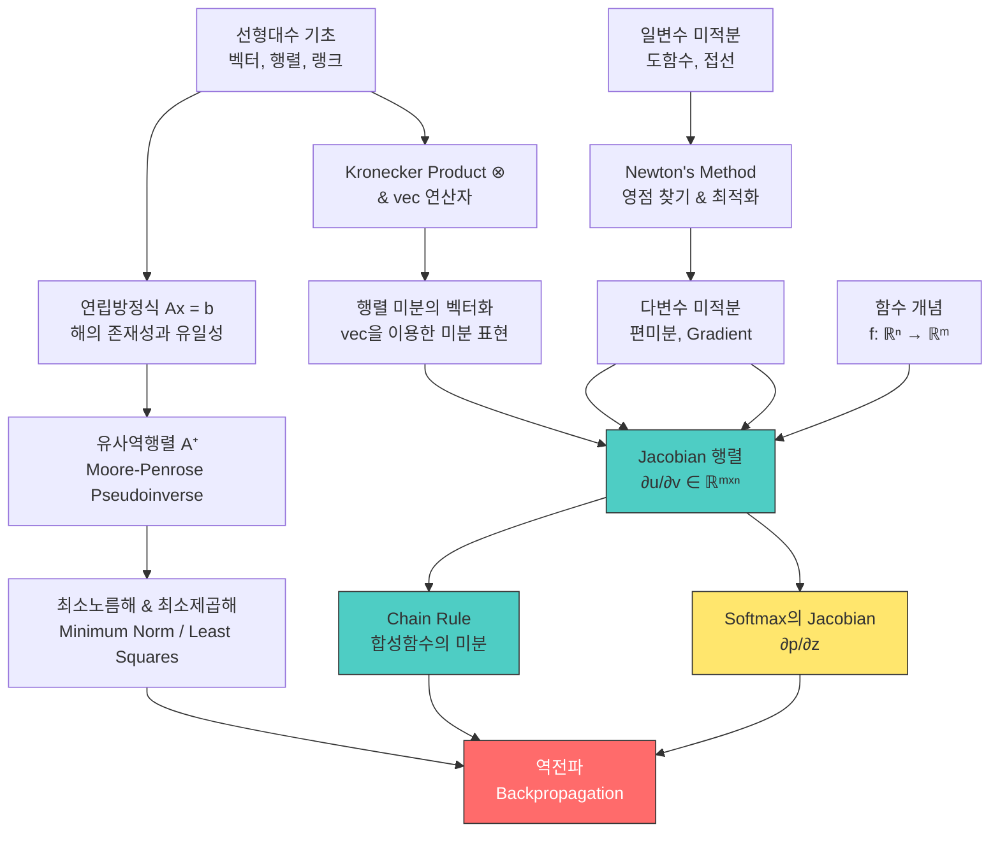

# 05. 미적분학 & 행렬 미적분 (Calculus & Matrix Calculus)

> **동기부여**: 딥러닝의 핵심 알고리즘인 역전파(Backpropagation)는 결국 **편미분의 연쇄법칙(Chain Rule)**을 행렬 단위로 수행하는 것이다. 행렬 미적분을 이해하지 못하면 신경망이 "왜" 학습되는지 절대 이해할 수 없다. 이 장은 그 수학적 기초를 완성하는 관문이다.

---

## 1. 선행 개념 연결 Mermaid 다이어그램



---

## 2. 개념별 5단계 완전 분리 설명

---

### 개념 A: 연립방정식 Ax = b의 해 (슬라이드 81-83)

#### ① 초등학생 단계
연립방정식은 "미지수 찾기 게임"이다. 예를 들어 "사과 2개와 배 3개를 사면 1300원, 사과 1개와 배 2개를 사면 800원"이면, 사과와 배의 가격을 찾는 것이다. 답이 딱 하나일 수도 있고, 여러 개일 수도 있고, 아예 없을 수도 있다.

#### ② 중등학생 단계
$Ax = b$에서 $A$는 계수행렬, $x$는 미지수벡터, $b$는 결과벡터이다.
- **해가 하나**: 방정식 수와 미지수 수가 딱 맞고 모순 없을 때
- **해가 무한히 많음**: 방정식이 부족하거나 중복될 때
- **해가 없음**: 방정식끼리 모순될 때

#### ③ 고등학생 단계
해의 존재 조건은 $b$가 $A$의 상(image)에 속하는지로 판단한다.
- $b \in \text{im}(A)$: 해가 존재
  - $\text{rank}(A) = n$ (열 수): 유일한 해 $x = A^{-1}b$
  - $\text{rank}(A) < n$: 무한히 많은 해 → **최소노름해(minimum norm solution)** 탐색
- $b \notin \text{im}(A)$: 해가 없음 → **최소제곱해(least-squares solution)** 탐색: $\arg\min_x \|Ax - b\|^2$

#### ④ 대학 단계

**핵심:** Moore-Penrose 유사역행렬 $A^+$는 모든 경우를 통합하는 도구이다.

해가 존재할 때($b \in \text{im}(A)$), 일반해는:

$$x = A^+b + (I - A^+A)w \quad (\text{임의의 } w)$$

- $\text{rank}(I - A^+A) = 0 \Leftrightarrow \text{rank}(A) = n$: 유일한 해
- $\text{rank}(I - A^+A) > 0$: 무한히 많은 해
- $\text{rank}(I - A^+A) = \dim(\ker(A)) = n - \text{rank}(A)$

**최소노름해**: $A^+Ax^*$와 $(I - A^+A)w$는 **직교**하므로, 노름을 최소화하려면 $w = 0$으로 설정:

$$x^* = A^+b$$

**직교 증명** (슬라이드 83):
$$\langle A^+Ax^*, (I - A^+A)w \rangle = x^{*\top}(A^+A)^\top(I - A^+A)w = x^{*\top}(A^+A)(I - A^+A)w = 0$$

이는 Moore-Penrose 조건에 의한 $A^+A$의 **멱등성(idempotence)** 때문이다.

**해가 없을 때**: $x = A^+b$는 최소제곱해를 준다.

```python
import numpy as np

# 유일한 해 (full rank)
A1 = np.array([[2, 1], [1, 3]])
b1 = np.array([5, 7])
x1 = np.linalg.solve(A1, b1)
print(f"유일한 해: {x1}")  # [1.6, 1.8]

# 최소제곱해 (overdetermined, 해 없음)
A2 = np.array([[1, 1], [1, 2], [1, 3]])
b2 = np.array([1, 2, 4])
x2 = np.linalg.lstsq(A2, b2, rcond=None)[0]
print(f"최소제곱해: {x2}")

# 유사역행렬 사용
A3 = np.array([[1, 2], [2, 4]])  # rank 1, 무한히 많은 해
b3 = np.array([3, 6])
A3_pinv = np.linalg.pinv(A3)
x3 = A3_pinv @ b3  # 최소노름해
print(f"최소노름해: {x3}")
print(f"검증 Ax = b: {A3 @ x3}")
```

#### ⑤ 대학원 단계

**연구 포인트:** 딥러닝에서 과매개변수화(overparameterized) 모델은 $\text{rank}(A) < n$ 상황과 유사하다. 무한히 많은 해 중에서 경사하강법(SGD)이 찾는 해가 왜 **최소노름해에 가까운지**가 현대 딥러닝 이론의 핵심 질문 중 하나이다 (implicit regularization).

유사역행렬의 SVD 표현: $A = U\Sigma V^\top$이면 $A^+ = V\Sigma^+U^\top$으로, 특이값이 0인 방향을 제거하여 안정적 역변환을 수행한다.

> **오개념 경고:** "역행렬이 없으면 방정식을 풀 수 없다"는 틀렸다. 유사역행렬 $A^+$를 사용하면 어떤 경우든 "최선의 해"를 구할 수 있다.

> **설명하기 훈련:** "후배에게 $Ax = b$의 세 가지 경우(유일해, 무한해, 해 없음)를 각각 기하학적으로 설명하라. 유사역행렬이 각 경우에 어떤 역할을 하는가?"

> **성취 확인:** $A \in \mathbb{R}^{3 \times 5}$이고 $\text{rank}(A) = 2$일 때, 해 공간의 차원은? (답: $5 - 2 = 3$)

---

### 개념 B: vec 연산자와 Kronecker Product (슬라이드 84-85)

#### ① 초등학생 단계
행렬을 "접어서" 한 줄로 늘어놓는 방법이 있다. 2x2 표를 세로로 읽으면 4칸짜리 한 줄이 된다.

#### ② 중등학생 단계
$\text{vec}$ 연산자는 행렬의 열(column)을 위에서 아래로 차례대로 쌓아 하나의 긴 벡터로 만든다.

$$\text{vec}\begin{pmatrix} 1 & 2 \\ 3 & 4 \end{pmatrix} = \begin{pmatrix} 1 \\ 3 \\ 2 \\ 4 \end{pmatrix}$$

**주의:** 행이 아니라 **열** 순서로 쌓는다! (슬라이드 84에서는 행 순서(1,2,3,4)로 보이지만, 표준 정의는 열 우선이다. 강의 자료의 convention을 확인할 것.)

#### ③ 고등학생 단계
**Kronecker Product** $A \otimes B$는 $A$의 각 원소에 $B$ 전체를 곱해서 만든 블록 행렬이다.

$A \in \mathbb{R}^{m \times n}, B \in \mathbb{R}^{p \times q}$이면:

$$A \otimes B = \begin{bmatrix} a_{11}B & \cdots & a_{1n}B \\ \vdots & \ddots & \vdots \\ a_{m1}B & \cdots & a_{mn}B \end{bmatrix} \in \mathbb{R}^{mp \times nq}$$

#### ④ 대학 단계

Kronecker product의 핵심 성질들:

| 성질 | 수식 |
|------|------|
| 전치 | $(A \otimes B)^\top = A^\top \otimes B^\top$ |
| 역행렬 | $(A \otimes B)^{-1} = A^{-1} \otimes B^{-1}$ |
| 혼합곱 | $(A \otimes B)(C \otimes D) = (AC) \otimes (BD)$ |
| vec 변환 | $(A \otimes B)\text{vec}(C) = \text{vec}(BCA^\top)$ |
| 벡터 경우 | $(a \otimes b)^\top\text{vec}(C) = b^\top C a$ |

**핵심:** $(A \otimes B)\text{vec}(C) = \text{vec}(BCA^\top)$은 행렬 미분에서 행렬의 미분을 벡터화하여 다룰 때 필수적이다. 이것이 **행렬 미적분의 기계적 계산**을 가능하게 한다.

```python
import numpy as np

A = np.array([[1, 2], [3, 4]])
B = np.array([[5, 6], [7, 8]])

# vec 연산 (column-major)
vec_A = A.flatten(order='F')  # [1, 3, 2, 4]
print(f"vec(A) = {vec_A}")

# Kronecker product
K = np.kron(A, B)
print(f"A ⊗ B =\n{K}")
print(f"크기: {K.shape}")  # (4, 4)

# vec 변환 성질 검증: (A ⊗ B)vec(C) = vec(BCA^T)
C = np.array([[1, 0], [0, 1]])
lhs = np.kron(A, B) @ C.flatten(order='F')
rhs = (B @ C @ A.T).flatten(order='F')
print(f"성질 검증: {np.allclose(lhs, rhs)}")  # True
```

#### ⑤ 대학원 단계

**연구 포인트:** Kronecker product는 신경망의 **Fisher Information Matrix**를 효율적으로 근사하는 **K-FAC (Kronecker-Factored Approximate Curvature)** 최적화 알고리즘의 핵심이다. 레이어별 기울기의 Kronecker 구조를 활용하여 2차 최적화를 실용적으로 구현한다.

> **오개념 경고:** vec 연산의 column-major vs row-major 순서를 혼동하면 모든 공식이 틀어진다. NumPy의 `flatten()` 기본은 row-major(`order='C'`)이므로 `order='F'`를 명시해야 한다.

> **설명하기 훈련:** "왜 행렬의 미분을 다룰 때 vec 연산자가 필요한가? 행렬을 벡터로 바꾸면 어떤 이점이 있는가?"

> **성취 확인:** $(A \otimes B)\text{vec}(C) = \text{vec}(BCA^\top)$에서 $A \in \mathbb{R}^{2 \times 3}$, $B \in \mathbb{R}^{4 \times 5}$, $C$의 크기는? (답: $C \in \mathbb{R}^{5 \times 3}$)

---

### 개념 C: Schur Complements & Sherman-Morrison-Woodbury (슬라이드 86)

#### ① 초등학생 단계
커다란 문제를 작은 조각으로 나눠서 풀 수 있는 비법이 있다.

#### ② 중등학생 단계
블록 행렬(큰 행렬을 작은 행렬들로 나눈 것)의 역행렬을 구하는 공식이다. 직접 역행렬을 구하기 어려울 때 조각별로 계산할 수 있게 해준다.

#### ③ 고등학생 단계
**Schur Complement**: 블록 행렬 $\begin{pmatrix} A & B \\ C & D \end{pmatrix}$에서 $D$에 대한 Schur complement는 $A - BD^{-1}C$이다. 이를 이용하면 블록 행렬의 역행렬, 행렬식 등을 조각별로 계산할 수 있다.

#### ④ 대학 단계

**Sherman-Morrison-Woodbury 공식:**

$$(A + UCV)^{-1} = A^{-1} - A^{-1}U(C^{-1} + VA^{-1}U)^{-1}VA^{-1}$$

**핵심:** 큰 행렬 $A$의 역행렬을 이미 알고 있을 때, 저랭크 업데이트 $UCV$가 추가되어도 작은 행렬의 역행렬만 새로 구하면 된다.

```python
import numpy as np

# Sherman-Morrison-Woodbury 검증
n = 5
A = np.random.randn(n, n)
A = A @ A.T + np.eye(n)  # 양정치 대칭 행렬
U = np.random.randn(n, 2)
C = np.eye(2)
V = np.random.randn(2, n)

# 직접 역행렬
direct = np.linalg.inv(A + U @ C @ V)

# SMW 공식
A_inv = np.linalg.inv(A)
smw = A_inv - A_inv @ U @ np.linalg.inv(C + V @ A_inv @ U) @ V @ A_inv

print(f"SMW 공식 검증: {np.allclose(direct, smw)}")  # True
```

#### ⑤ 대학원 단계

**연구 포인트:** SMW 공식은 Gaussian Process에서 커널 행렬 업데이트, 칼만 필터, 그리고 **LoRA (Low-Rank Adaptation)** 같은 효율적 fine-tuning에서 핵심적이다. $n \times n$ 역행렬 대신 $r \times r$ (저랭크) 역행렬만 계산하여 $O(n^3) \to O(nr^2)$로 복잡도를 줄인다.

> **오개념 경고:** SMW 공식은 $A$가 가역이고 $C^{-1} + VA^{-1}U$도 가역일 때만 성립한다.

> **성취 확인:** LoRA에서 가중치 업데이트 $W + BA$가 왜 SMW와 관련되는지 설명할 수 있는가?

---

### 개념 D: Newton's Method (슬라이드 89-91)

#### ① 초등학생 단계
"정답에 점점 가까워지는 추측 게임"이다. 추측을 하고, 얼마나 틀렸는지 보고, 더 나은 추측을 한다. 이것을 반복하면 정답에 도달한다.

#### ② 중등학생 단계
$\sqrt{7}$을 구하고 싶다면? $x^2 = 7$, 즉 $f(x) = x^2 - 7 = 0$의 해를 찾는 것이다.
- 초기 추측: $x_0 = 3$ (왜냐하면 $3^2 = 9$로 7에 가까우니까)
- 접선을 그어서 x축과 만나는 점을 다음 추측으로 사용

#### ③ 고등학생 단계
접선의 방정식: $f'(x_n)(x - x_n) + f(x_n) = 0$

$x = x_{n+1}$로 놓으면:

$$x_{n+1} = x_n - \frac{f(x_n)}{f'(x_n)}$$

**Heron의 방법** ($\sqrt{7}$ 구하기, 슬라이드 91):

$$x_{t+1} = \frac{1}{2}\left(x_t + \frac{7}{x_t}\right)$$

| 단계 | 값 | 소수 전개 |
|------|-----|-----------|
| $x_0$ | 3 | 3.000... |
| $x_1$ | 16/6 | 2.666... |
| $x_2$ | 127/48 | 2.6458... |
| $x_3$ | 32257/12192 | 2.6457513... |
| $x_\infty$ | $\sqrt{7}$ | 2.6457513110645905905... |

4번만 반복해도 소수점 아래 15자리까지 정확! 이것이 Newton's method의 **2차 수렴(quadratic convergence)** 위력이다.

#### ④ 대학 단계

**핵심:** Newton's method가 최적화와 연결되는 지점 (슬라이드 90 각주 46):

만약 $f(x) = \nabla_x L(x)$ (즉, $f$가 손실함수 $L$의 gradient)라면, Newton's method로 $f(x) = 0$을 찾는 것은 **$L$의 극값(최소/최대)을 찾는 것**이다!

$$x_{n+1} = x_n - \frac{\nabla L(x_n)}{\nabla^2 L(x_n)} = x_n - [H(x_n)]^{-1}\nabla L(x_n)$$

여기서 $H = \nabla^2 L$은 **Hessian 행렬**이다. 이것이 **2차 최적화(second-order optimization)**의 기초이다.

```python
import numpy as np

# Newton's method로 sqrt(7) 구하기
def newton_sqrt7(x0, n_iter=5):
    x = x0
    for i in range(n_iter):
        f_x = x**2 - 7        # f(x)
        f_prime_x = 2 * x      # f'(x)
        x = x - f_x / f_prime_x  # Newton update
        print(f"x_{i+1} = {x:.20f}")
    return x

print("=== Newton's method (sqrt(7)) ===")
result = newton_sqrt7(3.0)
print(f"\nnp.sqrt(7) = {np.sqrt(7):.20f}")

# 다변수 Newton's method (최적화)
def newton_optimize_2d(f_grad, f_hessian, x0, n_iter=10):
    x = np.array(x0, dtype=float)
    for i in range(n_iter):
        g = f_grad(x)
        H = f_hessian(x)
        x = x - np.linalg.solve(H, g)
    return x

# 예: f(x,y) = (x-1)^2 + (y-2)^2 최소화
grad = lambda x: np.array([2*(x[0]-1), 2*(x[1]-2)])
hess = lambda x: np.array([[2, 0], [0, 2]])
result = newton_optimize_2d(grad, hess, [0, 0])
print(f"\n2D Newton 최적화 결과: {result}")  # [1, 2]
```

#### ⑤ 대학원 단계

**연구 포인트:** 딥러닝에서 순수 Newton's method는 Hessian 계산이 $O(n^2)$ 메모리, $O(n^3)$ 시간이 필요해서 비실용적이다. 이를 근사하는 방법들:
- **L-BFGS**: Hessian의 저랭크 근사
- **K-FAC**: Kronecker 구조를 활용한 Fisher 행렬 근사
- **Natural Gradient**: Fisher Information Matrix 기반

경사하강법(GD)은 Newton's method에서 Hessian을 항등행렬로 근사한 것: $x_{n+1} = x_n - \alpha \nabla L(x_n)$

> **오개념 경고:** "Newton's method는 항상 수렴한다"는 틀렸다. 초기값이 나쁘면 발산할 수 있고, $f'(x_n) = 0$이면 정의되지 않는다.

> **설명하기 훈련:** "경사하강법(1차)과 Newton's method(2차)의 차이를 곡률(curvature) 관점에서 설명하라. 왜 2차 방법이 더 빠르게 수렴하는가?"

> **성취 확인:** Heron의 방법이 Newton's method의 특수한 경우임을 $f(x) = x^2 - 7$에서 유도하라.

---

### 개념 E: 함수의 관점 - Vector, Function, Matrix (슬라이드 84, 85, 86)

#### ① 초등학생 단계
- **벡터**는 "것(thing)" - 숫자들의 묶음
- **함수**는 "조작(manipulation)" - 입력을 받아 출력을 내는 기계
- **행렬**은 함수를 "선형으로 근사"하는 도구

#### ② 중등학생 단계
뇌에는 특정 대상(예: 특정 유명인)에만 반응하는 뉴런이 있다. 이것을 **Grandmother Cell** (또는 "Jennifer Aniston neuron")이라 부른다. 이 뉴런은 하나의 **함수**로, 입력(시각 자극)을 받아 출력(반응/무반응)을 내보낸다.

#### ③ 고등학생 단계
딥러닝에서 각 레이어는 함수 $f: \mathbb{R}^n \to \mathbb{R}^m$이다.
- 입력: $n$차원 벡터 (예: 이미지 픽셀)
- 출력: $m$차원 벡터 (예: 클래스별 점수)
- 이 함수를 이해하려면 **미적분**이 필요하다

#### ④ 대학 단계

**핵심:** 행렬은 선형함수의 표현이고, 미적분은 비선형함수를 국소적으로 선형 근사하는 도구이다.

"matrix - linear approximation - calculus - to understand a (complex) function" (슬라이드 92)

$f: \mathbb{R}^n \to \mathbb{R}^m$에서:
- $n = 1, m = 1$: 일반 미분 $f'(x)$ (스칼라)
- $n > 1, m = 1$: Gradient $\nabla f$ (벡터)
- $n > 1, m > 1$: Jacobian $\frac{\partial u}{\partial v}$ (행렬)

**역전파와의 연결**: 신경망의 각 레이어가 $f_i: \mathbb{R}^{n_i} \to \mathbb{R}^{n_{i+1}}$이면, 전체 네트워크는 합성함수 $f = f_L \circ \cdots \circ f_1$이다. 역전파는 각 레이어의 Jacobian을 **역순으로 곱하는** Chain Rule이다.

#### ⑤ 대학원 단계

**연구 포인트:** Grandmother Cell 가설은 현대 신경과학에서 **분산 표현(distributed representation)** vs **국소 표현(local representation)** 논쟁과 연결된다. 딥러닝의 은닉층 뉴런도 유사한 현상을 보인다 (feature visualization).

> **성취 확인:** 3-layer MLP에서 입력 $x \in \mathbb{R}^{784}$, 은닉층 $\mathbb{R}^{256}$, $\mathbb{R}^{128}$, 출력 $\mathbb{R}^{10}$일 때, 각 레이어의 Jacobian 크기는?

---

### 개념 F: 행렬 미적분 표기법 - Gradient & Jacobian (슬라이드 95)

#### ① 초등학생 단계
여러 개의 조절 손잡이(knob)가 있을 때, 각 손잡이를 살짝 돌리면 결과가 얼마나 바뀌는지를 측정한 것이 "기울기(gradient)"이다.

#### ② 중등학생 단계
$y = f(x_1, x_2)$에서 $x_1$만 살짝 바꾸면 $y$가 얼마나 변하는지: $\frac{\partial y}{\partial x_1}$ (편미분). 모든 변수에 대한 편미분을 모으면 **Gradient**가 된다.

#### ③ 고등학생 단계
**편미분 → 역전파의 핵심 도구**: 신경망의 손실(loss)을 각 가중치(weight)에 대해 편미분하면, 그 가중치를 어떻게 조절해야 손실이 줄어드는지 알 수 있다. 이것이 바로 학습이다!

#### ④ 대학 단계

**Numerator Layout Convention** (슬라이드 95, 이 강의에서 사용):

$s \in \mathbb{R}$ (스칼라), $v \in \mathbb{R}^n$ (벡터), $u \in \mathbb{R}^m$ (벡터)일 때:

**1. 벡터를 스칼라로 미분 (벡터 → 스칼라):**
$$\frac{\partial v}{\partial s} := \begin{bmatrix} \frac{\partial v_1}{\partial s} \\ \vdots \\ \frac{\partial v_n}{\partial s} \end{bmatrix} \in \mathbb{R}^n$$

**2. 스칼라를 벡터로 미분 (스칼라 → 벡터, 예: 손실함수 $L$의 gradient):**
$$\frac{\partial s}{\partial v} := \begin{bmatrix} \frac{\partial s}{\partial v_1} & \frac{\partial s}{\partial v_2} & \cdots & \frac{\partial s}{\partial v_n} \end{bmatrix} \in \mathbb{R}^{1 \times n}$$

**3. Gradient (전치하여 열벡터로):**
$$\nabla_v s := \left(\frac{\partial s}{\partial v}\right)^\top \in \mathbb{R}^n$$

예: 손실함수 $L$의 파라미터 $\theta$에 대한 gradient: $\nabla_\theta L = \left(\frac{\partial L}{\partial \theta}\right)^\top$

**4. Jacobian 행렬 (벡터 → 벡터):**
$$\frac{\partial u}{\partial v} := \begin{bmatrix} \frac{\partial u_1}{\partial v_1} & \frac{\partial u_1}{\partial v_2} & \cdots & \frac{\partial u_1}{\partial v_n} \\ \frac{\partial u_2}{\partial v_1} & \frac{\partial u_2}{\partial v_2} & \cdots & \frac{\partial u_2}{\partial v_n} \\ \vdots & \vdots & \ddots & \vdots \\ \frac{\partial u_m}{\partial v_1} & \frac{\partial u_m}{\partial v_2} & \cdots & \frac{\partial u_m}{\partial v_n} \end{bmatrix} \in \mathbb{R}^{m \times n}$$

**핵심:** Jacobian의 $(i, j)$ 원소는 "$j$번째 입력이 살짝 변할 때 $i$번째 출력이 얼마나 변하는가"이다.

**역전파에서의 Chain Rule**: $L = g(f(x))$이면:
$$\frac{\partial L}{\partial x} = \frac{\partial L}{\partial f} \cdot \frac{\partial f}{\partial x}$$
이것은 Jacobian의 행렬곱이다! 역전파는 이 곱을 **출력에서 입력 방향으로** 순차적으로 계산한다.

```python
import numpy as np

# Softmax 함수와 그 Jacobian
def softmax(z):
    exp_z = np.exp(z - np.max(z))  # 수치 안정성
    return exp_z / exp_z.sum()

def softmax_jacobian(z):
    """Softmax의 Jacobian: ∂p/∂z"""
    p = softmax(z)
    # J_ij = p_i(δ_ij - p_j)
    return np.diag(p) - np.outer(p, p)

# 슬라이드 95의 질문: ∂p/∂z where p_i = exp(z_i)/Σexp(z_k)
z = np.array([2.0, 1.0, 0.1])
p = softmax(z)
J = softmax_jacobian(z)

print(f"z = {z}")
print(f"p = softmax(z) = {p}")
print(f"\nJacobian ∂p/∂z =")
print(J)
print(f"\n크기: {J.shape}")  # (3, 3) = (C, C)

# 검증: 수치 미분과 비교
eps = 1e-7
J_numerical = np.zeros_like(J)
for j in range(len(z)):
    z_plus = z.copy()
    z_plus[j] += eps
    J_numerical[:, j] = (softmax(z_plus) - p) / eps

print(f"\n수치 미분 검증: {np.allclose(J, J_numerical, atol=1e-5)}")  # True

# 역전파 예시: Cross-entropy loss의 gradient
# L = -Σ y_i log(p_i), ∂L/∂z = p - y (유명한 결과!)
y = np.array([1, 0, 0])  # one-hot label
dL_dp = -y / p            # ∂L/∂p
dL_dz = dL_dp @ J         # ∂L/∂z = ∂L/∂p · ∂p/∂z (Chain Rule!)
print(f"\n∂L/∂z (via chain rule) = {dL_dz}")
print(f"p - y (직접 계산)      = {p - y}")
print(f"일치 여부: {np.allclose(dL_dz, p - y)}")  # True!
```

#### ⑤ 대학원 단계

**연구 포인트:** Numerator layout vs Denominator layout은 순전히 convention 문제이지만, 혼용하면 전치(transpose) 오류가 발생한다. 주요 참고문헌별 convention:
- Magnus & Neudecker: denominator layout (Jacobian이 $n \times m$)
- Petersen & Pedersen (Matrix Cookbook): numerator layout
- 이 강의: **numerator layout** (Jacobian이 $m \times n$)

슬라이드 95 각주 48의 명언: "수학은 언어이다. 사람들이 무언가를 발견하고 단어와 기호를 만든다. 처음 선택은 대개 나쁘다... 그러나 어떤 사람은 옛 방식을, 어떤 사람은 새 방식을 쓴다."

**Softmax Jacobian의 구조적 의미**: $\frac{\partial p_i}{\partial z_j} = p_i(\delta_{ij} - p_j)$에서:
- 대각 원소 ($i=j$): $p_i(1 - p_i)$ → 자기 자신에 대한 민감도
- 비대각 원소 ($i \neq j$): $-p_i p_j$ → 다른 클래스 간 경쟁 관계

이 구조 때문에 Cross-entropy + Softmax의 역전파가 $p - y$라는 깔끔한 형태가 된다.

> **오개념 경고:** "Gradient는 열벡터다"와 "$\frac{\partial s}{\partial v}$는 행벡터다"를 혼동하면 안 된다. Gradient $\nabla_v s$는 $\frac{\partial s}{\partial v}$의 **전치**이다. 코드에서 shape 불일치 버그의 흔한 원인이다.

> **설명하기 훈련:** "Cross-entropy loss + Softmax의 역전파 결과가 왜 $p - y$라는 단순한 형태가 되는지, Jacobian을 이용하여 유도하라."

> **성취 확인:** $f: \mathbb{R}^5 \to \mathbb{R}^3$의 Jacobian 크기는? $g: \mathbb{R}^3 \to \mathbb{R}$의 gradient 크기는? 합성함수 $g \circ f$의 gradient 크기는?

---

## 3. 수학-딥러닝 연결 지점 요약표

| 수학 개념 | 딥러닝 대응 | 왜 중요한가 |
|-----------|------------|------------|
| $Ax = b$ 풀기 | 선형 레이어의 순전파 | 입력 $x$로부터 출력 $b$ 생성 |
| Pseudoinverse $A^+$ | 최소제곱 학습, 선형 회귀 | Closed-form 해: $\theta = (X^\top X)^{-1}X^\top y$ |
| 최소노름해 | Implicit regularization of SGD | 과매개변수 모델에서 SGD가 찾는 해의 특성 |
| Kronecker product $\otimes$ | K-FAC 최적화, Fisher 행렬 근사 | 2차 최적화의 실용적 구현 |
| vec 연산자 | 행렬 미분의 벡터화 | 가중치 행렬의 gradient 계산 |
| Sherman-Morrison-Woodbury | LoRA, 저랭크 업데이트 | 효율적 fine-tuning |
| Newton's method | 2차 최적화 (L-BFGS, K-FAC) | 빠른 수렴, Hessian 활용 |
| **Gradient** $\nabla_\theta L$ | **역전파로 계산하는 핵심 대상** | **모든 학습의 기초** |
| **Jacobian** $\frac{\partial u}{\partial v}$ | **레이어별 미분, 역전파의 빌딩 블록** | **Chain Rule의 행렬 표현** |
| **Chain Rule** | **역전파 알고리즘 그 자체** | **$\frac{\partial L}{\partial x} = \frac{\partial L}{\partial f} \cdot \frac{\partial f}{\partial x}$** |
| Softmax Jacobian | 분류 문제의 출력층 역전파 | $\frac{\partial L}{\partial z} = p - y$ 유도의 핵심 |
| 편미분 $\frac{\partial}{\partial x_i}$ | 각 가중치의 업데이트 방향 결정 | 경사하강법: $\theta \leftarrow \theta - \alpha \nabla_\theta L$ |

---

## 4. 핵심 킬러 요약

> **킬러 요약 1**: 편미분은 역전파의 원자(atom)이다. Jacobian은 편미분의 행렬이다. Chain Rule은 Jacobian의 곱이다. 역전파는 Chain Rule을 뒤에서 앞으로 계산하는 것이다. 이 네 문장이 딥러닝 학습의 수학적 본질 전체이다.

> **킬러 요약 2**: $Ax = b$에서 해가 없으면 "가장 가까운 해"를 찾고(최소제곱), 해가 무한히 많으면 "가장 작은 해"를 찾는다(최소노름). 유사역행렬 $A^+ $는 두 경우를 모두 처리한다. 딥러닝에서 과매개변수 모델의 학습도 본질적으로 같은 문제이다.

> **킬러 요약 3**: Newton's method는 "함수의 접선으로 다음 추측을 구하는" 반복법이다. 이를 최적화로 확장하면 "gradient의 영점을 찾는 것 = 손실함수의 극값을 찾는 것"이 된다. 경사하강법은 Newton's method에서 Hessian을 $\frac{1}{\alpha}I$로 근사한 것이다.

> **킬러 요약 4**: Softmax의 Jacobian $\frac{\partial p}{\partial z}$에서 $J_{ij} = p_i(\delta_{ij} - p_j)$이다. 이것과 Cross-entropy를 Chain Rule로 결합하면 $\frac{\partial L}{\partial z} = p - y$라는 놀랍도록 단순한 결과가 나온다. 이 우아함이 Softmax + Cross-entropy 조합이 표준인 이유이다.

> **킬러 요약 5**: vec 연산자는 행렬을 벡터로 펴서 미분을 "벡터-벡터" 관계로 환원하고, Kronecker product는 이 벡터화된 미분의 구조를 표현한다. $(A \otimes B)\text{vec}(C) = \text{vec}(BCA^\top)$은 행렬 미적분의 로제타 스톤이다.

---

## 5. 단계별 오개념 교정 카드 모음

### 카드 1: "역행렬이 없으면 끝이다"

| 항목 | 내용 |
|------|------|
| **오개념** | 역행렬이 존재하지 않으면 $Ax = b$를 풀 수 없다 |
| **교정** | 유사역행렬(pseudoinverse) $A^+$를 사용하면 모든 경우에 "최선의 해"를 구할 수 있다. 유일해가 있으면 그 해를, 무한해이면 최소노름해를, 해가 없으면 최소제곱해를 반환한다 |
| **단계** | ③ 고등 이상 |
| **딥러닝 연결** | `np.linalg.lstsq`가 바로 이 원리. 선형 회귀의 normal equation도 동일 |

### 카드 2: "Gradient는 행벡터다" vs "Gradient는 열벡터다"

| 항목 | 내용 |
|------|------|
| **오개념** | Gradient의 shape에 대한 혼란 |
| **교정** | $\frac{\partial s}{\partial v}$는 $1 \times n$ **행벡터** (numerator layout). $\nabla_v s = (\frac{\partial s}{\partial v})^\top$는 $n \times 1$ **열벡터**. 코드에서는 보통 열벡터(또는 1D array)로 다루지만, 수식 convention을 확인해야 한다 |
| **단계** | ④ 대학 이상 |
| **딥러닝 연결** | PyTorch의 `.grad`는 파라미터와 같은 shape. 행/열 혼동은 shape 불일치 에러의 주범 |

### 카드 3: "Newton's method는 항상 빠르게 수렴한다"

| 항목 | 내용 |
|------|------|
| **오개념** | Newton's method는 무조건 2차 수렴하고 항상 정답에 도달한다 |
| **교정** | 초기값이 해에 충분히 가까울 때만 2차 수렴이 보장된다. 초기값이 나쁘면 발산하거나 진동할 수 있다. $f'(x_n) = 0$이면 정의조차 안 된다 |
| **단계** | ③ 고등 이상 |
| **딥러닝 연결** | 이것이 딥러닝에서 2차 최적화가 널리 쓰이지 않는 이유 중 하나 (수렴 보장 어려움 + Hessian 계산 비용) |

### 카드 4: "Jacobian과 Gradient는 같은 것이다"

| 항목 | 내용 |
|------|------|
| **오개념** | 둘 다 편미분 모음이니까 같은 것 아닌가? |
| **교정** | Gradient: 스칼라 함수 $f: \mathbb{R}^n \to \mathbb{R}$의 미분 → **벡터** ($n$ 차원). Jacobian: 벡터 함수 $f: \mathbb{R}^n \to \mathbb{R}^m$의 미분 → **행렬** ($m \times n$). Gradient는 Jacobian의 특수한 경우($m = 1$)의 전치이다 |
| **단계** | ④ 대학 이상 |
| **딥러닝 연결** | 손실함수 $L$은 스칼라 출력이므로 gradient 사용. 중간 레이어는 벡터 출력이므로 Jacobian 사용. 역전파는 둘을 Chain Rule로 연결 |

### 카드 5: "vec은 그냥 reshape이다"

| 항목 | 내용 |
|------|------|
| **오개념** | vec 연산은 단순히 행렬을 1차원으로 펴는 것이지 수학적 의미는 없다 |
| **교정** | vec 연산은 **column-major** 순서로 쌓는 것이며, Kronecker product와 결합하여 행렬 미분의 체계적 계산을 가능하게 한다. $(A \otimes B)\text{vec}(C) = \text{vec}(BCA^\top)$ 같은 항등식은 vec의 특정 순서에 의존한다 |
| **단계** | ④ 대학 이상 |
| **딥러닝 연결** | PyTorch의 `flatten()`과 vec의 순서가 다를 수 있다. NumPy에서는 `flatten(order='F')`가 vec에 대응 |

### 카드 6: "편미분이랑 역전파는 다른 것이다"

| 항목 | 내용 |
|------|------|
| **오개념** | 편미분은 수학이고 역전파는 알고리즘이니까 별개 아닌가? |
| **교정** | 역전파는 편미분의 Chain Rule을 **효율적으로 계산하는 알고리즘**이다. 수학적으로 $\frac{\partial L}{\partial w} = \frac{\partial L}{\partial y} \cdot \frac{\partial y}{\partial w}$를 출력부터 역순으로 계산하여, 중간 결과를 재사용하는 동적 프로그래밍이다 |
| **단계** | ③ 고등 이상 |
| **딥러닝 연결** | 이것이 이 장의 핵심 메시지: **편미분 = 역전파의 핵심 도구** |

### 카드 7: "SMW 공식은 이론적 장난감이다"

| 항목 | 내용 |
|------|------|
| **오개념** | Sherman-Morrison-Woodbury는 교과서에서나 나오는 실용성 없는 공식이다 |
| **교정** | LoRA (Low-Rank Adaptation)는 거대 언어모델의 가중치를 저랭크로 업데이트하는 기법으로, SMW와 직접 연결된다. 또한 Kalman filter, Gaussian Process 등에서 핵심적으로 사용된다 |
| **단계** | ⑤ 대학원 |
| **딥러닝 연결** | LLM fine-tuning의 표준 기법인 LoRA의 수학적 기초 |

---

> **마무리 동기부여**: 이 장에서 다룬 내용 -- 유사역행렬, Newton's method, Gradient, Jacobian, Chain Rule -- 은 모두 하나의 이야기로 연결된다. 복잡한 함수(신경망)를 이해하기 위해 국소적으로 선형 근사(미분)하고, 그 근사를 이용해 함수를 개선(최적화)하는 것. 이것이 딥러닝의 수학적 골격이다. 행렬 미적분은 이 골격의 언어이며, 역전파는 이 언어로 쓰인 가장 우아한 알고리즘이다.
