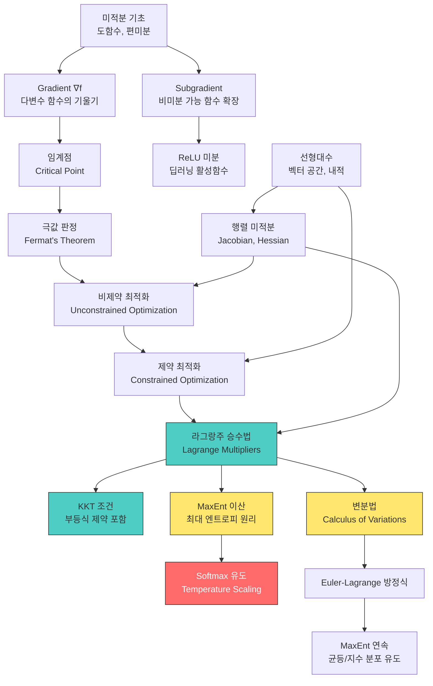

# 06. 최적화 & 제약 최적화 (Optimization & Constrained Optimization)

> **동기부여**: 딥러닝은 본질적으로 **손실 함수를 최소화하는 최적화 문제**이다. 제약 조건이 없는 단순 최적화부터 등식/부등식 제약이 있는 제약 최적화, 그리고 함수 공간에서의 변분법까지 — 이 모든 도구가 정규화, softmax 유도, 확률분포 학습 등 딥러닝의 핵심 구성요소를 수학적으로 정당화하는 기반이 된다.

---

## 1. 선행 개념 연결 Mermaid 다이어그램

---

## 2. 개념별 5단계 완전 분리 설명

---

### 개념 1: 임계점과 극값 판정 (Critical Point & Extrema) (슬라이드 100-101)

#### ① 초등학생 단계
산을 올라가다 보면 "정상"이 있고, 골짜기에는 "바닥"이 있다. 정상이나 바닥에서는 잠깐 평평해진다 — 오르막도 내리막도 아닌 지점이다. 이런 "평평한 지점"을 찾는 것이 최적화의 시작이다.

#### ② 중등학생 단계
함수 $f(x)$에서 기울기가 0인 점, 즉 $f'(x) = 0$인 점을 **임계점(critical point)** 또는 **정류점(stationary point)**이라 한다. 예: $f(x) = x^2$이면 $f'(x) = 2x = 0$에서 $x = 0$이 임계점이고 이 점이 최솟값이다.

#### ③ 고등학생 단계
**페르마 정리(Fermat's Theorem, 내부 극값 정리)**: 개구간 $(a, b)$에서 $f$가 미분 가능하고 $x$가 극값이면, $f'(x) = 0$이다. 즉 극값이면 반드시 임계점이다 (역은 성립하지 않음 — $f(x) = x^3$에서 $x=0$은 임계점이지만 극값이 아님).

**극값 존재 위치** (정리):
함수 $f$의 정의역 $A$ 위에서 극값은 다음 세 가지 중 하나에서만 존재한다:
1. **경계(boundary)**에서
2. **미분 불가능점**에서
3. **임계점**에서

#### ④ 대학 단계
미분 가능한 $f : \mathbb{R} \to \mathbb{R}$에 대해:

$$x \text{가 극값} \implies f'(x) = 0$$

이는 **필요조건(necessary condition)**이지 충분조건이 아니다. 슬라이드 101에서 강조하는 것처럼, 역방향 화살표($\Leftarrow$)에는 줄이 그어져 있다:

$$x \text{가 극값} \stackrel{\not\Leftarrow}{\implies} f'(x) = 0$$

**극값 판정법 (Second Derivative Test)**:
- $f'(x_0) = 0$이고 $f''(x_0) > 0$: 극소
- $f'(x_0) = 0$이고 $f''(x_0) < 0$: 극대
- $f'(x_0) = 0$이고 $f''(x_0) = 0$: 판정 불가 (고차 도함수 필요)

다변수의 경우 Hessian 행렬 $H = \nabla^2 f(x)$의 **고유값**으로 판정:
- 모든 고유값 > 0 (양정치): 극소
- 모든 고유값 < 0 (음정치): 극대
- 부호 혼합: 안장점(saddle point)

#### ⑤ 대학원 단계
딥러닝의 손실 함수 landscape에서는 **안장점(saddle point)**이 극소보다 훨씬 많다. 고차원 공간에서는 모든 고유값이 양수일 확률이 기하급수적으로 감소하기 때문이다 (Dauphin et al., 2014). 따라서 SGD가 "나쁜 극소"에 빠지는 것보다 안장점 근처에서 느려지는 것이 더 큰 문제이며, momentum이나 Adam 같은 적응적 방법이 이를 극복한다.

**Morse Theory** 관점에서 비퇴화 임계점(non-degenerate critical point)의 index(음의 고유값 수)는 loss landscape의 위상적 성질을 결정한다.

---

### 개념 2: 열미분 (Subgradient) (슬라이드 99)

#### ① 초등학생 단계
"접선"은 매끈한 곡선에만 그을 수 있다. 그런데 $|x|$ 같은 "뾰족한" 함수에서는 꼭짓점에서 접선을 하나로 정할 수 없다. 이때 "이 아래에 있는 직선들"을 모두 모아놓은 게 열미분(subgradient)이다.

#### ② 중등학생 단계
함수 아래쪽에서 함수를 받치는 직선의 기울기를 subgradient라 한다. $f(x) = |x|$에서:
- $x > 0$이면 기울기는 $\{1\}$
- $x < 0$이면 기울기는 $\{-1\}$
- $x = 0$이면 기울기는 $[-1, 1]$ 범위의 모든 값

#### ③ 고등학생 단계
$f : A \subset \mathbb{R}^n \to \mathbb{R}$에 대해 점 $x$에서의 subgradient 집합은:

$$\partial f(x) \equiv \{g \in \mathbb{R}^n : f(z) \geq f(x) + g^\top(z - x), \; \forall z \in A\}$$

기하학적으로 $f(x) + g^\top(z-x)$는 점 $x$에서의 **선형 근사(supporting hyperplane)**이며, 이 근사가 항상 함수값 아래에 있어야 한다.

#### ④ 대학 단계
Subgradient는 **볼록 함수(convex function)**에 대해 항상 존재한다. 볼록 함수의 정의 자체가 "접선이 함수 아래에 있다"이므로, subgradient 집합은 비어 있지 않다.

$f$가 $x$에서 미분 가능하면 $\partial f(x) = \{\nabla f(x)\}$ (singleton).

**ReLU의 subgradient** (슬라이드 99 질문):
$$\partial \text{ReLU}(x) = \begin{cases} \{0\} & \text{if } x < 0 \\ [0, 1] & \text{if } x = 0 \\ \{1\} & \text{if } x > 0 \end{cases}$$

실무에서는 $x = 0$에서 subgradient를 0 또는 1로 선택한다 (구현 의존).

#### ⑤ 대학원 단계
딥러닝에서 ReLU의 $x=0$에서의 "미분"은 엄밀히 subgradient이다. PyTorch/TensorFlow는 관례적으로 $\text{ReLU}'(0) = 0$으로 설정한다. 이는 **Clarke의 일반화 미분(generalized gradient)**과도 일치한다.

비볼록 최적화에서의 subgradient 방법은 수렴 보장이 약하지만, **proximal gradient method**로 확장하면 L1 정규화(Lasso) 등을 효율적으로 풀 수 있다. ISTA/FISTA 알고리즘이 대표적이다.

---

### 개념 3: 제약 최적화 (Constrained Optimization) (슬라이드 102)

#### ① 초등학생 단계
"가장 좋은 것을 고르되, 규칙을 지켜야 한다"는 문제이다. 예: 1000원 안에서 가장 맛있는 간식 조합 고르기 — "1000원 이하"가 제약 조건이고, "맛있는 정도"가 목적 함수이다.

#### ② 중등학생 단계
목적 함수 $f(x)$를 최소화하되, $x$가 특정 집합 $C$ 안에 있어야 한다:
$$x^* \in \arg\min_{\theta \in C} f(x)$$
여기서 $C$를 **허용 집합(feasible set)**이라 한다.

#### ③ 고등학생 단계
제약은 보통 두 종류로 나뉜다:
- **등식 제약(equality constraint)**: $g(x) = 0$
- **부등식 제약(inequality constraint)**: $h(x) \leq 0$

제약이 없을 때는 $\nabla f(x) = 0$을 풀면 되지만, 제약이 있으면 최적점이 $\nabla f(x) \neq 0$인 곳에 있을 수 있다.

#### ④ 대학 단계
일반적인 제약 최적화 문제의 표준 형태:

$$\min_{x} f(x) \quad \text{subject to} \quad g_i(x) = 0, \; h_j(x) \leq 0$$

이 문제를 직접 풀기 어렵기 때문에, **라그랑주 승수법**이나 **KKT 조건**을 통해 제약 없는 문제로 변환한다.

**핵심 아이디어**: 제약 조건을 "벌칙항"으로 목적 함수에 흡수시킨다.

#### ⑤ 대학원 단계
딥러닝에서 제약 최적화가 등장하는 곳:
- **Weight decay / L2 정규화**: $\min_\theta \mathcal{L}(\theta) + \lambda\|\theta\|^2$는 사실 $\|\theta\| \leq C$ 제약의 라그랑주 형태
- **Batch Normalization**: 활성값의 통계량에 대한 암묵적 제약
- **Spectral Normalization**: 가중치 행렬의 스펙트럼 노름 제약 $\sigma(W) \leq 1$
- **Wasserstein GAN**: Lipschitz 제약 $\|f\|_L \leq 1$

**볼록 최적화(Convex Optimization)**에서는 임의의 극소가 전역 최소(global minimum)이므로 제약 조건 하에서도 효율적 해법이 보장된다. 하지만 딥러닝의 비볼록 landscape에서는 이 보장이 깨진다.

---

### 개념 4: 라그랑주 승수법 (Lagrange Multipliers) (슬라이드 103, 106-110)

#### ① 초등학생 단계
울타리가 있는 놀이터에서 가장 높은 곳을 찾고 싶다고 하자. 자유롭게 다닐 수 있으면 산꼭대기에 가면 되지만, 울타리(=제약) 때문에 갈 수 없다. 대신 울타리를 따라 걸으면서 가장 높은 곳을 찾아야 한다. 라그랑주 승수법은 "울타리를 따라 걸을 때 최적점을 찾는 방법"이다.

#### ② 중등학생 단계
$f(x,y) = x^2 + y^2$을 직선 $x + y = 1$ 위에서 최소화하고 싶다면? 직접 $y = 1-x$를 대입해서 $f(x) = x^2 + (1-x)^2$을 미분할 수 있다. 하지만 제약이 복잡해지면 대입이 어려워진다 — 라그랑주 승수법은 대입 없이 체계적으로 푸는 방법이다.

#### ③ 고등학생 단계
등식 제약 $g(x) = 0$ 하에서 $f(x)$를 최소화하는 문제에서, **라그랑지안(Lagrangian)**을 정의:

$$\mathcal{L}(x, \lambda) = f(x) + \lambda \cdot g(x)$$

그리고 $\nabla_{x,\lambda} \mathcal{L} = 0$을 풀면 해를 찾을 수 있다.

**기하학적 의미** (슬라이드 106): 최적점에서 $\nabla f$와 $\nabla g$가 **평행**하다. 즉 $\nabla f = -\lambda \nabla g$. 등고선과 제약 곡선이 접하는 점이 최적점이다.

#### ④ 대학 단계
**정리 (슬라이드 103)**: $x_*$가 등식 제약 $g(x) = 0$ 하에서 $f(x)$의 해라면, 유일한 $\lambda_*$가 존재하여 $(x_*, \lambda_*)$가 라그랑지안의 정류점:

$$\nabla_{x,\lambda} \mathcal{L}(x_*, \lambda_*) = 0$$

**주의**: 역은 성립하지 않는다! 라그랑지안의 정류점이 모두 원래 문제의 해는 아니다. 라그랑주 승수법은 **필요조건(necessary condition)**만 제공한다. 하지만 모든 정류점을 찾으면 그 중 최솟값을 비교하여 해를 결정할 수 있다.

**예제 1** (슬라이드 107): $f(x,y) = x^2 + y^2$, $g(x,y) = x+y-1 = 0$

$$\mathcal{L} = x^2 + y^2 + \lambda(x+y-1)$$

$$\nabla = 0 \Leftrightarrow \begin{cases} 2x + \lambda = 0 \\ 2y + \lambda = 0 \\ x + y - 1 = 0 \end{cases} \Rightarrow (x,y,\lambda) = (0.5, 0.5, -1)$$

**예제 2** (슬라이드 108): $f(x,y) = x+y$, $g(x,y) = x^2+y^2-1 = 0$ (원 위)

$$\mathcal{L} = x + y + \lambda(x^2 + y^2 - 1)$$

풀면 $(x,y,\lambda) = (\frac{\sqrt{2}}{2}, \frac{\sqrt{2}}{2}, -\frac{\sqrt{2}}{2})$ 또는 $(-\frac{\sqrt{2}}{2}, -\frac{\sqrt{2}}{2}, \frac{\sqrt{2}}{2})$

**예제 3** (슬라이드 109): $f(x,y) = (x+y)^2$, $g(x,y) = x^2+y^2-1 = 0$

4개의 정류점이 나오며, $f$ 값은 2, 2, 0, 0이다. 최솟값은 0, 최댓값은 2.

#### ⑤ 대학원 단계
라그랑주 승수 $\lambda$의 **경제학적 해석**: $\lambda$는 제약을 약간 완화했을 때 목적 함수가 얼마나 개선되는지의 **한계 비용(shadow price)**이다. 즉 $\frac{\partial f^*}{\partial c} = -\lambda$ (여기서 $g(x) = c$).

딥러닝에서 **dual formulation**은 SVM의 커널 트릭, variational inference의 ELBO 유도 등에 핵심적으로 사용된다. 또한 **augmented Lagrangian method (ADMM)**은 분산 최적화에서 널리 쓰인다.

**제약 한정(constraint qualification)**: 라그랑주 승수가 존재하려면 제약의 gradient가 선형 독립이어야 한다 (LICQ 조건). 이 조건이 깨지면 승수가 존재하지 않을 수 있다.

---

### 개념 5: KKT 조건 (Karush-Kuhn-Tucker Conditions) (슬라이드 104-105)

#### ① 초등학생 단계
라그랑주 승수법이 "울타리 위"에서의 최적을 찾는 것이라면, KKT 조건은 "울타리 안쪽도 고려"하는 것이다. 울타리 안이 허용 구역이면, 최적점은 울타리 위에 있을 수도 있고 안쪽에 있을 수도 있다.

#### ② 중등학생 단계
등식 제약($=$)뿐만 아니라 부등식 제약($\leq$)도 있는 문제를 다룬다. 부등식 제약이 있으면, 제약이 "활성(active)"인지 "비활성(inactive)"인지에 따라 상황이 달라진다.

#### ③ 고등학생 단계
일반 문제:
$$\min_x f(x) \quad \text{s.t.} \quad g(x) = 0, \; h(x) \leq 0$$

라그랑지안:
$$\mathcal{L}(x, \lambda, \mu) = f(x) + \lambda \cdot g(x) + \mu \cdot h(x)$$

#### ④ 대학 단계
**KKT 조건** (슬라이드 105)은 네 가지 조건으로 구성된다:

$x_*$가 해이면, $\exists \lambda_*, \mu_*$ s.t.:

1. **정류성 (Stationarity)**: $\nabla_x \mathcal{L}(x_*, \lambda_*, \mu_*) = 0$
2. **원시 실행 가능성 (Primal Feasibility)**: $g(x^*) = 0, \; h(x^*) \leq 0$
3. **쌍대 실행 가능성 (Dual Feasibility)**: $\mu \geq 0$
4. **상보 이완성 (Complementary Slackness)**: $\mu \cdot h(x^*) = 0$

**상보 이완성의 의미**: 부등식 제약에 대해:
- $h_j(x^*) < 0$ (비활성 제약): $\mu_j = 0$ — 이 제약은 무시됨
- $\mu_j > 0$ (양의 승수): $h_j(x^*) = 0$ — 이 제약은 등식으로 활성

KKT 조건은 **필요조건**이다. 볼록성이 성립하면 ($f$, $g_i$가 볼록이고 $h_i$가 아핀) **충분조건**이 된다.

#### ⑤ 대학원 단계
**Strong Duality와 Slater 조건**: 볼록 문제에서 Slater 조건(strictly feasible point 존재)이 만족되면 strong duality가 성립하고, KKT 조건이 필요충분조건이 된다.

딥러닝에서의 KKT:
- **SVM (Support Vector Machine)**: $\min \frac{1}{2}\|w\|^2$ s.t. $y_i(w^\top x_i + b) \geq 1$. KKT의 상보 이완성에 의해 서포트 벡터만 $\alpha_i > 0$.
- **프로젝션 연산**: constrained gradient descent에서 매 스텝 feasible set으로 프로젝션하는 것은 KKT를 반복적으로 만족시키는 과정.
- **Neural ODE의 adjoint method**: 연속 시간 최적화에서 KKT의 연속 버전을 사용.

---

### 개념 6: 최대 엔트로피 원리 - 이산 (Maximum Entropy, Discrete) (슬라이드 111-112)

#### ① 초등학생 단계
주사위가 있는데 어떤 면이 잘 나오는지 모른다. 아무 정보가 없으면 "모든 면이 같은 확률로 나온다"고 가정하는 게 가장 공평하다. 이것이 최대 엔트로피 원리 — "모르는 것은 가장 균등하게 가정한다."

#### ② 중등학생 단계
확률분포의 "불확실성"을 수치로 나타낸 것이 **엔트로피** $H(p) = -\sum_i p_i \log p_i$이다. 엔트로피가 최대인 분포가 가장 "편향 없는" 분포이다. 제약 조건(예: 확률의 합 = 1)을 만족하면서 엔트로피를 최대화하면 균등분포가 나온다.

#### ③ 고등학생 단계
$n$개의 사건에 대해 확률분포 $p = (p_1, \ldots, p_n)$를 찾되:
- 제약: $\sum_i p_i = 1$, $p_i \geq 0$
- 목적: $H(p) = -\sum_i p_i \log p_i$를 최대화

라그랑주 승수법을 적용하면 $p_i = 1/n$ (균등분포)이 나온다.

#### ④ 대학 단계
**슬라이드 111의 유도**: 엔트로피를 최대화:

$$\max_p f(p) = -\sum_i p_i \log p_i \quad \text{s.t.} \quad g(p) = \sum_i p_i - 1 = 0, \; p_i \geq 0$$

라그랑지안: $\mathcal{L}(p, \lambda) = f(p) + \lambda \cdot g(p)$

$$\nabla_{p,\lambda} \mathcal{L} = 0 \Leftrightarrow \begin{cases} -\log p_i - 1 + \lambda = 0 \\ \sum_i p_i - 1 = 0 \end{cases}$$

$$\Rightarrow p_i = 1/n, \quad \lambda = 1 - \log n$$

**에너지 항이 추가된 경우** (슬라이드 112): 에너지 $z_i$와 온도 $\tau$가 주어진 경우:

$$\max_p f(p) = \sum_i p_i z_i + \tau H(p) \quad \text{s.t.} \quad \sum_i p_i = 1, \; p_i \geq 0$$

라그랑지안의 정류점 조건을 풀면:

$$p_i = \exp\left(\frac{z_i - \lambda - \tau}{\tau}\right) = \frac{1}{Z}\exp\left(\frac{z_i}{\tau}\right)$$

$$= \frac{\exp(z_i/\tau)}{\sum_j \exp(z_j/\tau)}$$

이것이 바로 **온도 매개변수 $\tau$를 가진 softmax 함수**이다!

#### ⑤ 대학원 단계
최대 엔트로피 원리는 **지수족 분포(exponential family)**를 자연스럽게 유도한다. 충분통계량에 대한 기댓값 제약 하에서 엔트로피를 최대화하면, 해당 충분통계량을 자연 모수로 가지는 지수족 분포가 된다.

**Softmax와 온도(temperature)**:
- $\tau \to 0$: argmax (one-hot 분포). 가장 확신 있는 선택.
- $\tau \to \infty$: 균등분포. 최대 불확실성.
- $\tau = 1$: 표준 softmax.

이는 강화학습의 exploration-exploitation, knowledge distillation (Hinton et al., 2015), 그리고 최근의 LLM sampling 전략에서 핵심적으로 사용된다.

**Gibbs 분포와의 연결**: 통계역학에서 볼츠만 분포 $p_i \propto e^{-E_i/kT}$는 에너지 기댓값 제약 하의 MaxEnt 해이다. softmax는 이 물리적 원리의 이산 버전이다.

---

### 개념 7: 변분법 (Calculus of Variations) (슬라이드 113-114)

#### ① 초등학생 단계
지금까지는 "숫자"를 바꿔가며 최적을 찾았다. 이제는 "함수 자체"를 바꿔가며 최적의 함수를 찾는다. 예: "두 점 사이를 잇는 가장 짧은 경로는?" → 직선! 이렇게 최적의 "경로"나 "곡선"을 찾는 것이 변분법이다.

#### ② 중등학생 단계
보통 최적화는 $f(x)$에서 최적의 $x$(숫자)를 찾지만, 변분법은 $J[y]$에서 최적의 $y$(함수)를 찾는다. $J$는 함수를 입력받아 숫자를 출력하는 "범함수(functional)"이다.

#### ③ 고등학생 단계
범함수:
$$J[y] = \int_{[a,b]} L(x, y(x), y'(x)) \, dx$$

여기서 $L$은 라그랑지안 밀도(Lagrangian density)이며, $y(x)$는 우리가 찾고자 하는 함수이다. $J$를 최소화하는 $y$를 찾는 것이 목표이다.

#### ④ 대학 단계
**변분 (슬라이드 113)**: 함수 $y$를 $y + \delta y$로 변화시켰을 때 $J$의 변화량 $\delta J$를 계산:

$$\delta J = \int_{[a,b]} \frac{\partial L}{\partial y} \delta y(x) + \frac{\partial L}{\partial y'} \frac{\partial}{\partial x} \delta y(x) \, dx$$

부분적분을 적용하면:

$$\delta J = \int_{[a,b]} \left(\frac{\partial L}{\partial y} - \frac{\partial}{\partial x}\frac{\partial L}{\partial y'}\right) \delta y(x) \, dx + \left[\frac{\partial L}{\partial y'} \delta y(x)\right]_{[a,b]}$$

경계 조건 $\delta y(a) = \delta y(b) = 0$이면 경계항이 사라지고, $\delta J = 0$이 모든 $\delta y$에 대해 성립하려면:

**Euler-Lagrange 방정식** (슬라이드 114):
$$\frac{\partial L}{\partial f} - \frac{\partial}{\partial x}\frac{\partial L}{\partial f'} = 0$$

**예시**:
- 최단 거리: $L = \sqrt{1 + [y'(x)]^2}$ → 해: 직선
- 최속 강하선 (Brachistochrone): $L = \sqrt{\frac{1+[y'(x)]^2}{y}}$ → 해: 사이클로이드

#### ⑤ 대학원 단계
변분법은 딥러닝에서 여러 곳에 등장한다:
- **Variational Inference**: ELBO를 최대화하는 근사 사후분포 $q(\theta)$를 찾는 것은 함수 공간에서의 최적화
- **Neural ODE**: 연속 시간 신경망의 학습은 최적 제어(optimal control) 문제이며, Euler-Lagrange 방정식의 연속 시간 버전인 **Pontryagin's Maximum Principle**을 사용
- **Score matching / Diffusion models**: score function $\nabla_x \log p(x)$의 추정은 범함수 최적화
- **Physics-Informed Neural Networks (PINNs)**: 물리 법칙(PDE)을 Euler-Lagrange 방정식으로부터 유도하고, 이를 손실 함수에 포함

---

### 개념 8: 최대 엔트로피 원리 - 연속 (MaxEnt Continuous) (슬라이드 115-117)

#### ① 초등학생 단계
이산 MaxEnt에서는 주사위의 각 면 확률을 구했다면, 연속 MaxEnt에서는 "연속적인 값의 확률분포 곡선"을 찾는다. 아무 정보 없이 구간 $[a,b]$에서 확률을 구하면 → 균등분포. 평균값을 알고 있으면 → 지수분포.

#### ② 중등학생 단계
연속 확률분포 $p(z)$에 대해 엔트로피는:
$$H(p) = -\int p(z) \log p(z) \, dz$$

이를 최대화하되 $\int p(z) dz = 1$ 등의 제약을 만족해야 한다.

#### ③ 고등학생 단계
변분법 + 라그랑주 승수법을 결합한다. $p(z)$를 "함수 변수"로 보고, 범함수를 최적화:

$$\max_{p} J(p) = -\int_{[a,b]} p(z) \log p(z) \, dz \quad \text{s.t.} \quad \int_{[a,b]} p(z) dz = 1$$

#### ④ 대학 단계
**제약 없이 $[a,b]$ 위에서** (슬라이드 115-116):

$$\mathcal{L}(p, \lambda) = J(p) + \lambda \cdot g(p)$$

변분을 취하면:

$$\delta \mathcal{L} = \delta J + \lambda \delta g = \int_{[a,b]} (-\log p(z) - 1 + \lambda) \delta p(z) dz = 0 \quad (\forall \delta p)$$

$$\Rightarrow -\log p(z) - 1 + \lambda = 0 \quad (\forall z)$$

$$\Rightarrow p(z) = C \quad \text{(상수, 균등분포)}$$

**평균 제약이 추가된 경우** (슬라이드 117): $[0, \infty)$ 위에서 $\int zp(z)dz = \mu$인 제약 추가:

$$g(p) = \begin{bmatrix} \int_{[0,\infty)} p(z)dz - 1 \\ \int_{[0,\infty)} zp(z)dz - \mu \end{bmatrix} = 0$$

이 경우 MaxEnt 해는 **지수분포(exponential distribution)**: $p(z) \propto e^{-\lambda z}$

#### ⑤ 대학원 단계
MaxEnt 프레임워크는 다양한 제약에 따라 잘 알려진 분포를 유도한다:

| 제약 조건 | MaxEnt 분포 |
|-----------|-------------|
| $\int p = 1$ (유한 구간) | 균등분포 (Uniform) |
| $\int p = 1$, $E[x] = \mu$ ($x \geq 0$) | 지수분포 (Exponential) |
| $\int p = 1$, $E[x] = \mu$, $\text{Var}(x) = \sigma^2$ | 정규분포 (Gaussian) |
| $\int p = 1$, $E[\log x] = \psi(\alpha) - \log\beta$ | 감마분포 (Gamma) |

딥러닝과의 연결:
- **VAE의 사전분포**: 잠재 공간에 $\mathcal{N}(0,I)$를 사용하는 것은 평균과 분산만 알 때의 MaxEnt 선택
- **정보 기하학(Information Geometry)**: MaxEnt 분포들은 지수족 매니폴드를 형성하며, 자연 gradient는 이 매니폴드 위의 최속 하강 방향
- **Energy-Based Models**: $p(x) \propto e^{-E(x)/T}$는 에너지 기댓값 제약 하의 MaxEnt이며, EBM/Boltzmann Machine의 이론적 기반

---

### 개념 9: 라그랑주 승수법 예제 종합 (슬라이드 107-110)

#### ① 초등학생 단계
같은 방법(라그랑주 승수법)으로 다양한 "울타리 문제"를 풀 수 있다. 직선 울타리, 원 모양 울타리, 복잡한 울타리 — 방법은 같다: 라그랑지안을 쓰고, 미분하고, 연립방정식을 풀면 된다.

#### ② 중등학생 단계
공통 풀이 패턴:
1. $\mathcal{L}(x, y, \lambda) = f(x,y) + \lambda \cdot g(x,y)$를 세운다
2. $\nabla_{x,y,\lambda} \mathcal{L} = 0$ → 연립방정식
3. 연립방정식을 풀어 모든 정류점을 구한다
4. 각 정류점에서 $f$ 값을 비교한다

#### ③ 고등학생 단계
| 예제 | $f(x,y)$ | $g(x,y) = 0$ | 해 |
|------|----------|---------------|-----|
| 직선 위 최소 거리 | $x^2 + y^2$ | $x + y - 1$ | $(0.5, 0.5)$, $f = 0.5$ |
| 원 위 최대/최소 합 | $x + y$ | $x^2 + y^2 - 1$ | $(\frac{\sqrt{2}}{2}, \frac{\sqrt{2}}{2})$: max $\sqrt{2}$ |
| 원 위 제곱합 | $(x+y)^2$ | $x^2 + y^2 - 1$ | max $= 2$, min $= 0$ |
| 원 위 $x^2 y$ | $x^2 y$ | $x^2 + y^2 - 3$ | 풀이는 연습 문제 |

#### ④ 대학 단계
**예제: 원 위에서 $x^2y$ 최소화** (슬라이드 110):

$$\mathcal{L}(x, y, \lambda) = x^2 y + \lambda(x^2 + y^2 - 3)$$

$$\nabla = 0 \Leftrightarrow \begin{cases} 2xy + 2\lambda x = 0 \\ x^2 + 2\lambda y = 0 \\ x^2 + y^2 - 3 = 0 \end{cases}$$

풀이 결과 (슬라이드 110 각주):
- $f(\pm\sqrt{2}, 1, -1) = 2$
- $f(\pm\sqrt{2}, -1, 1) = -2$
- $f(0, \pm\sqrt{3}, 0) = 0$

**핵심**: 라그랑주 승수법으로 나온 정류점 중 $f$ 값이 가장 작은 것이 최솟값, 가장 큰 것이 최댓값이다. 라그랑주 승수법 자체는 최소/최대를 구분하지 못하므로 비교가 필요하다.

#### ⑤ 대학원 단계
실전에서 라그랑주 승수법을 직접 풀 수 있는 경우는 드물다. 대부분 **수치적 방법**을 사용:
- **Penalty method**: $\min f(x) + \rho \|g(x)\|^2$ (근사)
- **Augmented Lagrangian**: $\min \mathcal{L}(x,\lambda) + \frac{\rho}{2}\|g(x)\|^2$
- **Interior point method**: 부등식 제약을 barrier function으로 처리

딥러닝 프레임워크에서는 제약을 **재매개변수화(reparameterization)**로 처리하는 것이 일반적:
- 확률 $p_i \geq 0$, $\sum p_i = 1$ → softmax 사용
- 양수 제약 $\sigma > 0$ → $\sigma = \exp(\tilde{\sigma})$
- 직교 제약 $W^\top W = I$ → Cayley transform 또는 Householder 반사

---

## 3. 오개념 카드 (Misconception Cards)

| # | 오개념 | 실제 | 교정 전략 |
|---|--------|------|-----------|
| 1 | $f'(x) = 0$이면 반드시 극값이다 | 임계점이 반드시 극값은 아니다 ($f(x) = x^3$의 $x = 0$은 변곡점) | 2차 도함수 판정법이나 고차 도함수 확인 필요 |
| 2 | 라그랑주 승수법은 최솟값을 직접 찾아준다 | 라그랑주 승수법은 **정류점**을 찾아줄 뿐, 그 중 최소/최대를 직접 구분하지 못한다 | 모든 정류점의 $f$ 값을 비교하여 최소/최대 판별 |
| 3 | KKT 조건은 항상 충분조건이다 | KKT는 일반적으로 **필요조건**이다. 볼록성이 있어야 충분조건이 됨 | 볼록성 확인: $f$ 볼록, $g_i$ 볼록, $h_i$ 아핀 |
| 4 | 엔트로피를 최대화하면 항상 균등분포이다 | 추가 제약(평균, 분산 등)이 있으면 지수분포, 정규분포 등 다른 분포가 된다 | 제약 조건에 따라 MaxEnt 해가 달라짐을 인식 |
| 5 | Softmax는 단순한 정규화 함수이다 | Softmax는 MaxEnt 원리에서 에너지 제약 하의 **최대 엔트로피 분포**로 유도된다 | softmax의 이론적 기반 = Gibbs/Boltzmann 분포 |
| 6 | 변분법은 딥러닝과 무관하다 | VAE, Neural ODE, PINN, diffusion model 등 현대 딥러닝의 핵심에 변분법이 있다 | Euler-Lagrange 방정식과 최적 제어의 연결 학습 |
| 7 | $\mu \geq 0$ (쌍대 실행 가능성)은 임의의 규칙이다 | 부등식 제약의 방향($\leq$)과 최소화 문제의 구조에서 자연스럽게 도출됨 | 부등식 제약에서 "밀어내는 힘"의 방향을 기하학적으로 이해 |

---

## 4. 초등학생에게 설명하기 연습

**Q1: "임계점이 뭐야?"**
> "언덕을 올라가다가 꼭대기에 도착하면 더 이상 올라가지도 내려가지도 않잖아? 그 '평평한 곳'이 임계점이야. 골짜기 바닥도 마찬가지야. 그런데 가끔 말 안장처럼 한쪽은 올라가고 한쪽은 내려가는 이상한 평평한 곳도 있어 — 그것도 임계점이야!"

**Q2: "제약 최적화가 뭐야?"**
> "엄마가 '1000원 안에서 골라'라고 했을 때, 가장 맛있는 과자를 고르는 거야. '1000원 이하'라는 규칙이 제약이고, '가장 맛있는 것'을 고르는 게 최적화야."

**Q3: "라그랑주 승수법이 뭐야?"**
> "울타리가 쳐진 놀이터에서 가장 높은 곳을 찾고 싶은데, 울타리 밖으로는 못 나가. 그래서 울타리를 따라 걸으면서 가장 높은 곳을 찾는 거야. 라그랑주 승수는 '울타리가 나를 얼마나 세게 잡고 있나'를 나타내는 숫자야."

**Q4: "엔트로피가 뭐야?"**
> "동전 던지기에서 앞뒤가 반반이면 '뭐가 나올지 모르겠다' — 불확실성이 크지? 이걸 숫자로 나타낸 게 엔트로피야. 앞면만 나오는 동전은 결과를 알 수 있으니까 엔트로피가 0이야."

**Q5: "변분법이 뭐야?"**
> "보통은 '가장 좋은 숫자'를 찾잖아? 변분법은 '가장 좋은 그래프'를 찾는 거야. 예를 들어 두 도시 사이의 가장 빠른 길을 찾는다면, 그 길의 '모양'이 답이 되는 거지."

**Q6: "softmax는 왜 그렇게 생겼어?"**
> "여러 개 중에서 하나를 고를 때, 점수가 높은 걸 더 많이 고르고 싶잖아? softmax는 점수를 '확률'로 바꿔주는 함수야. 그런데 아무렇게나 바꾸는 게 아니라, '가장 공평하게' 바꾸는 방법이야 — 이게 바로 최대 엔트로피 원리에서 나온 거야."

---

## 5. 수학 ↔ 딥러닝 연결 테이블

| 수학 개념 | 딥러닝에서의 역할 | 사용 예시 |
|-----------|------------------|----------|
| 임계점 / $\nabla f = 0$ | 손실 함수의 최적점 탐색 | SGD, Adam 등 옵티마이저가 임계점을 향해 수렴 |
| Subgradient | 비미분 가능 활성함수의 역전파 | ReLU($x=0$), L1 정규화의 gradient 계산 |
| 라그랑주 승수법 | 제약 조건을 목적 함수에 통합 | Weight decay = $\|\theta\| \leq C$의 라그랑주 쌍대 |
| KKT 조건 | 부등식 제약이 있는 최적화의 필요조건 | SVM의 서포트 벡터 결정 (상보 이완성) |
| 최대 엔트로피 (이산) | 편향 없는 확률분포 유도 | Softmax 함수의 이론적 정당화 |
| Temperature scaling | 분포의 날카로움 조절 | LLM 텍스트 생성, Knowledge Distillation |
| 변분법 / Euler-Lagrange | 함수 공간에서의 최적화 | Variational Inference (VAE의 ELBO 최적화) |
| MaxEnt 연속 → 균등분포 | 사전 정보 없을 때의 기본 가정 | 균등 사전분포 (uninformative prior) |
| MaxEnt 연속 → 정규분포 | 평균/분산만 알 때 가장 편향 없는 분포 | VAE 잠재 공간의 사전분포 $\mathcal{N}(0, I)$ |
| 상보 이완성 | 활성/비활성 제약 구분 | Sparse 해를 유도 (L1 정규화, SVM) |

---

## 6. 킬러 요약 (Killer Summary)

- **임계점(Critical Point)**: $f'(x) = 0$인 점. 극값의 **필요조건**이지 충분조건이 아님. 극값은 경계/비미분점/임계점에서만 존재 (페르마 정리).
- **Subgradient**: 미분 불가능 볼록 함수에서 gradient를 일반화. ReLU 등 비매끈 활성함수의 역전파에 필수.
- **제약 최적화**: $\min f(x)$ s.t. $x \in C$. 딥러닝의 정규화, 노름 제약 등의 수학적 기반.
- **라그랑주 승수법**: 등식 제약 $g(x) = 0$을 $\mathcal{L} = f + \lambda g$로 변환. 정류점이 필요조건. 기하학적으로 $\nabla f \parallel \nabla g$.
- **KKT 조건**: 부등식 제약 포함 버전. 정류성 + 원시 실행가능성 + 쌍대 실행가능성($\mu \geq 0$) + 상보 이완성($\mu h = 0$). 볼록이면 충분조건.
- **MaxEnt (이산)**: 제약 하에서 엔트로피 최대화 → **softmax 유도**. $p_i = \exp(z_i/\tau) / \sum_j \exp(z_j/\tau)$.
- **변분법**: 함수 공간의 최적화. $\delta J = 0$ → **Euler-Lagrange 방정식**: $\frac{\partial L}{\partial f} - \frac{d}{dx}\frac{\partial L}{\partial f'} = 0$.
- **MaxEnt (연속)**: 변분법 + 라그랑주 승수법. 제약 없으면 균등분포, 평균 제약이면 지수분포, 평균+분산 제약이면 정규분포.
- **핵심 연결**: softmax = MaxEnt의 이산 해 = Gibbs/Boltzmann 분포 = 지수족의 자연스러운 귀결.
