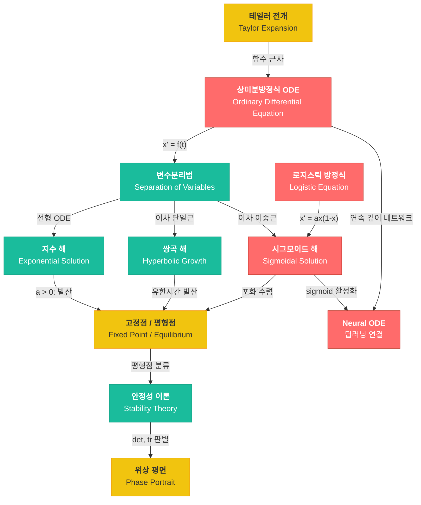

# 07. 미분방정식 (Differential Equations)

> **동기부여**: 미분방정식은 "변화의 법칙"을 수학적으로 기술하는 도구다. 딥러닝에서 ResNet의 잔차 연결은 오일러 방법(Euler method)으로 ODE를 이산화한 것과 동일하며, Neural ODE는 이산 레이어 대신 연속 동역학계를 직접 학습한다. 또한 로지스틱 ODE의 해가 정확히 sigmoid 함수임을 이해하면, 활성화 함수의 수학적 기원과 포화(saturation) 현상을 근본적으로 파악할 수 있다.

---

## 1. 선행 개념 연결 Mermaid 다이어그램



---

## 2. 개념별 5단계 완전 분리 설명

### 개념 1: 상미분방정식(ODE) 개요 (슬라이드 122)

#### ① 초등학생 단계
자동차의 속도계를 생각해보자. 속도가 매 순간 바뀌면 "지금 이 순간 얼마나 빠른가?"를 알아야 어디까지 갈 수 있는지 알 수 있다. 미분방정식은 "속도(변화율)와 위치(상태)의 관계를 쓴 식"이다. 예를 들어 "빠를수록 더 빨라진다"라는 규칙을 수식으로 쓰면 미분방정식이 된다.

#### ② 중등학생 단계
$x'$는 $x$가 시간 $t$에 따라 얼마나 변하는지를 나타낸다. $x' = 2x$라는 식은 "현재 값의 2배 속도로 증가한다"는 뜻이다. 이것을 풀면 $x(t) = x(0) \cdot e^{2t}$, 즉 지수적으로 커지는 함수가 된다.

#### ③ 고등학생 단계
**상미분방정식(ODE)**은 미지함수 $x(t)$와 그 도함수 $x' \equiv \frac{\partial x}{\partial t}$의 관계식이다. 슬라이드에서 다루는 1차 자율 ODE의 일반형은:

$$x' = f(x)$$

우변 $f(x)$가 $x$의 **다항식**일 때:
- **상수**: $x' = a$ (등속 운동)
- **1차(선형)**: $x' = ax$, $x' = ax + b$ → 지수 해
- **2차(단일근)**: $x' = x^2$, $x' = (x-\alpha)^2$ → 쌍곡 해
- **2차(이중근)**: $x' = ax(1-x)$, $x' = a(x-\alpha)(x-\beta)$ → 시그모이드 해

#### ④ 대학 단계
슬라이드 122에서 제시하는 분류 체계:

| ODE | 우변 구조 | 해의 유형 |
|-----|---------|---------|
| $x' = a$ | 상수 | 선형: $x(t) = x(0) + at$ |
| $x' = ax$ | 1차 (선형) | 지수: $x(t) = x(0)e^{at}$ |
| $x' = ax + b$ | 1차 (아핀) | 이동 지수 |
| $x' = x^2$ | 2차 (단일근 $\alpha=0$) | 쌍곡: $x(t) = \frac{1}{1/x_0 - t}$ |
| $x' = (x-\alpha)^2$ | 2차 (단일근) | 이동 쌍곡 |
| $x' = ax(1-x)$ | 2차 (이중근 $0,1$) | 시그모이드 |
| $x' = a(x-\alpha)(x-\beta)$ | 2차 (이중근) | 일반 시그모이드 |

핵심 관찰: **우변의 근의 개수가 해의 질적 행동을 결정**한다.
- 근이 없으면 → 단조 증가/감소 (지수, 쌍곡)
- 근이 하나면 → 쌍곡 blow-up
- 근이 둘이면 → 두 평형점 사이에서 포화 (시그모이드)

#### ⑤ 대학원 단계
이 분류는 **동역학계(dynamical systems)** 관점에서 자연스럽다. $f(x)$의 영점이 **고정점(fixed point)**이며, 고정점 근방에서의 $f'(x^*)$의 부호가 안정성을 결정한다:
- $f'(x^*) < 0$: 안정 고정점 (attracting)
- $f'(x^*) > 0$: 불안정 고정점 (repelling)

Neural ODE (Chen et al., 2018)에서는 $x' = f_\theta(x, t)$로 네트워크 파라미터 $\theta$를 통해 벡터장 자체를 학습한다. 이때 ResNet의 $x_{n+1} = x_n + f_\theta(x_n)$은 stepsize $h=1$인 오일러 이산화에 해당한다.

---

### 개념 2: 직접 적분 $x' = f(t)$ (슬라이드 123)

#### ① 초등학생 단계
"매 시간마다 받는 용돈이 정해져 있다"고 하자. 1시에 100원, 2시에 200원... 총 모은 돈은 매 시간 받은 돈을 다 더한 것이다. 적분은 이 "다 더하기"를 연속적으로 한 것이다.

#### ② 중등학생 단계
$x' = f(t)$이면 양변을 시간에 대해 적분하면:
$$x(t) = \int f(t)\,dt + C$$
여기서 $C$는 처음 값 $x(0)$으로 결정된다.

#### ③ 고등학생 단계
$x' = f(t)$는 우변이 $x$에 의존하지 않는 가장 단순한 ODE이다.

$$dx = f(t)\,dt \implies x(t) = \int f(t)\,dt + C$$

초기조건 $x(0) = x_0$을 주면 상수 $C$가 유일하게 결정된다.

#### ④ 대학 단계
이 형태는 **구적법(quadrature)**으로 바로 풀린다. 핵심은 "변화율이 현재 상태에 무관"하다는 것이다. 따라서 해는 $f(t)$의 **원시함수(antiderivative)**이다.

수치적으로는 이것이 수치적분(numerical integration)의 기본 문제:
$$x(t_{n+1}) \approx x(t_n) + h \cdot f(t_n) \quad \text{(Forward Euler)}$$

#### ⑤ 대학원 단계
비자율(non-autonomous) ODE $x' = f(x, t)$의 특수 경우로, $f$가 $x$에 무관할 때 적분이 닫힌 형태로 가능하다. Diffusion 모델에서의 noise schedule $\beta(t)$가 시간에만 의존하는 형태를 취하는 것과 관련이 있다.

---

### 개념 3: 선형 ODE와 지수 해 (슬라이드 124-126)

#### ① 초등학생 단계
은행에 돈을 맡기면 이자가 붙는다. 이자가 붙은 돈에 또 이자가 붙고... 이것이 "복리"다. 돈이 눈덩이처럼 불어나는 이 현상을 수식으로 쓰면 $x' = ax$이다.

#### ② 중등학생 단계
- $x' = a$ (상수): 매초 $a$만큼 일정하게 증가 → $x(t) = x(0) + at$ (직선)
- $x' = ax$ (비례): 현재 크기에 비례해서 증가 → $x(t) = x(0) \cdot e^{at}$ (지수곡선)
- $a > 0$이면 폭발적 증가, $a < 0$이면 0으로 감소

#### ③ 고등학생 단계
**$x' = ax$의 풀이** (변수분리법):

$$\frac{dx}{x} = a\,dt \implies \ln|x| = at + C \implies x(t) = x(0)e^{at}$$

**$x' = ax + b$의 풀이** (슬라이드 126):

$$\frac{1}{ax+b}dx = dt \implies \frac{1}{a}\ln(ax+b) = t + C$$

$$ax + b = \exp(at + C') \implies x = \frac{1}{a}(C''\exp(at) - b)$$

초기조건 적용:

$$\boxed{x(t) = \left(x(0) + \frac{b}{a}\right)\exp(at) - \frac{b}{a}}$$

#### ④ 대학 단계
$x' = ax + b$의 해를 분석하면:
- **평형점**: $x^* = -b/a$ ($x' = 0$이 되는 점)
- 해는 평형점으로부터의 편차 $y = x - x^*$에 대해 $y' = ay$, 즉 $y(t) = y(0)e^{at}$
- $a < 0$: 모든 해가 $x^*$로 수렴 (안정)
- $a > 0$: 모든 해가 $x^*$에서 발산 (불안정)

이것은 gradient descent $\theta_{t+1} = \theta_t - \eta \nabla L(\theta_t)$의 연속 버전인 gradient flow $\dot{\theta} = -\nabla L(\theta)$와 직결된다. 이차 손실함수 $L(\theta) = \frac{a}{2}\theta^2$에서 gradient flow는 정확히 $\dot{\theta} = -a\theta$이며, 해는 $\theta(t) = \theta(0)e^{-at}$로 지수적 수렴이다.

#### ⑤ 대학원 단계
**다변수 확장**: $\dot{X} = AX$의 해는 $X(t) = \exp(At)X(0)$이며, 행렬 지수함수 $\exp(At) = \sum_{k=0}^{\infty}\frac{(At)^k}{k!}$이다. 고유값 $\lambda_i$의 실수부가 모두 음수면 원점이 전역 안정(globally stable)이다.

Transformer의 학습 동역학을 분석할 때, loss landscape의 Hessian 고유값이 이 선형 ODE의 계수 행렬 $A$에 해당하며, 학습률 $\eta$와 고유값의 관계가 수렴 속도를 결정한다.

---

### 개념 4: 쌍곡 성장과 유한시간 폭발 (슬라이드 127-128)

#### ① 초등학생 단계
소문이 퍼지는 속도가 "이미 소문을 아는 사람 수의 제곱"에 비례한다고 하자. 처음엔 천천히 퍼지다가 어느 순간 갑자기 폭발적으로 퍼져서, 유한한 시간 안에 "무한대"에 도달한다. 이것이 쌍곡 성장이다.

#### ② 중등학생 단계
$x' = x^2$에서 변화 속도가 현재 값의 "제곱"이니까, 값이 클수록 엄청나게 빨리 커진다. 지수 성장($x' = ax$)보다도 훨씬 빠르다. 심지어 유한한 시간 안에 무한대가 된다!

#### ③ 고등학생 단계
**$x' = x^2$의 풀이** (슬라이드 127):

$$\frac{1}{x^2}dx = dt \implies -\frac{1}{x} = t + C$$

$$x = -\frac{1}{t+C} \implies \boxed{x(t) = \frac{1}{1/x_0 - t}}$$

**유한시간 폭발(finite-time blow-up)**: $t \to 1/x_0$일 때 $x(t) \to \infty$. 초기값 $x_0 = 0.1$이면 $t = 10$에서 폭발한다.

#### ④ 대학 단계
**$x' = (x - \alpha)^2$의 풀이** (슬라이드 128):

$$\frac{1}{(x-\alpha)^2}dx = dt \implies -\frac{1}{x-\alpha} = t + C$$

$$\boxed{x(t) = \frac{1}{1/(x_0 - \alpha) - t} + \alpha}$$

이것은 $\alpha$를 중심으로 한 쌍곡 성장이며, 평형점 $x^* = \alpha$는 **반안정(semi-stable)**이다:
- $x_0 > \alpha$: 유한시간에 $+\infty$로 blow-up
- $x_0 < \alpha$: $t \to \infty$에서 $\alpha$에 수렴 (위에서 접근)
- $x_0 = \alpha$: 영원히 $\alpha$에 머묾

#### ⑤ 대학원 단계
유한시간 폭발은 Neural ODE에서 심각한 수치적 문제를 야기한다. 적분기(ODE solver)가 특이점 근처에서 스텝 크기를 극도로 줄여야 하므로 계산 비용이 급격히 증가한다. FFJORD (Grathwohl et al., 2019) 등에서 벡터장의 Lipschitz 조건을 부과하는 이유 중 하나가 이 blow-up 방지이다.

또한 gradient explosion 현상은 RNN에서 $x_{t+1} = f(Wx_t)$의 야코비안 $\|W\| > 1$일 때 기울기가 지수적으로 폭발하는 것인데, 비선형 항이 있으면 쌍곡적 폭발도 가능하다.

---

### 개념 5: 로지스틱 방정식과 시그모이드 유도 (슬라이드 129-131)

#### ① 초등학생 단계
호수에 물고기가 늘어난다고 하자. 처음엔 먹이가 충분해서 빠르게 늘지만, 물고기가 많아지면 먹이가 부족해져서 성장이 느려진다. 결국 호수가 수용할 수 있는 최대 수에서 멈춘다. 이 S자 모양 성장 곡선이 시그모이드이다.

#### ② 중등학생 단계
$x' = ax(1-x)$에서:
- $x$가 작을 때: $(1-x) \approx 1$이므로 $x' \approx ax$ → 지수적 성장
- $x$가 1에 가까울 때: $(1-x) \approx 0$이므로 $x' \approx 0$ → 성장 멈춤
- $x = 0$과 $x = 1$이 평형점

결과: 0에서 시작하면 S자 곡선을 그리며 1에 수렴한다.

#### ③ 고등학생 단계
**부분분수 분해를 이용한 풀이** (슬라이드 129):

$$x' = ax(1-x) \implies \frac{1}{x(x-1)}dx = -a\,dt$$

$$\frac{1}{x(x-1)} = \frac{1}{x-1} - \frac{1}{x}$$

적분하면:

$$-at + C = \log(x-1) - \log(x) = \log\left(\frac{x-1}{x}\right) = \log\left(1 - \frac{1}{x}\right)$$

$$\exp(-at + C) = 1 - \frac{1}{x}$$

$$\boxed{x(t) = \frac{1}{1 - C\exp(-at)}}$$

여기서 $C = 1 - \frac{1}{x(0)}$.

#### ④ 대학 단계
**시그모이드와의 연결** (슬라이드 130):

$x(0) = x_0$일 때 $C = 1 - 1/x_0$이므로:

$$x(t) = \frac{1}{1 - (1 - 1/x_0)\exp(-at)} = \frac{1}{1 + \frac{1-x_0}{x_0}e^{-at}}$$

$x_0$이 매우 작을 때 ($x_0 \ll 1$), $\frac{1-x_0}{x_0} \approx \frac{1}{x_0}$이므로:

$$x(t) \approx \frac{1}{1 + \frac{1}{x_0}e^{-at}} = \sigma\!\left(at - \ln\frac{1}{x_0}\right)$$

여기서 $\sigma(z) = \frac{1}{1+e^{-z}}$은 **표준 시그모이드 함수**이다.

**반감기(half-time) 분석** (슬라이드 131):

$x = 0.5$가 되는 시간:

$$t(x = 0.5) = \frac{\ln(-C)}{a} = \frac{\ln(1/x_0 - 1)}{a} \approx \frac{\ln(1/x_0)}{a}$$

$x_0$이 작을수록, $a$가 작을수록 반감기가 길어진다.

#### ⑤ 대학원 단계
로지스틱 ODE $x' = ax(1-x)$의 해가 시그모이드라는 사실은 매우 중요한 의미를 가진다:

1. **활성화 함수의 동역학적 해석**: sigmoid 뉴런 $\sigma(Wx+b)$는 로지스틱 ODE를 $t=1$에서 평가한 것으로 볼 수 있다. 이것은 Neural ODE 프레임워크에서 1-layer sigmoid network가 로지스틱 벡터장의 시간-1 흐름(time-1 flow)임을 의미한다.

2. **Vanishing gradient의 동역학적 설명**: $\sigma'(z) = \sigma(z)(1-\sigma(z))$인데, 이는 정확히 $x' = x(1-x)$ (즉 $a=1$)이다. 포화 영역($x \approx 0$ 또는 $x \approx 1$)에서 $x' \approx 0$이므로 기울기가 사라진다.

3. **Softmax의 연속 동역학**: 다변수 로지스틱 시스템 $x_i' = x_i(1 - x_i)$를 적절히 결합하면 replicator dynamics가 되며, 이것의 해가 softmax 함수이다.

---

### 개념 6: 일반 이중근 이차 ODE (슬라이드 132-133)

#### ① 초등학생 단계
두 팀이 축구 경기를 하는데, 한 팀이 이기기 시작하면 사기가 올라 더 잘하게 되고, 결국 승부가 확정된다. 이때 최종 점수는 두 팀의 실력 차($\alpha$와 $\beta$)에 의해 결정된다.

#### ② 중등학생 단계
$x' = a(x - \alpha)(x - \beta)$에서 $\alpha$와 $\beta$는 두 평형점이다. $x$는 항상 이 두 값 사이에서 움직이며, 결국 한쪽으로 수렴한다.

#### ③ 고등학생 단계
**$x' = a(x-\alpha)(x-\beta)$, $\alpha \neq \beta$의 풀이** (슬라이드 132):

부분분수 분해:

$$\frac{1}{(x-\alpha)(x-\beta)}dx = a\,dt$$

$$\frac{1}{\alpha - \beta}\left(\frac{1}{x-\alpha} - \frac{1}{x-\beta}\right)dx = a\,dt$$

적분:

$$at + C = \frac{1}{\alpha-\beta}\left(\log(x-\alpha) - \log(x-\beta)\right) = \frac{1}{\alpha-\beta}\log\left(\frac{x-\alpha}{x-\beta}\right)$$

정리하면:

$$\boxed{x(t) = \frac{\alpha - \beta}{1 - C\exp((\alpha-\beta)at)} + \beta}$$

#### ④ 대학 단계
**$x' = ax(\beta - x)$의 특수 경우** (슬라이드 133, $\alpha = 0$):

$$x(t) = \frac{-\beta}{1 - C\exp(a\beta t)} + \beta = \frac{\beta}{1 + C'\exp(-a\beta t)}$$

이것은 **carrying capacity(수용량)가 $\beta$인 로지스틱 성장**이다.

**반감기** (슬라이드 133):

$$t(x = \beta/2) = \frac{\ln(-1/C)}{a\beta} \approx \frac{\ln(\beta) + \ln(1/x_0)}{a\beta} \approx \frac{\ln(1/x_0)}{a\beta} \propto \frac{1}{\beta}$$

핵심 관찰: 수용량 $\beta$가 클수록 반감기에 도달하는 시간이 짧아지는 것이 아니라, $\propto 1/\beta$로 **반비례**한다. 이는 직관에 반하는 결과이다 -- 도달할 절대 목표가 높을수록 비례적으로 느리지만, $a\beta$가 초기 성장률이므로 $\beta$가 크면 초기 가속도가 높아 상대적 도달 시간은 짧다.

#### ⑤ 대학원 단계
일반 이중근 ODE의 해는 **일반화된 시그모이드(generalized sigmoid)**이며, 다음 파라미터로 완전히 기술된다:
- $\alpha, \beta$: 하한과 상한 (평형점)
- $a$: 전이(transition) 속도
- $x_0$: 초기 위치 → 전이 시점 결정

딥러닝에서 **학습 곡선(learning curve)**이 종종 시그모이드를 따르는 이유: 학습 초기에는 쉬운 패턴을 빠르게 학습(지수적 성장)하고, 후기에는 어려운 패턴에서 한계에 도달(포화)하기 때문이다. Scaling law 연구 (Kaplan et al., 2020)에서 손실이 $L(N) \propto N^{-\alpha}$와 같은 power law를 따른다는 발견은, 단순 로지스틱보다 복잡한 동역학이 작용함을 시사한다.

---

### 개념 7: 변수분리법 (슬라이드 123, 127, 129, 132)

#### ① 초등학생 단계
케이크를 만들 때 밀가루와 설탕을 따로 계량한 후 합치듯이, 미분방정식에서도 $x$에 관한 것과 $t$에 관한 것을 양쪽으로 분리한 후 각각 계산하는 방법이다.

#### ② 중등학생 단계
$x' = g(x) \cdot h(t)$ 형태면:

$$\frac{dx}{g(x)} = h(t)\,dt$$

왼쪽은 $x$만, 오른쪽은 $t$만 있으므로 각각 적분할 수 있다.

#### ③ 고등학생 단계
**자율 ODE** $x' = f(x)$에서의 변수분리:

$$\frac{dx}{f(x)} = dt \implies \int \frac{dx}{f(x)} = t + C$$

슬라이드에서 반복적으로 사용되는 패턴:
- $f(x) = x^2$: $\int x^{-2}dx = -1/x$ (슬라이드 127)
- $f(x) = ax + b$: $\int \frac{dx}{ax+b} = \frac{1}{a}\ln|ax+b|$ (슬라이드 126)
- $f(x) = x(x-1)$: 부분분수 → $\int\left(\frac{1}{x-1} - \frac{1}{x}\right)dx$ (슬라이드 129)

#### ④ 대학 단계
변수분리법이 작동하는 수학적 이유: $x' = f(x)$에서 $f(x) \neq 0$인 영역에서 $F(x) = \int \frac{dx}{f(x)}$는 $x$의 단조함수이므로 역함수 $F^{-1}$이 존재한다. 따라서:

$$F(x) = t + C \implies x(t) = F^{-1}(t + C)$$

**주의**: $f(x^*) = 0$인 고정점에서는 분리 불가. 고정점은 해가 아니라 별도의 **상수 해(equilibrium solution)** $x(t) \equiv x^*$이다.

#### ⑤ 대학원 단계
변수분리법은 1차원에서만 완전히 작동한다. 다변수 ODE $\dot{X} = F(X)$에서는 일반적으로 닫힌 형태의 해를 구할 수 없으며, 이것이 Neural ODE에서 수치 적분기(adaptive Runge-Kutta 등)를 사용하는 이유이다.

그러나 **Hamiltonian Neural ODE**에서는 시스템이 $\dot{q} = \partial H/\partial p$, $\dot{p} = -\partial H/\partial q$의 구조를 가지므로, symplectic integrator를 사용하여 에너지 보존을 수치적으로 보장할 수 있다.

---

### 개념 8: 안정성 이론과 위상 평면 (슬라이드 134)

#### ① 초등학생 단계
공을 그릇 안에 놓으면 바닥으로 굴러가서 멈춘다(안정). 공을 뒤집은 그릇 위에 놓으면 조금만 건드려도 굴러 떨어진다(불안정). 미분방정식의 해도 이렇게 "안정"하거나 "불안정"할 수 있다.

#### ② 중등학생 단계
평형점(고정점) 근처에서:
- **안정(stable)**: 가까이 시작하면 점점 더 가까워짐 (공이 그릇 바닥으로)
- **불안정(unstable)**: 가까이 시작해도 점점 멀어짐 (뒤집힌 그릇 꼭대기)
- **안장점(saddle)**: 어떤 방향으로는 끌려오고, 다른 방향으로는 밀려남

#### ③ 고등학생 단계
2차원 선형 시스템 $\dot{X} = AX$, $X = [x, y]^\top$에서 행렬 $A$의 성질이 해의 행동을 결정한다:
- $\text{det}(A) < 0$: 안장점 (saddle)
- $\text{det}(A) > 0$, $\text{tr}(A) < 0$: 안정 (sink)
- $\text{det}(A) > 0$, $\text{tr}(A) > 0$: 불안정 (source)

판별식 $\Delta = (\text{tr}\,A)^2 - 4\,\text{det}\,A$에 따라:
- $\Delta > 0$: 노드 (node) - 실수 고유값
- $\Delta = 0$: 퇴화 노드 (degenerate node)
- $\Delta < 0$: 나선 (spiral) - 복소 고유값

#### ④ 대학 단계
슬라이드 134의 **Poincare 다이어그램**은 $(\text{tr}\,A, \text{det}\,A)$ 평면에서 모든 가능한 위상 초상(phase portrait)을 분류한다:

| 영역 | 고유값 | 위상 초상 |
|------|--------|---------|
| $\text{det} < 0$ | $\lambda_1 > 0 > \lambda_2$ (실수) | Saddle |
| $\text{det} > 0$, $\Delta > 0$, $\text{tr} < 0$ | $\lambda_1, \lambda_2 < 0$ (실수) | Stable node (sink) |
| $\text{det} > 0$, $\Delta > 0$, $\text{tr} > 0$ | $\lambda_1, \lambda_2 > 0$ (실수) | Unstable node (source) |
| $\text{det} > 0$, $\Delta < 0$, $\text{tr} < 0$ | $\alpha \pm i\beta$, $\alpha < 0$ | Stable spiral (spiral sink) |
| $\text{det} > 0$, $\Delta < 0$, $\text{tr} > 0$ | $\alpha \pm i\beta$, $\alpha > 0$ | Unstable spiral (spiral source) |
| $\text{det} > 0$, $\text{tr} = 0$ | $\pm i\beta$ (순허수) | Center |

비선형 시스템 $\dot{X} = F(X)$에서는 고정점 $X^*$ 근방에서 **야코비안** $A = F'(X^*)$를 사용하여 **Hartman-Grobman 정리**에 의해 국소적 위상 초상을 결정한다.

#### ⑤ 대학원 단계
안정성 이론은 딥러닝의 여러 핵심 현상과 직결된다:

1. **학습 안정성**: SGD를 연속 동역학으로 모델링하면 $\dot{\theta} = -\nabla L(\theta) + \xi(t)$ (Langevin 동역학). 손실 함수의 극소점이 안정 고정점에, 안장점이 saddle에 대응한다.

2. **Batch Normalization의 동역학적 효과**: BN은 학습 동역학의 고유값 스펙트럼을 조절하여 불안정한 spiral source를 stable node로 변환하는 효과가 있다.

3. **Edge of Chaos**: 심층 네트워크에서 야코비안의 고유값이 단위원 근처에 있을 때 (center 근방) 가장 풍부한 표현력을 가진다는 연구 결과가 있다. 이것은 Poincare 다이어그램에서 center와 spiral의 경계에 해당한다.

4. **Lyapunov 안정성과 Robust Training**: 적대적 공격(adversarial attack)에 대한 강건성은 Lyapunov 함수 $V(x)$를 찾아 $\dot{V} \leq -\alpha V$를 보장하는 것과 관련된다.

---

## 3. 오개념 카드 (Misconception Cards)

| # | 오개념 | 실제 | 교정 전략 |
|---|--------|------|-----------|
| 1 | "$x' = x^2$도 지수 성장과 비슷할 것이다" | 지수 성장($x' = ax$)은 $t \to \infty$에서 무한대이지만, 쌍곡 성장($x' = x^2$)은 **유한 시간**에 무한대가 된다 (blow-up). 질적으로 완전히 다르다. | $x_0 = 0.1$로 두 ODE를 수치적으로 풀어 그래프를 비교하라. 지수는 완만하게 커지지만, 쌍곡은 $t=10$ 근처에서 수직 점근선을 가진다. |
| 2 | "시그모이드 함수는 누군가 임의로 설계한 것이다" | 시그모이드는 로지스틱 ODE $x' = ax(1-x)$의 **자연스러운 해**이다. "포화가 있는 성장"이라는 물리적 원리에서 수학적으로 유도된다. | 슬라이드 129-130의 유도를 직접 따라가며, ODE → 부분분수 → 적분 → sigmoid의 과정을 체험하라. |
| 3 | "평형점은 항상 안정하다" | 평형점은 안정(stable), 불안정(unstable), 반안정(semi-stable) 중 하나이다. $x' = x^2$에서 $x^* = 0$은 한쪽에서만 안정(반안정)이다. | 각 ODE에서 $f'(x^*)$의 부호를 계산하여 안정성을 판별하는 연습을 하라. |
| 4 | "ODE를 풀면 항상 닫힌 형태의 해가 나온다" | 대부분의 ODE는 닫힌 형태의 해가 존재하지 않는다. 슬라이드에서 다루는 것은 변수분리법으로 풀리는 **특수한 경우**이다. | $x' = \sin(x^2)$ 같은 간단해 보이는 ODE를 변수분리 시도해보라. 적분이 닫힌 형태로 안 된다. |
| 5 | "선형 ODE $x' = ax + b$의 해는 직선이다" | "선형 ODE"에서 선형은 $x$에 대한 것이지, 해가 직선이라는 뜻이 아니다. 해는 $x(t) = (x_0 + b/a)e^{at} - b/a$로 **지수함수**이다. | $x' = a$의 해(직선)와 $x' = ax$의 해(지수)를 명확히 구분하라. "선형 ODE"와 "선형 해"는 다른 개념이다. |
| 6 | "Poincare 다이어그램에서 center는 안정이다" | Center(순허수 고유값)는 **중립 안정(marginally stable)**이며, Lyapunov 의미에서 안정이지만 점근 안정(asymptotically stable)은 아니다. 해가 원점으로 수렴하지 않고 영원히 회전한다. | $\text{tr}(A) = 0$일 때 해 궤적을 그려보라. 닫힌 타원 궤도를 관찰할 수 있다. |
| 7 | "$x' = ax(1-x)$에서 $a$가 크면 최종값도 크다" | $a$는 전이 **속도**만 결정하며, 최종값(상한)은 항상 1이다. $a$가 크면 더 빨리 1에 도달할 뿐이다. 상한을 바꾸려면 $x' = ax(\beta - x)$로 $\beta$를 조절해야 한다. | 슬라이드 133의 그래프에서 $\beta$ 값에 따른 수렴값 차이를 확인하라. |

---

## 4. 초등학생에게 설명하기 연습

> **"미분방정식이 뭐야?"**

물병에 구멍이 뚫려 있어서 물이 빠지고 있다고 생각해봐. 물이 많이 남아 있으면 수압이 세서 물이 빨리 빠지고, 물이 적으면 천천히 빠져. 이때 "물이 빠지는 속도 = 남은 물의 양에 비례" 라는 규칙을 수식으로 쓴 것이 미분방정식이야.

> **"지수 성장 vs 시그모이드?"**

토끼가 번식하는 걸 생각해봐. 초원이 무한히 넓으면 토끼 수는 끝없이 늘어나 (지수 성장). 하지만 실제 초원은 한정되어 있으니까, 토끼가 너무 많아지면 먹이가 부족해서 성장이 멈춰. 이게 S자 곡선(시그모이드)이야. 처음엔 지수 성장처럼 빠르다가, 나중에 천장에 부딪혀 멈추는 거지.

> **"안정과 불안정?"**

그릇 안에 구슬을 놓으면 바닥으로 굴러가서 멈추지? 이게 "안정". 반대로 그릇을 뒤집어서 꼭대기에 구슬을 올리면 조금만 건드려도 굴러 떨어져. 이게 "불안정". 미분방정식의 평형점도 이렇게 두 종류가 있어.

---

## 5. 수학 ↔ 딥러닝 연결 테이블

| 수학 개념 | 딥러닝에서의 역할 | 사용 예시 |
|-----------|------------------|----------|
| $x' = ax$ (선형 ODE, 지수 해) | Gradient flow: 이차 손실함수에서의 파라미터 수렴/발산 | 학습률과 Hessian 고유값의 관계로 수렴 속도 분석 |
| $x' = ax(1-x)$ (로지스틱 ODE) | 시그모이드 활성화 함수 $\sigma(z) = 1/(1+e^{-z})$의 수학적 기원 | 이진 분류의 출력층, 게이트 메커니즘 (LSTM, GRU) |
| $\sigma'(z) = \sigma(z)(1-\sigma(z))$ | Vanishing gradient 현상의 근본 원인 | ReLU, GELU 등 대안 활성화 함수 개발의 동기 |
| $x' = x^2$ (유한시간 폭발) | Gradient explosion과 수치적 불안정 | Gradient clipping, weight normalization의 필요성 |
| $\dot{X} = AX$ (선형 시스템) | ResNet의 연속 한계: Neural ODE | Chen et al. (2018), FFJORD, continuous normalizing flow |
| 고정점 안정성, Poincare 분류 | 손실 함수 landscape의 극소점/안장점 분류 | Saddle-free optimizer (LBFGS), saddle point 탈출 전략 |
| 오일러 방법 $x_{n+1} = x_n + hf(x_n)$ | ResNet의 잔차 연결 $x_{l+1} = x_l + f_\theta(x_l)$ | Skip connection의 수학적 정당화, stepsize = 학습 가능 |
| 수용량 $\beta$와 전이 시간 $\propto 1/\beta$ | 모델 크기와 학습 속도의 관계 | Scaling law: 큰 모델이 더 빠르게 특정 성능에 도달 |
| 테일러 전개 $f(x) \approx f(a) + f'(a)(x-a)$ | 로컬 선형 근사 → SGD, 뉴턴법의 기초 | 2차 근사를 사용하는 Adam, natural gradient |

---

## 6. 킬러 요약 (Killer Summary)

> **한 문장**: 1차 자율 ODE $x' = f(x)$에서 $f$가 선형이면 **지수**, 이차 단일근이면 **쌍곡(blow-up)**, 이차 이중근이면 **시그모이드**이고, 이 분류가 딥러닝의 활성화 함수, gradient 문제, 학습 동역학의 수학적 뼈대를 이룬다.

**핵심 공식 3개**:

$$\boxed{x' = ax \implies x(t) = x_0 e^{at}} \quad \text{(지수 성장/감쇠)}$$

$$\boxed{x' = x^2 \implies x(t) = \frac{1}{1/x_0 - t}} \quad \text{(쌍곡 성장, blow-up at } t = 1/x_0\text{)}$$

$$\boxed{x' = ax(1-x) \implies x(t) = \frac{1}{1 - Ce^{-at}} = \sigma(at + \text{const})} \quad \text{(시그모이드)}$$

**기억 흐름**:

```
상수 → 선형 → 지수 → 쌍곡 → 시그모이드 → 안정성
 x'=a   x'=ax   e^{at}  1/(1/x₀-t)   σ(z)      Poincaré
 직선    곡선    발산     폭발         포화       분류
```

**딥러닝 연결 키워드**: ResNet = Euler method, Neural ODE = 연속 깊이, sigmoid = 로지스틱 ODE의 해, gradient explosion = 쌍곡 성장, saddle point = 불안정 평형점
