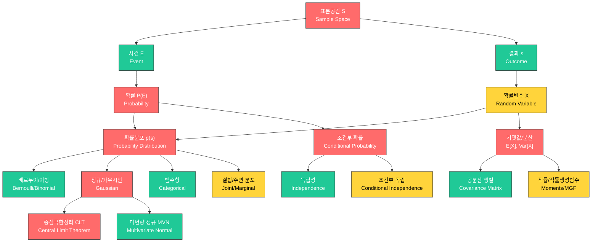

# 08. 확률론 (Probability Theory)

> **동기부여**: 딥러닝의 손실 함수(cross-entropy), 생성 모델(VAE, diffusion), 베이지안 추론 등 거의 모든 핵심 구성 요소가 확률론 위에 세워져 있다. 확률을 이해하지 못하면 모델이 "왜" 그렇게 학습하는지, 불확실성을 "어떻게" 정량화하는지 설명할 수 없다.

---

## 1. 선행 개념 연결 Mermaid 다이어그램

---

## 2. 개념별 5단계 완전 분리 설명

### 개념 1: 표본공간, 사건, 확률의 기초 (슬라이드 144-150)

#### ① 초등학생 단계
주사위를 던진다고 생각해 보자. 나올 수 있는 숫자는 1, 2, 3, 4, 5, 6이야. 이 **모든 가능한 결과의 모임**을 "표본공간"이라고 해. 그리고 "짝수가 나온다"처럼 우리가 관심 있는 결과들을 모아 놓은 것을 "사건"이라고 해. 확률은 "그 사건이 얼마나 잘 일어나는지"를 0부터 1 사이의 숫자로 나타낸 거야.

#### ② 중등학생 단계
표본공간 $S$는 실험에서 나올 수 있는 모든 결과의 집합이고, 사건 $E$는 $S$의 부분집합이야. 라플라스 정의에 따르면, 모든 결과가 같은 가능성(equally likely)을 가질 때:

$$P(E) = \frac{|E|}{|S|}$$

예를 들어 주사위에서 짝수가 나올 확률은 $\frac{3}{6} = \frac{1}{2}$. 중요한 성질로 $P(\emptyset) = 0$, $P(S) = 1$, 그리고 여사건 $P(E^c) = 1 - P(E)$가 있어.

#### ③ 고등학생 단계
모든 결과가 같은 확률이 아닌 경우도 있어. 이때는 각 결과 $s$에 확률 $p(s)$를 직접 할당해야 해. **확률분포**란 함수 $p: S \to [0,1]$로:
- $0 \le p(s) \le 1$ (각 결과에 대해)
- $\sum_{s \in S} p(s) = 1$ (전체 합 = 1)

사건 $E$의 확률은 $P(E) := \sum_{s \in E} p(s)$로 계산해. 포함-배제 원리도 중요해:

$$P(E_1 \cup E_2) = P(E_1) + P(E_2) - P(E_1 \cap E_2)$$

#### ④ 대학 단계
확률의 엄밀한 정의는 측도론(measure theory)에 기반한다. 표본공간 $S$가 유한이 아닌 가산(countable) 집합일 때, 사건의 확률은 극한으로 정의된다:

$$P(E) := \lim_{n \to \infty} S_n, \quad S_n := \sum_{i=1}^{n} p(s_i)$$

여기서 $E = \{s_1, s_2, \ldots\}$. **균등분포**(uniform distribution)는 $p(s) = \frac{1}{|S|}$로 모든 결과에 같은 확률을 부여하는 특수한 경우이다. 평균-케이스 시간복잡도 분석(슬라이드 146, 149)에서 보듯, 확률분포의 선택이 분석 결과를 근본적으로 바꾼다.

#### ⑤ 대학원 단계
수학적으로 확률은 $(\Omega, \mathcal{F}, P)$ 확률공간(probability space)의 측도(measure)이다. $\mathcal{F}$는 $\sigma$-대수(sigma-algebra)이고 $P$는 가산 가법적(countably additive) 측도다. 연속 표본공간에서는 확률밀도함수(pdf) $p_X(a) := \frac{d}{da}c_X(a)$를 누적분포함수(cdf) $c_X(a) := P(X \le a)$의 미분으로 정의한다. 밀도 자체는 확률이 아니라 "단위 길이당 확률 질량"이다:

$$\lim_{dx \to 0} \frac{P([x, x+dx])}{\text{vol}([x, x+dx])} = p_X(x)$$

이 관점에서 사건의 확률은 밀도의 적분: $P(E) = \int_{x \in E} p(x) dx$이다.

---

### 개념 2: 조건부 확률과 독립성 (슬라이드 151-153)

#### ① 초등학생 단계
"비가 오면 우산을 가져갈 확률"처럼, 어떤 일이 이미 일어났다는 걸 알 때 다른 일이 일어날 확률이 바뀔 수 있어. 이게 "조건부 확률"이야. 그리고 두 사건이 서로 영향을 주지 않으면 "독립"이라고 해.

#### ② 중등학생 단계
사건 $F$가 일어났다는 조건 아래 $E$의 확률:

$$P(E|F) = \frac{P(E \cap F)}{P(F)} \quad (P(F) > 0)$$

벤 다이어그램으로 보면, 전체 표본공간 $S$를 $F$로 "축소"시킨 후 그 안에서 $E \cap F$의 비율을 구하는 것이야. 두 사건이 **독립**이면:

$$P(E \cap F) = P(E) \cdot P(F) \quad \Leftrightarrow \quad P(E|F) = P(E)$$

#### ③ 고등학생 단계
조건부 확률의 핵심은 표본공간의 **제한**(restriction)이야. $E$를 $F$ 위에 "사영"(project)시킨다고 볼 수 있어. **조건부 독립**(Conditional Independence, CI)은 이보다 더 섬세한 개념이야:

$$P(E, F | G) = P(E|G) \cdot P(F|G) \quad \text{(표기: } E \perp F \mid G\text{)}$$

슬라이드 153의 예시가 핵심: 키(Height)와 어휘력(Vocabulary)은 (무조건부로는) 종속이지만, 나이(Age)가 주어지면 조건부 독립이 될 수 있어. 이는 확률적 그래프 모델(PGM)의 기초야.

#### ④ 대학 단계
독립성과 조건부 독립성의 관계를 정확히 이해해야 한다:
- 독립 $\not\Rightarrow$ 조건부 독립
- 조건부 독립 $\not\Rightarrow$ 독립

주사위 예시: $E$(첫 번째 주사위 결과 $i$), $F$(두 번째 주사위 결과 $j$), $G$(합이 짝수). $E \perp F$이지만 $E \not\perp F \mid G$. 이것이 "explaining away" 현상의 기초이며, 베이지안 네트워크에서의 d-separation 이론으로 확장된다.

#### ⑤ 대학원 단계
딥러닝에서 조건부 독립 가정은 모델 설계의 핵심이다. 언어 모델의 next-token prediction $p(w_t | w_{1:t-1})$은 chain rule of probability의 직접 적용이다:

$$p(w_1, w_2, \ldots, w_T) = \prod_{t=1}^{T} p(w_t | w_{1:t-1})$$

Markov 가정($w_t \perp w_{1:t-k-1} \mid w_{t-k:t-1}$)을 도입하면 n-gram 모델이 되고, Transformer는 이 가정을 완화하여 전체 context를 사용한다. VAE에서의 conditional independence는 latent variable $z$가 주어지면 관측 변수들이 독립이라는 가정을 쓴다.

---

### 개념 3: 확률변수와 확률분포 (슬라이드 156-159)

#### ① 초등학생 단계
주사위를 던졌을 때 나오는 숫자를 $X$라고 부르자. $X$는 "실험 결과를 숫자로 바꿔주는 규칙"이야. 예를 들어 동전 던지기에서 앞면이면 1, 뒷면이면 0으로 바꾸는 거지.

#### ② 중등학생 단계
**확률변수**(random variable) $X$는 표본공간 $S$의 각 결과 $s$를 실수로 대응시키는 함수야:

$$X: S \to \mathbb{R}, \quad s \mapsto X(s)$$

$P(X = a)$는 "$X$의 값이 $a$인 결과들의 집합"의 확률: $P(X = a) = P(X^{-1}(\{a\}))$.

#### ③ 고등학생 단계
확률변수의 확률분포에는 두 가지 유형이 있어:
- **이산**: $p_X(a) \equiv P(X = a) := P(X^{-1}(\{a\}))$ (확률질량함수, PMF)
- **연속**: $p_X(a) := \frac{d}{da} c_X(a)$ (확률밀도함수, PDF)

여기서 $c_X(a) := P(X \le a)$는 누적분포함수(CDF). 중요한 표기법들:
- $P(X \in A) := P(\{s \in S \mid X(s) \in A\})$
- $P(a \le X \le b) := P(\{s \in S \mid a \le X(s) \le b\})$

#### ④ 대학 단계
확률변수는 $(\Omega, \mathcal{F}) \to (\mathbb{R}, \mathcal{B}(\mathbb{R}))$의 가측함수(measurable function)이다. 역상(inverse image, preimage) $X^{-1}(B)$가 $\mathcal{F}$에 속해야 한다는 조건이 핵심이다. 이 조건이 있어야 $P(X \in B)$가 잘 정의된다. 슬라이드 159의 그림이 이를 직관적으로 보여준다: $X$가 $S$를 $\mathbb{R}$로 보내고, $\mathbb{R}$의 집합 $\{a\}$의 역상 $X^{-1}(\{a\})$가 $S$에서의 사건이 된다.

#### ⑤ 대학원 단계
확률변수의 pushforward measure 관점: $X$가 $(\Omega, P)$ 위의 확률측도를 $(\mathbb{R}, P_X)$로 "밀어낸다(push forward)". $P_X(B) = P(X^{-1}(B))$. 이 관점은 변환 정리(change of variables)와 직접 연결되며, 생성 모델(normalizing flows, diffusion models)에서 핵심적으로 사용된다. Radon-Nikodym 정리에 의해 두 측도의 관계는 밀도비(density ratio)로 표현된다.

---

### 개념 4: 베르누이, 이항, 범주형 분포 (슬라이드 154-155)

#### ① 초등학생 단계
동전 던지기처럼 결과가 딱 두 개("성공" 아니면 "실패")인 실험이 **베르누이 시행**이야. 동전을 여러 번 던져서 "앞면이 몇 번 나왔나"를 세면 **이항분포**가 돼. 주사위처럼 결과가 여러 개인 경우는 **범주형 분포**야.

#### ② 중등학생 단계
- **베르누이 분포**: $\text{Bern}(y=1;\theta) = \theta$, $\text{Bern}(y=0;\theta) = 1-\theta$
- **이항 분포**: 독립인 베르누이 시행 $n$번 중 성공 $k$번의 확률: $P(X=k) = \binom{n}{k} p^k (1-p)^{n-k}$
- **범주형 분포**: $C$개 레이블 $(1, 2, \ldots, C)$에 대해 $\text{Cat}(y;\theta) = \theta_y = p(s_y)$

#### ③ 고등학생 단계
베르누이와 범주형의 관계를 이해하자:
- 베르누이는 $|S| = 2$인 특수 경우
- 범주형은 $|S| = C$인 일반화
- 베르누이 : 이항 = 범주형 : **다항**(Multinomial)

파라미터 $\theta$의 의미: 범주형에서 $\theta = [p(s_1), \ldots, p(s_C)]^\top$이고, $\sum_{c=1}^{C} \theta_c = 1$.

#### ④ 대학 단계
이항분포의 유도를 살펴보면 (슬라이드 161): 동전 $n$번 중 앞면 $k$번의 경우, 각 결과 $s_i$는 H와 T의 순서가 정해진 수열이다. $X(s) = $ "H의 개수"로 정의하면:
- $p(s_i) = p^k q^{n-k}$ (각 수열에 대해)
- $X^{-1}(\{k\})$의 원소 수 $= \binom{n}{k}$
- $\therefore P(X=k) = \binom{n}{k} p^k q^{n-k}$

#### ⑤ 대학원 단계
딥러닝에서의 활용:
- **분류**: 신경망의 softmax 출력은 범주형 분포의 파라미터 $\theta$. Cross-entropy loss는 $-\log \text{Cat}(y; \hat{\theta})$.
- **NTP(Next-Token Prediction)**: 슬라이드 142에서 $p(w_t | w_{1:t-1})$은 vocabulary 크기 $|V|$에 대한 범주형 분포. GPT가 학습하는 것은 이 조건부 범주형 분포의 파라미터.
- **이항 근사**: $n$이 크고 $p$가 작으면 Poisson 근사, $n$이 크면 정규 근사 (CLT 적용).

---

### 개념 5: 정규(가우시안) 분포와 중심극한정리 (슬라이드 164-169, 175-176)

#### ① 초등학생 단계
키나 몸무게 같은 것들을 모아서 그래프로 그리면, 가운데가 높고 양쪽이 낮은 "종 모양"이 나와. 이걸 **정규분포**라고 해. 자연에서 아주 많이 나타나는 모양이야!

#### ② 중등학생 단계
정규분포(가우시안 분포)의 공식:

$$\mathcal{N}(x; \mu, \sigma^2) = \frac{1}{\sqrt{2\pi\sigma^2}} e^{-\frac{1}{2}\left(\frac{x-\mu}{\sigma}\right)^2}$$

$\mu$는 중심(평균), $\sigma$는 퍼짐 정도(표준편차). 약 68%의 데이터가 $[\mu - \sigma, \mu + \sigma]$ 안에, 95%가 $[\mu - 2\sigma, \mu + 2\sigma]$ 안에 있어.

#### ③ 고등학생 단계
**중심극한정리(CLT)**: i.i.d.(독립이고 같은 분포) 확률변수들의 합(또는 평균)은 표본 크기가 커지면 정규분포에 가까워져. 수식으로:

$$\frac{\bar{X}_n - \mu}{\sigma / \sqrt{n}} \xrightarrow{d} \mathcal{N}(0, 1) \quad \text{as } n \to \infty$$

슬라이드 169의 예시: 한국 군인 신체검사 키 데이터가 정규분포를 따르는 이유는, 키가 수많은 독립적인 유전적/환경적 요인의 합이기 때문 (CLT!).

**왜 "정규"(normal)인가?** (슬라이드 167)
1. 주어진 평균과 분산에서 **최대 엔트로피** 분포
2. CLT에 의해 자연에서 가장 보편적으로 나타남

#### ④ 대학 단계
가우시안의 정규화 상수 유도 (슬라이드 175):

$$I = \int_{\mathbb{R}} e^{-\frac{1}{2}x^2} dx$$

$$I^2 = \int_{\mathbb{R}} \int_{\mathbb{R}} e^{-\frac{1}{2}(x^2+y^2)} dx\,dy = \int_0^{2\pi}\int_0^{\infty} e^{-\frac{1}{2}r^2} r\,dr\,d\theta = 2\pi$$

따라서 $I = \sqrt{2\pi}$. 평균 계산에서 $x \cdot e^{-x^2/2}$는 기함수(odd function)이므로 적분값 0, 따라서 $\mathbb{E}[X] = \mu$.

#### ⑤ 대학원 단계
정규분포가 "정규"인 두 가지 심층 이유:
1. **최대 엔트로피 원리**: 평균 $\mu$와 분산 $\sigma^2$만 알려졌을 때, 정보를 최소한으로 가정하는(= 엔트로피를 최대화하는) 분포가 가우시안. 이는 변분법(calculus of variations)/라그랑주 승수법으로 증명.
2. **CLT의 보편성**: 유한 분산을 갖는 거의 모든 분포의 i.i.d. 합이 가우시안으로 수렴.

갈톤 보드(Galton Board, 슬라이드 168)는 이항분포가 정규분포로 근사되는 시각적 증명. $\binom{n}{k}$의 대칭적 분포가 $n \to \infty$에서 가우시안이 됨.

딥러닝에서: 가중치 초기화, 잡음 모델링, diffusion process, VAE의 prior 등 거의 모든 곳에서 가우시안이 기본 가정.

---

### 개념 6: 기댓값과 분산 (슬라이드 170-177, 181)

#### ① 초등학생 단계
**기댓값**은 "평균적으로 얼마가 나올까?"야. 주사위를 아주 많이 던지면 평균 3.5가 나오지. **분산**은 "결과가 평균에서 얼마나 떨어져 있나?"를 나타내는 숫자야.

#### ② 중등학생 단계
- 기댓값: $\mathbb{E}[X] = \sum_{x} x \cdot p_X(x)$ (이산), $\mathbb{E}[X] = \int x \cdot p_X(x)\,dx$ (연속)
- 분산: $\text{Var}[X] = \sum_{x} (x - \mathbb{E}[X])^2 p_X(x) = \mathbb{E}[X^2] - \mathbb{E}[X]^2$
- 표준편차: $\sigma[X] = \sqrt{\text{Var}[X]}$

#### ③ 고등학생 단계
기댓값의 **선형성** (독립 여부와 무관!):
- $\mathbb{E}[X+Y] = \mathbb{E}[X] + \mathbb{E}[Y]$
- $\mathbb{E}[aX+b] = a\mathbb{E}[X] + b$

독립일 때 추가 성질:
- $\mathbb{E}[XY] = \mathbb{E}[X]\mathbb{E}[Y]$ (역은 성립하지 않음!)

**전체 기대 법칙**(Law of Total Expectation):

$$\mathbb{E}_X[X] = \mathbb{E}_Y[\mathbb{E}_X[X|Y]]$$

#### ④ 대학 단계
분산의 성질들 (슬라이드 181):
- $\text{Var}[aX+b] = a^2 \text{Var}[X]$
- $\text{Var}[X] = \mathbb{E}[X^2] - \mathbb{E}[X]^2$
- 비상관(uncorrelated)이면: $\text{Var}[X+Y] = \text{Var}[X] + \text{Var}[Y]$
- 일반적으로: $\text{Var}[X+Y] = \text{Var}[X] + \text{Var}[Y] + 2\text{Cov}[X,Y]$

**전체 분산 법칙**(Law of Total Variance):

$$\text{Var}[X] = \mathbb{E}_Y[\text{Var}_X[X|Y]] + \text{Var}_Y[\mathbb{E}_X[X|Y]]$$

일반적 함수의 기댓값: $\mathbb{E}[f(X)] = \int_{\mathbb{R}} f(x) p_X(x) dx$. $n$차 적률: $\mathbb{E}[X^n]$, 적률생성함수: $M(\theta) = \mathbb{E}[e^{\theta X}]$ (슬라이드 173).

#### ⑤ 대학원 단계
딥러닝에서의 기댓값/분산:
- **손실 함수의 기댓값**: empirical risk $\hat{R} = \frac{1}{n}\sum_i \ell(f(x_i), y_i)$는 population risk $\mathbb{E}[\ell(f(X), Y)]$의 표본 근사.
- **분산 감소(Variance Reduction)**: SGD의 미니배치가 기울기 추정의 분산을 줄임.
- **기댓값의 선형성**은 역전파(backpropagation)에서 기울기의 기댓값 계산에 핵심.
- 표준정규에서 $\mathbb{E}[X^{2n-1}] = 0$ (기함수), $\mathbb{E}[X^{2n}] = (2n-1)!!$ (이중 계승). 특히 $\mathbb{E}[X^4] = 3$ (kurtosis 관련).

---

### 개념 7: 결합분포, 주변분포, 공분산 (슬라이드 162-163, 178-180, 185)

#### ① 초등학생 단계
두 개의 주사위를 동시에 던질 때, 첫 번째 결과와 두 번째 결과를 **함께** 보는 것이 "결합분포"야. 하나만 볼 때는 "주변분포"라고 해.

#### ② 중등학생 단계
두 확률변수 $X, Y$의 **결합분포**:
- 이산: $p_{X \times Y}(x, y) = P(X=x, Y=y)$
- 연속: $p_{X \times Y}(x, y) = \frac{\partial^2}{\partial x \partial y} c_{X \times Y}(x, y)$

**주변분포**: $p(x) = \int p(x, y)\,dy$ ("$y$를 주변화(marginalize out)")

#### ③ 고등학생 단계
결합분포와 조건부 확률의 관계:

$$p(x) = \int p(x, y)\,dy = \int p(x|y)p(y)\,dy$$

**독립**이면: $p_{X \times Y}(x, y) = p_X(x) \cdot p_Y(y)$. i.i.d. 확률변수 $X_1, \ldots, X_n$이면:

$$p(x_1, x_2, \ldots, x_n) = \prod_{i=1}^{n} p(x_i)$$

#### ④ 대학 단계
**공분산**: $\text{Cov}[X,Y] = \mathbb{E}[XY] - \mathbb{E}[X]\mathbb{E}[Y]$

독립 $\Rightarrow$ 비상관($\text{Cov}=0$), 하지만 역은 성립하지 않는다! 슬라이드 179의 반례: $(X,Y) \in \{(0,1),(1,0),(-1,0),(0,-1)\}$이 균등 확률이면 $\mathbb{E}[XY] = \mathbb{E}[X]\mathbb{E}[Y] = 0$이지만 $X, Y$는 독립이 아니다 ($P(X=0,Y=0)=0 \neq P(X=0)P(Y=0) = \frac{1}{4}$).

단, **결합 정규**(jointly normal)인 경우 비상관 $\Leftrightarrow$ 독립 (슬라이드 180). 주변적으로(marginally) 정규이지만 결합적으로 정규가 아니면 이 동치는 성립하지 않는다.

#### ⑤ 대학원 단계
**다변량 공분산 행렬** (슬라이드 185):

$$\text{Cov}[\mathbf{x}] = \mathbb{E}[(\mathbf{x} - \mathbb{E}[\mathbf{x}])(\mathbf{x} - \mathbb{E}[\mathbf{x}])^\top]$$

선형 변환 성질: $\mathbb{E}[A\mathbf{x}+b] = A\mathbb{E}[\mathbf{x}]+b$, $\text{Cov}[A\mathbf{x}+b] = A\,\text{Cov}[\mathbf{x}]\,A^\top$.

이는 신경망 층을 통과할 때 분포가 어떻게 변하는지를 설명하며, Batch Normalization의 이론적 기반이다.

---

### 개념 8: 다변량 정규분포 (MVN) (슬라이드 186-189)

#### ① 초등학생 단계
정규분포가 1차원(숫자 하나)에서의 종 모양이라면, **다변량 정규분포**는 여러 개의 숫자를 한꺼번에 다룰 때 나오는 "고차원 종 모양"이야.

#### ② 중등학생 단계
$D$차원 다변량 정규분포의 공식:

$$\mathcal{N}(\mathbf{y}; \boldsymbol{\mu}, \boldsymbol{\Sigma}) = \frac{1}{(2\pi)^{D/2}|\boldsymbol{\Sigma}|^{1/2}} \exp\left(-\frac{1}{2}(\mathbf{y}-\boldsymbol{\mu})^\top \boldsymbol{\Sigma}^{-1}(\mathbf{y}-\boldsymbol{\mu})\right)$$

$\boldsymbol{\mu}$는 평균 벡터, $\boldsymbol{\Sigma}$는 공분산 행렬.

#### ③ 고등학생 단계
2차원에서 $\mathbf{y} = [y_1, y_2]^\top$이면:
- 각 성분의 주변분포: $y_1 \sim \mathcal{N}(\mu_1, \Sigma_{11})$, $y_2 \sim \mathcal{N}(\mu_2, \Sigma_{22})$
- **조건부 분포** $y_1 | y_2$도 정규분포:
  - $\mu_{1|2} = \mu_1 + \Sigma_{12}\Sigma_{22}^{-1}(y_2 - \mu_2)$
  - $\Sigma_{1|2} = \Sigma_{11} - \Sigma_{12}\Sigma_{22}^{-1}\Sigma_{21}$

이것은 "관측이 주어지면 불확실성이 줄어든다"는 직관과 일치해.

#### ④ 대학 단계
선형 가우시안 모델 (슬라이드 187):
- Prior: $\mathbf{z} \sim \mathcal{N}(\boldsymbol{\mu}_z, \boldsymbol{\Sigma}_z)$
- Likelihood: $\mathbf{y} | \mathbf{z} \sim \mathcal{N}(W\mathbf{z}+b, \boldsymbol{\Sigma}_y)$
- Posterior: $\mathbf{z} | \mathbf{y} \sim \mathcal{N}(\boldsymbol{\mu}_{z|y}, \boldsymbol{\Sigma}_{z|y})$

여기서:
$$\boldsymbol{\mu}_{z|y} = \boldsymbol{\Sigma}_{z|y}[W^\top \boldsymbol{\Sigma}_y^{-1}(\mathbf{y}-b) + \boldsymbol{\Sigma}_z^{-1}\boldsymbol{\mu}_z]$$
$$\boldsymbol{\Sigma}_{z|y}^{-1} = \boldsymbol{\Sigma}_z^{-1} + W^\top \boldsymbol{\Sigma}_y^{-1} W$$

이는 베이즈 정리의 가우시안 버전이다.

#### ⑤ 대학원 단계
MVN의 적률 (슬라이드 188-189): $\mathbf{y} \sim \mathcal{N}(\boldsymbol{\mu}, \boldsymbol{\Sigma})$일 때:
- $\mathbb{E}[\mathbf{y}] = \boldsymbol{\mu}$
- $\mathbb{E}[\mathbf{y}\mathbf{y}^\top] = \boldsymbol{\Sigma} + \boldsymbol{\mu}\boldsymbol{\mu}^\top =: M$
- $\mathbb{E}[\|\mathbf{y}\|^2] = \text{Tr}(\boldsymbol{\Sigma}) + \|\boldsymbol{\mu}\|^2$

고차 적률: $\mathbb{E}[\mathbf{y}\mathbf{y}^\top A \mathbf{y}\mathbf{y}^\top]$에 대한 Gaussian fourth-moment formula는 $\boldsymbol{\Sigma}=I, \boldsymbol{\mu}=0$일 때 크게 단순화.

이는 VAE의 reparameterization trick, diffusion models의 noise schedule 분석, 그리고 Gaussian Process regression의 핵심이다. 특히 posterior $\mathbf{z}|\mathbf{y}$의 평균이 $(\sigma^2 I + \boldsymbol{\Sigma})^{-1}\boldsymbol{\Sigma}\mathbf{y}$로 관측값 $\mathbf{y}$를 "수축(shrink)"시키는 것은 regularization과 직접 연결.

---

### 개념 9: 디랙 델타와 경험적 분포 (슬라이드 183-184)

#### ① 초등학생 단계
데이터를 실제로 모아서 만든 분포가 **경험적 분포**야. "지금까지 본 것들을 기반으로" 확률을 추정하는 거지.

#### ② 중등학생 단계
**디랙 델타 함수** $\delta(x)$는 $x=0$에서만 무한히 크고, 나머지에서는 0이야. 적분하면 1이 돼:

$$\int \delta(x)\,dx = 1$$

가우시안의 분산을 0으로 보내면 디랙 델타가 나와: $\mathcal{N}(x; 0, \sigma^2) \to \delta(x)$ as $\sigma \to 0$.

#### ③ 고등학생 단계
데이터 $\{x_1, x_2, \ldots, x_N\}$이 주어졌을 때, **경험적 분포**(empirical distribution):

$$p_S(x) = \frac{1}{|S|} \sum_{x_i \in S} \delta(x - x_i)$$

이것은 각 데이터 포인트에 동일한 가중치 $\frac{1}{N}$을 부여하는 이산 분포야. CDF는 계단 함수.

#### ④ 대학 단계
연속 균등분포 $U[-\sigma, \sigma]$도 $\sigma \to 0$이면 $\delta(x)$로 수렴. CDF는 Heaviside 계단함수 $\mathbf{1}(x \ge 0)$.

경험적 분포는 MLE(최대우도추정)와 깊이 연관: 경험적 분포와 모델 분포 사이의 KL 발산을 최소화하는 것이 곧 우도를 최대화하는 것과 동치.

#### ⑤ 대학원 단계
Glivenko-Cantelli 정리에 의해 경험적 CDF는 참 CDF로 균등 수렴한다. 이것이 딥러닝에서 유한 데이터로 학습이 가능한 근본적 이유이다. GAN은 경험적 분포와 생성 분포 사이의 divergence를 직접 최소화한다.

---

### 개념 10: Next-Token Prediction과 확률의 연결 (슬라이드 142-143)

#### ① 초등학생 단계
"나는 학교에 ___" 빈칸에 뭐가 올지 맞추는 게임이야. AI가 이전에 나온 단어들을 보고 다음 단어를 확률로 예측하는 거지.

#### ② 중등학생 단계
문장 $s_i = (w_1, w_2, \ldots, w_{l_i})$가 있을 때, 모델이 학습하는 것은:

$$p(w_t | w_{1:t-1})$$

"지금까지의 단어들이 주어졌을 때 다음 단어의 확률". 이것이 **Next-Token Prediction(NTP)**.

#### ③ 고등학생 단계
Chain rule에 의해 문장 전체의 확률을 분해할 수 있어:

$$p(w_1, w_2, \ldots, w_T) = p(w_1) \cdot p(w_2|w_1) \cdot p(w_3|w_1,w_2) \cdots = \prod_{t=1}^{T} p(w_t | w_{1:t-1})$$

각 단계에서 어휘 전체($|V|$개 단어)에 대한 **조건부 범주형 분포**를 출력하는 거야.

#### ④ 대학 단계
NTP의 학습 목표는 cross-entropy 손실 최소화:

$$\mathcal{L} = -\frac{1}{N}\sum_{i=1}^{N} \sum_{t=1}^{l_i} \log p_\theta(w_t^{(i)} | w_{1:t-1}^{(i)})$$

이것은 경험적 분포와 모델 분포 사이의 KL 발산 최소화와 동치이다. 조건부 확률, 범주형 분포, 기댓값, 독립성 등 이 장의 모든 개념이 집약되어 있다.

#### ⑤ 대학원 단계
NTP는 단순해 보이지만, 충분히 큰 모델과 데이터에서는 언어의 모든 통계적 구조를 포착한다. 이는 확률론의 관점에서 조건부 분포 $p(w_t | w_{1:t-1})$의 universal approximation 문제이다. Transformer의 attention 메커니즘은 조건부 독립 가정을 완화하여 장거리 의존성을 모델링하며, 베이지안 관점에서 "prior $\to$ posterior" 업데이트를 in-context learning으로 수행할 수 있다.

---

## 3. 오개념 카드 (Misconception Cards)

| # | 오개념 | 실제 | 교정 전략 |
|---|--------|------|-----------|
| 1 | "확률밀도 $p(x) = 0.7$이면 $x$가 나올 확률이 70%다" | 밀도는 확률이 아니다. 연속에서 $P(X=x)=0$. 확률은 구간에 대한 적분 $\int_a^b p(x)dx$로만 의미를 가진다. 밀도는 1을 초과할 수도 있다. | 밀도를 "단위 길이당 확률 질량"으로 설명. $U[0, 0.5]$에서 밀도가 2인 예시 활용. |
| 2 | "비상관(uncorrelated)이면 독립이다" | 독립 $\Rightarrow$ 비상관이지만, 역은 일반적으로 성립하지 않는다. 슬라이드 179의 반례 참조. | $(X,Y) = \{(0,1),(1,0),(-1,0),(0,-1)\}$ 반례를 직접 계산. 단, 결합 정규분포에서는 동치임을 강조. |
| 3 | "$\mathbb{E}[XY] = \mathbb{E}[X]\mathbb{E}[Y]$이면 독립이다" | 이것은 비상관 조건일 뿐. 독립은 **모든** 사건 조합에 대해 $P(X \in A, Y \in B) = P(X \in A)P(Y \in B)$를 요구. | 슬라이드 179의 Quiz를 직접 풀어보기. |
| 4 | "정규분포는 모든 데이터에 적합하다" | 정규분포는 유한 분산을 가진 i.i.d. 합에 대해서만 CLT가 적용. 중심이 뚱뚱한(heavy-tailed) 분포(Cauchy 등)에는 CLT 불가. | $\alpha$-stable 분포에서 $\alpha < 2$이면 분산이 무한하여 CLT 불가함을 설명 (슬라이드 165 그래프). |
| 5 | "조건부 독립이면 (무조건부) 독립이다" | 두 개념은 별개다. $E \perp F \mid G$이라고 해서 $E \perp F$인 것은 아니며, 그 역도 성립하지 않는다. | 주사위 예시: 각 주사위 결과는 독립이지만, 합이 짝수라는 조건이 주어지면 조건부 종속. |
| 6 | "기댓값은 실제로 나올 수 있는 값이다" | 주사위의 $\mathbb{E}[X] = 3.5$이지만 실제로 3.5이 나올 수는 없다. 기댓값은 "장기적 평균"이지 실현 가능한 값이 아닐 수 있다. | 베르누이($\theta=0.3$)에서 $\mathbb{E}[X]=0.3$이지만, 실제 값은 0 또는 1뿐. |
| 7 | "분산이 크면 나쁜 것이다" | 분산은 "퍼짐"의 측도일 뿐. 탐색(exploration)이 필요한 강화학습에서는 높은 분산이 오히려 유용. | 분산이 "정보의 부족"이 아니라 "변동성의 크기"임을 강조. |

---

## 4. 초등학생에게 설명하기 연습

### "확률분포가 뭐야?"

> 자판기를 생각해 봐. 버튼을 누르면 여러 종류 중 하나의 음료수가 나오잖아? **확률분포**는 "각 음료수가 나올 가능성이 얼마인지" 적어 놓은 표야.
>
> 콜라가 나올 확률 50%, 사이다 30%, 주스 20%라고 써 있으면, 그게 확률분포야! 모든 확률을 더하면 반드시 100%(=1)가 되어야 해. 왜냐하면 버튼을 누르면 **반드시** 뭔가는 나오니까.
>
> 모든 음료수가 같은 확률(각 33.3%)이면 "균등분포"라고 해. 하나만 특별히 잘 나오면 그건 균등분포가 아니야!

### "조건부 확률이 뭐야?"

> 과자 봉지에 초코맛 5개, 딸기맛 3개, 포도맛 2개가 있어. 아무거나 하나 꺼내면 초코맛일 확률은 $\frac{5}{10} = \frac{1}{2}$이야.
>
> 그런데 친구가 "나 딸기맛 아닌 거 꺼냈어!"라고 말했어. 그러면 이제 봉지에서 고려할 과자는 초코 5개 + 포도 2개 = 7개야. 이 상황에서 친구가 초코맛을 꺼냈을 확률은 $\frac{5}{7}$이야. 이게 **조건부 확률** -- "어떤 정보를 알게 되면 확률이 바뀌는 것"이야!

---

## 5. 수학 <-> 딥러닝 연결 테이블

| 수학 개념 | 딥러닝에서의 역할 | 사용 예시 |
|-----------|-------------------|-----------|
| 조건부 확률 $P(A\|B)$ | 모델이 입력이 주어졌을 때 출력의 확률을 계산 | NTP: $p(w_t \| w_{1:t-1})$, 분류: $p(y\|x)$ |
| 독립성 / 조건부 독립 | 모델 구조의 가정 (인수분해) | i.i.d. 데이터 가정, VAE의 latent-conditioned 독립 |
| 베르누이/범주형 분포 | 분류 문제의 출력 분포 | 이진 분류(sigmoid + BCE), 다중 분류(softmax + CE) |
| 가우시안 분포 | 노이즈 모델, 초기화, prior | 가중치 초기화 $w \sim \mathcal{N}(0, \sigma^2)$, diffusion의 $\epsilon \sim \mathcal{N}(0,I)$ |
| 기댓값 $\mathbb{E}[\cdot]$ | 손실 함수의 이론적 정의 | $\mathcal{L} = \mathbb{E}_{(x,y) \sim p_{\text{data}}}[\ell(f_\theta(x), y)]$ |
| 분산 $\text{Var}[\cdot]$ | SGD 기울기 추정의 분산 | 미니배치 크기 증가 $\to$ 분산 감소 $\to$ 안정적 학습 |
| 결합/주변 분포 | 생성 모델의 우도 계산 | $p(x) = \int p(x\|z)p(z)dz$ (VAE의 marginal likelihood) |
| 공분산 행렬 | 특성 간 상관관계 분석 | PCA, Whitening, Batch Normalization |
| CLT (중심극한정리) | 대규모 앙상블의 예측이 안정화되는 이유 | 배깅(bagging)에서 분산 감소, SGD 수렴 분석 |
| 경험적 분포 | 유한 데이터로 참 분포를 근사 | 미니배치 학습, GAN의 판별자 학습 |

---

## 6. 킬러 요약 (Killer Summary)

1. **확률의 언어**: 표본공간 $S$ → 사건 $E \subset S$ → 확률 $P(E) \in [0,1]$ → 확률분포 $p: S \to [0,1]$로 이어지는 일련의 추상화가 기초 (슬라이드 143-150)

2. **조건부 확률**: $P(E|F) = \frac{P(E \cap F)}{P(F)}$. 표본공간을 $F$로 "축소"하는 것. 독립이면 $P(E \cap F) = P(E)P(F)$, 조건부 독립이면 $P(E,F|G) = P(E|G)P(F|G)$ (슬라이드 151-153)

3. **확률변수**: 결과를 숫자로 바꾸는 함수 $X: S \to \mathbb{R}$. PMF(이산)와 PDF(연속)로 분포를 기술. 밀도는 확률이 아니라 "확률의 밀도" (슬라이드 156-159)

4. **핵심 분포들**: 베르누이($S = \{0,1\}$) → 이항(n번 독립 반복) → 범주형(C개 레이블) → 다항. 가우시안은 최대 엔트로피 + CLT에 의한 보편적 분포 (슬라이드 154-155, 164-169)

5. **기댓값과 분산**: $\mathbb{E}[X] = \sum x \cdot p(x)$, $\text{Var}[X] = \mathbb{E}[X^2] - \mathbb{E}[X]^2$. 기댓값의 선형성은 **항상** 성립. 독립이면 $\mathbb{E}[XY] = \mathbb{E}[X]\mathbb{E}[Y]$이지만 역은 불성립 (슬라이드 170-181)

6. **독립 vs 비상관**: 독립 ⊂ 비상관이 일반적. 결합 정규에서만 동치. 이 차이는 시험 단골 (슬라이드 178-180)

7. **MVN**: $\mathcal{N}(\mathbf{y}; \boldsymbol{\mu}, \boldsymbol{\Sigma})$. 주변분포도 정규, 조건부분포도 정규. 선형 변환에 닫혀 있음. 베이지안 추론의 해석적 해 제공 (슬라이드 186-189)

8. **NTP와의 연결**: 이 장의 모든 개념(조건부 확률, 범주형 분포, chain rule, 기댓값)이 GPT의 next-token prediction $p(w_t|w_{1:t-1})$에 집약. 확률론 = 딥러닝의 언어 (슬라이드 142)

> **한 문장 요약**: 확률론은 불확실성을 수학적으로 다루는 유일한 일관된 체계이며, 딥러닝은 이 체계 위에서 데이터의 조건부 분포를 학습하는 것이다.
