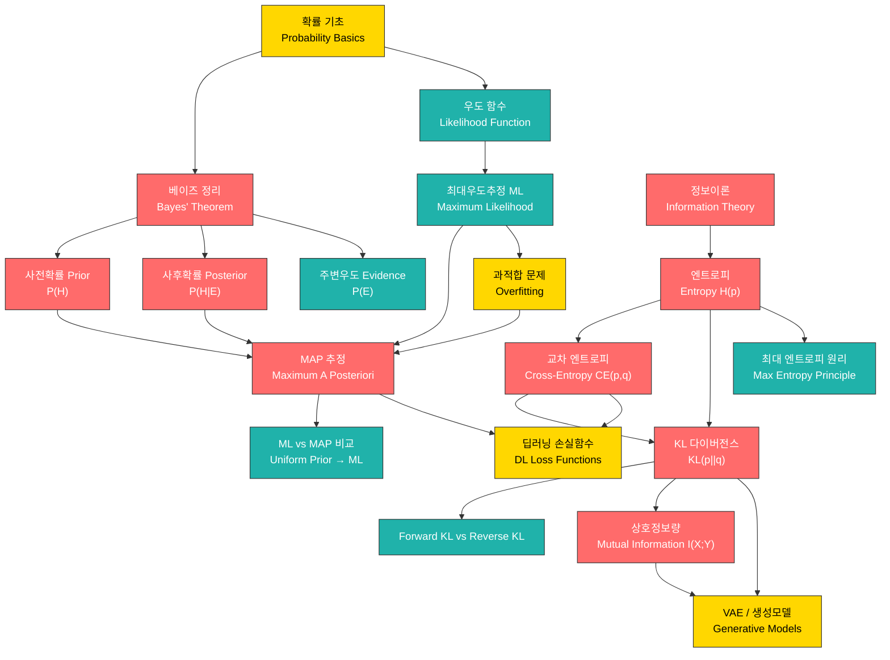

# 09. 베이지안 확률 & 정보이론 (Bayesian Probability & Information Theory)

> **동기부여**: 딥러닝의 학습(training)은 본질적으로 **데이터로부터 불확실한 모델 파라미터를 추정**하는 과정이다. 빈도주의(Frequentist) 관점의 Maximum Likelihood(ML)만으로는 데이터가 적을 때 과적합(overfitting)에 취약하다. 베이지안 사고(Bayesian thinking)는 **사전 지식(prior)**을 활용하여 이 문제를 해결하며, 정보이론(Information Theory)은 "불확실성을 어떻게 측정하고, 분포 간 차이를 어떻게 정량화하는가?"라는 핵심 질문에 답한다. 딥러닝의 손실 함수(cross-entropy loss), 생성 모델(VAE, Diffusion)의 ELBO, 지식 증류(Knowledge Distillation)의 KL divergence 등 **현대 딥러닝의 거의 모든 학습 목표(objective)가 이 두 이론 위에 세워져 있다.**

---

## 1. 선행 개념 연결 Mermaid 다이어그램

**범례**: 🔴 빨강 = 핵심 개념 (important), 🟢 청록 = 중간 개념 (intermediate), 🟡 노랑 = 연결 다리 (bridge)

---

## 2. 개념별 5단계 완전 분리 설명

---

### 개념 1: 베이즈 정리 (Bayes' Theorem) (슬라이드 225-228)

#### ① 초등학생 단계
상자 안에 빨간 공과 파란 공이 있어. 눈을 감고 하나 꺼냈더니 빨간색이야. "이 상자에는 빨간 공이 더 많겠지?"라고 생각을 바꾸는 것 -- 이게 바로 베이즈 정리야! **새로운 정보(꺼낸 공의 색)를 보고 내 생각(상자 안의 구성)을 업데이트하는 방법**이야.

#### ② 중등학생 단계
동전의 앞면이 나올 확률이 궁금해. 처음엔 "반반이겠지"라고 생각해(사전 믿음). 3번 던져서 3번 다 앞면이면? "아, 이 동전 좀 이상하다"라고 믿음을 수정하지. 이 과정이:
- **사전 확률 P(H)**: 데이터를 보기 전의 믿음
- **우도 P(E|H)**: 가설이 맞다면 이런 데이터가 나올 확률
- **사후 확률 P(H|E)**: 데이터를 본 뒤의 업데이트된 믿음

#### ③ 고등학생 단계
$$P(H \mid E) = \frac{P(E \mid H) \cdot P(H)}{P(E)}$$

각 항의 의미:
- $E$: 관측 데이터(evidence/observation)
- $H$: 가설(hypothesis). 예: "동전의 앞면 확률 $\theta = 0.7$이다"
- $P(H)$: **사전 확률(prior)** -- 데이터를 보기 전 가설에 대한 믿음의 강도
- $P(E \mid H)$: **우도(likelihood)** -- 가설 $H$ 하에서 데이터 $E$가 관측될 확률
- $P(E) = \int P(H)P(E \mid H)dH$: **주변 우도(evidence/marginal likelihood)** -- 정규화 상수
- $P(H \mid E)$: **사후 확률(posterior)** -- 데이터를 관측한 후의 업데이트된 믿음

Sir Harold Jeffreys의 말: "베이즈 정리는 확률론에서 피타고라스 정리가 기하학에서 차지하는 위치와 같다." (슬라이드 227 각주 104)

#### ④ 대학 단계
**빈도주의 vs. 베이지안** (슬라이드 226):

| 관점 | 확률의 해석 | 대상 |
|------|-----------|------|
| 베이지안 (Bayesian) | 믿음의 정도 (Belief) | 가설 (Hypothesis) |
| 빈도주의 (Frequentist) | 빈도의 극한 (Frequency) | 사건 (Event) |

베이지안 추론의 핵심 사이클 (슬라이드 225):
$$\cdots \to \text{Data} \to \text{Belief} \to \text{Data} \to \text{Belief} \to \cdots$$

이전 사후 확률이 다음 관측의 사전 확률이 되는 **순차적 업데이트(sequential update)**가 가능하다. 이는 온라인 학습(online learning)의 이론적 근거가 된다.

#### ⑤ 대학원 단계
베이지안 추론의 계산적 도전: 사후 분포 $P(H \mid E)$를 해석적으로 구하기 위해서는 $P(E) = \int P(H)P(E \mid H)dH$를 계산해야 하는데, 고차원에서 이 적분은 난해(intractable)하다. 이를 근사하기 위한 방법:
1. **변분 추론(Variational Inference)**: $q(H) \approx P(H \mid E)$로 근사, $\text{KL}(q \| P(\cdot | E))$ 최소화
2. **MCMC (Markov Chain Monte Carlo)** (슬라이드 218): 사후 분포에서 샘플링하기 위한 마르코프 체인 구성
3. **라플라스 근사(Laplace Approximation)**: MAP 근처에서 가우시안 근사

딥러닝에서의 적용:
- **Bayesian Neural Network**: 가중치 $w$에 사전 분포 부여, $P(w \mid \mathcal{D}) \propto P(\mathcal{D} \mid w)P(w)$
- **Weight decay = 가우시안 사전 분포**: $P(w) \sim \mathcal{N}(0, \sigma^2I)$이면 MAP 목적함수에 $\|w\|^2$ 정규화 항이 자연스럽게 등장

---

### 개념 2: 최대우도추정 (Maximum Likelihood Estimation, MLE) (슬라이드 229-233)

#### ① 초등학생 단계
친구가 주사위를 던졌는데 결과를 보여줬어. "어떤 주사위가 이런 결과를 가장 잘 만들까?" 여러 주사위를 비교해서 **가장 그럴듯한 주사위**를 고르는 거야!

#### ② 중등학생 단계
동전을 5번 던져서 3번 앞면이 나왔어. 앞면 확률이 0.5인 동전? 0.6인 동전? 0.9인 동전? 각각에 대해 "이 동전이면 이런 결과가 나올 확률"을 계산해서, **그 값이 가장 큰 동전을 선택**하는 방법이 MLE야.

#### ③ 고등학생 단계
데이터 $E = \{x_1, \ldots, x_n\}$이 i.i.d.일 때, 우도(likelihood) 함수:
$$\text{lik} = P(E \mid H) = \prod_{i=1}^{n} P(x_i \mid \theta)$$

로그를 취하면(log-likelihood):
$$\text{loglik} = \sum_{i=1}^{n} \log P(x_i \mid \theta)$$

MLE: $\theta_{\text{ML}} = \arg\max_\theta \text{loglik}$

#### ④ 대학 단계
**베르누이 분포에서의 MLE** (슬라이드 229):
동전 던지기: $H = \theta$, $P(\text{Head}) = \theta$, $n$번 중 $k$번 앞면:

$$\text{loglik} = k \log \theta + (n-k) \log(1-\theta)$$
$$\frac{\partial}{\partial \theta}\text{loglik} = \frac{k}{\theta} - \frac{n-k}{1-\theta} = 0 \implies \theta_{\text{ML}} = \frac{k}{n}$$

**정규분포에서의 MLE** (슬라이드 231-232):
$x_i \sim \mathcal{N}(\mu, \sigma^2)$일 때:
$$\text{loglik} = n\log\frac{1}{\sqrt{2\pi\sigma^2}} + \sum_{i=1}^{n} -\frac{1}{2}\left(\frac{x_i - \mu}{\sigma}\right)^2$$

$$\mu_{\text{ML}} = \frac{1}{n}\sum_{i=1}^{n} x_i, \quad \sigma^2_{\text{ML}} = \frac{1}{n}\sum_{i=1}^{n}\left(x_i - \frac{1}{n}\sum x_i\right)^2$$

주의: $\mathbb{E}[\mu_{\text{ML}}] = \mu$ (비편향)이지만, $\mathbb{E}[\sigma^2_{\text{ML}}] = \frac{n-1}{n}\sigma^2 \neq \sigma^2$ (편향 추정량). 비편향 추정량은 $\sigma^2_{\text{unb}} = \frac{n}{n-1}\sigma^2_{\text{ML}}$ (슬라이드 232).

#### ⑤ 대학원 단계
MLE의 과적합 문제 (슬라이드 233): $n=3$번 동전을 던져 $k=3$번 앞면이면 $\theta_{\text{ML}} = 1$. 이 모델로 예측하면 **미래의 모든 동전 던지기가 앞면**이라고 예측하게 되는데, 이는 명백히 비합리적이다.

MLE의 점근적 성질(asymptotic properties):
- **일치성(Consistency)**: $n \to \infty$이면 $\theta_{\text{ML}} \xrightarrow{p} \theta^*$
- **점근적 정규성(Asymptotic Normality)**: $\sqrt{n}(\theta_{\text{ML}} - \theta^*) \xrightarrow{d} \mathcal{N}(0, I(\theta^*)^{-1})$ (Fisher 정보량의 역수)
- **점근적 효율성(Efficiency)**: Cramer-Rao 하한 달성

---

### 개념 3: MAP 추정 (Maximum A Posteriori) (슬라이드 234-241)

#### ① 초등학생 단계
MLE가 "데이터만 보고 판단"이라면, MAP는 "내가 이미 알고 있는 것도 함께 생각하기"야. 동전을 3번 던져 3번 앞면이 나와도, "보통 동전은 반반이니까" 하고 약간 조정하는 거지!

#### ② 중등학생 단계
- MLE: 오직 데이터에서 나온 패턴만으로 결론
- MAP: 데이터 + 상식(사전 지식)을 함께 고려

예를 들어, 3번 던져서 3번 앞면이면:
- MLE: $\theta = 3/3 = 1$ (100% 앞면!)
- MAP (공정한 동전이라는 상식 반영): $\theta = 4/5 = 0.8$ (더 합리적)

#### ③ 고등학생 단계
$$\theta_{\text{MAP}} = \arg\max_\theta P(\theta \mid E) = \arg\max_\theta P(E \mid \theta)P(\theta)$$

로그를 취하면:
$$\theta_{\text{MAP}} = \arg\max_\theta \left[\log P(E \mid \theta) + \log P(\theta)\right] = \arg\max_\theta \left[\text{loglik} + \text{logprior}\right]$$

#### ④ 대학 단계
**Uniform Prior일 때 MAP = ML** (슬라이드 235):
$P(\theta) = \text{const}$이면 $\log P(\theta) = \text{const}$이므로:
$$\text{logpost} = \text{loglik} + \text{const} \implies \theta_{\text{MAP}} = \theta_{\text{ML}} = \frac{k}{n}$$

**Beta Prior로 공정한 동전 반영** (슬라이드 236-238):
$P(\theta) \propto \theta(1-\theta)$ (즉 $\text{Beta}(2,2)$에 비례)이면:
$$\text{logpost} = (k+1)\log\theta + (n-k+1)\log(1-\theta) + C$$
$$\theta_{\text{MAP}} = \frac{k+1}{n+2}$$

$n=3, k=3$이면 $\theta_{\text{MAP}} = 4/5$. 사전 분포가 0.5 근처에 집중될수록 ($p(\theta) \propto \theta^m(1-\theta)^m$, $m$ 증가), MAP 추정치가 0.5에 더 가까워진다 (슬라이드 238).

**ML vs MAP 비교 테이블** (슬라이드 241):

| 속성 | ML | (강한) MAP |
|------|-----|-----------|
| 확률 | $P(E \mid H)$ | $P(H \mid E) \propto P(E \mid H)P(H)$ |
| 의존 | 데이터/관측 (패턴) | 사전 지식 (규칙) |
| 사전분포 | 균등 분포 | 비균등 분포 |
| 추론 방식 | 귀납(induction) | 연역(deduction) |
| 가설 공간 | 크다 | 작다 (제한적) |
| 표현력 | 높다 | 낮다 |
| 과적합 | 쉽다 | 어렵다 |

#### ⑤ 대학원 단계
MAP와 정규화(regularization)의 관계:
- **가우시안 사전 분포** $P(\theta) \sim \mathcal{N}(0, \sigma^2_p I)$:
  $$\text{logpost} = \text{loglik} - \frac{1}{2\sigma^2_p}\|\theta\|^2 + \text{const}$$
  $\implies$ **L2 정규화 (Weight Decay)**

- **라플라스 사전 분포** $P(\theta) \propto \exp(-\lambda|\theta|)$:
  $$\text{logpost} = \text{loglik} - \lambda\|\theta\|_1 + \text{const}$$
  $\implies$ **L1 정규화 (Sparsity)**

MAP의 한계: 사후 분포의 **모드(mode)**만 구하고 **분포 전체의 형태(불확실성)**는 무시한다. Full Bayesian 접근은 $P(\theta \mid E)$ 전체를 활용하여 예측 불확실성(predictive uncertainty)을 정량화한다:
$$P(x_{\text{new}} \mid E) = \int P(x_{\text{new}} \mid \theta)P(\theta \mid E)d\theta$$

---

### 개념 4: 엔트로피 (Entropy) (슬라이드 247-248)

#### ① 초등학생 단계
"다음에 무엇이 나올지 얼마나 놀라울까?"를 숫자로 나타낸 거야. 매번 같은 것만 나오면 놀랍지 않아(엔트로피 낮음). 뭐가 나올지 전혀 모르면 매우 놀랍지(엔트로피 높음)!

#### ② 중등학생 단계
주사위를 생각해봐. 공정한 6면 주사위는 뭐가 나올지 예측이 어려워 -- 엔트로피가 높아. 반면 항상 1만 나오는 조작된 주사위는 예측이 쉬워 -- 엔트로피가 0이야. 엔트로피는 **불확실성의 측정 도구**야.

#### ③ 고등학생 단계
이산 확률변수 $X$의 엔트로피:
$$H(p) := -\mathbb{E}_p[\log p(X)] = -\sum_x p(x)\log p(x)$$

주요 성질:
- $H(p) \geq 0$ (항상 0 이상)
- 결정론적 분포(one-hot): $H = 0$ (최소)
- 유한 집합 $\mathcal{S}$ 위의 균등 분포: $H = \log|\mathcal{S}|$ (최대) (슬라이드 247)

#### ④ 대학 단계
엔트로피의 두 가지 해석 (슬라이드 247):
1. **불확실성(uncertainty)의 척도**: 예측 불가능성
2. **정보량(information content)**: 데이터 소스가 평균적으로 전달하는 정보의 양. $X_n \sim p$에서 생성되는 심볼 시퀀스를 관찰할 때, $p$의 엔트로피가 높을수록 각 관측값을 예측하기 어렵다.

**최대 엔트로피 원리** (슬라이드 247):
- 유한 집합 위: **이산 균등 분포**가 최대 엔트로피 (라그랑주 승수법으로 증명)
- 구간 $[a,b]$ 위: **연속 균등 분포**가 최대 엔트로피
- 평균과 분산이 주어졌을 때: **정규분포**가 최대 엔트로피

#### ⑤ 대학원 단계
**연속 확률변수의 미분 엔트로피(Differential Entropy)** (슬라이드 248):
$$H(X) = -\int p(x)\log p(x)\,dx$$

가우시안의 엔트로피:
- $X \sim \mathcal{N}(\mu, \Sigma)$이면: $H(X) = \frac{1}{2}\log\left((2\pi e)^d |\Sigma|\right) = \frac{d}{2}\log(2\pi e) + \frac{1}{2}\log|\Sigma|$
- 등방적(isotropic) 경우 $\Sigma = \sigma^2 I$: $H(X) = \frac{d}{2}\log(2\pi e \sigma^2)$

엔트로피의 순서 (슬라이드 248):
$$0 = H(\text{one-hot}) < H(\text{uniform over } \{1,\ldots,C\}) = \log C$$

딥러닝에서의 활용:
- **Label Smoothing**: one-hot 레이블의 엔트로피를 약간 높여 과적합 방지
- **엔트로피 정규화**: 정책 기울기(Policy Gradient)에서 탐색(exploration) 촉진을 위해 정책의 엔트로피에 보너스를 부여

---

### 개념 5: 교차 엔트로피 (Cross-Entropy) (슬라이드 243-244)

#### ① 초등학생 단계
"진짜 정답"과 "내 예측"이 얼마나 다른지를 재는 점수야. 내가 정답을 잘 맞추면 점수가 낮고, 엉뚱한 답을 내놓으면 점수가 올라가!

#### ② 중등학생 단계
시험에서 선생님이 정답지를 갖고 있어(진짜 분포 $p$). 내가 만든 커닝 페이퍼가 있어(예측 분포 $q$). 교차 엔트로피는 "내 커닝 페이퍼를 쓸 때 평균적으로 얼마나 놀라는지(틀리는지)"를 숫자로 나타낸 거야.

#### ③ 고등학생 단계
$$CE(p, q) := -\mathbb{E}_p[\log q(X)] = -\sum_x p(x)\log q(x)$$

핵심 관계:
$$CE(p, q) = H(p) + KL(p \| q)$$

- $H(p)$는 진짜 분포의 본질적 불확실성 (바꿀 수 없음)
- $KL(p \| q) \geq 0$은 추가적인 비효율성
- **따라서 $CE$를 최소화하는 것은 $KL$을 최소화하는 것과 동치!**

#### ④ 대학 단계
분류(classification) 문제에서의 교차 엔트로피 손실:
- 진짜 레이블: one-hot $p = (0,\ldots,1,\ldots,0)$ (정답 클래스만 1)
- 모델 출력: $q = \text{softmax}(z)$

$$CE(p, q) = -\log q(y_{\text{true}}) = -\log \frac{e^{z_{y_{\text{true}}}}}{\sum_c e^{z_c}}$$

이것이 바로 **Negative Log-Likelihood (NLL)**이며, 딥러닝 분류에서 가장 널리 사용되는 손실 함수다.

**정규분포 가정에서의 CE와 MSE의 관계** (슬라이드 244 각주 118):
$q = \mathcal{N}(\mu, \sigma^2 I)$이고 등방 공분산 $\Sigma_2 = \beta I$이면:
$$KL(\mathcal{N}(\mu_1, \Sigma_1) \| \mathcal{N}(\mu_2, \Sigma_2)) = C\|\mu_1 - \mu_2\|^2 + C'$$
여기서 $C = \frac{1}{2\beta}$. 즉, **정규분포 가정 하에서 CE(NLL) 최소화는 MSE 최소화와 동치!**

#### ⑤ 대학원 단계
교차 엔트로피의 수학적 유도와 정보이론적 해석:

데이터 분포 $p$에서 심볼을 생성하는데, 코딩 체계를 $q$에 기반하여 설계했다면, 평균 코드 길이는 $CE(p,q)$가 된다. 최적 코드는 $q = p$일 때 달성되며 이때 $CE(p,p) = H(p)$.

딥러닝 학습의 정보이론적 해석:
$$\min_\theta CE(p_{\text{data}}, p_\theta) = \min_\theta \left[H(p_{\text{data}}) + KL(p_{\text{data}} \| p_\theta)\right] = \min_\theta KL(p_{\text{data}} \| p_\theta)$$

즉, 모델 $p_\theta$를 학습하는 것은 **모델이 데이터 분포에 가까워지도록** KL divergence를 줄이는 것이다.

---

### 개념 6: KL 다이버전스 (KL Divergence) (슬라이드 243-246, 252-254)

#### ① 초등학생 단계
두 개의 주사위가 있어. 하나는 진짜, 하나는 가짜야. KL 다이버전스는 "가짜가 진짜랑 얼마나 다른지"를 재는 자야. 완전 똑같으면 0, 완전 다르면 큰 숫자가 나와!

#### ② 중등학생 단계
KL 다이버전스는 두 확률분포 사이의 "거리" 같은 것인데, 진짜 거리는 아니야. 왜냐하면 **방향이 있거든!** A에서 B까지의 "거리"와 B에서 A까지의 "거리"가 다를 수 있어.

#### ③ 고등학생 단계
$$KL(p \| q) := \mathbb{E}_p\left[\log\frac{p(X)}{q(X)}\right] = \int p(x)\log\frac{p(x)}{q(x)}\,dx$$

핵심 성질:
- $KL(p \| q) \geq 0$ (항상 0 이상, **Gibbs' inequality**)
- $KL(p \| q) = 0 \iff p = q$
- $KL(p \| q) \neq KL(q \| p)$ (비대칭! 따라서 "거리"가 아님) (슬라이드 246 각주 119)
- $KL(p \| q) = CE(p,q) - H(p)$

#### ④ 대학 단계
**Forward KL vs. Reverse KL** (슬라이드 246):

**Forward KL**: $\min_q KL(p \| q)$ -- $q$에 대해 최소화
- **Zero-avoiding (inclusive, mode-covering)**: $p(x) > 0$인 곳에서 $q(x) \approx 0$이면 $\log\frac{p(x)}{q(x)} \to \infty$이므로 페널티가 매우 큼
- 따라서 $q$는 $p$가 양수인 모든 영역을 커버하려 함 (mode-covering)
- **딥러닝 학습(MLE/CE 최소화)에서 사용**

**Reverse KL**: $\min_q KL(q \| p)$ -- $q$에 대해 최소화
- **Zero-forcing (exclusive, mode-seeking)**: $q(x) > 0$인데 $p(x) \approx 0$이면 페널티가 큼
- 따라서 $q$는 $p$가 0인 곳에서도 0이 되려 함 (mode-seeking)
- **변분 추론(Variational Inference)에서 사용**

**가우시안 분포 간의 KL** (슬라이드 244):
- 1차원: $KL(\mathcal{N}(\mu_1, \sigma_1^2) \| \mathcal{N}(\mu_2, \sigma_2^2)) = \frac{1}{2}\left[2\log\frac{\sigma_2}{\sigma_1} + \frac{\sigma_1^2}{\sigma_2^2} + \frac{(\mu_1-\mu_2)^2}{\sigma_2^2} - 1\right]$
- 특히 $\sigma_1 = \sigma_2 = 1$이면: $KL = \frac{(\mu_1 - \mu_2)^2}{2}$
- $D$차원: $KL(\mathcal{N}(\mu_1,\Sigma_1)\|\mathcal{N}(\mu_2,\Sigma_2)) = \frac{1}{2}\left[\log\frac{\det\Sigma_2}{\det\Sigma_1} + \text{tr}(\Sigma_1\Sigma_2^{-1}) + (\mu_1-\mu_2)^\top\Sigma_2^{-1}(\mu_1-\mu_2) - D\right]$

#### ⑤ 대학원 단계
KL divergence의 정보기하학적(Information Geometric) 해석:
KL divergence는 통계적 다양체(statistical manifold) 위의 **Bregman divergence**의 특수한 경우이며, Fisher 정보행렬(Fisher Information Matrix) $F$로 국소적으로 근사할 수 있다:
$$KL(p_\theta \| p_{\theta + d\theta}) \approx \frac{1}{2}d\theta^\top F(\theta)d\theta$$

딥러닝에서의 핵심 응용:
1. **VAE의 ELBO**: $\log p(x) \geq \mathbb{E}_{q(z|x)}[\log p(x|z)] - KL(q(z|x) \| p(z))$
2. **Knowledge Distillation**: Student가 Teacher의 soft label을 따라가도록 $KL(p_T \| p_S)$ 최소화
3. **PPO (Proximal Policy Optimization)**: 정책 업데이트를 KL divergence로 제한
4. **Natural Gradient**: Fisher 정보행렬의 역행렬을 이용하여 KL 공간에서 효율적 업데이트

---

### 개념 7: 상호정보량 (Mutual Information) (슬라이드 251-252)

#### ① 초등학생 단계
"하나를 알면 다른 하나를 맞추기 더 쉬워질까?" 비가 오는지 알면 우산을 들고 있는 사람 수를 더 잘 맞출 수 있어. 이런 "도움의 정도"를 숫자로 나타낸 게 상호정보량이야!

#### ② 중등학생 단계
키와 몸무게를 생각해봐. 키가 크면 몸무게도 무거울 가능성이 높지? 이런 관계를 측정하는 거야. 상관계수(correlation)와 비슷하지만, **선형 관계뿐 아니라 모든 종류의 관계**를 잡아낼 수 있어!

#### ③ 고등학생 단계
$$I(X; Y) = KL(p(x,y) \| p(x)p(y))$$

해석: $X$와 $Y$의 **결합 분포**가 **독립일 때의 분포(곱 분포)**와 얼마나 다른지를 측정.
- $I(X;Y) = 0 \iff X$와 $Y$가 독립
- $I(X;Y) \geq 0$

#### ④ 대학 단계
상호정보량의 여러 표현 (슬라이드 252):

$$I(X;Y) = \mathbb{E}_{(x,y)\sim p(x,y)}\left[\log\frac{p(x,y)}{p(x)p(y)}\right]$$
$$= \mathbb{E}_{(x,y)\sim p(x,y)}\left[\log\frac{p(x \mid y)}{p(x)}\right]$$
$$= H(X) - H(X \mid Y) = H(Y) - H(Y \mid X)$$

해석: $Y$를 알았을 때 $X$에 대한 불확실성이 얼마나 줄어드는가.

**Pointwise Mutual Information (PMI)**:
$$i(x; y) = \log\frac{p(x \mid y)}{p(x)} = \log\frac{p(x,y)}{p(x)p(y)}$$
$I(X;Y) = \mathbb{E}[i(X;Y)]$

#### ⑤ 대학원 단계
**딥러닝에서의 상호정보량 응용**:
1. **InfoNCE Loss (Contrastive Learning)**: $I(X;Y)$의 하한을 최대화
   $$\mathcal{L}_{\text{InfoNCE}} = -\mathbb{E}\left[\log\frac{e^{f(x,y^+)}}{\sum_j e^{f(x,y_j)}}\right] \leq -I(X;Y) + \log N$$
2. **Information Bottleneck**: 표현 $Z$가 입력 $X$의 정보를 최소한으로 가지면서 출력 $Y$에 대한 정보를 최대로:
   $$\min_{p(z|x)} \left[-I(Z;Y) + \beta I(Z;X)\right]$$
3. **Deep InfoMax (DIM)**: 전역 특징과 국소 특징 간의 상호정보량 최대화
4. **Data Processing Inequality**: $X \to Y \to Z$이면 $I(X;Z) \leq I(X;Y)$. 레이어가 깊어질수록 입력에 대한 정보가 줄어들 수밖에 없다는 이론적 한계.

---

### 개념 8: 확률분포 적합과 베이지안 추론 사이클 (Distribution Fitting & Bayesian Inference Cycle) (슬라이드 228-230, 242)

#### ① 초등학생 단계
너의 키를 재봤어. 친구들 키도 다 재봤어. "우리 반 아이들의 키가 어떤 모양으로 분포되어 있을까?"를 찾는 거야 -- 마치 점들을 이어서 산 모양의 곡선을 그리는 것과 같아!

#### ② 중등학생 단계
데이터가 주어졌을 때, "이 데이터를 가장 잘 설명하는 확률분포의 모양(파라미터)은 무엇인가?"를 찾는 과정이야. 평균이 얼마이고 퍼짐이 얼마인 종 모양 곡선(정규분포)이 데이터에 가장 잘 맞는지 찾는 거지.

#### ③ 고등학생 단계
**확률 분포 적합(Probability Distribution Fitting)** (슬라이드 230):
데이터 또는 경험적 분포가 주어지면, 이를 가장 잘 설명하는 **모델(예: 가우시안)의 파라미터**를 찾는 과정.

방법론 순서: MLE → MAP → Full Bayesian

#### ④ 대학 단계
**귀납적 편향(Inductive Bias)** (슬라이드 230 각주 109):
"가우시안 분포로 적합"이라는 가정 자체가 귀납적 편향이다. "왜 가우시안인가?"라는 질문에 대한 정당화:
- 최대 엔트로피 원리: 평균과 분산만 알려진 경우 가우시안이 가장 보수적인(최소 가정의) 선택
- 중심극한정리: 많은 독립적인 작은 효과의 합은 가우시안에 수렴

**오버캐패시티 그래프의 해석** (슬라이드 242): ML(대규모 데이터)에서는 모델 용량을 키우면 자연스럽게 좋은 결과, MAP(강한 사전지식)은 작은 데이터에서도 잘 동작하지만 확장성이 제한적.

#### ⑤ 대학원 단계
현대 딥러닝의 패러다임 전환 (슬라이드 242):

| 체제 (Regime) | 특징 | 전략 |
|--------------|------|------|
| Skydiving (Internet Scale DL) | 극도로 undercapacity | Scaling-centric, 근사 오차 최소화 |
| U-shaped (Classical ML) | Undercapacity | 정규화 중심, 일반화 오차 최소화 |
| Second-descent (ImageNet Scale DL) | Overcapacity | Interpolation threshold 이후 다시 일반화 향상 |

LLM 시대에는 Skydiving Regime으로 이동: 데이터가 충분히 많으면 강한 사전지식(MAP) 없이 MLE(uniform prior)만으로도 뛰어난 성능. 이것이 "Scaling Law"의 이론적 기반.

---

## 3. 오개념 카드 (Misconceptions)

### 오개념 1: "KL divergence는 두 분포 사이의 거리(distance)이다"
**왜 틀린가**: KL divergence는 **비대칭**이다. $KL(p \| q) \neq KL(q \| p)$이므로 거리(metric)의 조건인 대칭성을 만족하지 않는다. 또한 삼각부등식도 만족하지 않는다 (슬라이드 246 각주 119).

**올바른 이해**: KL divergence는 "정보 이득(information gain)" 또는 "상대 엔트로피(relative entropy)"라고 부르며, $p$를 기준으로 $q$가 얼마나 비효율적인지를 측정하는 **비대칭적 divergence**이다.

---

### 오개념 2: "MLE는 항상 좋은 추정량이다"
**왜 틀린가**: 데이터가 적을 때 MLE는 극단적인 값을 줄 수 있다. 동전 3번 던져 3번 앞면이면 $\theta_{\text{ML}} = 1.0$이 되어, 미래의 모든 뒷면 확률을 0으로 예측한다 (슬라이드 233).

**올바른 이해**: MLE는 **점근적으로(데이터가 충분히 많을 때)** 좋은 성질(일치성, 효율성)을 가지지만, **소표본(small sample)** 상황에서는 MAP나 Full Bayesian 접근이 더 안정적이다.

---

### 오개념 3: "엔트로피가 높으면 나쁜 것이다"
**왜 틀린가**: 맥락에 따라 다르다. 분류 모델의 출력 엔트로피가 높으면 "확신이 없다"는 뜻으로 안 좋을 수 있지만, 강화학습에서 정책의 엔트로피가 높으면 **탐색(exploration)**이 활발하다는 뜻으로 좋을 수 있다.

**올바른 이해**: 엔트로피는 중립적인 **불확실성의 측정 도구**이다. 높은 것이 좋은지 나쁜지는 목적에 따라 달라진다.

---

### 오개념 4: "교차 엔트로피와 KL divergence는 완전히 다른 것이다"
**왜 틀린가**: $CE(p,q) = H(p) + KL(p \| q)$이다. 학습 시 $p$(데이터 분포)는 고정이므로 $H(p)$는 상수. 따라서 **CE를 최소화하는 것 = KL을 최소화하는 것**이다 (슬라이드 243).

**올바른 이해**: 교차 엔트로피는 KL divergence에 상수($H(p)$)를 더한 것이다. 최적화 관점에서 둘은 동치이다.

---

### 오개념 5: "MAP에서 사전 분포가 강할수록 항상 좋다"
**왜 틀린가**: 사전 분포가 너무 강하면(예: $m \to \infty$일 때 $p(\theta) \propto \theta^m(1-\theta)^m$, 슬라이드 238) 데이터를 무시하고 사전 믿음만 반영한다. $n=k=100$이어도 $\theta_{\text{MAP}} \to 0.5$가 된다.

**올바른 이해**: 사전 분포의 강도는 **데이터 양과의 균형**이 중요하다. 데이터가 적으면 강한 사전분포가 유리하고, 데이터가 충분하면 약한 사전분포(또는 MLE)가 더 유연하다 (슬라이드 241).

---

### 오개념 6: "Forward KL과 Reverse KL은 비슷한 결과를 준다"
**왜 틀린가**: 다봉(multimodal) 분포를 단봉(unimodal) 분포로 근사할 때 결과가 극적으로 달라진다 (슬라이드 246의 그림):
- Forward KL($\min_q KL(p\|q)$): $q$가 $p$의 **모든 모드를 커버**하려 하여 두 모드 사이를 채움 (mode-covering)
- Reverse KL($\min_q KL(q\|p)$): $q$가 $p$의 **하나의 모드에 집중** (mode-seeking)

---

## 4. 초등학생에게 설명하기 연습

### Q1: "베이즈 정리가 뭐예요?"
비가 올지 안 올지 생각해보자! 아침에 일어나서 "오늘 비 올 확률 30%겠지"라고 생각했어(사전 확률). 그런데 창밖을 보니 하늘이 새까매! 이제 "비 올 확률 80%"로 생각이 바뀌었어(사후 확률). **새로운 증거(까만 하늘)를 보고 내 생각을 업데이트하는 방법**이 베이즈 정리야!

### Q2: "엔트로피가 뭐예요?"
생일 선물 상자를 열 때를 생각해봐. 엄마가 "레고야"라고 미리 말해줬으면 열어도 안 놀라지? 하지만 아무 힌트도 없으면 열 때 엄청 두근두근하잖아! **얼마나 두근두근한지(놀라운지)를 숫자로 만든 것**이 엔트로피야.

### Q3: "교차 엔트로피가 뭐예요?"
시험 문제의 정답을 선생님이 알고 있어. 너는 공부해서 나름대로 답을 적었어. **선생님의 정답과 네 답이 얼마나 다른지를 점수로 매기는 것**이 교차 엔트로피야. 잘 공부했으면 점수(손실)가 낮고, 대충 했으면 높아!

### Q4: "KL divergence가 뭐예요?"
너랑 친구가 각각 내일 날씨를 예측했어. 너는 "맑음 60%, 비 40%"라고 했고, 친구는 "맑음 90%, 비 10%"라고 했어. 실제로 비가 왔을 때, **누구의 예측이 더 놀라운지(더 틀렸는지)를 재는 것**이 KL divergence야.

---

## 5. 수학 <-> 딥러닝 연결 테이블

| 수학 개념 | 수식 | 딥러닝 대응 | 역할 |
|-----------|------|-----------|------|
| 베이즈 정리 | $P(H\|E) = \frac{P(E\|H)P(H)}{P(E)}$ | Weight update, Bayesian NN | 데이터를 보고 모델 파라미터에 대한 믿음을 업데이트 |
| 우도 (Likelihood) | $P(E\|H) = \prod_i P(x_i\|\theta)$ | Training loss 계산의 기반 | 현재 모델이 데이터를 얼마나 잘 설명하는지 |
| MLE | $\theta_{\text{ML}} = \arg\max_\theta \log P(E\|\theta)$ | 정규화 없는 학습 (SGD only) | 기본적인 파라미터 추정 |
| MAP | $\theta_{\text{MAP}} = \arg\max_\theta [\log P(E\|\theta) + \log P(\theta)]$ | Weight decay (L2), Dropout | 정규화를 통한 과적합 방지 |
| 엔트로피 $H(p)$ | $-\mathbb{E}_p[\log p(X)]$ | Label smoothing, RL 탐색 보너스 | 불확실성/다양성 측정 |
| 교차 엔트로피 $CE(p,q)$ | $-\mathbb{E}_p[\log q(X)]$ | **분류 손실함수 (softmax + CE)** | 모델 출력과 정답 간의 차이 |
| KL divergence $KL(p\|\|q)$ | $\mathbb{E}_p[\log\frac{p}{q}]$ | VAE의 ELBO, Knowledge Distillation, PPO | 분포 간 차이 측정, 정규화 |
| Forward KL $KL(p\|\|q)$ | $\min_q$ | MLE / CE 최소화 (학습) | Mode-covering: 데이터 분포 전체를 커버 |
| Reverse KL $KL(q\|\|p)$ | $\min_q$ | 변분 추론 (VI), VAE | Mode-seeking: 하나의 모드에 집중 |
| 상호정보량 $I(X;Y)$ | $KL(p(x,y)\|\|p(x)p(y))$ | Contrastive Learning (InfoNCE), InfoMax | 표현 학습에서 유의미한 특징 추출 |
| 가우시안 KL | $\frac{(\mu_1-\mu_2)^2}{2\sigma^2}$ (1D, 동일 분산) | VAE의 latent space 정규화, MSE loss | 연속값 예측의 이론적 근거 |
| 최대 엔트로피 원리 | $\max H(p)$ s.t. constraints | 균등 초기화, 정보 최대화 | 최소 가정 원칙으로 모델 설계 |
| MLE 편향성 | $\mathbb{E}[\sigma^2_{\text{ML}}] = \frac{n-1}{n}\sigma^2$ | Bessel's correction (batch norm) | 통계 추정량의 편향 보정 |

---

## 6. 킬러 요약

| # | 한 줄 요약 | 핵심 수식 | 슬라이드 |
|---|----------|----------|---------|
| 1 | **베이즈 정리**: 데이터를 보고 믿음을 업데이트 | $P(H\|E) \propto P(E\|H)P(H)$ | 227 |
| 2 | **MLE**: 우도가 최대인 파라미터 선택 | $\theta_{\text{ML}} = \arg\max \log P(E\|\theta)$ | 229-232 |
| 3 | **MAP**: MLE + 사전지식 = 정규화 | $\theta_{\text{MAP}} = \arg\max [\text{loglik} + \text{logprior}]$ | 234-237 |
| 4 | **Uniform prior이면 MAP = MLE** | $\log P(\theta) = \text{const}$ | 235 |
| 5 | **엔트로피**: 불확실성 = 놀라움의 평균 | $H(p) = -\mathbb{E}_p[\log p]$ | 247-248 |
| 6 | **교차 엔트로피**: 딥러닝 분류의 표준 손실 | $CE(p,q) = H(p) + KL(p\|\|q)$ | 243 |
| 7 | **KL divergence**: 분포 차이의 비대칭 측정 | $KL(p\|\|q) = \mathbb{E}_p[\log\frac{p}{q}]$ | 243-246 |
| 8 | **Forward KL = mode-covering**, **Reverse KL = mode-seeking** | 슬라이드 246 그림 참조 | 246 |
| 9 | **상호정보량**: 두 변수가 공유하는 정보량 | $I(X;Y) = KL(p_{XY}\|\|p_X p_Y)$ | 251-252 |
| 10 | **CE 최소화 = KL 최소화** ($H(p)$는 상수) | $\min_q CE = \min_q KL$ | 243 |
| 11 | **가우시안 KL + 등방 공분산 = MSE** | $KL \propto \|\mu_1 - \mu_2\|^2$ | 244 |
| 12 | **MAP + 가우시안 prior = L2 정규화(Weight Decay)** | $\text{logprior} = -\frac{\lambda}{2}\|\theta\|^2$ | 241 |

> **최종 한 문장**: 딥러닝의 학습은 **베이지안 추론의 관점에서 사후 확률을 최대화하는 것**이며, 그 목적 함수(교차 엔트로피, KL divergence)는 **정보이론이 제공하는 불확실성 측정 도구**로 구성된다.
