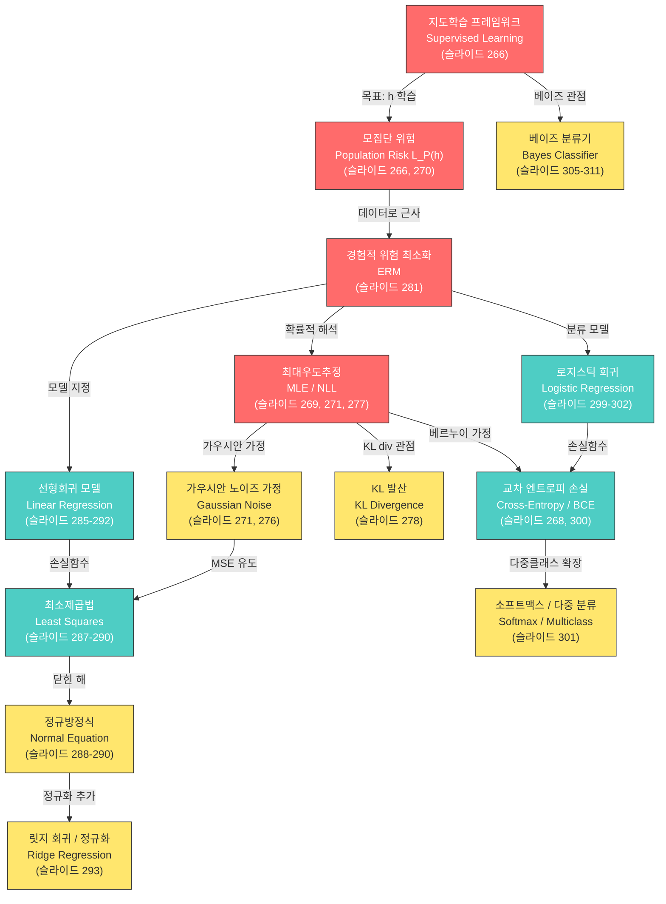

# 10. 선형회귀 & 로지스틱 회귀 (Linear & Logistic Regression)

> **동기부여**: 선형회귀와 로지스틱 회귀는 딥러닝의 가장 단순한 형태의 신경망이다. 뉴런 1개짜리 네트워크가 곧 선형회귀(연속 출력)이고, 여기에 시그모이드를 씌우면 로지스틱 회귀(이진 분류)가 된다. 손실 함수 설계, 경사 하강법, MLE/MAP 추정 등 딥러닝의 모든 핵심 원리가 이 두 모델에서 시작된다. 이 기초를 완벽히 이해하면 복잡한 심층 신경망도 "선형 변환 + 비선형 활성화의 반복"으로 자연스럽게 확장할 수 있다.

---

## 1. 선행 개념 연결 Mermaid 다이어그램



**범례**: 빨간색 = 핵심 개념, 청록색 = 중간 개념, 노란색 = 연결 다리 개념

---

## 2. 개념별 5단계 완전 분리 설명

---

### 개념 1: 지도학습 프레임워크 (Supervised Learning Framework) (슬라이드 262-267)

#### ① 초등학생 단계
선생님이 문제와 정답을 같이 보여주면서 가르쳐주는 것을 "지도학습"이라고 해. 예를 들어 강아지 사진(문제)을 보여주고 "이건 강아지야"(정답)라고 알려주면, 나중에 새 사진을 봤을 때 스스로 "강아지!"라고 맞출 수 있게 되는 거야. 분류(종류 맞추기)와 회귀(숫자 예측하기) 두 가지가 있어.

#### ② 중등학생 단계
데이터 $S = \{(x_i, y_i)\}_{i=1}^n$에서 $x$는 입력(특징), $y$는 출력(정답)이야. 분류는 $y$가 카테고리(예: 붓꽃 종류 1,2,3), 회귀는 $y$가 연속값(예: 집값)이야. 목표는 새로운 $x$가 들어왔을 때 $y$를 잘 예측하는 함수 $h$를 찾는 것이야.

#### ③ 고등학생 단계
입력 공간 $\mathcal{X} = \mathbb{R}^d$, 출력 공간 $\mathcal{Y}$에서:
- **분류**: $\mathcal{Y} = \{1, 2, \cdots, C\}$ (이산값)
- **회귀**: $\mathcal{Y} = \mathbb{R}$ (연속값)

학습 목표는 **모집단 위험(population risk)** $L_\mathcal{P}(h)$를 최소화하는 가설 $h$를 찾는 것이다:
- 분류: $L_\mathcal{P}(h) = \mathbb{E}_{x \sim \mathcal{P}}[\mathbf{1}(h(x) \neq f(x))]$
- 회귀: $L_\mathcal{P}(h) = \mathbb{E}_{x \sim \mathcal{P}}[(h(x) - f(x))^2]$

#### ④ 대학 단계
설계 행렬(design matrix) $X = [x_1^\top; x_2^\top; \cdots; x_n^\top] \in \mathbb{R}^{n \times d}$로 데이터를 행렬로 정리한다. 지도학습과 비지도학습의 관계는 확률 분포 관점에서 이해된다:

$$\text{unsupervised} : p(x) \quad \longleftrightarrow \quad \text{supervised} : p(y \mid x)$$

비지도학습은 $p(x)$를 모델링(생성 모델), 지도학습은 $p(y \mid x)$를 모델링(판별 모델)한다. 생성 모델은 $p(x,y) = p(x|y)p(y)$를 통해 $p(y|x)$를 유도할 수 있다(슬라이드 267).

#### ⑤ 대학원 단계
**불확실성(Uncertainty)** 관점에서 분류와 회귀를 통합적으로 이해한다:
- **분류**: $h(x) = [h_1(x), \cdots, h_C(x)]^\top$으로 조건부 확률 벡터를 출력. $h_c(x) := p(y=c \mid x)$. 손실로 **cross-entropy** $\ell(y, h(x)) = -\log h_y(x) = -\log p(y \mid x)$ 사용 (슬라이드 268).
- **회귀**: $y \sim \mathcal{N}(h(x), \sigma^2)$로 가우시안 노이즈 가정. 이 가정 하에서 NLL을 최소화하면 MSE 최소화와 동치 (슬라이드 271).

핵심 통찰: **cross-entropy와 MSE는 모두 NLL(Negative Log-Likelihood)이라는 같은 목적함수의 특수한 경우**이다 (슬라이드 272).

---

### 개념 2: MLE와 NLL (Maximum Likelihood Estimation & Negative Log-Likelihood) (슬라이드 269, 271, 277-278, 280-282)

#### ① 초등학생 단계
동전을 10번 던져서 앞면이 7번 나왔어. "이 동전은 앞면이 나올 확률이 70%쯤 되겠다"라고 추측하는 게 "최대우도추정"이야. 관찰한 결과가 가장 그럴듯하게 설명되는 값을 찾는 거지.

#### ② 중등학생 단계
데이터가 주어졌을 때, "이 데이터가 나올 확률을 최대로 만드는 모델 파라미터"를 찾는 방법이 MLE야. 확률을 최대화하는 것 = 확률의 로그에 마이너스를 붙인 값(NLL)을 최소화하는 것이야. 로그를 쓰는 이유는 곱셈이 덧셈으로 바뀌어 계산이 편해지기 때문이야.

#### ③ 고등학생 단계
데이터 $S = \{(x_i, y_i)\}_{i=1}^n$이 i.i.d.라 가정하면:

$$\text{NLL}(h) = -\log P(S \mid h) = \sum_{i=1}^{n} -\log p(y_i \mid x_i, h) + C$$

슬라이드 280의 표에서 네 가지 경우를 비교:

| 모델 | 가정 | NLL |
|------|------|-----|
| 베르누이 | $y_i \sim \text{Bern}(\theta)$ | CE (Cross-Entropy) |
| 가우시안 | $y_i \sim \mathcal{N}(\mu, \sigma^2)$ | MSE |
| 회귀 | $y_i \mid x_i \sim \mathcal{N}(h(x_i), \sigma^2)$ | MSE |
| 분류 | $y_i \mid x_i \sim \text{Cat}(h(x_i))$ | CE |

#### ④ 대학 단계
**회귀**에서의 NLL 전개 (슬라이드 271):

$$\text{NLL}(h) = \sum_{i=1}^{n} -\log \mathcal{N}(y_i; h(x_i), \sigma^2) + C = \sum_{i=1}^{n} \frac{1}{2\sigma^2}(y_i - h(x_i))^2 + C = \frac{n}{2\sigma^2}\text{MSE}(h) + C$$

여기서 $C = \sum_{i=1}^{n} -\log p(x_i \mid H) + \frac{n}{2}\log(2\pi\sigma^2)$는 $h$에 무관한 상수이다.

**분류**에서의 NLL 전개 (슬라이드 269):

$$\text{NLL}(h) = \sum_{i=1}^{n} -\log \text{Cat}(y_i \mid h(x_i)) + C = \sum_{i=1}^{n} -\log[h(x_i)]_{y_i} + C$$

#### ⑤ 대학원 단계
**NLL과 KL 발산의 관계** (슬라이드 278):

경험적 분포 $p_S(z) := \frac{1}{n}\sum_{i=1}^{n}\delta(z - z_n)$에 대해:

$$KL(p_S \| q) = -H(p_S) - \mathbb{E}_{p_S}[\log q(Z)] = \underbrace{-H(p_S)}_{\text{constant}} - \underbrace{\frac{1}{n}\sum_{i=1}^{n}\log q(z_i)}_{\text{NLL}}$$

따라서 NLL 최소화 = $KL(p_S \| q)$ 최소화 = 모델 분포 $q$를 경험적 분포 $p_S$에 근사시키는 것.

**MAP 추정과 정규화의 연결** (슬라이드 278 각주, 293): Ridge Regression = $\ell_2$ 정규화 = 가우시안 사전분포(prior)를 가정한 MAP 추정. LASSO = $\ell_1$ 정규화 = 라플라스 사전분포를 가정한 MAP 추정.

---

### 개념 3: 경험적 위험 최소화 (Empirical Risk Minimization, ERM) (슬라이드 281-282)

#### ① 초등학생 단계
모든 학생의 시험 성적을 예측하고 싶은데, 전교생 성적은 모르니까 우리 반 성적(표본)으로 연습하는 거야. "연습 데이터에서 틀린 횟수를 최대한 줄이자!"가 ERM이야.

#### ② 중등학생 단계
진짜 목표는 모든 데이터(모집단)에 대해 잘 맞추는 건데, 모집단 전체를 알 수 없으니 가지고 있는 훈련 데이터에서의 평균 오차를 최소화한다. 이것이 ERM이다. NLL에서 $-\log p$를 일반적인 손실 함수 $\ell$로 바꾼 것이다.

#### ③ 고등학생 단계
일반 손실 함수 $\ell(y_i, h(x_i))$를 사용하여:

$$L_S(h) = \frac{1}{|S|}\sum_{(x_i, y_i) \in S} \ell(y_i, h(x_i))$$

**ERM 목표**: $h_S \in \arg\min_h L_S(h)$, 즉 $L_S(h) \leq L_S(h') \; \forall h'$를 만족하는 $h$를 찾는다.

#### ④ 대학 단계
NLL과 ERM의 관계 (슬라이드 281):
- NLL: $-\log p(y_i \mid x_i; h)$를 손실로 사용
- ERM: 일반 손실 $\ell(y_i, h(x_i))$로 대체

핵심 질문: "함수 공간에서 어떻게 최소화를 수행하는가?" -- **파라미터화(parameterization)**를 통해 함수 공간을 유한 차원 파라미터 공간으로 변환한다. 즉, $h = f_w$로 놓고 $w$에 대해 최적화한다.

#### ⑤ 대학원 단계
$\arg\max_h \text{Lik}(h) = \arg\min_h \text{NLL}(h) = \arg\min_h \text{KL-div}(h)$

가우시안 가정 하에서: $= \arg\min_h \text{MSE}(h)$ (최소제곱법)

베이지안 관점 (슬라이드 282): 사후확률 $P(h \mid S) \propto P(S \mid h) \cdot P(h)$
- $P(h \mid S)$: Posterior -- 데이터를 본 후 가설에 대한 믿음
- $P(S \mid h)$: Likelihood -- 가설 하에서 데이터가 관찰될 확률
- $P(h)$: Prior -- 사전 믿음

가우시안 노이즈가 합리적인 이유: **중심극한정리(CLT)** -- 많은 독립적 요인의 합은 가우시안에 수렴한다.

---

### 개념 4: 선형회귀 모델 (Linear Regression Model) (슬라이드 285-286)

#### ① 초등학생 단계
키가 크면 몸무게도 무거운 경향이 있잖아? 키와 몸무게 사이에 직선을 그어서 "키가 170cm이면 몸무게는 약 65kg이겠다"고 예측하는 게 선형회귀야. 데이터에 가장 잘 맞는 직선을 찾는 거지.

#### ② 중등학생 단계
$y = ax + b$ 형태의 직선 함수를 데이터에 맞추는 것이다. 여러 개의 입력이 있으면 $y = w_1 x_1 + w_2 x_2 + \cdots + w_d x_d + b$가 된다. $w$는 가중치(각 특징의 중요도), $b$는 편향(y절편)이다.

#### ③ 고등학생 단계
모델: $f_w(x) = x^\top w + b$

편향(bias)을 가중치 벡터에 통합하는 트릭:
$$x^\top \leftarrow [x^\top \; 1], \quad w^\top \leftarrow [w^\top \; b]$$

그러면 $f_w(x) = x^\top w$로 간단히 쓸 수 있다 (슬라이드 285).

전체 데이터에 대해 행렬로 표현하면:

$$f_w(X) = Xw, \quad X \in \mathbb{R}^{n \times p}$$

#### ④ 대학 단계
**통계학적 가정** (슬라이드 286):
- $X \in \mathbb{R}^{n \times p}$: 설계 행렬 (독립/설명 변수)
- $y \in \mathbb{R}^n$: 반응 변수 (종속 변수)
- **참 모델**: $y = X\beta + \varepsilon$, 여기서 $\beta \in \mathbb{R}^p$는 알려지지 않은 참 파라미터, $\varepsilon_i$는 관측되지 않은 오차

"regression"이라는 용어는 Francis Galton이 19세기에 "평균으로의 회귀(regression toward the mean)" 현상을 설명하면서 처음 사용했다 (슬라이드 285 각주).

#### ⑤ 대학원 단계
선형회귀의 확률적 해석: $y_i \mid x_i \sim \mathcal{N}(h(x_i), \sigma^2)$ (슬라이드 271, 276)

이는 각 데이터 포인트의 응답값 $y_i$가 예측값 $h(x_i)$를 평균으로 하고 분산 $\sigma^2$인 가우시안 분포를 따른다는 가정이다. 연속 데이터에는 항상 내재적 확률성(intrinsic stochasticity) $\varepsilon$이 존재하며, 응답을 결정하는 많은 미지의 요인이 있다 (슬라이드 270 각주).

**다항 회귀(Polynomial Regression)** (슬라이드 294): 특징 벡터를 $\tilde{x}^\top = [x^p, x^{p-1}, \cdots, x, 1]$로 확장하면 비선형 관계도 선형회귀 프레임워크 안에서 다룰 수 있다. 파라미터에 대해서는 여전히 선형이다.

---

### 개념 5: 최소제곱법과 정규방정식 (Least Squares & Normal Equation) (슬라이드 287-293)

#### ① 초등학생 단계
직선과 각 점 사이의 거리를 재서, 그 거리들을 제곱한 다음 모두 더한 값이 가장 작은 직선이 "최고의 직선"이야. 왜 제곱할까? 위로 벗어난 것도, 아래로 벗어난 것도 공평하게 벌점을 주려고!

#### ② 중등학생 단계
손실 함수: $L_S(w) = \frac{1}{2}\|Xw - y\|^2$

이것을 최소화하는 $\hat{\beta}$를 "최소제곱 추정량"이라 한다. $\frac{1}{2}$는 미분할 때 편하려고 붙인 것이다. 미분해서 0으로 놓으면 답을 직접 구할 수 있다!

#### ③ 고등학생 단계
손실 함수 전개 (슬라이드 287):

$$L_S(w) = \frac{1}{2}(Xw - y)^\top(Xw - y) = \frac{1}{2}(w^\top X^\top X w - 2y^\top X w + y^\top y)$$

$w$에 대해 미분하고 0으로 놓으면:

$$\nabla_w L_S(w)\big|_{w=\hat{\beta}} = X^\top X \hat{\beta} - X^\top y = 0$$

이것이 **정규방정식(Normal Equation)**: $X^\top X \hat{\beta} = X^\top y$

#### ④ 대학 단계
$A = X^\top X \in \mathbb{R}^{p \times p}$, $b = X^\top y \in \mathbb{R}^p$로 놓으면 $A\hat{\beta} = b$이다 (슬라이드 288).

**정규방정식은 항상 해가 존재한다** (증명: $b = X^\top y \in im(X^\top X) = im(X^\top)$, FToLA에 의해).

경우의 수 (슬라이드 289-290):
- $\text{rank}(X) = p$: 유일한 해 $\hat{\beta} = (X^\top X)^{-1} X^\top y$
- $\text{rank}(X) < p$ (예: $n < p$): 무한히 많은 해. **최소 노름 해**: $\hat{\beta} = X^+ y$ (Moore-Penrose 유사역행렬)

기하학적 해석 (슬라이드 292): 손실 곡면에서 $im(X^\top)$ 방향으로는 곡률(curvature) > 0이고, $\ker(X)$ 방향으로는 곡률 = 0인 "골짜기" 구조. 초기점 0 근처에서 출발하여 경사 하강하면 최소 노름 해에 수렴한다.

#### ⑤ 대학원 단계
**릿지 회귀 (Ridge Regression)** (슬라이드 293):

$$L_S(w; \lambda) = \frac{1}{2}\|Xw - y\|^2 + \frac{1}{2}\lambda\|w\|^2, \quad \lambda > 0$$

정규화된 정규방정식:

$$\hat{\beta}_\lambda = (X^\top X + \lambda I)^{-1} X^\top y$$

$X^\top X + \lambda I$는 항상 양정치(positive definite)이므로 **항상 유일한 해가 존재**한다.

확률적 해석: 릿지 회귀 = 가우시안 사전분포 $p(w) \propto e^{-\frac{\lambda}{2}\|w\|^2}$를 가정한 MAP 추정.

**커널 릿지 회귀 (Kernel Ridge Regression)** (슬라이드 295):
특징 함수 $\phi(x)$를 도입하면:

$$\hat{\beta}^\top \phi(x) = y^\top(\Phi^\top\Phi + \lambda I)^{-1}\Phi^\top \phi(x) = y^\top(K + \lambda I)^{-1}k(x)$$

여기서 $K = \Phi^\top\Phi$ (커널 행렬), $k(x) = \Phi^\top\phi(x)$. 이것이 커널 트릭의 핵심이며, 고차원/무한차원 특징 공간에서도 효율적으로 회귀를 수행할 수 있게 한다.

**벡터 출력 최소제곱** (슬라이드 296): $Y \in \mathbb{R}^{n \times c}$일 때 $L_S(W) = \frac{1}{2}\|XW - Y\|_F^2$, 해는 $\hat{B} = \Sigma_{xx}^{-1}\Sigma_{xy} = (X^\top X)^{-1}X^\top Y$ ($\text{rank}(X)=p$일 때).

---

### 개념 6: 가우시안 노이즈 가정과 MSE-MLE 동치성 (Gaussian Noise Assumption) (슬라이드 271-272, 276-277, 279-280)

#### ① 초등학생 단계
키로 몸무게를 예측할 때 정확히 딱 맞추긴 어려워. 약간씩 오차가 있을 텐데, 이 오차가 "종 모양"(정규분포)으로 생겼다고 가정하는 거야. 대부분은 예측값 근처에 있고, 아주 크게 틀리는 건 드물다는 뜻이지.

#### ② 중등학생 단계
$y = h(x) + \varepsilon$에서 오차 $\varepsilon$이 평균 0, 분산 $\sigma^2$인 정규분포를 따른다고 가정한다. 즉 $y \sim \mathcal{N}(h(x), \sigma^2)$. 이 가정 하에서 MLE를 하면 자연스럽게 MSE를 최소화하는 것이 된다.

#### ③ 고등학생 단계
NLL 전개:

$$\text{NLL}(h) = \sum_{i=1}^{n} \frac{1}{2\sigma^2}(y_i - h(x_i))^2 + C = \frac{n}{2\sigma^2}\text{MSE}(h) + C$$

$\sigma^2$과 $C$는 $h$에 무관한 상수이므로, NLL 최소화 $\Leftrightarrow$ MSE 최소화.

즉, **"가우시안 노이즈 가정 + MLE = 최소제곱법(Least Squares)"**이다 (슬라이드 277).

#### ④ 대학 단계
통합 표 (슬라이드 280):

| 분포 가정 | NLL | MLE 해 |
|-----------|-----|--------|
| $\text{Bern}(\theta)$ | $-[k\log\theta + (n-k)\log(1-\theta)]$ | $\theta^* = k/n$ |
| $\mathcal{N}(\mu, \sigma^2)$ | $\frac{1}{2\sigma^2}\sum(y_i - \mu)^2$ | $\mu^* = \bar{y}$ |
| 회귀: $\mathcal{N}(h(x_i), \sigma^2)$ | MSE | $h^*$: 정규방정식 |
| 분류: $\text{Cat}(h(x_i))$ | CE | $h^*$: 수치적 풀이 필요 |

#### ⑤ 대학원 단계
**이상치(outlier)에 대한 민감도** (슬라이드 279):

MSE($\ell_2$ 손실)는 이상치에 민감하다. 대안:
- **$\ell_1$ 손실 (MAE)**: 라플라스 분포 가정. 중앙값(median) 추정. 꼬리가 두꺼운(fatter tail) 분포에 대응. **LASSO 회귀**: $\ell_1$ 정규화 $\rightarrow$ 희소(sparse) 해.
- **$\ell_2$ 손실 (MSE)**: 가우시안 분포 가정. 평균(mean) 추정. **Ridge 회귀**: $\ell_2$ 정규화 $\rightarrow$ weight decay.

$\ell_1$은 라플라스, $\ell_2$는 가우시안. 정규화에서도: $\ell_1$(LASSO) = 라플라스 prior (sparse), $\ell_2$(Ridge) = 가우시안 prior (weight decay).

---

### 개념 7: 로지스틱 회귀 (Logistic Regression) (슬라이드 299-302)

#### ① 초등학생 단계
"이 이메일이 스팸일까, 아닐까?"를 맞추고 싶어. 점수를 매겨서 높으면 "스팸이다!", 낮으면 "스팸이 아니다!"라고 판단해. 로지스틱 회귀는 이런 "예/아니오" 문제를 푸는 방법이야.

#### ② 중등학생 단계
선형회귀처럼 $z = w_1 x_1 + w_2 x_2 + \cdots + b$를 계산한 다음, 시그모이드 함수를 써서 0~1 사이의 확률로 바꿔준다:

$$\sigma(z) = \frac{1}{1 + e^{-z}}$$

$\sigma(z) > 0.5$이면 클래스 1, $\sigma(z) < 0.5$이면 클래스 0으로 분류한다.

#### ③ 고등학생 단계
모델 (슬라이드 299):

$$f_w(x) = \sigma(x^\top w) = \frac{\exp(x^\top w)}{\exp(x^\top w) + 1} = \frac{1}{1 + \exp(-x^\top w)} \in (0, 1)$$

확률적 해석:
- $p_w(y=1 \mid x) = f_w(x) = \sigma(x^\top w)$
- $p_w(y=0 \mid x) = 1 - f_w(x)$

참고: 헤비사이드 함수 $H(z) = \mathbf{1}(z > 0)$을 사용하면 퍼셉트론(perceptron)이 된다 (슬라이드 299 각주). 이름이 "Logistic *Regression*"이지만 실제로는 이진 **분류** 모델이다.

#### ④ 대학 단계
**손실 함수 - BCE (Binary Cross-Entropy)** (슬라이드 300):

$$L_S(w) = -\sum_i \left[ y_i \log \sigma(x_i^\top w) + (1 - y_i) \log(1 - \sigma(x_i^\top w)) \right]$$

이것은 닫힌 해(closed-form solution)가 없어 **수치적 최적화**(경사 하강법 등)가 필요하다.

**비선형 로지스틱 회귀** (슬라이드 302): 특징 함수 $\phi(x)$를 도입하면 $p_w(y \mid x) = \text{Bern}(y; \sigma(\phi(x)^\top w))$로 비선형 결정 경계를 만들 수 있다.

#### ⑤ 대학원 단계
**다중 클래스 확장 - 소프트맥스 회귀 (Multinomial Logistic Regression)** (슬라이드 301):

시그모이드의 일반화: $\sigma(z) = \frac{\exp(z)}{\exp(z) + 1} = \frac{\exp(z)}{\exp(z) + \exp(0)}$

$\tilde{\sigma}(z) = [1 - \sigma(z), \sigma(z)]^\top \in \Delta^1$ (1-simplex, 베르누이 분포의 파라미터)

다중 클래스로 확장한 **소프트맥스**:

$$\text{softmax}: \mathbb{R}^C \to \Delta^{C-1}, \quad \text{softmax}(z)_i = \frac{\exp(z_i)}{\sum_{j=1}^{C}\exp(z_j)}$$

모델: $f_W(x) = \text{softmax}(Wx)$, 손실: $L_S(W) = -\sum_i \log[f_W(x_i)]_{y_i}$

이것은 분류 문제의 **Categorical cross-entropy**이다. $y_i \in [C] \equiv \{1, \cdots, C\}$.

---

### 개념 8: KL 발산과 손실 함수의 통합적 이해 (KL Divergence) (슬라이드 278)

#### ① 초등학생 단계
두 개의 주사위가 있어. 하나는 공정한 주사위고, 하나는 비뚤어진 주사위야. "이 두 주사위가 얼마나 다른지" 숫자로 재는 방법이 KL 발산이야. 숫자가 크면 많이 다르고, 0이면 완전히 같아.

#### ② 중등학생 단계
KL 발산은 두 확률 분포 사이의 "거리" 같은 것(엄밀히는 거리는 아님, 비대칭이기 때문)이다. 우리 모델의 분포가 진짜 데이터 분포에 가까워지도록 KL 발산을 줄이는 것이 학습의 목표다.

#### ③ 고등학생 단계
$$KL(p \| q) := \mathbb{E}_p\left[\log \frac{p(Z)}{q(Z)}\right]$$

항상 $KL(p \| q) \geq 0$이고, $p = q$일 때만 0이다.

#### ④ 대학 단계
경험적 분포 $p_S$와 모델 분포 $q$에 대해:

$$KL(p_S \| q) = -H(p_S) - \frac{1}{n}\sum_{i=1}^{n}\log q(z_i)$$

$H(p_S)$는 상수이므로, **KL 발산 최소화 = NLL 최소화 = MLE**.

#### ⑤ 대학원 단계
"NLL을 정말 최소화하고 싶은가?" (슬라이드 278 각주): NLL 최소화는 경험적 분포에 너무 많은 가중치를 둔다. 경험적 분포(스파이크 분포)가 참 분포의 좋은 대리가 아닐 수 있다. 대안: 데이터 증강(data augmentation), 평활 분포(smoothed distribution), 라벨 스무딩(label smoothing) 등.

---

### 개념 9: 베이즈 최적 분류기와 생성 모델 (Bayes Optimal Classifier & Generative Models) (슬라이드 305-311)

#### ① 초등학생 단계
"이 꽃이 어떤 종류인지" 가장 잘 맞추는 방법이 있어. 바로 "이 꽃이 A종일 확률이 70%, B종일 확률이 30%"라고 계산해서 확률이 가장 높은 걸 고르는 거야. 이게 "베이즈 분류기"야.

#### ② 중등학생 단계
**베이즈 분류기** (슬라이드 305): $f(x) = \arg\max_{k \in [C]} p(y=k \mid x)$

베이즈 정리를 이용: $p(y \mid x) \propto p(x \mid y) \cdot p(y)$

- $p(x \mid y)$: 우도(likelihood) -- 클래스 $y$에서 특징 $x$가 나타날 확률
- $p(y)$: 사전확률(prior) -- 클래스 $y$의 빈도

이것이 이론적으로 **최적**(오분류율을 최소화)임이 증명된다.

#### ③ 고등학생 단계
**나이브 베이즈 분류기 (Naive Bayes)** (슬라이드 306):
특징들이 서로 독립이라는 ("나이브한") 가정을 추가하면:

$$f(x) = \arg\max_{k \in [C]} p(x \mid H_k) \cdot p(H_k) = \arg\max_{k \in [C]} \prod_{i=1}^{n} p(x_i \mid H_k) \cdot p(H_k)$$

스팸 필터 예시: $p(\text{"Congratulations"} \mid H_{\text{spam}})$은 스팸 메일에서 "Congratulations"라는 단어가 나타날 확률.

#### ④ 대학 단계
**나이브 베이즈 예제** (슬라이드 307-308): 3000개 이메일(스팸 2000, 정상 1000)에서:
- $p(\text{st}|H_1) = 400/2000$, $p(\text{st}|H_0) = 60/1000$
- $p(\text{un}|H_1) = 200/2000$, $p(\text{un}|H_0) = 25/1000$

비교: $p(\text{st}|H_1)p(\text{un}|H_1)p(H_1) \leftrightarrow p(\text{st}|H_0)p(\text{un}|H_0)p(H_0)$

사전확률의 선택이 결과에 큰 영향을 미침 (예: $p(H_1)=0.02$ vs $p(H_1)=0.5$).

#### ⑤ 대학원 단계
**QDA/LDA (Quadratic/Linear Discriminant Analysis)** (슬라이드 308-311):

각 클래스의 데이터가 가우시안 분포를 따른다고 가정: $p_k = \mathcal{N}(m_k, \Sigma_k)$

**QDA**: 결정 함수 $F_{sq}(x) = \text{sign}(\text{LLR}(x))$

$$\text{LLR}(x) = \frac{1}{2}(x-m_1)^\top\Sigma_1^{-1}(x-m_1) - \frac{1}{2}(x-m_2)^\top\Sigma_2^{-1}(x-m_2) + \ln\frac{|\Sigma_2|}{|\Sigma_1|}$$

**LDA**: $\Sigma_1 = \Sigma_2 = \Sigma$일 때, 이차 항이 소거되어 **선형** 결정 경계가 됨:

$$F_{in}(x) = \text{sign}[a^\top x - b], \quad a^\top = (m_1 - m_2)^\top \Sigma^{-1}$$

QDA는 이차 결정 경계(곡선), LDA는 선형 결정 경계(직선)를 형성한다 (슬라이드 309-311 시각화).

---

### 개념 10: 최소제곱법의 역사적 기원 -- 가우스와 케레스 (슬라이드 273-275)

#### ① 초등학생 단계
200년 전에 하늘에서 새 별(사실은 소행성)을 발견했는데 구름 뒤로 사라졌어! 24살의 천재 수학자 가우스가 "저 별은 여기쯤 다시 나타날 거야!"라고 계산했고, 정말 맞았어. 그때 쓴 방법이 바로 "최소제곱법"이야.

#### ② 중등학생 단계
1801년, 피아치가 왜소행성 케레스를 40일간 19번 관측했지만 태양 뒤로 사라졌다. 가우스는 이 19개의 관측값으로 궤도를 계산했고, 12월 31일에 예측한 위치에서 케레스가 발견되었다.

#### ③ 고등학생 단계
핵심 아이디어: 관측값에는 오차가 있으므로 $30'' = \frac{1}{120}°$ 정도의 오차가 포함된다 (슬라이드 275). 최소제곱법은 이 오차의 제곱합을 최소화하여 가장 그럴듯한 궤도를 추정하는 방법이다.

#### ④ 대학 단계
가우스의 업적은 "관측(observations)"으로부터 "궤도(orbit)"를 계산하는 것이었으며, 이는 오늘날의 회귀 문제와 정확히 동일한 구조: 입력(관측 시간/위치) $\to$ 출력(궤도 파라미터).

#### ⑤ 대학원 단계
최소제곱법은 가우스 상(Gauss Prize) 메달에도 새겨져 있을 정도로 응용수학의 핵심이다 (슬라이드 273). 이 방법이 딥러닝의 MSE 손실 함수로까지 이어져, 200년이 지난 지금도 매일 사용되고 있다.

---

## 3. 오개념 카드 (Misconception Cards)

### 오개념 1: "MSE 손실을 쓰는 건 그냥 관례다"
- **잘못된 생각**: MSE는 단순히 편리해서 쓰는 손실 함수일 뿐이다.
- **올바른 이해**: MSE는 **가우시안 노이즈 가정 + MLE**에서 자연스럽게 유도된다 (슬라이드 277). 즉, "오차가 정규분포를 따른다"는 확률적 가정이 깔려 있다. 만약 오차 분포가 라플라스라면 MAE($\ell_1$ 손실)가, 다른 분포라면 또 다른 손실이 적절하다.

### 오개념 2: "로지스틱 회귀는 회귀(regression) 모델이다"
- **잘못된 생각**: 이름에 "regression"이 있으니 연속값을 예측하는 모델이다.
- **올바른 이해**: 로지스틱 회귀는 **이진 분류(binary classification)** 모델이다 (슬라이드 299 각주 152). 시그모이드 함수를 통해 $[0,1]$ 사이의 **확률**을 출력하고, 이를 기반으로 클래스를 결정한다.

### 오개념 3: "정규방정식의 해는 항상 유일하다"
- **잘못된 생각**: $\hat{\beta} = (X^\top X)^{-1} X^\top y$가 항상 성립한다.
- **올바른 이해**: $X^\top X$가 역행렬을 가지려면 $\text{rank}(X) = p$이어야 한다. $n < p$ (데이터보다 특징이 많을 때)이면 무한히 많은 해가 존재하며, 이 경우 **최소 노름 해** $X^+y$를 찾거나 **릿지 정규화**를 추가해야 한다 (슬라이드 289-293).

### 오개념 4: "KL 발산은 거리(distance)이다"
- **잘못된 생각**: $KL(p \| q)$는 두 분포 사이의 거리를 잰다.
- **올바른 이해**: KL 발산은 **비대칭**이다: $KL(p \| q) \neq KL(q \| p)$. 따라서 수학적으로 "거리"가 아니다. 정보 이론에서는 "$p$를 $q$로 근사할 때의 정보 손실"로 해석한다.

### 오개념 5: "MLE와 ERM은 완전히 다른 것이다"
- **잘못된 생각**: MLE는 확률론, ERM은 최적화로 별개의 프레임워크이다.
- **올바른 이해**: MLE는 ERM의 **특수한 경우**이다 (슬라이드 281). NLL에서 $-\log p(y_i \mid x_i; h)$를 손실 함수 $\ell$로 사용하면 MLE가 곧 ERM이 된다. ERM은 더 일반적인 프레임워크로, NLL이 아닌 다른 손실 함수도 사용할 수 있다.

### 오개념 6: "Cross-entropy와 MSE는 근본적으로 다른 손실이다"
- **잘못된 생각**: 분류에서 CE, 회귀에서 MSE를 쓰는 건 서로 관련 없는 별개의 선택이다.
- **올바른 이해**: 둘 다 **NLL이라는 같은 목적함수**이다 (슬라이드 272). 분류에서 Categorical 분포를 가정하면 CE가, 회귀에서 Gaussian 분포를 가정하면 MSE가 유도된다.

### 오개념 7: "나이브 베이즈의 '나이브' 가정은 실용적이지 않다"
- **잘못된 생각**: 특징 간 독립 가정은 비현실적이므로 나이브 베이즈는 쓸모없다.
- **올바른 이해**: 가정이 위반되더라도 실제로는 놀라울 정도로 잘 작동한다. 스팸 필터, 텍스트 분류 등에서 여전히 베이스라인으로 사용된다. 중요한 것은 **결정 경계**의 정확성이지, 확률 추정의 정확성이 아니기 때문이다.

---

## 4. 초등학생에게 설명하기 연습

### Q1: "선형회귀가 뭐야?"
> 자로 점들 사이에 직선을 긋는 거야! 점들과 직선 사이 거리가 가장 가까운 직선이 최고의 직선이야. 예를 들어, 친구들 키를 알면 몸무게를 대충 맞출 수 있어. 키가 크면 대체로 무겁잖아! 그 관계를 직선으로 표현하는 거야.

### Q2: "로지스틱 회귀는 뭐가 다른데?"
> 선형회귀는 "얼마나?"를 맞추지만, 로지스틱 회귀는 "맞아? 아니야?"를 맞춰. 점수를 매긴 다음 S자 커브(시그모이드)를 통과시켜서 "YES일 확률 80%!"처럼 대답하는 거야. 확률이 50% 넘으면 YES!

### Q3: "왜 오차를 제곱하는 거야?"
> 위로 빗나간 것(+3)과 아래로 빗나간 것(-3)을 그냥 더하면 0이 돼버려! 서로 상쇄되니까 "오차가 없다"고 착각하게 돼. 제곱하면 둘 다 +9가 되어서 공평하게 벌점을 줄 수 있어.

### Q4: "MLE가 뭐야?"
> 동전을 10번 던져서 앞면 7번, 뒷면 3번 나왔어. "이 동전은 앞면이 나올 확률이 70%인 동전이겠다!"라고 추측하는 거야. 관찰한 결과가 "가장 그럴듯한" 확률을 찾는 방법이야.

---

## 5. 수학 <-> 딥러닝 연결 테이블

| 수학 개념 | 기호 | 딥러닝에서의 역할 | 슬라이드 |
|-----------|------|-------------------|----------|
| 내적 (inner product) | $x^\top w$ | 뉴런의 선형 결합 (가중합) | 285 |
| 행렬 곱 | $Xw$, $XW$ | 배치 순전파 (batch forward pass) | 285, 296 |
| 편미분 / 그래디언트 | $\nabla_w L$ | 역전파의 핵심 -- 파라미터 업데이트 방향 | 287 |
| 정규분포 $\mathcal{N}(\mu, \sigma^2)$ | $p(y \mid x)$ | 가우시안 가정 $\to$ MSE 손실 유도 | 271, 276 |
| 베르누이/카테고리 분포 | $\text{Bern}$, $\text{Cat}$ | 이진/다중 분류 $\to$ CE 손실 유도 | 269, 301 |
| 로그 우도 (log-likelihood) | $\log P(S \mid h)$ | 손실 함수의 확률적 근거 (NLL) | 277, 281 |
| KL 발산 | $KL(p \| q)$ | NLL 최소화 = KL 최소화 = 분포 근사 | 278 |
| 역행렬 $(X^\top X)^{-1}$ | $\hat{\beta}$ | 정규방정식의 닫힌 해 (소규모에서만 가능) | 288 |
| 유사역행렬 $X^+$ | min-norm 해 | 과잉 파라미터 모델의 해 -- 이중 하강 현상 | 290-291 |
| 양정치 행렬 (PD) | $X^\top X + \lambda I$ | 릿지 정규화 $\to$ 항상 유일한 해 보장 | 293 |
| 시그모이드 $\sigma(z)$ | $\frac{1}{1+e^{-z}}$ | 이진 분류의 활성화 함수 | 299 |
| 소프트맥스 | $\frac{e^{z_i}}{\sum e^{z_j}}$ | 다중 분류의 출력층 | 301 |
| 베이즈 정리 | $p(y \mid x) \propto p(x \mid y)p(y)$ | 베이즈 최적 분류기, MAP 추정 | 305 |
| 커널 함수 $K$ | $\Phi^\top\Phi$ | 비선형 특징 변환 $\to$ 신경망의 선구자 | 295 |

---

## 6. 킬러 요약

### 한 문장 요약
> **선형회귀와 로지스틱 회귀는 각각 "가우시안 노이즈 + MLE = MSE 최소화"와 "베르누이 가정 + MLE = Cross-Entropy 최소화"로, 둘 다 NLL 최소화라는 동일한 원리의 두 가지 얼굴이다.**

### 10초 요약
1. **지도학습**: 데이터 $(x, y)$로 함수 $h$를 학습한다.
2. **ERM**: 훈련 데이터의 평균 손실 $L_S(h)$를 최소화한다.
3. **MLE = NLL 최소화 = KL 발산 최소화** -- 전부 같은 목표.
4. **회귀**: 가우시안 가정 $\to$ MSE $\to$ 정규방정식 $\hat{\beta} = (X^\top X)^{-1}X^\top y$
5. **분류**: 베르누이/카테고리 가정 $\to$ CE $\to$ 경사 하강법(닫힌 해 없음)
6. **정규화**: 릿지($\ell_2$) = 가우시안 prior = MAP 추정

### 핵심 공식 체크리스트

| 번호 | 공식 | 의미 |
|------|------|------|
| 1 | $f_w(x) = x^\top w$ | 선형회귀 모델 |
| 2 | $L_S(w) = \frac{1}{2}\|Xw - y\|^2$ | 최소제곱 손실 |
| 3 | $\hat{\beta} = (X^\top X)^{-1}X^\top y$ | 정규방정식 (유일 해) |
| 4 | $\hat{\beta}_\lambda = (X^\top X + \lambda I)^{-1}X^\top y$ | 릿지 회귀 해 |
| 5 | $\sigma(z) = \frac{1}{1 + e^{-z}}$ | 시그모이드 (로지스틱 함수) |
| 6 | $L_S(w) = -\sum_i [y_i \log \sigma(x_i^\top w) + (1-y_i)\log(1-\sigma(x_i^\top w))]$ | BCE 손실 |
| 7 | $\text{softmax}(z)_i = \frac{e^{z_i}}{\sum_j e^{z_j}}$ | 소프트맥스 |
| 8 | $\text{NLL} = \frac{n}{2\sigma^2}\text{MSE} + C$ | 가우시안 NLL = MSE |
| 9 | $KL(p_S \| q) = -H(p_S) + \text{NLL}$ | KL = 엔트로피 + NLL |
| 10 | $f(x) = \arg\max_k p(y=k \mid x)$ | 베이즈 최적 분류기 |

### 흐름도: 이 장의 논리적 구조

```
가우시안 가정 ──→ NLL = MSE ──→ 정규방정식 (닫힌 해)
                                    ↓
                              릿지 정규화 (MAP)

베르누이 가정 ──→ NLL = BCE ──→ 경사 하강법 (수치 해)
                                    ↓
                              소프트맥스 (다중 클래스)

[MLE/NLL/KL-div] ←── 모든 손실의 확률적 근거
```
