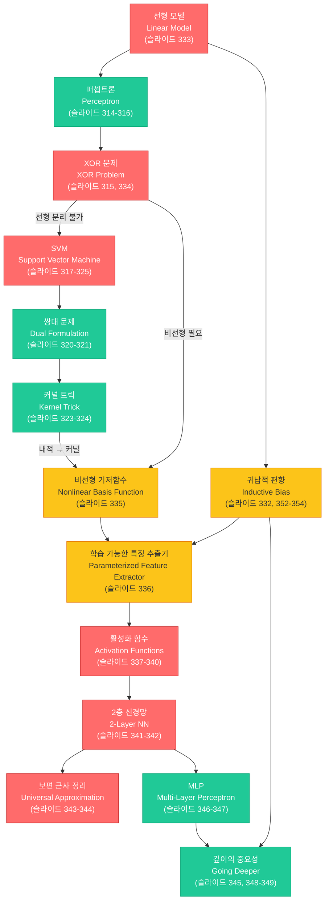

# 11. ML 모델 & 신경망 기초 (ML Models & Neural Networks)

> **동기부여**: 선형 모델(logistic regression)은 XOR조차 풀 수 없다. SVM은 커널 트릭으로 비선형 분류를 해결했지만, 특징 변환을 사람이 설계해야 한다. 신경망은 **특징 추출기 자체를 학습**함으로써 이 한계를 돌파한다. SVM에서 NN으로의 전환을 이해하면, "왜 딥러닝이 필요한가"라는 근본 질문에 답할 수 있다.

---

## 1. 선행 개념 연결 Mermaid 다이어그램



---

## 2. 개념별 5단계 완전 분리 설명

---

### 개념 1: 퍼셉트론 (Perceptron) (슬라이드 314-316)

#### ① 초등학생 단계
퍼셉트론은 **예/아니오 판별기**이다. 여러 가지 정보(키, 몸무게 등)에 각각 중요도(가중치)를 곱해서 더한 뒤, 기준선을 넘으면 "예", 못 넘으면 "아니오"라고 답한다. 마치 선생님이 시험 점수의 합계로 합격/불합격을 나누는 것과 같다.

#### ② 중등학생 단계
입력 벡터 $x$에 가중치 벡터 $w$를 내적하여 임계값과 비교한다:
- $w_1 x_1 + w_2 x_2 + \cdots \geq 0$ 이면 1, 아니면 0
- 이것은 2차원에서 **직선 하나**로 두 그룹을 나누는 것이다.

#### ③ 고등학생 단계
Rosenblatt(1957)의 퍼셉트론:

$$f(x; w) = \mathbf{1}(w^\top x \geq 0)$$

- $\mathbf{1}(\cdot)$: Heaviside step function (indicator)
- 결정 경계(decision boundary): $w^\top x = 0$인 초평면(hyperplane)
- 한계: **선형 분리 가능(linearly separable)**한 데이터만 분류 가능

#### ④ 대학 단계
Rosenblatt의 원래 구조는 $S \to A \to R$ topology였다:
- $S$: sensory units (입력)
- $A$: association units (은닉, 고정 가중치)
- $R$: response units (출력, 학습 가능한 가중치)

결정 함수: $l(x) = \text{sign}\left(\sum_i \alpha_i z_i(x)\right)$

여기서 $z_i(x)$는 비선형 변환된 특징이고, $\alpha_i$만 학습한다. 즉, 퍼셉트론도 이미 **변환된 공간에서의 선형 분류**라는 아이디어를 가지고 있었다 (슬라이드 314).

Minsky & Papert (1969)는 단일 퍼셉트론이 XOR을 풀 수 없음을 증명 (슬라이드 315).

#### ⑤ 대학원 단계
퍼셉트론의 수렴 정리(Perceptron Convergence Theorem): 데이터가 선형 분리 가능하면, 퍼셉트론 알고리즘은 유한 단계 내에 수렴한다. 그러나 마진에 대한 보장이 없어 SVM이 등장하게 된다. Rosenblatt(1962)은 이미 $S \to A$ 연결의 가중치도 학습해야 한다고 인식했지만(슬라이드 316), backpropagation이 없던 시대에는 실현 불가능했다.

---

### 개념 2: SVM - 최적 초평면과 마진 (Support Vector Machine) (슬라이드 317-322)

#### ① 초등학생 단계
두 그룹의 점들 사이에 **가장 넓은 도로**를 만드는 분류기이다. 도로가 넓을수록 새로운 점이 어느 쪽인지 맞출 확률이 높다. 도로의 경계에 딱 붙어 있는 점들이 "서포트 벡터"이다.

#### ② 중등학생 단계
직선(초평면)으로 두 클래스를 나누되, 양쪽 클래스와의 거리(마진)가 **최대**가 되도록 한다:
- 마진 = $\frac{2}{\|w\|}$
- 마진을 최대화 = $\|w\|$를 최소화

#### ③ 고등학생 단계
레이블 $y_i \in \{+1, -1\}$, 선형 분리 가능 조건:

$$y_i(w^\top x_i + b) \geq 1, \quad \forall i \in [N]$$

마진:

$$\rho(w) = \min_{x_\pm \in \mathcal{X}_\pm} \frac{w}{\|w\|}^\top (x_+ - x_-) = \frac{2}{\|w\|}$$

최적화 문제:

$$\min_{w,b} \frac{1}{2}\|w\|^2 \quad \text{s.t.} \quad y_i(w^\top x_i + b) \geq 1$$

#### ④ 대학 단계
**Primal 문제** (슬라이드 320):

$$\min_{w,b} \frac{1}{2}\|w\|^2 \quad \text{(Quadratic Objective)}$$
$$\text{s.t.} \quad y_i(w^\top x_i + b) \geq 1 \quad \text{(Linear Constraints)}$$

**Lagrangian**:

$$\mathcal{L}(w, b, \alpha) = \frac{1}{2}\|w\|^2 + \sum_i \alpha_i(1 - y_i(w^\top x_i + b))$$

KKT 조건으로 $w, b$를 소거하면 (슬라이드 321):
- $\nabla_w \mathcal{L} = w - \sum_i \alpha_i y_i x_i = 0 \implies w = \sum_i \alpha_i y_i x_i$
- $\nabla_b \mathcal{L} = -\sum_i \alpha_i y_i = 0$

**Dual 문제** (슬라이드 320):

$$\max_\alpha \quad -\frac{1}{2}\sum_{i,j} \alpha_i \alpha_j y_i y_j x_i^\top x_j + \sum_i \alpha_i$$
$$\text{s.t.} \quad \sum_i \alpha_i y_i = 0, \quad \alpha_i \geq 0 \quad \forall i$$

**Soft-Margin SVM** (슬라이드 322): 선형 분리 불가능 시 슬랙 변수 $\zeta_i$ 도입:

$$\min_{w,b,\zeta} \frac{1}{2}\|w\|^2 + C\sum_i \zeta_i$$
$$\text{s.t.} \quad y_i(w^\top x_i + b) \geq 1 - \zeta_i, \quad \zeta_i \geq 0$$

$C$: 마진 폭 vs. 오분류 허용 사이의 트레이드오프 파라미터.

#### ⑤ 대학원 단계
SVM의 핵심 통찰은 dual 문제에서 데이터가 **내적** $x_i^\top x_j$로만 나타난다는 것이다. 이것이 커널 트릭의 전제 조건이 된다. Soft-margin의 hinge loss $g_i(w) = \max(0, 1 - y_i(w^\top x_i + b))$는 cross-entropy와 달리 마진 1을 넘으면 그래디언트가 0이 되어 sparse한 해를 유도한다. $C$값에 따른 support vector 수의 변화: $C=0.01$이면 SV=260, $C=1$이면 SV=78, $C=100$이면 SV=45 (슬라이드 325).

---

### 개념 3: 커널 트릭과 커널 메서드 (Kernel Trick & Kernel Methods) (슬라이드 323-329)

#### ① 초등학생 단계
원래 세상에서는 두 그룹을 직선으로 나눌 수 없지만, **마법의 거울**(커널)을 통해 보면 높은 차원의 세상에서 깔끔하게 나눌 수 있다. 거울을 통해 볼 때 실제로 높은 차원으로 가지 않고도 거리만 계산하면 된다.

#### ② 중등학생 단계
데이터를 직접 고차원으로 변환하면 계산이 폭발적으로 증가한다. 커널 함수 $K(x, x')$를 쓰면 **변환 없이** 고차원에서의 내적을 바로 계산할 수 있다:
- RBF 커널: $K(x, x') = \exp(-\gamma\|x - x'\|^2)$ -- 무한 차원!

#### ③ 고등학생 단계
SVM의 결정 함수에 커널을 적용하면 (슬라이드 323):

$$f(x) = w^\top x + b = \sum_i \alpha_i y_i x_i^\top x + b = \sum_i \alpha_i y_i K(x_i, x) + b$$

Dual 문제에서도 $x_i^\top x_j \to K(x_i, x_j)$로 치환하면 된다. 편향 $b$도 커널화 가능:

$$b = \frac{1}{|SV|}\sum_{i \in SV}\left(y_i - \sum_j \alpha_j y_j K(x_j, x_i)\right)$$

#### ④ 대학 단계
**커널 밀도 추정 (KDE)** (슬라이드 326-327):

$$\hat{p}(x) = \frac{1}{N}\sum_{n=1}^N K(x - x_n)$$

밀도 커널 조건: $\int K(x)dx = 1$, $K(-x) = K(x)$

가우시안 커널: $K(x) = \frac{1}{\sqrt{2\pi h^2}}\exp\left(-\frac{x^2}{2h^2}\right)$

**Nadaraya-Watson 커널 회귀** (슬라이드 328-329):

$$\mathbb{E}[y \mid x] = \sum_{i=1}^n y_i w_i, \quad w_i = \frac{K(x, x_i)}{\sum_j K(x, x_j)}$$

가우시안 커널 사용 시:

$$f(x) = \sum_i y_i \frac{\exp(-\|x - x_i\|^2 / 2h^2)}{\sum_j \exp(-\|x - x_j\|^2 / 2h^2)}$$

이것은 **비모수적(non-parametric)** 방법이다.

sklearn 구현 (슬라이드 324): `sklearn.svm.SVC(C=1.0, kernel='rbf', gamma='scale')`
- $\gamma = \frac{1}{2\sigma^2}$
- 커널 옵션: 'rbf', 'linear', 'poly', 'sigmoid'

#### ⑤ 대학원 단계
커널 트릭의 수학적 기반은 Mercer's theorem: 양의 정부호(positive semi-definite) 커널은 어떤 특징 공간에서의 내적에 대응한다. RBF 커널은 **무한 차원** 특징 공간에 대응하므로, SVM+RBF는 사실상 무한 차원에서 선형 분류를 수행한다. KNN(슬라이드 330)도 커널 관점에서 이해 가능: uniform 커널을 사용한 non-parametric classifier. 그러나 이 모든 커널 방법의 한계는 **커널을 사람이 선택**해야 한다는 것이다.

---

### 개념 4: 비선형 기저함수와 학습 가능한 특징 추출기 (Nonlinear Basis Functions & Parameterized Feature Extractor) (슬라이드 335-336)

#### ① 초등학생 단계
데이터를 보는 **안경**을 바꾸면 복잡한 문제가 쉬워진다. 지금까지는 어떤 안경을 쓸지 사람이 골랐다. 하지만 신경망은 **스스로 안경을 만들어 쓴다**!

#### ② 중등학생 단계
원래 데이터 $x$에 비선형 변환 $\phi(x)$를 적용한 후 선형 모델을 쓴다:
- 예: $x = (x_1, x_2)$ → $\phi(x) = (x_1, x_2, x_1^2, x_2^2, x_1 x_2)$
- 문제: 어떤 $\phi$를 쓸지 미리 정해야 한다.

#### ③ 고등학생 단계
고정된 기저함수 모델 (슬라이드 335):

$$f(x; \theta) = W\phi(x) + b$$

$\phi$는 비선형이지만 **고정**되어 있다 (예: 다항식, $|x_1 - x_2|$ 등).

학습 가능한 특징 추출기 (슬라이드 336):

$$f(x; \theta, \theta') = W\phi(x; \theta') + b$$

$\phi(\cdot; \theta')$: 파라미터 $\theta'$를 가진 **학습 가능한** 함수. 이것이 바로 신경망의 핵심 아이디어이다.

#### ④ 대학 단계
모델의 진화 경로 (슬라이드 333, 354):

$$\text{선형 모델 } (w^\top x) \to \text{비선형 기저함수 } (w^\top \phi(x)) \to \text{학습 가능한 특징 추출기 } (w^\top \phi(x; W_0))$$

선형 함수의 합성은 여전히 선형: $W_2 W_1 x = W' x$ (슬라이드 348). 따라서 비선형 활성화 함수가 **필수적**이다.

가설 공간의 관점 (슬라이드 332):
- 전체 함수 공간: $\mathcal{F}(\mathcal{X}, \mathcal{Y}) := \{f : \mathcal{X} \to \mathcal{Y}\}$
- 제한된 가설 공간: $\mathcal{H} \subset \mathcal{F}(\mathcal{X}, \mathcal{Y})$
- 신경망: 파라미터 공간 $\{f_\theta : \theta \in \mathbb{R}^p\}$으로 함수 공간을 매개변수화

#### ⑤ 대학원 단계
고정 기저함수 → 커널 메서드(SVM) → 학습 가능한 특징(NN)의 스펙트럼은 **귀납적 편향(inductive bias)**의 양과 직접 연관된다 (슬라이드 354의 그림). 고정 기저함수는 강한 inductive bias, NN은 상대적으로 약한 inductive bias를 가진다. "less inductive bias(?)" -- 물음표가 붙는 이유는, NN 아키텍처 자체(ConvNet의 locality, RNN의 시간 공유 등)가 여전히 강한 inductive bias를 인코딩하기 때문이다 (슬라이드 353).

---

### 개념 5: 활성화 함수 (Activation Functions) (슬라이드 337-340)

#### ① 초등학생 단계
신경망의 뉴런은 입력 신호를 받아서 **변환**한 후 다음 뉴런에 전달한다. 이 변환이 활성화 함수이다. 뇌의 뉴런이 일정 자극 이상일 때만 신호를 보내는 것과 비슷하다.

#### ② 중등학생 단계
가장 간단한 활성화 함수:
- **ReLU**: 음수는 0으로, 양수는 그대로 통과. $\text{ReLU}(x) = \max(0, x)$
- **Sigmoid**: 어떤 값이든 0~1 사이로 눌러준다. $\sigma(x) = \frac{1}{1+e^{-x}}$

#### ③ 고등학생 단계
주요 활성화 함수 목록 (슬라이드 337):

| 함수 | 수식 | 출력 범위 |
|------|------|----------|
| Logistic(Sigmoid) | $\frac{e^x}{1+e^x}$ | $(0, 1)$ |
| Softmax | $\frac{e^x}{\sum_j e^{x_j}}$ | $(0, 1)$, 합=1 |
| Tanh | $\frac{e^x - e^{-x}}{e^x + e^{-x}}$ | $(-1, 1)$ |
| ReLU | $\max(0, x)$ | $[0, \infty)$ |
| Softplus | $\log(1 + e^x)$ | $(0, \infty)$ |
| LeakyReLU | $\max(0.01x, x)$ | $(-\infty, \infty)$ |
| PReLU | $\max(ax, x)$, $a$ 학습 | $(-\infty, \infty)$ |
| ELU | $x$ if $x \geq 0$; $a(e^x-1)$ if $x<0$ | $(-a, \infty)$ |
| SiLU/Swish | $x \cdot \sigma(x)$ | $[-0.278, \infty)$ |
| GELU | $x \cdot P(X \leq x)$, $X \sim \mathcal{N}(0,1)$ | $[-0.17, \infty)$ |

#### ④ 대학 단계
**핵심 문제들** (슬라이드 340):

1. **Vanishing Gradient 문제**: Sigmoid는 큰 양수/음수 입력에서 포화(saturate). 도함수 $\sigma'(x) = \sigma(x)(1-\sigma(x))$가 0에 가까워져, 역전파 시 그래디언트가 사라진다. → ReLU 등장

2. **Dead ReLU 문제**: 가중치 초기화가 크고 음수이면, ReLU 출력이 영구적으로 0. 그래디언트도 0이므로 **영원히 복구 불가능**. → LeakyReLU, PReLU, ELU, SELU 등장

연속성 차수 (슬라이드 338-339):
- Sigmoid, Tanh, Softplus, GELU, SiLU: $C^\infty$ (무한 미분 가능)
- ReLU, LeakyReLU, PReLU: $C^0$ (연속이지만 미분 불연속)
- Binary step: $C^{-1}$ (불연속)

#### ⑤ 대학원 단계
GELU와 SiLU(Swish)는 최신 Transformer 아키텍처에서 표준으로 사용된다. GELU = $x\Phi(x) \approx x\sigma(1.702x)$로, stochastic regularization 해석이 가능하다: 입력 $x$를 확률적으로 0 또는 $x$로 마스킹하는 것과 동치. Smooth한 활성화 함수($C^\infty$)는 loss landscape을 smooth하게 만들어 최적화에 유리하지만, ReLU의 piecewise linearity가 주는 계산 효율성과 sparsity도 무시할 수 없다.

---

### 개념 6: 2층 신경망 (2-Layer Neural Networks) (슬라이드 341-342)

#### ① 초등학생 단계
퍼셉트론 하나로는 XOR을 못 풀었다. 그런데 퍼셉트론 **여러 개를 팀**으로 만들면 XOR도 풀 수 있다! 첫 번째 팀이 데이터를 변환하고, 두 번째 팀이 분류한다.

#### ② 중등학생 단계
2층 신경망의 구조:
1. 입력 → (가중치 곱셈 + 활성화 함수) → 은닉층
2. 은닉층 → (가중치 곱셈) → 출력

XOR 해결: $h_1 = \text{AND}$, $h_2 = \text{OR}$로 두면, $y = h_2 - h_1$으로 XOR을 구현할 수 있다 (슬라이드 342).

#### ③ 고등학생 단계
수학적 표현 (슬라이드 341):

$$x \in \mathbb{R}^{d_0}, \quad W_0 x \in \mathbb{R}^{d_1}$$
$$\phi(x; \theta') := \sigma(W_0 x) \in \mathbb{R}^{d_1}$$
$$f(x; \theta) := \mathbf{1}(w^\top \sigma(W_0 x) \geq 0) \in \{0, 1\}$$

여기서 $W_0 \in \mathbb{R}^{d_1 \times d_0}$은 은닉층 가중치, $w \in \mathbb{R}^{d_1}$은 출력층 가중치.

#### ④ 대학 단계
XOR 해결의 구체적 구현 (슬라이드 342):

$$h_1 = \sigma(x_1 + x_2 - 1.5) = \text{AND}(x_1, x_2)$$
$$h_2 = \sigma(x_1 + x_2 - 0.5) = \text{OR}(x_1, x_2)$$
$$y = \sigma(-0.5 \cdot 1 - 1 \cdot h_1 + 1 \cdot h_2)$$

여기서 $\sigma$는 Heaviside step function. 은닉층이 입력 공간을 **선형 분리 가능한 공간으로 재매핑**한다. 이것이 "representation learning"의 원형이다.

#### ⑤ 대학원 단계
2층 NN의 표현력은 universal approximation theorem으로 보장되지만, 실제로는 **기하급수적 너비**가 필요할 수 있다. depth-width tradeoff: 특정 함수 클래스는 깊은 네트워크로는 polynomial 크기로 표현 가능하지만, 얕은 네트워크로는 exponential 크기가 필요하다 (Telgarsky, 2016). 이것이 "We need to go DEEPER" (슬라이드 345)의 이론적 근거이다.

---

### 개념 7: 보편 근사 정리 (Universal Approximation Theorem) (슬라이드 343-344)

#### ① 초등학생 단계
신경망은 충분히 많은 뉴런을 쓰면 **세상의 어떤 패턴도 흉내** 낼 수 있다! 레고 블록이 충분히 많으면 어떤 모양이든 만들 수 있는 것과 같다.

#### ② 중등학생 단계
2층 신경망(은닉층 1개)에서 은닉 뉴런 수를 충분히 늘리면, 어떤 연속 함수든 원하는 정밀도로 근사할 수 있다. 단, "충분히 많은"이 **매우 많을 수 있다**는 것이 한계.

#### ③ 고등학생 단계
**정리 (비형식적)** [Cybenko, 1989; Hornik, Stinchcombe, White, 1989] (슬라이드 343):

> 임의의 너비(arbitrary width)를 가진 2층 신경망은 임의의 목표 함수를 근사할 수 있다.

형식적으로: $\sigma$가 비상수(non-constant), 유계(bounded), 단조증가(monotone)인 연속 함수이면, $\forall \epsilon > 0$, $\forall f \in C([0,1]^n)$, $\exists N$과 파라미터 $\{w_i, b_i, \alpha_i\}$:

$$\left|f(x) - \sum_{i=1}^N \alpha_i \sigma(w_i^\top x + b_i)\right| < \epsilon$$

#### ④ 대학 단계
**시각적 증명** (슬라이드 344): 각 은닉 뉴런이 step function(bump)을 만들고, 이들의 가중합으로 임의의 함수를 계단 근사(step-function approximation)한다. 두 개의 threshold $T_1, T_2$로 하나의 bump를 만들고 ($T_1$에서 +1, $T_2$에서 -1), $n$개의 bump를 적절한 높이 $h_i$로 합산하면 $\sum_i h_i \cdot \text{bump}_i(x) \approx f(x)$.

#### ⑤ 대학원 단계
UAT는 **존재성(existence)** 정리이지, **구성(construction)** 정리가 아니다. 즉:
1. 필요한 뉴런 수 $N$에 대한 상한을 주지 않는다 (exponential일 수 있음)
2. 그러한 파라미터를 **찾는 방법**(최적화 가능성)을 보장하지 않는다
3. **일반화 성능**을 보장하지 않는다

이것이 depth의 필요성으로 이어진다: ImageNet에서 shallow → 8 layers (AlexNet) → 22 layers (GoogLeNet) → 152 layers (ResNet)으로 error가 28.2% → 3.57%로 감소 (슬라이드 349). 깊은 네트워크가 **계층적/합성적(compositional/hierarchical)** 방식으로 함수를 학습하기 때문이라는 가설이 있지만, 정확한 이유는 아직 열린 문제이다.

---

### 개념 8: MLP와 깊은 네트워크 (Multi-Layer Perceptron & Deep Networks) (슬라이드 346-349)

#### ① 초등학생 단계
MLP는 퍼셉트론을 **여러 층으로 쌓은** 것이다. 마치 공장에서 원자재가 여러 공정을 거쳐 완제품이 되는 것처럼, 데이터가 여러 층을 지나면서 점점 유용한 정보로 가공된다.

#### ② 중등학생 단계
MLP의 각 층은 "입력 받기 → 가중치 곱하기 → 활성화 함수 적용 → 다음 층으로 보내기"를 반복한다. 층이 깊어질수록 더 복잡한 패턴을 인식할 수 있다.

#### ③ 고등학생 단계
$L$개 층의 MLP (슬라이드 346-347):

$$x_0 = x \in \mathbb{R}^{d_0}$$
$$x_1 = \sigma(W_0 x_0) \in \mathbb{R}^{d_1}$$
$$\vdots$$
$$x_{k+1} = \sigma(W_k x_k) \in \mathbb{R}^{d_{k+1}}$$
$$z = W_{L-1} x_{L-1} \in \mathbb{R}^{d_L}$$

단일 층의 행렬 표현 (슬라이드 346):

$$b_i = \sigma\left(\sum_j w_{i,j} a_j\right) = \sigma(w_i^\top a)$$

#### ④ 대학 단계
**비선형 활성화가 없으면** (슬라이드 348):

$$z = W_{L-1} W_{L-2} \cdots W_0 x_0 = W' x$$

이것은 단 하나의 행렬 $W'$로 표현 가능한 **선형 함수**이다. 즉, 아무리 층을 깊게 쌓아도 비선형 활성화 없이는 단일 선형 변환과 동치이다. 단, 비선형 dynamics는 존재한다 [Saxe, McClelland, Ganguli 2014].

**깊이의 혁명** (슬라이드 349): ImageNet Classification top-5 error:
- ILSVRC'10 (shallow): 28.2%
- ILSVRC'12 AlexNet (8 layers): 16.4%
- ILSVRC'14 VGG (19 layers): 7.3%
- ILSVRC'14 GoogLeNet (22 layers): 6.7%
- ILSVRC'15 ResNet (152 layers): 3.57% (인간 수준 ~5% 돌파)

#### ⑤ 대학원 단계
The Bitter Lesson (Rich Sutton, 2019, 슬라이드 350): "70년 AI 연구에서 배울 수 있는 가장 큰 교훈은, **계산을 활용하는 일반적 방법이 궁극적으로 가장 효과적**이라는 것이다." 이것은 hand-crafted feature(SVM의 커널) 대 learned feature(NN)의 대립에서 NN이 승리한 이유를 설명한다. No Free Lunch Theorem (슬라이드 351)과의 긴장: 모든 문제에 최적인 단일 모델은 없다. 그러나 실전에서는 스케일링이 가능한 deep learning이 압도적 성과를 보인다.

---

### 개념 9: 귀납적 편향과 모델 선택 (Inductive Bias) (슬라이드 332, 351-355)

#### ① 초등학생 단계
모든 문제를 푸는 만능 도구는 없다. 각 도구(모델)에는 **잘하는 분야**가 있다. 이미지에는 ConvNet, 문장에는 RNN/Transformer처럼, 데이터의 특성에 맞는 도구를 골라야 한다.

#### ② 중등학생 단계
귀납적 편향 = 모델이 **미리 가정**하는 것:
- KNN: "가까운 것은 비슷하다"
- SVM: "마진이 넓을수록 좋다"
- ConvNet: "근처 픽셀이 중요하고, 위치에 상관없이 같은 패턴이 반복된다"

#### ③ 고등학생 단계
**No Free Lunch Theorem** (슬라이드 351): "All models are wrong, but some models are useful." -- George Box. 모든 종류의 문제에 대해 최적으로 작동하는 단일 모델은 존재하지 않는다.

**귀납적 편향의 정의** (슬라이드 353): 모델이 새로운 입력에 일반화하기 위해 만드는 **가정(assumption/prior)의 집합**.

#### ④ 대학 단계
가설 공간의 제한 (슬라이드 332):
- 전체 함수 공간 $\mathcal{F}(\mathcal{X}, \mathcal{Y})$에서 최적화: 비현실적
- 제한된 가설 공간 $\mathcal{H} \subset \mathcal{F}$: 귀납적 편향으로 탐색 공간을 줄임

아키텍처별 귀납적 편향 (슬라이드 352-353):
| 아키텍처 | 귀납적 편향 |
|----------|------------|
| Fully Connected (MLP) | 제한 적음 |
| ConvNet | 지역성(locality), 정상성(stationarity), 다중 스케일 |
| RNN | 시간적 공유(sharing in time) |
| GNN | 순열 불변성(permutation invariance) |

전체 학습 프레임워크 (슬라이드 355): MAP = ML + Prior → Loss(CE/MSE) + Regularization/Inductive Bias → Neural Networks (ConvNet, RNN, Transformer...)

#### ⑤ 대학원 단계
최근 연구는 NN의 **implicit bias**에 주목한다 (슬라이드 355): 최적화 알고리즘(SGD 등)과 하이퍼파라미터 자체가 특정 해를 선호하는 암묵적 편향을 생성한다. 예를 들어 SGD는 flat minima를 선호하고, 이것이 일반화 성능과 연관된다. Transformer는 ConvNet보다 약한 inductive bias를 가지지만, 대규모 데이터에서는 이것이 오히려 장점이 된다 (ViT 등).

---

### 개념 10: Fisher의 선형 판별분석 (Fisher's Linear Discriminant / LDA) (슬라이드 311-313)

#### ① 초등학생 단계
두 그룹의 데이터를 하나의 선 위에 **그림자**처럼 떨어뜨렸을 때, 그림자끼리 **가장 잘 구분되는 방향**을 찾는 방법이다.

#### ② 중등학생 단계
데이터를 1차원 직선에 사영(projection)할 때:
- 두 그룹의 평균이 **최대한 멀고**
- 각 그룹 내부의 퍼짐이 **최소**인 방향을 찾는다.

#### ③ 고등학생 단계
Fisher의 비율 (슬라이드 312):

$$S = \frac{\sigma^2_{\text{between}}}{\sigma^2_{\text{within}}} = \frac{(w^\top m_1 - w^\top m_2)^2}{w^\top \Sigma_1 w + w^\top \Sigma_2 w}$$

$\Sigma_1 = \Sigma_2 = \Sigma$이면:

$$S = \frac{(w^\top(m_1 - m_2))^2}{2w^\top \Sigma w}$$

#### ④ 대학 단계
$\frac{\partial S}{\partial w}(w^*) = 0$을 풀면:

$$w^* \propto \Sigma^{-1}(m_1 - m_2)$$

이것은 LDA의 가중치 벡터 $a$와 동치이다 (슬라이드 312). 공유 공분산(shared covariance) 가정 하에서 LDA의 결정 경계는 **선형**이 된다 (슬라이드 311의 녹색 점선). 서로 다른 사영 방향에 따라 분류 성능이 크게 달라진다 (슬라이드 313의 좌/우 비교).

#### ⑤ 대학원 단계
LDA는 generative model 관점에서 각 클래스가 **공유 공분산을 가진 가우시안**이라는 가정 하에 Bayes-optimal classifier와 동치이다. QDA(Quadratic Discriminant Analysis)는 $\Sigma_1 \neq \Sigma_2$를 허용하여 비선형 경계를 만든다. LDA → SVM으로의 전환에서 핵심 차이는: LDA는 전체 데이터의 통계량(평균, 공분산)을 사용하지만, SVM은 경계 근처의 support vector만 사용한다.

---

## 3. 오개념 카드 (Misconception Cards)

### 오개념 1: "SVM은 항상 선형 분류기이다"
- **오개념**: SVM은 직선/평면으로만 분류한다.
- **진실**: 커널 트릭을 사용하면 **비선형 결정 경계**를 만든다. 고차원 특징 공간에서는 여전히 선형이지만, 원래 입력 공간에서는 매우 복잡한 곡선/곡면이 된다 (슬라이드 317, 323).

### 오개념 2: "활성화 함수 없이 층을 쌓으면 더 강력해진다"
- **오개념**: 선형 층을 여러 개 쌓으면 비선형 문제를 풀 수 있다.
- **진실**: $W_{L-1} W_{L-2} \cdots W_0 = W'$ -- 선형 함수의 합성은 선형이다 (슬라이드 348). 비선형 활성화 함수가 **반드시** 필요하다.

### 오개념 3: "Universal Approximation Theorem이 있으니 2층이면 충분하다"
- **오개념**: 2층 NN이 모든 함수를 근사할 수 있으므로 깊은 네트워크는 불필요하다.
- **진실**: UAT는 존재성만 보장한다. 필요한 뉴런 수가 **기하급수적**일 수 있고, 그러한 파라미터를 **찾을 수 있는지**도 보장하지 않는다. 실제로 깊은 네트워크가 훨씬 효율적이다 (슬라이드 349).

### 오개념 4: "ReLU는 미분 불가능하므로 문제가 있다"
- **오개념**: ReLU는 $x=0$에서 미분이 안 되므로 역전파에 문제가 있다.
- **진실**: $x=0$인 경우는 확률적으로 거의 발생하지 않으며, subgradient를 사용하면 된다. 오히려 ReLU의 진짜 문제는 **Dead ReLU** -- 음수 영역에서 그래디언트가 영구적으로 0이 되는 것이다 (슬라이드 340).

### 오개념 5: "SVM의 Dual 문제는 Primal과 다른 해를 준다"
- **오개념**: Dual 문제를 풀면 다른 결과가 나온다.
- **진실**: 볼록(convex) 최적화에서 강한 쌍대성(strong duality)이 성립하므로, Primal과 Dual의 **최적값은 동일**하다. Dual의 장점은 내적 $x_i^\top x_j$만 나타나므로 커널 트릭을 적용할 수 있다는 것이다 (슬라이드 320-321).

### 오개념 6: "Sigmoid의 vanishing gradient는 Sigmoid 자체의 결함이다"
- **오개념**: Sigmoid는 나쁜 활성화 함수이므로 절대 쓰면 안 된다.
- **진실**: Sigmoid의 vanishing gradient는 **깊은 네트워크에서** 문제가 된다. 출력층에서 확률 예측(binary classification)에는 여전히 sigmoid를 사용한다. 문제는 **은닉층**에서 sigmoid를 쓸 때 발생한다 (슬라이드 340). SiLU(Swish) = $x \cdot \sigma(x)$처럼 sigmoid를 재활용하는 현대적 활성화 함수도 있다.

---

## 4. 초등학생에게 설명하기 연습

### Q1: "SVM이 뭐예요?"
> "두 팀이 운동장에서 자리를 잡고 있어. SVM은 두 팀 사이에 **가장 넓은 금**을 긋는 거야. 금이 넓을수록, 새로 온 친구가 어느 팀인지 맞추기 쉽거든. 그리고 금 바로 옆에 서 있는 친구들이 '서포트 벡터'야 -- 걔네가 금의 위치를 결정해!"

### Q2: "커널 트릭이 뭐예요?"
> "바닥에 빨간 구슬과 파란 구슬이 원형으로 섞여 있어서 직선으로 나눌 수 없어. 그런데 구슬들을 **공중으로 던져 올리면**, 빨간 건 높이 올라가고 파란 건 낮게 있어서 칼로 쉽게 자를 수 있어. 커널 트릭은 실제로 던지지 않고도, 높이를 **계산만으로** 알 수 있게 해주는 마법이야!"

### Q3: "왜 신경망에 비선형이 필요해요?"
> "직선을 아무리 여러 개 이어 붙여도 결국 하나의 직선이 돼. 하지만 직선을 **꺾을 수 있으면**(비선형), 어떤 모양이든 만들 수 있어! 활성화 함수가 바로 직선을 꺾어주는 역할이야."

### Q4: "Universal Approximation이 뭐예요?"
> "레고 블록이 충분히 많으면, 어떤 모양이든 만들 수 있잖아? 신경망의 뉴런도 마찬가지야. 뉴런이 **충분히 많으면** 세상의 어떤 패턴이든 따라할 수 있어. 다만 '충분히 많은'이 엄~청나게 많을 수도 있어서, 층을 깊게 쌓는 게 더 효율적이야!"

---

## 5. 수학 <-> 딥러닝 연결 테이블

| 수학 개념 | 기호/수식 | 딥러닝에서의 역할 | 해당 슬라이드 |
|-----------|----------|------------------|-------------|
| 내적 (Inner Product) | $x_i^\top x_j$ | SVM dual에서 유사도 측정, 커널 트릭의 기반 | 320-321 |
| 라그랑주 승수법 (Lagrange Multiplier) | $\mathcal{L}(w,b,\alpha)$ | SVM의 primal→dual 변환, KKT 조건 | 320-321 |
| 볼록 최적화 (Convex Optimization) | $\min \frac{1}{2}\|w\|^2$ | SVM의 전역 최적해 보장 (quadratic objective + linear constraints) | 319-320 |
| 양의 정부호 행렬 (PSD Matrix) | $K(x_i, x_j) \succeq 0$ | Mercer 조건: 유효한 커널의 필요충분조건 | 323 |
| 행렬 곱셈 (Matrix Multiplication) | $W_k x_k$ | 신경망의 각 층에서의 선형 변환 | 346-347 |
| 합성 함수 (Function Composition) | $\sigma(W_1 \sigma(W_0 x))$ | 깊은 네트워크의 순전파(forward pass) | 347-348 |
| 지시 함수 (Indicator Function) | $\mathbf{1}(w^\top x \geq 0)$ | 퍼셉트론의 결정 함수 (Heaviside step) | 333, 341 |
| 확률 밀도 추정 | $\hat{p}(x) = \frac{1}{N}\sum K(x-x_n)$ | KDE: 비모수적 밀도 추정, 커널 회귀의 기반 | 326-328 |
| 가중 평균 (Weighted Average) | $\sum y_i w_i$, $w_i = K(x,x_i)/\sum K$ | Nadaraya-Watson 커널 회귀 | 328-329 |
| 공분산 행렬 (Covariance Matrix) | $\Sigma^{-1}(m_1 - m_2)$ | Fisher LDA의 최적 사영 방향 | 312 |

---

## 6. 킬러 요약

```
┌─────────────────────────────────────────────────────────────┐
│                    10줄 킬러 요약                             │
├─────────────────────────────────────────────────────────────┤
│ 1. 퍼셉트론 = 선형 분류기. XOR 못 풀음 (Minsky & Papert)     │
│ 2. SVM = 최대 마진 선형 분류기. Primal→Dual→내적만 남음       │
│ 3. 커널 트릭: x_i^T x_j → K(x_i, x_j)로 비선형 확장          │
│ 4. 커널 메서드 한계: 커널을 사람이 설계해야 함                  │
│ 5. 비선형 기저함수 φ(x) → 학습 가능한 φ(x;θ') = 신경망!       │
│ 6. 비선형 활성화 필수: 선형의 합성 = 선형                      │
│ 7. ReLU가 sigmoid 대체 (vanishing gradient 해결)              │
│ 8. 2층 NN: XOR 해결 + Universal Approximation Theorem         │
│ 9. 그러나 깊은 네트워크가 더 효율적 (ImageNet 혁명)            │
│ 10. 귀납적 편향: 아키텍처 = 데이터에 대한 가정                 │
└─────────────────────────────────────────────────────────────┘

핵심 흐름:
  선형 모델 → [XOR 한계] → SVM+커널 → [커널 설계 한계]
  → 학습 가능한 특징 → [비선형 활성화] → 2층 NN → [효율성 한계]
  → 깊은 NN → [귀납적 편향] → ConvNet / RNN / Transformer
```

### 수식 3개만 기억하자

1. **SVM Dual**: $\max_\alpha -\frac{1}{2}\sum_{i,j}\alpha_i\alpha_j y_i y_j K(x_i, x_j) + \sum_i \alpha_i$ (슬라이드 320)
2. **2층 NN**: $f(x;\theta) = \mathbf{1}(w^\top\sigma(W_0 x) \geq 0)$ (슬라이드 341)
3. **MLP 순전파**: $x_{k+1} = \sigma(W_k x_k)$, 출력 $z = W_{L-1}x_{L-1}$ (슬라이드 347)

### 시험 출제 예상 포인트
- SVM의 primal에서 dual로의 유도 과정 (Lagrangian → KKT → 내적 형태)
- Soft-margin SVM에서 $C$의 역할과 hinge loss
- 비선형 활성화 없이 층을 쌓으면 왜 무의미한지 증명
- Universal Approximation Theorem의 한계점 3가지
- 각 활성화 함수의 장단점 (vanishing gradient, dead ReLU 등)
