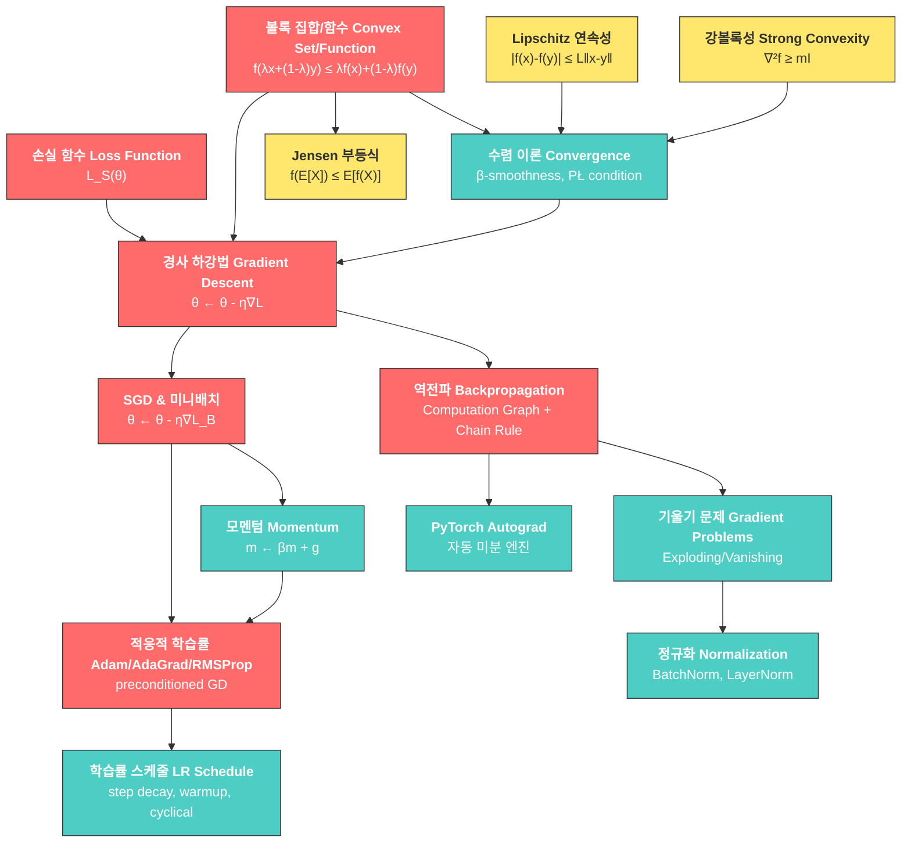

# 12. 딥러닝 최적화 (Deep Learning Optimization)

> **동기부여**: 딥러닝 모델은 수백만~수십억 개의 파라미터를 가지며, 이 파라미터들의 최적값을 찾는 것이 곧 "학습"이다. 손실 함수(loss function)를 최소화하는 파라미터를 효율적으로 찾아가는 과정이 최적화이며, 이것 없이는 어떤 신경망도 제대로 작동하지 않는다. 선형 회귀처럼 볼록(convex)한 문제는 닫힌 해가 존재하지만, DNN의 손실은 일반적으로 비볼록(nonconvex)이므로 경사 기반 최적화(gradient-based optimization)가 필수적이다. 최적화 알고리즘의 선택과 하이퍼파라미터 튜닝이 모델 성능을 좌우한다.

---

## 1. 선행 개념 연결 Mermaid 다이어그램



---

## 2. 개념별 5단계 완전 분리 설명

---

### 개념 1: 볼록 집합과 볼록 함수 (Convex Set & Convex Function) (슬라이드 371-377)

#### ① 초등학생 단계
볼록 집합은 "풍선 모양"이야. 풍선 안에 점 두 개를 찍고 실로 연결하면, 그 실이 절대 풍선 밖으로 나가지 않아. 볼록 함수는 그릇(U자) 모양의 그래프야 -- 구슬을 놓으면 항상 가장 낮은 곳으로 굴러가지.

#### ② 중등학생 단계
**볼록 집합**: 집합 $X$ 안의 임의의 두 점 $x, y$를 잇는 선분이 모두 $X$ 안에 있으면 볼록 집합이야.

$$x, y \in X \Rightarrow \lambda x + (1-\lambda)y \in X, \quad \forall \lambda \in [0, 1]$$

**볼록 함수**: 함수의 그래프 위 두 점을 잇는 직선이 항상 그래프 위에 있으면 볼록 함수야.

$$f(\lambda x + (1-\lambda)y) \leq \lambda f(x) + (1-\lambda)f(y)$$

$f(x) = x^2$이 볼록인지 직접 확인해 보자: $(\lambda x + (1-\lambda)y)^2 \leq \lambda x^2 + (1-\lambda)y^2$는 전개하면 $\lambda(1-\lambda)(x-y)^2 \geq 0$이 되어 항상 성립!

#### ③ 고등학생 단계
- **strictly convex** ($<$): 등호가 $x = y$일 때만 성립
- **concave** ($\geq$): 볼록의 반대. $g$가 concave이면 $-g$가 convex
- **Epigraph**: $\text{epi}(f) = \{(x, \beta) : f(x) \leq \beta\}$. $f$가 볼록 $\Leftrightarrow$ $\text{epi}(f)$가 볼록 집합
- **볼록 함수의 보존 성질**:
  - $f(w) = g(w^\top x + b)$에서 $g$가 볼록이면 $f$도 볼록
  - 볼록 함수들의 maximum도 볼록
  - 볼록 함수들의 비음수 가중 선형 결합도 볼록

#### ④ 대학 단계
**미분 가능한 함수의 볼록성 동치 조건** (슬라이드 376):

1. $f$가 볼록
2. **(Supporting Hyperplane)**: $f(x) \geq f(y) + \nabla f(y)^\top(x - y), \quad \forall x, y \in X$
   - 기하학적 의미: 접선(1차 근사)이 항상 함수 아래에 위치
3. **(Monotone Gradient)**: $\langle \nabla f(x) - \nabla f(y), x - y \rangle \geq 0, \quad \forall x, y \in X$
4. **(Hessian psd)**: $\nabla^2_x f(x) \succeq 0, \quad \forall x \in X$

**Jensen 부등식** (슬라이드 374): 볼록 함수 $f$에 대해

$$f\!\left(\sum_i \lambda_i x_i\right) \leq \sum_i \lambda_i f(x_i), \quad \lambda_i \geq 0, \; \sum_i \lambda_i = 1$$

확률 변수 버전: $f(\mathbb{E}[X]) \leq \mathbb{E}[f(X)]$

**응용**: KL-divergence의 비음수성 증명에 Jensen 부등식 사용 (슬라이드 375). $-\log$가 볼록이므로:

$$D_{\text{KL}}(p \| q) = \mathbb{E}_p\!\left[-\log \frac{q(X)}{p(X)}\right] \geq -\log \mathbb{E}_p\!\left[\frac{q(X)}{p(X)}\right] = -\log 1 = 0$$

#### ⑤ 대학원 단계
$f(x) = x^\top A x$가 볼록 $\Leftrightarrow$ $A$가 positive semi-definite (psd). 이는 Hessian 조건 $\nabla^2 f = 2A \succeq 0$에서 직접 따라온다.

분류 손실 함수들의 볼록성 비교 (슬라이드 373):
- **Zero-One Loss**: 비볼록 (불연속)
- **Hinge Loss**: 볼록 (SVM)
- **Logistic Loss**: 볼록 (로지스틱 회귀)
- **Exponential Loss**: 볼록 (AdaBoost)
- **Squared Loss**: 볼록

DNN에서는 파라미터에 대한 손실이 일반적으로 **비볼록(nonconvex)**이지만, SGD가 놀랍게도 좋은 해를 찾는다 (슬라이드 386). 이 현상의 이론적 이해는 현재 활발한 연구 주제이다.

---

### 개념 2: 강볼록성과 매끄러움 (Strong Convexity & Smoothness) (슬라이드 378-384)

#### ① 초등학생 단계
그릇이 너무 평평하면 구슬이 어디로 굴러야 할지 모르고, 너무 뾰족하면 구슬이 너무 빨리 굴러가서 넘어져 버려. "적당히 둥근 그릇"이 구슬이 가장 잘 멈추는 모양이야.

#### ② 중등학생 단계
- **강볼록(Strongly Convex)**: 함수가 "최소한 이 정도는 휘어있다"는 보장. 너무 평평하지 않아서 최솟값을 빨리 찾을 수 있음.
- **매끄러움(Smooth)**: 함수가 "최대한 이 정도만 휘어있다"는 보장. 너무 뾰족하지 않아서 경사 하강법이 안정적.

#### ③ 고등학생 단계
**Lipschitz 연속** (슬라이드 379): $|f(x) - f(y)| \leq L\|x - y\|$ -- 함수 값의 변화가 입력 변화에 비례해서 제한됨 ("너무 가파르지 않다").

**$\beta$-매끄러움** (슬라이드 379): 1차 근사와의 오차가 2차로 제한됨.

$$\left|f(x) - \left(f(y) + \nabla f(y)^\top(x-y)\right)\right| \leq \frac{\beta}{2}\|x - y\|^2$$

동치 조건: $\nabla f$가 $\beta$-Lipschitz 연속 $\Leftrightarrow$ $\nabla^2_x f(x) \preceq \beta I$

#### ④ 대학 단계
**$m$-강볼록** (슬라이드 378): $f: X \to \mathbb{R}$이 $m$-강볼록 ($m > 0$)이면:

$$\langle \nabla f(x) - \nabla f(y), x - y \rangle \geq m\|x - y\|^2$$

동치: $f(x) - \left(f(y) + \nabla f(y)^\top(x-y)\right) \geq \frac{m}{2}\|x - y\|^2$

계층: strongly convex $\Rightarrow$ strictly convex $\Rightarrow$ convex (= "0-strongly convex")

2회 미분 가능 시: $f$가 $m$-strongly convex $\Leftrightarrow$ $\nabla^2_x f(x) \succeq mI$

**Polyak-Lojasiewicz (PŁ) 조건** (슬라이드 383): "기울기가 너무 작지 않다"

$$\frac{1}{2}\|\nabla f(x)\|^2 \geq c(f(x) - f(x^*))$$

$m$-strongly convex이면 PŁ 조건을 만족하지만, 역은 성립하지 않는다. PŁ 조건은 비볼록 함수에도 적용 가능하여 DNN 분석에 유용하다.

#### ⑤ 대학원 단계
**선형 수렴 증명** (슬라이드 384): $\beta$-smooth + $c$-PŁ 조건 하에서 $\eta = 1/\beta$로 GD를 수행하면:

$$L_{t+1} - L_t \leq -\eta\|\nabla L\|^2 + \frac{\eta^2}{2}\beta\|\nabla L\|^2 = -\frac{1}{2\beta}\|\nabla L\|^2 \leq -\frac{c}{\beta}(L_t - L^*)$$

재귀적으로 적용하면:

$$L_t - L^* \leq \left(1 - \frac{c}{\beta}\right)^t (L_0 - L^*)$$

이는 **선형 수렴(linear convergence)**, 즉 $L_t \in O(e^{-c't})$를 의미한다.

**조건수(condition number)** $\kappa = \beta/m$: 강볼록 함수에서 $c = m$이므로 수렴 속도는 $(1 - 1/\kappa)^t$. 조건수가 클수록 수렴이 느리다.

합성 함수의 성질 (슬라이드 382):
- $f(x) = g(w^\top x + b)$: $g$가 $\rho$-Lipschitz이면 $f$는 $\rho\|w\|$-Lipschitz
- $f(x) = g(w^\top x + b)$: $g$가 $\beta$-smooth이면 $f$는 $\beta\|w\|^2$-smooth

---

### 개념 3: 경사 하강법 (Gradient Descent) (슬라이드 359-362, 370)

#### ① 초등학생 단계
안개 낀 산에서 가장 낮은 곳(골짜기)을 찾고 싶어. 눈을 감고 발밑의 경사를 느끼면서, 가장 가파르게 내려가는 방향으로 한 걸음씩 내려가는 거야. 이게 경사 하강법이야!

#### ② 중등학생 단계
함수 $L(\theta)$를 최소화하고 싶을 때, 현재 위치 $\theta$에서 기울기(gradient) $\nabla_\theta L(\theta)$를 계산하고, 그 반대 방향으로 이동:

$$\theta \leftarrow \theta - \eta \nabla_\theta L(\theta)$$

여기서 $\eta > 0$는 **학습률(learning rate)** -- 한 걸음의 크기. 너무 크면 지나치고, 너무 작으면 느리다.

#### ③ 고등학생 단계
선형 회귀의 손실 $L_S(w) = \frac{1}{2}\|Xw - y\|^2$는 2차 함수(quadratic)이므로 **볼록**. 따라서 GD로 전역 최솟값을 찾을 수 있다 (슬라이드 359).

$$L_S(w) = \frac{1}{2}(w^\top X^\top X w - 2y^\top X w + y^\top y)$$

DNN의 손실은 일반적으로 **비볼록(nonconvex)**이므로 전역 최솟값 보장이 없지만, 실전에서는 잘 작동한다 (슬라이드 386).

슬라이드 362의 시각화: 3D 손실 곡면에서 GD(파란색)가 gradient flow(빨간색, 연속 궤적)를 이산적으로 근사하며 내려가는 모습.

#### ④ 대학 단계
**수렴 조건** (슬라이드 370): 2차 손실 $L(\theta) = \frac{1}{2}\theta^\top A\theta + a^\top\theta + b$ ($A \succ 0$, pd)에서:

$$L(\theta + \delta) = L(\theta) + \nabla L(\theta)^\top \delta + \frac{1}{2}\delta^\top A \delta$$

$\delta = -\eta g$ ($g = \nabla_\theta L$)를 대입하면:

$$L(\theta + \delta) \leq L(\theta) - \eta\left(1 - \frac{1}{2}\lambda_{\max}(A)\eta\right)\|g\|^2$$

**정리**: $\eta < \frac{2}{\lambda_{\max}(A)}$이면 손실이 매 스텝 감소한다.

실제로는 $\eta < \frac{2}{\lambda_{\max}(A)}$일 때 전역 수렴이 보장된다 (슬라이드 370 footnote 173).

#### ⑤ 대학원 단계
**Newton's Method** (슬라이드 364): 2차 근사를 사용하여 $f(x) = 0$의 근을 찾되, 최적화에 적용하면 $L'(\theta^*) = 0$을 찾는 것:

$$\theta_{n+1} = \theta_n - \frac{L'(\theta_n)}{L''(\theta_n)} = \theta_n - [H(\theta_n)]^{-1}\nabla L(\theta_n)$$

GD는 1차 근사(linear approximation), Newton은 2차 근사(quadratic approximation). Newton은 2차 수렴하지만 Hessian 역행렬 $O(p^3)$ 계산이 비현실적 (슬라이드 369).

**Line Search** (슬라이드 368): 2차 손실에서 방향 $d$를 고정하고 최적 스텝 크기를 해석적으로 구함:

$$\eta^* = \frac{g^\top d}{d^\top A d} \quad \text{(exact line search)}$$

---

### 개념 4: 확률적 경사 하강법 (SGD) (슬라이드 361, 395)

#### ① 초등학생 단계
산 전체의 기울기를 재려면 산 구석구석을 다 돌아봐야 해서 너무 오래 걸려. 그래서 발밑의 작은 영역만 보고 대충 방향을 잡아서 내려가는 거야. 정확하진 않지만 훨씬 빨라!

#### ② 중등학생 단계
데이터가 100만 개라면 매번 전체를 사용하는 건 너무 느려. **미니배치(mini-batch)** $B \subset S$ ($|B| = b$)를 무작위로 뽑아 그 기울기만으로 업데이트:

$$\theta \leftarrow \theta - \eta \nabla_\theta L_B(\theta)$$

$L_B$는 미니배치에 대한 손실. 보통 $B$는 **비복원추출(without replacement)**로 뽑는다 (슬라이드 361).

#### ③ 고등학생 단계
**ERM(Empirical Risk Minimization)**에서 (슬라이드 361):
- 경험적 위험: $L_S(h) = \frac{1}{n}\sum_{i=1}^n \ell(y_i, h(x_i))$
- 모집단 위험: $L_{\mathcal{P}}(h) = \mathbb{E}_{(x,y)\sim\mathcal{P}}[\ell(y, h(x))]$
- SGD의 기울기: $\mathbb{E}_B[\nabla L_B(\theta)] = \nabla L_S(\theta)$ -- **불편 추정량(unbiased estimator)**

하이퍼파라미터 (슬라이드 395): 학습률 $\eta > 0$, 배치 크기 $b$.

#### ④ 대학 단계
SGD의 잡음(noise)은 단점만이 아니다:
- **암묵적 정규화(implicit regularization)**: 잡음이 날카로운 극솟값(sharp minima)에서 벗어나게 하여 평평한 극솟값(flat minima)으로 유도 -- 일반화 성능 향상
- **계산 효율성**: 한 스텝의 비용이 $O(b)$로 $O(n)$인 full GD보다 훨씬 저렴
- **수렴 속도**: 볼록 문제에서 GD는 $O(1/T)$, SGD도 적절한 스케줄로 $O(1/T)$ 달성 가능

배치 크기와 학습률의 관계: 큰 배치 → 낮은 분산의 기울기 추정 → 더 큰 학습률 사용 가능. **선형 스케일링 규칙(linear scaling rule)**: 배치 크기를 $k$배 하면 학습률도 $k$배.

#### ⑤ 대학원 단계
SGD가 비볼록 DNN 손실에서도 "좋은" 해를 찾는 이유 (슬라이드 386):
- **Loss landscape의 구조**: overparameterized DNN에서 대부분의 극솟값은 전역 최솟값과 비슷한 손실을 가짐
- **Saddle point 탈출**: SGD의 잡음이 안장점(saddle point)에서 벗어나는 데 도움
- **Flat minima 선호**: SGD + 작은 배치는 loss landscape의 넓은 계곡으로 수렴하는 경향 → 일반화 성능과 연관

---

### 개념 5: 모멘텀 방법 (Momentum Methods) (슬라이드 363)

#### ① 초등학생 단계
공을 산에서 굴려 보자. 공은 내리막에서 속도가 점점 빨라지고, 오르막에서도 관성 때문에 조금 더 굴러가. 이 "관성"을 이용하면 작은 언덕은 넘어가고 깊은 골짜기에 더 빨리 도달해.

#### ② 중등학생 단계
일반 GD는 매번 현재 기울기만 보지만, 모멘텀은 이전 이동 방향도 기억해서 "가속"한다:

$$m \leftarrow \beta m + g(\theta), \qquad \theta \leftarrow \theta - \eta m$$

$\beta \in [0, 1)$: 모멘텀 계수. $\beta = 0$이면 일반 GD, $\beta = 0.9$가 일반적.

#### ③ 고등학생 단계
**Heavy Ball (Polyak Momentum)**: $m \leftarrow \beta m + g(\theta)$

**Nesterov Accelerated Gradient (NAG)** (슬라이드 363):

$$m \leftarrow \beta m + g(\theta - \beta m)$$

NAG는 "앞을 내다보고(look ahead)" 기울기를 계산한다:

$$\tilde{\theta}_t \leftarrow \theta_t + \beta(\theta_t - \theta_{t-1}) \quad \text{(look ahead)}$$
$$\theta_{t+1} \leftarrow \tilde{\theta}_t - \eta g(\tilde{\theta}_t)$$

이렇게 하면 오버슈팅을 사전에 보정할 수 있다.

#### ④ 대학 단계
모멘텀의 수학적 의미:
- $m_t = \beta m_{t-1} + g_t$를 재귀적으로 전개하면: $m_t = \sum_{i=0}^{t} \beta^{t-i} g_i$
- 이는 기울기의 **지수 이동 평균(EMA)**: 최근 기울기에 더 큰 가중치
- EMA 가중치: $(\beta, 1-\beta)$-weighting에서 $m \leftarrow \beta m + (1-\beta)g$도 사용 가능 (슬라이드 363 Quiz)

물리적 해석: SGD + 모멘텀은 마찰이 있는 입자의 운동 방정식과 동치. $\beta$는 마찰 계수, $\eta$는 힘의 크기.

#### ⑤ 대학원 단계
2차 볼록 문제 $L(\theta) = \frac{1}{2}\theta^\top A\theta$에서의 수렴 분석:
- GD: $O\left(\left(\frac{\kappa-1}{\kappa+1}\right)^{2t}\right)$ -- 조건수 $\kappa = \lambda_{\max}/\lambda_{\min}$
- Heavy Ball (최적 $\beta$): $O\left(\left(\frac{\sqrt{\kappa}-1}{\sqrt{\kappa}+1}\right)^{2t}\right)$ -- 조건수의 제곱근 의존!
- Nesterov's optimal first-order method: $O(1/t^2)$ convergence rate (accelerated)

이론적으로 NAG는 1차 방법 중 최적의 수렴 속도를 달성한다 (Nesterov, 1983).

---

### 개념 6: 적응적 학습률 -- AdaGrad, RMSProp, Adam (슬라이드 365-367, 375)

#### ① 초등학생 단계
산에서 내려갈 때, 어떤 방향은 가파르고 어떤 방향은 완만해. 가파른 곳에서는 조심스럽게, 완만한 곳에서는 과감하게 걸어야 해. 적응적 학습률은 방향마다 걸음 크기를 자동으로 조절해 줘!

#### ② 중등학생 단계
**Preconditioned GD** (슬라이드 365): 기울기 $g$ 대신 $M^{-1}g$를 사용:

$$M = \text{diag}(\sqrt{s + \varepsilon}), \qquad \theta \leftarrow \theta - \eta M^{-1} g(\theta)$$

$s$는 기울기의 "크기 기록" -- 자주 큰 기울기가 나온 방향은 학습률을 줄이고, 작은 기울기 방향은 학습률을 키운다.

#### ③ 고등학생 단계
**AdaGrad** [DHS11]: $s \leftarrow s + g^2$ (원소별 제곱의 누적합, $s_t = \sum_{i=1}^t g_i^2$)
- 문제: $s$가 계속 커져서 학습률이 0에 수렴

**RMSProp** [HSS12]: $s \leftarrow \beta s + (1-\beta)g^2$ (지수 이동 평균으로 해결)
- $\sqrt{s} \approx \text{RMS}$ (Root Mean Square of gradients)

**Adam** [KB14] = RMSProp + Momentum:

$$m \leftarrow \beta_1 m + (1-\beta_1)g \quad \text{(1차 모멘트, momentum)}$$
$$s \leftarrow \beta_2 s + (1-\beta_2)g^2 \quad \text{(2차 모멘트, RMSProp)}$$
$$\theta \leftarrow \theta - \eta M^{-1} m$$

#### ④ 대학 단계
**Adam의 편향 보정(Bias Correction)** (슬라이드 375-376):

$s_0 = 0$으로 초기화하면 초기 추정치가 편향됨. 전개하면:

$$s_t = (1-\beta)\sum_{i=0}^{t-1} \beta^i g_{t-i}^2$$

$$\mathbb{E}[s_t] \approx (1-\beta)\mathbb{E}[g^2]\sum_{i=0}^{t-1}\beta^i = \mathbb{E}[g^2](1-\beta^t)$$

따라서 $\hat{s}_t = s_t/(1-\beta^t)$로 보정하면 $\mathbb{E}[\hat{s}_t] = \mathbb{E}[g^2]$.

**Adam with Bias Correction** (슬라이드 376):

$$\hat{m} \leftarrow m/(1-\beta_1^t), \quad \hat{s} \leftarrow s/(1-\beta_2^t)$$
$$\theta \leftarrow \theta - \eta \hat{M}^{-1} \hat{m}, \quad \hat{M} = \text{diag}(\sqrt{\hat{s} + \varepsilon})$$

기본값: $\beta_1 = 0.9$, $\beta_2 = 0.999$, $\varepsilon = 10^{-8}$.

#### ⑤ 대학원 단계
**기하학적 해석**: preconditioned GD에서 $M$은 파라미터 공간의 메트릭을 변환한다. 이상적으로 $M = H$ (Hessian)이면 Newton's method가 되어 2차 수렴하지만, 대각 근사 $M = \text{diag}(\sqrt{s+\varepsilon})$를 사용하여 $O(p)$ 비용으로 근사한다.

**Adam의 한계와 변형**:
- **AdamW**: weight decay를 기울기가 아닌 파라미터에 직접 적용 -- 정규화 효과 개선
- **Muon**: 최신 옵티마이저로 Adam과 다른 접근 (슬라이드 394)
- Adam은 일부 볼록 문제에서 수렴하지 않을 수 있음 (Reddi et al., 2018). AMSGrad 등의 수정 제안됨.
- **Shampoo**: full-matrix AdaGrad의 효율적 근사

---

### 개념 7: 역전파와 자동 미분 (Backpropagation & Autograd) (슬라이드 389-394)

#### ① 초등학생 단계
도미노를 세워 놨다고 생각해 봐. 첫 번째 도미노(입력)를 밀면 차례대로 넘어져서 마지막 도미노(출력)가 넘어지지? 역전파는 반대로, 마지막 도미노부터 "얼마나 세게 밀었는지"를 거꾸로 추적하는 거야.

#### ② 중등학생 단계
2층 신경망: $x \to z_1 = W_1 x \to x_1 = \sigma(z_1) \to z_2 = W_2 x_1 \to L$

각 단계의 미분을 연쇄법칙(chain rule)으로 곱한다:

$$\frac{\partial L}{\partial W_1} = \frac{\partial L}{\partial z_2} \cdot \frac{\partial z_2}{\partial x_1} \cdot \frac{\partial x_1}{\partial z_1} \cdot \frac{\partial z_1}{\partial W_1}$$

#### ③ 고등학생 단계
**계산 그래프(Computation Graph)** = DAG (슬라이드 389):

$$x \to z_1 = W_1 x \to x_1 = \sigma(W_1 x) \to z_2 = W_2 \sigma(W_1 x) \to L$$

**역방향 모드(reverse mode)**: 출력에서 입력 방향으로 **벡터-야코비안 곱(vector-Jacobian product, VJP)**을 반복:

$$\frac{\partial L}{\partial W_1} = \underbrace{\frac{\partial L}{\partial z_2}}_{1 \times d(z_2)} \underbrace{\frac{\partial z_2}{\partial x_1}}_{d(z_2) \times d(x_1)} \underbrace{\frac{\partial x_1}{\partial z_1}}_{d(x_1) \times d(z_1)} \underbrace{\frac{\partial z_1}{\partial W_1}}_{d(z_1) \times d(W_1)}$$

#### ④ 대학 단계
**주요 미분 공식** (슬라이드 394):

| 연산 | 미분 |
|------|------|
| $p = \text{softmax}(z)$ | $\frac{\partial p}{\partial z} = \text{diag}(p) - pp^\top$ |
| $p_y$ (softmax의 y번째) | $\frac{\partial p_y}{\partial z} = p_y(e_y - p)^\top$ |
| CE: $L = -\log p_y$ | $\frac{\partial L}{\partial z} = (p - e_y)^\top$ |
| MSE: $L = \frac{1}{2}\|z - z_0\|^2$ | $\frac{\partial L}{\partial z} = (z - z_0)^\top$ |
| $\text{ReLU}(z)$ | $\frac{\partial \text{ReLU}}{\partial z} = \text{diag}(\mathbf{1}(z > 0))$ |
| $Wx$ | $\frac{\partial Wx}{\partial x} = W$ |
| $a^\top W x$ (스칼라) | $\frac{\partial a^\top Wx}{\partial W} = xa^\top$ |

**시간 복잡도** (슬라이드 390): $d(z_2) = d(x_1) = d(z_1) = d(W_1) = n$일 때, VJP 체인의 각 곱셈은 $O(n^2)$이고 $L$개 층이면 총 $O(Ln^2)$ -- forward pass와 같은 차수.

**PyTorch 구현** (슬라이드 391-392):

```python
import torch
x1 = torch.tensor([1.], requires_grad=True)
x2 = torch.tensor([2.], requires_grad=True)
x3 = torch.tensor([3.], requires_grad=True)
y = x1 * x2 * x3
y.backward()
print(x1.grad)  # tensor([6.]) = x2 * x3

# 학습 루프
for input, target in dataset:
    optimizer.zero_grad()
    output = model(input)
    loss = loss_fn(output, target)
    loss.backward()
    optimizer.step()
```

#### ⑤ 대학원 단계
**자동 미분(autodiff) vs 수치 미분 vs 기호 미분**:
- 수치 미분: $f'(x) \approx \frac{f(x+h) - f(x-h)}{2h}$ -- $O(p)$번 forward pass 필요
- 기호 미분: 표현식 크기가 지수적으로 증가 가능 (expression swell)
- 자동 미분: 계산 그래프를 추적하여 정확한 기울기를 forward/backward pass 비용으로 계산

역전파의 본질은 **reverse-mode autodiff**이다. Forward mode는 Jacobian-vector product (JVP), reverse mode는 vector-Jacobian product (VJP). 출력 차원이 작고(스칼라 loss) 입력 차원이 큰(수많은 파라미터) DNN에서는 reverse mode가 최적.

---

### 개념 8: 학습률 스케줄과 하이퍼파라미터 튜닝 (LR Schedule & HP Tuning) (슬라이드 395-396)

#### ① 초등학생 단계
처음에는 큰 걸음으로 빨리 가다가, 목적지에 가까워지면 작은 걸음으로 조심스럽게 가는 거야. 너무 큰 걸음으로 계속 걸으면 목적지를 지나쳐 버리니까!

#### ② 중등학생 단계
학습률 $\eta$를 훈련 중에 변화시키는 전략들:
- **Step Decay**: 일정 에폭마다 $\eta$를 $\gamma$배 줄임 ($\eta_t = \eta_0 \gamma^i$)
- **Reduce-on-Plateau**: 검증 손실이 정체되면 $\eta$를 줄임
- **Warmup**: 처음에 $\eta$를 천천히 올렸다가 줄임

#### ③ 고등학생 단계
(슬라이드 396) 다양한 스케줄:

| 스케줄 | 수식/설명 |
|--------|----------|
| Step decay | $\eta_t = \eta_0 \gamma^i$, $t \in [t_i, t_{i+1}]$, 예: $\gamma = 0.9$ |
| Square-root | $\eta_t = \eta_0 / \sqrt{t+1}$ |
| Reduce-on-plateau | 손실 정체 시 $\eta \leftarrow \gamma \eta$ |
| Warmup | 초기에 $\eta$를 선형으로 증가 후 감소 |
| Cyclical LR | $\eta$를 주기적으로 증감 반복 |
| SGD with warm restarts | 각 cool-down 후 체크포인트 저장 → 앙상블 |

#### ④ 대학 단계
**Warmup의 필요성**: Adam의 2차 모멘트 $s$가 초기에 편향되어 있으므로, 초기 학습률이 크면 불안정. Warmup으로 $s$가 안정화될 시간을 확보.

**Cyclical LR & Warm Restarts**: 학습률을 주기적으로 올리면 sharp minima에서 탈출하여 flat minima로 이동 → 일반화 향상. 각 cycle의 최종 체크포인트를 앙상블하면 성능 추가 향상.

#### ⑤ 대학원 단계
**이론적 스케줄 요건 (Robbins-Monro 조건)**:

$$\sum_{t=1}^{\infty} \eta_t = \infty, \qquad \sum_{t=1}^{\infty} \eta_t^2 < \infty$$

첫 조건은 어디든 도달 가능, 두 번째 조건은 잡음 소멸을 보장. $\eta_t = O(1/\sqrt{t})$가 이를 만족.

실전에서는 cosine annealing이 가장 인기: $\eta_t = \eta_{\min} + \frac{1}{2}(\eta_{\max} - \eta_{\min})(1 + \cos(\pi t/T))$.

---

### 개념 9: 기울기 폭발/소실 문제와 해결책 (Exploding/Vanishing Gradient & Solutions) (슬라이드 397-401)

#### ① 초등학생 단계
전화기 게임을 해 보자. 속삭이며 전달하면 메시지가 점점 작아지다 사라지고(소실), 소리 지르며 전달하면 점점 시끄러워져서 알아들을 수 없어(폭발). 신경망에서도 기울기가 층을 지날수록 이런 문제가 생겨.

#### ② 중등학생 단계
깊은 신경망에서 역전파할 때, 각 층의 야코비안이 곱해진다. 각 층의 "배율"이 1보다 크면 기울기가 기하급수적으로 **폭발**, 1보다 작으면 기하급수적으로 **소실**.

#### ③ 고등학생 단계
**Residual Connection** (슬라이드 398): $y = F(x) + x$이면

$$\frac{\partial y}{\partial x} = \frac{\partial F(x)}{\partial x} + I$$

항등 행렬 $I$가 더해져서 기울기가 최소한 1 이상 유지 → 소실 방지!

**Gradient Clipping** (슬라이드 397): 폭발 방지

$$g' = \min\!\left(1, \frac{c}{\|g\|}\right) g$$

기울기의 노름이 $c$를 초과하면 $c$로 잘라냄.

#### ④ 대학 단계
**해결 전략 종합** (슬라이드 397):

| 문제 | 해결책 |
|------|--------|
| Exploding Gradient | Gradient Clipping |
| Vanishing Gradient | ReLU (non-saturating 활성화) |
| Vanishing Gradient | Residual Connection |
| Vanishing Gradient | Normalization Layer (BN, LN) |
| 양쪽 모두 | Careful parameter initialization (Xavier, He) |

**Batch Normalization** (슬라이드 399-400):

$$\hat{x}_k^{(i)} = \frac{x_k^{(i)} - (\mu_B)_k}{\sqrt{(\sigma_B)_k^2 + \epsilon}}, \qquad y^{(i)} = \gamma \odot \hat{x}^{(i)} + \beta$$

- $\mu_B, \sigma_B^2$: 미니배치의 평균과 분산 (채널별)
- $\gamma, \beta$: 학습 가능한 스케일/시프트 파라미터
- 추론 시: 훈련 중 EMA로 추적한 population statistics 사용 (슬라이드 400)

$$\text{EMA}_t = \alpha[\mu_{B_t}, \tfrac{m}{m-1}\sigma^2_{B_t}] + (1-\alpha)\text{EMA}_{t-1}$$

#### ⑤ 대학원 단계
**BN vs LN** (슬라이드 401):
- **BN**: batch axis (N) + spatial axes (H,W)를 따라 정규화 → CV에서 표준
- **LN**: channel axis (C) + spatial axes를 따라 정규화 → NLP/Transformer에서 표준

BN의 한계: 배치 크기가 작으면 통계 추정이 불안정, 시퀀스 길이가 가변적인 NLP에서 부적합. LN은 배치 크기에 무관하게 각 샘플을 독립적으로 정규화.

ResNet의 수학적 의미: $y = F(x) + x$에서 $F$가 잔차(residual)를 학습하므로, 항등 함수에서의 작은 편차만 학습하면 됨. 이는 최적화 landscape을 매끄럽게 만든다 (Li et al., 2018).

---

### 개념 10: 수렴 이론과 비볼록 최적화 (Convergence Theory & Nonconvex Optimization) (슬라이드 370, 383-386, 388)

#### ① 초등학생 단계
"계속 걸으면 언젠가 골짜기에 도착할까?" 라는 질문이야. 수학자들은 "이 조건을 만족하면 반드시 도착한다"는 약속(정리)을 증명했어.

#### ② 중등학생 단계
수렴 = 최적화 알고리즘이 충분히 반복하면 최솟값(또는 그 근처)에 도달하는 것. 학습률이 적절하면 GD는 볼록 함수에서 반드시 수렴한다.

#### ③ 고등학생 단계
**2차 함수에서의 수렴 조건** (슬라이드 370): $\eta < 2/\lambda_{\max}(A)$이면 매 스텝 손실 감소.

직관: $\lambda_{\max}(A)$는 함수의 최대 곡률. 곡률이 크면 작은 학습률 필요.

#### ④ 대학 단계
**수렴 속도 분류**:
- **Sublinear**: $L_t - L^* \leq O(1/t)$ -- 일반 볼록 + smooth
- **Linear**: $L_t - L^* \leq O(\rho^t)$, $\rho < 1$ -- strongly convex + smooth (슬라이드 384)
- **Quadratic**: Newton's method -- $\|x_{t+1} - x^*\| \leq c\|x_t - x^*\|^2$

**비볼록 문제의 도전** (슬라이드 385-386):
- 전역 최적(global optimum) vs 국소 최적(local optimum) vs 안장점(saddle point)
- Flat/strict optimum의 구분
- DNN에서: SGD가 비볼록 손실에서도 놀랍게 좋은 해를 찾음 (슬라이드 386)

#### ⑤ 대학원 단계
**PŁ 조건의 중요성**: 강볼록성 없이도 선형 수렴을 보장할 수 있는 더 약한 조건. 비볼록 함수(예: overparameterized neural networks)에서도 PŁ 조건이 국소적으로 성립할 수 있음 → SGD의 선형 수렴 설명.

최신 연구 방향 (슬라이드 385):
- **Variance reduction**: SVRG, SAGA -- SGD의 분산을 줄여 수렴 가속
- **SWA (Stochastic Weight Averaging)**: SGD 궤적의 평균으로 일반화 향상
- **AdamW, Muon**: 더 나은 적응적 옵티마이저
- **Shampoo**: full-matrix preconditioner의 효율적 근사

---

## 3. 오개념 카드 (5+)

### 오개념 1: "학습률이 작을수록 항상 좋다"
- **잘못된 이해**: 학습률을 아주 작게 하면 안전하게 최솟값에 도달한다.
- **올바른 이해**: 너무 작은 학습률은 (1) 수렴이 극도로 느려지고, (2) SGD에서 잡음에 의한 탐색 능력이 줄어 날카로운 극솟값에 갇힐 수 있으며, (3) 계산 비용이 낭비된다. 적절한 학습률과 스케줄이 중요.

### 오개념 2: "Adam은 항상 SGD보다 낫다"
- **잘못된 이해**: Adam이 적응적이므로 모든 상황에서 SGD + momentum보다 우수하다.
- **올바른 이해**: Adam은 빠르게 수렴하지만, 일부 문제에서 SGD + momentum이 더 나은 **일반화 성능**을 보인다. 특히 CV 분야에서 SGD가 여전히 많이 사용되며, NLP에서는 Adam이 표준. Adam은 이론적으로 일부 볼록 문제에서 수렴하지 않을 수 있다.

### 오개념 3: "비볼록이면 GD는 무용지물이다"
- **잘못된 이해**: DNN의 손실이 비볼록이므로 GD/SGD는 나쁜 극솟값에 빠진다.
- **올바른 이해**: Overparameterized DNN에서 대부분의 극솟값은 전역 최솟값과 비슷한 성능을 가진다. SGD의 잡음이 안장점 탈출과 flat minima 선호에 도움을 준다 (슬라이드 386).

### 오개념 4: "역전파는 forward pass보다 훨씬 비싸다"
- **잘못된 이해**: backward pass는 모든 중간값의 야코비안을 계산하므로 $O(n^3)$이다.
- **올바른 이해**: reverse-mode autodiff (VJP chain)에서 backward pass의 시간 복잡도는 forward pass의 상수배(약 2-3배). 야코비안 행렬 자체를 절대 명시적으로 구성하지 않고, VJP만 순차 계산한다 (슬라이드 390).

### 오개념 5: "Batch Normalization은 internal covariate shift를 해결하기 위한 것이다"
- **잘못된 이해**: BN의 효과는 각 층 입력의 분포를 안정화하는 것이다 (원래 논문의 주장).
- **올바른 이해**: 후속 연구 (Santurkar et al., 2018)에 따르면, BN의 실제 효과는 **손실 landscape을 매끄럽게(smooth) 만드는 것**이다. 이로 인해 더 큰 학습률과 빠른 수렴이 가능해진다.

### 오개념 6: "모멘텀의 $\beta$가 크면 항상 빠르게 수렴한다"
- **잘못된 이해**: $\beta = 0.99$가 $\beta = 0.9$보다 항상 좋다.
- **올바른 이해**: $\beta$가 너무 크면 과거 기울기에 과도하게 의존하여 방향 전환이 느려지고, 최솟값 주변에서 진동(oscillation)이 심해질 수 있다. 문제의 조건수에 따라 최적의 $\beta$가 결정된다.

---

## 4. 초등학생에게 설명하기 연습

### Q1: "경사 하강법이 뭐야?"
> 눈을 감고 산 꼭대기에 서 있다고 상상해 봐. 가장 낮은 곳으로 가고 싶은데 볼 수가 없어. 그래서 발로 주변 땅을 더듬어서 가장 경사가 급한 내리막 방향을 찾고, 그쪽으로 한 걸음 내딛어. 그리고 다시 발로 더듬고, 또 한 걸음. 이걸 계속 반복하면 골짜기에 도착하게 돼! 컴퓨터도 똑같이 해 -- "발로 더듬기"가 미분(gradient)이고, "한 걸음"이 학습률(learning rate)이야.

### Q2: "Adam이 뭐야?"
> 보물찾기를 한다고 생각해 봐. 보통 친구(GD)는 매번 같은 크기로 걸어가는데, 똑똑한 친구(Adam)는 두 가지를 기억해: (1) "지금까지 어느 방향으로 주로 갔나?" (모멘텀) (2) "이 방향으로 얼마나 울퉁불퉁했나?" (적응적 학습률). 울퉁불퉁한 길에서는 조심스럽게, 평탄한 길에서는 크게 걸어가서 보물을 더 빨리 찾아!

### Q3: "역전파가 뭐야?"
> 레고 블록을 한 줄로 쌓았는데 마지막 블록이 삐뚤어졌어. "어떤 블록 때문에 삐뚤어진 거지?" 알려면 마지막 블록부터 거꾸로 하나씩 살펴보면 돼. "이 블록이 1도 기울면 다음 블록은 몇 도 기울까?"를 쭉 추적하는 거야. 이게 역전파야!

### Q4: "왜 볼록 함수가 좋아?"
> 미끄럼틀 모양(U자)의 그릇에 구슬을 놓으면 어디에서 놓든 바닥으로 굴러가지? 이게 볼록 함수야. 반면에 계란판 같은 울퉁불퉁한 모양에선 구슬이 여기저기 구멍에 빠질 수 있어. 그릇 모양이면 "가장 낮은 곳"을 반드시 찾을 수 있어서 좋은 거야!

---

## 5. 수학 <-> 딥러닝 연결 테이블

| 수학 개념 | 정의/수식 | 딥러닝에서의 역할 | 슬라이드 |
|-----------|----------|------------------|---------|
| **Convex function** | $f(\lambda x + (1-\lambda)y) \leq \lambda f(x) + (1-\lambda)f(y)$ | 선형 회귀의 MSE는 볼록 → 전역 최적 보장. DNN 손실은 비볼록 → GD 필요 | 372 |
| **Gradient** $\nabla_\theta L$ | $\nabla_\theta L = \left(\frac{\partial L}{\partial \theta_1}, \ldots, \frac{\partial L}{\partial \theta_p}\right)^\top$ | 손실이 가장 가파르게 증가하는 방향. 반대 방향으로 이동하면 손실 감소 | 361 |
| **Hessian** $\nabla^2 L$ | 2차 도함수 행렬, $[\nabla^2 L]_{ij} = \frac{\partial^2 L}{\partial \theta_i \partial \theta_j}$ | $\lambda_{\max}(H)$가 최대 학습률 결정. Strong convexity 판별 | 370 |
| **Eigenvalue** $\lambda_{\max}(A)$ | $Av = \lambda v$ | $\eta < 2/\lambda_{\max}$: GD 수렴 조건. 조건수 $\kappa = \lambda_{\max}/\lambda_{\min}$ | 370 |
| **EMA (지수 이동 평균)** | $s_t = \beta s_{t-1} + (1-\beta)x_t$ | 모멘텀, Adam의 1차/2차 모멘트, BN의 running statistics | 363, 365, 400 |
| **Chain Rule** | $\frac{dL}{dx} = \frac{dL}{dz}\frac{dz}{dx}$ | 역전파의 수학적 기반. VJP로 효율적 계산 | 389 |
| **Jensen's Inequality** | $f(\mathbb{E}[X]) \leq \mathbb{E}[f(X)]$ (볼록 $f$) | KL-divergence $\geq 0$ 증명, ELBO 유도 | 374 |
| **Lipschitz continuity** | $\|f(x) - f(y)\| \leq L\|x-y\|$ | $\beta$-smoothness의 기초. GD 수렴 속도 결정 | 379 |
| **PSD matrix** $A \succeq 0$ | $x^\top A x \geq 0, \; \forall x$ | $\nabla^2 f \succeq 0$ ↔ 볼록. $\nabla^2 f \succeq mI$ ↔ 강볼록 | 375, 378 |
| **PŁ condition** | $\frac{1}{2}\|\nabla f\|^2 \geq c(f - f^*)$ | 비볼록에서도 선형 수렴 보장 가능 | 383 |

---

## 6. 킬러 요약

```
┌─────────────────────────────────────────────────────────────────┐
│                    딥러닝 최적화 한 장 정리                         │
├─────────────────────────────────────────────────────────────────┤
│                                                                 │
│  목표: min_θ L_S(θ)   [ERM: 경험적 위험 최소화]                    │
│                                                                 │
│  ┌── 볼록 이론 (이상적 세계) ──┐  ┌── 비볼록 현실 (DNN) ──────┐    │
│  │ • convex set/function     │  │ • 전역 최적 보장 X          │    │
│  │ • 전역 최적 = 유일         │  │ • SGD가 놀랍게 잘 작동      │    │
│  │ • GD 수렴 보장            │  │ • flat minima → 일반화      │    │
│  │ • Jensen, PŁ, 강볼록      │  │ • overparameterization     │    │
│  └───────────────────────────┘  └────────────────────────────┘  │
│                                                                 │
│  최적화 알고리즘 진화 트리:                                        │
│                                                                 │
│  GD ──→ SGD ──→ SGD+Momentum ──→ Adam (= Momentum + RMSProp)  │
│   │              │ Heavy Ball     │ 1차 모멘트 m                │
│   │              │ NAG            │ 2차 모멘트 s                │
│   │              │                │ Bias correction             │
│   │              │                                              │
│   └─ Preconditioned GD: θ ← θ - ηM⁻¹g                        │
│       │ AdaGrad (s = Σg²)                                      │
│       │ RMSProp (s = EMA of g²)                                │
│       └ Adam (m = EMA of g, s = EMA of g²)                    │
│                                                                 │
│  핵심 수렴 조건:                                                  │
│  • β-smooth + c-PŁ + η=1/β → L_t - L* ≤ (1-c/β)^t (L₀-L*)  │
│  • quadratic loss: η < 2/λ_max(A)                              │
│                                                                 │
│  실전 체크리스트:                                                  │
│  □ 역전파 (VJP chain) + PyTorch autograd                        │
│  □ 학습률 스케줄: warmup + cosine/step decay                     │
│  □ Gradient clipping (폭발 방지)                                 │
│  □ Residual connection + BN/LN (소실 방지)                       │
│  □ 하이퍼파라미터: η, batch size, β₁, β₂, ε                     │
│                                                                 │
│  "SGD can often find surprisingly good solutions               │
│   even though the DNN loss is not a convex objective."         │
│   (슬라이드 386)                                                 │
│                                                                 │
└─────────────────────────────────────────────────────────────────┘
```
