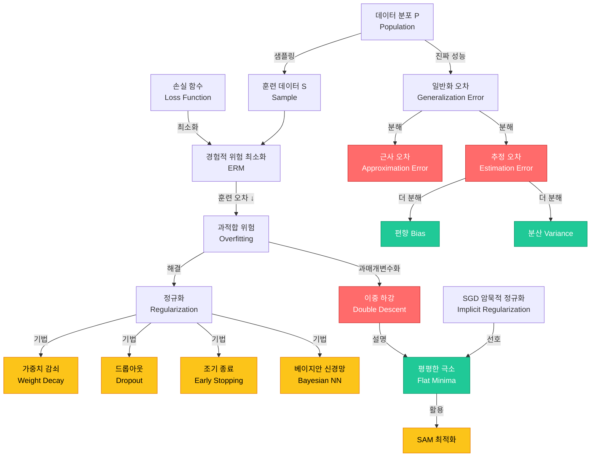

# 13. 일반화 & 정규화 (Generalization & Regularization)

> **동기부여**: 딥러닝의 궁극적 목표는 **훈련 데이터에서 잘 맞추는 것이 아니라, 한 번도 본 적 없는 데이터에서도 잘 동작하는 것**이다. 파라미터가 데이터 수보다 훨씬 많은 과매개변수화(overparameterized) 모델이 왜 일반화에 성공하는지는 현대 딥러닝 이론의 핵심 미스터리이며, 정규화 기법들은 이 일반화 성능을 체계적으로 높이기 위한 도구 모음이다.

---

## 1. 선행 개념 연결 Mermaid 다이어그램

---

## 2. 개념별 5단계 완전 분리 설명

### 개념 1: 일반화 오차 분해 (Generalization Error Decomposition) (슬라이드 407-411)

#### ① 초등학생 단계
시험 공부를 할 때, 교과서 문제만 달달 외우면 시험에서 처음 보는 문제를 못 풀어. "교과서 점수"는 높지만 "시험 점수"는 낮은 거야. **진짜 실력 = 시험 점수**이고, "교과서 점수와 시험 점수의 차이"가 바로 **일반화 오차**야.

#### ② 중등학생 단계
모델이 훈련 데이터에서 달성하는 성능을 **경험적 위험(empirical risk)** $L_S(h)$라 하고, 전체 데이터 분포에서의 성능을 **일반화 오차(generalization error)** $L_\mathcal{P}(h)$라 한다. 일반화 오차는 두 부분으로 나뉜다:
- **근사 오차**: 우리가 고른 모델 가족이 정답에 얼마나 가까운가
- **추정 오차**: 유한한 데이터로 인해 최적 모델에서 얼마나 벗어나는가

#### ③ 고등학생 단계
가설 공간 $\mathcal{H}$에서:
- $h^*_\mathcal{H} = \arg\min_{h \in \mathcal{H}} L_\mathcal{P}(h)$ (가설 공간 내 최적)
- $h_S = \arg\min_{h \in \mathcal{H}} L_S(h)$ (경험적 위험 최소화기)

$$L_\mathcal{P}(h_S) = \underbrace{L_\mathcal{P}(h^*_\mathcal{H})}_{\text{근사 오차}} + \underbrace{(L_\mathcal{P}(h_S) - L_\mathcal{P}(h^*_\mathcal{H}))}_{\text{추정 오차}}$$

$|\mathcal{H}|$를 키우면 근사 오차는 줄고, 추정 오차는 늘어난다 (고전적 관점).

#### ④ 대학 단계
일반화 오차의 또 다른 분해 (슬라이드 409):

$$L_\mathcal{P}(\hat{h}) = \underbrace{(L_\mathcal{P}(\hat{h}) - L_S(\hat{h}))}_{\text{gen}} + \underbrace{(L_S(\hat{h}) - L_S(h_S))}_{\text{opt}} + \underbrace{(L_S(h_S) - L_\mathcal{P}(h_S))}_{\text{gen}} + \underbrace{(L_\mathcal{P}(h_S) - L_\mathcal{P}(h^*_\mathcal{H}))}_{\text{est}} + \underbrace{L_\mathcal{P}(h^*_\mathcal{H})}_{\text{approx}}$$

Universal Approximation Theorem에 의해, 충분히 표현력 있는 NN에서는 근사 오차를 무시할 수 있다 (슬라이드 410).

#### ⑤ 대학원 단계
유한 가설 공간 $|\mathcal{H}| < \infty$, bounded loss $\ell \in [0,1]$ 가정 하에 (슬라이드 413):

$$L_\mathcal{P}(h) - L_S(h) \leq \sqrt{\frac{\log|\mathcal{H}| + \log(2/\delta)}{2n}}, \quad \forall h \in \mathcal{H}$$

추정 오차의 상한은 $O(1/\sqrt{n})$이다. 이는 sample complexity의 기본 결과이며, VC dimension이나 Rademacher complexity로 무한 가설 공간으로 확장된다. 그러나 이 바운드는 현대 딥러닝 모델의 일반화를 설명하기에 너무 느슨(vacuous)하다.

---

### 개념 2: 편향-분산 트레이드오프 (Bias-Variance Tradeoff) (슬라이드 414-418)

#### ① 초등학생 단계
과녁 맞추기를 생각해 봐. **편향(bias)**은 화살이 전체적으로 과녁 중심에서 얼마나 벗어나 있는지, **분산(variance)**은 화살들이 서로 얼마나 흩어져 있는지야. 이상적으로는 둘 다 낮아야 해!

#### ② 중등학생 단계
단순한 모델(예: 직선)은 데이터의 복잡한 패턴을 못 잡아서 편향이 높고, 복잡한 모델(예: 20차 다항식)은 데이터의 노이즈까지 학습해서 분산이 높다 (슬라이드 417). 최적의 모델 복잡도는 이 둘의 합이 최소가 되는 지점이다.

#### ③ 고등학생 단계
$h_S$를 ERM 해, $f$를 목표 함수, $\mu = \mathbb{E}_S[h_S]$라 하면:

$$\text{bias}(h_S) := \mathbb{E}_S[h_S] - f = \mu - f$$
$$\text{variance}(h_S) := \text{Var}_S[h_S]$$

#### ④ 대학 단계
Bias-Variance Decomposition (슬라이드 416):

$$\mathbb{E}_S[(h_S - f)^2] = \text{Var}_S[h_S] + \text{bias}^2(h_S)$$

증명: $\mathbb{E}_S[(h_S - f)^2] = \mathbb{E}_S[(h_S - \mu)^2 + 2(h_S - \mu)(\mu - f) + (\mu - f)^2]$에서 교차항 $\mathbb{E}_S[(h_S - \mu)(\mu - f)] = 0$이므로 분산 + 편향$^2$이 된다.

모델 복잡도 증가 시: bias $\downarrow$, variance $\uparrow$ (슬라이드 418의 U자 곡선).

#### ⑤ 대학원 단계
선형 회귀 모델에서 (슬라이드 433-435), 등방성 가정($\text{Cov}[x_i] = I$, $\text{Cov}[\varepsilon] = I$) 하에:

$$R(\hat{\beta} \mid X) = \text{Tr}(\Sigma \text{Cov}(\hat{\beta}|X)) + \|\mathbb{E}[\hat{\beta}|X] - \beta\|^2_\Sigma$$

Min-norm estimator의 분산은 $\text{Tr}((X^\top X)^+)$이며, $\gamma = p/n \to 1$일 때 분산이 발산한다 (슬라이드 435). 이것이 interpolation threshold에서의 peak를 수학적으로 설명한다.

---

### 개념 3: 정규화된 경험적 위험 & Weight Decay (Regularized ERM) (슬라이드 419-421, 423)

#### ① 초등학생 단계
시험 공부할 때 답을 그냥 외우지 말고 "최대한 간단한 규칙"으로 이해하라는 거야. 복잡한 답을 쓰면 벌점을 주는 것처럼, 모델이 너무 복잡해지면 패널티를 주는 거지!

#### ② 중등학생 단계
과적합을 막기 위해 목적 함수에 **복잡도 벌점**을 추가한다:

$$L_S(\theta; \lambda) = L_S(\theta) + \lambda C(\theta)$$

$\lambda$가 클수록 단순한 모델을 선호하고, 작을수록 훈련 오차 줄이기에 집중한다.

#### ③ 고등학생 단계
대표적 정규화 방법들:
- **Weight decay (L2)**: $C(\theta) = \|\theta\|_2^2$ -- MAP-Gaussian, Ridge 회귀
- **L1 정규화**: $C(\theta) = \|\theta\|_1$ -- MAP-Laplace, LASSO, 희소 해 유도
- **조기 종료**: 검증 오차가 증가하기 시작하면 훈련 중단
- **더 많은 데이터**: 가장 직접적인 과적합 방지법

#### ④ 대학 단계
확률적 관점에서의 연결 (슬라이드 423):
- **MLE** $\leftrightarrow$ likelihood $\leftrightarrow$ ERM $\leftrightarrow$ optimization
- **MAP** $\leftrightarrow$ likelihood + prior $\leftrightarrow$ Regularized ERM $\leftrightarrow$ generalization

L2 정규화는 가중치에 가우시안 사전분포 $p(\theta) \propto \exp(-\lambda\|\theta\|^2)$를 부여한 MAP 추정과 동일하다. L1은 라플라스 사전분포에 대응한다.

교차 검증(cross-validation)으로 최적 $\lambda$를 선택한다 (슬라이드 420):

$$\hat{\lambda} = \arg\min_\lambda L^{\text{cv}}(\lambda) = \arg\min_\lambda \frac{1}{K}\sum_k L_{S_k}(\hat{\theta}_\lambda(S_{-k}))$$

#### ⑤ 대학원 단계
정규화된 ERM의 일반화 바운드는 가설 공간의 "효과적 복잡도"를 줄여 추정 오차를 제어한다. Ridge 회귀에서 $\hat{\beta}_\lambda = (X^\top X + \lambda I)^{-1}X^\top y$이며, $\lambda$를 키우면 분산은 줄고 편향은 늘어난다. 최적 $\lambda$는 bias-variance tradeoff의 최적점이다. 그러나 과매개변수화 영역에서는 명시적 정규화 없이도 좋은 일반화가 가능하다는 것이 현대 연구의 핵심 발견이다.

---

### 개념 4: 드롭아웃 (Dropout) (슬라이드 421)

#### ① 초등학생 단계
조별 과제에서 매번 랜덤으로 팀원 몇 명이 빠진다고 생각해 봐. 그러면 남은 사람들이 혼자서도 잘해야 하니까, 모든 팀원이 실력이 골고루 좋아져! 드롭아웃도 뉴런을 랜덤으로 꺼서 모든 뉴런이 독립적으로 잘 작동하도록 만드는 거야.

#### ② 중등학생 단계
훈련 시 각 뉴런의 출력 연결을 확률 $p$로 무작위 비활성화한다. 추론 시에는 모든 뉴런을 사용하되 출력에 $(1-p)$를 곱한다. 이는 뉴런들이 서로에게 지나치게 의존하는 **공동 적응(co-adaptation)**을 방지한다.

#### ③ 고등학생 단계
드롭아웃은 각 샘플마다 다른 부분 네트워크를 사용하는 것과 같다. 총 $2^n$개의 가능한 서브네트워크 중 하나를 샘플링하여 훈련하는 것이며, 추론 시에는 이 모든 서브네트워크의 앙상블 평균을 근사한다.

#### ④ 대학 단계
수학적으로, 히든 유닛 $h_i$에 마스크 $m_i \sim \text{Bernoulli}(1-p)$를 곱한다: $\tilde{h}_i = m_i \cdot h_i$. 이는 가중치에 곱셈 노이즈를 주입하는 것과 동등하며, 특정 조건 하에서 L2 정규화와 연관된다. Dropout은 또한 Lipschitz 모델을 선호하는 암묵적 편향을 가진다 (슬라이드 440: "Dropout noise prefers Lipschitz models").

#### ⑤ 대학원 단계
Gal & Ghahramani (2016)은 드롭아웃이 가우시안 프로세스의 변분 근사임을 보였다. 드롭아웃을 적용한 신경망의 예측 분포는 베이지안 예측 불확실성의 근사를 제공한다. MC Dropout: 추론 시에도 드롭아웃을 켜고 여러 번 포워드 패스를 수행하면 예측 불확실성을 추정할 수 있다.

---

### 개념 5: 이중 하강 & 과매개변수화 (Double Descent & Overparameterization) (슬라이드 422, 425-428, 435)

#### ① 초등학생 단계
보통은 "너무 많이 외우면 시험 못 본다"고 하잖아. 그런데 신기하게도, **정말 정말 많이** 외우면 오히려 시험도 잘 보게 되는 현상이 있어! 처음엔 나빠지다가 다시 좋아지는 거야.

#### ② 중등학생 단계
고전적 통계학에서는 모델 복잡도를 올리면 처음엔 성능이 좋아지다 나빠지는 U자 곡선을 예상한다. 그런데 현대 딥러닝에서는 모델을 **훨씬 더** 크게 만들면 성능이 다시 좋아진다! 이것이 **이중 하강(double descent)** 현상이다 (슬라이드 427).

#### ③ 고등학생 단계
슬라이드 427의 두 레짐:
- **고전적 레짐** (under-parameterized): U자 곡선, 최적 복잡도 존재
- **현대적 보간 레짐** (over-parameterized): 보간 임계점(interpolation threshold)을 지나면 테스트 오차가 다시 감소

GPT-4는 약 $10^{12} = 1T$개의 파라미터를 가지며, 인간 뇌는 100T~1000T개의 시냅스를 가진다 (슬라이드 425).

#### ④ 대학 단계
슬라이드 428의 세 레짐:
1. **Skydiving Regime** (Heavily Undercapacity): 스케일링 중심, 근사 오차 최소화
2. **U-shaped Regime** (Classical ML): 일반화 중심, 정규화로 일반화 오차 최소화
3. **Second-descent Regime** (Overcapacity): 보간 임계점 이후 다시 하강

"interpolating fits는 미래 데이터를 잘 예측하지 못한다"는 통계학 교과서의 통념은 사실이 아니다 (슬라이드 422, [BLL+20]).

#### ⑤ 대학원 단계
선형 회귀에서의 엄밀한 분석 (슬라이드 429-435):

Min-norm least squares: $\hat{\beta} = X^+ y = (X^\top X)^+ X^\top y$

$\gamma = p/n$으로 놓으면 (슬라이드 435):

$$\text{Var} \to \begin{cases} \frac{\gamma}{1-\gamma} & \text{if } 0 < \gamma < 1 \text{ (underparameterized)} \\ \frac{1}{\gamma - 1} & \text{if } \gamma^{-1} < 1 \text{ (overparameterized)} \end{cases}$$

$\gamma \to 1$ (즉, $p \approx n$)에서 분산이 발산하며, 이것이 이중 하강의 peak이다. Bias는 bounded이므로, double descent는 본질적으로 **분산의 발산과 감소**로 설명된다.

---

### 개념 6: 암묵적 정규화 & SGD의 귀납적 편향 (Implicit Regularization) (슬라이드 424, 429-432, 440)

#### ① 초등학생 단계
선생님이 특별한 규칙을 안 정해줘도, 착한 아이들은 알아서 질서를 지키잖아? SGD라는 학습 방법도 마찬가지로, 특별한 규칙(정규화) 없이도 알아서 "좋은" 답을 찾아가!

#### ② 중등학생 단계
놀랍게도 SGD는 명시적 정규화 없이도 "좋은" 해를 찾을 수 있다 (슬라이드 424). 과매개변수화된 모델에서 무한히 많은 해 중에서도 SGD는 특정 성질을 가진 해를 선호한다.

#### ③ 고등학생 단계
과매개변수화된 선형 모델에서 ($p > n$), 훈련 오차 0인 해는 무한히 많지만, 경사하강법은 초기값에서 가장 가까운 해, 즉 **최소 노름 해(min-norm solution)** $\hat{\beta} = X^+ y$로 수렴한다 (슬라이드 430-431).

#### ④ 대학 단계
GD의 암묵적 편향 (슬라이드 440):
- GD는 **낮은 노름** ($\ell_2$, $\ell_1$ 등)의 파라미터를 선호
- GD는 **최대 마진(max-margin)** 분류기로 수렴
- SGD (큰 LR / 작은 배치)는 **평평한 극소(flat minima)**를 선호
- GD는 **평평하고 안정적인 극소**로 수렴

$\theta(0) = 0$에서 시작하면 $\lim_{t \to \infty} \theta(t) = \theta^*_{\text{MN}}$ (슬라이드 431). 이는 GD가 과매개변수화에서도 가장 단순한 해를 자동으로 선택함을 의미한다.

#### ⑤ 대학원 단계
연속 시간 한계에서 GD ($\omega_{k+1} = \omega_k + \epsilon f(\omega_k)$)와 gradient flow ($\dot{\omega} = f(\omega)$)의 궤적은 다르며 (슬라이드 448), 이산화 오차가 추가적 암묵적 정규화를 제공한다. Modified flow $\dot{\omega} = \tilde{f}(\omega)$로 더 정확히 근사할 수 있다.

큰 학습률 $\eta \uparrow$: GF $\to$ GD로의 이동, 더 나은 일반화와 더 낮은 sharpness를 유도 (슬라이드 450).
작은 배치 $b \downarrow$: GD $\to$ SGD로의 이동, 추가적 노이즈가 flat minima를 선호.

---

### 개념 7: 평평한 극소와 일반화 (Flat Minima & Generalization) (슬라이드 436-437, 441-447, 449-451)

#### ① 초등학생 단계
넓고 평평한 그릇 바닥에 공이 있으면, 살짝 흔들어도 공이 그릇 밖으로 안 나가. 하지만 좁고 뾰족한 바닥이면 조금만 흔들어도 나가버려. 딥러닝에서도 **넓고 평평한 곳**에 있는 답이 새로운 데이터에도 잘 맞아!

#### ② 중등학생 단계
손실 함수의 극소값 중에서 **평평한 극소(flat minimum)**는 파라미터를 조금 바꿔도 성능이 크게 변하지 않는다. 이는 훈련/테스트 데이터의 미세한 차이에 강건하므로 일반화 성능이 좋다 (슬라이드 441).

#### ③ 고등학생 단계
Sharpness 측정: 손실의 헤시안 최대 고유값 $\lambda_{\max}(\nabla^2 L(\theta))$ (슬라이드 441).
- **Flat minimum**: $\lambda_{\max}$ 작음 $\to$ 훈련/테스트 손실 곡면이 비슷 $\to$ 좋은 일반화
- **Sharp minimum**: $\lambda_{\max}$ 큼 $\to$ 곡면 차이 큼 $\to$ 나쁜 일반화

Small batch는 flat minima, large batch는 sharp minima를 찾는 경향 (슬라이드 442).

#### ④ 대학 단계
**Edge of Stability (EoS)** (슬라이드 443): GD 훈련 시 두 단계가 관찰된다:
1. **Progressive Sharpening**: sharpness가 점진적으로 증가
2. **Edge of Stability**: sharpness가 $2/\eta$에 도달하면 그 근처에서 진동

**Break-Even Point (BEP)** (슬라이드 444): sharpness와 gradient 노이즈가 특정 지점 이후 암묵적으로 정규화된다.

**Mode Connectivity** (슬라이드 436): 두 최적해가 훈련 손실이 거의 일정한 단순 곡선으로 연결된다. 이는 과매개변수화된 모델의 손실 경관이 매우 연결적(connected)임을 시사한다.

#### ⑤ 대학원 단계
**SAM (Sharpness-Aware Minimization)** (슬라이드 451): 명시적으로 flat minima를 찾는 최적화:

$$w_{\text{adv}} = w_t + \rho \frac{\nabla L(w_t)}{\|\nabla L(w_t)\|}$$
$$w_{t+1} = w_t - \eta \nabla L(w_{\text{adv}})$$

Step 1에서 adversarial perturbation으로 worst-case 방향을 찾고, Step 2에서 그 위치의 그래디언트로 업데이트한다. 이는 $\min_w \max_{\|\epsilon\| \leq \rho} L(w + \epsilon)$를 근사적으로 최적화하며, 자연스럽게 flat minima로 수렴한다.

GD with 학습률 $\eta$일 때 이론적으로 Sharpness $\approx 2/\eta$ (슬라이드 445)이므로, 큰 학습률은 낮은 sharpness를, 즉 더 나은 일반화를 유도한다.

---

### 개념 8: 베이지안 신경망 (Bayesian Neural Networks) (슬라이드 421)

#### ① 초등학생 단계
보통은 "정답은 이거야!"라고 하나만 고르잖아. 베이지안 방식은 "이 답일 수도 있고 저 답일 수도 있어"라고 여러 가능성을 함께 고려해. 마치 여러 친구한테 물어봐서 종합하는 것처럼!

#### ② 중등학생 단계
일반 신경망은 하나의 최적 파라미터를 찾지만, 베이지안 신경망은 가능한 모든 파라미터에 대해 확률을 부여하고, 예측할 때 모든 가능성을 "평균"낸다. 이렇게 하면 모델이 자신 없는 부분에서는 불확실하다고 솔직하게 말할 수 있다.

#### ③ 고등학생 단계
예측 시 베이지안 주변화(marginalization):

$$p(y|x, S) = \int p(y|x, \theta) p(\theta|S) d\theta$$

단일 점 추정 $\hat{\theta}$ 대신, 사후분포 $p(\theta|S)$ 전체를 사용한다. 이는 여러 모델의 **앙상블**과 같으며, 자연스러운 정규화 효과를 가진다.

#### ④ 대학 단계
사후분포: $p(\theta|S) \propto p(S|\theta)p(\theta)$
- $p(S|\theta)$: likelihood (데이터를 얼마나 잘 설명하는가)
- $p(\theta)$: prior (파라미터에 대한 사전 믿음)

MAP 추정은 $\arg\max_\theta p(\theta|S)$로, 정규화된 ERM과 동등하다. 완전 베이지안 추론은 적분을 수행하므로 MAP보다 더 강한 정규화 효과를 가진다.

#### ⑤ 대학원 단계
정확한 사후 적분은 고차원에서 계산이 불가능하므로, 변분 추론(Variational Inference), MCMC, Laplace 근사 등을 사용한다. MC Dropout은 변분 근사의 일종으로, 드롭아웃 모델이 가우시안 프로세스를 근사함이 알려져 있다. Neural Tangent Kernel (NTK) 관점에서 무한 너비 신경망은 가우시안 프로세스와 동등하며, 이는 베이지안 관점과 연결된다.

---

### 개념 9: 손실 경관과 최적화 경관 (Loss Landscape) (슬라이드 436-437, 447-450)

#### ① 초등학생 단계
산에서 가장 낮은 곳(골짜기)을 찾는 것처럼, 딥러닝도 "오차가 가장 작은 곳"을 찾아. 그런데 산이 정말 복잡해서 골짜기가 엄청 많아. 어떤 골짜기는 좋고 어떤 건 나빠!

#### ② 중등학생 단계
과매개변수화된 신경망은 (슬라이드 437):
- 다수의 **글로벌 미니마**가 존재
- 일부는 테스트 성능이 좋고, 일부는 나쁨
- SGD는 좋은 미니마로 수렴하는 경향

Under-parameterized 모델은 local minima가 많고, over-parameterized 모델은 글로벌 미니마가 연결된 매끄러운 경관을 가진다.

#### ③ 고등학생 단계
$L(\theta) = 0$인 해의 집합은 고차원 매니폴드를 형성한다 (슬라이드 449). SGD의 궤적은 이 매니폴드를 따라 이동하며, 그 중에서도 $f_{\text{true}}$에 가까운 $\theta^*$를 향해 간다. 학습률이 클수록, 배치가 작을수록 더 좋은 해로 이동한다 (슬라이드 450).

#### ④ 대학 단계
Mode Connectivity (슬라이드 436, [GIP+18]): 두 독립적 최적해 사이에 훈련 손실이 거의 일정한 단순 경로가 존재한다. 이는 좋은 해들이 고차원 공간에서 연결된 하나의 "골짜기"를 형성함을 시사한다.

기린 비유 (슬라이드 438-439):
- 자연 선택 = 실무자의 알고리즘 선택
- 나뭇잎(높은 곳) = 잘 일반화된 모델 (목표)
- 기린 = 알고리즘
- 긴 목의 기린 = 딥러닝 알고리즘
- **긴 목** = ???  (일반화의 근본 원인은 여전히 미스터리)

#### ⑤ 대학원 단계
ICML 2023 Tutorial (슬라이드 440)에서 정리한 SGD의 암묵적 편향 연구 현황:
1. GD는 낮은 노름 해를 선호 (Gunasekar et al. '17, Li-Liang '18, ...)
2. GD는 max-margin 분류기로 수렴 (Zhang-Yu '05, Soudry et al. '17, ...)
3. SGD with large LR/small batch는 flat minima 선호 (Kleinberg et al. '18, ...)
4. GD는 flat/stable minima로 수렴 (Jastrzebski et al. '19, Cohen et al. '20, ...)
5. Dropout noise는 Lipschitz 모델 선호 (Wei et al. '20, Arora et al. '21, ...)

이 연구들은 "왜 딥러닝이 일반화하는가"에 대한 부분적 해답을 제공하지만, 통합된 이론은 아직 없다.

---

## 3. 오개념 카드 (5+)

### 오개념 1: "모델이 크면 반드시 과적합한다"
- **틀린 이유**: 이중 하강 현상이 보여주듯, 충분히 큰 모델은 보간 임계점을 지나면 오히려 테스트 성능이 좋아진다 (슬라이드 427). GPT-4 같은 조 단위 파라미터 모델이 잘 일반화하는 것이 실증적 증거이다.
- **올바른 이해**: 모델 크기 $\approx$ 데이터 크기인 보간 임계점 근처에서만 과적합이 최악이고, 그 이후로는 암묵적 정규화 덕에 일반화가 좋아진다.

### 오개념 2: "훈련 오차가 0이면 반드시 과적합이다"
- **틀린 이유**: [BLL+20] (슬라이드 422)이 지적하듯, "보간하는 추정기는 미래 데이터를 잘 예측하지 못한다"는 통계학 교과서의 통념은 딥러닝에서 사실이 아니다.
- **올바른 이해**: 과매개변수화된 모델이 훈련 데이터를 완벽히 보간하면서도 좋은 일반화를 달성하는 **benign overfitting** 현상이 존재한다.

### 오개념 3: "Weight decay는 단순히 가중치를 작게 만들 뿐이다"
- **틀린 이유**: Weight decay는 확률적으로 파라미터에 가우시안 사전분포를 부여한 MAP 추정과 동등하다 (슬라이드 423). 단순히 가중치 크기를 줄이는 것이 아니라, 모델의 효과적 복잡도를 제어한다.
- **올바른 이해**: L2 정규화는 가설 공간의 유효 차원을 줄여 추정 오차를 제어하며, bias-variance tradeoff에서 분산을 줄이는 대가로 편향을 약간 높인다.

### 오개념 4: "Sharp minima는 항상 나쁘다"
- **틀린 이유**: Dinh et al. (2017)은 reparameterization으로 flat minima를 sharp하게 보이게 할 수 있음을 보였다. Sharpness의 정의가 파라미터화에 의존한다.
- **올바른 이해**: "reparameterization-invariant" sharpness 측정이 필요하며, 단순히 헤시안 최대 고유값만으로 판단하면 오류가 생길 수 있다. 다만 실용적으로는 flat minima $\approx$ good minima가 잘 성립한다.

### 오개념 5: "드롭아웃은 단순히 노이즈를 추가하는 것이다"
- **틀린 이유**: 드롭아웃은 지수적으로 많은 서브네트워크의 앙상블 학습과 동등하며, 베이지안 추론의 변분 근사로 해석된다 (슬라이드 421).
- **올바른 이해**: 드롭아웃은 (1) 공동 적응 방지, (2) 암묵적 앙상블, (3) Lipschitz 모델 선호, (4) 예측 불확실성 추정 (MC Dropout) 등 다층적 효과를 가진다.

### 오개념 6: "편향-분산 트레이드오프는 항상 성립한다"
- **틀린 이유**: 고전적 U자 곡선은 과매개변수화 영역을 설명하지 못한다. 선형 회귀에서도 $p > n$이면 분산이 다시 감소한다 (슬라이드 435).
- **올바른 이해**: 편향-분산 분해 자체는 항상 성립하지만, "복잡도 증가 $\Rightarrow$ 분산 증가"라는 단조적 관계는 보간 임계점 이후 깨진다.

---

## 4. 초등학생에게 설명하기 연습

### Q1: "일반화가 뭐예요?"
> 학교에서 배운 것을 집에서 숙제할 때도 잘 쓸 수 있으면 "일반화를 잘 한다"고 해. 컴퓨터도 마찬가지로, 연습 문제(훈련 데이터)로 공부한 다음에 처음 보는 문제(테스트 데이터)도 잘 풀면 일반화를 잘 하는 거야. 우리의 목표는 컴퓨터가 연습 문제만 잘 푸는 게 아니라, 진짜 시험도 잘 보게 만드는 거야!

### Q2: "왜 너무 열심히 외우면 시험을 못 봐요?"
> 수학 문제를 풀이 과정을 이해하지 않고 답만 외우면 어떻게 될까? 1+1=2, 2+3=5는 맞추지만, 처음 보는 4+7은 못 풀어. 이게 **과적합**이야. 반면에 "더하기의 원리"를 이해하면 어떤 숫자든 더할 수 있지. 컴퓨터도 "원리"를 배워야 하는데, 데이터를 너무 세세하게 외우면 원리 대신 답을 외우게 돼.

### Q3: "드롭아웃이 뭐예요?"
> 축구팀에서 연습할 때 매번 다른 선수가 빠진다고 생각해 봐. 오늘은 수비수 한 명이 빠지고, 내일은 공격수 한 명이 빠져. 그러면 남은 선수들이 여러 포지션을 다 할 줄 알아야 하니까 팀 전체가 더 강해져! 인공지능의 "뉴런"도 이렇게 랜덤으로 쉬게 해서 전체 실력을 키우는 거야.

---

## 5. 수학 ↔ 딥러닝 연결 테이블

| 수학 개념 | 기호 | 딥러닝 맥락 | 슬라이드 |
|-----------|------|-------------|---------|
| 기대값 (Expectation) | $\mathbb{E}_{x \sim \mathcal{P}}[\cdot]$ | 일반화 오차 정의: $L_\mathcal{P}(h) = \mathbb{E}_{x \sim \mathcal{P}}[(h(x)-f(x))^2]$ | 410, 414 |
| 분산 (Variance) | $\text{Var}_S[h_S]$ | 모델의 학습 데이터 의존도, 과적합 정도 | 415-416 |
| 편향 (Bias) | $\mathbb{E}_S[h_S] - f$ | 모델의 체계적 오차, 과소적합 정도 | 415-416 |
| 노름 (Norm) | $\|\theta\|_2, \|\theta\|_1$ | 가중치 감쇠 패널티: $C(\theta) = \|\theta\|_p^p$ | 419, 421 |
| 유사역행렬 (Pseudoinverse) | $X^+ = X^\top(XX^\top)^+$ | Min-norm 최소제곱 해 (암묵적 정규화) | 429-432 |
| 고유값 (Eigenvalue) | $\lambda_{\max}(\nabla^2 L)$ | 손실 경관의 sharpness 측정 | 441, 443 |
| Trace (대각합) | $\text{Tr}((X^\top X)^+)$ | 분산의 정확한 표현, double descent peak | 434-435 |
| 베이지안 사후분포 | $p(\theta|S) \propto p(S|\theta)p(\theta)$ | BNN의 파라미터 불확실성, 정규화 | 421 |
| Hoeffding 부등식 | $P(\bar{X}-\mu \geq t) \leq e^{-2nt^2}$ | 일반화 바운드 유도: $O(1/\sqrt{n})$ | 412-413 |
| 헤시안 (Hessian) | $\nabla^2 L(\theta)$ | Edge of Stability: sharpness $\approx 2/\eta$ | 443-445 |

---

## 6. 킬러 요약

| 핵심 개념 | 한 줄 정의 | 왜 중요한가 |
|-----------|-----------|------------|
| **일반화 오차** | $L_\mathcal{P}(h) = \text{approx} + \text{estimation}$ | DL의 궁극적 성능 지표 |
| **편향-분산 분해** | $\text{MSE} = \text{Var} + \text{Bias}^2$ | 모델 선택의 이론적 기초 |
| **정규화 (Weight Decay)** | $L_S(\theta;\lambda) = L_S(\theta) + \lambda\|\theta\|^2$ | 과적합 방지의 가장 기본적 도구 |
| **드롭아웃** | 확률 $p$로 뉴런 비활성화 | 앙상블 + 공동적응 방지 |
| **이중 하강** | 보간 임계점 이후 테스트 오차 재하강 | 과매개변수화의 이론적 정당화 |
| **암묵적 정규화** | SGD가 자동으로 min-norm/flat 해 선호 | 명시적 정규화 없이도 일반화되는 이유 |
| **평평한 극소** | $\lambda_{\max}(\nabla^2 L) \approx 2/\eta$ | 좋은 일반화 $\Leftrightarrow$ flat loss landscape |
| **SAM** | $\min_w \max_{\|\epsilon\|\leq\rho} L(w+\epsilon)$ | 명시적으로 flat minima를 찾는 최적화 |
| **BNN / 베이지안 주변화** | $p(y|x,S) = \int p(y|x,\theta)p(\theta|S)d\theta$ | 불확실성 정량화 + 자연스러운 정규화 |

> **핵심 메시지**: 고전적 bias-variance tradeoff는 과매개변수화 영역에서 깨지며, 현대 딥러닝의 일반화는 SGD의 암묵적 정규화(flat minima 선호, min-norm 해 수렴)와 손실 경관의 구조적 특성(mode connectivity, benign overfitting)으로 부분적으로 설명된다. 그러나 **"왜 딥러닝이 일반화하는가"에 대한 완전한 이론은 아직 없다** -- 이것이 현재 이론 ML/DL의 가장 중요한 열린 문제이다.
