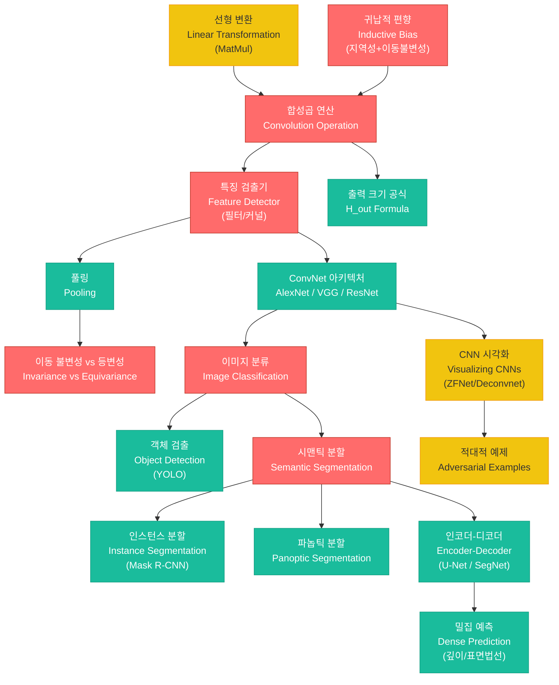

# 14. CNN - 이미지 이해 (CNN - Understanding Images)

> **동기부여**: 이미지는 1D 시계열, 2D 공간, 3D 시공간 구조를 가지며, 일반 MLP로 처리하면 파라미터 수가 폭발적으로 증가한다. CNN은 **지역성(locality)**과 **이동 불변성(translation invariance)**이라는 귀납적 편향(inductive bias)을 활용하여, 파라미터를 극적으로 줄이면서도 이미지의 공간적 패턴을 효과적으로 학습한다. AlexNet(2012)의 ImageNet 우승 이후 CNN은 컴퓨터 비전의 표준이 되었고, 분류 / 검출 / 분할 / 깊이 추정 등 거의 모든 시각 과제에서 핵심 역할을 수행한다.

---

## 1. 선행 개념 연결 Mermaid 다이어그램



---

## 2. 개념별 5단계 완전 분리 설명

---

### 개념 1: 합성곱 연산 (Convolution Operation) (슬라이드 461-465)

#### ① 초등학생 단계
큰 그림 위에 작은 돋보기(필터)를 올려놓고, 돋보기가 보는 부분의 숫자들과 필터 숫자들을 짝지어 곱한 뒤 모두 더해요. 그런 다음 돋보기를 한 칸 옮기고 같은 일을 반복해요. 이렇게 하면 "이 부분에 대각선이 있나?"를 알 수 있어요.

#### ② 중등학생 단계
합성곱은 입력 신호 위를 작은 필터(커널)가 슬라이딩하면서 내적(inner product)을 계산하는 연산이에요. 필터가 찾는 패턴과 입력이 비슷할수록 출력값이 크게 나옵니다. 1D에서는 $[w * x](i) = \sum_{u=0}^{k-1} w_u x_{i-u}$, 2D에서는 이를 가로세로 두 방향으로 확장합니다.

#### ③ 고등학생 단계
연속 합성곱 $[f * g](z) = \int f(u)g(z-u)\,du$의 이산 버전이 CNN의 합성곱입니다. 핵심은 이 연산이 **선형(linear)**이라는 점입니다. 즉 합성곱은 특수한 구조를 가진 행렬곱(MatMul)과 동치입니다. 필터 $w \in \mathbb{R}^k$로 입력 $x \in \mathbb{R}^n$을 합성곱하면, 이를 대응하는 **희소(sparse) + 가중치 공유(weight sharing)** 행렬 $W$로 표현할 수 있습니다.

#### ④ 대학 단계
합성곱의 행렬 표현 $W \in \mathbb{R}^{H_{out} \times H_{in}}$은 두 가지 귀납적 편향을 반영한다:
- **지역성(Locality)**: $W$가 희소(sparse) 행렬 -- 각 출력 뉴런은 입력의 국소 영역만 참조
- **이동 불변성(Translation Invariance)**: $W$의 대각 밴드가 동일한 값 -- 가중치 공유(weight sharing)

슬라이드 464의 질문처럼, 표준 기저 $e_i$를 입력하면 $W$의 각 열을 읽을 수 있다. 출력 차원은:

$$H_{out} = \frac{H_{in} + 2p - k}{s} + 1$$

여기서 $k$=커널 크기, $s$=스트라이드, $p$=패딩이다.

#### ⑤ 대학원 단계
합성곱은 순환(circulant) 행렬의 부분 행렬로 해석되며, 주파수 영역에서 원소별 곱셈으로 대체된다(합성곱 정리). 이는 FFT 기반 빠른 합성곱의 이론적 근거이다. 군론(group theory) 관점에서, 표준 CNN의 합성곱은 이동 군(translation group) $(\mathbb{Z}^2, +)$에 대한 등변 선형 사상이며, 이를 회전/반사 군으로 확장한 것이 Group Equivariant CNN이다. 합성곱 행렬의 특수 구조(Toeplitz/block-Toeplitz)는 $O(n \log n)$ 곱셈을 가능하게 한다.

---

### 개념 2: 특징 검출기와 특징 맵 (Feature Detector & Feature Maps) (슬라이드 462, 465, 493-497)

#### ① 초등학생 단계
필터는 "무늬 찾기 도장"이에요. 대각선 찾기 도장, 동그라미 찾기 도장 등 여러 개를 쓰면, 사진에서 어디에 어떤 무늬가 있는지 알 수 있어요. 결과로 나오는 지도를 "특징 맵"이라고 해요.

#### ② 중등학생 단계
하나의 필터는 하나의 패턴(예: 오른쪽 아래로 내려가는 대각선)을 감지합니다. 이 필터를 이미지 전체에 적용하면 "이 패턴이 어디에 강하게 나타나는지"를 보여주는 특징 맵이 만들어집니다. 필터를 여러 개 쓰면 여러 종류의 특징 맵이 쌓여 입력 채널 수가 늘어납니다.

#### ③ 고등학생 단계
ZFNet의 시각화(슬라이드 493-495)에 따르면, CNN의 각 층이 학습하는 특징은 계층적입니다:
- **Layer 1**: 에지, 색상 블롭 (Gabor-like 필터)
- **Layer 2**: 코너, 텍스처
- **Layer 3**: 부분 패턴 (바퀴, 사람 상체 등)
- **Layer 4-5**: 의미 있는 물체 부분 (개 얼굴, 꽃 등)

#### ④ 대학 단계
$c_{in}$ 채널 입력에 $c_{out}$개의 $k \times k$ 필터를 적용하면, 각 필터는 $k \times k \times c_{in}$ 크기의 3D 텐서이고, 전체 커널은 $\mathbb{R}^{c_{out} \times c_{in} \times k \times k}$이다. 특히 $1 \times 1$ 합성곱(슬라이드 477)은 공간 해상도를 유지하면서 채널 간 선형 결합만 수행하여 차원을 조절한다. Deconvnet(슬라이드 496-497)을 이용한 시각화는 특정 뉴런의 활성화를 입력 공간으로 역투영하여, 해당 뉴런이 "무엇을 보는지"를 직접 확인할 수 있게 한다.

#### ⑤ 대학원 단계
특징 맵의 계층적 추상화는 representation learning의 핵심이다. Transfer learning에서 초기 층의 범용 특징(에지, 텍스처)은 도메인 간 재사용이 가능하고, 상위 층은 태스크 특화 미세조정이 필요하다. Neural Tangent Kernel 관점에서, CNN 커널의 구조는 CNTK(Convolutional NTK)의 재귀적 계산으로 이어지며, 깊은 CNN의 학습 동역학을 분석하는 이론적 도구가 된다.

---

### 개념 3: 이동 등변성 vs 이동 불변성 (Translation Equivariance vs Invariance) (슬라이드 469)

#### ① 초등학생 단계
고양이가 사진 왼쪽에 있든 오른쪽에 있든 "고양이다!"라고 말하는 것은 **불변성**이에요. 고양이가 오른쪽으로 옮겨지면 결과 지도에서도 고양이 표시가 오른쪽으로 같이 옮겨지는 것은 **등변성**이에요.

#### ② 중등학생 단계
- **불변성(Invariance)**: 입력이 이동해도 출력이 변하지 않음. $f(S(x)) = f(x)$
- **등변성(Equivariance)**: 입력이 이동하면 출력도 같은 만큼 이동. $f(S(x)) = S(f(x))$

합성곱 자체는 등변적이고, 불변성을 얻으려면 풀링이 필요합니다.

#### ③ 고등학생 단계
이미지 분류기는 불변성이 필요합니다(고양이 위치에 무관하게 "고양이"로 분류). 반면 객체 검출기는 등변성이 필요합니다(고양이가 이동하면 바운딩 박스도 이동). 합성곱 $f$와 이동 연산 $S$에 대해 $f \circ S = S \circ f$가 성립하는 것이 등변성입니다.

#### ④ 대학 단계
합성곱 층은 이동(translation)에 대해 등변적이다: $\text{Conv}(T_\tau x) = T_\tau(\text{Conv}(x))$. 그러나 스트라이드, 패딩, 유한 이산 격자 등의 실질적 요인으로 완벽한 등변성은 깨진다. Global Average Pooling(GAP)을 마지막에 적용하면 공간 정보를 완전히 요약하여 이동 불변적 표현을 얻는다. 표준 CNN은 이동에만 등변적이고 회전/스케일에는 등변적이지 않다.

#### ⑤ 대학원 단계
Cohen & Welling (2016)의 Group Equivariant CNN은 임의의 대칭 군 $G$에 대해 등변적인 합성곱을 정의한다: $[f *_G \psi](g) = \sum_{h \in G} f(h)\psi(g^{-1}h)$. Steerable CNNs, SE(3)-Equivariant Networks 등은 3D 회전 등변성을 분자 구조 예측, 로보틱스 등에 활용한다. 불변/등변 표현의 이론적 기반은 Peter-Weyl 정리와 군의 표현론(representation theory)이다.

---

### 개념 4: 풀링 (Pooling) (슬라이드 468)

#### ① 초등학생 단계
특징 맵을 2x2 칸씩 묶어서, 그 안에서 가장 큰 숫자만 남기는 것이 "맥스 풀링"이에요. 그러면 그림이 작아지지만 중요한 정보는 살아 있어요.

#### ② 중등학생 단계
풀링은 특징 맵의 크기를 줄이는 다운샘플링 연산입니다.
- **Max Pooling**: 영역 내 최댓값 선택 -- "이 특징이 존재하는가?"를 판단
- **Average Pooling**: 영역 내 평균값 -- 전체적인 특징 강도를 측정

재미있는 성질: $\text{ReLU} \circ \text{MaxPool} = \text{MaxPool} \circ \text{ReLU}$ (교환 가능!)

#### ③ 고등학생 단계
풀링은 공간 해상도를 줄여 (1) 계산량 감소, (2) 수용 영역(receptive field) 확대, (3) 약간의 이동 불변성 부여 효과를 갖습니다. $2 \times 2$ 맥스 풀링(stride 2)은 가로세로 각각 절반으로 줄입니다.

#### ④ 대학 단계
Max Pooling은 $L^\infty$ 노름에, Average Pooling은 $L^1$ 노름에 대응한다. Global Average Pooling(GAP)은 전체 공간 차원을 단일 값으로 축약하여 FC 층의 파라미터를 대폭 줄인다. 풀링의 역전파에서, Max Pooling은 최댓값 위치("switch")에만 그래디언트를 전달하고, Average Pooling은 균등 분배한다.

#### ⑤ 대학원 단계
풀링은 이론적으로 anti-aliasing 없이 다운샘플링하는 것으로, 이동 등변성을 부분적으로 깨뜨린다. Zhang (2019)의 "Making Convolutional Networks Shift-Invariant Again"은 blur 필터를 삽입하여 이를 완화한다. 최근 아키텍처(ViT 등)에서는 풀링 대신 패치 임베딩이나 스트라이드 합성곱을 사용하는 경향이 있다.

---

### 개념 5: ConvNet 아키텍처 -- AlexNet과 그 이후 (슬라이드 470-476)

#### ① 초등학생 단계
AlexNet은 합성곱 층을 여러 개 쌓고, 마지막에 "이 사진은 1000개 종류 중 뭐지?"를 맞추는 네트워크예요. 고양이, 강아지, 자동차 같은 1000가지를 구분할 수 있어요!

#### ② 중등학생 단계
AlexNet (2012)은 ImageNet 대회에서 기존 방법보다 압도적으로 좋은 성능을 보여 딥러닝 붐을 일으켰습니다. 핵심 구성: Conv -> ReLU -> MaxPool을 반복하고, 마지막에 Flatten -> FC 층 -> Softmax로 1000개 클래스를 분류합니다.

#### ③ 고등학생 단계
AlexNet의 구조 (슬라이드 472-474):

$$X \in \mathbb{R}^{227 \times 227 \times 3} \xrightarrow{\text{Conv}(k{=}11, s{=}4, c_{out}{=}96)} \mathbb{R}^{55 \times 55 \times 96} \xrightarrow{\text{MaxPool}} \mathbb{R}^{27 \times 27 \times 96} \xrightarrow{\cdots} \mathbb{R}^{6 \times 6 \times 256}$$

이후 Flatten($9216$) -> FC($4096$) -> FC($4096$) -> Softmax($1000$). AlexNet의 혁신: ReLU, GPU 학습, Dropout, Data Augmentation (슬라이드 475).

#### ④ 대학 단계
AlexNet 이후의 진화 (슬라이드 476): VGG(더 깊고 $3 \times 3$ 필터 통일), GoogLeNet/Inception($1 \times 1$ 합성곱으로 차원 축소), ResNet(skip connection으로 수백 층 학습 가능), DenseNet(모든 층 간 연결), EfficientNet(폭/깊이/해상도 복합 스케일링). 출력 크기 공식 $H_{out} = \lfloor(H_{in} + 2p - k)/s\rfloor + 1$을 반복 적용하여 각 층의 텐서 차원을 추적해야 한다 (슬라이드 473의 Q).

#### ⑤ 대학원 단계
아키텍처 설계의 이론적 관점: (1) 수용 영역(receptive field)은 깊이에 따라 선형적으로 증가하며, $3 \times 3$ 두 층은 $5 \times 5$ 한 층과 동일한 수용 영역을 가지지만 파라미터가 적다 (VGG의 핵심 통찰). (2) ResNet의 skip connection은 loss landscape을 매끈하게 만들어 최적화를 용이하게 한다. (3) Neural Architecture Search(NAS)는 이 설계 공간을 자동 탐색한다. (4) $1 \times 1$ 합성곱은 채널 방향 MLP와 동치이며, Network-in-Network의 아이디어이다.

---

### 개념 6: 이미지 분류 / 태깅 / 객체 검출 (Classification / Tagging / Detection) (슬라이드 470, 481-482)

#### ① 초등학생 단계
- **분류**: 사진 한 장을 보고 "이건 고양이야!" 하나만 말하기
- **태깅**: 사진을 보고 "풀, 건물, 하늘, 나무" 여러 개 말하기
- **검출**: 사진에서 물체를 네모 상자로 표시하고 "여기에 고양이, 저기에 강아지" 하기

#### ② 중등학생 단계
- **Image Classification**: 이미지 -> 하나의 클래스. softmax 출력.
- **Image Tagging**: 이미지 -> 여러 태그. 각 클래스에 독립적인 sigmoid 출력 (multi-label).
- **Object Detection**: 이미지 -> 바운딩 박스 + 클래스 레이블 집합. 대표 모델: YOLO.

#### ③ 고등학생 단계
객체 검출에서는 **앵커 박스(anchor box)**라는 미리 정의된 후보 상자들을 배치하고, 각 앵커에 대해 (1) 클래스 확률, (2) 바운딩 박스 좌표 오프셋을 예측합니다. YOLO(You Only Look Once)는 이미지를 한 번만 통과시켜 모든 객체를 동시에 검출하여 실시간 처리가 가능합니다.

#### ④ 대학 단계
검출 프레임워크는 크게 two-stage(R-CNN 계열: 영역 제안 -> 분류)와 one-stage(YOLO, SSD: 직접 예측)로 나뉜다. Two-stage는 정확도가 높고, one-stage는 속도가 빠르다. 태깅은 수학적으로 $f: \mathbb{R}^{H \times W \times C} \to [0,1]^K$ (각 클래스 독립 로지스틱 유닛)이고, 분류는 $f: \mathbb{R}^{H \times W \times C} \to \Delta^{K-1}$ (simplex 위의 확률 분포)이다.

#### ⑤ 대학원 단계
최신 검출 패러다임인 DETR(Detection Transformer)은 앵커 없이 set prediction 문제로 재정의하여, Hungarian matching 기반 loss를 사용한다. DINO, Grounding DINO 등은 open-vocabulary detection으로 확장되어, 텍스트 쿼리로 임의 물체를 검출한다. Non-Maximum Suppression(NMS)의 미분불가능성 문제를 end-to-end 학습으로 해결하는 것이 핵심 연구 방향이다.

---

### 개념 7: 시맨틱 / 인스턴스 / 파놉틱 분할 (Semantic / Instance / Panoptic Segmentation) (슬라이드 483-487)

#### ① 초등학생 단계
- **시맨틱 분할**: 사진의 모든 점(픽셀)에 "이건 도로, 이건 사람, 이건 하늘" 색칠하기
- **인스턴스 분할**: 사람이 여러 명이면 "사람1, 사람2, 사람3" 다르게 색칠하기
- **파놉틱 분할**: 위 둘을 합쳐서 모든 것을 빈틈없이 색칠하기

#### ② 중등학생 단계
시맨틱 분할은 각 픽셀 -> 클래스 레이블을 예측하지만, 같은 클래스의 개별 물체를 구분하지 않습니다. 인스턴스 분할은 검출된 각 물체 박스 안에서 전경/배경을 분할하여 개별 물체를 구분합니다. 파놉틱 분할은 "stuff"(하늘, 도로)와 "things"(차, 사람)를 모두 처리합니다.

#### ③ 고등학생 단계
수학적으로:
- 시맨틱 분할: $f: \mathbb{R}^{H \times W \times C} \to \{1, \ldots, K\}^{H \times W}$ (각 픽셀에 클래스 배정)
- 인스턴스 분할 = 객체 검출 $\circ$ 시맨틱 분할 (각 검출 박스 내에서 pixel-wise 이진 분류)
- 대표 모델: Mask R-CNN [HGD+17] (슬라이드 484)

#### ④ 대학 단계
시맨틱 분할의 핵심 과제는 고해상도 출력 복원이다. 인코더(다운샘플링)로 추상적 특징을 추출한 뒤 디코더(업샘플링)로 원래 해상도를 복원한다. SegNet(슬라이드 486)은 pooling indices를 기억하여 업샘플링에 활용하고, U-Net(슬라이드 487)은 skip connection으로 인코더 특징을 디코더에 직접 전달한다. 디코더에는 전치 합성곱(transposed convolution, 슬라이드 479-480)이나 dilated convolution(슬라이드 478)이 사용된다.

#### ⑤ 대학원 단계
파놉틱 분할은 Panoptic FPN, Panoptic-DeepLab 등에서 stuff/things를 통합 처리한다. 최신 접근인 Mask2Former는 시맨틱/인스턴스/파놉틱을 하나의 아키텍처로 통합하며, masked attention과 deformable attention을 결합한다. SAM(Segment Anything Model)은 프롬프트 기반으로 임의 객체를 분할하는 foundation model 접근이다. 분할 성능 평가 지표로 mIoU(mean Intersection over Union), PQ(Panoptic Quality) 등이 사용된다.

---

### 개념 8: 인코더-디코더 구조와 전치 합성곱 (Encoder-Decoder & Transposed Convolution) (슬라이드 479-480, 486-487)

#### ① 초등학생 단계
인코더는 사진을 점점 작게 줄이면서 "이 사진에 뭐가 있는지" 요약하는 역할이에요. 디코더는 그 요약을 다시 크게 펼쳐서 원래 크기의 답을 만들어요. 줄였다가 다시 키우는 거예요!

#### ② 중등학생 단계
- **인코더**: Conv + Pooling을 반복하여 해상도를 줄이고 채널을 늘림 (추상적 특징 추출)
- **디코더**: 업샘플링으로 해상도를 다시 키움
- **전치 합성곱(Transposed Convolution)**: 합성곱의 "반대" 방향 -- 작은 입력으로 큰 출력을 생성

#### ③ 고등학생 단계
전치 합성곱은 합성곱 행렬 $W$의 전치 $W^\top$를 곱하는 연산입니다 (슬라이드 479-480). 주의: 역행렬이 아니라 전치 행렬입니다! 따라서 합성곱의 역연산이 아니라 "해상도를 키우는" 연산입니다. U-Net의 skip connection은 인코더의 고해상도 특징을 디코더에 직접 전달하여 디테일을 보존합니다.

#### ④ 대학 단계
합성곱을 $y = Wx$ ($W \in \mathbb{R}^{m \times n}$, $m < n$)로 쓰면, 전치 합성곱은 $z = W^\top y \in \mathbb{R}^n$이다. Dilated convolution(슬라이드 478)은 커널 원소 사이에 간격(dilation rate $r$)을 두어 파라미터 증가 없이 수용 영역을 확대한다. 실효 커널 크기는 $k + (k-1)(r-1)$이다.

#### ⑤ 대학원 단계
전치 합성곱의 "체커보드 아티팩트" 문제는 stride와 kernel size의 비율에 의해 발생하며, bilinear upsampling + convolution으로 완화할 수 있다. Feature Pyramid Network(FPN)은 멀티스케일 특징을 top-down pathway로 융합하여 다양한 크기의 객체를 효과적으로 처리한다.

---

### 개념 9: 밀집 예측 -- 깊이/표면법선 추정 (Dense Prediction -- Depth/Surface Normal) (슬라이드 488-490)

#### ① 초등학생 단계
사진 한 장만 보고 "이 부분은 가까이 있고, 저 부분은 멀리 있어"를 맞추는 거예요. 마치 사진에서 거리감을 느끼는 것처럼요! 표면 방향 예측은 "이 벽은 이쪽을 향하고 있어"를 알아내는 거예요.

#### ② 중등학생 단계
- **깊이 예측(Depth Prediction)**: 각 픽셀 $i$에 대해 카메라로부터의 거리 $z_i \in \mathbb{R}$를 예측
- **표면법선 예측(Surface Normal)**: 각 픽셀(이미지 패치)에서 표면의 방향 벡터 $z_i \in \mathbb{R}^3$을 예측
- **시맨틱 분할**: 각 픽셀의 클래스 레이블 $y_i$를 예측

이 세 가지 모두 인코더-디코더 구조로 해결할 수 있습니다.

#### ③ 고등학생 단계
이들을 "image-to-image" 또는 "밀집 예측(dense prediction)" 과제라 합니다. 입력은 이미지이고 출력도 이미지와 같은 해상도의 맵입니다. 깊이 예측은 회귀 문제($L_2$ loss), 분할은 분류 문제(cross-entropy loss)입니다.

#### ④ 대학 단계
밀집 예측의 일반적 프레임워크: 인코더 $E: \mathbb{R}^{H \times W \times 3} \to \mathbb{R}^{h \times w \times d}$, 디코더 $D: \mathbb{R}^{h \times w \times d} \to \mathbb{R}^{H \times W \times c}$ (여기서 $c$는 과제에 따라 달라짐: 깊이=1, 법선=3, 분할=K). Multi-task learning으로 하나의 인코더를 공유하고 여러 디코더를 붙여 동시에 학습할 수 있다. 인간 자세 추정(슬라이드 490)도 밀집 예측의 한 형태로, 키포인트 위치를 히트맵으로 예측한다.

#### ⑤ 대학원 단계
Self-supervised depth estimation(Monodepth2 등)은 스테레오 쌍이나 연속 프레임 간의 photometric consistency를 이용하여 레이블 없이 깊이를 학습한다. DPT(Dense Prediction Transformer)는 ViT 기반 인코더를 사용하여 전역 컨텍스트를 활용한다. 최근 Depth Anything, Marigold 등은 대규모 사전학습 + 확산 모델을 활용하여 zero-shot 일반화 성능을 크게 향상시켰다.

---

### 개념 10: CNN 시각화와 적대적 예제 (Visualizing CNNs & Adversarial Examples) (슬라이드 492-499)

#### ① 초등학생 단계
CNN이 사진에서 뭘 보는지 궁금하면, "역재생" 비슷한 방법으로 CNN이 집중하는 부분을 그림으로 보여줄 수 있어요. 그런데 놀랍게도, 사람 눈에는 똑같아 보이는 사진에 아주 작은 노이즈를 넣으면 CNN이 완전히 다른 답을 할 수 있어요!

#### ② 중등학생 단계
ZFNet(슬라이드 493)은 Deconvnet을 사용하여 각 층의 뉴런이 반응하는 입력 패턴을 시각화했습니다. "Jennifer Aniston neuron"(슬라이드 492)은 특정 개념에 강하게 반응하는 뉴런이 존재한다는 흥미로운 발견입니다. 적대적 예제(슬라이드 499)에서는 판다 사진에 작은 노이즈 $\epsilon$을 더하면 99.3% 확신으로 "긴팔원숭이"로 분류됩니다.

#### ③ 고등학생 단계
Deconvnet 시각화 과정 (슬라이드 496-497):
1. 특정 층의 특정 뉴런만 활성화 유지, 나머지는 0으로 설정
2. Max Unpooling: pooling 시 기록한 switch(최대값 위치) 사용
3. Rectification: ReLU 역적용
4. Transposed Convolution: 커널의 전치로 역투영
이를 통해 해당 뉴런이 "반응하는 입력 패턴"을 재구성합니다.

#### ④ 대학 단계
적대적 예제 $x_{adv} = x + \epsilon \cdot \text{sign}(\nabla_x L(x, y))$ (FGSM)은 loss landscape의 선형성 때문에 발생한다 [SZS+13]. 이는 CNN이 인간과 근본적으로 다른 특징에 의존할 수 있음을 시사한다. CNN 시각화 기법에는 Deconvnet 외에도 Grad-CAM(그래디언트 가중 클래스 활성화 맵), saliency map, feature inversion 등이 있다.

#### ⑤ 대학원 단계
적대적 강건성(adversarial robustness)은 $\min_\theta \max_{\|\delta\| \leq \epsilon} L(f_\theta(x + \delta), y)$로 정식화되는 min-max 최적화 문제이다. Adversarial training(Madry et al., 2018)은 PGD 공격으로 생성한 적대적 예제를 훈련에 포함시킨다. 흥미롭게도, 적대적으로 학습된 모델의 특징은 인간이 인식하는 특징과 더 잘 align된다는 연구 결과가 있다. Certified defense(randomized smoothing 등)는 수학적으로 보장된 강건성 반경을 제공한다.

---

## 3. 오개념 카드 (5+)

| # | 오개념 | 올바른 이해 | 슬라이드 |
|---|--------|------------|---------|
| 1 | "합성곱은 비선형 연산이다" | 합성곱 자체는 **선형** 연산이다 (특수 구조의 행렬곱). 비선형성은 ReLU 등 활성화 함수가 담당한다. (슬라이드 463, 479) | 463 |
| 2 | "합성곱은 이동 불변적이다" | 합성곱은 이동 **등변적(equivariant)**이다. 불변성은 pooling 등 추가 연산으로 얻는다. 특징 검출기는 이동 불변이지만(어디서든 같은 패턴 탐지), 합성곱의 출력은 등변이다(입력이 이동하면 출력도 이동). (슬라이드 461, 469) | 461, 469 |
| 3 | "전치 합성곱은 합성곱의 역연산이다" | 전치 합성곱은 합성곱 행렬의 **전치(transpose)**를 사용하는 것이지, **역행렬(inverse)**이 아니다. 원래 입력을 복원하지 않는다. (슬라이드 480) | 480 |
| 4 | "Max Pooling이 항상 Average Pooling보다 좋다" | 용도에 따라 다르다. Max Pooling은 특징 존재 여부 감지에, Average Pooling은 전반적 특징 강도에 적합하다. 최종 출력에는 GAP(Global Average Pooling)이 자주 사용된다. (슬라이드 468) | 468 |
| 5 | "CNN은 깊을수록 항상 더 좋다" | 단순히 깊게만 쌓으면 vanishing gradient 문제로 성능이 오히려 하락한다. ResNet의 skip connection이 이를 해결했고, 폭(width), 해상도와의 균형도 중요하다 (EfficientNet). (슬라이드 476) | 476 |
| 6 | "CNN은 이미지의 전역 정보를 처음부터 활용한다" | 초기 층의 수용 영역(receptive field)은 매우 작아 국소 정보만 사용한다. 깊은 층으로 갈수록 수용 영역이 커져 점진적으로 전역 정보를 통합한다. (슬라이드 462, 493-495) | 462, 493 |
| 7 | "시맨틱 분할과 인스턴스 분할은 같은 문제다" | 시맨틱 분할은 같은 클래스 물체를 구분하지 않고(예: 모든 자동차 = "자동차"), 인스턴스 분할은 개별 물체를 구분한다(예: 자동차1, 자동차2). 파놉틱 분할이 이 둘을 통합한다. (슬라이드 483-485) | 483-485 |

---

## 4. 초등학생에게 설명하기 연습

### "합성곱이 뭐예요?"
> "큰 그림 위에 작은 스티커(필터)를 올려놓고, 스티커 아래에 있는 그림 부분과 스티커가 얼마나 비슷한지 점수를 매기는 거야. 스티커를 한 칸씩 옮기면서 계속 점수를 매기면, '이 그림 어디에 이런 무늬가 있는지' 알 수 있는 새로운 지도가 만들어져!"

### "왜 풀링을 해요?"
> "특징 맵이 너무 크면 컴퓨터가 힘들어해. 그래서 2x2 칸씩 묶어서 가장 큰 숫자만 남기는 거야. 마치 축소 복사처럼 작아지지만, 중요한 건 다 남아 있어."

### "시맨틱 분할이 뭐예요?"
> "사진의 모든 점에 색칠하는 거야. '이 점은 하늘이니까 파란색, 이 점은 도로니까 회색, 이 점은 사람이니까 빨간색' 이렇게. 색칠 공부 같은 건데, 컴퓨터가 자동으로 해주는 거지!"

### "적대적 예제가 뭐예요?"
> "판다 사진에 사람 눈에는 안 보이는 아주 작은 점들을 살짝 넣으면, 똑똑한 컴퓨터가 '이건 판다가 아니라 원숭이야!'라고 잘못 말하는 거야. 컴퓨터가 보는 방식이 사람과 좀 다르기 때문이야."

---

## 5. 수학 <-> 딥러닝 연결 테이블

| 수학 개념 | 딥러닝에서의 역할 | 수식 | 슬라이드 |
|-----------|-----------------|------|---------|
| 합성곱 (Convolution) | 지역적 특징 추출의 핵심 연산 | $[w * x](i) = \sum_{u=0}^{k-1} w_u x_{i-u} = w_{0:k-1}^\top \tilde{x}_{i:i+(k-1)}$ | 463 |
| 희소 행렬 (Sparse Matrix) | 합성곱의 지역성(locality) -- 각 출력이 입력의 국소 영역만 참조 | $W \in \mathbb{R}^{H_{out} \times H_{in}}$, 대부분 원소가 0 | 465 |
| Toeplitz 행렬 | 합성곱의 가중치 공유 -- 동일 필터가 모든 위치에서 사용됨 | 대각 밴드가 동일한 값 | 465 |
| 내적 (Inner Product) | 필터와 입력 패치의 유사도 측정 (template matching) | $\langle w, x_{patch} \rangle = w^\top x_{patch}$ | 462 |
| 행렬 전치 (Matrix Transpose) | 전치 합성곱으로 업샘플링 수행 | $z = W^\top y$ (역행렬이 아닌 전치!) | 479-480 |
| 출력 차원 공식 | Conv/Pool 후 텐서 크기 계산 | $H_{out} = \lfloor\frac{H_{in} + 2p - k}{s}\rfloor + 1$ | 467, 473 |
| Softmax 함수 | 다중 클래스 확률 분포 출력 | $p = \text{softmax}(W_3 X) \in \mathbb{R}^{1000}$ | 474 |
| $L^\infty$ / $L^1$ 노름 | Max Pooling / Average Pooling과의 대응 | $\max(x_1, \ldots, x_n)$ vs $\frac{1}{n}\sum x_i$ | 468 |
| 군론의 등변 사상 | CNN의 이동 등변성 일반화 (Group Equivariant CNN) | $[f *_G \psi](g) = \sum_{h \in G} f(h)\psi(g^{-1}h)$ | 469 |

---

## 6. 킬러 요약

```
┌─────────────────────────────────────────────────────────────┐
│                CNN - 이미지 이해 킬러 요약                      │
├─────────────────────────────────────────────────────────────┤
│                                                             │
│  이미지 = 고차원 격자 데이터 (H x W x C)                       │
│  MLP로 처리하면? 파라미터 폭발! (W ∈ R^{D x WHC})              │
│                                                             │
│  ★ 핵심 귀납적 편향 2가지:                                    │
│    1. 지역성 → 희소 행렬 (각 뉴런이 국소 영역만 봄)              │
│    2. 이동 불변성 → 가중치 공유 (같은 필터가 모든 위치에서 작동)   │
│    ⟹ MLP : ConvNet = MatMul : Convolution                  │
│                                                             │
│  합성곱 연산 = 필터 슬라이딩 + 내적 = 선형 연산                  │
│  출력 크기: H_out = (H_in + 2p - k) / s + 1                  │
│                                                             │
│  등변성 vs 불변성:                                            │
│    • Conv → 이동 등변 (입력 이동 → 출력도 이동)                 │
│    • Pooling → 이동 불변성 부여 (위치 무관한 판단)              │
│                                                             │
│  CNN 구조: [Conv → ReLU → Pool] × N → Flatten → FC → Softmax │
│  AlexNet(2012) → VGG → GoogLeNet → ResNet → EfficientNet    │
│                                                             │
│  비전 태스크 스펙트럼:                                        │
│    분류(Image→Class) → 태깅(Image→Tags)                     │
│    → 검출(Image→Boxes+Classes, YOLO)                        │
│    → 시맨틱 분할(Pixel→Class) → 인스턴스 분할(Pixel→Instance) │
│    → 파놉틱 분할(Semantic+Instance)                          │
│    → 밀집 예측(깊이/법선/자세, Encoder-Decoder)               │
│                                                             │
│  인코더-디코더: SegNet(pooling indices), U-Net(skip conn.)    │
│  업샘플링: 전치 합성곱 (W^T, 역행렬 아님!)                     │
│  수용영역 확대: Dilated Convolution (파라미터 증가 없이)        │
│                                                             │
│  CNN 시각화 (ZFNet Deconvnet):                               │
│    Layer 1: 에지 → Layer 3: 부분패턴 → Layer 5: 의미적 물체    │
│                                                             │
│  ⚠️ 적대적 예제: 미세한 노이즈로 분류 결과를 완전히 뒤집을 수 있음│
│    → CNN이 인간과 다른 특징에 의존할 수 있다는 경고              │
│                                                             │
└─────────────────────────────────────────────────────────────┘
```
