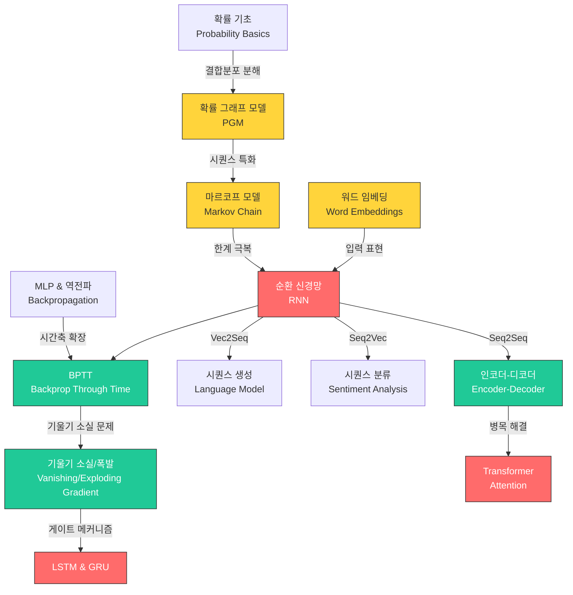

# 15. RNN & 시퀀스 모델 (RNN & Sequence Models)

> **동기부여**: 언어, 음성, 시계열, 음악 등 우리가 접하는 데이터의 상당수는 **순서(sequence)**가 핵심이다. "I ate an apple"과 "apple an ate I"는 같은 단어지만 전혀 다른 의미를 갖는다. 고정 크기 입력만 다루는 MLP나 CNN으로는 **가변 길이** 시퀀스의 **시간적 의존성(temporal dependency)**을 자연스럽게 모델링할 수 없다. RNN은 **은닉 상태(hidden state)**라는 "메모리"를 통해 과거 정보를 축적하며 시퀀스를 처리하는 가장 기본적인 신경망 구조이고, LSTM/GRU는 그 한계를 극복한 핵심 발전이다.

---

## 1. 선행 개념 연결 Mermaid 다이어그램

**범례**: 빨간색 = 핵심 개념, 청록색 = 중간 개념, 노란색 = 브릿지 개념

---

## 2. 개념별 5단계 완전 분리 설명

---

### 개념 1: 텍스트 데이터 표현과 워드 임베딩 (Word Embeddings) (슬라이드 501-506)

#### 1 초등학생 단계
컴퓨터는 글자를 모른다. 그래서 단어마다 번호표를 준다. 하지만 번호표만으로는 "강아지"와 "개"가 비슷하다는 걸 알 수 없다. 그래서 각 단어를 화살표(벡터)로 바꿔서, 비슷한 단어는 가까이 놓는 특별한 지도를 만든다. 이게 "워드 임베딩"이다.

#### 2 중등학생 단계
텍스트를 숫자로 바꾸는 방법 중 가장 단순한 것은 **원-핫 인코딩**(one-hot encoding)이다. 사전에 10,000개 단어가 있으면 각 단어를 길이 10,000짜리 벡터로 표현하는데, 자기 위치만 1이고 나머지는 0이다. 문제는 어떤 두 단어든 거리가 똑같아서 유사도 정보가 없다는 것이다. **워드 임베딩**은 이를 훨씬 작은 차원(예: 300차원)의 실수 벡터로 매핑하여, 의미적으로 비슷한 단어는 벡터 공간에서 가깝게 위치하도록 한다.

#### 3 고등학생 단계
- **Bag of Words (BOW)**: 문서를 단어 출현 빈도 벡터로 표현. 순서 정보 상실.
- **TF-IDF**: 단어 빈도(TF)에 역문서 빈도(IDF)를 곱해 희귀하지만 중요한 단어에 가중치 부여.
- **워드 임베딩**: 원-핫 벡터 $x_{nt} \in \{0,1\}^V$에 행렬 $E \in \mathbb{R}^{K \times V}$를 곱하면 $e_{nt} = Ex_{nt} \in \mathbb{R}^K$ ($K < V$). 이렇게 차원을 축소하면서 의미적 관계를 보존한다.
- **Word2Vec**: King - Man + Woman = Queen 같은 벡터 연산이 가능한 유명한 임베딩 기법.

#### 4 대학 단계
**Word2Vec [Mikolov et al., 2013]**은 두 가지 아키텍처를 제안:

- **CBOW (Continuous BOW)**: 주변 단어(context window $J_t = [t-m, t+m] \setminus \{t\}$)로 중심 단어를 예측.

$$\log p(w_{1:T}) = \sum_{t=1}^{T} \log \frac{\exp(v(w_t)^\top \bar{v}_t)}{\sum_{w'} \exp(v(w')^\top \bar{v}_t)}, \quad \bar{v}_t = \frac{1}{2m}\sum_{j \in J_t} v(w_j)$$

- **Skip-gram**: 중심 단어로 주변 단어를 예측.

$$\log p(w_{1:T}) = \sum_{t=1}^{T}\sum_{j \in J_t} \log \frac{\exp(v(w_j)^\top u(w_t))}{\sum_{w'}\exp(v(w')^\top u(w_t))}$$

여기서 $u$는 입력 임베딩, $v$는 출력 임베딩이다. **분포 가설(distributional hypothesis)**: 비슷한 문맥에 등장하는 단어는 의미가 비슷하다.

#### 5 대학원 단계
Word2Vec은 **정적(static) 임베딩**: 동음이의어(bank = 은행/강둑)에 대해 문맥 무관한 단일 벡터를 할당한다. 이와 대조적으로 GPT 계열의 **문맥적(contextual) 임베딩**은 서브워드(subword) 토큰 수준에서 **인과 언어 모델링(causal language modeling)**과 함께 end-to-end 학습되며, 깊은 레이어로 갈수록 문맥 정보가 풍부해진다. Softmax 병목 해결을 위해 negative sampling, hierarchical softmax 등이 사용되며, 분모의 전체 어휘 합산을 근사한다.

---

### 개념 2: 확률 그래프 모델과 시퀀스 (PGM for Sequences) (슬라이드 507-511)

#### 1 초등학생 단계
여러 가지 일이 서로 영향을 줄 때, 그 관계를 화살표로 연결한 그림을 "그래프 모델"이라 한다. 예를 들어 "비가 오면 우산을 쓴다"에서 "비"에서 "우산"으로 화살표를 그린다. 문장에서도 앞 단어가 뒷 단어에 영향을 주니까, 단어들을 순서대로 화살표로 연결할 수 있다.

#### 2 중등학생 단계
**확률 그래프 모델(PGM)**은 여러 확률 변수 사이의 의존 관계를 그래프로 나타낸 것이다. 화살표가 있으면 영향을 주고, 없으면 (조건부) 독립이다. 시퀀스 $y_1, y_2, \ldots, y_T$를 다룰 때, $y_1 \to y_2 \to y_3 \to \cdots$ 처럼 체인 형태의 그래프가 된다.

#### 3 고등학생 단계
PGM은 **DAG(유향 비순환 그래프)**를 사용하여 **조건부 독립(CI)** 가정을 인코딩한다:

$$Y_i \perp Y_{pred(i) \setminus pa(i)} \mid Y_{pa(i)}$$

이로부터 결합 분포를 인수분해할 수 있다:

$$p(Y_{1:V}) = \prod_{i=1}^{V} p(Y_i \mid Y_{pa(i)})$$

예: 그래프 $A \to B, A \to C, A \to D, C \to D$이면 $p(A,B,C,D) = p(A)p(B|A)p(C|A)p(D|A,C)$.

#### 4 대학 단계
시퀀스에 대한 PGM에서 **체인 구조** $y_1 \to y_2 \to \cdots \to y_T$는 1차 마르코프 체인에 대응한다. 이 경우:

$$p(y_{1:T}) = \prod_{t=1}^{T} p(y_t \mid y_{t-1})$$

이것이 **마르코프 커널(Markov kernel)**이다. 그러나 실제 언어에서 "ate an ___"와 "built an ___"의 빈칸 확률이 같아지는 등, 1차 마르코프 가정은 지나치게 강한 귀납적 편향이다.

#### 5 대학원 단계
d-분리(d-separation) 기준으로 CI를 판단한다. 체인 $X \to Z \to Y$나 분기 $X \leftarrow Z \to Y$에서는 $Z$가 관측되면 $X \perp Y \mid Z$. 합류(collider) $X \to Z \leftarrow Y$에서는 $Z$ 미관측 시 $X \perp Y$이지만 $Z$ 관측 시 독립이 깨진다. 고차 마르코프 모델 $p(y_t \mid y_{t-1}, \ldots, y_{t-k})$은 파라미터 수가 $|V|^{k+1}$로 지수 폭발하므로, RNN이 은닉 상태를 통해 이론적으로 무한 기억을 가지면서도 파라미터는 고정인 구조를 제공한다.

---

### 개념 3: 순환 신경망 기본 구조 (RNN Architecture) (슬라이드 515, 518-519)

#### 1 초등학생 단계
RNN은 "기억력 있는 신경망"이다. 글을 읽을 때 우리가 앞에서 읽은 내용을 기억하고 다음을 이해하는 것처럼, RNN도 이전 단계에서 배운 것을 다음 단계로 넘겨주면서 순서대로 처리한다.

#### 2 중등학생 단계
일반 신경망은 입력 하나를 받아 출력 하나를 내놓는다. RNN은 여기에 "이전 상태"라는 정보를 추가로 받는다. 매 시간 단계(time step)마다:
1. 현재 입력 + 이전 은닉 상태를 합친다
2. 새로운 은닉 상태를 만든다
3. 이 은닉 상태로 출력을 낸다

이렇게 은닉 상태가 "기억"의 역할을 한다.

#### 3 고등학생 단계
RNN의 핵심 수식:

$$h_{t+1} = \phi(W[x; y_t; h_t])$$

여기서 $W = [W_1 \; W_2 \; W_3]$이면 $W[x; y_t; h_t] = W_1 x + W_2 y_t + W_3 h_t$이고, $\phi$는 활성화 함수(보통 tanh). 출력은:

$$p(y_t \mid h_t) = \text{Cat}(y_t \mid \text{softmax}(W' h_t))$$

**파라미터 공유**: 모든 시간 단계에서 같은 $W, W'$를 사용하므로, 시퀀스 길이가 달라도 같은 모델을 적용할 수 있다.

#### 4 대학 단계
**Vec2Seq** (슬라이드 518-520): 벡터 입력 $x$에서 시퀀스 $y_{1:T}$를 생성. 은닉 상태의 초기값 $h_1$이 $x$에 의존하고, 이후 자기회귀적으로 생성:

$$p(x, y_{1:T}) = p(x) \prod_{t=1}^{T} \text{Cat}\left(y_t \mid \text{sm}\left(W' \phi(W[x; y_{t-1}; h_{t-1}])\right)\right)$$

응용: 언어 모델링($x = \phi$, 무조건 생성), 이미지 캡셔닝($x$ = CNN 특성 벡터).

결합 확률에서 은닉 상태 $h_{1:T}$은 결정론적이므로 적분이 사라진다:

$$p(x, y_{1:3}) = p(x) \prod_{t=1}^{3} \text{Cat}\left(y_t \mid \text{sm}(W' h_t)\right)$$

#### 5 대학원 단계
RNN은 PGM 관점에서 은닉 상태가 결정론적인 상태공간 모델(SSM)이다. $h_t$가 충분통계량(sufficient statistic) 역할을 하여, $y_t$의 이전 모든 관측에 대한 정보를 압축한다. 이론적으로 Elman RNN은 **튜링 완전(Turing-complete)**하나, 실제로는 유한 정밀도와 기울기 문제로 인해 장기 의존성 학습에 실패한다. 학습 시 **Teacher forcing**(학습 시 정답 $y_{t-1}$을 입력으로 사용)이 일반적이며, 추론 시에는 자기 예측값을 사용하여 **exposure bias** 문제가 발생할 수 있다.

---

### 개념 4: RNN의 구조적 변형 - Seq2Vec, Seq2Seq, Bidirectional (슬라이드 521-525)

#### 1 초등학생 단계
RNN을 여러 가지 방식으로 사용할 수 있다:
- **Seq2Vec**: 긴 글을 읽고 "좋다/싫다" 같은 한 단어로 대답 (영화 리뷰 분류)
- **Seq2Seq**: 한국어 문장을 영어 문장으로 바꾸기 (번역)
- **양방향**: 앞에서도 읽고 뒤에서도 읽어서 더 잘 이해하기

#### 2 중등학생 단계
- **Seq2Vec** (슬라이드 522): 시퀀스를 쭉 읽고 마지막 은닉 상태 $h_T$로 분류. 예: 감성 분석.
- **Seq2Seq aligned** (슬라이드 524): 입출력 길이가 같을 때($T = T'$), 매 시점마다 출력. 예: 품사 태깅.
- **Seq2Seq unaligned** (슬라이드 525): **인코더-디코더** 구조. 인코더가 입력 시퀀스를 컨텍스트 벡터 $c$로 압축하고, 디코더가 $c$를 기반으로 출력 시퀀스를 생성.
- **양방향 RNN** (슬라이드 523): 정방향 $\vec{h}_t$과 역방향 $\overleftarrow{h}_t$을 결합하여 $h_t = [\vec{h}_t; \overleftarrow{h}_t]$.

#### 3 고등학생 단계
**Seq2Vec**:
$$h_t = \phi(W[x_t; h_{t-1}]), \quad p(y \mid x_{1:T}) = \text{Cat}(y \mid \text{softmax}(W' h_T))$$

**Bidirectional RNN**:
$$\vec{h}_t = \phi(W^{\to}[x_t; \vec{h}_{t-1}]), \quad \overleftarrow{h}_t = \phi(W^{\leftarrow}[x_t; \overleftarrow{h}_{t-1}])$$
$$h_t = [\vec{h}_t; \overleftarrow{h}_t], \quad \bar{h} = \frac{1}{T}\sum_{t=1}^{T} h_t$$

**Encoder-Decoder** [Sutskever et al., 2014; Cho et al., 2014]:
- 인코더: $h_t^e = \phi(W^e[x_t; h_{t-1}^e])$, 컨텍스트 $c = h_T^e$
- 디코더: $h_t^d = \phi(W^d[c; y_{t-1}; h_{t-1}^d])$
- 출력: $p(y_t \mid h_t^d) = \text{Cat}(y_t \mid \text{softmax}(W' h_t^d))$

#### 4 대학 단계
인코더-디코더의 핵심 한계는 **정보 병목(information bottleneck)**: 입력 시퀀스의 모든 정보를 고정 크기 벡터 $c \in \mathbb{R}^d$에 압축해야 한다. 입력이 길어질수록 정보 손실이 커진다. 이것이 나중에 **어텐션 메커니즘(attention mechanism)**의 동기가 된다.

양방향 RNN은 전체 시퀀스를 관측한 후에만 사용 가능하므로, **자기회귀 생성** 모델에는 적합하지 않고 **인코더** 측에서 주로 사용된다.

#### 5 대학원 단계
Seq2Seq는 조건부 언어 모델 $p(y_{1:T'} \mid x_{1:T})$을 학습한다. 학습은 NLL 최소화로 수행되지만, 추론 시에는 **빔 서치(beam search)** 등의 근사적 디코딩이 필요하다. 학습-추론 불일치(train-test discrepancy), label smoothing, length normalization 등이 실전에서 중요하다. Deep RNN (슬라이드 526)은 $h_t^\ell = \phi(W^\ell[h_t^{\ell-1}; h_{t-1}^\ell])$로, 이전 레이어의 출력을 입력으로 사용하여 여러 층을 쌓는다.

---

### 개념 5: 시간 역전파 (Backpropagation Through Time, BPTT) (슬라이드 527)

#### 1 초등학생 단계
신경망이 실수하면 "어디서 틀렸나" 거꾸로 추적한다. RNN에서는 시간을 거꾸로 따라가면서 추적하는데, 이걸 "시간 역전파"라 한다. 마치 도미노를 거꾸로 세우는 것처럼, 각 시간 단계를 펼쳐서 보통 신경망처럼 역전파를 적용한다.

#### 2 중등학생 단계
RNN은 같은 가중치를 매 시간 단계에서 반복 사용한다. BPTT는 이 반복을 "펼쳐서(unroll)" 하나의 긴 신경망으로 본 다음, 일반 역전파를 적용하는 것이다. 시간 $T$에서의 오류를 시간 $1$까지 거슬러 올라가며 기울기를 계산한다.

#### 3 고등학생 단계
RNN을 시간축으로 펼치면(unroll), 각 시간 단계가 하나의 레이어가 된다. 공유 파라미터 $W_{hx}, W_{hh}, W_{oh}$에 대한 총 기울기는 각 시간 단계에서의 기울기를 모두 더한 것이다:

$$\frac{\partial L}{\partial W} = \sum_{t=1}^{T} \frac{\partial L_t}{\partial W}$$

여기서 $L = \sum_t L_t$는 각 시간 단계의 손실 합이다.

#### 4 대학 단계
연쇄 법칙을 시간축으로 적용하면:

$$\frac{\partial L}{\partial W_{hh}} = \sum_{t=1}^{T} \frac{\partial L_t}{\partial h_t} \cdot \frac{\partial h_t}{\partial W_{hh}}$$

여기서 $\frac{\partial h_t}{\partial W_{hh}}$는 $h_t$가 $h_{t-1}$에, $h_{t-1}$이 $h_{t-2}$에 의존하는 재귀 구조를 포함하므로:

$$\frac{\partial h_t}{\partial h_k} = \prod_{i=k+1}^{t} \frac{\partial h_i}{\partial h_{i-1}} = \prod_{i=k+1}^{t} W_{hh}^\top \text{diag}(\phi'(W_{hh} h_{i-1} + W_{hx} x_i))$$

이 곱이 기울기 소실/폭발 문제의 근원이다.

#### 5 대학원 단계
**Truncated BPTT**: 전체 시퀀스 대신 고정 길이 $k$만큼만 역전파하여 계산 비용과 기울기 문제를 완화한다. 그러나 $k$보다 긴 의존성은 학습할 수 없다. 실전에서는 시퀀스를 청크로 나누고, 이전 청크의 은닉 상태를 초기값으로 전달하되 기울기는 끊는(detach) 방식을 사용한다. 이 역시 장기 의존성의 근본적 해결책은 아니다.

---

### 개념 6: 기울기 소실과 폭발 문제 (Vanishing/Exploding Gradients) (슬라이드 528, 530)

#### 1 초등학생 단계
RNN이 아주 긴 글을 읽을 때, 처음 부분의 내용을 마지막까지 기억하기 어렵다. 왜냐하면 정보를 전달하다 보면 점점 작아져서 사라지기(소실) 때문이다. 반대로 너무 커져서 터지는(폭발) 경우도 있다.

#### 2 중등학생 단계
역전파 할 때 기울기를 계속 곱해나간다. 곱하는 값이 1보다 작으면 계속 작아져서 결국 0에 가까워진다(기울기 소실). 1보다 크면 계속 커져서 무한대로 발산한다(기울기 폭발). 시퀀스가 길수록 이 문제가 심해진다.

#### 3 고등학생 단계
$\frac{\partial h_t}{\partial h_k} = \prod_{i=k+1}^{t} \frac{\partial h_i}{\partial h_{i-1}}$ 에서:

- $W_{hh}$의 **최대 특이값(singular value)** $\sigma_{\max} < 1$ 이면: 기울기가 **지수적으로 감소** $\to$ 소실
- $\sigma_{\max} > 1$ 이면: 기울기가 **지수적으로 증가** $\to$ 폭발

기울기 폭발은 **gradient clipping** ($\|g\| > \theta$이면 $g \leftarrow \theta \cdot g / \|g\|$)으로 대응 가능하지만, 기울기 소실은 근본적인 구조 변경이 필요하다.

#### 4 대학 단계
Vanilla RNN에서 $h_t = \tanh(W_{hh} h_{t-1} + W_{hx} x_t)$일 때:

$$\frac{\partial h_t}{\partial h_{t-1}} = \text{diag}(\tanh'(\cdot)) \cdot W_{hh}$$

$\tanh' \in (0, 1]$이므로, $W_{hh}$의 스펙트럼 반경이 1보다 작으면 기울기가 기하급수적으로 감쇠한다. 이는 RNN이 **장기 의존성(long-range dependency)**을 학습하지 못하는 근본 원인이다.

해결 방향: **ResNet의 skip connection과 유사하게**, 은닉 상태를 **가산적(additive)**으로 업데이트하면 기울기 경로에 항등 매핑(identity mapping)이 포함되어 소실이 완화된다. 이것이 LSTM/GRU의 핵심 아이디어이다.

#### 5 대학원 단계
Bengio et al. (1994)에서 공식적으로 증명된 이 문제는, RNN의 손실 곡면이 **급경사 절벽(cliff)**과 **평탄한 골짜기(flat valley)**를 갖도록 만든다. Pascanu et al. (2013)은 gradient clipping의 효과를 분석했다. 최근에는 **초기화 전략**(orthogonal initialization), **spectral normalization**, **unitary RNN** 등이 대안으로 연구되었으며, 궁극적으로 **Transformer의 self-attention**이 임의 거리의 토큰을 직접 참조할 수 있어 이 문제를 우회한다 (슬라이드 530: Markov models > RNNs > attention).

---

### 개념 7: LSTM (Long Short-Term Memory) (슬라이드 528)

#### 1 초등학생 단계
LSTM은 "똑똑한 기억 장치"가 달린 RNN이다. 세 개의 문(게이트)이 있다:
- **잊기 문**: 필요 없는 기억을 지운다
- **입력 문**: 새 정보를 기억에 추가한다
- **출력 문**: 기억에서 필요한 것만 꺼내 쓴다

#### 2 중등학생 단계
보통 RNN은 기억이 잘 안 되지만, LSTM은 **셀 상태(cell state)**라는 별도의 기억 공간을 갖는다. 이 셀 상태는 컨베이어 벨트처럼 정보를 쭉 전달하고, 게이트가 "무엇을 잊고, 무엇을 기억하고, 무엇을 출력할지"를 조절한다. 게이트 값은 0~1 사이의 시그모이드로 결정된다.

#### 3 고등학생 단계
LSTM [Hochreiter & Schmidhuber, 1997]의 수식:

- **Forget gate**: $f_t = \sigma(W_f [h_{t-1}, x_t] + b_f)$
- **Input gate**: $i_t = \sigma(W_i [h_{t-1}, x_t] + b_i)$
- **Candidate memory**: $\tilde{c}_t = \tanh(W_c [h_{t-1}, x_t] + b_c)$
- **Cell state update**: $c_t = f_t \odot c_{t-1} + i_t \odot \tilde{c}_t$
- **Output gate**: $o_t = \sigma(W_o [h_{t-1}, x_t] + b_o)$
- **Hidden state**: $h_t = o_t \odot \tanh(c_t)$

여기서 $\odot$는 원소별 곱, $\sigma$는 시그모이드 함수이다.

#### 4 대학 단계
셀 상태 업데이트 $c_t = f_t \odot c_{t-1} + i_t \odot \tilde{c}_t$의 핵심은 **가산적 업데이트**이다. 기울기 관점에서:

$$\frac{\partial c_t}{\partial c_{t-1}} = \text{diag}(f_t)$$

$f_t \approx 1$이면 기울기가 거의 그대로 전파되어 **기울기 소실이 완화**된다. 이는 ResNet의 skip connection $y = f(x) + x$에서 $\frac{\partial y}{\partial x} = \frac{\partial f}{\partial x} + I$와 정확히 같은 원리이다.

Forget gate의 bias를 양수(예: 1)로 초기화하면, 초기에 $f_t \approx 1$이 되어 장기 기억 유지에 유리하다.

#### 5 대학원 단계
LSTM의 셀 상태는 **CEC(Constant Error Carousel)** 역할을 하여, 기울기가 변형 없이 시간축을 따라 흐를 수 있는 고속도로를 제공한다. peephole connection ($f_t$, $i_t$, $o_t$에 $c_{t-1}$ 직접 연결), coupled forget-input gate ($i_t = 1 - f_t$로 파라미터 절약) 등의 변형이 있다. Greff et al. (2017)의 대규모 실험에서 vanilla LSTM이 대부분의 변형보다 우수하며, forget gate와 output gate가 가장 중요한 컴포넌트임을 보였다.

---

### 개념 8: GRU (Gated Recurrent Unit) (슬라이드 528)

#### 1 초등학생 단계
GRU는 LSTM의 간단한 버전이다. 문이 두 개뿐이다:
- **리셋 문**: 이전 기억을 얼마나 무시할지
- **업데이트 문**: 이전 기억과 새 정보를 얼마나 섞을지

더 간단하지만 성능은 비슷한 경우가 많다.

#### 2 중등학생 단계
LSTM에는 셀 상태와 은닉 상태가 따로 있지만, GRU는 은닉 상태 하나만 사용한다. 업데이트 게이트가 "옛날 정보와 새 정보의 비율"을 결정하고, 리셋 게이트가 "새 정보를 만들 때 옛날 기억을 얼마나 참고할지"를 결정한다.

#### 3 고등학생 단계
GRU [Cho et al., 2014]의 수식:

- **Reset gate**: $r_t = \sigma(W_r [h_{t-1}, x_t])$
- **Update gate**: $z_t = \sigma(W_z [h_{t-1}, x_t])$
- **Candidate hidden state**: $\tilde{h}_t = \tanh(W[r_t \odot h_{t-1}, x_t])$
- **Hidden state update**: $h_t = (1 - z_t) \odot h_{t-1} + z_t \odot \tilde{h}_t$

$z_t \approx 0$이면 이전 상태 유지, $z_t \approx 1$이면 새로운 상태로 교체.

#### 4 대학 단계
GRU vs LSTM 비교:

| | LSTM | GRU |
|---|---|---|
| 게이트 수 | 3 (forget, input, output) | 2 (reset, update) |
| 상태 | 셀 상태 $c_t$ + 은닉 상태 $h_t$ | 은닉 상태 $h_t$만 |
| 파라미터 | 더 많음 | 더 적음 |
| 출력 제어 | output gate로 명시적 | 없음 |

GRU의 업데이트 게이트는 LSTM의 forget gate와 input gate를 하나로 합친 것이다: $h_t = (1-z_t) \odot h_{t-1} + z_t \odot \tilde{h}_t$에서 $(1-z_t)$가 forget, $z_t$가 input 역할.

#### 5 대학원 단계
Chung et al. (2014)의 실험에서 GRU와 LSTM은 대부분의 과제에서 비교 가능한 성능을 보였다. 데이터가 적거나 모델이 작을 때는 GRU의 적은 파라미터가 유리하고, 매우 복잡한 장기 의존성 과제에서는 LSTM의 명시적 셀 상태가 유리할 수 있다. 두 모델 모두 은닉 상태의 가산적 업데이트를 통해 기울기 소실을 완화한다는 공통 원리를 공유한다.

---

### 개념 9: RNN vs Transformer와 시퀀스 모델의 발전 (슬라이드 530-531)

#### 1 초등학생 단계
RNN은 책을 처음부터 끝까지 순서대로 읽는다. Transformer는 책의 모든 페이지를 한 번에 펼쳐놓고 필요한 부분끼리 연결한다. 그래서 Transformer가 멀리 떨어진 내용도 더 잘 연결할 수 있다.

#### 2 중등학생 단계
RNN은 한 단어씩 순서대로 처리해야 하므로 느리고, 먼 과거의 정보를 잃어버리기 쉽다. Transformer는 **어텐션(attention)**을 사용하여 모든 위치 쌍을 직접 비교하므로, 병렬 처리가 가능하고 장거리 의존성도 잘 포착한다.

#### 3 고등학생 단계
**RNN**: $h_t^\ell = \phi(W^\ell[h_t^{\ell-1}; h_{t-1}^\ell])$
- 강한 순차적 편향(sequential bias)
- 지역성(locality) & 최근성(recency) 선호
- 은닉 상태 $h_t$가 지금까지의 모든 정보를 요약

**Transformer**: $h^\ell = A(h^{\ell-1}) h^{\ell-1}$
- 약한 순차적 편향 (위치 인코딩으로 순서 부여)
- 모든 토큰의 가중 합(weighted sum)
- $h_i^\ell = \alpha_{i*}(h^{\ell-1}) \cdot h^{\ell-1}$ (어텐션 가중치 $\alpha$는 합이 1)

#### 4 대학 단계
RNN 인코더에서 $h_t$는 시간 $t$까지의 정보만 담고 있으므로, 뒤쪽 정보가 앞쪽 표현에 반영되지 않는다. Transformer의 self-attention은 $O(T^2)$ 비용으로 모든 위치 쌍을 참조하여, 각 토큰의 표현이 전체 시퀀스의 맥락을 반영한다.

발전 계보: Markov models $\to$ RNNs $\to$ Attention/Transformer (슬라이드 530 각주).

#### 5 대학원 단계
Transformer [Vaswani et al., 2017] (슬라이드 531)은 **Scaled Dot-Product Attention**을 기반으로 한다:

$$\text{Attention}(Q, K, V) = \text{softmax}\left(\frac{QK^\top}{\sqrt{d_k}}\right) V$$

**Multi-Head Attention**은 여러 어텐션 헤드를 병렬로 수행하여 다양한 관계 패턴을 포착한다. RNN의 순차적 병목이 없으므로 GPU 병렬화에 최적이며, 이것이 GPT, BERT 등 대규모 언어 모델의 기반이 되었다. 그러나 최근 Mamba(S4 계열)와 같은 **상태공간 모델(SSM)**이 RNN의 선형 시간 복잡도와 Transformer의 표현력을 결합하려는 시도로 주목받고 있다.

---

## 3. 오개념 카드 (Misconception Cards)

### 오개념 1: "RNN은 가변 길이 입력을 처리하므로 특별한 구조가 필요하다"
- **틀린 점**: RNN의 핵심은 가변 길이가 아니라 **파라미터 공유와 은닉 상태를 통한 시간적 정보 축적**이다. 고정 길이 시퀀스도 RNN으로 처리할 수 있다.
- **올바른 이해**: RNN은 매 시간 단계에서 동일한 함수 $f_\theta(h_{t-1}, x_t)$를 반복 적용하며, 은닉 상태 $h_t$가 과거 정보의 요약본 역할을 한다. 이 구조가 자연스럽게 가변 길이를 처리하는 것이다.

### 오개념 2: "LSTM의 셀 상태는 장기 기억, 은닉 상태는 단기 기억이다"
- **틀린 점**: 이 비유는 부분적으로만 맞다. 셀 상태도 forget gate에 의해 지속적으로 수정된다.
- **올바른 이해**: 셀 상태 $c_t$는 **기울기 고속도로(gradient highway)** 역할로 장기 의존성 학습을 가능하게 하고, 은닉 상태 $h_t = o_t \odot \tanh(c_t)$는 셀 상태의 **필터링된 출력**이다. 두 상태 모두 매 시점 업데이트된다.

### 오개념 3: "기울기 소실 = 기울기가 0이 된다"
- **틀린 점**: 정확히 0이 되는 것이 아니라 **지수적으로 작아져서** 학습 신호가 실질적으로 무의미해지는 것이다.
- **올바른 이해**: $\prod_{i=k+1}^{t} \|W_{hh}\| \cdot \|\phi'(\cdot)\|$가 $t-k$가 커질수록 지수적으로 감소하여, 먼 과거의 입력에 대한 기울기가 최근 입력의 기울기에 비해 무시할 수 있을 만큼 작아진다. 그래서 모델이 장기 패턴을 학습하지 못한다.

### 오개념 4: "양방향 RNN은 항상 단방향보다 좋다"
- **틀린 점**: 양방향 RNN은 **전체 시퀀스가 주어진 경우에만** 사용 가능하다.
- **올바른 이해**: 언어 모델처럼 다음 토큰을 예측하거나, 실시간 스트리밍에서는 미래 정보를 볼 수 없으므로 **단방향만 가능**하다. 양방향은 분류나 인코더 측에서만 적합하다.

### 오개념 5: "GRU는 LSTM의 열등한 버전이다"
- **틀린 점**: GRU가 게이트가 적다고 해서 성능이 떨어지는 것은 아니다.
- **올바른 이해**: GRU는 파라미터가 적어 학습이 빠르고, 데이터가 적을 때 과적합 위험이 낮다. 많은 벤치마크에서 LSTM과 유사한 성능을 보인다. 선택은 과제와 데이터에 따라 달라진다.

### 오개념 6: "BPTT는 일반 역전파와 다른 알고리즘이다"
- **틀린 점**: BPTT는 별도의 알고리즘이 아니다.
- **올바른 이해**: BPTT는 RNN을 시간축으로 **펼친(unroll)** 후 일반 역전파를 적용하는 것이다. 펼친 네트워크는 가중치를 공유하는 매우 깊은 피드포워드 네트워크와 동일하므로, 기존 역전파를 그대로 사용한다.

---

## 4. 초등학생에게 설명하기 연습

### "RNN이 뭐야?"
> "너 일기장 쓸 때, 오늘 무슨 일이 있었는지 기억하면서 쓰잖아. RNN도 비슷해. 단어를 하나씩 읽으면서, 지금까지 읽은 내용을 '메모장'에 적어둬. 새 단어를 읽을 때마다 메모장을 업데이트하고, 그 메모장을 보면서 다음에 어떤 단어가 올지 추측하는 거야."

### "기울기 소실이 뭐야?"
> "전화기 게임 알지? 첫 번째 사람이 한 말을 여러 사람이 차례로 전달하면, 마지막 사람한테 가면 원래 말이 완전히 달라져 있잖아. RNN에서도 비슷한 일이 일어나. 아주 긴 문장을 처리할 때, 처음 부분의 정보가 전달되다가 점점 흐려져서 나중에는 거의 사라져 버려. 그래서 LSTM이라는 더 똑똑한 버전이 나온 거야."

### "LSTM의 게이트가 뭐야?"
> "LSTM에는 세 개의 문이 있어. 첫 번째 '잊기 문'은 필요 없는 기억을 지우는 거야 - 지우개 같은 거지. 두 번째 '입력 문'은 새로운 중요한 정보를 기억에 넣는 거야 - 연필 같은 거지. 세 번째 '출력 문'은 지금 필요한 기억만 꺼내 쓰는 거야 - 책갈피 같은 거지."

---

## 5. 수학 <-> 딥러닝 연결 테이블

| 수학 개념 | 기호/수식 | 딥러닝에서의 역할 | 슬라이드 |
|---|---|---|---|
| 결합분포 인수분해 | $p(Y_{1:V}) = \prod_{i} p(Y_i \mid Y_{pa(i)})$ | PGM에서 결합분포를 조건부 분포의 곱으로 분해 | 507 |
| 마르코프 성질 | $p(y_t \mid y_{1:t-1}) = p(y_t \mid y_{t-1})$ | 1차 마르코프 체인의 조건부 독립 가정 | 516-517 |
| 행렬-벡터 곱 | $e_{nt} = E x_{nt} \in \mathbb{R}^K$ | 원-핫 벡터를 워드 임베딩으로 변환 (lookup) | 504 |
| Softmax 함수 | $\text{softmax}(z)_i = \frac{e^{z_i}}{\sum_j e^{z_j}}$ | 은닉 상태에서 다음 토큰의 확률 분포 생성 | 518-519 |
| 재귀 관계식 | $h_t = \phi(W[x_t; h_{t-1}])$ | RNN의 은닉 상태 업데이트 (시간 재귀) | 518 |
| 연쇄 법칙 (Chain Rule) | $\frac{\partial L}{\partial W} = \sum_t \frac{\partial L_t}{\partial h_t} \prod_{i} \frac{\partial h_i}{\partial h_{i-1}}$ | BPTT에서 시간축을 따른 기울기 계산 | 527 |
| 행렬 특이값 | $\sigma_{\max}(W_{hh})$ | 기울기 소실($<1$) vs 폭발($>1$) 판단 기준 | 528 |
| 시그모이드 함수 | $\sigma(x) = \frac{1}{1+e^{-x}} \in (0,1)$ | LSTM/GRU 게이트 값 (0~1 사이 조절) | 528 |
| 아다마르 곱 | $c_t = f_t \odot c_{t-1} + i_t \odot \tilde{c}_t$ | LSTM 셀 상태의 원소별 게이팅 | 528 |
| 내적 (Dot Product) | $\frac{QK^\top}{\sqrt{d_k}}$ | Transformer의 Scaled Dot-Product Attention | 531 |

---

## 6. 킬러 요약

| 번호 | 개념 | 핵심 한 줄 | 수식 시그니처 |
|---|---|---|---|
| 1 | 워드 임베딩 | 원-핫의 차원 저주를 $K \ll V$ 차원 연속 벡터로 해결 | $e = Ex, \; E \in \mathbb{R}^{K \times V}$ |
| 2 | PGM & 마르코프 체인 | DAG로 조건부 독립을 인코딩하여 결합분포를 인수분해 | $p(y_{1:T}) = \prod_t p(y_t \mid y_{t-1})$ |
| 3 | RNN 기본 구조 | 은닉 상태 $h_t$가 가변 길이 시퀀스의 메모리 역할 | $h_t = \phi(W[x_t; h_{t-1}])$ |
| 4 | RNN 변형 (Vec2Seq, Seq2Vec, Seq2Seq) | 입출력 형태에 따라 RNN을 다르게 구성 | Encoder: $c = h_T^e$, Decoder: $h_t^d = \phi(W^d[c; y_{t-1}; h_{t-1}^d])$ |
| 5 | BPTT | RNN을 시간축으로 펼쳐서 표준 역전파를 적용 | $\frac{\partial L}{\partial W} = \sum_t \frac{\partial L_t}{\partial W}$ |
| 6 | 기울기 소실/폭발 | $W_{hh}$ 반복 곱셈으로 인한 지수적 감쇠/발산 | $\frac{\partial h_t}{\partial h_k} = \prod_{i=k+1}^{t} W_{hh}^\top \text{diag}(\phi')$ |
| 7 | LSTM | 셀 상태의 가산적 업데이트 + 3개 게이트로 장기 기억 | $c_t = f_t \odot c_{t-1} + i_t \odot \tilde{c}_t$ |
| 8 | GRU | LSTM 경량화: 2개 게이트, 단일 은닉 상태 | $h_t = (1-z_t) \odot h_{t-1} + z_t \odot \tilde{h}_t$ |
| 9 | RNN vs Transformer | 순차적 병목 vs 전역 어텐션, 장기 의존성 해결 | RNN: $h_t = f(h_{t-1}, x_t)$ vs Attn: $h = A(h)h$ |

> **시험 대비 최종 포인트**: RNN의 본질은 **파라미터 공유** + **은닉 상태를 통한 시간 재귀**이다. LSTM/GRU는 **가산적 상태 업데이트**로 기울기 소실을 완화한다. Transformer는 RNN의 **순차적 병목**과 **장기 의존성 문제**를 어텐션으로 근본적으로 해결했다.
