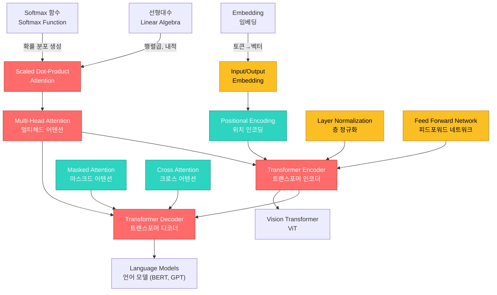

# 16. Transformer & Attention

> **동기부여**: RNN은 순차적으로 처리해야 하므로 병렬화가 불가능하고, 긴 시퀀스에서 정보가 소실된다. Transformer는 Attention만으로 시퀀스를 처리하여 **병렬 연산**, **장거리 의존성 포착**, **확장성(scalability)**을 동시에 달성했다. GPT, BERT, ViT 등 현대 AI의 거의 모든 기반 모델이 Transformer 위에 세워져 있으며, "Attention Is All You Need" [VSP+17] 논문 하나가 딥러닝의 패러다임을 완전히 바꿨다.

---

## 1. 선행 개념 연결 Mermaid 다이어그램



---

## 2. 개념별 5단계 완전 분리 설명

### 개념 1: Attention as Soft Dictionary Lookup (슬라이드 533-535)

#### ① 초등학생 단계
도서관에서 책을 찾는 상황을 생각해보자. "공룡에 대한 책"을 찾고 싶으면(질문=Query), 도서관 책 제목들(Key)을 하나씩 비교한다. 가장 비슷한 책을 찾으면 그 책의 내용(Value)을 읽는다. 하지만 Attention은 **한 권만 고르지 않고, 비슷한 정도에 따라 여러 책 내용을 섞어서** 답을 만든다.

#### ② 중등학생 단계
데이터베이스에서 Key로 Record를 검색하는 것과 비슷하다. 기존 검색은 Key가 정확히 일치하면 1, 아니면 0(hard lookup)이다. Attention은 이를 **미분 가능한 soft lookup**으로 바꾼다. 각 Key와의 유사도를 0~1 사이 값으로 계산하고, 그 가중치로 Value들을 합친다.

#### ③ 고등학생 단계
Hard lookup: $\sum_{j=1}^{N} \mathbf{1}(q = k_j) \, v_j$ (query와 정확히 같은 key의 value만 반환)

Soft lookup: $\sum_{j=1}^{N} [\alpha(q, k_{1:N})]_j \, v_j$ 여기서 $[\alpha(q, k_{1:N})]_j$는 query $q$와 key $k_j$의 **상대적 유사도**로, 모든 key에 대해 합이 1이 되는 확률 분포이다.

#### ④ 대학 단계
Attention weight $A = (\alpha_{ij})$는 다음과 같이 정의된다:

$$\alpha_{ij} \equiv [\alpha(q_i, k_{1:N})]_j := \text{softmax}_j(a(q_i, k_1), a(q_i, k_2), \cdots, a(q_i, k_N))$$

여기서 $a(q, k)$는 유사도(similarity) 함수이다. Softmax를 통해 **row-wise sum = 1** 조건($\sum_j \alpha_{ij} = 1$)이 보장된다. 이는 Nadaraya-Watson 커널 회귀와 동일한 구조로, $f(x) = \sum_j \alpha_j y_j$에서 $\alpha_j \propto \exp(-\|x - x_j\|^2)$인 non-parametric attention과 같다 (슬라이드 537).

#### ⑤ 대학원 단계
Attention은 본질적으로 **kernel smoother의 parametric 일반화**이다. Key-Value 쌍 $\{(k_j, v_j)\}_{j=1}^{N}$이 주어졌을 때, query $q_i$에 대한 출력은:

$$\text{output}_i = \sum_j \alpha_{ij} v_j^\top = A_{i*} V$$

이것은 Value 벡터들의 **convex combination**이다. $\alpha_{ij}$가 softmax를 통해 정의되므로 항상 비음수이고 합이 1이다. 이 구조는 입력에 의존적으로(input-dependent) 어떤 value를 사용할지 **동적으로(dynamically)** 결정한다는 점에서, 고정 가중치의 linear layer와 근본적으로 다르다.

---

### 개념 2: Scaled Dot-Product Attention (슬라이드 531, 536)

#### ① 초등학생 단계
두 문장의 단어끼리 "얼마나 비슷한지" 점수를 매기는 방법이다. 비슷한 단어끼리는 높은 점수, 관련 없는 단어는 낮은 점수를 받는다. 점수가 너무 크면 안 되니까 적당히 나눠서 줄인다.

#### ② 중등학생 단계
두 벡터의 내적(dot product)으로 유사도를 측정한다. 하지만 벡터 차원이 크면 내적 값이 너무 커져서 softmax가 한쪽으로 치우친다. 이를 방지하기 위해 $\sqrt{d_k}$로 나눠준다(scaling).

#### ③ 고등학생 단계
유사도 함수: $a(q, k) = q^\top k / \sqrt{d_k}$ (scaled dot-product attention)

여기서 $q, k \in \mathbb{R}^{d_k}$이다. 행렬 형태로 쓰면:

$$A = \text{softmax}(QK^\top / \sqrt{d_k})$$

이것은 row-wise softmax이다. 최종 출력은 $AV$이다.

#### ④ 대학 단계
$Q \in \mathbb{R}^{N \times d_k}$, $K \in \mathbb{R}^{N \times d_k}$, $V \in \mathbb{R}^{N \times d_v}$일 때:

$$[QK^\top]_{ij} = e_i^\top [QK^\top] e_j = [Q^\top e_i]^\top [K^\top e_j] = q_i^\top k_j$$

따라서 $QK^\top$의 $(i,j)$ 원소가 query $i$와 key $j$의 내적이다. Scaling factor $\sqrt{d_k}$의 이유: $q, k$의 각 원소가 평균 0, 분산 1이면 $q^\top k$의 분산이 $d_k$가 되어, $d_k$가 클수록 softmax의 gradient가 소실된다.

참고: additive attention도 있다: $a(q,k) = w_v^\top \tanh(W_q q + W_k k)$ (슬라이드 536 각주 209).

#### ⑤ 대학원 단계
Scaled dot-product attention의 전체 연산:

$$\text{Attention}(Q, K, V) = \text{softmax}\left(\frac{QK^\top}{\sqrt{d_k}}\right) V$$

**Scaling의 수학적 정당성**: $q_i, k_j$의 원소가 i.i.d.로 평균 0, 분산 1이면 $q_i^\top k_j = \sum_{l=1}^{d_k} q_{il} k_{jl}$의 분산은 $d_k$이다. $\sqrt{d_k}$로 나누면 분산이 1이 되어 softmax가 **uniform distribution에 가까운 gradient**를 유지한다. 이는 학습 초기 gradient flow를 안정화하는 핵심 요소이다.

시간 복잡도: $O(N^2 d_k)$ (Attention 행렬 $N \times N$ 계산) + $O(N^2 d_v)$ (AV 곱) $= O(N^2 d)$. 이 $N^2$ 복잡도가 Transformer의 주요 병목이며, Performer [CLD+21] 등은 $\tilde{A}_{ij} = \phi(q_i)^\top \phi(k_j)$로 low-rank 근사하여 $O(NMD)$로 줄인다 (슬라이드 564).

---

### 개념 3: Multi-Head Attention (슬라이드 538-542)

#### ① 초등학생 단계
한 문장을 읽을 때 "누가?", "뭘?", "언제?" 등 여러 관점에서 동시에 이해하고 싶다. Multi-Head Attention은 **여러 명의 전문가**가 각각 다른 관점에서 문장을 분석하고, 결과를 합치는 것과 같다.

#### ② 중등학생 단계
하나의 Attention은 한 가지 유사도 패턴만 잡는다. 예를 들어 "주어-동사 관계"만 잡을 수 있다. 여러 개의 Attention을 병렬로 실행하면 "주어-동사", "형용사-명사", "시제" 등 **다양한 관계 패턴**을 동시에 학습할 수 있다.

#### ③ 고등학생 단계
입력 $X \in \mathbb{R}^{N \times d}$에 대해 각 head $i$는 별도의 가중치 행렬 $W_i^Q, W_i^K, W_i^V$로 $Q, K, V$를 생성한다:

$$\text{head}_i = \text{Attention}(XW_i^Q, XW_i^K, XW_i^V) \in \mathbb{R}^{N \times d_v}$$

모든 head를 이어붙이고(concatenate) 출력 행렬 $W^O$를 곱한다:

$$\text{MHA}(X) = \text{Concat}(\text{head}_1, \ldots, \text{head}_h) \, W^O$$

#### ④ 대학 단계
원 논문 기준: $d = 512$, $h = 8$, $d_k = d_v = d/h = 64$.

$$X \in \mathbb{R}^{N \times d}, \quad W_i^Q \in \mathbb{R}^{d \times d_k}, \quad W_i^K \in \mathbb{R}^{d \times d_k}, \quad W_i^V \in \mathbb{R}^{d \times d_v}$$

각 head의 출력: $\text{head}_i \in \mathbb{R}^{N \times d_v}$

Concat 결과: $[\text{head}_1; \ldots; \text{head}_h] \in \mathbb{R}^{N \times (h \cdot d_v)}$

출력 프로젝션: $W^O = [W_1; W_2; \ldots; W_h]$ where $W_i \in \mathbb{R}^{d_v \times d_o}$

$$\text{MHA} = \sum_i \text{head}_i \, W_i \in \mathbb{R}^{N \times d_o}$$

슬라이드 538-539의 판서에서 보듯, $Q = XW_Q$, $K = XW_K$, $V = XW_V$ 계산 후 $QK^\top$으로 attention 행렬을 구하고, $X' = AV$를 얻는다. 여러 head의 $X_1', X_2', \ldots, X_h'$를 concat하고 $W_O$를 곱해 최종 출력 $X^{\text{next}} \in \mathbb{R}^{N \times d}$를 얻는다.

#### ⑤ 대학원 단계
일반화된 Multi-Head Attention (슬라이드 541-542):

$$\text{head} = \text{Attention}(QW^Q, KW^K, VW^V) = \phi_s(QW^Q W^{K\top} K^\top / \sqrt{d_k}) \, VW^V$$

$$\text{MHA}(Q, K, V) = \sum_i \phi_s(Q \Sigma_i K^\top) \, VW_i^V W_i$$

여기서 $\Sigma_i = W_i^Q W_i^{K\top} \in \mathbb{R}^{d \times d}$는 각 head가 **서로 다른 유사도 notion**을 학습하도록 한다. MHA를 단순 선형 프로젝션 $XW$로 대체하면 (슬라이드 558)? $\phi_s \to I$, $W = [\tilde{W}_1, \ldots, \tilde{W}_h]$가 되어 **입력 의존적 동적 가중치 결정**이 사라진다 -- 이것이 attention의 핵심 차별점이다.

---

### 개념 4: Positional Encoding (슬라이드 548)

#### ① 초등학생 단계
"나는 밥을 먹었다"와 "밥을 나는 먹었다"는 같은 단어로 구성되지만 뜻이 다르다. Attention은 순서를 모르기 때문에, 각 단어에 **번호표**를 붙여서 순서 정보를 알려준다.

#### ② 중등학생 단계
RNN은 한 단어씩 순서대로 처리하므로 자연스럽게 순서를 안다. 하지만 Attention은 모든 단어를 동시에 보므로 **순서 불변(permutation invariant)**이다. 이 문제를 해결하기 위해 위치 정보를 나타내는 벡터 $P$를 단어 임베딩 $X$에 더한다.

#### ③ 고등학생 단계
$$\text{PE}(X) = X + P$$

RNN의 경우: $h_t^\ell = \phi(W^\ell[h_t^{\ell-1}; h_{t-1}^\ell])$ -- 시간 $t$ 정보가 순환 구조에 내재.

Attention의 경우: $h^\ell = A(h^{\ell-1}) h^{\ell-1}$ -- 순서 정보가 전혀 없다 (**too weak inductive bias**).

원래는 $X$와 $P$를 concatenate해야 하지만, 실제로는 **더하기(add)**를 사용한다.

#### ④ 대학 단계
Sinusoidal Positional Encoding (원 논문):

$$\text{PE}(pos, 2i) = \sin\left(\frac{pos}{10000^{2i/d}}\right), \quad \text{PE}(pos, 2i+1) = \cos\left(\frac{pos}{10000^{2i/d}}\right)$$

위치 $pos$에 대해 차원 $d$짜리 벡터를 생성한다. 장점:
- 학습 파라미터가 없다 (deterministic)
- 임의의 시퀀스 길이로 외삽(extrapolation) 가능
- $\text{PE}(pos+k)$가 $\text{PE}(pos)$의 선형 변환으로 표현 가능하여 상대 위치 학습 용이

#### ⑤ 대학원 단계
Positional encoding이 필요한 근본적 이유: Self-attention 연산 $\text{softmax}(QK^\top)V$는 입력 행렬의 행 순서를 바꿔도 출력의 행 순서만 바뀔 뿐 값은 동일하다 (permutation equivariant). 즉 $f(\Pi X) = \Pi f(X)$. 시퀀스 문제에서 순서는 핵심 정보이므로, 이 **너무 약한 inductive bias**를 보완해야 한다.

최근 대안: Learnable positional embedding (BERT), Rotary Position Embedding (RoPE), ALiBi 등. RoPE는 $q_m = R_\Theta^m x_m$으로 회전 행렬을 곱해 **상대 위치를 내적에 직접 인코딩**한다.

---

### 개념 5: Transformer Encoder 구조 (슬라이드 531, 543-544, 549-550, 559-560)

#### ① 초등학생 단계
Encoder는 문장을 읽고 **내용을 요약하는 역할**이다. 단어들이 서로를 보면서 "이 단어는 저 단어와 관련있다"는 정보를 모아서, 각 단어의 의미를 더 풍부하게 만든다.

#### ② 중등학생 단계
Encoder 한 층은 두 단계로 구성된다:
1. **Self-Attention**: 모든 단어가 서로를 보며 관계 파악 (MHA(X, X, X))
2. **Feed Forward**: 각 단어를 독립적으로 변환 (2층 MLP)

각 단계 후 **Add & Norm**(잔차 연결 + 정규화)을 적용한다. 이 층을 $N$번 반복한다 (원 논문: $N=6$).

#### ③ 고등학생 단계
Encoder Layer 순서:
1. $x = \text{LN}(x + \text{Self-Attention}(x))$ -- Add & Norm $\leftarrow$ Self-Attention
2. $x = \text{LN}(x + \text{FFN}(x))$ -- Add & Norm $\leftarrow$ Feed Forward

Self-Attention: $\text{MHA}(X, X, X)$ -- Q, K, V 모두 같은 입력 $X$

Feed Forward: $d_{\text{model}}(512) \to d_{\text{ff}}(2048) \to d_{\text{model}}(512)$ (슬라이드 550)

Add & Norm: $\text{LN}(X + F(X))$ -- LayerNorm 사용 (BN보다 NLP에서 효과적, 슬라이드 549)

#### ④ 대학 단계
PyTorch 구현 (슬라이드 559-560):

```python
class TransformerEncoderLayer(Module):
    def __init__(self):
        self.self_attn = MultiheadAttention(d_model, nhead)
        self.linear1 = Linear(d_model, dim_feedforward)  # 512 -> 2048
        self.linear2 = Linear(dim_feedforward, d_model)  # 2048 -> 512
        self.norm1 = LayerNorm(d_model)
        self.norm2 = LayerNorm(d_model)

    def forward(self, src):
        x = src
        x = self.norm1(x + self._sa_block(x))   # Add & Norm <- Self-Attention
        x = self.norm2(x + self._ff_block(x))   # Add & Norm <- Feed Forward
        return x
```

하이퍼파라미터: $d_{\text{model}} = 512$, $n_{\text{head}} = 8$, $d_{\text{ff}} = 2048$, $N_{\text{layers}} = 6$, dropout $= 0.1$.

#### ⑤ 대학원 단계
Encoder의 각 층은 $X^{(\ell+1)} = \text{LN}(X^{(\ell)} + \text{FFN}(\text{LN}(X^{(\ell)} + \text{MHA}(X^{(\ell)}, X^{(\ell)}, X^{(\ell)}))))$로 표현된다 (Post-LN 변형). Pre-LN 변형은 학습 안정성이 더 좋다.

핵심 질문 (슬라이드 558): MHA(X, X, X)를 단순 $XW$로 대체하면? 풀어 쓰면 $\text{MHA} = \sum_i \phi_s(X\Sigma_i X^\top) X \tilde{W}_i$인데, $\phi_s \to I$이면 $\sum_i X \Sigma_i X^\top X \tilde{W}_i$가 되어 **attention 행렬이 사라지고 input-dependent weighting이 없어진다**. Self-attention의 핵심 가치는 바로 이 동적 가중치이다.

---

### 개념 6: Transformer Decoder & Cross Attention (슬라이드 545-546, 551-557, 560-561)

#### ① 초등학생 단계
Encoder가 문장을 이해했다면, Decoder는 **새로운 문장을 한 단어씩 만들어내는 역할**이다. 이전에 만든 단어들을 참고하면서, Encoder가 이해한 내용도 참고해서 다음 단어를 결정한다.

#### ② 중등학생 단계
Decoder는 세 가지 핵심 요소가 있다:
1. **Masked Self-Attention**: 미래 단어를 못 보게 가림
2. **Cross Attention**: Encoder의 결과를 참조 (K, V는 Encoder에서, Q는 Decoder에서)
3. **Feed Forward**: 각 위치 독립 변환

#### ③ 고등학생 단계
Decoder Layer 순서:
1. $y = \text{LN}(y + \text{Masked-MHA}(y, y, y))$ -- 자기 자신만 참조 (미래 X)
2. $y = \text{LN}(y + \text{MHA}(y, M, M))$ -- Cross Attention (M은 Encoder 출력)
3. $y = \text{LN}(y + \text{FFN}(y))$

Cross Attention (슬라이드 545-546): $\text{MHA}(Y, M, M)$
- Q = Decoder의 현재 상태 (Y)
- K, V = Encoder의 출력 (M = memory/context)
- Encoder의 정보를 Decoder가 **질의(query)**하여 가져온다

#### ④ 대학 단계
**Masked MHA** (슬라이드 551-552):

$Q, K, V = YW^Q, YW^K, YW^V$에서:

$$[QK^\top]_{ij} = \begin{cases} q_i^\top k_j & \text{if } j \le i \\ -\infty & \text{if } j > i \end{cases}$$

$$A_{ij} = [\text{softmax}(QK^\top / \sqrt{d_k})]_{ij} = \begin{cases} \cdots & \text{if } j \le i \\ 0 & \text{if } j > i \end{cases}$$

따라서 출력 $i$는 과거 입력 $j \le i$에만 의존: $e_i^\top A V = \sum_{j \le i} A_{ij} V_{j*}$

이것은 **하삼각 행렬(lower triangular)** 마스크이며, autoregressive 생성의 핵심이다.

**Teacher Forcing** (슬라이드 555-556): 학습 시 이전 단어로 모델 출력이 아닌 **정답(ground truth) $y_{1:t-1}$**을 입력한다.

$$p(y_{1:m}) = \prod_{t=1}^{m} p(y_t \mid y_{1:t-1})$$

#### ⑤ 대학원 단계
PyTorch Decoder 구현 (슬라이드 560-561):

```python
class TransformerDecoderLayer(Module):
    def __init__(self):
        self.self_attn = MultiheadAttention(d_model, nhead)      # Masked Self-Attn
        self.multihead_attn = MultiheadAttention(d_model, nhead)  # Cross Attn
        # ... norms, FFN ...

    def forward(self, tgt, memory):
        x = tgt
        x = self.norm1(x + self._sa_block(x))          # Masked Self-Attention
        x = self.norm2(x + self._mha_block(x, memory))  # Cross Attention (Q=x, K=V=memory)
        x = self.norm3(x + self._ff_block(x))           # Feed Forward
        return x
```

Cross attention에서 `self.multihead_attn(x, mem, mem)[0]`은 Q, K, V 순서이다. Encoder의 memory가 K, V가 되어 Decoder가 원본 시퀀스의 정보를 attention으로 조회한다. 이 구조는 전통적 seq2seq의 encoder hidden state를 context vector로 요약하던 병목을 해소한다.

---

### 개념 7: Self-Attention vs Cross-Attention (슬라이드 544-546)

#### ① 초등학생 단계
**Self-Attention**: 자기 반 친구들끼리 서로 이야기하면서 정보를 교환하는 것. "나는 네 말이 중요해!" 하면서 서로 주목한다.

**Cross-Attention**: 다른 반 친구에게 질문하는 것. "저기 있는 애한테 물어보자!" 처럼 다른 그룹의 정보를 가져온다.

#### ② 중등학생 단계
- Self-Attention: Q = K = V = X (같은 시퀀스 내부에서 관계 파악)
- Cross-Attention: Q = Y, K = V = M (Decoder가 Encoder에게 질문)

#### ③ 고등학생 단계
|  | Self-Attention | Cross-Attention |
|---|---|---|
| 호출 | MHA(X, X, X) | MHA(Y, M, M) |
| 의미 | 시퀀스 내부 관계 학습 | 두 시퀀스 간 관계 학습 |
| 위치 | Encoder, Decoder 1층 | Decoder 2층 |
| Attention 행렬 | $N \times N$ (같은 길이) | $M_{\text{dec}} \times N_{\text{enc}}$ (다른 길이 가능) |

#### ④ 대학 단계
Self-Attention의 attention 행렬: $A = \text{softmax}(XW^Q W^{K\top} X^\top / \sqrt{d_k})$ -- $X$만 관여

Cross-Attention의 attention 행렬: $A = \text{softmax}(YW^Q W^{K\top} M^\top / \sqrt{d_k})$ -- $Y$와 $M$ 모두 관여

번역 예시 (슬라이드 545): "I am a student" $\to$ "Je suis etudiant"에서 Encoder가 영어를 인코딩한 memory $M$을 생성하고, Decoder는 프랑스어를 생성하면서 Cross-Attention으로 $M$을 참조한다.

#### ⑤ 대학원 단계
Self-attention은 $\Sigma_i = W_i^Q W_i^{K\top}$이 입력 시퀀스 내부의 **pairwise relationship**을 모델링하고, Cross-attention은 **두 모달리티 간의 alignment**를 학습한다. Image captioning에서 CNN이 이미지를 인코딩하고 LSTM이 caption을 생성할 때의 attention과 구조적으로 동일하다 (슬라이드 545 하단 그림). Transformer의 cross-attention이 이 패턴을 일반화한 것이다.

---

### 개념 8: Vision Transformer (ViT) (슬라이드 562-563)

#### ① 초등학생 단계
Transformer는 원래 글을 위해 만들어졌지만, **그림도 작은 조각(패치)으로 나누면** 단어처럼 취급할 수 있다! 이미지를 16x16 조각으로 자른 뒤, 각 조각을 "단어"로 보고 Transformer에 넣는다.

#### ② 중등학생 단계
CNN은 지역적 패턴(local)을 잘 잡지만 전체적인 관계(global)를 보기 어렵다. ViT는 이미지를 패치로 나누고 Transformer Encoder를 적용하여, Self-Attention으로 **멀리 떨어진 패치 간의 관계**도 직접 포착한다.

#### ③ 고등학생 단계
ViT 구조:
1. 이미지를 $P \times P$ 패치로 분할
2. 각 패치를 flatten하여 선형 투영 (Linear Projection)
3. [CLS] 토큰 + Positional Embedding 추가
4. Transformer Encoder 통과
5. [CLS] 토큰의 출력으로 분류 (MLP Head)

#### ④ 대학 단계
CNN vs ViT (슬라이드 562):
- CNN: convolution은 local + translation equivariant
- ViT의 MLP: $\sigma(XW_1)W_2$ -- 각 패치에 독립 적용이므로 local + translation equivariant
- ViT의 Self-Attention: **global** -- 모든 패치 간 상호작용

핵심 관찰 (슬라이드 563): 작은 데이터셋에서는 CNN(ResNet/BiT)이 ViT보다 우수하지만, **대규모 데이터(JFT-300M)에서는 ViT가 CNN을 압도**한다.
- 약한 inductive bias + 많은 데이터 > 강한 inductive bias + 적은 데이터

#### ⑤ 대학원 단계
ViT는 **inductive bias의 양과 데이터 양의 trade-off**를 보여주는 핵심 실험이다. CNN의 locality, translation equivariance는 강한 inductive bias여서 적은 데이터로도 학습이 잘 된다. 반면 ViT의 self-attention은 이런 bias가 없어(weak inductive bias) 데이터가 적으면 과적합하지만, 데이터가 충분하면 더 유연한 패턴을 학습할 수 있다. 이는 bias-variance tradeoff의 실제 사례이다.

---

### 개념 9: Language Models -- BERT & GPT (슬라이드 566-571)

#### ① 초등학생 단계
**BERT**: "빈칸 채우기 게임"을 잘하는 AI. "나는 ___을 먹었다"에서 빈칸에 뭐가 올지 맞추면서 언어를 배운다.

**GPT**: "이야기 이어쓰기"를 잘하는 AI. "옛날 옛적에..."라고 시작하면 뒷이야기를 만들어낸다.

#### ② 중등학생 단계
둘 다 Transformer 기반이지만 방향이 다르다:
- BERT: 양방향(bidirectional). 앞뒤 문맥 모두 활용. **Encoder만** 사용.
- GPT: 단방향(causal). 왼쪽에서 오른쪽으로만. **Decoder만** 사용 (masked attention).

#### ③ 고등학생 단계
**BERT** (슬라이드 569): Masked Language Model (MLM)

$$L(x; \theta) = -\mathbb{E}_m \sum_{i \in m} \log p(x_i \mid x_{-m}; \theta)$$

랜덤 마스크 $m$으로 일부 토큰을 가리고, 나머지로 가린 토큰을 예측. + Next Sentence Prediction (NSP). Transformer Encoder 12층, $d=768$, $h=12$, 110M 파라미터.

**GPT** (슬라이드 571): Causal Language Model

$$p(x_{1:T}) = \prod_{t=1}^{T} p(x_t \mid x_{1:t-1})$$

Transformer Decoder (masked self-attention). GPT-2: WebText, GPT-3: 175B, in-context learning. ChatGPT: + RLHF.

#### ④ 대학 단계
**ELMo** (슬라이드 568): 두 방향 LSTM의 hidden state를 결합한 contextual embedding.

$$L(x;\theta) = -\sum_{t=1}^T [\log p(x_t \mid x_{1:t-1}; \theta_e, \theta_s, \theta^{\to}) + \log p(x_t \mid x_{t+1:T}; \theta_e, \theta_s, \theta^{\leftarrow})]$$

BERT가 ELMo를 대체: RNN $\to$ Transformer, feature-based $\to$ fine-tuning.

**Language Model의 핵심 패러다임** (슬라이드 566): 대규모 텍스트로 비지도 사전학습(pre-train) $\to$ 소규모 레이블 데이터로 지도 미세조정(fine-tune). text $x \mapsto$ latent state $h$ (contextual representation).

#### ⑤ 대학원 단계
BERT의 fine-tuning 적용 범위 (슬라이드 570): single sentence classification, sentence-pair classification, sequence tagging, question answering. [CLS] 토큰을 문장 수준 표현으로 사용.

GPT 계열의 진화: GPT-1 $\to$ GPT-2 (task-specific training 제거, LM만) $\to$ GPT-3 (in-context learning, 175B) $\to$ ChatGPT (RLHF로 human intent alignment). 이 과정은 **scaling law**와 **emergent abilities**의 실증이다.

---

## 3. 오개념 카드 (5+)

### 오개념 1: "Attention에서 Q, K, V는 서로 다른 입력에서 온다"
- **틀림**: Self-Attention에서는 Q, K, V 모두 **같은 입력 $X$**에서 나온다. $Q = XW^Q$, $K = XW^K$, $V = XW^V$. 다른 입력에서 오는 것은 Cross-Attention 한정이다.

### 오개념 2: "Scaling factor $\sqrt{d_k}$는 그냥 정규화를 위한 것이다"
- **부분적**: 단순 크기 조절이 아니라, 내적의 **분산이 $d_k$에 비례**하여 커지는 문제를 해결한다. $d_k$가 크면 softmax 입력이 극단값으로 가서 gradient가 거의 0이 되는(vanishing) 것을 방지하는 것이 핵심이다.

### 오개념 3: "Multi-Head는 같은 Attention을 여러 번 하는 것이다"
- **틀림**: 각 head는 **서로 다른 가중치 행렬** $W_i^Q, W_i^K, W_i^V$를 학습한다. 따라서 각 head가 학습하는 $\Sigma_i = W_i^Q W_i^{K\top}$이 달라, **서로 다른 관계 패턴**을 포착한다.

### 오개념 4: "Positional Encoding은 학습되는 파라미터이다"
- **상황에 따라 다름**: 원 Transformer [VSP+17]은 sinusoidal (고정, 비학습). BERT는 learnable positional embedding을 사용한다. 둘 다 작동하며, sinusoidal은 더 긴 시퀀스로의 외삽이 가능하다는 장점이 있다.

### 오개념 5: "Transformer는 RNN을 완전히 대체했다"
- **과장**: Transformer는 $O(N^2)$ 메모리/연산이 필요하여, 매우 긴 시퀀스에서는 비효율적일 수 있다. RNN 기반 구조(예: RWKV, Mamba 등 SSM 계열)는 $O(N)$ 복잡도로 여전히 연구되고 있다.

### 오개념 6: "Decoder의 Masked Attention은 학습 시에만 사용된다"
- **틀림**: 추론(inference) 시에도 autoregressive 생성을 위해 masked attention이 사용된다. 다만 추론 시에는 한 토큰씩 생성하므로 실제 마스크 형태가 학습 시와 다르다 (KV-cache 사용).

### 오개념 7: "ViT는 항상 CNN보다 좋다"
- **틀림**: 슬라이드 563에서 명확히 보여주듯, **작은 데이터셋**에서는 CNN(BiT/ResNet)이 ViT보다 우수하다. ViT가 CNN을 넘어서려면 대규모 사전학습 데이터(JFT-300M 수준)가 필요하다.

---

## 4. 초등학생에게 설명하기 연습

### "Attention이 뭐야?"
> 친구들이 줄 서서 이야기하고 있다고 해보자. 네가 "점심 뭐 먹지?"라고 물어보면(Query), 각 친구를 쳐다보면서(Key) 누가 맛집을 잘 아는지 확인하고, 맛집을 잘 아는 친구의 대답(Value)에 더 귀를 기울인다. 이게 Attention이야!

### "Multi-Head가 뭐야?"
> 숙제를 할 때 수학 잘하는 친구, 국어 잘하는 친구, 과학 잘하는 친구에게 **동시에** 물어보는 거야. 각 친구가 자기 분야에서 도움을 주고, 네가 모든 답을 합쳐서 최종 답을 만드는 거지!

### "왜 위치 인코딩이 필요해?"
> "나는 너를 좋아해"와 "너를 나는 좋아해"는 느낌이 다르잖아? 그런데 Transformer는 모든 단어를 한꺼번에 보니까 순서를 몰라. 그래서 각 단어에 "1번째", "2번째" 같은 **번호표**를 붙여주는 거야!

### "Encoder와 Decoder는 뭐가 달라?"
> Encoder는 책을 읽고 내용을 이해하는 사람이고, Decoder는 이해한 내용을 바탕으로 새로운 글을 쓰는 사람이야. Decoder는 글을 쓸 때 아직 안 쓴 부분은 모르니까, 이미 쓴 부분만 보면서 다음 글자를 정해!

---

## 5. 수학 <-> 딥러닝 연결 테이블

| 수학 개념 | 수식 | 딥러닝 의미 | 슬라이드 |
|---|---|---|---|
| 내적 (dot product) | $q^\top k$ | Query-Key 유사도 측정 | 536 |
| Softmax | $\text{softmax}(z)_i = e^{z_i} / \sum_j e^{z_j}$ | 유사도 점수를 확률 분포로 변환 (attention weight) | 535 |
| 행렬곱 | $AV$ | Attention weight로 Value의 가중 합산 | 540 |
| 분산 스케일링 | $q^\top k / \sqrt{d_k}$ | 내적의 분산을 1로 정규화하여 gradient 안정화 | 536 |
| Convex combination | $\sum_j \alpha_j v_j$, $\alpha_j \ge 0$, $\sum \alpha_j = 1$ | 값의 부드러운(soft) 선택/혼합 | 534 |
| 커널 회귀 | $f(x) = \sum_j \alpha_j y_j$, $\alpha_j \propto K(x, x_j)$ | Non-parametric attention (Nadaraya-Watson) | 537 |
| 블록 행렬 곱 | $[H_1; \ldots; H_h][W_1; \ldots; W_h]^\top = \sum_i H_i W_i$ | Multi-Head Attention의 concat + 출력 프로젝션 | 542 |
| 하삼각 행렬 | $L_{ij} = 0$ for $j > i$ | Masked attention -- 미래 토큰 차단 (causal) | 551-552 |
| Sinusoidal 함수 | $\sin(\omega t), \cos(\omega t)$ | Positional encoding -- 위치를 주파수 공간에서 표현 | 548 |
| Low-rank 근사 | $\tilde{A} = \Phi_Q \Phi_K^\top$ | Efficient attention (Performer) -- $O(N^2) \to O(NM)$ | 564 |

---

## 6. 킬러 요약

| 핵심 | 한 줄 정리 |
|---|---|
| Attention | **Soft dictionary lookup**: Query로 Key를 검색하고, 유사도에 따라 Value를 가중 합산. $\text{softmax}(QK^\top/\sqrt{d_k})V$ |
| Scaling | $\sqrt{d_k}$로 나누는 이유: 내적 분산이 $d_k$에 비례 $\to$ softmax gradient 소실 방지 |
| Multi-Head | $h$개의 독립 attention을 병렬 실행 $\to$ 다양한 관계 패턴 포착. $\Sigma_i = W_i^Q W_i^{K\top}$이 각 head의 "관점" |
| Positional Encoding | Attention은 permutation equivariant $\to$ 순서 정보 주입 필요. $\text{PE}(X) = X + P$ |
| Encoder | Self-Attention + FFN + Add&Norm $\times N$. 입력 시퀀스의 contextual representation 생성 |
| Decoder | Masked Self-Attn + Cross-Attn + FFN + Add&Norm $\times N$. Autoregressive 생성 |
| Self vs Cross | Self: MHA(X,X,X) -- 내부 관계. Cross: MHA(Y,M,M) -- Encoder 정보 조회 |
| Masked Attention | 미래 위치를 $-\infty$로 마스킹 $\to$ softmax 후 0 $\to$ causal 조건 보장 |
| ViT | 이미지 = 패치 시퀀스. 대규모 데이터에서 weak inductive bias(Transformer) > strong inductive bias(CNN) |
| LLM | BERT(fill-in-the-blank, Encoder) vs GPT(next-token, Decoder). Pre-train + Fine-tune 패러다임 |
