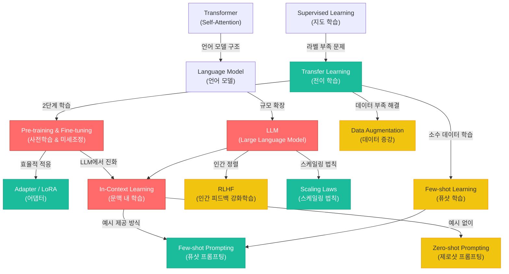

# 17. LLM & In-Context Learning

> **동기부여**: 전통적인 딥러닝은 태스크마다 대규모 라벨 데이터를 수집하고 모델을 처음부터 학습해야 했다. 하지만 LLM(Large Language Model)의 등장은 이 패러다임을 완전히 뒤집었다. 한 번 거대한 데이터로 사전학습한 모델이, 별도의 가중치 업데이트 없이도 프롬프트만으로 새로운 태스크를 수행할 수 있다는 것이다. 이것이 바로 **In-Context Learning**이며, AI 연구의 가장 큰 패러다임 전환(paradigm shift)이다.

---

## 1. 선행 개념 연결 Mermaid 다이어그램



---

## 2. 개념별 5단계 완전 분리 설명

### 개념 1: GPT 계열과 LLM의 진화 (슬라이드 571, 575, 576, 577, 578)

#### (1) 초등학생 단계
GPT는 "글을 잘 쓰는 로봇"이야. 처음에는 짧은 문장만 쓸 수 있었는데, 점점 더 많이 공부해서 지금은 사람처럼 대화하고, 시험도 잘 보는 로봇이 됐어. ChatGPT가 바로 그 로봇이야!

#### (2) 중등학생 단계
GPT는 **G**enerative **P**re-trained **T**ransformer의 약자야. "다음 단어를 예측하는" 방식으로 학습한 언어 모델이지. GPT-2는 웹 텍스트로 학습하고, GPT-3는 1750억 개 파라미터로 훨씬 커졌어. 파라미터가 많아질수록 더 똑똑해지는 경향이 있어.

#### (3) 고등학생 단계
GPT는 Transformer의 **디코더(causal model)**만 사용하는 생성 모델이야. BERT는 양방향(bidirectional)으로 문맥을 보는 반면, GPT는 왼쪽에서 오른쪽으로만 본다(autoregressive). GPT-3에서 처음으로 **In-Context Learning** 능력이 발견됐고, ChatGPT는 여기에 **RLHF**(Reinforcement Learning from Human Feedback)를 더해 인간의 의도에 맞는 응답을 생성하도록 정렬(alignment)했어.

#### (4) 대학 단계
LLM의 발전은 스케일링과 밀접하다. 슬라이드 575의 그래프에서 보듯이, AI 모델의 파라미터 수는 로그 스케일로 기하급수적 증가를 보인다. 2020년 이후 산업계(Industry)가 학계를 추월하며 100B+ 모델을 주도했다. GPT 시리즈는 다음과 같이 진화했다:

| 모델 | 연도 | 파라미터 | 핵심 혁신 |
|------|------|---------|----------|
| GPT-1 | 2018 | 117M | Transformer 기반 사전학습 |
| GPT-2 | 2019 | 1.5B | WebText, task-specific 학습 제거 |
| GPT-3 | 2020 | 175B | In-Context Learning 발견 |
| ChatGPT | 2022 | - | RLHF로 인간 정렬 |

BERT(양방향)와 GPT(단방향)의 아키텍처 차이: BERT는 $p(x_i \mid x_1, \ldots, x_{i-1}, x_{i+1}, \ldots, x_n)$, GPT는 $p(x_i \mid x_1, \ldots, x_{i-1})$로 모델링한다.

#### (5) 대학원 단계
LLM의 핵심은 **스케일링 법칙(Scaling Laws)**이다. Kaplan et al. (2020)에 따르면, 모델 성능(loss $L$)은 파라미터 수 $N$, 데이터 크기 $D$, 계산량 $C$에 대해 거듭제곱 법칙을 따른다:

$$L(N) \propto N^{-\alpha_N}, \quad L(D) \propto D^{-\alpha_D}, \quad L(C) \propto C^{-\alpha_C}$$

슬라이드 576에서 보듯, 다양한 태스크(읽기 이해, 코드 생성, 수학 문제 풀이 등)에서 AI 성능이 인간 수준(0 baseline)을 돌파하는 시점이 2020년대 초반에 집중되어 있다. 특히 ICML 2024(슬라이드 577)에서 LLM이 논문 수 1위 토픽으로, 이 분야의 연구 밀도가 역대 최고임을 보여준다.

---

### 개념 2: LLM 연구 주제 분류 (슬라이드 572, 573)

#### (1) 초등학생 단계
LLM을 연구하는 사람들이 어떤 주제를 공부하는지 정리한 표가 있어. "추론", "안전", "멀티모달" 같은 다양한 주제가 있는데, 최근에는 "추론과 생각의 사슬(Chain-of-Thought)" 연구가 가장 인기가 많아!

#### (2) 중등학생 단계
2023년 이후 LLM 연구에서 가장 뜨거운 주제는 **reasoning과 Chain-of-Thought**(확률 0.066)이야. 그 다음이 vision-language 모델(0.040), 프라이버시와 보안(0.038) 순이지. **In-Context Learning**도 확률 0.028로 주요 연구 주제 중 하나야.

#### (3) 고등학생 단계
슬라이드 573의 전체 표를 보면, 2023년 이전과 이후의 연구 트렌드 변화가 뚜렷해. "Applications of LLMs/ChatGPT"가 가장 높은 증가율(7.84배)을 보이고, "BERT & Embeddings"는 0.29배로 급감했어. 이는 연구 커뮤니티가 **정적 임베딩에서 생성형 모델로** 완전히 전환했음을 의미해.

#### (4) 대학 단계
MBP+23 논문의 토픽 분석에서 $p(\text{topic} \mid \text{since-2023})$ / $p(\text{topic} \mid \text{pre-2023})$ 비율은 연구 트렌드의 급변을 정량화한다. Fine-Tuning & Domain Adaptation(1.62), Prompts & In-Context Learning(1.22) 등은 LLM 시대의 새로운 학습 패러다임을 반영한다.

#### (5) 대학원 단계
토픽 분포의 통계적 유의성($p$-value)을 보면, 거의 모든 주제가 $p < 0.05$로 트렌드 변화가 유의미하다. 특히 Efficiency & Performance($p = 4.1 \times 10^{-6}$)는 LLM의 실용화에서 계산 비용이 핵심 과제임을 보여준다. 이는 Chinchilla 스케일링 법칙(Hoffmann et al., 2022)과 같은 compute-optimal 학습 전략 연구와 직결된다.

---

### 개념 3: Transfer Learning (전이 학습) (슬라이드 586, 588, 589, 591)

#### (1) 초등학생 단계
전이 학습은 "한 과목에서 배운 공부법을 다른 과목에도 써먹는 것"이야. 수학 공부법이 물리학에도 도움이 되는 것처럼, 많은 사진을 본 AI가 새로운 종류의 사진도 잘 구분할 수 있게 돼!

#### (2) 중등학생 단계
데이터가 적으면 모델이 과적합(overfitting)되기 쉬워. 해결책 중 하나가 **전이 학습(Transfer Learning)**이야. 큰 데이터셋으로 먼저 학습(pre-training)하고, 작은 데이터셋에 맞춰 조정(fine-tuning)하는 거지. 예를 들어 수백만 장의 일반 새 사진으로 학습한 모델을 멸종 위기 새 사진 분류에 활용할 수 있어.

#### (3) 고등학생 단계
전이 학습의 핵심 가정은 **소스 도메인** $\mathcal{X}_s$와 **타깃 도메인** $\mathcal{X}_t$가 구조적으로 유사하다는 것이야($\mathcal{X}_s \approx \mathcal{X}_t$). 이는 domain adaptation($\mathcal{X}_s \neq \mathcal{X}_t$)과 구분돼. 실질적으로 사전학습된 모델의 마지막 층(output layer)을 잘라내고 새로운 head를 붙여 학습해.

#### (4) 대학 단계
슬라이드 589의 구조를 보면, 전이 학습의 두 가지 전략이 있다:

1. **Feature Extractor**: 사전학습 가중치를 동결(frozen)하고, 새 head만 학습
2. **Fine-tuning**: 사전학습 가중치를 작은 학습률로 함께 업데이트

수학적으로, 사전학습 파라미터 $\theta_{\text{pre}}$를 초기값으로 사용:

$$\theta^* = \arg\min_\theta \mathcal{L}_{\text{target}}(\theta) \quad \text{s.t. } \theta_0 = \theta_{\text{pre}}$$

사전학습에는 **지도 학습**(예: ImageNet)과 **자기지도 학습**(self-supervised learning)이 있으며(슬라이드 591), 라벨 없는 데이터가 풍부하므로 자기지도 학습이 더 확장성이 높다.

#### (5) 대학원 단계
전이 학습의 이론적 기반은 **표현 학습(representation learning)** 관점에서 이해할 수 있다. 사전학습이 학습하는 것은 입력 공간의 좋은 표현(representation) $\phi: \mathcal{X} \to \mathcal{Z}$이다. Ben-David et al. (2010)의 domain adaptation 이론에 따르면:

$$\epsilon_t(h) \leq \epsilon_s(h) + d_{\mathcal{H}\Delta\mathcal{H}}(\mathcal{D}_s, \mathcal{D}_t) + \lambda$$

여기서 $\epsilon_t$는 타깃 에러, $\epsilon_s$는 소스 에러, $d_{\mathcal{H}\Delta\mathcal{H}}$는 도메인 간 발산, $\lambda$는 이상적 결합 에러다. 소스와 타깃의 구조적 유사성이 높을수록 전이가 효과적이다.

---

### 개념 4: Adapter 기반 효율적 미세조정 (슬라이드 590)

#### (1) 초등학생 단계
큰 로봇의 뇌를 통째로 바꾸는 대신, 작은 "변환기"를 끼워넣어서 새로운 일을 할 수 있게 하는 거야. 마치 레고 블록 하나만 바꿔서 새로운 모양을 만드는 것처럼!

#### (2) 중등학생 단계
사전학습된 거대한 모델의 파라미터는 그대로 두고, 각 층에 작은 **어댑터(Adapter)** 모듈만 추가해서 학습하는 방법이야. 전체 모델을 다시 학습하는 것보다 훨씬 적은 파라미터만 업데이트하면 돼.

#### (3) 고등학생 단계
Houlsby et al. (2019)의 어댑터는 Transformer의 각 레이어에 두 개의 **bottleneck MLP**를 삽입해. 구조는 다음과 같아:
- Feed-forward down-project (차원 축소)
- Nonlinearity (활성 함수)
- Feed-forward up-project (차원 복원)
- Skip connection (잔차 연결)

어댑터, layer norm 파라미터, 최종 출력 head만 학습하고 나머지는 전부 동결(frozen)해.

#### (4) 대학 단계
어댑터의 핵심은 **파라미터 효율성(parameter efficiency)**이다. 원본 모델 파라미터 수를 $|\Theta|$, 어댑터 파라미터를 $|\theta_A|$라 하면, $|\theta_A| \ll |\Theta|$이다. Bottleneck 차원 $d$를 조절하면:

$$\theta_A: \mathbb{R}^h \xrightarrow{W_{\text{down}} \in \mathbb{R}^{d \times h}} \mathbb{R}^d \xrightarrow{\sigma} \mathbb{R}^d \xrightarrow{W_{\text{up}} \in \mathbb{R}^{h \times d}} \mathbb{R}^h$$

추가 파라미터: $2 \times d \times h$ (편향 제외). $d = 64$, $h = 768$이면 약 100K 파라미터로 태스크 적응이 가능하다.

#### (5) 대학원 단계
어댑터는 **PEFT(Parameter-Efficient Fine-Tuning)** 패밀리의 시초 격이다. 이후 LoRA(Low-Rank Adaptation, Hu et al., 2021)는 가중치 행렬의 업데이트를 저랭크 분해로 표현한다:

$$W' = W + \Delta W = W + BA, \quad B \in \mathbb{R}^{h \times r}, A \in \mathbb{R}^{r \times h}$$

여기서 $r \ll h$이므로 학습 파라미터가 $O(rh)$로 줄어든다. Prefix Tuning, Prompt Tuning 등도 같은 PEFT 철학을 공유하며, LLM 시대에 full fine-tuning의 계산 비용($O(|\Theta|)$)을 회피하는 핵심 기법이다.

---

### 개념 5: Pre-training & Fine-tuning 패러다임 (슬라이드 571, 588, 589, 591)

#### (1) 초등학생 단계
AI가 공부하는 방법이 두 단계야. 먼저 "기초 교양"을 엄청 많이 공부하고(사전학습), 그 다음에 "전공 과목"을 집중적으로 공부하는 거야(미세조정). 기초가 탄탄하면 전공도 빨리 배울 수 있어!

#### (2) 중등학생 단계
**Pre-training(사전학습)**: 인터넷에 있는 수십억 개의 문장으로 "다음 단어 맞추기" 게임을 해. 이 과정에서 문법, 상식, 추론 능력을 저절로 배우게 돼.
**Fine-tuning(미세조정)**: 사전학습된 모델을 특정 작업(번역, 감정 분석 등)에 맞게 소량의 라벨 데이터로 추가 학습해.

#### (3) 고등학생 단계
GPT-2(슬라이드 571)는 이 패러다임의 전환점이야. 이전에는 task-specific 학습이 필수였지만, GPT-2 저자들은 "그냥 언어 모델로만 학습하면 된다"고 주장했어. WebText라는 대규모 웹 코퍼스로 학습한 결과, fine-tuning 없이도 여러 태스크에서 좋은 성능을 보였지.

#### (4) 대학 단계
사전학습의 목적함수:

- **Causal LM (GPT 계열)**: $\mathcal{L} = -\sum_{t=1}^{T} \log p(x_t \mid x_{<t}; \theta)$
- **Masked LM (BERT 계열)**: $\mathcal{L} = -\sum_{i \in \mathcal{M}} \log p(x_i \mid x_{\backslash \mathcal{M}}; \theta)$

Fine-tuning에서는 task-specific head를 추가하고, 전체 또는 일부 파라미터를 업데이트:

$$\theta_{\text{ft}} = \theta_{\text{pre}} - \eta \nabla_\theta \mathcal{L}_{\text{task}}(\theta_{\text{pre}})$$

슬라이드 589에서 보듯, 하위 레이어(Layer 1 ~ L-1)는 복사(copy)하고, 출력 레이어만 랜덤 초기화하여 처음부터(train from scratch) 학습한다.

#### (5) 대학원 단계
Pre-training이 왜 효과적인가에 대한 이론적 설명은 여러 관점이 있다:

1. **최적화 관점**: 사전학습은 loss landscape에서 좋은 basin을 찾아주는 역할. Fine-tuning은 이 basin 내에서 task-specific minimum으로 이동.
2. **정보 이론 관점**: 사전학습은 데이터 분포 $p(x)$의 풍부한 표현을 학습하며, 이는 조건부 분포 $p(y|x)$ 학습에 정보론적 이점을 제공한다.
3. **PAC-Bayes 관점**: 사전학습된 초기화 $\theta_{\text{pre}}$는 informative prior 역할을 하여, generalization bound를 타이트하게 만든다:

$$\mathcal{L}_{\text{gen}} \leq \hat{\mathcal{L}} + \sqrt{\frac{KL(q(\theta) \| p(\theta)) + \log(n/\delta)}{2n}}$$

여기서 $p(\theta) = \mathcal{N}(\theta_{\text{pre}}, \sigma^2 I)$로 설정하면, fine-tuned 파라미터 $q(\theta)$와의 KL 발산이 작아져 일반화 보장이 강해진다.

---

### 개념 6: In-Context Learning (ICL) (슬라이드 579, 580, 582)

#### (1) 초등학생 단계
시험 볼 때 선생님이 "예시 문제와 답"을 보여주면 비슷한 문제를 풀 수 있잖아? ICL도 그래! AI에게 몇 가지 예시를 보여주면, 가중치를 바꾸지 않고도 새로운 문제를 풀 수 있어.

#### (2) 중등학생 단계
**In-Context Learning**은 모델에게 입력(프롬프트) 안에 예시를 넣어주는 것만으로 새로운 태스크를 수행하는 방법이야. 예를 들어:
- "Contains no wit... -> Negative"
- "Very good viewing... -> Positive"
- "A smile on your face -> ???"

이렇게 예시를 보여주면 모델이 패턴을 파악해서 "Positive"라고 답해!

#### (3) 고등학생 단계
ICL의 놀라운 점은 **가중치 업데이트(gradient update)가 전혀 없다**는 거야. 슬라이드 580에서 보여주듯, gold label(정답)로 예시를 주든 random label(무작위)로 주든 성능이 비슷해! 이건 ICL이 단순히 입출력 매핑을 외우는 게 아니라, 태스크의 **형식(format)**과 **분포(distribution)**를 파악하는 것임을 시사해.

#### (4) 대학 단계
ICL은 수학적으로 다음과 같이 정의된다. 데모 집합 $\mathcal{D} = \{(x_1, y_1), \ldots, (x_k, y_k)\}$와 질의 $x_q$가 주어지면:

$$\hat{y} = \arg\max_y p(y \mid x_1, y_1, \ldots, x_k, y_k, x_q; \theta)$$

여기서 $\theta$는 고정(frozen)이다. 이 과정에서 gradient를 계산하지 않으므로, 추론(inference) 시에만 발생하며 학습 시간이 0이다. 슬라이드 580의 "Demos w/ gold labels $\approx$ Demos w/ random labels" 결과는 Min et al. (2022)의 연구로, ICL에서 라벨 정확성보다 입력 분포와 형식이 더 중요함을 실증적으로 보여준다.

#### (5) 대학원 단계
ICL의 메커니즘에 대한 이론적 연구는 활발하다:

1. **Implicit gradient descent 가설** (Akyurek et al., 2022; von Oswald et al., 2023): Transformer의 attention 연산이 암묵적으로 경사 하강법을 수행한다. 단일 선형 attention 레이어에서:

$$\text{Attn}(Q, K, V) = \text{softmax}\left(\frac{QK^\top}{\sqrt{d}}\right)V$$

이는 최소 자승법의 한 스텝과 동치임을 보일 수 있다.

2. **Bayesian inference 가설** (Xie et al., 2021): ICL은 사전학습에서 학습한 잠재 개념(latent concept) $z$에 대한 베이지안 추론으로 해석된다:

$$p(y \mid x_q, \mathcal{D}) = \int p(y \mid x_q, z) p(z \mid \mathcal{D}) dz$$

3. **Task vector 가설**: 데모가 모델 내부에서 "task vector"를 형성하여, 해당 태스크에 맞는 연산을 활성화시킨다.

---

### 개념 7: Few-shot / Zero-shot Prompting (슬라이드 579, 580, 582)

#### (1) 초등학생 단계
- **Zero-shot**: 예시 없이 바로 질문하는 것. "이 문장은 긍정이야 부정이야?"
- **One-shot**: 예시 하나만 보여주고 질문하는 것
- **Few-shot**: 예시 2~5개를 보여주고 질문하는 것

예시가 많을수록 AI가 더 잘 이해해!

#### (2) 중등학생 단계
GPT-3 논문에서 처음 체계적으로 연구된 개념이야. 같은 모델이라도 프롬프트에 예시를 몇 개 주느냐에 따라 성능이 크게 달라져. 중요한 건 **모델 크기가 클수록** few-shot의 효과가 더 크다는 거야.

#### (3) 고등학생 단계
슬라이드 579와 582에서 보여주는 **Regular ICL** 형식:
```
[리뷰1] \n [라벨1]
[리뷰2] \n [라벨2]
[질의 리뷰] \n ___
```
이 형식(format)이 핵심이야. 슬라이드 580의 실험 결과는 충격적인데, gold label과 random label의 성능 차이가 크지 않아. 이는 ICL이 "라벨을 외우는 것"이 아니라 "태스크 형식을 이해하는 것"에 가깝다는 증거야.

#### (4) 대학 단계
Few-shot prompting의 성능은 여러 요인에 의존한다:

1. **데모 선택(demonstration selection)**: 어떤 예시를 고르느냐
2. **데모 순서(demonstration ordering)**: 예시의 배치 순서
3. **프롬프트 형식(prompt template)**: 어떤 포맷으로 제시하느냐

수학적으로 $k$-shot 성능:

$$\text{Perf}(k) = f(\text{model size}, k, \text{demo quality}, \text{template})$$

GPT-3 논문에서는 모델 크기 $N$과 shot 수 $k$의 상호작용을 관찰:
- 작은 모델: few-shot 효과 미미
- 큰 모델: few-shot에서 급격한 성능 향상 (emergence)

#### (5) 대학원 단계
Few-shot prompting의 **emergent ability**는 스케일링과 관련하여 Wei et al. (2022)에서 체계적으로 연구되었다. 특정 태스크에서 모델 크기가 임계점을 넘으면 성능이 급격히 향상되는 phase transition이 관찰된다:

$$\text{Acc}(N) = \begin{cases} \text{chance level} & N < N_c \\ \text{above chance} & N \geq N_c \end{cases}$$

그러나 Schaeffer et al. (2024)는 이러한 emergence가 비선형 메트릭의 아티팩트일 수 있음을 주장했다. 선형 메트릭(예: Brier score)을 사용하면 연속적인 성능 향상이 관찰된다는 것이다. 이 논쟁은 LLM 능력의 본질에 대한 근본적 질문이다.

---

### 개념 8: Context Window와 Long-context LLM (슬라이드 581)

#### (1) 초등학생 단계
사람도 한꺼번에 많은 것을 기억하기 어렵잖아? AI도 마찬가지야. **context window**는 AI가 한 번에 읽을 수 있는 글의 양이야. 더 많이 읽을 수 있으면 더 복잡한 일을 할 수 있어!

#### (2) 중등학생 단계
LLM마다 한 번에 처리할 수 있는 텍스트 길이가 달라:
- Gemini 1.0 Pro: 32K 토큰
- GPT-4 Turbo: 128K 토큰
- Claude 2.1: 200K 토큰
- Gemini 1.5 Pro: **1M 토큰** (연구에서는 10M까지!)

1M 토큰이면 1시간 분량의 비디오, 11시간의 오디오, 3만 줄의 코드, 70만 단어를 한 번에 처리할 수 있어.

#### (3) 고등학생 단계
Context window가 커지면 ICL에서 더 많은 예시를 제공하거나, 더 긴 문서를 분석할 수 있어. 하지만 Transformer의 self-attention은 시퀀스 길이 $n$에 대해 $O(n^2)$의 계산 복잡도를 가지므로, 긴 컨텍스트 처리에는 엄청난 계산 비용이 들어.

#### (4) 대학 단계
Long-context 처리를 위한 기술적 혁신:

1. **Sparse Attention**: Full attention 대신 특정 패턴만 계산
2. **Ring Attention**: 시퀀스를 분할하여 여러 디바이스에 분산
3. **RoPE (Rotary Position Embedding)** 확장: 학습 시 사용하지 않은 위치에 대한 외삽(extrapolation) 가능

Gemini 1.5 Pro의 1M 토큰 context는 Mixture of Experts (MoE) 아키텍처와 결합하여 효율성을 유지한다.

#### (5) 대학원 단계
Long-context LLM의 핵심 과제는 **"needle in a haystack"** 문제다. 컨텍스트가 길어질수록, 중간에 위치한 정보를 정확히 검색하는 능력이 저하된다(Liu et al., 2024의 "Lost in the Middle" 현상). 이는 attention의 entropy가 시퀀스 길이에 따라 증가하여, 특정 토큰에 대한 집중도가 분산되기 때문이다:

$$\text{Attn}(q, K) = \text{softmax}\left(\frac{qK^\top}{\sqrt{d}}\right) \to \text{uniform as } n \to \infty$$

이를 해결하기 위해 ALiBi, YaRN 등의 위치 임베딩 기법과 retrieval-augmented 접근이 연구되고 있다.

---

## 3. 오개념 카드 (5+)

| # | 오개념 | 올바른 이해 |
|---|--------|------------|
| 1 | "LLM은 단순히 파라미터가 많은 모델이다" | 파라미터 수만으로는 LLM의 능력을 설명할 수 없다. **학습 데이터의 양과 질**, **학습 방법(pre-training objective)**, **스케일링 법칙**의 조합이 중요하다. Chinchilla 연구는 파라미터 수보다 데이터-파라미터 비율의 최적화가 핵심임을 보여주었다. |
| 2 | "ICL은 모델이 예시에서 새로 학습하는 것이다" | ICL에서는 **가중치가 전혀 업데이트되지 않는다**. 모델은 사전학습 시 이미 학습한 능력을 프롬프트를 통해 *활성화*하는 것이다. gradient를 계산하지 않으므로 전통적 의미의 "학습"이 아니다. |
| 3 | "Few-shot에서 라벨이 정확해야 성능이 좋다" | 슬라이드 580의 실험(Min et al., 2022)에서 **gold label과 random label의 성능 차이가 미미**했다. ICL은 라벨 정확성보다 입력의 **분포(distribution)**와 **형식(format)**에서 태스크 정보를 추출한다. |
| 4 | "Fine-tuning은 항상 전체 모델을 업데이트해야 한다" | Adapter, LoRA 등 **PEFT** 기법으로 전체 파라미터의 1% 미만만 업데이트해도 full fine-tuning에 근접한 성능을 달성할 수 있다. LLM 시대에 full fine-tuning은 비용 면에서 비현실적인 경우가 많다. |
| 5 | "Transfer learning에서는 원본과 타깃 태스크가 같아야 한다" | 소스와 타깃이 완전히 같을 필요는 없다. 핵심은 **고수준 구조적 유사성(high-level structural similarity)**이다. ImageNet으로 학습한 특징이 의료 영상에도 유용한 것처럼, 추상적 표현이 전이된다. |
| 6 | "Context window가 크면 무조건 좋다" | 컨텍스트가 길어지면 $O(n^2)$ 계산 비용이 급증하고, "Lost in the Middle" 현상으로 중간 정보 검색 정확도가 떨어질 수 있다. 효과적인 정보 검색(RAG)이 무한 컨텍스트보다 실용적일 수 있다. |

---

## 4. 초등학생에게 설명하기 연습

### Q1: "LLM이 뭐예요?"
> 도서관에 있는 책을 전부 읽은 엄청 머리 좋은 친구가 있다고 상상해봐. 그 친구한테 아무 질문이나 하면, 읽었던 책 내용을 떠올리면서 대답해줘. LLM은 인터넷에 있는 거의 모든 글을 읽고 "다음에 올 말이 뭘까?" 게임을 수십억 번 한 AI야. 그래서 사람처럼 글을 쓰고 질문에 답할 수 있게 된 거지!

### Q2: "전이 학습이 뭐예요?"
> 피아노를 잘 치는 사람이 처음 보는 기타도 빨리 배울 수 있는 이유가 뭘까? 음악의 기본 원리(박자, 화음 등)를 이미 알고 있으니까! 전이 학습도 마찬가지야. AI가 한 가지 일을 잘하도록 배운 "기본 실력"을, 새로운 일을 배울 때 처음부터 시작하지 않고 활용하는 거야.

### Q3: "ICL은 뭐예요?"
> 수학 시험에서 "예시 문제: 2+3=5, 4+1=5" 이렇게 보여주면, "3+2=?"도 답할 수 있잖아? AI한테도 "이 리뷰는 좋은 거야, 이 리뷰는 나쁜 거야" 이렇게 예시를 보여주면, 새로운 리뷰도 좋은지 나쁜지 맞출 수 있어. 특별한 추가 공부 없이 예시만 보고!

---

## 5. 수학 <-> 딥러닝 연결 테이블

| 수학 개념 | 수식 | 딥러닝에서의 역할 | 관련 슬라이드 |
|-----------|------|------------------|-------------|
| **조건부 확률** | $p(x_t \mid x_{<t})$ | Autoregressive LM의 핵심. 이전 토큰이 주어졌을 때 다음 토큰의 확률 | 571 |
| **최대우도추정 (MLE)** | $\theta^* = \arg\max_\theta \sum_t \log p(x_t \mid x_{<t}; \theta)$ | 사전학습 목적함수. 텍스트 코퍼스의 우도를 최대화 | 571, 585 |
| **KL Divergence** | $KL(p_E \| p_\theta) = CE(p_E, p_\theta) - Ent(p_E)$ | 모델 분포와 실제 분포의 차이 측정. 사전학습 손실의 이론적 기반 | 585 |
| **Cross-Entropy Loss** | $-\frac{1}{|E|}\sum_i e_{y_i}^\top \log h(x_i)$ | 분류(classification) 태스크의 표준 손실함수 | 585 |
| **거듭제곱 법칙 (Power Law)** | $L(N) \propto N^{-\alpha}$ | 스케일링 법칙: 모델 크기와 성능의 관계를 설명하는 경험적 법칙 | 575 |
| **Softmax / Attention** | $\text{softmax}\left(\frac{QK^\top}{\sqrt{d}}\right)V$ | Transformer의 핵심 연산. ICL에서 암묵적 경사하강법 역할 가능 | 579, 582 |
| **저랭크 근사 (Low-Rank)** | $\Delta W = BA,\ B \in \mathbb{R}^{h \times r}$ | LoRA: 가중치 업데이트를 저랭크 행렬로 근사하여 PEFT 실현 | 590 |
| **베이즈 정리** | $p(z \mid \mathcal{D}) \propto p(\mathcal{D} \mid z)p(z)$ | ICL의 Bayesian 해석: 데모로부터 잠재 태스크를 추론 | 579, 582 |

---

## 6. 킬러 요약

```
LLM & In-Context Learning 한 장 요약
==========================================

[1] LLM의 진화: GPT-1(117M) -> GPT-2(1.5B) -> GPT-3(175B) -> ChatGPT(+RLHF)
    - 핵심: 스케일링 법칙 L(N) ~ N^(-alpha) ... 크면 클수록 새로운 능력 출현

[2] Pre-training & Fine-tuning:
    - Pre-train: 대규모 비라벨 데이터 -> "다음 토큰 예측" -> 범용 표현 학습
    - Fine-tune: 소규모 라벨 데이터 -> task-specific head 학습
    - 핵심 가정: source ≈ target (구조적 유사성)

[3] Transfer Learning 전략:
    ┌─ Feature Extractor: 하위 레이어 동결, head만 학습
    ├─ Full Fine-tuning: 전체 가중치 작은 lr로 업데이트
    └─ PEFT (Adapter/LoRA): 소수 파라미터만 추가/수정 (1% 미만)

[4] In-Context Learning (ICL):
    - 가중치 업데이트 ZERO! 프롬프트에 예시만 제공
    - gold label ≈ random label (형식과 분포가 핵심)
    - 이론: 암묵적 gradient descent / Bayesian inference / task vector

[5] Few-shot Prompting:
    - 0-shot < 1-shot < few-shot (대체로)
    - 모델이 클수록 few-shot 효과 극대화 (emergence)
    - 데모 선택, 순서, 형식 모두 성능에 영향

[6] Context Window:
    - 32K(Gemini 1.0) -> 128K(GPT-4) -> 1M(Gemini 1.5)
    - 길수록 좋지만 O(n^2) 비용 + "Lost in the Middle" 주의

기억할 핵심 공식:
  - Autoregressive LM: p(x) = Π p(x_t | x_{<t})
  - Scaling Law: L(N) ~ N^(-alpha)
  - Adapter: x -> W_down -> σ -> W_up -> x + residual
  - LoRA: W' = W + BA (r << h)
  - ICL: ŷ = argmax_y p(y | x_1,y_1,...,x_k,y_k, x_q; θ_frozen)
```
