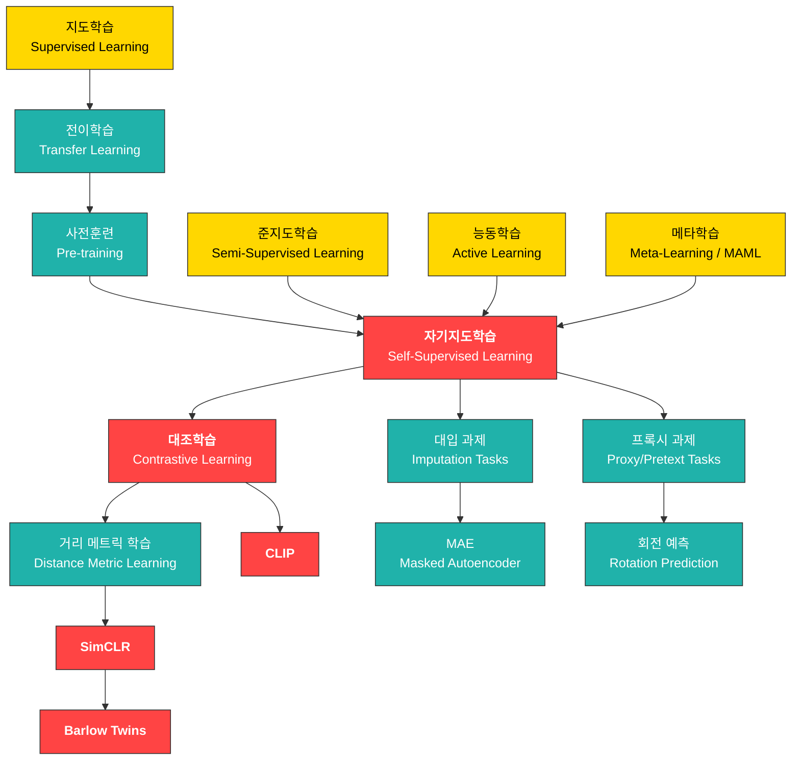

# 18. 자기지도학습 (Self-Supervised Learning)

> **동기부여**: 현실 세계의 데이터 대부분은 레이블이 없다. 인간도 시각을 배울 때 누군가가 매번 정답을 알려주는 것이 아니라 "그냥 본다". Geoffrey Hinton(1996)의 말처럼 뇌의 $10^{14}$개 신경 연결을 $10^9$초의 수명 동안 채우려면 초당 $10^5$비트의 정보가 필요하고, 그 정보는 **입력 자체**에서 올 수밖에 없다. Yann LeCun의 "케이크 비유"에서 자기지도학습은 케이크의 본체(genoise)이고, 지도학습은 아이싱, 강화학습은 체리에 불과하다. 자기지도학습은 레이블 없이 데이터 자체의 구조를 학습하여 **범용 표현(representation)**을 얻는 미래의 핵심 패러다임이다.

---

## 1. 선행 개념 연결 Mermaid 다이어그램

---

## 2. 개념별 5단계 완전 분리 설명

### 개념 1: 자기지도학습 개요 (Self-Supervised Learning) (슬라이드 598-600)

#### (1) 초등학생 단계
퍼즐 놀이를 상상해 보자. 아무도 정답을 알려주지 않지만, 퍼즐 조각을 맞추다 보면 그림이 어떻게 생겼는지 저절로 알게 된다. 자기지도학습은 컴퓨터가 스스로 퍼즐을 만들어서 푸는 것이다. 사진의 일부를 가리고 "여기에 뭐가 있을까?" 하고 맞추면서 세상을 배운다.

#### (2) 중등학생 단계
지도학습은 사람이 일일이 "이건 고양이, 이건 강아지"라고 정답(레이블)을 달아줘야 한다. 하지만 인터넷에는 레이블 없는 이미지와 텍스트가 넘쳐난다. 자기지도학습은 데이터 자체에서 "가짜 레이블"을 만들어 학습한다. 예를 들어, 문장에서 단어를 지우고 맞추기(BERT의 방식)나 이미지 일부를 가리고 복원하기 같은 과제를 스스로 설정한다.

#### (3) 고등학생 단계
자기지도학습(SSL)은 **레이블을 알고리즘이 스스로 생성**하는 학습 방식이다. 핵심 아이디어는 **task-agnostic representation**을 배우는 것이다. 세 가지 주요 접근법이 있다:
- **대입 과제(Imputation)**: 입력의 일부를 가리고 복원 (예: MAE)
- **프록시 과제(Pretext)**: 변환 관계를 예측 (예: 회전 각도 맞추기)
- **대조 과제(Contrastive)**: 같은 이미지의 변환은 가깝게, 다른 이미지는 멀게

#### (4) 대학 단계
Yann LeCun의 케이크 비유(슬라이드 598)에서 SSL은 샘플당 수백만 비트의 정보를 학습하는 **케이크 본체**이다. 형식적으로, 입력 $x = (x_h, x_v)$에서 hidden part $x_h$와 visible part $x_v$로 분리하고, 모델 $\hat{x}_h = f(x_v, x_h = 0)$으로 숨겨진 부분을 예측한다. 이를 통해 인코더 $f(\cdot; \theta)$가 **범용 표현**을 학습하며, 이 표현은 downstream task에 전이된다. SSL의 핵심 차이는 감독 신호(supervisory signal)가 **데이터 내부 구조**에서 나온다는 것이다.

#### (5) 대학원 단계
SSL의 이론적 기반은 **정보 이론**과 연결된다. 입력 $x$의 mutual information $I(x_v; x_h)$를 최대화하는 표현을 학습하는 것으로 볼 수 있다. 최근 연구는 SSL의 표현 품질이 augmentation의 선택에 크게 의존한다는 것을 보였으며(augmentation invariance hypothesis), pretext task의 설계가 학습되는 불변성(invariance)의 종류를 결정한다. 2016년 NeurIPS에서 "unsupervised learning"이라 불리던 것이 현재는 "self-supervised learning"으로 재명명되었으며, 이는 학습 신호가 완전히 부재하는 것이 아니라 **자동 생성**된다는 점을 강조한다.

---

### 개념 2: 대입 과제와 MAE (Imputation Tasks & Masked Autoencoder) (슬라이드 601-603)

#### (1) 초등학생 단계
가리기 놀이를 해보자! 사진의 대부분을 종이로 가리고, 보이는 작은 부분만으로 가려진 곳에 뭐가 있는지 맞추는 게임이다. 컴퓨터도 이렇게 하면서 사물의 모양을 배운다.

#### (2) 중등학생 단계
시험 문제 중 "빈칸 채우기"와 같다. 문장에서 핵심 단어를 지우고 맞추려면, 문맥을 이해해야 한다. 마찬가지로, 이미지에서 패치를 지우고 복원하려면 이미지의 전체 구조를 이해해야 한다. 이것이 **Masked Autoencoder(MAE)**의 원리이다.

#### (3) 고등학생 단계
대입 과제의 핵심 구조:
- 입력: $x = (x_h, x_v)$ (hidden + visible)
- 목표: visible part만으로 hidden part를 예측: $\hat{x}_h = f(x_v, x_h = 0)$
- NLP의 cloze task(빈칸 채우기)가 대표적 예시
- 시간적 예측: 과거에서 미래를, 현재에서 과거를 예측

#### (4) 대학 단계
**MAE (Masked Autoencoder, He et al. 2022)**는 비전 분야의 대표적 대입 과제 방법이다:
1. 이미지를 패치로 분할하고, **75%를 무작위로 마스킹**
2. 가시 패치(25%)만 인코더(ViT)에 입력
3. 마스크 토큰을 추가한 후 가벼운 디코더로 원본 픽셀을 복원
4. 사전훈련 후 디코더를 버리고 인코더만 downstream에 활용

핵심 설계: 인코더는 가시 패치만 처리하므로 계산량이 크게 줄고, 높은 마스킹 비율이 과제를 어렵게 만들어 더 의미 있는 표현을 학습하게 한다.

#### (5) 대학원 단계
MAE의 성공은 **비전과 언어의 비대칭성**을 이해한 데 있다. 언어에서 토큰은 의미 단위(semantic token)이므로 15% 마스킹으로도 어렵다. 반면 이미지 패치는 공간적 중복(spatial redundancy)이 높아 75%를 마스킹해야 trivial interpolation을 방지할 수 있다. Context Encoder [PKD+16] (슬라이드 602)가 초기 연구로, channel-wise fully connected layer를 사용해 인페인팅을 수행했다. MAE는 이를 ViT 아키텍처로 확장하여 대규모 사전훈련을 실현했으며, 이미지넷에서 supervised pre-training에 필적하는 성능을 보였다.

---

### 개념 3: 프록시 과제 (Proxy/Pretext Tasks) (슬라이드 604-605)

#### (1) 초등학생 단계
그림 조각을 섞어 놓고 "이 조각이 원래 그림의 어디에 있었을까?"를 맞추는 게임이다. 또는 사진을 돌려놓고 "몇 도 돌아갔는지" 맞추기! 이런 놀이를 하면서 컴퓨터는 그림의 내용을 자연스럽게 이해하게 된다.

#### (2) 중등학생 단계
프록시 과제는 "진짜 목표 대신 우회 문제를 풀어서 능력을 키우는 것"이다. 예를 들어, 수학 실력을 기르기 위해 퍼즐을 푸는 것처럼:
- **회전 예측**: 0, 90, 180, 270도 중 어느 각도로 돌렸는지 맞추기
- **상대 위치 예측**: 이미지 패치 두 개의 위치 관계 맞추기

#### (3) 고등학생 단계
프록시 과제의 수학적 구조 (슬라이드 604):
- 원본 이미지 $x_1$에 변환 $t$를 적용하여 $x_2 = t(x_1)$ 생성
- 표현 함수 $f$로 특징 추출: $f(x_1), f(x_2)$
- 관계 함수 $r$로 변환 관계 예측: $p(y \mid x_1, x_2) = p(y \mid r[f(x_1), f(x_2)])$
- $y$는 $x_1$과 $x_2$ 사이의 관계를 나타내는 레이블 (예: 회전 각도)

핵심: $f$가 좋은 표현을 학습해야만 $y$를 정확히 예측할 수 있다.

#### (4) 대학 단계
Gidaris et al. [GSK18]의 **회전 예측** (슬라이드 604):
- 이미지를 {0, 90, 180, 270}도 회전시켜 4-class 분류 문제로 변환
- ConvNet이 회전 각도를 맞추려면 물체의 의미적 특징(위/아래, 중력 방향 등)을 이해해야 함

Doersch et al. [DGE15]의 **상대 위치 예측** (슬라이드 605):
- 이미지를 3x3 그리드로 나누고, 중앙 패치 기준 주변 패치의 상대 위치(8가지) 맞추기
- 공간적 맥락 이해가 필요

#### (5) 대학원 단계
프록시 과제의 한계는 **shortcut learning**이다. 예를 들어, 회전 예측에서 모델이 의미적 특징 대신 chromatic aberration(색수차)이나 JPEG 아티팩트 같은 저수준 단서를 활용할 수 있다. 상대 위치 예측에서도 texture continuity만으로 문제를 풀 수 있다. 이러한 한계가 대조학습으로의 패러다임 전환을 촉진했다. 프록시 과제에서 학습되는 불변성은 과제 설계에 직접 의존하므로, 다양한 downstream task에 **범용적으로** 좋은 표현을 보장하기 어렵다.

---

### 개념 4: 거리 메트릭 학습 (Learning Distance Metrics) (슬라이드 606-607)

#### (1) 초등학생 단계
친한 친구끼리는 가까이 서고, 모르는 사람과는 멀리 떨어져 서는 줄 세우기 게임이다. 비슷한 사진은 가깝게, 다른 사진은 멀게 배치하는 법을 컴퓨터가 배운다.

#### (2) 중등학생 단계
각 데이터를 숫자 벡터(좌표)로 변환하는데, 비슷한 것은 벡터 거리가 가깝고 다른 것은 멀어지도록 학습한다. 세 가지 대표 방법이 있다:
- **Contrastive loss**: 같은 쌍이면 가깝게, 다른 쌍이면 마진 이상 멀게
- **Triplet loss**: 기준(anchor), 같은 것(positive), 다른 것(negative) 세 개를 비교
- **N-pair loss**: 여러 negative를 동시에 비교

#### (3) 고등학생 단계
임베딩 $e = f(x; \theta)$를 사용한 의미적 거리 학습:

$$d(x, x'; \theta) = \left\| \frac{e}{\|e\|} - \frac{e'}{\|e'\|} \right\|^2 = 2 - 2\frac{e^\top}{\|e\|} \cdot \frac{e'}{\|e'\|} \sim -\frac{e^\top e'}{\|e\|\|e'\|}$$

즉, 정규화된 임베딩의 코사인 유사도와 동일하다.

#### (4) 대학 단계
**Contrastive loss** [CHL05]:

$$\ell(x, x'; \theta) = \begin{cases} \|e - e'\|^2 & \text{if } y = y' \\ (\epsilon - \|e - e'\|^2)^+ & \text{o.w.} \end{cases} \sim \begin{cases} -e^\top e^+ & \\ \text{ReLU}(e^\top e^- + \epsilon) & \end{cases}$$

**Triplet loss** [SKP15]:

$$\ell(x, x^+, x^-; \theta) = (\|e - e^+\|^2 - \|e - e^-\|^2 + \epsilon)^+ = \text{ReLU}(\delta + \epsilon)$$

여기서 $\delta = e^\top e^- - e^\top e^+$.

**Multi-class N-pair loss** [Soh16] (InfoNCE, NT-Xent):

$$\ell(x, x^+, \{x_n^-\}_{n=1}^N) = -\log \frac{\exp(e^\top e^+)}{\exp(e^\top e^+) + \sum_n \exp(e^\top e_n^-)}$$

$N=1$일 때 $\text{softplus}(\delta)$와 같다.

#### (5) 대학원 단계
슬라이드 607의 수학적 전개가 핵심이다. N-pair loss를 Taylor 전개하면:

$$\ell \approx -e^\top e^+ + \mathbb{E}_{e'}[e^\top e'] + \frac{1}{2}\text{Var}_{e'}[e^\top e'] + \text{higher}$$

이는 (1) positive와의 유사도 최대화, (2) negative의 평균 유사도(uniformity) 최소화, (3) negative 유사도의 분산 항의 세 가지로 분해된다. 이 분석은 contrastive loss가 **alignment**(positive 쌍의 유사도)과 **uniformity**(임베딩의 균일 분포)를 동시에 최적화한다는 Wang & Isola (2020)의 이론적 프레임워크와 연결된다. Siamese network($f(\cdot; \theta)$)가 공유 가중치 인코더로 사용된다.

---

### 개념 5: SimCLR (슬라이드 608-610)

#### (1) 초등학생 단계
같은 강아지 사진을 두 가지 방법으로 변형한다 -- 하나는 밝게, 하나는 잘라서. 컴퓨터에게 "이 둘은 같은 강아지야!"라고 가르치고, 다른 동물 사진과는 "이건 달라!"라고 가르친다. 이렇게 하면 강아지가 뭔지 이해하게 된다.

#### (2) 중등학생 단계
SimCLR의 4단계:
1. **증강(Augmentation)**: 같은 이미지에서 두 가지 다른 변형 생성 (자르기, 색상 변경 등)
2. **인코딩**: CNN으로 특징 추출
3. **투사(Projection)**: MLP로 비교용 벡터 생성
4. **대조 학습**: 같은 이미지의 두 변형은 끌어당기고(attract), 다른 이미지와는 밀어낸다(repel)

#### (3) 고등학생 단계
SimCLR [CKN+20]의 구조 (슬라이드 609):
- 원본 이미지 $x$에서 두 변환 $t, t' \sim \mathcal{T}$를 샘플링
- 증강 이미지: $(x, x') = (t(x_0), t'(x_0))$
- 인코더 표현: $(h, h') = (r(x), r(x'))$
- 프로젝션: $(z, z') = (g(h), g(h'))$
- 유사도: $\text{sim}(z_i, z_j) = \cos(z_i, z_j)$

핵심: 최종 표현 $h$(인코더 출력)가 아닌 프로젝션 $z$에서 대조 손실을 계산하고, downstream에서는 $h$를 사용한다.

#### (4) 대학 단계
SimCLR의 손실 함수 (슬라이드 610):

$$\text{agree}_{i,j} = \frac{\exp(\text{sim}(z_i, z_j)/\tau)}{\sum_{k=1}^{2N} \mathbf{1}(k \neq i) \exp(\text{sim}(z_i, z_k)/\tau)}$$

$$\ell_{i,j} = -\log \text{agree}_{i,j} \quad \text{(NLL)}$$

$$\mathcal{L} = \frac{1}{2N} \sum_{k=1}^{N} [\ell_{2k-1, 2k} + \ell_{2k, 2k-1}] \quad \text{(대칭 손실)}$$

여기서 $(z, z') = (z_{2k-1}, z_{2k})$이고, $\tau$는 temperature 파라미터이다. 이 손실은 본질적으로 **multi-class N-pair loss (NT-Xent)**이다.

#### (5) 대학원 단계
SimCLR의 핵심 발견들:
1. **프로젝션 헤드의 중요성**: $g(\cdot)$를 제거하면 성능이 크게 하락. 이는 대조 손실이 augmentation에 불변인 정보만 유지하도록 $z$를 압축하는데, $h$에는 downstream에 유용한 augmentation-specific 정보가 보존되기 때문이다.
2. **배치 크기 의존성**: 큰 배치 = 더 많은 negative = 더 좋은 성능. 이는 N-pair loss에서 $N$이 클수록 추정이 정확해지는 것과 같다.
3. **Temperature $\tau$**: 작은 $\tau$는 hard negative에 집중하게 만들고, 큰 $\tau$는 모든 negative를 균등하게 처리한다.
4. **Augmentation 전략**: random crop + color distortion의 조합이 가장 중요하며, 이는 color histogram shortcut을 방지한다.

---

### 개념 6: Barlow Twins (슬라이드 611)

#### (1) 초등학생 단계
같은 사진을 두 가지로 변형한 뒤, 컴퓨터가 만든 설명(특징 벡터)이 서로 "쌍둥이처럼 닮았는지" 확인한다. 그런데 각 설명의 항목이 서로 겹치지 않게(독립적이게) 만드는 것도 중요하다.

#### (2) 중등학생 단계
SimCLR과 다른 접근: "양쪽 표현이 같아야 한다"는 것뿐 아니라 "표현의 각 차원이 서로 다른 정보를 담아야 한다"는 조건을 추가한다. 마치 팀 프로젝트에서 팀원 각자가 다른 역할을 맡되, 같은 결론에 도달해야 하는 것과 같다.

#### (3) 고등학생 단계
Barlow Twins의 핵심: **교차상관행렬(cross-correlation matrix)**을 단위행렬에 가깝게 만든다.
- 대각 원소 = 1 (같은 차원의 표현이 일치해야 함)
- 비대각 원소 = 0 (다른 차원 간 중복 정보가 없어야 함)

이는 negative 샘플이 필요 없다는 큰 장점이 있다!

#### (4) 대학 단계
Barlow Twins [ZJM+21] (슬라이드 611):

$$t, t' \sim \mathcal{T}, \quad (x, x') = (t(x_0), t'(x_0))$$
$$r, r' = r(x), r(x') \quad \text{(표현)}$$
$$\bar{r} = \frac{r - \mu(r)}{\sigma(r)}, \quad \bar{r}' = \frac{r' - \mu(r')}{\sigma(r')} \quad \text{(배치 정규화)}$$
$$C = \frac{\bar{r}^\top \bar{r}'}{N} \in \mathbb{R}^{D \times D} \quad \text{(교차상관행렬)}$$
$$\mathcal{L} = \underbrace{\sum_i (1 - C_{ii})^2}_{\text{invariance term}} + \lambda \underbrace{\sum_i \sum_{j \neq i} C_{ij}^2}_{\text{redundancy reduction}}$$

$\lambda = 1$이면 $\mathcal{L} = \|C - I\|_F^2$ (Frobenius norm).

#### (5) 대학원 단계
Barlow Twins의 이론적 기반은 신경과학자 Horace Barlow의 **redundancy reduction principle**(1961)에서 유래한다. 이는 뇌의 감각 처리가 입력의 통계적 중복성을 제거하는 방향으로 진화했다는 가설이다.

핵심 차별점:
- **Negative-free**: SimCLR과 달리 negative 쌍이 불필요하여 큰 배치에 대한 의존성이 줄어든다
- **Collapse 방지**: invariance term만 있으면 모든 표현이 상수로 붕괴(collapse)하지만, redundancy reduction이 각 차원의 정보 분산을 강제한다
- **VICReg**과의 관계: VICReg는 Barlow Twins의 일반화로, Variance(분산 유지) + Invariance(불변성) + Covariance(공분산 최소화)를 명시적으로 분리한다 (슬라이드 615)

---

### 개념 7: CLIP (Contrastive Language-Image Pre-training) (슬라이드 612-613)

#### (1) 초등학생 단계
사진과 설명글을 짝맞추기 하는 게임이다. "귀여운 강아지" 사진과 "귀여운 강아지"라는 글을 연결하고, 다른 사진-글 조합은 분리한다. 이렇게 배우면, 처음 보는 동물 사진도 설명만으로 찾을 수 있다!

#### (2) 중등학생 단계
인터넷에서 4억 개의 (이미지, 텍스트) 쌍을 수집한다. 이미지 인코더와 텍스트 인코더가 각각 벡터를 만들고, 올바른 쌍의 벡터는 가깝게, 잘못된 쌍은 멀게 학습한다. 학습 후에는 새로운 카테고리의 이름만 알면 분류가 가능하다 (**zero-shot**).

#### (3) 고등학생 단계
CLIP [RKH+21]의 구조:
- **이미지 인코더** $f_I$: 이미지 $x_i$를 벡터 $I_i$로 변환
- **텍스트 인코더** $f_T$: 텍스트 $y_j$를 벡터 $T_j$로 변환
- 정규화: $(I_i, T_j) = (f_I(x_i)/\|f_I(x_i)\|, f_T(y_j)/\|f_T(y_j)\|)$
- 유사도 행렬: $L_{ij} = \cos(I_i, T_j)$
- 배치 내에서 대각선(올바른 쌍)의 유사도를 최대화

#### (4) 대학 단계
CLIP의 손실 함수 (슬라이드 612):

$$\mathcal{L} = \sum_i -\log[\text{softmax}(L_{i,:})]_i + \sum_j -\log[\text{softmax}(L_{:,j})]_j$$

이는 이미지->텍스트 방향과 텍스트->이미지 방향의 대칭 cross-entropy이다.

**Zero-shot 분류** (슬라이드 613):
1. 각 클래스 이름을 "a photo of a {class}"로 변환하여 텍스트 인코딩 $T_k$ 생성
2. 테스트 이미지를 인코딩하여 $I$ 생성
3. $p(y_k \mid x) = \text{softmax}(\cos(I, T_{1:K}))_k$

#### (5) 대학원 단계
CLIP의 혁신적 의의:
1. **웹 스케일 학습**: 400M 이미지-텍스트 쌍으로 큰 규모의 supervision 없이 학습. 자연어가 풍부한 semantic supervision을 제공한다.
2. **Open-vocabulary**: 고정된 클래스 집합에 국한되지 않으며, 텍스트 프롬프트 엔지니어링으로 다양한 task 적응이 가능하다.
3. **Modality gap**: 이미지와 텍스트 임베딩이 같은 공간에 있지만, 실제로는 두 모달리티 사이에 체계적인 격차가 존재한다는 연구 결과가 있다.
4. **후속 발전**: CLIP은 DALL-E, Stable Diffusion 등 text-to-image 생성 모델의 핵심 구성 요소로 활용된다.

---

### 개념 8: 준지도학습과 자기훈련 (Semi-Supervised Learning & Self-Training) (슬라이드 593)

#### (1) 초등학생 단계
100장의 사진 중 5장만 "고양이" "강아지"라고 적혀 있다. 나머지 95장은 정답이 없다. 컴퓨터가 5장으로 먼저 배운 뒤, 나머지 95장도 스스로 정답을 추측해서 공부한다.

#### (2) 중등학생 단계
준지도학습은 **소량의 레이블 데이터 + 대량의 레이블 없는 데이터**를 함께 사용한다. 핵심 가정: 레이블 없는 데이터의 분포 구조가 분류에 도움이 된다. 예를 들어, 데이터가 두 덩어리로 나뉘면 그 경계가 분류 기준이 될 수 있다.

#### (3) 고등학생 단계
준지도학습의 목표: 비레이블 데이터에서 **데이터 분포의 고수준 구조**를 학습하고, 레이블 데이터에서 **세부적인 과제 정보**를 학습한다. 대표적 방법인 **self-training (pseudo-labeling)**:
1. 레이블 데이터로 초기 모델 학습
2. 비레이블 데이터에 대해 모델이 예측 (pseudo-label 생성)
3. 높은 확신의 pseudo-label을 학습 데이터에 추가
4. 반복

#### (4) 대학 단계
Self-training의 형식적 프레임워크:
- 레이블 데이터: $\{(x_i, y_i)\}_{i=1}^l$
- 비레이블 데이터: $\{x_j\}_{j=l+1}^{l+u}$, 보통 $u \gg l$
- 모델 $f_\theta$를 레이블 데이터로 학습 후, $\hat{y}_j = \arg\max f_\theta(x_j)$로 pseudo-label 생성
- 결합된 데이터로 재학습: $\mathcal{L} = \mathcal{L}_{\text{sup}} + \lambda \mathcal{L}_{\text{pseudo}}$

슬라이드의 그림에서 볼 수 있듯이, 소량의 레이블(검은 점, 흰 점)로는 선형 경계가 부정확하지만, 비레이블 데이터(회색 점)의 분포를 고려하면 더 정확한 경계를 찾을 수 있다.

#### (5) 대학원 단계
준지도학습의 이론적 가정들:
- **Smoothness assumption**: 가까운 점은 같은 레이블
- **Cluster assumption**: 같은 클러스터의 점은 같은 레이블
- **Manifold assumption**: 고차원 데이터가 저차원 매니폴드 위에 존재

Self-training과 SSL의 관계: SSL로 사전훈련한 표현 위에 소량 레이블로 fine-tuning하는 것이 현재 가장 강력한 준지도학습 전략이다. FixMatch, MixMatch 등 현대적 방법은 consistency regularization과 pseudo-labeling을 결합한다.

---

### 개념 9: 메타학습과 MAML (Meta-Learning) (슬라이드 595-596)

#### (1) 초등학생 단계
"공부하는 방법을 배우는 것"이다. 여러 과목을 공부하면서, 어떤 과목이든 빨리 배울 수 있는 비법을 터득한다. 새로운 과목이 나와도 금방 적응할 수 있다!

#### (2) 중등학생 단계
일반 학습: 하나의 문제를 잘 풀도록 학습. 메타학습: **여러 문제를 빠르게 적응하는 능력** 자체를 학습. 즉, "학습하는 방법을 학습(learning to learn)"한다. 새로운 과제가 주어져도 소량의 데이터로 빠르게 적응한다.

#### (3) 고등학생 단계
메타학습의 구조:
- 학습 알고리즘 $A$: 데이터 $\mathcal{D}$를 파라미터 $\theta$로 변환, $\theta = A(\mathcal{D}; \phi)$
- 메타 알고리즘 $M$: 여러 데이터셋 $\mathcal{D}_{1:J}$에서 좋은 사전지식 $\phi$를 학습, $\phi = M(\mathcal{D}_{1:J})$
- 목표: 새로운 과제에서 소량의 데이터만으로 빠르게 적응

#### (4) 대학 단계
**MAML (Model-Agnostic Meta-Learning)** (슬라이드 595-596):

$\theta_j$가 공통 사전분포 $\phi$에서 출발한다고 가정:

$$\phi^* = \arg\min_\phi \frac{1}{J} \sum_{j=1}^{J} \underbrace{-\log p(\mathcal{D}_{\text{valid}}^j \mid \theta_j^*)}_{L_j}$$

여기서 $\theta_j^* = A(\mathcal{D}_{\text{train}}^j; \phi)$.

내부 루프 (task-specific 적응):
$$\theta_j' \leftarrow \theta - \alpha \nabla_\theta \underbrace{(-\log p(\mathcal{D}_{\text{train}}^j \mid \theta))}_{L_j(\theta)}$$

외부 루프 (메타 업데이트):
$$\theta \leftarrow \theta - \beta \nabla_\theta \frac{1}{J} \sum_{j=1}^{J} \underbrace{(-\log p(\mathcal{D}_{\text{train}}^j \mid \theta_j'))}_{L_j(\theta_j')}$$

#### (5) 대학원 단계
MAML의 핵심 통찰: 내부 루프의 gradient step을 통해 미분하는 **이중 미분(second-order gradient)**이 필요하다. 이는 $\nabla_\theta L_j(\theta_j')$에서 $\theta_j'$가 $\theta$의 함수이므로 chain rule이 적용된다. First-order 근사(FOMAML, Reptile)는 이 이중 미분을 생략하여 계산 효율을 높인다. 슬라이드 596의 다이어그램에서 실선은 메타학습, 점선은 task-specific 적응을 나타내며, $\theta$가 여러 task의 최적해 $\theta_1^*, \theta_2^*, \theta_3^*$에 빠르게 도달할 수 있는 지점으로 수렴함을 보여준다.

---

### 개념 10: SSL 방법론 비교 및 발전사 (슬라이드 614-615)

#### (1) 초등학생 단계
같은 "사진으로 스스로 공부하기" 방법도 여러 가지가 있다. 2019년부터 2023년까지 과학자들이 점점 더 좋은 방법을 발명했고, 각각 조금씩 다른 아이디어를 사용한다.

#### (2) 중등학생 단계
SSL 방법의 발전 (슬라이드 614):
- **MoCo** (2019): 큰 딕셔너리로 negative 관리
- **SimCLR** (2020): 간단한 프레임워크, 큰 배치
- **BYOL** (2020): negative 없이 학습 (teacher-student)
- **Barlow Twins** (2021): 교차상관 행렬 활용
- **CLIP** (2021): 이미지-텍스트 대조학습
- **DINOv2** (2023): 최신 자기증류 방법

#### (3) 고등학생 단계
SSL 방법들의 분류 (슬라이드 615의 다이어그램):
1. **Contrastive 계열** (negative 필요): SimCLR, SwAV
2. **Non-contrastive 계열** (negative 불필요): BYOL, SimSiam, Barlow Twins, VICReg
3. **Distillation 계열** (EMA 사용): BYOL, DINO - teacher 네트워크의 exponential moving average 사용
4. **Quantization 계열**: SwAV, OBoW - 프로토타입/코드북 사용

#### (4) 대학 단계
슬라이드 615의 아키텍처 비교에서 핵심 차이점:
- **VICReg**: Variance + Invariance + Covariance 정규화, F-norm 사용
- **Barlow Twins**: cross-correlation matrix를 단위행렬로 유도
- **W-MSE**: batch slicing + F-norm
- **BYOL**: online network + target network(EMA), cross-entropy 손실. Stop gradient가 핵심
- **SimSiam**: BYOL에서 EMA 없이 stop gradient만으로 작동
- **SimCLR**: InfoNCE + F-norm
- **SwAV**: online clustering + Sinkhorn-Knopp 정규화
- **OBoW**: Bag of Words 예측

#### (5) 대학원 단계
**Collapse 방지 메커니즘**의 다양한 접근:
1. **Contrastive**: negative repulsion으로 직접 방지 (SimCLR)
2. **Asymmetric architecture**: predictor + stop gradient (BYOL, SimSiam). 이론적으로 predictor가 conditional expectation을 학습하여 collapse를 방지한다는 분석이 있다
3. **Feature decorrelation**: 차원 간 독립성 강제 (Barlow Twins, VICReg)
4. **Clustering**: 프로토타입 할당의 균등화 (SwAV)

현재 SSL의 frontier는 **DINOv2**와 같은 자기증류(self-distillation) 방법이며, ViT 아키텍처와 결합하여 ImageNet에서 supervised pretraining을 능가하는 성능을 보인다.

---

## 3. 오개념 카드 (5+)

### 오개념 1: "자기지도학습은 레이블이 전혀 없는 학습이다"
- **틀린 이유**: 자기지도학습에도 레이블이 있다! 다만, 사람이 만드는 게 아니라 **데이터 자체에서 알고리즘이 자동 생성**한다. 이미지의 마스킹된 부분, 회전 각도, 같은 이미지의 augmentation 쌍 등이 모두 자동 생성된 레이블이다.
- **올바른 이해**: 슬라이드 600에서 "the labels are created by the algorithm, rather than being provided externally by a human"이라고 명확히 기술한다.

### 오개념 2: "SimCLR에서 최종 표현은 프로젝션 헤드의 출력이다"
- **틀린 이유**: 프로젝션 헤드 $g(\cdot)$의 출력 $z$는 **학습 시에만** 대조 손실을 계산하는 데 사용된다. Downstream task에서는 인코더 출력 $h = r(x)$를 사용한다.
- **올바른 이해**: 슬라이드 609에서 $h_i$가 "Representation"으로 표시되어 있고, $z_i$는 "Maximize agreement"를 위한 투사 공간이다. $g$가 augmentation-invariant 정보만 남기므로, $h$에 더 풍부한 정보가 보존된다.

### 오개념 3: "Barlow Twins는 대조학습의 한 종류이다"
- **틀린 이유**: Barlow Twins는 negative 쌍을 사용하지 않으므로 **non-contrastive** 방법이다. 교차상관행렬을 단위행렬로 만드는 것이 목표이지, positive/negative 비교가 아니다.
- **올바른 이해**: 슬라이드 611에서 손실 함수 $\mathcal{L} = \|C - I\|_F^2$는 어떤 negative 샘플도 필요하지 않으며, 동일 이미지의 두 augmentation 사이의 **표현 간 상관관계**만을 사용한다.

### 오개념 4: "CLIP은 이미지 분류만을 위한 모델이다"
- **틀린 이유**: CLIP은 이미지와 텍스트의 **공동 임베딩 공간**을 학습하는 범용 표현 학습 모델이다. Zero-shot 분류 외에도 이미지 검색, 텍스트-이미지 생성(DALL-E의 구성요소), segmentation 등 다양한 downstream task에 활용된다.
- **올바른 이해**: 슬라이드 612-613에서 contrastive pre-training으로 범용 표현을 학습하고, zero-shot prediction은 그 활용 중 하나일 뿐이다.

### 오개념 5: "Triplet loss와 N-pair loss는 완전히 다른 종류의 손실이다"
- **틀린 이유**: 슬라이드 606에서 보듯이, N-pair loss에서 $N=1$이면 $\text{softplus}(\delta)$가 되고, triplet loss는 $\text{ReLU}(\delta + \epsilon)$이다. 둘 다 $\delta = e^\top e^- - e^\top e^+$를 기반으로 하며, 활성화 함수만 다르다. N-pair loss는 triplet loss의 **일반화**이다.
- **올바른 이해**: Contrastive loss -> Triplet loss -> N-pair loss (InfoNCE)로의 발전은 negative 샘플 수의 증가($1 \to 1 \to N$)에 따른 자연스러운 확장이다.

### 오개념 6: "MAML은 특정 모델 구조에만 적용할 수 있다"
- **틀린 이유**: MAML은 이름 자체가 **Model-Agnostic** Meta-Learning이다. 미분 가능한 모든 모델에 적용 가능하며, CNN, RNN, MLP 등 구조에 무관하다.
- **올바른 이해**: 슬라이드 595-596에서 MAML은 gradient descent로 빠르게 적응할 수 있는 초기화 $\theta$를 찾는 것이며, 모델 구조에 대한 가정이 없다.

---

## 4. 초등학생에게 설명하기 연습

### Q1: "자기지도학습이 뭐야?"
> 네가 직소 퍼즐을 한다고 생각해봐. 아무도 완성된 그림을 보여주지 않았는데, 조각들을 맞추다 보면 어떤 그림인지 알게 되잖아? 컴퓨터도 이렇게 해! 사진 일부를 가리고 "여기에 뭐가 있을까?" 하고 스스로 맞추면서 사진이 뭔지 배우는 거야. 사람이 정답을 안 알려줘도 혼자 공부할 수 있어!

### Q2: "SimCLR이 뭐야?"
> 같은 강아지 사진이 있어. 하나는 밝게 만들고, 하나는 옆부분을 잘라. 그래도 같은 강아지잖아? 컴퓨터에게 "이 둘은 같은 강아지!" 하고 알려줘. 그런데 고양이 사진도 마찬가지로 두 개 만들어. 그러면 "강아지 두 개는 가깝게, 고양이와 강아지는 멀리!" 이렇게 배우면 누가 뭔지 구별할 수 있게 돼!

### Q3: "CLIP이 뭐야?"
> 사진과 설명 문장을 짝맞추기 하는 거야. "예쁜 꽃" 사진과 "예쁜 꽃"이라는 글을 연결해. 이렇게 많이 배우면, 처음 보는 동물 사진이라도 "호랑이"라는 단어만 알면 "아, 이게 호랑이구나!" 하고 알 수 있어!

### Q4: "왜 컴퓨터가 혼자 공부해야 해?"
> 사진마다 "이건 고양이" "이건 자동차" 하고 적어주는 건 사람이 해야 하는데, 세상에 사진이 너무 많아서 다 적을 수 없어. 하루에 인터넷에 올라오는 사진만 수십억 개야! 그래서 컴퓨터가 혼자 공부하는 법을 배워야 하는 거야.

---

## 5. 수학 <-> 딥러닝 연결 테이블

| 수학 개념 | 기호/수식 | 딥러닝에서의 역할 | 등장 슬라이드 |
|-----------|-----------|-------------------|-------------|
| 코사인 유사도 (Cosine Similarity) | $\text{sim}(z_i, z_j) = \frac{z_i^\top z_j}{\|z_i\|\|z_j\|}$ | SimCLR, CLIP에서 표현 간 유사도 측정의 기본 메트릭 | 610, 612 |
| 소프트맥스 (Softmax) | $\text{softmax}(x_i) = \frac{e^{x_i}}{\sum_k e^{x_k}}$ | NT-Xent loss에서 유사도를 확률로 변환, CLIP의 매칭 확률 | 610, 612-613 |
| 온도 스케일링 (Temperature) | $\exp(\text{sim}/\tau)$ | $\tau$가 작으면 hard negative 강조, 크면 균등 분포. 대조 손실의 sharpness 제어 | 610 |
| 교차상관행렬 (Cross-correlation) | $C = \frac{\bar{r}^\top \bar{r}'}{N} \in \mathbb{R}^{D \times D}$ | Barlow Twins의 핵심: $C \to I$로 만들어 invariance + redundancy reduction 달성 | 611 |
| 프로베니우스 노름 (Frobenius Norm) | $\|C - I\|_F^2 = \sum_i(1-C_{ii})^2 + \sum_{i \neq j} C_{ij}^2$ | Barlow Twins 손실 함수의 간결한 표현 ($\lambda=1$ 일 때) | 611 |
| 이중 미분 (Second-order gradient) | $\nabla_\theta L_j(\theta - \alpha \nabla_\theta L_j(\theta))$ | MAML의 메타 업데이트: 내부 루프를 통한 gradient의 gradient | 595 |
| 테일러 전개 (Taylor Expansion) | $\log(1+x) \approx x - \frac{x^2}{2} + \cdots$ | N-pair loss 분석에서 alignment, uniformity, variance 항으로 분해 | 607 |
| KL 발산 / Cross-Entropy | $-\sum p \log q$ | SimCLR의 NLL 손실, CLIP의 대칭 cross-entropy, BYOL의 cross-entropy | 610, 612 |
| 지수이동평균 (EMA) | $\theta_{\text{target}} \leftarrow m \cdot \theta_{\text{target}} + (1-m)\theta_{\text{online}}$ | BYOL, DINO의 teacher network 업데이트. Momentum을 통해 안정적 target 제공 | 615 |
| 분산 (Variance) | $\text{Var}_{e'}[e^\top e']$ | N-pair loss 분해에서 negative 분포의 다양성 항, VICReg의 variance term | 607, 615 |

---

## 6. 킬러 요약

| 번호 | 개념 | 핵심 한 줄 | 수식/키워드 |
|------|------|------------|-------------|
| 1 | 자기지도학습 (SSL) | 레이블 없이 데이터 자체의 구조로부터 범용 표현을 학습한다 | labels created by algorithm, not human |
| 2 | 대입 과제 / MAE | 입력의 숨겨진 부분을 예측하여 학습; MAE는 75% 마스킹으로 ViT 사전훈련 | $\hat{x}_h = f(x_v, x_h=0)$ |
| 3 | 프록시 과제 | 변환 관계(회전, 위치)를 예측하는 구실 과제로 표현을 학습 | $p(y \mid r[f(x_1), f(x_2)])$ |
| 4 | 거리 메트릭 학습 | 의미적으로 가까운 것은 임베딩 거리도 가깝게, 먼 것은 멀게 | Contrastive -> Triplet -> N-pair loss |
| 5 | SimCLR | 같은 이미지의 augmentation은 attract, 다른 이미지는 repel; 큰 배치 + projection head가 핵심 | $\ell = -\log \frac{\exp(\text{sim}/\tau)}{\sum \exp(\text{sim}/\tau)}$ |
| 6 | Barlow Twins | 교차상관행렬을 단위행렬로 만들어 negative 없이 학습; redundancy reduction 원리 | $\mathcal{L} = \|C - I\|_F^2$ |
| 7 | CLIP | 이미지-텍스트 쌍의 대조학습으로 open-vocabulary zero-shot 분류 달성 | 400M pairs, $p(y_k \mid x) = \text{softmax}(\cos(I, T_{1:K}))_k$ |
| 8 | 준지도학습 | 소량 레이블 + 대량 비레이블로 학습; pseudo-labeling이 대표적 | high-level structure from unlabeled |
| 9 | MAML | "학습하는 법을 학습" - 빠른 적응이 가능한 초기화를 메타학습 | $\theta' = \theta - \alpha\nabla L(\theta)$, 이중 미분 |
| 10 | SSL 발전사 | MoCo->SimCLR->BYOL->BarlowTwins->CLIP->DINOv2로 진화; collapse 방지가 핵심 설계 과제 | contrastive vs. non-contrastive |
