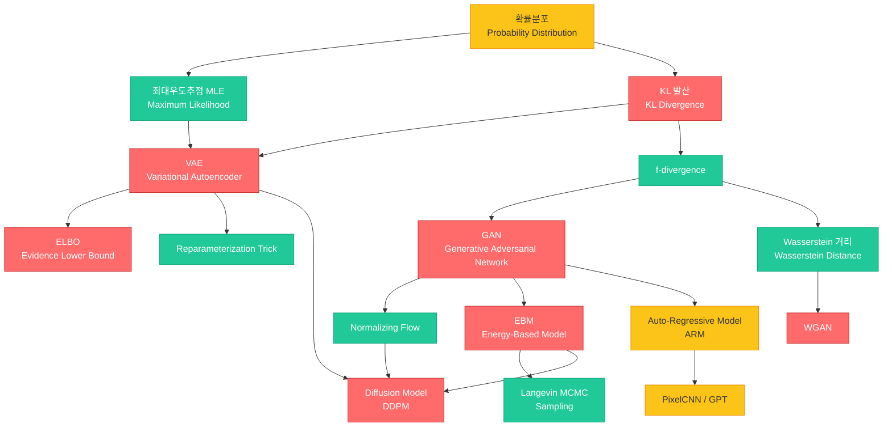

# 19. 생성모델 - EBM & GAN (Generative Models - EBM & GAN)

> **동기부여**: 생성모델은 데이터의 확률 분포 자체를 학습하여 "새로운 데이터를 창조"할 수 있는 딥러닝의 핵심 패러다임이다. 판별모델이 "이것이 무엇인가?"라는 질문에 답한다면, 생성모델은 "이것과 비슷한 새로운 것을 만들어라"에 답한다. GAN(2014)부터 StyleGAN(2018), DALL-E, Stable Diffusion, Sora에 이르기까지 이미지/영상/텍스트 생성의 폭발적 발전을 이끈 근간 기술이며, 현대 AI의 가장 활발한 연구 영역이다.

---

## 1. 선행 개념 연결 Mermaid 다이어그램

---

## 2. 개념별 5단계 완전 분리 설명

### 개념 1: 생성모델 개관 (Generative Models Overview) (슬라이드 621-623)

#### (1) 초등학생 단계
생성모델은 "그림 그리는 AI"야. 사진을 많이 보여주면, AI가 스스로 새로운 사진을 그릴 수 있게 되는 거지. 2014년에는 흐릿한 얼굴밖에 못 만들었는데, 2018년에는 진짜 사람 같은 얼굴을 만들 수 있게 됐어!

#### (2) 중등학생 단계
생성모델은 데이터의 패턴을 학습해서 새로운 데이터를 만드는 모델이야. 크게 네 가지 종류가 있어:
- **GAN**: 가짜를 만드는 생성자와 진짜/가짜를 구별하는 판별자가 대결하며 학습
- **VAE**: 데이터를 압축했다가 다시 복원하면서 학습
- **Flow**: 데이터를 가역적으로 변환
- **Diffusion**: 노이즈를 점진적으로 추가했다가 되돌리며 학습

#### (3) 고등학생 단계
생성모델의 목표는 데이터 분포 $p_{\text{data}}(x)$를 근사하는 모델 $p_\theta(x)$를 학습하는 것이다. 각 접근법의 핵심 차이:
- **GAN**: 암시적(implicit) 생성 모델. 확률밀도를 직접 정의하지 않고 샘플링 과정 $z \sim \mathcal{N}(0, I), x = G_\theta(z)$로 분포를 표현
- **VAE**: 변분 하한(ELBO)을 최대화. 인코더 $q_\phi(z|x)$와 디코더 $p_\theta(x|z)$ 구조
- **Flow**: 가역 변환 $f$를 통해 밀도를 정확히 계산
- **Diffusion**: 점진적 노이즈 추가/제거 과정

#### (4) 대학 단계
생성모델의 학습 목표는 일반적으로 **최대우도추정(MLE)**이다:

$$\max_\theta \mathbb{E}_{x \sim p_S}[\log p_\theta(x)]$$

각 모델은 $\log p_\theta(x)$를 다루는 방식이 다르다:
- **VAE**: $\log p_\theta(x) \geq \text{ELBO}(x; \theta, \phi)$로 하한을 최대화
- **GAN**: $\log p_\theta(x)$를 직접 계산하지 않고, 판별자를 통한 적대적 학습
- **Flow**: change-of-variables formula로 $\log p_X(x) = \log p_U(g(x)) - \log|\det f'(u)|$를 직접 계산
- **EBM**: $p_\theta(x) = \frac{\exp(-E_\theta(x))}{Z_\theta}$로 정의하되, 분배함수 $Z_\theta$의 기울기를 샘플링으로 추정

#### (5) 대학원 단계
생성모델들의 목적함수를 통합적으로 보면 (슬라이드 643):

$$\min_{\theta,\phi} \underbrace{\mathbb{E}_{x \in S}[\text{KL}(q_\phi(z|x) \| p(z))]}_{\text{consistency}} + \underbrace{\mathbb{E}_{x \in S, z \sim q_\phi(\cdot|x)}[-\log p_\theta(x|z)]}_{\text{reconstruction}}$$

GAN에서는 이것이 $\min_\theta \max_\phi$의 minimax 게임으로, Flow에서는 Jacobian의 log-determinant로, EBM에서는 에너지 최소화/최대화로 변환된다. 각 모델의 장단점 trade-off: GAN은 빠른 샘플링+고품질이지만 mode collapse, Diffusion은 다양성+고품질이지만 느린 샘플링, VAE는 빠른 샘플링+다양성이지만 blurry 출력.

---

### 개념 2: VAE - 변분 오토인코더 (Variational Autoencoder) (슬라이드 624-631, 645-647)

#### (1) 초등학생 단계
VAE는 "압축 복원기"야. 그림을 아주 작은 번호로 줄였다가(압축), 그 번호로 다시 그림을 만드는(복원) 기계야. 신기한 건, 아무 번호를 넣어도 새로운 그림이 나온다는 거야!

#### (2) 중등학생 단계
VAE는 두 부분으로 나뉘어:
- **인코더**: 입력 이미지를 평균($\mu$)과 표준편차($\sigma$)로 바꿔줌 (어떤 범위의 코드로 압축)
- **디코더**: 그 코드에서 이미지를 복원

학습할 때는 두 가지를 동시에 잘 하려고 해: (1) 원본과 비슷하게 복원하기, (2) 코드가 정규분포를 따르게 만들기.

#### (3) 고등학생 단계
VAE의 손실함수는 **-ELBO**로, 두 항의 합이다:
- **복원 오차(Reconstruction)**: $\|x' - x\|^2$ (원본과 복원의 차이)
- **정규화(KL divergence)**: 인코더 출력이 표준정규분포 $\mathcal{N}(0, I)$에 가깝도록 제약

$$\text{-ELBO} = \underbrace{\mathbb{E}_{z \sim q_\phi(\cdot|x)}[-\log p_\theta(x|z)]}_{\text{reconstruction}} + \underbrace{\text{KL}(q_\phi(z|x) \| p(z))}_{\text{consistency}}$$

#### (4) 대학 단계
VAE의 수학적 유도 (슬라이드 627, 647):

$$-\log p(x) = -\log \int p(x,z)dz \leq \mathbb{E}_{z \sim q(\cdot|x)}\left[-\log \frac{p(x,z)}{q(z|x)}\right] \quad \text{(Jensen's inequality)}$$

이를 정리하면:

$$-\log p(x) \leq \underbrace{\mathbb{E}_{z \sim q_\phi(\cdot|x)}[-\log p_\theta(x|z)]}_{\text{reconstruction}} + \underbrace{\text{KL}(q_\phi(z|x) \| p(z))}_{\text{consistency}}$$

인코더 $q_\phi: x \mapsto (\mu, \sigma)$, 디코더 $p_\theta: z \mapsto x'$. **Reparameterization trick**: $z = \mu + \sigma \odot \varepsilon$, $\varepsilon \sim \mathcal{N}(0, I)$로 역전파 가능하게 한다.

#### (5) 대학원 단계
KL divergence의 닫힌 형태 (슬라이드 625-626):

$$\text{KL}(\mathcal{N}(z; \mu, \text{diag}(\sigma)^2) \| \mathcal{N}(z; 0, I)) = \frac{1}{2}\left[-2\sum_j \log \sigma_j + \|\sigma\|^2 + \|\mu\|^2 - D\right]$$

Reparameterization trick이 필요한 이유 (슬라이드 629): naive Monte Carlo gradient estimator $\nabla_\phi \mathbb{E}_{q_\phi(z|x)}[f(z)] = \mathbb{E}_{q_\phi(z|x)}[f(z)\nabla_\phi \log q_\phi(z)]$는 분산이 매우 높아 실용적이지 않다. 대신 $z = g_\phi(\varepsilon, x) = \mu_\phi(x) + \sigma_\phi(x) \odot \varepsilon$로 재매개변수화하면 $\mathbb{E}_{q_\phi(z|x)}[f(z)] = \mathbb{E}_{p(\varepsilon)}[f(g_\phi(\varepsilon, x))]$이 되어 $\phi$에 대한 미분이 $f$ 내부로 들어간다.

복원 분포 가정에 따른 NLL (슬라이드 631):
- $p(x|z;\theta) = \mathcal{N}(x; \text{NN}_\theta(z), I)$이면 NLL $\propto \|x - \text{NN}_\theta(z)\|^2$ (MSE)
- $p(x|z;\theta) = \text{Ber}(x; \text{NN}_\theta(z))$이면 NLL = BCE (but pixel values not strictly in $\{0,1\}$, leading to blurry outputs)

---

### 개념 3: GAN - 생성적 적대 신경망 (Generative Adversarial Network) (슬라이드 621, 632)

#### (1) 초등학생 단계
GAN은 "위조범과 경찰의 게임"이야. 위조범(생성자)은 가짜 돈을 점점 잘 만들고, 경찰(판별자)은 가짜를 점점 잘 찾아내. 둘이 계속 경쟁하다 보면, 위조범이 진짜와 구별 안 되는 가짜를 만들게 돼!

#### (2) 중등학생 단계
GAN은 두 신경망의 대결 구조야:
- **생성자(Generator)** $G$: 랜덤 노이즈 $z$를 입력받아 가짜 이미지 $x' = G(z)$를 만듦
- **판별자(Discriminator)** $D$: 입력 이미지가 진짜(1)인지 가짜(0)인지 판별

2014년 흐릿한 얼굴 -> 2015 DCGAN -> 2016 CoGAN -> 2017 PGGAN -> 2018 StyleGAN으로 급격히 발전했어.

#### (3) 고등학생 단계
GAN은 **암시적 생성모델**이다. 확률밀도를 직접 정의하지 않고, 샘플링 과정으로 분포를 표현한다:

$$z \sim q(z) = \mathcal{N}(0, I), \quad x = G_\theta(z)$$

판별자의 출력을 베르누이 분포로 모델링: $p(Y|x;\phi) = \text{Ber}(Y|D_\phi(x))$.

#### (4) 대학 단계
GAN의 minimax 목적함수 (슬라이드 632):

$$\max_\phi \underbrace{\mathbb{E}_{x \in S}[\log D_\phi(x)]}_{\text{real}} + \underbrace{\mathbb{E}_{z \sim q(z), x = G_\theta(z)}[\log(1 - D_\phi(x))]}_{\text{generated}}$$

$$\min_\theta \mathbb{E}_{z \sim q(z), x = G_\theta(z)}[\log(1 - D_\phi(x))]$$

판별자는 진짜에 높은 확률, 가짜에 낮은 확률을 부여하도록 학습하고, 생성자는 판별자를 속이도록 학습한다.

#### (5) 대학원 단계
GAN의 최적 판별자 하에서 생성자 목적함수는 $p_\text{data}$와 $p_G$ 사이의 **Jensen-Shannon divergence**를 최소화하는 것과 동치이다. 그러나 실제로는:
- NLL = KL divergence 관계 (슬라이드 632 하단 참고)
- 생성자 학습 시 $\min_\theta \log(1 - D_\phi(G_\theta(z)))$ 대신 $\max_\theta \log D_\phi(G_\theta(z))$를 사용하는 것이 실용적 (초기 기울기 소실 문제 회피)
- Mode collapse, training instability 등의 근본적 문제가 존재

---

### 개념 4: WGAN - Wasserstein GAN (슬라이드 633-637)

#### (1) 초등학생 단계
보통 GAN은 "진짜야? 가짜야?"라고만 물어봐. 근데 WGAN은 "진짜와 얼마나 다른 거야?"라고 더 자세히 물어봐. 그래서 학습이 더 안정적이야!

#### (2) 중등학생 단계
기존 GAN의 문제점: KL divergence는 두 분포가 전혀 겹치지 않으면 무한대가 되어 학습이 불안정해. WGAN은 **Wasserstein 거리**(Earth Mover's Distance)를 사용해서 이 문제를 해결해. "흙 한 무더기를 다른 모양으로 옮기는 데 드는 최소 비용"이라고 생각하면 돼.

#### (3) 고등학생 단계
f-divergence $D_f(p \| q) = \int q(x) f\left(\frac{p(x)}{q(x)}\right) d\mu(x)$의 한계 (슬라이드 633-635):
- 두 분포의 support가 저차원 매니폴드 위에 있고, 일반적 위치(general position)에서 교차하면 KL divergence = $\infty$
- TV distance도 불연속적으로 점프 (0 또는 1)
- Wasserstein 거리는 연속적으로 변해서 학습에 유용한 기울기를 제공

#### (4) 대학 단계
Wasserstein 거리의 정의 (슬라이드 636): 두 확률분포 사이의 "최적 수송 비용"

$$W(P_S, P_\theta) = \sup_{\|f\|_L \leq 1} \mathbb{E}_{x \in S}[f(x)] + \mathbb{E}_{z \sim q(z), x = G_\theta(z)}[-f(x)]$$

여기서 $\|f\|_L \leq 1$은 1-Lipschitz 조건. WGAN의 목적함수 (슬라이드 637):

$$\max_\phi \mathbb{E}_{x \in S}[f_\phi(x)] + \mathbb{E}_{z \sim q(z), x = G_\theta(z)}[-f_\phi(x)] \quad \text{s.t. } \|f_\phi\|_L \leq 1$$

$$\min_\theta \mathbb{E}_{x \in S}[f_\phi(x)] + \mathbb{E}_{z \sim q(z), x = G_\theta(z)}[-f_\phi(x)]$$

#### (5) 대학원 단계
Lipschitz 제약 구현 방법:
- **Weight clipping** [ACB17]: 가중치를 $[-c, c]$ 범위로 클리핑. 단순하지만 critic의 용량을 제한
- **Gradient penalty** [GAA+17]: $\|f_\phi(x) - f_\phi(y)\| \leq \|x - y\|$ 조건을 보간점에서의 기울기 norm 페널티로 구현

f-divergence 실패 사례 (슬라이드 634): $P_\theta$가 $\{(\theta, t) : t \in [0,1]\}$ 위에 지지를 가질 때:
- $\text{KL}(P_0 \| P_\theta) = 0$ (if $\theta = 0$), $= \infty$ (if $\theta \neq 0$)
- $D_{TV}(P_\theta, P_0) = 0$ (if $\theta = 0$), $= 1$ (if $\theta \neq 0$)
- 반면 Wasserstein 거리 $W(P_\theta, P_0) = |\theta|$로 연속적이고 미분 가능

---

### 개념 5: Energy-Based Model (EBM) (슬라이드 639-641)

#### (1) 초등학생 단계
EBM은 "에너지 지도"를 만드는 거야. 진짜 데이터가 있는 곳은 에너지가 낮고(편안한 골짜기), 가짜 데이터가 있는 곳은 에너지가 높아(불편한 산꼭대기). 모델이 이 에너지 지도를 잘 만들면, 골짜기에서 새로운 데이터를 찾을 수 있어!

#### (2) 중등학생 단계
EBM은 각 데이터 점에 "에너지"를 부여하는 모델이야:
- 진짜 데이터 근처: 에너지가 낮음 (확률이 높음)
- 가짜/이상한 데이터: 에너지가 높음 (확률이 낮음)

학습 방법: 진짜 데이터의 에너지는 낮추고, 모델이 생성한 "부정 샘플(negative sample)"의 에너지는 높이는 방식.

#### (3) 고등학생 단계
EBM의 확률 분포:

$$p_\theta(x) = \frac{\exp(-E_\theta(x))}{Z_\theta}, \quad Z_\theta = \int \exp(-E_\theta(x))dx$$

에너지 함수 $E_\theta(x) \geq 0$은 신경망으로 모델링. $Z_\theta$는 정규화 상수(partition function)로 직접 계산이 불가능.

#### (4) 대학 단계
MLE로 학습할 때의 기울기 (슬라이드 639-640):

$$\nabla_\theta \ell(\theta) = \underbrace{\mathbb{E}_{x \sim p_S(x)}[\nabla_\theta E_\theta(x)]}_{\text{실제 데이터}} + \nabla_\theta \log Z_\theta$$

핵심 유도:

$$\nabla_\theta \log Z_\theta = Z_\theta^{-1} \nabla_\theta \int \exp(-E_\theta(x))dx = -\mathbb{E}_{x \sim p_\theta(x)}[\nabla_\theta E_\theta(x)]$$

따라서:

$$-\nabla_\theta \ell(\theta) = -\underbrace{\mathbb{E}_{x \sim p_S(x)}[\nabla_\theta E_\theta(x)]}_{\text{min } E \text{ for real}} + \underbrace{\mathbb{E}_{x \sim p_\theta(x)}[\nabla_\theta E_\theta(x)]}_{\text{max } E \text{ for negative}}$$

#### (5) 대학원 단계
$p_\theta(x)$로부터의 샘플링이 핵심 난제이다. **Langevin MCMC** (슬라이드 640 각주):

$$x_{t+1} = x_t + \lambda \nabla_x \log p_\theta(x_t) + \sigma \varepsilon_t, \quad \varepsilon_t \sim \mathcal{N}(0, I)$$

여기서 score function $s_\theta(x) = \nabla_x \log p_\theta(x) = -\nabla_x E_\theta(x)$이고, $\sigma = \sqrt{2\lambda}$가 이론적으로 최적인 선택이다. 이 score function은 이후 **Score-Based Generative Models**과 **Diffusion Models**로 이어지는 핵심 개념이 된다. EBM 학습의 직관 (슬라이드 641): 에너지 함수를 실제 데이터 점(red dots)에서는 낮추고, 모델 분포에서 샘플링된 점(blue dots)에서는 높이는 "push-pull" 동역학.

---

### 개념 6: Normalizing Flow (슬라이드 623, 638)

#### (1) 초등학생 단계
Normalizing Flow는 "모양 바꾸기 마법"이야. 동그란 풍선(단순한 분포)을 여러 번 늘리고 비틀어서 복잡한 동물 모양(복잡한 분포)으로 만드는 거야. 그리고 이 과정을 거꾸로도 할 수 있어!

#### (2) 중등학생 단계
Flow 모델은 단순한 분포(예: 정규분포)를 **가역적인 변환** 여러 개를 쌓아서 복잡한 분포로 바꿔. 가역적이라 함은 양방향으로 변환이 가능하다는 뜻이야. 확률밀도도 정확하게 계산할 수 있어.

#### (3) 고등학생 단계
$f: \mathbb{R}^d \to \mathbb{R}^d$ (가역, $g = f^{-1}$)
- 샘플링: $u \sim p_U(u)$에서 뽑고 $x = f(u)$ 계산
- 밀도 계산: change-of-variables formula 사용

#### (4) 대학 단계
Change-of-variables formula (슬라이드 638):

$$p_X(x) = p_U(g(x))|g'(x)| = p_U(g(x))|f'(u)|^{-1}$$

$$\log p_X(x) = \log p_U(g(x)) - \log|\det f'(u)|$$

합성 변환 $f = f_K \circ \cdots \circ f_1 \circ f_0$에 대해:

$$\log p_X(x) = \log p_U(g(x)) - \sum_{k=1}^{K} \log|\det f'_k(u_{k-1})|$$

#### (5) 대학원 단계
Flow 모델의 핵심 설계 과제는 (1) Jacobian determinant의 효율적 계산과 (2) 충분한 표현력을 가진 가역 변환 설계이다. 실용적 접근: 삼각 Jacobian을 갖는 coupling layer (RealNVP), autoregressive flow (MAF/IAF) 등. Flow는 정확한 likelihood 계산이 가능하지만, 차원이 보존되어야 하는 제약이 있다 ($d_{\text{input}} = d_{\text{output}}$).

---

### 개념 7: KL Divergence와 가우시안 분포 (슬라이드 625-626, 645)

#### (1) 초등학생 단계
KL divergence는 두 모양이 "얼마나 다른지" 재는 자야. 두 모양이 완전히 같으면 0이고, 다를수록 큰 수가 나와.

#### (2) 중등학생 단계
정규분포끼리의 KL divergence는 공식으로 딱 떨어져. VAE에서는 인코더 출력이 표준정규분포와 얼마나 다른지를 이 공식으로 계산해.

#### (3) 고등학생 단계
두 $D$-차원 가우시안의 KL divergence:

$$\text{KL}(\mathcal{N}(\mu_1, \Sigma_1) \| \mathcal{N}(\mu_2, \Sigma_2)) = \frac{1}{2}\left[\log\frac{\det\Sigma_2}{\det\Sigma_1} + \text{tr}(\Sigma_1\Sigma_2^{-1}) + (\mu_1 - \mu_2)^\top\Sigma_2^{-1}(\mu_1 - \mu_2) - D\right]$$

#### (4) 대학 단계
등방 공분산 $\Sigma_2 = \beta I$인 경우:

$$\text{KL}(\mathcal{N}(\mu_1, \Sigma_1) \| \mathcal{N}(\mu_2, \beta I)) = C\|\mu_1 - \mu_2\|^2 + C'$$

여기서 $C = \frac{1}{2\beta}$. VAE에서의 특수한 경우 (슬라이드 625-626):

$$\text{KL}(\mathcal{N}(\mu, \text{diag}(\sigma)^2) \| \mathcal{N}(0, I)) = \frac{1}{2}\left[-2\sum_j \log\sigma_j + \|\sigma\|^2 + \|\mu\|^2 - D\right]$$

#### (5) 대학원 단계
각 항의 의미: $-2\sum_j \log\sigma_j$는 엔트로피 항(분산이 1에서 벗어나는 페널티), $\|\sigma\|^2 + \|\mu\|^2 - D$는 평균과 분산이 $\mathcal{N}(0,I)$에서 벗어나는 비용. 함수 $-2\ln(x) + x^2$의 그래프 (슬라이드 626)는 $x = 1$ ($\sigma = 1$)에서 최솟값을 가지며, 이는 KL divergence가 $\sigma = 1, \mu = 0$일 때 0이 됨을 보여준다.

---

### 개념 8: Auto-Regressive Models (ARM) (슬라이드 642)

#### (1) 초등학생 단계
자기회귀 모델은 "이어쓰기 게임"이야. 한 글자씩 차례대로 써나가는 거지. 앞에 뭘 썼는지 보고 다음에 뭘 쓸지 결정해.

#### (2) 중등학생 단계
확률의 연쇄법칙(chain rule)을 직접 사용하는 모델이야. 이미지를 왼쪽 위부터 한 픽셀씩 순서대로 생성하거나(PixelCNN), 텍스트를 한 단어씩 순서대로 생성해(GPT).

#### (3) 고등학생 단계
$$p(x_{1:T}) = \prod_{t=1}^{T} p(x_t | x_{1:t-1})$$

각 조건부 분포를 신경망으로 모델링. **Masked convolution**(causal convolution)으로 미래 정보를 차단.

#### (4) 대학 단계
구현 방식:
- **1D**: WaveNet, Tacotron (TTS) - dilated causal convolution
- **2D**: PixelCNN - raster scan order로 마스킹
- **Transformer 기반**: GPT, DALL-E, Imagen, Stable Diffusion

정확한 likelihood 계산이 가능하지만, 순차적 생성으로 인해 샘플링이 느리다.

#### (5) 대학원 단계
ARM은 tractable density model로서 정확한 $\log p(x)$ 계산이 가능하여 MLE 학습이 직접적이다. 그러나 auto-regressive 구조의 순차적 의존성은 병렬화를 방해하고, 생성 속도에 병목이 된다. 이 문제를 해결하기 위해 non-autoregressive 변형(parallel decoding), distillation 기법 등이 연구되고 있다.

---

### 개념 9: Diffusion Model (DDPM) (슬라이드 623, 648-651)

#### (1) 초등학생 단계
디퓨전 모델은 "잉크 퍼지기"와 같아. 깨끗한 물에 잉크를 떨어뜨리면 점점 퍼져서 색이 고르게 되지? 디퓨전 모델은 이 과정을 거꾸로 해서, 흐릿한 노이즈에서 선명한 그림을 만들어내!

#### (2) 중등학생 단계
두 과정이 있어:
- **Forward process**: 원본 이미지에 노이즈를 조금씩 더해서 완전한 노이즈로 만듦
- **Reverse process**: 완전한 노이즈에서 시작해서 노이즈를 조금씩 제거하며 이미지를 복원

모델은 reverse process를 학습하여 노이즈에서 이미지를 생성.

#### (3) 고등학생 단계
- Forward: $x \equiv x_0 \to z_T = z$ (data to noise)
- $q_\phi(z|x)$: forward process, $z = \mu_\phi(x) + \sigma_\phi(x) \odot \varepsilon$, $\varepsilon \sim \mathcal{N}(0, I)$
- Reverse: $p_\theta(x|z)$를 학습하여 noise에서 data 생성
- 학습 목표: $\mathbb{E}_{x \sim \mathcal{D}}[\log p_\theta(x)] \geq \mathbb{E}_{x \sim \mathcal{D}} \text{ELBO}(x; \theta, \phi)$

#### (4) 대학 단계
DDPM [HJA20]은 VAE의 관점에서 이해할 수 있다 (슬라이드 650-651):
- Diffusion model은 **hierarchical VAE**의 한 형태
- Forward process의 각 단계가 VAE의 인코더에 해당
- T개의 latent variable $z_1, z_2, \ldots, z_T$를 가진 계층적 구조
- DDPM은 추가된 노이즈를 예측(noise prediction)하여 reverse process를 학습

#### (5) 대학원 단계
생성모델 trade-off 삼각형 (슬라이드 650):
- **GAN**: High Quality Samples + Fast Sampling, but low Mode Coverage
- **VAE**: Fast Sampling + Mode Coverage (Diversity), but lower quality
- **Diffusion**: High Quality + Mode Coverage, but Slow Sampling

Diffusion model은 VAE와 EBM/Score-based model의 교차점에 위치하며, score matching 관점에서 $s_\theta(x_t, t) = \nabla_{x_t} \log p(x_t)$를 학습하는 것으로도 해석된다.

---

### 개념 10: 생성모델 목적함수 통합 비교 (슬라이드 643)

#### (1) 초등학생 단계
생성모델마다 "잘 만들었는지" 확인하는 방법이 달라. 어떤 건 "얼마나 비슷하게 복원했나"를 보고, 어떤 건 "진짜와 가짜를 구별할 수 있나"를 보고, 어떤 건 "에너지가 높은지 낮은지"를 봐.

#### (2) 중등학생 단계
| 모델 | 목적함수 핵심 |
|------|-------------|
| VAE | 복원 잘 하기 + 잠재공간 정리하기 |
| GAN | 판별자 속이기 + 판별자 정확하게 만들기 |
| Flow | 정확한 확률 계산 최대화 |
| EBM | 진짜는 에너지 낮추고, 가짜는 에너지 높이기 |

#### (3) 고등학생 단계
통합 뷰: 모든 생성모델은 결국 데이터 분포와 모델 분포 사이의 "거리"를 줄이는 것이 목표:
- VAE: consistency(KL) + reconstruction
- GAN: adversarial divergence
- Flow: exact NLL
- EBM: contrastive energy

#### (4) 대학 단계
슬라이드 643의 통합 목적함수:

| 모델 | 목적함수 |
|------|---------|
| **VAE** | $\min_{\theta,\phi} \mathbb{E}_{x}[\text{KL}(q_\phi(z\|x) \| p(z))] + \mathbb{E}_{x,z}[-\log p_\theta(x\|z)]$ |
| **GAN** | $\min_\theta \max_\phi \mathbb{E}_x[\log D_\phi(x)] + \mathbb{E}_z[\log(1-D_\phi(G_\theta(z)))]$ |
| **Flow** | $\max_\phi \mathbb{E}_x[\log p_U(g_\phi(x))] + \mathbb{E}_x[-\log\|\det f'(u;\theta)\|]$ |
| **EBM** | $\min_\theta \mathbb{E}_{x \sim p_S}[E_\theta(x)] - \mathbb{E}_{x \sim p_\theta}[E_\theta(x)]$ |

#### (5) 대학원 단계
이 네 가지 프레임워크는 상호 연결되어 있다:
- GAN의 판별자를 에너지 함수로 보면 EBM과 연결
- Flow의 가역 변환을 인코더/디코더로 보면 VAE와 연결
- EBM의 score function을 학습하면 Diffusion model과 연결
- VAE의 계층을 무한히 쌓으면 Diffusion model이 됨

현대 생성모델(DALL-E, Stable Diffusion, Sora 등)은 이러한 기법들을 조합하여 사용한다.

---

## 3. 오개념 카드 (5+)

### 오개념 1: "GAN의 생성자는 확률분포를 직접 학습한다"
- **오개념**: GAN의 Generator가 $p_\theta(x)$를 명시적으로 정의한다고 생각
- **정정**: GAN은 **암시적(implicit)** 생성모델로, 샘플링 과정 $z \to G_\theta(z)$만 정의한다. $p_\theta(x)$를 직접 계산할 방법이 없다. 이것이 GAN에서 likelihood 평가가 불가능한 이유이다.

### 오개념 2: "VAE의 KL term은 불필요한 제약이다"
- **오개념**: KL divergence 항을 제거하면 더 좋은 복원 품질을 얻을 수 있다고 생각
- **정정**: KL 항이 없으면 잠재공간이 불규칙해져서 interpolation이나 새로운 샘플 생성이 불가능해진다. KL 항은 잠재공간을 구조화하여 의미 있는 생성을 가능하게 하는 핵심 정규화이다.

### 오개념 3: "Wasserstein 거리와 KL divergence는 같은 역할을 한다"
- **오개념**: 둘 다 분포 간 거리이므로 교체 가능하다고 생각
- **정정**: KL divergence는 두 분포의 support가 겹치지 않으면 $\infty$가 된다 (슬라이드 634). Wasserstein 거리는 support가 떨어져 있어도 연속적이고 유의미한 기울기를 제공한다. 이것이 WGAN이 더 안정적으로 학습되는 핵심 이유이다.

### 오개념 4: "EBM에서 partition function $Z_\theta$를 직접 계산해야 한다"
- **오개념**: EBM 학습에 $Z_\theta$의 정확한 값이 필요하다고 생각
- **정정**: $\nabla_\theta \log Z_\theta = -\mathbb{E}_{x \sim p_\theta}[\nabla_\theta E_\theta(x)]$이므로, 기울기 계산에는 $Z_\theta$의 값이 아닌 $p_\theta$에서의 **샘플**만 필요하다. Langevin MCMC 등으로 근사 샘플링을 수행한다.

### 오개념 5: "Reparameterization trick은 단순히 구현 편의를 위한 것이다"
- **오개념**: 코딩 편의성을 위한 트릭이라고 가볍게 생각
- **정정**: 이것은 VAE 학습의 **수학적 필수 조건**이다 (슬라이드 629). Naive Monte Carlo estimator $f(z)\nabla_\phi \log q_\phi(z)$는 분산이 극도로 높아 실용적이지 않다. $z = \mu + \sigma \odot \varepsilon$으로 재매개변수화해야 저분산의 기울기 추정이 가능하다.

### 오개념 6: "Diffusion model은 GAN과 완전히 다른 새로운 패러다임이다"
- **오개념**: Diffusion model이 기존 생성모델과 무관한 새로운 발명이라고 생각
- **정정**: Diffusion model은 **hierarchical VAE**의 한 형태로 볼 수 있다 (슬라이드 650). Forward process = encoder chain, reverse process = decoder chain. 또한 EBM의 score matching과도 깊이 연결된다.

---

## 4. 초등학생에게 설명하기 연습

### Q1: "GAN이 뭐예요?"
**모범 답안**: "GAN은 그림 대결 게임이야! 한 친구(생성자)가 그림을 그리면, 다른 친구(판별자)가 '이거 진짜야? 가짜야?' 맞추려고 해. 그림 그리는 친구는 점점 잘 그리고, 맞추는 친구는 점점 잘 맞추려고 해. 이렇게 계속 대결하다 보면, 나중엔 진짜와 똑같은 그림을 그릴 수 있게 돼! 그래서 요즘 AI가 만든 사람 얼굴이 진짜처럼 보이는 거야."

### Q2: "VAE랑 GAN은 뭐가 다른 거예요?"
**모범 답안**: "VAE는 '사진 줄이기 늘리기' 기계야. 사진을 아주 작은 숫자로 줄였다가 다시 키우는 거지. 그래서 살짝 흐릿해. GAN은 '대결 게임'이라 더 선명한 그림을 만들지만, 가끔 같은 종류 그림만 계속 그리는 문제가 있어."

### Q3: "에너지 모델이 뭐예요?"
**모범 답안**: "산과 골짜기가 있는 지도를 상상해봐. 진짜 사진들은 골짜기(낮은 곳)에 있고, 이상한 사진들은 산꼭대기(높은 곳)에 있어. AI가 이 지도를 잘 만들면, 골짜기를 따라가면서 진짜 같은 새 사진을 찾을 수 있는 거야!"

---

## 5. 수학 <-> 딥러닝 연결 테이블

| 수학 개념 | 기호/공식 | 딥러닝에서의 역할 | 슬라이드 |
|-----------|----------|------------------|---------|
| KL Divergence | $\text{KL}(q \| p) = \mathbb{E}_q[\log \frac{q}{p}]$ | VAE의 정규화 항, GAN 목적함수의 이론적 기반 | 625-626, 633-634 |
| Jensen's Inequality | $\mathbb{E}[\log X] \leq \log \mathbb{E}[X]$ | VAE ELBO 유도의 핵심 부등식 | 627, 647 |
| Wasserstein Distance | $W(p,q) = \sup_{\|f\|_L \leq 1} \mathbb{E}_p[f] - \mathbb{E}_q[f]$ | WGAN의 목적함수, 안정적 학습 가능 | 636-637 |
| Boltzmann Distribution | $p(x) = \frac{\exp(-E(x))}{Z}$ | EBM의 확률 모델 정의 | 639 |
| Langevin Dynamics | $x_{t+1} = x_t + \lambda \nabla_x \log p(x_t) + \sigma\varepsilon_t$ | EBM의 샘플링, Score-based 모델의 기초 | 640 |
| Change of Variables | $p_X(x) = p_U(g(x))|\det g'(x)|$ | Normalizing Flow의 밀도 계산 | 638 |
| Minimax Theorem | $\min_G \max_D V(D, G)$ | GAN의 적대적 학습 프레임워크 | 632 |
| f-divergence | $D_f(p\|q) = \int q \cdot f(\frac{p}{q}) d\mu$ | GAN 변형들의 통합적 이론 (KL, TV 포함) | 633 |
| Reparameterization | $z = \mu + \sigma \odot \varepsilon, \varepsilon \sim \mathcal{N}(0,I)$ | VAE에서 샘플링 과정의 미분 가능화 | 628-630 |
| Lipschitz Condition | $\|f(x) - f(y)\| \leq \|x - y\|$ | WGAN critic의 제약 조건 | 637 |

---

## 6. 킬러 요약

| 핵심 | 한 줄 요약 |
|------|----------|
| **생성모델 분류** | GAN(적대적), VAE(변분), Flow(가역변환), EBM(에너지), Diffusion(노이즈 역전), ARM(자기회귀) - 모두 $p_\text{data}$를 근사하되 접근법이 다르다 |
| **VAE** | ELBO = Reconstruction + KL, reparameterization trick으로 역전파 가능, blurry but stable |
| **GAN** | $\min_G \max_D$의 minimax game, 암시적 생성모델, high quality but mode collapse |
| **WGAN** | KL/TV divergence의 불연속성 문제를 Wasserstein distance로 해결, Lipschitz 제약 필요 |
| **EBM** | $p(x) \propto \exp(-E(x))$, 기울기에 $Z_\theta$가 불필요, Langevin MCMC로 샘플링, Score function 개념의 원천 |
| **Normalizing Flow** | 가역변환 + change-of-variables로 정확한 likelihood, Jacobian 계산이 병목 |
| **ARM** | $p(x) = \prod p(x_t|x_{<t})$, 정확한 likelihood, 순차적 생성이 느림 |
| **Diffusion** | Hierarchical VAE 관점, forward(noise 추가) + reverse(noise 제거), 고품질+다양성 but 느린 샘플링 |
| **Trade-off 삼각형** | GAN=빠름+고품질, VAE=빠름+다양성, Diffusion=고품질+다양성 (세 마리 토끼를 동시에 잡기 어렵다) |
| **시험 필수** | VAE의 KL 닫힌 형태: $\frac{1}{2}[-2\sum\log\sigma_j + \|\sigma\|^2 + \|\mu\|^2 - D]$, EBM 기울기: real은 min E, negative는 max E |
