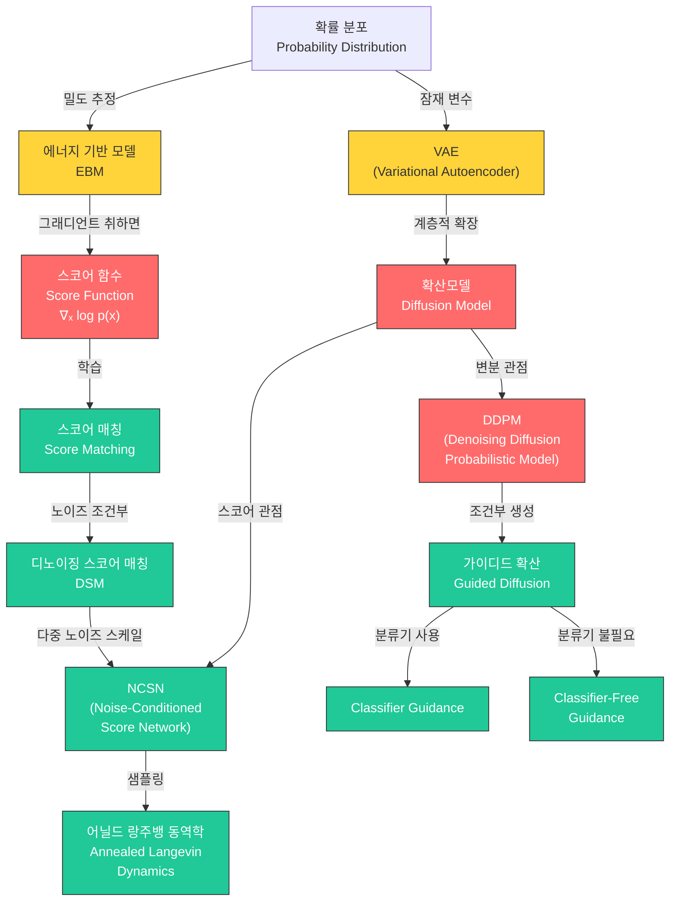

# 20. 확산모델 & Score Matching (Diffusion Models & Score Matching)

> **동기부여**: GAN은 고품질 샘플을 빠르게 생성하지만 모드 붕괴(mode collapse) 문제가 있고, VAE는 다양성은 좋지만 샘플 품질이 낮다. **확산모델(Diffusion Model)**은 이 두 장점을 모두 취한다: 고품질 샘플 + 높은 다양성(mode coverage). 데이터에 점진적으로 노이즈를 추가한 뒤, 그 역과정을 학습하여 노이즈로부터 데이터를 생성한다. 현재 이미지/오디오/비디오 생성의 SOTA를 달성하며, DALL-E, Stable Diffusion, Sora 등의 핵심 기술이다.

---

## 1. 선행 개념 연결 Mermaid 다이어그램



> 범례: 🔴 핵심 개념(빨강) / 🟢 중간 개념(청록) / 🟡 다리 개념(노랑)

---

## 2. 개념별 5단계 완전 분리 설명

---

### 개념 1: VAE 복습 - ELBO와 생성 모델의 기초 (슬라이드 646-647, 653)

#### ① 초등학생 단계
사진을 찍으면 카메라가 중요한 특징(얼굴 모양, 색깔)만 기억하는 "압축 메모"를 만들어. 이 메모를 보고 다시 그림을 그리면 원래 사진과 비슷한 새 그림이 나와! VAE는 이런 "압축 메모 만들기 + 메모로 그림 그리기" 기계야.

#### ② 중등학생 단계
VAE는 두 부분으로 구성돼:
- **인코더(Encoder)**: 입력 데이터 $x$를 평균 $\mu$와 표준편차 $\sigma$로 요약
- **디코더(Decoder)**: 잠재 변수 $z$로부터 데이터 $x'$를 복원

핵심은 $z$를 확률적으로 샘플링한다는 것. $z = \mu + \sigma \odot \epsilon$ (재매개변수화 트릭)으로, $\epsilon \sim \mathcal{N}(0, I)$.

#### ③ 고등학생 단계
VAE의 목표는 데이터의 로그 가능도 $\log p(x)$를 최대화하는 것이다. 직접 계산이 불가능하므로 **ELBO(Evidence Lower BOund)**라는 하한을 대신 최대화한다:

$$-\log p(x) \leq -\text{ELBO}(x; \theta, \phi)$$

ELBO는 두 항으로 분해된다:
- **재구성 항**: $\mathbb{E}_{z \sim q_\phi}[-\log p_\theta(x|z)]$ (원본을 잘 복원하는가?)
- **일관성 항**: $\text{KL}(q_\phi(z|x) \| p(z))$ (잠재 분포가 사전분포에 가까운가?)

#### ④ 대학 단계
젠센 부등식(Jensen's inequality)을 통해 ELBO를 유도한다:

$$-\log p(x) = -\log \int p(x,z)dz = -\log \mathbb{E}_{z \sim q(\cdot|x)}\left[\frac{p(x,z)}{q(z|x)}\right] \leq \mathbb{E}_{z \sim q(\cdot|x)}\left[-\log \frac{p(x,z)}{q(z|x)}\right]$$

이를 정리하면:

$$-\text{ELBO} = \underbrace{\mathbb{E}_{z \sim q_\phi(\cdot|x)}[-\log p_\theta(x|z)]}_{\text{reconstruction, e.g., } \|x'-x\|^2} + \underbrace{\text{KL}(q_\phi(z|x) \| p(z))}_{\text{consistency, e.g., } -2\sum_j \log \sigma_j + \|\sigma\|^2 + \|\mu\|^2}$$

#### ⑤ 대학원 단계
VAE의 ELBO 유도에서 등호 조건은 $q_\phi(z|x) = p(z|x)$, 즉 변분 사후분포가 진짜 사후분포와 일치할 때이다. 실제로는 gap이 존재하며, 이것이 VAE의 근본적 한계다:

$$\log p(x) = \text{ELBO}(x; \theta, \phi) + \text{KL}(q_\phi(z|x) \| p(z|x))$$

확산모델은 이 구조를 **계층적(hierarchical)**으로 확장하여, 여러 단계의 잠재 변수 $z_{1:T}$를 도입함으로써 표현력을 극적으로 향상시킨다. 핵심 차이: VAE는 인코더를 학습하지만, 확산모델은 순방향 과정을 **고정**한다.

---

### 개념 2: 확산모델 개요 - Forward & Reverse Process (슬라이드 648-652)

#### ① 초등학생 단계
깨끗한 사진에 소금을 조금씩 뿌려서 점점 알아볼 수 없게 만드는 거야(순방향). 확산모델은 소금이 잔뜩 뿌려진 사진을 보고 "소금을 하나씩 치워서" 원래 사진을 되찾는 방법을 배우는 거야(역방향)!

#### ② 중등학생 단계
- **순방향 과정(Forward)**: 데이터 $x_0$에 $T$번에 걸쳐 가우시안 노이즈를 추가 $\rightarrow$ 순수한 노이즈 $z_T \sim \mathcal{N}(0,I)$
- **역방향 과정(Reverse)**: 순수 노이즈에서 시작하여 $T$번에 걸쳐 노이즈를 제거 $\rightarrow$ 깨끗한 이미지 생성
- 순방향은 **고정**(학습 불필요), 역방향만 **학습**

#### ③ 고등학생 단계
순방향 과정은 마르코프 체인(Markov Chain)이다:

$$x \equiv x_0 \to z_1 \to z_2 \to \cdots \to z_T \text{ (noise)}$$

각 단계에서 $q(z_t | z_{t-1})$은 고정된 가우시안이며, $z_t = \ldots z_{t-1} + \ldots \delta_t$ ($\delta_t \sim \mathcal{N}(0,I)$).

역방향에서 학습하는 것은 $p_\theta(z_{t-1} | z_t)$, 즉 노이즈가 낀 상태에서 한 단계 이전(더 깨끗한) 상태를 예측하는 모델.

확산모델은 GAN, VAE, Diffusion 삼각형에서 세 가지 좋은 성질을 모두 갖추려 한다:
- **고품질 샘플** (GAN 수준)
- **높은 다양성 / 모드 커버리지** (VAE 수준)
- (대신 샘플링 속도는 느림)

#### ④ 대학 단계
VAE와 확산모델의 구조적 비교:

| | VAE | Diffusion Model |
|---|---|---|
| 순방향(인코더) | $q_\phi(z|x)$ - **학습** | $q(z_t|z_{t-1})$ - **고정** |
| 역방향(디코더) | $p_\theta(x|z)$ - 학습 | $p_\theta(z_{t-1}|z_t)$ - 학습 |
| 잠재 변수 | 1개 ($z$) | $T$개 ($z_1, \ldots, z_T$) |
| ELBO | $\mathbb{E}[-\log p_\theta(x|z)] + \text{KL}$ | 재구성 + 잠재 일관성 |

확산모델의 ELBO (슬라이드 654):

$$-\text{ELBO} = \underbrace{\mathbb{E}_{z_1 \sim q(\cdot|x)}[-\log p_\theta(x|z_1)]}_{\text{reconstruction, e.g., } \|x - \hat{x}(z_1;\theta)\|^2} + \underbrace{\text{KL}(q(z_{1:T}|x) \| p_\theta(z_{1:T}))}_{\text{latent consistency, e.g., } \|z_{t-1} - \hat{z}_{t-1}(z_t;\theta)\|^2}$$

#### ⑤ 대학원 단계
확산모델을 hierarchical VAE의 특수한 경우로 볼 수 있다. 핵심 설계 결정:

1. **순방향 고정**: 학습 파라미터가 역과정에만 있으므로 최적화가 안정적
2. **잠재 공간 = 데이터 공간**: $z_t$와 $x$가 같은 차원 (VAE처럼 병목이 없음)
3. **점진적 변환**: 한 번에 큰 변환이 아닌, 아주 작은 변환의 연쇄

DDPM에서 순방향 과정의 구체적 형태:

$$q(z_t | z_{t-1}) = \mathcal{N}(z_t; \sqrt{1-\beta_t}\, z_{t-1}, \beta_t I)$$

이로부터 임의 시점의 marginal을 닫힌 형태로 얻을 수 있다:

$$q(z_t | x_0) = \mathcal{N}(z_t; \sqrt{\bar{\alpha}_t}\, x_0, (1-\bar{\alpha}_t) I), \quad \bar{\alpha}_t = \prod_{s=1}^{t}(1-\beta_s)$$

---

### 개념 3: DDPM의 ELBO와 학습 목표 (슬라이드 654)

#### ① 초등학생 단계
선생님이 "이 더러운 그림에서 어떤 얼룩이 추가되었는지 맞춰봐"라고 물어. DDPM은 "어떤 얼룩(노이즈)이 추가됐는지"를 맞추는 연습을 아주 많이 해서, 나중에 얼룩만 있는 종이에서도 예쁜 그림을 만들어낼 수 있어!

#### ② 중등학생 단계
DDPM의 학습은 간단하다: 깨끗한 이미지에 노이즈를 섞은 후, 신경망이 "어떤 노이즈가 추가되었는지"를 예측하게 한다.
- 입력: 노이즈가 낀 이미지 $z_t$와 시간 $t$
- 출력: 추가된 노이즈 $\epsilon$의 예측값
- 손실 함수: 예측 노이즈와 실제 노이즈의 차이

#### ③ 고등학생 단계
DDPM은 VAE와 동일하게 ELBO를 최적화하지만, 잠재 변수가 $z = z_{1:T}$ 전체 시퀀스다.

슬라이드 654의 ELBO 유도:

$$-\log p(x) \leq \mathbb{E}_{z_1 \sim q(\cdot|x)}[-\log p_\theta(x|z_1)] + \text{KL}(q(z_{1:T}|x) \| p_\theta(z_{1:T}))$$

- **재구성 항**: $\|x - \hat{x}(z_1;\theta)\|^2$ (첫 번째 잠재 변수에서 원본 복원)
- **잠재 일관성 항**: $\|z_{t-1} - \hat{z}_{t-1}(z_t;\theta)\|^2$ (각 단계의 역변환이 순방향과 일관)

#### ④ 대학 단계
ELBO를 각 시간 단계별로 분해하면:

$$L = \mathbb{E}_q\left[-\log p_\theta(x|z_1) + \sum_{t=2}^{T} \text{KL}(q(z_{t-1}|z_t, x) \| p_\theta(z_{t-1}|z_t)) + \text{KL}(q(z_T|x) \| p(z_T))\right]$$

여기서 $q(z_{t-1}|z_t, x)$는 **posterior of the forward process**로, 닫힌 형태의 가우시안:

$$q(z_{t-1}|z_t, x_0) = \mathcal{N}(z_{t-1}; \tilde{\mu}_t(z_t, x_0), \tilde{\beta}_t I)$$

두 가우시안 사이의 KL은 결국 **평균의 차이의 제곱**이므로, 손실이 단순해진다.

#### ⑤ 대학원 단계
Ho et al. (2020)의 핵심 통찰: $\tilde{\mu}_t(z_t, x_0)$를 $\epsilon$-예측으로 재매개변수화하면, 최종 simplified loss는:

$$L_{\text{simple}} = \mathbb{E}_{t, x_0, \epsilon}\left[\|\epsilon - \epsilon_\theta(\sqrt{\bar{\alpha}_t}\, x_0 + \sqrt{1-\bar{\alpha}_t}\, \epsilon, \, t)\|^2\right]$$

이는 각 시간 단계에서의 가중 디노이징 스코어 매칭 손실과 동치임이 밝혀졌다. 즉, **변분 관점(ELBO)과 스코어 기반 관점(Score Matching)은 같은 목표를 다른 언어로 표현한 것**이다.

---

### 개념 4: 에너지 기반 모델에서 스코어 함수로 (슬라이드 656)

#### ① 초등학생 단계
산에서 가장 낮은 골짜기를 찾으려면 "지금 서 있는 곳에서 어느 방향이 내리막인지" 알면 돼. **스코어 함수**는 바로 이 "내리막 방향"을 알려주는 나침반이야!

#### ② 중등학생 단계
확률 분포 $p(x)$를 직접 구하는 건 매우 어렵다. 왜냐하면 정규화 상수 $Z$를 계산해야 하기 때문.
하지만 **스코어 함수** $s(x) = \nabla_x \log p(x)$는 $Z$가 필요 없다!
- $p_\theta(x) = \frac{\exp(-E_\theta(x))}{Z_\theta}$에서
- $\log p_\theta(x) = -E_\theta(x) - \log Z_\theta$
- $\nabla_x \log p_\theta(x) = -\nabla_x E_\theta(x)$ ($Z_\theta$는 $x$에 무관하므로 사라짐!)

#### ③ 고등학생 단계
에너지 기반 모델(EBM)에서 출발:

$$p_\theta(x) = \frac{\exp(-E_\theta(x))}{Z_\theta}, \quad Z_\theta = \int \exp(-E_\theta(x))dx$$

$Z_\theta$는 고차원에서 계산 불가능(intractable). 스코어 함수는 이 문제를 우회한다:

$$s_\theta(x) \equiv \nabla_x \log p_\theta(x) = -\nabla_x E_\theta(x) \quad \text{(no } Z_\theta \text{!)}$$

스코어 함수의 기하학적 의미: 데이터 공간의 각 점에서 **확률이 증가하는 방향**을 가리키는 벡터장(vector field).

#### ④ 대학 단계
**스코어 매칭(Score Matching)** 목표 (Hyvarinen, 2005):

$$L_{SM}(\theta) = \frac{1}{2}\mathbb{E}_{x \sim p_0}\left[\|\nabla_x \log p_\theta(x) - \nabla_x \log p_0(x)\|^2\right]$$

문제: $\nabla_x \log p_0(x)$를 모른다! 부분적분을 통해 동치 변환:

$$L_{SM}(\theta) = \frac{1}{2}\mathbb{E}_{x \sim p_0}\left[\|s_\theta(x)\|^2 + 2\text{Tr}(\nabla_x s_\theta(x))\right] + C$$

이제 $p_0$의 스코어를 모르고도 학습 가능하지만, **야코비안의 트레이스** $\text{Tr}(\nabla_x s_\theta(x))$는 고차원에서 여전히 비싸다 (heavy $\nabla^2$).

#### ⑤ 대학원 단계
스코어 매칭의 핵심 정리: $L_{SM}$을 최소화하는 $\theta^*$에서 $s_{\theta^*}(x) = \nabla_x \log p_0(x)$ a.e.

그러나 슬라이드 656 하단에 나오는 **노이즈 조건부 버전**의 아이디어가 결정적이다:

$$L_{SM}(\theta; \sigma) = \frac{1}{2}\mathbb{E}_{\tilde{x} \sim p_\sigma}\left[\|s_\theta(\tilde{x}; \sigma) - \nabla_{\tilde{x}} \log p_\sigma(\tilde{x})\|^2\right]$$

여기서 $p_\sigma(\tilde{x}) = \int p_\sigma(\tilde{x}|x) p_0(x) dx$이고 $p_\sigma(\tilde{x}|x) = \mathcal{N}(\tilde{x}; x, \sigma^2 I)$이다.

핵심: $\sigma \to 0$이면 $s_{\theta^*}(\tilde{x}; \sigma) = \nabla_{\tilde{x}} \log p_\sigma(\tilde{x}) \approx \nabla_x \log p_0(x)$

---

### 개념 5: 디노이징 스코어 매칭 (DSM) & NCSN (슬라이드 657)

#### ① 초등학생 단계
친구가 깨끗한 그림에 먼지를 뿌렸어. "먼지가 어디에 얼마나 있는지" 맞추는 게임을 해보자! 이걸 잘하면, 먼지투성이 종이에서도 원래 그림이 뭐였는지 알 수 있어.

#### ② 중등학생 단계
**디노이징 스코어 매칭(DSM)**: 스코어 매칭의 실용적 버전
1. 원본 데이터 $x$에 노이즈를 추가: $\tilde{x} = x + \sigma\epsilon$
2. 노이즈가 추가된 후의 스코어 $\nabla_{\tilde{x}} \log p_\sigma(\tilde{x}|x) = -\frac{\tilde{x}-x}{\sigma^2} = \frac{\epsilon}{\sigma}$의 방향을 예측
3. 이 방향은 **"원본 데이터를 향하는 방향"**을 의미

#### ③ 고등학생 단계
DSM 손실은 계산이 쉽다:

$$L_{DSM}(\theta; \sigma) = \frac{1}{2}\mathbb{E}_{x, \tilde{x}|x}\left[\left\|s_\theta(\tilde{x}; \sigma) - \frac{x - \tilde{x}}{\sigma^2}\right\|^2\right]$$

$\tilde{x} = x + \sigma\epsilon$을 대입하면:

$$L_{DSM}(\theta; \sigma) = \frac{1}{2}\mathbb{E}_{x, \epsilon}\left[\left\|s_\theta(x + \sigma\epsilon; \sigma) + \frac{\epsilon}{\sigma}\right\|^2\right]$$

그리고 **놀라운 결과**: $L_{SM} = L_{DSM} + C$ (상수 차이만 존재). 즉, DSM은 원래 스코어 매칭과 동치이면서도 계산이 훨씬 쉽다!

#### ④ 대학 단계
**NCSN (Noise-Conditioned Score Network)** (Song & Ermon, 2019):

단일 노이즈 수준에서의 DSM은 저밀도 영역에서 부정확. 해결: **여러 노이즈 수준**에서 동시에 학습.

$$L_{NCSN}(\theta) = \sum_{i=1}^{L} \lambda(\sigma_i) L_{DSM}(\theta; \sigma_i), \quad 0 < \sigma_1 < \sigma_2 < \cdots < \sigma_L$$

- 큰 $\sigma$: 넓은 영역을 커버 (저밀도 영역까지 도달)
- 작은 $\sigma$: 세밀한 구조 포착 (고밀도 영역에서 정확)
- 하나의 네트워크 $s_\theta(\tilde{x}; \sigma)$가 모든 노이즈 수준을 처리

#### ⑤ 대학원 단계
NCSN과 DDPM의 깊은 연결:
- DDPM의 $\epsilon$-예측: $\epsilon_\theta(z_t, t)$
- NCSN의 스코어 예측: $s_\theta(\tilde{x}, \sigma)$
- 관계: $s_\theta(\tilde{x}, \sigma) = -\epsilon_\theta(\tilde{x}, t) / \sigma$

따라서 DDPM의 노이즈 예측 학습은 사실상 다중 스케일 디노이징 스코어 매칭이다. 이것이 "변분 관점과 스코어 관점의 통합"의 핵심이다.

가중치 $\lambda(\sigma_i)$의 선택: 일반적으로 $\lambda(\sigma_i) = \sigma_i^2$로 설정하여 각 스케일에서의 기여가 균등하도록 한다.

---

### 개념 6: 랑주뱅 동역학 & 어닐드 랑주뱅 동역학 (슬라이드 658)

#### ① 초등학생 단계
눈을 감고 산꼭대기에서 내려오는데, 나침반(스코어 함수)이 "이 방향으로 가"라고 알려줘. 근데 가끔 바람(노이즈)이 불어서 살짝 다른 방향으로 가기도 해. 이렇게 한 발씩 내려가면 결국 골짜기(데이터)에 도착해!

#### ② 중등학생 단계
**랑주뱅 동역학(Langevin Dynamics)**: 스코어 함수를 사용해 노이즈로부터 데이터 샘플을 생성하는 방법:

$$x_{k+1} = x_k + \eta \cdot s_\theta(x_k) + \sqrt{2\eta} \cdot \epsilon_k, \quad \epsilon_k \sim \mathcal{N}(0, I)$$

- 첫째 항: 현재 위치
- 둘째 항: 스코어(확률 높은 방향)로 이동
- 셋째 항: 랜덤 노이즈 (다양한 샘플을 만들기 위해)

#### ③ 고등학생 단계
문제: 단일 노이즈 수준의 스코어로는 저밀도 영역에서 부정확하여 좋은 샘플을 생성하기 어렵다.

**어닐드 랑주뱅 동역학(Annealed Langevin Dynamics)**: 큰 노이즈 $\sigma_L$에서 시작하여 점진적으로 작은 노이즈 $\sigma_1$로 줄이며 샘플링.

#### ④ 대학 단계
슬라이드 658의 알고리즘:

```
x^{σ_L} ~ N(0, I)                    # 순수 노이즈에서 시작
for l = L, ..., 2 do                  # 노이즈 레벨을 줄여가며
    x̃_0 ← x^{σ_l}
    for k = 0, ..., K-1 do            # 각 레벨에서 K번 랑주뱅 스텝
        ε_k ~ N(0, I)
        x̃_{k+1} ← x̃_k + η_l · s_φ(x̃_k, σ_l) + √(2η_l) · ε_k
    x^{σ_{l-1}} ← x̃_K
```

- 스텝 크기: $\eta_l \propto \sigma_l^2$ (노이즈 수준에 비례)
- 시간 복잡도: $O(LK)$ (노이즈 레벨 수 $\times$ 각 레벨의 스텝 수)

#### ⑤ 대학원 단계
어닐드 랑주뱅 동역학의 수렴 보장: $K \to \infty, \eta_l \to 0$이면 각 레벨에서의 샘플이 $p_{\sigma_l}$로부터의 정확한 샘플에 수렴한다.

이 과정은 DDPM의 역방향 샘플링과 본질적으로 동일:
- DDPM: $z_{t-1} = \frac{1}{\sqrt{\alpha_t}}(z_t - \frac{\beta_t}{\sqrt{1-\bar{\alpha}_t}}\epsilon_\theta(z_t, t)) + \sigma_t \epsilon$
- Annealed LD: $\tilde{x}_{k+1} = \tilde{x}_k + \eta s_\theta(\tilde{x}_k, \sigma) + \sqrt{2\eta}\epsilon$

두 관점의 통합은 Song et al. (2021)의 **SDE 프레임워크**로 완성된다: 순방향 = SDE, 역방향 = reverse-time SDE.

---

### 개념 7: 가이디드 확산 - Classifier & Classifier-Free Guidance (슬라이드 660)

#### ① 초등학생 단계
"아무 그림이나 그려줘" 대신 "고양이 그림 그려줘"라고 주문하는 거야. **가이디드 확산**은 이 주문(조건)을 듣고 원하는 그림을 만들어주는 방법이야!

#### ② 중등학생 단계
두 가지 방식이 있다:
1. **Classifier Guidance**: 별도의 분류기를 써서 "이건 고양이같다/아니다"를 판단하며 안내
2. **Classifier-Free Guidance**: 분류기 없이, 하나의 모델이 조건부/비조건부를 모두 처리

#### ③ 고등학생 단계
**Classifier Guidance**:

$$\text{score}(x, c, \lambda) = \nabla_x \log p(x) + \lambda \nabla_x \log p(c|x)$$

- 첫째 항: 무조건부 스코어 (데이터 분포를 따라감)
- 둘째 항: 분류기 그래디언트 (클래스 $c$일 확률을 높이는 방향)
- $\lambda$: 가이던스 강도 (클수록 조건에 더 충실)

**Classifier-Free Guidance**:

$$\text{score}(x, c, \lambda) = (1-\lambda)\nabla_x \log p(x) + \lambda \nabla_x \log p(x|c)$$

- 별도 분류기 불필요! 하나의 모델로 $p(x)$와 $p(x|c)$를 모두 학습
- 트릭: $p(x) = p(x|c=\emptyset)$, 즉 조건을 빈 값으로 두면 비조건부가 됨

#### ④ 대학 단계
Classifier guidance의 유도: 베이즈 정리를 스코어에 적용:

$$\nabla_x \log p(x|c) = \nabla_x \log p(x) + \nabla_x \log p(c|x)$$

따라서 조건부 스코어를 얻으려면 비조건부 스코어 + 분류기 그래디언트. $\lambda$로 증폭:

$$\nabla_x \log p(x) + \lambda \nabla_x \log p(c|x)$$

문제: 별도의 **노이즈에 강건한 분류기** $p(c|x_t)$를 학습해야 함.

Classifier-free guidance는 이를 우회: 학습 시 조건 $c$를 확률적으로 드롭($c \to \emptyset$)하여, 모델이 조건부/비조건부 생성을 모두 학습. 추론 시:

$$\tilde{\epsilon}_\theta(x_t, c) = (1-\lambda)\epsilon_\theta(x_t, \emptyset) + \lambda \epsilon_\theta(x_t, c)$$

#### ⑤ 대학원 단계
Classifier-free guidance의 수학적 해석:

$$(1-\lambda)\nabla_x \log p(x) + \lambda \nabla_x \log p(x|c) = \nabla_x \log p(x) + \lambda \nabla_x \log \frac{p(x|c)}{p(x)} = \nabla_x \log p(x) + \lambda \nabla_x \log p(c|x) + \text{const}$$

즉, **암묵적으로 분류기 그래디언트를 계산**하는 것이다! $\lambda > 1$이면 조건에 과도하게 충실(품질 향상, 다양성 감소). 이것이 DALL-E 2, Stable Diffusion, Imagen 등 현대 text-to-image 모델의 핵심 기법이다.

---

### 개념 8: 확산모델의 두 관점 통합 (슬라이드 650-652, 654-658)

#### ① 초등학생 단계
같은 산을 올라가는 두 가지 등산로가 있어. 하나는 "지도를 보면서 가는 길"(변분 관점), 다른 하나는 "나침반만 보면서 가는 길"(스코어 관점). 결국 둘 다 같은 산꼭대기에 도착해!

#### ② 중등학생 단계
확산모델을 이해하는 두 가지 시각:
- **변분 관점(Variational View)**: VAE를 여러 단계로 확장 → ELBO 최적화 → DDPM
- **스코어 기반 관점(Score-Based View)**: 스코어 함수 학습 → 랑주뱅 동역학으로 샘플링 → NCSN

놀랍게도 이 둘은 **같은 학습 목표**를 가진다!

#### ③ 고등학생 단계
두 관점의 대응:

| 변분 관점 (DDPM) | 스코어 기반 관점 (NCSN) |
|---|---|
| 순방향: 노이즈 추가 | 데이터에 노이즈 추가 |
| 역방향: $p_\theta(z_{t-1}|z_t)$ 학습 | 스코어 $s_\theta(\tilde{x}, \sigma)$ 학습 |
| 노이즈 예측: $\epsilon_\theta$ | 스코어 예측: $s_\theta = -\epsilon_\theta/\sigma$ |
| ELBO 최소화 | DSM 손실 최소화 |
| 역방향 sampling | Annealed Langevin dynamics |

#### ④ 대학 단계
DDPM의 simplified loss를 DSM 형태로 재작성:

$$L_{\text{DDPM}} = \mathbb{E}_{t,x_0,\epsilon}\left[\|\epsilon - \epsilon_\theta(z_t, t)\|^2\right]$$

$s_\theta(z_t, t) = -\epsilon_\theta(z_t, t) / \sqrt{1-\bar{\alpha}_t}$로 치환하면:

$$L_{\text{DDPM}} = \mathbb{E}_{t,x_0,\epsilon}\left[(1-\bar{\alpha}_t)\|s_\theta(z_t, t) + \frac{\epsilon}{\sqrt{1-\bar{\alpha}_t}}\|^2\right]$$

이는 $\sigma_t = \sqrt{1-\bar{\alpha}_t}$에서의 DSM 손실 $L_{DSM}(\theta; \sigma_t)$에 가중치 $(1-\bar{\alpha}_t)$를 곱한 것이다.

#### ⑤ 대학원 단계
Song et al. (2021)의 SDE 통합 프레임워크:

**순방향 SDE**: $dx = f(x,t)dt + g(t)dw$ (Ito SDE)

**역방향 SDE**: $dx = [f(x,t) - g(t)^2 \nabla_x \log p_t(x)]dt + g(t)d\bar{w}$

- DDPM: $f(x,t) = -\frac{1}{2}\beta(t)x$, $g(t) = \sqrt{\beta(t)}$ (VP-SDE)
- NCSN: $f(x,t) = 0$, $g(t) = \sigma_{\min}(\sigma_{\max}/\sigma_{\min})^t \sqrt{2\log(\sigma_{\max}/\sigma_{\min})}$ (VE-SDE)

역방향 SDE에서 유일하게 학습이 필요한 항은 $\nabla_x \log p_t(x)$, 즉 **스코어 함수**다. 이로써 변분 관점과 스코어 관점이 연속 시간 SDE 프레임워크 아래 완전히 통합된다.

---

## 3. 오개념 카드 (5+)

### 오개념 1: "확산모델의 순방향 과정도 학습해야 한다"
- **틀린 이유**: 순방향 과정 $q(z_t|z_{t-1})$은 미리 정해진(fixed) 가우시안 노이즈 추가이며, 학습 파라미터가 **없다**. VAE의 인코더($q_\phi$)와 달리 확산모델의 순방향은 완전히 고정.
- **올바른 이해**: 학습하는 것은 오직 역방향 과정 $p_\theta(z_{t-1}|z_t)$뿐이다.

### 오개념 2: "스코어 함수는 확률값 자체를 알려준다"
- **틀린 이유**: 스코어 함수 $\nabla_x \log p(x)$는 **벡터**(그래디언트)이지 스칼라(확률)가 아니다. 확률이 증가하는 **방향**을 알려줄 뿐, 확률 값 자체는 알 수 없다.
- **올바른 이해**: 스코어는 "확률 밀도의 로그값이 가장 빠르게 증가하는 방향"이다.

### 오개념 3: "DDPM과 NCSN은 완전히 다른 모델이다"
- **틀린 이유**: 두 모델은 **동일한 학습 목표**(디노이징 스코어 매칭)를 가지며, 관계식 $s_\theta = -\epsilon_\theta / \sigma$로 연결된다.
- **올바른 이해**: DDPM은 "노이즈 예측", NCSN은 "스코어 예측"이라는 다른 언어를 사용하지만, 수학적으로 동치인 최적화 문제를 푼다.

### 오개념 4: "Classifier-free guidance에는 분류기 그래디언트가 전혀 관여하지 않는다"
- **틀린 이유**: 수학적으로 $(1-\lambda)\nabla_x \log p(x) + \lambda \nabla_x \log p(x|c) = \nabla_x \log p(x) + \lambda \nabla_x \log p(c|x)$이므로, **암묵적으로** 분류기 그래디언트를 계산하고 있다.
- **올바른 이해**: "별도의 분류기 네트워크가 필요 없다"가 정확한 표현이지, 분류 정보를 사용하지 않는다는 뜻이 아니다.

### 오개념 5: "확산모델의 잠재 공간은 VAE처럼 저차원이다"
- **틀린 이유**: 확산모델에서 각 $z_t$는 원본 데이터 $x$와 **같은 차원**이다. VAE처럼 병목(bottleneck)이 없다.
- **올바른 이해**: 확산모델의 "잠재"는 차원 축소가 아니라 **노이즈 수준의 계층 구조**를 의미한다.

### 오개념 6: "노이즈 스케줄 $\sigma_1 < \sigma_2 < \cdots < \sigma_L$에서 큰 $\sigma$는 불필요하다"
- **틀린 이유**: 작은 $\sigma$만 사용하면 저밀도 영역의 스코어 추정이 매우 부정확해진다. 큰 $\sigma$는 데이터 분포를 "퍼뜨려" 저밀도 영역에도 신호를 제공한다.
- **올바른 이해**: 큰 $\sigma$는 글로벌 구조 포착, 작은 $\sigma$는 로컬 세부사항 포착. 둘 다 필수적.

---

## 4. 초등학생에게 설명하기 연습

### Q1: "확산모델이 뭐예요?"
**모범 답안**: "깨끗한 사진에 모래를 뿌리면 점점 사진이 안 보이지? 확산모델은 '모래를 한 알씩 치우는 방법'을 배우는 거야. 모래만 잔뜩 있는 종이에서 시작해서 모래를 하나씩 치우면, 짠! 새로운 사진이 나타나!"

### Q2: "스코어 함수가 뭐예요?"
**모범 답안**: "높은 산에서 눈을 감고 내려가야 해. 발밑의 경사를 느끼면 '이쪽이 내리막이구나' 알 수 있지? 스코어 함수는 바로 이 '내리막 방향'을 알려주는 거야. '이 방향으로 가면 사진이 더 그럴듯해진다'는 나침반이야."

### Q3: "왜 노이즈를 여러 단계에 걸쳐 추가해요?"
**모범 답안**: "한 번에 모래를 와르르 뿌리면 원래 뭐가 있었는지 전혀 모르잖아. 하지만 한 알씩 뿌리면 바로 전 단계가 뭐였는지 기억하기 쉽지? 그래서 한 단계씩 천천히 치우는 것도 쉬워지는 거야!"

### Q4: "Classifier-free guidance가 뭐예요?"
**모범 답안**: "그림 로봇한테 '아무 그림이나 그려줘'라고 하면 이것저것 다 그려. 근데 '고양이 그림 그려줘'라고 하면 고양이를 그리지. Classifier-free guidance는 '아무거나 그리는 능력'과 '고양이 그리는 능력'을 섞어서, 얼마나 고양이에 집중할지 조절하는 거야!"

---

## 5. 수학 <-> 딥러닝 연결 테이블

| 수학 개념 | 기호/수식 | 딥러닝에서의 역할 | 슬라이드 |
|---|---|---|---|
| **마르코프 체인** | $q(z_t \mid z_{t-1})$ | 순방향 확산 과정: 각 단계가 직전 단계에만 의존 | 652 |
| **젠센 부등식** | $-\log \mathbb{E}[X] \leq \mathbb{E}[-\log X]$ | ELBO 유도: 로그 가능도의 하한을 구해 최적화 가능하게 만듦 | 647, 654 |
| **KL 발산** | $\text{KL}(q \| p) = \mathbb{E}_q[\log \frac{q}{p}]$ | ELBO의 잠재 일관성 항: 순/역방향 분포의 불일치 측정 | 647, 654 |
| **그래디언트 / 벡터장** | $\nabla_x \log p(x)$ | 스코어 함수: 확률이 증가하는 방향. 생성의 가이드 역할 | 656 |
| **에너지 함수** | $p_\theta(x) = \exp(-E_\theta(x))/Z_\theta$ | EBM: 정규화 상수 없이 스코어 함수로 학습 가능하게 변환 | 656 |
| **가우시안 조건부 분포** | $p(\tilde{x}\mid x) = \mathcal{N}(x, \sigma^2 I)$ | DSM: $\nabla_{\tilde{x}} \log p(\tilde{x}\mid x) = -({\tilde{x}-x})/{\sigma^2}$로 닫힌 형 스코어 | 657 |
| **부분적분 (Integration by parts)** | $\int f' g = -\int f g' + \text{boundary}$ | 스코어 매칭에서 $p_0$의 스코어 없이 학습 가능하게 변환 | 656 |
| **랑주뱅 방정식** | $x_{k+1} = x_k + \eta \nabla \log p + \sqrt{2\eta}\epsilon$ | 스코어 함수를 이용한 MCMC 샘플링: 노이즈에서 데이터 생성 | 658 |
| **베이즈 정리** | $p(x\mid c) \propto p(c\mid x)p(x)$ | Classifier guidance: $\nabla_x \log p(x\mid c) = \nabla_x \log p(x) + \nabla_x \log p(c\mid x)$ | 660 |
| **확률적 미분방정식 (SDE)** | $dx = f dt + g \, dw$ | VP-SDE/VE-SDE: DDPM과 NCSN을 연속 시간으로 통합 | (확장) |

---

## 6. 킬러 요약

```
┌─────────────────────────────────────────────────────────────────┐
│                    확산모델 & Score Matching                      │
│                        킬러 요약                                 │
├─────────────────────────────────────────────────────────────────┤
│                                                                 │
│  ★ 핵심 아이디어                                                 │
│    데이터 → (점진적 노이즈 추가) → 순수 노이즈                      │
│    순수 노이즈 → (역과정 학습) → 새로운 데이터 생성                  │
│                                                                 │
│  ★ 두 가지 관점, 하나의 목표                                      │
│    [변분 관점] DDPM: ELBO 최적화 → 노이즈 ε 예측                  │
│    [스코어 관점] NCSN: DSM 최적화 → 스코어 s 예측                  │
│    연결: s_θ = -ε_θ / σ  (동치!)                                │
│                                                                 │
│  ★ 핵심 수식 3개                                                 │
│    ① 스코어 함수: s(x) = ∇ₓ log p(x) = -∇ₓ E(x)  (no Z!)     │
│    ② DSM 손실: L = E[‖sθ(x+σε;σ) + ε/σ‖²]                   │
│    ③ DDPM 손실: L = E[‖ε - εθ(√ᾱₜx₀+√(1-ᾱₜ)ε, t)‖²]       │
│                                                                 │
│  ★ 조건부 생성                                                   │
│    Classifier:      score + λ·∇log p(c|x)   (별도 분류기 필요)   │
│    Classifier-Free: (1-λ)·unconditional + λ·conditional         │
│                     (하나의 모델, c=∅이면 비조건부)                │
│                                                                 │
│  ★ 기억할 비교                                                   │
│    GAN: 빠른 샘플링, 모드 붕괴 위험                                │
│    VAE: 다양성 좋음, 품질 아쉬움                                   │
│    Diffusion: 고품질 + 다양성, 느린 샘플링                         │
│                                                                 │
│  ★ 슬라이드 번호 가이드                                           │
│    646-647: VAE 복습 │ 648-649: DDPM 소개                       │
│    650-652: 확산 vs VAE │ 653-654: ELBO 유도                    │
│    655: 목차(Score-Based) │ 656: EBM→Score Matching             │
│    657: DSM & NCSN │ 658: Annealed Langevin Dynamics            │
│    659: 목차(Controllable) │ 660: Guided Diffusion              │
│                                                                 │
└─────────────────────────────────────────────────────────────────┘
```
