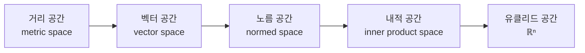
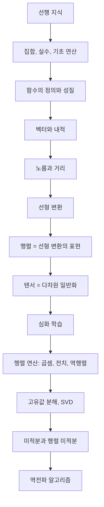

# 벡터, 함수, 집합 - 수학적 개념 완전 정복

---

## 1. 주제 개요 및 중요성

**한 문장 정의**: 집합, 함수, 스칼라, 벡터, 선형 변환, 행렬, 텐서는 딥러닝의 모든 연산을 수학적으로 기술하는 기본 언어이다.

**왜 배워야 하는가**:
- 딥러닝의 모든 레이어는 함수이고, 입출력은 벡터(텐서)이며, 가중치는 행렬이다. 이 개념 없이는 신경망의 작동 원리를 이해할 수 없다.
- 내적은 Attention 메커니즘의 핵심이고, 노름은 정규화와 손실 함수의 근간이다.
- 선형 변환과 행렬의 관계를 알아야 LoRA, SVD 등 현대 기법의 수학적 기반을 파악할 수 있다.

**어떤 문제를 해결하는가**:
- 데이터를 어떻게 수학적으로 표현할 것인가 (벡터, 텐서)
- 변환을 어떻게 정의하고 계산할 것인가 (함수, 행렬)
- 유사도와 거리를 어떻게 측정할 것인가 (내적, 노름, 거리)

---

## 2. 입문자용 설명 (Level 1)

### 집합: "중복 없는 가방"
집합은 물건을 담은 가방이다. {사과, 바나나, 딸기}처럼 순서가 없고, 같은 것을 두 번 넣어도 하나로 친다. 카테시안 곱은 두 가방에서 하나씩 골라 짝짓는 모든 경우를 만드는 것이다.

### 함수: "자판기"
동전(입력)을 넣으면 반드시 음료(출력) 하나가 나온다. 같은 동전에서 두 가지 음료가 나올 수 없고, 같은 동전은 항상 같은 음료를 준다. 신경망의 각 레이어가 바로 이 자판기(함수)이다.

### 스칼라: "온도계의 숫자"
크기만 있고 방향이 없는 하나의 숫자다. "오늘 기온 25도"에서 25가 스칼라이며, 딥러닝에서 학습률(learning rate)이 대표적 스칼라다.

### 벡터: "레시피"
(밀가루 200g, 설탕 100g, 달걀 3개) = [200, 100, 3]. 숫자의 순서가 중요하며, 두 레시피가 비슷한지 비교하는 것이 내적, 차이를 측정하는 것이 거리다. ChatGPT가 단어를 숫자 리스트로 바꾸어 의미를 비교하는 원리가 바로 벡터와 내적이다.

### 선형 변환: "공정한 복사기"
원본의 크기를 2배로 키우면 모든 부분이 2배가 된다. 두 장을 겹치고 복사하면, 각각 복사한 뒤 겹친 것과 결과가 같다. 이 "공정성"이 선형 변환의 핵심이다.

### 행렬: "변환 규칙표"
기본 재료(기저 벡터) 각각이 어디로 바뀌는지 적어놓은 표다. 이 표만 있으면 어떤 재료 조합이든 변환 결과를 알 수 있다.

### 텐서: "표를 쌓은 상자"
스칼라(점) → 벡터(줄) → 행렬(표) → 텐서(표 여러 장을 쌓은 것). 컬러 사진은 가로 x 세로 x RGB = 3차원 텐서이다.

---

## 3. 기술적 상세 설명 (Level 2)

### 3.1 집합과 카테시안 곱

$$A \times B := \{(a, b) : a \in A, b \in B\}$$

- $A$: 첫 번째 집합
- $B$: 두 번째 집합
- $(a, b)$: 순서쌍 (순서가 있으므로 $(a, b) \neq (b, a)$)
- $|A \times B| = |A| \cdot |B|$: 결과의 원소 개수는 각 집합 크기의 곱

**구체적 예시**: $A = \{1, 2, 3\}$, $B = \{x, y\}$이면:
$$A \times B = \{(1,x),(1,y),(2,x),(2,y),(3,x),(3,y)\}$$
원소 개수: $3 \times 2 = 6$개

**딥러닝 연결**: 입력 공간 $\mathbb{R}^n = \underbrace{\mathbb{R} \times \mathbb{R} \times \cdots \times \mathbb{R}}_{n\text{번}}$이다. 즉 $n$차원 입력은 실수 $n$개의 카테시안 곱이다.

### 3.2 함수와 단사

$$f : A \to B, \quad a \mapsto f(a)$$

- $A$: 정의역(domain) - 입력이 속하는 집합
- $B$: 공역(codomain) - 출력이 속하는 집합
- $f(a)$: $a$에 대응하는 유일한 출력

**단사(one-to-one, injective)**: $a \neq a' \Rightarrow f(a) \neq f(a')$
- "서로 다른 입력은 서로 다른 출력을 낳는다"
- 대우: $f(a) = f(a') \Rightarrow a = a'$

**지시 함수(indicator function)**:
$$\mathbf{1}(p) = \begin{cases} 1 & p \text{가 참일 때} \\ 0 & p \text{가 거짓일 때} \end{cases}$$

**딥러닝 연결**: 전체 네트워크는 함수의 합성이다:
$$f = f_L \circ f_{L-1} \circ \cdots \circ f_1$$
각 $f_\ell : \mathbb{R}^{n_{\ell-1}} \to \mathbb{R}^{n_\ell}$이 하나의 레이어에 대응한다.

### 3.3 벡터, 내적, 노름, 거리

**벡터**: $v = [v_1, v_2, \ldots, v_n]^\top \in \mathbb{R}^n$ — $n$개의 실수로 이루어진 순서 튜플

**내적(inner product)**:
$$\langle v, w \rangle = v_1 w_1 + v_2 w_2 + \cdots + v_n w_n = \sum_{i=1}^n v_i w_i$$

- 결과: 스칼라 (하나의 숫자)
- 의미: 두 벡터가 "같은 방향을 얼마나 가리키는지"를 수치화
- $\langle v, w \rangle = 0$이면 두 벡터는 직교($v \perp w$)

**구체적 예시**: $v = [1, 2, 3]^\top$, $w = [4, 5, 6]^\top$이면:
$$\langle v, w \rangle = 1 \times 4 + 2 \times 5 + 3 \times 6 = 4 + 10 + 18 = 32$$

**내적의 3가지 성질**:
1. 대칭: $\langle v, w \rangle = \langle w, v \rangle$
2. 선형: $\langle av + bu, w \rangle = a\langle v, w \rangle + b\langle u, w \rangle$
3. 양정치: $\langle v, v \rangle \geq 0$, 등호는 $v = \mathbf{0}$일 때만

**노름(norm)**: 벡터의 "길이"
$$\|v\| = \sqrt{\langle v, v \rangle} = \sqrt{v_1^2 + v_2^2 + \cdots + v_n^2}$$

$v = [1, 2, 3]^\top$이면: $\|v\| = \sqrt{1 + 4 + 9} = \sqrt{14} \approx 3.74$

**거리(distance)**:
$$d(v, w) = \|v - w\|$$

**거리-내적 관계**:
$$\|v - w\|^2 = \|v\|^2 + \|w\|^2 - 2\langle v, w \rangle$$

이 공식은 내적이 클수록(유사할수록) 거리가 줄어든다는 핵심 관계를 보여준다.

### 3.4 선형 변환

$L : \mathbb{R}^n \to \mathbb{R}^m$이 선형이란 것은 다음 두 조건을 만족한다는 것이다:

1. **가법성**: $L(v + u) = L(v) + L(u)$
2. **동차성**: $L(av) = aL(v)$

합쳐서 **중첩 원리**: $L(\alpha v + \beta u) = \alpha L(v) + \beta L(u)$

**Linear vs. Affine**:
- $L(v) = Wv$: 선형 (원점을 원점으로 보낸다)
- $L(v) = Wv + b$ ($b \neq 0$): 아핀 (원점을 이동시킨다)
- `nn.Linear`는 수학적으로 아핀 변환이지만 관례적으로 "linear"라 부른다

### 3.5 행렬 = 선형 변환의 표현

선형 변환 $L : \mathbb{R}^n \to \mathbb{R}^m$의 행렬 표현:
$$A_L = [L(e_1) \quad L(e_2) \quad \cdots \quad L(e_n)]$$

- $e_i$: $i$번째 표준 기저 벡터 (예: $e_1 = [1,0,0]^\top$)
- $L(e_i)$: $i$번째 기저 벡터가 변환된 결과 = 행렬의 $i$번째 열
- $A_L \in \mathbb{R}^{m \times n}$: $m$행 $n$열 행렬

**핵심 정리**: 선형 변환과 행렬은 일대일 대응한다.

$$L(v) = L\left(\sum_{i=1}^n v_i e_i\right) = \sum_{i=1}^n v_i L(e_i) = A_L v$$

**구체적 예시**: $A = \begin{bmatrix} 1 & 1 & 1 \\ 1 & 2 & 3 \end{bmatrix}$이면:
$$Ae_1 = \begin{bmatrix} 1 \\ 1 \end{bmatrix}, \quad Ae_2 = \begin{bmatrix} 1 \\ 2 \end{bmatrix}, \quad Ae_3 = \begin{bmatrix} 1 \\ 3 \end{bmatrix}$$

각 열이 바로 해당 기저 벡터의 변환 결과이다.

### 3.6 텐서

| 차수 | 이름 | 딥러닝 예시 | 형태 |
|------|------|------------|------|
| 0 | 스칼라 | loss 값 | `torch.tensor(3.14)` |
| 1 | 벡터 | 단어 임베딩 | `shape (768,)` |
| 2 | 행렬 | 가중치 $W$ | `shape (512, 768)` |
| 3 | 3차 텐서 | 이미지 (C, H, W) | `shape (3, 224, 224)` |
| 4 | 4차 텐서 | 이미지 배치 (B, C, H, W) | `shape (32, 3, 224, 224)` |

### 3.7 공간의 계층 구조

유클리드 공간 $\mathbb{R}^n$은 내적이 정의된 가장 "풍부한" 공간이다. 내적으로부터 노름이, 노름으로부터 거리가, 거리로부터 위상이 유도된다.

---

## 4. 전문가 수준 핵심 요약 (Level 3)

딥러닝은 $\mathbb{R}^n$에서 $\mathbb{R}^m$으로의 함수 $f_\theta$를 데이터로부터 학습하는 과정이다. 각 레이어는 아핀 변환($Wx + b$)과 비선형 활성화 함수의 합성으로 구성되며, Universal Approximation Theorem에 의해 충분히 넓은 네트워크는 임의의 연속 함수를 근사할 수 있다. 벡터의 내적은 Transformer의 attention score($\langle q, k \rangle / \sqrt{d_k}$)와 코사인 유사도의 핵심이며, $\|v - w\|^2 = \|v\|^2 + \|w\|^2 - 2\langle v, w \rangle$ 관계는 contrastive loss의 수학적 기반이다. 행렬의 본질은 선형 변환의 유한차원 표현이고, 이 관점에서 행렬 분해(SVD, eigendecomposition)가 LoRA, PCA 등의 이론적 토대를 형성한다.

---

## 5. 메타인지 체크포인트

스스로에게 물어보세요:

- [ ] 이 개념을 10살 아이에게 설명할 수 있는가? ("벡터는 숫자 리스트, 내적은 비슷한 정도를 점수 매기는 것")
- [ ] 왜 선형 변환(Linear)이 아니라 아핀 변환(Affine)인 `nn.Linear`를 쓰는지 설명할 수 있는가? (비선형 활성화와 결합해야 표현력이 생기며, bias 항이 decision boundary를 원점에서 벗어나게 함)
- [ ] 내적 없이는 무엇을 할 수 없는가? (유사도 측정, attention score 계산, 코사인 유사도, L2 loss)
- [ ] 벡터와 집합의 차이를 어떻게 설명하는가? (집합은 순서와 중복 없음, 벡터는 순서 있고 중복 가능)
- [ ] Transformer의 attention에 이 개념을 어떻게 적용하는가? ($\langle q, k \rangle$이 query와 key의 내적으로 유사도를 계산)

---

## 6. 흔한 오개념 및 주의사항

**"벡터는 화살표다"**
화살표는 $\mathbb{R}^2, \mathbb{R}^3$에서의 시각화일 뿐이다. 768차원 단어 임베딩도 벡터이며, 덧셈과 스칼라곱이 정의된 추상적 대상이다.

**"함수는 수식이다"**
함수는 매핑 규칙이다. 테이블, 그래프, 학습된 가중치 모두 함수를 정의한다. 뉴럴 네트워크는 수식으로 쓸 수 없는 복잡한 함수를 학습한다.

**"$y = 2x + 3$이 선형 함수다"**
수학에서 선형 변환은 $L(\mathbf{0}) = \mathbf{0}$을 만족해야 한다. $+3$ 때문에 이것은 아핀 변환이다.

**"행렬은 숫자의 사각형 배열이다"**
행렬의 본질은 선형 변환의 표현이다. 각 열은 기저 벡터가 어디로 가는지를 나타낸다.

**"내적은 벡터끼리 곱하는 것이다"**
내적은 두 벡터의 유사도를 측정하는 연산이다. 결과는 스칼라이며, Attention score의 핵심이다.

**"집합에 순서가 있다"**
집합은 비순서(unordered)이다. 순서가 필요하면 순서쌍(tuple)이나 벡터를 써야 한다. $\{1,2,3\} = \{3,1,2\}$이지만 $[1,2,3] \neq [3,1,2]$이다.

---

## 7. 학습 로드맵

**선행 지식**: 실수의 사칙연산, 좌표계 개념, 피타고라스 정리
**다음 단계**: 행렬 곱셈, 선형 공간(부분공간, 기저, 차원), 고유값 분해

---

## 8. 실전 활용 사례

### 사례 1: 단어 임베딩과 유사도 측정
- **상황**: "왕"과 "여왕"의 의미적 유사도를 측정하고 싶다
- **적용**: Word2Vec으로 각 단어를 300차원 벡터로 변환 후, 코사인 유사도 $\frac{\langle v_\text{왕}, v_\text{여왕} \rangle}{\|v_\text{왕}\| \cdot \|v_\text{여왕}\|}$ 계산
- **결과**: 0.85 정도의 높은 유사도 → 의미적으로 가깝다는 수학적 근거

### 사례 2: 신경망의 순전파
- **상황**: 이미지(3x224x224 텐서)를 입력받아 10개 클래스 분류
- **적용**: 각 레이어에서 $y = Wx + b$ (행렬-벡터 곱 + bias) 후 ReLU(비선형) 적용, 이를 반복
- **결과**: 최종 10차원 벡터의 각 원소가 클래스별 점수

### 사례 3: Attention 메커니즘
- **상황**: "The cat sat on the mat"에서 각 단어의 중요도를 계산
- **적용**: Query와 Key 벡터의 내적 $\langle q, k \rangle / \sqrt{d_k}$로 attention score 산출
- **결과**: "cat"이 "sat"과 높은 attention → 주어-동사 관계 포착

---

## 9. 추가 학습 자료

**입문자용**:
- 3Blue1Brown "Essence of Linear Algebra" (YouTube 시리즈) - 벡터와 선형 변환의 시각적 직관
- Khan Academy Linear Algebra - 기초부터 차근차근

**중급자용**:
- Gilbert Strang, "Introduction to Linear Algebra" - 행렬과 공간의 관계 중심
- Boyd & Vandenberghe, "Introduction to Applied Linear Algebra" - 응용 중심

**전문가용**:
- Horn & Johnson, "Matrix Analysis" - 행렬 이론의 바이블
- Goodfellow et al., "Deep Learning" Chapter 2 - 딥러닝 관점의 선형대수 정리

---

> **핵심을 날카롭게 정리하면:**
>
> 딥러닝은 벡터를 입력받아 행렬(선형 변환)과 비선형 함수를 반복 적용하여 원하는 출력 벡터를 만드는 과정이다. AI가 배우는 것은 결국 입력 벡터를 출력 벡터로 바꾸는 최적의 행렬(가중치)을 찾는 것이다.
>
> 이 단원이 중요한 이유는 모든 후속 개념(고유값 분해, SVD, 역전파)의 언어가 여기서 정의되기 때문이다.
>
> 진정한 마스터와 피상적 이해의 차이: 행렬을 "숫자 표"가 아닌 "선형 변환의 표현"으로, 벡터를 "화살표"가 아닌 "벡터 공간의 원소"로, 내적을 "곱해서 더한 것"이 아닌 "유사도 측정"으로 인식하는 것이다.
