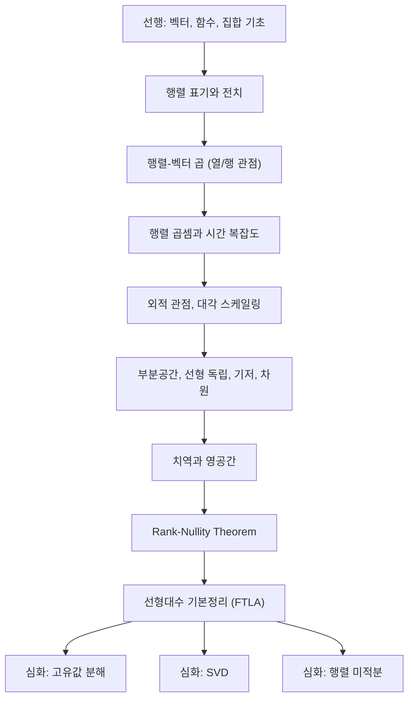

# 행렬과 선형 공간 - 수학적 개념 완전 정복

---

## 1. 주제 개요 및 중요성

**한 문장 정의**: 행렬 연산(곱셈, 전치, 대각 스케일링)과 선형 공간 이론(부분공간, 기저, 차원, 치역, 영공간)은 딥러닝의 모든 선형 연산을 지배하는 수학적 뼈대이다.

**왜 배워야 하는가**:
- `nn.Linear(in, out)`의 forward pass가 행렬-벡터 곱이다. 행렬 곱의 관점(열 관점, 행 관점, 외적 관점)을 이해해야 Attention, LoRA 등의 구조를 파악할 수 있다.
- Rank-Nullity Theorem은 "정보의 보존 법칙"으로, 네트워크가 얼마나 많은 정보를 보존/소멸하는지 분석하는 근간이다.
- 선형대수 기본정리(FTLA)는 SVD, PCA, 최소제곱법 등 모든 행렬 분석의 출발점이다.

**어떤 문제를 해결하는가**:
- 행렬 연산의 정확한 의미와 복잡도 분석
- 데이터 공간의 구조 파악 (차원, 기저, 독립성)
- 변환 후 살아남는 정보(치역)와 사라지는 정보(영공간)의 분석

---

## 2. 입문자용 설명 (Level 1)

### 행렬 표기와 전치: "엑셀 시트 뒤집기"
행렬은 숫자가 적힌 직사각형 표다. 전치는 이 표를 대각선으로 뒤집는 것으로, 가로줄이 세로줄이 되고 세로줄이 가로줄이 된다.

### 행렬-벡터 곱: "여러 가게의 장바구니 계산"
사과 3개, 바나나 2개를 담은 장바구니가 있고, 가게마다 가격이 다르다면, 가격표(행렬) x 장바구니(벡터) = 가게별 총 금액(결과 벡터)이다. 각 가게에서의 계산이 내적 하나에 해당한다.

### 행렬 곱셈: "변환의 연결"
한국어를 영어로 번역하고, 영어를 일본어로 번역하는 두 기계를 연결하면 한국어를 일본어로 번역하는 기계가 된다. 행렬 곱셈은 이렇게 두 변환을 하나로 합치는 것이다.

### 선형 독립과 기저: "레고 블록"
빨강과 파랑 블록은 서로 대체 불가능하다(독립). 이 두 블록으로 만들 수 있는 모든 작품이 span이다. 모든 것을 만들 수 있는 최소한의 블록 세트가 기저이고, 블록 종류의 수가 차원이다.

### 치역과 영공간: "사진 필터"
사진을 흑백으로 바꾸면, 나올 수 있는 모든 흑백 사진의 집합이 치역이고, 완전히 사라지는(검은 화면이 되는) 순수 색 정보가 영공간이다.

### Rank-Nullity: "교실의 합격/불합격"
30명 학생 = 합격자 수 + 불합격자 수. 마찬가지로 입력 차원 = 살아남는 차원(rank) + 사라지는 차원(nullity).

---

## 3. 기술적 상세 설명 (Level 2)

### 3.1 행렬 표기법과 전치

$A \in \mathbb{R}^{m \times n}$: $m$행 $n$열의 실수 행렬. $a_{ij}$는 $i$번째 행, $j$번째 열의 원소.

**전치**: $(A^\top)_{ij} = a_{ji}$ — 행과 열의 인덱스를 교환

**구체적 예시**:
$$A = \begin{bmatrix} 1 & 2 & 3 \\ 4 & 5 & 6 \end{bmatrix} \quad \Rightarrow \quad A^\top = \begin{bmatrix} 1 & 4 \\ 2 & 5 \\ 3 & 6 \end{bmatrix}$$

$2 \times 3$ 행렬의 전치는 $3 \times 2$ 행렬이 된다.

**전치의 핵심 성질**:
$$(AB)^\top = B^\top A^\top$$

순서가 뒤집힌다. "양말 신고 신발 신으면, 벗을 때는 신발 먼저 벗는다."

### 3.2 행렬-벡터 곱의 두 관점

**열 관점(column view)**: $A$의 열벡터들의 선형 결합
$$Av = v_1 a_1 + v_2 a_2 + \cdots + v_n a_n = \sum_{i=1}^{n} v_i a_i$$

- $a_i$: $A$의 $i$번째 열벡터
- $v_i$: 가중치(계수)
- 결과: $A$의 **열공간(column space)** 안의 벡터

**구체적 예시**:
$$\begin{bmatrix} 1 & 0 \\ 0 & 1 \\ 1 & 1 \end{bmatrix} \begin{bmatrix} 3 \\ 2 \end{bmatrix} = 3\begin{bmatrix}1\\0\\1\end{bmatrix} + 2\begin{bmatrix}0\\1\\1\end{bmatrix} = \begin{bmatrix}3\\2\\5\end{bmatrix}$$

**행 관점(row view)**: 각 행과 벡터의 내적
$$c_i = a_{i,:} \cdot v$$

두 관점은 같은 곱셈을 다른 방식으로 해석한 것이다.

### 3.3 행렬 곱셈

$A \in \mathbb{R}^{m \times n}$, $B \in \mathbb{R}^{n \times p}$일 때, $C = AB \in \mathbb{R}^{m \times p}$:

$$c_{ij} = \sum_{k=1}^{n} a_{ik} b_{kj}$$

- $c_{ij}$: $A$의 $i$번째 행과 $B$의 $j$번째 열의 내적
- 시간 복잡도: $O(mnp)$, 정방행렬이면 $O(n^3)$

**구체적 예시**:
$$\begin{bmatrix} 1 & 2 \\ 3 & 4 \end{bmatrix} \begin{bmatrix} 5 & 6 \\ 7 & 8 \end{bmatrix} = \begin{bmatrix} 1 \cdot 5 + 2 \cdot 7 & 1 \cdot 6 + 2 \cdot 8 \\ 3 \cdot 5 + 4 \cdot 7 & 3 \cdot 6 + 4 \cdot 8 \end{bmatrix} = \begin{bmatrix} 19 & 22 \\ 43 & 50 \end{bmatrix}$$

**교환법칙 불성립**: $AB \neq BA$ (일반적). 레이어 순서를 바꾸면 완전히 다른 네트워크가 된다.

### 3.4 외적 관점의 행렬 곱

$$AB = \sum_{k=1}^{n} a_k b_k^\top$$

- $a_k$: $A$의 $k$번째 열
- $b_k^\top$: $B$의 $k$번째 행
- $a_k b_k^\top$: rank-1 행렬 (외적)

행렬 곱은 rank-1 행렬들의 합으로 분해된다. 이것이 SVD 저랭크 근사와 LoRA의 이론적 기반이다.

### 3.5 대각 행렬 스케일링

$$D = \begin{bmatrix} d_1 & 0 \\ 0 & d_2 \end{bmatrix}$$

- $DX$: 각 **행**에 $d_i$를 곱한다 (행 스케일링)
- $XD$: 각 **열**에 $d_i$를 곱한다 (열 스케일링)

**구체적 예시**: $D = \text{diag}(2, 3)$, $X = \begin{bmatrix} 1 & 4 \\ 5 & 6 \end{bmatrix}$이면:
- $DX = \begin{bmatrix} 2 & 8 \\ 15 & 18 \end{bmatrix}$ (1행 x2, 2행 x3)
- $XD = \begin{bmatrix} 2 & 12 \\ 10 & 18 \end{bmatrix}$ (1열 x2, 2열 x3)

**딥러닝 연결**: BatchNorm의 $\gamma$ 스케일링은 대각 행렬 곱이며, Adam optimizer도 gradient의 대각 pre-conditioning이다.

### 3.6 선형 결합, 독립, Span, 기저, 차원

**선형 결합**: $\sum_{i=1}^{n} a_i v_i$ (스칼라 $a_i$와 벡터 $v_i$의 가중합)

**선형 독립**: $\sum_{i=1}^{n} a_i v_i = 0 \Rightarrow$ 모든 $a_i = 0$
- 어떤 벡터도 나머지의 선형 결합으로 표현 불가

**Span**: 주어진 벡터들의 모든 선형 결합의 집합

**기저(Basis)**: 선형 독립 + Span이 전체 공간 = 최소한의 "건축 자재"

**차원(Dimension)**: 기저의 벡터 수. 기저는 여러 개 가능하지만 크기(차원)는 항상 동일.

**판별법**: 벡터들을 열로 한 행렬 $V$의 $\text{rank}(V) = n$이면 선형 독립

### 3.7 치역(Range)과 영공간(Null Space)

$$\mathscr{R}(A) := \{Av : v \in \mathbb{R}^n\} \subseteq \mathbb{R}^m$$
$$\mathscr{N}(A) := \{v \in \mathbb{R}^n : Av = 0\} \subseteq \mathbb{R}^n$$

- 치역 = 열공간 = $A$에 모든 입력을 넣었을 때 나오는 출력의 집합
- 영공간 = 핵(kernel) = $A$를 곱하면 0이 되는 입력의 집합

### 3.8 Rank-Nullity Theorem

$$n = \text{rank}(A) + \text{nullity}(A)$$

- $\text{rank}(A) = \dim(\mathscr{R}(A))$: 살아남는 차원
- $\text{nullity}(A) = \dim(\mathscr{N}(A))$: 사라지는 차원
- $n$: 입력 공간의 차원

**Rank의 핵심 성질**:
1. $\text{rank}(A) \leq \min(m, n)$
2. $\text{rank}(A) = \text{rank}(A^\top) = \text{rank}(A^\top A) = \text{rank}(AA^\top)$
3. $\text{rank}(AB) \leq \min(\text{rank}(A), \text{rank}(B))$

### 3.9 선형대수 기본정리 (FTLA)

$$\mathbb{R}^n = \mathscr{N}(A) \oplus \mathscr{R}(A^\top)$$

**4개의 근본 부분공간**:

| 부분공간 | 이름 | 소속 공간 |
|---------|------|----------|
| $\mathscr{R}(A)$ | 열공간 | $\mathbb{R}^m$ |
| $\mathscr{R}(A^\top)$ | 행공간 | $\mathbb{R}^n$ |
| $\mathscr{N}(A)$ | 영공간 | $\mathbb{R}^n$ |
| $\mathscr{N}(A^\top)$ | 왼쪽 영공간 | $\mathbb{R}^m$ |

**직교 관계**: $\mathscr{R}(A^\top) \perp \mathscr{N}(A)$

모든 입력 벡터 $x$를 "행렬이 반응하는 성분"(행공간)과 "행렬이 무시하는 성분"(영공간)으로 유일하게 분해할 수 있다.

---

## 4. 전문가 수준 핵심 요약 (Level 3)

행렬 곱의 세 관점(내적, 열 선형결합, 외적 합)은 동일한 연산의 다른 해석이며, 각각 attention score 계산, feature 혼합, 저랭크 근사에 대응한다. Rank-Nullity Theorem $n = \text{rank}(A) + \text{null}(A)$는 정보의 보존 법칙으로, 네트워크가 보존하는 정보량(rank)과 소멸시키는 정보량(nullity)의 trade-off를 정량화한다. FTLA의 직교 분해 $\mathbb{R}^n = \mathscr{N}(A) \oplus \mathscr{R}(A^\top)$는 SVD가 4개의 근본 부분공간을 모두 제공한다는 사실의 이론적 근거이며, PCA의 주성분 방향이 $\mathscr{R}(X^\top)$에, 무의미한 방향이 $\mathscr{N}(X)$에 대응함을 설명한다. LoRA의 저랭크 업데이트 $\Delta W = BA$는 외적 관점의 직접적 응용이다.

---

## 5. 메타인지 체크포인트

스스로에게 물어보세요:

- [ ] $Av$를 열벡터의 선형 결합으로 설명할 수 있는가?
- [ ] $AB \neq BA$인 구체적 예시를 즉시 들 수 있는가?
- [ ] $(AB)^\top = B^\top A^\top$이 왜 순서가 뒤집히는지 직관적으로 설명할 수 있는가?
- [ ] Rank-Nullity Theorem이 없으면 무엇을 할 수 없는가? (정보 보존/소멸 분석 불가)
- [ ] 비슷해 보이는 "원소별 곱(Hadamard)"과 "행렬 곱"이 어떻게 다른가?

---

## 6. 흔한 오개념 및 주의사항

**"행렬 곱 = 같은 위치 원소끼리 곱"**
그것은 원소별 곱(Hadamard product)이다. 행렬 곱은 행과 열의 내적이다. NumPy에서 `*`는 원소별 곱, `@`가 행렬 곱이다.

**"$AB = BA$이다"**
행렬 곱은 교환법칙이 거의 항상 성립하지 않는다. 레이어 순서를 바꾸면 완전히 다른 결과가 나온다.

**"$(AB)^\top = A^\top B^\top$이다"**
틀리다. $(AB)^\top = B^\top A^\top$으로 순서가 반드시 뒤집힌다.

**"벡터가 많으면 차원이 높다"**
차원은 독립인 벡터의 수다. 100개 벡터가 모두 같은 직선 위에 있으면 차원은 1이다.

**"치역 = 공역이다"**
치역(range/image)은 실제로 도달하는 출력이고, 공역(codomain)은 출력이 속하는 전체 공간이다. $\text{rank} < m$이면 치역은 공역의 진부분공간이다.

**"영공간이 비어있다"**
최소한 영벡터 $\mathbf{0}$은 항상 영공간에 속한다. "trivial" 영공간과 "empty set"은 다르다.

---

## 7. 학습 로드맵

---

## 8. 실전 활용 사례

### 사례 1: Linear Layer의 순전파
- **상황**: 입력 $x \in \mathbb{R}^{768}$을 512차원으로 변환
- **적용**: $y = Wx + b$ ($W \in \mathbb{R}^{512 \times 768}$)는 행렬-벡터 곱
- **결과**: 열 관점으로 보면, $W$의 768개 열벡터를 $x$의 원소로 가중합한 것

### 사례 2: LoRA 저랭크 업데이트
- **상황**: 70B 파라미터 LLM을 fine-tuning하되 메모리를 절약하고 싶다
- **적용**: $\Delta W = BA$ ($B \in \mathbb{R}^{d \times r}$, $A \in \mathbb{R}^{r \times d}$, $r \ll d$)는 $r$개의 외적 합
- **결과**: 전체 가중치 대신 저랭크 행렬만 학습하여 파라미터 수를 $d^2$에서 $2dr$로 축소

### 사례 3: Rank Collapse 진단
- **상황**: 깊은 Transformer에서 attention map의 다양성이 줄어든다
- **적용**: attention 행렬의 rank를 측정하여 정보 소멸 여부 확인
- **결과**: rank가 줄어들면 영공간이 커진 것 → Residual connection이나 정규화로 대응

---

## 9. 추가 학습 자료

**입문자용**: 3Blue1Brown "Essence of Linear Algebra" Chapter 3-4 (행렬 곱셈의 기하학적 의미)
**중급자용**: Gilbert Strang, "Linear Algebra and Its Applications" - FTLA의 4개 부분공간 중심
**전문가용**: Trefethen & Bau, "Numerical Linear Algebra" - 수치적 안정성과 행렬 분해

---

> **핵심을 날카롭게 정리하면:**
>
> 행렬은 공간을 변환하는 함수이며, $n = \text{rank}(A) + \text{null}(A)$로 정보의 보존과 소멸이 결정된다. 행렬 곱의 외적 관점($AB = \sum a_k b_k^\top$)이 LoRA와 저랭크 근사의 수학적 기반이다.
>
> 진정한 마스터와 피상적 이해의 차이: 행렬 곱을 "숫자 계산"이 아닌 "공간 변환의 합성"으로, rank를 "독립 열의 수"가 아닌 "보존되는 정보의 차원"으로, FTLA를 "시험 정리"가 아닌 "모든 행렬 분석의 지도"로 인식하는 것이다.
