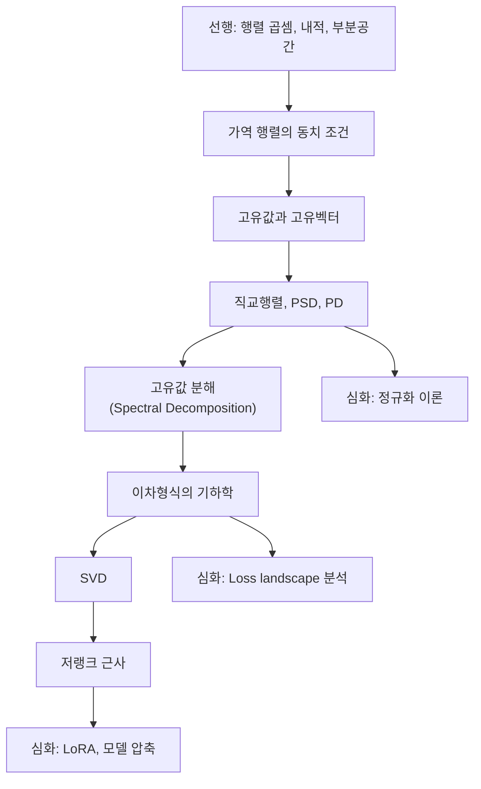

# 고유값 분해와 SVD - 수학적 개념 완전 정복

---

## 1. 주제 개요 및 중요성

**한 문장 정의**: 고유값 분해(Eigendecomposition)는 대칭 행렬을 "회전-스케일링-역회전"으로, SVD(Singular Value Decomposition)는 **임의의** 행렬을 "회전-스케일링(+차원변환)-회전"으로 분해하는 강력한 도구이다.

**왜 배워야 하는가**:
- PCA(주성분 분석)는 공분산 행렬의 고유값 분해이며, 데이터의 주요 변동 방향을 찾는다
- LoRA(Low-Rank Adaptation)는 SVD 저랭크 근사의 직접적 응용이다
- 손실 함수의 Hessian 고유값이 학습률 상한을 결정한다: $\eta < 2/\lambda_{\max}$
- Spectral Normalization은 최대 특이값으로 GAN을 안정화한다

**어떤 문제를 해결하는가**:
- 행렬의 구조적 본질 파악 (어떤 방향으로 얼마나 늘이는가)
- 저랭크 근사를 통한 데이터/모델 압축
- 최적화 지형(loss landscape)의 곡률 분석

---

## 2. 입문자용 설명 (Level 1)

### 고유값과 고유벡터: "바람과 풍향계"
바람이 불면 대부분의 물체는 방향이 바뀌지만, 풍향계는 바람 방향으로 정렬되어 방향이 안 바뀌고 세기만 느낀다. 이 "바람 방향으로 정렬된 물체"가 고유벡터, "느끼는 세기"가 고유값이다.

### 고유값 분해: "복잡한 요리의 3단계"
복잡한 변환을 세 단계로 분해하는 것이다:
1. 좌표축을 특별한 방향으로 회전 ($U^\top$)
2. 각 축 방향으로 늘이거나 줄이기 ($\Lambda$)
3. 원래 좌표로 돌려놓기 ($U$)

### PSD/PD: "그릇의 모양"
양의 정부호(PD) 행렬은 모든 방향으로 올라가는 그릇 모양이다(최솟값 존재). PSD는 어떤 방향으로는 평평할 수 있는 그릇이다.

### SVD: "모든 변환의 3단계 분해"
어떤 변환이든 "회전 → 늘리기/줄이기 → 회전"으로 분해할 수 있다. 고유값 분해는 정사각 대칭 행렬에만 적용되지만, SVD는 어떤 모양의 행렬에도 적용된다.

### 저랭크 근사: "JPEG 압축"
사진의 가장 중요한 특징부터 차례로 더해가면, 적은 정보로도 원본에 가까운 이미지를 만들 수 있다.

---

## 3. 기술적 상세 설명 (Level 2)

### 3.1 가역 행렬의 동치 조건 (TFAE)

정사각 행렬 $A \in \mathbb{R}^{n \times n}$에 대해, 다음 조건들은 **모두 동치**이다:

| 조건 | 의미 |
|------|------|
| $A$가 가역 ($\exists A^{-1}$) | 역변환이 존재 |
| $\text{rank}(A) = n$ | 모든 차원 보존 |
| $Av = 0 \Rightarrow v = 0$ | 영벡터만 0으로 보냄 |
| $Ax = b$에 유일한 해 존재 | 방정식이 정확히 풀림 |
| 모든 고유값 $\neq 0$ | 어떤 방향도 소멸 안 함 |
| $\det(A) \neq 0$ | 부피를 0으로 만들지 않음 |

**구체적 예시**:
$A = \begin{pmatrix} 2 & 1 \\ 1 & 3 \end{pmatrix}$: $\det(A) = 5 \neq 0$ → 가역

$B = \begin{pmatrix} 1 & 2 \\ 2 & 4 \end{pmatrix}$: $\det(B) = 0$ → 비가역 (두 번째 행이 첫 번째의 2배)

### 3.2 고유값과 고유벡터

$$Av = \lambda v \quad (v \neq 0)$$

- $A \in \mathbb{R}^{n \times n}$: 정사각 행렬
- $v$: 고유벡터 — $A$에 의해 방향이 바뀌지 않는 벡터 (보통 $\|v\| = 1$로 정규화)
- $\lambda$: 고유값 — 고유벡터가 늘어나거나 줄어드는 비율

**고유값 구하기**: 특성방정식 $\det(A - \lambda I) = 0$을 풀면 된다.

**구체적 예시**: $A = \begin{pmatrix} 3 & 1 \\ 0 & 2 \end{pmatrix}$

$\det\begin{pmatrix} 3-\lambda & 1 \\ 0 & 2-\lambda \end{pmatrix} = (3-\lambda)(2-\lambda) = 0$

$\lambda_1 = 3$, $\lambda_2 = 2$

검증: $Av_1 = \begin{pmatrix}3\\0\end{pmatrix} = 3\begin{pmatrix}1\\0\end{pmatrix} = 3v_1$ (방향 유지, 크기 3배)

### 3.3 직교행렬, PSD, PD

**직교행렬**: $U^\top U = UU^\top = I$
- 각 열(행)이 정규직교: $u_i^\top u_j = \delta_{ij}$
- 길이 보존: $\|Ux\| = \|x\|$ — 회전/반사만 수행

**양의 준정부호(PSD)**: 대칭 행렬 $A$에서 $v^\top A v \geq 0, \; \forall v \neq 0$
- 모든 고유값 $\geq 0$
- $BB^\top$는 항상 PSD (Gram matrix)
- 표기: $A \succeq 0$

**양의 정부호(PD)**: 대칭 행렬 $A$에서 $v^\top A v > 0, \; \forall v \neq 0$
- 모든 고유값 $> 0$ → 가역
- $BB^\top + \lambda I$ ($\lambda > 0$)는 항상 PD
- 이차형식이 아래로 볼록 → 유일한 최솟값 존재

**구체적 예시**: $A = \begin{pmatrix} 2 & 0 \\ 0 & 3 \end{pmatrix}$이면:
$$v^\top A v = 2v_1^2 + 3v_2^2 > 0 \quad (\forall v \neq 0)$$
→ PD이며, 이차형식 등고선은 타원 형태

### 3.4 고유값 분해 (Spectral Decomposition)

실수 대칭 행렬 $A$에 대해:

$$A = U\Lambda U^\top = \sum_{i=1}^{n} \lambda_i u_i u_i^\top$$

- $U = [u_1, u_2, \ldots, u_n]$: 직교행렬 (열이 고유벡터)
- $\Lambda = \text{diag}(\lambda_1, \ldots, \lambda_n)$: 고유값의 대각행렬
- $u_i u_i^\top$: rank-1 행렬 (외적)

**기하학적 의미**: 좌표 변환($U^\top$) → 축별 스케일링($\Lambda$) → 역변환($U$)

**이차형식과의 연결**:
$$f(x) = x^\top A x = x^\top U\Lambda U^\top x = y^\top \Lambda y = \sum_i \lambda_i y_i^2$$
($y = U^\top x$로 좌표 변환하면 변수가 분리된다)

**구체적 예시**: $A = \begin{pmatrix} 5 & 1 \\ 1 & 3 \end{pmatrix}$
- 고유값: $\lambda_1 \approx 5.236$, $\lambda_2 \approx 2.764$
- $A = \lambda_1 u_1 u_1^\top + \lambda_2 u_2 u_2^\top$: 두 "방향-크기" 조합의 합

### 3.5 고유값의 성질

| 행렬 연산 | 고유값 변화 | 고유벡터 변화 |
|-----------|------------|-------------|
| $cA$ | $c\lambda$ | 동일 |
| $A^2$ | $\lambda^2$ | 동일 |
| $A^{-1}$ | $\lambda^{-1}$ | 동일 |
| $A^\top$ | 동일 | 일반적으로 다름 |
| $A + cI$ | $\lambda + c$ | 동일 |
| $AB$ | **예측 불가** | 일반적으로 다름 |

**Weight decay의 고유값 해석**: $A + \lambda I$의 고유값은 $\lambda_i + \lambda$가 되어, 작은 고유값을 키우고 조건수(condition number)를 개선한다.

### 3.6 SVD (Singular Value Decomposition)

**임의의** 행렬 $A \in \mathbb{R}^{m \times n}$에 대해:

$$A = U\Sigma V^\top = \sum_{i=1}^{\min(m,n)} \sigma_i u_i v_i^\top$$

- $U \in \mathbb{R}^{m \times m}$: 직교행렬 (좌측 특이벡터)
- $\Sigma \in \mathbb{R}^{m \times n}$: 직사각 대각행렬 (특이값 $\sigma_i \geq 0$, 내림차순)
- $V \in \mathbb{R}^{n \times n}$: 직교행렬 (우측 특이벡터)
- $Av_j = \sigma_j u_j$: $j$번째 우측 특이벡터가 좌측 특이벡터로 매핑

**고유값 분해와의 관계**:
- $A^\top A = V\Sigma^\top\Sigma V^\top$ → $V$의 열은 $A^\top A$의 고유벡터, $\sigma_i^2$이 고유값
- $AA^\top = U\Sigma\Sigma^\top U^\top$ → $U$의 열은 $AA^\top$의 고유벡터

**적용 범위 비교**:
- 고유값 분해: 정사각 행렬만 (대칭이면 보장)
- SVD: **임의의 $m \times n$ 행렬** (항상 존재)

### 3.7 저랭크 근사

$$A_r = \sum_{i=1}^{r} \sigma_i u_i v_i^\top$$

- 상위 $r$개 특이값만 취한 근사
- **Eckart-Young-Mirsky 정리**: rank-$r$ 행렬 중에서 $A$와 Frobenius norm 기준 가장 가까운 행렬

**근사 오차**:
$$\|A - A_r\|_F = \sqrt{\sigma_{r+1}^2 + \cdots + \sigma_{\min(m,n)}^2}$$

**압축률 예시**: $200 \times 200$ 이미지 = 40,000개 숫자
- Rank 1 근사: $200 + 200 + 1 = 401$개 숫자 (약 100배 압축)
- Rank 50 근사: $50 \times (200 + 200 + 1) = 20,050$개 숫자 (약 2배 압축, 거의 원본 수준)

---

## 4. 전문가 수준 핵심 요약 (Level 3)

고유값 분해 $A = U\Lambda U^\top$는 대칭 행렬의 기하학적 본질을 드러낸다: 고유벡터 방향의 스케일링이며, Hessian의 고유값 스펙트럼이 loss landscape의 곡률과 학습 안정성을 결정한다($\eta < 2/\lambda_{\max}$, Edge of Stability). SVD는 임의 행렬로의 일반화로, LoRA($\Delta W = BA$, $r \ll d$)의 이론적 근거이자 Spectral Normalization($W/\sigma_1(W)$)의 계산 도구다. 조건수 $\kappa(A) = \lambda_{\max}/\lambda_{\min}$이 크면 "길쭉한 골짜기"가 되어 SGD가 zigzag하며 수렴이 느려지고, 이것이 Adam/AdaGrad 같은 적응적 학습률 방법의 존재 이유이다. PSD 조건($v^\top Av \geq 0$)은 볼록 최적화와 정규화의 수학적 기반이며, $BB^\top + \lambda I$가 PD라는 성질이 Ridge regression의 해 존재성을 보장한다.

---

## 5. 메타인지 체크포인트

스스로에게 물어보세요:

- [ ] 고유값 분해를 10살 아이에게 "세 단계 변환"으로 설명할 수 있는가?
- [ ] 왜 일반 행렬에 고유값 분해 대신 SVD를 쓰는지 설명할 수 있는가? (비대칭/직사각 행렬은 고유값 분해 불가)
- [ ] 고유값 분해 없이는 무엇을 할 수 없는가? (PCA, loss landscape 분석, 조건수 계산)
- [ ] 고유값과 특이값의 차이를 명확히 설명할 수 있는가? (고유값은 복소수 가능, 특이값은 항상 비음수 실수)
- [ ] 이차형식의 등고선 모양을 고유값만 보고 예측할 수 있는가?

---

## 6. 흔한 오개념 및 주의사항

**"역행렬이 존재하면 수치적으로도 안전하다"**
$\det(A) \neq 0$이어도 매우 작은 고유값이 있으면 수치적으로 불안정하다(ill-conditioned). 조건수 $\kappa(A) = |\lambda_{\max}/\lambda_{\min}|$으로 판단해야 한다.

**"고유벡터는 유일하다"**
고유벡터에 임의의 상수를 곱해도 고유벡터이다. $\|v\| = 1$로 정규화해도 부호 모호성이 남는다.

**"모든 정사각 행렬에 고유값 분해가 가능하다"**
$n$개의 선형독립 고유벡터가 필요하다. Defective matrix(예: $\begin{pmatrix}0&1\\0&0\end{pmatrix}$)는 불가능하다. 대칭 행렬은 항상 가능(Spectral Theorem).

**"SVD는 정사각 행렬에만 적용된다"**
SVD의 핵심 강점이 바로 임의의 $m \times n$ 행렬에 적용 가능하다는 것이다.

**"PSD는 대칭이 아니어도 된다"**
PSD/PD는 대칭 행렬에 대해서만 정의된다. 비대칭 행렬의 이차형식 $v^\top Av$는 대칭 부분 $\frac{A+A^\top}{2}$만 기여한다.

**"타원 등고선의 넓은 방향이 중요하다"**
넓은 방향은 고유값이 작은 방향이다. 고유값이 큰 방향(좁은 골짜기)이 곡률이 크고 최적화에서 더 민감한 방향이다.

**"SVD 저랭크 근사는 항상 좋은 압축이다"**
특이값이 천천히 감소하면 효과적인 압축이 어렵다. 특이값의 감소 속도(spectral decay)를 확인해야 한다.

---

## 7. 학습 로드맵

---

## 8. 실전 활용 사례

### 사례 1: PCA로 차원 축소
- **상황**: 10,000차원 유전자 발현 데이터에서 핵심 패턴 추출
- **적용**: 공분산 행렬의 고유값 분해로 상위 50개 주성분 선택 ($\lambda_1 \geq \lambda_2 \geq \cdots$)
- **결과**: 50차원으로 축소해도 전체 분산의 95% 설명 → 시각화 및 클러스터링 가능

### 사례 2: LoRA로 LLM Fine-tuning
- **상황**: 7B 파라미터 LLM을 특정 도메인에 적응시키되 GPU 메모리 부족
- **적용**: $\Delta W = BA$ ($B \in \mathbb{R}^{d \times 16}$, $A \in \mathbb{R}^{16 \times d}$)로 rank-16 업데이트만 학습
- **결과**: 전체 파라미터의 0.1%만 학습하면서 full fine-tuning에 근접한 성능

### 사례 3: Spectral Normalization으로 GAN 안정화
- **상황**: GAN 판별자가 불안정하여 모드 붕괴(mode collapse) 발생
- **적용**: 각 레이어 가중치를 $W/\sigma_{\max}(W)$로 정규화 (SVD의 최대 특이값 사용)
- **결과**: Lipschitz 조건 강제 → 학습 안정화

---

## 9. 추가 학습 자료

**입문자용**: 3Blue1Brown "Eigenvectors and Eigenvalues" (시각적 직관)
**중급자용**: Strang, "Linear Algebra and Its Applications" Chapter 6 (고유값), Chapter 7 (SVD)
**전문가용**: Trefethen & Bau, "Numerical Linear Algebra" - 수치적 SVD 알고리즘, Golub-Kahan bidiagonalization

---

> **핵심을 날카롭게 정리하면:**
>
> 고유값 분해는 대칭 행렬을 "회전-스케일-역회전"으로, SVD는 모든 행렬을 "회전-스케일(+차원변환)-회전"으로 분해한다. 큰 특이값 몇 개만으로 원래 행렬을 근사할 수 있으며, 이것이 LoRA, 이미지 압축, 추천 시스템의 수학적 기반이다.
>
> 진정한 마스터와 피상적 이해의 차이: 고유값을 "특성방정식의 근"이 아닌 "변환의 스케일링 비율"로, SVD를 "행렬 분해 기법"이 아닌 "변환의 기하학적 구조 해부"로, 조건수를 "단순 지표"가 아닌 "최적화 수렴속도의 결정자"로 인식하는 것이다.
