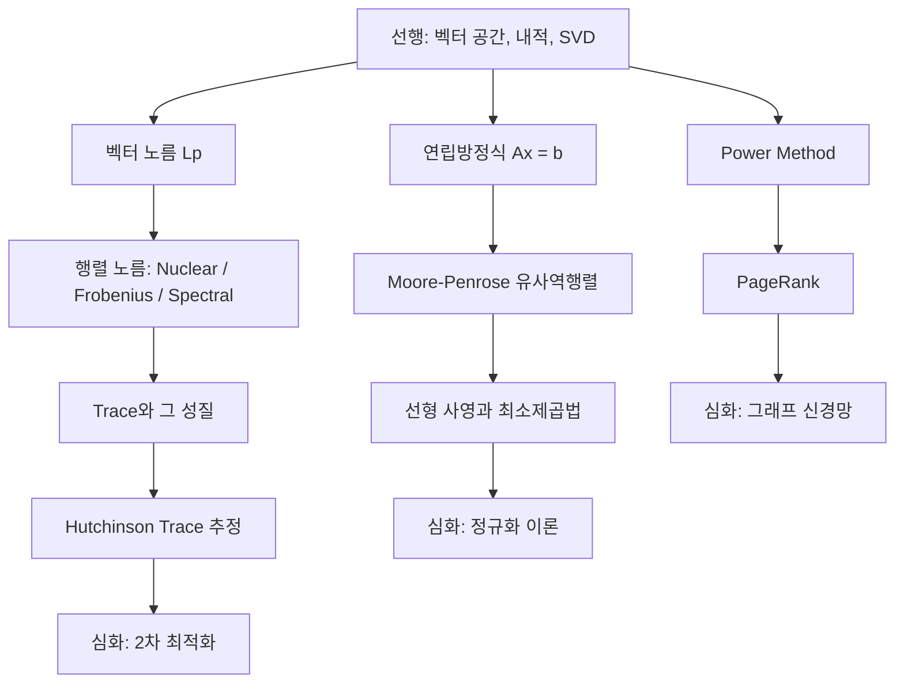

# 노름, 트레이스, 선형방정식 - 수학적 개념 완전 정복

---

## 1. 주제 개요 및 중요성

**한 문장 정의**: 노름(Norm)은 벡터와 행렬의 "크기"를 재는 도구이고, 트레이스(Trace)는 행렬의 대각 원소 합이자 고유값의 합이며, 유사역행렬(Pseudoinverse)과 사영(Projection)은 연립방정식의 최선의 해를 구하는 통합적 프레임워크이다.

**왜 배워야 하는가**:
- 노름은 손실 함수(MSE = L2 노름), 정규화(weight decay = $\|\|W\|\|_F^2$), GAN 안정화(Spectral Norm)의 핵심이다
- Trace는 Hessian 곡률 추정(Hutchinson 추정)과 Fisher Information 계산에 필수적이다
- 유사역행렬은 선형 회귀의 closed-form 해이자, 과매개변수 모델의 implicit regularization 분석 도구이다

**어떤 문제를 해결하는가**:
- 벡터/행렬/모델의 "크기"를 다양한 기준으로 측정
- 대규모 행렬의 특성을 효율적으로 추정
- 역행렬이 없는 경우에도 "최선의 해"를 구함

---

## 2. 입문자용 설명 (Level 1)

### 노름: "길이를 재는 자"
길이를 재려면 자가 필요하다. 어떤 자를 쓰느냐(L1, L2, Linf)에 따라 같은 벡터도 다른 "크기"를 갖는다. 마치 "맨해튼에서의 거리"(블록 수)와 "직선 거리"가 다른 것과 같다.

### Power Method: "같은 규칙을 반복하면 답이 나온다"
행렬을 벡터에 계속 곱하면, 결과가 특정 방향으로 정렬된다. 이 방향이 가장 큰 고유값에 대응하는 고유벡터다. Google PageRank가 바로 이 원리로 작동한다.

### Trace: "대각선 따라 더하기"
정사각 표(행렬)에서 왼쪽 위부터 오른쪽 아래로 대각선의 숫자를 모두 더한 것이다. 놀랍게도 이 합은 고유값의 합과 같다.

### 유사역행렬: "나눗셈의 일반화"
6 / 2 = 3처럼 행렬에서도 "나누기"를 하고 싶지만 역행렬이 없을 수 있다. 유사역행렬은 "가능한 한 가까운 나누기"를 해주는 도구이다. 정확한 답이 없으면 "오차를 가장 줄이는 답"을, 답이 여러 개면 "가장 작은 답"을 준다.

### 사영: "그림자 만들기"
3D 물체에 빛을 비추면 바닥에 2D 그림자가 생긴다. 이것이 사영이며, 최소제곱법의 기하학적 본질이다.

---

## 3. 기술적 상세 설명 (Level 2)

### 3.1 벡터 노름 (Lp Norm)

$$\|v\|_p = \left(\sum_{i=1}^n |v_i|^p\right)^{1/p}$$

- $\|v\|_p$: 벡터 $v$의 $p$-노름
- $|v_i|$: 각 성분의 절대값
- $p$: 어떤 "자"를 쓸지 결정하는 매개변수

| 노름 | 정의 | 직관 | 딥러닝 용도 |
|------|------|------|-----------|
| $\|v\|_1 = \sum_i \|v_i\|$ | 절대값의 합 | 맨해튼 거리 | L1 정규화 (희소성 유도) |
| $\|v\|_2 = \sqrt{\sum_i v_i^2}$ | 제곱합의 제곱근 | 유클리드 거리 | MSE 손실, weight decay |
| $\|v\|_\infty = \max_i \|v_i\|$ | 최대 절대값 | 가장 큰 성분 | gradient clipping |
| $\|v\|_0 = \sum_i \mathbf{1}(v_i \neq 0)$ | 0 아닌 원소 수 | 비영 원소 개수 | 희소성 측정 (진정한 노름 아님) |

**구체적 예시**: $v = [3, -4]$이면:
- $\|v\|_1 = |3| + |-4| = 7$
- $\|v\|_2 = \sqrt{9 + 16} = 5$
- $\|v\|_\infty = \max(3, 4) = 4$

### 3.2 행렬 노름

세 가지 핵심 행렬 노름은 모두 특이값 $\sigma_1 \geq \sigma_2 \geq \cdots$으로 표현된다:

| 행렬 노름 | 정의 | 특이값 표현 | 딥러닝 용도 |
|-----------|------|-----------|-----------|
| Nuclear $\|A\|_*$ | $\sum_i \sigma_i$ | $\|\sigma\|_1$ | 저랭크 유도, 행렬 완성 |
| Frobenius $\|A\|_F$ | $\sqrt{\sum_{i,j} a_{ij}^2}$ | $\|\sigma\|_2$ | Weight decay, 모델 복잡도 |
| Spectral $\|A\|_\sigma$ | $\max_{\|x\|=1} \|Ax\|$ | $\sigma_{\max} = \|\sigma\|_\infty$ | GAN 안정화, Lipschitz 제약 |

**노름 간 부등식**: $\|A\|_\sigma \leq \|A\|_F \leq \|A\|_*$ (항상 성립)

**구체적 예시**: $A = \text{diag}(3, 1, 0)$이면:
- $\|A\|_* = 3 + 1 + 0 = 4$
- $\|A\|_F = \sqrt{9 + 1 + 0} = \sqrt{10}$
- $\|A\|_\sigma = 3$

### 3.3 Power Method

**대칭 행렬의 최대 고유값 계산**:
$$u_{t+1} \leftarrow \frac{Au_t}{\|Au_t\|}$$
수렴 후 $\lambda_{\max} = u^\top A u$

**일반 행렬의 최대 특이값 계산**:
$$v \leftarrow \frac{Au}{\|Au\|}, \quad u \leftarrow \frac{A^\top v}{\|A^\top v\|}$$
수렴 후 $\sigma_{\max} = v^\top A u$

**수렴 속도**: 오차가 $(\lambda_2/\lambda_1)^t$ 비율로 지수적 감소 — spectral gap $\gamma = (\lambda_1 - \lambda_2)/\lambda_1$이 클수록 빠르게 수렴

**구체적 예시**: $A = \text{diag}(5, 4, 1)$이면 수렴 비율 = $4/5 = 0.8$

### 3.4 PageRank

Google 행렬: $G = \alpha P + (1-\alpha)\frac{\mathbf{1}\mathbf{1}^\top}{n}$

- $P$: 전이 확률 행렬 ($P_{ij}$ = 페이지 $j$에서 $i$로의 전이 확률)
- $\alpha$: damping factor (보통 0.85)
- $(1-\alpha)/n$: "랜덤 점프" 확률

**핵심**: PageRank 벡터 = $G$의 최대 고유값(=1)에 대응하는 고유벡터를 Power Method로 계산

$\alpha < 1$을 쓰는 이유: $G$를 양(positive) 행렬로 만들어 Perron-Frobenius 정리의 조건을 보장하고, 유일한 정상 분포(stationary distribution)의 존재를 보장한다.

### 3.5 Trace (대각합)

$$\text{Tr}(A) = \sum_{i=1}^n a_{ii} = \sum_{i=1}^n \lambda_i$$

| 성질 | 수식 | 왜 중요한가 |
|------|------|-----------|
| 전치 불변 | $\text{Tr}(A^\top) = \text{Tr}(A)$ | 대칭성 |
| 선형성 | $\text{Tr}(A + B) = \text{Tr}(A) + \text{Tr}(B)$ | 분배 가능 |
| 순환 성질 | $\text{Tr}(AB) = \text{Tr}(BA)$ | $AB \neq BA$여도 성립 |
| 고유값 합 | $\text{Tr}(A) = \sum_i \lambda_i$ | 스펙트럼 분석 |
| Frobenius 연결 | $\|A\|_F^2 = \text{Tr}(A^\top A)$ | 노름 계산 |
| 이차형식 | $x^\top A x = \text{Tr}(A xx^\top)$ | 기대값 계산의 핵심 |

**순환 성질 주의**: $\text{Tr}(ABC) = \text{Tr}(BCA) = \text{Tr}(CAB)$ (순환 이동만 허용). $\text{Tr}(ABC) \neq \text{Tr}(ACB)$ (순서 뒤집기 불가).

**구체적 예시**: $A = \begin{bmatrix} 2 & 1 \\ 1 & 3 \end{bmatrix}$이면:
- $\text{Tr}(A) = 2 + 3 = 5$
- 고유값: $\lambda_1 + \lambda_2 = 5$ (합이 trace와 일치)

### 3.6 Hutchinson Trace 추정

$\mathbb{E}[x^\top A x] = \text{Tr}(A)$ (단, $\mathbb{E}[xx^\top] = I$)

$$\text{Tr}(A) \approx \frac{1}{s} \sum_{i=1}^s x_i^\top A x_i$$

- $x_i \sim \mathcal{N}(0, I)$ 또는 Rademacher 분포($\pm 1$ 균등)에서 샘플링
- 분산: $\text{Var}[x^\top A x] = 2\|A\|_F^2$ (정규분포일 때)
- $s \geq 8/\epsilon$ 샘플이면 높은 확률로 상대오차 $\leq \epsilon$

**핵심 가치**: $A$의 원소에 직접 접근하지 않고 **행렬-벡터 곱 $Ax$만으로** trace를 추정한다. 대규모 Hessian의 곡률 추정에 핵심적이다.

### 3.7 Moore-Penrose 유사역행렬

$A \in \mathbb{R}^{m \times n}$에 대해 $A^+$는 다음 4조건을 동시에 만족하는 유일한 행렬:

1. $AA^+A = A$
2. $A^+AA^+ = A^+$
3. $(AA^+)^\top = AA^+$
4. $(A^+A)^\top = A^+A$

**SVD를 통한 계산**: $A = U\Sigma V^\top$이면 $A^+ = V\Sigma^+ U^\top$
- $\Sigma^+$: 0이 아닌 특이값의 역수를 취한 직사각 대각행렬

**구체적 예시**: $A = \begin{bmatrix} 1 & 2 \\ 3 & 4 \\ 5 & 6 \end{bmatrix}$이면 $A^+ \in \mathbb{R}^{2 \times 3}$

### 3.8 연립방정식의 해와 사영

$Ax = b$의 세 가지 경우:

| 경우 | 조건 | 해 | $A^+$의 역할 |
|------|------|-----|------------|
| 유일한 해 | $\text{rank}(A) = n$, $b \in \text{im}(A)$ | $x = A^{-1}b$ | 역행렬과 동일 |
| 무한히 많은 해 | $\text{rank}(A) < n$, $b \in \text{im}(A)$ | $x = A^+b + \ker(A)$ | **최소 노름 해** 반환 |
| 해 없음 | $b \notin \text{im}(A)$ | $x = A^+b$ | **최소 제곱 해** 반환 |

**열공간으로의 사영**:
$$\text{Proj}(b; A) = AA^+b = \arg\min_{\hat{b} \in \text{im}(A)} \|b - \hat{b}\|$$

**최소제곱법의 기하학적 의미**: $b$에서 $A$의 열공간에 수선을 내린 발이 사영이며, 이것이 $Ax^*$이다. 잔차 $b - Ax^*$는 열공간에 직교한다.

**벡터 사영 공식**: $\text{Proj}(b; a) = a \frac{a^\top b}{\|a\|^2}$

**구체적 예시**: $a = [1, 0, 0]^\top$, $b = [3, 4, 5]^\top$이면:
$$\text{Proj}(b; a) = [1,0,0]^\top \cdot \frac{3}{1} = [3, 0, 0]^\top$$

---

## 4. 전문가 수준 핵심 요약 (Level 3)

노름은 정규화 전략을 결정한다: L2 정규화($\|W\|_F^2$)는 가중치를 골고루 작게 유지하고, L1은 희소성을 유도하며, Nuclear norm은 저랭크 구조를 강제하고, Spectral norm($\sigma_{\max}$)은 Lipschitz 제약으로 GAN을 안정화한다. Trace의 순환 성질($\text{Tr}(AB) = \text{Tr}(BA)$)과 $\mathbb{E}[x^\top Ax] = \text{Tr}(A)$ 등식은 Hutchinson 추정기의 이론적 기반으로, 대규모 Hessian의 trace를 행렬-벡터 곱만으로 추정하여 2차 최적화를 실용적으로 만든다. Moore-Penrose 유사역행렬 $A^+$는 최소 노름 최소 제곱 해를 주며, 과매개변수 모델에서 SGD가 왜 최소 노름 해에 가까운 해를 찾는지(implicit regularization)라는 현대 딥러닝 이론의 핵심 질문과 직결된다. $A^+A$의 멱등성이 영공간-행공간 직교 분해의 핵심이다.

---

## 5. 메타인지 체크포인트

스스로에게 물어보세요:

- [ ] L1, L2, Linf 노름의 단위 구(unit ball) 모양을 그릴 수 있는가? (다이아몬드, 원, 정사각형)
- [ ] Nuclear norm과 Frobenius norm의 차이를 특이값 관점에서 30초 안에 설명할 수 있는가?
- [ ] $\text{Tr}(AB) = \text{Tr}(BA)$가 왜 성립하는지 직접 증명할 수 있는가?
- [ ] $A^+A \neq I$인 상황을 구체적으로 설명할 수 있는가?
- [ ] 최소제곱법이 열공간으로의 직교 사영과 왜 동일한지 기하학적으로 설명할 수 있는가?

---

## 6. 흔한 오개념 및 주의사항

**"L0 노름은 노름이다"**
L0는 삼각부등식을 만족하지 않아 수학적으로 노름이 아니다. 관례적으로만 "노름"이라 부른다.

**"Frobenius 노름은 그냥 L2 노름이다"**
Frobenius 노름은 행렬 원소에 대한 L2 노름이자 특이값 벡터에 대한 L2 노름이다. 벡터의 L2 노름과 적용 대상이 다르다.

**"Spectral 노름은 가장 큰 고유값이다"**
Spectral 노름은 가장 큰 **특이값** $\sigma_{\max}$이다. 고유값과 특이값은 다르다. 대칭 양정치 행렬에서만 최대 고유값 = 최대 특이값이다.

**"$A^+A = I$이다"**
일반적으로 $A^+A \neq I$. $A^+A$는 $A$의 행공간으로의 직교 사영 행렬(멱등)이다. $A^+A = I$가 되려면 $A$의 열들이 선형독립이어야 한다.

**"$\text{Tr}(ABC) = \text{Tr}(CBA)$이므로 어떤 순서든 상관없다"**
순환(cyclic) 치환만 가능하다: $\text{Tr}(ABC) = \text{Tr}(BCA) = \text{Tr}(CAB)$. 하지만 $\text{Tr}(ABC) \neq \text{Tr}(ACB)$ (일반적으로).

**"역행렬이 없으면 방정식을 풀 수 없다"**
유사역행렬 $A^+$로 어떤 경우든 "최선의 해"를 구할 수 있다.

---

## 7. 학습 로드맵

---

## 8. 실전 활용 사례

### 사례 1: Weight Decay (L2 정규화)
- **상황**: 과적합을 방지하고 싶다
- **적용**: 손실에 $\lambda\|W\|_F^2 = \lambda \cdot \text{Tr}(W^\top W)$ 추가
- **결과**: 가중치를 골고루 작게 유지하여 일반화 성능 향상

### 사례 2: Spectral Normalization
- **상황**: GAN 판별자의 학습이 불안정하다
- **적용**: Power Method로 $\sigma_{\max}(W)$를 1~2회 반복으로 근사 계산 후, $W \leftarrow W / \sigma_{\max}(W)$
- **결과**: Lipschitz 제약 → 학습 안정화

### 사례 3: Hutchinson으로 Hessian Trace 추정
- **상황**: 100M 파라미터 모델의 loss landscape 곡률을 알고 싶다
- **적용**: 랜덤 벡터 $x$로 $x^\top H x$를 여러 번 계산하여 평균 → $\text{Tr}(H)$ 추정
- **결과**: Hessian을 명시적으로 구하지 않고($O(n^2)$ 메모리 회피) 곡률 정보 획득

---

## 9. 추가 학습 자료

**입문자용**: Khan Academy "Norms and distances" - 벡터 노름의 기초
**중급자용**: Boyd & Vandenberghe, "Convex Optimization" Chapter 3 - 노름과 dual norm
**전문가용**: Tropp, "An Introduction to Matrix Concentration Inequalities" - Hutchinson 추정의 이론적 분석

---

> **핵심을 날카롭게 정리하면:**
>
> 노름은 "크기를 재는 자"이며, 어떤 자를 쓰느냐에 따라 정규화 전략이 달라진다. Trace는 "대각 원소의 합 = 고유값의 합"이며, $\mathbb{E}[x^\top Ax] = \text{Tr}(A)$ 한 줄의 등식이 대규모 행렬 분석을 가능하게 한다. 유사역행렬 $A^+$는 "역행렬이 없어도 가장 좋은 해"를 주는 통합 도구이다.
>
> 진정한 마스터와 피상적 이해의 차이: 노름을 "공식"이 아닌 "정규화 전략의 선택"으로, trace를 "대각합"이 아닌 "스펙트럼의 요약 통계량"으로, 유사역행렬을 "역행렬의 대체재"가 아닌 "최소 노름 최소 제곱 해의 원리"로 인식하는 것이다.
