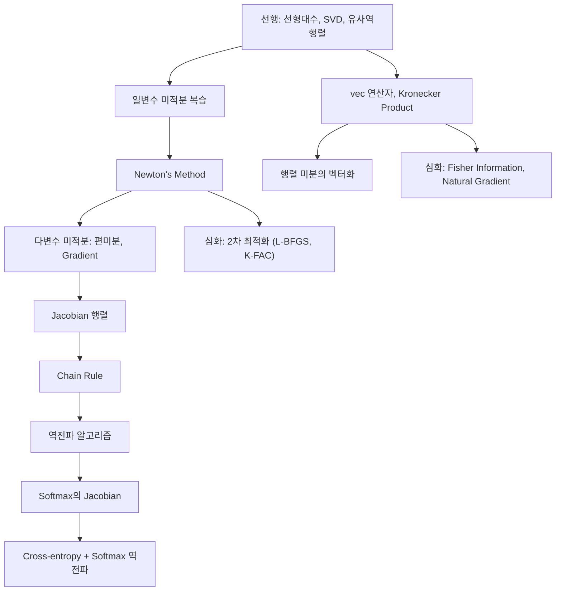

# 미적분과 행렬 미적분 - 수학적 개념 완전 정복

---

## 1. 주제 개요 및 중요성

**한 문장 정의**: 미적분(Calculus)은 비선형 함수를 국소적으로 선형 근사하는 도구이며, 행렬 미적분(Matrix Calculus)은 이를 다변수-다출력 함수에 확장하여 역전파(Backpropagation)의 수학적 기반을 형성한다.

**왜 배워야 하는가**:
- 역전파 = 편미분의 Chain Rule을 행렬 단위로 수행하는 것. 행렬 미적분 없이는 신경망의 학습 원리를 이해할 수 없다
- Gradient, Jacobian, Hessian은 모든 최적화 알고리즘(SGD, Adam, Newton's method)의 핵심 도구이다
- Softmax + Cross-entropy의 역전파가 $p - y$라는 단순한 결과가 되는 이유는 Jacobian 구조에서 나온다

**어떤 문제를 해결하는가**:
- 손실 함수를 각 가중치에 대해 미분하여 업데이트 방향 결정
- 다변수 함수의 합성(네트워크)의 미분을 효율적으로 계산
- 행렬 변수에 대한 미분을 체계적으로 수행

---

## 2. 입문자용 설명 (Level 1)

### 편미분: "조절 손잡이"
여러 개의 조절 손잡이(가중치)가 있을 때, 각 손잡이를 살짝 돌리면 결과(손실)가 얼마나 바뀌는지를 측정한 것이다. 이 정보를 모으면 "어느 방향으로 손잡이를 돌려야 결과가 좋아지는가"를 알 수 있다.

### Gradient: "가장 가파른 언덕 방향"
산에서 가장 가파르게 내려가는 방향을 알려주는 나침반이다. 경사하강법(SGD)은 이 방향으로 한 걸음씩 내려가는 것이다.

### Jacobian: "편미분의 행렬"
입력이 여러 개이고 출력도 여러 개인 함수에서, "각 입력이 살짝 변할 때 각 출력이 얼마나 변하는지"를 표로 정리한 것이다.

### Chain Rule: "변환의 연쇄 미분"
A가 B에 영향을 주고, B가 C에 영향을 주면, A가 C에 미치는 영향은 두 영향을 곱하면 된다. 역전파는 이 곱을 출력에서 입력 방향으로 순차적으로 계산한다.

### Newton's Method: "점점 가까워지는 추측 게임"
추측을 하고, 얼마나 틀렸는지 보고, 접선을 이용해 더 나은 추측을 한다. 4번만 반복해도 $\sqrt{7}$을 소수점 15자리까지 맞출 수 있다.

---

## 3. 기술적 상세 설명 (Level 2)

### 3.1 연립방정식 $Ax = b$의 해 (심화)

유사역행렬 $A^+$를 사용한 통합적 해법:

| 경우 | 조건 | 일반해 |
|------|------|--------|
| 유일한 해 | $\text{rank}(A) = n$, $b \in \text{im}(A)$ | $x = A^{-1}b$ |
| 무한히 많은 해 | $\text{rank}(A) < n$, $b \in \text{im}(A)$ | $x = A^+b + (I - A^+A)w$ (임의의 $w$) |
| 해 없음 | $b \notin \text{im}(A)$ | $x = A^+b$ (최소제곱해) |

**최소노름해의 직교 원리**: $A^+Ax^*$와 $(I - A^+A)w$는 직교하므로, 노름을 최소화하려면 $w = 0$:
$$x^* = A^+b$$

이것은 $A^+A$의 **멱등성(idempotence)**: $(A^+A)^2 = A^+A$ 때문에 성립한다.

### 3.2 vec 연산자와 Kronecker Product

**vec 연산자**: 행렬의 열(column)을 위에서 아래로 쌓아 하나의 벡터로 만든다.

$$\text{vec}\begin{pmatrix} 1 & 2 \\ 3 & 4 \end{pmatrix} = \begin{pmatrix} 1 \\ 3 \\ 2 \\ 4 \end{pmatrix} \quad \text{(열 우선 순서)}$$

**Kronecker Product**: $A \in \mathbb{R}^{m \times n}$, $B \in \mathbb{R}^{p \times q}$에 대해:

$$A \otimes B = \begin{bmatrix} a_{11}B & \cdots & a_{1n}B \\ \vdots & \ddots & \vdots \\ a_{m1}B & \cdots & a_{mn}B \end{bmatrix} \in \mathbb{R}^{mp \times nq}$$

- $A$의 각 원소 $a_{ij}$에 $B$ 전체를 곱해서 만든 블록 행렬

**핵심 항등식**:
$$(A \otimes B)\text{vec}(C) = \text{vec}(BCA^\top)$$

이것이 행렬 미분의 체계적 계산을 가능하게 하는 "로제타 스톤"이다.

**구체적 예시**: $A = \begin{pmatrix} 1 & 2 \\ 3 & 4 \end{pmatrix}$, $B = \begin{pmatrix} 5 & 6 \\ 7 & 8 \end{pmatrix}$이면:

$$A \otimes B = \begin{pmatrix} 5 & 6 & 10 & 12 \\ 7 & 8 & 14 & 16 \\ 15 & 18 & 20 & 24 \\ 21 & 24 & 28 & 32 \end{pmatrix}$$

### 3.3 Sherman-Morrison-Woodbury 공식

$$(A + UCV)^{-1} = A^{-1} - A^{-1}U(C^{-1} + VA^{-1}U)^{-1}VA^{-1}$$

- $A \in \mathbb{R}^{n \times n}$: 역행렬을 이미 아는 큰 행렬
- $U \in \mathbb{R}^{n \times r}$, $V \in \mathbb{R}^{r \times n}$: 저랭크 업데이트 ($r \ll n$)
- $C \in \mathbb{R}^{r \times r}$: 작은 행렬

**핵심 가치**: $n \times n$ 역행렬 대신 $r \times r$ 역행렬만 새로 구하면 된다 → $O(n^3) \to O(nr^2)$

**딥러닝 연결**: LoRA의 $W + BA$가 SMW와 직접 연결된다.

### 3.4 Newton's Method

**1차원 영점 찾기**:
$$x_{n+1} = x_n - \frac{f(x_n)}{f'(x_n)}$$

- 현재 점에서 접선을 그어 $x$축과 만나는 점을 다음 추측으로 사용
- **2차 수렴**: 유효 자릿수가 매 반복마다 대략 2배가 된다

**$\sqrt{7}$ 구하기 (Heron의 방법)**: $f(x) = x^2 - 7$이면:
$$x_{n+1} = \frac{1}{2}\left(x_n + \frac{7}{x_n}\right)$$

| 단계 | 값 | 정확한 자릿수 |
|------|-----|-------------|
| $x_0$ | 3 | 1자리 |
| $x_1$ | 2.666... | 1자리 |
| $x_2$ | 2.6458... | 4자리 |
| $x_3$ | 2.6457513... | 10자리 |

**최적화로의 확장**: $f(x) = \nabla L(x)$로 놓으면, gradient의 영점을 찾는 것 = 손실함수의 극값을 찾는 것:

$$x_{n+1} = x_n - [H(x_n)]^{-1}\nabla L(x_n)$$

- $H = \nabla^2 L$: Hessian 행렬
- 경사하강법은 Hessian을 $\frac{1}{\alpha}I$로 근사한 것: $x_{n+1} = x_n - \alpha \nabla L(x_n)$

### 3.5 Gradient와 Jacobian (Numerator Layout Convention)

**스칼라를 벡터로 미분** (Gradient):
$$\frac{\partial s}{\partial v} = \begin{bmatrix} \frac{\partial s}{\partial v_1} & \cdots & \frac{\partial s}{\partial v_n} \end{bmatrix} \in \mathbb{R}^{1 \times n} \quad \text{(행벡터)}$$

$$\nabla_v s = \left(\frac{\partial s}{\partial v}\right)^\top \in \mathbb{R}^n \quad \text{(열벡터)}$$

- $\frac{\partial s}{\partial v_j}$: $v_j$가 살짝 변할 때 $s$가 얼마나 변하는가

**벡터를 벡터로 미분** (Jacobian):
$$\frac{\partial u}{\partial v} = \begin{bmatrix} \frac{\partial u_1}{\partial v_1} & \cdots & \frac{\partial u_1}{\partial v_n} \\ \vdots & \ddots & \vdots \\ \frac{\partial u_m}{\partial v_1} & \cdots & \frac{\partial u_m}{\partial v_n} \end{bmatrix} \in \mathbb{R}^{m \times n}$$

- $(i, j)$ 원소: "$j$번째 입력이 살짝 변할 때 $i$번째 출력이 얼마나 변하는가"

**Chain Rule (역전파의 수학적 본질)**:
$$\frac{\partial L}{\partial x} = \frac{\partial L}{\partial f} \cdot \frac{\partial f}{\partial x}$$

이것은 Jacobian의 행렬곱이다. 역전파는 이 곱을 출력에서 입력 방향으로 순차적으로 계산한다.

### 3.6 Softmax의 Jacobian

$$p_i = \frac{e^{z_i}}{\sum_k e^{z_k}}$$

Jacobian의 $(i, j)$ 원소:
$$\frac{\partial p_i}{\partial z_j} = p_i(\delta_{ij} - p_j)$$

- $\delta_{ij}$: Kronecker 델타 ($i = j$이면 1, 아니면 0)
- 대각 원소 ($i = j$): $p_i(1 - p_i)$ → 자기 자신에 대한 민감도
- 비대각 원소 ($i \neq j$): $-p_i p_j$ → 다른 클래스 간 경쟁 관계

**Cross-entropy + Softmax의 역전파**:
$$L = -\sum_i y_i \log p_i$$

Chain Rule 적용:
$$\frac{\partial L}{\partial z} = \frac{\partial L}{\partial p} \cdot \frac{\partial p}{\partial z} = p - y$$

이 결과가 놀랍도록 단순한 이유는 Softmax Jacobian의 구조적 성질 때문이다. 이것이 Softmax + Cross-entropy 조합이 표준인 이유다.

**구체적 예시**: $z = [2.0, 1.0, 0.1]$, $y = [1, 0, 0]$ (one-hot)이면:

$p = \text{softmax}(z) \approx [0.659, 0.242, 0.099]$

$\frac{\partial L}{\partial z} = p - y \approx [-0.341, 0.242, 0.099]$

첫 번째 원소만 음수(해당 클래스 점수를 올려야 함), 나머지는 양수(점수를 낮춰야 함).

### 3.7 행렬 미적분의 함수 관점

$$f: \mathbb{R}^n \to \mathbb{R}^m$$

| $n$ vs $m$ | 미분 도구 | 결과 형태 | 예시 |
|-----------|----------|----------|------|
| $n=1, m=1$ | 도함수 $f'(x)$ | 스칼라 | 활성화 함수의 미분 |
| $n>1, m=1$ | Gradient $\nabla f$ | $n$차원 벡터 | 손실함수의 gradient |
| $n>1, m>1$ | Jacobian $\frac{\partial u}{\partial v}$ | $m \times n$ 행렬 | 레이어의 Jacobian |

**3-layer MLP 예시**: 입력 $\mathbb{R}^{784}$ → $\mathbb{R}^{256}$ → $\mathbb{R}^{128}$ → $\mathbb{R}^{10}$이면:
- 1층 Jacobian: $256 \times 784$
- 2층 Jacobian: $128 \times 256$
- 3층 Jacobian: $10 \times 128$
- 전체: Chain Rule로 곱 → $10 \times 784$

---

## 4. 전문가 수준 핵심 요약 (Level 3)

편미분은 역전파의 원자(atom)이다. Jacobian은 편미분의 행렬이다. Chain Rule은 Jacobian의 곱이다. 역전파는 Chain Rule을 뒤에서 앞으로 계산하는 동적 프로그래밍이다 -- 이 네 문장이 딥러닝 학습의 수학적 본질 전체이다. Numerator layout convention에서 $\frac{\partial s}{\partial v} \in \mathbb{R}^{1 \times n}$은 행벡터이고, gradient $\nabla_v s$는 그 전치인 열벡터이다. 이 convention 차이가 코드에서 shape 불일치 버그의 주범이다. Softmax Jacobian $J_{ij} = p_i(\delta_{ij} - p_j)$의 구조 덕분에 Cross-entropy + Softmax의 역전파가 $p - y$로 깔끔해지며, 이것이 분류 문제의 사실상 표준 조합인 수학적 이유이다. Newton's method($x - H^{-1}\nabla L$)에서 Hessian을 $\frac{1}{\alpha}I$로 근사하면 SGD, Kronecker 구조로 근사하면 K-FAC, 저랭크로 근사하면 L-BFGS가 된다.

---

## 5. 메타인지 체크포인트

스스로에게 물어보세요:

- [ ] 역전파가 "편미분의 Chain Rule을 효율적으로 계산하는 알고리즘"이라고 설명할 수 있는가?
- [ ] Gradient는 행벡터인가 열벡터인가? ($\frac{\partial s}{\partial v}$는 행벡터, $\nabla_v s$는 열벡터)
- [ ] Chain Rule 없이는 무엇을 할 수 없는가? (합성함수의 미분, 역전파, 다층 네트워크의 학습)
- [ ] Jacobian과 Gradient의 차이를 명확히 설명할 수 있는가? (Gradient: 스칼라 출력 → 벡터, Jacobian: 벡터 출력 → 행렬)
- [ ] Cross-entropy + Softmax의 역전파 결과 $p - y$를 Jacobian으로 유도할 수 있는가?

---

## 6. 흔한 오개념 및 주의사항

**"편미분이랑 역전파는 다른 것이다"**
역전파는 편미분의 Chain Rule을 효율적으로 계산하는 알고리즘이다. 수학적으로 $\frac{\partial L}{\partial w} = \frac{\partial L}{\partial y} \cdot \frac{\partial y}{\partial w}$를 출력부터 역순으로 계산하는 동적 프로그래밍이다.

**"Gradient는 열벡터다" / "Gradient는 행벡터다"**
Convention에 따라 다르다. Numerator layout에서 $\frac{\partial s}{\partial v}$는 $1 \times n$ 행벡터, $\nabla_v s = (\frac{\partial s}{\partial v})^\top$는 $n \times 1$ 열벡터이다. PyTorch의 `.grad`는 파라미터와 같은 shape이다.

**"Newton's method는 항상 수렴한다"**
초기값이 해에 충분히 가까울 때만 2차 수렴이 보장된다. 초기값이 나쁘면 발산하거나 진동할 수 있다.

**"역행렬이 없으면 끝이다"**
유사역행렬 $A^+$로 어떤 경우든 "최선의 해"를 구할 수 있다.

**"vec은 그냥 reshape이다"**
vec 연산은 **column-major** 순서로 쌓는 것이며, Kronecker product와 결합하여 행렬 미분의 체계적 계산을 가능하게 한다. NumPy의 `flatten()`은 기본이 row-major이므로 `order='F'`를 명시해야 한다.

**"SMW 공식은 이론적 장난감이다"**
LoRA(LLM fine-tuning의 표준 기법), Kalman filter, Gaussian Process 등에서 핵심적으로 사용된다.

---

## 7. 학습 로드맵

---

## 8. 실전 활용 사례

### 사례 1: 역전파로 가중치 업데이트
- **상황**: 분류 모델의 손실이 높아 가중치를 개선하고 싶다
- **적용**: $\frac{\partial L}{\partial W} = \frac{\partial L}{\partial y} \cdot \frac{\partial y}{\partial W}$ (Chain Rule), $W \leftarrow W - \alpha \nabla_W L$ (SGD)
- **결과**: 매 반복마다 손실이 감소하는 방향으로 가중치 조정

### 사례 2: Softmax + Cross-entropy 역전파
- **상황**: 10-class 분류 문제의 출력층 gradient 계산
- **적용**: $\frac{\partial L}{\partial z} = p - y$ (Softmax Jacobian과 CE gradient의 곱)
- **결과**: 정답 클래스의 확률을 높이고, 오답 클래스의 확률을 낮추는 gradient

### 사례 3: K-FAC으로 2차 최적화
- **상황**: SGD의 수렴이 느려 더 빠른 최적화 방법이 필요
- **적용**: Fisher Information Matrix를 Kronecker product $A \otimes B$로 근사 → 효율적 역행렬 계산
- **결과**: SGD 대비 더 적은 반복으로 수렴 (각 반복은 더 비싸지만 총 비용 절감)

---

## 9. 추가 학습 자료

**입문자용**: 3Blue1Brown "Backpropagation calculus" - 역전파의 시각적 설명
**중급자용**: Petersen & Pedersen, "The Matrix Cookbook" - 행렬 미적분 공식 모음
**전문가용**: Magnus & Neudecker, "Matrix Differential Calculus" - 행렬 미적분의 엄밀한 이론

---

> **핵심을 날카롭게 정리하면:**
>
> 편미분은 역전파의 원자, Jacobian은 편미분의 행렬, Chain Rule은 Jacobian의 곱, 역전파는 Chain Rule을 역순으로 계산하는 것이다. 이 네 문장이 딥러닝 학습의 수학적 본질 전체이다.
>
> Newton's method는 "gradient의 영점 찾기 = 손실함수의 극값 찾기"이며, SGD는 Hessian을 $\frac{1}{\alpha}I$로 근사한 Newton's method이다.
>
> 진정한 마스터와 피상적 이해의 차이: 역전파를 "라이브러리가 해주는 것"이 아닌 "Chain Rule의 동적 프로그래밍"으로, Gradient를 "미분값"이 아닌 "최급강하 방향"으로, Newton's method를 "영점 찾기"가 아닌 "곡률을 고려한 최적화"로 인식하는 것이다.
