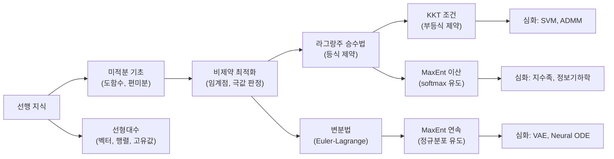

# 최적화와 제약 최적화 - 수학적 개념 완전 정복

## 1. 주제 개요 및 중요성

**한 문장 정의**: 최적화는 주어진 목적 함수의 최솟값(또는 최댓값)을 찾는 수학적 방법론이며, 제약 최적화는 특정 조건을 만족하는 범위 내에서 이를 수행하는 것이다.

**왜 배워야 하는가**:
- 딥러닝은 본질적으로 **손실 함수를 최소화하는 최적화 문제**이다. SGD, Adam 등 모든 옵티마이저는 임계점을 향해 수렴한다.
- 정규화(Weight Decay)는 제약 최적화의 라그랑주 형태이며, softmax 함수는 최대 엔트로피 원리에서 수학적으로 유도된다.
- 이론적으로 이 도구들이 없으면 딥러닝의 핵심 구성요소를 수학적으로 정당화할 수 없다.

**어떤 문제를 해결하는가**:
- "이 함수의 최솟값은 어디인가?" (비제약 최적화)
- "규칙을 지키면서 최적의 선택을 하려면?" (제약 최적화)
- "가장 편향 없는 확률분포는 무엇인가?" (최대 엔트로피)
- "최적의 함수(곡선, 경로)는 무엇인가?" (변분법)

---

## 2. 입문자용 설명 (Level 1)

### 최적화란?
마치 산에서 가장 낮은 골짜기를 찾는 것과 같다. 눈을 감고 발밑의 경사를 느끼면서, 경사가 아래로 향하는 방향으로 걸어가면 결국 골짜기 바닥에 도착한다. 이 "발밑 경사를 따라 내려가기"가 바로 최적화의 핵심 아이디어이다.

### 임계점이란?
산꼭대기나 골짜기 바닥처럼 **경사가 0인 지점**이다. 더 이상 오르막도 내리막도 아닌 "평평한 곳"을 찾는 것이 최적화의 시작이다. 하지만 주의할 점이 있다: 말 안장처럼 한쪽은 올라가고 다른 쪽은 내려가는 곳도 "평평한 곳"에 해당한다. 이런 곳을 안장점(saddle point)이라고 한다.

### 제약 최적화란?
"가장 좋은 것을 고르되, 규칙을 지켜야 한다"는 문제이다. 예를 들어:
- 1000원 안에서 가장 맛있는 간식 조합 고르기
- "1000원 이하"가 **제약 조건**, "맛있는 정도"가 **목적 함수**

### 라그랑주 승수법이란?
울타리가 쳐진 놀이터에서 가장 높은 곳을 찾는 방법이다. 자유롭게 다닐 수 있으면 그냥 산꼭대기에 가면 되지만, 울타리(제약) 때문에 갈 수 없다. 대신 울타리를 따라 걸으면서 가장 높은 곳을 찾아야 한다. 라그랑주 승수($\lambda$)는 "울타리가 나를 얼마나 세게 잡고 있는가"를 나타내는 숫자이다.

### softmax는 어디서 왔는가?
주사위가 있는데 어떤 면이 잘 나오는지 모른다. 아무 정보가 없으면 "모든 면이 같은 확률"이라고 가정하는 것이 가장 공평하다(최대 엔트로피 원리). 여기에 "각 면의 점수(에너지)"라는 추가 정보가 주어지면, 그 점수를 반영하면서도 가장 편향 없는 확률분포를 만들 수 있다 -- 그것이 바로 softmax이다.

### 변분법이란?
보통 최적화는 "가장 좋은 숫자"를 찾지만, 변분법은 "가장 좋은 함수(곡선)"를 찾는다. 예를 들어 두 도시 사이를 잇는 가장 짧은 경로는? 답은 직선이다. 이렇게 최적의 "경로"나 "곡선"을 찾는 것이 변분법이다.

---

## 3. 기술적 상세 설명 (Level 2)

### 3.1 임계점과 극값 판정

**페르마 정리(Fermat's Theorem)**: 개구간에서 미분 가능한 함수 $f$의 극값 $x$에서는 반드시 $f'(x) = 0$이다.

$$x \text{가 극값} \implies f'(x) = 0$$

- $f'(x)$: 함수 $f$의 $x$에서의 도함수(기울기)
- 이 관계는 **필요조건**이지 충분조건이 아니다. $f(x) = x^3$에서 $x=0$은 임계점이지만 극값이 아닌 변곡점이다.

**2차 도함수 판정법**:
- $f'(x_0) = 0$이고 $f''(x_0) > 0$이면 **극소** (아래로 볼록)
- $f'(x_0) = 0$이고 $f''(x_0) < 0$이면 **극대** (위로 볼록)
- $f'(x_0) = 0$이고 $f''(x_0) = 0$이면 **판정 불가** (고차 도함수 필요)

**수치 예시**: $f(x) = x^4 - 2x^2$의 임계점을 찾아보자.
- $f'(x) = 4x^3 - 4x = 4x(x^2 - 1) = 0$
- 임계점: $x = 0, \pm 1$
- $f''(x) = 12x^2 - 4$
- $f''(0) = -4 < 0$ → 극대 ($f(0) = 0$)
- $f''(\pm 1) = 8 > 0$ → 극소 ($f(\pm 1) = -1$)

**다변수 확장**: Hessian 행렬 $H = \nabla^2 f(x)$의 **고유값**으로 판정한다.
- 모든 고유값 > 0 (양정치): 극소
- 모든 고유값 < 0 (음정치): 극대
- 부호 혼합: 안장점(saddle point)

딥러닝의 손실 함수 landscape에서는 안장점이 극소보다 훨씬 많다. 고차원 공간에서 모든 고유값이 동시에 양수일 확률이 기하급수적으로 감소하기 때문이다.

### 3.2 열미분(Subgradient)

$|x|$ 같은 "뾰족한" 함수에서는 꼭짓점에서 도함수를 정의할 수 없다. **Subgradient**는 이런 경우에 미분을 일반화한 개념이다.

$$\partial f(x) \equiv \{g \in \mathbb{R}^n : f(z) \geq f(x) + g^\top(z - x), \; \forall z \in A\}$$

- $\partial f(x)$: 점 $x$에서의 subgradient 집합
- $g$: subgradient 벡터
- $f(x) + g^\top(z-x)$: 점 $x$에서의 선형 근사(supporting hyperplane)
- 조건: 이 선형 근사가 항상 함수값 **아래**에 있어야 한다

**ReLU의 subgradient** (딥러닝에서 가장 중요한 예시):

$$\partial \text{ReLU}(x) = \begin{cases} \{0\} & x < 0 \\ [0, 1] & x = 0 \\ \{1\} & x > 0 \end{cases}$$

실무에서 PyTorch/TensorFlow는 $x=0$에서 $\text{ReLU}'(0) = 0$으로 설정한다.

### 3.3 라그랑주 승수법 (Lagrange Multipliers)

등식 제약 $g(x) = 0$ 하에서 $f(x)$를 최소화하는 문제에서, **라그랑지안(Lagrangian)**을 정의한다:

$$\mathcal{L}(x, \lambda) = f(x) + \lambda \cdot g(x)$$

- $f(x)$: 최소화하려는 목적 함수
- $g(x) = 0$: 반드시 만족해야 하는 등식 제약
- $\lambda$: 라그랑주 승수 -- 제약의 "비용"을 나타내는 변수
- $\nabla_{x,\lambda} \mathcal{L} = 0$을 풀면 후보 해를 찾을 수 있다

**기하학적 의미**: 최적점에서 $\nabla f$와 $\nabla g$가 **평행**하다. 즉 $\nabla f = -\lambda \nabla g$. 등고선과 제약 곡선이 접하는 점이 최적점이다.

**수치 예시**: $f(x,y) = x^2 + y^2$를 직선 $x + y = 1$ 위에서 최소화하라.

$$\mathcal{L} = x^2 + y^2 + \lambda(x + y - 1)$$

$$\nabla = 0 \Leftrightarrow \begin{cases} 2x + \lambda = 0 \\ 2y + \lambda = 0 \\ x + y - 1 = 0 \end{cases}$$

1번, 2번 식에서 $x = y = -\lambda/2$. 3번 식에 대입: $-\lambda = 1$, 즉 $\lambda = -1$.

$$\therefore (x, y, \lambda) = (0.5, 0.5, -1), \quad f(0.5, 0.5) = 0.5$$

**중요한 주의사항**: 라그랑주 승수법은 **필요조건**만 제공한다. 정류점이 모두 원래 문제의 해는 아니므로, 모든 정류점에서 $f$ 값을 비교하여 최소/최대를 판별해야 한다.

### 3.4 KKT 조건 (Karush-Kuhn-Tucker)

부등식 제약($\leq$)까지 포함하는 일반 문제:

$$\min_x f(x) \quad \text{s.t.} \quad g(x) = 0, \; h(x) \leq 0$$

라그랑지안:

$$\mathcal{L}(x, \lambda, \mu) = f(x) + \lambda \cdot g(x) + \mu \cdot h(x)$$

- $\mu$: 부등식 제약에 대응하는 승수

**KKT 4가지 조건**: $x_*$가 해이면, $\exists \lambda_*, \mu_*$ s.t.:

| 조건 | 수식 | 의미 |
|------|------|------|
| 정류성 (Stationarity) | $\nabla_x \mathcal{L}(x_*, \lambda_*, \mu_*) = 0$ | 목적함수와 제약의 기울기 균형 |
| 원시 실행 가능성 | $g(x^*) = 0, \; h(x^*) \leq 0$ | 제약 조건 만족 |
| 쌍대 실행 가능성 | $\mu \geq 0$ | 부등식 승수는 비음수 |
| 상보 이완성 | $\mu \cdot h(x^*) = 0$ | 비활성 제약은 무시됨 |

**상보 이완성의 핵심 의미**:
- $h_j(x^*) < 0$ (제약이 여유 있음): 반드시 $\mu_j = 0$ → 이 제약은 해에 영향 없음
- $\mu_j > 0$ (승수가 양수): 반드시 $h_j(x^*) = 0$ → 이 제약은 등식으로 활성

이 성질이 SVM에서 서포트 벡터만 $\alpha_i > 0$이 되는 이유이다.

### 3.5 최대 엔트로피 원리와 Softmax 유도

엔트로피(불확실성의 척도):
$$H(p) = -\sum_i p_i \log p_i$$

- $p_i$: $i$번째 사건의 확률
- $\log$: 자연로그(또는 밑 2 로그)
- 엔트로피가 클수록 "예측하기 어렵다"

**에너지 제약이 추가된 MaxEnt 문제**: 에너지 $z_i$와 온도 $\tau$가 주어졌을 때:

$$\max_p \sum_i p_i z_i + \tau H(p) \quad \text{s.t.} \quad \sum_i p_i = 1, \; p_i \geq 0$$

라그랑주 승수법으로 풀면:

$$p_i = \frac{\exp(z_i / \tau)}{\sum_j \exp(z_j / \tau)}$$

이것이 바로 **온도 매개변수 $\tau$를 가진 softmax 함수**이다.

- $z_i$: 각 선택지의 "점수"(logit)
- $\tau$: 온도 파라미터 -- 분포의 날카로움 조절
- $\tau \to 0$: argmax (one-hot 분포, 가장 확신 있는 선택)
- $\tau = 1$: 표준 softmax
- $\tau \to \infty$: 균등분포 (최대 불확실성)

**수치 예시**: $z = [2, 1, 0]$이고 $\tau = 1$일 때:
- $\exp(2) \approx 7.39$, $\exp(1) \approx 2.72$, $\exp(0) = 1$
- 합: $11.11$
- softmax: $[0.665, 0.245, 0.090]$

### 3.6 변분법과 Euler-Lagrange 방정식

범함수(functional): 함수를 입력받아 숫자를 출력하는 "함수의 함수":

$$J[y] = \int_{a}^{b} L(x, y(x), y'(x)) \, dx$$

- $J[y]$: 범함수 (함수 $y$에 대한 스칼라 값)
- $L$: 라그랑지안 밀도
- $y(x)$: 우리가 찾고자 하는 함수
- $y'(x)$: $y$의 도함수

$J$를 최소화하는 $y$를 찾기 위해 변분 $\delta J = 0$을 적용하면:

**Euler-Lagrange 방정식**:

$$\frac{\partial L}{\partial y} - \frac{d}{dx}\frac{\partial L}{\partial y'} = 0$$

- $\frac{\partial L}{\partial y}$: $L$을 $y$에 대해 편미분
- $\frac{\partial L}{\partial y'}$: $L$을 $y'$에 대해 편미분
- $\frac{d}{dx}$: 결과를 다시 $x$에 대해 전미분

**수치 예시 -- 최단 거리**: $L = \sqrt{1 + [y'(x)]^2}$
- $\frac{\partial L}{\partial y} = 0$ (L이 $y$에 직접 의존하지 않음)
- Euler-Lagrange: $\frac{d}{dx}\frac{y'}{\sqrt{1+y'^2}} = 0$
- $\frac{y'}{\sqrt{1+y'^2}} = C$ (상수) → $y' = \text{const}$ → **직선**

### 3.7 연속 MaxEnt와 분포 유도

변분법 + 라그랑주 승수법의 결합:

| 제약 조건 | MaxEnt 분포 |
|-----------|-------------|
| $\int p = 1$ (유한 구간) | 균등분포 (Uniform) |
| $\int p = 1$, $E[x] = \mu$ ($x \geq 0$) | 지수분포 (Exponential) |
| $\int p = 1$, $E[x] = \mu$, $\text{Var}(x) = \sigma^2$ | 정규분포 (Gaussian) |

평균 제약이 추가된 경우($[0, \infty)$ 위): MaxEnt 해는 **지수분포** $p(z) \propto e^{-\lambda z}$이다.

평균과 분산 제약이 추가된 경우: MaxEnt 해는 **정규분포** $\mathcal{N}(\mu, \sigma^2)$이다. 이것이 VAE에서 잠재 공간의 사전분포로 $\mathcal{N}(0, I)$를 사용하는 이론적 근거이다.

---

## 4. 전문가 수준 핵심 요약 (Level 3)

1. **임계점과 안장점**: 딥러닝 loss landscape에서 안장점이 극소보다 기하급수적으로 많다(Dauphin et al., 2014). Hessian의 고유값 부호 분포가 이를 결정하며, momentum/Adam 같은 적응적 방법이 안장점 탈출에 효과적이다.

2. **라그랑주 쌍대성과 정규화**: Weight decay $\lambda\|\theta\|^2$는 $\|\theta\| \leq C$ 제약의 라그랑주 형태이다. SVM의 커널 트릭은 dual formulation에서 자연스럽게 유도되며, ADMM(Augmented Lagrangian Method)은 분산 최적화의 핵심이다.

3. **MaxEnt와 지수족**: 최대 엔트로피 원리는 지수족 분포(exponential family)를 자연스럽게 유도한다. softmax = Gibbs/Boltzmann 분포 = 에너지 제약 하의 MaxEnt 해이며, temperature scaling은 exploration-exploitation 트레이드오프의 수학적 형태이다.

4. **변분법과 현대 딥러닝**: VAE의 ELBO 최적화, Neural ODE의 Pontryagin's Maximum Principle, Diffusion model의 score matching, PINN의 물리 법칙 통합 등 모두 변분법의 응용이다.

5. **KKT와 희소성**: 상보 이완성($\mu \cdot h = 0$)은 SVM의 서포트 벡터 결정, L1 정규화의 희소 해 유도, projected gradient descent 등의 이론적 기반이다.

---

## 5. 메타인지 체크포인트

스스로에게 물어보세요:

- [ ] 이 개념을 10살 아이에게 설명할 수 있는가? ("울타리를 따라 걸으며 가장 높은 곳 찾기"로 라그랑주 승수법을 설명할 수 있는가?)
- [ ] 왜 라그랑주 승수법이 아니라 직접 대입법을 쓰지 않는가? (제약이 복잡해지면 대입이 불가능하기 때문. 체계적 접근이 필요.)
- [ ] 이 개념 없이는 무엇을 할 수 없는가? (softmax가 왜 그런 형태인지 설명할 수 없고, 정규화의 이론적 근거를 제시할 수 없다.)
- [ ] KKT 조건과 라그랑주 승수법은 어떻게 다른가? (KKT는 부등식 제약을 추가로 다루며, 상보 이완성이라는 핵심 조건이 추가된다.)
- [ ] 실제 문제에 이것을 어떻게 적용할지 예시를 들 수 있는가? (SVM의 서포트 벡터가 KKT 상보 이완성에서 나온다는 것을 설명할 수 있는가?)

---

## 6. 흔한 오개념 및 주의사항

**1. "$f'(x) = 0$이면 반드시 극값이다"**
- 실제: 임계점이 반드시 극값은 아니다. $f(x) = x^3$의 $x=0$은 변곡점이다.
- 교정: 2차 도함수 판정법이나 고차 도함수를 확인해야 한다.

**2. "라그랑주 승수법은 최솟값을 직접 찾아준다"**
- 실제: 정류점을 찾아줄 뿐, 최소/최대를 구분하지 않는다.
- 교정: 모든 정류점의 $f$ 값을 비교하여 판별해야 한다.

**3. "KKT 조건은 항상 충분조건이다"**
- 실제: 일반적으로 **필요조건**이다. 볼록성이 있어야 충분조건이 된다.
- 교정: $f$가 볼록, $g_i$가 볼록, $h_i$가 아핀인지 확인한다.

**4. "엔트로피를 최대화하면 항상 균등분포이다"**
- 실제: 추가 제약(평균, 분산 등)이 있으면 지수분포, 정규분포 등 다른 분포가 된다.
- 교정: 제약 조건에 따라 MaxEnt 해가 달라짐을 인식해야 한다.

**5. "Softmax는 단순한 정규화 함수이다"**
- 실제: MaxEnt 원리에서 에너지 제약 하의 최대 엔트로피 분포로 수학적으로 유도된다.
- 교정: softmax = Gibbs/Boltzmann 분포라는 물리적 기원을 이해한다.

**6. "변분법은 딥러닝과 무관하다"**
- 실제: VAE, Neural ODE, PINN, diffusion model 등 현대 딥러닝의 핵심에 변분법이 있다.
- 교정: Euler-Lagrange 방정식과 최적 제어 이론의 연결을 학습한다.

**7. "$\mu \geq 0$ (쌍대 실행 가능성)은 임의의 규칙이다"**
- 실제: 부등식 제약의 방향($\leq$)과 최소화 문제의 구조에서 자연스럽게 도출된다.
- 교정: 기하학적으로 "밀어내는 힘"의 방향을 이해한다.

---

## 7. 학습 로드맵

**선행 지식**:
- 미적분: 도함수, 편미분, 체인 룰, 적분
- 선형대수: 벡터 연산, 행렬 곱셈, 고유값/고유벡터

**심화 학습 경로**:
1. 볼록 최적화(Convex Optimization) -- Boyd & Vandenberghe
2. SVM과 커널 방법
3. Variational Inference와 ELBO
4. 최적 제어 이론과 Neural ODE

---

## 8. 실전 활용 사례

### 사례 1: Softmax Temperature Scaling (LLM 텍스트 생성)

**상황**: GPT 모델에서 다음 토큰을 생성할 때, 출력 logit $z = [2.1, 1.5, 0.3, -0.5]$이 주어진다.

**적용 방법**: temperature $\tau$를 조절하여 생성의 다양성을 제어한다.
- $\tau = 0.5$: $\text{softmax}(z/0.5) = [0.831, 0.136, 0.028, 0.005]$ → 거의 확정적
- $\tau = 1.0$: $\text{softmax}(z/1.0) = [0.519, 0.285, 0.086, 0.039]$ → 적당한 다양성
- $\tau = 2.0$: $\text{softmax}(z/2.0) = [0.381, 0.290, 0.189, 0.140]$ → 높은 다양성

**결과**: MaxEnt 원리에 의해, $\tau$가 클수록 엔트로피가 높아지고 더 다양한 텍스트가 생성된다.

### 사례 2: Weight Decay = 라그랑주 쌍대

**상황**: 신경망 과적합 방지를 위해 가중치 크기를 제한하고 싶다.

**적용 방법**: $\min_\theta \mathcal{L}(\theta)$ s.t. $\|\theta\|^2 \leq C$를 라그랑주 형태로 변환하면:

$$\min_\theta \mathcal{L}(\theta) + \lambda \|\theta\|^2$$

이것이 바로 weight decay(L2 정규화)이다. $\lambda$는 원래 문제에서 제약의 강도 $C$에 대응하는 라그랑주 승수이다.

### 사례 3: SVM의 서포트 벡터

**상황**: $\min \frac{1}{2}\|w\|^2$ s.t. $y_i(w^\top x_i + b) \geq 1$

**적용 방법**: KKT 조건의 상보 이완성 $\alpha_i [y_i(w^\top x_i + b) - 1] = 0$에 의해:
- 마진 경계 위에 있는 데이터($y_i(w^\top x_i + b) = 1$)만 $\alpha_i > 0$
- 나머지 데이터는 $\alpha_i = 0$

**결과**: 소수의 서포트 벡터만이 결정 경계를 결정하므로, 효율적인 분류기가 만들어진다.

---

## 9. 추가 학습 자료

**입문자용**:
- 3Blue1Brown - "Essence of Calculus" 유튜브 시리즈
- Khan Academy - Lagrange Multipliers 강의
- 이상엽 - "모두의 딥러닝"에서 최적화 챕터

**중급자용**:
- Boyd & Vandenberghe - "Convex Optimization" (무료 온라인)
- Andrew Ng - CS229 강의 노트 (SVM, KKT)
- Bishop - "Pattern Recognition and Machine Learning" Ch. 7

**전문가용**:
- Nocedal & Wright - "Numerical Optimization"
- Bertsekas - "Nonlinear Programming"
- Gelfand & Fomin - "Calculus of Variations"

---

> **핵심을 날카롭게 정리하면:**
>
> 최적화의 본질은 "경사가 0인 곳을 찾는 것"이고, 제약 최적화의 본질은 "제약을 목적 함수에 흡수시켜 제약 없는 문제로 변환하는 것"이다. softmax, weight decay, SVM의 서포트 벡터 등 딥러닝의 핵심 구성요소가 모두 이 수학적 도구에서 유도된다.
>
> 이것이 중요한 이유는, 딥러닝 모델을 "그냥 쓰는 것"과 "왜 그렇게 설계되었는지 이해하는 것"의 차이가 바로 최적화 이론의 이해 여부에 달려 있기 때문이다.
>
> 진정한 마스터는 softmax를 볼 때 "지수 함수의 정규화"가 아니라 "에너지 제약 하 MaxEnt 해 = Gibbs 분포"를 떠올리고, weight decay를 볼 때 "하이퍼파라미터"가 아니라 "노름 제약의 라그랑주 쌍대"를 인식한다.
