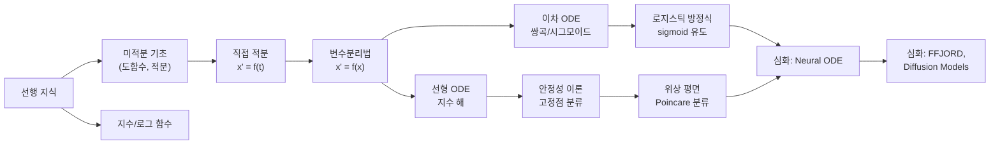

# 미분방정식 - 수학적 개념 완전 정복

## 1. 주제 개요 및 중요성

**한 문장 정의**: 미분방정식은 미지함수와 그 도함수 사이의 관계식으로, "변화의 법칙"을 수학적으로 기술하는 도구이다.

**왜 배워야 하는가**:
- ResNet의 잔차 연결($x_{l+1} = x_l + f_\theta(x_l)$)은 오일러 방법으로 ODE를 이산화한 것과 정확히 동일한 구조이다.
- Neural ODE는 이산 레이어 대신 연속 동역학계를 직접 학습하는 현대적 접근이다.
- 로지스틱 ODE의 해가 정확히 sigmoid 함수이며, 이를 통해 활성화 함수의 수학적 기원과 vanishing gradient 현상을 근본적으로 이해할 수 있다.

**어떤 문제를 해결하는가**:
- "시간에 따라 상태가 어떻게 변하는가?" (동역학 모델링)
- "sigmoid 함수는 왜 그런 형태인가?" (활성화 함수의 기원)
- "gradient explosion은 왜 일어나는가?" (수치적 불안정의 수학적 설명)
- "안정적인 학습이란 무엇인가?" (고정점 안정성 이론)

---

## 2. 입문자용 설명 (Level 1)

### 미분방정식이란?
물병에 구멍이 뚫려 있어서 물이 빠지고 있다고 상상해보자. 물이 많이 남아 있으면 수압이 세서 물이 빨리 빠지고, 물이 적으면 천천히 빠진다. "물이 빠지는 속도 = 남은 물의 양에 비례"라는 이 규칙을 수식으로 쓴 것이 미분방정식이다.

### 세 가지 성장 패턴
비유로 이해하면:

1. **지수 성장** ($x' = ax$): 복리 이자와 같다. 돈이 많을수록 이자가 많이 붙고, 이자가 붙은 돈에 또 이자가 붙는다. 끝없이 커지지만, "무한히 오래" 걸려야 무한대에 도달한다.

2. **쌍곡 성장** ($x' = x^2$): 소문이 퍼지는 속도가 이미 소문을 아는 사람 수의 **제곱**에 비례한다고 하자. 어느 순간 갑자기 폭발적으로 퍼져서, **유한한 시간 안에** 무한대에 도달한다. 지수 성장보다 훨씬 격렬하다.

3. **시그모이드 성장** ($x' = ax(1-x)$): 호수에 물고기가 늘어나는 것과 같다. 처음엔 먹이가 충분해서 빠르게 늘지만, 물고기가 많아지면 먹이가 부족해져서 성장이 느려진다. 결국 호수가 수용할 수 있는 최대 수에서 멈추는 S자 곡선이 나타난다.

### 안정과 불안정이란?
그릇 안에 구슬을 놓으면 바닥으로 굴러가서 멈춘다 -- 이것이 **안정**이다. 그릇을 뒤집어서 꼭대기에 구슬을 올리면 조금만 건드려도 굴러 떨어진다 -- 이것이 **불안정**이다. 미분방정식의 평형점도 이와 같은 두 종류가 있다.

### 왜 sigmoid가 S자 모양인가?
"처음엔 빠르게 성장하다가 나중에 멈추는" 자연스러운 성장 법칙($x' = ax(1-x)$)을 수학적으로 풀면 S자 곡선이 나온다. 누군가 임의로 설계한 것이 아니라, 자연의 포화 현상에서 유도된 함수이다.

---

## 3. 기술적 상세 설명 (Level 2)

### 3.1 1차 자율 ODE의 분류

상미분방정식(ODE)은 미지함수 $x(t)$와 그 도함수 $x' \equiv \frac{dx}{dt}$의 관계식이다. 1차 자율 ODE의 일반형은:

$$x' = f(x)$$

- $x' \equiv \frac{dx}{dt}$: $x$의 시간에 대한 변화율
- $f(x)$: 변화율을 결정하는 함수
- "자율(autonomous)": 우변이 $t$에 명시적으로 의존하지 않음

**핵심 관찰**: 우변 $f(x)$의 근(零)의 개수가 해의 질적 행동을 결정한다.

| 우변 구조 | 근의 수 | 해의 유형 |
|-----------|---------|---------|
| $x' = ax$ (1차) | 1개 ($x=0$) | 지수 성장/감쇠 |
| $x' = x^2$ (2차, 단일근) | 1개 ($x=0$) | 쌍곡 (유한시간 폭발) |
| $x' = ax(1-x)$ (2차, 이중근) | 2개 ($x=0, 1$) | 시그모이드 (포화) |

### 3.2 선형 ODE와 지수 해

**$x' = ax$의 풀이** (변수분리법):

$$\frac{dx}{x} = a\,dt \implies \ln|x| = at + C \implies x(t) = x(0)e^{at}$$

- $a$: 성장률(양수면 성장, 음수면 감쇠)
- $x(0)$: 초기값
- $e^{at}$: 자연 지수함수

**수치 예시**: $x(0) = 10$, $a = -0.5$이면:
- $t = 0$: $x = 10$
- $t = 2$: $x = 10 \cdot e^{-1} \approx 3.68$
- $t = 4$: $x = 10 \cdot e^{-2} \approx 1.35$
- $t \to \infty$: $x \to 0$ (지수적 감쇠)

**$x' = ax + b$의 풀이**:

$$x(t) = \left(x(0) + \frac{b}{a}\right)e^{at} - \frac{b}{a}$$

- 평형점: $x^* = -b/a$ ($x' = 0$이 되는 점)
- $a < 0$: 모든 해가 $x^*$로 수렴 (안정)
- $a > 0$: 모든 해가 $x^*$에서 발산 (불안정)

**딥러닝 연결**: 이차 손실 $L(\theta) = \frac{a}{2}\theta^2$에서 gradient flow $\dot{\theta} = -\nabla L = -a\theta$의 해는 $\theta(t) = \theta(0)e^{-at}$이다. 이것이 경사 하강법의 연속 버전이다.

### 3.3 쌍곡 성장과 유한시간 폭발

**$x' = x^2$의 풀이**:

$$\frac{1}{x^2}dx = dt \implies -\frac{1}{x} = t + C \implies x(t) = \frac{1}{1/x_0 - t}$$

- $x_0$: 초기값
- 폭발 시간: $t^* = 1/x_0$

**유한시간 폭발(finite-time blow-up)**: $t \to 1/x_0$일 때 $x(t) \to \infty$.

**수치 예시**: $x_0 = 0.1$이면:
- $t = 0$: $x = 0.1$
- $t = 5$: $x = \frac{1}{10 - 5} = 0.2$
- $t = 9$: $x = \frac{1}{10 - 9} = 1.0$
- $t = 9.9$: $x = 10$
- $t = 10$: $x \to \infty$ (**폭발!**)

지수 성장($e^{at}$)은 $t \to \infty$에서 천천히 무한대로 가지만, 쌍곡 성장은 $t = 10$이라는 **유한 시간**에 무한대에 도달한다. 이 차이는 질적으로 완전히 다르다.

**딥러닝 연결**: gradient explosion은 이러한 쌍곡적 폭발과 관련이 있으며, gradient clipping의 필요성을 설명한다.

### 3.4 로지스틱 방정식과 시그모이드 유도

**$x' = ax(1-x)$의 분석**:
- $x$가 작을 때: $(1-x) \approx 1$이므로 $x' \approx ax$ → 지수적 성장
- $x$가 1에 가까울 때: $(1-x) \approx 0$이므로 $x' \approx 0$ → 성장 멈춤
- 평형점: $x = 0$ (불안정), $x = 1$ (안정)

**부분분수 분해를 이용한 풀이**:

$$\frac{1}{x(x-1)}dx = -a\,dt$$

$$\left(\frac{1}{x-1} - \frac{1}{x}\right)dx = -a\,dt$$

적분 후 정리하면:

$$x(t) = \frac{1}{1 - Ce^{-at}}$$

여기서 $C = 1 - 1/x(0)$.

**시그모이드와의 연결**: $x_0$이 매우 작을 때:

$$x(t) \approx \frac{1}{1 + \frac{1}{x_0}e^{-at}} = \sigma\!\left(at - \ln\frac{1}{x_0}\right)$$

여기서 $\sigma(z) = \frac{1}{1+e^{-z}}$은 **표준 시그모이드 함수**이다.

**수치 예시**: $a = 1$, $x_0 = 0.01$이면 $C = 1 - 100 = -99$:
- $t = 0$: $x = 0.01$
- $t = 2$: $x \approx 0.07$ (아직 느림)
- $t = 4.6$: $x \approx 0.50$ (반감기, $\ln(99)/1 \approx 4.6$)
- $t = 7$: $x \approx 0.92$ (포화 시작)
- $t = 10$: $x \approx 0.995$ (거의 1)

### 3.5 Vanishing Gradient의 동역학적 설명

시그모이드의 도함수:

$$\sigma'(z) = \sigma(z)(1 - \sigma(z))$$

이것은 정확히 $x' = x(1-x)$ ($a = 1$)이다!

- 포화 영역($x \approx 0$ 또는 $x \approx 1$): $x' \approx 0$ → **기울기가 사라진다**
- 중간 영역($x \approx 0.5$): $x' = 0.25$ → 기울기 최대

이것이 sigmoid를 사용하는 깊은 신경망에서 vanishing gradient가 발생하는 근본 원인이다. ReLU, GELU 등의 대안 활성화 함수는 이 문제를 해결하기 위해 개발되었다.

### 3.6 일반 이중근 ODE와 수용량

**$x' = ax(\beta - x)$** (수용량 $\beta$인 로지스틱 성장):

$$x(t) = \frac{\beta}{1 + C'e^{-a\beta t}}$$

- $\beta$: 수용량(carrying capacity) -- 최종 수렴값
- $a$: 전이 속도
- 반감기: $t_{1/2} \approx \frac{\ln(1/x_0)}{a\beta} \propto \frac{1}{\beta}$

**핵심 관찰**: 수용량 $\beta$가 클수록 반감기($t_{1/2}$)가 $1/\beta$에 비례하여 **짧아진다**. 이는 "큰 목표에 도달하는 데 오히려 빠르다"는 직관에 반하는 결과이다. 그 이유는 초기 성장률 $a\beta$가 $\beta$에 비례하여 커지기 때문이다.

**딥러닝 연결**: 큰 모델(높은 $\beta$)이 더 빠르게 특정 성능에 도달하는 scaling law 현상과 관련이 있다.

### 3.7 안정성 이론과 위상 평면

2차원 선형 시스템 $\dot{X} = AX$에서 행렬 $A$의 성질이 해의 행동을 결정한다.

**Poincare 분류** (det $A$와 tr $A$에 의한 분류):

| 영역 | 고유값 | 위상 초상 |
|------|--------|---------|
| $\text{det} < 0$ | 하나 양, 하나 음 | 안장점 (Saddle) |
| $\text{det} > 0$, $\text{tr} < 0$ | 둘 다 음의 실수부 | 안정 (Sink) |
| $\text{det} > 0$, $\text{tr} > 0$ | 둘 다 양의 실수부 | 불안정 (Source) |
| $\text{det} > 0$, $\text{tr} = 0$ | 순허수 | 중심 (Center) |

판별식 $\Delta = (\text{tr}\,A)^2 - 4\,\text{det}\,A$에 따라:
- $\Delta > 0$: 노드 (node) -- 실수 고유값
- $\Delta < 0$: 나선 (spiral) -- 복소 고유값

비선형 시스템에서는 고정점 근방의 **야코비안** $A = F'(X^*)$로 국소적 위상 초상을 결정한다 (Hartman-Grobman 정리).

### 3.8 변수분리법의 통합 패턴

$$x' = f(x) \implies \frac{dx}{f(x)} = dt \implies \int \frac{dx}{f(x)} = t + C$$

반복적으로 사용되는 적분 패턴:

| $f(x)$ | $\int \frac{dx}{f(x)}$ | 해의 유형 |
|---------|----------------------|---------|
| $ax$ | $\frac{1}{a}\ln|x|$ | 지수 |
| $ax + b$ | $\frac{1}{a}\ln|ax+b|$ | 이동 지수 |
| $x^2$ | $-1/x$ | 쌍곡 |
| $x(x-1)$ | $\ln\left|\frac{x-1}{x}\right|$ (부분분수) | 시그모이드 |

**주의**: $f(x^*) = 0$인 고정점에서는 변수분리법이 작동하지 않는다. 고정점은 별도의 상수 해 $x(t) \equiv x^*$이다.

---

## 4. 전문가 수준 핵심 요약 (Level 3)

1. **ODE 분류와 딥러닝 아키텍처**: 1차 자율 ODE $x' = f(x)$에서 $f$가 선형이면 지수, 이차 단일근이면 쌍곡(blow-up), 이차 이중근이면 시그모이드이다. 이 분류가 활성화 함수 선택, gradient 문제 진단, 학습 동역학 분석의 수학적 뼈대를 이룬다.

2. **Neural ODE와 ResNet**: $x_{n+1} = x_n + f_\theta(x_n)$은 $x' = f_\theta(x, t)$의 stepsize $h=1$ 오일러 이산화이다. Chen et al. (2018)의 Neural ODE는 이 연결을 명시적으로 활용하여 연속 깊이 네트워크를 구현하며, FFJORD는 normalizing flow에 이를 적용한다.

3. **안정성과 학습 동역학**: SGD를 Langevin 동역학 $\dot{\theta} = -\nabla L(\theta) + \xi(t)$로 모델링하면, 손실 함수의 극소점은 안정 고정점에, 안장점은 saddle에 대응한다. Batch Normalization은 학습 동역학의 고유값 스펙트럼을 조절하여 안정화 효과를 낸다.

4. **Edge of Chaos**: 심층 네트워크에서 야코비안의 고유값이 단위원 근처에 있을 때(center와 spiral의 경계) 가장 풍부한 표현력을 가진다는 연구 결과는 Poincare 분류와 직접 연결된다.

5. **유한시간 폭발과 수치 안정성**: $x' = x^2$의 blow-up은 Neural ODE에서 적분기의 스텝 크기를 극도로 줄여야 하는 수치적 문제를 야기한다. FFJORD 등에서 벡터장의 Lipschitz 조건을 부과하는 이유 중 하나가 이 blow-up 방지이다.

---

## 5. 메타인지 체크포인트

스스로에게 물어보세요:

- [ ] 이 개념을 10살 아이에게 설명할 수 있는가? ("토끼가 번식하는 이야기"로 지수 성장과 시그모이드의 차이를 설명할 수 있는가?)
- [ ] 왜 sigmoid이고 ReLU가 아닌가? 또는 왜 ReLU이고 sigmoid가 아닌가? (vanishing gradient의 동역학적 원인인 $\sigma'(z) = \sigma(z)(1-\sigma(z)) \approx 0$을 설명할 수 있는가?)
- [ ] 미분방정식 없이는 무엇을 할 수 없는가? (sigmoid가 "설계된 것"이 아니라 로지스틱 ODE의 자연스러운 해라는 것을 설명할 수 없다.)
- [ ] 지수 성장과 쌍곡 성장의 차이를 명확히 구분할 수 있는가? ($e^{at}$는 $t \to \infty$에서 발산, $1/(1/x_0 - t)$는 유한 시간에 발산)
- [ ] ResNet의 skip connection이 왜 오일러 방법인지 설명할 수 있는가?

---

## 6. 흔한 오개념 및 주의사항

**1. "$x' = x^2$도 지수 성장과 비슷할 것이다"**
- 실제: 지수 성장은 $t \to \infty$에서 무한대이지만, 쌍곡 성장은 **유한 시간**에 무한대가 된다(blow-up). 질적으로 완전히 다르다.
- 교정: $x_0 = 0.1$로 두 ODE를 수치적으로 풀어 그래프를 비교해보라.

**2. "시그모이드 함수는 누군가 임의로 설계한 것이다"**
- 실제: 시그모이드는 로지스틱 ODE $x' = ax(1-x)$의 **자연스러운 해**이다.
- 교정: ODE → 부분분수 → 적분 → sigmoid의 유도 과정을 직접 따라가라.

**3. "평형점은 항상 안정하다"**
- 실제: 평형점은 안정, 불안정, 반안정 중 하나이다. $f'(x^*)$의 부호로 판별한다.
- 교정: $f'(x^*) < 0$이면 안정, $f'(x^*) > 0$이면 불안정.

**4. "ODE를 풀면 항상 닫힌 형태의 해가 나온다"**
- 실제: 대부분의 ODE는 닫힌 형태의 해가 존재하지 않는다. 변수분리법으로 풀리는 것은 특수한 경우이다.
- 교정: $x' = \sin(x^2)$ 같은 ODE를 시도해보면 적분이 닫힌 형태로 안 된다.

**5. "선형 ODE의 해는 직선이다"**
- 실제: "선형 ODE"의 "선형"은 $x$에 대한 것이지, 해가 직선이라는 뜻이 아니다. $x' = ax$의 해는 지수함수이다.
- 교정: $x' = a$의 해(직선)와 $x' = ax$의 해(지수)를 명확히 구분하라.

**6. "Poincare 다이어그램에서 center는 안정이다"**
- 실제: Center(순허수 고유값)는 중립 안정(marginally stable)이지 점근 안정은 아니다. 해가 원점으로 수렴하지 않고 영원히 회전한다.
- 교정: $\text{tr}(A) = 0$일 때 해 궤적이 닫힌 타원 궤도임을 확인하라.

**7. "$a$가 크면 시그모이드의 최종값도 크다"**
- 실제: $a$는 전이 속도만 결정하며, 최종값(상한)은 항상 1이다. 상한을 바꾸려면 $x' = ax(\beta - x)$로 $\beta$를 조절해야 한다.

---

## 7. 학습 로드맵

**선행 지식**:
- 미적분: 도함수, 부정적분, 부분분수 분해
- 지수함수와 로그함수의 성질

**심화 학습 경로**:
1. Strogatz - "Nonlinear Dynamics and Chaos"
2. Chen et al. (2018) - "Neural ODE" 논문
3. 최적 제어 이론 (Pontryagin's Maximum Principle)

---

## 8. 실전 활용 사례

### 사례 1: ResNet = 오일러 방법

**상황**: 깊은 신경망에서 레이어를 쌓을 때 성능이 저하되는 문제.

**적용 방법**: ODE $x' = f_\theta(x, t)$를 오일러 방법으로 이산화하면:
$$x_{n+1} = x_n + h \cdot f_\theta(x_n)$$

$h = 1$로 놓으면 ResNet의 skip connection과 동일하다:
$$x_{l+1} = x_l + f_\theta(x_l)$$

**결과**: 잔차 블록은 "이전 값에 작은 변화를 더하는 것"으로, ODE의 수치적 풀이와 동일한 구조이다. 이 통찰이 Neural ODE, continuous normalizing flow 등의 연구로 이어졌다.

### 사례 2: Vanishing Gradient 진단

**상황**: Sigmoid 활성화를 사용하는 10-layer 네트워크에서 초기 레이어의 gradient가 거의 0에 가깝다.

**적용 방법**: $\sigma'(z) = \sigma(z)(1-\sigma(z)) \leq 0.25$ (최댓값이 0.25)이므로, 10개 레이어를 통과하면 gradient가 최대 $0.25^{10} \approx 9.5 \times 10^{-7}$로 축소된다.

**결과**: 이것이 vanishing gradient의 수학적 원인이다. ReLU($x' = 1$ for $x > 0$)로 전환하면 이 문제가 해소된다.

### 사례 3: Learning Rate와 안정성

**상황**: 큰 learning rate를 사용했을 때 학습이 발산한다.

**적용 방법**: 이차 손실 $L(\theta) = \frac{1}{2}a\theta^2$에서 discrete gradient descent:
$$\theta_{n+1} = \theta_n - \eta a \theta_n = (1 - \eta a)\theta_n$$

안정 조건: $|1 - \eta a| < 1$, 즉 $\eta < 2/a$.

**결과**: learning rate $\eta$가 Hessian의 최대 고유값 $a$의 $2/a$를 초과하면 학습이 발산한다. 이것이 학습률 스케줄링의 이론적 근거이다.

---

## 9. 추가 학습 자료

**입문자용**:
- 3Blue1Brown - "Differential Equations" 유튜브 시리즈
- Khan Academy - First Order ODE
- "미분방정식을 이용한 생태학 모델" 관련 교양 서적

**중급자용**:
- Strogatz - "Nonlinear Dynamics and Chaos"
- Hirsch, Smale, Devaney - "Differential Equations, Dynamical Systems"
- CS231n 강의 노트 - ResNet과 ODE의 연결

**전문가용**:
- Chen et al. (2018) - "Neural Ordinary Differential Equations" (NeurIPS)
- Grathwohl et al. (2019) - "FFJORD: Free-form Continuous Dynamics"
- E (2017) - "A Proposal on Machine Learning via Dynamical Systems"

---

> **핵심을 날카롭게 정리하면:**
>
> 1차 자율 ODE $x' = f(x)$에서 $f$의 구조(선형/이차, 근의 개수)가 해의 질적 행동(지수/쌍곡/시그모이드)을 완전히 결정한다. sigmoid는 "포화가 있는 성장"이라는 자연 법칙의 수학적 귀결이며, ResNet은 ODE의 오일러 이산화이다.
>
> 이것이 중요한 이유는, 활성화 함수, gradient 문제, 학습 동역학을 "경험적 관찰"이 아니라 "수학적 원리"로 이해할 수 있게 해주기 때문이다.
>
> 진정한 마스터는 sigmoid를 볼 때 "0과 1 사이 함수"가 아니라 "로지스틱 ODE $x' = x(1-x)$의 해"를 떠올리고, vanishing gradient를 보면 "포화 영역에서 $x' \approx 0$"이라는 동역학적 직관으로 즉시 진단할 수 있다.
