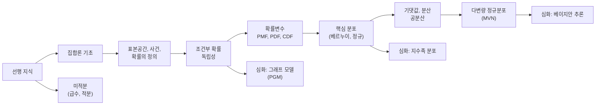

# 확률론 - 수학적 개념 완전 정복

## 1. 주제 개요 및 중요성

**한 문장 정의**: 확률론은 불확실성을 수학적으로 정량화하고 다루기 위한 일관된 체계이다.

**왜 배워야 하는가**:
- 딥러닝의 손실 함수(cross-entropy), 생성 모델(VAE, diffusion), 베이지안 추론 등 거의 모든 핵심 구성 요소가 확률론 위에 세워져 있다.
- 모델이 "왜" 그렇게 학습하는지, 불확실성을 "어떻게" 정량화하는지 설명하려면 확률론이 필수적이다.
- Next-Token Prediction(GPT)은 조건부 확률, 범주형 분포, chain rule 등 확률론의 모든 개념이 집약된 응용이다.

**어떤 문제를 해결하는가**:
- "이 사건이 일어날 가능성은 얼마인가?" (확률 계산)
- "새로운 정보가 주어졌을 때 내 예측은 어떻게 바뀌는가?" (조건부 확률)
- "데이터의 전형적인 값과 퍼짐 정도는?" (기댓값, 분산)
- "AI가 다음 단어를 어떻게 예측하는가?" (조건부 범주형 분포)

---

## 2. 입문자용 설명 (Level 1)

### 확률분포란?
자판기를 생각해보자. 버튼을 누르면 여러 종류 중 하나의 음료수가 나온다. **확률분포**는 "각 음료수가 나올 가능성이 얼마인지" 적어 놓은 표이다. 콜라 50%, 사이다 30%, 주스 20%라고 써 있으면 그것이 확률분포이다. 모든 확률을 더하면 반드시 100%(= 1)가 되어야 한다. 왜냐하면 버튼을 누르면 반드시 뭔가는 나오니까.

### 조건부 확률이란?
과자 봉지에 초코맛 5개, 딸기맛 3개, 포도맛 2개가 있다. 아무거나 하나 꺼내면 초코맛일 확률은 $5/10 = 1/2$이다. 그런데 친구가 "나 딸기맛 아닌 거 꺼냈어!"라고 말했다면? 이제 고려할 과자는 초코 5개 + 포도 2개 = 7개이므로, 초코맛일 확률은 $5/7$로 바뀐다. 이것이 **조건부 확률** -- "어떤 정보를 알게 되면 확률이 바뀌는 것"이다.

### 기댓값이란?
주사위를 아주 많이 던지면 평균적으로 3.5가 나온다. 이것이 **기댓값**이다. 실제로 3.5이 나올 수는 없지만, "장기적으로 평균 몇이 나올까?"에 대한 답이다.

### 분산이란?
공정한 주사위(1~6)와 동전(0 또는 100)을 비교해보자. 둘 다 기댓값이 3.5와 50이지만, 동전의 결과는 0 아니면 100으로 기댓값에서 훨씬 멀리 떨어져 있다. **분산**은 이 "결과가 평균에서 얼마나 흩어져 있는가"를 숫자로 나타낸 것이다.

### 정규분포란?
키, 몸무게 같은 것들을 모아서 그래프로 그리면, 가운데가 높고 양쪽이 낮은 "종 모양"이 나타난다. 이것이 **정규분포(가우시안 분포)**이다. 자연에서 아주 많이 나타나는 이유는, 많은 독립적인 작은 요인의 합이 이 모양을 만들어내기 때문이다(중심극한정리).

### AI가 다음 단어를 예측하는 방법
"나는 학교에 ___" 빈칸에 뭐가 올지 맞추는 게임이다. AI가 이전에 나온 단어들을 보고 다음 단어를 확률로 예측한다: "갔다" 60%, "간다" 25%, "안 갔다" 10%, ... 이것이 **Next-Token Prediction**이다.

---

## 3. 기술적 상세 설명 (Level 2)

### 3.1 표본공간, 사건, 확률

**표본공간** $S$: 실험에서 나올 수 있는 모든 결과의 집합
- 주사위: $S = \{1, 2, 3, 4, 5, 6\}$
- 동전 2번: $S = \{HH, HT, TH, TT\}$

**사건** $E$: $S$의 부분집합 (관심 있는 결과들의 모임)
- "짝수가 나온다": $E = \{2, 4, 6\}$

**확률분포** $p: S \to [0,1]$:
- $0 \le p(s) \le 1$ (각 결과에 대해)
- $\sum_{s \in S} p(s) = 1$ (전체 합 = 1)

사건의 확률: $P(E) := \sum_{s \in E} p(s)$

**포함-배제 원리**:
$$P(E_1 \cup E_2) = P(E_1) + P(E_2) - P(E_1 \cap E_2)$$

**수치 예시**: 주사위에서 "3 이하 또는 짝수"의 확률:
- $E_1 = \{1,2,3\}$, $P(E_1) = 3/6$
- $E_2 = \{2,4,6\}$, $P(E_2) = 3/6$
- $E_1 \cap E_2 = \{2\}$, $P(E_1 \cap E_2) = 1/6$
- $P(E_1 \cup E_2) = 3/6 + 3/6 - 1/6 = 5/6$

### 3.2 조건부 확률과 독립성

**조건부 확률**:
$$P(E|F) = \frac{P(E \cap F)}{P(F)} \quad (P(F) > 0)$$

- $P(E|F)$: 사건 $F$가 일어났다는 조건 아래 $E$의 확률
- $P(E \cap F)$: $E$와 $F$가 동시에 일어날 확률
- $P(F)$: $F$가 일어날 확률

직관: 전체 표본공간 $S$를 $F$로 "축소"시킨 후 그 안에서 $E \cap F$의 비율을 구하는 것.

**독립성**: 두 사건이 서로 영향을 주지 않는 경우:
$$P(E \cap F) = P(E) \cdot P(F) \quad \Leftrightarrow \quad P(E|F) = P(E)$$

**조건부 독립**: 제3의 사건 $G$가 주어졌을 때의 독립:
$$P(E, F | G) = P(E|G) \cdot P(F|G)$$

**핵심 주의사항**:
- 독립 $\not\Rightarrow$ 조건부 독립
- 조건부 독립 $\not\Rightarrow$ 독립

**수치 예시** (explaining away): 두 주사위 결과 $E$(첫째)와 $F$(둘째)는 독립이다. 하지만 합이 짝수라는 조건 $G$ 하에서는 조건부 종속이 된다. 첫째가 홀수라면, 합이 짝수이려면 둘째도 홀수여야 하기 때문이다.

### 3.3 확률변수와 확률분포

**확률변수** $X: S \to \mathbb{R}$: 결과를 숫자로 바꿔주는 함수.

- $X$: 확률변수 (대문자)
- $x$: 확률변수가 취하는 값 (소문자)
- $P(X = a) = P(X^{-1}(\{a\}))$: "$X$의 값이 $a$인 결과들"의 확률

**이산 확률변수**: 확률질량함수(PMF) $p_X(a) = P(X = a)$
**연속 확률변수**: 확률밀도함수(PDF) $p_X(a) = \frac{d}{da}c_X(a)$

여기서 $c_X(a) = P(X \le a)$는 누적분포함수(CDF).

**핵심 주의사항**: 밀도는 확률이 아니다!
- 연속에서 $P(X = x) = 0$ (특정 점의 확률은 0)
- 확률은 구간에 대한 적분으로만 의미를 가진다: $P(a \le X \le b) = \int_a^b p_X(x)dx$
- 밀도는 1을 초과할 수 있다: $U[0, 0.5]$에서 밀도는 2

### 3.4 핵심 분포들

**베르누이 분포** $\text{Bern}(\theta)$:
$$P(X = 1) = \theta, \quad P(X = 0) = 1 - \theta$$
- 결과가 딱 두 개인 실험 (동전 던지기)

**이항분포** $\text{Bin}(n, p)$:
$$P(X = k) = \binom{n}{k} p^k (1-p)^{n-k}$$
- $n$: 시행 횟수, $k$: 성공 횟수, $p$: 각 시행의 성공 확률
- $\binom{n}{k} = \frac{n!}{k!(n-k)!}$: 조합 수

**수치 예시**: 공정한 동전 5번 던져서 앞면 3번 나올 확률:
$$P(X=3) = \binom{5}{3}(0.5)^3(0.5)^2 = 10 \times 0.125 \times 0.25 = 0.3125$$

**범주형 분포** $\text{Cat}(\theta)$:
$$P(X = c) = \theta_c, \quad \sum_{c=1}^{C} \theta_c = 1$$
- $C$개 카테고리에 대한 일반화 (주사위, 단어 예측 등)
- 베르누이는 $C = 2$인 특수 경우

**정규(가우시안) 분포** $\mathcal{N}(\mu, \sigma^2)$:
$$p(x) = \frac{1}{\sqrt{2\pi\sigma^2}} \exp\left(-\frac{(x - \mu)^2}{2\sigma^2}\right)$$
- $\mu$: 평균 (분포의 중심)
- $\sigma$: 표준편차 (분포의 퍼짐)
- $\sigma^2$: 분산
- 68-95-99.7 규칙: 데이터의 68%가 $[\mu-\sigma, \mu+\sigma]$, 95%가 $[\mu-2\sigma, \mu+2\sigma]$ 안에 분포

### 3.5 기댓값과 분산

**기댓값**:
- 이산: $\mathbb{E}[X] = \sum_x x \cdot p_X(x)$
- 연속: $\mathbb{E}[X] = \int x \cdot p_X(x)\,dx$

**기댓값의 선형성** (독립 여부와 무관!):
$$\mathbb{E}[aX + bY + c] = a\mathbb{E}[X] + b\mathbb{E}[Y] + c$$

**분산**:
$$\text{Var}[X] = \mathbb{E}[(X - \mathbb{E}[X])^2] = \mathbb{E}[X^2] - (\mathbb{E}[X])^2$$

분산의 성질:
- $\text{Var}[aX + b] = a^2 \text{Var}[X]$ (상수를 더해도 분산은 변하지 않음, 스케일링만 영향)
- 비상관이면: $\text{Var}[X + Y] = \text{Var}[X] + \text{Var}[Y]$

**수치 예시**: 주사위의 기댓값과 분산:
- $\mathbb{E}[X] = \frac{1}{6}(1+2+3+4+5+6) = 3.5$
- $\mathbb{E}[X^2] = \frac{1}{6}(1+4+9+16+25+36) = \frac{91}{6} \approx 15.17$
- $\text{Var}[X] = 15.17 - 3.5^2 = 15.17 - 12.25 = 2.92$

**전체 기대 법칙**:
$$\mathbb{E}_X[X] = \mathbb{E}_Y[\mathbb{E}_X[X|Y]]$$

### 3.6 공분산과 독립 vs 비상관

**공분산**:
$$\text{Cov}[X,Y] = \mathbb{E}[XY] - \mathbb{E}[X]\mathbb{E}[Y]$$

- 독립 $\Rightarrow$ 비상관($\text{Cov} = 0$): 항상 성립
- 비상관 $\Rightarrow$ 독립: **일반적으로 성립하지 않는다!**

**반례**: $(X,Y) \in \{(0,1),(1,0),(-1,0),(0,-1)\}$이 균등 확률이면:
- $\mathbb{E}[X] = 0$, $\mathbb{E}[Y] = 0$, $\mathbb{E}[XY] = 0$ → $\text{Cov} = 0$ (비상관)
- 하지만 $P(X=0, Y=0) = 0 \neq P(X=0)P(Y=0) = 1/2 \cdot 1/2 = 1/4$ → 독립이 아님!

**예외**: **결합 정규분포**(jointly normal)인 경우에만 비상관 $\Leftrightarrow$ 독립이 성립한다.

### 3.7 다변량 정규분포 (MVN)

$$\mathcal{N}(\mathbf{y}; \boldsymbol{\mu}, \boldsymbol{\Sigma}) = \frac{1}{(2\pi)^{D/2}|\boldsymbol{\Sigma}|^{1/2}} \exp\left(-\frac{1}{2}(\mathbf{y}-\boldsymbol{\mu})^\top \boldsymbol{\Sigma}^{-1}(\mathbf{y}-\boldsymbol{\mu})\right)$$

- $\boldsymbol{\mu} \in \mathbb{R}^D$: 평균 벡터
- $\boldsymbol{\Sigma} \in \mathbb{R}^{D \times D}$: 공분산 행렬 (양반정치, 대칭)
- $|\boldsymbol{\Sigma}|$: 공분산 행렬의 행렬식(determinant)
- $\boldsymbol{\Sigma}^{-1}$: 정밀도 행렬(precision matrix)

**핵심 성질**:
- 주변분포도 정규: $y_1 \sim \mathcal{N}(\mu_1, \Sigma_{11})$
- 조건부분포도 정규: $y_1 | y_2 \sim \mathcal{N}(\mu_{1|2}, \Sigma_{1|2})$
  - $\mu_{1|2} = \mu_1 + \Sigma_{12}\Sigma_{22}^{-1}(y_2 - \mu_2)$
  - $\Sigma_{1|2} = \Sigma_{11} - \Sigma_{12}\Sigma_{22}^{-1}\Sigma_{21}$
- 선형 변환에 닫혀 있음: $A\mathbf{y} + b \sim \mathcal{N}(A\boldsymbol{\mu}+b, A\boldsymbol{\Sigma}A^\top)$

**수치 예시** (2D): $\boldsymbol{\mu} = [0, 0]^\top$, $\boldsymbol{\Sigma} = \begin{bmatrix} 1 & 0.8 \\ 0.8 & 1 \end{bmatrix}$

$y_2 = 1$을 관측했을 때 $y_1$의 조건부 분포:
- $\mu_{1|2} = 0 + 0.8 \cdot 1^{-1} \cdot (1 - 0) = 0.8$
- $\Sigma_{1|2} = 1 - 0.8 \cdot 1^{-1} \cdot 0.8 = 0.36$
- $y_1 | y_2 = 1 \sim \mathcal{N}(0.8, 0.36)$

관측이 주어지면 불확실성이 줄어든다: 분산이 1에서 0.36으로 감소!

### 3.8 중심극한정리 (CLT)

i.i.d. 확률변수 $X_1, \ldots, X_n$ (평균 $\mu$, 분산 $\sigma^2$)의 표본평균:

$$\frac{\bar{X}_n - \mu}{\sigma / \sqrt{n}} \xrightarrow{d} \mathcal{N}(0, 1) \quad \text{as } n \to \infty$$

- $\bar{X}_n = \frac{1}{n}\sum_{i=1}^n X_i$: 표본평균
- $\sigma / \sqrt{n}$: 표본평균의 표준편차

**왜 정규분포가 "정규"인가?**
1. 주어진 평균과 분산에서 **최대 엔트로피** 분포
2. CLT에 의해 자연에서 가장 보편적으로 나타남

### 3.9 경험적 분포와 디랙 델타

데이터 $\{x_1, \ldots, x_N\}$의 **경험적 분포**:
$$p_S(x) = \frac{1}{N} \sum_{i=1}^{N} \delta(x - x_i)$$

- $\delta(x)$: 디랙 델타 함수 ($x=0$에서만 값이 있고 적분하면 1)
- 각 데이터에 $1/N$의 동일한 가중치 부여

이것이 딥러닝에서 유한 데이터로 학습이 가능한 근본적 이유이다 (Glivenko-Cantelli 정리: 경험적 CDF → 참 CDF 균등 수렴).

### 3.10 Next-Token Prediction

Chain rule에 의한 문장 확률 분해:
$$p(w_1, w_2, \ldots, w_T) = \prod_{t=1}^{T} p(w_t | w_{1:t-1})$$

- $w_t$: $t$번째 토큰(단어)
- $p(w_t | w_{1:t-1})$: 이전 토큰들이 주어졌을 때 다음 토큰의 조건부 확률
- 각 단계에서 어휘 전체($|V|$개)에 대한 **조건부 범주형 분포**를 출력

학습 목표 (cross-entropy 손실):
$$\mathcal{L} = -\frac{1}{N}\sum_{i=1}^{N} \sum_{t=1}^{l_i} \log p_\theta(w_t^{(i)} | w_{1:t-1}^{(i)})$$

이것은 경험적 분포와 모델 분포 사이의 KL 발산 최소화와 동치이다.

---

## 4. 전문가 수준 핵심 요약 (Level 3)

1. **확률의 측도론적 기반**: $(\Omega, \mathcal{F}, P)$ 확률공간에서 확률변수는 가측함수(measurable function)이며, pushforward measure 관점에서 생성 모델(normalizing flows, diffusion)의 이론적 기반이 된다.

2. **조건부 독립과 모델 설계**: VAE에서 $z$가 주어지면 관측 변수들이 독립이라는 가정, Transformer에서 Markov 가정의 완화, 베이지안 네트워크의 d-separation 이론 등이 모두 조건부 독립 구조를 활용한다.

3. **MVN의 해석적 추론**: 선형 가우시안 모델에서 posterior가 닫힌 형태로 구해지며, 이것이 Gaussian Process regression, Kalman filter, VAE의 reparameterization trick의 이론적 기반이다.

4. **CLT와 초기화**: 가중치 초기화($w \sim \mathcal{N}(0, \sigma^2)$)의 정당화, diffusion model의 noise schedule, SGD의 수렴 분석 등이 모두 CLT의 보편성에 기반한다.

5. **NTP의 이론적 깊이**: 충분히 큰 모델과 데이터에서 $p(w_t | w_{1:t-1})$의 universal approximation은 조건부 분포의 근사 문제이며, Transformer의 attention은 이를 위한 조건부 독립 가정의 완화 메커니즘이다.

---

## 5. 메타인지 체크포인트

스스로에게 물어보세요:

- [ ] 이 개념을 10살 아이에게 설명할 수 있는가? ("자판기의 각 음료수가 나올 확률"로 확률분포를 설명할 수 있는가?)
- [ ] 왜 확률밀도를 쓰지 않고 확률질량을 쓰는 경우가 있는가? (이산 vs 연속의 차이. 밀도는 확률이 아니라 "단위 길이당 확률 질량"이다.)
- [ ] 독립과 비상관의 차이를 정확히 설명할 수 있는가? (독립은 모든 사건 조합에 대한 조건이고, 비상관은 1차 적률에 대한 조건이다.)
- [ ] 정규분포가 특별한 이유 두 가지를 말할 수 있는가? (최대 엔트로피 + CLT)
- [ ] GPT의 NTP가 확률론의 어떤 개념들을 사용하는지 나열할 수 있는가? (조건부 확률, chain rule, 범주형 분포, 기댓값/CE 손실)

---

## 6. 흔한 오개념 및 주의사항

**1. "확률밀도 $p(x) = 0.7$이면 $x$가 나올 확률이 70%다"**
- 실제: 밀도는 확률이 아니다. 연속에서 $P(X=x) = 0$. 밀도는 1을 초과할 수 있다.
- 교정: $U[0, 0.5]$에서 밀도가 2인 예시를 생각해보라.

**2. "비상관(uncorrelated)이면 독립이다"**
- 실제: 독립 $\Rightarrow$ 비상관이지만, 역은 일반적으로 성립하지 않는다.
- 교정: $(X,Y) \in \{(0,1),(1,0),(-1,0),(0,-1)\}$ 반례를 직접 계산하라. 단, 결합 정규분포에서만 동치.

**3. "정규분포는 모든 데이터에 적합하다"**
- 실제: 꼬리가 두꺼운(heavy-tailed) 분포(Cauchy 등)에는 CLT가 적용되지 않는다.
- 교정: 분산이 무한한 분포($\alpha$-stable, $\alpha < 2$)에서는 CLT가 성립하지 않음을 인식하라.

**4. "조건부 독립이면 (무조건부) 독립이다"**
- 실제: 두 개념은 별개이다. $E \perp F | G$라고 해서 $E \perp F$인 것은 아니며, 그 역도 성립하지 않는다.
- 교정: 주사위 합 조건의 예시를 활용하라.

**5. "기댓값은 실제로 나올 수 있는 값이다"**
- 실제: 주사위의 $\mathbb{E}[X] = 3.5$이지만 실제로 3.5은 나올 수 없다.
- 교정: 기댓값은 "장기적 평균"이지 실현 가능한 값이 아닐 수 있다.

**6. "분산이 크면 나쁜 것이다"**
- 실제: 맥락에 따라 다르다. 강화학습에서 탐색(exploration)이 필요할 때는 높은 분산이 유리하다.
- 교정: 분산은 중립적인 "퍼짐의 측도"이다.

**7. "$\mathbb{E}[XY] = \mathbb{E}[X]\mathbb{E}[Y]$이면 독립이다"**
- 실제: 이것은 비상관 조건일 뿐. 독립은 모든 사건 조합에 대한 조건이다.

---

## 7. 학습 로드맵

**선행 지식**:
- 집합론: 합집합, 교집합, 여사건
- 미적분: 급수의 합, 적분, 극좌표 변환

**심화 학습 경로**:
1. 베이지안 추론 (베이즈 정리, MAP, 변분 추론)
2. 정보이론 (엔트로피, KL divergence)
3. 확률적 그래프 모델 (PGM, d-separation)

---

## 8. 실전 활용 사례

### 사례 1: Cross-Entropy 손실 함수

**상황**: 이미지 분류 모델(ResNet)이 고양이/개/새 3개 클래스를 분류한다.

**적용 방법**: 정답이 "고양이"(클래스 0)이고 모델 출력이 softmax 확률 $q = [0.7, 0.2, 0.1]$일 때:

$$CE = -\log q_0 = -\log 0.7 \approx 0.357$$

만약 모델이 $q = [0.1, 0.8, 0.1]$로 잘못 예측했다면:

$$CE = -\log 0.1 \approx 2.303$$

**결과**: 범주형 분포의 NLL을 최소화하는 것이 곧 cross-entropy 손실이며, 이는 모델의 예측 분포를 데이터 분포에 가깝게 만든다.

### 사례 2: Mini-batch SGD의 분산 감소

**상황**: 전체 데이터 10만 개에서 gradient를 계산하면 비용이 너무 크다.

**적용 방법**: 미니배치 크기 $B$로 gradient를 추정하면:
$$\text{Var}[\hat{g}] = \frac{\text{Var}[g]}{B}$$

- $B = 1$: 분산이 크고 불안정
- $B = 32$: 분산이 $1/32$로 감소
- $B = 1024$: 분산이 매우 작지만 각 스텝이 느림

**결과**: 기댓값의 선형성에 의해 미니배치 gradient의 기댓값은 전체 gradient와 같다. 배치 크기는 편향-분산 트레이드오프를 조절한다.

### 사례 3: VAE의 사전분포 선택

**상황**: 잠재 공간(latent space)의 사전분포를 무엇으로 설정할 것인가?

**적용 방법**: 평균과 분산만 알려졌을 때 최대 엔트로피 분포는 가우시안이다. 따라서 $p(z) = \mathcal{N}(0, I)$를 사전분포로 사용한다.

**결과**: 이것은 "최소 가정 원칙"에 기반한 이론적으로 정당화된 선택이며, reparameterization trick과 KL divergence의 해석적 계산이 가능해진다.

---

## 9. 추가 학습 자료

**입문자용**:
- 3Blue1Brown - "Probability" 유튜브 시리즈
- Khan Academy - Probability and Statistics
- "새빨간 거짓말, 통계" (대렐 허프)

**중급자용**:
- Bertsekas & Tsitsiklis - "Introduction to Probability"
- Bishop - "Pattern Recognition and Machine Learning" Ch. 1-2
- CS109 Stanford 확률론 강의

**전문가용**:
- Durrett - "Probability: Theory and Examples"
- Billingsley - "Probability and Measure"
- Murphy - "Machine Learning: A Probabilistic Perspective"

---

> **핵심을 날카롭게 정리하면:**
>
> 확률론은 불확실성을 수학적으로 다루는 유일한 일관된 체계이며, 딥러닝은 이 체계 위에서 데이터의 조건부 분포를 학습하는 것이다. 표본공간 → 사건 → 확률 → 확률변수 → 분포로 이어지는 추상화의 사슬이 기초를 이루고, 조건부 확률과 독립성이 모델 구조 설계의 핵심이다.
>
> 이것이 중요한 이유는, cross-entropy 손실이 "왜" 그런 형태인지, SGD가 "왜" 작동하는지, GPT가 "어떻게" 다음 단어를 예측하는지 모두 확률론의 언어로만 정확하게 설명할 수 있기 때문이다.
>
> 진정한 마스터는 "비상관이면 독립"이라는 함정에 빠지지 않고, 밀도와 확률의 차이를 정확히 구분하며, cross-entropy를 볼 때 "범주형 분포의 NLL"이라는 확률적 근거를 즉시 떠올릴 수 있다.
