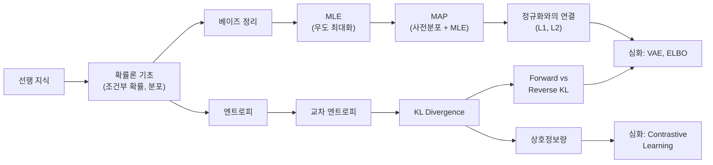

# 베이지안 확률과 정보이론 - 수학적 개념 완전 정복

## 1. 주제 개요 및 중요성

**한 문장 정의**: 베이지안 추론은 데이터를 관측하여 사전 믿음을 업데이트하는 체계적 방법이며, 정보이론은 불확실성과 분포 간 차이를 정량화하는 수학적 도구이다.

**왜 배워야 하는가**:
- 딥러닝의 **손실 함수**(cross-entropy)는 정보이론에서 유도된다.
- **Weight decay**(L2 정규화)는 가우시안 사전분포를 가정한 MAP 추정과 동치이다.
- VAE의 **ELBO**, Knowledge Distillation의 **KL divergence**, PPO의 정책 제한 등 현대 딥러닝의 거의 모든 학습 목표(objective)가 이 두 이론 위에 세워져 있다.
- MLE만으로는 소규모 데이터에서 과적합에 취약하며, 베이지안 사고가 이를 해결한다.

**어떤 문제를 해결하는가**:
- "데이터를 보고 내 모델에 대한 믿음을 어떻게 업데이트할 것인가?" (베이지안 추론)
- "모델의 예측이 얼마나 불확실한가?" (엔트로피)
- "모델 분포가 데이터 분포와 얼마나 다른가?" (KL divergence, cross-entropy)
- "두 변수가 얼마나 관련되어 있는가?" (상호정보량)

---

## 2. 입문자용 설명 (Level 1)

### 베이즈 정리란?
비가 올지 안 올지 생각해보자. 아침에 일어나서 "오늘 비 올 확률 30%겠지"라고 생각했다(사전 확률). 그런데 창밖을 보니 하늘이 새까맣다! 이제 "비 올 확률 80%"로 생각이 바뀌었다(사후 확률). **새로운 증거(까만 하늘)를 보고 내 생각을 업데이트하는 방법**이 베이즈 정리이다.

### MLE란?
동전을 10번 던져서 앞면이 7번 나왔다. "이 동전은 앞면이 나올 확률이 70%인 동전이겠다!"라고 추측하는 것이 MLE(최대우도추정)이다. 관찰한 결과가 **가장 그럴듯한** 확률을 찾는 방법이다.

### MAP란?
MLE가 "데이터만 보고 판단"이라면, MAP는 "내가 이미 알고 있는 것도 함께 생각하기"이다. 동전을 3번 던져 3번 앞면이 나와도, "보통 동전은 반반이니까" 하고 약간 조정한다. MLE는 $\theta = 1.0$이라고 하지만, MAP는 "상식"을 반영하여 $\theta = 0.8$ 정도로 답한다.

### 엔트로피란?
생일 선물 상자를 열 때를 생각해보자. 엄마가 "레고야"라고 미리 말해줬으면 열어도 놀랍지 않다. 하지만 아무 힌트도 없으면 열 때 두근거린다. **얼마나 두근거리는지(놀라운지)를 숫자로 만든 것**이 엔트로피이다. 결과를 미리 알면 엔트로피 = 0, 전혀 모르면 엔트로피 = 최대.

### 교차 엔트로피란?
시험 문제의 정답을 선생님이 알고 있다(진짜 분포 $p$). 나는 공부해서 나름대로 답을 적었다(예측 분포 $q$). **선생님의 정답과 내 답이 얼마나 다른지를 점수로 매기는 것**이 교차 엔트로피이다. 잘 공부했으면 점수(손실)가 낮고, 대충 했으면 높다.

### KL divergence란?
두 주사위가 있다. 하나는 진짜, 하나는 가짜. KL divergence는 "가짜가 진짜랑 얼마나 다른지"를 재는 자이다. 완전 똑같으면 0, 완전 다르면 큰 숫자가 나온다. 단, 방향이 있다: "A에서 B까지의 차이"와 "B에서 A까지의 차이"가 다를 수 있다.

---

## 3. 기술적 상세 설명 (Level 2)

### 3.1 베이즈 정리

$$P(H \mid E) = \frac{P(E \mid H) \cdot P(H)}{P(E)}$$

각 항의 의미:
- $E$: 관측 데이터(evidence/observation)
- $H$: 가설(hypothesis). 예: "동전의 앞면 확률 $\theta = 0.7$"
- $P(H)$: **사전 확률(prior)** -- 데이터를 보기 전 가설에 대한 믿음
- $P(E \mid H)$: **우도(likelihood)** -- 가설이 맞다면 이 데이터가 나올 확률
- $P(E) = \int P(H)P(E \mid H)dH$: **주변 우도(evidence)** -- 정규화 상수
- $P(H \mid E)$: **사후 확률(posterior)** -- 데이터를 본 후 업데이트된 믿음

**빈도주의 vs 베이지안**:

| 관점 | 확률의 해석 | 대상 |
|------|-----------|------|
| 베이지안 | 믿음의 정도 (Belief) | 가설 |
| 빈도주의 | 빈도의 극한 (Frequency) | 사건 |

**순차적 업데이트**: 이전 사후 확률이 다음 관측의 사전 확률이 된다:
$$\cdots \to \text{Data} \to \text{Belief} \to \text{Data} \to \text{Belief} \to \cdots$$

이것이 온라인 학습(online learning)의 이론적 근거이다.

### 3.2 최대우도추정 (MLE)

데이터 $E = \{x_1, \ldots, x_n\}$이 i.i.d.일 때:

**우도 함수**: $\text{lik} = P(E \mid H) = \prod_{i=1}^{n} P(x_i \mid \theta)$

**로그 우도**: $\text{loglik} = \sum_{i=1}^{n} \log P(x_i \mid \theta)$

**MLE**: $\theta_{\text{ML}} = \arg\max_\theta \text{loglik}$

**수치 예시 -- 동전 던지기**: $n = 10$번 중 $k = 7$번 앞면

$$\text{loglik} = 7 \log \theta + 3 \log(1-\theta)$$

$$\frac{d}{d\theta}\text{loglik} = \frac{7}{\theta} - \frac{3}{1-\theta} = 0$$

$$7(1-\theta) = 3\theta \implies \theta_{\text{ML}} = \frac{7}{10} = 0.7$$

**정규분포에서의 MLE**: $x_i \sim \mathcal{N}(\mu, \sigma^2)$일 때:
$$\mu_{\text{ML}} = \frac{1}{n}\sum_{i=1}^{n} x_i = \bar{x}$$
$$\sigma^2_{\text{ML}} = \frac{1}{n}\sum_{i=1}^{n}(x_i - \bar{x})^2$$

**주의**: $\sigma^2_{\text{ML}}$은 **편향 추정량**이다. $\mathbb{E}[\sigma^2_{\text{ML}}] = \frac{n-1}{n}\sigma^2 \neq \sigma^2$. 비편향 추정량은 $\frac{1}{n-1}$을 사용한다.

**MLE의 과적합 문제**: $n=3$, $k=3$이면 $\theta_{\text{ML}} = 1.0$. 미래의 모든 동전 던지기가 앞면이라고 예측하는 비합리적 결과.

### 3.3 MAP 추정 (Maximum A Posteriori)

$$\theta_{\text{MAP}} = \arg\max_\theta P(\theta \mid E) = \arg\max_\theta \left[\log P(E \mid \theta) + \log P(\theta)\right]$$

$$= \arg\max_\theta \left[\text{loglik} + \text{logprior}\right]$$

**Uniform Prior일 때**: $P(\theta) = \text{const}$이면 $\text{logprior} = \text{const}$이므로:
$$\theta_{\text{MAP}} = \theta_{\text{ML}}$$

**Beta Prior 예시**: $P(\theta) \propto \theta(1-\theta)$ (Beta(2,2))일 때:
$$\text{logpost} = (k+1)\log\theta + (n-k+1)\log(1-\theta) + C$$
$$\theta_{\text{MAP}} = \frac{k+1}{n+2}$$

**수치 예시**: $n=3$, $k=3$:
- MLE: $\theta_{\text{ML}} = 3/3 = 1.0$
- MAP: $\theta_{\text{MAP}} = (3+1)/(3+2) = 4/5 = 0.8$ (훨씬 합리적)

### MAP와 정규화의 관계

| 사전 분포 | logprior | 정규화 |
|-----------|----------|--------|
| $\mathcal{N}(0, \sigma_p^2 I)$ | $-\frac{1}{2\sigma_p^2}\|\theta\|^2$ | **L2 정규화 (Weight Decay)** |
| $\text{Laplace}(0, 1/\lambda)$ | $-\lambda\|\theta\|_1$ | **L1 정규화 (Sparsity)** |

$$\text{MAP + 가우시안 prior} = \text{loglik} - \frac{\lambda}{2}\|\theta\|^2 = \text{MLE + Weight Decay}$$

### 3.4 엔트로피

이산 확률변수 $X$의 엔트로피:
$$H(p) := -\mathbb{E}_p[\log p(X)] = -\sum_x p(x)\log p(x)$$

- $H(p) \geq 0$ (항상 0 이상)
- 결정론적 분포(one-hot): $H = 0$ (최소)
- 유한 집합 위의 균등 분포: $H = \log|\mathcal{S}|$ (최대)

**연속 확률변수의 미분 엔트로피**:
$$H(X) = -\int p(x)\log p(x)\,dx$$

가우시안의 엔트로피: $H(X) = \frac{d}{2}\log(2\pi e) + \frac{1}{2}\log|\Sigma|$

**수치 예시**: 공정한 동전 vs 편향된 동전
- 공정: $p = [0.5, 0.5]$ → $H = -2 \times 0.5 \log_2 0.5 = 1$ bit
- 편향: $p = [0.9, 0.1]$ → $H = -(0.9\log_2 0.9 + 0.1\log_2 0.1) \approx 0.47$ bits
- 확정: $p = [1.0, 0.0]$ → $H = 0$ bits

### 3.5 교차 엔트로피

$$CE(p, q) := -\mathbb{E}_p[\log q(X)] = -\sum_x p(x)\log q(x)$$

- $p$: 진짜 분포 (데이터)
- $q$: 예측 분포 (모델)

**핵심 관계**:
$$CE(p, q) = H(p) + KL(p \| q)$$

- $H(p)$: 본질적 불확실성 (고정, 바꿀 수 없음)
- $KL(p \| q) \geq 0$: 추가적 비효율성 (줄일 수 있음)
- **$CE$를 최소화하는 것 = $KL$을 최소화하는 것과 동치!**

**분류에서의 교차 엔트로피 손실**: 정답 one-hot $p = (0, \ldots, 1, \ldots, 0)$, 모델 $q = \text{softmax}(z)$일 때:
$$CE = -\log q(y_{\text{true}}) = -\log \frac{e^{z_{y_{\text{true}}}}}{\sum_c e^{z_c}}$$

이것이 **Negative Log-Likelihood (NLL)**이다.

**수치 예시**: 정답이 클래스 0이고 모델 출력 $q = [0.7, 0.2, 0.1]$:
$$CE = -\log 0.7 \approx 0.357$$

모델 출력 $q = [0.1, 0.8, 0.1]$ (잘못 예측):
$$CE = -\log 0.1 \approx 2.303$$

**정규분포 가정에서**: CE 최소화 = MSE 최소화
$$KL(\mathcal{N}(\mu_1, \sigma^2 I) \| \mathcal{N}(\mu_2, \sigma^2 I)) = \frac{\|\mu_1 - \mu_2\|^2}{2\sigma^2}$$

### 3.6 KL Divergence

$$KL(p \| q) := \mathbb{E}_p\left[\log\frac{p(X)}{q(X)}\right] = \sum_x p(x)\log\frac{p(x)}{q(x)}$$

핵심 성질:
- $KL(p \| q) \geq 0$ (Gibbs' inequality)
- $KL(p \| q) = 0 \iff p = q$
- $KL(p \| q) \neq KL(q \| p)$ (**비대칭!** 거리가 아님)

**Forward KL vs Reverse KL**:

| 유형 | 최적화 | 행동 | 용도 |
|------|--------|------|------|
| Forward KL: $\min_q KL(p \| q)$ | $p > 0$인 곳에서 $q \approx 0$이면 큰 페널티 | **Mode-covering** (모든 모드 커버) | MLE/CE 학습 |
| Reverse KL: $\min_q KL(q \| p)$ | $q > 0$인데 $p \approx 0$이면 큰 페널티 | **Mode-seeking** (하나의 모드 집중) | 변분 추론 (VI) |

다봉(multimodal) 분포를 단봉(unimodal)으로 근사할 때 차이가 극적이다:
- Forward KL: 두 모드 사이를 채우는 넓은 분포
- Reverse KL: 하나의 모드에만 집중하는 좁은 분포

**가우시안 간의 KL** (1차원):
$$KL(\mathcal{N}(\mu_1, \sigma_1^2) \| \mathcal{N}(\mu_2, \sigma_2^2)) = \frac{1}{2}\left[2\log\frac{\sigma_2}{\sigma_1} + \frac{\sigma_1^2}{\sigma_2^2} + \frac{(\mu_1-\mu_2)^2}{\sigma_2^2} - 1\right]$$

**수치 예시**: $\mathcal{N}(0, 1)$과 $\mathcal{N}(1, 1)$ 사이의 KL:
$$KL = \frac{1}{2}\left[0 + 1 + 1 - 1\right] = 0.5$$

### 3.7 상호정보량 (Mutual Information)

$$I(X; Y) = KL(p(x,y) \| p(x)p(y)) = H(X) - H(X \mid Y) = H(Y) - H(Y \mid X)$$

- $I(X;Y)$: $X$와 $Y$가 공유하는 정보량
- $I(X;Y) = 0 \iff X \perp Y$ (독립)
- $I(X;Y) \geq 0$

해석: $Y$를 알았을 때 $X$에 대한 불확실성이 얼마나 줄어드는가.

**Pointwise Mutual Information (PMI)**:
$$i(x; y) = \log\frac{p(x,y)}{p(x)p(y)}$$

$I(X;Y) = \mathbb{E}[i(X;Y)]$

**수치 예시**: $X$ = 비 여부 (0/1), $Y$ = 우산 소지 (0/1)

| $X \backslash Y$ | 0 | 1 |
|---|---|---|
| 0 (맑음) | 0.56 | 0.14 |
| 1 (비) | 0.06 | 0.24 |

- $p(X=1) = 0.3$, $p(Y=1) = 0.38$
- $p(X=1, Y=1) = 0.24$
- $i(1;1) = \log\frac{0.24}{0.3 \times 0.38} = \log\frac{0.24}{0.114} \approx 0.74$
- $I(X;Y) \approx 0.16$ nats

비를 알면 우산 소지 여부를 더 잘 예측할 수 있다!

---

## 4. 전문가 수준 핵심 요약 (Level 3)

1. **베이지안 추론의 계산적 도전**: 사후 분포 $P(H|E)$의 해석적 계산은 고차원에서 난해(intractable)하다. 변분 추론($KL(q \| p)$ 최소화), MCMC(마르코프 체인 샘플링), 라플라스 근사(MAP 근처 가우시안) 등으로 근사한다.

2. **MAP = 정규화의 확률적 해석**: 가우시안 prior → L2 정규화(Weight Decay), 라플라스 prior → L1 정규화(Sparsity). MAP의 한계는 사후 분포의 모드만 구하고 분포 전체의 형태(불확실성)를 무시한다는 점이다.

3. **CE 최소화 = KL 최소화 = NLL 최소화**: 딥러닝 학습의 정보이론적 본질이다. $\min_\theta CE(p_{\text{data}}, p_\theta) = \min_\theta KL(p_{\text{data}} \| p_\theta)$. 모델이 데이터 분포에 가까워지도록 하는 것이다.

4. **Forward KL vs Reverse KL의 실용적 차이**: MLE/CE 학습은 forward KL(mode-covering)이고, 변분 추론(VAE)은 reverse KL(mode-seeking)이다. 이 차이가 VAE의 posterior collapse 현상의 한 원인이다.

5. **상호정보량의 현대적 응용**: InfoNCE(contrastive learning), Information Bottleneck(표현 학습), Data Processing Inequality(레이어 깊이의 이론적 한계) 등이 MI에 기반한다.

---

## 5. 메타인지 체크포인트

스스로에게 물어보세요:

- [ ] 이 개념을 10살 아이에게 설명할 수 있는가? ("비가 올지 예측하고 하늘을 보고 생각을 바꾸는 것"으로 베이즈 정리를 설명할 수 있는가?)
- [ ] 왜 MLE가 아니라 MAP를 쓰는가? (소표본에서 MLE의 과적합 문제를 해결하기 위해. 데이터가 충분하면 MLE와 MAP가 수렴한다.)
- [ ] CE, KL, NLL이 왜 같은 것인지 수식으로 보일 수 있는가? ($CE = H(p) + KL$이고 $H(p)$가 상수이므로.)
- [ ] Forward KL과 Reverse KL의 차이를 다봉 분포 예시로 설명할 수 있는가?
- [ ] Weight decay가 왜 가우시안 prior의 MAP인지 유도할 수 있는가?

---

## 6. 흔한 오개념 및 주의사항

**1. "KL divergence는 두 분포 사이의 거리(distance)이다"**
- 실제: 비대칭이므로 거리가 아니다. 삼각부등식도 만족하지 않는다.
- 교정: "상대 엔트로피" 또는 "정보 이득"으로 이해하라.

**2. "MLE는 항상 좋은 추정량이다"**
- 실제: 소표본에서 극단적 값을 줄 수 있다 (동전 3번 → $\theta = 1.0$).
- 교정: 점근적(데이터 충분할 때)으로만 좋은 성질을 가진다.

**3. "엔트로피가 높으면 나쁜 것이다"**
- 실제: 분류에서는 높은 엔트로피가 "확신 없음"이지만, 강화학습에서는 "활발한 탐색"이다.
- 교정: 엔트로피는 중립적 측정 도구이다.

**4. "교차 엔트로피와 KL divergence는 완전히 다른 것이다"**
- 실제: $CE(p,q) = H(p) + KL(p \| q)$. 학습 시 $H(p)$는 상수이므로 동치이다.

**5. "MAP에서 사전 분포가 강할수록 항상 좋다"**
- 실제: 사전 분포가 너무 강하면 데이터를 무시한다. 데이터 양과의 균형이 중요하다.

**6. "Forward KL과 Reverse KL은 비슷한 결과를 준다"**
- 실제: 다봉 분포 근사에서 극적으로 다르다. Forward는 mode-covering, Reverse는 mode-seeking.

---

## 7. 학습 로드맵

**선행 지식**:
- 확률론 기초: 조건부 확률, 확률분포, 기댓값
- 미적분: 로그, 편미분, 적분

**심화 학습 경로**:
1. 변분 추론 (Variational Inference)
2. ELBO 유도와 VAE
3. 정보기하학 (Fisher Information, Natural Gradient)
4. Contrastive Learning (InfoNCE)

---

## 8. 실전 활용 사례

### 사례 1: Weight Decay = MAP + 가우시안 Prior

**상황**: 신경망 과적합을 방지하고 싶다.

**적용 방법**: 사전 분포 $P(w) \sim \mathcal{N}(0, \sigma_p^2 I)$를 가정하면:
$$\text{MAP 목적함수} = \underbrace{-\sum_i \log p(y_i | x_i, w)}_{\text{NLL (데이터 적합)}} + \underbrace{\frac{1}{2\sigma_p^2}\|w\|^2}_{\text{정규화 (복잡도 제한)}}$$

PyTorch에서 `optimizer = SGD(params, lr=0.01, weight_decay=0.001)`의 `weight_decay`가 바로 $\lambda = 1/\sigma_p^2$이다.

**결과**: 가중치가 0 근처에 머물도록 유도하여 과적합을 방지한다.

### 사례 2: VAE의 ELBO

**상황**: 잠재 변수 모델 $p(x) = \int p(x|z)p(z)dz$에서 적분이 난해하다.

**적용 방법**: 변분 분포 $q(z|x)$를 도입하고 ELBO를 최대화한다:
$$\log p(x) \geq \underbrace{\mathbb{E}_{q(z|x)}[\log p(x|z)]}_{\text{복원 품질}} - \underbrace{KL(q(z|x) \| p(z))}_{\text{잠재 공간 정규화}}$$

- 첫째 항: 잠재 변수에서 원본을 잘 복원하는가?
- 둘째 항: 잠재 공간이 사전분포 $p(z) = \mathcal{N}(0, I)$에 가까운가?

**결과**: 두 항의 균형이 생성 품질과 잠재 공간 구조를 동시에 결정한다.

### 사례 3: Knowledge Distillation

**상황**: 큰 Teacher 모델의 지식을 작은 Student 모델로 전달하고 싶다.

**적용 방법**: Teacher의 soft label 분포 $p_T$와 Student의 분포 $p_S$ 사이의 KL divergence를 최소화:
$$\mathcal{L}_{\text{KD}} = KL(p_T \| p_S) = \sum_c p_T(c) \log \frac{p_T(c)}{p_S(c)}$$

Temperature scaling을 적용하여 soft label을 만든다 ($T > 1$):
$$p_T(c) = \frac{\exp(z_c / T)}{\sum_j \exp(z_j / T)}$$

**결과**: Student가 Teacher의 dark knowledge(오답에 대한 확률 분포)를 학습하여 one-hot label만으로 학습할 때보다 우수한 성능을 달성한다.

### 사례 4: Contrastive Learning (InfoNCE)

**상황**: 라벨 없이 유의미한 표현(representation)을 학습하고 싶다.

**적용 방법**: 상호정보량 $I(X;Y)$의 하한을 최대화:
$$\mathcal{L}_{\text{InfoNCE}} = -\mathbb{E}\left[\log\frac{\exp(f(x, y^+))}{\sum_j \exp(f(x, y_j))}\right]$$

- $y^+$: 같은 이미지의 다른 증강 (positive)
- $y_j$: 다른 이미지의 증강 (negatives)

**결과**: 의미적으로 유사한 입력의 표현은 가까이, 다른 입력은 멀리 배치되어, 라벨 없이도 유의미한 특징을 학습한다.

---

## 9. 추가 학습 자료

**입문자용**:
- 3Blue1Brown - "Bayes theorem" 유튜브
- StatQuest - "Cross Entropy, KL Divergence" 유튜브
- 김성훈 - "모두의 딥러닝" 손실 함수 챕터

**중급자용**:
- Bishop - "PRML" Ch. 1.6 (Information Theory), Ch. 3 (Bayesian)
- Murphy - "Machine Learning: A Probabilistic Perspective" Ch. 2, 5
- CS228 Stanford - Probabilistic Graphical Models 강의 노트

**전문가용**:
- Cover & Thomas - "Elements of Information Theory"
- MacKay - "Information Theory, Inference, and Learning Algorithms"
- Blei et al. (2017) - "Variational Inference: A Review for Statisticians"

---

> **핵심을 날카롭게 정리하면:**
>
> 딥러닝의 학습은 베이지안 추론의 관점에서 사후 확률을 최대화하는 것이며, 그 목적 함수(cross-entropy, KL divergence)는 정보이론이 제공하는 불확실성 측정 도구로 구성된다. MLE/MAP/Full Bayesian은 사전 분포의 강도에 따른 연속 스펙트럼이고, CE 최소화 = KL 최소화 = NLL 최소화는 같은 목표의 세 가지 표현이다.
>
> 이것이 중요한 이유는, 손실 함수가 "왜" 그런 형태인지, weight decay가 "왜" 과적합을 방지하는지, VAE의 ELBO가 "무엇을" 최적화하는지 모두 이 두 이론의 언어로만 정확하게 설명할 수 있기 때문이다.
>
> 진정한 마스터는 cross-entropy를 보면 "KL + 상수"를 떠올리고, weight decay를 보면 "가우시안 prior의 MAP"을 인식하며, Forward KL과 Reverse KL의 차이가 학습 모드(MLE vs VI)를 결정함을 직관적으로 이해한다.
