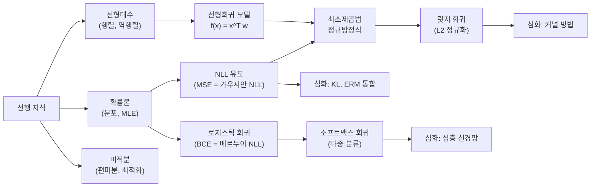

# 선형회귀와 로지스틱 회귀 - 수학적 개념 완전 정복

## 1. 주제 개요 및 중요성

**한 문장 정의**: 선형회귀는 연속값을 예측하는 가장 기본적인 모델이고, 로지스틱 회귀는 이진(또는 다중) 분류를 수행하는 모델이며, 둘 다 "분포 가정 + MLE = 손실 함수"라는 동일한 원리에서 유도된다.

**왜 배워야 하는가**:
- 뉴런 1개짜리 신경망이 곧 선형회귀(연속 출력)이고, 시그모이드를 씌우면 로지스틱 회귀(이진 분류)이다.
- 손실 함수 설계(MSE, Cross-Entropy), 경사 하강법, MLE/MAP 추정 등 딥러닝의 모든 핵심 원리가 이 두 모델에서 시작된다.
- 이 기초를 이해하면 복잡한 심층 신경망도 "선형 변환 + 비선형 활성화의 반복"으로 자연스럽게 확장할 수 있다.

**어떤 문제를 해결하는가**:
- "입력이 주어졌을 때 연속값을 어떻게 예측하는가?" (선형회귀)
- "입력이 주어졌을 때 분류를 어떻게 수행하는가?" (로지스틱 회귀)
- "MSE와 Cross-Entropy는 왜 그런 형태인가?" (NLL 유도)
- "정규화는 왜 과적합을 방지하는가?" (MAP 해석)

---

## 2. 입문자용 설명 (Level 1)

### 선형회귀란?
키가 크면 몸무게도 무거운 경향이 있다. 키와 몸무게 사이에 직선을 그어서 "키가 170cm이면 몸무게는 약 65kg이겠다"고 예측하는 것이 선형회귀이다. 데이터에 **가장 잘 맞는 직선**을 찾는 것이다.

### 왜 오차를 제곱하는가?
직선에서 위로 3만큼 빗나간 것(+3)과 아래로 3만큼 빗나간 것(-3)을 그냥 더하면 0이 되어버린다. 서로 상쇄되어 "오차가 없다"고 착각하게 된다. 제곱하면 둘 다 +9가 되어서 공평하게 벌점을 줄 수 있다.

### 로지스틱 회귀란?
"이 이메일이 스팸일까, 아닐까?"를 맞추는 문제이다. 점수를 매겨서 높으면 "스팸이다!", 낮으면 "스팸이 아니다!"라고 판단한다. 선형회귀처럼 점수를 계산한 다음, S자 커브(시그모이드)를 통과시켜서 "스팸일 확률 80%!"처럼 0~1 사이의 확률로 바꿔준다.

### MLE란?
동전을 10번 던져서 앞면이 7번 나왔다. "이 동전은 앞면이 나올 확률이 70%쯤 되겠다"라고 추측하는 방법이다. 관찰한 결과가 **가장 그럴듯하게** 설명되는 값을 찾는다.

### MSE와 Cross-Entropy는 왜 다른가?
둘 다 "모델의 예측이 정답에서 얼마나 벗어났는가"를 재는 점수이지만, 예측하는 것의 종류가 다르다:
- MSE: "숫자 맞추기" (키로 몸무게 예측). 오차가 정규분포를 따른다고 가정.
- CE: "카테고리 맞추기" (스팸/정상 분류). 결과가 범주형 분포를 따른다고 가정.

핵심은 둘 다 **"분포 가정 + MLE"**에서 나온다는 것이다.

---

## 3. 기술적 상세 설명 (Level 2)

### 3.1 지도학습 프레임워크

데이터 $S = \{(x_i, y_i)\}_{i=1}^n$에서:
- $x_i \in \mathbb{R}^d$: 입력 (특징 벡터)
- $y_i$: 출력 (정답)

**분류**: $y_i \in \{1, 2, \ldots, C\}$ (이산값)
**회귀**: $y_i \in \mathbb{R}$ (연속값)

**목표**: 모집단 위험(population risk)을 최소화하는 가설 $h$를 찾는 것:
- 분류: $L_\mathcal{P}(h) = \mathbb{E}[\mathbf{1}(h(x) \neq f(x))]$
- 회귀: $L_\mathcal{P}(h) = \mathbb{E}[(h(x) - f(x))^2]$

### 3.2 MLE와 NLL -- 모든 손실 함수의 통합

데이터가 i.i.d.일 때, **Negative Log-Likelihood**:

$$\text{NLL}(h) = -\log P(S \mid h) = \sum_{i=1}^{n} -\log p(y_i \mid x_i, h) + C$$

- $p(y_i \mid x_i, h)$: 모델 $h$ 하에서 입력 $x_i$가 주어졌을 때 $y_i$의 확률
- $C$: $h$에 무관한 상수

**핵심 통찰**: 분포 가정에 따라 NLL이 다른 손실 함수로 변환된다.

| 분포 가정 | NLL | 손실 함수 |
|-----------|-----|----------|
| $y_i \mid x_i \sim \mathcal{N}(h(x_i), \sigma^2)$ | $\frac{n}{2\sigma^2}\text{MSE} + C$ | **MSE** |
| $y_i \mid x_i \sim \text{Cat}(h(x_i))$ | $\sum -\log h_{y_i}(x_i) + C$ | **Cross-Entropy** |
| $y_i \mid x_i \sim \text{Bern}(\sigma(x_i^\top w))$ | $\text{BCE} + C$ | **Binary CE** |

**Cross-Entropy와 MSE는 모두 NLL이라는 같은 목적함수의 특수한 경우이다.**

### 3.3 가우시안 노이즈 가정과 MSE 유도

모델: $y = h(x) + \varepsilon$, $\varepsilon \sim \mathcal{N}(0, \sigma^2)$

즉 $y \mid x \sim \mathcal{N}(h(x), \sigma^2)$

NLL 전개:
$$\text{NLL}(h) = \sum_{i=1}^{n} -\log \mathcal{N}(y_i; h(x_i), \sigma^2) + C$$

$$= \sum_{i=1}^{n} \frac{1}{2\sigma^2}(y_i - h(x_i))^2 + \frac{n}{2}\log(2\pi\sigma^2) + C$$

$$= \frac{n}{2\sigma^2} \cdot \underbrace{\frac{1}{n}\sum_{i=1}^{n}(y_i - h(x_i))^2}_{\text{MSE}} + C'$$

$\sigma^2$은 $h$에 무관한 상수이므로:

$$\boxed{\text{NLL 최소화} \Leftrightarrow \text{MSE 최소화}}$$

**"가우시안 노이즈 가정 + MLE = 최소제곱법(Least Squares)"**

### 3.4 선형회귀 모델과 정규방정식

**모델**: $f_w(x) = x^\top w$

편향(bias) 통합 트릭: $x^\top \leftarrow [x^\top \; 1]$, $w^\top \leftarrow [w^\top \; b]$

전체 데이터에 대해: $f_w(X) = Xw$, $X \in \mathbb{R}^{n \times p}$

**손실 함수** (최소제곱):
$$L_S(w) = \frac{1}{2}\|Xw - y\|^2 = \frac{1}{2}(w^\top X^\top X w - 2y^\top X w + y^\top y)$$

- $\|Xw - y\|^2$: 예측값과 실제값의 차이의 제곱합
- $X^\top X$: Gram 행렬 ($p \times p$)
- $X^\top y$: 데이터와 응답의 상관

$w$에 대해 미분하고 0으로 놓으면:
$$\nabla_w L_S = X^\top X \hat{\beta} - X^\top y = 0$$

**정규방정식(Normal Equation)**:
$$\boxed{X^\top X \hat{\beta} = X^\top y}$$

**경우의 수**:
- $\text{rank}(X) = p$ (full rank): 유일한 해 $\hat{\beta} = (X^\top X)^{-1} X^\top y$
- $\text{rank}(X) < p$ ($n < p$): 무한히 많은 해 → 최소 노름 해 $\hat{\beta} = X^+ y$ (Moore-Penrose 유사역행렬)

**수치 예시**: 데이터 3개 $(1, 2), (2, 4), (3, 5)$에서 $y = w_1 x + w_0$ 적합:

$$X = \begin{bmatrix} 1 & 1 \\ 2 & 1 \\ 3 & 1 \end{bmatrix}, \quad y = \begin{bmatrix} 2 \\ 4 \\ 5 \end{bmatrix}$$

$$X^\top X = \begin{bmatrix} 14 & 6 \\ 6 & 3 \end{bmatrix}, \quad X^\top y = \begin{bmatrix} 25 \\ 11 \end{bmatrix}$$

$$\hat{\beta} = \begin{bmatrix} 14 & 6 \\ 6 & 3 \end{bmatrix}^{-1} \begin{bmatrix} 25 \\ 11 \end{bmatrix} = \frac{1}{6}\begin{bmatrix} 3 & -6 \\ -6 & 14 \end{bmatrix} \begin{bmatrix} 25 \\ 11 \end{bmatrix} = \begin{bmatrix} 1.5 \\ 0.333 \end{bmatrix}$$

결과: $y \approx 1.5x + 0.33$

### 3.5 릿지 회귀 (Ridge Regression)

정규화를 추가한 손실:
$$L_S(w; \lambda) = \frac{1}{2}\|Xw - y\|^2 + \frac{\lambda}{2}\|w\|^2, \quad \lambda > 0$$

- $\frac{1}{2}\|Xw - y\|^2$: 데이터 적합 항 (얼마나 잘 맞추는가)
- $\frac{\lambda}{2}\|w\|^2$: 정규화 항 (모델을 얼마나 제한하는가)
- $\lambda$: 두 항의 균형을 조절하는 하이퍼파라미터

**정규화된 정규방정식**:
$$\boxed{\hat{\beta}_\lambda = (X^\top X + \lambda I)^{-1} X^\top y}$$

- $X^\top X + \lambda I$는 항상 **양정치(positive definite)**이므로 역행렬이 항상 존재한다.
- $\lambda = 0$: 일반 최소제곱 (과적합 위험)
- $\lambda \to \infty$: $\hat{\beta} \to 0$ (과소적합)

**확률적 해석**: 릿지 회귀 = 가우시안 사전분포 $p(w) \propto e^{-\frac{\lambda}{2}\|w\|^2}$를 가정한 MAP 추정.

### 3.6 로지스틱 회귀

**모델**:
$$f_w(x) = \sigma(x^\top w) = \frac{1}{1 + \exp(-x^\top w)} \in (0, 1)$$

- $x^\top w$: 선형 결합 (logit)
- $\sigma(\cdot)$: 시그모이드 함수 -- logit을 확률로 변환
- $f_w(x) > 0.5$이면 클래스 1, 아니면 클래스 0

확률적 해석:
- $p_w(y=1 \mid x) = \sigma(x^\top w)$
- $p_w(y=0 \mid x) = 1 - \sigma(x^\top w)$

**이름이 "Regression"이지만 실제로는 이진 분류 모델이다.**

**손실 함수 -- Binary Cross-Entropy (BCE)**:
$$L_S(w) = -\sum_i \left[ y_i \log \sigma(x_i^\top w) + (1 - y_i) \log(1 - \sigma(x_i^\top w)) \right]$$

- $y_i = 1$일 때: $-\log \sigma(x_i^\top w)$ (예측 확률이 클수록 손실 감소)
- $y_i = 0$일 때: $-\log(1 - \sigma(x_i^\top w))$ (예측 확률이 작을수록 손실 감소)

**핵심 차이**: 선형회귀와 달리 닫힌 해(closed-form)가 **없다**. 경사 하강법 등 수치적 최적화가 필요하다.

**수치 예시**: $x_i^\top w = 2$이고 실제 $y_i = 1$일 때:
$$\sigma(2) = \frac{1}{1 + e^{-2}} \approx 0.881$$
$$\text{BCE}_i = -\log 0.881 \approx 0.127 \quad \text{(낮은 손실, 좋은 예측)}$$

$x_i^\top w = -1$이고 실제 $y_i = 1$일 때:
$$\sigma(-1) \approx 0.269$$
$$\text{BCE}_i = -\log 0.269 \approx 1.312 \quad \text{(높은 손실, 나쁜 예측)}$$

### 3.7 다중 클래스 확장 -- 소프트맥스 회귀

시그모이드의 일반화:

$$\text{softmax}(z)_i = \frac{\exp(z_i)}{\sum_{j=1}^{C}\exp(z_j)}, \quad i = 1, \ldots, C$$

- $z \in \mathbb{R}^C$: 각 클래스의 로짓(logit)
- $\text{softmax}(z) \in \Delta^{C-1}$: $C$-simplex 위의 확률분포

모델: $f_W(x) = \text{softmax}(Wx)$, $W \in \mathbb{R}^{C \times d}$

손실: **Categorical Cross-Entropy**
$$L_S(W) = -\sum_i \log[f_W(x_i)]_{y_i} = -\sum_i \log \frac{\exp(w_{y_i}^\top x_i)}{\sum_{c=1}^C \exp(w_c^\top x_i)}$$

### 3.8 ERM과 NLL의 통합

$$\arg\max_h \text{Lik}(h) = \arg\min_h \text{NLL}(h) = \arg\min_h \text{KL}(p_S \| p_h) = \arg\min_h \text{ERM}(h)$$

가우시안 가정 하에서:
$$= \arg\min_h \text{MSE}(h)$$

**경험적 위험 최소화 (ERM)**:
$$L_S(h) = \frac{1}{|S|}\sum_{(x_i, y_i) \in S} \ell(y_i, h(x_i))$$

NLL은 ERM의 특수한 경우이다: $\ell(y, h(x)) = -\log p(y \mid x; h)$.

### 3.9 KL 발산과 NLL의 관계

경험적 분포 $p_S(z) = \frac{1}{n}\sum_{i=1}^{n}\delta(z - z_i)$에 대해:

$$KL(p_S \| q) = \underbrace{-H(p_S)}_{\text{상수}} + \underbrace{\frac{1}{n}\sum_{i=1}^{n}(-\log q(z_i))}_{\text{NLL/n}}$$

따라서 **NLL 최소화 = KL 최소화 = 모델 분포를 데이터 분포에 근사시키는 것**.

### 3.10 베이즈 최적 분류기와 생성 모델

**베이즈 분류기**: $f(x) = \arg\max_{k} p(y=k \mid x)$

베이즈 정리: $p(y \mid x) \propto p(x \mid y) \cdot p(y)$

이것이 이론적으로 **최적**(오분류율 최소화)임이 증명된다.

**나이브 베이즈**: 특징 독립 가정을 추가:
$$f(x) = \arg\max_k \prod_{i=1}^{d} p(x_i \mid y=k) \cdot p(y=k)$$

**LDA (Linear Discriminant Analysis)**: 각 클래스가 동일 공분산의 가우시안을 따른다고 가정:
$$p_k = \mathcal{N}(m_k, \Sigma)$$

결정 함수: $F(x) = \text{sign}[a^\top x - b]$, $a = \Sigma^{-1}(m_1 - m_2)$

공분산이 클래스마다 다르면 QDA(이차 결정 경계)가 된다.

---

## 4. 전문가 수준 핵심 요약 (Level 3)

1. **NLL의 통합적 관점**: Cross-Entropy(분류)와 MSE(회귀)는 모두 NLL이라는 동일한 목적함수의 특수 경우이다. 분류 = Categorical 분포 가정, 회귀 = Gaussian 분포 가정. 이 통찰이 딥러닝 손실 함수 설계의 핵심이다.

2. **정규방정식의 해 구조**: $\text{rank}(X) = p$이면 유일한 해 $(X^\top X)^{-1}X^\top y$, $\text{rank}(X) < p$이면 무한 해 중 최소 노름 해 $X^+y$. 이것이 과잉 파라미터화(overparameterized) 모델에서의 이중 하강(double descent) 현상과 연결된다.

3. **릿지 = MAP + 가우시안 Prior**: $\hat{\beta}_\lambda = (X^\top X + \lambda I)^{-1}X^\top y$. $\lambda I$ 추가로 항상 양정치가 보장되어 유일한 해가 존재한다. LASSO($\ell_1$) = 라플라스 Prior로 희소 해를 유도한다.

4. **$\ell_1$ vs $\ell_2$의 분포적 해석**: MSE = 가우시안 노이즈 → 평균 추정, MAE = 라플라스 노이즈 → 중앙값 추정. 정규화에서도 $\ell_2$(Ridge) = 가우시안 Prior, $\ell_1$(LASSO) = 라플라스 Prior.

5. **커널 릿지 회귀와 신경망의 전사**: 특징 함수 $\phi(x)$를 도입한 $\hat{\beta}^\top \phi(x) = y^\top(K + \lambda I)^{-1}k(x)$는 커널 트릭의 핵심이며, 무한 폭 신경망의 Neural Tangent Kernel(NTK)과 연결된다.

---

## 5. 메타인지 체크포인트

스스로에게 물어보세요:

- [ ] 이 개념을 10살 아이에게 설명할 수 있는가? ("점들에 가장 잘 맞는 직선 긋기"로 선형회귀를, "스팸이냐 아니냐 확률 매기기"로 로지스틱 회귀를 설명할 수 있는가?)
- [ ] 왜 분류에서 MSE 대신 Cross-Entropy를 쓰는가? (범주형 분포의 NLL이 CE이기 때문. MSE를 쓰면 확률적으로 부적절한 가정을 하게 된다.)
- [ ] CE와 MSE가 모두 NLL이라는 것을 유도할 수 있는가?
- [ ] 정규방정식의 해가 존재하지 않는 경우가 있는가? (항상 존재한다. 유일하지 않을 수 있을 뿐.)
- [ ] Weight decay가 왜 과적합을 방지하는지 MAP 관점에서 설명할 수 있는가?

---

## 6. 흔한 오개념 및 주의사항

**1. "MSE 손실을 쓰는 건 그냥 관례다"**
- 실제: MSE는 **가우시안 노이즈 가정 + MLE**에서 유도된다. "오차가 정규분포를 따른다"는 확률적 가정이 깔려 있다.
- 교정: 오차 분포가 라플라스라면 MAE($\ell_1$)가 적절하다.

**2. "로지스틱 회귀는 회귀(regression) 모델이다"**
- 실제: 이름에 "regression"이 있지만 **이진 분류** 모델이다.
- 교정: 시그모이드를 통해 확률을 출력하고, 이를 기반으로 클래스를 결정한다.

**3. "정규방정식의 해는 항상 유일하다"**
- 실제: $n < p$(데이터보다 특징이 많을 때)이면 무한히 많은 해가 존재한다.
- 교정: 최소 노름 해 $X^+y$ 또는 릿지 정규화를 사용해야 한다.

**4. "KL 발산은 거리(distance)이다"**
- 실제: 비대칭이므로 수학적 "거리"가 아니다.

**5. "MLE와 ERM은 완전히 다른 것이다"**
- 실제: MLE는 ERM의 특수한 경우이다. NLL을 손실 함수로 사용하면 MLE = ERM.

**6. "Cross-entropy와 MSE는 근본적으로 다른 손실이다"**
- 실제: 둘 다 NLL이다. Categorical 가정 → CE, Gaussian 가정 → MSE.

**7. "나이브 베이즈의 독립 가정은 실용적이지 않다"**
- 실제: 가정이 위반되더라도 놀라울 정도로 잘 작동한다. 결정 경계의 정확성이 확률 추정의 정확성보다 중요하기 때문이다.

---

## 7. 학습 로드맵

**선행 지식**:
- 선형대수: 행렬 곱셈, 역행렬, 양정치 행렬
- 확률론: 정규분포, 베르누이 분포, MLE
- 미적분: 편미분, 그래디언트, 행렬 미적분

**심화 학습 경로**:
1. 정규화 이론 (Ridge, LASSO, Elastic Net)
2. 커널 방법과 SVM
3. 다층 퍼셉트론 (MLP)과 역전파
4. 일반화 이론 (Bias-Variance Tradeoff, Double Descent)

---

## 8. 실전 활용 사례

### 사례 1: 집값 예측 (선형회귀)

**상황**: 면적($x_1$), 방 수($x_2$), 역까지 거리($x_3$)로 집값($y$)을 예측하고 싶다.

**적용 방법**:
1. 설계 행렬 구성: $X \in \mathbb{R}^{n \times 4}$ (3개 특징 + bias 1)
2. 정규방정식: $\hat{\beta} = (X^\top X)^{-1}X^\top y$
3. 예측: $\hat{y}_{\text{new}} = x_{\text{new}}^\top \hat{\beta}$

면적 80m², 방 3개, 역 500m일 때:
$$\hat{y} = w_1 \times 80 + w_2 \times 3 + w_3 \times 500 + w_0$$

**결과**: $n < p$이거나 특징 간 다중공선성이 있으면 릿지 정규화($\lambda > 0$)를 추가하여 안정적인 해를 얻는다.

### 사례 2: 스팸 분류 (로지스틱 회귀)

**상황**: 이메일의 단어 빈도로 스팸 여부를 분류한다.

**적용 방법**:
1. 특징 벡터: $x = [\text{freq}(\text{"free"}), \text{freq}(\text{"win"}), \text{freq}(\text{"click"}), \ldots]$
2. 모델: $p(\text{spam} \mid x) = \sigma(w^\top x + b)$
3. BCE 손실로 경사 하강법 학습
4. $p > 0.5$이면 스팸으로 분류

**결과**: 학습된 가중치 $w$를 해석할 수 있다: $w_{\text{free}} > 0$이면 "free"라는 단어가 스팸 확률을 높이는 방향.

### 사례 3: NLL = KL = ERM의 실전 의미

**상황**: 손실 함수를 선택해야 한다.

**적용 방법**:
1. 출력이 연속값 → 가우시안 가정 → **MSE**
2. 출력이 이진 → 베르누이 가정 → **BCE**
3. 출력이 다중 클래스 → 범주형 가정 → **Categorical CE**
4. 이상치가 많음 → 라플라스 가정 → **MAE** ($\ell_1$ 손실)

**결과**: 손실 함수 선택은 "데이터의 노이즈가 어떤 분포를 따르는가?"에 대한 답이다.

### 사례 4: 가우스의 케레스 궤도 계산 -- 최소제곱법의 역사

**상황**: 1801년, 피아치가 왜소행성 케레스를 40일간 19번 관측했지만 태양 뒤로 사라졌다.

**적용 방법**: 24살의 가우스가 19개의 관측값(시간, 위치)으로 궤도 파라미터를 최소제곱법으로 추정:
- 입력: 관측 시각
- 출력: 관측 위치(약 30''의 오차 포함)
- 오차의 제곱합을 최소화하여 궤도 계수를 결정

**결과**: 1801년 12월 31일, 가우스가 예측한 위치에서 케레스가 발견되었다. 이 방법이 200년이 지난 지금도 MSE 손실 함수로 매일 사용되고 있다.

---

## 9. 추가 학습 자료

**입문자용**:
- 3Blue1Brown - "Linear Algebra" 유튜브 시리즈
- Khan Academy - Linear Regression
- Andrew Ng - Machine Learning Coursera (Week 1-2)

**중급자용**:
- Bishop - "PRML" Ch. 3 (Linear Models for Regression), Ch. 4 (Classification)
- Hastie, Tibshirani, Friedman - "Elements of Statistical Learning" Ch. 3-4
- CS229 Stanford 강의 노트

**전문가용**:
- Murphy - "Machine Learning: A Probabilistic Perspective" Ch. 7-8
- Shalev-Shwartz & Ben-David - "Understanding Machine Learning"
- Belkin et al. (2019) - "Reconciling modern ML with the bias-variance trade-off" (Double Descent)

---

> **핵심을 날카롭게 정리하면:**
>
> 선형회귀와 로지스틱 회귀는 각각 "가우시안 노이즈 + MLE = MSE"와 "베르누이 가정 + MLE = BCE"로, 둘 다 **NLL 최소화**라는 동일한 원리의 두 가지 얼굴이다. 릿지 정규화는 가우시안 prior의 MAP 추정이며, 모든 손실 함수 선택은 "데이터의 노이즈 분포에 대한 가정"의 반영이다.
>
> 이것이 중요한 이유는, 복잡한 심층 신경망도 "선형 변환 → 비선형 활성화 → 선형 변환 → ..."의 반복이므로, 이 기초 모델을 완벽히 이해하면 깊은 네트워크의 각 층이 무엇을 하는지 직관적으로 파악할 수 있기 때문이다.
>
> 진정한 마스터는 MSE를 볼 때 "가우시안 NLL"을, Cross-Entropy를 볼 때 "범주형 NLL"을 즉시 떠올리고, weight decay를 보면 "가우시안 prior MAP"을 인식하며, 손실 함수 선택 자체가 확률적 모델링 결정임을 이해한다.
