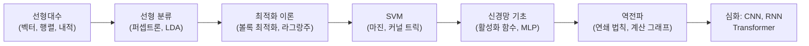

# ML 모델과 신경망 - 수학적 개념 완전 정복

## 1. 주제 개요 및 중요성

**한 문장 정의**: ML 모델과 신경망은 선형 분류기(퍼셉트론)에서 출발하여, SVM의 커널 트릭을 거쳐, 학습 가능한 특징 추출기(신경망)로 발전한 패턴 인식 시스템의 수학적 체계이다.

**왜 배워야 하는가**:
- **실용적 가치**: 이미지 인식, 자연어 처리, 자율주행 등 현대 AI 기술의 핵심 기반이다. 신경망의 수학적 원리를 이해해야 올바른 아키텍처 설계와 디버깅이 가능하다.
- **이론적 중요성**: 퍼셉트론의 한계(XOR 문제)가 SVM과 신경망의 등장을 이끈 역사적 맥락을 이해하면, "왜 딥러닝이 필요한가"라는 근본 질문에 답할 수 있다.

**어떤 문제를 해결하는가**: 선형 분리 불가능한 복잡한 패턴을 자동으로 학습하여 분류, 회귀, 생성 등의 과제를 수행한다. 특히 사람이 수동으로 특징을 설계해야 했던 한계를 돌파한다.

---

## 2. 입문자용 설명 (Level 1)

### 퍼셉트론 -- 가장 단순한 판별기
마치 시험 점수 합계로 합격/불합격을 나누는 것과 같다. 여러 정보(키, 몸무게 등)에 각각 중요도(가중치)를 곱해서 더한 뒤, 기준선을 넘으면 "예", 못 넘으면 "아니오"라고 답한다. 하지만 **직선 하나로 나눌 수 없는 문제**(예: XOR)는 풀 수 없다.

### SVM -- 가장 넓은 도로 찾기
두 그룹의 점들 사이에 **가장 넓은 도로**를 만드는 분류기이다. 도로가 넓을수록 새로운 점이 어느 쪽인지 맞출 확률이 높다. 도로의 경계에 딱 붙어 있는 점들이 "서포트 벡터"이다.

### 커널 트릭 -- 마법의 거울
바닥에 빨간 구슬과 파란 구슬이 원형으로 섞여 있어서 직선으로 나눌 수 없다고 하자. 구슬들을 **공중으로 던져 올리면**, 빨간 건 높이 올라가고 파란 건 낮게 있어서 칼로 자를 수 있다. 커널 트릭은 실제로 던지지 않고도, 높이를 **계산만으로** 알 수 있게 해주는 방법이다.

### 신경망 -- 스스로 안경을 만드는 시스템
데이터를 보는 "안경"(특징 변환)을 바꾸면 복잡한 문제가 쉬워진다. 지금까지는 어떤 안경을 쓸지 사람이 골랐지만, 신경망은 **스스로 안경을 만들어 쓴다**. 여러 겹의 변환을 쌓으면 점점 더 복잡한 패턴을 인식할 수 있다.

### 활성화 함수 -- 직선을 꺾는 도구
직선을 아무리 여러 개 이어 붙여도 결국 하나의 직선이 된다. 하지만 직선을 **꺾을 수 있으면**(비선형 활성화 함수), 어떤 모양이든 만들 수 있다. ReLU는 음수를 0으로 바꾸는, 가장 널리 쓰이는 꺾기 도구이다.

### 보편 근사 정리 -- 레고의 무한 가능성
레고 블록이 충분히 많으면 어떤 모양이든 만들 수 있듯이, 신경망의 뉴런이 **충분히 많으면** 세상의 어떤 패턴이든 흉내 낼 수 있다. 다만 "충분히 많은"이 매우 많을 수 있어서, 층을 깊게 쌓는 것이 더 효율적이다.

---

## 3. 기술적 상세 설명 (Level 2)

### 3.1 퍼셉트론의 수학적 정의

$$f(x; w) = \mathbf{1}(w^\top x \geq 0)$$

| 기호 | 의미 |
|------|------|
| $x \in \mathbb{R}^d$ | 입력 벡터 (데이터의 특징들) |
| $w \in \mathbb{R}^d$ | 가중치 벡터 (각 특징의 중요도) |
| $w^\top x$ | 내적 -- 가중치와 입력의 유사도 측정 |
| $\mathbf{1}(\cdot)$ | 지시 함수 -- 조건이 참이면 1, 거짓이면 0 |

**결정 경계(decision boundary)**: $w^\top x = 0$이 정의하는 초평면(hyperplane)이다.

**수치 예시**: $w = (2, 3)$, $x = (1, 1)$이면 $w^\top x = 2 \times 1 + 3 \times 1 = 5 \geq 0$ → 출력 1. $x = (-1, -1)$이면 $w^\top x = -5 < 0$ → 출력 0.

**한계**: 퍼셉트론은 **선형 분리 가능(linearly separable)**한 데이터만 분류할 수 있다. Minsky & Papert (1969)는 단일 퍼셉트론이 XOR을 풀 수 없음을 증명했다.

### 3.2 SVM -- 최대 마진 분류기

**Primal 문제**:

$$\min_{w,b} \frac{1}{2}\|w\|^2 \quad \text{s.t.} \quad y_i(w^\top x_i + b) \geq 1, \; \forall i$$

| 기호 | 의미 |
|------|------|
| $\|w\|^2$ | 가중치 벡터의 L2 노름 제곱 -- 이를 최소화하면 마진이 최대화됨 |
| $y_i \in \{+1, -1\}$ | 클래스 레이블 |
| $w^\top x_i + b$ | 결정 경계로부터의 부호가 있는 거리 |

**왜 $\|w\|^2$를 최소화하는가?** 마진(두 클래스 사이의 거리)은 $\frac{2}{\|w\|}$이다. 마진을 최대화하려면 $\|w\|$를 최소화해야 하고, 미분의 편의를 위해 $\frac{1}{2}\|w\|^2$ 형태를 사용한다.

**수치 예시**: 2차원에서 $w = (1, 0)$, $b = 0$이면 결정 경계는 $x_1 = 0$ (y축)이고, 마진은 $\frac{2}{1} = 2$이다.

**Lagrangian과 Dual 문제**:

$$\mathcal{L}(w, b, \alpha) = \frac{1}{2}\|w\|^2 + \sum_i \alpha_i(1 - y_i(w^\top x_i + b))$$

KKT 조건으로 $w$를 소거하면: $w = \sum_i \alpha_i y_i x_i$

**Dual 문제**:

$$\max_\alpha \quad -\frac{1}{2}\sum_{i,j} \alpha_i \alpha_j y_i y_j x_i^\top x_j + \sum_i \alpha_i$$

핵심 통찰: Dual에서 데이터는 **내적** $x_i^\top x_j$로만 나타난다. 이것이 커널 트릭의 전제 조건이다.

**Soft-Margin SVM**: 선형 분리 불가능 시 슬랙 변수 $\zeta_i$를 도입한다.

$$\min_{w,b,\zeta} \frac{1}{2}\|w\|^2 + C\sum_i \zeta_i \quad \text{s.t.} \quad y_i(w^\top x_i + b) \geq 1 - \zeta_i, \; \zeta_i \geq 0$$

$C$는 마진 폭 대 오분류 허용 사이의 트레이드오프 파라미터이다. $C$가 크면 오분류를 덜 허용하고, 작으면 마진을 더 넓힌다.

### 3.3 커널 트릭

$$f(x) = \sum_i \alpha_i y_i K(x_i, x) + b$$

| 기호 | 의미 |
|------|------|
| $K(x_i, x)$ | 커널 함수 -- 고차원 특징 공간에서의 내적을 직접 계산 |
| $\alpha_i$ | Dual 변수 -- support vector에서만 0이 아님 |

**대표 커널**:
- **RBF(가우시안) 커널**: $K(x, x') = \exp(-\gamma\|x - x'\|^2)$ -- 무한 차원 특징 공간에 대응
- **다항식 커널**: $K(x, x') = (x^\top x' + c)^d$

**수치 예시**: $x_1 = (1, 0)$, $x_2 = (0, 1)$, $\gamma = 1$이면 $K(x_1, x_2) = \exp(-1 \cdot \|(1,-1)\|^2) = \exp(-2) \approx 0.135$

### 3.4 비선형 기저함수에서 신경망으로

모델의 진화 경로:

$$\text{선형 모델 } (w^\top x) \to \text{비선형 기저함수 } (w^\top \phi(x)) \to \text{학습 가능한 특징 추출기 } (w^\top \phi(x; W_0))$$

고정된 기저함수 $\phi(x)$는 사람이 설계해야 하지만, 신경망은 $\phi(x; \theta')$의 파라미터 $\theta'$도 함께 학습한다. 이것이 딥러닝의 핵심 아이디어이다.

### 3.5 활성화 함수

| 함수 | 수식 | 출력 범위 | 주요 특성 |
|------|------|----------|----------|
| Sigmoid | $\sigma(x) = \frac{1}{1+e^{-x}}$ | $(0, 1)$ | 확률 출력에 적합, 은닉층에서 vanishing gradient 문제 |
| ReLU | $\max(0, x)$ | $[0, \infty)$ | 계산이 빠르고 희소 출력, Dead ReLU 위험 |
| Tanh | $\frac{e^x - e^{-x}}{e^x + e^{-x}}$ | $(-1, 1)$ | 출력이 0 중심, sigmoid보다 나은 gradient flow |
| GELU | $x \cdot P(X \leq x)$ | $[-0.17, \infty)$ | Transformer 표준, 확률적 마스킹 해석 가능 |
| SiLU/Swish | $x \cdot \sigma(x)$ | $[-0.278, \infty)$ | 매끄러운 ReLU 대안, $C^\infty$ |

**Vanishing Gradient 문제**: Sigmoid의 도함수 $\sigma'(x) = \sigma(x)(1-\sigma(x))$의 최댓값은 0.25이다. 층이 깊어지면 $0.25^L$로 기울기가 기하급수적으로 사라진다.

**Dead ReLU 문제**: 뉴런의 입력이 항상 음수이면 ReLU 출력이 영구적으로 0이 되어, 그래디언트도 0이므로 복구가 불가능하다.

### 3.6 보편 근사 정리 (Universal Approximation Theorem)

$$\left|f(x) - \sum_{i=1}^N \alpha_i \sigma(w_i^\top x + b_i)\right| < \epsilon$$

| 기호 | 의미 |
|------|------|
| $f(x)$ | 근사하고 싶은 임의의 연속 함수 |
| $N$ | 은닉 뉴런 수 (충분히 크면 됨) |
| $\alpha_i$ | 각 뉴런의 출력 가중치 |
| $\sigma$ | 비상수, 유계, 단조증가인 활성화 함수 |
| $\epsilon$ | 원하는 근사 정밀도 |

**왜 이런 수식 형태인가**: 각 은닉 뉴런 $\sigma(w_i^\top x + b_i)$가 하나의 "범프(bump)"를 만들고, 이들의 가중합 $\sum_i \alpha_i \cdot \text{bump}_i(x)$로 임의의 함수를 계단 근사한다.

**수치 예시**: 구간 $[0, 1]$에서 $f(x) = x^2$을 근사하려면, $N=10$개의 ReLU 뉴런으로 10개의 선분을 이어붙여 포물선을 근사할 수 있다.

**중요한 한계**:
1. 필요한 뉴런 수 $N$이 기하급수적으로 클 수 있다
2. 그러한 파라미터를 **찾는 방법**(최적화 가능성)을 보장하지 않는다
3. **일반화 성능**을 보장하지 않는다

### 3.7 MLP와 깊은 네트워크

$L$개 층의 MLP 순전파:

$$x_0 = x, \quad x_{k+1} = \sigma(W_k x_k), \quad z = W_{L-1} x_{L-1}$$

**비선형 활성화가 없으면**: $z = W_{L-1} W_{L-2} \cdots W_0 x_0 = W' x$로, 아무리 층을 깊게 쌓아도 단일 선형 변환과 동치이다.

**깊이의 혁명** (ImageNet Classification top-5 error):

| 모델 | 층 수 | 오류율 |
|------|-------|--------|
| Shallow (2010) | 얕음 | 28.2% |
| AlexNet (2012) | 8 | 16.4% |
| VGG (2014) | 19 | 7.3% |
| ResNet (2015) | 152 | 3.57% |

### 3.8 Fisher의 선형 판별분석 (LDA)

Fisher의 비율:

$$S = \frac{(w^\top(m_1 - m_2))^2}{2w^\top \Sigma w}$$

| 기호 | 의미 |
|------|------|
| $m_1, m_2$ | 두 클래스의 평균 벡터 |
| $\Sigma$ | 공유 공분산 행렬 |
| $w$ | 사영 방향 벡터 |

최적 사영 방향: $w^* \propto \Sigma^{-1}(m_1 - m_2)$

**직관**: 두 그룹의 "그림자"가 가장 잘 분리되는 방향을 찾는다. 그림자끼리의 평균 거리는 최대화하고, 각 그룹 내 퍼짐은 최소화한다.

### 3.9 귀납적 편향 (Inductive Bias)

모델이 새로운 입력에 일반화하기 위해 만드는 **가정(assumption/prior)의 집합**이다.

| 아키텍처 | 귀납적 편향 |
|----------|------------|
| MLP | 제한 적음 |
| ConvNet | 지역성(locality), 이동 불변성(stationarity) |
| RNN | 시간적 파라미터 공유 |
| GNN | 순열 불변성 |

No Free Lunch Theorem: 모든 문제에 최적인 단일 모델은 존재하지 않는다. 데이터의 특성에 맞는 귀납적 편향을 가진 모델을 선택해야 한다.

---

## 4. 전문가 수준 핵심 요약 (Level 3)

퍼셉트론의 선형 분리 한계는 SVM의 커널 트릭으로 부분적 해결되었으나, 커널의 수동 설계가 여전히 병목이었다. 신경망은 특징 추출기 $\phi(x; \theta')$의 파라미터를 데이터로부터 학습함으로써 이 한계를 돌파했다. **비선형 활성화 함수 없이는 심층 네트워크가 단일 선형 변환과 동치**라는 사실은 활성화 함수의 필수성을 수학적으로 보장하며, UAT는 2층 네트워크의 이론적 표현력을 증명하지만 실용적 효율성은 depth에 의존한다. The Bitter Lesson이 시사하듯, 계산을 활용하는 일반적 방법(깊은 신경망 + 대규모 데이터)이 수동 특징 설계를 압도하며, 아키텍처의 귀납적 편향(CNN의 지역성, RNN의 시간 공유)이 도메인별 효율성을 제공한다.

---

## 5. 메타인지 체크포인트

스스로에게 물어보세요:

- [ ] 이 개념을 10살 아이에게 설명할 수 있는가? (예: "SVM은 두 팀 사이에 가장 넓은 금을 긋는 거야")
- [ ] 왜 고정 기저함수 대신 학습 가능한 특징 추출기를 사용하는지 설명할 수 있는가?
- [ ] 비선형 활성화 함수 없이는 무엇을 할 수 없는가? (선형 합성은 선형이므로 XOR도 풀 수 없다)
- [ ] SVM의 커널 트릭과 신경망의 학습 가능한 특징 추출기는 어떻게 다른가?
- [ ] 실제 이미지 분류 문제에 퍼셉트론, SVM, MLP를 각각 어떻게 적용할지 예시를 들 수 있는가?

---

## 6. 흔한 오개념 및 주의사항

**"SVM은 항상 선형 분류기이다"**
커널 트릭을 사용하면 원래 입력 공간에서 매우 복잡한 비선형 결정 경계를 만들 수 있다. 고차원 특징 공간에서만 선형이다.

**"활성화 함수 없이 층을 쌓으면 더 강력해진다"**
$W_{L-1} W_{L-2} \cdots W_0 = W'$ -- 선형 함수의 합성은 여전히 선형이다. 층을 100개 쌓아도 하나의 행렬과 동치이다.

**"Universal Approximation Theorem이 있으니 2층이면 충분하다"**
UAT는 존재성만 보장한다. 필요한 뉴런 수가 기하급수적일 수 있고, 최적 파라미터를 찾을 수 있는지도 보장하지 않는다. 실제로 깊은 네트워크가 훨씬 효율적이다.

**"ReLU는 미분 불가능하므로 문제가 있다"**
$x=0$인 경우는 확률적으로 거의 발생하지 않으며, subgradient를 사용하면 된다. ReLU의 진짜 문제는 Dead ReLU -- 음수 영역에서 그래디언트가 영구적으로 0이 되는 것이다.

**"SVM의 Dual 문제는 Primal과 다른 해를 준다"**
볼록 최적화에서 강한 쌍대성(strong duality)이 성립하므로, Primal과 Dual의 최적값은 동일하다. Dual의 장점은 커널 트릭 적용이 가능하다는 것이다.

**"Sigmoid의 vanishing gradient는 sigmoid 자체의 결함이다"**
출력층에서 확률 예측(binary classification)에는 여전히 sigmoid를 사용한다. 문제는 **은닉층**에서 sigmoid를 쓸 때 깊은 네트워크에서 발생한다.

---

## 7. 학습 로드맵

**선행 지식**:
- 선형대수: 벡터/행렬 연산, 내적, 고유값
- 미적분: 편미분, 연쇄 법칙
- 확률/통계: 기본 확률 분포, 기대값

**심화 학습 경로**:
- 딥러닝 최적화 (경사 하강법, Adam)
- CNN/RNN 아키텍처
- Transformer와 어텐션 메커니즘

---

## 8. 실전 활용 사례

### 사례 1: 스팸 메일 분류
- **상황**: 이메일이 스팸인지 아닌지 판별
- **적용 방법**: 이메일의 단어 빈도를 특징 벡터로, SVM(RBF 커널)로 분류
- **결과**: 단어의 비선형 조합 패턴까지 포착하여 95%+ 정확도

### 사례 2: 손글씨 숫자 인식 (MNIST)
- **상황**: 28x28 픽셀 이미지에서 0~9 숫자를 인식
- **적용 방법**: 784차원 입력 -> 2층 MLP (은닉층 256, ReLU) -> 10개 클래스 softmax
- **결과**: 98%+ 정확도, UAT에 의해 이론적으로 보장

### 사례 3: ImageNet 이미지 분류
- **상황**: 1000개 카테고리의 자연 이미지 분류
- **적용 방법**: 152층 ResNet (비선형 활성화 + skip connection)
- **결과**: 3.57% top-5 오류율 -- 인간 수준(~5%)을 초월

---

## 9. 추가 학습 자료

**입문자용**:
- 3Blue1Brown "Neural Networks" 시리즈 (YouTube) -- 시각적 직관 구축
- Michael Nielsen "Neural Networks and Deep Learning" (온라인 교재)

**중급자용**:
- Bishop "Pattern Recognition and Machine Learning" Ch. 5-7
- Stanford CS229 강의 노트 (SVM, 커널 메서드)

**전문가용**:
- Telgarsky (2016) "Benefits of Depth in Neural Networks" -- depth-width tradeoff 이론
- Cybenko (1989) 원논문 -- Universal Approximation Theorem
- Sutton (2019) "The Bitter Lesson"

---

> **핵심을 날카롭게 정리하면:**
>
> 선형 모델의 한계(XOR)가 커널 트릭과 신경망이라는 두 갈래 해법을 낳았고, 신경망이 "특징 추출기 자체를 학습"함으로써 커널의 수동 설계 한계를 돌파했다. 비선형 활성화 함수의 존재가 깊은 네트워크의 표현력을 수학적으로 보장하며, 아키텍처의 귀납적 편향이 도메인별 효율성을 결정한다.
>
> 이것이 중요한 이유는 현대 AI의 모든 성과(GPT, AlphaFold, 자율주행)가 이 수학적 기반 위에 서 있기 때문이다.
>
> 진정한 마스터와 피상적 이해의 차이는 "왜 선형의 합성이 선형인지", "왜 UAT가 존재성만 보장하는지", "왜 The Bitter Lesson이 hand-crafted feature를 부정하는지"를 수학적으로 설명할 수 있느냐에 달려 있다.
