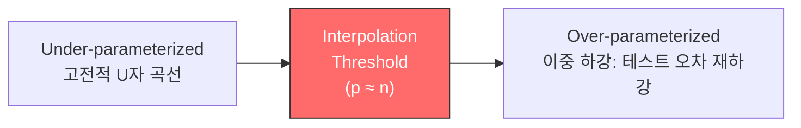
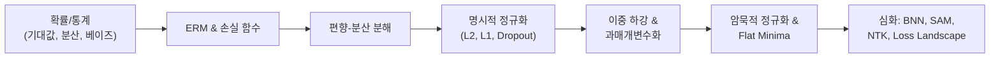

# 일반화와 정규화 - 수학적 개념 완전 정복

## 1. 주제 개요 및 중요성

**한 문장 정의**: 일반화(generalization)는 훈련 데이터에서 학습한 모델이 한 번도 본 적 없는 데이터에서도 잘 동작하는 능력이며, 정규화(regularization)는 이 일반화 성능을 체계적으로 높이기 위한 수학적 도구 모음이다.

**왜 배워야 하는가**:
- **실용적 가치**: 과적합(overfitting)은 딥러닝에서 가장 흔한 실패 원인이다. 정규화 기법(weight decay, dropout, early stopping)을 올바르게 적용하면 모델의 실전 성능을 크게 향상시킬 수 있다.
- **이론적 중요성**: 파라미터가 데이터 수보다 훨씬 많은 과매개변수화(overparameterized) 모델이 왜 일반화에 성공하는지는 현대 딥러닝 이론의 핵심 미스터리이며, 이중 하강(double descent), 암묵적 정규화(implicit regularization) 등 최신 이론이 부분적 해답을 제공한다.

**어떤 문제를 해결하는가**: 훈련 오차는 낮지만 테스트 오차가 높은 과적합 문제를 해결하고, 모델의 일반화 성능을 예측하고 제어한다.

---

## 2. 입문자용 설명 (Level 1)

### 일반화 -- 진짜 시험 성적
시험 공부를 할 때, 교과서 문제만 달달 외우면 시험에서 처음 보는 문제를 못 푼다. "교과서 점수"(훈련 오차)는 높지만 "시험 점수"(테스트 오차)는 낮은 것이다. 마치 더하기의 "원리"를 이해해야 어떤 숫자든 더할 수 있듯이, 모델도 데이터의 "원리"를 배워야 한다.

### 과적합 -- 답을 외우는 것
수학 문제의 풀이 과정을 이해하지 않고 답만 외우면, 1+1=2는 맞추지만 처음 보는 4+7은 못 푼다. 모델이 데이터를 너무 세세하게 외우면 원리 대신 답을 외우게 되는데, 이것이 과적합이다.

### 정규화 -- 복잡한 답에 벌점 주기
"최대한 간단한 규칙으로 이해하라"는 것이다. 복잡한 답을 쓰면 벌점을 주는 것처럼, 모델이 너무 복잡해지면 패널티를 부여한다.

### 드롭아웃 -- 랜덤 결석으로 팀 강화
축구팀에서 연습할 때 매번 다른 선수가 빠진다고 하자. 남은 선수들이 여러 포지션을 다 할 줄 알아야 하니까 팀 전체가 더 강해진다. 뉴런을 랜덤으로 꺼서 모든 뉴런이 독립적으로 잘 작동하도록 만드는 것이 드롭아웃이다.

### 이중 하강 -- 많이 외우면 오히려 잘 보는 역설
보통은 "너무 많이 외우면 시험 못 본다"고 하는데, 신기하게도 **정말 많이** 외우면 오히려 시험도 잘 보게 되는 현상이 있다. 처음엔 나빠지다가 다시 좋아지는 것이다.

### 평평한 극소 -- 안정적인 답
넓고 평평한 그릇 바닥에 공이 있으면, 살짝 흔들어도 공이 그릇 밖으로 안 나간다. 좁고 뾰족한 바닥이면 조금만 흔들어도 나가버린다. 딥러닝에서도 **넓고 평평한 곳**에 있는 답이 새로운 데이터에도 잘 맞는다.

---

## 3. 기술적 상세 설명 (Level 2)

### 3.1 일반화 오차 분해

가설 공간 $\mathcal{H}$에서:
- $h^*_\mathcal{H} = \arg\min_{h \in \mathcal{H}} L_\mathcal{P}(h)$ (가설 공간 내 최적)
- $h_S = \arg\min_{h \in \mathcal{H}} L_S(h)$ (경험적 위험 최소화기)

$$L_\mathcal{P}(h_S) = \underbrace{L_\mathcal{P}(h^*_\mathcal{H})}_{\text{근사 오차}} + \underbrace{(L_\mathcal{P}(h_S) - L_\mathcal{P}(h^*_\mathcal{H}))}_{\text{추정 오차}}$$

| 기호 | 의미 |
|------|------|
| $L_\mathcal{P}(h)$ | 전체 데이터 분포에서의 오차 (일반화 오차, population risk) |
| $L_S(h)$ | 훈련 데이터에서의 오차 (경험적 위험, empirical risk) |
| 근사 오차 | 모델 가족이 정답에 얼마나 가까운가 ($\|\mathcal{H}\| \uparrow \Rightarrow$ 근사 오차 $\downarrow$) |
| 추정 오차 | 유한한 데이터로 인해 최적 모델에서 얼마나 벗어나는가 ($\|\mathcal{H}\| \uparrow \Rightarrow$ 추정 오차 $\uparrow$) |

**유한 가설 공간에서의 일반화 바운드**:

$$L_\mathcal{P}(h) - L_S(h) \leq \sqrt{\frac{\log|\mathcal{H}| + \log(2/\delta)}{2n}}, \quad \forall h \in \mathcal{H}$$

추정 오차의 상한은 $O(1/\sqrt{n})$으로, 데이터가 많을수록 줄어든다.

**수치 예시**: $|\mathcal{H}| = 1000$, $n = 10000$, $\delta = 0.05$이면 바운드 $\approx \sqrt{(6.9 + 3.7) / 20000} \approx 0.023$

### 3.2 편향-분산 트레이드오프

$$\mathbb{E}_S[(h_S(x) - f(x))^2] = \underbrace{\text{Var}_S[h_S(x)]}_{\text{분산}} + \underbrace{(\mathbb{E}_S[h_S(x)] - f(x))^2}_{\text{편향}^2}$$

| 기호 | 의미 |
|------|------|
| $h_S$ | 훈련 데이터 $S$로부터 학습한 모델 |
| $f$ | 참 함수 |
| $\text{Var}_S[h_S]$ | 다른 훈련 데이터를 사용했을 때 모델 출력의 변동성 |
| $\text{bias}(h_S)$ | 모델의 체계적 오차 -- 평균적으로 정답에서 얼마나 벗어나는가 |

**과녁 비유**:
- **높은 편향, 낮은 분산**: 화살이 한 곳에 모이지만 과녁 중심에서 멀리 (단순 모델)
- **낮은 편향, 높은 분산**: 화살이 과녁 중심 근처지만 흩어짐 (복잡한 모델)
- 최적: 둘 다 낮은 지점

**수치 예시**: 데이터가 $y = x^2 + \epsilon$인데:
- 직선($y = ax + b$)으로 적합: 편향 높음 (포물선을 직선으로 못 잡음), 분산 낮음
- 20차 다항식으로 적합: 편향 낮음 (어떤 곡선이든 따라감), 분산 높음 (노이즈까지 학습)
- 2차 다항식으로 적합: 편향/분산 모두 적절

### 3.3 정규화된 경험적 위험 & Weight Decay

$$L_S(\theta; \lambda) = L_S(\theta) + \lambda C(\theta)$$

| 기호 | 의미 |
|------|------|
| $L_S(\theta)$ | 훈련 손실 |
| $C(\theta)$ | 복잡도 페널티 |
| $\lambda$ | 정규화 강도 ($\lambda \uparrow$ = 단순한 모델 선호) |

**대표적 정규화**:
- **L2 (Weight Decay)**: $C(\theta) = \|\theta\|_2^2$ -- 가우시안 사전분포의 MAP 추정과 동치
- **L1 (LASSO)**: $C(\theta) = \|\theta\|_1$ -- 라플라스 사전분포, 희소 해 유도

**확률적 관점에서의 연결**:
- MLE $\leftrightarrow$ ERM (정규화 없음)
- MAP $\leftrightarrow$ Regularized ERM (정규화 있음)

**수치 예시**: $\theta = (3, 0.1, -2, 0.01)$에서
- $\|\theta\|_2^2 = 9 + 0.01 + 4 + 0.0001 = 13.01$
- $\|\theta\|_1 = 3 + 0.1 + 2 + 0.01 = 5.11$
- L1은 작은 가중치를 정확히 0으로 만드는 경향 (특징 선택 효과)

### 3.4 드롭아웃 (Dropout)

히든 유닛 $h_i$에 마스크 $m_i \sim \text{Bernoulli}(1-p)$를 곱한다:

$$\tilde{h}_i = m_i \cdot h_i$$

| 기호 | 의미 |
|------|------|
| $p$ | 드롭 확률 (보통 0.5) |
| $m_i$ | 0 또는 1의 무작위 마스크 |

**핵심 메커니즘**:
- 훈련 시: 각 샘플마다 다른 부분 네트워크를 사용 ($2^n$개의 서브네트워크 앙상블)
- 추론 시: 모든 뉴런을 사용하되 출력에 $(1-p)$를 곱함 (앙상블 평균 근사)
- 효과: 공동 적응(co-adaptation) 방지, Lipschitz 모델 선호

### 3.5 이중 하강 & 과매개변수화

**세 레짐**:
1. **Skydiving Regime** (심하게 부족): 스케일링 중심
2. **U-shaped Regime** (고전적 ML): 정규화로 최적 복잡도 선택
3. **Second-descent Regime** (과매개변수): 보간 임계점($p \approx n$) 이후 다시 하강

**수학적 분석** (선형 회귀, $\gamma = p/n$):

$$\text{Var} \to \begin{cases} \frac{\gamma}{1-\gamma} & \text{if } 0 < \gamma < 1 \\ \frac{1}{\gamma - 1} & \text{if } \gamma > 1 \end{cases}$$

$\gamma \to 1$에서 분산이 발산하여 이중 하강의 peak를 형성한다. $\gamma > 1$이면 분산이 다시 감소한다.

**수치 예시**: $p/n = 0.9$이면 분산 $\approx 9$, $p/n = 1$이면 분산 $\to \infty$, $p/n = 2$이면 분산 $= 1$, $p/n = 10$이면 분산 $\approx 0.11$

### 3.6 암묵적 정규화 & SGD의 귀납적 편향

과매개변수화된 선형 모델에서 ($p > n$), 훈련 오차 0인 해는 무한히 많지만, 경사하강법은 초기값에서 가장 가까운 해, 즉 **최소 노름 해(min-norm solution)** $\hat{\beta} = X^+ y$로 수렴한다.

**GD의 암묵적 편향**:
- GD는 **낮은 노름**의 파라미터를 선호
- GD는 **최대 마진** 분류기로 수렴
- SGD (큰 LR / 작은 배치)는 **평평한 극소**를 선호
- Dropout noise는 **Lipschitz 모델**을 선호

### 3.7 평평한 극소와 일반화

**Sharpness 측정**: $\lambda_{\max}(\nabla^2 L(\theta))$ -- 손실의 헤시안 최대 고유값

- **Flat minimum**: $\lambda_{\max}$ 작음 $\to$ 훈련/테스트 손실 곡면이 비슷 $\to$ 좋은 일반화
- **Sharp minimum**: $\lambda_{\max}$ 큼 $\to$ 곡면 차이 큼 $\to$ 나쁜 일반화

**Edge of Stability (EoS)**: GD 훈련 시 sharpness가 $2/\eta$에 도달하면 그 근처에서 진동한다. 따라서 큰 학습률은 낮은 sharpness를, 즉 더 나은 일반화를 유도한다.

**SAM (Sharpness-Aware Minimization)**:

$$w_{\text{adv}} = w_t + \rho \frac{\nabla L(w_t)}{\|\nabla L(w_t)\|}$$
$$w_{t+1} = w_t - \eta \nabla L(w_{\text{adv}})$$

| 기호 | 의미 |
|------|------|
| $\rho$ | perturbation 반경 |
| $w_{\text{adv}}$ | worst-case 방향으로 섭동한 파라미터 |

이는 $\min_w \max_{\|\epsilon\| \leq \rho} L(w + \epsilon)$를 근사적으로 최적화하여, 자연스럽게 flat minima로 수렴한다.

### 3.8 베이지안 신경망

$$p(y|x, S) = \int p(y|x, \theta) p(\theta|S) d\theta$$

| 기호 | 의미 |
|------|------|
| $p(\theta\|S)$ | 사후분포 -- 데이터를 본 후 파라미터에 대한 믿음 |
| $\int \cdots d\theta$ | 모든 가능한 파라미터에 대한 적분 (앙상블) |

단일 점 추정 $\hat{\theta}$ 대신, 사후분포 전체를 사용하여 예측 불확실성을 정량화할 수 있다. MC Dropout: 추론 시에도 드롭아웃을 켜고 여러 번 포워드 패스를 수행하면 예측 불확실성을 추정할 수 있다.

---

## 4. 전문가 수준 핵심 요약 (Level 3)

고전적 bias-variance tradeoff는 과매개변수화 영역에서 깨지며, 이중 하강 현상은 보간 임계점($p \approx n$)에서의 분산 발산과 이후의 감소로 수학적으로 설명된다. 현대 딥러닝의 일반화는 SGD의 암묵적 정규화(min-norm 해 수렴, flat minima 선호)와 손실 경관의 구조적 특성(mode connectivity, benign overfitting)으로 부분적으로 설명되지만, "왜 딥러닝이 일반화하는가"에 대한 완전한 이론은 아직 없다. 명시적 정규화(L2, dropout)는 가설 공간의 유효 복잡도를 제어하고, SAM은 loss landscape의 sharpness를 명시적으로 최소화한다. BNN은 파라미터 불확실성의 정량화를 통해 자연스러운 정규화 효과를 제공하며, MC Dropout은 그 실용적 근사이다.

---

## 5. 메타인지 체크포인트

스스로에게 물어보세요:

- [ ] 일반화를 10살 아이에게 설명할 수 있는가? ("연습 문제 말고 진짜 시험도 잘 보는 것")
- [ ] 왜 단순한 L2 정규화 대신 dropout을 사용하는지 설명할 수 있는가?
- [ ] 정규화 없이는 무엇을 할 수 없는가? (과매개변수화 모델에서 과적합 제어)
- [ ] 편향-분산 트레이드오프와 이중 하강은 어떻게 다른가?
- [ ] 실제 프로젝트에서 과적합이 의심될 때 어떤 순서로 정규화 기법을 적용할지 제시할 수 있는가?

---

## 6. 흔한 오개념 및 주의사항

**"모델이 크면 반드시 과적합한다"**
이중 하강 현상이 보여주듯, 충분히 큰 모델은 보간 임계점을 지나면 오히려 테스트 성능이 좋아진다. GPT-4 같은 조 단위 파라미터 모델이 잘 일반화하는 것이 실증적 증거이다.

**"훈련 오차가 0이면 반드시 과적합이다"**
과매개변수화된 모델이 훈련 데이터를 완벽히 보간하면서도 좋은 일반화를 달성하는 **benign overfitting** 현상이 존재한다.

**"Weight decay는 단순히 가중치를 작게 만들 뿐이다"**
Weight decay는 가우시안 사전분포를 부여한 MAP 추정과 동등하며, 가설 공간의 유효 차원을 줄여 추정 오차를 제어한다.

**"Sharp minima는 항상 나쁘다"**
Reparameterization으로 flat minima를 sharp하게 보이게 할 수 있다. Sharpness의 정의가 파라미터화에 의존하므로 reparameterization-invariant 측정이 필요하다.

**"드롭아웃은 단순히 노이즈를 추가하는 것이다"**
드롭아웃은 지수적으로 많은 서브네트워크의 앙상블 학습, 베이지안 추론의 변분 근사, 공동 적응 방지, Lipschitz 모델 선호 등 다층적 효과를 가진다.

**"편향-분산 트레이드오프는 항상 성립한다"**
분해 자체는 항상 성립하지만, "복잡도 증가 = 분산 증가"라는 단조적 관계는 보간 임계점 이후 깨진다.

---

## 7. 학습 로드맵

**선행 지식**: 확률/통계(기대값, 분산, 베이즈 정리), 최적화 기초(경사 하강법), 신경망 기초

**심화 학습 경로**: Neural Tangent Kernel, PAC-Bayes bounds, 정보 이론적 일반화 바운드

---

## 8. 실전 활용 사례

### 사례 1: 과적합 방지 -- 의료 이미지 분류
- **상황**: 1000장의 X-ray로 폐렴 분류 (데이터 부족)
- **적용**: ResNet-50 + dropout(0.3) + weight decay(1e-4) + data augmentation + early stopping
- **결과**: dropout 없이 90% 훈련 정확도/70% 검증 정확도 -> dropout 적용 후 85%/82%로 간극 축소

### 사례 2: 이중 하강 관찰
- **상황**: CIFAR-10에서 모델 크기를 점진적으로 증가
- **적용**: ResNet 너비를 1배 -> 64배까지 변화시키며 테스트 오차 관찰
- **결과**: 너비 4-8배에서 테스트 오차 peak, 이후 감소 -- 이중 하강 확인

### 사례 3: SAM으로 일반화 향상
- **상황**: ImageNet에서 ViT-B/16 학습
- **적용**: 기본 Adam 대신 SAM ($\rho = 0.05$) 적용
- **결과**: 테스트 정확도 약 0.5-1% 향상, sharpness 지표 감소 확인

---

## 9. 추가 학습 자료

**입문자용**:
- Goodfellow et al. "Deep Learning" Ch. 7 (정규화)
- Stanford CS231n "Regularization" 강의

**중급자용**:
- Belkin et al. (2019) "Reconciling Modern ML Practice and the Bias-Variance Tradeoff"
- Srivastava et al. (2014) "Dropout" 원논문

**전문가용**:
- Nakkiran et al. (2021) "Deep Double Descent"
- Foret et al. (2021) "SAM: Sharpness-Aware Minimization" 원논문
- Cohen et al. (2021) "Gradient Descent on Neural Networks Typically Occurs at the Edge of Stability"

---

> **핵심을 날카롭게 정리하면:**
>
> 일반화 오차 = 근사 오차 + 추정 오차이며, 정규화는 추정 오차를 제어하는 도구이다. 고전적 bias-variance tradeoff의 U자 곡선은 과매개변수화 영역에서 이중 하강으로 대체되며, 현대 딥러닝의 놀라운 일반화는 SGD의 암묵적 편향(flat minima, min-norm 해)과 손실 경관의 구조적 특성으로 부분적으로 설명된다.
>
> 이것이 중요한 이유는 "왜 GPT-4가 1조 개 파라미터로도 과적합하지 않는가"라는 질문이 현대 ML 이론의 가장 중요한 열린 문제이기 때문이다.
>
> 진정한 마스터와 피상적 이해의 차이는 "dropout이 왜 앙상블과 동치인지", "이중 하강의 peak가 왜 $p \approx n$에서 발생하는지", "SGD의 잡음이 왜 일반화에 도움이 되는지"를 수학적으로 설명할 수 있느냐에 달려 있다.
