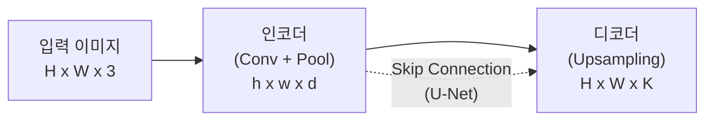
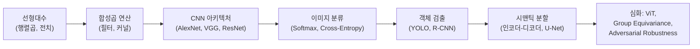

# CNN과 이미지 이해 - 수학적 개념 완전 정복

## 1. 주제 개요 및 중요성

**한 문장 정의**: CNN(합성곱 신경망)은 이미지의 **지역성(locality)**과 **이동 불변성(translation invariance)**이라는 귀납적 편향을 합성곱 연산으로 구현하여, 파라미터를 극적으로 줄이면서도 공간적 패턴을 효과적으로 학습하는 신경망 아키텍처이다.

**왜 배워야 하는가**:
- **실용적 가치**: 이미지 분류, 객체 검출, 시맨틱 분할, 깊이 추정 등 거의 모든 시각 과제에서 CNN이 핵심 역할을 수행한다. AlexNet(2012) 이후 컴퓨터 비전의 표준이 되었다.
- **이론적 중요성**: 합성곱의 수학적 구조(희소 행렬 + 가중치 공유)가 왜 이미지에 효과적인지, 등변성과 불변성의 차이가 무엇인지를 이해해야 올바른 아키텍처 설계가 가능하다.

**어떤 문제를 해결하는가**: 일반 MLP로 이미지를 처리하면 파라미터 수가 폭발적으로 증가하는 문제를 해결하고, 공간적 구조를 자연스럽게 활용한다. $224 \times 224 \times 3$ 이미지를 MLP 첫 층(4096 유닛)에 연결하면 $224 \times 224 \times 3 \times 4096 \approx 6억$ 파라미터가 필요하지만, CNN은 수천~수만 개로 충분하다.

---

## 2. 입문자용 설명 (Level 1)

### 합성곱 -- 돋보기로 무늬 찾기
큰 그림 위에 작은 돋보기(필터)를 올려놓고, 돋보기가 보는 부분의 숫자들과 필터 숫자들을 짝지어 곱한 뒤 모두 더한다. 돋보기를 한 칸씩 옮기면서 같은 일을 반복하면, "이 부분에 대각선이 있나?"를 알 수 있는 새로운 지도(특징 맵)가 만들어진다.

### 특징 맵 -- 무늬 지도
필터는 "무늬 찾기 도장"이다. 대각선 찾기 도장, 동그라미 찾기 도장 등 여러 개를 쓰면, 사진에서 어디에 어떤 무늬가 있는지 알 수 있다. 아래층은 에지를, 위층은 얼굴이나 바퀴 같은 복잡한 패턴을 찾는다.

### 풀링 -- 축소 복사
특징 맵이 너무 크면 2x2 칸씩 묶어서 가장 큰 숫자만 남긴다. 마치 축소 복사처럼 작아지지만 중요한 정보는 살아 있다.

### 등변성 vs 불변성
고양이가 사진 왼쪽에서 오른쪽으로 옮겨지면, 합성곱의 결과 지도에서도 고양이 표시가 같이 옮겨진다 -- 이것이 **등변성**이다. 최종적으로 "고양이다!"라고 말하려면 위치에 무관해야 하는데, 이것이 **불변성**이며 풀링으로 얻는다.

### 시맨틱 분할 -- 색칠 공부
사진의 모든 점(픽셀)에 "이건 도로, 이건 사람, 이건 하늘"이라고 색칠하는 것이다. 컴퓨터가 자동으로 해주는 색칠 공부 같은 것이다.

### 적대적 예제 -- CNN의 약점
판다 사진에 사람 눈에는 안 보이는 아주 작은 노이즈를 넣으면, CNN이 99.3% 확신으로 "긴팔원숭이"라고 잘못 분류한다. 컴퓨터가 보는 방식이 사람과 다르기 때문이다.

---

## 3. 기술적 상세 설명 (Level 2)

### 3.1 합성곱 연산의 수학

**1D 이산 합성곱**:

$$[w * x](i) = \sum_{u=0}^{k-1} w_u \cdot x_{i-u}$$

| 기호 | 의미 |
|------|------|
| $w \in \mathbb{R}^k$ | 필터(커널) -- 찾고자 하는 패턴 |
| $x \in \mathbb{R}^n$ | 입력 신호 |
| $k$ | 커널 크기 |

**수치 예시**: $w = (1, 0, -1)$ (에지 검출 필터), $x = (0, 0, 1, 1, 1, 0, 0)$:
- $[w*x](2) = 1 \times 1 + 0 \times 0 + (-1) \times 0 = 1$ (상승 에지 검출!)
- $[w*x](5) = 1 \times 0 + 0 \times 1 + (-1) \times 1 = -1$ (하강 에지 검출!)

**합성곱 = 특수 구조의 행렬곱**: 합성곱을 행렬 $W \in \mathbb{R}^{H_{out} \times H_{in}}$로 표현할 수 있다.

두 가지 귀납적 편향:
- **지역성(Locality)**: $W$가 **희소(sparse)** 행렬 -- 각 출력 뉴런은 입력의 국소 영역만 참조
- **이동 불변성(Translation Invariance)**: $W$의 대각 밴드가 **동일한 값** -- 가중치 공유

**출력 크기 공식**:

$$H_{out} = \left\lfloor\frac{H_{in} + 2p - k}{s}\right\rfloor + 1$$

| 기호 | 의미 |
|------|------|
| $H_{in}$ | 입력 크기 |
| $k$ | 커널 크기 |
| $s$ | 스트라이드 (필터 이동 간격) |
| $p$ | 패딩 (입력 테두리에 0 추가) |

**수치 예시**: $H_{in} = 32$, $k = 5$, $s = 1$, $p = 0$이면 $H_{out} = (32 + 0 - 5)/1 + 1 = 28$

### 3.2 다채널 합성곱

$c_{in}$ 채널 입력에 $c_{out}$개의 필터를 적용:
- 각 필터: $\mathbb{R}^{c_{in} \times k \times k}$ (3D 텐서)
- 전체 커널: $\mathbb{R}^{c_{out} \times c_{in} \times k \times k}$

**$1 \times 1$ 합성곱**: 공간 해상도를 유지하면서 채널 간 선형 결합만 수행. 차원 조절에 사용 (GoogLeNet/Inception).

### 3.3 이동 등변성 vs 이동 불변성

$$\text{등변성}: \quad f(S(x)) = S(f(x))$$
$$\text{불변성}: \quad f(S(x)) = f(x)$$

| 기호 | 의미 |
|------|------|
| $S$ | 이동(translation) 연산 |
| $f$ | 합성곱 또는 분류 함수 |

- **합성곱 자체**: 이동에 대해 **등변적** -- 입력이 이동하면 출력도 같은 만큼 이동
- **불변성**: 풀링 + Global Average Pooling으로 획득
- 이미지 분류에는 **불변성** 필요, 객체 검출에는 **등변성** 필요

### 3.4 풀링

**Max Pooling**: 영역 내 최댓값 선택 -- "이 특징이 존재하는가?"
**Average Pooling**: 영역 내 평균값 -- 전체적인 특징 강도

재미있는 성질: $\text{ReLU} \circ \text{MaxPool} = \text{MaxPool} \circ \text{ReLU}$ (교환 가능!)

**수치 예시**: 4x4 특징 맵에 2x2 max pooling (stride 2) 적용:
```
입력:          출력:
1 3 2 4       3 4
5 6 7 8  -->  6 8
0 1 2 3       4 5
4 2 1 5
```

Max Pooling은 $L^\infty$ 노름에, Average Pooling은 $L^1$ 노름에 대응한다.

### 3.5 ConvNet 아키텍처

**AlexNet (2012)** 의 구조:

$$\mathbb{R}^{227 \times 227 \times 3} \xrightarrow{\text{Conv}(k{=}11, s{=}4, c{=}96)} \mathbb{R}^{55 \times 55 \times 96} \xrightarrow{\text{MaxPool}} \mathbb{R}^{27 \times 27 \times 96} \xrightarrow{\cdots} \mathbb{R}^{6 \times 6 \times 256}$$

이후 Flatten(9216) -> FC(4096) -> FC(4096) -> Softmax(1000)

**아키텍처 진화**:

| 모델 | 핵심 아이디어 | 층 수 | ImageNet Top-5 Error |
|------|-------------|-------|---------------------|
| AlexNet (2012) | ReLU, GPU, Dropout | 8 | 16.4% |
| VGG (2014) | $3 \times 3$ 필터 통일 | 19 | 7.3% |
| GoogLeNet (2014) | $1 \times 1$ 합성곱, Inception 모듈 | 22 | 6.7% |
| ResNet (2015) | Skip connection | 152 | 3.57% |

**VGG의 핵심 통찰**: $3 \times 3$ 두 층은 $5 \times 5$ 한 층과 동일한 수용 영역을 가지지만 파라미터가 적다:
- $5 \times 5$: $25C^2$ 파라미터
- $3 \times 3$ 두 층: $2 \times 9C^2 = 18C^2$ 파라미터 (28% 절감)

### 3.6 이미지 분류 / 태깅 / 객체 검출

- **분류**: $f: \mathbb{R}^{H \times W \times C} \to \Delta^{K-1}$ (simplex 위의 확률 분포, softmax)
- **태깅**: $f: \mathbb{R}^{H \times W \times C} \to [0,1]^K$ (각 클래스 독립 sigmoid)
- **검출**: 바운딩 박스 + 클래스 레이블. YOLO: 한 번의 forward pass로 모든 객체 검출

### 3.7 시맨틱 / 인스턴스 / 파놉틱 분할

수학적으로:
- **시맨틱 분할**: $f: \mathbb{R}^{H \times W \times C} \to \{1, \ldots, K\}^{H \times W}$
- **인스턴스 분할**: 검출 $\circ$ 시맨틱 분할 (Mask R-CNN)
- **파놉틱 분할**: stuff(하늘, 도로) + things(차, 사람) 통합 처리

### 3.8 인코더-디코더와 전치 합성곱



**전치 합성곱(Transposed Convolution)**: 합성곱 행렬 $W$의 전치 $W^\top$를 곱하는 연산.

주의: **역행렬이 아니라 전치 행렬**이다. 합성곱의 역연산이 아니라 "해상도를 키우는" 연산이다.

합성곱을 $y = Wx$ ($W \in \mathbb{R}^{m \times n}$, $m < n$)로 쓰면, 전치 합성곱은 $z = W^\top y \in \mathbb{R}^n$이다.

**Dilated Convolution**: 커널 원소 사이에 간격(dilation rate $r$)을 두어 파라미터 증가 없이 수용 영역을 확대한다.
- 실효 커널 크기: $k + (k-1)(r-1)$
- 수치 예시: $k=3$, $r=2$이면 실효 크기 = $3 + 2 \times 1 = 5$

### 3.9 밀집 예측

밀집 예측의 일반적 프레임워크:
- 인코더 $E: \mathbb{R}^{H \times W \times 3} \to \mathbb{R}^{h \times w \times d}$
- 디코더 $D: \mathbb{R}^{h \times w \times d} \to \mathbb{R}^{H \times W \times c}$

| 과제 | 출력 채널 $c$ | 손실 함수 |
|------|-------------|----------|
| 깊이 추정 | 1 | $L_2$ (회귀) |
| 표면법선 | 3 | Cosine 유사도 |
| 시맨틱 분할 | $K$ | Cross-entropy (분류) |

### 3.10 CNN 시각화와 적대적 예제

**ZFNet Deconvnet 시각화 과정**:
1. 특정 층의 특정 뉴런만 활성화 유지
2. Max Unpooling (switch 위치 사용)
3. Rectification (ReLU 역적용)
4. Transposed Convolution

**계층적 특징 학습**:
- Layer 1: 에지, 색상 블롭 (Gabor-like)
- Layer 2: 코너, 텍스처
- Layer 3: 부분 패턴 (바퀴, 사람 상체)
- Layer 4-5: 의미 있는 물체 (개 얼굴, 꽃)

**적대적 예제 (FGSM)**:

$$x_{adv} = x + \epsilon \cdot \text{sign}(\nabla_x L(x, y))$$

| 기호 | 의미 |
|------|------|
| $\epsilon$ | 섭동 크기 (아주 작음, 사람 눈에 안 보임) |
| $\nabla_x L$ | 입력에 대한 손실의 기울기 |
| $\text{sign}(\cdot)$ | 부호 함수 (-1 또는 +1) |

**수치 예시**: 판다 사진에 $\epsilon = 0.007$의 노이즈를 더하면 사람 눈에는 동일하지만, CNN은 57.7% "판다" -> 99.3% "긴팔원숭이"로 분류가 뒤집힌다.

---

## 4. 전문가 수준 핵심 요약 (Level 3)

CNN의 수학적 본질은 MLP의 행렬곱을 **희소(sparse) + Toeplitz 구조**로 제한한 것이며, 이는 지역성과 이동 등변성이라는 귀납적 편향을 인코딩한다. 합성곱은 이동 군 $(\mathbb{Z}^2, +)$에 대한 등변 선형 사상으로, Cohen & Welling (2016)의 Group Equivariant CNN은 이를 임의의 대칭 군 $G$로 확장한다. 전치 합성곱은 합성곱 행렬의 전치(역행렬이 아님!)를 사용한 업샘플링으로, 인코더-디코더의 디코더 측에서 사용된다. 적대적 예제는 loss landscape의 국소 선형성에서 발생하며, $\min_\theta \max_{\|\delta\| \leq \epsilon} L(f_\theta(x + \delta), y)$로 정식화되는 adversarial training이 현재 가장 효과적인 방어 방법이다. 특징 맵의 계층적 추상화는 transfer learning의 이론적 근거를 제공한다.

---

## 5. 메타인지 체크포인트

스스로에게 물어보세요:

- [ ] 합성곱 연산을 10살 아이에게 설명할 수 있는가? ("그림 위에 스티커를 옮기면서 점수 매기기")
- [ ] 왜 MLP 대신 CNN을 이미지에 사용하는지 파라미터 수로 설명할 수 있는가?
- [ ] 등변성 없이는 무엇을 할 수 없는가? (객체 위치가 변할 때 검출 결과도 일관되게 변해야 함)
- [ ] 합성곱의 등변성과 풀링의 불변성은 어떻게 다른가?
- [ ] 전치 합성곱이 왜 합성곱의 역연산이 아닌지 행렬로 설명할 수 있는가?

---

## 6. 흔한 오개념 및 주의사항

**"합성곱은 비선형 연산이다"**
합성곱 자체는 **선형** 연산이다 (특수 구조의 행렬곱). 비선형성은 ReLU 등 활성화 함수가 담당한다.

**"합성곱은 이동 불변적이다"**
합성곱은 이동 **등변적(equivariant)**이다. 불변성은 풀링 등 추가 연산으로 얻는다.

**"전치 합성곱은 합성곱의 역연산이다"**
전치 합성곱은 합성곱 행렬의 **전치(transpose)**를 사용하는 것이지, **역행렬(inverse)**이 아니다. 원래 입력을 복원하지 않는다.

**"Max Pooling이 항상 Average Pooling보다 좋다"**
용도에 따라 다르다. 최종 출력에는 GAP(Global Average Pooling)이 자주 사용된다.

**"CNN은 깊을수록 항상 더 좋다"**
단순히 깊게만 쌓으면 vanishing gradient 문제로 성능이 오히려 하락한다. ResNet의 skip connection이 이를 해결했다.

**"CNN은 이미지의 전역 정보를 처음부터 활용한다"**
초기 층의 수용 영역은 매우 작아 국소 정보만 사용한다. 깊은 층으로 갈수록 수용 영역이 커져 점진적으로 전역 정보를 통합한다.

**"시맨틱 분할과 인스턴스 분할은 같은 문제다"**
시맨틱 분할은 같은 클래스 물체를 구분하지 않고, 인스턴스 분할은 개별 물체를 구분한다. 파놉틱 분할이 이 둘을 통합한다.

---

## 7. 학습 로드맵



**선행 지식**: 선형대수(행렬곱, 전치), 신경망 기초(활성화 함수, MLP), 역전파

**심화 학습 경로**: Vision Transformer(ViT), 군 등변 CNN, 적대적 강건성, Neural Architecture Search

---

## 8. 실전 활용 사례

### 사례 1: 자율주행 -- 시맨틱 분할
- **상황**: 카메라 이미지에서 도로, 보행자, 차량을 픽셀 단위로 구분
- **적용**: U-Net 기반 인코더-디코더 + dilated convolution으로 수용 영역 확대
- **결과**: 실시간(30fps) 처리, mIoU 75%+

### 사례 2: 의료 영상 -- 종양 검출
- **상황**: CT 스캔에서 폐 결절 검출
- **적용**: 3D CNN(3D 합성곱) + U-Net 구조로 3D 밀집 예측
- **결과**: 방사선 전문의 수준의 민감도 달성

### 사례 3: 얼굴 인식
- **상황**: CCTV 영상에서 인물 식별
- **적용**: ResNet-50 인코더 -> 128차원 임베딩 벡터 추출 -> 코사인 유사도 비교
- **결과**: 99.5%+ 정확도, 하지만 적대적 예제에 취약

---

## 9. 추가 학습 자료

**입문자용**:
- Stanford CS231n "Convolutional Neural Networks" 강의
- Andrej Karpathy "CS231n CNN Visualization" 블로그

**중급자용**:
- He et al. (2016) "Deep Residual Learning" 원논문
- Zeiler & Fergus (2014) "Visualizing and Understanding CNNs" (ZFNet)

**전문가용**:
- Cohen & Welling (2016) "Group Equivariant CNNs"
- Madry et al. (2018) "Towards Deep Learning Models Resistant to Adversarial Attacks"
- Zhang (2019) "Making Convolutional Networks Shift-Invariant Again"

---

> **핵심을 날카롭게 정리하면:**
>
> CNN = MLP에 두 가지 귀납적 편향(지역성 + 이동 불변성)을 부여한 것이다. 합성곱은 희소+Toeplitz 행렬 구조의 선형 연산이며, 등변성은 합성곱 자체가, 불변성은 풀링이 제공한다. 인코더-디코더 구조로 분류(이미지->클래스)에서 밀집 예측(이미지->이미지)까지 확장된다.
>
> 이것이 중요한 이유는 이미지의 공간적 구조를 무시하면(MLP) 파라미터가 폭발하고, 이를 인코딩한 CNN이 컴퓨터 비전을 혁명적으로 발전시켰기 때문이다.
>
> 진정한 마스터와 피상적 이해의 차이는 "합성곱이 왜 행렬곱의 특수 사례인지", "등변성과 불변성이 구체적으로 어떤 수식으로 구분되는지", "전치 합성곱이 왜 역연산이 아닌지"를 명확히 설명할 수 있느냐에 달려 있다.
