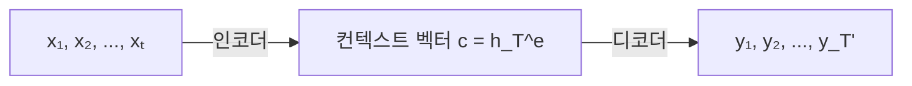
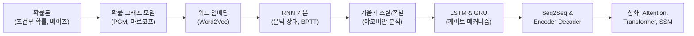

# RNN과 시퀀스 모델 - 수학적 개념 완전 정복

## 1. 주제 개요 및 중요성

**한 문장 정의**: RNN(순환 신경망)은 은닉 상태(hidden state)라는 "메모리"를 통해 과거 정보를 축적하며 가변 길이 시퀀스를 처리하는 신경망 구조이며, LSTM/GRU는 게이트 메커니즘으로 장기 의존성 학습의 한계를 극복한 핵심 발전이다.

**왜 배워야 하는가**:
- **실용적 가치**: 언어, 음성, 시계열, 음악 등 순서가 핵심인 데이터를 자연스럽게 모델링한다. 기계 번역, 감성 분석, 음성 인식, 시계열 예측 등에 활용된다.
- **이론적 중요성**: RNN의 기울기 소실/폭발 문제와 이를 해결한 LSTM/GRU의 수학적 원리(가산적 상태 업데이트)는 ResNet의 skip connection과 같은 원리이며, Transformer로의 발전을 이해하는 기반이 된다.

**어떤 문제를 해결하는가**: 고정 크기 입력만 다루는 MLP나 CNN으로는 **가변 길이** 시퀀스의 **시간적 의존성(temporal dependency)**을 자연스럽게 모델링할 수 없는 문제를 해결한다. "I ate an apple"과 "apple an ate I"는 같은 단어지만 전혀 다른 의미를 갖는다.

---

## 2. 입문자용 설명 (Level 1)

### 워드 임베딩 -- 단어의 좌표
컴퓨터는 글자를 모르기 때문에, 각 단어를 화살표(벡터)로 바꿔서 비슷한 단어는 가까이 놓는 특별한 지도를 만든다. 마치 "강아지"와 "개"가 지도에서 가까이 있고, "비행기"는 멀리 있는 것처럼. 이것이 "워드 임베딩"이다.

### RNN -- 기억력 있는 신경망
일기장을 쓸 때, 오늘 무슨 일이 있었는지 기억하면서 쓰는 것과 같다. RNN도 단어를 하나씩 읽으면서, 지금까지 읽은 내용을 "메모장"(은닉 상태)에 적어둔다. 새 단어를 읽을 때마다 메모장을 업데이트하고, 그 메모장을 보면서 다음에 어떤 단어가 올지 추측한다.

### 기울기 소실 -- 전화기 게임
전화기 게임에서 첫 번째 사람이 한 말을 여러 사람이 차례로 전달하면, 마지막 사람한테 가면 원래 말이 완전히 달라져 있다. RNN에서도 긴 문장을 처리할 때, 처음 부분의 정보가 전달되다가 점점 흐려져서 나중에는 거의 사라진다.

### LSTM -- 세 개의 문이 있는 똑똑한 기억 장치
LSTM에는 세 개의 문(게이트)이 있다:
- **잊기 문**(지우개): 필요 없는 기억을 지운다
- **입력 문**(연필): 새 정보를 기억에 추가한다
- **출력 문**(책갈피): 기억에서 필요한 것만 꺼내 쓴다

### GRU -- LSTM의 간단 버전
LSTM의 세 개 문을 두 개로 줄인 것이다. 더 간단하지만 성능은 비슷한 경우가 많다.

### Transformer -- 모든 페이지를 한 번에 보기
RNN은 책을 처음부터 끝까지 순서대로 읽지만, Transformer는 책의 모든 페이지를 한 번에 펼쳐놓고 필요한 부분끼리 연결한다. 그래서 멀리 떨어진 내용도 더 잘 연결할 수 있다.

---

## 3. 기술적 상세 설명 (Level 2)

### 3.1 텍스트 표현과 워드 임베딩

**원-핫 인코딩**: 사전 크기 $V$에서 각 단어를 $V$차원 벡터로 표현. $x \in \{0,1\}^V$, 자기 위치만 1.

문제: 어떤 두 단어든 유클리드 거리가 $\sqrt{2}$로 동일 -- 유사도 정보 없음.

**워드 임베딩**: 원-핫 벡터에 임베딩 행렬 $E \in \mathbb{R}^{K \times V}$를 곱한다.

$$e = Ex \in \mathbb{R}^K, \quad K \ll V$$

| 기호 | 의미 |
|------|------|
| $V$ | 어휘 크기 (예: 50,000) |
| $K$ | 임베딩 차원 (예: 300) |
| $E$ | 임베딩 행렬 -- 학습을 통해 의미적 관계를 인코딩 |

**수치 예시**: $V = 10000$, $K = 300$이면 10000차원 희소 벡터가 300차원 밀집 벡터로 변환. 원-핫에서 $E$를 곱하는 것은 $E$의 해당 열을 lookup하는 것과 동치.

**Word2Vec -- Skip-gram**:

$$\log p(w_{1:T}) = \sum_{t=1}^{T}\sum_{j \in J_t} \log \frac{\exp(v(w_j)^\top u(w_t))}{\sum_{w'}\exp(v(w')^\top u(w_t))}$$

| 기호 | 의미 |
|------|------|
| $u(w_t)$ | 중심 단어의 입력 임베딩 |
| $v(w_j)$ | 주변 단어의 출력 임베딩 |
| $J_t = [t-m, t+m] \setminus \{t\}$ | 문맥 윈도우 |

**분포 가설**: 비슷한 문맥에 등장하는 단어는 의미가 비슷하다.

유명한 예시: $\text{vec}(\text{King}) - \text{vec}(\text{Man}) + \text{vec}(\text{Woman}) \approx \text{vec}(\text{Queen})$

### 3.2 확률 그래프 모델과 시퀀스

PGM은 DAG를 사용하여 조건부 독립 가정을 인코딩한다:

$$p(Y_{1:V}) = \prod_{i=1}^{V} p(Y_i \mid Y_{pa(i)})$$

| 기호 | 의미 |
|------|------|
| $Y_{pa(i)}$ | 노드 $i$의 부모 노드 집합 |

**시퀀스에 대한 1차 마르코프 체인**: $y_1 \to y_2 \to \cdots \to y_T$

$$p(y_{1:T}) = \prod_{t=1}^{T} p(y_t \mid y_{t-1})$$

**수치 예시**: "I ate an ___"에서 1차 마르코프는 "an" 다음에 올 단어만 보므로, "ate an ___"와 "built an ___"의 빈칸 확률이 같아진다. 이는 지나치게 강한 가정이다.

**한계**: $k$차 마르코프 모델의 파라미터 수는 $|V|^{k+1}$로 지수 폭발. RNN은 은닉 상태를 통해 이론적으로 무한 기억을 가지면서도 파라미터는 고정이다.

### 3.3 RNN 기본 구조

$$h_{t+1} = \phi(W[x_t; y_t; h_t])$$
$$p(y_t \mid h_t) = \text{Cat}(y_t \mid \text{softmax}(W' h_t))$$

| 기호 | 의미 |
|------|------|
| $h_t \in \mathbb{R}^d$ | 시점 $t$의 은닉 상태 -- 과거 정보의 요약 |
| $x_t$ | 시점 $t$의 입력 (예: 워드 임베딩) |
| $y_t$ | 시점 $t$의 출력 (예: 다음 단어 예측) |
| $W$ | 공유 가중치 행렬 -- 모든 시간 단계에서 동일 |
| $\phi$ | 활성화 함수 (보통 tanh) |

**파라미터 공유의 핵심**: 모든 시간 단계에서 같은 $W, W'$를 사용하므로, 시퀀스 길이가 달라도 같은 모델을 적용할 수 있다.

**수치 예시**: 입력 차원 300 (워드 임베딩), 은닉 차원 512이면:
- $W \in \mathbb{R}^{512 \times (300 + V + 512)}$ -- 시퀀스 길이와 무관한 고정 크기
- 마르코프 모델은 $|V|^{k+1}$로 지수 증가

### 3.4 RNN의 구조적 변형

**Vec2Seq** (벡터 -> 시퀀스): 이미지 캡셔닝

$$p(y_{1:T} \mid x) = \prod_{t=1}^{T} \text{Cat}(y_t \mid \text{softmax}(W' h_t))$$

**Seq2Vec** (시퀀스 -> 벡터): 감성 분석

$$p(y \mid x_{1:T}) = \text{Cat}(y \mid \text{softmax}(W' h_T))$$

마지막 은닉 상태 $h_T$로 전체 시퀀스를 요약하여 분류.

**양방향 RNN (Bidirectional RNN)**:

$$\vec{h}_t = \phi(W^{\to}[x_t; \vec{h}_{t-1}]), \quad \overleftarrow{h}_t = \phi(W^{\leftarrow}[x_t; \overleftarrow{h}_{t+1}])$$
$$h_t = [\vec{h}_t; \overleftarrow{h}_t]$$

앞에서도 읽고 뒤에서도 읽어서 각 위치에서 양방향 문맥을 활용한다.

주의: 자기회귀 생성(다음 토큰 예측)에는 미래 정보를 볼 수 없으므로 양방향을 사용할 수 없다.

**Encoder-Decoder (Seq2Seq)**:

- 인코더: $h_t^e = \phi(W^e[x_t; h_{t-1}^e])$, 컨텍스트 $c = h_T^e$
- 디코더: $h_t^d = \phi(W^d[c; y_{t-1}; h_{t-1}^d])$

**핵심 한계**: 입력 시퀀스의 모든 정보를 고정 크기 벡터 $c \in \mathbb{R}^d$에 압축해야 하는 **정보 병목**. 이것이 어텐션 메커니즘의 동기가 된다.

### 3.5 시간 역전파 (BPTT)

RNN을 시간축으로 펼쳐서(unroll) 일반 역전파를 적용:

$$\frac{\partial L}{\partial W} = \sum_{t=1}^{T} \frac{\partial L_t}{\partial W}$$

시간축을 따른 기울기 전파:

$$\frac{\partial h_t}{\partial h_k} = \prod_{i=k+1}^{t} \frac{\partial h_i}{\partial h_{i-1}} = \prod_{i=k+1}^{t} W_{hh}^\top \text{diag}(\phi'(W_{hh} h_{i-1} + W_{hx} x_i))$$

| 기호 | 의미 |
|------|------|
| $\frac{\partial h_i}{\partial h_{i-1}}$ | 한 시간 단계에서의 야코비안 |
| $\prod$ | 야코비안의 반복 곱 -- 소실/폭발의 근원 |

**수치 예시**: $\phi' \leq 1$ (tanh), $\|W_{hh}\| = 0.9$이면 $t - k = 100$ 단계 후 기울기 크기: $0.9^{100} \approx 2.66 \times 10^{-5}$ -- 거의 0!

### 3.6 기울기 소실과 폭발

$$\left\|\frac{\partial h_t}{\partial h_k}\right\| \approx \sigma_{\max}(W_{hh})^{t-k}$$

| 조건 | 결과 |
|------|------|
| $\sigma_{\max}(W_{hh}) < 1$ | 기울기 **지수적 감소** (소실) |
| $\sigma_{\max}(W_{hh}) > 1$ | 기울기 **지수적 증가** (폭발) |

**기울기 폭발 대처**: Gradient Clipping -- $\|g\| > \theta$이면 $g \leftarrow \theta \cdot g / \|g\|$

**기울기 소실 대처**: 근본적 구조 변경이 필요 -- 은닉 상태의 **가산적(additive) 업데이트**. 이것이 LSTM/GRU의 핵심 아이디어이며, ResNet의 skip connection과 같은 원리이다.

### 3.7 LSTM (Long Short-Term Memory)

$$f_t = \sigma(W_f [h_{t-1}, x_t] + b_f) \quad \text{(Forget gate)}$$
$$i_t = \sigma(W_i [h_{t-1}, x_t] + b_i) \quad \text{(Input gate)}$$
$$\tilde{c}_t = \tanh(W_c [h_{t-1}, x_t] + b_c) \quad \text{(Candidate memory)}$$
$$c_t = f_t \odot c_{t-1} + i_t \odot \tilde{c}_t \quad \text{(Cell state update)}$$
$$o_t = \sigma(W_o [h_{t-1}, x_t] + b_o) \quad \text{(Output gate)}$$
$$h_t = o_t \odot \tanh(c_t) \quad \text{(Hidden state)}$$

| 기호 | 의미 |
|------|------|
| $f_t \in (0,1)^d$ | Forget gate -- 이전 셀 상태를 얼마나 유지할지 |
| $i_t \in (0,1)^d$ | Input gate -- 새 정보를 얼마나 추가할지 |
| $o_t \in (0,1)^d$ | Output gate -- 셀 상태에서 얼마나 출력할지 |
| $c_t$ | 셀 상태 -- 장기 기억의 고속도로 |
| $\odot$ | 원소별 곱 (Hadamard product) |
| $\sigma$ | 시그모이드 함수 (0~1 사이 게이트 값) |

**기울기 소실 완화의 핵심**:

$$\frac{\partial c_t}{\partial c_{t-1}} = \text{diag}(f_t)$$

$f_t \approx 1$이면 기울기가 거의 그대로 전파! 이는 ResNet의 $\frac{\partial y}{\partial x} = \frac{\partial F}{\partial x} + I$와 같은 원리이다.

**실용 팁**: Forget gate의 bias를 양수(예: 1)로 초기화하면, 초기에 $f_t \approx \sigma(1) \approx 0.73$이 되어 장기 기억 유지에 유리하다.

**수치 예시**: "The cat, which was sitting on the mat, ___"에서 주어 "cat"과 동사의 거리가 멀지만:
- Forget gate $f \approx 1$: "cat" 정보를 셀 상태에 유지
- Input gate $i \approx 0$: 중간 부관계사절의 정보를 덜 추가
- Output gate: 동사를 예측할 때 "cat" 정보를 출력

### 3.8 GRU (Gated Recurrent Unit)

$$r_t = \sigma(W_r [h_{t-1}, x_t]) \quad \text{(Reset gate)}$$
$$z_t = \sigma(W_z [h_{t-1}, x_t]) \quad \text{(Update gate)}$$
$$\tilde{h}_t = \tanh(W[r_t \odot h_{t-1}, x_t]) \quad \text{(Candidate)}$$
$$h_t = (1 - z_t) \odot h_{t-1} + z_t \odot \tilde{h}_t \quad \text{(Update)}$$

| 기호 | 의미 |
|------|------|
| $r_t$ | Reset gate -- 이전 은닉 상태를 얼마나 무시할지 |
| $z_t$ | Update gate -- 이전 상태와 새 상태의 혼합 비율 |

**LSTM과의 비교**:

| | LSTM | GRU |
|---|---|---|
| 게이트 수 | 3 (forget, input, output) | 2 (reset, update) |
| 상태 | 셀 상태 $c_t$ + 은닉 상태 $h_t$ | 은닉 상태 $h_t$만 |
| 파라미터 | 더 많음 | 더 적음 |

**핵심 연결**: GRU의 update gate는 LSTM의 forget gate와 input gate를 하나로 합친 것이다.
- $(1-z_t)$: forget 역할
- $z_t$: input 역할
- LSTM의 coupled variant: $i_t = 1 - f_t$와 동일한 아이디어

### 3.9 RNN vs Transformer

**RNN**: $h_t = \phi(W[x_t; h_{t-1}])$
- 강한 순차적 편향 -- 최근 정보 선호
- $O(T)$ 시간 복잡도 (순차 처리)
- 은닉 상태 $h_t$가 모든 과거 정보를 고정 크기로 압축

**Transformer**: $\text{Attention}(Q, K, V) = \text{softmax}\left(\frac{QK^\top}{\sqrt{d_k}}\right) V$

| 기호 | 의미 |
|------|------|
| $Q, K, V$ | Query, Key, Value 행렬 |
| $\sqrt{d_k}$ | 스케일링 인자 -- 내적 값이 너무 커지는 것을 방지 |

- 약한 순차적 편향 (위치 인코딩으로 순서 부여)
- $O(T^2)$ 시간 복잡도 (모든 쌍 비교)
- 임의 거리의 토큰을 직접 참조 가능

**발전 계보**: Markov models -> RNNs -> Attention/Transformer

---

## 4. 전문가 수준 핵심 요약 (Level 3)

RNN의 본질은 **파라미터 공유** + **은닉 상태를 통한 시간 재귀**이다. PGM 관점에서 은닉 상태는 결정론적 상태공간 모델의 충분통계량으로, 이전 모든 관측에 대한 정보를 압축한다. 기울기 소실 문제는 야코비안 $\frac{\partial h_t}{\partial h_{t-1}}$의 반복 곱에서 스펙트럼 반경이 1과 다를 때 발생하며, LSTM/GRU의 **가산적 셀/은닉 상태 업데이트**가 기울기 경로에 항등 매핑을 삽입하여 이를 완화한다. 이는 ResNet의 skip connection과 수학적으로 동일한 원리이다. Encoder-Decoder의 정보 병목($c = h_T^e$)은 어텐션 메커니즘으로 해결되며, 궁극적으로 Transformer가 self-attention으로 RNN의 순차적 병목과 장기 의존성 문제를 근본적으로 우회한다. 최근 Mamba(S4 계열) 등의 상태공간 모델은 RNN의 선형 시간 복잡도와 Transformer의 표현력을 결합하려는 시도이다.

---

## 5. 메타인지 체크포인트

스스로에게 물어보세요:

- [ ] RNN을 10살 아이에게 설명할 수 있는가? ("메모장을 업데이트하면서 단어를 읽는 것")
- [ ] 왜 1차 마르코프 체인 대신 RNN을 사용하는지 설명할 수 있는가?
- [ ] LSTM 없이는 무엇을 할 수 없는가? (긴 문장에서 처음 부분의 정보를 마지막에서 활용)
- [ ] LSTM의 가산적 업데이트와 ResNet의 skip connection이 어떻게 같은지 설명할 수 있는가?
- [ ] 기계 번역 시스템에서 인코더-디코더를 어떻게 적용할지 설명할 수 있는가?

---

## 6. 흔한 오개념 및 주의사항

**"RNN은 가변 길이 입력을 처리하므로 특별한 구조가 필요하다"**
RNN의 핵심은 가변 길이가 아니라 **파라미터 공유와 은닉 상태를 통한 시간적 정보 축적**이다. 가변 길이 처리는 이 구조의 부산물이다.

**"LSTM의 셀 상태는 장기 기억, 은닉 상태는 단기 기억이다"**
이 비유는 부분적으로만 맞다. 셀 상태 $c_t$는 **기울기 고속도로** 역할이며, 은닉 상태 $h_t = o_t \odot \tanh(c_t)$는 셀 상태의 **필터링된 출력**이다. 두 상태 모두 매 시점 업데이트된다.

**"기울기 소실 = 기울기가 0이 된다"**
정확히 0이 되는 것이 아니라 **지수적으로 작아져서** 학습 신호가 실질적으로 무의미해지는 것이다.

**"양방향 RNN은 항상 단방향보다 좋다"**
양방향 RNN은 **전체 시퀀스가 주어진 경우에만** 사용 가능하다. 언어 모델이나 실시간 스트리밍에서는 미래 정보를 볼 수 없으므로 단방향만 가능하다.

**"GRU는 LSTM의 열등한 버전이다"**
GRU는 파라미터가 적어 학습이 빠르고, 데이터가 적을 때 과적합 위험이 낮다. 많은 벤치마크에서 LSTM과 유사한 성능을 보인다.

**"BPTT는 일반 역전파와 다른 알고리즘이다"**
BPTT는 RNN을 시간축으로 펼친 후 일반 역전파를 적용하는 것이다. 별도의 알고리즘이 아니다.

---

## 7. 학습 로드맵

**선행 지식**: 확률/통계(조건부 확률), 선형대수(행렬 곱, 특이값), 역전파(연쇄 법칙)

**심화 학습 경로**: Attention mechanism, Transformer (Self-Attention, Multi-Head), BERT/GPT, 상태공간 모델(Mamba/S4)

---

## 8. 실전 활용 사례

### 사례 1: 감성 분석 (Seq2Vec)
- **상황**: 영화 리뷰 텍스트에서 긍정/부정 판별
- **적용**: 워드 임베딩(300차원) -> 양방향 LSTM(256 유닛) -> 마지막 은닉 상태 연결 -> FC -> sigmoid
- **결과**: 89%+ 정확도, 양방향이 단방향보다 ~2% 향상

### 사례 2: 기계 번역 (Seq2Seq)
- **상황**: 영어 문장을 한국어로 번역
- **적용**: 양방향 LSTM 인코더 + LSTM 디코더 + Attention mechanism
- **결과**: BLEU 점수 30+, Attention 없이는 긴 문장에서 성능 급락

### 사례 3: 시계열 예측
- **상황**: 주식 가격의 다음 5일 예측
- **적용**: GRU(128 유닛, 2층) + dropout(0.2) + teacher forcing
- **결과**: LSTM과 유사한 성능, 20% 적은 학습 시간

---

## 9. 추가 학습 자료

**입문자용**:
- Andrej Karpathy "The Unreasonable Effectiveness of RNNs" 블로그
- Christopher Olah "Understanding LSTM Networks" 블로그

**중급자용**:
- Hochreiter & Schmidhuber (1997) "Long Short-Term Memory" 원논문
- Cho et al. (2014) "GRU" 원논문
- Sutskever et al. (2014) "Sequence to Sequence Learning" 원논문

**전문가용**:
- Bengio et al. (1994) "Learning Long-Term Dependencies with Gradient Descent is Difficult"
- Vaswani et al. (2017) "Attention Is All You Need" (Transformer 원논문)
- Gu et al. (2022) "Efficiently Modeling Long Sequences with Structured State Spaces" (S4)

---

> **핵심을 날카롭게 정리하면:**
>
> RNN의 본질은 **파라미터 공유 + 은닉 상태를 통한 시간 재귀**이며, 기울기 소실 문제는 야코비안 반복 곱의 스펙트럼 분석으로 설명된다. LSTM/GRU는 **가산적 상태 업데이트**(ResNet의 skip connection과 동일 원리)로 기울기 소실을 완화하고, Transformer는 self-attention으로 RNN의 순차적 병목을 근본적으로 해결했다.
>
> 이것이 중요한 이유는 언어, 음성, 시계열 등 순서가 핵심인 데이터가 현실에서 가장 흔하며, GPT/BERT 등 현대 대규모 언어 모델의 이론적 기반이기 때문이다.
>
> 진정한 마스터와 피상적 이해의 차이는 "LSTM의 셀 상태 업데이트가 왜 기울기 소실을 완화하는지 야코비안으로 보여줄 수 있는가", "인코더-디코더의 정보 병목이 왜 문제인지", "Transformer가 이 모든 것을 어떻게 우회하는지"를 명확히 설명할 수 있느냐에 달려 있다.
