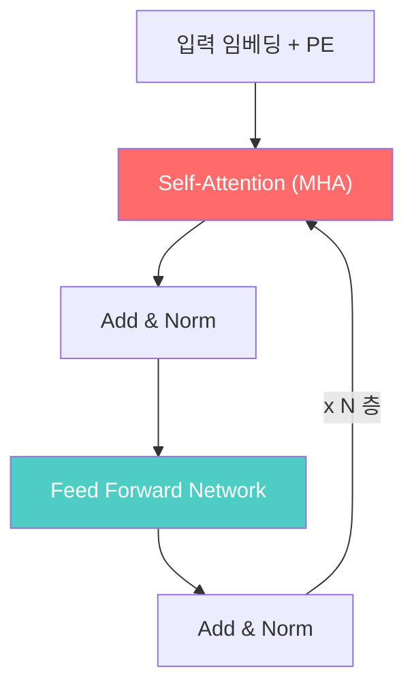
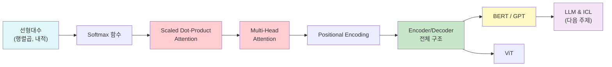

# 트랜스포머와 어텐션 - 수학적 개념 완전 정복

---

## 1. 주제 개요 및 중요성

**한 문장 정의**: 트랜스포머(Transformer)는 순환 구조 없이 어텐션(Attention) 메커니즘만으로 시퀀스 데이터를 처리하는 신경망 아키텍처이다.

**왜 배워야 하는가**:
- **실용적 가치**: GPT, BERT, ViT, Stable Diffusion 등 현대 AI의 거의 모든 기반 모델이 트랜스포머 위에 구축되어 있다. 트랜스포머를 이해하지 않으면 현대 딥러닝 연구와 응용을 따라갈 수 없다.
- **이론적 중요성**: 어텐션은 커널 회귀(kernel regression)의 파라메트릭 일반화로, 고정 가중치가 아닌 **입력 의존적 동적 가중치**라는 새로운 연산 패러다임을 제시했다.

**어떤 문제를 해결하는가**:
- RNN의 순차 처리로 인한 병렬화 불가 문제
- 긴 시퀀스에서의 정보 소실(vanishing gradient) 문제
- 장거리 의존성(long-range dependency) 포착의 어려움

---

## 2. 입문자용 설명 (Level 1)

### 어텐션이란?

도서관에서 책을 찾는 상황을 떠올려 보자. "공룡에 대한 책"을 찾고 싶을 때, 모든 책 제목을 하나씩 살펴본다. "공룡의 세계"는 아주 관련 있고, "우주 탐험"은 관련이 적다. 이때 관련성이 높은 책의 내용에 더 주목하고, 관련 없는 책은 무시하면서 정보를 모은다.

어텐션도 같은 원리이다:
- **질문(Query)**: "공룡에 대해 알려줘"
- **책 제목(Key)**: 각 정보의 "이름표"
- **책 내용(Value)**: 실제 담긴 정보

핵심은 **한 권만 고르는 것이 아니라**, 관련성 비율에 따라 여러 책의 내용을 섞어서 답을 만든다는 점이다.

### Multi-Head Attention이란?

숙제를 할 때 수학 잘하는 친구, 국어 잘하는 친구, 과학 잘하는 친구에게 **동시에** 물어보는 것과 같다. 각 "전문가(head)"가 서로 다른 관점에서 분석하고, 모든 분석을 합쳐서 최종 답을 만든다.

### 왜 위치 인코딩(Positional Encoding)이 필요한가?

"나는 너를 좋아해"와 "너를 나는 좋아해"는 같은 단어로 이루어져 있지만 뉘앙스가 다르다. 어텐션은 모든 단어를 동시에 보기 때문에 **순서를 모른다**. 마치 카드 묶음을 한꺼번에 펼쳐놓는 것과 같다. 그래서 각 단어에 "1번째", "2번째" 같은 번호표를 붙여주어야 한다.

### Encoder와 Decoder의 차이

- **Encoder**: 책을 읽고 내용을 이해하는 사람. 문장 전체를 보면서 각 단어의 의미를 풍부하게 만든다.
- **Decoder**: 이해한 내용을 바탕으로 새로운 글을 쓰는 사람. 이미 쓴 부분만 보면서 다음 글자를 정한다.

---

## 3. 기술적 상세 설명 (Level 2)

### 3.1 Scaled Dot-Product Attention

어텐션의 핵심 연산은 다음 수식으로 표현된다:

$$\text{Attention}(Q, K, V) = \text{softmax}\left(\frac{QK^\top}{\sqrt{d_k}}\right) V$$

**각 기호의 의미:**
| 기호 | 의미 | 차원 |
|------|------|------|
| $Q$ | Query 행렬 (질문들의 모음) | $N \times d_k$ |
| $K$ | Key 행렬 (검색 대상의 이름표들) | $N \times d_k$ |
| $V$ | Value 행렬 (실제 정보들) | $N \times d_v$ |
| $d_k$ | Key/Query 벡터의 차원 | 스칼라 |
| $N$ | 시퀀스 길이 (토큰 수) | 스칼라 |

**수식을 단계별로 분해하면:**

**1단계: 유사도 계산** $QK^\top$

행렬곱 $QK^\top$의 $(i, j)$ 원소는 $q_i^\top k_j$, 즉 $i$번째 질문과 $j$번째 키의 **내적(dot product)**이다. 내적이 크면 두 벡터가 비슷한 방향을 가리키고 있다는 뜻이다.

**구체적 수치 예시:**

$q_1 = [1, 0, 1]$, $k_1 = [1, 1, 0]$, $k_2 = [0, 0, 1]$일 때:
- $q_1^\top k_1 = 1 \times 1 + 0 \times 1 + 1 \times 0 = 1$
- $q_1^\top k_2 = 1 \times 0 + 0 \times 0 + 1 \times 1 = 1$

두 키와 유사도가 같다.

**2단계: 스케일링** $QK^\top / \sqrt{d_k}$

**왜 $\sqrt{d_k}$로 나누는가?** $q$와 $k$의 각 원소가 평균 0, 분산 1인 독립 확률변수라면:

$$\text{Var}(q^\top k) = \text{Var}\left(\sum_{l=1}^{d_k} q_l k_l\right) = d_k$$

차원 $d_k$가 커질수록 내적값의 분산이 커져서, softmax가 극단적으로 한쪽에 집중(거의 one-hot)하게 된다. 이렇게 되면 gradient가 거의 0이 되어 학습이 멈춘다. $\sqrt{d_k}$로 나누면 분산이 1로 정규화되어 softmax의 gradient가 적절히 유지된다.

**수치 예시:** $d_k = 64$일 때, 스케일링 없이 내적값이 $\pm 8$ 정도(표준편차 $\sqrt{64} = 8$)가 되면 softmax(8) $\approx$ 0.9997로 거의 one-hot이 된다. $\sqrt{64} = 8$로 나누면 $\pm 1$ 범위가 되어 적절한 분포를 유지한다.

**3단계: 확률 분포 변환** $\text{softmax}(\cdot)$

$$\text{softmax}(z)_i = \frac{e^{z_i}}{\sum_j e^{z_j}}$$

각 행(row)에 대해 적용하여, 유사도 점수를 **합이 1인 확률 분포**로 변환한다. 이를 **어텐션 가중치(attention weight)** $\alpha_{ij}$라 한다.

**4단계: 가중 합산** $AV$

$$\text{output}_i = \sum_j \alpha_{ij} v_j$$

각 Value 벡터를 어텐션 가중치로 가중 합산한다. 이것은 Value들의 **볼록 결합(convex combination)**이다 ($\alpha_{ij} \geq 0$, $\sum_j \alpha_{ij} = 1$).

### 3.2 Multi-Head Attention (MHA)

단일 어텐션은 한 가지 유사도 패턴만 포착한다. 여러 개의 어텐션을 병렬로 실행하면 다양한 관계 패턴을 동시에 학습할 수 있다.

$$\text{head}_i = \text{Attention}(XW_i^Q, XW_i^K, XW_i^V)$$

$$\text{MHA}(X) = \text{Concat}(\text{head}_1, \ldots, \text{head}_h) W^O$$

**각 기호:**
| 기호 | 의미 | 차원 |
|------|------|------|
| $X$ | 입력 행렬 | $N \times d$ |
| $W_i^Q, W_i^K$ | $i$번째 head의 Query/Key 가중치 | $d \times d_k$ |
| $W_i^V$ | $i$번째 head의 Value 가중치 | $d \times d_v$ |
| $W^O$ | 출력 프로젝션 가중치 | $(h \cdot d_v) \times d$ |
| $h$ | head의 수 | 원 논문: 8 |
| $d_k = d_v = d/h$ | 각 head의 차원 | 원 논문: 64 |

**왜 이런 구조인가?** 각 head $i$는 서로 다른 $\Sigma_i = W_i^Q W_i^{K\top}$을 학습한다. 이 $\Sigma_i$가 곧 각 head의 "관점"이다. 예를 들어 한 head는 "주어-동사" 관계를, 다른 head는 "형용사-명사" 관계를 학습할 수 있다.

### 3.3 Positional Encoding

어텐션 연산은 **순열 등변(permutation equivariant)**이다. 즉 입력 행의 순서를 바꿔도 출력의 값 자체는 변하지 않는다: $f(\Pi X) = \Pi f(X)$.

이를 보완하기 위해 위치 정보를 입력에 더한다:

$$\text{PE}(pos, 2i) = \sin\left(\frac{pos}{10000^{2i/d}}\right), \quad \text{PE}(pos, 2i+1) = \cos\left(\frac{pos}{10000^{2i/d}}\right)$$

**각 기호:**
| 기호 | 의미 |
|------|------|
| $pos$ | 토큰의 위치 (0, 1, 2, ...) |
| $i$ | 임베딩 벡터의 차원 인덱스 |
| $d$ | 임베딩 차원 (원 논문: 512) |

**수치 예시:** $d = 4$일 때, 위치 0과 위치 1의 인코딩:
- $\text{PE}(0) = [\sin(0), \cos(0), \sin(0), \cos(0)] = [0, 1, 0, 1]$
- $\text{PE}(1) = [\sin(1), \cos(1), \sin(0.01), \cos(0.01)] \approx [0.84, 0.54, 0.01, 1.0]$

저주파(큰 $i$) 차원은 전체 위치 구조를, 고주파(작은 $i$) 차원은 세밀한 위치 차이를 인코딩한다.

### 3.4 Transformer Encoder 구조

하나의 Encoder Layer:
1. $x' = \text{LayerNorm}(x + \text{MHA}(x, x, x))$
2. $x'' = \text{LayerNorm}(x' + \text{FFN}(x'))$

FFN은 $d_{\text{model}}(512) \to d_{\text{ff}}(2048) \to d_{\text{model}}(512)$의 2층 MLP이다.

**Add & Norm이 필요한 이유:**
- **Add (잔차 연결)**: gradient가 깊은 층까지 원활히 전파되도록 한다.
- **Norm (Layer Normalization)**: 각 토큰의 활성값을 정규화하여 학습을 안정화한다. NLP에서는 BatchNorm보다 LayerNorm이 효과적이다.

### 3.5 Transformer Decoder & Cross Attention

Decoder는 Encoder에 비해 세 가지 핵심 차이가 있다:

**1. Masked Self-Attention**: 미래 토큰을 볼 수 없도록 상삼각 부분을 $-\infty$로 마스킹한다.

$$[QK^\top]_{ij} = \begin{cases} q_i^\top k_j & \text{if } j \le i \\ -\infty & \text{if } j > i \end{cases}$$

softmax 이후: $A_{ij} = 0$ (if $j > i$). 따라서 위치 $i$의 출력은 위치 $j \leq i$의 정보에만 의존한다. 이것이 **자기회귀(autoregressive)** 생성의 핵심이다.

**2. Cross Attention**: Decoder가 Encoder의 출력(memory $M$)을 참조한다.

$$\text{CrossAttn} = \text{MHA}(Y, M, M)$$

- $Q = Y$ (Decoder의 현재 상태)
- $K = V = M$ (Encoder의 출력)

번역 예시: "I am a student" $\to$ "Je suis etudiant"에서, Decoder가 "Je"를 생성할 때 Cross Attention을 통해 Encoder의 "I"에 주목한다.

**3. Teacher Forcing**: 학습 시 이전 출력으로 모델 예측이 아닌 **정답(ground truth)**을 사용한다.

$$p(y_{1:m}) = \prod_{t=1}^{m} p(y_t \mid y_{1:t-1})$$

### 3.6 Self-Attention vs Cross-Attention 비교

| 구분 | Self-Attention | Cross-Attention |
|------|---------------|-----------------|
| 호출 형태 | MHA($X$, $X$, $X$) | MHA($Y$, $M$, $M$) |
| 의미 | 시퀀스 내부 관계 학습 | 두 시퀀스 간 관계 학습 |
| Attention 행렬 크기 | $N \times N$ | $M_{\text{dec}} \times N_{\text{enc}}$ |
| 사용 위치 | Encoder, Decoder 1층 | Decoder 2층 |

### 3.7 Vision Transformer (ViT)

이미지를 $P \times P$ 패치로 분할하고, 각 패치를 "토큰"으로 간주하여 Transformer Encoder에 입력한다.

1. 이미지 $\to$ $P \times P$ 패치 분할
2. 각 패치를 flatten + 선형 투영
3. [CLS] 토큰 + Positional Embedding 추가
4. Transformer Encoder $\times N$ 통과
5. [CLS] 토큰 출력으로 분류 (MLP Head)

**핵심 관찰**: 작은 데이터셋에서는 CNN(ResNet)이 ViT보다 우수하지만, **대규모 데이터(JFT-300M)에서는 ViT가 CNN을 압도**한다. 이것은 **약한 inductive bias + 많은 데이터 > 강한 inductive bias + 적은 데이터**라는 bias-variance tradeoff의 실제 사례이다.

### 3.8 BERT와 GPT

| 구분 | BERT | GPT |
|------|------|-----|
| 방향 | 양방향(bidirectional) | 단방향(causal) |
| 구조 | Encoder만 | Decoder만 (masked attention) |
| 학습 목표 | Masked LM (빈칸 채우기) | Causal LM (다음 단어 예측) |
| 수식 | $-\mathbb{E}_m \sum_{i \in m} \log p(x_i \mid x_{-m})$ | $\prod_{t=1}^{T} p(x_t \mid x_{1:t-1})$ |

---

## 4. 전문가 수준 핵심 요약 (Level 3)

Attention은 본질적으로 **kernel smoother의 parametric 일반화**이다. Key-Value 쌍 $\{(k_j, v_j)\}$에 대해, query $q_i$의 출력은 $\sum_j \alpha_{ij} v_j$로 Value의 convex combination이며, $\alpha_{ij}$가 softmax를 통해 input-dependent하게 결정된다. 이것이 고정 가중치 linear layer와의 근본적 차이점이다.

Multi-Head Attention에서 각 head의 $\Sigma_i = W_i^Q W_i^{K\top} \in \mathbb{R}^{d \times d}$는 서로 다른 유사도 개념(notion of similarity)을 학습한다. MHA를 단순 선형 프로젝션 $XW$로 대체하면 attention 행렬이 사라지고 **입력 의존적 동적 가중치 결정**이 소실되며, 이것이 attention의 핵심 가치이다.

시간 복잡도 $O(N^2 d)$는 Transformer의 주요 병목이며, Performer 등은 $\tilde{A}_{ij} = \phi(q_i)^\top \phi(k_j)$로 low-rank 근사하여 $O(NMd)$로 줄인다. Positional encoding은 self-attention의 permutation equivariance라는 너무 약한 inductive bias를 보완하며, RoPE 등 현대적 방법은 상대 위치를 내적에 직접 인코딩한다.

---

## 5. 메타인지 체크포인트

스스로에게 물어보세요:

- [ ] Attention을 "도서관에서 책 찾기"에 비유하여 10살 아이에게 설명할 수 있는가?
- [ ] 왜 Additive Attention이 아니라 Scaled Dot-Product Attention을 사용하는지 설명할 수 있는가? (계산 효율성: 행렬곱으로 병렬 처리 가능)
- [ ] Scaling factor $\sqrt{d_k}$ 없이는 무엇이 발생하는가? (softmax saturation으로 gradient vanishing)
- [ ] Self-Attention과 Cross-Attention의 차이를 Q, K, V의 출처로 구분할 수 있는가?
- [ ] Masked Attention이 autoregressive 생성에서 왜 필수적인지, 마스킹 없으면 어떤 문제가 발생하는지 설명할 수 있는가?

---

## 6. 흔한 오개념 및 주의사항

**1. "Q, K, V는 항상 서로 다른 입력에서 온다"**
- Self-Attention에서는 Q, K, V 모두 **같은 입력 $X$**에서 생성된다: $Q = XW^Q$, $K = XW^K$, $V = XW^V$. 다른 입력에서 오는 것은 Cross-Attention 한정이다.

**2. "Multi-Head는 같은 Attention을 여러 번 반복하는 것이다"**
- 각 head는 **서로 다른 가중치 행렬**을 학습하므로, 서로 다른 관계 패턴을 포착한다.

**3. "Positional Encoding은 반드시 학습되는 파라미터이다"**
- 원 Transformer는 sinusoidal(고정, 비학습)을, BERT는 learnable embedding을 사용한다. Sinusoidal은 학습 시 보지 못한 더 긴 시퀀스로의 외삽이 가능하다는 장점이 있다.

**4. "Transformer는 RNN을 모든 상황에서 대체한다"**
- Transformer의 $O(N^2)$ 복잡도 때문에 매우 긴 시퀀스에서는 비효율적이다. Mamba 등 SSM 계열은 $O(N)$ 복잡도로 경쟁력을 유지하고 있다.

**5. "$\sqrt{d_k}$로 나누는 것은 그냥 정규화를 위한 것이다"**
- 단순 크기 조절이 아니라, 내적의 **분산이 $d_k$에 비례**하여 커지는 수학적 문제를 해결하는 것이다. $d_k$가 크면 softmax 입력이 극단값으로 가서 gradient가 소실된다.

**6. "Decoder의 Masked Attention은 학습 시에만 사용된다"**
- 추론 시에도 autoregressive 생성을 위해 사용된다. 다만 추론 시에는 KV-cache를 활용하여 이미 계산한 Key, Value를 재사용한다.

**7. "ViT는 항상 CNN보다 우수하다"**
- 작은 데이터셋에서는 CNN이 ViT보다 우수하다. ViT의 약한 inductive bias가 효과를 발휘하려면 대규모 사전학습 데이터가 필요하다.

---

## 7. 학습 로드맵

**선행 지식:**
- 선형대수: 행렬곱, 내적, 전치(transpose)
- 확률: softmax, 확률 분포
- 기초 딥러닝: MLP, 역전파, Layer Normalization

**심화 학습 경로:**
- Efficient Attention: Performer, Flash Attention
- 위치 인코딩 고급: RoPE, ALiBi
- 아키텍처 변형: Mixture of Experts, State Space Models

---

## 8. 실전 활용 사례

### 사례 1: 기계 번역
- **상황**: "I love deep learning" $\to$ "나는 딥러닝을 좋아한다"
- **적용**: Encoder가 영어 문장을 인코딩 $\to$ Decoder가 Cross Attention으로 영어 정보를 참조하며 한국어를 한 토큰씩 생성
- **결과**: Encoder의 "deep learning" 토큰에 높은 attention weight가 형성되어 "딥러닝"으로 정확히 번역

### 사례 2: 이미지 분류 (ViT)
- **상황**: 의료 영상에서 질병 분류
- **적용**: 이미지를 16x16 패치로 분할 $\to$ Transformer Encoder로 패치 간 관계 학습 $\to$ [CLS] 토큰으로 분류
- **결과**: 대규모 사전학습 후 미세조정하면 CNN 기반 모델과 동등 이상의 성능

### 사례 3: 텍스트 분류 (BERT)
- **상황**: 리뷰 감성 분석
- **적용**: [CLS] 토큰에 분류 head를 붙여 fine-tuning
- **결과**: 양방향 컨텍스트를 활용하여 높은 정확도 달성

---

## 9. 추가 학습 자료

**입문자용:**
- "Attention Is All You Need" 논문의 Figure 1, 2를 중심으로 구조 이해
- Jay Alammar의 "The Illustrated Transformer" 블로그 포스트
- 3Blue1Brown의 Transformer 시각화 영상

**중급자용:**
- 원 논문 "Attention Is All You Need" (Vaswani et al., 2017) 전문 읽기
- "An Image is Worth 16x16 Words: Transformers for Image Recognition at Scale" (ViT 논문)
- PyTorch의 `nn.TransformerEncoder`, `nn.MultiheadAttention` 코드 분석

**전문가용:**
- "Efficient Transformers: A Survey" (Tay et al., 2020)
- "RoFormer: Enhanced Transformer with Rotary Position Embedding" (Su et al., 2021)
- "FlashAttention: Fast and Memory-Efficient Exact Attention" (Dao et al., 2022)

---

**핵심을 날카롭게 정리하면:**

Attention은 입력에 따라 **동적으로** 어떤 정보에 주목할지 결정하는 메커니즘이며, 이것이 고정 가중치 선형 변환과의 본질적 차이이다. $\text{softmax}(QK^\top / \sqrt{d_k})V$라는 하나의 수식이 현대 AI의 거의 모든 기반 모델을 지탱하고 있다.

트랜스포머를 진정으로 마스터한 사람은 "왜 MHA를 단순 $XW$로 대체하면 안 되는가?"에 대해 $\Sigma_i = W_i^Q W_i^{K\top}$이 입력 의존적 동적 가중치를 만든다는 점을 명확히 설명할 수 있다. 피상적 이해에 머문 사람은 "여러 head를 쓰면 성능이 좋아진다" 정도로만 알고 있다.
