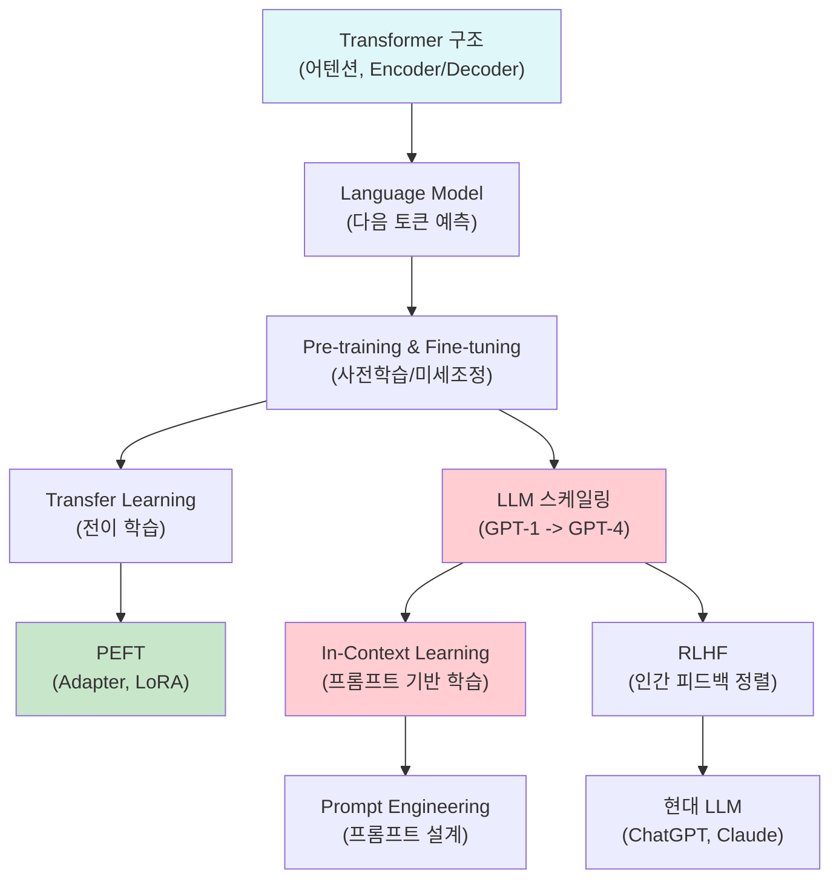

# LLM과 In-Context Learning - 수학적 개념 완전 정복

---

## 1. 주제 개요 및 중요성

**한 문장 정의**: LLM(Large Language Model)은 대규모 텍스트로 사전학습된 거대 언어 모델이며, In-Context Learning(ICL)은 가중치 업데이트 없이 프롬프트 내의 예시만으로 새로운 태스크를 수행하는 능력이다.

**왜 배워야 하는가**:
- **실용적 가치**: ChatGPT, Claude, Gemini 등 현재 가장 영향력 있는 AI 시스템이 모두 LLM 기반이다. 프롬프트 엔지니어링, RAG, RLHF 등 핵심 기술을 이해하려면 LLM의 수학적 원리를 알아야 한다.
- **이론적 중요성**: ICL은 "gradient 없이도 학습이 가능하다"는 기존 패러다임을 깨뜨린 현상이며, Transformer 내부에서 암묵적 최적화가 일어나는지에 대한 이론적 논쟁이 활발하다.

**어떤 문제를 해결하는가**:
- 태스크마다 대규모 라벨 데이터를 수집하고 모델을 처음부터 학습해야 하는 비효율
- 새로운 태스크에 빠르게 적응하는 범용 AI 시스템의 부재
- 모델 학습의 막대한 계산 비용

---

## 2. 입문자용 설명 (Level 1)

### LLM이란?

인터넷에 있는 거의 모든 글을 읽은 아주 똑똑한 친구가 있다고 상상해 보자. 이 친구에게 아무 질문이나 하면, 읽었던 내용을 바탕으로 대답해 준다. LLM은 "다음에 올 단어가 뭘까?" 게임을 수십억 번 반복한 AI이다. 이 과정에서 문법, 상식, 추론 능력을 저절로 터득한다.

### 전이 학습(Transfer Learning)이란?

피아노를 잘 치는 사람이 기타를 배울 때 처음부터 시작하지 않아도 되는 것과 같다. 음악의 기본 원리(박자, 화음)를 이미 알고 있기 때문이다. AI도 마찬가지로, 한 분야에서 배운 "기본 실력"을 새로운 분야에 활용한다.

### In-Context Learning이란?

수학 시험에서 선생님이 "예시 문제: 2+3=5, 4+1=5"를 보여주면 "3+2=?"도 답할 수 있다. AI에게도 "이 리뷰는 좋은 거야, 이 리뷰는 나쁜 거야" 식으로 예시를 보여주면, **별도의 추가 학습 없이** 새로운 리뷰도 판단할 수 있다.

핵심: **가중치가 전혀 바뀌지 않는다.** 프롬프트에 예시를 넣어주는 것만으로 작동한다.

### Few-shot과 Zero-shot의 차이

- **Zero-shot**: 예시 없이 바로 질문. "이 문장은 긍정이야 부정이야?"
- **One-shot**: 예시 하나만 보여주고 질문
- **Few-shot**: 예시 2~5개를 보여주고 질문

마치 요리사에게 레시피 없이 요리를 시키는 것(zero-shot)과, 비슷한 요리의 레시피를 보여주고 시키는 것(few-shot)의 차이이다.

---

## 3. 기술적 상세 설명 (Level 2)

### 3.1 스케일링 법칙 (Scaling Laws)

LLM의 성능은 모델 크기, 데이터 양, 계산량에 대해 **거듭제곱 법칙(power law)**을 따른다:

$$L(N) \propto N^{-\alpha_N}, \quad L(D) \propto D^{-\alpha_D}, \quad L(C) \propto C^{-\alpha_C}$$

**각 기호의 의미:**
| 기호 | 의미 |
|------|------|
| $L$ | 손실(loss), 낮을수록 성능이 좋음 |
| $N$ | 모델의 파라미터 수 |
| $D$ | 학습 데이터의 크기 (토큰 수) |
| $C$ | 계산량 (FLOPs) |
| $\alpha_N, \alpha_D, \alpha_C$ | 스케일링 지수 (경험적으로 결정) |

**왜 거듭제곱 법칙인가?** 로그-로그 그래프에서 성능이 직선적으로 향상된다는 것은, 모델을 10배 키울 때마다 일정한 비율만큼 성능이 개선됨을 의미한다. 이것이 GPT-3(175B)에서 GPT-4로의 스케일업을 정당화하는 수학적 근거이다.

**수치 예시:** $\alpha_N = 0.076$이라면, 파라미터를 10배 늘릴 때 loss가 $10^{-0.076} \approx 0.84$배, 즉 약 16% 감소한다.

### 3.2 사전학습 목적함수

**Causal LM (GPT 계열):**

$$\mathcal{L}_{\text{CLM}} = -\sum_{t=1}^{T} \log p(x_t \mid x_{1:t-1}; \theta)$$

**각 기호:**
| 기호 | 의미 |
|------|------|
| $x_t$ | 시퀀스의 $t$번째 토큰 |
| $x_{1:t-1}$ | $t$번째 이전의 모든 토큰 |
| $\theta$ | 모델 파라미터 |
| $T$ | 시퀀스 전체 길이 |

**직관**: 이전 토큰들이 주어졌을 때 다음 토큰의 조건부 확률을 최대화한다. "나는 밥을"까지 읽었을 때 "먹었다"가 올 확률을 높이도록 학습한다.

**Masked LM (BERT 계열):**

$$\mathcal{L}_{\text{MLM}} = -\sum_{i \in \mathcal{M}} \log p(x_i \mid x_{\backslash \mathcal{M}}; \theta)$$

| 기호 | 의미 |
|------|------|
| $\mathcal{M}$ | 마스킹된 토큰의 인덱스 집합 |
| $x_{\backslash \mathcal{M}}$ | 마스킹되지 않은 모든 토큰 |

**직관**: 문장 중 일부 토큰을 [MASK]로 가리고, 나머지 문맥(양방향)을 보고 가려진 토큰을 맞춘다. "나는 [MASK]을 먹었다"에서 [MASK] = "밥"을 예측한다.

### 3.3 Cross-Entropy Loss와 KL Divergence의 관계

사전학습의 이론적 기반:

$$\text{KL}(p_{\text{data}} \| p_\theta) = \text{CE}(p_{\text{data}}, p_\theta) - \text{Ent}(p_{\text{data}})$$

| 기호 | 의미 |
|------|------|
| $\text{KL}(p \| q)$ | $p$와 $q$ 사이의 KL divergence |
| $\text{CE}(p, q)$ | Cross-entropy: $-\mathbb{E}_p[\log q]$ |
| $\text{Ent}(p)$ | $p$의 엔트로피: $-\mathbb{E}_p[\log p]$ |

$\text{Ent}(p_{\text{data}})$는 $\theta$에 무관한 상수이므로, KL divergence를 최소화하는 것은 cross-entropy를 최소화하는 것과 같다. 즉, **사전학습은 모델 분포를 실제 데이터 분포에 가깝게 만드는 것**이다.

### 3.4 Transfer Learning의 수학적 구조

사전학습 파라미터 $\theta_{\text{pre}}$를 초기값으로 사용하여 목표 태스크를 학습:

$$\theta_{\text{ft}} = \theta_{\text{pre}} - \eta \nabla_\theta \mathcal{L}_{\text{task}}(\theta_{\text{pre}})$$

| 기호 | 의미 |
|------|------|
| $\theta_{\text{pre}}$ | 사전학습된 파라미터 |
| $\theta_{\text{ft}}$ | 미세조정된 파라미터 |
| $\eta$ | 학습률 (보통 사전학습보다 작은 값) |
| $\mathcal{L}_{\text{task}}$ | 목표 태스크의 손실함수 |

**두 가지 전략:**
1. **Feature Extractor**: $\theta_{\text{pre}}$를 동결(frozen)하고 새로운 출력 head만 학습
2. **Fine-tuning**: $\theta_{\text{pre}}$ 전체를 작은 학습률로 업데이트

### 3.5 PEFT: Adapter와 LoRA

**Adapter** (Houlsby et al., 2019):

각 Transformer 층에 bottleneck MLP를 삽입한다:

$$\text{Adapter}(x) = x + W_{\text{up}} \cdot \sigma(W_{\text{down}} \cdot x)$$

| 기호 | 의미 | 차원 |
|------|------|------|
| $W_{\text{down}}$ | 차원 축소 행렬 | $d \times h$ ($d \ll h$) |
| $W_{\text{up}}$ | 차원 복원 행렬 | $h \times d$ |
| $\sigma$ | 비선형 활성함수 | - |
| $d$ | bottleneck 차원 (예: 64) | - |
| $h$ | 원래 hidden 차원 (예: 768) | - |

추가 파라미터: $2 \times d \times h$. $d = 64$, $h = 768$이면 약 100K 파라미터로 태스크 적응이 가능하다.

**LoRA** (Hu et al., 2021):

가중치 업데이트를 저랭크 분해로 표현:

$$W' = W + \Delta W = W + BA$$

| 기호 | 의미 | 차원 |
|------|------|------|
| $W$ | 원래 가중치 (동결) | $h \times h$ |
| $B$ | 저랭크 행렬 | $h \times r$ |
| $A$ | 저랭크 행렬 | $r \times h$ |
| $r$ | 랭크 ($r \ll h$, 예: 4~16) | - |

학습 파라미터: $2 \times r \times h$. $r = 4$, $h = 4096$이면 약 33K 파라미터만 학습한다.

**수치 예시:** 7B 모델 전체 파라미터 = 7,000,000,000개. LoRA($r=8$) 적용 시 학습 파라미터 $\approx$ 4,000,000개 ($\approx$ 0.06%). 전체의 0.1%도 안 되는 파라미터로 full fine-tuning에 근접한 성능을 달성한다.

### 3.6 In-Context Learning (ICL)의 수학적 정의

데모 집합 $\mathcal{D} = \{(x_1, y_1), \ldots, (x_k, y_k)\}$와 질의 $x_q$가 주어지면:

$$\hat{y} = \arg\max_y p(y \mid x_1, y_1, \ldots, x_k, y_k, x_q; \theta)$$

**핵심 특성:**
- $\theta$는 **고정(frozen)**이다. Gradient를 전혀 계산하지 않는다.
- 추론(inference) 시에만 발생하며, 학습 시간은 0이다.
- 예시의 **형식(format)**과 **입력 분포(distribution)**가 라벨 정확성보다 더 중요하다.

**충격적 실험 결과 (Min et al., 2022):** gold label(정답)로 예시를 주든 random label(무작위)로 주든 성능 차이가 크지 않다. 이는 ICL이 "입출력 매핑을 외우는 것"이 아니라 **태스크의 형식과 분포를 파악**하는 것임을 시사한다.

### 3.7 ICL의 이론적 해석

**가설 1: 암묵적 경사 하강법 (Implicit Gradient Descent)**

Akyurek et al. (2022)은 단일 선형 attention 레이어에서:

$$\text{Attn}(Q, K, V) = \text{softmax}\left(\frac{QK^\top}{\sqrt{d}}\right)V$$

이것이 최소 자승법의 한 스텝과 동치임을 보였다. 즉, attention 연산 자체가 암묵적으로 gradient step을 수행하고 있다는 것이다.

**가설 2: 베이지안 추론 (Bayesian Inference)**

Xie et al. (2021)은 ICL을 잠재 개념 $z$에 대한 베이지안 추론으로 해석:

$$p(y \mid x_q, \mathcal{D}) = \int p(y \mid x_q, z) \, p(z \mid \mathcal{D}) \, dz$$

| 기호 | 의미 |
|------|------|
| $z$ | 잠재 태스크 개념 (예: "감성 분류") |
| $p(z \mid \mathcal{D})$ | 데모로부터 추론된 태스크의 사후 분포 |
| $p(y \mid x_q, z)$ | 태스크가 주어졌을 때의 예측 분포 |

데모가 많아질수록 $p(z \mid \mathcal{D})$가 올바른 태스크에 집중하여 성능이 향상된다.

### 3.8 Context Window와 Long-context 문제

Transformer의 self-attention은 시퀀스 길이 $n$에 대해 $O(n^2)$의 복잡도를 가진다. 컨텍스트가 길어지면:

$$\text{Attn}(q, K) = \text{softmax}\left(\frac{qK^\top}{\sqrt{d}}\right) \to \text{uniform as } n \to \infty$$

즉, attention이 점점 균일 분포에 가까워져 특정 토큰에 대한 집중도가 떨어진다. 이것이 "Lost in the Middle" 현상의 원인이다.

| 모델 | Context Window |
|------|---------------|
| GPT-4 Turbo | 128K 토큰 |
| Claude 2.1 | 200K 토큰 |
| Gemini 1.5 Pro | 1M 토큰 |

---

## 4. 전문가 수준 핵심 요약 (Level 3)

LLM의 핵심은 스케일링 법칙 $L(N) \propto N^{-\alpha}$이며, 이는 모델 크기, 데이터, 계산량의 최적 배분 문제로 귀결된다. Chinchilla 연구(Hoffmann et al., 2022)는 파라미터 수와 데이터 양의 최적 비율이 존재함을 보여, 단순히 모델을 키우는 것보다 데이터-파라미터 균형이 중요함을 입증했다.

ICL은 추론 시 gradient 없이 태스크 적응이 일어나는 현상으로, 암묵적 gradient descent, 베이지안 추론, task vector 가설 등 여러 이론적 해석이 경합 중이다. Min et al. (2022)의 실험은 ICL에서 라벨보다 형식과 분포가 핵심임을 보여, ICL이 전통적 학습과 근본적으로 다른 메커니즘임을 시사한다.

PEFT(LoRA, Adapter)는 전체 파라미터의 0.1% 미만을 업데이트하면서 full fine-tuning에 근접하는 성능을 달성하며, LLM 시대의 실용적 적응 전략으로 자리잡았다. PAC-Bayes 관점에서 사전학습된 $\theta_{\text{pre}}$는 informative prior로 작용하여 generalization bound를 타이트하게 만든다.

---

## 5. 메타인지 체크포인트

스스로에게 물어보세요:

- [ ] "In-Context Learning에서는 모델이 새로 학습한다"라는 말이 왜 부정확한지 설명할 수 있는가?
- [ ] 왜 full fine-tuning 대신 LoRA를 사용하는지, LoRA의 수학적 원리($W' = W + BA$)를 설명할 수 있는가?
- [ ] Pre-training이 단순히 "좋은 초기화"를 넘어서 왜 효과적인지 이론적으로 설명할 수 있는가?
- [ ] Few-shot에서 gold label과 random label의 성능이 비슷한 이유를 설명할 수 있는가?
- [ ] Context window가 무한히 커지면 왜 문제가 발생하는지 수학적으로 설명할 수 있는가?

---

## 6. 흔한 오개념 및 주의사항

**1. "LLM은 단순히 파라미터가 많은 모델이다"**
- 파라미터 수만으로는 LLM의 능력을 설명할 수 없다. 학습 데이터의 양과 질, 학습 목적함수, 스케일링 법칙의 조합이 핵심이다. Chinchilla는 파라미터보다 **데이터-파라미터 비율**의 최적화가 중요함을 보여주었다.

**2. "ICL은 모델이 예시에서 새로 학습하는 것이다"**
- 가중치가 전혀 업데이트되지 않는다. 모델은 사전학습 시 이미 학습한 능력을 프롬프트를 통해 **활성화**하는 것이다.

**3. "Few-shot에서 라벨이 정확해야 한다"**
- gold label과 random label의 성능 차이가 미미하다는 실험 결과가 있다. ICL은 라벨 정확성보다 입력의 **분포와 형식**에서 태스크 정보를 추출한다.

**4. "Fine-tuning은 항상 전체 모델을 업데이트해야 한다"**
- LoRA로 전체 파라미터의 0.1% 미만만 업데이트해도 full fine-tuning에 근접한 성능을 달성할 수 있다.

**5. "Transfer learning은 소스와 타깃이 같은 태스크여야 한다"**
- 핵심은 고수준 구조적 유사성이다. ImageNet으로 학습한 특징이 의료 영상에도 유용한 것처럼, 추상적 표현이 전이된다.

**6. "Context window가 크면 무조건 좋다"**
- $O(n^2)$ 계산 비용과 "Lost in the Middle" 현상 때문에, 효과적인 정보 검색(RAG)이 무한 컨텍스트보다 실용적일 수 있다.

---

## 7. 학습 로드맵



**선행 지식:**
- Transformer 아키텍처 (어텐션, Encoder/Decoder)
- 확률론: 조건부 확률, 최대우도추정
- 기초 최적화: gradient descent

**심화 학습 경로:**
- Scaling Laws: Kaplan et al. (2020), Hoffmann et al. (2022, Chinchilla)
- ICL 이론: Akyurek et al. (2022), von Oswald et al. (2023)
- RLHF: Ouyang et al. (2022, InstructGPT)

---

## 8. 실전 활용 사례

### 사례 1: Few-shot 감성 분석
- **상황**: 새로운 도메인(의료 리뷰)의 감성 분류
- **적용**: 프롬프트에 3~5개의 예시를 포함시켜 ICL 수행
  ```
  "부작용이 심했다" -> 부정
  "효과가 매우 좋다" -> 긍정
  "처방이 복잡하다" -> ???
  ```
- **결과**: 라벨 데이터 없이도 약 85~90%의 정확도 달성

### 사례 2: LoRA를 이용한 효율적 미세조정
- **상황**: 7B LLM을 특정 업무(법률 문서 요약)에 적응
- **적용**: LoRA($r=8$)로 약 400만 파라미터만 학습
- **결과**: GPU 메모리 사용량 70% 절감, full fine-tuning 대비 95% 이상의 성능 유지

### 사례 3: Transfer Learning으로 소규모 데이터 활용
- **상황**: 멸종 위기 조류 분류 (이미지 100장)
- **적용**: ImageNet 사전학습 모델의 마지막 층만 교체하여 학습
- **결과**: 처음부터 학습하면 30%대 정확도 $\to$ 전이 학습 후 85%+ 정확도

---

## 9. 추가 학습 자료

**입문자용:**
- "Language Models are Few-Shot Learners" (GPT-3 논문) - Abstract와 Introduction
- Andrej Karpathy의 "Let's build GPT" 영상
- Jay Alammar의 "How GPT3 Works" 시각화 블로그

**중급자용:**
- "Scaling Laws for Neural Language Models" (Kaplan et al., 2020)
- "LoRA: Low-Rank Adaptation of Large Language Models" (Hu et al., 2021)
- "Rethinking the Role of Demonstrations" (Min et al., 2022)

**전문가용:**
- "Training Compute-Optimal Large Language Models" (Chinchilla, Hoffmann et al., 2022)
- "Transformers learn in-context by gradient descent" (von Oswald et al., 2023)
- "Are Emergent Abilities of LLMs a Mirage?" (Schaeffer et al., 2024)

---

**핵심을 날카롭게 정리하면:**

LLM의 본질은 $p(x_{1:T}) = \prod_{t=1}^{T} p(x_t \mid x_{1:t-1})$라는 자기회귀 확률 모델을 **극도로 스케일업**한 것이며, 스케일링 법칙 $L \propto N^{-\alpha}$가 이를 정당화한다. ICL은 이 스케일업 과정에서 **창발(emerge)**한 능력으로, gradient 없이도 프롬프트 내 예시로부터 태스크를 수행한다.

진정한 마스터와 피상적 이해의 차이: 피상적으로 아는 사람은 "모델이 크면 잘한다"고만 생각하지만, 마스터는 왜 ICL에서 라벨 정확성이 중요하지 않은지($\because$ 형식과 분포가 핵심), LoRA에서 왜 저랭크 분해가 작동하는지($\because$ 가중치 업데이트의 본질적 랭크가 낮음), 그리고 사전학습이 PAC-Bayes 관점에서 왜 일반화에 유리한지를 설명할 수 있다.
