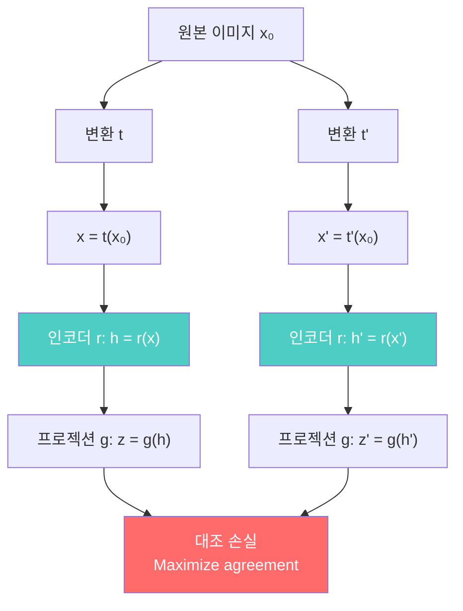
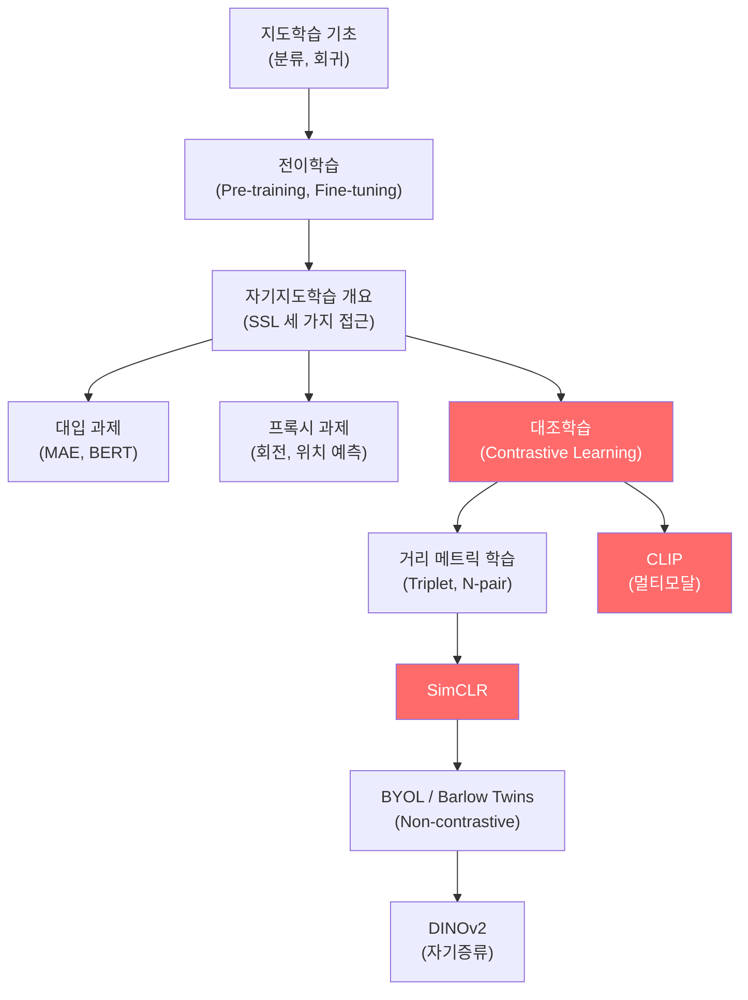

# 자기지도학습 (Self-Supervised Learning) - 수학적 개념 완전 정복

---

## 1. 주제 개요 및 중요성

**한 문장 정의**: 자기지도학습(SSL)은 레이블 없이 데이터 자체의 구조로부터 감독 신호를 자동 생성하여 범용 표현(representation)을 학습하는 방법이다.

**왜 배워야 하는가**:
- **실용적 가치**: 현실 세계 데이터의 대부분은 레이블이 없다. SSL은 레이블 없는 수십억 개의 이미지/텍스트에서 학습할 수 있어, 레이블 수집의 병목을 해소한다. SimCLR, CLIP, DINOv2 등이 대표적이다.
- **이론적 중요성**: Yann LeCun의 "케이크 비유"에서 SSL은 케이크의 본체이고, 지도학습은 아이싱에 불과하다. 뇌의 감각 처리도 본질적으로 자기지도적이며, SSL은 이를 모사하는 가장 유망한 접근이다.

**어떤 문제를 해결하는가**:
- 레이블 데이터 부족 (라벨링은 비싸고 시간이 걸린다)
- 다양한 downstream 태스크에 범용적으로 활용 가능한 표현 학습
- 인간 수준의 시각/언어 이해를 위한 근본적 학습 패러다임

---

## 2. 입문자용 설명 (Level 1)

### 자기지도학습이란?

직소 퍼즐을 생각해 보자. 아무도 완성된 그림을 보여주지 않았지만, 조각들을 맞추다 보면 그림이 어떻게 생겼는지 저절로 알게 된다. 자기지도학습은 컴퓨터가 **스스로 퍼즐을 만들어서 푸는 것**이다. 사진의 일부를 가리고 "여기에 뭐가 있을까?" 맞추면서, 사진이 뭔지 배운다.

### 왜 컴퓨터가 혼자 공부해야 하는가?

사진마다 "이건 고양이", "이건 자동차"라고 적어주는 것은 사람이 해야 한다. 하루에 인터넷에 올라오는 사진만 수십억 장인데, 이를 전부 사람이 분류할 수 없다. 그래서 컴퓨터가 혼자서 사진의 특징을 배울 수 있어야 한다.

### 세 가지 방법

1. **가리기 놀이 (대입 과제)**: 사진 일부를 가리고 "여기에 뭐가 있을까?" 맞추기
2. **변환 맞추기 (프록시 과제)**: 사진을 돌려놓고 "몇 도 돌아갔는지" 맞추기
3. **짝꿍 찾기 (대조 학습)**: 같은 사진의 두 변형은 "같다!", 다른 사진은 "다르다!"

### SimCLR은 뭐야?

같은 강아지 사진을 두 가지로 변형한다. 하나는 밝게 만들고, 하나는 잘라서. 컴퓨터에게 "이 둘은 같은 강아지!"라고 가르치고, 고양이 사진과는 "이건 달라!"라고 가르친다. 이렇게 하면 강아지가 뭔지 저절로 이해하게 된다.

### CLIP은 뭐야?

사진과 설명글을 짝맞추기 하는 게임이다. "귀여운 강아지" 사진과 "귀여운 강아지"라는 글을 연결하고, 다른 사진-글 조합은 분리한다. 이렇게 배우면, 처음 보는 동물 사진도 설명만으로 찾을 수 있다.

---

## 3. 기술적 상세 설명 (Level 2)

### 3.1 대입 과제 (Imputation Tasks) & MAE

입력을 visible part $x_v$와 hidden part $x_h$로 분리하고, visible part만으로 hidden part를 예측한다:

$$\hat{x}_h = f(x_v, x_h = 0; \theta)$$

**MAE (Masked Autoencoder, He et al., 2022)**:
1. 이미지를 패치로 분할하고 **75%를 무작위 마스킹**
2. 가시 패치(25%)만 ViT 인코더에 입력
3. 마스크 토큰 추가 후 디코더로 원본 픽셀 복원

**왜 75%나 마스킹하는가?** 이미지는 공간적 중복(spatial redundancy)이 높아서, 적게 가리면 주변 픽셀을 단순 보간(interpolation)하는 것만으로 풀 수 있다. 75% 마스킹이어야 의미적 이해(semantic understanding)가 필요하다. 이에 비해 언어(BERT)에서는 15%만 마스킹해도 충분한데, 토큰이 의미 단위이기 때문이다.

### 3.2 프록시 과제 (Pretext Tasks)

원본 이미지 $x_1$에 변환 $t$를 적용하여 $x_2 = t(x_1)$을 생성하고, 표현 함수 $f$와 관계 함수 $r$로 변환 관계를 예측한다:

$$p(y \mid x_1, x_2) = p(y \mid r[f(x_1), f(x_2)])$$

| 기호 | 의미 |
|------|------|
| $t$ | 이미지 변환 (회전, 자르기 등) |
| $f(\cdot)$ | 특징 추출 인코더 |
| $r[\cdot, \cdot]$ | 관계 함수 (두 표현의 관계를 계산) |
| $y$ | 변환의 종류 (예: 회전 각도) |

**대표적 예시:**
- **회전 예측**: $t \in \{0^\circ, 90^\circ, 180^\circ, 270^\circ\}$, 4-class 분류 문제
- **상대 위치 예측**: 이미지를 3x3 그리드로 나누고, 중앙 대비 주변 패치의 위치(8가지) 맞추기

**한계**: shortcut learning 위험. 모델이 의미적 특징 대신 색수차(chromatic aberration)나 JPEG 아티팩트 같은 저수준 단서를 활용할 수 있다.

### 3.3 거리 메트릭 학습 (Distance Metric Learning)

임베딩 $e = f(x; \theta)$를 사용하여 의미적 거리를 학습한다:

$$d(x, x'; \theta) = \left\| \frac{e}{\|e\|} - \frac{e'}{\|e'\|} \right\|^2 = 2 - 2\cos(e, e')$$

정규화된 임베딩의 유클리드 거리는 코사인 유사도와 단조 관계에 있다.

**Contrastive Loss** (Chopra et al., 2005):

$$\ell(x, x') = \begin{cases} \|e - e'\|^2 & \text{if same class} \\ (\epsilon - \|e - e'\|^2)^+ & \text{if different class} \end{cases}$$

| 기호 | 의미 |
|------|------|
| $e, e'$ | 두 입력의 임베딩 벡터 |
| $\epsilon$ | 마진 (다른 클래스 간 최소 거리) |
| $(\cdot)^+$ | $\max(0, \cdot)$, ReLU |

같은 클래스면 거리를 줄이고, 다른 클래스면 마진 $\epsilon$ 이상으로 벌린다.

**Triplet Loss** (Schroff et al., 2015):

$$\ell(x, x^+, x^-) = (\|e - e^+\|^2 - \|e - e^-\|^2 + \epsilon)^+$$

| 기호 | 의미 |
|------|------|
| $x$ | 기준(anchor) |
| $x^+$ | positive (같은 클래스) |
| $x^-$ | negative (다른 클래스) |
| $\delta = e^\top e^- - e^\top e^+$ | positive와 negative의 유사도 차이 |

**수치 예시:** anchor-positive 거리 = 0.3, anchor-negative 거리 = 0.5, $\epsilon = 0.2$이면:
$\ell = (0.3 - 0.5 + 0.2)^+ = (0.0)^+ = 0$. 이미 마진이 충족되어 loss가 0이다.
anchor-negative 거리 = 0.4이면: $\ell = (0.3 - 0.4 + 0.2)^+ = (0.1)^+ = 0.1$. 마진 미충족으로 loss 발생.

**N-pair Loss (InfoNCE / NT-Xent):**

$$\ell(x, x^+, \{x_n^-\}_{n=1}^N) = -\log \frac{\exp(e^\top e^+)}{\exp(e^\top e^+) + \sum_n \exp(e^\top e_n^-)}$$

이것은 softmax 기반으로, 여러 negative를 동시에 비교한다. $N=1$일 때 $\text{softplus}(\delta)$와 같고, triplet loss($\text{ReLU}(\delta + \epsilon)$)의 **부드러운(smooth) 일반화**이다.

### 3.4 SimCLR (A Simple Framework for Contrastive Learning)

**SimCLR의 손실 함수:**

$$\text{agree}_{i,j} = \frac{\exp(\text{sim}(z_i, z_j)/\tau)}{\sum_{k=1}^{2N} \mathbf{1}(k \neq i) \exp(\text{sim}(z_i, z_k)/\tau)}$$

$$\ell_{i,j} = -\log \text{agree}_{i,j}$$

$$\mathcal{L} = \frac{1}{2N} \sum_{k=1}^{N} [\ell_{2k-1, 2k} + \ell_{2k, 2k-1}]$$

**각 기호:**
| 기호 | 의미 |
|------|------|
| $z_i, z_j$ | 같은 이미지의 두 augmentation의 프로젝션 벡터 |
| $\text{sim}(z_i, z_j)$ | 코사인 유사도: $z_i^\top z_j / (\|z_i\| \|z_j\|)$ |
| $\tau$ | Temperature 파라미터 |
| $2N$ | 배치 내 총 augmentation 수 (배치 $N$개, 각 2개) |
| $\mathbf{1}(k \neq i)$ | 자기 자신 제외 indicator |

**Temperature $\tau$의 역할:**
- 작은 $\tau$ (예: 0.1): hard negative에 집중. 분포가 날카로워짐.
- 큰 $\tau$ (예: 1.0): 모든 negative를 균등 처리. 분포가 완만해짐.

**수치 예시:** 배치 크기 $N=3$이면 총 6개의 augmented 이미지가 있다. $z_1, z_2$는 같은 원본, $z_3, z_4$는 다른 원본, $z_5, z_6$은 또 다른 원본에서 생성. $z_1$의 positive는 $z_2$이고, $z_3, z_4, z_5, z_6$이 negative이다.

**핵심 발견들:**
1. **프로젝션 헤드**: downstream에는 인코더 출력 $h$를 사용. $z$가 아님.
2. **배치 크기**: 클수록 negative가 많아져 성능 향상.
3. **Augmentation**: random crop + color distortion 조합이 가장 효과적.

### 3.5 Barlow Twins

SimCLR과 달리 **negative 쌍이 필요 없는** 방법이다.

핵심: **교차상관행렬(cross-correlation matrix)**을 단위행렬에 가깝게 만든다.

$$t, t' \sim \mathcal{T}, \quad (x, x') = (t(x_0), t'(x_0))$$

$$\bar{r} = \frac{r - \mu(r)}{\sigma(r)}, \quad \bar{r}' = \frac{r' - \mu(r')}{\sigma(r')} \quad \text{(배치 정규화)}$$

$$C = \frac{\bar{r}^\top \bar{r}'}{N} \in \mathbb{R}^{D \times D}$$

$$\mathcal{L} = \underbrace{\sum_i (1 - C_{ii})^2}_{\text{invariance term}} + \lambda \underbrace{\sum_i \sum_{j \neq i} C_{ij}^2}_{\text{redundancy reduction}}$$

**각 기호:**
| 기호 | 의미 |
|------|------|
| $C_{ii}$ | 교차상관행렬의 대각 원소 (같은 차원 간 상관) |
| $C_{ij}$ ($i \neq j$) | 비대각 원소 (다른 차원 간 상관) |
| $\lambda$ | redundancy reduction 가중치 |
| $D$ | 표현 벡터의 차원 |
| $N$ | 배치 크기 |

**두 항의 직관:**
- **Invariance term** ($C_{ii} \to 1$): 같은 이미지의 두 변형에서 같은 차원의 표현은 **일치**해야 한다.
- **Redundancy reduction** ($C_{ij} \to 0$): 서로 다른 차원은 **서로 다른 정보**를 담아야 한다.

$\lambda = 1$이면 $\mathcal{L} = \|C - I\|_F^2$ (Frobenius norm)이 된다.

**수치 예시:** $D = 3$인 경우:

$$C = \begin{pmatrix} 0.9 & 0.3 & 0.1 \\ 0.2 & 0.8 & 0.4 \\ 0.0 & 0.2 & 0.7 \end{pmatrix}, \quad I = \begin{pmatrix} 1 & 0 & 0 \\ 0 & 1 & 0 \\ 0 & 0 & 1 \end{pmatrix}$$

Invariance: $(1-0.9)^2 + (1-0.8)^2 + (1-0.7)^2 = 0.01 + 0.04 + 0.09 = 0.14$

Redundancy: $0.3^2 + 0.1^2 + 0.2^2 + 0.4^2 + 0.0^2 + 0.2^2 = 0.34$

### 3.6 CLIP (Contrastive Language-Image Pre-training)

4억 개의 (이미지, 텍스트) 쌍에서 학습한다.

**손실 함수:**

$$\mathcal{L} = \sum_i -\log[\text{softmax}(L_{i,:})]_i + \sum_j -\log[\text{softmax}(L_{:,j})]_j$$

| 기호 | 의미 |
|------|------|
| $I_i = f_I(x_i) / \|f_I(x_i)\|$ | 정규화된 이미지 임베딩 |
| $T_j = f_T(y_j) / \|f_T(y_j)\|$ | 정규화된 텍스트 임베딩 |
| $L_{ij} = \cos(I_i, T_j)$ | 유사도 행렬 |

**직관:** 배치 내에서 $L$의 대각선(올바른 이미지-텍스트 쌍)의 유사도를 최대화하고, 비대각선(잘못된 쌍)의 유사도를 최소화한다. 이미지 $\to$ 텍스트 방향과 텍스트 $\to$ 이미지 방향의 **대칭 cross-entropy**이다.

**Zero-shot 분류:**
1. 클래스 이름을 "a photo of a {class}"로 변환하여 텍스트 인코딩 $T_k$ 생성
2. 테스트 이미지를 인코딩하여 $I$ 생성
3. $p(y_k \mid x) = \text{softmax}(\cos(I, T_{1:K}))_k$

### 3.7 준지도학습과 Self-Training

소량의 레이블 데이터 $\{(x_i, y_i)\}_{i=1}^l$과 대량의 비레이블 데이터 $\{x_j\}_{j=l+1}^{l+u}$ ($u \gg l$)를 함께 사용한다.

Self-training (pseudo-labeling):
1. 레이블 데이터로 초기 모델 학습
2. 비레이블 데이터에 pseudo-label $\hat{y}_j = \arg\max f_\theta(x_j)$ 생성
3. 결합된 데이터로 재학습: $\mathcal{L} = \mathcal{L}_{\text{sup}} + \lambda \mathcal{L}_{\text{pseudo}}$

### 3.8 MAML (Model-Agnostic Meta-Learning)

"학습하는 방법을 학습"하는 메타학습.

**내부 루프 (task-specific 적응):**

$$\theta_j' = \theta - \alpha \nabla_\theta L_j(\theta)$$

**외부 루프 (메타 업데이트):**

$$\theta \leftarrow \theta - \beta \nabla_\theta \frac{1}{J} \sum_{j=1}^{J} L_j(\theta_j')$$

| 기호 | 의미 |
|------|------|
| $\theta$ | 메타 파라미터 (공통 초기화) |
| $\theta_j'$ | 태스크 $j$에 적응된 파라미터 |
| $\alpha$ | 내부 루프 학습률 |
| $\beta$ | 외부 루프 학습률 |
| $L_j$ | 태스크 $j$의 손실 |
| $J$ | 태스크 수 |

핵심: 외부 루프에서 $\nabla_\theta L_j(\theta_j')$를 계산할 때, $\theta_j'$가 $\theta$의 함수이므로 **이중 미분(second-order gradient)**이 필요하다.

---

## 4. 전문가 수준 핵심 요약 (Level 3)

SSL의 핵심은 데이터 자체에서 감독 신호를 자동 생성하여, 다양한 downstream 태스크에 전이 가능한 표현을 학습하는 것이다. 대조학습의 N-pair loss를 Taylor 전개하면 alignment(positive 유사도 최대화) + uniformity(임베딩 균일 분포) + variance 항으로 분해되며, 이것이 Wang & Isola (2020)의 이론적 프레임워크와 연결된다.

SSL 방법론의 핵심 설계 과제는 **representation collapse 방지**이다. SimCLR은 negative repulsion으로, BYOL/SimSiam은 asymmetric architecture(predictor + stop gradient)로, Barlow Twins는 feature decorrelation으로, SwAV는 clustering 균등화로 collapse를 방지한다. 현재 frontier는 DINOv2와 같은 자기증류(self-distillation) 방법이며, ViT와 결합하여 supervised pretraining을 능가하는 성능을 보인다.

CLIP은 자연어를 풍부한 semantic supervision으로 활용하여 open-vocabulary zero-shot 분류를 실현했으며, text-to-image 생성 모델(DALL-E, Stable Diffusion)의 핵심 구성 요소로 자리잡았다.

---

## 5. 메타인지 체크포인트

스스로에게 물어보세요:

- [ ] 자기지도학습에서 "레이블이 없다"는 말이 왜 부정확한지 설명할 수 있는가? (레이블이 알고리즘에 의해 자동 생성된다)
- [ ] SimCLR에서 왜 인코더 출력 $h$가 아니라 프로젝션 출력 $z$에서 대조 손실을 계산하는지 설명할 수 있는가?
- [ ] Barlow Twins가 negative 쌍 없이 어떻게 collapse를 방지하는지 설명할 수 있는가?
- [ ] 회전 예측(pretext task)과 SimCLR(contrastive learning)의 근본적 차이를 설명할 수 있는가?
- [ ] CLIP이 zero-shot 분류를 가능하게 하는 수학적 메커니즘을 설명할 수 있는가?

---

## 6. 흔한 오개념 및 주의사항

**1. "자기지도학습은 레이블이 전혀 없는 학습이다"**
- 레이블이 있다. 다만 사람이 만드는 것이 아니라 **알고리즘이 데이터로부터 자동 생성**한다. 마스킹된 부분, 회전 각도, augmentation 쌍 등이 모두 자동 생성된 레이블이다.

**2. "SimCLR의 최종 표현은 프로젝션 헤드 출력이다"**
- 프로젝션 출력 $z$는 학습 시에만 사용된다. Downstream에서는 **인코더 출력 $h$**를 사용한다. $g(\cdot)$가 augmentation-invariant 정보만 남기므로, $h$에 더 풍부한 정보가 보존된다.

**3. "Barlow Twins는 대조학습의 한 종류이다"**
- Negative 쌍을 사용하지 않으므로 **non-contrastive** 방법이다. 교차상관행렬을 단위행렬로 만드는 것이 목표이지, positive/negative 비교가 아니다.

**4. "CLIP은 이미지 분류만을 위한 모델이다"**
- CLIP은 이미지-텍스트 공동 임베딩 공간을 학습하는 **범용 표현 학습 모델**이다. Zero-shot 분류, 이미지 검색, text-to-image 생성 등에 활용된다.

**5. "Triplet loss와 N-pair loss는 완전히 다른 것이다"**
- N-pair loss에서 $N=1$이면 triplet loss의 smooth 버전이 된다. 둘 다 $\delta = e^\top e^- - e^\top e^+$를 기반으로 하며, 활성화 함수만 다르다.

**6. "MAML은 특정 모델 구조에만 적용된다"**
- 이름 자체가 **Model-Agnostic**이다. 미분 가능한 모든 모델(CNN, RNN, MLP 등)에 적용 가능하다.

---

## 7. 학습 로드맵

**선행 지식:**
- CNN/ViT 기초, 임베딩 공간 개념
- 코사인 유사도, softmax, cross-entropy
- 데이터 증강(data augmentation) 개념

**심화 학습 경로:**
- Collapse 이론: Understanding Dimensional Collapse (Jing et al., 2022)
- VICReg: Barlow Twins의 일반화
- DINOv2: 현재 SOTA SSL 방법

---

## 8. 실전 활용 사례

### 사례 1: 의료 영상 분류 (적은 라벨)
- **상황**: 희귀 질환의 X-ray 이미지 50장만 라벨 보유
- **적용**: SimCLR로 라벨 없는 10만 장의 X-ray로 사전학습 $\to$ 50장으로 fine-tuning
- **결과**: 처음부터 학습하면 60% $\to$ SSL 사전학습 후 85% 정확도

### 사례 2: CLIP을 이용한 Zero-shot 이미지 검색
- **상황**: 새로운 제품 카테고리의 이미지 검색 시스템
- **적용**: "빨간색 운동화", "줄무늬 티셔츠" 같은 텍스트 쿼리로 이미지 검색
- **결과**: 미리 정의된 카테고리 없이도 자연어 설명으로 이미지 검색 가능

### 사례 3: Barlow Twins로 산업 결함 검출
- **상황**: 제조라인에서 정상 제품 이미지는 풍부하나 결함 이미지는 극소수
- **적용**: 정상 이미지로 Barlow Twins 사전학습 $\to$ 소수 결함 이미지로 분류기 학습
- **결과**: negative 쌍 구성이 불필요하여 구현이 용이하고, 높은 검출 성능

---

## 9. 추가 학습 자료

**입문자용:**
- Lilian Weng의 "Self-Supervised Representation Learning" 블로그
- "A Simple Framework for Contrastive Learning" (SimCLR, Chen et al., 2020) - Figure 1~3 중심
- "Learning Transferable Visual Models From Natural Language Supervision" (CLIP, Radford et al., 2021) - Figure 1

**중급자용:**
- "Masked Autoencoders Are Scalable Vision Learners" (MAE, He et al., 2022)
- "Barlow Twins: Self-Supervised Learning via Redundancy Reduction" (Zbontar et al., 2021)
- "Understanding Contrastive Representation Learning through Alignment and Uniformity" (Wang & Isola, 2020)

**전문가용:**
- "DINOv2: Learning Robust Visual Features without Supervision" (Oquab et al., 2023)
- "VICReg: Variance-Invariance-Covariance Regularization" (Bardes et al., 2022)
- "Model-Agnostic Meta-Learning for Fast Adaptation" (MAML, Finn et al., 2017)

---

**핵심을 날카롭게 정리하면:**

자기지도학습의 본질은 **데이터 자체의 구조에서 감독 신호를 추출**하여, 레이블 없이도 범용 표현을 학습하는 것이다. 대조학습에서의 alignment + uniformity, Barlow Twins에서의 invariance + redundancy reduction, CLIP에서의 멀티모달 정렬은 모두 같은 목표의 다른 표현이다.

진정한 마스터와 피상적 이해의 차이: 피상적으로 아는 사람은 "같은 이미지끼리 가깝게, 다른 이미지끼리 멀게"라고만 이해하지만, 마스터는 **왜** SimCLR에서 프로젝션 헤드가 필수적인지(augmentation-specific 정보 보존), **왜** Barlow Twins가 negative 없이 작동하는지(redundancy reduction이 collapse를 방지), 그리고 N-pair loss의 Taylor 전개가 alignment와 uniformity로 분해됨을 설명할 수 있다.
