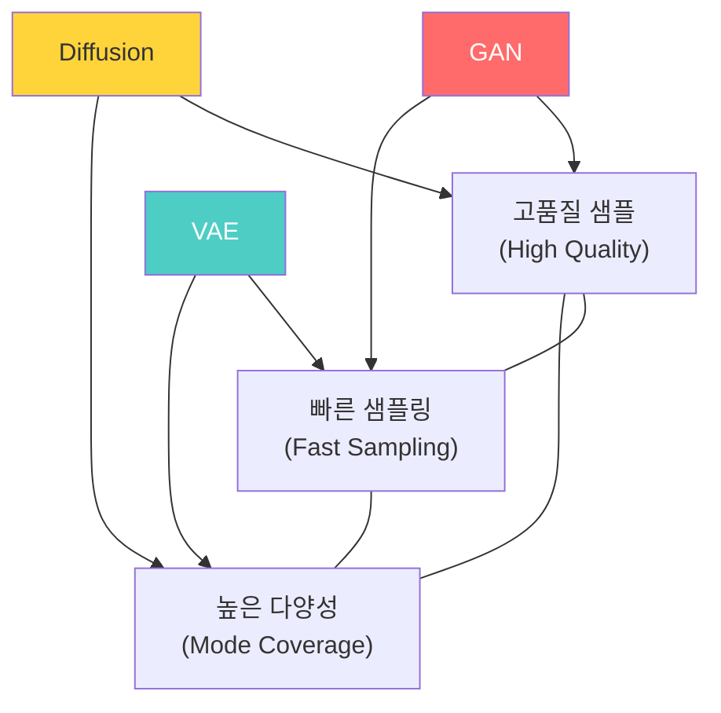
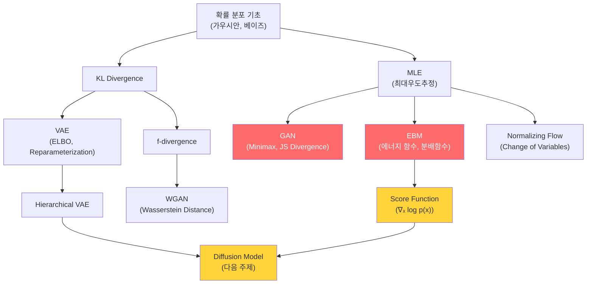

# 생성모델: EBM & GAN - 수학적 개념 완전 정복

---

## 1. 주제 개요 및 중요성

**한 문장 정의**: 생성모델은 데이터의 확률 분포 $p_{\text{data}}(x)$를 학습하여 새로운 데이터를 "창조"하는 딥러닝 패러다임이며, EBM(에너지 기반 모델)과 GAN(생성적 적대 신경망)은 각각 에너지 최소화와 적대적 학습이라는 고유한 접근법을 취한다.

**왜 배워야 하는가**:
- **실용적 가치**: DALL-E, Stable Diffusion, Sora 등 이미지/영상/텍스트 생성의 핵심 기술이다. 2014년 흐릿한 얼굴에서 2018년 진짜 사람과 구별 불가한 얼굴(StyleGAN)로의 발전은 생성모델의 폭발적 성장을 보여준다.
- **이론적 중요성**: 판별모델이 $p(y|x)$를 학습하는 것과 달리, 생성모델은 $p(x)$ 자체를 학습한다. 이는 데이터의 본질적 구조를 이해하는 것이며, EBM의 에너지 함수와 score function 개념은 확산모델(Diffusion Model)로 이어지는 핵심 다리이다.

**어떤 문제를 해결하는가**:
- 새로운 이미지/텍스트/오디오 생성 (creative AI)
- 데이터 증강 (data augmentation)
- 이상 탐지 (anomaly detection): 에너지가 높은 영역 = 비정상
- 밀도 추정 (density estimation): 데이터 분포 자체의 이해

---

## 2. 입문자용 설명 (Level 1)

### 생성모델이란?

"그림 그리는 AI"이다. 실제 사진을 많이 보여주면, AI가 스스로 새로운 사진을 만들어 낼 수 있게 된다. 마치 화가가 많은 풍경을 보고 새로운 풍경화를 그리는 것과 같다.

### GAN은 "위조범과 경찰의 게임"

- **위조범(생성자, Generator)**: 가짜 그림을 만든다
- **경찰(판별자, Discriminator)**: 진짜인지 가짜인지 판별한다
- 둘이 계속 경쟁하면, 위조범은 점점 진짜 같은 가짜를 만들게 된다

### VAE는 "압축 복원기"

그림을 아주 작은 번호(잠재 코드)로 줄였다가, 그 번호로 다시 그림을 만드는 기계이다. 신기한 점은 아무 번호를 넣어도 새로운 그림이 나온다는 것이다.

### EBM은 "에너지 지도"

산과 골짜기가 있는 지도를 생각해 보자:
- 진짜 사진들이 있는 곳은 **골짜기**(에너지가 낮은 곳)
- 이상한/가짜 사진이 있는 곳은 **산꼭대기**(에너지가 높은 곳)

AI가 이 지도를 잘 만들면, 골짜기를 따라가면서 진짜 같은 새 사진을 찾을 수 있다.

### Normalizing Flow는 "모양 바꾸기 마법"

동그란 풍선(단순한 분포)을 여러 번 늘리고 비틀어서 복잡한 동물 모양(복잡한 분포)으로 만드는 것이다. 이 과정을 **거꾸로도 할 수 있다**는 것이 핵심이다.

---

## 3. 기술적 상세 설명 (Level 2)

### 3.1 생성모델의 통합 목표: 최대우도추정 (MLE)

모든 생성모델의 궁극적 목표는 같다:

$$\max_\theta \mathbb{E}_{x \sim p_{\text{data}}}[\log p_\theta(x)]$$

| 기호 | 의미 |
|------|------|
| $p_{\text{data}}(x)$ | 실제 데이터의 확률 분포 (우리가 알고 싶은 것) |
| $p_\theta(x)$ | 모델이 학습한 확률 분포 (우리가 만드는 것) |
| $\theta$ | 모델의 파라미터 |

**각 모델이 $\log p_\theta(x)$를 다루는 방식이 다르다:**

| 모델 | $\log p_\theta(x)$ 처리 방식 |
|------|---------------------------|
| **VAE** | 직접 계산 불가 $\to$ 하한(ELBO)을 최대화 |
| **GAN** | 직접 계산 안 함 $\to$ 판별자를 통한 적대적 학습 |
| **Flow** | 직접 계산 가능 $\to$ change-of-variables formula |
| **EBM** | $Z_\theta$ 때문에 직접 계산 불가 $\to$ 기울기를 샘플링으로 추정 |

### 3.2 VAE (Variational Autoencoder)

**ELBO (Evidence Lower Bound):**

$$-\log p(x) \leq \underbrace{\mathbb{E}_{z \sim q_\phi(\cdot|x)}[-\log p_\theta(x|z)]}_{\text{재구성 오차}} + \underbrace{\text{KL}(q_\phi(z|x) \| p(z))}_{\text{정규화 항}}$$

| 기호 | 의미 |
|------|------|
| $q_\phi(z\|x)$ | 인코더: 입력 $x$를 잠재 변수 $z$의 분포로 변환 |
| $p_\theta(x\|z)$ | 디코더: 잠재 변수 $z$에서 데이터 $x$를 복원 |
| $p(z)$ | 사전 분포 (보통 $\mathcal{N}(0, I)$) |

**유도 과정** (Jensen's Inequality 사용):

$$-\log p(x) = -\log \int p(x,z)dz = -\log \mathbb{E}_{z \sim q(\cdot|x)}\left[\frac{p(x,z)}{q(z|x)}\right] \leq \mathbb{E}_{z \sim q}\left[-\log \frac{p(x,z)}{q(z|x)}\right]$$

**KL Divergence의 닫힌 형태** (VAE에서의 특수한 경우):

$$\text{KL}(\mathcal{N}(\mu, \text{diag}(\sigma)^2) \| \mathcal{N}(0, I)) = \frac{1}{2}\left[-2\sum_j \log\sigma_j + \|\sigma\|^2 + \|\mu\|^2 - D\right]$$

| 기호 | 의미 |
|------|------|
| $\mu$ | 인코더가 출력한 평균 벡터 |
| $\sigma$ | 인코더가 출력한 표준편차 벡터 |
| $D$ | 잠재 변수의 차원 |

**수치 예시:** $D=2$, $\mu = [0.5, -0.3]$, $\sigma = [1.2, 0.8]$일 때:

$$\text{KL} = \frac{1}{2}[-2(\ln 1.2 + \ln 0.8) + (1.44 + 0.64) + (0.25 + 0.09) - 2]$$
$$= \frac{1}{2}[-2(0.182 - 0.223) + 2.08 + 0.34 - 2] = \frac{1}{2}[0.082 + 0.42] = 0.251$$

**Reparameterization Trick:**

$$z = \mu + \sigma \odot \varepsilon, \quad \varepsilon \sim \mathcal{N}(0, I)$$

**왜 필요한가?** $z \sim q_\phi(z|x)$에서 직접 샘플링하면 $\phi$에 대한 gradient를 계산할 수 없다 (샘플링 연산은 미분 불가). 재매개변수화하면 $z$가 $\phi$의 결정적 함수가 되어 역전파가 가능해진다.

### 3.3 GAN (Generative Adversarial Network)

**암시적 생성모델:** 확률밀도를 직접 정의하지 않고, 샘플링 과정으로 분포를 표현한다.

$$z \sim q(z) = \mathcal{N}(0, I), \quad x = G_\theta(z)$$

**Minimax 목적함수:**

$$\min_\theta \max_\phi \left[\mathbb{E}_{x \sim p_{\text{data}}}[\log D_\phi(x)] + \mathbb{E}_{z \sim q(z)}[\log(1 - D_\phi(G_\theta(z)))]\right]$$

**각 기호:**
| 기호 | 의미 |
|------|------|
| $G_\theta$ | 생성자: 노이즈 $z$를 가짜 이미지로 변환 |
| $D_\phi$ | 판별자: 입력이 진짜일 확률 출력 ($0 \sim 1$) |
| $\mathbb{E}_{x \sim p_{\text{data}}}[\log D_\phi(x)]$ | 진짜 데이터에 대한 판별자의 확신 |
| $\mathbb{E}_z[\log(1 - D_\phi(G_\theta(z)))]$ | 가짜 데이터를 가짜로 판별하는 확신 |

**수식의 직관적 해석:**

- **판별자 ($\max_\phi$)**: 진짜에는 $D_\phi(x) \to 1$ (높은 $\log D$), 가짜에는 $D_\phi(G(z)) \to 0$ (높은 $\log(1-D)$)
- **생성자 ($\min_\theta$)**: 판별자를 속이기 위해 $D_\phi(G(z)) \to 1$ (낮은 $\log(1-D)$)

**수치 예시:** $D_\phi(\text{real}) = 0.9$, $D_\phi(\text{fake}) = 0.3$일 때:

판별자 목적 = $\log(0.9) + \log(1-0.3) = -0.105 + (-0.357) = -0.462$

$D_\phi(\text{fake})$가 0.1이 되면: $\log(0.9) + \log(0.9) = -0.210$ (더 높은 값, 판별자에게 더 좋음)

**최적 판별자 하에서의 이론적 의미:** GAN의 생성자 목적함수는 $p_{\text{data}}$와 $p_G$ 사이의 **Jensen-Shannon Divergence**를 최소화하는 것과 동치이다.

### 3.4 WGAN (Wasserstein GAN)

**f-divergence의 한계:**

$D_f(p \| q) = \int q(x) f\left(\frac{p(x)}{q(x)}\right) d\mu(x)$

두 분포의 support가 저차원 매니폴드 위에 있고 겹치지 않으면:
- KL divergence = $\infty$ (발산)
- TV distance = 0 또는 1로 점프 (불연속)

**Wasserstein 거리 (Earth Mover's Distance):**

$$W(P_S, P_\theta) = \sup_{\|f\|_L \leq 1} \left[\mathbb{E}_{x \sim P_S}[f(x)] - \mathbb{E}_{x \sim P_\theta}[f(x)]\right]$$

| 기호 | 의미 |
|------|------|
| $W$ | Wasserstein 거리: "흙 한 무더기를 다른 모양으로 옮기는 최소 비용" |
| $\|f\|_L \leq 1$ | $f$가 1-Lipschitz 조건을 만족 |
| $P_S$ | 실제 데이터 분포 |
| $P_\theta$ | 모델 분포 |

**핵심 예시 (왜 Wasserstein이 우월한가):**

$P_\theta$가 직선 $\{(\theta, t) : t \in [0,1]\}$ 위에 균일 분포이고, $P_0$이 $\theta=0$일 때:

| 거리 측도 | $\theta = 0$ | $\theta \neq 0$ | 연속성 |
|-----------|-------------|-----------------|--------|
| KL | 0 | $\infty$ | 불연속 |
| TV | 0 | 1 | 불연속 |
| **Wasserstein** | 0 | $|\theta|$ | **연속, 미분 가능** |

Wasserstein 거리만이 $\theta$에 대해 유의미한 gradient를 제공한다.

**WGAN 목적함수:**

$$\max_\phi \left[\mathbb{E}_{x \sim P_S}[f_\phi(x)] - \mathbb{E}_{z \sim q(z)}[f_\phi(G_\theta(z))]\right] \quad \text{s.t. } \|f_\phi\|_L \leq 1$$

판별자를 **critic**이라 부르며, 확률이 아닌 스코어를 출력한다.

**Lipschitz 제약 구현:**
- Weight clipping: 가중치를 $[-c, c]$로 제한 (단순하지만 용량 제한)
- Gradient penalty (WGAN-GP): 보간점에서 gradient norm 페널티 추가

### 3.5 Energy-Based Model (EBM)

**확률 분포 정의:**

$$p_\theta(x) = \frac{\exp(-E_\theta(x))}{Z_\theta}, \quad Z_\theta = \int \exp(-E_\theta(x))dx$$

| 기호 | 의미 |
|------|------|
| $E_\theta(x)$ | 에너지 함수 (신경망으로 모델링, $E \geq 0$) |
| $Z_\theta$ | 분배 함수 (정규화 상수, 직접 계산 불가) |

**에너지가 낮은 곳 = 확률이 높은 곳 = 실제 데이터가 있는 곳**

**MLE 학습의 기울기:**

$$-\nabla_\theta \ell(\theta) = -\underbrace{\mathbb{E}_{x \sim p_S}[\nabla_\theta E_\theta(x)]}_{\text{실제 데이터의 에너지를 낮춤}} + \underbrace{\mathbb{E}_{x \sim p_\theta}[\nabla_\theta E_\theta(x)]}_{\text{모델 샘플의 에너지를 높임}}$$

**유도 과정:**

$\nabla_\theta \log Z_\theta$를 계산하면:

$$\nabla_\theta \log Z_\theta = \frac{1}{Z_\theta} \int \exp(-E_\theta(x))(-\nabla_\theta E_\theta(x))dx = -\mathbb{E}_{x \sim p_\theta}[\nabla_\theta E_\theta(x)]$$

**핵심 통찰:** $Z_\theta$의 **값**은 계산할 필요 없다. $p_\theta$에서의 **샘플**만 있으면 기울기를 추정할 수 있다.

**Langevin MCMC 샘플링:**

$$x_{t+1} = x_t + \lambda \nabla_x \log p_\theta(x_t) + \sigma \varepsilon_t, \quad \varepsilon_t \sim \mathcal{N}(0, I)$$

| 기호 | 의미 |
|------|------|
| $\nabla_x \log p_\theta(x)$ | **Score function**: $-\nabla_x E_\theta(x)$ (에너지가 감소하는 방향) |
| $\lambda$ | 스텝 크기 |
| $\sigma = \sqrt{2\lambda}$ | 노이즈 강도 (이론적 최적값) |
| $\varepsilon_t$ | 가우시안 노이즈 |

이 score function $s_\theta(x) = \nabla_x \log p_\theta(x)$가 Diffusion Model과 Score-Based Generative Model로 이어지는 **핵심 개념**이다.

### 3.6 Normalizing Flow

**Change-of-Variables Formula:**

$$\log p_X(x) = \log p_U(g(x)) - \log|\det f'(u)|$$

| 기호 | 의미 |
|------|------|
| $f: \mathbb{R}^d \to \mathbb{R}^d$ | 가역 변환 ($x = f(u)$) |
| $g = f^{-1}$ | 역변환 ($u = g(x)$) |
| $p_U$ | 기본 분포 (보통 $\mathcal{N}(0, I)$) |
| $\det f'(u)$ | Jacobian의 행렬식 |

합성 변환의 경우:

$$\log p_X(x) = \log p_U(g(x)) - \sum_{k=1}^{K} \log|\det f'_k(u_{k-1})|$$

**수치 예시:** 1차원에서 $f(u) = 2u + 1$이면 $f'(u) = 2$이고:

$$p_X(x) = p_U(g(x)) / |f'(u)| = p_U((x-1)/2) / 2$$

$u \sim \mathcal{N}(0,1)$이면 $x \sim \mathcal{N}(1, 4)$. 분산이 $2^2 = 4$배로 늘어남.

### 3.7 Auto-Regressive Models (ARM)

확률의 연쇄법칙을 직접 사용:

$$p(x_{1:T}) = \prod_{t=1}^{T} p(x_t \mid x_{1:t-1})$$

각 조건부 분포를 신경망으로 모델링한다. PixelCNN(이미지), GPT(텍스트), WaveNet(오디오) 등이 대표적이다.

**장점**: 정확한 $\log p(x)$ 계산 가능
**단점**: 순차적 생성으로 인해 샘플링이 느림

### 3.8 생성모델 Trade-off 삼각형

| 모델 | 고품질 | 빠른 샘플링 | 높은 다양성 |
|------|--------|-----------|-----------|
| GAN | O | O | X (mode collapse) |
| VAE | X (blurry) | O | O |
| Diffusion | O | X (느림) | O |

세 가지를 동시에 달성하기는 매우 어렵다.

---

## 4. 전문가 수준 핵심 요약 (Level 3)

생성모델들의 목적함수를 통합적으로 보면, 모두 $p_{\text{data}}$와 $p_\theta$ 사이의 "거리"를 줄이는 것이다. VAE는 ELBO(KL + reconstruction)를, GAN은 적대적 divergence(JS divergence)를, Flow는 정확한 NLL을, EBM은 contrastive energy를 최적화한다.

GAN의 핵심 도전은 training instability와 mode collapse이며, WGAN은 f-divergence의 불연속성 문제를 Wasserstein 거리($W(P, Q) = \sup_{\|f\|_L \leq 1} \mathbb{E}_P[f] - \mathbb{E}_Q[f]$)로 해결했다. EBM의 $\nabla_\theta \log Z_\theta = -\mathbb{E}_{p_\theta}[\nabla_\theta E_\theta]$는 정규화 상수 없이 학습이 가능함을 보여주며, score function $s_\theta(x) = -\nabla_x E_\theta(x)$는 Diffusion Model과 Score-Based 생성모델로 직결되는 핵심 개념이다.

네 프레임워크 간의 깊은 연결: GAN의 판별자를 에너지 함수로 보면 EBM과 연결되고, VAE의 계층을 무한히 쌓으면 Diffusion이 되며, EBM의 score를 학습하면 Score-Based Model이 된다.

---

## 5. 메타인지 체크포인트

스스로에게 물어보세요:

- [ ] GAN이 "암시적 생성모델"인 이유를 설명할 수 있는가? ($p_\theta(x)$를 직접 계산할 수 없다)
- [ ] 왜 KL divergence 대신 Wasserstein 거리를 사용하면 학습이 안정화되는지 수학적으로 설명할 수 있는가?
- [ ] EBM에서 분배함수 $Z_\theta$를 몰라도 학습이 가능한 이유를 유도할 수 있는가?
- [ ] VAE의 Reparameterization trick이 왜 수학적으로 필수적인지 설명할 수 있는가?
- [ ] GAN, VAE, Flow, EBM의 핵심 차이를 목적함수 관점에서 비교할 수 있는가?

---

## 6. 흔한 오개념 및 주의사항

**1. "GAN의 생성자는 확률분포를 직접 학습한다"**
- GAN은 **암시적(implicit)** 모델로, $z \to G_\theta(z)$라는 샘플링 과정만 정의한다. $p_\theta(x)$를 직접 계산할 방법이 없다. 이것이 likelihood 평가가 불가능한 이유이다.

**2. "VAE의 KL term은 불필요한 제약이다"**
- KL 항이 없으면 잠재공간이 구조화되지 않아 interpolation이나 새로운 샘플 생성이 불가능해진다. KL은 잠재공간을 정규분포에 가깝게 만드는 **핵심 정규화**이다.

**3. "Wasserstein 거리와 KL divergence는 교체 가능하다"**
- KL은 support가 겹치지 않으면 $\infty$. Wasserstein은 support가 떨어져 있어도 연속적이고 유의미한 gradient를 제공한다. 근본적으로 다른 성질을 가진다.

**4. "EBM에서 $Z_\theta$를 직접 계산해야 한다"**
- 기울기 계산에는 $Z_\theta$의 값이 아닌 $p_\theta$에서의 **샘플**만 필요하다. $\nabla_\theta \log Z_\theta = -\mathbb{E}_{p_\theta}[\nabla_\theta E_\theta]$이므로 Langevin MCMC로 근사 샘플링하면 된다.

**5. "Reparameterization trick은 단순한 구현 편의이다"**
- 수학적 **필수 조건**이다. Naive Monte Carlo estimator $f(z)\nabla_\phi \log q_\phi(z)$는 분산이 극도로 높아 실용적이지 않다. 재매개변수화 없이는 VAE 학습이 사실상 불가능하다.

**6. "Diffusion model은 GAN과 완전히 다른 새로운 패러다임이다"**
- Diffusion model은 **hierarchical VAE**의 한 형태이다. Forward process = encoder chain, reverse process = decoder chain. 또한 EBM의 score matching과도 깊이 연결된다.

---

## 7. 학습 로드맵

**선행 지식:**
- 확률론: 확률밀도함수, 조건부 확률, 베이즈 정리
- 정보 이론: KL divergence, 엔트로피, cross-entropy
- 기초 최적화: gradient descent, minimax

**심화 학습 경로:**
- Score-Based Generative Models (Song & Ermon, 2019)
- Diffusion Models (DDPM, Ho et al., 2020)
- SDE Framework (Song et al., 2021)

---

## 8. 실전 활용 사례

### 사례 1: StyleGAN으로 얼굴 생성
- **상황**: 게임/영화에 사용할 가상 인물 얼굴 생성
- **적용**: StyleGAN2의 잠재 공간에서 샘플링하여 고해상도 얼굴 이미지 생성
- **결과**: 1024x1024 해상도의 실사 수준 얼굴, latent space interpolation으로 얼굴 속성(나이, 표정) 연속 변환 가능

### 사례 2: VAE로 약물 분자 설계
- **상황**: 특정 성질을 가진 새로운 약물 분자 탐색
- **적용**: 기존 약물 분자를 VAE로 학습 $\to$ 잠재 공간에서 원하는 성질의 영역을 탐색 $\to$ 디코딩하여 새로운 분자 후보 생성
- **결과**: 유효한 분자 구조를 생성하면서도 기존에 없던 새로운 후보 제안

### 사례 3: EBM으로 이상 탐지
- **상황**: 제조 라인의 정상/불량 판정
- **적용**: 정상 제품 이미지로 EBM 학습 $\to$ 새로운 이미지의 에너지 측정
- **결과**: 에너지가 임계값 이상이면 불량으로 판정. 불량 샘플의 라벨 없이도 탐지 가능

---

## 9. 추가 학습 자료

**입문자용:**
- "Generative Adversarial Nets" (Goodfellow et al., 2014) - 원 논문의 Figure 1
- "Auto-Encoding Variational Bayes" (Kingma & Welling, 2014) - Section 1-2
- Lilian Weng의 "From GAN to WGAN" 블로그

**중급자용:**
- "Wasserstein GAN" (Arjovsky et al., 2017) - Theorem 1, 2의 직관
- "Tutorial on Variational Autoencoders" (Doersch, 2016)
- "A Tutorial on Energy-Based Learning" (LeCun et al., 2006)

**전문가용:**
- "How to Train Your Energy-Based Models" (Song & Kingma, 2021)
- "GLOW: Generative Flow with Invertible 1x1 Convolutions" (Kingma & Dhariwal, 2018)
- "Improved Training of Wasserstein GANs" (Gulrajani et al., 2017, WGAN-GP)

---

**핵심을 날카롭게 정리하면:**

생성모델의 본질은 데이터 분포 $p_{\text{data}}(x)$를 근사하는 것이며, 각 모델은 이 목표에 대해 서로 다른 수학적 전략을 취한다. GAN은 적대적 게임으로 암시적 분포를 학습하고, VAE는 변분 하한을 최적화하며, EBM은 에너지 최소화를 통해 접근한다.

진정한 마스터와 피상적 이해의 차이: 피상적으로 아는 사람은 "GAN은 생성자와 판별자의 대결"이라고만 알지만, 마스터는 GAN 목적함수가 최적 판별자 하에서 JS divergence를 최소화하는 것과 동치임을 유도할 수 있고, EBM의 $\nabla_\theta \log Z_\theta = -\mathbb{E}_{p_\theta}[\nabla_\theta E_\theta]$를 통해 분배함수 없이 학습이 가능한 이유를 설명할 수 있으며, VAE의 ELBO와 Diffusion의 ELBO가 어떻게 연결되는지를 hierarchical VAE 관점에서 이해한다.
