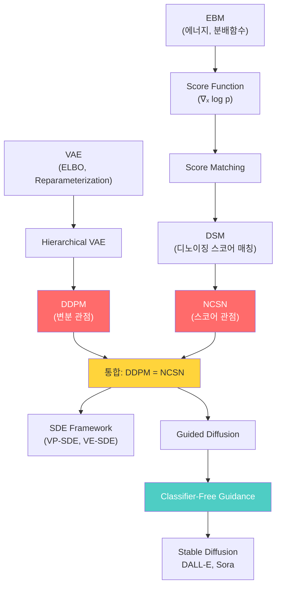

# 확산모델과 스코어 매칭 - 수학적 개념 완전 정복

---

## 1. 주제 개요 및 중요성

**한 문장 정의**: 확산모델(Diffusion Model)은 데이터에 점진적으로 노이즈를 추가하는 순방향 과정과 그 역과정을 학습하여, 순수한 노이즈로부터 고품질 데이터를 생성하는 모델이며, 스코어 매칭(Score Matching)은 확률 분포의 기울기(score function)를 직접 학습하는 기법이다.

**왜 배워야 하는가**:
- **실용적 가치**: DALL-E 2, Stable Diffusion, Midjourney, Sora 등 현재 최고 성능의 이미지/영상 생성 모델이 모두 확산모델 기반이다. 현대 생성 AI의 핵심 기술이다.
- **이론적 중요성**: 확산모델은 VAE의 변분 관점과 EBM의 스코어 관점을 **통합**하는 프레임워크이며, DDPM의 노이즈 예측과 NCSN의 스코어 예측이 수학적으로 동치임이 밝혀졌다. 이 통합은 Song et al. (2021)의 SDE 프레임워크로 완성되었다.

**어떤 문제를 해결하는가**:
- GAN의 mode collapse (다양성 부족)
- VAE의 blurry 출력 (품질 부족)
- EBM의 느리고 불안정한 MCMC 샘플링
- 고품질 + 고다양성 생성의 동시 달성

---

## 2. 입문자용 설명 (Level 1)

### 확산모델이란?

깨끗한 사진에 모래를 한 알씩 뿌리면, 점점 사진이 보이지 않게 된다. 모래를 충분히 뿌리면 원래 뭐가 있었는지 전혀 알 수 없는 상태가 된다. 확산모델은 "모래를 한 알씩 치우는 방법"을 배운다. 모래만 잔뜩 있는 종이에서 시작해서 모래를 하나씩 치우면, 새로운 사진이 나타난다.

### 왜 한 번에 안 하고 여러 단계로 하는가?

한 번에 모래를 와르르 뿌리면 원래 뭐가 있었는지 전혀 모른다. 하지만 한 알씩 뿌리면 바로 전 단계가 뭐였는지 기억하기 쉽다. 그래서 한 단계씩 천천히 치우는 것도 쉬워진다.

### 스코어 함수란?

높은 산에서 눈을 감고 내려가야 한다고 상상해 보자. 발밑의 경사를 느끼면 "이쪽이 내리막이구나" 알 수 있다. 스코어 함수는 바로 이 "내리막 방향"을 알려주는 나침반이다. "이 방향으로 가면 사진이 더 그럴듯해진다"고 안내한다.

### 가이디드 확산이란?

"아무 그림이나 그려줘" 대신 "고양이 그림 그려줘"라고 주문하는 것이다. 가이디드 확산은 이 주문(조건)을 듣고 원하는 그림을 만들어주는 방법이다. "아무거나 그리는 능력"과 "고양이 그리는 능력"을 적절히 섞어서, 얼마나 고양이에 집중할지 조절한다.

---

## 3. 기술적 상세 설명 (Level 2)

### 3.1 VAE 복습: ELBO의 유도

확산모델은 VAE의 확장이므로, ELBO를 정확히 이해하는 것이 출발점이다.

**Jensen's Inequality를 통한 유도:**

$$-\log p(x) = -\log \int p(x,z)dz = -\log \mathbb{E}_{z \sim q(\cdot|x)}\left[\frac{p(x,z)}{q(z|x)}\right] \leq \mathbb{E}_{z \sim q(\cdot|x)}\left[-\log \frac{p(x,z)}{q(z|x)}\right]$$

| 기호 | 의미 |
|------|------|
| $p(x)$ | 데이터의 주변 가능도 (marginal likelihood) |
| $p(x, z)$ | 데이터와 잠재 변수의 결합 분포 |
| $q(z\|x)$ | 변분 사후 분포 (인코더) |
| ELBO | $\mathbb{E}_q[\log p(x,z) - \log q(z\|x)]$ |

정리하면:

$$-\text{ELBO} = \underbrace{\mathbb{E}_{z \sim q_\phi}[-\log p_\theta(x|z)]}_{\text{재구성}} + \underbrace{\text{KL}(q_\phi(z|x) \| p(z))}_{\text{일관성}}$$

**등호 조건**: $q_\phi(z|x) = p(z|x)$일 때. 실제로는 gap이 존재하며:

$$\log p(x) = \text{ELBO} + \text{KL}(q_\phi(z|x) \| p(z|x))$$

### 3.2 확산모델의 순방향/역방향 과정


**순방향 과정 (Forward Process) - 고정, 학습하지 않음:**

$$q(z_t | z_{t-1}) = \mathcal{N}(z_t; \sqrt{1-\beta_t}\, z_{t-1}, \beta_t I)$$

| 기호 | 의미 |
|------|------|
| $z_t$ | 시간 $t$에서의 노이즈 낀 데이터 |
| $\beta_t$ | 노이즈 스케줄 ($0 < \beta_t < 1$, 시간에 따라 증가) |
| $\sqrt{1-\beta_t}$ | 이전 데이터의 "잔여 비율" |

**핵심: 임의 시점의 marginal이 닫힌 형태로 계산된다:**

$$q(z_t | x_0) = \mathcal{N}(z_t; \sqrt{\bar{\alpha}_t}\, x_0, (1-\bar{\alpha}_t) I)$$

$$\bar{\alpha}_t = \prod_{s=1}^{t}(1-\beta_s)$$

| 기호 | 의미 |
|------|------|
| $\bar{\alpha}_t$ | 시간 $t$까지의 누적 신호 보존 비율 |
| $1-\bar{\alpha}_t$ | 시간 $t$까지의 누적 노이즈 비율 |

이것은 **$t$번의 순차적 노이즈 추가를 한 번에 계산**할 수 있게 해주어, 학습을 매우 효율적으로 만든다.

**수치 예시:** $\beta_t = 0.02$이고 $T = 1000$이면:
- $t=1$: $\bar{\alpha}_1 = 0.98$, 원본 98% + 노이즈 2%
- $t=100$: $\bar{\alpha}_{100} = 0.98^{100} \approx 0.13$, 원본 13% + 노이즈 87%
- $t=1000$: $\bar{\alpha}_{1000} = 0.98^{1000} \approx 0$, 거의 순수 노이즈

**역방향 과정 (Reverse Process) - 학습:**

$$p_\theta(z_{t-1} | z_t) = \mathcal{N}(z_{t-1}; \mu_\theta(z_t, t), \sigma_t^2 I)$$

모델이 학습하는 것은 $\mu_\theta(z_t, t)$, 즉 한 단계 더 깨끗한 상태의 **평균**이다.

### 3.3 VAE vs 확산모델 구조 비교

| 구분 | VAE | 확산모델 |
|------|-----|---------|
| 순방향(인코더) | $q_\phi(z\|x)$ — **학습** | $q(z_t\|z_{t-1})$ — **고정** |
| 역방향(디코더) | $p_\theta(x\|z)$ — 학습 | $p_\theta(z_{t-1}\|z_t)$ — 학습 |
| 잠재 변수 | 1개 ($z$) | $T$개 ($z_1, \ldots, z_T$) |
| 잠재 차원 | $d_z < d_x$ (병목) | $d_{z_t} = d_x$ (같은 차원) |

### 3.4 DDPM의 ELBO와 학습 목표

확산모델의 ELBO를 각 시간 단계별로 분해하면:

$$L = \mathbb{E}_q\left[\underbrace{-\log p_\theta(x|z_1)}_{L_0} + \sum_{t=2}^{T} \underbrace{\text{KL}(q(z_{t-1}|z_t, x_0) \| p_\theta(z_{t-1}|z_t))}_{L_{t-1}} + \underbrace{\text{KL}(q(z_T|x_0) \| p(z_T))}_{L_T}\right]$$

| 항 | 의미 |
|----|------|
| $L_0$ | 재구성 항: $z_1$에서 원본 $x$를 얼마나 잘 복원하는가 |
| $L_{t-1}$ | 일관성 항: 역방향 $p_\theta$가 순방향 사후분포 $q$와 일치하는가 |
| $L_T$ | 사전 항: 마지막 잠재 변수가 $\mathcal{N}(0,I)$에 가까운가 (상수) |

**핵심:** $q(z_{t-1}|z_t, x_0)$는 **순방향 과정의 사후분포**로, 닫힌 형태의 가우시안이다:

$$q(z_{t-1}|z_t, x_0) = \mathcal{N}(z_{t-1}; \tilde{\mu}_t(z_t, x_0), \tilde{\beta}_t I)$$

두 가우시안 사이의 KL은 **평균의 차이의 제곱**이므로:

$$L_{t-1} \propto \|\tilde{\mu}_t(z_t, x_0) - \mu_\theta(z_t, t)\|^2$$

**Ho et al. (2020)의 핵심 통찰:** $\tilde{\mu}_t$를 $\epsilon$-예측으로 재매개변수화하면 simplified loss가 된다:

$$L_{\text{simple}} = \mathbb{E}_{t, x_0, \epsilon}\left[\|\epsilon - \epsilon_\theta(\underbrace{\sqrt{\bar{\alpha}_t}\, x_0 + \sqrt{1-\bar{\alpha}_t}\, \epsilon}_{z_t}, \, t)\|^2\right]$$

| 기호 | 의미 |
|------|------|
| $\epsilon \sim \mathcal{N}(0, I)$ | 추가된 실제 노이즈 |
| $\epsilon_\theta(z_t, t)$ | 모델이 예측한 노이즈 |
| $t \sim \text{Uniform}(1, T)$ | 랜덤 시간 단계 |

**직관:** 노이즈 낀 이미지 $z_t$와 시간 $t$가 주어졌을 때, **어떤 노이즈가 추가되었는지**를 맞추는 것이다. 이것이 DDPM 학습의 전부이다.

### 3.5 에너지 기반 모델에서 스코어 함수로

EBM에서 출발:

$$p_\theta(x) = \frac{\exp(-E_\theta(x))}{Z_\theta}$$

**스코어 함수(Score Function):**

$$s_\theta(x) \equiv \nabla_x \log p_\theta(x) = -\nabla_x E_\theta(x) \quad \text{(}\textbf{Z_\theta가 사라진다!}\text{)}$$

유도:
$$\nabla_x \log p_\theta(x) = \nabla_x[-E_\theta(x) - \log Z_\theta] = -\nabla_x E_\theta(x) - \underbrace{\nabla_x \log Z_\theta}_{= 0 \text{ (x에 무관)}}$$

| 기호 | 의미 |
|------|------|
| $s_\theta(x)$ | 스코어 함수: $x$ 공간에서 **확률이 증가하는 방향**을 가리키는 벡터 |
| $E_\theta(x)$ | 에너지 함수: 낮을수록 확률이 높음 |
| $Z_\theta$ | 분배함수: $x$에 대한 적분이므로 $\nabla_x$에 대해 상수 |

**스코어 매칭 (Score Matching, Hyvarinen 2005):**

$$L_{SM}(\theta) = \frac{1}{2}\mathbb{E}_{x \sim p_0}\left[\|s_\theta(x) - \nabla_x \log p_0(x)\|^2\right]$$

문제: $\nabla_x \log p_0(x)$를 모른다. 부분적분(integration by parts)으로 변환:

$$L_{SM}(\theta) = \frac{1}{2}\mathbb{E}_{x \sim p_0}\left[\|s_\theta(x)\|^2 + 2\text{Tr}(\nabla_x s_\theta(x))\right] + C$$

$p_0$의 스코어를 몰라도 학습이 가능해지지만, **야코비안의 트레이스**가 고차원에서 계산 비용이 크다.

### 3.6 디노이징 스코어 매칭 (DSM) & NCSN

**DSM의 핵심 아이디어:** 데이터 $x$에 노이즈를 추가하면, 노이즈 조건부 스코어는 닫힌 형태로 계산 가능하다.

$\tilde{x} = x + \sigma\epsilon$, $\epsilon \sim \mathcal{N}(0, I)$일 때:

$$\nabla_{\tilde{x}} \log p(\tilde{x}|x) = \nabla_{\tilde{x}} \log \mathcal{N}(\tilde{x}; x, \sigma^2 I) = -\frac{\tilde{x} - x}{\sigma^2} = -\frac{\epsilon}{\sigma}$$

**DSM 손실:**

$$L_{DSM}(\theta; \sigma) = \frac{1}{2}\mathbb{E}_{x, \epsilon}\left[\left\|s_\theta(x + \sigma\epsilon; \sigma) + \frac{\epsilon}{\sigma}\right\|^2\right]$$

| 기호 | 의미 |
|------|------|
| $s_\theta(\tilde{x}; \sigma)$ | 모델이 예측하는 스코어 (노이즈 수준 $\sigma$ 조건부) |
| $-\epsilon/\sigma$ | 원본 데이터를 향하는 정확한 스코어 |

**놀라운 결과:** $L_{SM} = L_{DSM} + C$ (상수 차이만 존재). 즉, DSM은 원래 스코어 매칭과 **동치**이면서도 계산이 훨씬 쉽다.

**NCSN (Noise-Conditioned Score Network, Song & Ermon 2019):**

단일 노이즈 수준의 한계: 저밀도 영역에서 스코어 추정이 부정확하다. 해결: **여러 노이즈 수준**에서 동시에 학습.

$$L_{NCSN}(\theta) = \sum_{i=1}^{L} \lambda(\sigma_i) \cdot L_{DSM}(\theta; \sigma_i), \quad 0 < \sigma_1 < \sigma_2 < \cdots < \sigma_L$$

| 기호 | 의미 |
|------|------|
| $\sigma_i$ | $i$번째 노이즈 수준 |
| $\lambda(\sigma_i)$ | 가중치 (보통 $\sigma_i^2$) |
| $L$ | 노이즈 수준의 수 |

- **큰 $\sigma$**: 데이터 분포를 넓게 퍼뜨려 저밀도 영역까지 커버
- **작은 $\sigma$**: 세밀한 구조 포착, 고밀도 영역에서 정확한 스코어

### 3.7 DDPM과 NCSN의 깊은 연결

**두 관점의 핵심 관계식:**

$$s_\theta(\tilde{x}, \sigma) = -\frac{\epsilon_\theta(\tilde{x}, t)}{\sigma}$$

| DDPM (변분 관점) | NCSN (스코어 관점) |
|-----------------|-------------------|
| 노이즈 $\epsilon$ 예측 | 스코어 $s = \nabla_x \log p$ 예측 |
| ELBO 최소화 | DSM 손실 최소화 |
| 역방향 sampling | Annealed Langevin dynamics |
| $\sigma_t = \sqrt{1-\bar{\alpha}_t}$ | 노이즈 스케줄 $\sigma_i$ |

**DDPM의 simplified loss를 DSM으로 변환:**

$s_\theta(z_t, t) = -\epsilon_\theta(z_t, t) / \sqrt{1-\bar{\alpha}_t}$로 치환하면:

$$L_{\text{DDPM}} = \mathbb{E}_{t,x_0,\epsilon}\left[(1-\bar{\alpha}_t)\left\|s_\theta(z_t, t) + \frac{\epsilon}{\sqrt{1-\bar{\alpha}_t}}\right\|^2\right]$$

이것은 $\sigma_t = \sqrt{1-\bar{\alpha}_t}$에서의 **가중 DSM 손실**과 정확히 일치한다.

**결론: 변분 관점과 스코어 관점은 같은 목표를 다른 언어로 표현한 것이다.**

### 3.8 랑주뱅 동역학과 어닐드 랑주뱅 동역학

**랑주뱅 동역학 (Langevin Dynamics):**

$$x_{k+1} = x_k + \eta \cdot s_\theta(x_k) + \sqrt{2\eta} \cdot \epsilon_k, \quad \epsilon_k \sim \mathcal{N}(0, I)$$

| 항 | 의미 |
|----|------|
| $x_k$ | 현재 위치 |
| $\eta \cdot s_\theta(x_k)$ | 스코어 방향(확률 높은 곳)으로 이동 |
| $\sqrt{2\eta} \cdot \epsilon_k$ | 랜덤 탐색 (다양한 샘플 생성) |

**어닐드 랑주뱅 동역학 (Annealed Langevin Dynamics):**

큰 노이즈 $\sigma_L$에서 시작하여 점진적으로 작은 노이즈 $\sigma_1$로 줄이며 샘플링:

```
x ~ N(0, I)                              # 순수 노이즈에서 시작
for l = L, ..., 2 do                      # 노이즈 레벨을 줄여가며
    for k = 0, ..., K-1 do                # 각 레벨에서 K번 Langevin step
        ε ~ N(0, I)
        x ← x + η_l · s_θ(x, σ_l) + √(2η_l) · ε
```

- 스텝 크기: $\eta_l \propto \sigma_l^2$ (노이즈 수준에 비례)
- 시간 복잡도: $O(L \times K)$

**DDPM의 역방향 샘플링과의 비교:**

$$\text{DDPM}: z_{t-1} = \frac{1}{\sqrt{\alpha_t}}\left(z_t - \frac{\beta_t}{\sqrt{1-\bar{\alpha}_t}}\epsilon_\theta(z_t, t)\right) + \sigma_t \epsilon$$

$$\text{Annealed LD}: \tilde{x}_{k+1} = \tilde{x}_k + \eta \cdot s_\theta(\tilde{x}_k, \sigma) + \sqrt{2\eta} \cdot \epsilon$$

두 과정은 본질적으로 동일하며, Song et al. (2021)의 **SDE 프레임워크**로 통합된다.

### 3.9 가이디드 확산 (Guided Diffusion)

**Classifier Guidance:**

베이즈 정리를 스코어에 적용:

$$\nabla_x \log p(x|c) = \nabla_x \log p(x) + \nabla_x \log p(c|x)$$

가이던스 강도 $\lambda$로 증폭:

$$\text{score}(x, c, \lambda) = \nabla_x \log p(x) + \lambda \nabla_x \log p(c|x)$$

| 기호 | 의미 |
|------|------|
| $\nabla_x \log p(x)$ | 비조건부 스코어 (데이터 분포를 따라감) |
| $\nabla_x \log p(c\|x)$ | 분류기 그래디언트 (클래스 $c$일 확률을 높이는 방향) |
| $\lambda$ | 가이던스 강도 (클수록 조건에 더 충실, 다양성 감소) |

**문제:** 별도의 **노이즈에 강건한 분류기** $p(c|x_t)$를 학습해야 한다.

**Classifier-Free Guidance:**

$$\tilde{\epsilon}_\theta(x_t, c) = (1-\lambda)\epsilon_\theta(x_t, \emptyset) + \lambda \epsilon_\theta(x_t, c)$$

| 기호 | 의미 |
|------|------|
| $\epsilon_\theta(x_t, \emptyset)$ | 비조건부 노이즈 예측 (조건 없이) |
| $\epsilon_\theta(x_t, c)$ | 조건부 노이즈 예측 (조건 $c$와 함께) |
| $\lambda$ | 가이던스 강도 |

**학습 방법:** 학습 시 조건 $c$를 확률적으로 드롭($c \to \emptyset$)하여, **하나의 모델**이 조건부/비조건부 생성을 모두 학습한다.

**수학적 해석:**

$$(1-\lambda)\nabla_x \log p(x) + \lambda \nabla_x \log p(x|c) = \nabla_x \log p(x) + \lambda \nabla_x \log \frac{p(x|c)}{p(x)} = \nabla_x \log p(x) + \lambda \nabla_x \log p(c|x)$$

즉, **암묵적으로 분류기 그래디언트를 계산**하고 있다. 별도 분류기 없이도 같은 효과를 달성한다.

**수치 예시:** $\lambda = 7$ (Stable Diffusion의 기본값)이면:

$$\tilde{\epsilon} = -6 \cdot \epsilon_\theta(x_t, \emptyset) + 7 \cdot \epsilon_\theta(x_t, c)$$

비조건부를 오히려 반대 방향으로 밀어내면서 조건에 강하게 충실한다. $\lambda > 1$이면 조건에 과도하게 충실하여 품질은 향상되지만 다양성이 감소한다.

### 3.10 SDE 프레임워크 (Song et al., 2021)

**순방향 SDE:**

$$dx = f(x,t)dt + g(t)dw$$

**역방향 SDE:**

$$dx = [f(x,t) - g(t)^2 \nabla_x \log p_t(x)]dt + g(t)d\bar{w}$$

| 모델 | $f(x,t)$ | $g(t)$ | SDE 유형 |
|------|----------|--------|---------|
| DDPM | $-\frac{1}{2}\beta(t)x$ | $\sqrt{\beta(t)}$ | VP-SDE |
| NCSN | $0$ | $\sigma_{\min}(\sigma_{\max}/\sigma_{\min})^t \sqrt{2\log(\sigma_{\max}/\sigma_{\min})}$ | VE-SDE |

역방향 SDE에서 유일하게 학습이 필요한 항은 $\nabla_x \log p_t(x)$, 즉 **스코어 함수**이다.

---

## 4. 전문가 수준 핵심 요약 (Level 3)

확산모델의 두 관점은 수학적으로 동치이다: DDPM의 simplified loss $\mathbb{E}[\|\epsilon - \epsilon_\theta(z_t, t)\|^2]$는 $s_\theta = -\epsilon_\theta/\sigma_t$로 치환하면 가중 DSM 손실과 일치한다. Song et al. (2021)의 SDE 프레임워크는 이를 연속 시간으로 통합하여, 순방향 Ito SDE $dx = fdt + gdw$의 역방향이 $dx = [f - g^2 \nabla_x \log p_t]dt + gd\bar{w}$임을 보인다. DDPM은 VP-SDE, NCSN은 VE-SDE의 이산화이다.

스코어 매칭의 핵심 혁신은 정규화 상수 $Z_\theta$를 우회한 것이며, DSM은 $\nabla_{\tilde{x}} \log p(\tilde{x}|x) = -({\tilde{x}-x})/{\sigma^2}$라는 닫힌 형태 덕분에 야코비안 트레이스 계산도 회피한다. Classifier-free guidance는 $(1-\lambda)\nabla \log p(x) + \lambda \nabla \log p(x|c) = \nabla \log p(x) + \lambda \nabla \log p(c|x)$이므로 암묵적 분류기 그래디언트를 사용하며, 이것이 DALL-E 2, Stable Diffusion, Imagen의 핵심 기법이다.

---

## 5. 메타인지 체크포인트

스스로에게 물어보세요:

- [ ] 확산모델의 순방향 과정이 왜 학습이 불필요한지 설명할 수 있는가? (고정된 가우시안 노이즈 추가)
- [ ] 스코어 함수가 왜 확률값이 아니라 **벡터**인지 설명할 수 있는가?
- [ ] DDPM의 $\epsilon$-예측과 NCSN의 스코어 예측이 $s = -\epsilon/\sigma$로 연결되는 이유를 유도할 수 있는가?
- [ ] Classifier-free guidance에서 "별도 분류기가 불필요하다"와 "분류 정보를 사용하지 않는다"의 차이를 설명할 수 있는가?
- [ ] 확산모델이 VAE의 hierarchical 확장이라는 관점을 설명할 수 있는가?

---

## 6. 흔한 오개념 및 주의사항

**1. "확산모델의 순방향 과정도 학습해야 한다"**
- 순방향 $q(z_t|z_{t-1})$은 미리 정해진 가우시안이며 학습 파라미터가 **없다**. VAE 인코더와 달리 완전히 고정이다. 학습하는 것은 오직 역방향 $p_\theta(z_{t-1}|z_t)$이다.

**2. "스코어 함수는 확률값 자체를 알려준다"**
- $s(x) = \nabla_x \log p(x)$는 **벡터**(그래디언트)이지 스칼라(확률)가 아니다. 확률이 증가하는 **방향**만 알려줄 뿐이다.

**3. "DDPM과 NCSN은 완전히 다른 모델이다"**
- 동일한 학습 목표(디노이징 스코어 매칭)를 가지며, $s_\theta = -\epsilon_\theta/\sigma$로 연결된다. 다른 **언어**를 사용하지만 수학적으로 **동치**이다.

**4. "Classifier-free guidance에는 분류기 정보가 전혀 관여하지 않는다"**
- 수학적으로 $(1-\lambda)\nabla \log p(x) + \lambda \nabla \log p(x|c)$는 $\nabla \log p(x) + \lambda \nabla \log p(c|x)$와 같다. 암묵적으로 분류기 그래디언트를 사용하고 있다. "별도 분류기 **네트워크**가 불필요하다"가 정확한 표현이다.

**5. "확산모델의 잠재 공간은 VAE처럼 저차원이다"**
- 각 $z_t$는 원본 데이터 $x$와 **같은 차원**이다. VAE처럼 병목(bottleneck)이 없으며, "잠재"는 차원 축소가 아닌 **노이즈 수준의 계층 구조**를 의미한다.

**6. "큰 노이즈 수준은 불필요하다"**
- 작은 $\sigma$만 사용하면 저밀도 영역의 스코어가 부정확해진다. 큰 $\sigma$는 분포를 퍼뜨려 **글로벌 구조**를 포착하고, 작은 $\sigma$는 **로컬 세부사항**을 포착한다. 둘 다 필수적이다.

---

## 7. 학습 로드맵



**선행 지식:**
- VAE (ELBO, KL divergence, reparameterization trick)
- EBM (에너지 함수, 분배함수, Langevin MCMC)
- 벡터 미적분 (gradient, Jacobian)

**심화 학습 경로:**
- Score-Based Generative Modeling through SDEs (Song et al., 2021)
- Denoising Diffusion Implicit Models (DDIM, Song et al., 2021)
- Latent Diffusion Models (Rombach et al., 2022, Stable Diffusion)
- Consistency Models (Song et al., 2023)

---

## 8. 실전 활용 사례

### 사례 1: Stable Diffusion으로 텍스트-이미지 생성
- **상황**: "우주에서 커피를 마시는 우주비행사" 이미지 생성
- **적용**: CLIP 텍스트 인코더로 조건 인코딩 $\to$ Classifier-free guidance ($\lambda = 7.5$)로 확산 역과정 수행 $\to$ VAE 디코더로 최종 이미지 생성
- **결과**: 텍스트 설명에 충실한 고해상도 이미지 생성, 약 50 step으로 완료

### 사례 2: DDPM으로 의료 영상 증강
- **상황**: 희귀 질환의 CT 스캔 이미지가 50장만 존재
- **적용**: 기존 50장으로 DDPM 학습 $\to$ 1000장의 합성 이미지 생성 $\to$ 분류기 학습 데이터로 활용
- **결과**: 분류 정확도 20%p 향상. GAN 증강 대비 mode collapse 없이 다양한 변형 생성

### 사례 3: Score Matching으로 이상 탐지
- **상황**: 정상 데이터만으로 비정상 탐지
- **적용**: 정상 데이터의 스코어 함수 학습 $\to$ 새로운 데이터의 스코어 크기(norm) 측정
- **결과**: 스코어 norm이 큰 데이터 = 분포에서 벗어난 데이터 = 이상치. 라벨 없이 탐지 가능

---

## 9. 추가 학습 자료

**입문자용:**
- Lilian Weng의 "What are Diffusion Models?" 블로그
- "The Annotated Diffusion Model" (Hugging Face) - 코드와 함께 단계별 설명
- Ari Seff의 "Diffusion Models" 시각화 영상

**중급자용:**
- "Denoising Diffusion Probabilistic Models" (Ho et al., 2020) - 원 논문
- "Generative Modeling by Estimating Gradients of the Data Distribution" (Song & Ermon, 2019) - NCSN
- "Understanding Diffusion Models: A Unified Perspective" (Luo, 2022) - 통합 관점 튜토리얼

**전문가용:**
- "Score-Based Generative Modeling through Stochastic Differential Equations" (Song et al., 2021) - SDE 프레임워크
- "High-Resolution Image Synthesis with Latent Diffusion Models" (Rombach et al., 2022) - Stable Diffusion
- "Classifier-Free Diffusion Guidance" (Ho & Salimans, 2022)

---

**핵심을 날카롭게 정리하면:**

확산모델의 본질은 "노이즈에서 데이터로의 점진적 변환"이며, 이를 학습하는 두 가지 동치 관점이 있다: DDPM의 $\epsilon$-예측(변분 관점)과 NCSN의 스코어 예측(스코어 관점). 둘은 $s = -\epsilon/\sigma$로 연결되며, Song et al.의 SDE 프레임워크가 이를 연속 시간으로 완전히 통합한다.

진정한 마스터와 피상적 이해의 차이: 피상적으로 아는 사람은 "노이즈를 추가했다 빼는 모델"이라고만 생각하지만, 마스터는 (1) 왜 순방향이 고정인지(학습 안정성, VAE 인코더와의 차이), (2) DDPM loss가 가중 DSM loss와 동치인 이유를 $s_\theta = -\epsilon_\theta/\sigma_t$ 치환으로 유도할 수 있고, (3) Classifier-free guidance가 $(1-\lambda)\nabla \log p + \lambda \nabla \log p(x|c) = \nabla \log p + \lambda \nabla \log p(c|x)$를 통해 **암묵적 분류기**를 사용하는 이유를 설명할 수 있다.
