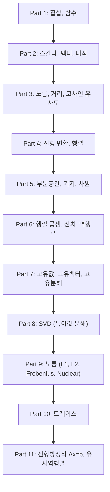
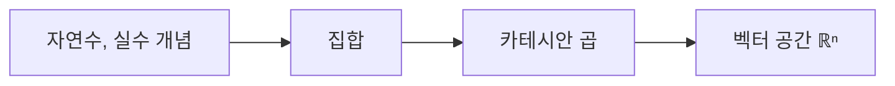
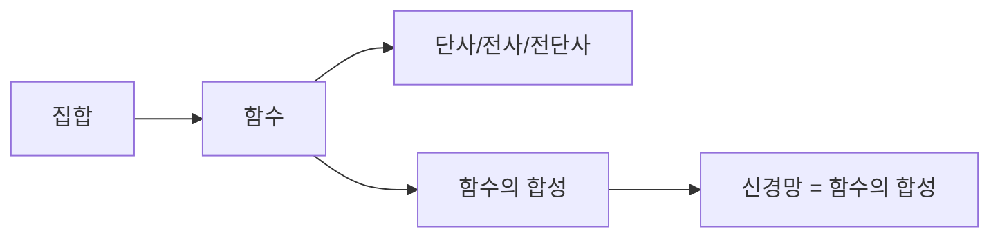
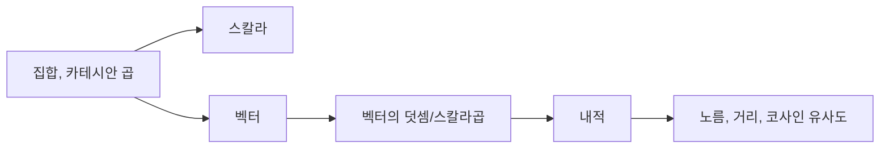
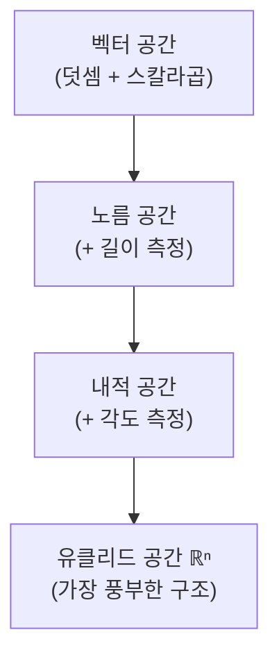
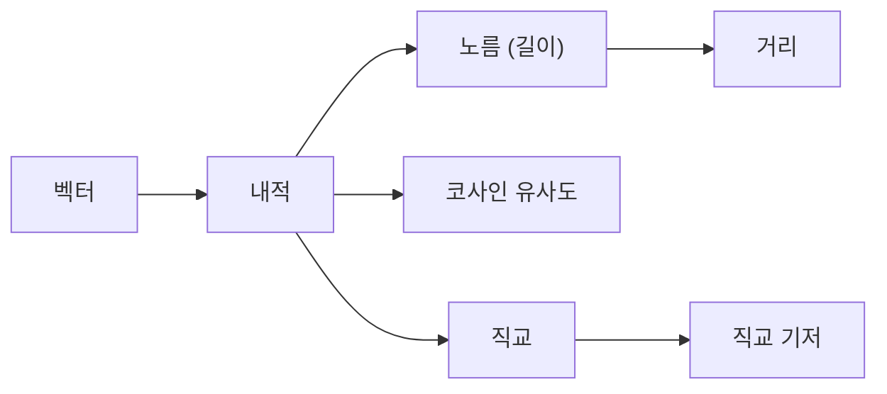
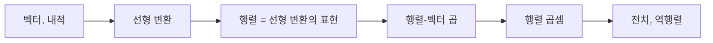
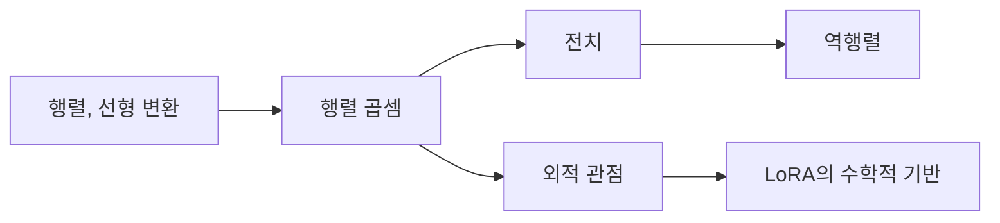
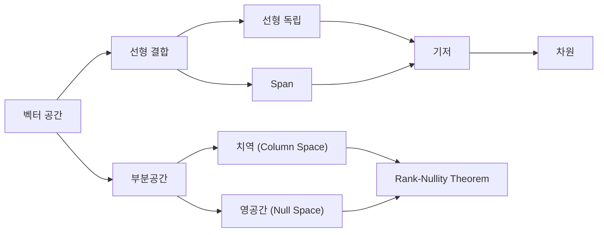

# 선형대수 완전정복: 중학생부터 대학원생까지 5단계 나선형 학습

> **이 문서의 목적**: 같은 개념을 5번 반복하되, 매번 더 깊은 수준으로 설명합니다.
> 초등학생도 이해할 수 있는 비유에서 시작하여, 논문을 읽고 쓸 수 있는 수준까지 안내합니다.

---

## 전체 학습 지도



### 5단계 학습 시스템 안내

| 단계 | 아이콘 | 대상 | 설명 방식 |
|------|--------|------|----------|
| ① 초등 | 🌱 | 개념 입문 | 일상 사물과 스토리 비유, 수식 없음 |
| ② 중등 | 🌿 | 직관적 이해 | 간단한 수식, 시각적 예시 포함 |
| ③ 고등 | 🌳 | 원리 파악 | 수학적 표현, 그래프, 증명 입문 |
| ④ 대학 | 🔬 | 구조적 이해 | 선형대수 기반 공식 전개 + Python 코드 |
| ⑤ 대학원 | 🎓 | 완전한 마스터 | 논문 수준, 한계/확장/변형 + 딥러닝 연결 |

---

# Part 1: 집합과 카테시안 곱

## 동기부여

> "이걸 배우면 AI가 데이터를 어떻게 '수학의 언어'로 표현하는지 알 수 있어!"

ChatGPT에게 "고양이 사진"을 보여주면, AI는 그 사진을 숫자들의 모음으로 바꿉니다. 이 "숫자들의 모음"을 정확하게 다루려면, 먼저 **집합**이라는 개념이 필요합니다.

## 선행 개념 맵



---

### ① 초등 단계: 일상 비유

**집합이란?**

장난감 상자를 생각해 보세요. 상자 안에 공룡, 로봇, 자동차가 들어있어요. 이 상자가 바로 **집합**이에요.

- 상자 안에 같은 공룡을 두 개 넣어도, "공룡이 있다"고만 세요 (중복 무시)
- 공룡을 먼저 넣든 로봇을 먼저 넣든, 같은 상자예요 (순서 없음)

**카테시안 곱이란?**

아이스크림 가게에서 콘을 고르고, 맛을 골라요.
- 콘: {와플콘, 컵}
- 맛: {초코, 바닐라, 딸기}

가능한 조합은? 와플콘+초코, 와플콘+바닐라, 와플콘+딸기, 컵+초코, 컵+바닐라, 컵+딸기 = **6가지**!

이렇게 두 상자에서 하나씩 골라 짝짓는 **모든 조합**이 카테시안 곱이에요.

---

### ② 중등 단계: 직관적 이해

**집합의 표기법**

집합은 중괄호 `{ }`로 씁니다:

$$A = \{1, 2, 3\}$$

- $1 \in A$: "1은 A에 속한다" (참)
- $5 \in A$: "5는 A에 속한다" (거짓)
- $|A| = 3$: "A의 원소 개수는 3"

**카테시안 곱의 수식**

$$A \times B = \{(a, b) : a \in A, b \in B\}$$

> 이 수식이 말하는 것은 단순히 "A에서 하나, B에서 하나 골라 순서쌍을 만드는 모든 경우"입니다.

예시: $A = \{1, 2\}$, $B = \{x, y\}$

$$A \times B = \{(1,x), (1,y), (2,x), (2,y)\}$$

원소 개수: $|A \times B| = |A| \times |B| = 2 \times 2 = 4$

**주의**: $(1, x)$와 $(x, 1)$은 다릅니다! 순서가 중요해요.

---

### ③ 고등 단계: 원리 파악

**n-중 카테시안 곱**

실수 집합 $\mathbb{R}$을 $n$번 곱하면:

$$\mathbb{R}^n = \underbrace{\mathbb{R} \times \mathbb{R} \times \cdots \times \mathbb{R}}_{n\text{번}}$$

> 이 수식이 말하는 것은 단순히 "실수 $n$개를 순서대로 나열한 것의 모든 가능한 경우"입니다.

예시:
- $\mathbb{R}^2$: 2차원 평면의 모든 점 $(x, y)$
- $\mathbb{R}^3$: 3차원 공간의 모든 점 $(x, y, z)$
- $\mathbb{R}^{768}$: ChatGPT가 단어를 표현하는 768차원 공간의 모든 점

**집합의 핵심 성질 정리**

| 성질 | 설명 | 예시 |
|------|------|------|
| 순서 없음 | $\{1,2,3\} = \{3,1,2\}$ | 상자 안 물건의 순서는 의미 없음 |
| 중복 없음 | $\{1,1,2\} = \{1,2\}$ | 같은 원소 두 번 넣어도 하나 |
| 카테시안 곱은 순서 있음 | $(a,b) \neq (b,a)$ (일반적) | 콘+맛 ≠ 맛+콘 |

---

### ④ 대학 단계: 구조적 이해

**집합은 왜 딥러닝에서 중요한가?**

딥러닝의 모든 데이터는 집합의 카테시안 곱으로 정의된 공간에 살고 있습니다.

- 입력 공간: $\mathcal{X} = \mathbb{R}^n$ (예: 이미지 픽셀값)
- 출력 공간: $\mathcal{Y} = \{0, 1, \ldots, C-1\}$ (예: 분류 레이블)
- 데이터셋: $\mathcal{D} = \{(x_i, y_i)\}_{i=1}^N \subset \mathcal{X} \times \mathcal{Y}$

```python
import numpy as np

# 집합의 카테시안 곱을 NumPy로 표현
# R^3: 3차원 실수 공간의 한 점
point = np.array([1.0, 2.0, 3.0])  # R x R x R 의 원소

# 카테시안 곱 생성
A = [1, 2]
B = ['x', 'y', 'z']
cartesian_product = [(a, b) for a in A for b in B]
print(cartesian_product)
# [(1, 'x'), (1, 'y'), (1, 'z'), (2, 'x'), (2, 'y'), (2, 'z')]
print(f"|A x B| = {len(A)} x {len(B)} = {len(cartesian_product)}")
```

---

### ⑤ 대학원 단계: 완전한 마스터

**측도론적 관점과 딥러닝**

엄밀히, 학습 데이터는 확률 공간 $(\Omega, \mathcal{F}, P)$ 위의 확률변수 $(X, Y): \Omega \to \mathcal{X} \times \mathcal{Y}$의 실현값이다. 결합 분포 $P_{X,Y}$가 $\mathcal{X} \times \mathcal{Y}$의 적절한 $\sigma$-대수 위에서 정의될 때, 학습의 목표는 조건부 분포 $P_{Y|X}$를 근사하는 것이다.

**한계**: 집합론 자체는 구조가 빈약하다. 거리, 각도, 크기 등의 개념을 추가해야 비로소 "유사한 데이터"를 정의할 수 있으며, 이것이 벡터 공간, 내적 공간으로의 확장 동기다.

**딥러닝 연결**: 현대 딥러닝에서 집합을 직접 다루는 모델도 있다 -- DeepSets, Set Transformer는 순서 불변(permutation invariant)한 함수를 학습하여, 집합의 "순서 없음" 성질을 모델 구조에 반영한다.

---

### 오개념 경고

| 이렇게 이해하면 틀립니다 | 이렇게 이해해야 합니다 |
|--------------------------|------------------------|
| "집합에는 순서가 있다" | 집합은 순서가 없다. 순서가 필요하면 벡터(순서 튜플)를 써야 한다 |
| "카테시안 곱 = 단순히 곱하기" | 카테시안 곱은 모든 순서쌍의 집합. 원소 개수만 곱해지는 것이다 |
| "$\mathbb{R}^n$은 그냥 숫자 $n$개" | $\mathbb{R}^n$은 실수의 $n$-중 카테시안 곱으로 정의된 집합이다 |

### 설명하기 훈련

> **문제**: 지금 배운 "집합"과 "카테시안 곱"을 초등학생에게 설명한다면?

**모범 답안**: "집합은 장난감 상자야. 같은 장난감을 두 개 넣어도 하나로 쳐. 카테시안 곱은 아이스크림 가게에서 콘이랑 맛을 고르는 모든 조합을 만드는 거야. 콘 2종류, 맛 3종류면 2 x 3 = 6가지 조합이 나와!"

### 수학 → 딥러닝 연결

| 수학 개념 | 딥러닝에서의 역할 |
|-----------|-------------------|
| 집합 | 데이터가 속하는 공간을 정의 |
| 카테시안 곱 | 고차원 입력 공간 $\mathbb{R}^n$을 구성 |
| $\mathcal{X} \times \mathcal{Y}$ | 학습 데이터셋의 입력-출력 쌍을 정의 |

### 핵심 킬러 요약

- **한 줄 결론**: 집합은 중복 없는 모음, 카테시안 곱은 모든 조합을 만드는 연산이다.
- **쉬운 설명**: 아이스크림 콘 + 맛의 모든 조합표.
- **남에게 설명하는 한 문장**: "AI의 입력 공간 $\mathbb{R}^n$은 실수를 $n$번 카테시안 곱한 것이고, 데이터는 그 공간의 한 점이다."

### 성취 확인

> 당신은 이제 집합이 왜 순서가 없는지, 카테시안 곱이 어떻게 고차원 공간을 만드는지, 그리고 $\mathbb{R}^n$이라는 표기가 정확히 무엇을 뜻하는지 설명할 수 있습니다.

---

# Part 2: 함수

## 동기부여

> "이걸 배우면 신경망이 왜 '함수의 합성'인지, 그리고 딥러닝이 결국 '좋은 함수 찾기'라는 것을 이해할 수 있어!"

ChatGPT는 결국 하나의 거대한 함수입니다. 텍스트를 넣으면 텍스트가 나오죠. 이 "입력→출력" 관계를 수학적으로 정확하게 다루는 것이 함수입니다.

## 선행 개념 맵



---

### ① 초등 단계: 일상 비유

**함수란?**

자판기를 생각해 보세요:
- 100원을 넣으면 → 사탕이 나와요
- 500원을 넣으면 → 음료가 나와요
- 같은 100원을 넣으면 **항상** 같은 사탕이 나와요 (랜덤이 아님!)
- 한 번에 사탕과 음료가 동시에 나오지 않아요 (결과는 딱 하나!)

이것이 함수의 규칙이에요: **하나의 입력에 딱 하나의 출력**.

**함수의 합성이란?**

번역기 두 개를 연결해 볼까요?
1. 한국어 → 영어 번역기
2. 영어 → 일본어 번역기

두 개를 연결하면? **한국어 → 일본어 번역기**가 되죠!

신경망도 마찬가지예요. 작은 함수(레이어)를 여러 개 연결해서 복잡한 함수를 만들어요.

---

### ② 중등 단계: 직관적 이해

**함수의 수학적 표기**

$$f : A \to B$$

> 이 표기가 말하는 것은 단순히 "함수 $f$는 집합 $A$에서 원소를 받아서 집합 $B$의 원소를 내놓는다"입니다.

- $A$: **정의역**(domain) -- 입력이 될 수 있는 모든 것의 집합
- $B$: **공역**(codomain) -- 출력이 속하는 집합
- $f(a)$: 입력 $a$에 대한 출력

예시: $f(x) = 2x + 1$이면
- $f(3) = 7$
- $f(-1) = -1$

**단사 함수 (일대일 함수)**

> 이 개념이 말하는 것은 단순히 "서로 다른 입력은 반드시 서로 다른 출력을 낳는다"입니다.

- 단사: $a \neq b$이면 $f(a) \neq f(b)$
- 비단사 예시: $f(x) = x^2$에서 $f(2) = f(-2) = 4$ → 다른 입력이 같은 출력!

**지시 함수**

$$\mathbf{1}(\text{조건}) = \begin{cases} 1 & \text{조건이 참} \\ 0 & \text{조건이 거짓} \end{cases}$$

예시: $\mathbf{1}(3 > 2) = 1$, $\mathbf{1}(1 > 5) = 0$

---

### ③ 고등 단계: 원리 파악

**함수의 합성**

두 함수 $f: A \to B$, $g: B \to C$가 있을 때:

$$(g \circ f)(x) = g(f(x))$$

> 이 수식이 말하는 것은 단순히 "$f$를 먼저 적용하고, 그 결과에 $g$를 적용한다"입니다.

**주의**: $g \circ f$에서 **오른쪽($f$)부터** 실행됩니다!

예시: $f(x) = 2x$, $g(x) = x + 3$이면
- $(g \circ f)(4) = g(f(4)) = g(8) = 11$
- $(f \circ g)(4) = f(g(4)) = f(7) = 14$

$g \circ f \neq f \circ g$: 합성 순서가 중요합니다!

**신경망은 함수의 합성이다**

$L$개 레이어를 가진 신경망:

$$f_\theta = f_L \circ f_{L-1} \circ \cdots \circ f_2 \circ f_1$$

각 레이어 $f_\ell$은 입력을 받아 출력을 내는 함수입니다.

---

### ④ 대학 단계: 구조적 이해

**신경망의 각 레이어를 함수로 보기**

$$f_\ell(x) = \sigma(W_\ell x + b_\ell)$$

- $W_\ell$: 가중치 행렬 (학습 대상)
- $b_\ell$: 편향 벡터 (학습 대상)
- $\sigma$: 활성화 함수 (ReLU, Sigmoid 등)
- $W_\ell x + b_\ell$: 아핀 변환 (선형 + 이동)
- $\sigma(\cdot)$: 비선형 변환

```python
import numpy as np

# 함수의 합성으로서의 신경망
def layer(x, W, b, activation=lambda z: np.maximum(0, z)):
    """하나의 레이어 = 아핀 변환 + 비선형 활성화"""
    return activation(W @ x + b)

# 2층 신경망 = 두 함수의 합성
np.random.seed(42)
x = np.array([1.0, 2.0, 3.0])  # 입력 (R^3)

W1 = np.random.randn(4, 3)  # 첫 번째 레이어: R^3 -> R^4
b1 = np.zeros(4)
h = layer(x, W1, b1)  # f1(x)

W2 = np.random.randn(2, 4)  # 두 번째 레이어: R^4 -> R^2
b2 = np.zeros(2)
y = layer(h, W2, b2)  # f2(f1(x))

print(f"입력: {x.shape} -> 은닉: {h.shape} -> 출력: {y.shape}")
# 입력: (3,) -> 은닉: (4,) -> 출력: (2,)
```

**Universal Approximation Theorem (맛보기)**

충분히 넓은(뉴런이 많은) 은닉층 하나만 있으면, 임의의 연속 함수를 원하는 정밀도로 근사할 수 있다.

→ 신경망의 표현력은 **함수 합성**의 힘에서 나온다.

---

### ⑤ 대학원 단계: 완전한 마스터

**함수 공간 관점**

딥러닝의 학습은 함수 공간 $\mathcal{F} = \{f_\theta : \theta \in \Theta\}$ 위에서의 최적화이다:

$$\theta^* = \arg\min_{\theta \in \Theta} \mathbb{E}_{(x,y) \sim P_{\text{data}}} [\ell(f_\theta(x), y)]$$

- $\mathcal{F}$의 풍부함(expressiveness)은 **근사 오차**(approximation error)를 줄인다
- $\mathcal{F}$가 너무 풍부하면 **추정 오차**(estimation error)가 커진다 → 편향-분산 트레이드오프

**합성의 깊이 vs 너비**

- 깊이(depth)의 이점: 어떤 함수 클래스는 깊은 네트워크로는 다항식 크기로 표현 가능하지만, 얕은 네트워크로는 지수적 크기가 필요하다 (depth separation theorems)
- 이것이 "deep" learning의 수학적 정당성이다

**한계와 열린 문제**
- UAT는 존재성만 보장하며, 학습 가능성(learnability)은 보장하지 않는다
- SGD가 왜 좋은 함수를 찾는지는 여전히 이론적으로 완전히 해명되지 않았다 (implicit bias of SGD)

---

### 오개념 경고

| 이렇게 이해하면 틀립니다 | 이렇게 이해해야 합니다 |
|--------------------------|------------------------|
| "함수는 수식이다" | 함수는 매핑 규칙이다. 표, 그래프, 학습된 가중치 모두 함수를 정의한다 |
| "신경망은 수식으로 쓸 수 있다" | 이론적으로 가능하지만, 실제로는 수십억 개의 파라미터로 정의된 암묵적 함수이다 |
| "$f \circ g$에서 $f$를 먼저 적용한다" | $g$를 먼저 적용하고, 그 결과에 $f$를 적용한다 (오른쪽부터!) |

### 설명하기 훈련

> **문제**: "함수의 합성"을 초등학생에게 설명한다면?

**모범 답안**: "번역기를 연결하는 거야! 한국어→영어 번역기, 영어→일본어 번역기를 이어붙이면 한국어→일본어 번역기가 돼. AI도 이렇게 작은 변환기들을 줄줄이 연결해서 복잡한 일을 하는 거야!"

### 수학 → 딥러닝 연결

| 수학 개념 | 딥러닝에서의 역할 |
|-----------|-------------------|
| 함수 $f: A \to B$ | 신경망의 각 레이어 |
| 함수의 합성 $g \circ f$ | 레이어의 순차적 연결 (순전파) |
| 단사 함수 | 정보 보존 (가역 네트워크, normalizing flows) |
| 지시 함수 | ReLU: $\max(0, x) = x \cdot \mathbf{1}(x > 0)$ |

### 핵심 킬러 요약

- **한 줄 결론**: 함수는 입력을 출력으로 바꾸는 규칙이고, 신경망은 이런 함수들의 합성이다.
- **쉬운 설명**: 번역기 여러 대를 연결하는 것.
- **남에게 설명하는 한 문장**: "딥러닝은 작은 함수(레이어)를 깊게 합성하여, 데이터에서 원하는 출력으로의 복잡한 매핑을 학습하는 것이다."

### 성취 확인

> 당신은 이제 함수의 정의역/공역/합성이 무엇인지, 신경망이 왜 "함수의 합성"인지, 그리고 각 레이어가 수학적으로 어떤 함수인지 설명할 수 있습니다.

---

# Part 3: 스칼라와 벡터

## 동기부여

> "이걸 배우면 ChatGPT가 단어를 어떻게 숫자로 바꾸는지, 그리고 '왕 - 남자 + 여자 = 여왕'이라는 마법 같은 계산이 왜 가능한지 알 수 있어!"

## 선행 개념 맵



---

### ① 초등 단계: 일상 비유

**스칼라란?**

온도계에 적힌 "25도" -- 이것은 크기만 있고 방향이 없는 하나의 숫자예요. 이런 숫자를 **스칼라**라고 해요.

**벡터란?**

케이크 레시피를 생각해 보세요:
- 밀가루 200g, 설탕 100g, 달걀 3개 → [200, 100, 3]

이 **숫자들의 순서 있는 목록**이 벡터예요!

- 두 레시피가 비슷한지 비교할 수 있어요 (→ 내적)
- 레시피를 2배로 만들 수 있어요 (→ 스칼라 곱)
- 두 레시피를 합칠 수 있어요 (→ 벡터 덧셈)

ChatGPT는 모든 단어를 이런 숫자 목록(벡터)으로 바꿔서 의미를 비교해요!

---

### ② 중등 단계: 직관적 이해

**벡터의 표기법**

$$v = \begin{bmatrix} v_1 \\ v_2 \\ \vdots \\ v_n \end{bmatrix} \in \mathbb{R}^n$$

> 이 표기가 말하는 것은 단순히 "$n$개의 실수를 세로로 나열한 것"입니다.

예시: $v = \begin{bmatrix} 1 \\ 2 \\ 3 \end{bmatrix}$은 3차원 벡터

**벡터 연산**

| 연산 | 정의 | 예시 |
|------|------|------|
| 덧셈 | 같은 위치끼리 더하기 | $[1,2] + [3,4] = [4,6]$ |
| 스칼라곱 | 모든 원소에 같은 수 곱하기 | $3 \times [1,2] = [3,6]$ |
| 선형 결합 | 스칼라곱 + 덧셈 | $2[1,0] + 3[0,1] = [2,3]$ |

**시각적 이해 (2차원)**

$$[3, 2] = 3 \times [1, 0] + 2 \times [0, 1]$$

x축 방향으로 3, y축 방향으로 2 이동한 점!

---

### ③ 고등 단계: 원리 파악

**벡터 공간의 공리**

벡터 공간 $V$는 다음을 만족하는 집합이다:

1. **덧셈 닫힘**: $u, v \in V$이면 $u + v \in V$
2. **스칼라곱 닫힘**: $c \in \mathbb{R}$, $v \in V$이면 $cv \in V$
3. **영벡터 존재**: $\mathbf{0} \in V$
4. **교환법칙**: $u + v = v + u$
5. **결합법칙**: $(u + v) + w = u + (v + w)$
6. **분배법칙**: $c(u + v) = cu + cv$

> "벡터"는 화살표가 아니라, **이 규칙을 만족하는 모든 대상**이다.

예시:
- $\mathbb{R}^n$의 원소 → 벡터
- 다항식 $p(x) = a_0 + a_1 x + a_2 x^2$ → 벡터 (더하기, 상수곱 가능)
- 함수 $f: [0,1] \to \mathbb{R}$ → 벡터 (더하기, 상수곱 가능)

**텐서: 벡터의 일반화**

| 차수(rank) | 이름 | 예시 | PyTorch shape |
|------------|------|------|---------------|
| 0 | 스칼라 | 손실값 | `torch.tensor(3.14)` |
| 1 | 벡터 | 단어 임베딩 | `(768,)` |
| 2 | 행렬 | 가중치 | `(512, 768)` |
| 3 | 3차 텐서 | 이미지 (C,H,W) | `(3, 224, 224)` |
| 4 | 4차 텐서 | 배치 이미지 | `(32, 3, 224, 224)` |

---

### ④ 대학 단계: 구조적 이해

**단어 임베딩: 벡터의 실제 활용**

```python
import numpy as np

# 단어를 벡터로 표현 (가상의 임베딩)
king   = np.array([0.9, 0.8, 0.1, 0.2])
queen  = np.array([0.9, 0.8, 0.9, 0.2])
man    = np.array([0.5, 0.6, 0.1, 0.8])
woman  = np.array([0.5, 0.6, 0.9, 0.8])

# 벡터 연산으로 유추
# "왕 - 남자 + 여자 = ?"
result = king - man + woman
print(f"king - man + woman = {result}")
print(f"queen               = {queen}")
print(f"차이: {np.linalg.norm(result - queen):.4f}")
# 결과가 queen에 매우 가까움!
```

**벡터 공간의 계층 구조**



내적이 정의되면 → 노름(길이)이 유도되고 → 거리가 유도됩니다.

---

### ⑤ 대학원 단계: 완전한 마스터

**추상 벡터 공간과 딥러닝**

현대 딥러닝에서 "벡터"는 $\mathbb{R}^n$에 국한되지 않는다:

- **함수 공간**: 가중치 $\theta$를 벡터로 보면, 파라미터 공간 $\Theta \subseteq \mathbb{R}^d$ (d=수십억)에서의 최적화
- **Hilbert 공간**: Kernel method에서 무한차원 특징 공간 $\mathcal{H}$
- **Riemannian 다양체**: 곡률이 있는 공간에서의 임베딩 (Hyperbolic embeddings)

**Transformer에서의 벡터**

각 토큰은 $d_{\text{model}}$-차원 벡터로 표현되며, attention은 이 벡터들 간의 상호작용을 계산한다. 잔차 연결(residual connection)은 벡터 덧셈 $x + f(x)$으로, 벡터 공간의 덧셈 구조를 직접 활용한다.

---

### 오개념 경고

| 이렇게 이해하면 틀립니다 | 이렇게 이해해야 합니다 |
|--------------------------|------------------------|
| "벡터는 화살표다" | 화살표는 $\mathbb{R}^2, \mathbb{R}^3$에서의 시각화일 뿐. 768차원 임베딩도 벡터 |
| "벡터의 차원 = 화살표의 방향 수" | 차원 = 원소의 개수 = 독립적인 좌표축의 수 |
| "스칼라와 1차원 벡터는 같다" | 스칼라 $c \in \mathbb{R}$와 벡터 $[c] \in \mathbb{R}^1$은 다른 수학적 대상 |

### 설명하기 훈련

> **문제**: "벡터"를 초등학생에게 설명한다면?

**모범 답안**: "벡터는 숫자들의 줄 세우기야! 케이크 레시피가 [밀가루 200g, 설탕 100g, 달걀 3개]인 것처럼, 순서가 중요한 숫자 목록이야. AI는 모든 단어를 이런 숫자 목록으로 바꿔서 비슷한 단어를 찾아!"

### 수학 → 딥러닝 연결

| 수학 개념 | 딥러닝에서의 역할 |
|-----------|-------------------|
| 스칼라 | 학습률, 손실값, 온도(temperature) |
| 벡터 | 단어 임베딩, 특징 벡터, 은닉 상태 |
| 벡터 덧셈 | 잔차 연결 (ResNet, Transformer) |
| 스칼라곱 | 학습률 × 그래디언트 |
| 텐서 | 이미지 배치, attention 가중치 |

### 핵심 킬러 요약

- **한 줄 결론**: 스칼라는 크기만 있는 숫자, 벡터는 순서 있는 숫자 목록이며, 딥러닝의 모든 데이터와 파라미터는 벡터(텐서)로 표현된다.
- **쉬운 설명**: 레시피의 재료 목록.
- **남에게 설명하는 한 문장**: "AI는 세상의 모든 것을 벡터(숫자 목록)로 바꾸고, 벡터 연산으로 의미를 다룬다."

### 성취 확인

> 당신은 이제 스칼라/벡터/텐서의 차이, 벡터 공간의 규칙, 그리고 단어 임베딩이 왜 벡터인지 설명할 수 있습니다.

---

# Part 4: 내적, 노름, 거리, 코사인 유사도

## 동기부여

> "이걸 배우면 ChatGPT가 어떻게 '비슷한 단어'를 찾는지, 그리고 Attention 메커니즘의 핵심 계산이 무엇인지 알 수 있어!"

## 선행 개념 맵



---

### ① 초등 단계: 일상 비유

**내적이란?**

두 친구가 얼마나 "같은 방향을 보고 있는지" 점수를 매기는 거예요.

- 두 친구가 같은 방향을 보면 → 점수가 높아요 (양수)
- 완전 반대 방향을 보면 → 점수가 낮아요 (음수)
- 직각으로 서있으면 → 점수가 0이에요

**노름이란?**

집에서 학교까지의 거리. 벡터의 "길이"예요.

**코사인 유사도란?**

두 화살표 사이의 각도만 봐요. 화살표가 길든 짧든, 같은 방향이면 유사도가 1, 반대 방향이면 -1이에요.

---

### ② 중등 단계: 직관적 이해

**내적의 계산**

$$\langle v, w \rangle = v_1 w_1 + v_2 w_2 + \cdots + v_n w_n$$

> 이 수식이 말하는 것은 단순히 "같은 위치의 숫자끼리 곱해서 전부 더한 것"입니다.

예시: $v = [1, 2, 3]$, $w = [4, 5, 6]$

$$\langle v, w \rangle = 1 \times 4 + 2 \times 5 + 3 \times 6 = 4 + 10 + 18 = 32$$

**노름의 계산**

$$\|v\| = \sqrt{v_1^2 + v_2^2 + \cdots + v_n^2}$$

> 이 수식이 말하는 것은 단순히 "각 숫자를 제곱해서 더한 뒤 제곱근을 취한 것"입니다.

예시: $v = [3, 4]$

$$\|v\| = \sqrt{9 + 16} = \sqrt{25} = 5$$

(피타고라스 정리와 같습니다!)

**거리의 계산**

$$d(v, w) = \|v - w\| = \sqrt{(v_1-w_1)^2 + (v_2-w_2)^2 + \cdots}$$

**코사인 유사도**

$$\cos\theta = \frac{\langle v, w \rangle}{\|v\| \cdot \|w\|}$$

> 이 수식이 말하는 것은 단순히 "내적을 각 벡터의 길이로 나눠서 -1과 1 사이로 정규화한 것"입니다.

---

### ③ 고등 단계: 원리 파악

**내적의 3가지 성질 (공리)**

1. **대칭**: $\langle v, w \rangle = \langle w, v \rangle$
2. **선형**: $\langle av + bu, w \rangle = a\langle v, w \rangle + b\langle u, w \rangle$
3. **양정치**: $\langle v, v \rangle \geq 0$이고, $\langle v, v \rangle = 0 \iff v = \mathbf{0}$

이 세 조건을 만족하면 **내적 공간**이 됩니다.

**내적 → 노름 → 거리 유도**

$$\|v\| := \sqrt{\langle v, v \rangle} \quad \Longrightarrow \quad d(v,w) := \|v - w\|$$

**거리-내적 관계** (매우 중요!)

$$\|v - w\|^2 = \|v\|^2 + \|w\|^2 - 2\langle v, w \rangle$$

> 이 수식이 말하는 것은 단순히 "내적이 클수록 (유사할수록) 거리가 줄어든다"입니다.

**직교의 의미**

$\langle v, w \rangle = 0$이면 $v \perp w$ (직교)

직교 = "서로 완전히 독립적인 방향"

---

### ④ 대학 단계: 구조적 이해

```python
import numpy as np

# 내적, 노름, 거리, 코사인 유사도
v = np.array([1.0, 2.0, 3.0])
w = np.array([4.0, 5.0, 6.0])

# 내적
dot = np.dot(v, w)  # = v @ w
print(f"내적: {dot}")  # 32.0

# 노름
norm_v = np.linalg.norm(v)
print(f"||v|| = {norm_v:.4f}")  # 3.7417

# 거리
dist = np.linalg.norm(v - w)
print(f"d(v,w) = {dist:.4f}")  # 5.1962

# 코사인 유사도
cos_sim = dot / (norm_v * np.linalg.norm(w))
print(f"cos similarity = {cos_sim:.4f}")  # 0.9746

# 거리-내적 관계 검증
lhs = np.linalg.norm(v - w) ** 2
rhs = norm_v**2 + np.linalg.norm(w)**2 - 2 * dot
print(f"||v-w||^2 = {lhs:.4f}, ||v||^2 + ||w||^2 - 2<v,w> = {rhs:.4f}")
# 동일!

# 직교 확인
a = np.array([1.0, 0.0])
b = np.array([0.0, 1.0])
print(f"<a,b> = {np.dot(a, b)}")  # 0.0 -> 직교!
```

**Attention 메커니즘의 핵심: 내적**

Transformer의 Attention Score:

$$\text{score}(q, k) = \frac{q^\top k}{\sqrt{d_k}}$$

- $q$: Query 벡터 ("나는 무엇을 찾고 있는가")
- $k$: Key 벡터 ("나는 어떤 정보를 가지고 있는가")
- 내적 = 유사도 → 높을수록 더 많은 attention을 준다
- $\sqrt{d_k}$로 나누는 이유: 차원이 커지면 내적값이 커져서 softmax가 극단적이 됨

---

### ⑤ 대학원 단계: 완전한 마스터

**내적의 일반화: Kernel Methods**

내적을 일반화한 것이 커널 함수 $k(x, x') = \langle \phi(x), \phi(x') \rangle_\mathcal{H}$이다. 명시적으로 고차원 매핑 $\phi$를 계산하지 않고도 내적을 계산할 수 있다 (kernel trick).

**Contrastive Learning의 수학적 기반**

$$\mathcal{L} = -\log \frac{\exp(\text{sim}(z_i, z_j)/\tau)}{\sum_{k=1}^{2N} \mathbf{1}_{k \neq i} \exp(\text{sim}(z_i, z_k)/\tau)}$$

여기서 $\text{sim}(u, v) = \frac{u^\top v}{\|u\| \|v\|}$ (코사인 유사도)

거리-내적 관계 $\|u-v\|^2 = \|u\|^2 + \|v\|^2 - 2u^\top v$가 핵심: 정규화된 벡터에서 거리 최소화 = 내적 최대화

**한계**: 내적 기반 유사도는 차원의 저주에 취약하다. 고차원에서 모든 벡터 쌍의 코사인 유사도가 0에 수렴하는 경향이 있다 (concentration of measure).

---

### 오개념 경고

| 이렇게 이해하면 틀립니다 | 이렇게 이해해야 합니다 |
|--------------------------|------------------------|
| "내적은 벡터끼리 곱하는 것" | 내적은 두 벡터의 유사도를 하나의 숫자(스칼라)로 요약하는 연산 |
| "노름 = 절대값" | 절대값은 1차원의 노름. 고차원에서는 피타고라스 정리의 일반화 |
| "거리가 가까우면 코사인 유사도도 높다" | 거리는 크기(노름)에 영향 받지만, 코사인 유사도는 방향만 봄 |
| "내적이 0이면 관련 없다" | 내적이 0(직교)은 "선형적으로 독립"이라는 뜻. 비선형 관계는 있을 수 있음 |

### 설명하기 훈련

> **문제**: "내적"을 초등학생에게 설명한다면?

**모범 답안**: "두 친구가 시험을 봤는데, 과목마다 점수가 있어. 국어 80점, 수학 90점 이런 식으로. 내적은 같은 과목의 점수끼리 곱해서 전부 더하는 거야. 점수 패턴이 비슷한 친구끼리는 이 값이 커지고, 완전 다른 친구는 이 값이 작아져. AI는 이걸로 비슷한 단어를 찾아!"

### 수학 → 딥러닝 연결

| 수학 개념 | 딥러닝에서의 역할 |
|-----------|-------------------|
| 내적 $\langle q, k \rangle$ | Attention의 유사도 계산 |
| 노름 $\|v\|$ | 정규화, gradient norm clipping |
| 거리 $\|v-w\|$ | MSE 손실, contrastive loss |
| 코사인 유사도 | 임베딩 유사도, 검색 |
| 직교 | 독립적인 특징, decorrelation |

### 핵심 킬러 요약

- **한 줄 결론**: 내적은 "같은 방향인 정도"를 숫자로, 노름은 "크기"를, 코사인 유사도는 "방향만의 유사성"을 측정한다.
- **쉬운 설명**: 두 사람이 같은 방향을 보고 있는지 점수 매기기.
- **남에게 설명하는 한 문장**: "Attention은 Query와 Key의 내적으로 '누구에게 집중할지' 결정하며, 이것이 Transformer의 핵심이다."

### 성취 확인

> 당신은 이제 내적이 왜 유사도 측정인지, 노름-거리-내적의 관계, 그리고 Attention score가 왜 내적 기반인지 설명할 수 있습니다.

---

# Part 5: 선형 변환과 행렬

## 동기부여

> "이걸 배우면 `nn.Linear`가 실제로 무슨 계산을 하는지, 그리고 왜 AI의 '학습'이 결국 '좋은 행렬 찾기'인지 이해할 수 있어!"

## 선행 개념 맵



---

### ① 초등 단계: 일상 비유

**선형 변환이란?**

"공정한 복사기"를 상상해 보세요:
- 원본을 2배로 확대하면, 모든 부분이 2배가 돼요
- 두 장의 그림을 겹쳐서 복사하면, 각각 복사한 것을 겹친 것과 같아요

이 "공정성"이 바로 선형 변환이에요!

**행렬이란?**

레고 조립 설명서 같은 거예요. 기본 블록(기저 벡터)이 어떻게 변하는지 적어놓은 "변환 규칙표"예요. 이 표만 있으면 어떤 블록 조합이든 변환 결과를 알 수 있어요.

---

### ② 중등 단계: 직관적 이해

**선형 변환의 두 가지 규칙**

함수 $L$이 선형이란 것은:

1. $L(v + u) = L(v) + L(u)$ → "합쳐서 변환 = 각각 변환 후 합치기"
2. $L(cv) = cL(v)$ → "2배 한 것을 변환 = 변환한 것을 2배"

> 이 규칙이 말하는 것은 단순히 "변환이 공정하다"는 뜻입니다. 벡터를 크게 만든 뒤 변환해도, 변환한 뒤 크게 만들어도 결과가 같아요.

**행렬-벡터 곱 = 여러 가게의 장바구니 계산**

사과 3개, 바나나 2개를 샀는데, 가게마다 가격이 달라요:

$$\begin{bmatrix} 100 & 200 \\ 150 & 180 \end{bmatrix} \begin{bmatrix} 3 \\ 2 \end{bmatrix} = \begin{bmatrix} 100 \times 3 + 200 \times 2 \\ 150 \times 3 + 180 \times 2 \end{bmatrix} = \begin{bmatrix} 700 \\ 810 \end{bmatrix}$$

A가게: 700원, B가게: 810원!

---

### ③ 고등 단계: 원리 파악

**선형 변환의 엄밀한 정의**

$L : \mathbb{R}^n \to \mathbb{R}^m$이 선형:

$$L(\alpha v + \beta u) = \alpha L(v) + \beta L(u) \quad \forall \alpha, \beta \in \mathbb{R}, \; \forall v, u \in \mathbb{R}^n$$

**핵심 정리**: 선형 변환과 행렬은 일대일 대응한다!

$$A_L = [L(e_1) \quad L(e_2) \quad \cdots \quad L(e_n)]$$

- $e_i$: $i$번째 표준 기저 벡터 (예: $e_1 = [1,0,0]^\top$)
- $L(e_i)$: 기저 벡터의 변환 결과 = 행렬의 $i$번째 **열**

$$L(v) = L\left(\sum_{i=1}^n v_i e_i\right) = \sum_{i=1}^n v_i L(e_i) = A_L v$$

> 이 수식이 말하는 것은 단순히 "기저 벡터들이 어디로 가는지만 알면, 어떤 벡터의 변환 결과도 계산할 수 있다"입니다.

**선형 vs 아핀**

| | 선형 변환 | 아핀 변환 |
|--|----------|----------|
| 수식 | $L(v) = Wv$ | $L(v) = Wv + b$ |
| 원점 보존 | $L(\mathbf{0}) = \mathbf{0}$ | $L(\mathbf{0}) = b \neq \mathbf{0}$ |
| PyTorch | 해당 없음 | `nn.Linear` |

**주의**: `nn.Linear`는 이름과 달리 수학적으로 **아핀** 변환입니다!

---

### ④ 대학 단계: 구조적 이해

```python
import numpy as np

# 선형 변환의 행렬 표현
# 2D 회전 변환 (45도)
theta = np.pi / 4
R = np.array([
    [np.cos(theta), -np.sin(theta)],
    [np.sin(theta),  np.cos(theta)]
])

# 기저 벡터의 변환 확인
e1 = np.array([1.0, 0.0])
e2 = np.array([0.0, 1.0])
print(f"L(e1) = {R @ e1}")  # R의 1열
print(f"L(e2) = {R @ e2}")  # R의 2열

# 임의 벡터의 변환 = 열벡터의 선형 결합
v = np.array([3.0, 2.0])
# 방법 1: 직접 곱
result1 = R @ v
# 방법 2: 열 관점 (선형 결합)
result2 = v[0] * R[:, 0] + v[1] * R[:, 1]
print(f"Rv = {result1}, 3*R[:,0] + 2*R[:,1] = {result2}")
# 동일!

# nn.Linear는 아핀 변환
# y = Wx + b (W: 가중치 행렬, b: 편향)
W = np.random.randn(4, 3)  # 3차원 -> 4차원
b = np.random.randn(4)
x = np.array([1.0, 2.0, 3.0])
y = W @ x + b  # 아핀 변환
print(f"아핀 변환 결과 shape: {y.shape}")
```

**행렬-벡터 곱의 두 관점**

1. **열 관점** (가장 중요!): $Av = v_1 a_1 + v_2 a_2 + \cdots + v_n a_n$
   - $A$의 열벡터들의 선형 결합
   - 결과는 항상 $A$의 **열공간** 안에 있다

2. **행 관점**: $c_i = a_{i,:} \cdot v$ (각 행과의 내적)
   - 결과의 $i$번째 원소 = $A$의 $i$번째 행과 $v$의 내적

---

### ⑤ 대학원 단계: 완전한 마스터

**선형 변환의 범주론적 관점**

선형 변환은 벡터 공간의 **범주(category)**에서의 사상(morphism)이다. 행렬 곱 $AB$는 합성 $L_A \circ L_B$에 대응하며, 항등 행렬 $I$는 항등 사상이다.

**딥러닝에서의 의미**

- **LoRA**: 가중치 업데이트 $\Delta W = BA$ ($B \in \mathbb{R}^{d \times r}$, $A \in \mathbb{R}^{r \times d}$)로 저랭크 선형 변환만 학습
- **Attention**: $Q = XW_Q$, $K = XW_K$, $V = XW_V$는 모두 선형 변환
- **비선형의 필요성**: 선형 변환의 합성은 여전히 선형이다 ($W_2 W_1 = W_{12}$). 활성화 함수 없이는 깊게 쌓아도 하나의 선형 변환과 같으므로, 비선형이 반드시 필요하다.

---

### 오개념 경고

| 이렇게 이해하면 틀립니다 | 이렇게 이해해야 합니다 |
|--------------------------|------------------------|
| "행렬은 숫자의 사각형 배열" | 행렬의 본질은 선형 변환의 표현이다. 각 열이 기저 벡터의 변환 결과 |
| "$y = 2x + 3$은 선형 함수" | $+3$ 때문에 아핀 변환. 선형 변환은 $L(\mathbf{0}) = \mathbf{0}$ 필수 |
| "선형 변환을 여러 번 합성하면 비선형이 된다" | 선형 변환의 합성은 항상 선형. 비선형 활성화가 반드시 필요 |

### 수학 → 딥러닝 연결

| 수학 개념 | 딥러닝에서의 역할 |
|-----------|-------------------|
| 선형 변환 | 신경망 레이어의 핵심 연산 |
| 행렬 | 학습 가능한 가중치 |
| 행렬-벡터 곱 | Forward pass의 기본 연산 |
| 아핀 변환 | `nn.Linear(in, out)` = $Wx + b$ |

### 핵심 킬러 요약

- **한 줄 결론**: 선형 변환은 "공정한 변환"이며, 행렬은 이 변환의 완전한 표현이다.
- **쉬운 설명**: 기본 블록이 어떻게 변하는지 적은 설명서.
- **남에게 설명하는 한 문장**: "AI가 배우는 것은 결국 입력 벡터를 출력 벡터로 바꾸는 최적의 행렬(가중치)을 찾는 것이다."

### 성취 확인

> 당신은 이제 선형 변환과 행렬의 일대일 대응, 열 관점의 행렬-벡터 곱, 그리고 `nn.Linear`가 수학적으로 아핀 변환인 이유를 설명할 수 있습니다.

---

# Part 6: 행렬 곱셈, 전치, 역행렬

## 동기부여

> "이걸 배우면 왜 레이어 순서를 바꾸면 완전히 다른 결과가 나오는지, 그리고 LoRA가 어떻게 70B 모델을 효율적으로 fine-tuning하는지 이해할 수 있어!"

## 선행 개념 맵



---

### ① 초등 단계: 일상 비유

**행렬 곱셈 = 변환의 연결**

한국어 → 영어 번역기(A), 영어 → 일본어 번역기(B)를 연결하면?

한국어 → 일본어 번역기(BA)!

**전치 = 엑셀 시트 뒤집기**

가로줄과 세로줄을 바꾸는 것. "양말 신고 신발 신으면, 벗을 때는 신발부터"처럼, 전치도 순서가 뒤집혀요: $(AB)^\top = B^\top A^\top$

**역행렬 = 되돌리기 버튼**

변환을 원래대로 되돌리는 것. 암호화 → 복호화처럼요. 하지만 모든 변환을 되돌릴 수 있는 것은 아니에요! (정보가 사라지면 복구 불가)

---

### ② 중등 단계: 직관적 이해

**행렬 곱셈의 규칙**

$A$가 $m \times n$, $B$가 $n \times p$일 때 (안쪽 차원이 같아야!):

$$C = AB, \quad c_{ij} = \sum_{k=1}^{n} a_{ik} b_{kj}$$

> 이 수식이 말하는 것은 단순히 "$C$의 $(i,j)$ 원소 = $A$의 $i$번째 행과 $B$의 $j$번째 열의 내적"입니다.

예시:

$$\begin{bmatrix} 1 & 2 \\ 3 & 4 \end{bmatrix} \begin{bmatrix} 5 & 6 \\ 7 & 8 \end{bmatrix} = \begin{bmatrix} 19 & 22 \\ 43 & 50 \end{bmatrix}$$

**교환법칙은 성립하지 않는다**: $AB \neq BA$ (일반적)

→ 레이어 순서를 바꾸면 완전히 다른 네트워크!

**전치의 핵심 성질**

$$(AB)^\top = B^\top A^\top$$

순서가 뒤집힌다! "양말 → 신발 순서로 신으면, 벗을 때는 신발 → 양말"

---

### ③ 고등 단계: 원리 파악

**행렬 곱의 3가지 관점**

같은 곱셈 $C = AB$를 세 가지로 볼 수 있다:

| 관점 | 설명 | 딥러닝 연결 |
|------|------|-------------|
| 내적 관점 | $c_{ij} = a_{i,:} \cdot b_{:,j}$ | Attention score 계산 |
| 열 관점 | $C$의 각 열 = $A$의 열들의 선형 결합 | Feature 혼합 |
| **외적 관점** | $AB = \sum_{k=1}^{n} a_k b_k^\top$ | **LoRA의 핵심** |

외적 관점이 특히 중요하다:

$$AB = a_1 b_1^\top + a_2 b_2^\top + \cdots + a_n b_n^\top$$

각 $a_k b_k^\top$는 rank-1 행렬이다. 즉, 행렬 곱은 **rank-1 행렬들의 합**이다!

**역행렬**

$A^{-1}$이 존재하려면 ($A$가 가역):
- $AA^{-1} = A^{-1}A = I$
- $\text{rank}(A) = n$ (정사각 + 풀랭크)
- $\det(A) \neq 0$
- 모든 고유값 $\neq 0$

$(AB)^{-1} = B^{-1} A^{-1}$ — 역시 순서가 뒤집힌다!

---

### ④ 대학 단계: 구조적 이해

```python
import numpy as np

# 행렬 곱의 3가지 관점
A = np.array([[1, 2], [3, 4], [5, 6]])  # 3x2
B = np.array([[7, 8, 9], [10, 11, 12]])  # 2x3

# 1. 직접 곱
C = A @ B
print("직접 곱:\n", C)

# 2. 외적 관점: rank-1 행렬의 합
C_outer = np.outer(A[:, 0], B[0, :]) + np.outer(A[:, 1], B[1, :])
print("외적 관점:\n", C_outer)
print("동일 여부:", np.allclose(C, C_outer))

# LoRA: 저랭크 업데이트
d = 768  # 원래 차원
r = 16   # LoRA rank

# 전체 가중치 업데이트: d x d = 589,824 파라미터
# LoRA 업데이트: d x r + r x d = 24,576 파라미터 (약 24배 절약!)
B_lora = np.random.randn(d, r) * 0.01
A_lora = np.random.randn(r, d) * 0.01
delta_W = B_lora @ A_lora  # rank-r 행렬

print(f"전체 파라미터: {d*d:,}")
print(f"LoRA 파라미터: {d*r + r*d:,}")
print(f"압축률: {d*d / (d*r + r*d):.1f}x")
print(f"delta_W의 rank: {np.linalg.matrix_rank(delta_W)}")

# 전치
A = np.array([[1, 2, 3], [4, 5, 6]])
print(f"A shape: {A.shape}, A^T shape: {A.T.shape}")

# (AB)^T = B^T A^T 검증
B = np.random.randn(3, 4)
lhs = (A @ B).T
rhs = B.T @ A.T
print(f"(AB)^T == B^T A^T: {np.allclose(lhs, rhs)}")

# 대각 행렬 스케일링
D = np.diag([2.0, 3.0])
X = np.array([[1, 4], [5, 6]])
print(f"DX (행 스케일링):\n{D @ X}")   # 1행 x2, 2행 x3
print(f"XD (열 스케일링):\n{X @ D}")   # 1열 x2, 2열 x3
```

**대각 행렬 스케일링과 딥러닝**

- $DX$ (왼쪽 곱): 각 **행**에 $d_i$를 곱함 → BatchNorm의 $\gamma$ 스케일링
- $XD$ (오른쪽 곱): 각 **열**에 $d_i$를 곱함
- Adam optimizer: gradient의 대각 pre-conditioning

---

### ⑤ 대학원 단계: 완전한 마스터

**외적 관점과 LoRA의 수학**

LoRA: $W' = W_0 + \Delta W = W_0 + BA$

- $B \in \mathbb{R}^{d \times r}$, $A \in \mathbb{R}^{r \times d}$, $r \ll d$
- $\Delta W = BA = \sum_{k=1}^{r} b_k a_k^\top$ (외적 관점)
- 파라미터: $d^2 \to 2dr$ (예: $d=4096, r=16$이면 $16M \to 131K$)

이것이 가능한 이유: Aghajanyan et al. (2020)은 사전학습 모델의 가중치 업데이트가 intrinsically low-rank임을 보였다.

**시간 복잡도 분석**

| 연산 | 복잡도 | 실전 |
|------|--------|------|
| 행렬 곱 $AB$ ($n \times n$) | $O(n^3)$ | Strassen: $O(n^{2.807})$ |
| 행렬-벡터 곱 $Av$ | $O(n^2)$ | GPU 병렬화 |
| 대각 스케일링 | $O(n)$ | 매우 빠름 |

**한계**: 역행렬 $A^{-1}$의 직접 계산은 $O(n^3)$으로, 대규모 행렬에서는 비현실적. 반복법(conjugate gradient 등)이나 근사법을 사용한다.

---

### 오개념 경고

| 이렇게 이해하면 틀립니다 | 이렇게 이해해야 합니다 |
|--------------------------|------------------------|
| "행렬 곱 = 같은 위치 원소끼리 곱" | 그것은 원소별 곱(Hadamard). 행렬 곱은 행과 열의 내적 |
| "$AB = BA$이다" | 행렬 곱은 교환법칙이 거의 항상 성립하지 않는다 |
| "$(AB)^\top = A^\top B^\top$" | 틀림! $(AB)^\top = B^\top A^\top$으로 순서가 뒤집힌다 |
| "역행렬은 항상 존재한다" | 정사각 + 풀랭크일 때만. 정보가 소멸하면 역변환 불가능 |

### 핵심 킬러 요약

- **한 줄 결론**: 행렬 곱은 변환의 합성이고, 외적 관점($AB = \sum a_k b_k^\top$)이 LoRA와 저랭크 근사의 수학적 기반이다.
- **쉬운 설명**: 번역기 두 대를 연결하는 것 = 행렬 곱.
- **남에게 설명하는 한 문장**: "행렬 곱의 외적 관점을 이해하면, 왜 LoRA가 거대 모델을 효율적으로 학습할 수 있는지 알 수 있다."

### 성취 확인

> 당신은 이제 행렬 곱의 3가지 관점, 전치의 순서 반전 규칙, LoRA가 외적 관점의 직접 응용인 이유를 설명할 수 있습니다.

---

# Part 7: 부분공간, 기저, 차원, 직교

## 동기부여

> "이걸 배우면 데이터의 '진짜 차원'이 무엇인지, 신경망이 정보를 보존하는지 소멸시키는지 분석할 수 있어!"

## 선행 개념 맵



---

### ① 초등 단계: 일상 비유

**선형 독립 = 대체 불가능한 레고 블록**

빨간 블록과 파란 블록은 서로 대체할 수 없어요 (독립). 하지만 보라색 블록은 빨강+파랑으로 만들 수 있으니 "불필요한" 블록이에요 (종속).

**기저 = 최소한의 건축 자재**

모든 것을 만들 수 있는 최소한의 블록 세트가 기저예요. 블록 종류의 수가 **차원**이에요.

**치역과 영공간 = 사진 필터**

사진을 흑백으로 바꾸면:
- **치역**: 나올 수 있는 모든 흑백 사진의 집합
- **영공간**: 완전히 사라지는 "순수 색 정보"

**Rank-Nullity = 교실의 합격/불합격**

30명 = 합격자 수 + 불합격자 수
입력 차원 = 살아남는 차원(rank) + 사라지는 차원(nullity)

---

### ② 중등 단계: 직관적 이해

**선형 결합**

$$c_1 v_1 + c_2 v_2 + \cdots + c_n v_n$$

> 이 수식이 말하는 것은 단순히 "벡터들을 각각 다른 비율로 섞는 것"입니다.

**선형 독립**

벡터들이 선형 독립이란 것은:

$$c_1 v_1 + c_2 v_2 + \cdots + c_n v_n = \mathbf{0} \quad \Rightarrow \quad c_1 = c_2 = \cdots = c_n = 0$$

> 이 조건이 말하는 것은 단순히 "어떤 벡터도 나머지의 조합으로 만들 수 없다"입니다.

예시:
- $[1,0]$과 $[0,1]$: 독립 (서로 만들 수 없음)
- $[1,0]$과 $[2,0]$: 종속 ($[2,0] = 2 \times [1,0]$)

**Span**: 주어진 벡터들의 모든 선형 결합이 만드는 집합

**차원**: 기저 벡터의 수 (기저가 여러 개여도 차원은 항상 같다!)

---

### ③ 고등 단계: 원리 파악

**치역(Range/Column Space)과 영공간(Null Space)**

행렬 $A \in \mathbb{R}^{m \times n}$에 대해:

$$\mathscr{R}(A) = \{Av : v \in \mathbb{R}^n\} \subseteq \mathbb{R}^m$$

> 치역은 "$A$에 모든 입력을 넣었을 때 나올 수 있는 출력의 집합"입니다.

$$\mathscr{N}(A) = \{v \in \mathbb{R}^n : Av = \mathbf{0}\} \subseteq \mathbb{R}^n$$

> 영공간은 "$A$를 곱하면 0이 되어버리는 입력들의 집합"입니다. 이것이 "사라지는 정보"!

**Rank-Nullity Theorem**

$$n = \text{rank}(A) + \text{nullity}(A)$$

- $\text{rank}(A) = \dim(\mathscr{R}(A))$: 살아남는 차원의 수
- $\text{nullity}(A) = \dim(\mathscr{N}(A))$: 사라지는 차원의 수
- $n$: 입력의 전체 차원

> 이 정리가 말하는 것은 단순히 "입력 정보 = 보존되는 정보 + 사라지는 정보"입니다. 정보의 보존 법칙!

---

### ④ 대학 단계: 구조적 이해

```python
import numpy as np
from scipy.linalg import null_space

# 선형 독립 판별
v1 = np.array([1, 0, 0])
v2 = np.array([0, 1, 0])
v3 = np.array([1, 1, 0])  # v1 + v2와 같음!

V = np.column_stack([v1, v2, v3])
rank = np.linalg.matrix_rank(V)
print(f"벡터 수: 3, rank: {rank}")  # rank=2 → v3는 종속!

# 치역과 영공간
A = np.array([
    [1, 2, 3],
    [4, 5, 6],
    [7, 8, 9]
])

rank_A = np.linalg.matrix_rank(A)
ns = null_space(A)
print(f"rank(A) = {rank_A}")  # 2
print(f"nullity(A) = {ns.shape[1]}")  # 1
print(f"rank + nullity = {rank_A + ns.shape[1]} = n = {A.shape[1]}")
# Rank-Nullity 검증: 2 + 1 = 3

# 영공간 벡터 확인
if ns.shape[1] > 0:
    v_null = ns[:, 0]
    print(f"Av = {A @ v_null}")  # ≈ [0, 0, 0] (0에 매우 가까움)
```

**선형대수 기본정리 (FTLA)**

$$\mathbb{R}^n = \mathscr{N}(A) \oplus \mathscr{R}(A^\top)$$

4개의 근본 부분공간:

| 부분공간 | 소속 공간 | 의미 |
|---------|----------|------|
| $\mathscr{R}(A)$ (열공간) | $\mathbb{R}^m$ | $A$가 도달할 수 있는 출력 |
| $\mathscr{R}(A^\top)$ (행공간) | $\mathbb{R}^n$ | $A$가 반응하는 입력 성분 |
| $\mathscr{N}(A)$ (영공간) | $\mathbb{R}^n$ | $A$가 무시하는 입력 성분 |
| $\mathscr{N}(A^\top)$ (좌영공간) | $\mathbb{R}^m$ | $A$가 도달하지 못하는 출력 |

**핵심**: $\mathscr{R}(A^\top) \perp \mathscr{N}(A)$ — 행렬이 반응하는 성분과 무시하는 성분은 직교한다!

---

### ⑤ 대학원 단계: 완전한 마스터

**Rank Collapse in Deep Networks**

깊은 네트워크에서 각 레이어의 가중치 행렬 $W_\ell$의 rank가 감소하면:
- Attention map의 다양성이 줄어듬 (모든 토큰이 같은 곳을 봄)
- 표현력이 저하됨

대응 전략:
1. Residual connection: $x + f(x)$로 rank 보존
2. Dropout: 랜덤 차원을 제거하여 rank collapse 방지
3. Layer Normalization: 출력의 분산을 유지

**Rank의 핵심 부등식**

$$\text{rank}(AB) \leq \min(\text{rank}(A), \text{rank}(B))$$

→ 네트워크의 병목(bottleneck) 레이어가 전체 표현력의 상한을 결정한다!

---

### 오개념 경고

| 이렇게 이해하면 틀립니다 | 이렇게 이해해야 합니다 |
|--------------------------|------------------------|
| "벡터가 많으면 차원이 높다" | 차원은 **독립인** 벡터의 수. 100개 벡터가 같은 선 위면 차원은 1 |
| "치역 = 공역" | 치역은 실제 도달하는 출력, 공역은 출력이 속하는 전체 공간 |
| "영공간이 비어있다" | 최소한 영벡터 $\mathbf{0}$은 항상 영공간에 속함 |

### 핵심 킬러 요약

- **한 줄 결론**: $n = \text{rank}(A) + \text{nullity}(A)$, 즉 입력 정보 = 보존 정보 + 소멸 정보.
- **쉬운 설명**: 30명 학생 = 합격자 + 불합격자, 숫자는 달라도 합은 항상 같다.
- **남에게 설명하는 한 문장**: "Rank-Nullity Theorem은 행렬(변환)이 정보를 얼마나 보존하고 얼마나 버리는지를 정확히 알려주는 정보의 보존 법칙이다."

### 성취 확인

> 당신은 이제 선형 독립/기저/차원의 관계, 치역과 영공간의 의미, 그리고 Rank-Nullity Theorem이 왜 "정보의 보존 법칙"인지 설명할 수 있습니다.
