# 미적분 & 최적화 & 미분방정식 완전정복

> **5단계 학습 가이드** -- 초등학생 비유부터 대학원 논문 수준까지
>
> 이 문서는 편미분, 그래디언트, Jacobian, Hessian, Chain Rule, Product Rule, Newton's Method, vec/Kronecker product, Softmax Jacobian, 볼록함수, Jensen 부등식, 경사하강법, beta-smoothness, PL condition, 라그랑주 승수법, KKT, ODE/SDE 기초를 **하나의 흐름**으로 정리합니다.

---

## 목차

| 파트 | 주제 | 시작 섹션 |
|------|------|-----------|
| **Part 1** | 편미분 & 그래디언트 | [1장](#1-편미분partial-derivative) |
| **Part 2** | Jacobian & Hessian & Chain Rule | [3장](#3-jacobian-행렬) |
| **Part 3** | Newton's Method & vec/Kronecker | [6장](#6-newtons-method) |
| **Part 4** | Softmax Jacobian & 볼록함수 & Jensen 부등식 | [8장](#8-softmax의-jacobian) |
| **Part 5** | 경사하강법 & beta-smoothness & PL condition | [11장](#11-경사하강법gradient-descent) |
| **Part 6** | 라그랑주 승수법 & KKT | [14장](#14-라그랑주-승수법lagrange-multipliers) |
| **Part 7** | ODE/SDE 기초 | [16장](#16-상미분방정식ode-기초) |

---

# PART 1: 미분의 기본 도구

---

## 1. 편미분(Partial Derivative)

### 1.0 동기부여

> **이걸 배우면...** 신경망이 수백만 개의 가중치를 동시에 조정하여 학습하는 원리를 수학적으로 이해할 수 있다. "어떤 가중치를 얼마나 바꿔야 손실이 줄어드는가?"에 대한 정확한 답이 편미분이다.

### 1.1 선행 개념 맵

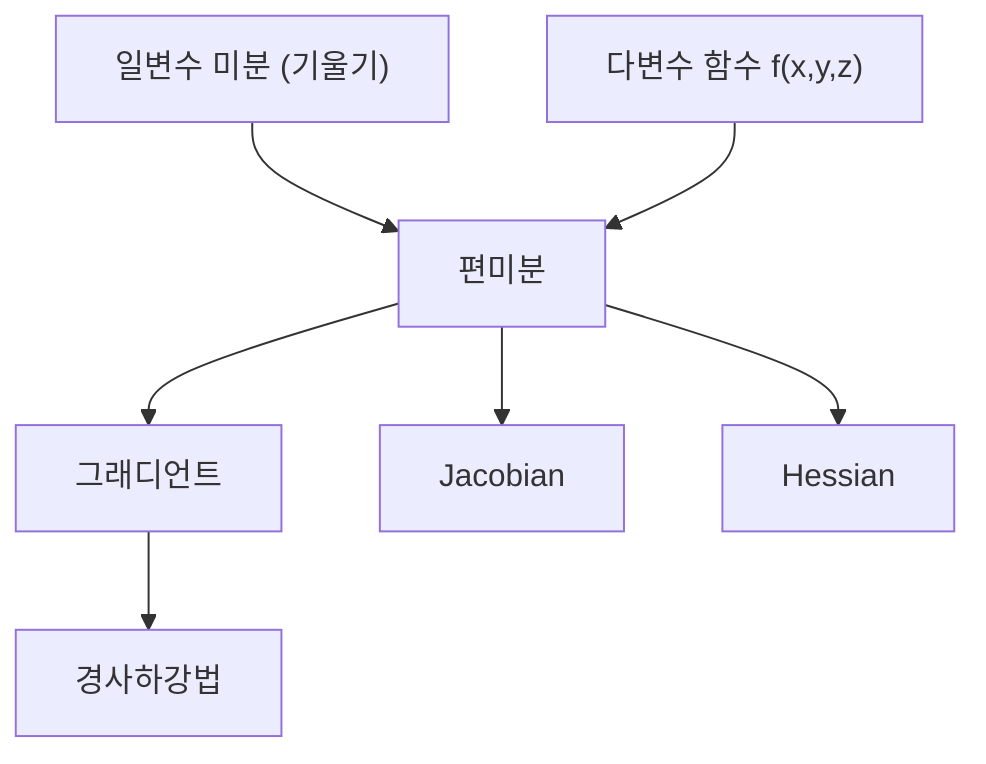

### 1.2 5단계 설명

#### 1단계 초등 (일상 비유, 수식 없음)

에어컨 리모컨에 **온도 버튼**과 **바람 세기 버튼**이 있다고 하자. 온도 버튼만 살짝 누르면 전기 요금이 얼마나 바뀌는지, 바람 세기 버튼만 살짝 누르면 전기 요금이 얼마나 바뀌는지를 각각 재는 것이 **편미분**이다.

핵심: **한 번에 하나의 버튼만 건드리고, 나머지는 고정한 채로** 결과가 얼마나 변하는지 측정한다.

#### 2단계 중등 (간단한 수식, 시각적 예시)

함수 $f(x, y) = x^2 + 3xy$가 있다고 하자.

- $x$에 대한 편미분: $y$를 상수 취급하고 $x$만으로 미분
  - $\frac{\partial f}{\partial x} = 2x + 3y$
- $y$에 대한 편미분: $x$를 상수 취급하고 $y$만으로 미분
  - $\frac{\partial f}{\partial y} = 3x$

**구체적 숫자 예시**: $(x, y) = (1, 2)$에서
- $\frac{\partial f}{\partial x}\bigg|_{(1,2)} = 2(1) + 3(2) = 8$ -- "$x$를 1만큼 키우면 $f$가 약 8 늘어난다"
- $\frac{\partial f}{\partial y}\bigg|_{(1,2)} = 3(1) = 3$ -- "$y$를 1만큼 키우면 $f$가 약 3 늘어난다"

시각적으로: 3차원 표면 위의 한 점에서 $x$축 방향 기울기와 $y$축 방향 기울기를 각각 잰 것이다.

#### 3단계 고등 (수학적 표현, 증명)

**정의**: 함수 $f: \mathbb{R}^n \to \mathbb{R}$의 $x_j$에 대한 편미분:

> **이 수식이 말하는 것은**: "$x_j$만 아주 조금($h$만큼) 바꾸었을 때 함수값이 얼마나 변하는가를 $h$로 나눈 비율의 극한"이다.

$$\frac{\partial f}{\partial x_j} = \lim_{h \to 0} \frac{f(x_1, \ldots, x_j + h, \ldots, x_n) - f(x_1, \ldots, x_j, \ldots, x_n)}{h}$$

**다변수 함수의 전미분과의 관계**:

$$df = \frac{\partial f}{\partial x_1}dx_1 + \frac{\partial f}{\partial x_2}dx_2 + \cdots + \frac{\partial f}{\partial x_n}dx_n = \sum_{j=1}^n \frac{\partial f}{\partial x_j}dx_j$$

이것은 "모든 변수가 동시에 조금씩 변할 때 $f$의 총 변화량"을 나타낸다.

#### 4단계 대학 (공식 전개 + Python 코드)

**다변수 Taylor 전개의 1차 근사**:

$$f(\mathbf{x} + \mathbf{h}) \approx f(\mathbf{x}) + \sum_{j=1}^n \frac{\partial f}{\partial x_j} h_j = f(\mathbf{x}) + \nabla f(\mathbf{x})^\top \mathbf{h}$$

이것이 "비선형 함수를 국소적으로 선형 근사"하는 것의 정확한 의미이다.

```python
import torch

# PyTorch autograd로 편미분 계산
x = torch.tensor(1.0, requires_grad=True)
y = torch.tensor(2.0, requires_grad=True)

f = x**2 + 3*x*y  # f(1,2) = 1 + 6 = 7
f.backward()

print(f"f(1,2) = {f.item()}")          # 7.0
print(f"df/dx at (1,2) = {x.grad}")    # 8.0  (= 2*1 + 3*2)
print(f"df/dy at (1,2) = {y.grad}")    # 3.0  (= 3*1)

# 수치 미분으로 검증
h = 1e-5
f_x = ((1+h)**2 + 3*(1+h)*2 - (1**2 + 3*1*2)) / h
print(f"수치 df/dx = {f_x:.6f}")       # 약 8.000010
```

#### 5단계 대학원 (논문 수준, 딥러닝 연결)

딥러닝에서 편미분은 **역전파의 원자(atom)**이다. 손실 함수 $L$을 각 가중치 $w_{ij}$에 대해 편미분한 $\frac{\partial L}{\partial w_{ij}}$가 그 가중치의 업데이트 방향을 결정한다.

**자동 미분(Automatic Differentiation)**은 수치 미분의 부정확성과 기호 미분의 비효율성을 모두 피하면서 편미분을 **기계적 정확도(machine precision)**로 계산한다. Forward mode AD는 $\frac{\partial}{\partial x_j}$를 입력에서 출력으로, Reverse mode AD(= 역전파)는 $\frac{\partial L}{\partial \cdot}$를 출력에서 입력으로 전파한다.

파라미터 수 $n \gg 1$, 출력 수 $m = 1$(스칼라 손실)인 딥러닝에서는 Reverse mode가 $O(m) = O(1)$번의 sweep으로 모든 편미분을 계산하므로 압도적으로 효율적이다.

### 1.3 오개념 경고

| 틀립니다 | 이해해야 합니다 |
|----------|----------------|
| "편미분은 일반 미분과 같다" | 편미분은 **다른 변수를 고정**한 채 하나의 변수에 대해서만 미분한다. 일반 미분은 일변수 함수에만 적용된다. |
| "편미분이 0이면 극값이다" | 모든 편미분이 동시에 0이어야 임계점이다. 그마저도 안장점일 수 있다. |
| "편미분의 순서는 상관없다" | **Schwarz 정리** 조건(2차 편미분이 연속)을 만족할 때만 $\frac{\partial^2 f}{\partial x \partial y} = \frac{\partial^2 f}{\partial y \partial x}$이다. |

### 1.4 설명하기 훈련

> **문제**: 친구에게 "편미분이 뭔지, 왜 딥러닝에서 중요한지" 30초 안에 설명하라.

**모범 답안**: "편미분은 여러 조절 손잡이가 있을 때, 하나만 살짝 돌려서 결과가 얼마나 변하는지 재는 거야. 딥러닝에서는 수백만 개의 가중치(손잡이)가 있는데, 각 가중치를 어느 방향으로 얼마나 돌려야 오차가 줄어드는지 알려주는 게 편미분이야. 이걸 모으면 '그래디언트'가 되고, 그래디언트 방향으로 내려가는 게 경사하강법이야."

### 1.5 수학 -> 딥러닝 연결 표

| 수학 개념 | 딥러닝 대응 | 구체적 역할 |
|-----------|-------------|-------------|
| $\frac{\partial L}{\partial w_{ij}}$ | 가중치의 gradient | SGD 업데이트 방향 결정 |
| 전미분 $df$ | Forward pass의 총 출력 변화 | 입력 perturbation 분석 |
| Schwarz 정리 | Hessian의 대칭성 보장 | 2차 최적화 알고리즘의 이론적 기반 |

### 1.6 성취 확인

> **당신은 이제...**
> - 다변수 함수에서 각 변수에 대한 편미분을 계산할 수 있다
> - 편미분이 역전파의 기본 단위임을 이해한다
> - PyTorch의 autograd가 내부적으로 편미분을 계산하고 있음을 안다

### 1.7 핵심 킬러 요약

> **편미분 = "한 번에 하나만 건드리기"**. 다른 모든 변수를 고정하고 하나만 바꿨을 때의 변화율. 이것이 역전파의 원자이며, 모든 그래디언트/Jacobian/Hessian의 출발점이다.

---

## 2. 그래디언트(Gradient)

### 2.0 동기부여

> **이걸 배우면...** "현재 위치에서 손실을 가장 빠르게 줄이려면 어느 방향으로 가야 하는가?"라는 질문에 정확하게 답할 수 있다. 경사하강법(SGD), Adam, AdaGrad 등 **모든 1차 최적화 알고리즘**의 핵심이 그래디언트이다.

### 2.1 선행 개념 맵

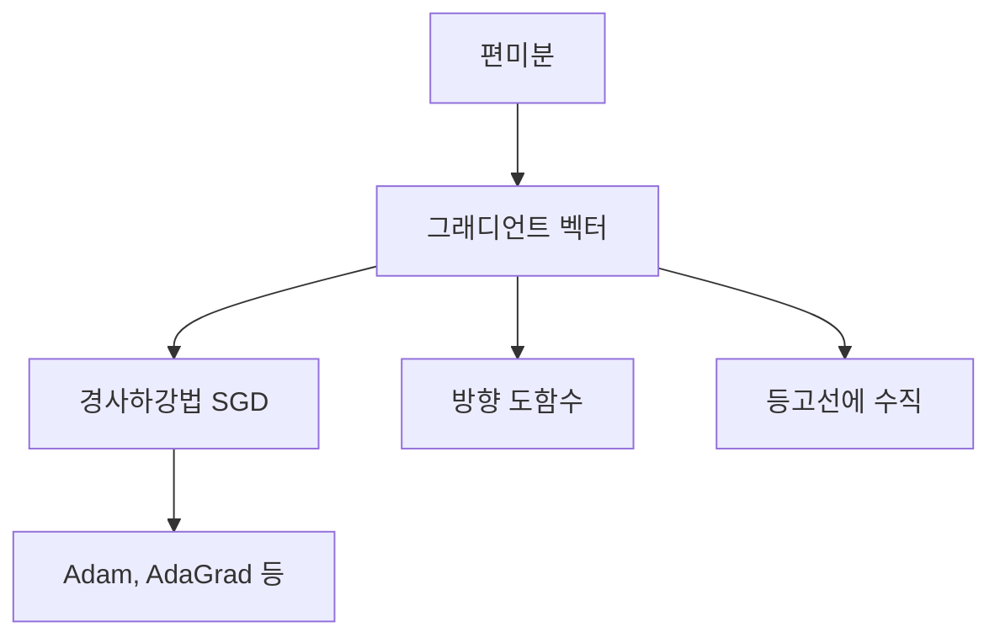

### 2.2 5단계 설명

#### 1단계 초등 (일상 비유, 수식 없음)

안개 낀 산에서 가장 빠르게 내려가고 싶다. 눈을 감고 발밑을 더듬어 **모든 방향의 기울기**를 느낀다. 그중 가장 가파르게 내려가는 방향을 알려주는 **나침반**이 그래디언트이다.

그래디언트의 반대 방향으로 한 걸음씩 걸으면 결국 골짜기 바닥에 도착한다 -- 이것이 경사하강법이다.

#### 2단계 중등 (간단한 수식, 시각적 예시)

$f(x, y) = x^2 + y^2$의 그래디언트:

$$\nabla f = \begin{pmatrix} \frac{\partial f}{\partial x} \\ \frac{\partial f}{\partial y} \end{pmatrix} = \begin{pmatrix} 2x \\ 2y \end{pmatrix}$$

$(3, 4)$에서: $\nabla f = (6, 8)$

- **방향**: 원점에서 멀어지는 방향 (함수가 가장 빠르게 증가하는 방향)
- **크기**: $\|\nabla f\| = \sqrt{36 + 64} = 10$ (기울기의 가파름)
- **감소 방향**: $-\nabla f = (-6, -8)$ (원점 방향 = 최솟값 방향)

시각적으로: 등고선(같은 높이의 동심원)에 **수직**인 화살표가 그래디언트이다.

#### 3단계 고등 (수학적 표현, 증명)

**정의**: $f: \mathbb{R}^n \to \mathbb{R}$의 그래디언트:

$$\nabla f(\mathbf{x}) = \begin{pmatrix} \frac{\partial f}{\partial x_1} \\ \vdots \\ \frac{\partial f}{\partial x_n} \end{pmatrix} \in \mathbb{R}^n$$

> **이 수식이 말하는 것은**: "모든 편미분을 하나의 벡터로 모은 것"이다.

**방향 도함수와의 관계**:

$$D_{\mathbf{u}} f = \nabla f \cdot \mathbf{u} = \|\nabla f\| \cos\theta$$

- $\mathbf{u}$: 단위 방향벡터
- $\theta$: 그래디언트와 $\mathbf{u}$ 사이의 각도
- $\cos\theta = 1$ ($\theta = 0$)일 때 최대 -> **그래디언트 방향이 가장 가파른 증가 방향**

**증명**: 코시-슈바르츠 부등식 $|\nabla f \cdot \mathbf{u}| \leq \|\nabla f\| \|\mathbf{u}\|$에서 등호 조건은 $\mathbf{u} \parallel \nabla f$일 때 성립.

#### 4단계 대학 (공식 전개 + Python 코드)

**Numerator Layout Convention 주의**:

- $\frac{\partial f}{\partial \mathbf{x}} \in \mathbb{R}^{1 \times n}$ (행벡터) -- Jacobian으로서의 gradient
- $\nabla f = \left(\frac{\partial f}{\partial \mathbf{x}}\right)^\top \in \mathbb{R}^{n}$ (열벡터) -- 기하학적 gradient

이 convention 차이가 코드에서 shape 불일치 버그의 주범이다.

```python
import torch
import numpy as np
import matplotlib.pyplot as plt

# 2D gradient 계산 및 시각화
def f(x, y):
    return x**2 + y**2

# 격자 생성
x_grid = np.linspace(-3, 3, 20)
y_grid = np.linspace(-3, 3, 20)
X, Y = np.meshgrid(x_grid, y_grid)
Z = f(X, Y)

# gradient: df/dx = 2x, df/dy = 2y
U = 2 * X  # df/dx
V = 2 * Y  # df/dy

fig, ax = plt.subplots(1, 1, figsize=(8, 8))
ax.contour(X, Y, Z, levels=15, cmap='coolwarm')
ax.quiver(X, Y, -U, -V, alpha=0.5, color='black')  # 음의 gradient (하강 방향)
ax.set_title('등고선 + 음의 Gradient (하강 방향)')
ax.set_xlabel('x'); ax.set_ylabel('y')
ax.set_aspect('equal')
plt.tight_layout()
plt.savefig('gradient_field.png', dpi=100)
plt.show()

# PyTorch autograd로 gradient 계산
x = torch.tensor([3.0, 4.0], requires_grad=True)
loss = (x**2).sum()
loss.backward()
print(f"gradient at (3,4) = {x.grad}")  # tensor([6., 8.])
print(f"|gradient| = {x.grad.norm()}")  # 10.0
```

#### 5단계 대학원 (논문 수준, 딥러닝 연결)

**Gradient Flow**: 연속 시간 경사하강법 $\dot{\theta}(t) = -\nabla L(\theta(t))$은 ODE이다. 이 ODE의 해 궤적이 최적화 경로를 결정한다.

**Gradient의 정보 기하학적 해석**: Natural Gradient $\tilde{\nabla} L = F^{-1} \nabla L$ ($F$: Fisher Information Matrix)은 파라미터 공간의 **리만 기하**를 고려한 가장 가파른 방향이다. 유클리드 거리가 아닌 KL divergence 기준의 가장 가파른 방향이므로, 파라미터 재매개변수화에 불변이다. K-FAC (Martens & Grosse, 2015)은 $F$를 Kronecker 구조로 근사하여 실용적 natural gradient를 구현한다.

### 2.3 오개념 경고

| 틀립니다 | 이해해야 합니다 |
|----------|----------------|
| "그래디언트는 항상 최솟값을 가리킨다" | 그래디언트는 **국소적으로 가장 가파른 증가 방향**을 가리킨다. 최솟값이 아니라 **현재 위치에서의 최급상승 방향**이다. |
| "그래디언트가 0이면 최솟값이다" | 극대, 안장점에서도 그래디언트는 0이다. 2차 판정(Hessian)이 필요하다. |
| "그래디언트는 열벡터다/행벡터다" | Convention에 따라 다르다. 코드에서 shape을 항상 확인하라. |

### 2.4 설명하기 훈련

> **문제**: "경사하강법이 왜 그래디언트의 반대 방향으로 가는지" 수학적으로 설명하라.

**모범 답안**: "함수의 1차 근사 $f(\mathbf{x} + \mathbf{h}) \approx f(\mathbf{x}) + \nabla f^\top \mathbf{h}$에서 $\|\mathbf{h}\|$를 고정했을 때 $\nabla f^\top \mathbf{h}$를 최소화하는 방향은 코시-슈바르츠 부등식에 의해 $\mathbf{h} \propto -\nabla f$이다. 즉, 함수를 가장 많이 감소시키는 방향이 음의 그래디언트 방향이다."

### 2.5 수학 -> 딥러닝 연결 표

| 수학 개념 | 딥러닝 대응 | 구체적 역할 |
|-----------|-------------|-------------|
| $\nabla L(\theta)$ | `loss.backward()` 후 `.grad` | SGD 업데이트 $\theta \leftarrow \theta - \alpha \nabla L$ |
| $\|\nabla L\|$ | Gradient norm | Gradient clipping 기준, 학습 수렴 지표 |
| $-\nabla L$ 방향 | 최급강하 방향 | 1차 최적화의 기본 방향 |
| Natural Gradient | K-FAC, KFRA | Fisher 정보를 고려한 효율적 업데이트 |

### 2.6 성취 확인

> **당신은 이제...**
> - 그래디언트가 "모든 편미분을 모은 벡터"임을 안다
> - 경사하강법이 음의 그래디언트 방향으로 이동하는 수학적 이유를 설명할 수 있다
> - Numerator/Denominator layout convention의 차이를 인식한다

### 2.7 핵심 킬러 요약

> **그래디언트 = 가장 가파른 오르막 나침반**. 편미분을 모아 만든 벡터. 이 반대 방향으로 가면 함수가 가장 빠르게 줄어든다. 경사하강법의 전부이자, 모든 1차 최적화의 핵심이다.

---

## 3. Jacobian 행렬

### 3.0 동기부여

> **이걸 배우면...** 입력도 여러 개, 출력도 여러 개인 함수(= 신경망의 각 레이어)가 "입력의 작은 변화에 어떻게 반응하는지"를 완전히 기술하는 행렬을 이해한다. 역전파에서 Chain Rule을 적용할 때 곱하는 것이 바로 Jacobian이다.

### 3.1 선행 개념 맵

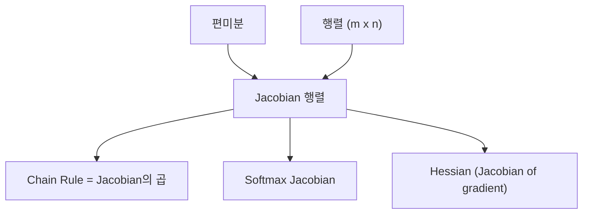

### 3.2 5단계 설명

#### 1단계 초등 (일상 비유, 수식 없음)

믹서기에 재료 3가지(밀가루, 설탕, 버터)를 넣으면 결과물의 특성 2가지(맛, 식감)가 결정된다고 하자. "밀가루를 살짝 더 넣으면 맛이 얼마나, 식감이 얼마나 변하는가?" "설탕을 살짝 더 넣으면?" -- 이런 모든 관계를 **표 하나**에 정리한 것이 Jacobian이다.

| | 밀가루 | 설탕 | 버터 |
|---|---|---|---|
| **맛 변화** | ? | ? | ? |
| **식감 변화** | ? | ? | ? |

이 2x3 표가 Jacobian 행렬이다.

#### 2단계 중등 (간단한 수식, 시각적 예시)

함수 $\mathbf{f}: \mathbb{R}^3 \to \mathbb{R}^2$:
- $f_1(x, y, z) = x^2 + yz$
- $f_2(x, y, z) = xy + z$

Jacobian:

$$J = \begin{pmatrix} \frac{\partial f_1}{\partial x} & \frac{\partial f_1}{\partial y} & \frac{\partial f_1}{\partial z} \\ \frac{\partial f_2}{\partial x} & \frac{\partial f_2}{\partial y} & \frac{\partial f_2}{\partial z} \end{pmatrix} = \begin{pmatrix} 2x & z & y \\ y & x & 1 \end{pmatrix}$$

**구체적 숫자**: $(x, y, z) = (1, 2, 3)$에서:

$$J = \begin{pmatrix} 2 & 3 & 2 \\ 2 & 1 & 1 \end{pmatrix}$$

해석: "$x$가 1 증가하면 $f_1$은 약 2, $f_2$는 약 2 증가한다."

#### 3단계 고등 (수학적 표현, 증명)

**정의**: $\mathbf{f}: \mathbb{R}^n \to \mathbb{R}^m$의 Jacobian 행렬:

> **이 수식이 말하는 것은**: "각 출력이 각 입력에 대해 얼마나 민감한지를 $(i,j)$ 원소에 담은 $m \times n$ 행렬"이다.

$$J = \frac{\partial \mathbf{f}}{\partial \mathbf{x}} = \begin{pmatrix} \frac{\partial f_1}{\partial x_1} & \cdots & \frac{\partial f_1}{\partial x_n} \\ \vdots & \ddots & \vdots \\ \frac{\partial f_m}{\partial x_1} & \cdots & \frac{\partial f_m}{\partial x_n} \end{pmatrix} \in \mathbb{R}^{m \times n}$$

**Gradient과의 관계**:
- $m = 1$ (스칼라 출력)이면 Jacobian은 $1 \times n$ 행벡터 = gradient의 전치
- $m > 1$이면 Jacobian의 각 행이 해당 출력의 gradient

**국소 선형 근사**:

$$\mathbf{f}(\mathbf{x} + \mathbf{h}) \approx \mathbf{f}(\mathbf{x}) + J \cdot \mathbf{h}$$

Jacobian은 비선형 함수를 한 점에서 **선형 사상(행렬)으로 근사**한 것이다.

#### 4단계 대학 (공식 전개 + Python 코드)

**3-layer MLP의 Jacobian 차원**:

입력 $\mathbb{R}^{784} \to \mathbb{R}^{256} \to \mathbb{R}^{128} \to \mathbb{R}^{10}$:
- 1층 Jacobian: $256 \times 784$
- 2층 Jacobian: $128 \times 256$
- 3층 Jacobian: $10 \times 128$
- 전체 Jacobian (Chain Rule): $10 \times 784$ (= $J_3 \cdot J_2 \cdot J_1$)

```python
import torch
from torch.autograd.functional import jacobian

# 벡터-벡터 함수의 Jacobian 계산
def f(x):
    return torch.stack([x[0]**2 + x[1]*x[2],
                        x[0]*x[1] + x[2]])

x = torch.tensor([1.0, 2.0, 3.0])
J = jacobian(f, x)
print(f"Jacobian at (1,2,3):\n{J}")
# tensor([[2., 3., 2.],
#         [2., 1., 1.]])

# MLP의 Jacobian 차원 확인
model = torch.nn.Sequential(
    torch.nn.Linear(784, 256),
    torch.nn.ReLU(),
    torch.nn.Linear(256, 128),
    torch.nn.ReLU(),
    torch.nn.Linear(128, 10),
)

x_input = torch.randn(784)
J_full = jacobian(model, x_input)
print(f"전체 Jacobian shape: {J_full.shape}")  # torch.Size([10, 784])
```

#### 5단계 대학원 (논문 수준, 딥러닝 연결)

**Jacobian-Vector Product (JVP)** vs **Vector-Jacobian Product (VJP)**:
- JVP: $J \mathbf{v}$ -- Forward mode AD, 입력 perturbation이 출력에 미치는 영향
- VJP: $\mathbf{v}^\top J$ -- Reverse mode AD(역전파), 출력 gradient를 입력으로 전파

파라미터가 많고 출력이 스칼라인 딥러닝에서는 VJP(역전파)가 효율적: $O(1)$번의 backward pass로 모든 gradient 획득.

**Jacobian의 특이값(singular values)**은 해당 레이어의 입력 perturbation 증폭 정도를 결정한다. 최대 특이값이 1보다 크면 gradient exploding, 작으면 vanishing의 원인이 된다. Spectral Normalization (Miyato et al., 2018)은 Jacobian의 최대 특이값을 1로 제한하여 GAN 학습을 안정화한다.

### 3.3 오개념 경고

| 틀립니다 | 이해해야 합니다 |
|----------|----------------|
| "Jacobian은 gradient와 같다" | Gradient는 스칼라 출력 함수의 도함수 벡터. Jacobian은 벡터 출력 함수의 도함수 행렬. Gradient는 Jacobian의 특수한 경우($m=1$)이다. |
| "Jacobian은 항상 정방행렬이다" | $m \neq n$이면 직사각행렬이다. $m \times n$ 크기. |

### 3.4 수학 -> 딥러닝 연결 표

| 수학 개념 | 딥러닝 대응 | 구체적 역할 |
|-----------|-------------|-------------|
| $J \in \mathbb{R}^{m \times n}$ | 레이어의 입출력 민감도 | 역전파 시 VJP 계산 |
| $J$의 특이값 | Gradient 흐름의 증폭/감쇠 | Spectral Norm, gradient clipping |
| $\det(J)$ | 변환의 부피 변화율 | Normalizing Flow의 log-det 계산 |

### 3.5 핵심 킬러 요약

> **Jacobian = 편미분의 행렬 = 비선형 함수의 국소 선형 근사**. $(i,j)$ 원소는 "$j$번째 입력이 $i$번째 출력에 미치는 영향". 역전파는 이 행렬들의 곱을 역순으로 계산하는 것이다.

---

## 4. Hessian 행렬

### 4.0 동기부여

> **이걸 배우면...** 함수의 "곡률"을 수학적으로 기술할 수 있다. "이 방향은 급격히 변하고, 저 방향은 완만하게 변하는" 비등방적 곡면의 구조를 파악하여, 2차 최적화(Newton's method, L-BFGS)의 원리를 이해한다.

### 4.1 선행 개념 맵

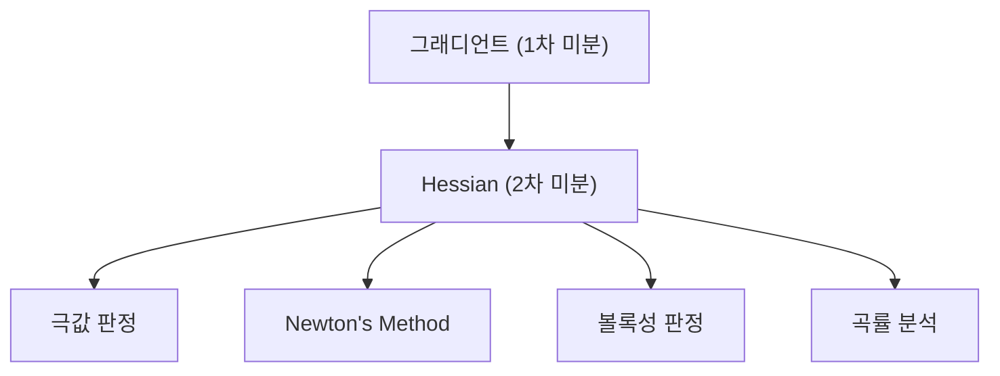

### 4.2 5단계 설명

#### 1단계 초등 (일상 비유, 수식 없음)

그래디언트가 "산의 기울기"라면, Hessian은 "산의 **굽은 정도**"이다.

스키장을 상상해보자. 어떤 슬로프는 점점 가팔라지고(양의 곡률), 어떤 슬로프는 점점 완만해진다(음의 곡률). 또 어떤 곳은 왼쪽으로는 올라가고 오른쪽으로는 내려가는 말 안장 모양이다. Hessian은 이 **굽은 정도와 방향**을 모두 알려주는 정보이다.

#### 2단계 중등 (간단한 수식, 시각적 예시)

$f(x, y) = x^2 + 3y^2$의 Hessian:

$$H = \begin{pmatrix} \frac{\partial^2 f}{\partial x^2} & \frac{\partial^2 f}{\partial x \partial y} \\ \frac{\partial^2 f}{\partial y \partial x} & \frac{\partial^2 f}{\partial y^2} \end{pmatrix} = \begin{pmatrix} 2 & 0 \\ 0 & 6 \end{pmatrix}$$

- 대각 원소: 각 방향의 곡률 ($x$방향은 2, $y$방향은 6)
- $y$방향이 3배 더 급하게 구부러져 있다 -> 등고선이 $y$방향으로 납작한 타원

**구체적 숫자**: 이 Hessian의 고유값은 2와 6이다.
- 모두 양수 -> **극소** (모든 방향으로 위로 볼록)
- 고유값 비율 6/2 = 3 -> 조건수(condition number) = 3

#### 3단계 고등 (수학적 표현, 증명)

**정의**: $f: \mathbb{R}^n \to \mathbb{R}$의 Hessian:

> **이 수식이 말하는 것은**: "그래디언트를 한 번 더 미분한 것, 즉 2차 편미분의 행렬"이다.

$$H = \nabla^2 f = \begin{pmatrix} \frac{\partial^2 f}{\partial x_1^2} & \cdots & \frac{\partial^2 f}{\partial x_1 \partial x_n} \\ \vdots & \ddots & \vdots \\ \frac{\partial^2 f}{\partial x_n \partial x_1} & \cdots & \frac{\partial^2 f}{\partial x_n^2} \end{pmatrix} \in \mathbb{R}^{n \times n}$$

**성질**:
- Schwarz 정리에 의해 $H$는 **대칭행렬** ($H = H^\top$)
- Hessian은 "그래디언트의 Jacobian"이다: $H = J(\nabla f)$

**극값 판정**:
- $\nabla f = 0$이고 $H \succ 0$ (양정치) -> 극소
- $\nabla f = 0$이고 $H \prec 0$ (음정치) -> 극대
- $H$가 부정치(고유값 부호 혼합) -> 안장점

#### 4단계 대학 (공식 전개 + Python 코드)

**2차 Taylor 전개**:

$$f(\mathbf{x} + \mathbf{h}) \approx f(\mathbf{x}) + \nabla f^\top \mathbf{h} + \frac{1}{2} \mathbf{h}^\top H \mathbf{h}$$

- $\nabla f^\top \mathbf{h}$: 1차 항 (선형 근사)
- $\frac{1}{2} \mathbf{h}^\top H \mathbf{h}$: 2차 항 (곡률 보정)

```python
import torch
from torch.autograd.functional import hessian

def f(x):
    return x[0]**2 + 3*x[1]**2

x = torch.tensor([1.0, 1.0])
H = hessian(f, x)
print(f"Hessian:\n{H}")
# tensor([[2., 0.],
#         [0., 6.]])

# 고유값으로 극값 판정
eigenvalues = torch.linalg.eigvalsh(H)
print(f"고유값: {eigenvalues}")  # tensor([2., 6.])
print(f"양정치(극소)? {(eigenvalues > 0).all()}")  # True
print(f"조건수: {eigenvalues.max() / eigenvalues.min()}")  # 3.0

# 안장점 예시: f(x,y) = x^2 - y^2
def saddle(x):
    return x[0]**2 - x[1]**2

H_saddle = hessian(saddle, torch.tensor([0.0, 0.0]))
print(f"\n안장점 Hessian:\n{H_saddle}")          # [[2, 0], [0, -2]]
print(f"고유값: {torch.linalg.eigvalsh(H_saddle)}")  # [-2, 2] -> 부호 혼합 = 안장점
```

#### 5단계 대학원 (논문 수준, 딥러닝 연결)

**고차원에서의 안장점 지배**: $n$차원 공간에서 Hessian의 각 고유값이 독립적으로 양/음이 될 확률이 동일하다면, 모든 고유값이 양수일 확률은 $(1/2)^n$으로 기하급수적으로 감소한다 (Dauphin et al., 2014). 따라서 딥러닝의 loss landscape에서는 **안장점이 극소보다 압도적으로 많다**.

**Hessian 근사와 최적화 알고리즘**:
| 근사 방법 | 알고리즘 | 계산 복잡도 |
|-----------|----------|-------------|
| $H \approx \frac{1}{\alpha}I$ | SGD | $O(n)$ |
| $H \approx \text{diag}(\hat{h})$ | AdaGrad, Adam | $O(n)$ |
| $H \approx$ 저랭크 | L-BFGS | $O(nk)$ |
| $H \approx A \otimes B$ (Kronecker) | K-FAC | $O(n^{3/2})$ |
| $H$ 정확 | Newton's method | $O(n^3)$ |

### 4.3 오개념 경고

| 틀립니다 | 이해해야 합니다 |
|----------|----------------|
| "Hessian이 양정치면 전역 최솟값이다" | 양정치는 **극소**(국소 최솟값)를 보장하지만 전역 최솟값은 아닐 수 있다. 전역 보장은 **볼록함수**일 때만. |
| "딥러닝에서 Hessian을 직접 계산한다" | $n$이 수백만인 딥러닝에서 $n \times n$ Hessian은 저장조차 불가능하다. 항상 근사를 사용한다. |

### 4.4 핵심 킬러 요약

> **Hessian = 2차 미분의 행렬 = 곡률 정보**. 고유값의 부호로 극소/극대/안장점을 판별한다. 딥러닝에서는 직접 계산이 불가능하므로 다양한 근사법(Adam, L-BFGS, K-FAC)이 Hessian 정보를 우회적으로 활용한다.

---

## 5. Chain Rule & Product Rule

### 5.0 동기부여

> **이걸 배우면...** 신경망의 역전파(backpropagation)를 수학적으로 완벽히 이해한다. 역전파는 Chain Rule을 Jacobian의 곱으로 적용하여, 출력에서 입력 방향으로 gradient를 전파하는 **동적 프로그래밍**이다.

### 5.1 선행 개념 맵

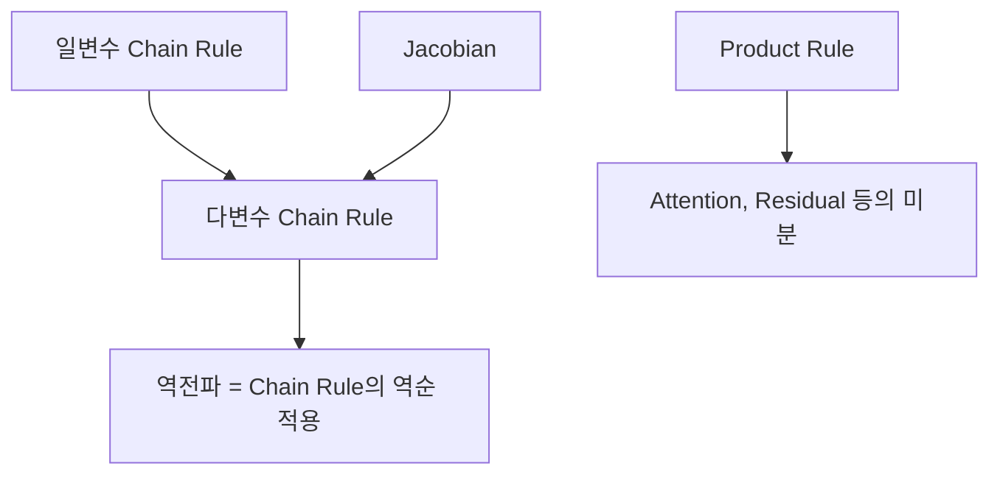

### 5.2 5단계 설명

#### 1단계 초등 (일상 비유, 수식 없음)

**Chain Rule**: 도미노를 상상하자. A 도미노가 B를 쓰러뜨리고, B가 C를 쓰러뜨린다. A가 C에 미치는 영향은? "A가 B에 미치는 영향 x B가 C에 미치는 영향"이다. 연쇄적으로 곱하면 된다.

**Product Rule**: 직사각형의 넓이는 가로 x 세로이다. 가로와 세로가 동시에 변할 때 넓이의 변화는? "가로 변화분 x 세로 + 가로 x 세로 변화분"이다. 한쪽을 고정하고 다른 쪽의 변화를 재고, 바꿔서 또 재고, 둘을 더한다.

#### 2단계 중등 (간단한 수식, 시각적 예시)

**Chain Rule**:

$y = g(x) = x^2$, $z = f(y) = 3y + 1$이면:
$$\frac{dz}{dx} = \frac{dz}{dy} \cdot \frac{dy}{dx} = 3 \cdot 2x = 6x$$

**구체적 숫자**: $x = 2$에서:
- $y = 4$, $z = 13$
- $\frac{dz}{dy} = 3$, $\frac{dy}{dx} = 4$
- $\frac{dz}{dx} = 3 \times 4 = 12$ -- "$x$가 1 늘면 $z$는 약 12 늘어난다"

**Product Rule**:

$(fg)' = f'g + fg'$

$h(x) = x^2 \cdot e^x$이면:
$$h'(x) = 2x \cdot e^x + x^2 \cdot e^x = (2x + x^2)e^x$$

#### 3단계 고등 (수학적 표현, 증명)

**다변수 Chain Rule (Jacobian 형태)**:

> **이 수식이 말하는 것은**: "합성함수의 Jacobian은 각 함수의 Jacobian을 곱한 것이다."

$\mathbf{z} = \mathbf{f}(\mathbf{g}(\mathbf{x}))$이면:

$$\frac{\partial \mathbf{z}}{\partial \mathbf{x}} = \frac{\partial \mathbf{z}}{\partial \mathbf{y}} \cdot \frac{\partial \mathbf{y}}{\partial \mathbf{x}} = J_f \cdot J_g$$

**역전파의 수학적 본질**: 손실 $L = L(\mathbf{f}_n(\mathbf{f}_{n-1}(\cdots \mathbf{f}_1(\mathbf{x}))))$에서:

$$\frac{\partial L}{\partial \mathbf{x}} = \frac{\partial L}{\partial \mathbf{f}_n} \cdot \frac{\partial \mathbf{f}_n}{\partial \mathbf{f}_{n-1}} \cdots \frac{\partial \mathbf{f}_2}{\partial \mathbf{f}_1} \cdot \frac{\partial \mathbf{f}_1}{\partial \mathbf{x}}$$

**오른쪽에서 왼쪽으로 순차적으로 곱하면 역전파**, 왼쪽에서 오른쪽이면 forward mode AD이다.

**증명 (일변수)**: $\frac{d}{dx}f(g(x)) = \lim_{h \to 0}\frac{f(g(x+h)) - f(g(x))}{h}$. $g(x+h) \approx g(x) + g'(x)h$를 대입하고, $f(y + k) \approx f(y) + f'(y)k$를 적용하면 $f'(g(x)) \cdot g'(x)$을 얻는다.

#### 4단계 대학 (공식 전개 + Python 코드)

**역전파의 구체적 계산**:

2-layer MLP: $\mathbf{z}_1 = W_1 \mathbf{x}$, $\mathbf{a}_1 = \sigma(\mathbf{z}_1)$, $\mathbf{z}_2 = W_2 \mathbf{a}_1$, $L = \ell(\mathbf{z}_2, \mathbf{y})$

역전파:
1. $\frac{\partial L}{\partial \mathbf{z}_2} = \nabla_{\mathbf{z}_2} \ell$ (출력층 gradient)
2. $\frac{\partial L}{\partial \mathbf{a}_1} = W_2^\top \frac{\partial L}{\partial \mathbf{z}_2}$ (Chain Rule)
3. $\frac{\partial L}{\partial \mathbf{z}_1} = \frac{\partial L}{\partial \mathbf{a}_1} \odot \sigma'(\mathbf{z}_1)$ (원소별 곱 -- 활성화)
4. $\frac{\partial L}{\partial W_1} = \frac{\partial L}{\partial \mathbf{z}_1} \mathbf{x}^\top$ (가중치 gradient)

```python
import torch
import torch.nn as nn

# 수동 역전파 vs autograd 비교
torch.manual_seed(42)

# 간단한 2-layer 네트워크
x = torch.randn(3, requires_grad=False)
W1 = torch.randn(4, 3, requires_grad=True)
W2 = torch.randn(2, 4, requires_grad=True)
y_true = torch.tensor([1.0, 0.0])

# Forward pass
z1 = W1 @ x
a1 = torch.sigmoid(z1)
z2 = W2 @ a1
loss = ((z2 - y_true)**2).sum()

# Autograd 역전파
loss.backward()
print(f"Autograd dL/dW1:\n{W1.grad}")

# 수동 역전파 (Chain Rule 직접 적용)
with torch.no_grad():
    dL_dz2 = 2 * (z2.detach() - y_true)                    # step 1
    dL_da1 = W2.detach().T @ dL_dz2                         # step 2
    dL_dz1 = dL_da1 * (a1.detach() * (1 - a1.detach()))     # step 3
    dL_dW1_manual = dL_dz1.unsqueeze(1) @ x.unsqueeze(0)    # step 4
    print(f"\n수동 dL/dW1:\n{dL_dW1_manual}")
    print(f"\n차이 (0에 가까워야 함): {(W1.grad - dL_dW1_manual).abs().max():.2e}")
```

#### 5단계 대학원 (논문 수준, 딥러닝 연결)

**Jacobian 곱의 계산 순서와 효율성**:

$n$개의 Jacobian을 곱할 때: $J_n \cdot J_{n-1} \cdots J_1$

- **Forward mode** (왼쪽 $\to$ 오른쪽): $J_1$부터 시작. 입력 차원이 작을 때 효율적.
- **Reverse mode** (오른쪽 $\to$ 왼쪽): $J_n$부터 시작 (= 역전파). 출력 차원이 작을 때 효율적.

딥러닝: 출력 = 스칼라 손실 ($m=1$) -> Reverse mode가 $O(1)$ sweep으로 모든 gradient 계산.

**Gradient Checkpointing** (Chen et al., 2016): 메모리 $O(n)$ vs 계산 $O(n)$의 트레이드오프. 일부 중간값만 저장하고 역전파 시 재계산하여 메모리를 $O(\sqrt{n})$으로 줄인다.

### 5.3 오개념 경고

| 틀립니다 | 이해해야 합니다 |
|----------|----------------|
| "역전파는 Chain Rule과 다른 특별한 알고리즘이다" | 역전파 = Chain Rule을 역순으로 효율적으로 계산하는 동적 프로그래밍. 수학적으로 새로운 것은 없다. |
| "Chain Rule은 스칼라에서만 성립한다" | 행렬 형태의 Chain Rule $J_{f \circ g} = J_f \cdot J_g$이 일반적이다. |
| "Product Rule은 딥러닝에서 안 쓴다" | Residual connection ($f + g$), Attention ($QK^\top V$), 정규화 항 등에서 모두 사용된다. |

### 5.4 설명하기 훈련

> **문제**: "역전파를 Chain Rule의 관점에서" 설명하라.

**모범 답안**: "신경망은 함수의 합성 $f_n \circ f_{n-1} \circ \cdots \circ f_1$이다. Chain Rule에 의해 전체 Jacobian은 각 레이어 Jacobian의 곱 $J_n \cdot J_{n-1} \cdots J_1$이다. 역전파는 이 곱을 출력(스칼라 손실)에서 시작하여 입력 방향으로 순차적으로 계산하는 것이다. 출력이 스칼라이므로, 각 단계에서 벡터-행렬 곱(VJP)만 하면 되어 매우 효율적이다."

### 5.5 핵심 킬러 요약

> **Chain Rule = "영향의 연쇄 곱"**. 역전파는 Chain Rule을 Jacobian의 곱으로 뒤에서 앞으로 계산하는 동적 프로그래밍이다. Product Rule은 "동시에 변하는 두 양의 곱"을 미분하는 규칙이다. 이 두 규칙이 딥러닝 학습의 미분적 기반 전체를 이룬다.

---

# PART 3: 고급 미분 도구

---

## 6. Newton's Method

### 6.0 동기부여

> **이걸 배우면...** "곡률(Hessian)을 고려하여 최적화 스텝을 결정하는" 2차 최적화 알고리즘의 원조를 이해한다. SGD가 "기울기만 보고 내려가기"라면, Newton's method는 "기울기와 곡률을 동시에 보고 최적의 걸음 크기까지 결정"하는 것이다.

### 6.1 선행 개념 맵

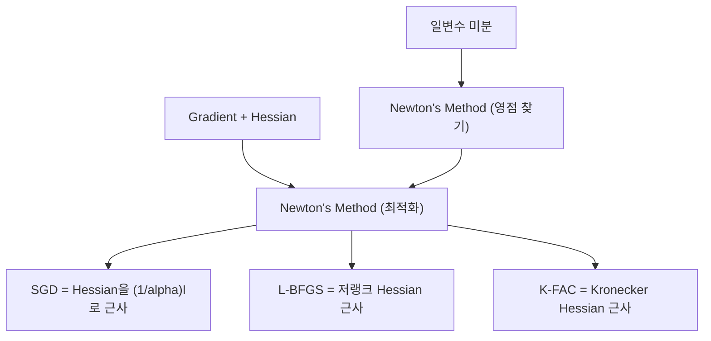

### 6.2 5단계 설명

#### 1단계 초등 (일상 비유, 수식 없음)

"맞추기 게임"을 상상하자. 정답을 모르지만, 추측을 하고 얼마나 틀렸는지 확인하고, 더 나은 추측을 할 수 있다. Newton's method는 이런 "점점 가까워지는 추측 게임"이다.

놀라운 점: 4번만 추측하면 $\sqrt{7}$을 소수점 15자리까지 맞출 수 있다!

#### 2단계 중등 (간단한 수식, 시각적 예시)

**영점 찾기**: 곡선 $y = f(x)$ 위의 한 점에서 **접선**을 그어 $x$축과 만나는 점을 다음 추측으로 사용한다.

$$x_{n+1} = x_n - \frac{f(x_n)}{f'(x_n)}$$

**$\sqrt{7}$ 구하기**: $f(x) = x^2 - 7$의 영점 = $\sqrt{7}$

$$x_{n+1} = \frac{1}{2}\left(x_n + \frac{7}{x_n}\right)$$

| 단계 | 값 | 정확한 자릿수 |
|------|-----|-------------|
| $x_0$ | 3 | 1자리 |
| $x_1$ | 2.666... | 1자리 |
| $x_2$ | 2.6458... | 4자리 |
| $x_3$ | 2.6457513... | 10자리 |

**2차 수렴**: 유효 자릿수가 매 반복마다 **대략 2배**가 된다.

#### 3단계 고등 (수학적 표현, 증명)

**최적화로의 확장**: $f(x) = \nabla L(x)$로 놓으면, gradient의 영점 = 손실함수의 극값:

> **이 수식이 말하는 것은**: "현재 gradient와 곡률(Hessian)을 모두 고려하여, 2차 근사에서의 최적점으로 점프한다."

$$\mathbf{x}_{n+1} = \mathbf{x}_n - [H(\mathbf{x}_n)]^{-1} \nabla L(\mathbf{x}_n)$$

**SGD와의 관계**: $H$를 $\frac{1}{\alpha}I$로 근사하면:

$$\mathbf{x}_{n+1} = \mathbf{x}_n - \alpha \nabla L(\mathbf{x}_n) \quad \text{(= SGD)}$$

즉, SGD는 "모든 방향의 곡률이 $1/\alpha$로 동일하다고 가정한" Newton's method이다.

**수렴 속도 비교**:
- SGD: 선형 수렴 $O(1/t)$ 또는 $O(\kappa \log(1/\epsilon))$ -- $\kappa$ = 조건수
- Newton: 2차 수렴 $O(\log\log(1/\epsilon))$ -- 조건수와 무관

#### 4단계 대학 (공식 전개 + Python 코드)

**2차 Taylor 전개에서의 유도**:

$$L(\mathbf{x} + \mathbf{h}) \approx L(\mathbf{x}) + \nabla L^\top \mathbf{h} + \frac{1}{2}\mathbf{h}^\top H \mathbf{h}$$

$\mathbf{h}$에 대해 최소화: $\nabla_\mathbf{h}[\cdots] = \nabla L + H\mathbf{h} = 0$

$$\therefore \mathbf{h}^* = -H^{-1}\nabla L$$

```python
import numpy as np

# 1. 영점 찾기: sqrt(7) 계산
def newtons_sqrt7():
    x = 3.0
    print(f"단계 0: x = {x:.15f}")
    for i in range(4):
        x = 0.5 * (x + 7.0 / x)
        print(f"단계 {i+1}: x = {x:.15f}")
    print(f"실제값:  {np.sqrt(7):.15f}")

newtons_sqrt7()
# 단계 0: x = 3.000000000000000
# 단계 1: x = 2.666666666666667
# 단계 2: x = 2.645833333333333
# 단계 3: x = 2.645751311064592
# 실제값:  2.645751311064591

# 2. 2D 최적화: Newton's method vs SGD
def rosenbrock(x):
    """로젠브록 함수: 유명한 최적화 벤치마크"""
    return (1 - x[0])**2 + 100*(x[1] - x[0]**2)**2

def grad_rosenbrock(x):
    g0 = -2*(1 - x[0]) - 400*x[0]*(x[1] - x[0]**2)
    g1 = 200*(x[1] - x[0]**2)
    return np.array([g0, g1])

def hessian_rosenbrock(x):
    h00 = 2 - 400*x[1] + 1200*x[0]**2
    h01 = -400*x[0]
    h11 = 200
    return np.array([[h00, h01], [h01, h11]])

# Newton's method
x_newton = np.array([-1.0, 1.0])
for i in range(10):
    g = grad_rosenbrock(x_newton)
    H = hessian_rosenbrock(x_newton)
    step = np.linalg.solve(H, -g)
    x_newton = x_newton + step
    loss = rosenbrock(x_newton)
    if loss < 1e-12:
        print(f"Newton 수렴 at step {i+1}: x = {x_newton}, loss = {loss:.2e}")
        break

# SGD (비교)
x_sgd = np.array([-1.0, 1.0])
lr = 0.001
for i in range(10000):
    g = grad_rosenbrock(x_sgd)
    x_sgd = x_sgd - lr * g
sgd_loss = rosenbrock(x_sgd)
print(f"SGD after 10000 steps: x = {x_sgd}, loss = {sgd_loss:.2e}")
```

#### 5단계 대학원 (논문 수준, 딥러닝 연결)

**실용적 2차 최적화**:

딥러닝에서 정확한 Newton's method는 $O(n^3)$ (Hessian 역행렬)으로 불가능. 실용적 근사:

1. **L-BFGS** (Liu & Nocedal, 1989): Hessian의 저랭크 근사를 최근 $k$개의 gradient 차이로 구성. 메모리 $O(nk)$.
2. **K-FAC** (Martens & Grosse, 2015): Fisher Information Matrix $\approx A \otimes B$ (Kronecker 구조). $(m \times m)^{-1}$과 $(n \times n)^{-1}$을 따로 구해 $O(m^3 + n^3) \ll O((mn)^3)$.
3. **Shampoo** (Gupta et al., 2018): K-FAC의 확장. 대규모 언어 모델에서 Adam 대비 빠른 수렴.

**Damped Newton**: $\mathbf{x} \leftarrow \mathbf{x} - (H + \lambda I)^{-1}\nabla L$. $\lambda > 0$이면 SGD와 Newton 사이의 보간. Trust region method의 기반.

### 6.3 오개념 경고

| 틀립니다 | 이해해야 합니다 |
|----------|----------------|
| "Newton's method는 항상 수렴한다" | 초기값이 해에 충분히 가까울 때만 2차 수렴이 보장된다. 나쁜 초기값은 발산 가능. |
| "Newton's method는 SGD보다 항상 좋다" | 반복당 비용이 $O(n^3)$이라 대규모 문제에서는 비현실적. SGD가 반복당 $O(n)$으로 훨씬 빠르다. |
| "학습률이 없어서 좋다" | 실제로는 damping이나 line search가 필요하며, 이는 학습률의 역할을 한다. |

### 6.4 핵심 킬러 요약

> **Newton's Method = "곡률을 보고 최적의 걸음을 뛴다"**. SGD는 Hessian을 $\frac{1}{\alpha}I$로 근사한 Newton이다. 2차 수렴이지만 $O(n^3)$ 비용 때문에 딥러닝에서는 L-BFGS, K-FAC 등의 근사를 사용한다.

---

## 7. vec 연산자와 Kronecker Product

### 7.0 동기부여

> **이걸 배우면...** 행렬 변수에 대한 미분을 "벡터화"하여 체계적으로 계산할 수 있다. 행렬 미적분의 "로제타 스톤"인 $(A \otimes B)\text{vec}(C) = \text{vec}(BCA^\top)$ 항등식을 이해하고, K-FAC 등 현대 최적화 알고리즘의 수학적 기반을 파악한다.

### 7.1 선행 개념 맵

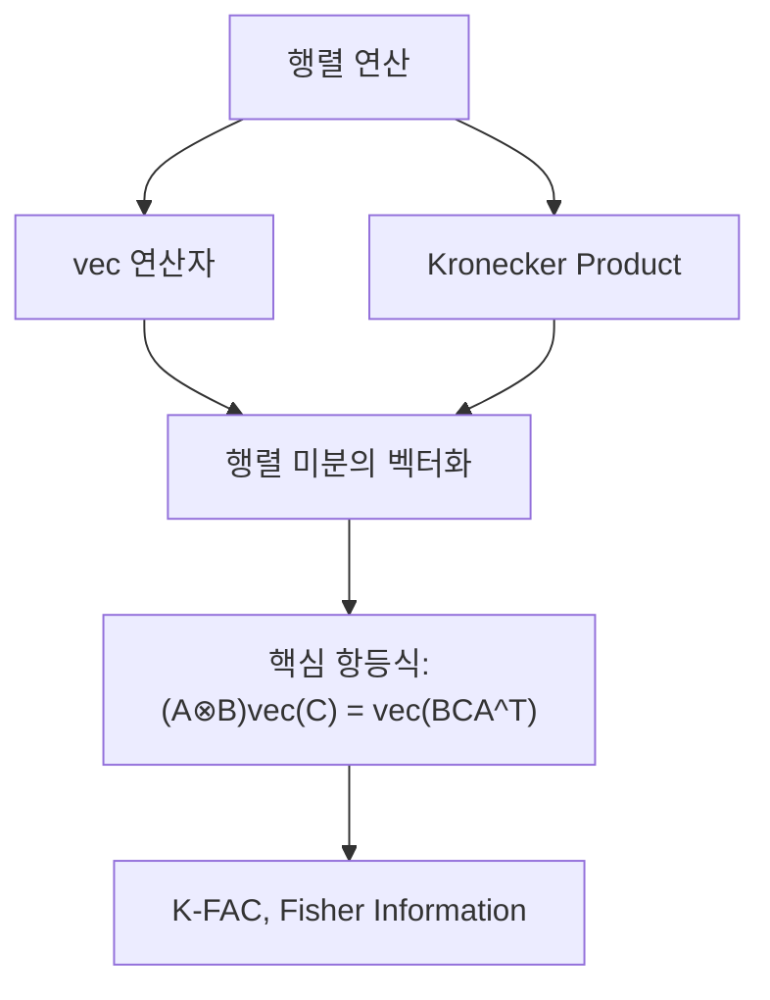

### 7.2 5단계 설명

#### 1단계 초등 (일상 비유, 수식 없음)

**vec**: 표(행렬)를 한 줄로 길게 펼치는 것이다. 2x3 표의 6개 칸을 위에서 아래, 왼쪽에서 오른쪽으로 읽어서 한 줄 리스트로 만든다.

**Kronecker Product**: 큰 퍼즐판의 각 칸에 작은 퍼즐 전체를 넣는 것이다. 2x2 퍼즐판의 각 칸에 3x3 퍼즐을 넣으면 6x6 초대형 퍼즐이 된다.

#### 2단계 중등 (간단한 수식, 시각적 예시)

**vec 연산자**: 열(column)을 위에서 아래로 쌓는다.

$$\text{vec}\begin{pmatrix} 1 & 2 \\ 3 & 4 \end{pmatrix} = \begin{pmatrix} 1 \\ 3 \\ 2 \\ 4 \end{pmatrix}$$

주의: **열 우선 순서**(column-major)이다! 1행이 아니라 1열부터 쌓는다.

**Kronecker Product**: $A$의 각 원소에 $B$ 전체를 곱한다.

$$\begin{pmatrix} 1 & 2 \\ 3 & 4 \end{pmatrix} \otimes \begin{pmatrix} 5 & 6 \\ 7 & 8 \end{pmatrix} = \begin{pmatrix} 1 \cdot 5 & 1 \cdot 6 & 2 \cdot 5 & 2 \cdot 6 \\ 1 \cdot 7 & 1 \cdot 8 & 2 \cdot 7 & 2 \cdot 8 \\ 3 \cdot 5 & 3 \cdot 6 & 4 \cdot 5 & 4 \cdot 6 \\ 3 \cdot 7 & 3 \cdot 8 & 4 \cdot 7 & 4 \cdot 8 \end{pmatrix} = \begin{pmatrix} 5 & 6 & 10 & 12 \\ 7 & 8 & 14 & 16 \\ 15 & 18 & 20 & 24 \\ 21 & 24 & 28 & 32 \end{pmatrix}$$

#### 3단계 고등 (수학적 표현, 증명)

**정의**: $A \in \mathbb{R}^{m \times n}$, $B \in \mathbb{R}^{p \times q}$에 대해:

$$A \otimes B \in \mathbb{R}^{mp \times nq}, \quad (A \otimes B)_{(i-1)p + k, (j-1)q + l} = a_{ij} b_{kl}$$

**핵심 항등식** ("행렬 미적분의 로제타 스톤"):

> **이 수식이 말하는 것은**: "행렬곱 $BCA^\top$을 vec로 펼치면, Kronecker product와 vec의 곱으로 표현된다."

$$(A \otimes B)\,\text{vec}(C) = \text{vec}(BCA^\top)$$

**Kronecker Product의 성질**:
- $(A \otimes B)(C \otimes D) = (AC) \otimes (BD)$ (혼합 곱 성질)
- $(A \otimes B)^{-1} = A^{-1} \otimes B^{-1}$ (역행렬의 분리!)
- $(A \otimes B)^\top = A^\top \otimes B^\top$

**역행렬 분리가 왜 혁명적인가**: $A \otimes B \in \mathbb{R}^{mp \times mp}$의 역행렬을 직접 구하면 $O((mp)^3)$이지만, $A^{-1} \otimes B^{-1}$은 $O(m^3 + p^3)$이면 된다!

#### 4단계 대학 (공식 전개 + Python 코드)

**행렬 미분에서의 활용**: $Y = AXB$를 $X$에 대해 미분하면?

$$\text{vec}(Y) = \text{vec}(AXB) = (B^\top \otimes A)\,\text{vec}(X)$$

따라서:

$$\frac{\partial \text{vec}(Y)}{\partial \text{vec}(X)} = B^\top \otimes A$$

```python
import numpy as np

# vec 연산자
A = np.array([[1, 2], [3, 4]])
vec_A = A.flatten(order='F')  # column-major!
print(f"vec(A) = {vec_A}")    # [1, 3, 2, 4]

# 주의: flatten()의 기본은 row-major
print(f"flatten() (row-major) = {A.flatten()}")  # [1, 2, 3, 4] -- 다르다!

# Kronecker product
B = np.array([[5, 6], [7, 8]])
K = np.kron(A, B)
print(f"\nA ⊗ B =\n{K}")

# 핵심 항등식 검증: (A ⊗ B)vec(C) = vec(BCA^T)
C = np.array([[1, 0], [0, 1]])
lhs = np.kron(A, B) @ C.flatten(order='F')
rhs = (B @ C @ A.T).flatten(order='F')
print(f"\n(A⊗B)vec(C) = {lhs}")
print(f"vec(BCA^T)   = {rhs}")
print(f"동일한가? {np.allclose(lhs, rhs)}")  # True

# 역행렬 분리 검증
K_inv_direct = np.linalg.inv(K)
K_inv_kron = np.kron(np.linalg.inv(A), np.linalg.inv(B))
print(f"\n직접 역행렬 = Kronecker 역행렬? {np.allclose(K_inv_direct, K_inv_kron)}")
```

#### 5단계 대학원 (논문 수준, 딥러닝 연결)

**K-FAC (Kronecker-Factored Approximate Curvature)**:

Fisher Information Matrix $F = E[\nabla \log p \cdot (\nabla \log p)^\top]$는 $n \times n$ ($n$ = 파라미터 수)으로 직접 계산이 불가능하다.

각 레이어의 가중치 gradient: $\text{vec}(\nabla_W L) = \mathbf{a} \otimes \mathbf{g}$ ($\mathbf{a}$: 입력 활성화, $\mathbf{g}$: 출력 gradient)

따라서 Fisher를 Kronecker 구조로 근사:

$$F_l \approx E[\mathbf{a}\mathbf{a}^\top] \otimes E[\mathbf{g}\mathbf{g}^\top] = A_l \otimes G_l$$

역행렬: $F_l^{-1} \approx A_l^{-1} \otimes G_l^{-1}$ -- 각 행렬을 **따로** 역행렬!

이것이 자연 경사(Natural Gradient)를 실용적으로 구현하는 핵심 아이디어이다.

### 7.3 오개념 경고

| 틀립니다 | 이해해야 합니다 |
|----------|----------------|
| "vec은 그냥 reshape이다" | vec은 **column-major** 순서로 쌓는다. NumPy `flatten()`은 기본 row-major이므로 `order='F'`를 명시해야 한다. |
| "Kronecker product는 이론적 장난감이다" | K-FAC, Kalman filter, Gaussian Process, LoRA 등 실전에서 핵심적으로 사용된다. |
| "행렬의 역행렬은 항상 비싸다" | Kronecker 구조 $A \otimes B$이면 역행렬 비용이 $O((mn)^3)$에서 $O(m^3 + n^3)$으로 극적으로 줄어든다. |

### 7.4 핵심 킬러 요약

> **vec = 행렬을 벡터로 펼치기 (열 우선)**, **Kronecker Product = 블록 스케일링**. 둘의 결합 $(A \otimes B)\text{vec}(C) = \text{vec}(BCA^\top)$이 행렬 미적분의 핵심 도구이며, K-FAC의 역행렬 분리 $F^{-1} \approx A^{-1} \otimes G^{-1}$이 실용적 2차 최적화를 가능케 한다.

---

# PART 4: 핵심 함수와 부등식

---

## 8. Softmax의 Jacobian

### 8.0 동기부여

> **이걸 배우면...** 딥러닝 분류 문제에서 "왜 Softmax + Cross-Entropy 조합이 표준인지"를 수학적으로 이해한다. 이 조합의 역전파 결과가 $p - y$라는 놀랍도록 단순한 형태가 되는 이유는 Softmax Jacobian의 구조적 성질에 있다.

### 8.1 선행 개념 맵

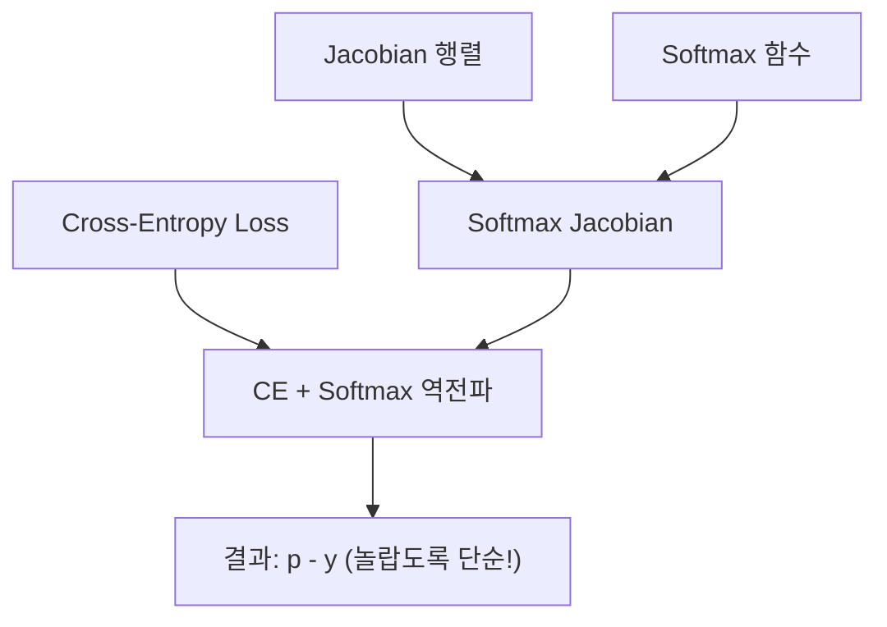

### 8.2 5단계 설명

#### 1단계 초등 (일상 비유, 수식 없음)

Softmax는 "투표 결과를 비율로 바꾸는 것"이다. 후보 A가 7표, B가 3표, C가 1표를 받으면, A의 당선 확률은 7/(7+3+1) = 약 64%이다.

Softmax Jacobian이 말해주는 것은: "한 후보의 점수가 오르면, 그 후보의 확률은 올라가고 **다른 모든 후보의 확률은 내려간다**"는 것이다. 이것이 **경쟁 관계**이다.

#### 2단계 중등 (간단한 수식, 시각적 예시)

Softmax 함수:

$$p_i = \frac{e^{z_i}}{\sum_k e^{z_k}}$$

**구체적 숫자**: $z = [2.0, 1.0, 0.1]$이면:
- $e^2 \approx 7.39$, $e^1 \approx 2.72$, $e^{0.1} \approx 1.11$
- 합: $11.22$
- $p \approx [0.659, 0.242, 0.099]$

Jacobian의 $(i,j)$ 원소 $\frac{\partial p_i}{\partial z_j}$:
- $i = j$일 때: $p_i(1 - p_i)$ -- "자기 확률의 변화율" (항상 양수)
- $i \neq j$일 때: $-p_i p_j$ -- "경쟁자의 영향" (항상 음수)

#### 3단계 고등 (수학적 표현, 증명)

**Softmax Jacobian 유도**:

> **이 수식이 말하는 것은**: "각 출력 확률이 각 입력 logit에 얼마나 민감한지"를 나타내는 행렬이다.

$$\frac{\partial p_i}{\partial z_j} = p_i(\delta_{ij} - p_j)$$

여기서 $\delta_{ij}$는 Kronecker 델타 ($i=j$이면 1, 아니면 0).

**증명 ($i = j$ 경우)**:

$$\frac{\partial p_i}{\partial z_i} = \frac{\partial}{\partial z_i}\frac{e^{z_i}}{S} = \frac{e^{z_i} \cdot S - e^{z_i} \cdot e^{z_i}}{S^2} = p_i - p_i^2 = p_i(1 - p_i)$$

**증명 ($i \neq j$ 경우)**:

$$\frac{\partial p_i}{\partial z_j} = \frac{0 - e^{z_i} \cdot e^{z_j}}{S^2} = -p_i p_j$$

**행렬 형태**: $J = \text{diag}(\mathbf{p}) - \mathbf{p}\mathbf{p}^\top$

**Cross-Entropy + Softmax 역전파**:

$$L = -\sum_i y_i \log p_i, \quad \frac{\partial L}{\partial p_i} = -\frac{y_i}{p_i}$$

Chain Rule: $\frac{\partial L}{\partial z_j} = \sum_i \frac{\partial L}{\partial p_i} \cdot \frac{\partial p_i}{\partial z_j}$

$$= \sum_i \left(-\frac{y_i}{p_i}\right) p_i(\delta_{ij} - p_j) = -y_j + p_j\sum_i y_i = p_j - y_j$$

($\sum_i y_i = 1$이므로)

$$\boxed{\frac{\partial L}{\partial \mathbf{z}} = \mathbf{p} - \mathbf{y}}$$

#### 4단계 대학 (공식 전개 + Python 코드)

```python
import torch
import torch.nn.functional as F
import numpy as np

# Softmax Jacobian 직접 계산
z = torch.tensor([2.0, 1.0, 0.1])
p = F.softmax(z, dim=0)
print(f"p = {p}")  # [0.659, 0.242, 0.099]

# Jacobian: diag(p) - p*p^T
J = torch.diag(p) - p.unsqueeze(1) @ p.unsqueeze(0)
print(f"\nSoftmax Jacobian:\n{J}")

# 검증: autograd로 계산한 Jacobian과 비교
z_auto = z.clone().requires_grad_(True)
J_auto = torch.autograd.functional.jacobian(
    lambda x: F.softmax(x, dim=0), z_auto
)
print(f"\nAutograd Jacobian:\n{J_auto}")
print(f"일치 여부: {torch.allclose(J, J_auto, atol=1e-6)}")

# CE + Softmax 역전파: p - y
y = torch.tensor([1.0, 0.0, 0.0])  # one-hot
z_bp = torch.tensor([2.0, 1.0, 0.1], requires_grad=True)
log_p = F.log_softmax(z_bp, dim=0)
loss = -torch.sum(y * log_p)
loss.backward()

p_result = F.softmax(z_bp.detach(), dim=0)
print(f"\n역전파 결과 dL/dz = {z_bp.grad}")
print(f"p - y = {p_result - y}")
print(f"일치 여부: {torch.allclose(z_bp.grad, p_result - y, atol=1e-6)}")
```

#### 5단계 대학원 (논문 수준, 딥러닝 연결)

**왜 $p - y$가 "좋은" gradient인가**:

1. **직관적 의미**: 정답 클래스($y_i = 1$)에서는 $p_i - 1 < 0$ -> 해당 logit을 **올려야** 한다. 오답 클래스에서는 $p_j > 0$ -> 해당 logit을 **낮춰야** 한다.

2. **자동 스케일링**: 예측이 확신에 찬 오답일수록 ($p_{\text{wrong}} \approx 1$) gradient가 크고, 맞았을수록 ($p_{\text{correct}} \approx 1$) gradient가 0에 가깝다. Label smoothing은 이 성질을 조절한다.

3. **Softmax Temperature**: $p_i = \frac{e^{z_i/\tau}}{\sum_k e^{z_k/\tau}}$에서 $\tau$는 gradient의 크기를 조절한다. Knowledge distillation (Hinton et al., 2015)에서 높은 $\tau$로 "dark knowledge"를 전달한다.

**최대 엔트로피(MaxEnt) 관점**: Softmax는 에너지 제약 하의 MaxEnt 분포 = Gibbs/Boltzmann 분포이다. 이것은 "주어진 정보 하에서 가장 편향 없는 확률 분포"라는 정보 이론적 정당화를 제공한다.

### 8.3 오개념 경고

| 틀립니다 | 이해해야 합니다 |
|----------|----------------|
| "Softmax는 단순한 정규화이다" | Softmax = MaxEnt 원리에서 유도된 Gibbs 분포. 수학적 근거가 깊다. |
| "CE + Softmax 역전파가 단순한 것은 우연이다" | $p - y$가 나오는 것은 Softmax Jacobian의 $p_i(\delta_{ij} - p_j)$ 구조 때문이다. |
| "Softmax의 입력은 확률이다" | 입력은 logit(임의의 실수). Softmax가 이를 확률로 변환한다. |

### 8.4 핵심 킬러 요약

> **Softmax Jacobian: $J_{ij} = p_i(\delta_{ij} - p_j)$**. 대각 원소는 자기 민감도, 비대각 원소는 경쟁 관계. CE + Softmax의 역전파가 $p - y$로 깔끔해지는 것은 이 구조 덕분이며, 이것이 분류 문제의 사실상 표준 조합인 수학적 이유이다.

---

## 9. 볼록함수(Convex Function)

### 9.0 동기부여

> **이걸 배우면...** "이 최적화 문제가 전역 최솟값을 보장하는가?"라는 근본 질문에 답할 수 있다. 볼록함수이면 모든 극소가 전역 최소이므로, SGD로도 반드시 최적해에 도달한다.

### 9.1 선행 개념 맵

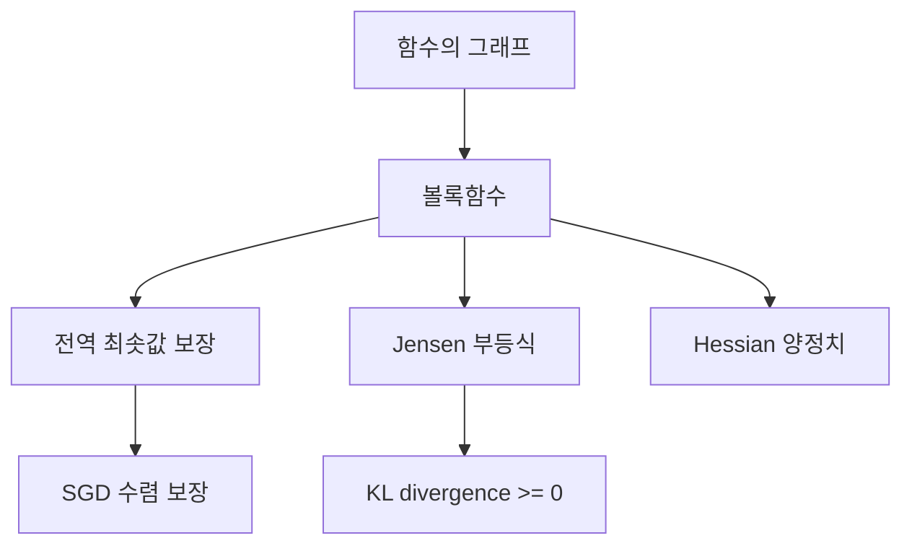

### 9.2 5단계 설명

#### 1단계 초등 (일상 비유, 수식 없음)

그릇(볼)을 떠올려보자. 그릇 안에 구슬을 굴리면, 어디에서 굴려도 결국 같은 바닥으로 모인다. 이것이 **볼록함수**이다 -- 어디서 시작하든 가장 낮은 곳(전역 최솟값)에 도달한다.

반대로, 울퉁불퉁한 산에서는 어디서 출발하느냐에 따라 다른 골짜기(국소 최솟값)에 빠질 수 있다. 이것은 볼록하지 않은 함수이다.

#### 2단계 중등 (간단한 수식, 시각적 예시)

**볼록함수의 정의** (직관적): 함수 위의 두 점을 잇는 **직선(현)**이 항상 함수 그래프 **위에** 있다.

$$f(\lambda x + (1-\lambda) y) \leq \lambda f(x) + (1-\lambda) f(y), \quad \forall \lambda \in [0, 1]$$

**구체적 숫자**: $f(x) = x^2$에서 $x = 1, y = 3$, $\lambda = 0.5$:
- 좌변: $f(0.5 \cdot 1 + 0.5 \cdot 3) = f(2) = 4$
- 우변: $0.5 \cdot f(1) + 0.5 \cdot f(3) = 0.5 + 4.5 = 5$
- $4 \leq 5$ -- 성립! $x^2$은 볼록.

**볼록한 함수 예시**: $x^2$, $|x|$, $e^x$, $-\log x$
**볼록하지 않은 함수 예시**: $\sin x$, $x^3$, 딥러닝 손실함수

#### 3단계 고등 (수학적 표현, 증명)

**볼록성의 3가지 동치 조건** (2회 미분 가능한 경우):

1. **정의**: $f(\lambda x + (1-\lambda)y) \leq \lambda f(x) + (1-\lambda)f(y)$
2. **1차 조건**: $f(y) \geq f(x) + \nabla f(x)^\top (y - x)$ -- "접선이 항상 함수 아래"
3. **2차 조건**: $\nabla^2 f(x) \succeq 0$ (Hessian이 양반정치) -- 모든 곳에서

> **이 수식이 말하는 것은**: "1차 조건은 함수가 접선 위에 놓인다는 것, 2차 조건은 곡률이 항상 위로 볼록하다는 것이다."

**핵심 정리**: $f$가 볼록이면 **모든 극소는 전역 최소**이다.

**증명**: $x^*$가 극소라 하자. $f$가 볼록이면 1차 조건에 의해 모든 $y$에 대해 $f(y) \geq f(x^*) + \nabla f(x^*)^\top(y - x^*) = f(x^*)$ ($\nabla f(x^*) = 0$이므로). 따라서 $x^*$는 전역 최소.

#### 4단계 대학 (공식 전개 + Python 코드)

**강볼록(Strongly Convex) 함수**: 상수 $\mu > 0$가 존재하여:

$$f(y) \geq f(x) + \nabla f(x)^\top(y-x) + \frac{\mu}{2}\|y - x\|^2$$

이것은 "$f$가 적어도 $\frac{\mu}{2}\|x\|^2$만큼은 볼록하다"는 의미이다.

- 일반 볼록: 극소 = 전역 최소 (유일하지 않을 수 있음)
- 강볼록: 전역 최소가 **유일**하며, 수렴 속도가 **지수적**

```python
import numpy as np
import matplotlib.pyplot as plt

# 볼록함수 검증: f(x) = x^2
def check_convex(f, x, y, lam=0.5):
    lhs = f(lam*x + (1-lam)*y)
    rhs = lam*f(x) + (1-lam)*f(y)
    return lhs <= rhs + 1e-10

f_convex = lambda x: x**2
f_nonconvex = lambda x: np.sin(x)

print(f"x^2은 볼록? {check_convex(f_convex, 1, 3)}")      # True
print(f"sin(x)은 볼록? {check_convex(f_nonconvex, 0, np.pi)}")  # False

# 시각화: 볼록 vs 비볼록
fig, axes = plt.subplots(1, 2, figsize=(12, 5))

x = np.linspace(-3, 3, 200)

# 볼록: x^2
axes[0].plot(x, x**2, 'b-', linewidth=2, label='$f(x) = x^2$ (볼록)')
axes[0].plot([1, 3], [1, 9], 'r--', label='현(chord)')
axes[0].fill_between([1, 3], [1, 9], [1**2, 3**2],
                     alpha=0.2, color='green', label='현 >= 함수')
axes[0].set_title('볼록함수: 현이 항상 위에')
axes[0].legend()

# 비볼록: sin(x)
axes[1].plot(x, np.sin(x), 'b-', linewidth=2, label='$f(x) = \\sin(x)$ (비볼록)')
axes[1].plot([0, np.pi], [0, 0], 'r--', label='현(chord)')
axes[1].set_title('비볼록함수: 현이 아래로 내려감')
axes[1].legend()

plt.tight_layout()
plt.savefig('convex_vs_nonconvex.png', dpi=100)
plt.show()

# Hessian으로 볼록성 확인
def check_convex_hessian():
    """f(x,y) = x^2 + y^2 (볼록), g(x,y) = x^2 - y^2 (비볼록)"""
    # f의 Hessian
    H_f = np.array([[2, 0], [0, 2]])
    eigvals_f = np.linalg.eigvalsh(H_f)
    print(f"\nx^2+y^2의 Hessian 고유값: {eigvals_f}")
    print(f"양반정치(볼록)? {(eigvals_f >= 0).all()}")  # True

    # g의 Hessian
    H_g = np.array([[2, 0], [0, -2]])
    eigvals_g = np.linalg.eigvalsh(H_g)
    print(f"x^2-y^2의 Hessian 고유값: {eigvals_g}")
    print(f"양반정치(볼록)? {(eigvals_g >= 0).all()}")  # False (안장점)

check_convex_hessian()
```

#### 5단계 대학원 (논문 수준, 딥러닝 연결)

**딥러닝 손실함수는 비볼록이다**: 신경망의 손실 함수 $L(\theta)$는 일반적으로 비볼록이다. 그러나:

1. **Overparameterization**: 파라미터가 데이터보다 훨씬 많으면, 극소들의 손실값이 거의 동일하다 (모두 거의 전역 최소). 따라서 "어떤 극소에 도달하든 괜찮다" (Zhang et al., 2021).

2. **Neural Tangent Kernel (NTK)**: 무한 폭 신경망에서 학습 동역학이 **커널 회귀**(볼록!)와 동치임이 증명되었다 (Jacot et al., 2018).

3. **Loss Landscape의 구조**: 딥러닝 손실 표면은 "안장점이 지배적이고, 극소는 대부분 유사한 값"이라는 실증적/이론적 결과가 축적되고 있다.

**볼록 최적화가 여전히 중요한 이유**: 볼록 이론의 분석 도구(수렴 속도 증명, smoothness 조건 등)가 비볼록 최적화 분석에도 핵심적으로 사용된다.

### 9.3 오개념 경고

| 틀립니다 | 이해해야 합니다 |
|----------|----------------|
| "딥러닝 손실이 볼록이라 SGD가 잘 된다" | 딥러닝 손실은 **비볼록**이다. SGD가 작동하는 이유는 overparameterization, 안장점 구조 등 다른 요인이다. |
| "볼록이 아니면 최적화가 불가능하다" | 비볼록에서도 "충분히 좋은" 극소를 찾을 수 있으며, 딥러닝이 그 증거이다. |

### 9.4 핵심 킬러 요약

> **볼록함수 = "그릇 모양" = 모든 극소가 전역 최소**. Hessian이 모든 곳에서 양반정치이면 볼록이다. 딥러닝은 비볼록이지만, 볼록 이론의 분석 도구(smoothness, 수렴 속도)는 비볼록 분석에도 핵심적으로 활용된다.

---

## 10. Jensen 부등식

### 10.0 동기부여

> **이걸 배우면...** 볼록성으로부터 정보 이론의 핵심 결과(KL divergence >= 0, EM 알고리즘의 정당화, VAE의 ELBO)를 유도할 수 있다. "볼록함수에 평균을 넣은 것 <= 볼록함수값의 평균"이라는 단 하나의 부등식에서 엄청나게 많은 결과가 나온다.

### 10.1 선행 개념 맵

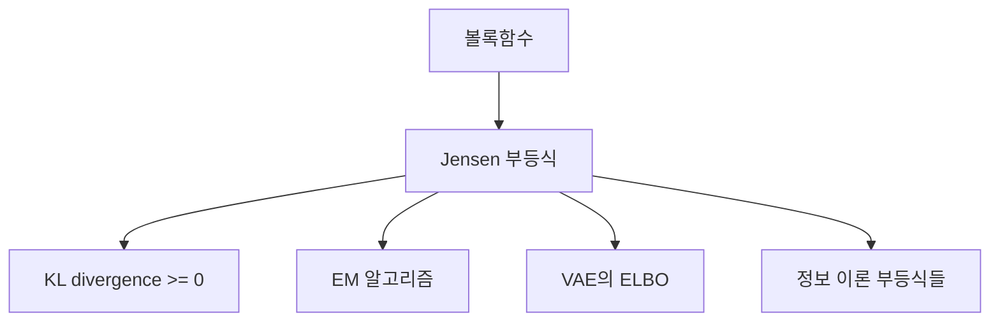

### 10.2 5단계 설명

#### 1단계 초등 (일상 비유, 수식 없음)

시험 점수의 **제곱의 평균**과 **평균의 제곱** 중 어느 것이 더 클까?

친구 3명의 점수가 60, 80, 100이면:
- 제곱의 평균: $(3600 + 6400 + 10000)/3 = 6667$
- 평균의 제곱: $80^2 = 6400$

**제곱의 평균 >= 평균의 제곱**! 이것이 Jensen 부등식이다.

"볼록한 변환을 한 후 평균을 내는 것이, 평균을 낸 후 볼록한 변환을 하는 것보다 항상 크거나 같다."

#### 2단계 중등 (간단한 수식, 시각적 예시)

**Jensen 부등식**: $\varphi$가 볼록이면:

$$\varphi\!\left(\frac{x_1 + x_2 + \cdots + x_n}{n}\right) \leq \frac{\varphi(x_1) + \varphi(x_2) + \cdots + \varphi(x_n)}{n}$$

확률 가중 버전: $\varphi(E[X]) \leq E[\varphi(X)]$

**구체적 숫자**: $\varphi(x) = x^2$ (볼록), $X = \{1, 3\}$ 균등:
- 좌변: $\varphi(E[X]) = \varphi(2) = 4$
- 우변: $E[\varphi(X)] = (1 + 9)/2 = 5$
- $4 \leq 5$ -- 성립!

$\varphi$가 **오목**이면 부등호 방향이 반대: $\varphi(E[X]) \geq E[\varphi(X)]$

#### 3단계 고등 (수학적 표현, 증명)

**일반적 형태**:

> **이 수식이 말하는 것은**: "볼록함수의 내부에 기댓값을 넣은 것이 기댓값의 외부에 볼록함수를 적용한 것보다 작거나 같다."

$$\varphi\!\left(\sum_i \lambda_i x_i\right) \leq \sum_i \lambda_i \varphi(x_i), \quad \lambda_i \geq 0, \sum_i \lambda_i = 1$$

연속 버전: $\varphi(E_p[X]) \leq E_p[\varphi(X)]$

**증명 (2점)**: 볼록 정의에서 $\lambda_1 = \lambda$, $\lambda_2 = 1 - \lambda$로 놓으면 즉시 성립.

**증명 ($n$점, 귀납법)**: $n-1$에서 성립 가정. $n$점에서:

$$\varphi\!\left(\lambda_1 x_1 + \cdots + \lambda_n x_n\right) = \varphi\!\left(\lambda_1 x_1 + (1-\lambda_1)\sum_{i=2}^n \frac{\lambda_i}{1-\lambda_1} x_i\right)$$

2점 볼록 부등식 적용 후 귀납법 적용하면 완료.

#### 4단계 대학 (공식 전개 + Python 코드)

**KL divergence $\geq 0$의 증명** (Jensen 부등식 활용):

$$D_{KL}(p \| q) = E_p\!\left[\log\frac{p(x)}{q(x)}\right] = -E_p\!\left[\log\frac{q(x)}{p(x)}\right]$$

$-\log$는 볼록이므로 Jensen 부등식 적용:

$$\geq -\log E_p\!\left[\frac{q(x)}{p(x)}\right] = -\log \sum_x p(x)\frac{q(x)}{p(x)} = -\log \sum_x q(x) = -\log 1 = 0$$

$$\therefore D_{KL}(p \| q) \geq 0$$

```python
import numpy as np

# Jensen 부등식 검증
x = np.array([1.0, 3.0, 5.0, 7.0])
weights = np.array([0.25, 0.25, 0.25, 0.25])

# 볼록함수: x^2
phi = lambda t: t**2
lhs = phi(np.dot(weights, x))           # phi(E[X])
rhs = np.dot(weights, phi(x))           # E[phi(X)]
print(f"볼록(x^2): phi(E[X]) = {lhs:.2f} <= E[phi(X)] = {rhs:.2f}")

# 오목함수: log(x)
phi_log = lambda t: np.log(t)
lhs_log = phi_log(np.dot(weights, x))
rhs_log = np.dot(weights, phi_log(x))
print(f"오목(log): phi(E[X]) = {lhs_log:.4f} >= E[phi(X)] = {rhs_log:.4f}")

# KL divergence >= 0 검증
p = np.array([0.2, 0.3, 0.5])
q = np.array([0.1, 0.4, 0.5])
kl = np.sum(p * np.log(p / q))
print(f"\nKL(p||q) = {kl:.6f} >= 0? {kl >= -1e-10}")

# 항상 >= 0임을 랜덤 테스트
for _ in range(1000):
    p_rand = np.random.dirichlet(np.ones(5))
    q_rand = np.random.dirichlet(np.ones(5))
    kl_rand = np.sum(p_rand * np.log(p_rand / q_rand))
    assert kl_rand >= -1e-10, "KL < 0 발견!"
print("1000개 랜덤 테스트 통과: KL >= 0 항상 성립")
```

#### 5단계 대학원 (논문 수준, 딥러닝 연결)

**VAE의 ELBO 유도**:

$$\log p(x) = \log \int p(x|z)p(z)dz = \log E_{q(z|x)}\!\left[\frac{p(x|z)p(z)}{q(z|x)}\right]$$

Jensen 부등식 ($\log$는 오목):

$$\geq E_{q(z|x)}\!\left[\log\frac{p(x|z)p(z)}{q(z|x)}\right] = \underbrace{E_q[\log p(x|z)]}_{\text{재구성 항}} - \underbrace{D_{KL}(q(z|x)\|p(z))}_{\text{정규화 항}}$$

이 하한이 **ELBO (Evidence Lower Bound)**이며, VAE의 학습 목적함수이다.

**EM 알고리즘**: E-step에서 Jensen 부등식으로 하한을 구성하고, M-step에서 하한을 최대화. 이것이 mixture model, topic model 등의 학습 기반이다.

### 10.3 오개념 경고

| 틀립니다 | 이해해야 합니다 |
|----------|----------------|
| "Jensen 부등식은 이론적 장난감이다" | KL >= 0, ELBO, EM 알고리즘, 정보 이론의 핵심 부등식이 모두 Jensen에서 나온다. |
| "오목함수에도 같은 방향이다" | 오목이면 부등호가 **반대**이다. $\log(E[X]) \geq E[\log X]$. |

### 10.4 핵심 킬러 요약

> **Jensen 부등식: $\varphi(E[X]) \leq E[\varphi(X)]$ (볼록)**. 이 하나의 부등식에서 KL >= 0, ELBO, EM 알고리즘이 모두 유도된다. "볼록함수에 평균을 넣은 것 <= 평균에 볼록함수를 적용한 것"을 기억하라.

---

# PART 5: 최적화 이론

---

## 11. 경사하강법(Gradient Descent)

### 11.0 동기부여

> **이걸 배우면...** 딥러닝의 가장 기본적인 학습 알고리즘의 수학적 원리, 수렴 조건, 학습률 선택의 이론적 근거를 이해한다. "왜 학습률이 너무 크면 발산하고, 너무 작으면 느린가?"에 대한 정확한 답을 얻는다.

### 11.1 선행 개념 맵

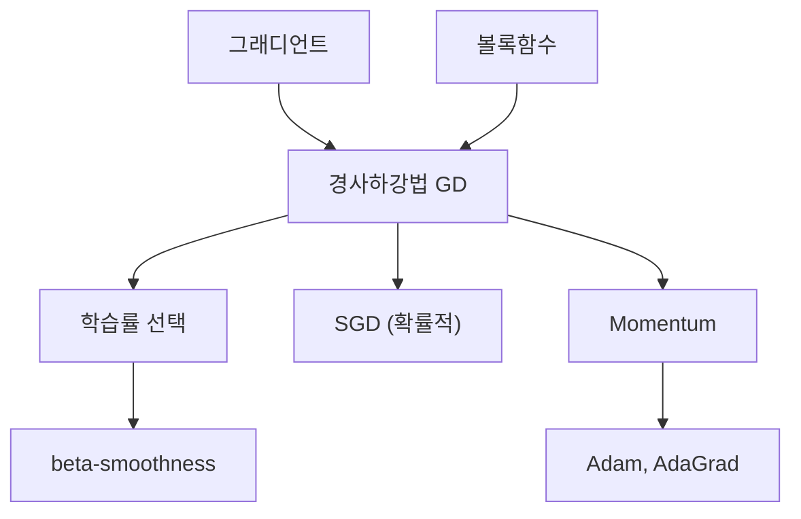

### 11.2 5단계 설명

#### 1단계 초등 (일상 비유, 수식 없음)

안개 낀 산에서 가장 낮은 골짜기를 찾아 내려가는 방법:

1. 발밑의 기울기를 느낀다 (= 그래디언트 계산)
2. 가장 가파르게 내려가는 방향으로 **한 걸음** 간다 (= 파라미터 업데이트)
3. 1-2를 반복한다

"걸음의 크기"(= 학습률)가 중요하다:
- 너무 작으면: 평생 걸어도 바닥에 못 도착
- 너무 크면: 골짜기를 뛰어넘어 반대편 산으로 튕겨나감
- 적당하면: 효율적으로 바닥에 도착

#### 2단계 중등 (간단한 수식, 시각적 예시)

**업데이트 규칙**:

$$\theta_{t+1} = \theta_t - \eta \nabla L(\theta_t)$$

- $\theta$: 파라미터 (가중치)
- $\eta$: 학습률 (step size)
- $\nabla L$: 손실함수의 gradient

**구체적 숫자**: $L(\theta) = \theta^2$ (가장 간단한 볼록함수), $\theta_0 = 10$, $\eta = 0.1$:

| 단계 | $\theta$ | $\nabla L = 2\theta$ | $L(\theta)$ |
|------|----------|----------------------|------------|
| 0 | 10 | 20 | 100 |
| 1 | $10 - 0.1 \times 20 = 8$ | 16 | 64 |
| 2 | $8 - 0.1 \times 16 = 6.4$ | 12.8 | 40.96 |
| 5 | 3.277 | 6.554 | 10.74 |
| 10 | 1.074 | 2.147 | 1.153 |
| 20 | 0.115 | 0.231 | 0.013 |

매 단계 $\theta$가 $(1 - 2\eta) = 0.8$ 배로 줄어든다!

#### 3단계 고등 (수학적 표현, 증명)

**수렴 분석 (이차 함수)**:

$L(\theta) = \frac{a}{2}\theta^2$이면 $\nabla L = a\theta$이고:

$$\theta_{t+1} = (1 - \eta a)\theta_t$$

$$\therefore \theta_t = (1 - \eta a)^t \theta_0$$

**수렴 조건**: $|1 - \eta a| < 1$, 즉 $0 < \eta < \frac{2}{a}$

> **이 수식이 말하는 것은**: "학습률이 Hessian(여기서는 $a$)의 역수의 2배를 넘으면 발산한다."

**다변수 확장**: $L(\theta) = \frac{1}{2}\theta^\top A\theta$이면 $A$의 고유값 $\lambda_1 \leq \cdots \leq \lambda_n$에 대해:

- 수렴 조건: $\eta < \frac{2}{\lambda_{\max}}$
- 최적 학습률: $\eta^* = \frac{2}{\lambda_{\max} + \lambda_{\min}}$
- 수렴 속도: $\left(\frac{\lambda_{\max} - \lambda_{\min}}{\lambda_{\max} + \lambda_{\min}}\right)^t = \left(\frac{\kappa - 1}{\kappa + 1}\right)^t$ ($\kappa = \frac{\lambda_{\max}}{\lambda_{\min}}$: 조건수)

**조건수가 클수록 수렴이 느리다**: $\kappa = 100$이면 수렴 비율 $\approx 0.98$, $\kappa = 10000$이면 $\approx 0.9998$.

#### 4단계 대학 (공식 전개 + Python 코드)

```python
import torch
import numpy as np
import matplotlib.pyplot as plt

# 1. 학습률에 따른 수렴/발산 시각화
def gd_quadratic(a, eta, theta0, steps):
    """L(theta) = a/2 * theta^2에 대한 GD"""
    theta_history = [theta0]
    theta = theta0
    for _ in range(steps):
        grad = a * theta
        theta = theta - eta * grad
        theta_history.append(theta)
    return theta_history

a = 2.0
fig, axes = plt.subplots(1, 3, figsize=(15, 4))
for idx, (eta, title) in enumerate([
    (0.1, '느린 수렴 (eta=0.1)'),
    (0.5, '최적 수렴 (eta=0.5=1/a)'),
    (1.1, '발산! (eta=1.1 > 2/a)')
]):
    history = gd_quadratic(a, eta, 10.0, 30)
    axes[idx].plot(history, 'b.-')
    axes[idx].set_title(title)
    axes[idx].set_xlabel('Step')
    axes[idx].set_ylabel('theta')
    axes[idx].axhline(y=0, color='r', linestyle='--')
plt.tight_layout()
plt.savefig('gd_learning_rate.png', dpi=100)
plt.show()

# 2. 조건수와 수렴 속도
def gd_2d(A, eta, x0, steps):
    """L(x) = 0.5 * x^T A x에 대한 GD"""
    x_history = [x0.copy()]
    x = x0.copy()
    for _ in range(steps):
        grad = A @ x
        x = x - eta * grad
        x_history.append(x.copy())
    return np.array(x_history)

# 조건수 1 (등방적)
A1 = np.diag([1.0, 1.0])
# 조건수 10 (비등방적)
A2 = np.diag([1.0, 10.0])

x0 = np.array([5.0, 5.0])

traj1 = gd_2d(A1, 0.5, x0, 20)   # eta = 2/(1+1) = 1
traj2 = gd_2d(A2, 0.18, x0, 50)  # eta = 2/(1+10) ~ 0.18

fig, axes = plt.subplots(1, 2, figsize=(12, 5))
for ax, traj, A, title in [
    (axes[0], traj1, A1, 'kappa=1 (20 steps)'),
    (axes[1], traj2, A2, 'kappa=10 (50 steps)')
]:
    # 등고선
    xg = np.linspace(-6, 6, 100)
    yg = np.linspace(-6, 6, 100)
    Xg, Yg = np.meshgrid(xg, yg)
    Zg = 0.5*(A[0,0]*Xg**2 + A[1,1]*Yg**2)
    ax.contour(Xg, Yg, Zg, levels=20, cmap='coolwarm')
    ax.plot(traj[:,0], traj[:,1], 'k.-', markersize=3)
    ax.plot(0, 0, 'r*', markersize=15)
    ax.set_title(title)
    ax.set_aspect('equal')
plt.tight_layout()
plt.savefig('gd_condition_number.png', dpi=100)
plt.show()
```

#### 5단계 대학원 (논문 수준, 딥러닝 연결)

**SGD의 암묵적 정규화(Implicit Regularization)**:

SGD의 노이즈(미니배치 gradient의 분산)는 단순한 "오차"가 아니라 **정규화 효과**를 가진다:
- 큰 배치: 낮은 노이즈 -> 날카로운(sharp) 극소로 수렴 (일반화 나쁨)
- 작은 배치: 높은 노이즈 -> 평평한(flat) 극소로 수렴 (일반화 좋음)

이것이 "SGD가 Adam보다 일반화가 좋다"는 경험적 관찰의 이론적 배경이다 (Keskar et al., 2017).

**Langevin 동역학으로의 연결**: SGD를 연속 시간으로 모델링하면:

$$d\theta = -\nabla L(\theta) dt + \sqrt{\frac{2\eta}{\beta}} dW_t$$

이것은 온도 $T = \eta/\beta$인 Langevin 동역학이며, 정상 분포(stationary distribution)는 Gibbs 분포 $p(\theta) \propto e^{-\beta L(\theta)}$이다.

### 11.3 오개념 경고

| 틀립니다 | 이해해야 합니다 |
|----------|----------------|
| "학습률은 경험적으로만 정한다" | 이론적 상한 $\eta < 2/\lambda_{\max} = 1/\beta$ (beta-smoothness)이 존재한다. |
| "SGD의 노이즈는 나쁘다" | 노이즈는 암묵적 정규화 효과가 있어 일반화를 돕는다. |
| "배치 크기가 클수록 항상 좋다" | 큰 배치는 sharp minima로 수렴할 수 있어 일반화가 나빠질 수 있다. |

### 11.4 핵심 킬러 요약

> **경사하강법: $\theta \leftarrow \theta - \eta \nabla L$**. 학습률 $\eta < 2/\lambda_{\max}$이면 수렴, 넘으면 발산. 조건수 $\kappa$가 클수록 느림. SGD의 노이즈는 정규화 효과를 가지며, 이것이 딥러닝에서 SGD가 잘 작동하는 이유 중 하나이다.

---

## 12. $\beta$-Smoothness

### 12.0 동기부여

> **이걸 배우면...** "이 함수에서 경사하강법이 수렴하려면 학습률을 얼마로 잡아야 하는가?"에 대한 이론적으로 정확한 답을 얻는다. $\beta$-smoothness는 경사하강법의 수렴 속도 증명에서 가장 핵심적인 가정이다.

### 12.1 선행 개념 맵

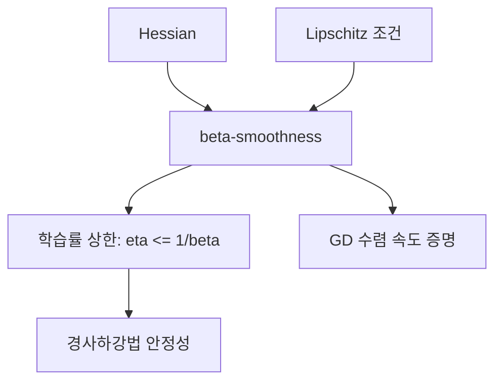

### 12.2 5단계 설명

#### 1단계 초등 (일상 비유, 수식 없음)

산의 **경사가 갑자기 바뀌는 정도**를 생각해보자. 완만한 언덕에서는 한 걸음 걸어도 기울기가 별로 안 변하지만(smooth), 깎아지른 절벽 옆에서는 한 걸음에 기울기가 급변한다(not smooth).

$\beta$-smoothness는 "기울기가 최대 얼마나 빠르게 변할 수 있는지"의 한계이다. 이 한계가 작을수록(=더 smooth할수록) 큰 걸음으로도 안전하게 내려갈 수 있다.

#### 2단계 중등 (간단한 수식, 시각적 예시)

**$\beta$-smoothness 정의**: gradient가 Lipschitz 연속:

$$\|\nabla f(x) - \nabla f(y)\| \leq \beta \|x - y\|$$

**구체적 숫자**: $f(x) = \frac{3}{2}x^2$이면 $\nabla f = 3x$:
- $\|\nabla f(2) - \nabla f(5)\| = |6 - 15| = 9$
- $\beta \|2 - 5\| = 3 \times 3 = 9$
- 등호 성립! $\beta = 3$ (= Hessian의 최대 고유값)

**의미**: "두 점 사이의 gradient 변화가 두 점 사이의 거리의 $\beta$배를 넘지 않는다."

#### 3단계 고등 (수학적 표현, 증명)

**동치 조건** (2회 미분 가능할 때):

> **이 수식이 말하는 것은**: "Hessian의 모든 고유값이 $\beta$ 이하이면, gradient가 $\beta$-Lipschitz이다."

$$\nabla^2 f(x) \preceq \beta I \quad \forall x \quad \Longleftrightarrow \quad \|\nabla f(x) - \nabla f(y)\| \leq \beta \|x - y\|$$

**핵심 부등식** ($\beta$-smooth 함수의 2차 상한):

$$f(y) \leq f(x) + \nabla f(x)^\top(y - x) + \frac{\beta}{2}\|y - x\|^2$$

이것은 "2차 Taylor 전개에서 Hessian 항을 $\beta I$로 상한 잡은 것"이다.

**GD 수렴 증명의 핵심 단계**: $y = x - \frac{1}{\beta}\nabla f(x)$로 놓으면:

$$f(y) \leq f(x) - \frac{1}{2\beta}\|\nabla f(x)\|^2$$

즉, $\eta = 1/\beta$로 GD를 하면, 매 단계 **최소한** $\frac{1}{2\beta}\|\nabla f\|^2$만큼 함수값이 감소한다.

#### 4단계 대학 (공식 전개 + Python 코드)

**GD 수렴 정리** ($\beta$-smooth 볼록):

$$f(x_T) - f(x^*) \leq \frac{\beta \|x_0 - x^*\|^2}{2T}$$

- $T$: 반복 횟수
- 수렴 속도: $O(1/T)$
- $\epsilon$-정확도에 도달하는 반복: $O(\beta/\epsilon)$

**$\beta$-smooth + $\mu$-strongly convex**:

$$f(x_T) - f(x^*) \leq \left(1 - \frac{\mu}{\beta}\right)^T [f(x_0) - f(x^*)]$$

- 선형(지수적) 수렴!
- 수렴 비율: $1 - 1/\kappa$ ($\kappa = \beta/\mu$: 조건수)

```python
import numpy as np
import matplotlib.pyplot as plt

# beta-smoothness 검증 및 수렴 분석
def gd_analysis(f, grad_f, beta, x0, T):
    """beta-smooth 함수에 대한 GD 분석"""
    eta = 1.0 / beta  # 이론적 최적 학습률
    x = x0
    losses = [f(x)]
    grads = [np.linalg.norm(grad_f(x))]

    for t in range(T):
        g = grad_f(x)
        x = x - eta * g
        losses.append(f(x))
        grads.append(np.linalg.norm(grad_f(x)))

    return losses, grads

# 예시 1: beta=2인 함수 f(x) = x^2
f1 = lambda x: np.sum(x**2)
grad1 = lambda x: 2*x
beta1 = 2.0

losses1, grads1 = gd_analysis(f1, grad1, beta1, np.array([10.0]), 50)

# 예시 2: beta=20인 함수 (조건수 큼)
A = np.diag([1.0, 20.0])
f2 = lambda x: 0.5 * x @ A @ x
grad2 = lambda x: A @ x
beta2 = 20.0

losses2, grads2 = gd_analysis(f2, grad2, beta2, np.array([10.0, 10.0]), 200)

fig, axes = plt.subplots(1, 2, figsize=(12, 5))
axes[0].semilogy(losses1, label=f'beta={beta1}, kappa=1')
axes[0].semilogy(losses2, label=f'beta={beta2}, kappa=20')
axes[0].set_xlabel('Step'); axes[0].set_ylabel('f(x)')
axes[0].set_title('수렴 속도 비교 (eta=1/beta)')
axes[0].legend()

# 이론적 상한 비교
T_range = np.arange(1, 201)
upper_bound1 = beta1 * 100 / (2 * T_range)
upper_bound2 = beta2 * 200 / (2 * T_range)
axes[1].semilogy(losses1[1:], 'b-', label='실제 (kappa=1)')
axes[1].semilogy(upper_bound1[:50], 'b--', label='이론 상한 (kappa=1)')
axes[1].semilogy(losses2[1:], 'r-', label='실제 (kappa=20)')
axes[1].semilogy(upper_bound2, 'r--', label='이론 상한 (kappa=20)')
axes[1].set_xlabel('Step'); axes[1].set_ylabel('f(x) - f*')
axes[1].set_title('실제 vs 이론적 상한')
axes[1].legend()
plt.tight_layout()
plt.savefig('beta_smoothness.png', dpi=100)
plt.show()
```

#### 5단계 대학원 (논문 수준, 딥러닝 연결)

**Adaptive Learning Rate의 이론적 근거**:

Adam, AdaGrad 등은 파라미터별로 **다른 $\beta$를 추정**하여 파라미터별 학습률을 조정하는 것으로 해석할 수 있다. 방향 $i$의 곡률이 $\beta_i$이면 최적 학습률은 $1/\beta_i$이다.

**$L$-smoothness와 Neural Network**: 신경망의 손실 함수는 전역적으로 smooth하지 않을 수 있다 (ReLU의 꺾이는 점). 그러나 **국소적** smoothness를 가정한 분석이나, gradient clipping으로 사실상 smoothness를 강제하는 접근이 사용된다.

**Polyak Step Size**: $\eta_t = \frac{f(x_t) - f^*}{\|\nabla f(x_t)\|^2}$ -- 최적값 $f^*$를 알면 $\beta$를 몰라도 수렴하는 학습률. SPS (Stochastic Polyak Step size, Loizou et al., 2021)는 이를 확률적 설정으로 확장.

### 12.3 오개념 경고

| 틀립니다 | 이해해야 합니다 |
|----------|----------------|
| "$\beta$-smooth는 함수가 매끄럽다는 뜻이다" | 함수가 아니라 **gradient**가 매끄럽다(Lipschitz)는 뜻이다. |
| "학습률 $1/\beta$가 항상 최적이다" | 볼록 함수에서 이론적 보장이 있는 것이고, 비볼록에서는 실험적 조정이 필요하다. |

### 12.4 핵심 킬러 요약

> **$\beta$-smoothness: gradient의 변화율 상한**. $\|\nabla f(x) - \nabla f(y)\| \leq \beta\|x-y\|$. 학습률 $\eta \leq 1/\beta$이면 GD가 수렴하며, 수렴 속도는 $O(1/T)$ (볼록) 또는 $O((1-\mu/\beta)^T)$ (강볼록). 이것이 학습률 선택의 이론적 근거이다.

---

## 13. Polyak-Lojasiewicz (PL) Condition

### 13.0 동기부여

> **이걸 배우면...** "볼록하지 않은 함수에서도 경사하강법이 선형 수렴하는 조건"을 이해한다. 딥러닝의 손실함수는 비볼록이지만 PL 조건을 만족할 수 있으며, 이 경우 전역 수렴이 보장된다.

### 13.1 선행 개념 맵

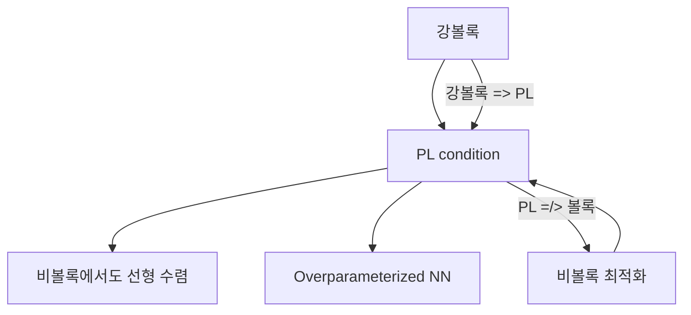

### 13.2 5단계 설명

#### 1단계 초등 (일상 비유, 수식 없음)

산에서 내려가는데, 어떤 산은 울퉁불퉁해도(비볼록) "경사가 센 곳에서는 반드시 아래로 많이 내려갈 수 있다"는 좋은 성질을 가지고 있다. PL 조건은 이런 "착한 비볼록 산"을 수학적으로 정의한 것이다.

볼록한 산은 항상 이 성질을 가지지만, 볼록하지 않은 산도 이 성질을 가질 수 있다 -- 그래서 볼록성보다 **약한 조건**이다.

#### 2단계 중등 (간단한 수식, 시각적 예시)

**PL 부등식**: 상수 $\mu > 0$이 존재하여 모든 $x$에서:

$$\frac{1}{2}\|\nabla f(x)\|^2 \geq \mu (f(x) - f^*)$$

- 좌변: gradient 제곱 (현재 "경사의 세기")
- 우변: 최적값과의 차이 (현재 "높이 차이")

**의미**: "높이 차이가 크면 경사도 반드시 세다." 경사가 0인데 높이 차이가 큰 "평원(plateau)"이 존재하지 않는다는 것이다.

**구체적 예시**: $f(x) = x^2$, $f^* = 0$:
- $\frac{1}{2}(2x)^2 = 2x^2 \geq \mu \cdot x^2$ -- $\mu \leq 2$에서 성립!

#### 3단계 고등 (수학적 표현, 증명)

> **이 수식이 말하는 것은**: "gradient의 크기가 최적값과의 갭을 하한한다. gradient가 0이면 반드시 최적점이다."

**강볼록 => PL**: $\mu$-강볼록이면 $\mu$-PL을 만족한다.

증명: 강볼록 정의에서 $y = x^*$ (전역 최소)로 놓으면:
$$f(x) - f(x^*) \leq \nabla f(x)^\top(x - x^*) - \frac{\mu}{2}\|x - x^*\|^2$$

$x - x^*$에 대해 최대화하면 $\frac{1}{2\mu}\|\nabla f(x)\|^2$을 얻어 PL 부등식이 성립.

**PL =/> 볼록**: $f(x) = x^2 + 3\sin^2(x)$은 비볼록이지만 PL 조건을 만족.

**GD + PL + $\beta$-smooth의 수렴**:

$$f(x_{t+1}) - f^* \leq (1 - \frac{\mu}{\beta})(f(x_t) - f^*)$$

$$\therefore f(x_T) - f^* \leq (1 - \frac{\mu}{\beta})^T (f(x_0) - f^*)$$

**볼록하지 않아도 선형(지수적) 수렴!**

#### 4단계 대학 (공식 전개 + Python 코드)

```python
import numpy as np
import matplotlib.pyplot as plt

# PL 조건 예시: 비볼록이지만 PL을 만족하는 함수
def f_nonconvex_pl(x):
    """x^2 + 3*sin^2(x): 비볼록이지만 PL 만족"""
    return x**2 + 3*np.sin(x)**2

def grad_nonconvex_pl(x):
    return 2*x + 6*np.sin(x)*np.cos(x)

# PL 상수 추정 (수치적)
x_range = np.linspace(-5, 5, 1000)
f_star = 0  # 전역 최솟값
grad_sq = grad_nonconvex_pl(x_range)**2
gap = f_nonconvex_pl(x_range) - f_star
# PL: 0.5*|grad|^2 >= mu*(f - f*)
ratios = 0.5 * grad_sq / (gap + 1e-10)
ratios = ratios[gap > 0.01]  # 0 근처 제외
mu_est = np.min(ratios)
print(f"추정 PL 상수 mu = {mu_est:.4f}")

# GD 수렴 테스트
beta = 8.0  # smoothness 상수 (추정)
eta = 1.0 / beta
x = 4.0
losses = [f_nonconvex_pl(x)]
for _ in range(100):
    x = x - eta * grad_nonconvex_pl(x)
    losses.append(f_nonconvex_pl(x))

fig, axes = plt.subplots(1, 2, figsize=(12, 5))

# 함수 그래프 (비볼록임을 보여줌)
x_plot = np.linspace(-5, 5, 500)
axes[0].plot(x_plot, f_nonconvex_pl(x_plot), 'b-', linewidth=2)
axes[0].set_title('비볼록이지만 PL 조건 만족')
axes[0].set_xlabel('x'); axes[0].set_ylabel('f(x)')

# 수렴 곡선 (선형 수렴)
axes[1].semilogy(losses, 'b.-')
T = np.arange(len(losses))
theoretical = losses[0] * (1 - mu_est/beta)**T
axes[1].semilogy(theoretical, 'r--', label=f'이론: (1-mu/beta)^T, mu={mu_est:.2f}')
axes[1].set_title('PL 조건 하 선형 수렴')
axes[1].set_xlabel('Step'); axes[1].set_ylabel('f(x) - f*')
axes[1].legend()
plt.tight_layout()
plt.savefig('pl_condition.png', dpi=100)
plt.show()
```

#### 5단계 대학원 (논문 수준, 딥러닝 연결)

**Overparameterized Neural Network과 PL 조건**:

충분히 넓은(overparameterized) 신경망에서, 학습 동역학이 NTK (Neural Tangent Kernel) 레짐에 머물면, 손실 함수가 PL 조건을 만족함이 증명되었다 (Du et al., 2019; Allen-Zhu et al., 2019).

직관적 이유: 파라미터가 충분히 많으면, 어떤 방향으로든 gradient가 0이 아닌 이상 손실을 줄일 수 있는 방향이 존재한다. 이것이 PL 조건의 핵심이다.

**PL vs 강볼록의 관계**:

$$\text{강볼록} \implies \text{PL} \implies \text{유일한 전역 최소 없이도 선형 수렴}$$

PL은 강볼록보다 약한 조건이므로, 비볼록 딥러닝 최적화 분석에 더 적합하다.

### 13.3 오개념 경고

| 틀립니다 | 이해해야 합니다 |
|----------|----------------|
| "선형 수렴은 볼록함수에서만 가능하다" | PL 조건을 만족하면 **비볼록**에서도 선형 수렴한다. |
| "PL 조건은 전역 최소의 유일성을 보장한다" | PL은 전역 최소로의 수렴을 보장하지만, 전역 최소가 여러 개일 수 있다. |

### 13.4 핵심 킬러 요약

> **PL 조건: $\frac{1}{2}\|\nabla f\|^2 \geq \mu(f - f^*)$**. "gradient가 0이 아니면 반드시 개선 여지가 있다"는 조건. 강볼록보다 약하지만, 비볼록에서도 선형 수렴을 보장한다. Overparameterized NN이 PL을 만족한다는 것이 현대 딥러닝 이론의 핵심 결과이다.

---

# PART 6: 제약 최적화

---

## 14. 라그랑주 승수법(Lagrange Multipliers)

### 14.0 동기부여

> **이걸 배우면...** "규칙을 지키면서 최적의 선택을 한다"는 제약 최적화 문제를 풀 수 있다. Weight Decay(L2 정규화)가 노름 제약의 라그랑주 형태이고, Softmax가 최대 엔트로피 원리의 라그랑주 해라는 것을 이해한다.

### 14.1 선행 개념 맵

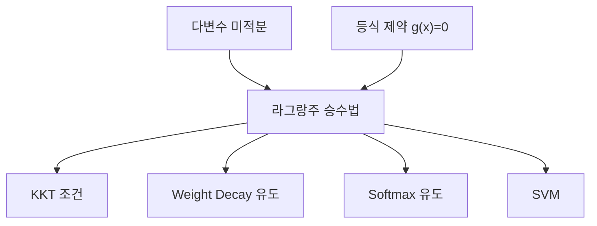

### 14.2 5단계 설명

#### 1단계 초등 (일상 비유, 수식 없음)

놀이공원에서 가장 높은 곳에 올라가고 싶지만, **울타리** 안에서만 다닐 수 있다. 자유롭게 다니면 산꼭대기에 가면 되지만, 울타리 때문에 갈 수 없다. 대신 **울타리를 따라 걸으면서 가장 높은 곳**을 찾아야 한다.

라그랑주 승수 $\lambda$는 "울타리가 나를 얼마나 세게 잡고 있는가"를 나타내는 숫자이다. $\lambda$가 크면 울타리의 영향이 강한 것이고, $\lambda = 0$이면 울타리가 없는 것과 같다.

#### 2단계 중등 (간단한 수식, 시각적 예시)

**문제**: $f(x, y) = x^2 + y^2$ (원점으로부터의 거리 제곱)을 $x + y = 1$ (직선 위에서) 최소화하라.

**라그랑지안**:

$$\mathcal{L}(x, y, \lambda) = x^2 + y^2 + \lambda(x + y - 1)$$

**풀이**:
$$\frac{\partial \mathcal{L}}{\partial x} = 2x + \lambda = 0 \implies x = -\lambda/2$$
$$\frac{\partial \mathcal{L}}{\partial y} = 2y + \lambda = 0 \implies y = -\lambda/2$$
$$\frac{\partial \mathcal{L}}{\partial \lambda} = x + y - 1 = 0$$

$x = y = -\lambda/2$를 제약에 대입: $-\lambda = 1$, $\lambda = -1$

$$\therefore (x, y) = (0.5, 0.5), \quad f = 0.5$$

**기하학적 의미**: 최적점에서 $\nabla f = (1, 1)$과 $\nabla g = (1, 1)$이 **평행**하다! 등고선(원)과 제약 직선이 접하는 점이 최적점이다.

#### 3단계 고등 (수학적 표현, 증명)

**일반적 형태**: 등식 제약 $g_i(x) = 0$ ($i = 1, \ldots, m$) 하에서 $f(x)$를 최소화:

> **이 수식이 말하는 것은**: "제약을 목적함수에 흡수시켜, 제약 없는 문제로 변환한다."

$$\mathcal{L}(x, \lambda) = f(x) + \sum_{i=1}^m \lambda_i g_i(x)$$

**필요조건**: 해 $x^*$에서:

$$\nabla_x \mathcal{L} = \nabla f + \sum_i \lambda_i \nabla g_i = 0$$
$$g_i(x^*) = 0 \quad \forall i$$

**기하학적 해석**: $\nabla f = -\sum_i \lambda_i \nabla g_i$, 즉 목적함수의 gradient가 제약 표면의 법선 벡터의 선형 결합이다. "더 좋은 방향으로 갈 수 없는 상태"가 된 것.

**주의**: 이것은 **필요조건**일 뿐 충분조건이 아니다. 모든 정류점에서 $f$ 값을 비교해야 한다.

#### 4단계 대학 (공식 전개 + Python 코드)

**Weight Decay의 라그랑주 유도**:

원래 문제: $\min_\theta L(\theta)$ s.t. $\|\theta\|^2 \leq C$

라그랑주 형태: $\min_\theta L(\theta) + \lambda \|\theta\|^2$

이것이 바로 **Weight Decay (L2 정규화)**! $\lambda$는 정규화 강도이며, 원래 문제의 노름 제약 $C$에 대응한다.

**Softmax의 MaxEnt 유도**:

$$\max_p \sum_i p_i z_i + \tau H(p) \quad \text{s.t.} \quad \sum_i p_i = 1$$

라그랑지안: $\mathcal{L} = \sum_i p_i z_i - \tau \sum_i p_i \log p_i + \lambda(\sum_i p_i - 1)$

$$\frac{\partial \mathcal{L}}{\partial p_i} = z_i - \tau(\log p_i + 1) + \lambda = 0$$

$$p_i = e^{(z_i + \lambda - \tau)/\tau} = \frac{e^{z_i/\tau}}{\sum_j e^{z_j/\tau}}$$

이것이 **온도 $\tau$를 가진 Softmax**이다!

```python
import numpy as np
from scipy.optimize import minimize

# 라그랑주 승수법: f(x,y) = x^2 + y^2, s.t. x + y = 1
# 해석적 해: (0.5, 0.5), lambda = -1

# 방법 1: 직접 연립방정식 풀기
from numpy.linalg import solve
# [2, 0, 1] [x]   [0]
# [0, 2, 1] [y] = [0]
# [1, 1, 0] [l]   [1]
A = np.array([[2, 0, 1], [0, 2, 1], [1, 1, 0]])
b = np.array([0, 0, 1])
sol = solve(A, b)
print(f"해석적: x={sol[0]:.4f}, y={sol[1]:.4f}, lambda={sol[2]:.4f}")
print(f"f(x,y) = {sol[0]**2 + sol[1]**2:.4f}")

# 방법 2: scipy의 제약 최적화
result = minimize(
    lambda xy: xy[0]**2 + xy[1]**2,
    x0=[0, 0],
    constraints={'type': 'eq', 'fun': lambda xy: xy[0] + xy[1] - 1}
)
print(f"\nscipy: x={result.x[0]:.4f}, y={result.x[1]:.4f}, f={result.fun:.4f}")

# Softmax가 MaxEnt 해임을 검증
z = np.array([2.0, 1.0, 0.5])
tau = 1.0

# MaxEnt 문제를 직접 풀기
from scipy.optimize import minimize as scipy_minimize
def neg_objective(p):
    """-(sum p_i z_i + tau * H(p))"""
    p = np.clip(p, 1e-10, 1)
    return -(np.dot(p, z) + tau * (-np.sum(p * np.log(p))))

result_maxent = scipy_minimize(
    neg_objective,
    x0=np.ones(3)/3,
    constraints={'type': 'eq', 'fun': lambda p: np.sum(p) - 1},
    bounds=[(1e-10, 1)]*3
)

softmax_result = np.exp(z/tau) / np.sum(np.exp(z/tau))
print(f"\nMaxEnt 해: {result_maxent.x}")
print(f"Softmax:   {softmax_result}")
print(f"일치? {np.allclose(result_maxent.x, softmax_result, atol=1e-4)}")
```

#### 5단계 대학원 (논문 수준, 딥러닝 연결)

**라그랑주 쌍대성(Lagrangian Duality)**:

원래 문제(primal)의 최적값 $p^*$와 쌍대 문제(dual)의 최적값 $d^*$ 사이에:

$$d^* \leq p^* \quad \text{(약한 쌍대성, 항상 성립)}$$

볼록 문제 + Slater 조건이면:

$$d^* = p^* \quad \text{(강한 쌍대성)}$$

이것이 SVM의 커널 트릭의 수학적 기반이다. Dual formulation에서 데이터가 내적 $\langle x_i, x_j \rangle$으로만 나타나므로, 커널 $K(x_i, x_j)$로 대체 가능.

**ADMM (Alternating Direction Method of Multipliers)**: 분산 최적화, 라그랑주 분해의 현대적 형태. 대규모 시스템에서 제약 문제를 병렬로 풀 수 있다.

### 14.3 오개념 경고

| 틀립니다 | 이해해야 합니다 |
|----------|----------------|
| "라그랑주 승수법은 최솟값을 직접 준다" | 정류점(후보)만 찾아준다. 극소/극대/안장점 구별은 별도 판정 필요. |
| "Weight Decay와 노름 제약은 다른 것이다" | Weight Decay $\lambda\|\theta\|^2$는 노름 제약 $\|\theta\| \leq C$의 라그랑주 형태이다. $\lambda$와 $C$는 1:1 대응. |
| "라그랑주 승수 $\lambda$는 의미 없는 보조 변수이다" | $\lambda$는 "제약의 비용(shadow price)"이다. 제약을 약간 완화하면 목적함수가 $\lambda$만큼 개선된다. |

### 14.4 설명하기 훈련

> **문제**: "Weight Decay가 왜 라그랑주 승수법과 관련되는지" 설명하라.

**모범 답안**: "원래 문제는 '가중치 노름이 C 이하인 조건에서 손실을 최소화'하는 것이다. 이 노름 제약을 라그랑주 승수 $\lambda$를 써서 목적함수에 흡수시키면 $L(\theta) + \lambda\|\theta\|^2$가 된다. 이것이 바로 Weight Decay이다. $\lambda$가 크면 제약이 강한 것(작은 가중치)이고, $\lambda$가 작으면 제약이 약한 것(큰 가중치 허용)이다."

### 14.5 핵심 킬러 요약

> **라그랑주 승수법 = "제약을 목적함수에 흡수"**. $\mathcal{L}(x, \lambda) = f(x) + \lambda g(x)$. 최적점에서 $\nabla f \parallel \nabla g$. Weight Decay = 노름 제약의 라그랑주 형태. Softmax = MaxEnt 제약의 라그랑주 해.

---

## 15. KKT 조건(Karush-Kuhn-Tucker)

### 15.0 동기부여

> **이걸 배우면...** 부등식 제약($\leq$)까지 포함하는 일반적인 제약 최적화의 해 조건을 이해한다. SVM의 서포트 벡터가 왜 소수만 존재하는지, L1 정규화가 왜 희소 해를 만드는지의 수학적 근거인 **상보 이완성**을 파악한다.

### 15.1 선행 개념 맵

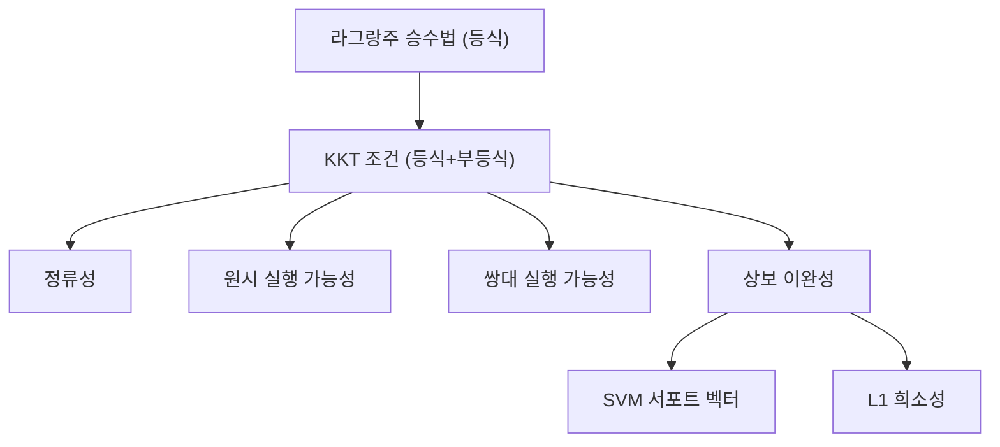

### 15.2 5단계 설명

#### 1단계 초등 (일상 비유, 수식 없음)

라그랑주 승수법이 "울타리 위에서 가장 높은 곳 찾기"였다면, KKT는 "울타리 안쪽 전체에서 가장 높은 곳 찾기"이다.

두 가지 경우가 있다:
1. **최적점이 울타리 안쪽에 있는 경우**: 울타리는 아무 영향도 없다 -> $\lambda = 0$ (울타리 무시)
2. **최적점이 울타리 위에 걸리는 경우**: 울타리가 적극적으로 제한 -> $\lambda > 0$ (울타리 활성)

핵심 규칙: **"울타리가 활성이 아니면 $\lambda = 0$, $\lambda > 0$이면 반드시 울타리 위"**. 이것이 **상보 이완성**이다.

#### 2단계 중등 (간단한 수식, 시각적 예시)

**일반 제약 문제**:

$$\min_x f(x) \quad \text{s.t.} \quad g_i(x) = 0, \; h_j(x) \leq 0$$

**라그랑지안**:

$$\mathcal{L}(x, \lambda, \mu) = f(x) + \sum_i \lambda_i g_i(x) + \sum_j \mu_j h_j(x)$$

**KKT 4가지 조건**:

| 조건 | 수식 | 비유 |
|------|------|------|
| 정류성 | $\nabla_x \mathcal{L} = 0$ | "힘의 균형" |
| 원시 실행 가능성 | $g = 0, h \leq 0$ | "규칙 지키기" |
| 쌍대 실행 가능성 | $\mu \geq 0$ | "밀어내는 힘은 양수" |
| **상보 이완성** | $\mu_j h_j = 0$ | **"비활성 제약은 무시"** |

**구체적 숫자**: $\min x^2$ s.t. $x \geq 1$ (= $-x + 1 \leq 0$)

$\mathcal{L} = x^2 + \mu(-x + 1)$
- 정류성: $2x - \mu = 0$
- 원시: $x \geq 1$
- 쌍대: $\mu \geq 0$
- 상보: $\mu(1 - x) = 0$

$x = 1$, $\mu = 2$ (제약 활성). $x^2$의 무제약 최소($x=0$)는 $x \geq 1$을 만족하지 않으므로, 제약 경계 $x = 1$이 해이다.

#### 3단계 고등 (수학적 표현, 증명)

> **이 수식이 말하는 것은**: "최적점에서 목적함수의 gradient, 등식 제약의 gradient, 부등식 제약의 gradient가 정확히 균형을 이루며, 비활성 부등식 제약은 무시된다."

**상보 이완성의 심층 의미**:

$\mu_j h_j(x^*) = 0$이므로:
- $h_j(x^*) < 0$ (여유 있음): 반드시 $\mu_j = 0$ -> 이 제약은 해에 영향 없음
- $\mu_j > 0$: 반드시 $h_j(x^*) = 0$ -> 제약이 등식으로 **활성화**

이것은 "활성 제약만 고려하면 충분하다"는 강력한 결과이다.

**충분조건**: $f$가 볼록, $g_i$가 아핀, $h_j$가 볼록이면 KKT 조건은 **필요충분**조건이 된다.

#### 4단계 대학 (공식 전개 + Python 코드)

**SVM에서의 KKT**:

원래 문제: $\min \frac{1}{2}\|w\|^2$ s.t. $y_i(w^\top x_i + b) \geq 1$

부등식 제약: $h_i = 1 - y_i(w^\top x_i + b) \leq 0$

상보 이완성: $\alpha_i [y_i(w^\top x_i + b) - 1] = 0$

- 마진 경계 **위**의 데이터 ($y_i(w^\top x_i + b) = 1$): $\alpha_i > 0$ -- **서포트 벡터**
- 마진 경계 **밖**의 데이터 ($y_i(w^\top x_i + b) > 1$): $\alpha_i = 0$ -- 해에 영향 없음

```python
import numpy as np
from scipy.optimize import minimize

# KKT를 만족하는 해 찾기
# min x^2 + y^2  s.t. x + y >= 2 (= -(x+y-2) <= 0)

result = minimize(
    lambda xy: xy[0]**2 + xy[1]**2,
    x0=[0, 0],
    constraints={'type': 'ineq', 'fun': lambda xy: xy[0] + xy[1] - 2}
    # ineq: constraint >= 0
)
print(f"해: x={result.x[0]:.4f}, y={result.x[1]:.4f}")
print(f"f(x,y) = {result.fun:.4f}")
print(f"제약 값: x+y-2 = {result.x[0]+result.x[1]-2:.6f} (0이면 활성)")

# SVM 예시 (간단한 2D)
from sklearn.svm import SVC

X = np.array([[0, 0], [1, 0], [0, 1], [2, 2], [3, 2], [2, 3]])
y = np.array([-1, -1, -1, 1, 1, 1])

svm = SVC(kernel='linear', C=100)  # C 큰 = hard margin에 가까움
svm.fit(X, y)

print(f"\n서포트 벡터 인덱스: {svm.support_}")
print(f"서포트 벡터:\n{svm.support_vectors_}")
print(f"전체 {len(X)}개 중 {len(svm.support_)}개만 서포트 벡터 (KKT 상보 이완성!)")
print(f"alpha (dual coef): {svm.dual_coef_}")
```

#### 5단계 대학원 (논문 수준, 딥러닝 연결)

**KKT와 희소성(Sparsity)**:

L1 정규화 $\min L(\theta) + \lambda\|\theta\|_1$을 제약 형태로 쓰면:

$$\min L(\theta) \quad \text{s.t.} \quad \|\theta\|_1 \leq C$$

KKT의 상보 이완성에 의해, L1 볼의 꼭짓점(좌표축 위)에서 해가 결정되므로 많은 $\theta_i = 0$이 된다. 이것이 **L1 정규화가 희소 해를 만드는 이유**이다.

**Projected Gradient Descent**: $h(x) \leq 0$ 제약을 직접 유지하면서 GD를 수행:

$$x_{t+1} = \text{Proj}_{\mathcal{C}}(x_t - \eta \nabla f(x_t))$$

여기서 $\text{Proj}_{\mathcal{C}}$은 실행 가능 집합 $\mathcal{C}$로의 사영. 이것이 Gradient Clipping ($\|\nabla\| \leq C$)의 수학적 해석이기도 하다.

**Dual Formulation과 커널 트릭**: SVM의 dual에서 데이터가 내적으로만 나타남 -> $K(x_i, x_j) = \phi(x_i)^\top \phi(x_j)$로 대체 가능 -> 무한 차원 특징 공간에서의 선형 분류. 이것이 kernel method의 핵심.

### 15.3 오개념 경고

| 틀립니다 | 이해해야 합니다 |
|----------|----------------|
| "KKT는 항상 충분조건이다" | 일반적으로 **필요조건**. 볼록성이 있어야 충분. |
| "$\mu \geq 0$은 임의의 규칙이다" | 부등식의 방향과 최소화의 구조에서 자연스럽게 도출된다. |
| "SVM의 모든 데이터가 중요하다" | 상보 이완성에 의해 **서포트 벡터만** ($\alpha_i > 0$) 결정 경계를 결정한다. |

### 15.4 핵심 킬러 요약

> **KKT = 부등식 제약의 라그랑주 확장**. 핵심은 **상보 이완성** $\mu h = 0$: "비활성 제약은 무시, 활성 제약만 등식처럼 작용". SVM의 서포트 벡터, L1의 희소성, Projected GD 모두 이 원리에서 나온다.

---

# PART 7: 미분방정식과 동역학

---

## 16. 상미분방정식(ODE) 기초

### 16.0 동기부여

> **이걸 배우면...** ResNet이 왜 "ODE의 이산화"이고, Sigmoid가 왜 "로지스틱 ODE의 해"인지, Vanishing Gradient가 왜 "동역학적 포화"인지를 근본적으로 이해한다. Neural ODE, Diffusion Model 등 현대 딥러닝의 수학적 기반을 파악한다.

### 16.1 선행 개념 맵

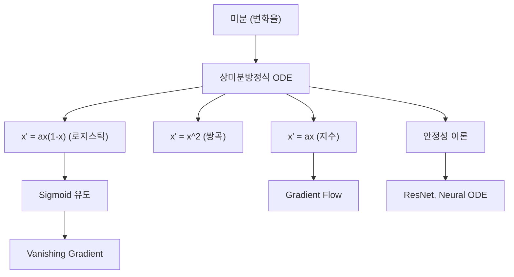

### 16.2 5단계 설명

#### 1단계 초등 (일상 비유, 수식 없음)

물병에 구멍이 뚫려 있다. 물이 많으면 수압이 세서 빨리 빠지고, 물이 적으면 천천히 빠진다. "빠지는 속도 = 남은 양에 비례"라는 이 규칙이 미분방정식이다.

세 가지 성장 패턴이 있다:

1. **복리 이자** (지수 성장): 돈이 많을수록 이자가 많이 붙고, 그 이자에 또 이자가 붙는다. 끝없이 커지지만, 무한히 오래 걸린다.

2. **소문의 대폭발** (쌍곡 성장): 소문이 퍼지는 속도가 알고 있는 사람 수의 **제곱**에 비례한다면, 어느 순간 갑자기 폭발하여 **유한 시간 안에** 무한대에 도달한다.

3. **물고기의 번식** (시그모이드 성장): 처음엔 먹이가 충분해서 빠르게 늘지만, 물고기가 많아지면 먹이가 부족해져 성장이 느려진다. 결국 S자 곡선으로 수용량에 수렴한다.

#### 2단계 중등 (간단한 수식, 시각적 예시)

**세 가지 ODE 비교**:

| ODE | 해 | 특성 |
|-----|-----|------|
| $x' = ax$ | $x(t) = x_0 e^{at}$ | 지수 성장/감쇠 |
| $x' = x^2$ | $x(t) = \frac{1}{1/x_0 - t}$ | 유한시간 폭발 |
| $x' = ax(1-x)$ | $x(t) = \frac{1}{1 + Ce^{-at}}$ | S자 곡선 (포화) |

**구체적 숫자** -- $x' = x^2$, $x_0 = 0.1$:
- $t = 0$: $x = 0.1$ (느림)
- $t = 5$: $x = 0.2$ (여전히 느림)
- $t = 9$: $x = 1.0$ (가속)
- $t = 9.9$: $x = 10$ (급속)
- $t = 10$: $x \to \infty$ (**폭발!**)

지수 성장($e^{at}$)은 $t \to \infty$에서 천천히 무한대이지만, 쌍곡 성장은 $t = 10$이라는 **유한 시간**에 무한대에 도달한다!

#### 3단계 고등 (수학적 표현, 증명)

**로지스틱 ODE와 Sigmoid 유도**:

$x' = ax(1-x)$, 변수분리법:

$$\frac{dx}{x(1-x)} = a\,dt$$

부분분수 분해: $\frac{1}{x(1-x)} = \frac{1}{x} + \frac{1}{1-x}$

적분: $\ln\frac{x}{1-x} = at + C_0$

> **이 수식이 말하는 것은**: "$x$가 매우 작을 때 이 해는 정확히 Sigmoid 함수 $\sigma(at + b)$가 된다."

$$x(t) = \frac{1}{1 + Ce^{-at}} = \sigma(at - \ln C)$$

여기서 $\sigma(z) = \frac{1}{1 + e^{-z}}$은 **표준 Sigmoid**.

**Sigmoid의 도함수와 Vanishing Gradient**:

$$\sigma'(z) = \sigma(z)(1 - \sigma(z))$$

이것은 **로지스틱 ODE $x' = x(1-x)$ 그 자체**! ($a = 1$)

- 포화 영역 ($\sigma \approx 0$ 또는 $\sigma \approx 1$): $\sigma' \approx 0$ -> **gradient 소실**
- 중간 영역 ($\sigma \approx 0.5$): $\sigma' = 0.25$ -> gradient 최대

깊은 네트워크에서 $L$개 Sigmoid 레이어를 통과하면 gradient가 $(0.25)^L$로 축소. $L = 10$이면 $(0.25)^{10} \approx 10^{-6}$.

**안정성 이론**:

고정점 $x^*$에서 $f'(x^*)$의 부호:
- $f'(x^*) < 0$: **안정** (작은 섭동 후 복귀)
- $f'(x^*) > 0$: **불안정** (작은 섭동이 증폭)

로지스틱 ODE: $f(x) = ax(1-x)$, $f'(x) = a(1-2x)$
- $x = 0$: $f'(0) = a > 0$ -> **불안정**
- $x = 1$: $f'(1) = -a < 0$ -> **안정** (여기로 수렴)

#### 4단계 대학 (공식 전개 + Python 코드)

**ResNet = 오일러 방법**:

ODE: $\frac{dx}{dt} = f_\theta(x, t)$

오일러 방법 (step size $h$): $x_{n+1} = x_n + h \cdot f_\theta(x_n, t_n)$

$h = 1$로 놓으면: $x_{l+1} = x_l + f_\theta(x_l)$ -- **ResNet의 skip connection!**

**Gradient Flow** (연속 시간 GD):

$$\dot{\theta}(t) = -\nabla L(\theta(t))$$

이차 손실 $L(\theta) = \frac{a}{2}\theta^2$에서:

$$\dot{\theta} = -a\theta \implies \theta(t) = \theta(0)e^{-at}$$

이것은 선형 ODE $x' = -ax$의 해이며, $a > 0$이면 지수적 감쇠 = 수렴!

```python
import numpy as np
import matplotlib.pyplot as plt
from scipy.integrate import solve_ivp

# 1. 세 가지 ODE 비교
t_span = (0, 9.5)
t_eval = np.linspace(0, 9.5, 500)

# 지수 성장: x' = 0.5x
sol_exp = solve_ivp(lambda t, x: 0.5*x, t_span, [0.1], t_eval=t_eval)

# 쌍곡 성장: x' = x^2
sol_hyp = solve_ivp(lambda t, x: x**2, (0, 9.5), [0.1], t_eval=t_eval,
                     max_step=0.01, events=lambda t, x: x[0] - 100)

# 로지스틱: x' = 0.5*x*(1-x)
sol_log = solve_ivp(lambda t, x: 0.5*x*(1-x), t_span, [0.1], t_eval=t_eval)

fig, axes = plt.subplots(1, 3, figsize=(15, 4))

axes[0].plot(sol_exp.t, sol_exp.y[0], 'b-', linewidth=2)
axes[0].set_title("지수 성장: x' = 0.5x")
axes[0].set_ylim(0, 20)

axes[1].plot(sol_hyp.t, sol_hyp.y[0], 'r-', linewidth=2)
axes[1].set_title("쌍곡 성장: x' = x^2 (폭발!)")
axes[1].set_ylim(0, 20)

axes[2].plot(sol_log.t, sol_log.y[0], 'g-', linewidth=2)
axes[2].set_title("로지스틱: x' = 0.5x(1-x) -> Sigmoid")
axes[2].axhline(y=1, color='gray', linestyle='--', label='수용량=1')
axes[2].legend()

for ax in axes:
    ax.set_xlabel('t'); ax.set_ylabel('x(t)')
plt.tight_layout()
plt.savefig('three_odes.png', dpi=100)
plt.show()

# 2. Sigmoid = 로지스틱 ODE의 해 검증
z = np.linspace(-6, 6, 200)
sigmoid = 1 / (1 + np.exp(-z))
sigmoid_prime = sigmoid * (1 - sigmoid)

fig, axes = plt.subplots(1, 2, figsize=(12, 4))
axes[0].plot(z, sigmoid, 'b-', linewidth=2, label='sigma(z)')
axes[0].set_title('Sigmoid = 로지스틱 ODE의 해')
axes[0].legend()

axes[1].plot(z, sigmoid_prime, 'r-', linewidth=2, label="sigma'(z) = sigma(1-sigma)")
axes[1].axhline(y=0.25, color='gray', linestyle='--', label='최댓값 0.25')
axes[1].fill_between(z, sigmoid_prime, alpha=0.2, color='red')
axes[1].set_title("Sigmoid 도함수 (Vanishing Gradient의 원인)")
axes[1].legend()
plt.tight_layout()
plt.savefig('sigmoid_ode.png', dpi=100)
plt.show()

# 3. Vanishing Gradient 정량적 분석
L_layers = [5, 10, 20, 50]
for L in L_layers:
    max_grad = 0.25**L
    print(f"{L} Sigmoid layers: max gradient = 0.25^{L} = {max_grad:.2e}")

# 4. ResNet = Euler method 시뮬레이션
def residual_block(x, W):
    """x_{l+1} = x_l + f(x_l) -- ResNet block"""
    return x + np.tanh(W @ x)

# ODE를 Euler method로 풀기 vs ResNet
np.random.seed(42)
dim = 10
x0 = np.random.randn(dim)

# ResNet (h=1)
x_resnet = x0.copy()
W = 0.1 * np.random.randn(dim, dim)
for layer in range(20):
    x_resnet = x_resnet + np.tanh(W @ x_resnet)  # h=1

# ODE (작은 h)
x_ode = x0.copy()
h = 0.1
for step in range(200):  # 20 layers * 10 sub-steps
    x_ode = x_ode + h * np.tanh(W @ x_ode)

print(f"\nResNet final norm: {np.linalg.norm(x_resnet):.4f}")
print(f"ODE final norm:    {np.linalg.norm(x_ode):.4f}")
```

#### 5단계 대학원 (논문 수준, 딥러닝 연결)

**Neural ODE** (Chen et al., 2018):

이산 레이어 $x_{l+1} = x_l + f_\theta(x_l, t_l)$ 대신 연속 동역학:

$$\frac{dx}{dt} = f_\theta(x(t), t), \quad x(0) = x_{\text{input}}$$

장점:
- **연속 깊이**: 레이어 수가 고정이 아니라 적응적
- **메모리 효율**: Adjoint method로 $O(1)$ 메모리 역전파
- **가역 변환**: Normalizing flow (FFJORD)에 활용

**Adjoint Method**: $\frac{d\mathbf{a}}{dt} = -\mathbf{a}^\top \frac{\partial f}{\partial x}$ ($\mathbf{a} = \frac{dL}{dx}$: adjoint state)

이것은 역전파를 **연속 시간의 ODE**로 표현한 것이다.

**Diffusion Model**과 SDE:

$$dx = f(x, t)dt + g(t)dW_t$$

- Forward process: 데이터에 노이즈를 점진적으로 추가 (SDE)
- Reverse process: 노이즈에서 데이터를 복원 (Reverse SDE)
- Score matching: $\nabla_x \log p_t(x)$를 신경망으로 학습

**안정성과 학습 동역학**:

2차원 선형 시스템 $\dot{X} = AX$의 Poincare 분류:
| 조건 | 유형 | 딥러닝 의미 |
|------|------|-------------|
| $\text{det}(A) < 0$ | 안장점 | Loss landscape의 안장점 |
| $\text{det} > 0$, $\text{tr} < 0$ | 안정 | 학습 수렴 |
| $\text{det} > 0$, $\text{tr} > 0$ | 불안정 | 학습 발산 |
| $\text{tr} = 0$ | 중심 | Edge of Chaos (최적 표현력) |

**Edge of Chaos** 가설: Jacobian의 고유값이 단위원 근처에 있을 때 가장 풍부한 표현력. 이것이 He 초기화, Batch Normalization 등의 이론적 동기이다.

### 16.3 오개념 경고

| 틀립니다 | 이해해야 합니다 |
|----------|----------------|
| "Sigmoid는 누군가 임의로 설계했다" | Sigmoid = 로지스틱 ODE $x' = x(1-x)$의 **자연스러운 해**. 포화 성장의 수학적 귀결이다. |
| "$x' = x^2$도 지수 성장과 비슷하다" | 지수 성장은 $t \to \infty$에서 발산, 쌍곡 성장은 **유한 시간**에 폭발. 질적으로 완전히 다르다. |
| "평형점은 항상 안정하다" | $f'(x^*) > 0$이면 **불안정**. 부호로 판별해야 한다. |
| "ODE를 풀면 항상 닫힌 형태 해가 나온다" | 대부분의 ODE는 닫힌 해가 없다. 수치 해법(Euler, RK4 등)이 필수. |
| "ResNet의 skip connection은 그냥 엔지니어링 트릭이다" | Skip connection = ODE의 오일러 이산화. 수학적으로 정당화된 구조이다. |

### 16.4 설명하기 훈련

> **문제**: "Vanishing Gradient를 미분방정식의 관점에서" 설명하라.

**모범 답안**: "Sigmoid 함수는 로지스틱 ODE $x' = x(1-x)$의 해이다. 이 ODE의 핵심 성질은 $x$가 0이나 1에 가까우면 $x' \approx 0$이 되는 **포화** 현상이다. Sigmoid의 도함수 $\sigma'(z) = \sigma(z)(1-\sigma(z))$의 최댓값이 0.25이므로, $L$개 층을 통과하면 gradient가 $(0.25)^L$로 지수적으로 감쇠한다. 10개 층이면 $10^{-6}$, 20개 층이면 $10^{-12}$이다. ReLU는 양의 영역에서 $f'(x) = 1$이므로 이 문제가 없다."

### 16.5 수학 -> 딥러닝 연결 표

| 수학 개념 | 딥러닝 대응 | 구체적 역할 |
|-----------|-------------|-------------|
| $x' = ax$ (지수) | Gradient Flow | 학습의 연속 시간 모델 |
| $x' = x^2$ (폭발) | Gradient Explosion | Gradient Clipping의 이유 |
| $x' = x(1-x)$ (포화) | Sigmoid, Vanishing Gradient | 활성화 함수 선택 근거 |
| 오일러 방법 $x_{n+1} = x_n + hf(x_n)$ | ResNet skip connection | Neural ODE의 기반 |
| 안정성 이론 | 학습률 조건 $\eta < 2/\lambda_{\max}$ | 학습 발산 방지 |
| SDE $dx = fdt + gdW$ | Diffusion Model | 생성 모델의 수학적 기반 |

### 16.6 성취 확인

> **당신은 이제...**
> - 지수, 쌍곡, 시그모이드 성장의 질적 차이를 설명할 수 있다
> - Sigmoid가 로지스틱 ODE의 해임을 유도할 수 있다
> - Vanishing Gradient의 동역학적 원인을 $\sigma' = \sigma(1-\sigma) \leq 0.25$로 설명할 수 있다
> - ResNet = 오일러 방법임을 이해한다
> - Neural ODE, Diffusion Model의 수학적 기반을 안다

### 16.7 핵심 킬러 요약

> **ODE = 변화의 법칙**. $f$가 선형이면 지수, 이차 단일근이면 쌍곡(폭발), 이차 이중근이면 시그모이드(포화). Sigmoid는 설계가 아닌 자연 법칙의 해이며, Vanishing Gradient는 포화 동역학의 필연적 결과이다. ResNet = 오일러 이산화, Neural ODE = 연속 깊이 네트워크.

---

## 17. SDE 기초와 Diffusion Model

### 17.0 동기부여

> **이걸 배우면...** 현재 가장 강력한 생성 모델인 Diffusion Model(DALL-E, Stable Diffusion, Sora 등)의 수학적 원리를 이해한다. SDE(확률 미분방정식)는 ODE에 **확률적 노이즈**를 추가한 것이며, SGD의 수학적 모델이기도 하다.

### 17.1 선행 개념 맵

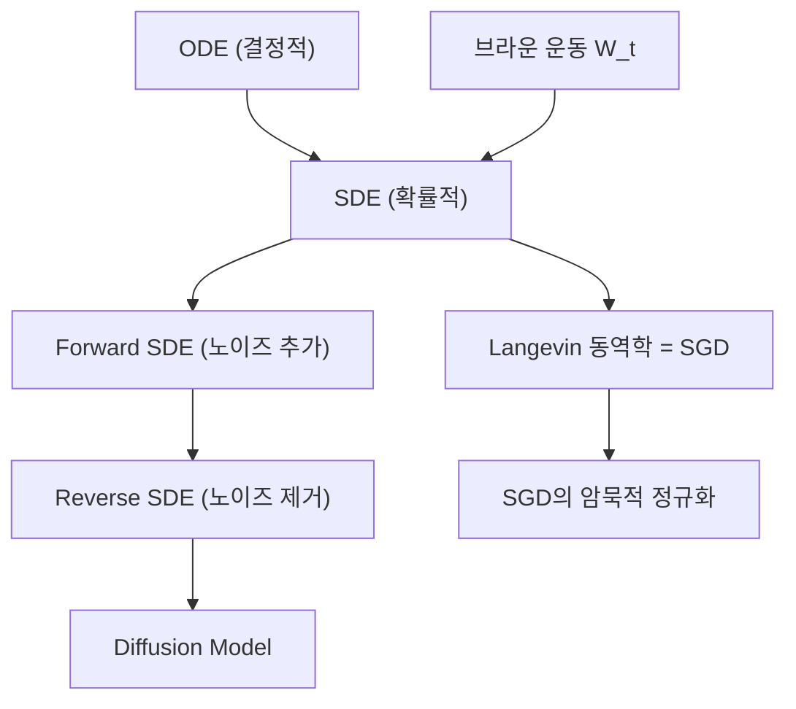

### 17.2 5단계 설명

#### 1단계 초등 (일상 비유, 수식 없음)

ODE가 "바람 없는 날 종이비행기의 경로"라면, SDE는 "바람이 부는 날 종이비행기의 경로"이다. 바람(노이즈)이 매 순간 랜덤하게 불어서, 같은 곳에서 던져도 매번 다른 경로로 날아간다.

**Diffusion Model**: 깨끗한 사진에 모래를 점점 뿌려서 완전히 모래밭으로 만드는 과정(Forward)을 학습한 후, 모래밭에서 모래를 점점 제거하여 깨끗한 사진을 복원하는 과정(Reverse)을 배운다.

#### 2단계 중등 (간단한 수식, 시각적 예시)

**SDE의 일반 형태**:

$$dx = f(x, t)\,dt + g(t)\,dW_t$$

- $f(x, t)dt$: 결정적 부분 (= ODE와 같은 방향)
- $g(t)dW_t$: 확률적 부분 (= 랜덤 노이즈)
- $W_t$: 브라운 운동 (= 랜덤 워크의 연속 버전)

**Langevin 동역학** (SGD의 연속 모델):

$$d\theta = -\nabla L(\theta)\,dt + \sqrt{2T}\,dW_t$$

- $-\nabla L dt$: gradient descent (아래로 내려감)
- $\sqrt{2T}dW_t$: 미니배치 노이즈 (랜덤한 흔들림)
- $T$: 온도 (= 학습률 x 노이즈 크기)

정상 분포: $p(\theta) \propto e^{-L(\theta)/T}$. 낮은 온도에서는 낮은 손실 영역에 집중.

#### 3단계 고등 (수학적 표현, 증명)

**Diffusion Model의 수학적 구조**:

Forward SDE (노이즈 추가):

$$dx = f(x, t)dt + g(t)dW_t, \quad x(0) \sim p_{\text{data}}$$

시간이 지나면 $x(T) \sim \mathcal{N}(0, I)$ (순수 노이즈)

> **이 수식이 말하는 것은**: "데이터에 점진적으로 노이즈를 추가하면, 결국 가우시안 노이즈가 된다."

**Reverse SDE** (Anderson, 1982):

$$dx = [f(x, t) - g(t)^2 \nabla_x \log p_t(x)]dt + g(t)d\bar{W}_t$$

여기서 $\nabla_x \log p_t(x)$는 **score function** -- "확률이 높은 방향"을 가리키는 벡터.

**핵심**: Score function만 알면, 노이즈에서 데이터를 복원할 수 있다!

**Score Matching**: 신경망 $s_\theta(x, t) \approx \nabla_x \log p_t(x)$를 학습.

$$\min_\theta E_{t, x_0, x_t} \left[\|s_\theta(x_t, t) - \nabla_{x_t} \log p(x_t | x_0)\|^2\right]$$

조건부 score $\nabla_{x_t} \log p(x_t | x_0)$는 닫힌 형태로 알 수 있어 학습 가능!

#### 4단계 대학 (공식 전개 + Python 코드)

```python
import numpy as np
import matplotlib.pyplot as plt

# 1. Langevin 동역학 시뮬레이션 (SGD의 연속 모델)
def langevin_dynamics(grad_L, x0, T_temp, dt, n_steps):
    """d_theta = -grad_L dt + sqrt(2T) dW"""
    dim = len(x0)
    trajectory = [x0.copy()]
    x = x0.copy()
    for _ in range(n_steps):
        noise = np.random.randn(dim) * np.sqrt(2 * T_temp * dt)
        x = x - grad_L(x) * dt + noise
        trajectory.append(x.copy())
    return np.array(trajectory)

# 이중 우물 포텐셜: L(x) = (x^2 - 1)^2
grad_L = lambda x: 4 * x * (x**2 - 1)

# 낮은 온도 vs 높은 온도
fig, axes = plt.subplots(1, 2, figsize=(12, 5))
for ax, T, title in [(axes[0], 0.1, 'T=0.1 (낮은 온도, 한 곳에 갇힘)'),
                       (axes[1], 1.0, 'T=1.0 (높은 온도, 자유로운 탐색)')]:
    for _ in range(5):
        traj = langevin_dynamics(grad_L, np.array([0.1]), T, 0.01, 5000)
        ax.plot(traj[:, 0], alpha=0.5)
    ax.set_title(title)
    ax.set_xlabel('Step'); ax.set_ylabel('x')
plt.tight_layout()
plt.savefig('langevin_dynamics.png', dpi=100)
plt.show()

# 2. 1D Diffusion Process 시뮬레이션
def forward_diffusion_1d(x0, beta_schedule, n_steps):
    """Forward SDE: x_t = sqrt(alpha_bar_t) * x0 + sqrt(1-alpha_bar_t) * noise"""
    alpha = 1 - beta_schedule
    alpha_bar = np.cumprod(alpha)

    trajectories = []
    for t in range(n_steps):
        noise = np.random.randn(*x0.shape)
        x_t = np.sqrt(alpha_bar[t]) * x0 + np.sqrt(1 - alpha_bar[t]) * noise
        trajectories.append(x_t)
    return trajectories, alpha_bar

# 데이터: 이중 모드 가우시안
n_samples = 1000
x0 = np.concatenate([
    np.random.randn(n_samples//2) * 0.3 + 2,
    np.random.randn(n_samples//2) * 0.3 - 2
])

n_steps = 100
beta = np.linspace(0.01, 0.3, n_steps)
trajs, alpha_bar = forward_diffusion_1d(x0, beta, n_steps)

fig, axes = plt.subplots(1, 4, figsize=(16, 3))
for ax, t, title in [(axes[0], 0, 't=0 (데이터)'),
                       (axes[1], 25, 't=25'),
                       (axes[2], 50, 't=50'),
                       (axes[3], 99, 't=99 (노이즈)')]:
    ax.hist(trajs[t], bins=50, density=True, alpha=0.7)
    ax.set_title(f'{title}\nalpha_bar={alpha_bar[t]:.3f}')
    ax.set_xlim(-5, 5)
plt.suptitle('Forward Diffusion: 데이터 -> 노이즈', y=1.05)
plt.tight_layout()
plt.savefig('forward_diffusion.png', dpi=100)
plt.show()
```

#### 5단계 대학원 (논문 수준, 딥러닝 연결)

**Score-Based Generative Models** (Song & Ermon, 2019; Song et al., 2021):

통합 프레임워크:
- **DDPM** (Ho et al., 2020): 이산 시간, Markov chain
- **Score SDE** (Song et al., 2021): 연속 시간, SDE

둘은 SDE의 이산화 관계로 동치이다.

**확률 흐름 ODE (Probability Flow ODE)**:

$$dx = \left[f(x,t) - \frac{1}{2}g(t)^2 \nabla_x \log p_t(x)\right]dt$$

SDE에서 노이즈 항을 제거한 **결정적** ODE. 같은 marginal distribution $p_t(x)$를 가지면서도 결정적 샘플링이 가능하다.

이것이 **DDIM** (Denoising Diffusion Implicit Models)의 수학적 기반이며, 빠른 샘플링을 가능케 한다.

**SGD와 Langevin의 연결**:

미니배치 SGD: $\theta_{t+1} = \theta_t - \eta \hat{g}_t$ ($\hat{g}_t = \nabla L_{B_t}$)

$\hat{g}_t = \nabla L(\theta_t) + \xi_t$ ($\xi_t$: 미니배치 노이즈)로 분해하면:

$$\theta_{t+1} = \theta_t - \eta \nabla L(\theta_t) - \eta \xi_t$$

이것은 Langevin 동역학 $d\theta = -\nabla L\,dt + \sqrt{2T}\,dW_t$의 이산화이며, 유효 온도 $T \propto \eta \cdot \text{Var}(\xi)$이다.

**학습률 $\eta$가 클수록 온도가 높아** flat minima를 선호하고, 작을수록 sharp minima에 갇힌다. 이것이 "큰 학습률이 일반화를 돕는다"의 이론적 근거이다.

### 17.3 오개념 경고

| 틀립니다 | 이해해야 합니다 |
|----------|----------------|
| "Diffusion Model은 ODE와 무관하다" | Diffusion의 핵심은 Forward/Reverse SDE이며, 확률 흐름 ODE로 동치 변환된다. |
| "SGD의 노이즈는 수렴을 방해한다" | Langevin 동역학 관점에서 노이즈는 **flat minima를 탐색**하게 하여 일반화를 돕는다. |
| "SDE는 딥러닝과 관련 없다" | Diffusion Model, SGD 분석, Neural SDE 등 현대 딥러닝의 핵심에 SDE가 있다. |

### 17.4 핵심 킬러 요약

> **SDE = ODE + 노이즈**. Langevin 동역학은 SGD의 연속 모델이며, 노이즈 온도가 flat minima 탐색을 결정한다. Diffusion Model은 Forward SDE(데이터->노이즈)의 Reverse SDE(노이즈->데이터)를 score function으로 학습하는 것이다.

---

# 부록: 통합 연결 지도

## A. 전체 개념 연결 맵

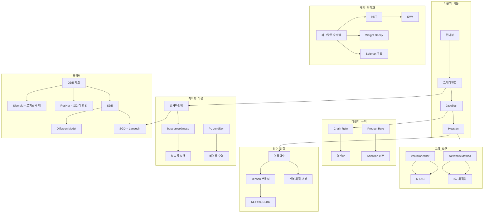

## B. "수학 -> 딥러닝" 마스터 연결 표

| 수학 개념 | 딥러닝 응용 | 핵심 한 줄 |
|-----------|-------------|-----------|
| 편미분 | 역전파의 원자 | 각 가중치의 업데이트 방향 |
| 그래디언트 | SGD, Adam | 최급강하 방향 |
| Jacobian | VJP (역전파) | 레이어 간 gradient 전파 |
| Hessian | Newton, K-FAC, Adam | 곡률 정보 = 학습률 자동 조정 |
| Chain Rule | 역전파 | Jacobian의 연쇄 곱 |
| vec/Kronecker | K-FAC | Fisher 역행렬의 효율적 계산 |
| Softmax Jacobian | CE+Softmax 역전파 = p-y | 분류의 표준 조합 |
| 볼록함수 | NTK, 볼록 relaxation | 전역 수렴 보장 |
| Jensen 부등식 | ELBO, EM, KL>=0 | VAE 학습의 이론적 기반 |
| beta-smoothness | 학습률 $\eta \leq 1/\beta$ | GD 수렴의 핵심 가정 |
| PL condition | Overparameterized NN | 비볼록에서의 선형 수렴 |
| 라그랑주 승수법 | Weight Decay, Softmax | 제약을 목적함수에 흡수 |
| KKT 상보 이완성 | SVM 서포트 벡터, L1 희소성 | 활성 제약만 영향 |
| 로지스틱 ODE | Sigmoid 함수 | 포화 성장의 해 |
| 오일러 방법 | ResNet | ODE의 이산화 |
| SDE/Langevin | SGD, Diffusion Model | 확률적 최적화와 생성 모델 |

## C. 최종 성취 체크리스트

다음을 모두 설명할 수 있다면, 이 문서의 핵심을 완전히 소화한 것이다:

- [ ] 역전파가 "Chain Rule을 Jacobian의 곱으로 역순 계산하는 동적 프로그래밍"이라고 설명할 수 있는가?
- [ ] Softmax + CE의 역전파가 $p - y$가 되는 것을 Jacobian으로 유도할 수 있는가?
- [ ] SGD가 "Hessian을 $\frac{1}{\alpha}I$로 근사한 Newton's method"라고 설명할 수 있는가?
- [ ] Weight Decay가 "노름 제약의 라그랑주 형태"라고 설명할 수 있는가?
- [ ] Softmax가 "MaxEnt 제약의 라그랑주 해"라고 유도할 수 있는가?
- [ ] KKT 상보 이완성이 SVM 서포트 벡터를 결정하는 메커니즘을 설명할 수 있는가?
- [ ] Sigmoid가 "로지스틱 ODE의 해"이고 Vanishing Gradient가 "포화 동역학"이라고 설명할 수 있는가?
- [ ] ResNet의 skip connection이 "ODE의 오일러 이산화"라고 설명할 수 있는가?
- [ ] SGD의 노이즈가 "Langevin 동역학의 온도"이며 flat minima 탐색에 도움을 준다고 설명할 수 있는가?
- [ ] PL 조건이 비볼록에서도 선형 수렴을 보장하며, overparameterized NN이 이를 만족한다고 설명할 수 있는가?

---

> **이 문서의 핵심 철학**:
>
> 딥러닝을 "라이브러리를 사용하는 것"이 아닌 "수학적 원리를 구현하는 것"으로 이해하라.
>
> 편미분 -> 그래디언트 -> Jacobian -> Chain Rule -> 역전파. 이 한 줄이 딥러닝 학습의 미분적 기반이다.
>
> 볼록함수 -> beta-smoothness -> 수렴 보장. 이 한 줄이 최적화 이론의 뼈대이다.
>
> 라그랑주 -> KKT -> Weight Decay, SVM, Softmax. 이 한 줄이 제약 최적화의 응용이다.
>
> ODE -> Sigmoid, ResNet, Neural ODE, Diffusion. 이 한 줄이 동역학과 딥러닝의 연결이다.
>
> **진정한 마스터는 이 연결을 보고, 피상적 이해는 각각을 독립적으로 본다.**
