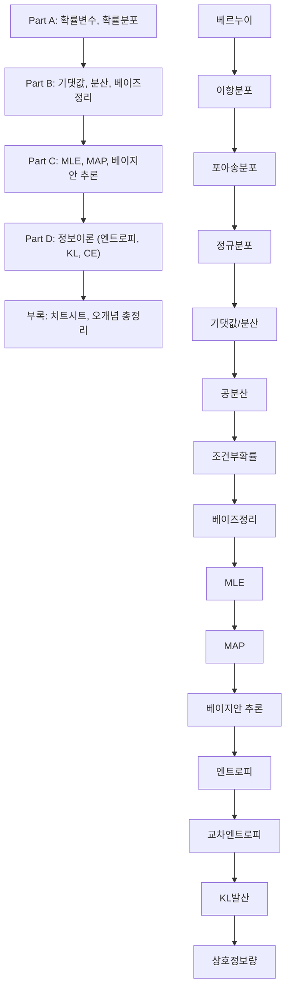
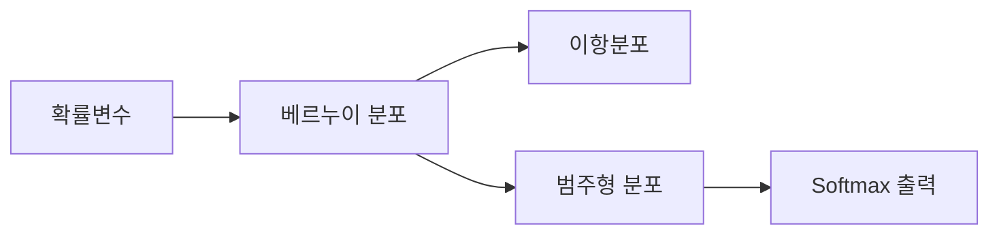
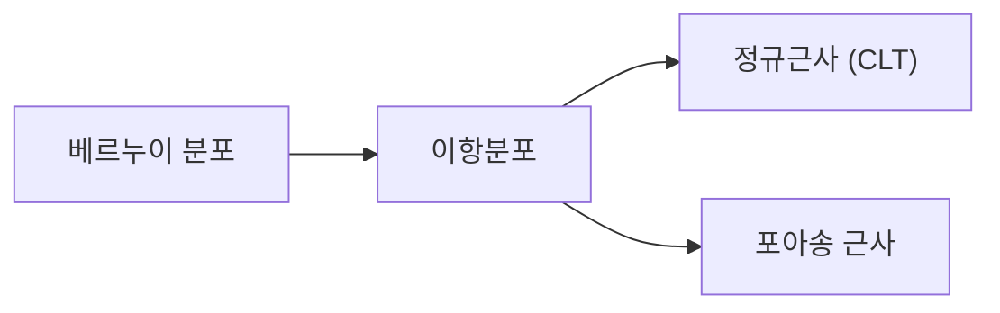
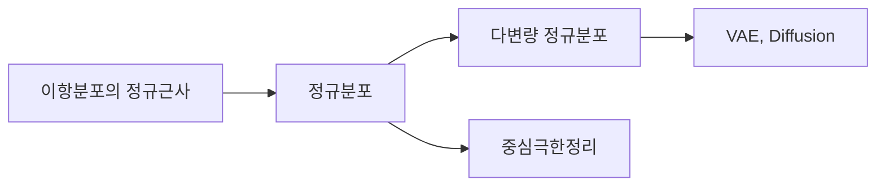
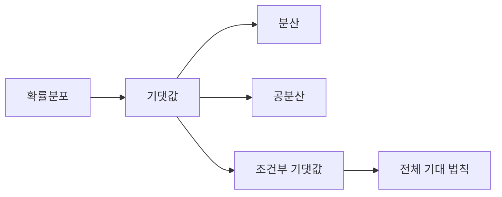
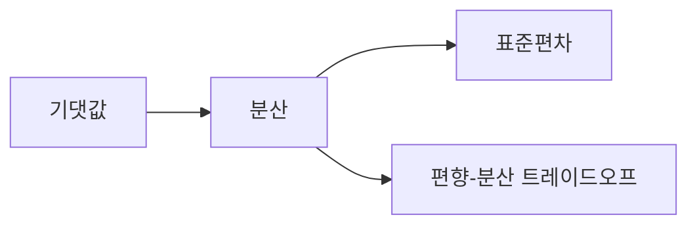
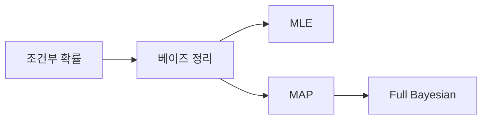
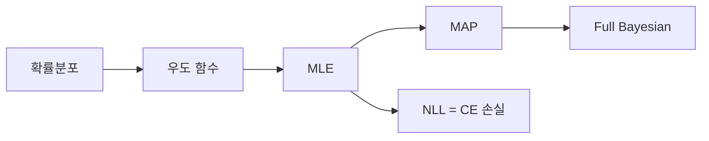
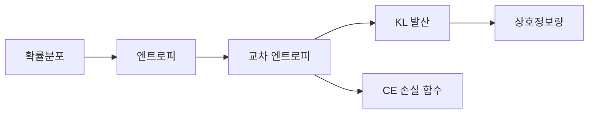
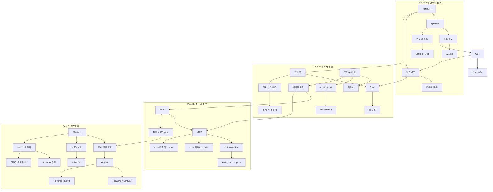

# 확률론과 정보이론 완전정복: 중학생부터 대학원생까지 5단계 나선형 학습

> **이 문서의 목적**: 같은 개념을 5번 반복하되, 매번 더 깊은 수준으로 설명합니다.
> 초등학생도 이해할 수 있는 비유에서 시작하여, 논문을 읽고 쓸 수 있는 수준까지 안내합니다.

---

## 전체 학습 지도



### 5단계 학습 시스템 안내

| 단계 | 대상 | 설명 방식 |
|------|------|----------|
| (1) 초등 | 개념 입문 | 일상 사물과 스토리 비유, 수식 없음 |
| (2) 중등 | 직관적 이해 | 간단한 수식, 시각적 예시 포함 |
| (3) 고등 | 원리 파악 | 수학적 표현, 그래프, 증명 입문 |
| (4) 대학 | 구조적 이해 | 확률론 기반 공식 전개 + Python 코드 |
| (5) 대학원 | 완전한 마스터 | 논문 수준, 한계/확장/변형 + 딥러닝 연결 |

---

# Part A: 확률변수와 확률분포

---

## A1. 확률변수 (Random Variable)

### 동기부여

> "AI가 세상의 불확실성을 숫자로 다루려면, 먼저 '랜덤한 결과'를 숫자로 바꾸는 도구가 필요합니다."

ChatGPT가 다음 단어를 예측할 때, 수만 개의 단어 각각에 "이 단어가 나올 가능성"을 숫자로 매깁니다. 이 과정의 첫 번째 단계가 바로 **확률변수**입니다.

### 선행 개념 맵


---

### (1) 초등 단계: 일상 비유

**확률변수란?**

주사위를 던지면 1~6 중 하나가 나옵니다. 그런데 게임에서 "짝수가 나오면 2점, 홀수가 나오면 1점"이라는 규칙이 있다고 해봅시다.

이때 "주사위 결과를 점수로 바꿔주는 규칙"이 바로 **확률변수**입니다. 주사위 눈 자체가 아니라, 그것을 우리가 관심 있는 숫자로 변환하는 것이죠.

**표본공간이란?**

뽑기 기계에서 나올 수 있는 모든 캡슐의 목록입니다. "빨강, 파랑, 노랑, 초록"이 전부라면, 이 목록이 **표본공간**입니다.

---

### (2) 중등 단계: 직관적 이해

**표본공간** $S$: 실험의 모든 가능한 결과

$$S_{\text{주사위}} = \{1, 2, 3, 4, 5, 6\}$$

> 이 수식이 말하는 것: 주사위를 던지면 1부터 6까지 중 하나가 반드시 나온다는 뜻입니다.

**확률변수** $X$: 결과를 숫자로 바꾸는 규칙

$$X(\text{앞면}) = 1, \quad X(\text{뒷면}) = 0$$

주의: $X$는 대문자(변수 자체), $x$는 소문자(실제 나온 값)

**확률**: 각 결과에 배정된 가능성 숫자

$$P(X = 1) = 0.5, \quad P(X = 0) = 0.5$$

모든 확률의 합은 반드시 1:

$$P(X=0) + P(X=1) = 0.5 + 0.5 = 1$$

---

### (3) 고등 단계: 수학적 정의

**확률변수의 엄밀한 정의**: 표본공간 $S$에서 실수 $\mathbb{R}$로의 함수

$$X: S \to \mathbb{R}$$

**이산 확률변수**: 확률질량함수(PMF)로 기술

$$p_X(a) = P(X = a), \quad \sum_{a} p_X(a) = 1$$

**연속 확률변수**: 확률밀도함수(PDF)로 기술

$$P(a \le X \le b) = \int_a^b f_X(x)\,dx, \quad \int_{-\infty}^{\infty} f_X(x)\,dx = 1$$

> 수식 해석: 연속 확률변수에서 특정 "구간"에 들어갈 확률은 밀도함수 아래 면적입니다.

**핵심 주의**: 밀도(density)는 확률이 아닙니다!
- 연속에서 $P(X = x) = 0$ (한 점의 확률은 항상 0)
- 밀도는 1을 초과할 수 있음: $\text{Uniform}[0, 0.5]$의 밀도 = 2

---

### (4) 대학 단계: Python 코드

```python
import numpy as np
import matplotlib.pyplot as plt

# --- 이산 확률변수: 주사위 시뮬레이션 ---
np.random.seed(42)
rolls = np.random.randint(1, 7, size=10000)

# PMF 시각화
values, counts = np.unique(rolls, return_counts=True)
pmf = counts / len(rolls)

print("주사위 PMF:")
for v, p in zip(values, pmf):
    print(f"  P(X={v}) = {p:.4f}  (이론값: {1/6:.4f})")

# --- 연속 확률변수: 정규분포 ---
from scipy.stats import norm

x = np.linspace(-4, 4, 1000)
pdf = norm.pdf(x, loc=0, scale=1)  # 표준정규분포

# 밀도가 확률이 아님을 보여주는 예: Uniform[0, 0.3]
from scipy.stats import uniform
x2 = np.linspace(-0.5, 1, 1000)
pdf2 = uniform.pdf(x2, loc=0, scale=0.3)  # 밀도 = 1/0.3 ≈ 3.33 > 1 !
print(f"\nUniform[0,0.3]의 밀도값 = {1/0.3:.2f} (1 초과!)")
print("=> 밀도는 확률이 아니라 '단위 길이당 확률 질량'입니다")
```

---

### (5) 대학원 단계: 논문 수준 + DL 연결

**측도론적 관점**: 확률변수는 $(\Omega, \mathcal{F}, P)$ 확률공간에서 $(\mathbb{R}, \mathcal{B}(\mathbb{R}))$로의 **가측함수(measurable function)**이다. pushforward measure $P_X = P \circ X^{-1}$이 확률분포를 정의한다.

**딥러닝 연결**:
- **Normalizing Flows**: 확률변수의 변환 $Y = g(X)$에서 $p_Y(y) = p_X(g^{-1}(y)) \cdot |\det J_{g^{-1}}(y)|$. pushforward measure의 직접 응용
- **Reparameterization Trick (VAE)**: $z = \mu + \sigma \odot \epsilon$, $\epsilon \sim \mathcal{N}(0,I)$. 확률변수의 선형 변환을 이용해 gradient를 전파
- **Gumbel-Softmax**: 이산 확률변수의 연속 완화(relaxation). $\arg\max$ 대신 미분 가능한 softmax 사용

> **오개념 경고**: "확률밀도 $f(x) = 2$이면 확률이 200%다" -- 밀도는 확률이 아닙니다. $U[0, 0.5]$에서 밀도는 2이지만, 어떤 구간의 확률도 1을 넘지 않습니다.

---

### 설명하기 훈련

**문제**: "확률변수와 일반 변수의 차이를 중학생에게 설명하세요."

<details>
<summary>모범 답안 (클릭하여 펼치기)</summary>

일반 변수 $x = 3$은 값이 정해져 있습니다. 하지만 확률변수 $X$는 "주사위처럼 아직 결과가 나오기 전"인 상태입니다. 결과가 나오면 특정 값 $x$가 되지만, 나오기 전에는 "각 값이 나올 확률"로 설명해야 합니다. 딥러닝에서 모델의 출력은 확률변수이고, 학습이란 이 확률변수의 분포를 데이터에 맞게 조정하는 과정입니다.

</details>

---

## A2. 베르누이 분포 (Bernoulli Distribution)

### 동기부여

> "동전 던지기처럼 '성공 아니면 실패'인 상황을 수학으로 표현하는 가장 기본적인 도구입니다."

스팸 메일 필터가 "스팸이다 / 아니다"를 판단할 때, 이진 분류 모델이 "고양이다 / 아니다"를 예측할 때 -- 이 모든 것이 베르누이 분포입니다.

### 선행 개념 맵



---

### (1) 초등 단계: 일상 비유

동전을 한 번 던집니다. 앞면이 나오면 "성공(1)", 뒷면이 나오면 "실패(0)". 이 결과를 기록하는 것이 **베르누이 분포**입니다. 공정한 동전이면 반반이고, 찌그러진 동전이면 한쪽이 더 잘 나옵니다.

---

### (2) 중등 단계: 직관적 이해

$$P(X = 1) = \theta, \quad P(X = 0) = 1 - \theta$$

> 이 수식이 말하는 것: 성공 확률이 $\theta$이면, 실패 확률은 자동으로 $1-\theta$입니다.

숫자 예시: 스팸 필터에서 스팸일 확률 $\theta = 0.3$이면

$$P(\text{스팸}) = 0.3, \quad P(\text{정상}) = 0.7$$

한 줄로 쓰면: $P(X = x) = \theta^x(1-\theta)^{1-x}$ (단, $x \in \{0, 1\}$)

---

### (3) 고등 단계: 수학적 표현

$$X \sim \text{Bern}(\theta), \quad \theta \in [0, 1]$$

**기댓값과 분산**:

$$\mathbb{E}[X] = \theta, \quad \text{Var}[X] = \theta(1-\theta)$$

증명 (기댓값):

$$\mathbb{E}[X] = 0 \cdot (1-\theta) + 1 \cdot \theta = \theta$$

증명 (분산):

$$\mathbb{E}[X^2] = 0^2 \cdot (1-\theta) + 1^2 \cdot \theta = \theta$$

$$\text{Var}[X] = \mathbb{E}[X^2] - (\mathbb{E}[X])^2 = \theta - \theta^2 = \theta(1-\theta)$$

> 분산이 최대인 지점: $\theta = 0.5$일 때 $\text{Var} = 0.25$ (가장 불확실한 상태)

---

### (4) 대학 단계: Python 코드

```python
import numpy as np
from scipy.stats import bernoulli

theta = 0.3
rv = bernoulli(theta)

# 기본 통계량
print(f"E[X] = {rv.mean():.2f}  (이론: {theta})")
print(f"Var[X] = {rv.var():.2f}  (이론: {theta*(1-theta):.2f})")

# 시뮬레이션
samples = rv.rvs(size=10000, random_state=42)
print(f"\n시뮬레이션 평균 = {samples.mean():.4f}")
print(f"시뮬레이션 분산 = {samples.var():.4f}")

# 분산이 theta=0.5에서 최대임을 확인
thetas = np.linspace(0, 1, 100)
variances = thetas * (1 - thetas)
print(f"\n분산 최대 지점: theta={thetas[np.argmax(variances)]:.2f}, Var={max(variances):.4f}")
```

---

### (5) 대학원 단계: 논문 수준 + DL 연결

**지수족(Exponential Family) 관점**:

$$p(x|\theta) = \theta^x (1-\theta)^{1-x} = \exp\left[x \log\frac{\theta}{1-\theta} + \log(1-\theta)\right]$$

- 자연 모수(natural parameter): $\eta = \log\frac{\theta}{1-\theta}$ (이것이 **로짓(logit)**)
- 충분통계량: $T(x) = x$
- 로그 정규화 상수: $A(\eta) = \log(1 + e^\eta)$ (이것이 **softplus**)

**딥러닝 연결**:
- **이진 분류의 출력**: $\sigma(z) = \frac{1}{1+e^{-z}}$는 로짓 $z$를 베르누이 매개변수 $\theta$로 변환
- **Binary Cross-Entropy**: $-[y\log\hat{y} + (1-y)\log(1-\hat{y})]$는 베르누이 분포의 NLL
- **VAE의 디코더**: 이진 이미지 생성 시 각 픽셀이 독립 베르누이

---

## A3. 이항분포 (Binomial Distribution)

### 동기부여

> "동전을 한 번이 아니라 여러 번 던지면? 베르누이를 반복하면 이항분포가 됩니다."

### 선행 개념 맵



---

### (1) 초등 단계: 일상 비유

농구 자유투를 10번 던집니다. 성공률이 70%인 선수가 정확히 7번 넣을 확률은 얼마일까요? **이항분포**는 "같은 실험을 여러 번 반복했을 때 성공 횟수의 확률"을 알려줍니다.

---

### (2) 중등 단계: 직관적 이해

$$P(X = k) = \binom{n}{k} p^k (1-p)^{n-k}$$

> 이 수식이 말하는 것:
> - $\binom{n}{k}$: $n$번 중 $k$번 성공하는 "배열 가짓수"
> - $p^k$: $k$번 성공할 확률
> - $(1-p)^{n-k}$: 나머지 $n-k$번 실패할 확률

숫자 예시: 동전 5번 중 앞면 3번

$$P(X=3) = \binom{5}{3}(0.5)^3(0.5)^2 = 10 \times 0.125 \times 0.25 = 0.3125$$

---

### (3) 고등 단계: 수학적 표현

$$X \sim \text{Bin}(n, p)$$

$$\mathbb{E}[X] = np, \quad \text{Var}[X] = np(1-p)$$

> 기댓값 유도: $X = X_1 + X_2 + \cdots + X_n$ (각 $X_i \sim \text{Bern}(p)$)
>
> $$\mathbb{E}[X] = \sum_{i=1}^n \mathbb{E}[X_i] = np$$

이항계수의 의미: $\binom{n}{k} = \frac{n!}{k!(n-k)!}$는 $n$개 중 $k$개를 고르는 조합 수

---

### (4) 대학 단계: Python 코드

```python
import numpy as np
from scipy.stats import binom
import matplotlib.pyplot as plt

n, p = 20, 0.3
rv = binom(n, p)

k = np.arange(0, n+1)
pmf = rv.pmf(k)

print(f"Bin({n}, {p})")
print(f"E[X] = {rv.mean():.1f}  (이론: {n*p})")
print(f"Var[X] = {rv.var():.1f}  (이론: {n*p*(1-p):.1f})")
print(f"P(X=6) = {rv.pmf(6):.4f}")
print(f"P(X<=6) = {rv.cdf(6):.4f}")

# n이 커지면 정규분포에 수렴 (CLT 미리보기)
for n_test in [10, 50, 200]:
    samples = binom.rvs(n_test, p, size=10000)
    print(f"n={n_test}: 평균={samples.mean():.1f}, 분산={samples.var():.1f}, "
          f"이론 평균={n_test*p}, 이론 분산={n_test*p*(1-p):.1f}")
```

---

### (5) 대학원 단계: 논문 수준 + DL 연결

**이항분포와 정규근사**: $n$이 충분히 클 때 (CLT에 의해):

$$\text{Bin}(n, p) \approx \mathcal{N}(np, np(1-p))$$

**딥러닝 연결**:
- **Dropout**: 각 뉴런을 확률 $p$로 유지 -- 활성화된 뉴런 수는 $\text{Bin}(n, p)$
- **배치 내 정확도**: $n$개 샘플 중 정답 수는 이항분포를 따름. 이를 통해 정확도의 신뢰구간 계산 가능

---

## A4. 포아송 분포 (Poisson Distribution)

### 동기부여

> "1시간에 웹사이트 방문자가 몇 명 올까? '드문 사건의 횟수'를 다루는 분포입니다."

---

### (1) 초등 단계: 일상 비유

편의점에서 1시간 동안 손님이 몇 명 올지 예측하고 싶습니다. 평균적으로 5명이 온다면, 정확히 3명이 올 확률, 10명이 올 확률을 계산할 수 있습니다. 이것이 **포아송 분포**입니다.

---

### (2) 중등 단계: 직관적 이해

$$P(X = k) = \frac{\lambda^k e^{-\lambda}}{k!}$$

> 이 수식이 말하는 것:
> - $\lambda$: 평균 발생 횟수 (예: 시간당 평균 5명)
> - $k$: 실제 발생 횟수 (예: 정확히 3명)
> - $e^{-\lambda}$: "아무 일도 안 일어날" 기본 확률

숫자 예시: 평균 3건의 오류가 발생하는 서버에서 오류가 0건일 확률

$$P(X=0) = \frac{3^0 e^{-3}}{0!} = e^{-3} \approx 0.050$$

---

### (3) 고등 단계: 수학적 표현

$$X \sim \text{Pois}(\lambda), \quad \lambda > 0$$

$$\mathbb{E}[X] = \lambda, \quad \text{Var}[X] = \lambda$$

> 포아송 분포의 특징: 기댓값과 분산이 동일!

**이항분포에서 포아송으로의 극한**: $n \to \infty$, $p \to 0$, $np = \lambda$ 고정이면

$$\binom{n}{k}p^k(1-p)^{n-k} \to \frac{\lambda^k e^{-\lambda}}{k!}$$

---

### (4) 대학 단계: Python 코드

```python
import numpy as np
from scipy.stats import poisson, binom

lam = 5  # 평균 발생 횟수
rv = poisson(lam)

print(f"Pois({lam})")
print(f"E[X] = {rv.mean()}, Var[X] = {rv.var()}")
print(f"P(X=0) = {rv.pmf(0):.4f}")
print(f"P(X=5) = {rv.pmf(5):.4f}")
print(f"P(X>=10) = {1 - rv.cdf(9):.4f}")

# 이항분포 → 포아송 수렴 확인
print("\n이항 → 포아송 수렴:")
for n in [10, 100, 1000]:
    p = lam / n
    binom_prob = binom.pmf(3, n, p)
    poisson_prob = poisson.pmf(3, lam)
    print(f"  n={n:4d}, p={p:.4f}: Bin={binom_prob:.6f}, Pois={poisson_prob:.6f}")
```

---

### (5) 대학원 단계: 논문 수준 + DL 연결

**딥러닝 연결**:
- **포아송 회귀**: 카운트 데이터 예측에서 출력 분포를 포아송으로 모델링
- **Poisson Image Editing**: 이미지 합성에서 경계 조건을 포아송 방정식으로 해결
- **점 과정(Point Process)**: 이벤트 시퀀스 모델링 (추천 시스템의 사용자 행동 등)

---

## A5. 정규분포 (Normal/Gaussian Distribution)

### 동기부여

> "자연에서 가장 자주 나타나는 분포. 딥러닝의 가중치 초기화, 손실 함수, 생성 모델 모두 여기서 시작합니다."

### 선행 개념 맵



---

### (1) 초등 단계: 일상 비유

반 친구들의 키를 재서 그래프로 그리면, 가운데(평균)가 가장 높고 양쪽으로 갈수록 낮아지는 "종 모양"이 됩니다. 아주 작거나 아주 큰 키의 친구는 드물지만, 평균 근처의 키를 가진 친구가 가장 많습니다. 이것이 **정규분포**입니다.

---

### (2) 중등 단계: 직관적 이해

$$p(x) = \frac{1}{\sqrt{2\pi\sigma^2}} \exp\left(-\frac{(x-\mu)^2}{2\sigma^2}\right)$$

> 이 수식이 말하는 것:
> - $\mu$: 종의 꼭대기 위치 (평균)
> - $\sigma$: 종의 폭 (표준편차). 클수록 넓게 퍼짐
> - $\frac{1}{\sqrt{2\pi\sigma^2}}$: 전체 면적이 1이 되도록 맞추는 상수

**68-95-99.7 규칙**:
- 데이터의 68%가 $[\mu - \sigma, \mu + \sigma]$ 안에
- 데이터의 95%가 $[\mu - 2\sigma, \mu + 2\sigma]$ 안에
- 데이터의 99.7%가 $[\mu - 3\sigma, \mu + 3\sigma]$ 안에

---

### (3) 고등 단계: 수학적 표현

$$X \sim \mathcal{N}(\mu, \sigma^2)$$

$$\mathbb{E}[X] = \mu, \quad \text{Var}[X] = \sigma^2$$

**표준정규분포로의 변환**: $Z = \frac{X - \mu}{\sigma} \sim \mathcal{N}(0, 1)$

**정규분포가 특별한 이유 두 가지**:
1. **최대 엔트로피**: 평균과 분산이 주어졌을 때, 가정을 가장 적게 하는(가장 보수적인) 분포
2. **중심극한정리**: 독립인 확률변수들의 합은 원래 분포와 무관하게 정규분포에 수렴

---

### (4) 대학 단계: Python 코드

```python
import numpy as np
from scipy.stats import norm

mu, sigma = 170, 10  # 키: 평균 170cm, 표준편차 10cm
rv = norm(mu, sigma)

print(f"N({mu}, {sigma}^2)")
print(f"P(160 < X < 180) = {rv.cdf(180) - rv.cdf(160):.4f}")  # 68% 규칙
print(f"P(150 < X < 190) = {rv.cdf(190) - rv.cdf(150):.4f}")  # 95% 규칙

# 68-95-99.7 규칙 검증
for k in [1, 2, 3]:
    prob = rv.cdf(mu + k*sigma) - rv.cdf(mu - k*sigma)
    print(f"  {k}sigma 범위: {prob*100:.1f}%")

# 다변량 정규분포 미리보기
from scipy.stats import multivariate_normal

mean = [0, 0]
cov = [[1, 0.8], [0.8, 1]]  # 상관 있는 2D
mvn = multivariate_normal(mean, cov)

samples = mvn.rvs(size=1000, random_state=42)
print(f"\n2D 정규분포 샘플 상관계수: {np.corrcoef(samples.T)[0,1]:.3f}")
```

---

### (5) 대학원 단계: 논문 수준 + DL 연결

**다변량 정규분포 (MVN)**:

$$\mathcal{N}(\mathbf{y}; \boldsymbol{\mu}, \boldsymbol{\Sigma}) = \frac{1}{(2\pi)^{D/2}|\boldsymbol{\Sigma}|^{1/2}} \exp\left(-\frac{1}{2}(\mathbf{y}-\boldsymbol{\mu})^\top \boldsymbol{\Sigma}^{-1}(\mathbf{y}-\boldsymbol{\mu})\right)$$

핵심 성질:
- 주변분포도 정규: $y_1 \sim \mathcal{N}(\mu_1, \Sigma_{11})$
- 조건부분포도 정규: $y_1 | y_2 \sim \mathcal{N}(\mu_{1|2}, \Sigma_{1|2})$
- **결합 정규에서만** 비상관 $\Leftrightarrow$ 독립

**딥러닝 연결**:
- **가중치 초기화**: Xavier/He 초기화는 $w \sim \mathcal{N}(0, \sigma^2)$로 분산을 제어
- **Diffusion Model**: forward process $q(x_t|x_{t-1}) = \mathcal{N}(\sqrt{1-\beta_t}x_{t-1}, \beta_t I)$
- **VAE**: 잠재 공간의 사전분포 $p(z) = \mathcal{N}(0, I)$는 최대 엔트로피 원칙에 의한 선택
- **MSE 손실**: 정규분포 가정 하의 NLL과 동치

> **오개념 경고**: "모든 데이터가 정규분포를 따른다" -- 꼬리가 두꺼운(heavy-tailed) 분포(Cauchy 등)에는 CLT가 적용되지 않습니다. 분산이 무한한 분포도 존재합니다.

---

### 성취 확인: Part A

다음 질문에 답할 수 있으면 Part A를 마스터한 것입니다:

- [ ] 확률변수와 확률분포의 차이를 설명할 수 있는가?
- [ ] 밀도(density)와 확률(probability)의 차이를 구체적 예시로 보일 수 있는가?
- [ ] 베르누이 분포의 NLL이 Binary Cross-Entropy임을 유도할 수 있는가?
- [ ] 이항분포가 포아송분포로, 정규분포로 수렴하는 조건을 말할 수 있는가?
- [ ] 정규분포가 "특별한" 이유 두 가지(최대 엔트로피 + CLT)를 설명할 수 있는가?

### 킬러 요약: Part A

> **확률변수**는 랜덤한 결과를 숫자로 바꾸는 함수이고, **확률분포**는 각 값에 확률을 배정하는 규칙이다. 베르누이(성공/실패) -> 이항(반복) -> 포아송(드문 사건) -> 정규(자연의 보편 법칙)로 이어지는 분포의 계보를 이해하면, 딥러닝의 출력층(sigmoid, softmax), 손실 함수(BCE, MSE), 생성 모델(VAE, Diffusion)의 수학적 근거를 한눈에 파악할 수 있다.

---

# Part B: 기댓값, 분산, 공분산, 조건부확률, 독립, 베이즈정리

---

## B1. 기댓값 (Expected Value)

### 동기부여

> "주사위를 100번 던지면 평균이 얼마일까? 딥러닝의 손실 함수는 왜 '평균'을 사용할까?"

신경망의 손실을 계산할 때 $\frac{1}{N}\sum L_i$로 평균을 내는 이유, SGD가 왜 작동하는지 -- 모두 기댓값의 성질에 기반합니다.

### 선행 개념 맵



---

### (1) 초등 단계: 일상 비유

복권을 산다고 합시다. 1등(100만 원, 확률 1%), 2등(1만 원, 확률 10%), 꽝(0원, 확률 89%). 이 복권의 "평균 상금"은 얼마일까요?

$$100만 \times 0.01 + 1만 \times 0.10 + 0 \times 0.89 = 1만 + 1000 + 0 = 11000원$$

이 "평균 상금" 11,000원이 **기댓값**입니다. 한 장을 사면 11,000원을 받을 것으로 "기대"할 수 있다는 뜻입니다.

---

### (2) 중등 단계: 직관적 이해

**이산**:

$$\mathbb{E}[X] = \sum_x x \cdot P(X = x)$$

> 이 수식이 말하는 것: 각 값에 그 확률을 곱해서 모두 더한 것 = 가중평균

숫자 예시 -- 주사위:

$$\mathbb{E}[X] = 1 \times \frac{1}{6} + 2 \times \frac{1}{6} + \cdots + 6 \times \frac{1}{6} = \frac{21}{6} = 3.5$$

**연속**:

$$\mathbb{E}[X] = \int_{-\infty}^{\infty} x \cdot f(x)\,dx$$

> 이 수식이 말하는 것: 이산의 "합"을 연속에서는 "적분"으로 바꾼 것

---

### (3) 고등 단계: 수학적 성질

**기댓값의 선형성** (가장 중요한 성질! 독립 여부와 무관):

$$\mathbb{E}[aX + bY + c] = a\mathbb{E}[X] + b\mathbb{E}[Y] + c$$

증명 (이산, 간략):

$$\mathbb{E}[X + Y] = \sum_x \sum_y (x+y)P(X=x, Y=y) = \sum_x x P(X=x) + \sum_y y P(Y=y)$$

**함수의 기댓값** (LOTUS -- Law of the Unconscious Statistician):

$$\mathbb{E}[g(X)] = \sum_x g(x) P(X=x) \quad \text{(이산)}$$

$$\mathbb{E}[g(X)] = \int g(x) f(x)\,dx \quad \text{(연속)}$$

**전체 기대 법칙** (Law of Total Expectation):

$$\mathbb{E}[X] = \mathbb{E}_Y[\mathbb{E}[X|Y]]$$

> 해석: "모든 경우($Y$)에 대해 조건부 기댓값을 구한 뒤 다시 평균 내면 전체 기댓값"

---

### (4) 대학 단계: Python 코드

```python
import numpy as np

# 주사위 기댓값
values = np.arange(1, 7)
probs = np.ones(6) / 6
expected = np.sum(values * probs)
print(f"주사위 기댓값 = {expected}")  # 3.5

# 기댓값의 선형성 검증
np.random.seed(42)
X = np.random.randn(100000)
Y = np.random.randn(100000)

a, b, c = 2, 3, 5
lhs = np.mean(a*X + b*Y + c)           # E[aX + bY + c]
rhs = a*np.mean(X) + b*np.mean(Y) + c  # aE[X] + bE[Y] + c
print(f"\nE[2X+3Y+5] = {lhs:.4f}")
print(f"2E[X]+3E[Y]+5 = {rhs:.4f}")
print(f"차이 = {abs(lhs-rhs):.6f}")

# 전체 기대 법칙 검증
# Y: 동전 (0 또는 1), X|Y=0 ~ N(0,1), X|Y=1 ~ N(5,1)
Y_coin = np.random.binomial(1, 0.3, size=100000)
X_cond = np.where(Y_coin == 0, np.random.randn(100000), 5 + np.random.randn(100000))

E_X_given_Y0 = X_cond[Y_coin == 0].mean()
E_X_given_Y1 = X_cond[Y_coin == 1].mean()
tower = 0.7 * E_X_given_Y0 + 0.3 * E_X_given_Y1  # E_Y[E[X|Y]]
direct = X_cond.mean()  # E[X]
print(f"\n전체 기대 법칙: E[X]={direct:.3f}, E_Y[E[X|Y]]={tower:.3f}")
```

---

### (5) 대학원 단계: 논문 수준 + DL 연결

**딥러닝에서의 기댓값**:

$$\mathcal{L}(\theta) = \mathbb{E}_{(x,y) \sim p_{\text{data}}}[\ell(f_\theta(x), y)]$$

- 실제 계산: 경험적 기댓값 $\hat{\mathcal{L}} = \frac{1}{N}\sum_{i=1}^N \ell(f_\theta(x_i), y_i)$
- **SGD의 정당성**: 미니배치 gradient $\hat{g}$는 전체 gradient $g$의 비편향 추정량: $\mathbb{E}[\hat{g}] = g$ (기댓값의 선형성)
- **Variance Reduction**: 미니배치 크기 $B$에 대해 $\text{Var}[\hat{g}] = \frac{\text{Var}[g]}{B}$

> **오개념 경고**: "기댓값은 실제로 나올 수 있는 값이다" -- 주사위 기댓값 3.5는 절대 나올 수 없습니다. 기댓값은 "장기적 평균"이지 실현 가능한 값이 아닙니다.

---

## B2. 분산 (Variance)

### 동기부여

> "두 모델의 평균 정확도가 같더라도, 하나는 안정적이고 하나는 불안정할 수 있습니다. 그 '흔들림'을 측정하는 도구가 분산입니다."

### 선행 개념 맵



---

### (1) 초등 단계: 일상 비유

두 농구 선수가 있습니다. 둘 다 평균 20점을 넣지만:
- 선수 A: 매 경기 18~22점 (안정적)
- 선수 B: 어떤 날은 5점, 어떤 날은 35점 (들쭉날쭉)

**분산**은 "평균에서 얼마나 떨어져 있느냐"를 숫자로 나타낸 것입니다. 선수 A는 분산이 작고, 선수 B는 분산이 큽니다.

---

### (2) 중등 단계: 직관적 이해

$$\text{Var}[X] = \mathbb{E}[(X - \mathbb{E}[X])^2]$$

> 이 수식이 말하는 것: "각 값이 평균에서 떨어진 거리를 제곱해서 평균 낸 것"

더 계산하기 쉬운 공식:

$$\text{Var}[X] = \mathbb{E}[X^2] - (\mathbb{E}[X])^2$$

숫자 예시 -- 주사위:

$$\mathbb{E}[X^2] = \frac{1+4+9+16+25+36}{6} = \frac{91}{6} \approx 15.17$$

$$\text{Var}[X] = 15.17 - 3.5^2 = 15.17 - 12.25 = 2.92$$

**표준편차**: $\sigma = \sqrt{\text{Var}[X]} = \sqrt{2.92} \approx 1.71$

---

### (3) 고등 단계: 수학적 성질

$$\text{Var}[aX + b] = a^2 \text{Var}[X]$$

> 상수를 더해도($+b$) 분산은 안 변하고, 배율($a$)은 제곱으로 영향

$X, Y$가 **비상관**이면:

$$\text{Var}[X + Y] = \text{Var}[X] + \text{Var}[Y]$$

일반적인 경우:

$$\text{Var}[X + Y] = \text{Var}[X] + \text{Var}[Y] + 2\text{Cov}[X, Y]$$

---

### (4) 대학 단계: Python 코드

```python
import numpy as np

np.random.seed(42)

# 주사위 분산
values = np.arange(1, 7)
probs = np.ones(6) / 6
EX = np.sum(values * probs)
EX2 = np.sum(values**2 * probs)
var_theory = EX2 - EX**2
print(f"주사위: E[X]={EX}, E[X^2]={EX2:.2f}, Var={var_theory:.4f}")

# Var[aX+b] = a^2 * Var[X] 검증
X = np.random.randn(100000)
a, b = 3, 10
print(f"\nVar[X] = {X.var():.4f}")
print(f"Var[3X+10] = {(a*X+b).var():.4f}")
print(f"9 * Var[X] = {9 * X.var():.4f}")  # 상수 b는 영향 없음!

# 편향-분산 트레이드오프 시뮬레이션
from sklearn.linear_model import LinearRegression
from sklearn.preprocessing import PolynomialFeatures

# 진짜 함수: y = sin(x) + noise
n_experiments = 200
n_train = 20
predictions_d1 = []  # 단순 모델
predictions_d10 = [] # 복잡한 모델
x_test = np.array([[1.5]])

for _ in range(n_experiments):
    x = np.random.uniform(0, 2*np.pi, n_train).reshape(-1, 1)
    y = np.sin(x).ravel() + 0.3 * np.random.randn(n_train)

    # 차수 1 (단순)
    lr1 = LinearRegression().fit(x, y)
    predictions_d1.append(lr1.predict(x_test)[0])

    # 차수 10 (복잡)
    poly10 = PolynomialFeatures(10)
    lr10 = LinearRegression().fit(poly10.fit_transform(x), y)
    predictions_d10.append(lr10.predict(poly10.transform(x_test))[0])

true_val = np.sin(1.5)
print(f"\n--- 편향-분산 트레이드오프 (x=1.5, 참값={true_val:.3f}) ---")
for name, preds in [("차수1", predictions_d1), ("차수10", predictions_d10)]:
    preds = np.array(preds)
    bias2 = (preds.mean() - true_val)**2
    var = preds.var()
    print(f"{name}: 편향^2={bias2:.4f}, 분산={var:.4f}, 합={bias2+var:.4f}")
```

---

### (5) 대학원 단계: 논문 수준 + DL 연결

**편향-분산 분해** (Bias-Variance Decomposition):

$$\mathbb{E}[(y - \hat{f}(x))^2] = \text{Bias}[\hat{f}]^2 + \text{Var}[\hat{f}] + \sigma^2_{\text{noise}}$$

- 모델이 단순하면: 편향 높고 분산 낮음 (underfitting)
- 모델이 복잡하면: 편향 낮고 분산 높음 (overfitting)
- **Double Descent**: 현대 딥러닝에서 모델이 매우 커지면 분산이 다시 감소하는 현상 (Belkin et al., 2019)

**딥러닝 연결**:
- **Mini-batch SGD**: $\text{Var}[\hat{g}] = \frac{\text{Var}[g]}{B}$ -- 배치 크기가 분산을 제어
- **Dropout**: 학습 시 분산을 도입하여 앙상블 효과
- **Batch Normalization**: 활성화값의 분산을 제어하여 학습 안정화

---

## B3. 공분산 (Covariance)

### 동기부여

> "키가 큰 사람이 몸무게도 많이 나갈까? 두 변수가 함께 변하는 정도를 측정합니다."

---

### (1) 초등 단계: 일상 비유

아이스크림 판매량과 기온을 매일 기록합니다. 더운 날에 아이스크림이 많이 팔리면 두 값이 "같이 올라간다"고 합니다. 이렇게 **두 값이 함께 변하는 경향**을 숫자로 나타낸 것이 공분산입니다.

- 같이 올라가면: 공분산 > 0 (양의 상관)
- 반대로 움직이면: 공분산 < 0 (음의 상관)
- 관계 없으면: 공분산 = 0

---

### (2) 중등 단계: 직관적 이해

$$\text{Cov}[X, Y] = \mathbb{E}[(X - \mathbb{E}[X])(Y - \mathbb{E}[Y])]$$

> 이 수식이 말하는 것: "X가 평균에서 벗어난 정도"와 "Y가 평균에서 벗어난 정도"를 곱해서 평균 낸 것

계산하기 쉬운 공식:

$$\text{Cov}[X, Y] = \mathbb{E}[XY] - \mathbb{E}[X]\mathbb{E}[Y]$$

**상관계수** (단위를 없앤 공분산):

$$\rho(X, Y) = \frac{\text{Cov}[X, Y]}{\sqrt{\text{Var}[X] \cdot \text{Var}[Y]}}, \quad -1 \le \rho \le 1$$

---

### (3) 고등 단계: 독립 vs 비상관

이것은 확률론에서 **가장 흔한 오개념**입니다:

- **독립** $\Rightarrow$ **비상관** (항상 성립)
- **비상관** $\not\Rightarrow$ **독립** (일반적으로 성립하지 않음!)

**반례**: $(X, Y)$가 $\{(0,1), (1,0), (-1,0), (0,-1)\}$ 각각 확률 $1/4$

$$\mathbb{E}[X] = 0, \quad \mathbb{E}[Y] = 0, \quad \mathbb{E}[XY] = 0$$

$$\text{Cov}[X,Y] = 0 - 0 \cdot 0 = 0 \quad \text{(비상관!)}$$

하지만:

$$P(X=0, Y=0) = 0 \neq P(X=0) \cdot P(Y=0) = \frac{1}{2} \cdot \frac{1}{2} = \frac{1}{4} \quad \text{(독립 아님!)}$$

**예외**: 결합 정규분포(jointly normal)에서는 비상관 $\Leftrightarrow$ 독립

---

### (4) 대학 단계: Python 코드

```python
import numpy as np

np.random.seed(42)

# 비상관이지만 독립이 아닌 예시
n = 100000
idx = np.random.choice(4, size=n)
points = np.array([(0,1), (1,0), (-1,0), (0,-1)])
X = points[idx, 0].astype(float)
Y = points[idx, 1].astype(float)

cov = np.mean(X*Y) - np.mean(X)*np.mean(Y)
print(f"Cov(X,Y) = {cov:.4f}  (≈ 0, 비상관)")

# 독립성 검증: P(X=0,Y=0) vs P(X=0)*P(Y=0)
p_joint = np.mean((X==0) & (Y==0))
p_marginal = np.mean(X==0) * np.mean(Y==0)
print(f"P(X=0,Y=0) = {p_joint:.4f}")
print(f"P(X=0)*P(Y=0) = {p_marginal:.4f}")
print(f"=> 독립이 아님! ({p_joint:.4f} ≠ {p_marginal:.4f})")

# 결합 정규분포에서는 비상관 = 독립
from scipy.stats import multivariate_normal

# 상관 있는 경우
cov_matrix = [[1, 0.8], [0.8, 1]]
samples = multivariate_normal.rvs([0,0], cov_matrix, size=10000)
print(f"\n상관 있는 MVN: Cov={np.cov(samples.T)[0,1]:.3f}")

# 비상관인 경우 (대각 공분산)
cov_matrix_diag = [[1, 0], [0, 1]]
samples2 = multivariate_normal.rvs([0,0], cov_matrix_diag, size=10000)
print(f"비상관 MVN: Cov={np.cov(samples2.T)[0,1]:.4f} (≈0, 이 경우 독립이기도 함)")
```

---

### (5) 대학원 단계: 논문 수준 + DL 연결

**공분산 행렬**: $\boldsymbol{\Sigma}_{ij} = \text{Cov}[X_i, X_j]$

- 양반정치(positive semi-definite): $\mathbf{v}^\top \boldsymbol{\Sigma} \mathbf{v} \ge 0$
- 대칭: $\boldsymbol{\Sigma} = \boldsymbol{\Sigma}^\top$

**딥러닝 연결**:
- **Whitening**: 데이터의 공분산 행렬을 단위행렬로 만들어 학습 가속
- **Batch Normalization**: 미니배치 내 공분산 구조를 간접 제어
- **Fisher Information Matrix**: $F = \text{Cov}[\nabla \log p]$, Natural Gradient의 핵심
- **Attention Score**: 쿼리-키의 내적은 공분산의 비정규화 버전으로 해석 가능

---

## B4. 조건부 확률과 독립 (Conditional Probability & Independence)

### 동기부여

> "새로운 정보를 알게 되면 확률이 바뀝니다. AI가 단어를 하나 더 볼 때마다 예측이 바뀌는 것도 같은 원리입니다."

---

### (1) 초등 단계: 일상 비유

과자 봉지에 초코맛 5개, 딸기맛 3개, 포도맛 2개가 있습니다. 아무거나 꺼내면 초코맛일 확률은 $5/10 = 1/2$입니다.

그런데 친구가 "나 딸기맛 아닌 거 꺼냈어!"라고 말하면? 이제 남은 후보는 초코 5개 + 포도 2개 = 7개. 초코맛일 확률이 $5/7$로 바뀝니다!

**새로운 정보가 확률을 바꾸는 것** = 조건부 확률

---

### (2) 중등 단계: 직관적 이해

$$P(A|B) = \frac{P(A \cap B)}{P(B)}$$

> 이 수식이 말하는 것: "B가 일어났다고 할 때, A도 같이 일어났을 비율"

숫자 예시: 주사위에서 "짝수가 나왔다"고 할 때, "4 이상"일 확률

- $B = \{2, 4, 6\}$ (짝수), $A = \{4, 5, 6\}$ (4 이상)
- $A \cap B = \{4, 6\}$
- $P(A|B) = \frac{2/6}{3/6} = \frac{2}{3}$

**독립**: $P(A|B) = P(A)$일 때 -- B를 알아도 A의 확률이 안 바뀜

---

### (3) 고등 단계: 수학적 표현

**확률의 곱셈 규칙**:

$$P(A \cap B) = P(A|B) \cdot P(B) = P(B|A) \cdot P(A)$$

**확률의 연쇄 규칙 (Chain Rule)**:

$$P(A_1, A_2, \ldots, A_n) = P(A_1) \cdot P(A_2|A_1) \cdot P(A_3|A_1,A_2) \cdots P(A_n|A_1,\ldots,A_{n-1})$$

> 이것이 GPT의 Next-Token Prediction의 수학적 근거입니다:
> $$p(w_1, w_2, \ldots, w_T) = \prod_{t=1}^T p(w_t | w_{1:t-1})$$

**조건부 독립**: $P(A, B | C) = P(A|C) \cdot P(B|C)$

핵심 주의:
- 독립 $\not\Rightarrow$ 조건부 독립
- 조건부 독립 $\not\Rightarrow$ 독립

---

### (4) 대학 단계: Python 코드

```python
import numpy as np

np.random.seed(42)

# 조건부 확률 시뮬레이션
n = 100000
dice = np.random.randint(1, 7, size=n)

# P(4이상 | 짝수)
even = dice[dice % 2 == 0]
p_ge4_given_even = np.mean(even >= 4)
print(f"P(X>=4 | 짝수) = {p_ge4_given_even:.4f}  (이론: 2/3 = {2/3:.4f})")

# Chain Rule로 문장 확률 분해 (GPT 원리)
# 간단한 bigram 모델로 시연
corpus = "나는 학교에 간다 나는 집에 간다 나는 학교에 왔다".split()
bigrams = {}
unigrams = {}

for i in range(len(corpus) - 1):
    w1, w2 = corpus[i], corpus[i+1]
    bigrams[(w1, w2)] = bigrams.get((w1, w2), 0) + 1
    unigrams[w1] = unigrams.get(w1, 0) + 1

print("\n조건부 확률 (Bigram):")
for (w1, w2), count in bigrams.items():
    prob = count / unigrams[w1]
    print(f"  P({w2}|{w1}) = {count}/{unigrams[w1]} = {prob:.2f}")

# Explaining away: 조건부 독립 깨짐
n = 100000
d1 = np.random.randint(1, 7, size=n)
d2 = np.random.randint(1, 7, size=n)
total = d1 + d2

# 무조건부: d1, d2는 독립
print(f"\n무조건부 상관: {np.corrcoef(d1, d2)[0,1]:.4f} (≈0)")

# 합이 7인 조건 하: 조건부 종속!
mask = total == 7
print(f"합=7 조건부 상관: {np.corrcoef(d1[mask], d2[mask])[0,1]:.4f} (≈-1)")
```

---

### (5) 대학원 단계: 논문 수준 + DL 연결

**딥러닝에서의 조건부 독립 구조**:
- **VAE**: $p(x_1, \ldots, x_D | z) = \prod_d p(x_d | z)$ -- 잠재변수 $z$가 주어지면 관측 변수들이 조건부 독립
- **Transformer**: Markov 가정을 완화하여 전체 컨텍스트에 대한 조건부 확률 모델링
- **Naive Bayes**: $p(x_1, \ldots, x_D | y) = \prod_d p(x_d | y)$ -- 가장 강한 조건부 독립 가정
- **d-separation**: 베이지안 네트워크에서 조건부 독립을 그래프 구조로 판별

---

## B5. 베이즈 정리 (Bayes' Theorem)

### 동기부여

> "새로운 데이터를 보고 '내 믿음을 업데이트'하는 수학적 방법. 딥러닝 학습의 근본 원리입니다."

### 선행 개념 맵



---

### (1) 초등 단계: 일상 비유

아침에 "오늘 비 올 확률 30%"라고 생각했습니다 (사전 확률). 그런데 창밖을 보니 하늘이 새까맣습니다! 이제 "비 올 확률 80%"로 바뀌었습니다 (사후 확률).

**새로운 증거(까만 하늘)를 보고 생각을 업데이트하는 공식**이 베이즈 정리입니다.

---

### (2) 중등 단계: 직관적 이해

$$P(\text{가설}|\text{증거}) = \frac{P(\text{증거}|\text{가설}) \times P(\text{가설})}{P(\text{증거})}$$

> 이 수식이 말하는 것:
> - 사전 확률 $\times$ 증거의 적합도 = 사후 확률 (정규화 후)

숫자 예시: 질병 검사

- 유병률: $P(\text{병}) = 0.01$ (100명 중 1명)
- 검사 정확도: $P(\text{양성}|\text{병}) = 0.99$
- 오진률: $P(\text{양성}|\text{건강}) = 0.05$
- 양성 판정 시 실제 병에 걸렸을 확률:

$$P(\text{병}|\text{양성}) = \frac{0.99 \times 0.01}{0.99 \times 0.01 + 0.05 \times 0.99} = \frac{0.0099}{0.0099 + 0.0495} \approx 0.167$$

놀랍게도 **약 17%**에 불과합니다! 유병률이 낮으면 양성이더라도 실제 병일 확률이 낮습니다.

---

### (3) 고등 단계: 수학적 표현

$$P(H|E) = \frac{P(E|H) \cdot P(H)}{P(E)}$$

각 항:
- $P(H)$: **사전 확률(prior)** -- 데이터 전의 믿음
- $P(E|H)$: **우도(likelihood)** -- 가설이 맞다면 이 증거가 나올 확률
- $P(E)$: **주변 우도(evidence)** -- 정규화 상수 $= \sum_h P(E|h)P(h)$
- $P(H|E)$: **사후 확률(posterior)** -- 업데이트된 믿음

**순차적 업데이트**: 이전 사후 = 다음 사전

$$P(H|E_1, E_2) \propto P(E_2|H) \cdot \underbrace{P(H|E_1)}_{\text{이전 사후 = 새 사전}}$$

---

### (4) 대학 단계: Python 코드

```python
import numpy as np

# 질병 검사 예제
p_disease = 0.01
p_pos_given_disease = 0.99
p_pos_given_healthy = 0.05

# 베이즈 정리
p_pos = p_pos_given_disease * p_disease + p_pos_given_healthy * (1 - p_disease)
p_disease_given_pos = (p_pos_given_disease * p_disease) / p_pos

print(f"P(병|양성) = {p_disease_given_pos:.4f}")
print(f"=> 양성이어도 실제 병일 확률은 {p_disease_given_pos*100:.1f}%에 불과!")

# 순차적 업데이트 시뮬레이션
# 동전의 앞면 확률 theta 추정
# Prior: theta ~ Beta(1,1) = Uniform
# Data: 관측할 때마다 posterior 업데이트

from scipy.stats import beta
import matplotlib.pyplot as plt

theta_grid = np.linspace(0, 1, 1000)
a, b = 1, 1  # Beta(1,1) = Uniform prior

observations = [1, 1, 0, 1, 0, 1, 1, 1, 0, 1]  # 1=앞면, 0=뒷면

print("\n순차적 베이지안 업데이트:")
print(f"Prior: Beta({a},{b}), E[theta]={a/(a+b):.3f}")

for i, obs in enumerate(observations):
    if obs == 1:
        a += 1
    else:
        b += 1
    print(f"관측 {i+1} ({'H' if obs else 'T'}): "
          f"Beta({a},{b}), E[theta]={a/(a+b):.3f}, "
          f"MLE={sum(observations[:i+1])/(i+1):.3f}")
```

---

### (5) 대학원 단계: 논문 수준 + DL 연결

**켤레 사전분포(Conjugate Prior)**: 사후분포가 사전분포와 같은 족(family)에 속하는 경우

| 우도 | 켤레 사전 | 사후 |
|------|-----------|------|
| Bernoulli | Beta($\alpha, \beta$) | Beta($\alpha+k, \beta+n-k$) |
| Poisson | Gamma($\alpha, \beta$) | Gamma($\alpha+\sum x_i, \beta+n$) |
| Normal (known $\sigma$) | Normal($\mu_0, \sigma_0^2$) | Normal($\mu_n, \sigma_n^2$) |

**딥러닝 연결**:
- **Weight Decay = MAP**: 가우시안 prior $w \sim \mathcal{N}(0, \sigma_p^2 I)$ 가정 시 $\text{MAP} = \text{NLL} + \frac{\lambda}{2}\|w\|^2$
- **온라인 학습**: 순차적 베이지안 업데이트가 이론적 근거
- **Bayesian Neural Networks**: posterior $p(w|\mathcal{D})$ 전체를 추정하여 예측 불확실성 제공
- **Thompson Sampling**: 강화학습에서 사후분포로부터 샘플링하여 탐색-활용 균형

### 설명하기 훈련

**문제**: "베이즈 정리의 질병 검사 예제에서 왜 양성이어도 병일 확률이 낮은지 직관적으로 설명하세요."

<details>
<summary>모범 답안 (클릭하여 펼치기)</summary>

1000명을 검사한다고 합시다. 실제 환자는 10명(1%), 건강한 사람은 990명입니다. 환자 10명 중 양성은 약 10명(99% 정확). 건강한 990명 중 양성은 약 50명(5% 오진). 총 양성은 60명인데, 그 중 진짜 환자는 10명뿐이므로 10/60 = 약 17%입니다. 건강한 사람이 압도적으로 많기 때문에, 오진 수가 진짜 양성 수를 압도합니다.

</details>

---

### 성취 확인: Part B

- [ ] 기댓값의 선형성을 증명 없이도 직관적으로 설명할 수 있는가?
- [ ] $\text{Var}[X] = \mathbb{E}[X^2] - (\mathbb{E}[X])^2$를 유도할 수 있는가?
- [ ] 비상관과 독립의 차이를 반례로 보일 수 있는가?
- [ ] Chain Rule이 GPT의 Next-Token Prediction과 어떻게 연결되는지 설명할 수 있는가?
- [ ] 베이즈 정리의 질병 검사 예제를 1000명 기준으로 설명할 수 있는가?

### 킬러 요약: Part B

> **기댓값**은 확률적 평균이며 선형성이 핵심이다. **분산**은 흩어짐의 측도이며 편향-분산 트레이드오프의 기초이다. **공분산**은 두 변수의 공동 변화를 측정하되, 비상관이 독립을 보장하지 않음을 반드시 기억하라. **조건부 확률의 Chain Rule**이 GPT의 이론적 근거이며, **베이즈 정리**는 데이터를 통해 믿음을 업데이트하는 보편 원리로서 딥러닝의 정규화(Weight Decay)와 직접 연결된다.

---

# Part C: MLE, MAP, 사전/사후분포, 베이지안 추론

---

## C1. 최대우도추정 (MLE: Maximum Likelihood Estimation)

### 동기부여

> "데이터를 보고 '가장 그럴듯한' 모델 파라미터를 찾는 방법. 딥러닝 학습의 가장 기본적인 원리입니다."

신경망을 학습시킬 때 손실 함수를 최소화하는 것, 이것이 사실 MLE를 하고 있는 것입니다.

### 선행 개념 맵



---

### (1) 초등 단계: 일상 비유

동전을 10번 던져서 앞면이 7번 나왔습니다. 이 동전은 얼마나 "앞면 쪽으로 치우친" 동전일까요?

MLE는 "이 데이터가 가장 잘 설명되는 확률"을 찾습니다. 답: 앞면 확률 = 7/10 = 70%

왜? 70%일 때 "10번 중 7번 앞면"이 나올 확률이 가장 높기 때문입니다.

---

### (2) 중등 단계: 직관적 이해

**우도(Likelihood)**: "이 파라미터가 맞다면, 관측된 데이터가 나올 확률"

$$L(\theta) = P(\text{데이터} | \theta)$$

> 이 수식이 말하는 것: $\theta$를 고정하고 데이터의 확률을 계산한 것

**MLE**: 우도를 최대화하는 $\theta$

$$\theta_{\text{ML}} = \arg\max_\theta L(\theta)$$

숫자 예시: 동전 10번, 앞면 7번

- $\theta = 0.5$일 때: $L(0.5) = \binom{10}{7}(0.5)^{10} \approx 0.117$
- $\theta = 0.7$일 때: $L(0.7) = \binom{10}{7}(0.7)^7(0.3)^3 \approx 0.267$
- $\theta = 0.9$일 때: $L(0.9) = \binom{10}{7}(0.9)^7(0.1)^3 \approx 0.057$

$\theta = 0.7$에서 우도가 최대!

---

### (3) 고등 단계: 수학적 유도

i.i.d. 데이터 $\{x_1, \ldots, x_n\}$에 대해:

$$L(\theta) = \prod_{i=1}^n P(x_i | \theta)$$

곱셈은 계산이 불안정하므로 **로그 우도** 사용:

$$\ell(\theta) = \log L(\theta) = \sum_{i=1}^n \log P(x_i | \theta)$$

> 로그는 단조증가이므로 $\arg\max$가 변하지 않음

**동전 예시 유도**:

$$\ell(\theta) = 7\log\theta + 3\log(1-\theta)$$

$$\frac{d\ell}{d\theta} = \frac{7}{\theta} - \frac{3}{1-\theta} = 0$$

$$7(1-\theta) = 3\theta \implies 7 = 10\theta \implies \theta_{\text{ML}} = 0.7$$

**정규분포의 MLE**:

$$\mu_{\text{ML}} = \bar{x} = \frac{1}{n}\sum x_i, \quad \sigma^2_{\text{ML}} = \frac{1}{n}\sum(x_i - \bar{x})^2$$

> **오개념 경고**: $\sigma^2_{\text{ML}}$은 **편향 추정량**입니다. $\mathbb{E}[\sigma^2_{\text{ML}}] = \frac{n-1}{n}\sigma^2 \neq \sigma^2$. 비편향 추정량은 $\frac{1}{n-1}$을 사용합니다.

---

### (4) 대학 단계: Python 코드

```python
import numpy as np
from scipy.optimize import minimize_scalar
from scipy.stats import binom, norm

# --- 동전 MLE ---
n, k = 10, 7

# 해석적 해
theta_ml = k / n
print(f"동전 MLE (해석적): theta = {theta_ml}")

# 수치적 최적화로 검증
neg_loglik = lambda theta: -(k * np.log(theta + 1e-10) + (n-k) * np.log(1-theta + 1e-10))
result = minimize_scalar(neg_loglik, bounds=(0.01, 0.99), method='bounded')
print(f"동전 MLE (수치적): theta = {result.x:.4f}")

# --- 정규분포 MLE ---
np.random.seed(42)
true_mu, true_sigma = 5.0, 2.0
data = np.random.normal(true_mu, true_sigma, size=50)

mu_ml = data.mean()
sigma2_ml = data.var()            # 편향 추정 (1/n)
sigma2_unbiased = data.var(ddof=1)  # 비편향 추정 (1/(n-1))

print(f"\n정규분포 MLE:")
print(f"  참값: mu={true_mu}, sigma^2={true_sigma**2}")
print(f"  MLE:  mu={mu_ml:.3f}, sigma^2={sigma2_ml:.3f} (편향)")
print(f"  비편향: sigma^2={sigma2_unbiased:.3f}")

# --- MLE의 과적합 문제 ---
print("\nMLE 과적합 예시:")
for n_obs, k_obs in [(3, 3), (5, 5), (10, 8), (100, 70)]:
    print(f"  {n_obs}번 중 {k_obs}번 앞면: MLE = {k_obs/n_obs:.2f}")
# n=3, k=3일 때 theta=1.0 — 비합리적!
```

---

### (5) 대학원 단계: 논문 수준 + DL 연결

**MLE의 점근적 성질** (n이 클 때):
1. **일치성(Consistency)**: $\theta_{\text{ML}} \xrightarrow{p} \theta^*$
2. **점근 정규성**: $\sqrt{n}(\theta_{\text{ML}} - \theta^*) \xrightarrow{d} \mathcal{N}(0, I(\theta^*)^{-1})$
3. **효율성**: Cramer-Rao 하한을 달성

여기서 $I(\theta) = -\mathbb{E}[\nabla^2 \log p(x|\theta)]$는 **Fisher Information**

**MLE = KL 최소화**:

$$\theta_{\text{ML}} = \arg\min_\theta KL(p_{\text{data}} \| p_\theta)$$

증명: $KL = \mathbb{E}_{p_{\text{data}}}[\log p_{\text{data}}] - \mathbb{E}_{p_{\text{data}}}[\log p_\theta]$. 첫째 항은 $\theta$와 무관하므로, 둘째 항을 최대화 = 로그우도 최대화.

**딥러닝 연결**:
- **CE 손실 = NLL**: $-\sum_i \log p_\theta(y_i | x_i)$는 MLE의 목적 함수
- **SGD로 MLE**: 미니배치 gradient는 전체 gradient의 비편향 추정
- **Label Smoothing**: MLE의 과적합(과도한 확신)을 완화하는 기법

---

## C2. MAP 추정 (Maximum A Posteriori)

### 동기부여

> "데이터가 적을 때 MLE는 극단적인 답을 줍니다. '사전 지식'을 더하면 더 합리적인 답을 얻을 수 있습니다."

---

### (1) 초등 단계: 일상 비유

동전을 3번 던져서 3번 모두 앞면이 나왔습니다.

- **MLE**(데이터만): "앞면 확률 = 100%!" (극단적)
- **MAP**(상식 + 데이터): "보통 동전은 반반이니까... 80% 정도?" (합리적)

MAP는 **데이터에 "상식"을 더해서** 판단합니다.

---

### (2) 중등 단계: 직관적 이해

$$\theta_{\text{MAP}} = \arg\max_\theta \underbrace{P(\text{데이터}|\theta)}_{\text{우도}} \times \underbrace{P(\theta)}_{\text{사전분포}}$$

> 이 수식이 말하는 것: "데이터의 적합도"와 "사전 지식"을 곱한 것을 최대화

숫자 예시: $n=3$, $k=3$, 사전분포 Beta(2,2)

- MLE: $\theta = 3/3 = 1.0$
- MAP: $\theta = (3+1)/(3+2) = 4/5 = 0.8$

데이터가 많아지면 MLE와 MAP가 수렴합니다 (사전분포의 영향이 줄어듦).

---

### (3) 고등 단계: 수학적 유도

로그를 취하면:

$$\theta_{\text{MAP}} = \arg\max_\theta \left[\underbrace{\sum_i \log P(x_i|\theta)}_{\text{log-likelihood}} + \underbrace{\log P(\theta)}_{\text{log-prior}}\right]$$

**Beta 사전분포** $P(\theta) \propto \theta^{\alpha-1}(1-\theta)^{\beta-1}$를 베르누이 우도와 결합:

$$\log \text{posterior} = (k + \alpha - 1)\log\theta + (n - k + \beta - 1)\log(1-\theta) + C$$

$$\theta_{\text{MAP}} = \frac{k + \alpha - 1}{n + \alpha + \beta - 2}$$

Beta(2,2) 사전일 때: $\theta_{\text{MAP}} = \frac{k+1}{n+2}$ (라플라스 스무딩!)

---

### (4) 대학 단계: Python 코드

```python
import numpy as np
from scipy.stats import beta as beta_dist
from scipy.optimize import minimize_scalar

# MLE vs MAP 비교
cases = [(3, 3), (10, 7), (100, 70), (1000, 700)]
alpha, beta_param = 2, 2  # Beta(2,2) prior

print("MLE vs MAP 비교 (Beta(2,2) 사전분포):")
print(f"{'n':>6} {'k':>6} {'MLE':>8} {'MAP':>8} {'차이':>8}")
print("-" * 40)
for n, k in cases:
    mle = k / n
    map_est = (k + alpha - 1) / (n + alpha + beta_param - 2)
    print(f"{n:6d} {k:6d} {mle:8.4f} {map_est:8.4f} {abs(mle-map_est):8.4f}")

# MAP = NLL + 정규화임을 보여주는 코드
print("\n\n--- MAP = NLL + Regularization ---")

# 간단한 선형 회귀
np.random.seed(42)
n_data = 10
X = np.random.randn(n_data, 5)
w_true = np.array([1, 0, 0, 0, 0])  # 스파스 가중치
y = X @ w_true + 0.1 * np.random.randn(n_data)

# MLE (OLS)
w_mle = np.linalg.lstsq(X, y, rcond=None)[0]

# MAP (Ridge = L2 정규화 = 가우시안 prior)
lam = 1.0  # lambda = 1/sigma_p^2
w_map = np.linalg.solve(X.T @ X + lam * np.eye(5), X.T @ y)

print(f"참값:  {w_true}")
print(f"MLE:   {np.round(w_mle, 3)}")
print(f"MAP:   {np.round(w_map, 3)}")
print(f"\n|w|_MLE = {np.linalg.norm(w_mle):.3f}")
print(f"|w|_MAP = {np.linalg.norm(w_map):.3f}  (더 작음 = 정규화 효과)")
```

---

### (5) 대학원 단계: 논문 수준 + DL 연결

**MAP와 정규화의 동치 관계**:

| 사전 분포 | log-prior | 정규화 |
|-----------|-----------|--------|
| $\mathcal{N}(0, \sigma_p^2 I)$ | $-\frac{1}{2\sigma_p^2}\|\theta\|_2^2$ | **L2 (Weight Decay)** |
| $\text{Laplace}(0, 1/\lambda)$ | $-\lambda\|\theta\|_1$ | **L1 (Sparsity)** |
| $\text{Horseshoe}$ | 적응적 수축 | **Sparse Bayesian** |

$$\text{MAP} = \underbrace{-\sum_i \log p(y_i|x_i,\theta)}_{\text{NLL}} + \underbrace{\frac{\lambda}{2}\|\theta\|^2}_{\text{L2 정규화}}$$

PyTorch에서: `optimizer = SGD(params, lr=0.01, weight_decay=0.001)` -- `weight_decay`가 바로 $\lambda$

**MAP의 한계**:
- 사후분포의 **모드(mode)**만 구하고 전체 형태를 무시
- 불확실성 정량화 불가능 (점 추정)
- 이를 극복하기 위해 Full Bayesian (다음 절)

---

## C3. 사전분포와 사후분포 (Prior & Posterior)

### 동기부여

> "어떤 '사전 지식'을 넣느냐에 따라 결과가 달라집니다. 이 선택이 모델의 성격을 결정합니다."

---

### (1) 초등 단계: 일상 비유

처음 만난 사람의 키를 맞춰야 합니다.

- **사전 지식**: "한국 성인 남성 평균 키는 173cm 정도야" (사전분포)
- **새 정보**: "그 사람이 농구 선수래!" (데이터)
- **업데이트된 추정**: "그러면 185cm 정도겠지?" (사후분포)

사전분포는 데이터를 보기 전의 "추측 범위"이고, 사후분포는 데이터를 반영한 "수정된 추측 범위"입니다.

---

### (2) 중등 단계: 직관적 이해

**사전분포의 종류**:

- **무정보 사전(Non-informative)**: "아무것도 모르겠다" (예: Uniform)
- **약한 사전(Weakly informative)**: "대략 이 범위겠지" (예: 넓은 정규분포)
- **강한 사전(Informative)**: "꽤 확신한다" (예: 좁은 정규분포)

**데이터 양과 사전분포의 관계**:

- 데이터 적음: 사전분포가 지배적 -> MAP와 MLE 차이 큼
- 데이터 많음: 데이터가 지배적 -> MAP와 MLE 수렴

---

### (3) 고등 단계: 켤레 사전분포

**켤레(conjugate)**: 사후분포가 사전분포와 같은 분포족에 속하는 경우

| 우도 | 켤레 사전 | 사후 | 해석 |
|------|-----------|------|------|
| Bernoulli($\theta$) | Beta($\alpha, \beta$) | Beta($\alpha+k, \beta+n-k$) | 가상 관측 추가 |
| Normal($\mu$, known $\sigma^2$) | Normal($\mu_0, \sigma_0^2$) | Normal($\mu_n, \sigma_n^2$) | 정밀도 가산 |
| Poisson($\lambda$) | Gamma($\alpha, \beta$) | Gamma($\alpha+\sum x_i, \beta+n$) | 관측 누적 |

Beta-Bernoulli 예시: Beta($\alpha, \beta$)에서 $\alpha$는 "가상의 성공 횟수", $\beta$는 "가상의 실패 횟수"

$$\text{사후 평균} = \frac{\alpha + k}{\alpha + \beta + n} = \frac{\alpha+\beta}{\alpha+\beta+n} \cdot \underbrace{\frac{\alpha}{\alpha+\beta}}_{\text{사전 평균}} + \frac{n}{\alpha+\beta+n} \cdot \underbrace{\frac{k}{n}}_{\text{MLE}}$$

> 해석: 사후 평균은 사전 평균과 MLE의 **가중평균**!

---

### (4) 대학 단계: Python 코드

```python
import numpy as np
from scipy.stats import beta as beta_dist

# 사전분포 강도에 따른 사후분포 변화
data_k, data_n = 7, 10  # 관측: 10번 중 7번 성공

priors = [
    ("무정보 Beta(1,1)", 1, 1),
    ("약한 Beta(2,2)", 2, 2),
    ("강한 Beta(20,20)", 20, 20),
    ("편향 Beta(1,10)", 1, 10),
]

theta_grid = np.linspace(0, 1, 1000)

print(f"데이터: {data_n}번 중 {data_k}번 성공 (MLE = {data_k/data_n:.2f})")
print(f"\n{'사전분포':<25} {'사전 평균':>8} {'사후 평균':>8} {'MAP':>8}")
print("-" * 55)

for name, a, b in priors:
    post_a = a + data_k
    post_b = b + data_n - data_k
    prior_mean = a / (a + b)
    post_mean = post_a / (post_a + post_b)
    map_val = (post_a - 1) / (post_a + post_b - 2) if post_a > 1 and post_b > 1 else "N/A"
    print(f"{name:<25} {prior_mean:>8.3f} {post_mean:>8.3f} {map_val:>8.3f}" if isinstance(map_val, float)
          else f"{name:<25} {prior_mean:>8.3f} {post_mean:>8.3f} {'N/A':>8}")

# 데이터 증가에 따른 사전분포 영향 감소
print("\n\n데이터 양 증가 -> 사전분포 영향 감소:")
print(f"{'n':>6} {'MLE':>8} {'MAP(Beta 2,2)':>14} {'MAP(Beta 20,20)':>16}")
print("-" * 50)
for n in [5, 10, 50, 100, 1000]:
    k = int(0.7 * n)
    mle = k / n
    map1 = (k + 1) / (n + 2)
    map2 = (k + 19) / (n + 38)
    print(f"{n:6d} {mle:8.4f} {map1:14.4f} {map2:16.4f}")
```

---

### (5) 대학원 단계: 논문 수준 + DL 연결

**딥러닝에서의 사전분포 선택**:

- **He 초기화**: $w \sim \mathcal{N}(0, 2/\text{fan\_in})$ -- 암묵적 사전분포
- **Weight Decay**: $w \sim \mathcal{N}(0, 1/\lambda)$ -- 가우시안 사전
- **Dropout**: 암묵적으로 스파이크-앤-슬랩(spike-and-slab) 사전분포 근사
- **Transformer의 위치 인코딩**: 순서에 대한 사전 지식 주입

---

## C4. 베이지안 추론 (Full Bayesian Inference)

### 동기부여

> "MAP는 '가장 좋은 답 하나'만 줍니다. 하지만 '답이 얼마나 불확실한지'도 알아야 안전한 AI를 만들 수 있습니다."

---

### (1) 초등 단계: 일상 비유

시험 성적을 예측할 때:
- **MAP**: "너 85점 받을 거야" (점 추정)
- **베이지안**: "70~95점 사이일 거야, 80~90점일 확률이 가장 높아" (분포)

자율주행차가 "보행자가 있을 확률 51%"라고 하면, MAP는 "있다"고만 답하지만, 베이지안은 "확신이 부족하니 감속하자"고 판단할 수 있습니다.

---

### (2) 중등 단계: 직관적 이해

**MLE -> MAP -> Full Bayesian 스펙트럼**:

| 방법 | 사전분포 | 결과 | 불확실성 |
|------|----------|------|----------|
| MLE | 없음 (혹은 Uniform) | 점 추정 $\theta_{\text{ML}}$ | 없음 |
| MAP | 있음 | 점 추정 $\theta_{\text{MAP}}$ | 없음 |
| Full Bayesian | 있음 | **분포** $p(\theta|\text{data})$ | 있음 |

**예측 분포** (Full Bayesian의 핵심):

$$p(x_{\text{new}}|\text{data}) = \int p(x_{\text{new}}|\theta) \cdot p(\theta|\text{data})\,d\theta$$

> 이 수식이 말하는 것: "모든 가능한 $\theta$에 대해 예측을 평균 내는 것" -- 모델 앙상블과 같은 원리!

---

### (3) 고등 단계: 계산의 도전

사후분포의 정확한 계산:

$$p(\theta|\text{data}) = \frac{p(\text{data}|\theta) \cdot p(\theta)}{\int p(\text{data}|\theta') \cdot p(\theta')\,d\theta'}$$

문제: 분모의 적분이 고차원에서 **난해(intractable)**

근사 방법:
1. **변분 추론(VI)**: $q(\theta) \approx p(\theta|\text{data})$를 찾되, $KL(q \| p)$를 최소화
2. **MCMC**: 사후분포에서 직접 샘플링
3. **라플라스 근사**: MAP 근처에서 가우시안으로 근사

---

### (4) 대학 단계: Python 코드

```python
import numpy as np
from scipy.stats import beta as beta_dist

# Beta-Bernoulli: 해석적 베이지안 추론
alpha_prior, beta_prior = 2, 2
data = [1, 1, 0, 1, 1, 0, 1, 1, 1, 0]  # 10번 중 7번 성공

k = sum(data)
n = len(data)

# 사후분포
alpha_post = alpha_prior + k
beta_post = beta_prior + (n - k)
print(f"사전: Beta({alpha_prior}, {beta_prior})")
print(f"데이터: {n}번 중 {k}번 성공")
print(f"사후: Beta({alpha_post}, {beta_post})")

# 점 추정 비교
mle = k / n
map_est = (alpha_post - 1) / (alpha_post + beta_post - 2)
post_mean = alpha_post / (alpha_post + beta_post)
print(f"\nMLE = {mle:.4f}")
print(f"MAP = {map_est:.4f}")
print(f"사후 평균 = {post_mean:.4f}")

# 95% 신용 구간 (Credible Interval)
ci_low, ci_high = beta_dist.ppf([0.025, 0.975], alpha_post, beta_post)
print(f"95% 신용구간: [{ci_low:.4f}, {ci_high:.4f}]")

# 예측 분포: 다음 동전이 앞면일 확률
p_next_head = alpha_post / (alpha_post + beta_post)  # Beta-Bernoulli 예측
print(f"\n다음 동전이 앞면일 예측 확률: {p_next_head:.4f}")
print(f"(MLE는 {mle:.4f}, 베이지안은 사전정보로 약간 보정)")

# MC Dropout으로 불확실성 추정 (딥러닝 근사)
print("\n--- MC Dropout (개념 코드) ---")

class SimpleDropoutModel:
    def __init__(self, w, drop_rate=0.5):
        self.w = w
        self.drop_rate = drop_rate

    def predict_with_dropout(self, x, n_samples=100):
        predictions = []
        for _ in range(n_samples):
            mask = np.random.binomial(1, 1-self.drop_rate, size=self.w.shape)
            w_masked = self.w * mask / (1 - self.drop_rate)
            predictions.append(x @ w_masked)
        return np.array(predictions)

np.random.seed(42)
model = SimpleDropoutModel(w=np.array([1.0, 2.0, -1.0]))
x_test = np.array([0.5, 0.3, 0.8])
preds = model.predict_with_dropout(x_test, n_samples=1000)
print(f"예측 평균: {preds.mean():.3f}")
print(f"예측 표준편차: {preds.std():.3f} (불확실성)")
print(f"95% 구간: [{np.percentile(preds, 2.5):.3f}, {np.percentile(preds, 97.5):.3f}]")
```

---

### (5) 대학원 단계: 논문 수준 + DL 연결

**Full Bayesian의 딥러닝 응용**:

1. **Bayesian Neural Networks (BNN)**: 가중치에 분포를 부여 $w \sim q(w)$. Bayes by Backprop (Blundell et al., 2015)
2. **MC Dropout** (Gal & Ghahramani, 2016): Dropout을 테스트 시에도 사용하여 사후분포 근사
3. **Deep Ensembles** (Lakshminarayanan et al., 2017): 여러 모델의 앙상블로 불확실성 추정
4. **SWAG** (Maddox et al., 2019): SGD 궤적으로 사후분포의 저랭크 가우시안 근사

**Epistemic vs Aleatoric Uncertainty**:
- **Epistemic** (인식적): 데이터가 더 있으면 줄어듦 -- 모델 불확실성
- **Aleatoric** (내재적): 데이터가 더 있어도 줄지 않음 -- 데이터 노이즈

### 설명하기 훈련

**문제**: "MLE, MAP, Full Bayesian의 차이를 동전 던지기로 설명하세요."

<details>
<summary>모범 답안 (클릭하여 펼치기)</summary>

동전을 3번 던져 3번 모두 앞면이 나왔다고 합시다. MLE는 "데이터만 봐! 앞면 확률 = 100%"라고 합니다. MAP는 "보통 동전은 반반이니까" 사전지식(Beta(2,2))을 더해서 "80%"라고 합니다. Full Bayesian은 하나의 숫자가 아니라 "50%~100% 사이에 분포가 있고, 80% 근처가 가장 높지만 불확실해"라고 전체 분포를 제공합니다. 데이터가 1000번으로 늘어나면 세 방법 모두 비슷한 답을 줍니다.

</details>

---

### 성취 확인: Part C

- [ ] MLE의 목적 함수가 NLL이고, 이것이 CE 손실과 같음을 보일 수 있는가?
- [ ] MAP에서 가우시안 prior가 L2 정규화와 동치임을 수식으로 유도할 수 있는가?
- [ ] 켤레 사전분포의 의미와 Beta-Bernoulli 예시를 설명할 수 있는가?
- [ ] Full Bayesian이 MAP보다 우월한 이유를 "불확실성"으로 설명할 수 있는가?
- [ ] MC Dropout이 왜 베이지안 근사인지 직관적으로 이해하는가?

### 킬러 요약: Part C

> **MLE**는 "데이터를 가장 잘 설명하는 파라미터"를 찾으며, CE/NLL 최소화와 동치이다. **MAP**는 MLE에 사전분포(정규화)를 더한 것으로, Weight Decay = 가우시안 MAP이다. **Full Bayesian**은 점 추정이 아닌 분포 전체를 구하여 불확실성까지 제공하며, MC Dropout/Deep Ensemble로 근사한다. 이 세 방법은 사전분포의 강도에 따른 **연속 스펙트럼**이며, 데이터가 충분하면 수렴한다.

---

# Part D: KL 발산, 교차 엔트로피, 상호정보량, 엔트로피, Softmax 유도, CLT

---

## D1. 엔트로피 (Entropy)

### 동기부여

> "정보의 '양'을 어떻게 측정할까? 놀라운 소식일수록 정보가 많고, 당연한 소식은 정보가 적습니다."

딥러닝에서 불확실성 높은 예측(엔트로피 높음) vs 확신 있는 예측(엔트로피 낮음)을 구분하는 도구입니다.

### 선행 개념 맵



---

### (1) 초등 단계: 일상 비유

생일 선물 상자를 열 때를 생각해봅시다:
- 엄마가 "레고야"라고 미리 말해줬으면 -> 열어도 안 놀랍다 (엔트로피 = 0)
- 아무 힌트 없이 10가지 선물 중 하나라면 -> 두근두근! (엔트로피 = 높음)
- 100가지 중 하나라면 -> 더더욱 두근! (엔트로피 = 더 높음)

**엔트로피 = "평균적 놀라움"**. 결과가 예측 불가능할수록 높습니다.

---

### (2) 중등 단계: 직관적 이해

**자기 정보량(Self-information)**:

$$I(x) = -\log p(x)$$

> 이 수식이 말하는 것: 확률이 낮은 사건일수록 정보량이 큰다

- $p = 1$ (확실): $I = -\log 1 = 0$ (놀랍지 않음)
- $p = 0.5$: $I = -\log_2 0.5 = 1$ bit
- $p = 0.01$: $I = -\log_2 0.01 \approx 6.64$ bits (매우 놀라움)

**엔트로피 = 평균 자기 정보량**:

$$H(p) = -\sum_x p(x) \log p(x) = \mathbb{E}_p[I(X)]$$

숫자 예시:
- 공정한 동전: $H = -(0.5\log_2 0.5 + 0.5\log_2 0.5) = 1$ bit
- 편향 동전 (90/10): $H \approx 0.47$ bits
- 확정 (100/0): $H = 0$ bits

---

### (3) 고등 단계: 수학적 성질

**엔트로피의 경계**:
- $H(p) \ge 0$ (항상 비음수)
- 유한 집합 $|\mathcal{S}|$ 위에서: $H(p) \le \log|\mathcal{S}|$ (균등 분포에서 최대)

**연속 확률변수의 미분 엔트로피**:

$$h(X) = -\int p(x) \log p(x)\,dx$$

가우시안의 엔트로피:

$$h(\mathcal{N}(\mu, \sigma^2)) = \frac{1}{2}\log(2\pi e \sigma^2)$$

> 이것이 "평균과 분산이 주어졌을 때 정규분포가 최대 엔트로피"라는 정리의 근거

**조건부 엔트로피**:

$$H(X|Y) = -\sum_{x,y} p(x,y) \log p(x|y)$$

항상: $H(X|Y) \le H(X)$ (조건을 알면 불확실성이 줄거나 같다)

---

### (4) 대학 단계: Python 코드

```python
import numpy as np

def entropy(probs, base=2):
    """이산 확률 분포의 엔트로피 계산"""
    probs = np.array(probs)
    probs = probs[probs > 0]  # 0 제거 (0*log0 = 0 by convention)
    return -np.sum(probs * np.log(probs) / np.log(base))

# 다양한 분포의 엔트로피
print("=== 엔트로피 비교 (bits) ===")
cases = [
    ("공정한 동전", [0.5, 0.5]),
    ("편향 동전 (0.9/0.1)", [0.9, 0.1]),
    ("확정적", [1.0, 0.0]),
    ("공정한 주사위", [1/6]*6),
    ("편향 주사위", [0.5, 0.1, 0.1, 0.1, 0.1, 0.1]),
    ("균등 10개", [0.1]*10),
]

for name, probs in cases:
    H = entropy(probs)
    max_H = np.log2(len(probs))
    print(f"  {name:30s}: H = {H:.4f} bits (최대 {max_H:.2f})")

# 엔트로피와 분류 확신도의 관계
print("\n=== 분류 모델의 확신도 vs 엔트로피 ===")
predictions = [
    ("확신 높음", [0.95, 0.03, 0.02]),
    ("중간", [0.6, 0.3, 0.1]),
    ("확신 없음", [0.34, 0.33, 0.33]),
]
for name, probs in predictions:
    H = entropy(probs)
    print(f"  {name:15s}: {probs} -> H = {H:.4f} bits")

# 가우시안 미분 엔트로피
for sigma in [0.5, 1.0, 2.0, 5.0]:
    h = 0.5 * np.log(2 * np.pi * np.e * sigma**2)
    print(f"\nN(0, {sigma}^2): h = {h:.4f} nats")
```

---

### (5) 대학원 단계: 논문 수준 + DL 연결

**정보이론의 핵심 정리**:
- **최대 엔트로피 원칙**: 주어진 제약 하에서 가정을 최소화하는 분포 선택 -> 정규분포의 이론적 정당화
- **Source Coding Theorem** (Shannon): 엔트로피 = 무손실 압축의 이론적 하한

**딥러닝 연결**:
- **Entropy Regularization**: 강화학습(SAC)에서 정책 엔트로피를 보상에 추가하여 탐색 촉진
- **Label Smoothing**: one-hot 대신 $(1-\epsilon, \epsilon/(K-1), \ldots)$으로 타겟 엔트로피 증가
- **Temperature Scaling**: softmax 온도 $T$로 출력 엔트로피 제어. $T \to \infty$이면 균등(최대 엔트로피)
- **Information Bottleneck** (Tishby et al., 2000): $\max I(Z;Y) - \beta I(Z;X)$ -- 유용한 정보만 유지

---

## D2. 교차 엔트로피 (Cross-Entropy)

### 동기부여

> "딥러닝에서 가장 많이 쓰는 손실 함수. 그 정체는 '모델 예측이 진짜 분포와 얼마나 다른가'입니다."

---

### (1) 초등 단계: 일상 비유

시험 문제의 정답을 선생님이 알고 있습니다 (진짜 분포 $p$). 나는 공부해서 나름대로 답을 적었습니다 (예측 분포 $q$). **선생님의 정답과 내 답이 얼마나 다른지를 점수로 매기는 것**이 교차 엔트로피입니다.

- 잘 공부했으면: 점수(손실)가 낮음
- 대충 했으면: 점수(손실)가 높음

---

### (2) 중등 단계: 직관적 이해

$$CE(p, q) = -\sum_x p(x) \log q(x)$$

> 이 수식이 말하는 것: "진짜 분포($p$) 관점에서 예측 분포($q$)를 사용했을 때의 평균 놀라움"

숫자 예시: 정답이 클래스 0 (one-hot: [1, 0, 0])

- 좋은 예측 $q = [0.9, 0.05, 0.05]$: $CE = -\log 0.9 \approx 0.105$
- 나쁜 예측 $q = [0.1, 0.8, 0.1]$: $CE = -\log 0.1 \approx 2.303$

**핵심 관계**:

$$CE(p, q) = H(p) + KL(p \| q)$$

- $H(p)$: 본질적 불확실성 (상수, 바꿀 수 없음)
- $KL(p \| q) \ge 0$: 추가적 비효율성 (모델 개선으로 줄일 수 있음)
- **CE 최소화 = KL 최소화** (학습 시 $H(p)$는 상수이므로!)

---

### (3) 고등 단계: 수학적 유도

**분류에서의 CE 손실**:

정답이 클래스 $c$일 때 (one-hot $p$):

$$CE = -\log q(c) = -\log \frac{e^{z_c}}{\sum_j e^{z_j}}$$

이것이 **Negative Log-Likelihood (NLL)**이자 **Softmax + NLL 손실**.

**회귀에서의 동치**: $p(y|x) = \mathcal{N}(f_\theta(x), \sigma^2)$ 가정 시

$$-\log p(y|x) = \frac{(y - f_\theta(x))^2}{2\sigma^2} + \text{const}$$

$\therefore$ 정규분포 가정 하에서 **CE 최소화 = MSE 최소화**

---

### (4) 대학 단계: Python 코드

```python
import numpy as np

def cross_entropy(p, q):
    """교차 엔트로피 H(p, q) = -sum p(x) log q(x)"""
    p, q = np.array(p), np.array(q)
    q = np.clip(q, 1e-10, 1)  # log(0) 방지
    return -np.sum(p * np.log(q))

def kl_divergence(p, q):
    """KL(p || q) = sum p(x) log(p(x)/q(x))"""
    p, q = np.array(p), np.array(q)
    mask = p > 0
    return np.sum(p[mask] * np.log(p[mask] / q[mask]))

def entropy_fn(p):
    """H(p)"""
    p = np.array(p)
    p = p[p > 0]
    return -np.sum(p * np.log(p))

# CE = H(p) + KL(p||q) 검증
p = [0.7, 0.2, 0.1]
q = [0.5, 0.3, 0.2]

H_p = entropy_fn(p)
KL_pq = kl_divergence(p, q)
CE_pq = cross_entropy(p, q)

print(f"H(p) = {H_p:.4f}")
print(f"KL(p||q) = {KL_pq:.4f}")
print(f"CE(p,q) = {CE_pq:.4f}")
print(f"H(p) + KL(p||q) = {H_p + KL_pq:.4f}  (CE와 같음!)")

# 분류 손실로서의 CE
print("\n=== 분류 CE 손실 ===")
true_class = 0  # 정답 = 클래스 0
predictions = [
    ("완벽", [0.99, 0.005, 0.005]),
    ("좋음", [0.8, 0.1, 0.1]),
    ("보통", [0.5, 0.3, 0.2]),
    ("나쁨", [0.1, 0.7, 0.2]),
]
for name, q in predictions:
    loss = -np.log(q[true_class])
    print(f"  {name:6s}: q={q} -> CE loss = {loss:.4f}")

# PyTorch CE 손실과 비교
print("\n=== PyTorch 동치 확인 ===")
import torch
import torch.nn.functional as F

logits = torch.tensor([[2.0, 1.0, 0.5]])  # raw scores
target = torch.tensor([0])                  # 정답 클래스

ce_pytorch = F.cross_entropy(logits, target)
softmax = F.softmax(logits, dim=1)
ce_manual = -torch.log(softmax[0, 0])

print(f"PyTorch CE: {ce_pytorch.item():.4f}")
print(f"수동 계산:  {ce_manual.item():.4f}")
```

---

### (5) 대학원 단계: 논문 수준 + DL 연결

**CE 최소화의 정보이론적 해석**:

$$\min_\theta CE(p_{\text{data}}, p_\theta) = \min_\theta KL(p_{\text{data}} \| p_\theta) + H(p_{\text{data}})$$

$H(p_{\text{data}})$는 상수이므로 **모델을 데이터 분포에 가깝게 만드는 것**과 동치.

**딥러닝 연결**:
- **NTP(Next-Token Prediction)**: $\mathcal{L} = -\frac{1}{N}\sum_i \sum_t \log p_\theta(w_t^{(i)} | w_{1:t-1}^{(i)})$
- **Knowledge Distillation**: Teacher의 soft label과 Student의 CE
- **Focal Loss** (Lin et al., 2017): $(1-p_t)^\gamma \cdot CE$ -- 쉬운 샘플의 기여를 줄임

---

## D3. KL 발산 (KL Divergence)

### 동기부여

> "두 확률분포가 얼마나 다른지 측정하는 도구. VAE의 손실 함수, 변분 추론의 핵심입니다."

---

### (1) 초등 단계: 일상 비유

진짜 주사위와 가짜 주사위가 있습니다. KL 발산은 "가짜가 진짜랑 얼마나 다른지"를 재는 자입니다.
- 완전 똑같으면: 0
- 완전 다르면: 큰 숫자

단, **방향이 있습니다**: "A에서 B까지 차이"와 "B에서 A까지 차이"가 다릅니다! (자가 아니라 편도 비행기 요금 같은 것)

---

### (2) 중등 단계: 직관적 이해

$$KL(p \| q) = \sum_x p(x) \log \frac{p(x)}{q(x)}$$

> 이 수식이 말하는 것: "진짜 분포 $p$의 관점에서, $q$를 사용했을 때 추가로 필요한 정보량"

핵심 성질:
- $KL(p \| q) \ge 0$ (항상)
- $KL(p \| q) = 0 \iff p = q$
- $KL(p \| q) \neq KL(q \| p)$ (**비대칭! 거리가 아님**)

숫자 예시: $p = [0.5, 0.5]$, $q = [0.9, 0.1]$

$$KL(p \| q) = 0.5\log\frac{0.5}{0.9} + 0.5\log\frac{0.5}{0.1} = 0.5(-0.588) + 0.5(1.609) = 0.510$$

$$KL(q \| p) = 0.9\log\frac{0.9}{0.5} + 0.1\log\frac{0.1}{0.5} = 0.9(0.588) + 0.1(-1.609) = 0.368$$

$0.510 \neq 0.368$ -- 비대칭!

---

### (3) 고등 단계: Forward KL vs Reverse KL

**Forward KL**: $\min_q KL(p \| q)$ -- MLE/CE 학습에 사용

- $p(x) > 0$인 곳에서 $q(x) \approx 0$이면 큰 페널티
- **Mode-covering**: 모든 모드를 커버하려 함 (넓게 퍼짐)

**Reverse KL**: $\min_q KL(q \| p)$ -- 변분 추론(VI)에 사용

- $q(x) > 0$인데 $p(x) \approx 0$이면 큰 페널티
- **Mode-seeking**: 하나의 모드에 집중 (좁게 집중)

다봉(multimodal) 분포를 단봉(unimodal)으로 근사할 때:
- Forward KL: 두 모드 사이를 채우는 넓은 분포
- Reverse KL: 하나의 모드에만 붙는 좁은 분포

**가우시안 간 KL** (1차원):

$$KL(\mathcal{N}(\mu_1, \sigma_1^2) \| \mathcal{N}(\mu_2, \sigma_2^2)) = \log\frac{\sigma_2}{\sigma_1} + \frac{\sigma_1^2 + (\mu_1-\mu_2)^2}{2\sigma_2^2} - \frac{1}{2}$$

---

### (4) 대학 단계: Python 코드

```python
import numpy as np

def kl_div(p, q):
    p, q = np.array(p, dtype=float), np.array(q, dtype=float)
    mask = p > 0
    return np.sum(p[mask] * np.log(p[mask] / q[mask]))

# 비대칭성 확인
p = [0.5, 0.5]
q = [0.9, 0.1]
print(f"KL(p||q) = {kl_div(p, q):.4f}")
print(f"KL(q||p) = {kl_div(q, p):.4f}")
print(f"비대칭! 차이 = {abs(kl_div(p,q) - kl_div(q,p)):.4f}")

# KL = 0 iff p = q
print(f"\nKL(p||p) = {kl_div(p, p):.6f}  (= 0)")

# 가우시안 KL
def kl_gaussian(mu1, s1, mu2, s2):
    return np.log(s2/s1) + (s1**2 + (mu1-mu2)**2)/(2*s2**2) - 0.5

# VAE에서의 KL: q(z|x) = N(mu, sigma^2) vs p(z) = N(0, 1)
mu, log_var = 0.5, -0.5  # 인코더 출력
sigma = np.exp(0.5 * log_var)
kl_vae = -0.5 * (1 + log_var - mu**2 - np.exp(log_var))
print(f"\nVAE KL: {kl_vae:.4f}")
print(f"검증:   {kl_gaussian(mu, sigma, 0, 1):.4f}")

# Forward vs Reverse KL 직관
print("\n=== Forward vs Reverse KL ===")
# 진짜 분포: 이봉 (bimodal)
p_bimodal = np.array([0.3, 0.0, 0.0, 0.0, 0.0, 0.0, 0.0, 0.3, 0.2, 0.2])
p_bimodal = p_bimodal / p_bimodal.sum()

# Forward KL 최적: mode-covering (넓게)
q_forward = np.ones(10) / 10  # 균등에 가까운 분포

# Reverse KL 최적: mode-seeking (하나의 모드에 집중)
q_reverse = np.array([0.5, 0.2, 0.1, 0.05, 0.05, 0.03, 0.02, 0.02, 0.02, 0.01])
q_reverse = q_reverse / q_reverse.sum()

# p > 0인 곳에서만 계산
mask = p_bimodal > 0
print(f"Forward KL(p||q_forward) = {kl_div(p_bimodal[mask], q_forward[mask]):.4f}")
print(f"Forward KL(p||q_reverse) = {kl_div(p_bimodal[mask], q_reverse[mask]):.4f}")
```

---

### (5) 대학원 단계: 논문 수준 + DL 연결

**딥러닝에서의 KL Divergence 응용**:

1. **VAE의 ELBO**: $\log p(x) \ge \mathbb{E}_{q(z|x)}[\log p(x|z)] - KL(q(z|x) \| p(z))$
2. **Knowledge Distillation**: $KL(p_{\text{teacher}} \| p_{\text{student}})$
3. **PPO (강화학습)**: $KL(\pi_{\text{old}} \| \pi_{\text{new}}) \le \delta$ -- 정책 변화 제한
4. **Posterior Collapse** (VAE): KL 항이 0으로 수렴하여 잠재변수를 무시하는 현상

> **오개념 경고**: "KL divergence는 거리다" -- 비대칭이므로 거리(metric)가 아닙니다. 삼각부등식도 만족하지 않습니다.

---

## D4. 상호정보량 (Mutual Information)

### 동기부여

> "두 변수가 '정보를 공유'하는 정도를 측정합니다. 상관계수보다 더 일반적입니다."

---

### (1) 초등 단계: 일상 비유

비가 오는지 알면 사람들이 우산을 들고 있는지 더 잘 맞출 수 있습니다. "비 정보"가 "우산 예측"에 도움을 주는 양이 **상호정보량**입니다.

- 비와 우산: 상호정보량 높음 (서로 관련)
- 비와 주사위: 상호정보량 = 0 (무관)

---

### (2) 중등 단계: 직관적 이해

$$I(X; Y) = H(X) - H(X|Y)$$

> 이 수식이 말하는 것: "$Y$를 알기 전 $X$의 불확실성" - "$Y$를 안 후 $X$의 불확실성" = "$Y$가 $X$에 대해 제공하는 정보량"

동치 표현:

$$I(X; Y) = KL(p(x,y) \| p(x)p(y))$$

> 결합분포와 독립 가정 하의 분포의 차이 = 의존성의 정도

성질:
- $I(X;Y) \ge 0$
- $I(X;Y) = 0 \iff X \perp Y$ (독립)
- $I(X;Y) = I(Y;X)$ (대칭!)

---

### (3) 고등 단계: 수학적 표현

$$I(X;Y) = \sum_{x,y} p(x,y) \log \frac{p(x,y)}{p(x)p(y)}$$

**정보량의 벤 다이어그램**:

$$H(X,Y) = H(X) + H(Y) - I(X;Y)$$

$$I(X;Y) = H(X) + H(Y) - H(X,Y)$$

**Pointwise Mutual Information (PMI)**:

$$\text{PMI}(x, y) = \log \frac{p(x,y)}{p(x)p(y)}$$

$I(X;Y) = \mathbb{E}[\text{PMI}(X,Y)]$

---

### (4) 대학 단계: Python 코드

```python
import numpy as np

# 비-우산 예제
joint = np.array([
    [0.56, 0.14],  # 맑음: 우산X, 우산O
    [0.06, 0.24],  # 비:   우산X, 우산O
])

p_x = joint.sum(axis=1)  # P(날씨)
p_y = joint.sum(axis=0)  # P(우산)

# 상호정보량 계산
MI = 0
for i in range(2):
    for j in range(2):
        if joint[i,j] > 0:
            MI += joint[i,j] * np.log(joint[i,j] / (p_x[i] * p_y[j]))

print(f"I(날씨; 우산) = {MI:.4f} nats")

# 엔트로피로 검증
H_X = -np.sum(p_x * np.log(p_x))
H_Y = -np.sum(p_y * np.log(p_y))
H_XY = -np.sum(joint * np.log(joint + 1e-10))
MI_check = H_X + H_Y - H_XY
print(f"H(X) + H(Y) - H(X,Y) = {MI_check:.4f} (같은 값!)")

# 독립인 경우: MI ≈ 0
joint_indep = np.outer(p_x, p_y)  # 독립 가정
MI_indep = 0
for i in range(2):
    for j in range(2):
        if joint_indep[i,j] > 0:
            MI_indep += joint_indep[i,j] * np.log(joint_indep[i,j] / (p_x[i] * p_y[j]))
print(f"\n독립 가정 시 MI = {MI_indep:.6f} (≈ 0)")

# PMI 계산
print("\nPointwise MI:")
labels_x = ["맑음", "비"]
labels_y = ["우산X", "우산O"]
for i in range(2):
    for j in range(2):
        pmi = np.log(joint[i,j] / (p_x[i] * p_y[j]))
        print(f"  PMI({labels_x[i]}, {labels_y[j]}) = {pmi:.3f}")
```

---

### (5) 대학원 단계: 논문 수준 + DL 연결

**딥러닝에서의 상호정보량**:

1. **InfoNCE** (Contrastive Learning): $\mathcal{L}_{\text{InfoNCE}} \ge \log N - I(X;Y)$ -- MI의 하한 최대화
2. **Information Bottleneck**: $\max I(Z;Y) - \beta I(Z;X)$ -- 유용한 정보만 유지
3. **Data Processing Inequality**: $X \to Z \to Y$이면 $I(X;Y) \le I(X;Z)$ -- 레이어를 거칠수록 정보 손실
4. **VIB** (Variational Information Bottleneck): 딥러닝에서 IB 원리의 실용적 구현

> MI는 비선형 의존성도 포착하므로 상관계수보다 더 일반적인 의존성 측도입니다.

---

## D5. Softmax 함수의 정보이론적 유도

### 동기부여

> "왜 하필 softmax인가? 이것은 최대 엔트로피 원칙에서 자연스럽게 유도됩니다."

---

### (1) 초등 단계: 일상 비유

선생님이 시험 점수를 "확률"로 바꾸고 싶습니다. 수학 90점, 영어 70점, 과학 80점.

단순히 나누면 안 됩니다 (음수 점수가 있을 수도!). Softmax는 어떤 숫자든 "합이 1이 되는 양수"로 바꿔주는 마법 함수입니다.

---

### (2) 중등 단계: 직관적 이해

$$\text{softmax}(z_i) = \frac{e^{z_i}}{\sum_j e^{z_j}}$$

> 이 수식이 말하는 것: 각 점수를 $e$의 지수로 올려서 양수로 만든 뒤, 합으로 나눠 확률로 변환

숫자 예시: $z = [2.0, 1.0, 0.5]$

$$e^{2.0} = 7.39, \quad e^{1.0} = 2.72, \quad e^{0.5} = 1.65$$

$$\text{합} = 11.76$$

$$\text{softmax} = [0.629, 0.231, 0.140]$$

---

### (3) 고등 단계: 최대 엔트로피 유도

**문제**: 기댓값 $\mathbb{E}[f_k(X)] = c_k$가 주어졌을 때, 엔트로피를 최대화하는 분포는?

**라그랑주 승수법**:

$$\max_p H(p) = -\sum_x p(x)\log p(x) \quad \text{s.t.} \quad \sum_x p(x) = 1, \quad \sum_x p(x)f_k(x) = c_k$$

해:

$$p^*(x) = \frac{1}{Z} \exp\left(\sum_k \lambda_k f_k(x)\right)$$

$f_k(x) = \mathbb{1}[x = k]$이고 제약이 로짓 $z_k$일 때 -> **Softmax!**

$$p(k) = \frac{e^{z_k}}{\sum_j e^{z_j}}$$

---

### (4) 대학 단계: Python 코드

```python
import numpy as np

def softmax(z, temperature=1.0):
    z = np.array(z) / temperature
    z = z - z.max()  # 수치 안정성
    exp_z = np.exp(z)
    return exp_z / exp_z.sum()

# 기본 softmax
z = [2.0, 1.0, 0.5]
print(f"logits: {z}")
print(f"softmax: {softmax(z)}")

# Temperature의 효과
print("\n=== Temperature 효과 ===")
for T in [0.1, 0.5, 1.0, 2.0, 10.0]:
    probs = softmax(z, temperature=T)
    H = -np.sum(probs * np.log(probs + 1e-10))
    print(f"T={T:4.1f}: probs={np.round(probs, 3)}, H={H:.3f}")

# T -> 0: argmax (one-hot), T -> inf: uniform (최대 엔트로피)

# Softmax의 수치 안정성
print("\n=== 수치 안정성 ===")
z_large = [1000, 1001, 999]
print(f"큰 logits: {z_large}")
print(f"안정한 softmax: {softmax(z_large)}")
# z - max(z) 트릭 없이 하면 overflow!

# Softmax + CE = LogSumExp 트릭
def log_softmax(z):
    z = np.array(z, dtype=float)
    return z - np.log(np.sum(np.exp(z - z.max()))) - z.max()

z = np.array([2.0, 1.0, 0.5])
target = 0
loss = -log_softmax(z)[target]
print(f"\nCE loss (logit {z}, target {target}) = {loss:.4f}")
```

---

### (5) 대학원 단계: 논문 수준 + DL 연결

**Softmax의 이론적 배경**:
- **지수족 분포의 자연 모수**: 범주형 분포의 자연 모수가 로짓, softmax가 link function
- **Boltzmann 분포**: 통계역학의 에너지 기반 모델에서 동일한 형태
- **Gumbel-Softmax** (Jang et al., 2017): 이산 샘플링의 연속 완화

---

## D6. 중심극한정리 (CLT: Central Limit Theorem)

### 동기부여

> "왜 정규분포가 어디에나 나타나는가? 그리고 미니배치 SGD는 왜 작동하는가?"

---

### (1) 초등 단계: 일상 비유

주사위 하나를 던지면 1~6 중 하나로 불규칙합니다. 하지만 주사위 100개를 던져서 합을 구하면? 놀랍게도 그 합은 항상 "종 모양(정규분포)"에 가깝습니다. **많이 더하면 원래 모양과 무관하게 종 모양이 된다** -- 이것이 중심극한정리입니다.

---

### (2) 중등 단계: 직관적 이해

i.i.d. 확률변수 $X_1, \ldots, X_n$의 표본평균:

$$\bar{X}_n = \frac{1}{n}\sum_{i=1}^n X_i$$

$n$이 충분히 크면:

$$\bar{X}_n \approx \mathcal{N}\left(\mu, \frac{\sigma^2}{n}\right)$$

> 이 수식이 말하는 것: 표본 평균의 분포는 원래 분포와 무관하게 정규분포에 수렴하며, 분산은 $n$에 반비례하여 줄어든다

---

### (3) 고등 단계: 엄밀한 진술

$$\frac{\bar{X}_n - \mu}{\sigma/\sqrt{n}} \xrightarrow{d} \mathcal{N}(0, 1) \quad (n \to \infty)$$

조건: $X_i$가 i.i.d.이고 $\mathbb{E}[X_i] = \mu$, $\text{Var}[X_i] = \sigma^2 < \infty$

> CLT가 성립하지 않는 경우: 분산이 무한한 분포 (예: Cauchy 분포, $\alpha$-stable, $\alpha < 2$)

---

### (4) 대학 단계: Python 코드

```python
import numpy as np
from scipy.stats import norm, expon, uniform

np.random.seed(42)

# CLT 시연: 다양한 분포에서 표본 평균의 분포
distributions = [
    ("균등 U(0,1)", lambda n: np.random.uniform(0, 1, n)),
    ("지수 Exp(1)", lambda n: np.random.exponential(1, n)),
    ("베르누이 Bern(0.3)", lambda n: np.random.binomial(1, 0.3, n)),
]

n_experiments = 10000

for name, sampler in distributions:
    print(f"\n{name}:")
    for n in [1, 5, 30, 100]:
        means = [sampler(n).mean() for _ in range(n_experiments)]
        means = np.array(means)

        # 정규성 검정 (Shapiro-Wilk)
        from scipy.stats import shapiro
        stat, pval = shapiro(np.random.choice(means, 5000, replace=False))
        normal = "정규" if pval > 0.05 else "비정규"

        print(f"  n={n:3d}: 평균={means.mean():.3f}, "
              f"표준편차={means.std():.4f}, {normal} (p={pval:.3f})")

# SGD에서의 CLT: 미니배치 gradient의 분산이 1/B로 줄어듦
print("\n=== SGD: 배치 크기와 gradient 분산 ===")
true_gradient = 1.0
gradient_noise = 5.0

for batch_size in [1, 4, 16, 64, 256]:
    grads = [np.mean(true_gradient + gradient_noise * np.random.randn(batch_size))
             for _ in range(10000)]
    grads = np.array(grads)
    print(f"B={batch_size:3d}: E[g]={grads.mean():.3f}, "
          f"Var[g]={grads.var():.4f} (이론: {gradient_noise**2/batch_size:.4f})")
```

---

### (5) 대학원 단계: 논문 수준 + DL 연결

**CLT의 딥러닝 응용**:
1. **SGD 수렴**: 미니배치 gradient의 분산이 $O(1/B)$로 감소 -- CLT의 직접 응용
2. **가중치 초기화**: CLT에 의해 pre-activation $z = \sum w_i x_i$가 근사 정규 -> He/Xavier 초기화의 정당화
3. **Diffusion Model**: noise schedule의 설계에 정규분포 가정 활용
4. **배치 크기와 학습률**: $\text{lr} \propto \sqrt{B}$ (linear scaling rule)의 이론적 근거

> **오개념 경고**: "CLT는 항상 성립한다" -- 분산이 무한한 분포(Cauchy)에서는 성립하지 않습니다. 또한 $n$이 "충분히 커야" 하며, 분포에 따라 필요한 $n$이 다릅니다.

---

### 성취 확인: Part D

- [ ] 엔트로피가 "평균 놀라움"임을 자기 정보량에서 유도할 수 있는가?
- [ ] $CE(p,q) = H(p) + KL(p\|q)$를 증명하고, CE 최소화 = KL 최소화인 이유를 설명할 수 있는가?
- [ ] Forward KL과 Reverse KL의 차이를 다봉 분포 예시로 설명할 수 있는가?
- [ ] Softmax가 최대 엔트로피 원칙에서 유도됨을 라그랑주 승수법으로 보일 수 있는가?
- [ ] CLT가 SGD의 미니배치 분산을 $1/B$로 줄이는 것과 어떻게 연결되는지 설명할 수 있는가?

### 킬러 요약: Part D

> **엔트로피**는 불확실성의 측도이며 정규분포의 특별함(최대 엔트로피)을 설명한다. **교차 엔트로피** = H(p) + KL이므로, CE 손실 최소화는 모델을 데이터에 맞추는 것(KL 최소화)과 동치이다. **KL 발산**은 비대칭이며, Forward(mode-covering) vs Reverse(mode-seeking)의 차이가 MLE vs VI의 학습 특성을 결정한다. **상호정보량**은 비선형 의존성까지 포착하며 contrastive learning의 이론적 기반이다. **Softmax**는 최대 엔트로피 유도의 산물이며, **CLT**는 정규분포의 보편성과 SGD의 수렴을 보장한다.

---

# 부록

---

## 부록 A: 전체 개념 연결 Mermaid 맵



---

## 부록 B: 핵심 수식 치트시트

### 확률분포

| 분포 | PMF/PDF | 기댓값 | 분산 |
|------|---------|--------|------|
| Bernoulli($\theta$) | $\theta^x(1-\theta)^{1-x}$ | $\theta$ | $\theta(1-\theta)$ |
| Binomial($n,p$) | $\binom{n}{k}p^k(1-p)^{n-k}$ | $np$ | $np(1-p)$ |
| Poisson($\lambda$) | $\frac{\lambda^k e^{-\lambda}}{k!}$ | $\lambda$ | $\lambda$ |
| Normal($\mu,\sigma^2$) | $\frac{1}{\sqrt{2\pi\sigma^2}}e^{-\frac{(x-\mu)^2}{2\sigma^2}}$ | $\mu$ | $\sigma^2$ |
| Categorical($\boldsymbol{\theta}$) | $\theta_c$ | - | - |
| Beta($\alpha,\beta$) | $\propto \theta^{\alpha-1}(1-\theta)^{\beta-1}$ | $\frac{\alpha}{\alpha+\beta}$ | $\frac{\alpha\beta}{(\alpha+\beta)^2(\alpha+\beta+1)}$ |

### 기댓값과 분산

| 성질 | 공식 | 조건 |
|------|------|------|
| 선형성 | $\mathbb{E}[aX+bY+c] = a\mathbb{E}[X]+b\mathbb{E}[Y]+c$ | 항상 |
| 분산 스케일링 | $\text{Var}[aX+b] = a^2\text{Var}[X]$ | 항상 |
| 분산 합 | $\text{Var}[X+Y] = \text{Var}[X]+\text{Var}[Y]+2\text{Cov}[X,Y]$ | 항상 |
| 독립 시 분산 합 | $\text{Var}[X+Y] = \text{Var}[X]+\text{Var}[Y]$ | 비상관/독립 |
| 전체 기대 법칙 | $\mathbb{E}[X] = \mathbb{E}_Y[\mathbb{E}[X|Y]]$ | 항상 |
| LOTUS | $\mathbb{E}[g(X)] = \sum g(x)p(x)$ | 항상 |

### 베이즈와 추정

| 공식 | 수식 |
|------|------|
| 베이즈 정리 | $P(H|E) = \frac{P(E|H)P(H)}{P(E)}$ |
| MLE | $\theta_{\text{ML}} = \arg\max_\theta \sum_i \log P(x_i|\theta)$ |
| MAP | $\theta_{\text{MAP}} = \arg\max_\theta [\sum_i \log P(x_i|\theta) + \log P(\theta)]$ |
| Beta-Bernoulli MAP | $\theta_{\text{MAP}} = \frac{k+\alpha-1}{n+\alpha+\beta-2}$ |
| Weight Decay = MAP | $\mathcal{L} = \text{NLL} + \frac{\lambda}{2}\|\theta\|^2$ |

### 정보이론

| 양 | 공식 | 의미 |
|----|------|------|
| 엔트로피 | $H(p) = -\sum p(x)\log p(x)$ | 평균 불확실성 |
| 교차 엔트로피 | $CE(p,q) = -\sum p(x)\log q(x)$ | $q$를 사용한 평균 놀라움 |
| KL 발산 | $KL(p\|q) = \sum p(x)\log\frac{p(x)}{q(x)}$ | 추가 비효율성 |
| 핵심 관계 | $CE(p,q) = H(p) + KL(p\|q)$ | CE 최소화 = KL 최소화 |
| 상호정보량 | $I(X;Y) = H(X) - H(X|Y)$ | 공유 정보량 |
| Softmax | $\text{softmax}(z_i) = \frac{e^{z_i}}{\sum_j e^{z_j}}$ | 최대 엔트로피 분포 |
| CLT | $\frac{\bar{X}-\mu}{\sigma/\sqrt{n}} \to \mathcal{N}(0,1)$ | 표본평균의 정규 수렴 |

### 가우시안 전용 공식

| 양 | 공식 |
|----|------|
| 가우시안 엔트로피 | $H = \frac{1}{2}\log(2\pi e\sigma^2)$ |
| 가우시안 KL (1D) | $KL = \log\frac{\sigma_2}{\sigma_1} + \frac{\sigma_1^2+(\mu_1-\mu_2)^2}{2\sigma_2^2} - \frac{1}{2}$ |
| VAE KL ($q \| \mathcal{N}(0,I)$) | $KL = -\frac{1}{2}\sum(1 + \log\sigma^2 - \mu^2 - \sigma^2)$ |
| 가우시안 CE = MSE | $-\log\mathcal{N}(y;\mu,\sigma^2) = \frac{(y-\mu)^2}{2\sigma^2} + \text{const}$ |

---

## 부록 C: 오개념 총정리

| 번호 | 오개념 | 진실 | 연관 개념 |
|------|--------|------|-----------|
| 1 | 확률밀도 $f(x)=2$이면 확률 200% | 밀도는 확률이 아님. $U[0,0.5]$의 밀도는 2이지만 확률은 1 이하 | PDF vs 확률 |
| 2 | 비상관이면 독립 | 독립 $\Rightarrow$ 비상관이지만 역은 성립하지 않음 | 공분산, 독립 |
| 3 | 기댓값은 실현 가능한 값 | 주사위 $E[X]=3.5$는 나올 수 없는 값 | 기댓값 |
| 4 | 분산이 크면 항상 나쁨 | 탐색(exploration) 시에는 높은 분산이 유리 | 분산, RL |
| 5 | 조건부 독립 $\iff$ 독립 | 두 개념은 완전히 별개 (explaining away) | 조건부 독립 |
| 6 | 정규분포는 모든 데이터에 적합 | 두꺼운 꼬리(Cauchy)에는 CLT 불가, 분산이 무한한 경우 존재 | CLT, 정규분포 |
| 7 | $\mathbb{E}[XY]=\mathbb{E}[X]\mathbb{E}[Y]$이면 독립 | 이것은 비상관 조건일 뿐, 독립은 모든 사건 조합에 대한 조건 | 공분산, 독립 |
| 8 | KL divergence는 거리 | 비대칭($KL(p\|q) \neq KL(q\|p)$), 삼각부등식 불만족 | KL 발산 |
| 9 | MLE는 항상 좋은 추정량 | 소표본에서 극단값 가능 ($n=3,k=3 \to \theta=1$) | MLE |
| 10 | 엔트로피 높으면 나쁨 | 분류에서는 나쁘지만, RL 탐색/생성 다양성에서는 좋음 | 엔트로피 |
| 11 | CE와 KL은 완전히 다른 것 | $CE = H(p) + KL$이며 학습 시 동치 | CE, KL |
| 12 | Forward KL = Reverse KL | 다봉 분포에서 극적 차이: mode-covering vs mode-seeking | KL 발산 |
| 13 | MAP에서 사전분포 강할수록 좋음 | 너무 강하면 데이터 무시, 균형이 중요 | MAP, 정규화 |
| 14 | $\sigma^2_{\text{ML}} = \frac{1}{n}\sum(x_i-\bar{x})^2$은 비편향 | 편향 추정량. 비편향은 $\frac{1}{n-1}$ 사용 | MLE, 분산 |

---

## 부록 D: 딥러닝 연결 총정리

| 확률/정보이론 개념 | 딥러닝 응용 |
|-------------------|------------|
| 베르누이 분포 | 이진 분류 출력 (Sigmoid), Binary CE |
| 범주형 분포 | 다중 분류 출력 (Softmax), Categorical CE |
| 정규분포 | 가중치 초기화, VAE 잠재 공간, Diffusion forward process |
| 기댓값의 선형성 | SGD의 비편향성 ($\mathbb{E}[\hat{g}] = g$) |
| 분산 | 미니배치 크기와 gradient noise ($\text{Var} \propto 1/B$) |
| 조건부 확률 Chain Rule | Next-Token Prediction (GPT) |
| 베이즈 정리 | 온라인 학습, 순차적 업데이트 |
| MLE | CE/NLL 손실 함수 최소화 |
| MAP + 가우시안 prior | Weight Decay (L2 정규화) |
| MAP + 라플라스 prior | L1 정규화 (Sparsity) |
| Full Bayesian | MC Dropout, Deep Ensembles, BNN |
| 엔트로피 | Label Smoothing, 탐색 보너스(SAC), Temperature scaling |
| 교차 엔트로피 | 분류 손실, NTP 손실 |
| KL 발산 | VAE ELBO, Knowledge Distillation, PPO 정책 제한 |
| Forward KL | MLE/CE 학습 (mode-covering) |
| Reverse KL | 변분 추론 (mode-seeking) |
| 상호정보량 | InfoNCE (Contrastive Learning), Information Bottleneck |
| Softmax | 최대 엔트로피 원칙의 산물, 분류 출력층 |
| CLT | 가중치 초기화 정당화, 배치 크기-학습률 관계 |

---

## 부록 E: 최종 자기 점검표

아래 질문에 모두 "예"라고 답할 수 있으면, 확률론과 정보이론을 마스터한 것입니다:

**Part A (확률분포)**:
- [ ] 밀도와 확률의 차이를 $U[0, 0.5]$ 예시로 설명할 수 있다
- [ ] 베르누이 -> 이항 -> 포아송 -> 정규의 관계를 설명할 수 있다
- [ ] 정규분포가 특별한 이유 두 가지를 댈 수 있다

**Part B (통계적 성질)**:
- [ ] 비상관 $\neq$ 독립을 반례로 보일 수 있다
- [ ] Chain Rule과 GPT의 관계를 설명할 수 있다
- [ ] 베이즈 정리의 질병 검사 예제를 "1000명 버전"으로 설명할 수 있다

**Part C (추정과 추론)**:
- [ ] MLE = NLL 최소화 = CE 최소화임을 수식으로 보일 수 있다
- [ ] Weight Decay가 가우시안 MAP임을 유도할 수 있다
- [ ] MLE/MAP/Full Bayesian의 차이를 동전 예시로 설명할 수 있다

**Part D (정보이론)**:
- [ ] $CE = H + KL$을 증명하고, 왜 CE 최소화 = KL 최소화인지 설명할 수 있다
- [ ] Forward KL vs Reverse KL의 차이를 다봉 분포로 설명할 수 있다
- [ ] Softmax가 최대 엔트로피에서 유도됨을 설명할 수 있다

---

> **최종 킬러 요약**:
>
> 확률론은 불확실성을 수학적으로 다루는 유일한 일관된 체계이며, 정보이론은 그 불확실성의 "양"을 측정하는 도구이다. 딥러닝은 이 두 체계 위에서 **데이터의 조건부 분포를 학습**하는 것이다.
>
> CE 손실을 보면 "KL + 상수"를 떠올리고, Weight Decay를 보면 "가우시안 MAP"을 인식하며, Softmax를 보면 "최대 엔트로피"를 연결하라. 이 세 가지 직관이 딥러닝의 수학적 본질을 꿰뚫는 열쇠이다.
