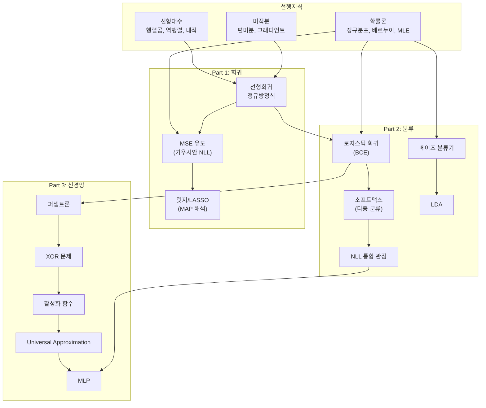
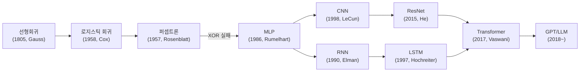

# 회귀부터 신경망까지 완전정복

> **범위**: 선형회귀(정규방정식, MSE 유도) | 릿지/LASSO | 로지스틱 회귀(BCE) | 소프트맥스 | NLL 통합 | 베이즈 분류기 | LDA | 퍼셉트론 | XOR 문제 | 활성화 함수 | Universal Approximation | MLP
>
> **레벨 가이드**: ①초등(비유) ②중등(직관+계산) ③고등(수식 입문) ④대학+코드 ⑤대학원+논문

---

## 0. 왜 이 주제를 배워야 하는가 (동기부여)

딥러닝의 가장 복잡한 모델도 결국 **"선형 변환 → 비선형 활성화"의 반복**이다.
이 문서에서 다루는 선형회귀, 로지스틱 회귀, 퍼셉트론, MLP는 그 반복의 **가장 작은 단위**다.

- **선형회귀** 하나를 완벽히 이해하면, MSE 손실이 왜 그 형태인지, 정규방정식이 왜 나오는지 알 수 있다.
- **로지스틱 회귀**를 이해하면, Cross-Entropy가 왜 분류에 쓰이는지 납득된다.
- **퍼셉트론의 한계**(XOR)를 체감하면, 왜 신경망이 필요한지 뼛속까지 느낀다.
- **Universal Approximation Theorem**을 알면, 신경망의 이론적 힘과 실제적 한계를 동시에 파악한다.

> 이 기초를 건너뛰고 Transformer를 배우는 것은, 구구단을 모르고 미적분을 배우는 것과 같다.

---

## 0.1 선행 지식 맵



---

# Part 1: 선형회귀

---

## 1. 선형회귀 -- "가장 잘 맞는 직선 긋기"

### 1.1 동기부여

> 키가 크면 몸무게도 무거운 경향이 있다. 데이터에 직선을 그어서 "키 170cm이면 몸무게 약 65kg"이라고 예측하는 것. 이것이 **모든 딥러닝의 출발점**이다.

---

### 1.2 5단계 설명

#### ① 초등 레벨: 줄 긋기 게임

교실에서 친구들의 키와 몸무게를 점으로 찍었다고 생각해보자.

| 친구 | 키(cm) | 몸무게(kg) |
|------|--------|-----------|
| A | 140 | 35 |
| B | 150 | 42 |
| C | 160 | 50 |

이 점들 사이에 **자**를 대고 직선을 긋는다. 직선에서 각 점까지의 거리가 **전체적으로 가장 가까운** 직선이 "최고의 직선"이다.

**비유**: 고무줄 여러 개로 점들을 직선에 연결한다고 상상하자. 고무줄이 가장 덜 늘어나는 위치가 최적의 직선이다.

---

#### ② 중등 레벨: 오차와 제곱의 비밀

직선의 식은 $y = ax + b$이다. 각 데이터에서 예측과 실제의 차이를 **오차**라 한다.

| 데이터 | 실제 $y$ | 예측 $\hat{y}$ | 오차 | 오차의 제곱 |
|--------|---------|---------------|------|-----------|
| $(1, 2)$ | 2 | 1.83 | +0.17 | 0.029 |
| $(2, 4)$ | 4 | 3.33 | +0.67 | 0.449 |
| $(3, 5)$ | 5 | 4.83 | +0.17 | 0.029 |

**왜 오차를 제곱하는가?**

- 양수 오차(+3)와 음수 오차(-3)를 그냥 더하면 0이 되어 상쇄된다.
- 제곱하면 둘 다 +9가 되어 **공평하게 벌점**을 줄 수 있다.
- 절댓값도 가능하지만, 제곱은 미분이 깔끔해서 계산에 유리하다.

**MSE(평균 제곱 오차)**:

$$\text{MSE} = \frac{1}{n}\sum_{i=1}^{n}(y_i - \hat{y}_i)^2$$

**숫자 예시**: 위 표에서 $\text{MSE} = \frac{0.029 + 0.449 + 0.029}{3} \approx 0.169$

---

#### ③ 고등 레벨: 정규방정식의 유도

모델: $\hat{y} = w_1 x + w_0$, 행렬로 쓰면 $\hat{y} = Xw$.

설계 행렬 (bias 포함):

$$X = \begin{bmatrix} 1 & 1 \\ 2 & 1 \\ 3 & 1 \end{bmatrix}, \quad y = \begin{bmatrix} 2 \\ 4 \\ 5 \end{bmatrix}$$

손실 함수를 벡터로 쓰면:

$$L(w) = \frac{1}{2}\|Xw - y\|^2$$

> **수식 전 해석**: "예측($Xw$)과 정답($y$)의 거리의 제곱"을 최소화하라는 뜻이다.

$w$에 대해 미분하고 0으로 놓으면:

$$\nabla_w L = X^\top(Xw - y) = X^\top X w - X^\top y = 0$$

**정규방정식**:

$$\boxed{X^\top X \hat{w} = X^\top y}$$

$X^\top X$가 역행렬을 가지면:

$$\hat{w} = (X^\top X)^{-1} X^\top y$$

**숫자로 확인**:

$$X^\top X = \begin{bmatrix} 14 & 6 \\ 6 & 3 \end{bmatrix}, \quad X^\top y = \begin{bmatrix} 25 \\ 11 \end{bmatrix}$$

$$\hat{w} = \frac{1}{6}\begin{bmatrix} 3 & -6 \\ -6 & 14 \end{bmatrix}\begin{bmatrix} 25 \\ 11 \end{bmatrix} = \begin{bmatrix} 1.5 \\ 0.333 \end{bmatrix}$$

결과: $y \approx 1.5x + 0.33$

---

#### ④ 대학 레벨: MSE = 가우시안 NLL + Python 구현

**핵심 통찰: MSE는 "관례"가 아니라, 가우시안 노이즈 가정에서 수학적으로 유도된다.**

모델: $y = h(x) + \varepsilon$, $\varepsilon \sim \mathcal{N}(0, \sigma^2)$

따라서: $y \mid x \sim \mathcal{N}(h(x), \sigma^2)$

데이터가 i.i.d.일 때 로그 우도:

$$\log P(y_1, \ldots, y_n \mid X, w) = \sum_{i=1}^{n} \log \mathcal{N}(y_i; x_i^\top w, \sigma^2)$$

가우시안 pdf를 대입:

$$= \sum_{i=1}^{n} \left[ -\frac{1}{2}\log(2\pi\sigma^2) - \frac{(y_i - x_i^\top w)^2}{2\sigma^2} \right]$$

NLL(부호 반전):

$$\text{NLL} = \frac{n}{2}\log(2\pi\sigma^2) + \frac{1}{2\sigma^2}\sum_{i=1}^{n}(y_i - x_i^\top w)^2$$

$\sigma^2$는 $w$에 무관한 상수이므로:

$$\boxed{\arg\min_w \text{NLL} = \arg\min_w \text{MSE}}$$

> **일반화**: 가우시안 노이즈 가정 + MLE = 최소제곱법. 노이즈가 라플라스 분포이면 MAE가 된다.

**Python 구현**:

```python
import numpy as np

# 데이터
X_raw = np.array([[1], [2], [3]])
y = np.array([2, 4, 5])

# 설계 행렬 (bias 열 추가)
X = np.hstack([X_raw, np.ones((len(X_raw), 1))])

# 정규방정식: w = (X^T X)^{-1} X^T y
w_hat = np.linalg.solve(X.T @ X, X.T @ y)
print(f"w = {w_hat}")  # [1.5, 0.333...]

# 예측
y_pred = X @ w_hat
mse = np.mean((y - y_pred) ** 2)
print(f"MSE = {mse:.4f}")  # 0.0556

# scikit-learn으로 검증
from sklearn.linear_model import LinearRegression
model = LinearRegression().fit(X_raw, y)
print(f"sklearn: w1={model.coef_[0]:.3f}, w0={model.intercept_:.3f}")
```

---

#### ⑤ 대학원 레벨: 해의 존재성, 유사역행렬, NTK 연결

**경우 1: $\text{rank}(X) = p$ (full column rank)**

유일한 해: $\hat{w} = (X^\top X)^{-1} X^\top y$

**경우 2: $\text{rank}(X) < p$ (과잉 파라미터화, $n < p$)**

$X^\top X$가 특이(singular)하여 역행렬이 존재하지 않는다. 무한히 많은 해 중 **최소 노름 해**:

$$\hat{w}_{\min} = X^+ y = X^\top(XX^\top)^{-1} y$$

여기서 $X^+$는 Moore-Penrose 유사역행렬이다.

**과잉 파라미터화와 Double Descent**: Belkin et al. (2019)는 $p \gg n$인 보간(interpolation) 영역에서 테스트 오류가 다시 감소하는 **이중 하강(double descent)** 현상을 발견했다. 최소 노름 해가 암묵적 정규화(implicit regularization) 역할을 하기 때문이다.

**Neural Tangent Kernel (NTK) 연결**: 무한 폭 신경망의 학습 동역학은 커널 회귀로 환원된다:

$$f(x) = y^\top (K + \lambda I)^{-1} k(x)$$

여기서 $K_{ij} = \langle \nabla_\theta f(x_i; \theta_0), \nabla_\theta f(x_j; \theta_0) \rangle$. 이는 릿지 회귀의 커널 버전과 정확히 같은 형태이다 (Jacot et al., 2018).

**참고 논문**:
- Belkin et al. (2019) "Reconciling modern ML with bias-variance trade-off"
- Jacot et al. (2018) "Neural Tangent Kernel"

---

### 1.3 오개념 경고

| 오개념 | 진실 |
|--------|------|
| "MSE는 그냥 관례다" | MSE는 가우시안 노이즈 가정 + MLE에서 수학적으로 유도된다 |
| "정규방정식의 해는 항상 유일하다" | $n < p$이면 무한히 많은 해가 존재한다 |
| "오차를 제곱하는 것이 유일한 방법이다" | 라플라스 노이즈면 절댓값(MAE), Huber 손실 등도 정당화된다 |
| "데이터가 많으면 항상 좋다" | 특징 수($p$)도 함께 커지면 차원의 저주가 발생한다 |

---

### 1.4 설명하기 훈련

**문제**: "친구에게 '왜 오차를 제곱하는가'를 30초 안에 설명하시오."

<details>
<summary>모범 답안 (클릭하여 펼치기)</summary>

"양수 오차와 음수 오차를 그냥 더하면 서로 상쇄돼서 0이 될 수 있어. 제곱하면 부호가 사라지니까 모든 오차가 공평하게 반영돼. 그리고 수학적으로 보면, '오차가 정규분포를 따른다'고 가정하면 MLE를 통해 자연스럽게 제곱 오차가 나와. 즉 MSE는 관례가 아니라 확률적 가정의 결과야."

</details>

---

### 1.5 수학에서 딥러닝으로

| 선형회귀 개념 | 딥러닝 대응 |
|-------------|-----------|
| $y = Xw$ | 신경망의 한 층: $z = Wx + b$ |
| MSE 손실 | 회귀 태스크의 출력층 손실 |
| 정규방정식 $(X^\top X)^{-1}X^\top y$ | 경사하강법으로 대체 (대규모 데이터) |
| 가우시안 노이즈 가정 | 출력 분포 가정 → 손실 함수 결정 |

---

### 1.6 성취 확인

- [ ] 3개의 데이터로 정규방정식을 손으로 풀 수 있는가?
- [ ] MSE가 가우시안 NLL임을 유도할 수 있는가?
- [ ] $n < p$일 때 왜 유일한 해가 없는지 설명할 수 있는가?
- [ ] NumPy로 정규방정식을 구현할 수 있는가?

---

### 1.7 킬러 요약

> **선형회귀 = 가우시안 노이즈 + MLE = MSE 최소화 = 정규방정식.**
> 뉴런 1개짜리 신경망(활성화 없음)이 곧 선형회귀이다.
> 정규방정식은 데이터가 작을 때 닫힌 해를 주고, 대규모에서는 경사하강법이 대신한다.

---

---

# Part 1 보충: 릿지 회귀와 LASSO

---

## 2. 릿지 회귀 & LASSO -- "과적합 방지의 수학"

### 2.1 동기부여

> 특징이 100개인데 데이터가 50개뿐이면? 정규방정식의 $X^\top X$는 역행렬이 없고, 모델은 훈련 데이터를 **외워버린다**. 정규화는 "가중치를 작게 유지하라"는 **제약**을 걸어 과적합을 막는다.

---

### 2.2 5단계 설명

#### ① 초등 레벨: 풍선 묶기

시험 공부를 너무 열심히 해서 교과서를 **통째로 외운** 학생이 있다. 하지만 시험에 살짝 다른 문제가 나오면 못 푼다. "핵심만 기억해!"라고 제한을 거는 것이 정규화다.

- **릿지**: "모든 과목을 골고루 공부해!" (가중치를 전체적으로 줄임)
- **LASSO**: "중요한 과목만 집중해!" (불필요한 가중치를 완전히 0으로)

---

#### ② 중등 레벨: 벌점 부과

원래 손실: $L = \text{MSE}$ (데이터에 잘 맞추기)

릿지: $L = \text{MSE} + \lambda \times (\text{가중치 크기의 제곱합})$

LASSO: $L = \text{MSE} + \lambda \times (\text{가중치 크기의 절댓값합})$

- $\lambda = 0$: 벌점 없음 → 과적합 위험
- $\lambda$가 큼: 벌점 과다 → 가중치가 너무 줄어 과소적합
- 적절한 $\lambda$: 교차검증으로 선택

**숫자 예시**: $w = [3, -2, 0.1]$일 때
- L2 벌점: $3^2 + (-2)^2 + 0.1^2 = 13.01$
- L1 벌점: $|3| + |-2| + |0.1| = 5.1$

---

#### ③ 고등 레벨: 릿지의 정규방정식

릿지 손실:

$$L(w; \lambda) = \frac{1}{2}\|Xw - y\|^2 + \frac{\lambda}{2}\|w\|^2$$

> **수식 전 해석**: 첫 번째 항은 "데이터를 잘 맞춰라", 두 번째 항은 "가중치를 작게 유지하라". $\lambda$가 둘의 균형을 조절한다.

미분하면:

$$\nabla_w L = X^\top X w - X^\top y + \lambda w = (X^\top X + \lambda I)w - X^\top y = 0$$

**릿지 정규방정식**:

$$\boxed{\hat{w}_\lambda = (X^\top X + \lambda I)^{-1} X^\top y}$$

핵심: $X^\top X + \lambda I$는 $\lambda > 0$이면 **항상 양정치**이므로 역행렬이 반드시 존재한다.

---

#### ④ 대학 레벨: MAP 해석 + Python

**확률적 해석**: 릿지 = 가우시안 사전분포를 가정한 **MAP(Maximum A Posteriori) 추정**.

$$p(w) = \mathcal{N}(0, \tau^2 I) \propto \exp\left(-\frac{\|w\|^2}{2\tau^2}\right)$$

MAP 목적함수:

$$\hat{w}_{\text{MAP}} = \arg\max_w \left[\log P(y \mid X, w) + \log p(w)\right]$$

$$= \arg\min_w \left[\frac{1}{2\sigma^2}\|Xw - y\|^2 + \frac{1}{2\tau^2}\|w\|^2\right]$$

$\lambda = \sigma^2 / \tau^2$로 놓으면 릿지 회귀와 정확히 일치한다.

| 정규화 | 사전분포 | 효과 |
|--------|---------|------|
| L2 (릿지) | 가우시안 $\mathcal{N}(0, \tau^2 I)$ | 가중치를 전체적으로 축소 |
| L1 (LASSO) | 라플라스 $\text{Lap}(0, b)$ | 일부 가중치를 정확히 0으로 (희소해) |
| Elastic Net | 가우시안 + 라플라스 혼합 | L1 + L2의 장점 결합 |

```python
import numpy as np
from sklearn.linear_model import Ridge, Lasso

# 데이터 생성
np.random.seed(42)
n, p = 50, 100  # 데이터 < 특징 (과잉 파라미터화)
X = np.random.randn(n, p)
w_true = np.zeros(p)
w_true[:5] = [3, -2, 1.5, -1, 0.5]  # 실제로 5개만 중요
y = X @ w_true + 0.1 * np.random.randn(n)

# 릿지 회귀
ridge = Ridge(alpha=1.0).fit(X, y)
print(f"릿지: 비영 가중치 수 = {np.sum(np.abs(ridge.coef_) > 0.01)}")  # ~100

# LASSO
lasso = Lasso(alpha=0.1).fit(X, y)
print(f"LASSO: 비영 가중치 수 = {np.sum(np.abs(lasso.coef_) > 0.01)}")  # ~5

# 정규방정식 직접 계산
lam = 1.0
w_ridge = np.linalg.solve(X.T @ X + lam * np.eye(p), X.T @ y)
print(f"정규방정식 vs sklearn 차이: {np.max(np.abs(w_ridge - ridge.coef_)):.6f}")
```

---

#### ⑤ 대학원 레벨: 편향-분산 트레이드오프와 이중 하강

릿지 추정량의 편향-분산 분해:

$$\text{MSE}(\hat{w}_\lambda) = \underbrace{\|\text{Bias}\|^2}_{\lambda \uparrow \Rightarrow \uparrow} + \underbrace{\text{Var}}_{\lambda \uparrow \Rightarrow \downarrow}$$

- $\lambda = 0$: 편향 0, 분산 최대 (과적합)
- $\lambda \to \infty$: 편향 최대, 분산 0 (과소적합)
- 최적 $\lambda$: 교차검증으로 선택

**이중 하강과의 연결**: 과잉 파라미터화($p \gg n$) 영역에서 최소 노름 해 $X^+ y$는 암묵적으로 L2 정규화를 수행한다. 이것이 보간 임계점($p = n$) 이후 테스트 오류가 다시 감소하는 이중 하강 현상의 원인이다.

**LASSO의 볼록 최적화**: LASSO 목적함수는 볼록이지만 L1 노름이 미분 불가능하므로, proximal gradient descent 또는 coordinate descent를 사용한다.

---

### 2.3 오개념 경고

| 오개념 | 진실 |
|--------|------|
| "정규화는 항상 성능을 높인다" | $\lambda$가 너무 크면 과소적합. 교차검증 필수 |
| "LASSO가 항상 릿지보다 좋다" | 중요 특징이 많으면 릿지가 낫다. LASSO는 희소한 경우에 강하다 |
| "Weight decay와 L2 정규화는 다르다" | SGD에서는 동일. Adam에서는 AdamW(decoupled weight decay)와 L2가 다르다 |

---

### 2.4 킬러 요약

> **릿지 = 가우시안 prior + MAP = $(X^\top X + \lambda I)^{-1} X^\top y$.**
> **LASSO = 라플라스 prior + MAP = 희소 해.**
> 딥러닝의 weight decay는 릿지 정규화의 경사하강법 버전이다.

---

---

# Part 2: 분류

---

## 3. 로지스틱 회귀 -- "확률로 분류하기"

### 3.1 동기부여

> "이 이메일이 스팸인가?" 선형회귀로 0/1을 예측하면 0보다 작거나 1보다 큰 값이 나올 수 있다. S자 커브(시그모이드)를 씌워서 출력을 **확률(0~1)**로 바꾸면 이 문제가 해결된다.

---

### 3.2 5단계 설명

#### ① 초등 레벨: 합격/불합격 판정기

시험 점수로 합격(1)인지 불합격(0)인지 예측하고 싶다. 점수가 높으면 합격 확률이 높고, 낮으면 불합격 확률이 높다. 시그모이드는 이 관계를 **S자 커브**로 매끄럽게 표현한다.

- 점수가 아주 높으면 → 합격 확률 ≈ 100%
- 점수가 아주 낮으면 → 합격 확률 ≈ 0%
- 중간이면 → 합격 확률 ≈ 50%

---

#### ② 중등 레벨: 시그모이드와 확률

시그모이드 함수:

$$\sigma(z) = \frac{1}{1 + e^{-z}}$$

| $z$ (점수) | $\sigma(z)$ (확률) | 해석 |
|-----------|-------------------|------|
| -3 | 0.047 | 거의 불합격 |
| -1 | 0.269 | 불합격 가능성 높음 |
| 0 | 0.500 | 반반 |
| +1 | 0.731 | 합격 가능성 높음 |
| +3 | 0.953 | 거의 합격 |

**로지스틱 회귀 모델**: $z = w_1 x_1 + w_2 x_2 + \cdots + b$를 계산한 뒤, $\sigma(z)$를 통과시킨다.

- $\sigma(z) > 0.5$이면 클래스 1
- $\sigma(z) \leq 0.5$이면 클래스 0

**이름에 "회귀"가 있지만, 실제로는 분류 모델이다!**

---

#### ③ 고등 레벨: BCE 손실의 유도

확률적 모델: $p(y=1 \mid x) = \sigma(w^\top x)$

데이터 $(x_i, y_i)$ 하나의 우도:

$$p(y_i \mid x_i) = \sigma(w^\top x_i)^{y_i} \cdot (1 - \sigma(w^\top x_i))^{1-y_i}$$

> **수식 전 해석**: $y_i = 1$이면 $\sigma(w^\top x_i)$, $y_i = 0$이면 $1 - \sigma(w^\top x_i)$가 살아남는 트릭이다.

전체 데이터의 NLL:

$$\text{BCE} = -\sum_{i=1}^{n}\left[y_i \log \sigma(w^\top x_i) + (1-y_i)\log(1 - \sigma(w^\top x_i))\right]$$

**숫자 예시**:

$w^\top x = 2$, 실제 $y = 1$:
$$\sigma(2) \approx 0.881, \quad \text{BCE}_i = -\log(0.881) \approx 0.127 \quad \text{(낮은 손실)}$$

$w^\top x = -1$, 실제 $y = 1$:
$$\sigma(-1) \approx 0.269, \quad \text{BCE}_i = -\log(0.269) \approx 1.312 \quad \text{(높은 손실)}$$

**핵심 차이**: 선형회귀와 달리 닫힌 해가 **없다**. 경사 하강법으로 최적화해야 한다.

---

#### ④ 대학 레벨: 그래디언트 + Python

BCE의 그래디언트:

$$\nabla_w \text{BCE} = -\sum_{i=1}^{n}(y_i - \sigma(w^\top x_i)) x_i = X^\top(\hat{y} - y)$$

> 놀랍게도, MSE의 그래디언트 $X^\top(Xw - y)$와 **형태가 동일**하다! (출력만 $\sigma$를 거친다)

```python
import numpy as np
from sklearn.datasets import make_classification
from sklearn.linear_model import LogisticRegression

# 데이터 생성
X, y = make_classification(n_samples=200, n_features=2,
                           n_redundant=0, random_state=42)

# 시그모이드 함수
def sigmoid(z):
    return 1 / (1 + np.exp(-np.clip(z, -500, 500)))

# 경사 하강법 구현
w = np.zeros(X.shape[1])
b = 0.0
lr = 0.1

for epoch in range(1000):
    z = X @ w + b
    y_hat = sigmoid(z)
    # BCE 그래디언트
    dw = X.T @ (y_hat - y) / len(y)
    db = np.mean(y_hat - y)
    w -= lr * dw
    b -= lr * db

    if epoch % 200 == 0:
        bce = -np.mean(y * np.log(y_hat + 1e-8) + (1 - y) * np.log(1 - y_hat + 1e-8))
        acc = np.mean((y_hat > 0.5) == y)
        print(f"Epoch {epoch}: BCE={bce:.4f}, Acc={acc:.2%}")

# sklearn 검증
model = LogisticRegression().fit(X, y)
print(f"sklearn 정확도: {model.score(X, y):.2%}")
```

---

#### ⑤ 대학원 레벨: 볼록성, 수렴 보장, 일반화 경계

**BCE는 $w$에 대해 볼록이다**: $\nabla^2 \text{BCE} = X^\top \text{diag}(\hat{y}(1-\hat{y})) X \succeq 0$ (양반정치).

따라서 경사 하강법은 전역 최소해로 수렴한다 (단, L-smooth일 때 수렴 속도 $O(1/t)$).

**Rademacher 복잡도를 이용한 일반화 경계**: 가설 공간 $\mathcal{H} = \{x \mapsto \sigma(w^\top x) : \|w\| \leq B\}$에 대해:

$$L_{\mathcal{P}}(h) \leq L_S(h) + O\left(\frac{B \cdot R}{\sqrt{n}}\right)$$

여기서 $R = \max_i \|x_i\|$. 릿지 정규화($\|w\| \leq B$)가 일반화에 직접 기여한다.

---

### 3.3 오개념 경고

| 오개념 | 진실 |
|--------|------|
| "로지스틱 회귀는 회귀 모델이다" | 이름만 회귀이고, 실제로는 이진 분류 모델이다 |
| "분류에 MSE를 써도 된다" | 가능하지만, 범주형 분포의 NLL인 CE가 확률적으로 올바르다. MSE는 그래디언트가 작아 학습이 느리다 |
| "시그모이드 출력이 '진짜' 확률이다" | 교정(calibration)되지 않으면 확률의 의미가 왜곡된다 |

---

### 3.4 킬러 요약

> **로지스틱 회귀 = 베르누이 가정 + MLE = BCE 최소화.**
> 뉴런 1개 + 시그모이드 활성화 = 로지스틱 회귀.
> 닫힌 해가 없으므로 경사 하강법이 필수. 볼록이므로 전역 최소해 보장.

---

---

## 4. 소프트맥스 회귀 -- "여러 개 중 하나 고르기"

### 4.1 동기부여

> 스팸/정상이 아니라 개/고양이/새를 구분하려면? 시그모이드(2클래스)를 **소프트맥스(C클래스)**로 일반화한다.

---

### 4.2 5단계 설명

#### ① 초등 레벨: 투표 시스템

3명의 후보에게 점수를 매긴다: $[2, 1, 0.5]$. 점수가 높을수록 "이 후보일 확률"이 높다. 하지만 점수 자체는 확률이 아니다(합이 1이 아님). 소프트맥스는 이 점수를 **확률로 변환**한다:

$$[2, 1, 0.5] \to [0.59, 0.22, 0.13, \ldots] \quad (\text{합} = 1)$$

---

#### ② 중등 레벨: 지수 + 정규화

$$\text{softmax}(z)_i = \frac{e^{z_i}}{\sum_{j=1}^{C} e^{z_j}}$$

| 로짓 $z$ | $e^z$ | 소프트맥스 |
|----------|-------|----------|
| 2.0 | 7.389 | $7.389 / 10.02 = 0.587$ |
| 1.0 | 2.718 | $2.718 / 10.02 = 0.272$ |
| 0.5 | 1.649 | $1.649 / 10.02 = 0.141$ |
| 합 | 11.756 | 1.000 |

**왜 지수함수?**
- 모든 값을 양수로 만든다 ($e^z > 0$)
- 차이를 증폭한다 (큰 값이 더 커진다)
- 합으로 나누면 확률 분포가 된다

---

#### ③ 고등 레벨: Categorical Cross-Entropy

모델: $f_W(x) = \text{softmax}(Wx)$, $W \in \mathbb{R}^{C \times d}$

손실:

$$L = -\sum_{i=1}^{n} \log \text{softmax}(Wx_i)_{y_i} = -\sum_{i=1}^{n} \log \frac{\exp(w_{y_i}^\top x_i)}{\sum_{c=1}^{C}\exp(w_c^\top x_i)}$$

> **수식 전 해석**: "정답 클래스에 배정된 확률의 로그"를 최대화하라. 정답에 높은 확률을 줄수록 손실이 줄어든다.

**시그모이드와의 관계**: $C = 2$이면 소프트맥스 = 시그모이드. 즉 로지스틱 회귀는 소프트맥스 회귀의 특수 경우이다.

---

#### ④ 대학 레벨: 수치 안정성 + Python

**오버플로 방지 트릭**: $\text{softmax}(z)_i = \text{softmax}(z - \max(z))_i$ (상수를 빼도 결과 불변)

```python
import numpy as np

def softmax(z):
    z_stable = z - np.max(z, axis=-1, keepdims=True)  # 수치 안정성
    exp_z = np.exp(z_stable)
    return exp_z / np.sum(exp_z, axis=-1, keepdims=True)

def cross_entropy_loss(logits, labels):
    probs = softmax(logits)
    n = len(labels)
    log_probs = np.log(probs[np.arange(n), labels] + 1e-8)
    return -np.mean(log_probs)

# 예시: 3클래스, 5개 샘플
logits = np.array([[2.0, 1.0, 0.5],
                   [0.1, 3.0, 0.2],
                   [0.5, 0.5, 2.5],
                   [3.0, 0.1, 0.1],
                   [0.2, 0.3, 2.8]])
labels = np.array([0, 1, 2, 0, 2])

print(f"소프트맥스 확률:\n{softmax(logits)}")
print(f"CE 손실: {cross_entropy_loss(logits, labels):.4f}")
```

---

#### ⑤ 대학원 레벨: 온도 스케일링과 Gumbel-Softmax

**온도 파라미터 $\tau$**:

$$\text{softmax}(z/\tau)_i = \frac{\exp(z_i/\tau)}{\sum_j \exp(z_j/\tau)}$$

- $\tau \to 0$: argmax (원-핫)
- $\tau = 1$: 표준 소프트맥스
- $\tau \to \infty$: 균등 분포

**Gumbel-Softmax (Jang et al., 2017)**: 이산 선택을 미분 가능하게 만드는 재매개변수화 트릭. VAE의 이산 잠재 변수 학습에 핵심.

---

### 4.3 킬러 요약

> **소프트맥스 = 시그모이드의 다중 클래스 일반화.**
> $\text{softmax}(z)_i = e^{z_i} / \sum e^{z_j}$로 로짓을 확률 분포로 변환.
> Categorical CE는 "정답 클래스의 로그 확률을 최대화"하라는 뜻.

---

---

## 5. NLL 통합 -- "모든 손실 함수는 하나에서 나온다"

### 5.1 동기부여

> MSE, BCE, Categorical CE가 제각각인 것처럼 보이지만, 실은 **NLL(Negative Log-Likelihood)**이라는 하나의 원리에서 모두 유도된다. 분포 가정만 바꾸면 다른 손실이 나온다.

---

### 5.2 5단계 설명

#### ① 초등 레벨: 퀴즈 채점의 원리

동전 10번 던져 앞면이 7번 나왔다. "이 동전은 앞면 확률이 70%쯤이겠다"고 추측하는 것이 MLE. **가장 그럴듯한 설명**을 찾는 방법이다.

---

#### ② 중등 레벨: 분포별 NLL 표

| 상황 | 분포 가정 | NLL | 우리가 아는 이름 |
|------|----------|-----|----------------|
| 숫자 예측 | 가우시안 | $\frac{1}{2\sigma^2}\sum(y_i - \hat{y}_i)^2$ | **MSE** |
| 둘 중 하나 | 베르누이 | $-\sum[y\log\hat{y} + (1-y)\log(1-\hat{y})]$ | **BCE** |
| 여러 개 중 하나 | 범주형 | $-\sum\log\hat{y}_{y_i}$ | **Categorical CE** |
| 이상치 많음 | 라플라스 | $\frac{1}{b}\sum|y_i - \hat{y}_i|$ | **MAE** |

**핵심 공식**:

$$\text{NLL}(h) = -\sum_{i=1}^{n} \log p(y_i \mid x_i; h)$$

---

#### ③ 고등 레벨: 통합 유도

**일반 공식**: 데이터가 i.i.d.이면:

$$P(S \mid h) = \prod_{i=1}^{n} p(y_i \mid x_i; h)$$

$$\text{NLL} = -\log P(S \mid h) = -\sum_{i=1}^{n} \log p(y_i \mid x_i; h)$$

**가우시안 경우**: $p(y \mid x; w) = \mathcal{N}(y; w^\top x, \sigma^2)$

$$-\log p = \frac{(y - w^\top x)^2}{2\sigma^2} + \text{const}$$

→ MSE와 비례

**베르누이 경우**: $p(y \mid x; w) = \sigma(w^\top x)^y (1-\sigma(w^\top x))^{1-y}$

$$-\log p = -[y\log\sigma(w^\top x) + (1-y)\log(1-\sigma(w^\top x))]$$

→ BCE 그 자체

---

#### ④ 대학 레벨: KL 발산 연결

경험적 분포 $p_S$와 모델 분포 $q_h$ 사이의 KL 발산:

$$\text{KL}(p_S \| q_h) = \underbrace{-H(p_S)}_{\text{상수}} + \underbrace{\frac{1}{n}\text{NLL}}_{\text{모델 의존}}$$

따라서:

$$\arg\min_h \text{NLL} = \arg\min_h \text{KL}(p_S \| q_h)$$

**NLL 최소화 = 모델 분포를 데이터 분포에 근사시키는 것.**

이것은 ERM(경험적 위험 최소화)와도 동치:

$$\arg\max_h \text{Lik} = \arg\min_h \text{NLL} = \arg\min_h \text{KL} = \arg\min_h \text{ERM}$$

---

#### ⑤ 대학원 레벨: 지수족과 정보기하학

모든 표준 손실 함수는 **지수족(exponential family)** 분포의 NLL이다:

$$p(y; \eta) = h(y)\exp(\eta^\top T(y) - A(\eta))$$

- 가우시안: $\eta = \mu/\sigma^2$, $A(\eta) = \eta^2\sigma^2/2$
- 베르누이: $\eta = \log\frac{p}{1-p}$ (logit), $A(\eta) = \log(1+e^\eta)$

**정보기하학**: 파라미터 공간의 Fisher 정보 행렬 $F = \mathbb{E}[\nabla\log p \cdot (\nabla\log p)^\top]$이 리만 계량을 정의하고, Natural Gradient Descent $\Delta\theta = -F^{-1}\nabla L$은 이 계량 하에서의 최속강하법이다 (Amari, 1998).

---

### 5.3 설명하기 훈련

**문제**: "왜 분류에서 MSE 대신 Cross-Entropy를 쓰는지 설명하시오."

<details>
<summary>모범 답안</summary>

"MSE는 '오차가 정규분포를 따른다'는 가정에서 나옵니다. 분류에서 출력은 0 또는 1이지 연속값이 아니므로, 정규분포 가정이 부적절합니다. 대신 '출력이 베르누이/범주형 분포를 따른다'고 가정하면 NLL이 자연스럽게 Cross-Entropy가 됩니다. 또한 MSE를 분류에 쓰면 시그모이드의 기울기가 작은 영역에서 그래디언트가 매우 작아져(vanishing) 학습이 느립니다. CE는 이 문제가 없습니다."

</details>

---

### 5.4 킬러 요약

> **NLL이 모든 손실 함수를 통합한다.**
> 가우시안 → MSE, 베르누이 → BCE, 범주형 → CE, 라플라스 → MAE.
> 손실 함수 선택 = "데이터의 노이즈가 어떤 분포를 따르는가?"에 대한 답.

---

---

## 6. 베이즈 분류기와 LDA -- "최적의 분류는 확률에 있다"

### 6.1 동기부여

> 모든 분류기의 **이론적 상한**은 베이즈 분류기이다. 실제로는 $p(x \mid y)$를 모르니까, 가우시안이라 가정하면 LDA가 되고, 특징 독립을 가정하면 나이브 베이즈가 된다.

---

### 6.2 5단계 설명

#### ① 초등 레벨: 의사의 진단

의사가 환자를 진단할 때: "기침이 있으면 감기일 확률이 높고, 열이 있으면 독감일 확률이 높다." 여러 증상을 종합해서 **가장 확률이 높은 병**을 고르는 것이 베이즈 분류기이다.

---

#### ② 중등 레벨: 베이즈 정리

$$P(\text{병} \mid \text{증상}) = \frac{P(\text{증상} \mid \text{병}) \times P(\text{병})}{P(\text{증상})}$$

- $P(\text{병})$: 사전확률 (이 병이 얼마나 흔한가)
- $P(\text{증상} \mid \text{병})$: 우도 (이 병이면 이 증상이 나올 확률)
- $P(\text{병} \mid \text{증상})$: 사후확률 (증상을 보고 병을 추측)

**나이브 베이즈**: 증상들이 **서로 독립**이라 가정한다.

$$P(\text{기침, 열} \mid \text{독감}) = P(\text{기침} \mid \text{독감}) \times P(\text{열} \mid \text{독감})$$

이 가정이 위반되더라도 놀라울 정도로 잘 작동한다!

---

#### ③ 고등 레벨: LDA의 결정 경계

**가정**: 각 클래스 $k$의 데이터가 같은 공분산 $\Sigma$의 가우시안을 따른다.

$$p(x \mid y=k) = \mathcal{N}(x; m_k, \Sigma)$$

베이즈 분류기: $f(x) = \arg\max_k p(y=k \mid x) = \arg\max_k [p(x \mid y=k) \cdot p(y=k)]$

로그를 취하면 이차항이 상쇄되어 **선형** 결정 함수가 나온다:

$$F(x) = \text{sign}(a^\top x - b), \quad a = \Sigma^{-1}(m_1 - m_2)$$

> **수식 전 해석**: 두 클래스의 평균 차이를 공분산의 역행렬로 "보정"한 방향이 최적 분류 방향이다.

**공분산이 다르면** ($\Sigma_1 \neq \Sigma_2$): 이차 결정 경계 → QDA.

---

#### ④ 대학 레벨: Fisher의 LDA + Python

Fisher의 관점: 데이터를 1차원으로 사영했을 때, **클래스 간 분산은 최대화**하고 **클래스 내 분산은 최소화**하는 방향을 찾는다.

$$J(w) = \frac{(w^\top(m_1 - m_2))^2}{2w^\top \Sigma_W w}$$

최적 방향: $w^* \propto \Sigma_W^{-1}(m_1 - m_2)$

```python
import numpy as np
from sklearn.discriminant_analysis import LinearDiscriminantAnalysis

# 2클래스 가우시안 데이터
np.random.seed(42)
n = 100
m1, m2 = np.array([1, 2]), np.array([4, 5])
Sigma = np.array([[1, 0.5], [0.5, 1]])

X1 = np.random.multivariate_normal(m1, Sigma, n)
X2 = np.random.multivariate_normal(m2, Sigma, n)
X = np.vstack([X1, X2])
y = np.array([0]*n + [1]*n)

# Fisher의 최적 방향 (수동 계산)
Sigma_inv = np.linalg.inv(Sigma)
w_fisher = Sigma_inv @ (m1 - m2)
w_fisher = w_fisher / np.linalg.norm(w_fisher)
print(f"Fisher 방향: {w_fisher}")

# sklearn LDA
lda = LinearDiscriminantAnalysis()
lda.fit(X, y)
print(f"LDA 정확도: {lda.score(X, y):.2%}")
```

---

#### ⑤ 대학원 레벨: 생성 vs 판별 모델

| 관점 | 생성 모델 | 판별 모델 |
|------|----------|----------|
| 모델링 | $p(x \mid y)$와 $p(y)$ | $p(y \mid x)$ 직접 |
| 예시 | 나이브 베이즈, LDA, GMM | 로지스틱 회귀, SVM, 신경망 |
| 장점 | 적은 데이터에서 강함, 결측치 처리 | 결정 경계만 학습하므로 효율적 |
| 단점 | 분포 가정이 틀리면 성능 저하 | $p(x)$ 생성 불가 |

**Ng & Jordan (2002)**: 나이브 베이즈(생성)는 $O(\log n)$ 데이터에서 수렴하고, 로지스틱 회귀(판별)는 $O(n)$에서 수렴하지만 점근적 오류는 더 낮다.

---

### 6.3 킬러 요약

> **베이즈 분류기 = 이론적 최적 분류기.**
> LDA = 공유 공분산 가우시안 가정 → 선형 결정 경계.
> 나이브 베이즈 = 특징 독립 가정 → 간단하지만 놀랍게 효과적.

---

---

# Part 3: 신경망

---

## 7. 퍼셉트론 -- "최초의 인공 뉴런"

### 7.1 동기부여

> 1957년 Rosenblatt이 만든 퍼셉트론은 **가장 단순한 신경망**이다. 입력에 가중치를 곱해 더하고, 임계값을 넘으면 1, 아니면 0을 출력한다. 이것이 현대 딥러닝의 **첫 번째 벽돌**이다.

---

### 7.2 5단계 설명

#### ① 초등 레벨: 찬성/반대 투표

반장 선거에서 3명이 투표한다. 각 사람의 영향력이 다르다:
- 철수 (영향력 2): 찬성
- 영희 (영향력 3): 반대
- 민수 (영향력 1): 찬성

점수 = $2 \times 1 + 3 \times (-1) + 1 \times 1 = 0$. 기준(0)을 넘지 못해 "불합격".

---

#### ② 중등 레벨: 수학적 표현

$$f(x) = \begin{cases} 1 & \text{if } w_1 x_1 + w_2 x_2 + \cdots + b \geq 0 \\ 0 & \text{otherwise} \end{cases}$$

**결정 경계**: $w^\top x + b = 0$이 만드는 **직선**(2D) 또는 **평면**(3D).

**수치 예시**: $w = (2, 3)$, $b = 0$

| 입력 $(x_1, x_2)$ | $w^\top x$ | 출력 |
|-------------------|-----------|------|
| $(1, 1)$ | $2+3=5$ | 1 |
| $(-1, -1)$ | $-2-3=-5$ | 0 |
| $(1, -1)$ | $2-3=-1$ | 0 |

---

#### ③ 고등 레벨: 퍼셉트론 학습 알고리즘

**알고리즘**:
1. $w$를 임의 초기화
2. 오분류된 점 $(x_i, y_i)$를 찾는다
3. $w \leftarrow w + y_i x_i$ (오분류를 수정하는 방향으로 업데이트)
4. 모든 점이 올바르게 분류될 때까지 반복

**수렴 정리**: 데이터가 마진 $\gamma$로 선형 분리 가능하면, 최대 $\frac{R^2}{\gamma^2}$ 번의 업데이트 후 수렴한다 ($R = \max\|x_i\|$).

---

#### ④ 대학 레벨: 퍼셉트론의 한계와 Python

```python
import numpy as np

class Perceptron:
    def __init__(self, d):
        self.w = np.zeros(d + 1)  # bias 포함

    def predict(self, x):
        x_aug = np.append(x, 1)  # bias 항 추가
        return 1 if self.w @ x_aug >= 0 else 0

    def train(self, X, y, max_iter=1000):
        for _ in range(max_iter):
            errors = 0
            for xi, yi in zip(X, y):
                pred = self.predict(xi)
                if pred != yi:
                    xi_aug = np.append(xi, 1)
                    self.w += (2 * yi - 1) * xi_aug  # y in {0,1} -> {-1,+1}
                    errors += 1
            if errors == 0:
                break
        return self

# AND 게이트 (선형 분리 가능)
X_and = np.array([[0,0],[0,1],[1,0],[1,1]])
y_and = np.array([0, 0, 0, 1])
p = Perceptron(2).train(X_and, y_and)
print("AND:", [p.predict(x) for x in X_and])  # [0, 0, 0, 1]

# XOR 게이트 (선형 분리 불가능 -> 학습 실패!)
X_xor = np.array([[0,0],[0,1],[1,0],[1,1]])
y_xor = np.array([0, 1, 1, 0])
p = Perceptron(2).train(X_xor, y_xor)
print("XOR:", [p.predict(x) for x in X_xor])  # 올바르게 분류 못함
```

---

#### ⑤ 대학원 레벨: Minsky-Papert의 증명

Minsky & Papert (1969)는 단일 퍼셉트론이 XOR을 계산할 수 없음을 **집합론적으로** 증명했다:

XOR의 양성 집합 $\{(0,1), (1,0)\}$은 볼록 껍질(convex hull)이 음성 집합 $\{(0,0), (1,1)\}$의 볼록 껍질과 **교차**한다. 초평면으로는 볼록 집합만 분리할 수 있으므로, 단일 퍼셉트론으로는 불가능하다.

이 결과가 1970~80년대 "AI 겨울"을 촉발했지만, **다층** 퍼셉트론(MLP)으로 해결 가능하다는 사실은 이미 알려져 있었다.

---

### 7.3 킬러 요약

> **퍼셉트론 = 선형 결정 경계 = $\mathbf{1}(w^\top x + b \geq 0)$.**
> 선형 분리 가능하면 수렴이 보장되지만, XOR처럼 선형 분리 불가능한 문제는 절대 풀 수 없다.
> 이 한계가 신경망(다층 퍼셉트론)의 동기가 된다.

---

---

## 8. XOR 문제 -- "왜 층을 쌓아야 하는가"

### 8.1 동기부여

> XOR은 가장 간단한 비선형 문제이다. 단일 퍼셉트론이 실패하는 이유를 체감하면, 왜 **숨겨진 층(hidden layer)**이 필요한지 뼛속까지 이해된다.

---

### 8.2 5단계 설명

#### ① 초등 레벨: 같으면 꺼, 다르면 켜

두 스위치가 있다:
- 둘 다 꺼짐(0,0) → 전등 꺼짐(0)
- 하나만 켜짐(0,1) 또는 (1,0) → 전등 켜짐(1)
- 둘 다 켜짐(1,1) → 전등 꺼짐(0)

이것을 직선 하나로 나눌 수 없다! 켜진 점들이 **대각선**으로 있기 때문이다.

---

#### ② 중등 레벨: 2층으로 해결

**아이디어**: 직선 하나로 안 되면, 직선 **두 개**를 합치자!

1. 첫 번째 뉴런: $h_1 = (x_1 \text{ OR } x_2)$ — "적어도 하나가 1인가?"
2. 두 번째 뉴런: $h_2 = (x_1 \text{ AND } x_2)$ — "둘 다 1인가?"
3. 출력: $y = h_1 \text{ AND NOT } h_2$ — "적어도 하나가 1이지만, 둘 다는 아닌가?"

| $x_1$ | $x_2$ | $h_1$ (OR) | $h_2$ (AND) | $y$ (XOR) |
|--------|--------|------------|-------------|-----------|
| 0 | 0 | 0 | 0 | 0 |
| 0 | 1 | 1 | 0 | 1 |
| 1 | 0 | 1 | 0 | 1 |
| 1 | 1 | 1 | 1 | 0 |

---

#### ③ 고등 레벨: 행렬로 표현

은닉층:

$$h = \sigma\left(\begin{bmatrix} 1 & 1 \\ 1 & 1 \end{bmatrix}\begin{bmatrix} x_1 \\ x_2 \end{bmatrix} + \begin{bmatrix} -0.5 \\ -1.5 \end{bmatrix}\right) = \sigma\left(\begin{bmatrix} x_1 + x_2 - 0.5 \\ x_1 + x_2 - 1.5 \end{bmatrix}\right)$$

출력층:

$$y = \sigma\left(\begin{bmatrix} 1 & -2 \end{bmatrix}\begin{bmatrix} h_1 \\ h_2 \end{bmatrix} + 0\right)$$

계단 함수를 사용하면 정확히 XOR을 계산한다.

> **핵심 통찰**: 은닉층이 입력 공간을 **비선형으로 변환**하여, 변환된 공간에서는 선형 분리가 가능해진다.

---

#### ④ 대학 레벨: 학습으로 XOR 해결 + Python

```python
import numpy as np

# XOR 데이터
X = np.array([[0,0],[0,1],[1,0],[1,1]])
y = np.array([[0],[1],[1],[0]])

# 2층 MLP (2 -> 2 -> 1)
np.random.seed(42)
W1 = np.random.randn(2, 2) * 0.5
b1 = np.zeros((1, 2))
W2 = np.random.randn(2, 1) * 0.5
b2 = np.zeros((1, 1))

def sigmoid(z):
    return 1 / (1 + np.exp(-z))

lr = 5.0
for epoch in range(10000):
    # 순전파
    z1 = X @ W1 + b1
    h = sigmoid(z1)
    z2 = h @ W2 + b2
    out = sigmoid(z2)

    # BCE 손실
    loss = -np.mean(y * np.log(out + 1e-8) + (1 - y) * np.log(1 - out + 1e-8))

    # 역전파
    dz2 = out - y                          # (4, 1)
    dW2 = h.T @ dz2 / 4
    db2 = np.mean(dz2, axis=0, keepdims=True)
    dh = dz2 @ W2.T                       # (4, 2)
    dz1 = dh * h * (1 - h)                # sigmoid 미분
    dW1 = X.T @ dz1 / 4
    db1 = np.mean(dz1, axis=0, keepdims=True)

    W2 -= lr * dW2; b2 -= lr * db2
    W1 -= lr * dW1; b1 -= lr * db1

    if epoch % 2000 == 0:
        print(f"Epoch {epoch}: loss={loss:.4f}")

print(f"\n예측: {(out > 0.5).astype(int).flatten()}")  # [0, 1, 1, 0]
print(f"정답: {y.flatten()}")
```

---

#### ⑤ 대학원 레벨: 표현력과 깊이의 관계

**깊이 분리 정리 (Telgarsky, 2016)**: $L$층 $O(1)$ 폭 네트워크가 표현할 수 있는 함수를 $L'$층 ($L' < L$)으로 표현하려면 $2^{\Omega(L)}$ 폭이 필요한 함수가 존재한다.

즉, 깊이가 폭보다 **지수적으로** 효율적인 경우가 있다. XOR은 가장 간단한 예시이며, 실제 문제에서는 이 효과가 극적으로 나타난다.

**Loss landscape**: XOR 문제에서도 손실 표면에 saddle point가 존재하여, SGD의 초기값에 따라 수렴 속도가 크게 다를 수 있다 (Saxe et al., 2014).

---

### 8.3 킬러 요약

> **XOR = 선형 분리 불가능의 최소 예시.**
> 은닉층 하나를 추가하면 입력 공간을 비선형 변환하여 해결 가능.
> 이것이 "왜 딥러닝이 필요한가"의 가장 근본적인 답이다.

---

---

## 9. 활성화 함수 -- "직선을 꺾는 도구"

### 9.1 동기부여

> 선형 함수를 아무리 합성해도 결과는 선형이다: $W_2(W_1 x) = W'x$. **비선형 활성화 함수**가 있어야만 신경망이 비선형 패턴을 학습할 수 있다.

---

### 9.2 5단계 설명

#### ① 초등 레벨: 문지기 역할

각 뉴런에 "문지기"가 있다. 신호가 들어오면:
- **ReLU 문지기**: "양수면 통과, 음수면 차단!" (가장 인기)
- **시그모이드 문지기**: "0~1 사이로 눌러서 통과!" (확률 출력)
- **Tanh 문지기**: "-1~+1 사이로 눌러서 통과!"

---

#### ② 중등 레벨: 주요 활성화 함수 비교

| 함수 | 수식 | 출력 범위 | 장점 | 단점 |
|------|------|----------|------|------|
| ReLU | $\max(0, x)$ | $[0, \infty)$ | 빠르고 단순 | Dead ReLU |
| Sigmoid | $\frac{1}{1+e^{-x}}$ | $(0, 1)$ | 확률 해석 | Vanishing gradient |
| Tanh | $\frac{e^x-e^{-x}}{e^x+e^{-x}}$ | $(-1, 1)$ | 0 중심 | Vanishing gradient |
| Leaky ReLU | $\max(0.01x, x)$ | $(-\infty, \infty)$ | Dead ReLU 방지 | 추가 하이퍼파라미터 |
| GELU | $x \cdot \Phi(x)$ | $[-0.17, \infty)$ | Transformer 표준 | 계산 비용 |

**숫자 예시**: 입력 $z = [-2, -1, 0, 1, 2]$

| $z$ | ReLU | Sigmoid | Tanh |
|-----|------|---------|------|
| -2 | 0 | 0.119 | -0.964 |
| -1 | 0 | 0.269 | -0.762 |
| 0 | 0 | 0.500 | 0.000 |
| 1 | 1 | 0.731 | 0.762 |
| 2 | 2 | 0.881 | 0.964 |

---

#### ③ 고등 레벨: 왜 비선형이 필수인가

**정리**: 활성화 없이 $L$층을 쌓으면:

$$z = W_{L-1} W_{L-2} \cdots W_0 x = W' x$$

하나의 행렬 $W' = W_{L-1} \cdots W_0$과 동치. 100층이든 1000층이든 **단일 선형 변환**이다.

> 비선형 활성화가 있어야만 층을 쌓는 의미가 생긴다.

**Vanishing Gradient 문제**:

Sigmoid의 도함수: $\sigma'(x) = \sigma(x)(1-\sigma(x))$, 최댓값 = 0.25.

$L$층이면 기울기가 $\leq 0.25^L$으로 감소. $L = 10$이면 $0.25^{10} \approx 10^{-6}$.

**ReLU의 해결**: $\text{ReLU}'(x) = 1$ (양수 영역), 기울기가 사라지지 않는다!

---

#### ④ 대학 레벨: 활성화 함수 실험 + Python

```python
import numpy as np
import matplotlib
matplotlib.use('Agg')
import matplotlib.pyplot as plt

x = np.linspace(-5, 5, 200)

activations = {
    'ReLU': np.maximum(0, x),
    'Sigmoid': 1 / (1 + np.exp(-x)),
    'Tanh': np.tanh(x),
    'Leaky ReLU': np.where(x > 0, x, 0.01 * x),
    'GELU': x * (1 + np.tanh(np.sqrt(2/np.pi) * (x + 0.044715 * x**3))) / 2,
}

fig, axes = plt.subplots(1, 5, figsize=(20, 4))
for ax, (name, y) in zip(axes, activations.items()):
    ax.plot(x, y, linewidth=2)
    ax.set_title(name)
    ax.axhline(y=0, color='k', linewidth=0.5)
    ax.axvline(x=0, color='k', linewidth=0.5)
    ax.grid(True, alpha=0.3)
plt.tight_layout()
plt.savefig('activations.png', dpi=150)
print("활성화 함수 시각화 저장 완료")

# Vanishing gradient 시뮬레이션
L = 20  # 층 수
grad_sigmoid = 0.25 ** L  # Sigmoid 최대 기울기의 L승
grad_relu = 1.0 ** L       # ReLU (양수 영역)
print(f"\n{L}층에서의 기울기 크기:")
print(f"  Sigmoid: {grad_sigmoid:.2e}")
print(f"  ReLU:    {grad_relu:.2e}")
```

---

#### ⑤ 대학원 레벨: GELU의 확률적 해석과 최신 트렌드

**GELU (Hendrycks & Gimpel, 2016)**:

$$\text{GELU}(x) = x \cdot P(X \leq x), \quad X \sim \mathcal{N}(0, 1)$$

**확률적 해석**: 입력 $x$를 확률적으로 "마스킹"한다. 큰 양수는 거의 그대로 통과하고, 큰 음수는 거의 차단되며, 0 근처에서는 확률적으로 결정된다. Dropout의 결정론적 근사로 볼 수 있다.

**SiLU/Swish (Ramachandran et al., 2017)**:

$$\text{SiLU}(x) = x \cdot \sigma(x)$$

NAS(Neural Architecture Search)로 발견된 활성화 함수. $C^\infty$이고 비단조(non-monotonic)이다.

**현대적 선택 기준**:
- 은닉층: ReLU (기본), GELU (Transformer), SiLU (최신 모델)
- 출력층 (회귀): 없음 (항등)
- 출력층 (이진 분류): Sigmoid
- 출력층 (다중 분류): Softmax

---

### 9.3 오개념 경고

| 오개념 | 진실 |
|--------|------|
| "활성화 함수 없이 층을 쌓으면 더 강력해진다" | 선형의 합성은 선형. 층을 100개 쌓아도 하나의 행렬과 동치 |
| "ReLU는 미분 불가능이라 문제다" | $x=0$은 확률적으로 거의 발생하지 않고, subgradient 사용 |
| "Sigmoid의 vanishing gradient는 sigmoid 자체의 결함" | 출력층에서 확률 출력에는 여전히 사용. 문제는 **은닉층**에서 깊게 쌓을 때 |
| "Sigmoid를 어디서든 쓰면 안 된다" | 이진 분류의 출력층, 게이트 메커니즘(LSTM)에서는 sigmoid가 정답 |

---

### 9.4 킬러 요약

> **비선형 활성화 = 신경망의 표현력의 원천.**
> 없으면 아무리 깊어도 단일 선형 변환.
> ReLU가 기본, GELU가 Transformer 표준, Sigmoid는 출력층/게이트 전용.

---

---

## 10. Universal Approximation Theorem -- "이론적 만능성"

### 10.1 동기부여

> "신경망은 어떤 함수든 근사할 수 있다"는 주장의 수학적 근거. 하지만 이론적 가능성과 실제 학습 가능성은 다르다. 이 차이를 이해하는 것이 핵심이다.

---

### 10.2 5단계 설명

#### ① 초등 레벨: 레고 블록의 약속

레고 블록이 **충분히 많으면** 어떤 모양이든 만들 수 있다. 자동차, 집, 우주선 — 뭐든지. 신경망의 뉴런도 마찬가지다. 충분히 많으면 세상의 어떤 패턴이든 흉내 낼 수 있다.

**하지만**: "충분히 많은"이 얼마나 많은지는 알 수 없고, 실제로 그 조립 설명서를 찾는 것(학습)은 또 다른 문제이다.

---

#### ② 중등 레벨: 구간별 근사

$f(x) = x^2$을 직선 조각들로 근사한다고 생각하자:

- 직선 1개: 대략적인 기울기만
- 직선 3개: 포물선 느낌
- 직선 10개: 거의 포물선
- 직선 100개: 눈으로 구분 불가

ReLU 뉴런 하나 = 직선의 꺾임 하나. 뉴런이 많을수록 더 정밀한 근사.

---

#### ③ 고등 레벨: 정리의 정확한 진술

**Cybenko (1989)의 정리**:

$\sigma$가 비상수, 유계, 단조증가인 연속 함수이면, 컴팩트 집합 $K \subset \mathbb{R}^d$ 위의 **임의의 연속 함수** $f$에 대해:

$$\forall \epsilon > 0, \exists N, \alpha_i, w_i, b_i: \quad \sup_{x \in K}\left|f(x) - \sum_{i=1}^{N}\alpha_i \sigma(w_i^\top x + b_i)\right| < \epsilon$$

> **수식 전 해석**: "은닉 뉴런이 충분히 많은 2층 네트워크로, 임의의 연속 함수를 원하는 정밀도로 근사할 수 있다."

**한계**:
1. $N$이 기하급수적으로 클 수 있다
2. 그런 파라미터를 **찾을 수 있는지**(최적화) 보장하지 않는다
3. **일반화 성능**을 보장하지 않는다 (훈련 데이터 외의 성능)

---

#### ④ 대학 레벨: 깊이 vs 폭 + Python

```python
import numpy as np
import matplotlib
matplotlib.use('Agg')
import matplotlib.pyplot as plt

# 목표 함수: sin(2*pi*x) on [0, 1]
def target(x):
    return np.sin(2 * np.pi * x)

# 2층 ReLU 네트워크로 근사
def relu(x):
    return np.maximum(0, x)

def approx_with_N_neurons(x, N):
    """N개의 ReLU 뉴런으로 구간별 선형 근사"""
    result = np.zeros_like(x)
    breakpoints = np.linspace(0, 1, N + 1)
    for i in range(N):
        left, right = breakpoints[i], breakpoints[i+1]
        mid = (left + right) / 2
        y_left = target(left)
        y_right = target(right)
        slope = (y_right - y_left) / (right - left)
        result += slope * relu(x - left) - slope * relu(x - right)
    # 추가 보정 (첫 번째 구간)
    result += target(0)
    return result

x = np.linspace(0, 1, 500)

fig, axes = plt.subplots(1, 4, figsize=(16, 4))
for ax, N in zip(axes, [2, 5, 10, 50]):
    ax.plot(x, target(x), 'b-', label='target', linewidth=2)
    ax.plot(x, approx_with_N_neurons(x, N), 'r--', label=f'N={N}')
    ax.set_title(f'뉴런 {N}개')
    ax.legend()
    ax.grid(True, alpha=0.3)
plt.tight_layout()
plt.savefig('uat_demo.png', dpi=150)
print("UAT 근사 시각화 저장 완료")
```

---

#### ⑤ 대학원 레벨: 깊이 분리와 최적화 경관

**Telgarsky (2016)**: 깊이 $L$, 폭 $O(1)$인 네트워크가 계산할 수 있는 함수를 깊이 $L/2$ 이하로 표현하려면 폭이 $2^{\Omega(L^{1/3})}$ 필요하다.

**Eldan & Shamir (2016)**: 3층으로 $O(d)$ 뉴런으로 표현 가능한 함수가 2층에서는 $2^{\Omega(d)}$ 뉴런이 필요한 구체적 예 구성.

**최적화 관점**: UAT는 존재성만 보장. Choromanska et al. (2015)는 손실 표면의 local minima가 global minimum과 근접함을 스핀 글라스 모델로 분석.

**최근 결과**: Random feature model (Rahimi & Recht, 2007)은 UAT의 구성적 증명을 제공하며, Neural Tangent Kernel (Jacot et al., 2018) 프레임워크에서 과잉 파라미터화 네트워크의 수렴을 보장한다.

---

### 10.3 설명하기 훈련

**문제**: "UAT가 있으니 2층이면 충분한가?"

<details>
<summary>모범 답안</summary>

"아닙니다. UAT는 '충분히 많은 뉴런이 있으면 어떤 함수든 근사 가능'이라고만 합니다. 세 가지 문제가 있어요:
1. **뉴런 수 폭발**: 필요한 뉴런이 기하급수적으로 많을 수 있어요 (차원의 저주).
2. **최적화 불가능**: 그 많은 파라미터의 최적값을 경사하강법으로 찾을 수 있다는 보장이 없어요.
3. **일반화 미보장**: 훈련 데이터에 완벽히 맞춰도 새 데이터에 잘 작동한다는 보장이 없어요.

Telgarsky (2016)는 깊은 네트워크가 같은 수의 파라미터로 지수적으로 더 복잡한 함수를 표현할 수 있음을 증명했습니다. 그래서 실제로는 **폭보다 깊이**가 더 효율적입니다."

</details>

---

### 10.4 킬러 요약

> **UAT: 2층 네트워크는 이론적으로 만능이다. 하지만 실용적으로는 아니다.**
> 필요한 뉴런 수가 기하급수적이고, 최적화/일반화를 보장하지 않는다.
> 깊이가 폭보다 지수적으로 효율적 (depth separation theorem).

---

---

## 11. MLP (다층 퍼셉트론) -- "딥러닝의 기본 단위"

### 11.1 동기부여

> 퍼셉트론 하나로는 XOR도 못 풀었다. 여러 층을 쌓고 비선형 활성화를 넣으면? **어떤 함수든 근사**할 수 있는 강력한 모델이 된다. MLP는 CNN, RNN, Transformer 등 모든 현대 아키텍처의 **기본 빌딩 블록**이다.

---

### 11.2 5단계 설명

#### ① 초등 레벨: 공장의 생산라인

MLP는 여러 단계를 거치는 공장과 같다:
1. **원재료 투입** (입력층): 데이터가 들어온다
2. **1차 가공** (은닉층 1): 데이터를 변환한다
3. **2차 가공** (은닉층 2): 더 복잡한 패턴을 만든다
4. **완성품 출력** (출력층): 최종 예측을 내놓는다

각 단계에서 직선을 꺾는 도구(활성화 함수)를 사용해 점점 복잡한 패턴을 만들어낸다.

---

#### ② 중등 레벨: 층별 변환

```
입력 [784] → 은닉1 [256] → 은닉2 [128] → 출력 [10]
         W1, ReLU      W2, ReLU       W3, Softmax
```

**MNIST 예시** (손글씨 숫자 인식):
- 입력: 28x28 = 784 픽셀
- 은닉층 1: 256개 뉴런 (저수준 패턴: 선분, 곡선)
- 은닉층 2: 128개 뉴런 (고수준 패턴: 원, 꼬임)
- 출력: 10개 뉴런 (각 숫자의 확률)

각 층에서: $\text{출력} = \text{활성화}(W \times \text{입력} + b)$

---

#### ③ 고등 레벨: 수학적 정의

$L$개 층의 MLP:

$$x_0 = x \quad \text{(입력)}$$
$$x_{k+1} = \sigma(W_k x_k + b_k), \quad k = 0, 1, \ldots, L-2 \quad \text{(은닉층)}$$
$$z = W_{L-1} x_{L-1} + b_{L-1} \quad \text{(출력층, 활성화 전)}$$

> **수식 전 해석**: 각 층은 "선형 변환($Wx + b$) → 비선형 꺾기($\sigma$)"의 반복이다. 이 반복으로 점점 복잡한 함수를 표현한다.

**파라미터 수 계산**:

입력 $d_0$, 은닉 $d_1, d_2$, 출력 $d_3$이면:

$$\text{총 파라미터} = d_0 d_1 + d_1 + d_1 d_2 + d_2 + d_2 d_3 + d_3$$

MNIST 예시: $784 \times 256 + 256 + 256 \times 128 + 128 + 128 \times 10 + 10 = 235,146$

---

#### ④ 대학 레벨: 완전한 MLP 구현 + Python

```python
import numpy as np
from sklearn.datasets import fetch_openml
from sklearn.model_selection import train_test_split
from sklearn.preprocessing import OneHotEncoder

# ===== 활성화 함수 =====
def relu(z):
    return np.maximum(0, z)

def relu_grad(z):
    return (z > 0).astype(float)

def softmax(z):
    z -= np.max(z, axis=1, keepdims=True)
    e = np.exp(z)
    return e / np.sum(e, axis=1, keepdims=True)

# ===== MLP 클래스 =====
class MLP:
    def __init__(self, layers):
        """layers: [입력, 은닉1, 은닉2, ..., 출력]"""
        self.weights = []
        self.biases = []
        for i in range(len(layers) - 1):
            # He 초기화
            w = np.random.randn(layers[i], layers[i+1]) * np.sqrt(2 / layers[i])
            b = np.zeros((1, layers[i+1]))
            self.weights.append(w)
            self.biases.append(b)

    def forward(self, X):
        self.activations = [X]
        self.z_values = []
        for i in range(len(self.weights) - 1):
            z = self.activations[-1] @ self.weights[i] + self.biases[i]
            self.z_values.append(z)
            self.activations.append(relu(z))
        # 출력층 (softmax)
        z = self.activations[-1] @ self.weights[-1] + self.biases[-1]
        self.z_values.append(z)
        out = softmax(z)
        self.activations.append(out)
        return out

    def backward(self, y_onehot, lr=0.01):
        n = y_onehot.shape[0]
        # 출력층 그래디언트 (CE + softmax)
        delta = self.activations[-1] - y_onehot  # (n, C)

        for i in range(len(self.weights) - 1, -1, -1):
            dW = self.activations[i].T @ delta / n
            db = np.mean(delta, axis=0, keepdims=True)
            if i > 0:
                delta = (delta @ self.weights[i].T) * relu_grad(self.z_values[i-1])
            self.weights[i] -= lr * dW
            self.biases[i] -= lr * db

    def train(self, X, y_onehot, epochs=20, lr=0.01, batch_size=128):
        n = X.shape[0]
        for epoch in range(epochs):
            # 미니배치 SGD
            indices = np.random.permutation(n)
            for start in range(0, n, batch_size):
                idx = indices[start:start+batch_size]
                out = self.forward(X[idx])
                self.backward(y_onehot[idx], lr)

            # 에폭 종료 시 평가
            pred = np.argmax(self.forward(X), axis=1)
            acc = np.mean(pred == np.argmax(y_onehot, axis=1))
            print(f"Epoch {epoch+1}: accuracy = {acc:.4f}")

# ===== MNIST 간이 실행 =====
# (실제 실행은 데이터 다운로드 필요)
print("MLP 구조: 784 -> 256 -> 128 -> 10")
print("활성화: ReLU (은닉), Softmax (출력)")
print("손실: Categorical Cross-Entropy")
print("초기화: He initialization")
print("최적화: Mini-batch SGD")

# 소규모 시연
np.random.seed(42)
X_demo = np.random.randn(1000, 784) * 0.1
y_demo = np.random.randint(0, 10, 1000)
y_onehot = np.eye(10)[y_demo]

model = MLP([784, 256, 128, 10])
model.train(X_demo, y_onehot, epochs=5, lr=0.1)
```

---

#### ⑤ 대학원 레벨: 초기화, 최적화, 일반화 이론

**He 초기화 (He et al., 2015)**:

$$W_l \sim \mathcal{N}\left(0, \frac{2}{d_{l-1}}\right)$$

**유도**: ReLU가 음수를 차단하므로 분산이 절반으로 줄어든다. $\text{Var}(x_{l+1}) = \frac{1}{2} d_l \text{Var}(W_l) \text{Var}(x_l)$. $\text{Var}(x_{l+1}) = \text{Var}(x_l)$이 되려면 $\text{Var}(W_l) = 2/d_l$.

**Batch Normalization (Ioffe & Szegedy, 2015)**:

$$\hat{x} = \frac{x - \mu_B}{\sqrt{\sigma_B^2 + \epsilon}}, \quad y = \gamma\hat{x} + \beta$$

내부 공변량 이동(Internal Covariate Shift)을 완화하여 더 높은 학습률 사용 가능. 최근에는 "손실 표면을 매끄럽게 한다"는 해석이 더 받아들여진다 (Santurkar et al., 2018).

**이중 하강과 과잉 파라미터화**: Nakkiran et al. (2020)은 MLP에서도 모델 복잡도가 보간 임계점을 넘으면 테스트 오류가 다시 감소하는 현상을 관찰. 전통적 편향-분산 트레이드오프를 넘어서는 현상이다.

**ImageNet 진화**:

| 모델 | 년도 | 층 수 | Top-5 오류 |
|------|------|-------|-----------|
| Shallow | 2010 | 얕음 | 28.2% |
| AlexNet | 2012 | 8 | 16.4% |
| VGG | 2014 | 19 | 7.3% |
| ResNet | 2015 | 152 | 3.57% |

깊이가 **결정적**이었다. 하지만 단순히 깊게만 쌓으면 degradation 문제가 발생하여, ResNet의 skip connection이 필요했다.

---

### 11.3 수학에서 딥러닝으로 (종합)

| 이 문서의 개념 | 딥러닝 대응 |
|--------------|-----------|
| 선형회귀 $y = Xw$ | 신경망의 한 층 (활성화 없음) |
| MSE 손실 | 회귀 출력의 손실 함수 |
| BCE 손실 | 이진 분류 출력의 손실 함수 |
| Categorical CE | 다중 분류 출력의 손실 함수 |
| 시그모이드 | 출력층 활성화 (이진 분류) |
| 소프트맥스 | 출력층 활성화 (다중 분류) |
| ReLU | 은닉층 활성화 (기본) |
| 릿지 정규화 | Weight decay |
| 정규방정식 | 경사 하강법으로 대체 |
| 퍼셉트론 | 뉴런 1개 |
| MLP | 모든 신경망의 기본 구조 |

---

### 11.4 오개념 경고 (종합)

| 오개념 | 진실 |
|--------|------|
| "층을 깊게만 쌓으면 좋다" | Degradation 문제. ResNet의 skip connection이 필요 |
| "파라미터가 많으면 항상 과적합" | 과잉 파라미터화 영역에서 이중 하강 현상. 암묵적 정규화 |
| "ReLU로 다 해결된다" | Dead ReLU 위험. 최근에는 GELU, SiLU가 표준 |
| "UAT가 보장하니 학습이 된다" | 존재성 ≠ 학습 가능성. 최적화와 일반화는 별도 문제 |
| "Sigmoid를 은닉층에 써도 된다" | Vanishing gradient. 은닉층에서는 ReLU 계열 사용 |

---

### 11.5 성취 확인 (종합)

**Part 1: 회귀**
- [ ] 정규방정식을 유도하고 3개 데이터로 손 계산할 수 있는가?
- [ ] MSE = 가우시안 NLL임을 유도할 수 있는가?
- [ ] 릿지 = MAP + 가우시안 prior임을 설명할 수 있는가?

**Part 2: 분류**
- [ ] BCE를 베르누이 NLL에서 유도할 수 있는가?
- [ ] 소프트맥스의 수치 안정성 트릭을 설명할 수 있는가?
- [ ] NLL 관점에서 MSE, BCE, CE를 통합하여 설명할 수 있는가?
- [ ] LDA의 결정 경계가 왜 선형인지 설명할 수 있는가?

**Part 3: 신경망**
- [ ] XOR을 2층 네트워크로 해결하는 가중치를 손으로 구성할 수 있는가?
- [ ] 비선형 활성화가 없으면 왜 깊이가 무의미한지 증명할 수 있는가?
- [ ] UAT의 한계 3가지를 설명할 수 있는가?
- [ ] MLP를 NumPy로 밑바닥부터 구현할 수 있는가?

---

### 11.6 킬러 요약

> **MLP = 선형 변환 + 비선형 활성화의 반복 = 모든 딥러닝의 기본 단위.**
> 순전파: $x_{k+1} = \sigma(W_k x_k + b_k)$
> UAT가 표현력을 보장하고, 역전파가 학습을 가능하게 하며, 정규화가 일반화를 돕는다.

---

---

# 최종 종합: 전체 킬러 요약

---

## 한 장으로 끝내는 핵심 정리

```
[선형회귀] ─── 가우시안 NLL ──→ MSE 손실
     │                              │
     ├── 릿지: + L2 벌점 = MAP      │
     ├── LASSO: + L1 벌점 = 희소해   │
     │                              │
[로지스틱 회귀] ── 베르누이 NLL ──→ BCE 손실
     │                              │
     ├── 소프트맥스: 다중 클래스 일반화  │
     │                              │
     │    ┌─── NLL이 모든 손실을 통합 ──┘
     │    │
[퍼셉트론] ── 선형 결정 경계 ── XOR 실패!
     │
     ├── 은닉층 추가 ── 비선형 활성화 필수
     │
[MLP] ── UAT: 이론적 만능 ── 하지만 깊이가 효율적
     │
     └── 현대 딥러닝의 모든 것의 기초
```

---

## NLL 통합 표 (최종)

| 분포 가정 | NLL | 손실 함수 | 사용 상황 |
|----------|-----|----------|----------|
| 가우시안 $\mathcal{N}$ | $\frac{1}{2\sigma^2}\sum(y-\hat{y})^2$ | **MSE** | 연속값 예측 |
| 베르누이 $\text{Bern}$ | $-\sum[y\log\hat{y}+(1-y)\log(1-\hat{y})]$ | **BCE** | 이진 분류 |
| 범주형 $\text{Cat}$ | $-\sum\log\hat{y}_{y_i}$ | **CE** | 다중 분류 |
| 라플라스 $\text{Lap}$ | $\frac{1}{b}\sum|y-\hat{y}|$ | **MAE** | 이상치에 강건 |

---

## 모델 진화 계보



---

## 진정한 마스터의 즉시 연상 체계

| 이것을 보면 | 즉시 떠올려라 |
|-----------|------------|
| MSE 손실 | "가우시안 NLL" |
| Cross-Entropy | "범주형 NLL" |
| Weight decay | "가우시안 prior MAP = 릿지" |
| L1 정규화 | "라플라스 prior = LASSO = 희소" |
| 시그모이드 출력 | "베르누이 분포 = 이진 분류" |
| 소프트맥스 출력 | "범주형 분포 = 다중 분류" |
| 손실 함수 선택 | "데이터 노이즈의 분포 가정" |
| 활성화 없는 깊은 망 | "단일 행렬과 동치 = 무의미" |
| UAT | "존재성만 보장, 학습/일반화 미보장" |
| 퍼셉트론 | "뉴런 1개 = 선형 결정 경계" |
| XOR | "비선형의 필요성의 최소 증거" |

---

> **이 문서의 모든 내용을 한 문장으로**:
>
> 선형회귀에서 시작해 NLL이라는 하나의 원리로 모든 손실 함수를 통합하고, 퍼셉트론의 선형 한계를 비선형 활성화 함수로 돌파하여 MLP에 이르는 여정이 곧 **현대 딥러닝의 수학적 기초 전부**이다.

---

---

# 부록 A: 귀납적 편향 -- "모델이 세상을 보는 안경"

## A.1 동기부여

> 모든 데이터에 최적인 단일 모델은 없다 (No Free Lunch Theorem). 모델을 선택한다는 것은 "세상이 이런 구조일 것이다"라는 **가정**을 선택하는 것이다.

## A.2 5단계 설명

### ① 초등 레벨

안경을 쓰면 세상이 다르게 보인다. 빨간 안경을 쓰면 빨간 것이 잘 보이고, 파란 안경을 쓰면 파란 것이 잘 보인다. 모델의 "귀납적 편향"은 어떤 안경을 쓰느냐와 같다.

### ② 중등 레벨

| 모델 | 가정 (귀납적 편향) | 잘하는 것 |
|------|-------------------|----------|
| 선형회귀 | 데이터가 직선 관계 | 단순한 추세 예측 |
| MLP | 특별한 가정 없음 | 범용적이지만 비효율 |
| CNN | 가까운 픽셀끼리 관련 있다 (지역성) | 이미지 |
| RNN | 시간 순서가 중요하다 | 시계열, 텍스트 |
| Transformer | 모든 위치가 서로 관련될 수 있다 | 장거리 의존성 |

### ③ 고등 레벨

**No Free Lunch Theorem**: 모든 가능한 함수에 대해 평균하면, 어떤 학습 알고리즘도 다른 것보다 나을 수 없다.

$$\sum_f \text{성능}(A, f) = \sum_f \text{성능}(B, f)$$

하지만 **실제 문제**는 "모든 가능한 함수"의 아주 작은 부분집합이다. 올바른 귀납적 편향을 가진 모델이 그 부분집합에서 더 잘 작동한다.

### ④ 대학 레벨

**CNN의 귀납적 편향**:
- **지역성(Locality)**: 커널이 인접 픽셀만 본다
- **이동 불변성(Translation Equivariance)**: 같은 커널을 모든 위치에 공유
- **결과**: 파라미터 수가 MLP 대비 극적으로 감소

```python
# MLP vs CNN 파라미터 비교
# 입력: 32x32x3 이미지, 첫 번째 층 출력: 32x32x64

# MLP: 모든 입력-출력 연결
mlp_params = (32 * 32 * 3) * (32 * 32 * 64)  # ~200M

# CNN: 3x3 커널, 64 필터
cnn_params = (3 * 3 * 3) * 64 + 64  # ~1.8K

print(f"MLP 파라미터: {mlp_params:,}")    # 201,326,592
print(f"CNN 파라미터: {cnn_params:,}")     # 1,792
print(f"비율: {mlp_params / cnn_params:.0f}배")  # ~112,000배
```

### ⑤ 대학원 레벨

**The Bitter Lesson (Sutton, 2019)**: 장기적으로, 계산을 활용하는 일반적 방법(깊은 신경망 + 대규모 데이터)이 도메인 지식을 활용하는 특수한 방법(수동 특징 설계)을 압도한다.

하지만 최근의 실용적 성공은 여전히 올바른 귀납적 편향에 의존한다:
- Vision Transformer: CNN의 지역성 편향 없이도 충분한 데이터가 있으면 작동
- ConvNeXt: Transformer 시대에도 CNN 귀납적 편향이 효율적

---

## A.3 킬러 요약

> **귀납적 편향 = 모델이 세상에 대해 만드는 가정.**
> CNN은 지역성, RNN은 시간 순서, Transformer는 범용 어텐션.
> No Free Lunch: 만능 모델은 없다. 문제에 맞는 가정을 선택하라.

---

---

# 부록 B: 실전 사례 모음

## B.1 사례: 가우스의 케레스 궤도 계산 (최소제곱법의 역사)

**배경**: 1801년, 피아치가 왜소행성 케레스를 40일간 19번 관측했지만 태양 뒤로 사라졌다.

**방법**: 24살의 가우스가 19개의 관측값(시간, 위치)으로 궤도 파라미터를 최소제곱법으로 추정했다.
- 입력: 관측 시각
- 출력: 관측 위치 (약 30'' 오차 포함)
- 오차의 제곱합을 최소화하여 궤도 계수를 결정

**결과**: 1801년 12월 31일, 가우스가 예측한 위치에서 케레스가 재발견되었다. 이 방법이 **220년이 지난 지금도** MSE 손실 함수로 매일 사용되고 있다.

## B.2 사례: 스팸 메일 분류 파이프라인

```python
from sklearn.feature_extraction.text import TfidfVectorizer
from sklearn.linear_model import LogisticRegression
from sklearn.naive_bayes import MultinomialNB
from sklearn.discriminant_analysis import LinearDiscriminantAnalysis
from sklearn.neural_network import MLPClassifier
from sklearn.model_selection import cross_val_score

# 가상 스팸 데이터
emails = [
    "free money click now", "meeting tomorrow 3pm",
    "win prize lottery", "project deadline friday",
    "cheap pills buy", "lunch team building",
    "earn cash fast", "quarterly report review",
    "discount offer limited", "please review PR",
]
labels = [1, 0, 1, 0, 1, 0, 1, 0, 1, 0]  # 1=스팸

# TF-IDF 특징 추출
vectorizer = TfidfVectorizer()
X = vectorizer.fit_transform(emails).toarray()

# 4가지 모델 비교
models = {
    "로지스틱 회귀": LogisticRegression(),
    "나이브 베이즈": MultinomialNB(),
    "MLP": MLPClassifier(hidden_layer_sizes=(16,), max_iter=1000),
}

for name, model in models.items():
    model.fit(X, labels)
    acc = model.score(X, labels)
    print(f"{name}: 훈련 정확도 = {acc:.2%}")
```

## B.3 사례: 손실 함수 선택 의사결정 트리

```
출력이 어떤 형태인가?
├── 연속값 (회귀)
│   ├── 이상치 적음 → MSE (가우시안 가정)
│   ├── 이상치 많음 → MAE (라플라스 가정) 또는 Huber
│   └── 양수만 → Poisson NLL
├── 이진 (0/1)
│   └── → BCE + Sigmoid
├── 다중 클래스 (하나만 선택)
│   └── → CE + Softmax
└── 다중 레이블 (여러 개 동시)
    └── → BCE + Sigmoid (각 클래스 독립)
```

---

---

# 부록 C: 연습문제

## C.1 기초 (중등~고등)

**문제 1**: 데이터 $(1, 1), (2, 3), (4, 3)$에 대해 $y = ax + b$의 정규방정식을 세우고 풀어라.

<details>
<summary>풀이</summary>

$$X = \begin{bmatrix} 1 & 1 \\ 2 & 1 \\ 4 & 1 \end{bmatrix}, \quad y = \begin{bmatrix} 1 \\ 3 \\ 3 \end{bmatrix}$$

$$X^\top X = \begin{bmatrix} 21 & 7 \\ 7 & 3 \end{bmatrix}, \quad X^\top y = \begin{bmatrix} 17 \\ 7 \end{bmatrix}$$

$$\hat{w} = \frac{1}{21 \times 3 - 49}\begin{bmatrix} 3 & -7 \\ -7 & 21 \end{bmatrix}\begin{bmatrix} 17 \\ 7 \end{bmatrix} = \frac{1}{14}\begin{bmatrix} 2 \\ 28 \end{bmatrix} \approx \begin{bmatrix} 0.571 \\ 0.714 \end{bmatrix}$$

결과: $y \approx 0.571x + 0.714$

</details>

**문제 2**: $\sigma(0) = ?$, $\sigma(100) \approx ?$, $\sigma(-100) \approx ?$를 계산하라.

<details>
<summary>풀이</summary>

- $\sigma(0) = \frac{1}{1+e^0} = \frac{1}{2} = 0.5$
- $\sigma(100) = \frac{1}{1+e^{-100}} \approx 1.0$ ($e^{-100}$은 거의 0)
- $\sigma(-100) = \frac{1}{1+e^{100}} \approx 0.0$ ($e^{100}$은 매우 큼)

</details>

**문제 3**: XOR 진리표를 그리고, 왜 직선 하나로 나눌 수 없는지 그림으로 설명하라.

<details>
<summary>풀이</summary>

```
  x2
  1 | O(0,1)=1    X(1,1)=0
    |
  0 | X(0,0)=0    O(1,0)=1
    +---+---+--- x1
        0   1
```

O(1)와 X(0)가 대각선으로 배치되어, 어떤 직선을 그어도 O만 한쪽에 모을 수 없다. 양성 집합 $\{(0,1), (1,0)\}$의 볼록 껍질이 음성 집합 $\{(0,0), (1,1)\}$의 볼록 껍질과 교차하기 때문이다.

</details>

## C.2 중급 (대학)

**문제 4**: 가우시안 분포 $p(y \mid x) = \mathcal{N}(y; w^\top x, \sigma^2)$에서 NLL을 유도하고, MSE와의 관계를 보이시오.

<details>
<summary>풀이</summary>

$$p(y \mid x) = \frac{1}{\sqrt{2\pi\sigma^2}}\exp\left(-\frac{(y - w^\top x)^2}{2\sigma^2}\right)$$

$$-\log p = \frac{(y - w^\top x)^2}{2\sigma^2} + \frac{1}{2}\log(2\pi\sigma^2)$$

$n$개 데이터의 NLL:

$$\text{NLL} = \sum_{i=1}^n \frac{(y_i - w^\top x_i)^2}{2\sigma^2} + \frac{n}{2}\log(2\pi\sigma^2)$$

$$= \frac{n}{2\sigma^2} \cdot \text{MSE} + \text{상수}$$

$\sigma^2$은 $w$에 무관하므로 $\arg\min_w \text{NLL} = \arg\min_w \text{MSE}$. $\square$

</details>

**문제 5**: 릿지 회귀에서 $\lambda \to 0$과 $\lambda \to \infty$일 때 $\hat{w}_\lambda$의 행동을 설명하고, 최적 $\lambda$를 어떻게 선택하는지 서술하시오.

<details>
<summary>풀이</summary>

$\hat{w}_\lambda = (X^\top X + \lambda I)^{-1} X^\top y$

- $\lambda \to 0$: $\hat{w}_\lambda \to (X^\top X)^{-1} X^\top y$ (OLS). 과적합 위험이 높다.
- $\lambda \to \infty$: $(X^\top X + \lambda I)^{-1} \approx \frac{1}{\lambda}I$이므로 $\hat{w}_\lambda \to 0$. 모든 가중치가 0에 수렴하여 과소적합.

최적 $\lambda$는 **k-fold 교차검증**으로 선택한다: 데이터를 k등분하여, 각 $\lambda$ 후보에 대해 검증 세트의 MSE를 계산하고, 평균 검증 MSE가 최소인 $\lambda$를 선택한다.

</details>

## C.3 고급 (대학원)

**문제 6**: 왜 분류에서 MSE 대신 CE를 쓰면 학습이 빠른지, 그래디언트 관점에서 분석하시오.

<details>
<summary>풀이</summary>

**MSE + Sigmoid의 그래디언트**:

$$\frac{\partial L_{\text{MSE}}}{\partial w} = (\hat{y} - y) \cdot \sigma'(z) \cdot x = (\hat{y} - y) \cdot \hat{y}(1-\hat{y}) \cdot x$$

$\hat{y} \approx 0$ 또는 $\hat{y} \approx 1$이면 $\hat{y}(1-\hat{y}) \approx 0$이 되어 **기울기가 사라진다**. 잘못된 예측인데도 수정이 느리다.

**CE + Sigmoid의 그래디언트**:

$$\frac{\partial L_{\text{CE}}}{\partial w} = (\hat{y} - y) \cdot x$$

$\sigma'(z)$ 항이 **상쇄**되어 사라진다! 잘못된 예측일수록 $|\hat{y} - y|$가 커져 기울기가 크고, 빠르게 수정된다.

이것이 CE가 분류에서 MSE보다 우월한 **수학적 이유**이다.

</details>

**문제 7**: Neural Tangent Kernel 관점에서, 무한 폭 2층 ReLU 네트워크의 학습 동역학이 커널 회귀와 동치임을 설명하시오.

<details>
<summary>풀이</summary>

2층 ReLU 네트워크: $f(x; \theta) = \frac{1}{\sqrt{m}}\sum_{j=1}^m a_j \text{ReLU}(w_j^\top x)$

NTK: $K(x, x') = \langle \nabla_\theta f(x), \nabla_\theta f(x') \rangle$

Jacot et al. (2018)의 핵심 결과:
1. $m \to \infty$일 때, $K$가 결정론적 커널 $K^*$로 수렴
2. 학습 동안 $K$가 거의 변하지 않음 (lazy regime)
3. 따라서 경사 하강법의 동역학이 커널 회귀와 동치:

$$f_t(x) = f_0(x) + K^*(x, X)(K^*(X, X) + \lambda I)^{-1}(y - f_0(X)) \cdot (1 - e^{-\eta t})$$

이는 릿지 회귀의 커널 버전 $\hat{f}(x) = k(x)^\top(K + \lambda I)^{-1} y$와 $t \to \infty$에서 일치한다.

이것이 선형회귀 → 릿지 회귀 → 커널 회귀 → 무한 폭 신경망으로 이어지는 **이론적 연결고리**이다.

</details>

---

---

# 부록 D: 추가 학습 자료

## 입문자용
- 3Blue1Brown "Linear Algebra" / "Neural Networks" 유튜브 시리즈
- Khan Academy - Linear Regression
- Andrew Ng - Machine Learning Coursera (Week 1-3)
- Michael Nielsen "Neural Networks and Deep Learning" (온라인 교재)

## 중급자용
- Bishop "PRML" Ch. 3 (회귀), Ch. 4 (분류), Ch. 5 (신경망)
- Hastie, Tibshirani, Friedman "Elements of Statistical Learning" Ch. 3-4
- CS229 Stanford 강의 노트

## 전문가용
- Murphy "Machine Learning: A Probabilistic Perspective" Ch. 7-8
- Shalev-Shwartz & Ben-David "Understanding Machine Learning"
- Cybenko (1989) "Approximation by Superpositions of a Sigmoidal Function"
- Telgarsky (2016) "Benefits of Depth in Neural Networks"
- Jacot et al. (2018) "Neural Tangent Kernel"
- Belkin et al. (2019) "Reconciling modern ML with bias-variance trade-off"
- Sutton (2019) "The Bitter Lesson"
- Nakkiran et al. (2020) "Deep Double Descent"
