# 딥러닝 최적화 & CNN 완전정복 -- 5단계 학습 가이드

> **범위**: 역전파, GD/SGD/Momentum/Adam, 수렴이론, BatchNorm, Dropout, Flat/Sharp Minima, 편향-분산, Double Descent, CNN(합성곱, 풀링), Inductive Bias, ResNet
>
> **레벨**: ①초등(비유) ②중등(수치) ③고등(수식 입문) ④대학(증명+PyTorch) ⑤대학원(논문+최전선)

---

## 선행 지식 맵

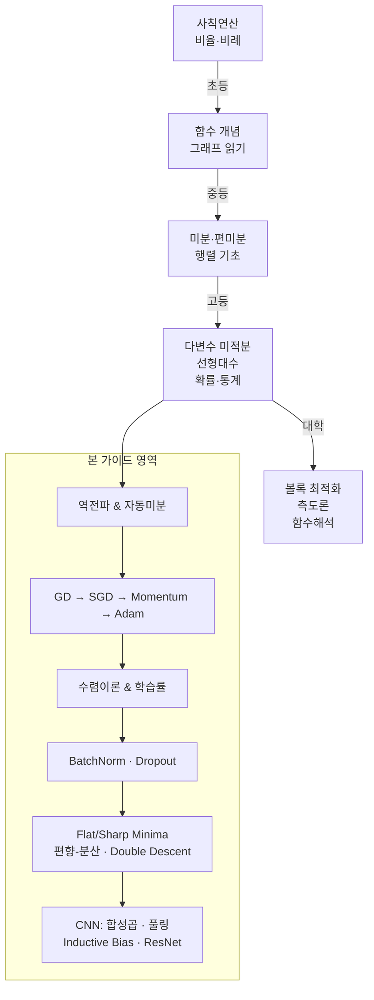

---

# Part A. 역전파 (Backpropagation)

## 동기부여

> 신경망에는 파라미터가 수백만~수십억 개다. 각 파라미터를 "살짝 바꿔 보고 결과가 나아지는지" 하나씩 테스트하면 파라미터 개수만큼 forward pass를 돌려야 한다. **역전파**는 단 한 번의 역방향 계산으로 모든 파라미터의 기울기를 동시에 구한다. 이것 없이는 딥러닝 자체가 불가능하다.

## 선행 맵 (역전파)

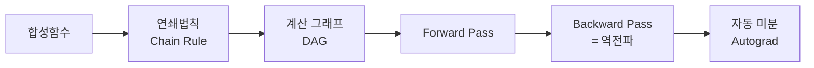

---

### Level ① 초등 -- 도미노 거꾸로 추적하기

**비유**: 도미노를 일렬로 세워 놓고 첫 번째를 밀면 차례로 넘어진다.

- **Forward pass** = 도미노가 앞으로 쓰러지는 과정. 입력 → 중간 계산 → 최종 결과(손실).
- **Backward pass(역전파)** = 마지막 도미노부터 거꾸로 "얼마나 세게 밀었는지" 추적. 각 도미노(파라미터)가 최종 결과에 얼마나 영향을 주었는지 알아낸다.

**생활 비유**: 케이크가 너무 달다(손실이 크다). 레시피를 되짚어 본다.
1. 설탕 → 반죽 → 오븐 → 케이크
2. 케이크가 달다 → 오븐 문제? 아니다 → 반죽 문제? 설탕이 많았다!
3. "설탕을 줄이면 단맛이 이만큼 줄겠구나" = 설탕에 대한 **기울기**

> **핵심**: 역전파는 "결과가 나빴을 때, 어떤 재료를 얼마나 바꿔야 하는지" 거꾸로 계산하는 방법이다.

---

### Level ② 중등 -- 숫자로 따라가기

**간단한 계산 그래프**:

```
x = 2,  w = 3
z = x × w = 6
L = (z - 10)² = 16    ← 손실(목표값 10과의 차이)
```

**역전파 과정** (거꾸로):

| 단계 | 계산 | 값 |
|------|------|-----|
| ∂L/∂L | 시작점 | 1 |
| ∂L/∂z | 2×(z−10) = 2×(6−10) | **−8** |
| ∂z/∂w | x = 2 | 2 |
| ∂L/∂w | (∂L/∂z)×(∂z/∂w) = (−8)×2 | **−16** |
| ∂z/∂x | w = 3 | 3 |
| ∂L/∂x | (∂L/∂z)×(∂z/∂x) = (−8)×3 | **−24** |

**해석**: w에 대한 기울기가 −16이다. "w를 키우면 손실이 줄어든다"는 뜻. 그래서 w를 약간 키워야 한다 (z = 6을 10에 가깝게).

**검증**: w를 3에서 3.01로 바꾸면?
- z = 2 × 3.01 = 6.02
- L = (6.02 − 10)² = 15.8404
- 변화량: 16 − 15.8404 = 0.1596 ≈ 0.01 × 16 (기울기의 절댓값!)

> **오개념 경고**: "역전파는 forward보다 훨씬 비싸다"는 오해가 있다. 실제로는 forward의 약 2~3배 비용이며, 같은 차수 O(Ln²)이다.

---

### Level ③ 고등 -- 연쇄법칙과 수식

**연쇄법칙(Chain Rule)**:

합성함수 $L = f(g(h(\theta)))$에서:

$$\frac{dL}{d\theta} = \frac{dL}{df} \cdot \frac{df}{dg} \cdot \frac{dg}{dh} \cdot \frac{dh}{d\theta}$$

> **수식 해석 (수식 전 해석 원칙)**: "최종 손실이 θ 때문에 얼마나 변하는가"를 구하려면, 중간 단계를 거치며 각 단계의 "전달 비율"을 곱하면 된다.

**다층 신경망에서의 역전파**:

$$\frac{\partial L}{\partial W_1} = \frac{\partial L}{\partial z_2} \cdot \frac{\partial z_2}{\partial a_1} \cdot \frac{\partial a_1}{\partial z_1} \cdot \frac{\partial z_1}{\partial W_1}$$

| 기호 | 의미 |
|------|------|
| $z_l = W_l a_{l-1} + b_l$ | $l$번째 층의 선형 출력 |
| $a_l = \sigma(z_l)$ | 활성화 함수 적용 후 출력 |
| $\frac{\partial L}{\partial z_2}$ | 출력층에서 시작하는 오차 신호 |

**주요 연산별 미분**:

| 연산 | Forward | Backward (∂L/∂입력) |
|------|---------|---------------------|
| $z = Wx$ | 행렬곱 | $\frac{\partial L}{\partial x} = W^\top \frac{\partial L}{\partial z}$ |
| $a = \text{ReLU}(z)$ | $\max(0, z)$ | $\frac{\partial L}{\partial z} = \frac{\partial L}{\partial a} \odot \mathbf{1}(z > 0)$ |
| $L = -\log p_y$ | Cross-Entropy | $\frac{\partial L}{\partial z} = p - e_y$ |

---

### Level ④ 대학 -- VJP와 PyTorch 자동미분

**핵심 개념: Vector-Jacobian Product (VJP)**

야코비안 행렬 $J \in \mathbb{R}^{m \times n}$을 명시적으로 구성하지 않고, **벡터-야코비안 곱** $v^\top J$만 계산한다. 이것이 역전파가 효율적인 비결이다.

$$\text{Forward: } y = f(x), \quad x \in \mathbb{R}^n, \; y \in \mathbb{R}^m$$
$$\text{VJP: } v^\top J_f = v^\top \frac{\partial f}{\partial x}, \quad v \in \mathbb{R}^m \text{ (상류 기울기)}$$

**시간 복잡도**: backward pass ≈ forward pass × 상수배. $n$개 파라미터의 기울기를 $O(1)$회 backward로 계산.

```python
import torch
import torch.nn as nn

# ── 수동 역전파 vs 자동미분 비교 ──
# 2층 신경망: x → (W1, ReLU) → (W2, MSE) → L

torch.manual_seed(42)
x = torch.randn(4, 3)           # 배치 4, 입력 3
y_true = torch.randn(4, 1)      # 목표값

W1 = torch.randn(3, 5, requires_grad=True)
b1 = torch.zeros(5, requires_grad=True)
W2 = torch.randn(5, 1, requires_grad=True)
b2 = torch.zeros(1, requires_grad=True)

# --- Forward ---
z1 = x @ W1 + b1               # (4, 5)
a1 = torch.relu(z1)             # (4, 5)
z2 = a1 @ W2 + b2              # (4, 1)
loss = ((z2 - y_true) ** 2).mean()

# --- Backward (자동미분) ---
loss.backward()

print(f"Loss: {loss.item():.4f}")
print(f"W1.grad shape: {W1.grad.shape}")  # (3, 5)
print(f"W2.grad shape: {W2.grad.shape}")  # (5, 1)

# --- 수동 역전파로 검증 ---
with torch.no_grad():
    dL_dz2 = 2 * (z2 - y_true) / z2.numel()   # MSE 미분
    dL_dW2 = a1.T @ dL_dz2                      # (5, 4) @ (4, 1) = (5, 1)
    dL_da1 = dL_dz2 @ W2.T                      # (4, 1) @ (1, 5) = (4, 5)
    dL_dz1 = dL_da1 * (z1 > 0).float()          # ReLU backward
    dL_dW1 = x.T @ dL_dz1                       # (3, 4) @ (4, 5) = (3, 5)

    print(f"\n수동 vs 자동 W2 기울기 일치: {torch.allclose(dL_dW2, W2.grad, atol=1e-5)}")
    print(f"수동 vs 자동 W1 기울기 일치: {torch.allclose(dL_dW1, W1.grad, atol=1e-5)}")
```

**`torch.autograd` 내부 동작**:
1. Forward 시 연산을 **계산 그래프(DAG)**에 기록
2. `.backward()` 호출 시 DAG를 역순 위상정렬로 순회
3. 각 노드에서 VJP를 계산하여 상류 기울기를 전파

---

### Level ⑤ 대학원 -- 자동미분 이론과 최신 연구

**Forward-mode vs Reverse-mode AD**:

| | Forward-mode (JVP) | Reverse-mode (VJP) |
|---|---|---|
| 계산 | $J \cdot v$ | $v^\top \cdot J$ |
| 비용 | 입력 차원 $n$에 비례 | 출력 차원 $m$에 비례 |
| 적합 | $n \ll m$ (야코비안 열) | $n \gg m$ (딥러닝: 파라미터 多, 손실 스칼라) |

딥러닝에서 출력은 스칼라 손실($m=1$)이므로 reverse-mode가 압도적으로 효율적.

**Checkpointing (Gradient Checkpointing)**:
- 문제: 역전파 시 모든 중간 활성값을 메모리에 저장해야 함 → $O(L)$ 메모리
- 해법: 일부 층만 저장, 나머지는 backward 시 재계산 → 메모리 $O(\sqrt{L})$, 계산 ~1.5배

**논문 연결**:
- Baydin et al. (2018) "Automatic Differentiation in Machine Learning: a Survey" -- AD의 포괄적 분류
- Griewank & Walther (2008) -- AD의 수학적 기초
- Chen et al. (2016) "Training Deep Nets with Sublinear Memory Cost" -- Checkpointing

---

### 역전파 -- 설명하기 훈련

**문제**: "역전파가 왜 필요한가? 파라미터를 하나씩 바꿔보면 안 되나?" 중학생에게 설명하시오.

<details>
<summary>모범답안 (클릭)</summary>

파라미터가 100만 개면, 하나씩 바꿔서 결과를 보는 "수치 미분"은 forward pass를 100만 번 돌려야 해요. 역전파는 forward 1번 + backward 1번 = 총 2번으로 100만 개 기울기를 한꺼번에 구합니다. 50만 배 빠른 거죠! 이게 없으면 GPT 같은 수십억 파라미터 모델은 학습 자체가 불가능합니다.

</details>

### 수학 → DL 연결

| 수학 개념 | DL에서의 역할 |
|-----------|-------------|
| 연쇄법칙 | 다층 신경망의 기울기 계산 |
| 야코비안 행렬 | 층 간 기울기 전달 행렬 |
| DAG (방향 비순환 그래프) | 계산 그래프 구조 |
| 위상 정렬 | backward 순서 결정 |

### 성취 확인 체크리스트

- [ ] 2층 네트워크의 역전파를 손으로 계산할 수 있다
- [ ] VJP가 왜 전체 야코비안보다 효율적인지 설명할 수 있다
- [ ] `loss.backward()`가 내부적으로 하는 일을 3단계로 설명할 수 있다
- [ ] Forward-mode와 Reverse-mode AD의 차이를 설명할 수 있다

---

### 킬러 요약: 역전파

> **한 줄**: 역전파 = 연쇄법칙을 계산 그래프 역순으로 적용하여, forward 1회 비용으로 모든 파라미터의 기울기를 구하는 알고리즘.
>
> **왜 중요**: 이것 없이는 수십억 파라미터의 학습이 물리적으로 불가능하다.
>
> **핵심 트릭**: 야코비안을 만들지 않고 VJP만 전파 → 메모리와 시간 모두 절약.

---

# Part B. 경사 하강법 (GD → SGD → Momentum → Adam)

## 동기부여

> 손실 함수가 주어졌을 때, "어떤 파라미터가 가장 좋은가?" 닫힌 해(closed-form solution)가 없는 비볼록 문제에서는 **반복적으로 조금씩 개선**하는 수밖에 없다. GD에서 Adam까지의 진화는 "더 빠르게, 더 똑똑하게 내려가기"의 역사다.

## 선행 맵 (최적화 알고리즘)

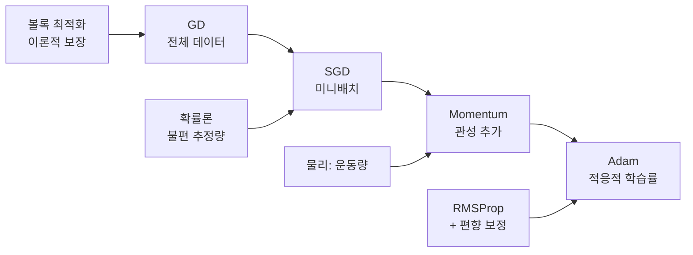

---

### Level ① 초등 -- 안개 낀 산에서 골짜기 찾기

**GD**: 눈을 감고 산꼭대기에 서 있다. 발밑 경사를 느끼며 "가장 가파르게 내려가는 방향"으로 한 걸음씩 내려간다.
- **발로 느끼기** = 미분(기울기)
- **한 걸음 크기** = 학습률

**SGD**: 산 전체 경사를 재려면 구석구석 돌아봐야 해서 너무 느리다. 발밑 작은 영역만 보고 "대충" 방향을 잡는다. 부정확하지만 훨씬 빠르다!

**Momentum**: 공을 산에서 굴린다. 내리막에서 점점 빨라지고, 작은 언덕은 관성으로 넘어간다.

**Adam**: 산길이 어떤 방향은 가파르고 어떤 방향은 완만하다. 가파른 곳은 조심조심, 완만한 곳은 과감하게 걷는 **똑똑한 등산가**다.

---

### Level ② 중등 -- 숫자로 비교하기

**GD 예시**: 목표 = $\theta$를 0으로 만들기. 손실 $L(\theta) = \theta^2$.

학습률 $\eta = 0.3$, 시작 $\theta_0 = 5$:

| 스텝 | $\theta$ | 기울기 $2\theta$ | 업데이트 | 손실 $\theta^2$ |
|------|----------|-----------------|---------|----------------|
| 0 | 5.000 | 10.000 | $5 - 0.3 \times 10$ | 25.000 |
| 1 | 2.000 | 4.000 | $2 - 0.3 \times 4$ | 4.000 |
| 2 | 0.800 | 1.600 | $0.8 - 0.3 \times 1.6$ | 0.640 |
| 3 | 0.320 | 0.640 | -- | 0.102 |

0을 향해 빠르게 수렴! 매 스텝 손실이 $(1 - 2\eta)^2 = 0.16$배로 줄어든다.

**SGD vs GD**: 데이터 100만 개, 배치 크기 256:
- GD: 1 스텝에 100만 개 계산 → 느리지만 정확한 방향
- SGD: 1 스텝에 256개 계산 → ~4000배 빠른 업데이트, 방향은 약간 흔들림

**Momentum 효과**: 긴 골짜기(한쪽은 가파르고 한쪽은 완만)에서
- GD: 가파른 방향으로 지그재그 → 느림
- Momentum: 지그재그가 상쇄되고, 완만한 방향으로 가속 → 빠름

**Adam의 편향 보정**: $t=1$, $\beta_2 = 0.999$일 때 보정 계수 = $1/(1-0.999) = 1000$배. 초기에 2차 모멘트 추정이 0에서 시작하므로 대폭 보정 필요. $t=1000$이면 보정 효과 거의 사라짐.

---

### Level ③ 고등 -- 수식 입문

#### 볼록 함수와 최적화 보장

**볼록 함수 정의**:

> **해석**: 함수 위의 두 점을 잇는 선분이 항상 함수 **위**에 있다 = 그릇 모양.

$$f(\lambda x + (1-\lambda)y) \leq \lambda f(x) + (1-\lambda)f(y), \quad \forall \lambda \in [0,1]$$

**수치로 먼저**: $f(x) = x^2$, $x=1$, $y=3$, $\lambda=0.5$:
- 좌변: $f(2) = 4$
- 우변: $0.5 \times 1 + 0.5 \times 9 = 5$
- $4 \leq 5$ ✓ → 볼록!

**일반화**: 볼록 함수에서는 모든 극솟값 = 전역 최솟값. GD가 반드시 최적해에 도달.

#### GD 업데이트 규칙

$$\theta_{t+1} = \theta_t - \eta \nabla_\theta L(\theta_t)$$

| 기호 | 읽는 법 | 의미 |
|------|---------|------|
| $\theta_t$ | "세타 t" | 현재 파라미터 |
| $\eta$ | "에타" | 학습률 (걸음 크기) |
| $\nabla_\theta L$ | "나블라 세타 L" | 손실의 기울기 벡터 |

> **수식 해석**: "현재 위치에서 기울기 방향의 반대로, 학습률만큼 이동"

#### SGD

$$\theta_{t+1} = \theta_t - \eta \nabla_\theta L_B(\theta_t)$$

핵심 성질: $\mathbb{E}_B[\nabla L_B] = \nabla L_S$ → 미니배치 기울기는 전체 기울기의 **불편 추정량(unbiased estimator)**.

> **해석**: 평균적으로 올바른 방향을 가리킨다. 개별 스텝은 흔들려도, 많이 모으면 정확.

#### Momentum (Heavy Ball)

$$m_{t+1} = \beta m_t + g_t$$
$$\theta_{t+1} = \theta_t - \eta m_{t+1}$$

| 기호 | 의미 |
|------|------|
| $m_t$ | 모멘텀 (속도 벡터) |
| $\beta$ | 관성 계수 (보통 0.9) |
| $g_t = \nabla L_B(\theta_t)$ | 현재 기울기 |

> **해석**: $m_t$는 과거 기울기의 지수 이동 평균. $m_t = \sum_{i=0}^{t} \beta^{t-i} g_i$. 최근 기울기에 더 큰 가중치.

#### Adam

$$m_t = \beta_1 m_{t-1} + (1-\beta_1)g_t \quad \text{(방향)}$$
$$s_t = \beta_2 s_{t-1} + (1-\beta_2)g_t^2 \quad \text{(크기)}$$
$$\hat{m}_t = m_t/(1-\beta_1^t), \quad \hat{s}_t = s_t/(1-\beta_2^t) \quad \text{(편향 보정)}$$
$$\theta_{t+1} = \theta_t - \eta \frac{\hat{m}_t}{\sqrt{\hat{s}_t} + \varepsilon}$$

> **해석**: 분자 = "어느 방향으로?", 분모 = "그 방향이 얼마나 불안정한가?". 불안정한 방향은 작게, 안정적인 방향은 크게 이동.

---

### Level ④ 대학 -- 수렴 증명과 PyTorch 구현

#### 강볼록 함수에서의 GD 선형 수렴

**조건**: $L$이 $m$-강볼록, $\beta$-smooth, $\eta = 1/\beta$

$$L(\theta_t) - L^* \leq \left(1 - \frac{m}{\beta}\right)^t (L(\theta_0) - L^*)$$

**증명 스케치** (PL 조건 활용):

1. $\beta$-smooth: $L(\theta_{t+1}) \leq L(\theta_t) - \frac{1}{2\beta}\|\nabla L(\theta_t)\|^2$
2. PL 조건: $\frac{1}{2}\|\nabla L(\theta_t)\|^2 \geq m(L(\theta_t) - L^*)$
3. 대입: $L(\theta_{t+1}) - L^* \leq (1 - m/\beta)(L(\theta_t) - L^*)$
4. 재귀: $t$번 적용하면 $(1 - m/\beta)^t$

**조건수**: $\kappa = \beta/m$. 이 값이 클수록 수렴이 느리다 (등고선이 길쭉한 타원).

#### 모멘텀의 가속 효과

2차 볼록 문제에서 수렴 속도:
- GD: $O\left(\left(\frac{\kappa-1}{\kappa+1}\right)^{2t}\right)$
- Heavy Ball: $O\left(\left(\frac{\sqrt{\kappa}-1}{\sqrt{\kappa}+1}\right)^{2t}\right)$

$\kappa = 100$이면:
- GD 수렴률: $(99/101)^2 \approx 0.961$ (매우 느림)
- Momentum 수렴률: $(9/11)^2 \approx 0.669$ (훨씬 빠름!)

#### PyTorch 최적화 알고리즘 비교

```python
import torch
import torch.nn as nn
import matplotlib.pyplot as plt

# ── Rosenbrock 함수에서 최적화 알고리즘 비교 ──
# f(x, y) = (1-x)² + 100(y-x²)² → 최솟값 (1, 1)

def rosenbrock(params):
    x, y = params
    return (1 - x)**2 + 100 * (y - x**2)**2

optimizers_config = {
    'SGD':          lambda p: torch.optim.SGD(p, lr=1e-4),
    'SGD+Momentum': lambda p: torch.optim.SGD(p, lr=1e-4, momentum=0.9),
    'Adam':         lambda p: torch.optim.Adam(p, lr=1e-3),
}

histories = {}
for name, opt_fn in optimizers_config.items():
    params = torch.tensor([-1.0, 1.0], requires_grad=True)
    optimizer = opt_fn([params])
    losses = []

    for step in range(3000):
        optimizer.zero_grad()
        loss = rosenbrock(params)
        loss.backward()
        optimizer.step()
        losses.append(loss.item())

    histories[name] = losses
    print(f"{name:15s} → 최종 손실: {losses[-1]:.6f}, "
          f"파라미터: ({params[0].item():.4f}, {params[1].item():.4f})")

# 시각화
for name, losses in histories.items():
    plt.plot(losses, label=name)
plt.xlabel('Step')
plt.ylabel('Loss')
plt.yscale('log')
plt.legend()
plt.title('Optimizer Comparison on Rosenbrock')
plt.grid(True, alpha=0.3)
plt.show()
```

#### 학습률 스케줄

```python
import torch.optim.lr_scheduler as sched

model = nn.Linear(10, 1)
optimizer = torch.optim.SGD(model.parameters(), lr=0.1, momentum=0.9)

# Cosine Annealing (실전에서 가장 인기)
scheduler = sched.CosineAnnealingLR(optimizer, T_max=200, eta_min=1e-5)

# Warmup + Cosine (대규모 모델 표준)
# 첫 2000 스텝: 0 → 0.1 선형 증가, 이후 cosine 감소
warmup_steps = 2000
def lr_lambda(step):
    if step < warmup_steps:
        return step / warmup_steps
    return 0.5 * (1 + __import__('math').cos(
        3.14159 * (step - warmup_steps) / (200000 - warmup_steps)))

scheduler = sched.LambdaLR(optimizer, lr_lambda)
```

**Robbins-Monro 조건** (SGD 수렴의 이론적 요건):

$$\sum_{t=1}^{\infty} \eta_t = \infty \quad (\text{어디든 도달 가능}), \qquad \sum_{t=1}^{\infty} \eta_t^2 < \infty \quad (\text{잡음 소멸})$$

$\eta_t = c/\sqrt{t}$는 이 조건을 만족한다.

---

### Level ⑤ 대학원 -- Adam의 수렴 문제와 최신 변형

**Adam의 수렴 반례 (Reddi et al., 2018)**:
Adam은 특정 볼록 문제에서도 수렴에 실패할 수 있다. 2차 모멘트의 지수 이동 평균이 과거 정보를 잃어버리기 때문.

**AMSGrad**: $\hat{s}_t = \max(\hat{s}_{t-1}, s_t)$로 2차 모멘트를 단조 증가시켜 수렴 보장.

**AdamW (Loshchilov & Hutter, 2019)**:
Adam에서 L2 정규화와 weight decay는 동등하지 않다!

$$\text{Adam + L2}: \quad \theta \leftarrow \theta - \eta \frac{\hat{m} + \lambda\theta}{\sqrt{\hat{s}} + \varepsilon}$$
$$\text{AdamW}: \quad \theta \leftarrow \theta - \eta\left(\frac{\hat{m}}{\sqrt{\hat{s}} + \varepsilon} + \lambda\theta\right)$$

AdamW에서 weight decay는 적응적 학습률의 영향을 받지 않아 더 효과적.

**LION (Chen et al., 2023)**: 기울기의 부호만 사용하여 메모리 절약.

$$\theta_{t+1} = \theta_t - \eta \cdot \text{sign}(\beta_1 m_t + (1-\beta_1) g_t)$$

**논문 연결**:
- Kingma & Ba (2014) "Adam" 원논문
- Reddi et al. (2018) "On the Convergence of Adam and Beyond"
- Loshchilov & Hutter (2019) "Decoupled Weight Decay Regularization"

---

### 최적화 알고리즘 -- 설명하기 훈련

**문제**: "Adam이 SGD+Momentum보다 항상 좋은가?" 대학 동기에게 답하시오.

<details>
<summary>모범답안 (클릭)</summary>

아니요! Adam은 빠르게 수렴하지만, 컴퓨터 비전에서는 SGD+Momentum이 더 나은 일반화 성능을 보이는 경우가 많습니다. 이유: Adam의 적응적 학습률이 flat minima 대신 sharp minima로 수렴하는 경향이 있기 때문입니다. NLP/Transformer에서는 Adam(W)이 표준입니다. 실전 가이드: CV → SGD+Momentum, NLP → AdamW.

</details>

### 성취 확인 체크리스트

- [ ] $L(\theta) = \theta^2$에서 GD 3스텝을 손으로 계산할 수 있다
- [ ] SGD의 불편 추정량 성질을 설명할 수 있다
- [ ] Momentum이 "지수 이동 평균"임을 수식으로 보일 수 있다
- [ ] Adam의 편향 보정이 필요한 이유를 $t=1$일 때 수치로 설명할 수 있다
- [ ] AdamW와 Adam+L2의 차이를 설명할 수 있다

---

### 킬러 요약: 최적화 알고리즘

> **진화**: GD → SGD(미니배치) → Momentum(관성) → Adam(적응적 학습률)
>
> **각 단계의 추가 요소**: 계산 효율성 → 방향 기억 → 파라미터별 보폭 조절
>
> **실전 선택**: CV = SGD+Momentum+Cosine, NLP = AdamW+Warmup+Cosine

---

# Part C. 수렴 이론과 학습률

## 동기부여

> "학습률을 얼마로 잡아야 하나?" "몇 에폭이면 수렴하나?" 수렴 이론은 이 질문에 수학적 답을 준다. 볼록 문제의 깔끔한 보장부터, 비볼록 DNN에서의 놀라운 성공까지.

## 선행 맵

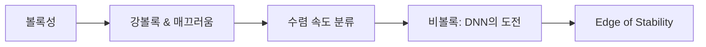

---

### Level ① 초등 -- 구슬과 그릇

- **그릇(볼록)**: 구슬을 어디에 놓아도 바닥으로 굴러간다. 바닥은 하나뿐!
- **계란판(비볼록)**: 구슬이 여기저기 홈에 빠진다. 가장 깊은 곳을 찾기 어렵다.
- **딥러닝의 기적**: 계란판인데도 SGD가 놀랍게 좋은 홈을 찾아간다!

---

### Level ② 중등 -- 학습률이 너무 크면?

$L(\theta) = \theta^2$에서 학습률에 따른 차이:

| 학습률 $\eta$ | $\theta_0=5$ → $\theta_1$ | 결과 |
|-------------|------------------------|------|
| 0.3 | $5 - 0.3 \times 10 = 2$ | 수렴 (안정) |
| 0.9 | $5 - 0.9 \times 10 = -4$ | 진동하며 수렴 |
| 1.0 | $5 - 1.0 \times 10 = -5$ | 영원히 진동 (±5) |
| 1.1 | $5 - 1.1 \times 10 = -6$ | 발산! |

**규칙**: $\eta < 2/\lambda_{\max}$이어야 수렴. $f(x) = x^2$이면 $\lambda_{\max} = 2$이므로 $\eta < 1$.

---

### Level ③ 고등 -- 수렴 속도 분류

| 유형 | 수식 | 의미 | 조건 |
|------|------|------|------|
| Sublinear | $O(1/t)$ | 느림 | 볼록 + smooth |
| Linear | $O(\rho^t)$, $\rho<1$ | 지수적 감소 | 강볼록 + smooth |
| Quadratic | $\|e_{t+1}\| \leq c\|e_t\|^2$ | 매우 빠름 | Newton's method |

> **해석**: Linear 수렴에서 $\rho = 1 - m/\beta = 1 - 1/\kappa$. 조건수 $\kappa$가 작을수록 빠르다.

**수치 예시**: $\kappa = 10$이면 $\rho = 0.9$. 오차를 $10^{-6}$으로 줄이려면:
- $0.9^t = 10^{-6}$ → $t = 6/\log_{10}(1/0.9) \approx 131$ 스텝

$\kappa = 1000$이면 $\rho = 0.999$ → $t \approx 13816$ 스텝. 100배 느리다!

---

### Level ④ 대학 -- 비볼록 DNN의 수렴

**DNN의 역설**: 손실 함수가 비볼록인데 SGD가 잘 작동하는 이유?

1. **과매개변수화**: 파라미터 수 >> 데이터 수일 때, 대부분의 극솟값이 전역 최솟값과 비슷한 손실
2. **안장점 탈출**: 고차원에서 극솟값보다 안장점이 훨씬 많고, SGD 잡음이 탈출에 도움
3. **PL 조건**: 과매개변수화된 DNN이 국소적으로 PL 조건을 만족하여 선형 수렴

```python
# ── Edge of Stability 관찰 ──
import torch
import torch.nn as nn

torch.manual_seed(0)
X = torch.randn(50, 2)
y = (X[:, 0] * X[:, 1] > 0).float().unsqueeze(1)

model = nn.Sequential(
    nn.Linear(2, 50), nn.ReLU(),
    nn.Linear(50, 50), nn.ReLU(),
    nn.Linear(50, 1), nn.Sigmoid()
)
criterion = nn.BCELoss()

lr = 0.1  # 상대적으로 큰 학습률
optimizer = torch.optim.SGD(model.parameters(), lr=lr)

losses = []
for epoch in range(2000):
    optimizer.zero_grad()
    loss = criterion(model(X), y)
    loss.backward()
    optimizer.step()
    losses.append(loss.item())

# Edge of Stability: 손실이 초기에 불안정하게 진동하다가
# sharpness가 2/η ≈ 20 근처에서 안정화됨
print(f"최종 손실: {losses[-1]:.4f}")
```

---

### Level ⑤ 대학원 -- Edge of Stability와 최신 이론

**Edge of Stability (Cohen et al., 2021)**:
풀배치 GD로 학습 시, 손실의 sharpness ($\lambda_{\max}(\nabla^2 L)$)가 $2/\eta$에 도달하면 그 근처에서 진동한다.

$$\lambda_{\max}(\nabla^2 L(\theta_t)) \to \frac{2}{\eta}$$

**함의**: 큰 학습률 → 낮은 sharpness 한계 → flat minima → 더 나은 일반화.

**Neural Tangent Kernel (NTK)**: 무한 너비 극한에서 DNN은 커널 회귀와 동등. 이 레짐에서 손실은 볼록이 되어 전역 수렴 보장.

**논문 연결**:
- Cohen et al. (2021) "Gradient Descent on Neural Networks Typically Occurs at the Edge of Stability"
- Jacot et al. (2018) "Neural Tangent Kernel"
- Du et al. (2019) "Gradient Descent Finds Global Minima of Deep Neural Networks"

---

### 킬러 요약: 수렴 이론

> **볼록**: 수렴 보장. 강볼록이면 선형 수렴, 조건수가 핵심.
>
> **비볼록 DNN**: 이론적으론 보장 없지만, 과매개변수화 + SGD 잡음이 좋은 해로 유도.
>
> **실전 규칙**: 학습률이 너무 크면 발산, 너무 작으면 갇힌다. Edge of Stability이 자연스러운 균형점.

---

# Part D. Batch Normalization & Dropout

## 동기부여

> 깊은 신경망은 두 가지 적을 만난다: (1) 층이 깊어질수록 기울기가 사라지거나 폭발하는 **기울기 문제**, (2) 훈련 데이터를 외워버리는 **과적합**. BatchNorm은 (1)을, Dropout은 (2)를 해결하는 핵심 도구다.

## 선행 맵

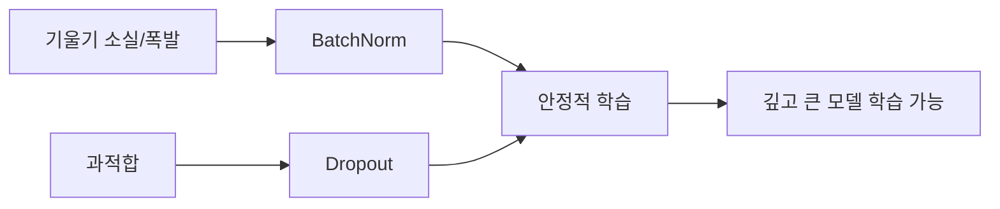

---

### Level ① 초등 -- 시험지 점수 맞추기 & 랜덤 결석

**BatchNorm -- 시험지 점수 표준화**:
반마다 시험 난이도가 다르면 비교가 어렵다. 모든 반의 평균을 50점, 표준편차를 10으로 맞추면 공정하게 비교할 수 있다. 신경망에서도 각 층의 출력을 "표준화"하면 학습이 안정된다.

**Dropout -- 랜덤 결석**:
축구 연습에서 매번 다른 선수가 빠진다. 남은 선수들이 여러 포지션을 다 해야 하니 팀 전체가 강해진다. 뉴런을 랜덤으로 끄면 모든 뉴런이 독립적으로 잘 작동하게 된다.

---

### Level ② 중등 -- 숫자로 이해하기

**BatchNorm 예시**:

배치의 한 채널 값: $[10, 20, 30, 40]$
- 평균 $\mu = 25$, 표준편차 $\sigma = \sqrt{125} \approx 11.18$
- 정규화: $[(10-25)/11.18, \ldots] = [-1.34, -0.45, 0.45, 1.34]$
- 스케일($\gamma=2$) & 시프트($\beta=1$) 적용: $[-1.68, 0.10, 1.90, 3.68]$

**Dropout 예시** ($p = 0.5$):

뉴런 값: $[3.0, -1.5, 2.0, 0.7]$

훈련 시 (랜덤 마스크 $[1, 0, 1, 0]$): $[3.0, 0, 2.0, 0]$

추론 시 (모든 뉴런 × $(1-p)$): $[1.5, -0.75, 1.0, 0.35]$

→ 기대값이 훈련과 추론에서 같아진다!

---

### Level ③ 고등 -- 수식

#### Batch Normalization

$$\hat{x}_k = \frac{x_k - \mu_B}{\sqrt{\sigma_B^2 + \epsilon}}$$
$$y_k = \gamma \hat{x}_k + \beta$$

| 기호 | 의미 |
|------|------|
| $\mu_B = \frac{1}{m}\sum_{i=1}^m x_k^{(i)}$ | 미니배치 평균 |
| $\sigma_B^2 = \frac{1}{m}\sum_{i=1}^m (x_k^{(i)} - \mu_B)^2$ | 미니배치 분산 |
| $\gamma, \beta$ | 학습 가능한 스케일/시프트 |
| $\epsilon$ | 0나누기 방지 (보통 $10^{-5}$) |

> **수식 해석**: 정규화로 평균 0, 분산 1로 맞춘 뒤, $\gamma$와 $\beta$로 "네트워크가 원하는" 분포로 복원. 만약 원래가 최적이었다면 $\gamma = \sigma_B$, $\beta = \mu_B$로 되돌릴 수 있다.

**BN vs LN (Layer Normalization)**:
- BN: **배치 + 공간** 축으로 정규화 → CV 표준
- LN: **채널 + 공간** 축으로 정규화 → NLP/Transformer 표준
- BN은 배치 크기에 의존, LN은 독립

#### Dropout

$$\tilde{h}_i = m_i \cdot h_i, \quad m_i \sim \text{Bernoulli}(1-p)$$

> **해석**: 각 뉴런을 확률 $p$로 끈다. 훈련마다 다른 서브네트워크를 사용하는 셈 → $2^n$개 서브네트워크의 앙상블.

---

### Level ④ 대학 -- 왜 작동하는가 + PyTorch

#### BN의 실제 효과 (Santurkar et al., 2018)

원래 주장: "Internal Covariate Shift 해결"
**실제 효과**: 손실 landscape를 매끄럽게(smooth) 만든다!

$$\text{BN 적용 시: } \|\nabla L(\theta_1) - \nabla L(\theta_2)\| \leq \beta' \|\theta_1 - \theta_2\|$$

여기서 $\beta'$가 BN 없는 경우보다 작다 → 더 큰 학습률 사용 가능 → 더 빠른 수렴.

#### Dropout의 수학적 해석

1. **앙상블 근사**: $2^n$개 서브네트워크의 기하 평균
2. **베이지안 근사**: Gal & Ghahramani (2016) -- dropout ≈ 변분 추론
3. **정규화 효과**: 가중치의 유효 노름 감소

```python
import torch
import torch.nn as nn

# ── BatchNorm + Dropout 효과 비교 ──
class SimpleNet(nn.Module):
    def __init__(self, use_bn=False, use_dropout=False):
        super().__init__()
        layers = []
        in_dim = 784
        for h in [256, 128, 64]:
            layers.append(nn.Linear(in_dim, h))
            if use_bn:
                layers.append(nn.BatchNorm1d(h))
            layers.append(nn.ReLU())
            if use_dropout:
                layers.append(nn.Dropout(0.3))
            in_dim = h
        layers.append(nn.Linear(in_dim, 10))
        self.net = nn.Sequential(*layers)

    def forward(self, x):
        return self.net(x.view(x.size(0), -1))

# 모델 생성
model_plain    = SimpleNet(use_bn=False, use_dropout=False)
model_bn       = SimpleNet(use_bn=True,  use_dropout=False)
model_dropout  = SimpleNet(use_bn=False, use_dropout=True)
model_both     = SimpleNet(use_bn=True,  use_dropout=True)

# 파라미터 수 확인 (BN은 γ, β 추가)
for name, m in [("Plain", model_plain), ("BN", model_bn),
                ("Dropout", model_dropout), ("Both", model_both)]:
    n_params = sum(p.numel() for p in m.parameters())
    print(f"{name:10s}: {n_params:,} parameters")

# ── MC Dropout으로 불확실성 추정 ──
def predict_with_uncertainty(model, x, n_samples=100):
    """추론 시에도 Dropout을 켜서 불확실성 추정"""
    model.train()  # Dropout 활성화 유지!
    preds = torch.stack([
        torch.softmax(model(x), dim=1)
        for _ in range(n_samples)
    ])
    mean = preds.mean(dim=0)        # 예측 평균
    uncertainty = preds.var(dim=0)    # 예측 분산 = 불확실성
    return mean, uncertainty
```

---

### Level ⑤ 대학원 -- BN의 미해결 문제와 대안

**BN의 한계**:
1. 배치 크기에 민감 (작은 배치 → 부정확한 통계)
2. 분산 학습에서 동기화 필요
3. RNN/Transformer에서 비효율적

**대안**:
- **Layer Norm**: Transformer 표준. 배치 독립적.
- **Group Norm (Wu & He, 2018)**: 채널을 그룹으로 나눠 정규화. 작은 배치에 강건.
- **RMSNorm**: $y = x / \text{RMS}(x) \cdot \gamma$. LLaMA 등에서 사용. 평균 빼기 생략.

**Dropout vs DropPath**:
- DropPath (Stochastic Depth): ResNet의 블록 전체를 확률적으로 건너뜀
- ViT에서 Dropout보다 DropPath가 표준

**논문 연결**:
- Ioffe & Szegedy (2015) "Batch Normalization" 원논문
- Santurkar et al. (2018) "How Does Batch Normalization Help Optimization?"
- Gal & Ghahramani (2016) "Dropout as a Bayesian Approximation"

---

### 킬러 요약: BN & Dropout

> **BatchNorm**: 층 출력을 정규화 → 실제 효과는 loss landscape smoothing → 큰 학습률 가능 → 빠른 수렴.
>
> **Dropout**: 뉴런을 랜덤으로 끔 → $2^n$개 서브네트워크 앙상블 → 과적합 방지. MC Dropout으로 불확실성 추정 가능.
>
> **오개념**: BN은 "Internal Covariate Shift 해결"이 아니라 "landscape smoothing"이 핵심 효과.

---

# Part E. Flat/Sharp Minima, 편향-분산, Double Descent

## 동기부여

> "왜 수십억 파라미터 모델이 과적합하지 않는가?" 이 질문은 현대 딥러닝 이론의 가장 중요한 미스터리다. 고전적 편향-분산 트레이드오프를 넘어, Double Descent와 Flat Minima 이론이 부분적 답을 제공한다.

## 선행 맵

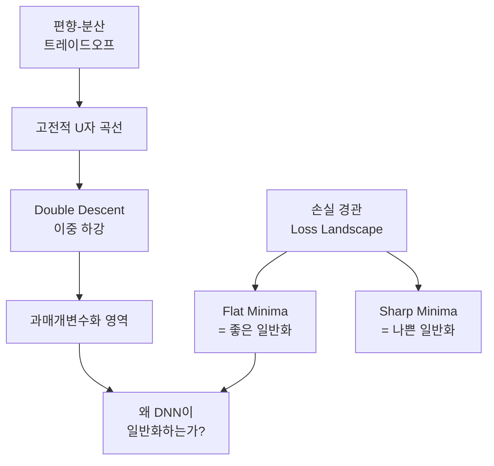

---

### Level ① 초등

**편향-분산 -- 과녁 맞히기**:
- **편향 높음**: 화살이 한 곳에 모이지만, 과녁 중심에서 멀리 (단순한 규칙)
- **분산 높음**: 화살이 과녁 근처지만 흩어짐 (너무 복잡한 규칙)
- **최적**: 중심에 모인 것!

**Flat Minima -- 넓은 그릇 vs 좁은 구멍**:
- 넓고 평평한 그릇에 공이 있으면, 살짝 흔들어도 안 나간다 → **새 데이터에도 안정**
- 좁은 구멍에 있으면 조금만 흔들어도 나간다 → **새 데이터에 불안정**

**Double Descent -- 역설**:
보통 "너무 많이 외우면 시험 못 본다"인데, 신기하게도 **정말 정말 많이** 외우면 오히려 시험도 잘 본다!

---

### Level ② 중등 -- 숫자 예시

**편향-분산**: 데이터 $y = x^2 + \text{노이즈}$를 다항식으로 적합:

| 모델 | 편향 | 분산 | 총 오차 |
|------|------|------|---------|
| 1차 (직선) | 높음 (포물선을 못 잡음) | 낮음 | 높음 |
| 2차 | 낮음 (딱 맞음) | 낮음 | **최저** |
| 20차 | 낮음 | 높음 (노이즈까지 학습) | 높음 |

**Double Descent 수치** (파라미터 수 $p$, 데이터 수 $n$):

| $p/n$ | 분산 | 상황 |
|-------|------|------|
| 0.5 | 1.0 | 고전적 영역 |
| 0.9 | 9.0 | 보간 임계점 근처 (나빠짐) |
| 1.0 | $\to \infty$ | **peak!** |
| 2.0 | 1.0 | 과매개변수 (다시 좋아짐) |
| 10.0 | 0.11 | 매우 과매개변수 (더 좋아짐!) |

---

### Level ③ 고등 -- 수식

#### 편향-분산 분해

$$\mathbb{E}_S\left[(h_S(x) - f(x))^2\right] = \underbrace{\text{Var}_S[h_S(x)]}_{\text{분산}} + \underbrace{(\mathbb{E}_S[h_S(x)] - f(x))^2}_{\text{편향}^2}$$

> **수식 해석**: 총 오차 = "모델이 데이터에 따라 흔들리는 정도" + "평균적으로 정답에서 벗어난 정도²"

#### 일반화 오차 분해

$$L_\mathcal{P}(h_S) = \underbrace{L_\mathcal{P}(h^*_\mathcal{H})}_{\text{근사 오차}} + \underbrace{(L_\mathcal{P}(h_S) - L_\mathcal{P}(h^*_\mathcal{H}))}_{\text{추정 오차}}$$

- 모델 복잡도 ↑ → 근사 오차 ↓, 추정 오차 ↑
- 이 트레이드오프가 U자 곡선의 원인

#### 유한 가설 공간 일반화 바운드

$$L_\mathcal{P}(h) - L_S(h) \leq \sqrt{\frac{\log|\mathcal{H}| + \log(2/\delta)}{2n}}$$

> **해석**: 일반화 갭은 가설 공간 크기의 로그에 비례하고, 데이터 수의 제곱근에 반비례.

#### Flat Minima의 Sharpness 측정

$$\text{Sharpness} = \lambda_{\max}(\nabla^2 L(\theta))$$

- Flat: $\lambda_{\max}$ 작음 → 훈련과 테스트 손실 곡면 유사 → 좋은 일반화
- Sharp: $\lambda_{\max}$ 큼 → 곡면 차이 큼 → 나쁜 일반화

---

### Level ④ 대학 -- Double Descent 수학 + SAM

#### Double Descent의 수학 (선형 회귀)

$\gamma = p/n$ (파라미터 수 / 데이터 수):

$$\text{Variance} = \begin{cases} \frac{\gamma}{1-\gamma}\sigma^2 & \text{if } \gamma < 1 \\ \frac{1}{\gamma - 1}\sigma^2 & \text{if } \gamma > 1 \end{cases}$$

$\gamma \to 1$에서 분산 $\to \infty$ → 이것이 "보간 임계점(interpolation threshold)"의 peak!

$\gamma > 1$이면 최소 노름 해 $\hat{\beta} = X^+ y$로 수렴, 분산이 $1/(\gamma-1)$로 감소.

#### SAM (Sharpness-Aware Minimization)

$$\min_\theta \max_{\|\epsilon\| \leq \rho} L(\theta + \epsilon)$$

1단계: $\theta_{\text{adv}} = \theta + \rho \frac{\nabla L(\theta)}{\|\nabla L(\theta)\|}$ (worst-case 방향)

2단계: $\theta \leftarrow \theta - \eta \nabla L(\theta_{\text{adv}})$ (그 방향에서의 기울기로 업데이트)

```python
import torch

class SAM(torch.optim.Optimizer):
    """Sharpness-Aware Minimization"""
    def __init__(self, params, base_optimizer, rho=0.05):
        defaults = dict(rho=rho)
        super().__init__(params, defaults)
        self.base_optimizer = base_optimizer(self.param_groups)

    @torch.no_grad()
    def first_step(self):
        """파라미터를 worst-case 방향으로 섭동"""
        grad_norm = self._grad_norm()
        for group in self.param_groups:
            scale = group['rho'] / (grad_norm + 1e-12)
            for p in group['params']:
                if p.grad is None:
                    continue
                e_w = p.grad * scale
                p.add_(e_w)  # climb to the local maximum
                self.state[p]['e_w'] = e_w

    @torch.no_grad()
    def second_step(self):
        """섭동을 복원하고 기울기로 업데이트"""
        for group in self.param_groups:
            for p in group['params']:
                if p.grad is None:
                    continue
                p.sub_(self.state[p]['e_w'])  # undo perturbation
        self.base_optimizer.step()

    def _grad_norm(self):
        norm = torch.norm(
            torch.stack([
                p.grad.norm(p=2)
                for group in self.param_groups
                for p in group['params']
                if p.grad is not None
            ]),
            p=2
        )
        return norm

# 사용법:
# optimizer = SAM(model.parameters(), torch.optim.SGD, rho=0.05)
# for x, y in loader:
#     loss = criterion(model(x), y)
#     loss.backward()
#     optimizer.first_step()
#     criterion(model(x), y).backward()
#     optimizer.second_step()
#     optimizer.zero_grad()
```

---

### Level ⑤ 대학원 -- 열린 문제들

**암묵적 정규화 (Implicit Regularization)**:
- GD → 최소 노름 해, 최대 마진 분류기로 수렴
- SGD (큰 LR / 작은 배치) → flat minima 선호
- Dropout → Lipschitz 모델 선호

**Benign Overfitting (Bartlett et al., 2020)**:
과매개변수화 모델이 훈련 데이터를 완벽히 보간하면서도 좋은 일반화를 달성. 조건: 유효 차원이 높고, "스파이크" 공분산 구조.

**Grokking (Power et al., 2022)**:
훈련 오차 0 도달 한참 후에 갑자기 일반화 성능이 급등하는 현상. 암묵적 정규화가 충분히 오래 작용해야 구조화된 해에 도달.

**열린 질문**: "왜 딥러닝이 일반화하는가?"에 대한 완전한 이론은 아직 없다.

**논문 연결**:
- Belkin et al. (2019) "Reconciling Modern ML Practice and the Bias-Variance Tradeoff"
- Nakkiran et al. (2021) "Deep Double Descent"
- Foret et al. (2021) "Sharpness-Aware Minimization"
- Bartlett et al. (2020) "Benign Overfitting in Linear Regression"

---

### 설명하기 훈련

**문제**: "모델이 크면 반드시 과적합한다"는 주장을 반박하시오.

<details>
<summary>모범답안 (클릭)</summary>

고전적 편향-분산 트레이드오프에서는 모델 복잡도가 높으면 분산이 커져 과적합한다고 했습니다. 하지만 Double Descent 현상이 보여주듯, 보간 임계점($p \approx n$)을 넘어 충분히 과매개변수화되면 분산이 다시 감소합니다. 이는 (1) 최소 노름 해가 자연스러운 정규화 효과를 가지고, (2) SGD의 암묵적 편향이 flat minima를 선호하기 때문입니다. GPT-4(1조+ 파라미터)가 잘 일반화하는 것이 실증적 증거입니다.

</details>

### 킬러 요약: 일반화 이론

> **고전**: 편향-분산 트레이드오프 → U자 곡선 → 적절한 복잡도 선택.
>
> **현대**: Double Descent → 충분히 큰 모델은 보간 임계점 넘어 다시 좋아짐.
>
> **핵심 메커니즘**: SGD의 암묵적 정규화 + Flat Minima 선호 + 과매개변수화의 구조적 특성.
>
> **열린 문제**: 완전한 이론은 아직 없다.

---

# Part F. CNN -- 합성곱, 풀링, Inductive Bias, ResNet

## 동기부여

> 이미지를 MLP로 처리하면? $224 \times 224 \times 3 = 150{,}528$차원 입력에 4096개 뉴런을 연결하면 파라미터 약 **6억 개**. CNN은 두 가지 귀납적 편향(지역성 + 가중치 공유)으로 이를 수천~수만 개로 줄이면서 오히려 더 좋은 성능을 낸다.

## 선행 맵

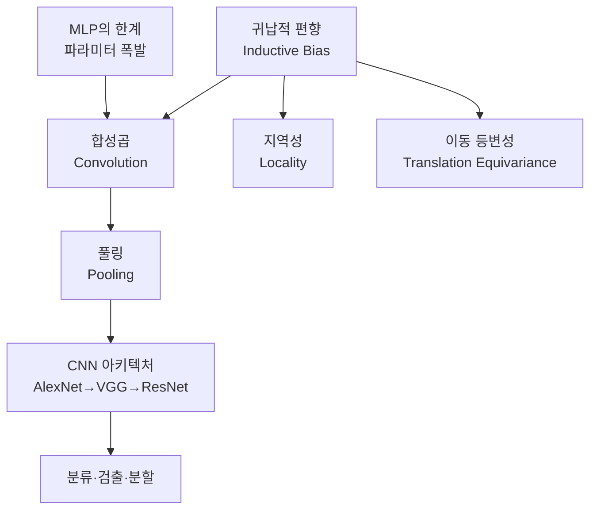

---

### Level ① 초등 -- 돋보기로 무늬 찾기

**합성곱**: 큰 그림 위에 작은 돋보기(3×3 필터)를 올려놓고, 돋보기가 보는 부분과 필터를 짝지어 곱한 뒤 모두 더한다. 한 칸씩 옮기면서 반복하면 "이 부분에 대각선이 있나?"를 알 수 있는 새 지도가 만들어진다.

**풀링**: 특징 맵이 너무 크면 2×2씩 묶어서 가장 큰 숫자만 남긴다. 축소 복사처럼 작아지지만 중요한 정보는 살아 있다.

**계층 구조**:
- 1층: 에지(선) 찾기
- 2층: 코너, 무늬 찾기
- 3층: 바퀴, 눈 찾기
- 4-5층: 자동차, 얼굴 찾기

**등변성 vs 불변성**:
- 고양이가 왼쪽→오른쪽으로 옮겨지면, 특징 맵에서도 고양이 표시가 같이 옮겨짐 = **등변성**
- 최종적으로 "고양이다!"는 위치에 무관 = **불변성** (풀링이 만듦)

---

### Level ② 중등 -- 숫자로 합성곱 계산

**1D 합성곱 예시**:

필터 $w = (1, 0, -1)$ (에지 검출), 입력 $x = (0, 0, 1, 1, 1, 0, 0)$:

```
위치 2: 1×1 + 0×0 + (-1)×0 =  1  (상승 에지!)
위치 3: 1×1 + 0×1 + (-1)×0 =  1
위치 4: 1×1 + 0×1 + (-1)×1 =  0
위치 5: 1×0 + 0×1 + (-1)×1 = -1  (하강 에지!)
```

**2D Max Pooling** (2×2, stride 2):

```
입력 4×4:         출력 2×2:
1  3 | 2  4       3  4
5  6 | 7  8  →    6  8
-----|-----
0  1 | 2  3       4  5
4  2 | 1  5
```

각 2×2 블록에서 최댓값만 남긴다.

**출력 크기 계산**: $H_{out} = \lfloor(H_{in} + 2p - k) / s\rfloor + 1$

예: 입력 32×32, 커널 5×5, stride 1, padding 0:
- $H_{out} = (32 + 0 - 5)/1 + 1 = 28$

---

### Level ③ 고등 -- 수식과 행렬 관점

#### 합성곱의 수학

**1D**:

$$[w * x](i) = \sum_{u=0}^{k-1} w_u \cdot x_{i-u}$$

**2D (다채널)**:

$$y_{j}(i_1, i_2) = \sum_{c=0}^{c_{in}-1} \sum_{u_1=0}^{k-1} \sum_{u_2=0}^{k-1} w_{j,c,u_1,u_2} \cdot x_{c}(i_1 s - u_1, i_2 s - u_2) + b_j$$

| 기호 | 의미 |
|------|------|
| $j$ | 출력 채널 인덱스 ($0$ ~ $c_{out}-1$) |
| $c$ | 입력 채널 인덱스 |
| $k$ | 커널 크기 |
| $s$ | 스트라이드 |

#### 합성곱 = 특수 행렬곱

합성곱을 행렬 $W \in \mathbb{R}^{H_{out} \times H_{in}}$로 쓰면:
- **희소(Sparse)**: 대부분의 원소가 0 → 지역성
- **Toeplitz**: 대각 밴드가 동일한 값 → 가중치 공유

**MLP vs CNN 파라미터 수 비교**:
- MLP: $224 \times 224 \times 3 \times 4096 \approx 616M$
- CNN (3×3 필터, 64개): $3 \times 3 \times 3 \times 64 = 1{,}728$ (35만 배 적음!)

#### 등변성 수식

$$f(S(x)) = S(f(x)) \quad \text{(등변성)}$$
$$f(S(x)) = f(x) \quad \text{(불변성)}$$

- 합성곱: 이동에 대해 **등변적**
- Global Average Pooling: **불변성** 부여

---

### Level ④ 대학 -- ResNet + PyTorch 구현

#### 왜 깊은 네트워크가 어려운가?

층을 단순히 쌓으면 기울기가 소실/폭발하여 학습 불가. 56층 네트워크가 20층보다 **훈련 오차**도 높은 현상 (degradation problem).

#### Residual Connection의 수학

$$y = F(x) + x$$

$$\frac{\partial y}{\partial x} = \frac{\partial F(x)}{\partial x} + I$$

> **핵심**: 항등 행렬 $I$가 더해져서 기울기가 **최소한 1 이상** 유지! 기울기 소실 방지.

**해석**: "최소한 입력을 그대로 전달하고, 거기에 잔차(residual)만 학습". 아무것도 못 배우면 $F(x) = 0$이 되어 $y = x$, 즉 항등 함수 → 깊어져도 **최소한 얕은 네트워크만큼**은 동작.

#### VGG의 핵심 통찰

3×3 두 층 = 5×5 한 층과 동일한 수용 영역:
- 5×5: $25C^2$ 파라미터
- 3×3 두 층: $2 \times 9C^2 = 18C^2$ (28% 절감) + 비선형성 추가

```python
import torch
import torch.nn as nn
import torch.nn.functional as F

# ── 기본 합성곱 연산 이해 ──
# 수동 합성곱 vs nn.Conv2d

# 1) 수동: 에지 검출 필터
x = torch.tensor([[
    [0., 0., 1., 1., 1., 0., 0.],
    [0., 0., 1., 1., 1., 0., 0.],
    [0., 0., 1., 1., 1., 0., 0.],
    [0., 0., 1., 1., 1., 0., 0.],
    [0., 0., 1., 1., 1., 0., 0.],
]]).unsqueeze(0)  # (1, 1, 5, 7)

# 수직 에지 검출 필터
edge_filter = torch.tensor([[[[ 1.,  0., -1.],
                               [ 1.,  0., -1.],
                               [ 1.,  0., -1.]]]])  # (1, 1, 3, 3)

result = F.conv2d(x, edge_filter, padding=1)
print("에지 검출 결과:\n", result.squeeze())

# 2) nn.Conv2d 사용
conv = nn.Conv2d(in_channels=3, out_channels=16, kernel_size=3,
                 stride=1, padding=1)
print(f"Conv 파라미터: {conv.weight.shape}")  # (16, 3, 3, 3)
print(f"파라미터 수: {conv.weight.numel() + conv.bias.numel()}")  # 16*3*3*3 + 16 = 448

# ── ResNet 기본 블록 ──
class BasicBlock(nn.Module):
    def __init__(self, in_channels, out_channels, stride=1):
        super().__init__()
        self.conv1 = nn.Conv2d(in_channels, out_channels, 3,
                               stride=stride, padding=1, bias=False)
        self.bn1 = nn.BatchNorm2d(out_channels)
        self.conv2 = nn.Conv2d(out_channels, out_channels, 3,
                               stride=1, padding=1, bias=False)
        self.bn2 = nn.BatchNorm2d(out_channels)

        # 차원이 다르면 1×1 합성곱으로 맞춤
        self.shortcut = nn.Sequential()
        if stride != 1 or in_channels != out_channels:
            self.shortcut = nn.Sequential(
                nn.Conv2d(in_channels, out_channels, 1,
                          stride=stride, bias=False),
                nn.BatchNorm2d(out_channels)
            )

    def forward(self, x):
        out = F.relu(self.bn1(self.conv1(x)))
        out = self.bn2(self.conv2(out))
        out += self.shortcut(x)  # ← Residual Connection!
        out = F.relu(out)
        return out

# ── 간단한 ResNet ──
class SimpleResNet(nn.Module):
    def __init__(self, num_classes=10):
        super().__init__()
        self.conv1 = nn.Conv2d(3, 64, 3, padding=1, bias=False)
        self.bn1 = nn.BatchNorm2d(64)

        self.layer1 = self._make_layer(64, 64, 2, stride=1)
        self.layer2 = self._make_layer(64, 128, 2, stride=2)
        self.layer3 = self._make_layer(128, 256, 2, stride=2)

        self.gap = nn.AdaptiveAvgPool2d(1)  # Global Average Pooling
        self.fc = nn.Linear(256, num_classes)

    def _make_layer(self, in_ch, out_ch, num_blocks, stride):
        layers = [BasicBlock(in_ch, out_ch, stride)]
        for _ in range(1, num_blocks):
            layers.append(BasicBlock(out_ch, out_ch, 1))
        return nn.Sequential(*layers)

    def forward(self, x):
        x = F.relu(self.bn1(self.conv1(x)))
        x = self.layer1(x)
        x = self.layer2(x)
        x = self.layer3(x)
        x = self.gap(x).flatten(1)
        x = self.fc(x)
        return x

model = SimpleResNet()
n_params = sum(p.numel() for p in model.parameters())
print(f"SimpleResNet 파라미터 수: {n_params:,}")

# 테스트
dummy = torch.randn(2, 3, 32, 32)
out = model(dummy)
print(f"입력: {dummy.shape} → 출력: {out.shape}")
```

---

### Level ⑤ 대학원 -- Group Equivariance와 최신 아키텍처

#### 합성곱의 군론적 해석

합성곱 = 이동 군 $(\mathbb{Z}^2, +)$에 대한 등변 선형 사상.

**Group Equivariant CNN (Cohen & Welling, 2016)**: 이를 임의의 대칭 군 $G$ (회전, 반전 등)으로 확장.

$$[f * \psi](g) = \sum_{h \in G} f(h)\psi(g^{-1}h)$$

$G = p4$ (90° 회전 군) 이면, 필터를 0°, 90°, 180°, 270° 돌린 버전을 동시에 적용 → 회전 등변성.

#### Vision Transformer vs CNN

| | CNN | ViT |
|---|---|---|
| Inductive Bias | 지역성 + 이동 등변성 | 거의 없음 (패치 분할만) |
| 데이터 효율성 | 적은 데이터에 강함 | 대규모 데이터 필요 |
| 확장성 | 한계 있음 | 데이터/모델 키울수록 좋아짐 |

**ConvNeXt (Liu et al., 2022)**: ViT의 학습 전략을 CNN에 적용하면 CNN도 ViT에 필적. Inductive bias의 가치 재평가.

#### 적대적 예제의 수학

**FGSM**:
$$x_{\text{adv}} = x + \epsilon \cdot \text{sign}(\nabla_x L(x, y))$$

**PGD (Projected Gradient Descent)**:
$$x_{t+1} = \Pi_{B_\epsilon(x)} \left[ x_t + \alpha \cdot \text{sign}(\nabla_x L(x_t, y)) \right]$$

**Adversarial Training**:
$$\min_\theta \mathbb{E}_{(x,y)} \left[ \max_{\|\delta\| \leq \epsilon} L(f_\theta(x + \delta), y) \right]$$

**논문 연결**:
- He et al. (2016) "Deep Residual Learning for Image Recognition"
- Cohen & Welling (2016) "Group Equivariant Convolutional Networks"
- Liu et al. (2022) "A ConvNet for the 2020s" (ConvNeXt)
- Madry et al. (2018) "Towards Deep Learning Models Resistant to Adversarial Attacks"
- Dosovitskiy et al. (2020) "An Image is Worth 16×16 Words" (ViT)

---

### 설명하기 훈련

**문제 1**: "합성곱이 왜 이미지에 적합한가?" 고등학생에게 설명하시오.

<details>
<summary>모범답안 (클릭)</summary>

이미지에는 두 가지 특성이 있어요: (1) 근처 픽셀끼리 관련이 깊고 (지역성), (2) 고양이 귀가 왼쪽에 있든 오른쪽에 있든 같은 패턴이에요 (이동 불변성). 합성곱은 작은 필터를 이미지 전체에 걸쳐 슬라이딩하면서 같은 패턴을 찾으니, 이 두 특성을 완벽히 활용합니다. 덕분에 MLP 대비 파라미터가 수만 배 적으면서 성능은 더 좋아요.

</details>

**문제 2**: "ResNet의 skip connection은 왜 필요한가?" 대학생에게 설명하시오.

<details>
<summary>모범답안 (클릭)</summary>

기울기 관점: $\partial y/\partial x = \partial F(x)/\partial x + I$에서 항등 행렬 $I$가 기울기의 하한을 보장하여, 100층 이상에서도 기울기가 소실되지 않습니다. 학습 관점: 잔차 $F(x) = 0$을 학습하면 항등 함수가 되므로, 깊은 네트워크가 최소한 얕은 네트워크 이상의 성능을 보장합니다. 이는 56층이 20층보다 훈련 오차도 높았던 degradation problem을 해결했습니다.

</details>

### 수학 → DL 연결

| 수학 개념 | CNN에서의 역할 |
|-----------|--------------|
| 희소 행렬 | 합성곱 = 지역 연결 (locality) |
| Toeplitz 행렬 | 가중치 공유 (translation equivariance) |
| 군론 (Group theory) | 등변성의 일반화 (회전, 반전) |
| 전치 행렬 | 전치 합성곱 (업샘플링, 디코더) |

### 성취 확인 체크리스트

- [ ] 3×3 필터로 2D 합성곱을 손으로 계산할 수 있다
- [ ] 출력 크기 공식을 적용할 수 있다
- [ ] 등변성과 불변성의 수식 차이를 설명할 수 있다
- [ ] ResNet의 skip connection이 기울기에 미치는 효과를 수식으로 보일 수 있다
- [ ] CNN 파라미터 수를 계산하고 MLP와 비교할 수 있다

---

### 킬러 요약: CNN

> **핵심**: CNN = MLP + 두 가지 귀납적 편향 (지역성 + 이동 등변성). 수학적으로는 희소+Toeplitz 행렬.
>
> **진화**: AlexNet(8층) → VGG(19층, 3×3 통일) → ResNet(152층, skip connection).
>
> **등변 vs 불변**: 합성곱 = 등변, 풀링 = 불변. 분류에는 불변, 검출에는 등변이 필요.
>
> **ResNet의 비밀**: $\partial y/\partial x = \partial F/\partial x + I$ → 기울기 하한 보장 → 깊은 네트워크 학습 가능.

---

# 종합 킬러 요약

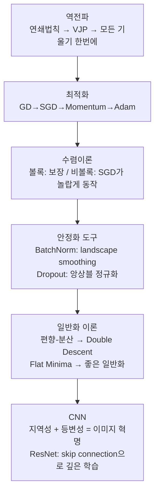

| 주제 | 한 줄 킬러 | 오개념 경고 |
|------|-----------|------------|
| 역전파 | VJP 체인으로 forward 1회 비용에 모든 기울기 | "backward가 forward보다 훨씬 비싸다" ✗ |
| GD→Adam | 계산 효율 → 관성 → 적응적 보폭 진화 | "Adam이 항상 SGD보다 낫다" ✗ |
| 수렴 | 강볼록이면 선형 수렴, 조건수가 핵심 | "비볼록이면 GD는 무용지물" ✗ |
| BatchNorm | Loss landscape smoothing이 실제 효과 | "Internal Covariate Shift 해결" ✗ |
| Dropout | $2^n$ 서브네트워크 앙상블 | "단순히 노이즈 추가" ✗ |
| Flat Minima | Sharpness 낮을수록 일반화 좋음 | "Sharp minima는 항상 나쁘다" ✗ (reparameterization 주의) |
| Double Descent | $p \approx n$에서 peak, 이후 재하강 | "모델이 크면 반드시 과적합" ✗ |
| CNN | 희소+Toeplitz = 지역성+등변성 | "합성곱은 비선형" ✗, "이동 불변" ✗ (등변!) |
| ResNet | $\partial y/\partial x = \partial F/\partial x + I$ | "깊을수록 항상 좋다" ✗ (skip 없이는 degradation) |

---

# 최종 점검 -- 레벨별 자가 진단

## Level ① (초등)
- [ ] 경사 하강법을 "안개 산" 비유로 설명 가능
- [ ] CNN을 "돋보기" 비유로 설명 가능
- [ ] 과적합을 "답 외우기"로 설명 가능

## Level ② (중등)
- [ ] GD 3스텝을 $L = \theta^2$에서 숫자로 계산 가능
- [ ] 2D 합성곱과 max pooling을 손으로 계산 가능
- [ ] Double Descent의 수치 패턴을 설명 가능

## Level ③ (고등)
- [ ] GD, SGD, Momentum, Adam의 수식을 쓰고 해석 가능
- [ ] 합성곱의 출력 크기 공식 적용 가능
- [ ] 편향-분산 분해 수식 해석 가능

## Level ④ (대학)
- [ ] PL 조건에서 GD 선형 수렴 증명 가능
- [ ] PyTorch로 ResNet 블록 구현 가능
- [ ] SAM의 원리와 구현을 설명 가능

## Level ⑤ (대학원)
- [ ] AdamW vs Adam+L2의 차이를 수식으로 설명 가능
- [ ] Group Equivariant CNN의 군론적 기반 설명 가능
- [ ] Benign Overfitting과 Grokking 현상 설명 가능
- [ ] 관련 논문을 읽고 핵심 기여를 요약 가능

---

# 부록 A. 심화 주제별 연결 다이어그램

## A.1 최적화 알고리즘 계보

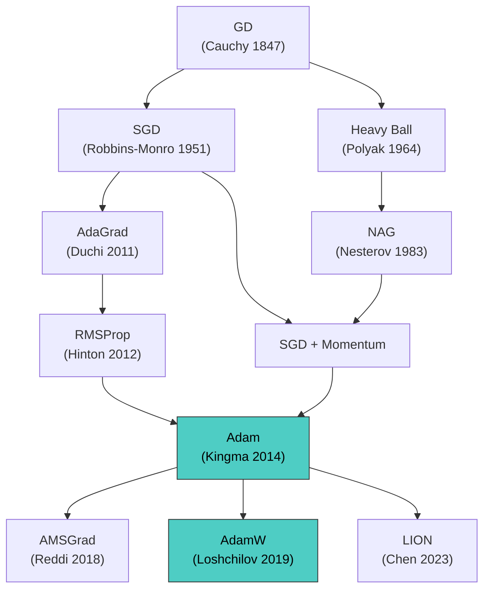

## A.2 정규화 기법 분류

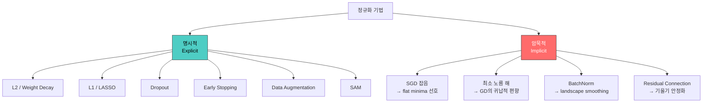

## A.3 CNN 아키텍처 진화

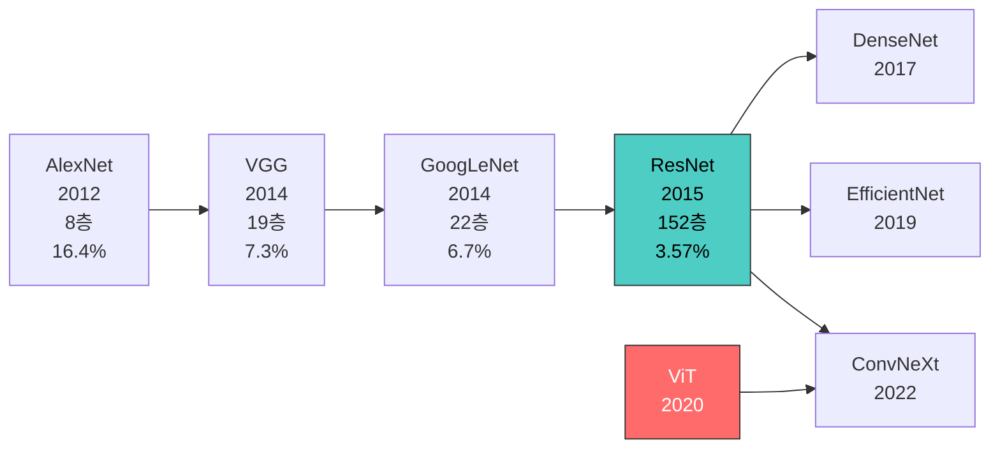

---

# 부록 B. 핵심 수식 치트시트

## B.1 최적화

| 알고리즘 | 업데이트 규칙 | 핵심 하이퍼파라미터 |
|----------|-------------|-------------------|
| GD | $\theta \leftarrow \theta - \eta \nabla L$ | $\eta$ |
| SGD | $\theta \leftarrow \theta - \eta \nabla L_B$ | $\eta$, batch size |
| Momentum | $m \leftarrow \beta m + g;\; \theta \leftarrow \theta - \eta m$ | $\eta$, $\beta=0.9$ |
| Adam | $\theta \leftarrow \theta - \eta \hat{m}/(\sqrt{\hat{s}}+\varepsilon)$ | $\eta$, $\beta_1=0.9$, $\beta_2=0.999$ |
| AdamW | Adam + decoupled weight decay | $\eta$, $\lambda$ |

## B.2 정규화

| 기법 | 수식 | 효과 |
|------|------|------|
| L2 | $L + \lambda\|\theta\|_2^2$ | 가중치 축소, MAP with Gaussian prior |
| L1 | $L + \lambda\|\theta\|_1$ | 희소 해 유도, 특징 선택 |
| Dropout | $\tilde{h} = m \odot h$, $m \sim \text{Bern}(1-p)$ | 앙상블, 공동적응 방지 |
| BN | $\hat{x} = (x-\mu)/\sigma$, $y = \gamma\hat{x}+\beta$ | Landscape smoothing |
| SAM | $\min_\theta \max_{\|\epsilon\|\leq\rho} L(\theta+\epsilon)$ | Flat minima 유도 |

## B.3 CNN 핵심 공식

| 공식 | 수식 |
|------|------|
| 출력 크기 | $H_{out} = \lfloor(H_{in} + 2p - k)/s\rfloor + 1$ |
| 합성곱 | $[w*x](i) = \sum_u w_u x_{i-u}$ |
| 등변성 | $f(S(x)) = S(f(x))$ |
| 불변성 | $f(S(x)) = f(x)$ |
| ResNet | $y = F(x) + x$, $\partial y/\partial x = \partial F/\partial x + I$ |
| FGSM | $x_{adv} = x + \epsilon \cdot \text{sign}(\nabla_x L)$ |

## B.4 수렴 속도

| 조건 | GD 수렴 속도 | Momentum 수렴 속도 |
|------|-------------|-------------------|
| 볼록 + smooth | $O(1/t)$ | $O(1/t^2)$ |
| 강볼록 + smooth | $O((1-1/\kappa)^t)$ | $O((1-1/\sqrt{\kappa})^t)$ |

---

# 부록 C. 실전 하이퍼파라미터 가이드

## C.1 도메인별 표준 설정

### 컴퓨터 비전 (이미지 분류)

```python
# ── CV 표준 학습 설정 ──
import torch
import torch.nn as nn
import torch.optim as optim
from torch.optim.lr_scheduler import CosineAnnealingLR
from torchvision import models

model = models.resnet50(weights=None, num_classes=100)
optimizer = optim.SGD(
    model.parameters(),
    lr=0.1,           # CV에서의 표준 초기 학습률
    momentum=0.9,     # 표준 모멘텀
    weight_decay=1e-4  # L2 정규화
)
scheduler = CosineAnnealingLR(optimizer, T_max=200, eta_min=1e-5)

# 훈련 루프 뼈대
for epoch in range(200):
    model.train()
    for x, y in train_loader:
        optimizer.zero_grad()
        loss = nn.CrossEntropyLoss()(model(x), y)
        loss.backward()
        optimizer.step()
    scheduler.step()
```

### 자연어 처리 (Transformer)

```python
# ── NLP 표준 학습 설정 ──
import torch
import torch.optim as optim

# Transformer 모델 (예시)
model = ...  # GPT, BERT 등
optimizer = optim.AdamW(
    model.parameters(),
    lr=3e-4,           # Transformer 표준 학습률
    betas=(0.9, 0.95), # GPT-3 스타일
    weight_decay=0.1    # 큰 weight decay
)

# Warmup + Cosine Decay
warmup_steps = 2000
total_steps = 100000
import math

def lr_lambda(step):
    if step < warmup_steps:
        return step / warmup_steps  # 선형 warmup
    progress = (step - warmup_steps) / (total_steps - warmup_steps)
    return 0.1 + 0.9 * 0.5 * (1 + math.cos(math.pi * progress))

scheduler = optim.lr_scheduler.LambdaLR(optimizer, lr_lambda)
```

## C.2 트러블슈팅 체크리스트

| 증상 | 원인 후보 | 해결법 |
|------|----------|--------|
| Loss가 NaN | 학습률 너무 큼, 기울기 폭발 | LR 줄이기, gradient clipping |
| Loss가 안 줄어듦 | LR 너무 작음, 버그 | LR 키우기, 기울기 값 확인 |
| 훈련↓ 검증↑ | 과적합 | Dropout↑, Weight decay↑, Data augmentation |
| 훈련↑ 검증↑ | 과소적합 | 모델 크기↑, LR↑, 에폭↑ |
| 학습 초기 발산 | Adam 초기 불안정 | Warmup 추가 |
| 끝까지 진동 | LR이 너무 큼 | Cosine annealing, LR 감소 |

## C.3 메모리 vs 정확도 트레이드오프

| 기법 | 메모리 절약 | 정확도 영향 |
|------|-----------|------------|
| Gradient Checkpointing | ~60% 절약 | 없음 (정확히 동일) |
| Mixed Precision (FP16) | ~50% 절약 | 거의 없음 |
| 작은 배치 + Gradient Accumulation | 비례 절약 | BN 통계 약간 부정확 |
| Dropout (추론 시 제거) | 없음 | 약간 향상 |

---

# 부록 D. 추가 설명하기 훈련

### 문제 1: "BatchNorm이 왜 학습을 빠르게 하는가?"

<details>
<summary>모범답안 (클릭)</summary>

원래 주장은 "Internal Covariate Shift(각 층 입력 분포가 계속 변하는 현상)를 해결"이었지만, Santurkar et al. (2018)의 후속 연구에 따르면 실제 핵심 효과는 **손실 landscape의 smoothing**입니다. BN을 적용하면 손실 함수의 기울기 변화가 완만해져서 (Lipschitz 상수 감소) 더 큰 학습률을 안전하게 사용할 수 있고, 이것이 빠른 수렴으로 이어집니다.

</details>

### 문제 2: "전치 합성곱은 합성곱의 역연산인가?"

<details>
<summary>모범답안 (클릭)</summary>

아닙니다! 합성곱을 행렬 $y = Wx$로 쓰면, 전치 합성곱은 $z = W^\top y$입니다. 이는 $W^{-1}y$ (역행렬)가 아니라 $W^\top y$ (전치 행렬)입니다. 원래 입력 $x$를 복원하지 않습니다. 전치 합성곱의 역할은 "해상도를 키우는" 업샘플링이며, 디코더에서 사용됩니다. 이름 때문에 혼동되지만, "deconvolution"이라는 이름도 부정확합니다.

</details>

### 문제 3: "학습률 0.01로 Adam을 쓰는데 loss가 발산한다. 원인과 해결법은?"

<details>
<summary>모범답안 (클릭)</summary>

**원인**: Adam의 적응적 학습률은 기울기가 작은 파라미터에 큰 effective LR을 부여합니다. 기본 LR 0.01에 적응적 스케일링이 더해지면 실질 학습률이 매우 커질 수 있습니다.

**해결법 (우선순위순)**:
1. LR을 1e-3 ~ 3e-4로 줄이기 (Adam의 표준 범위)
2. Warmup 추가 (처음 1000스텝 동안 LR을 0에서 서서히 올림)
3. Gradient clipping (max_norm=1.0) 추가
4. $\varepsilon$을 키우기 (1e-8 → 1e-6) -- 적응적 스케일링 제한

</details>

### 문제 4: "SGD의 잡음이 왜 일반화에 도움이 되는가?"

<details>
<summary>모범답안 (클릭)</summary>

SGD의 미니배치 잡음은 세 가지 메커니즘으로 일반화를 돕습니다:

1. **Sharp minima 탈출**: 날카로운 극솟값은 잡음에 불안정하여 쉽게 빠져나옴. 넓고 평평한 극솟값에만 안정적으로 머묾.
2. **안장점 탈출**: 고차원에서 극솟값보다 안장점이 압도적으로 많은데, 잡음이 안장점의 불안정 방향으로 밀어줌.
3. **암묵적 정규화**: 배치가 작을수록 / LR이 클수록 잡음이 커져 더 flat한 해로 유도. 이는 $\eta/B$ (학습률/배치크기) 비율에 의해 제어됨.

수학적으로, SGD는 $\nabla L_S(\theta) + \xi_t$ ($\xi_t$는 zero-mean noise)를 따르며, 이 잡음의 공분산이 sharpness에 의존하여 flat minima를 선호하는 메커니즘을 만듭니다.

</details>

### 문제 5: "CNN에서 1×1 합성곱은 왜 쓰는가?"

<details>
<summary>모범답안 (클릭)</summary>

1×1 합성곱은 공간 차원(H, W)은 유지하면서 **채널 간 선형 결합**만 수행합니다. 역할:
1. **차원 축소**: $c_{in}$ 채널을 $c_{out} < c_{in}$ 채널로 줄여 계산량 절감 (GoogLeNet의 Inception 모듈)
2. **차원 확장**: $c_{out} > c_{in}$으로 표현력 증가
3. **비선형성 추가**: 1×1 conv + ReLU로 채널별 비선형 변환
4. **ResNet의 shortcut**: 입출력 채널이 다를 때 차원 맞추기

수학적으로 1×1 합성곱은 각 픽셀 위치에서의 $c_{out} \times c_{in}$ 행렬곱으로, 공간 구조와 무관한 "포인트별(pointwise)" 연산입니다.

</details>

---

# 부록 E. 핵심 논문 읽기 가이드

## 반드시 읽어야 할 논문 10선

| 순번 | 논문 | 핵심 기여 | 난이도 |
|------|------|----------|--------|
| 1 | Rumelhart et al. (1986) "Learning representations by back-propagating errors" | 역전파의 현대적 정립 | ★★☆ |
| 2 | Kingma & Ba (2014) "Adam" | 적응적 학습률 + 편향 보정 | ★★☆ |
| 3 | He et al. (2016) "Deep Residual Learning" | Skip connection → 깊은 네트워크 학습 | ★★☆ |
| 4 | Ioffe & Szegedy (2015) "Batch Normalization" | 층별 정규화 → 빠른 학습 | ★★☆ |
| 5 | Santurkar et al. (2018) "How Does BN Help Optimization?" | BN의 실제 효과 = landscape smoothing | ★★★ |
| 6 | Srivastava et al. (2014) "Dropout" | 랜덤 뉴런 끄기 → 앙상블 효과 | ★★☆ |
| 7 | Belkin et al. (2019) "Reconciling Modern ML and Bias-Variance" | Double Descent 발견 | ★★★ |
| 8 | Cohen et al. (2021) "Edge of Stability" | GD의 sharpness 자기 조절 현상 | ★★★★ |
| 9 | Foret et al. (2021) "SAM" | Sharpness 명시적 최소화 | ★★★ |
| 10 | Cohen & Welling (2016) "Group Equivariant CNNs" | 등변성의 군론적 일반화 | ★★★★ |

## 논문 읽기 전략

1. **Abstract + Conclusion 먼저**: 핵심 주장과 결과를 파악
2. **Figure 위주로 스캔**: 특히 실험 결과 그래프
3. **Related Work**: 분야의 맥락 파악
4. **수식은 Level에 맞게**: 이해 안 되는 수식은 건너뛰고 직관 먼저
5. **구현 코드 찾기**: 대부분 GitHub에 공개. 코드로 이해가 빠른 경우 많음

---

# 부록 F. 용어 사전 (한영 대조)

| 한국어 | English | 설명 |
|--------|---------|------|
| 역전파 | Backpropagation | 연쇄법칙을 역순 적용하여 기울기 계산 |
| 경사 하강법 | Gradient Descent (GD) | 기울기 반대 방향으로 파라미터 업데이트 |
| 확률적 경사 하강법 | SGD | 미니배치 기울기 사용 |
| 학습률 | Learning Rate | 한 스텝의 크기 |
| 손실 함수 | Loss Function | 최소화할 목적 함수 |
| 볼록 함수 | Convex Function | 그릇 모양 함수, 극솟값 = 전역 최솟값 |
| 강볼록 | Strongly Convex | 볼록 + 최소한의 곡률 보장 |
| 조건수 | Condition Number ($\kappa$) | 최적화 난이도 지표 |
| 모멘텀 | Momentum | 과거 기울기의 지수 이동 평균 |
| 편향 보정 | Bias Correction | Adam에서 초기 모멘트 추정 보정 |
| 배치 정규화 | Batch Normalization | 미니배치 단위 정규화 |
| 층 정규화 | Layer Normalization | 층 단위 정규화 (Transformer 표준) |
| 드롭아웃 | Dropout | 뉴런을 확률적으로 비활성화 |
| 과적합 | Overfitting | 훈련 데이터에만 맞고 새 데이터에 실패 |
| 일반화 | Generalization | 새 데이터에서의 성능 |
| 편향-분산 | Bias-Variance | 오차 분해의 두 구성요소 |
| 이중 하강 | Double Descent | 과매개변수 영역에서 테스트 오차 재감소 |
| 날카로운 극소 | Sharp Minimum | 곡률이 큰 극솟값, 나쁜 일반화 |
| 평평한 극소 | Flat Minimum | 곡률이 작은 극솟값, 좋은 일반화 |
| 합성곱 | Convolution | 필터를 슬라이딩하며 내적 계산 |
| 풀링 | Pooling | 공간 해상도 축소 |
| 등변성 | Equivariance | 입력 변환 → 출력도 같은 변환 |
| 불변성 | Invariance | 입력 변환 → 출력 불변 |
| 귀납적 편향 | Inductive Bias | 모델에 내장된 사전 가정 |
| 잔차 연결 | Residual/Skip Connection | 입력을 출력에 직접 더함 |
| 수용 영역 | Receptive Field | 출력 뉴런이 참조하는 입력 영역 |
| 전치 합성곱 | Transposed Convolution | 합성곱의 전치 연산 (업샘플링) |
| 적대적 예제 | Adversarial Example | 미세 섭동으로 오분류 유도 |

---

# 부록 G. 레벨별 연습 문제

## G.1 Level ① 초등

**Q1**: 경사 하강법을 "미끄럼틀"로 비유하면 학습률은 무엇에 해당할까?

<details>
<summary>정답</summary>

미끄럼틀에서 한 번에 얼마나 미끄러지는지의 "활 정도"에 해당합니다. 너무 미끄러우면(학습률 큼) 미끄럼틀 끝을 지나쳐 날아가고, 너무 안 미끄러우면(학습률 작음) 도착하는 데 너무 오래 걸립니다.

</details>

**Q2**: "드롭아웃"을 반 친구들의 조별 활동으로 비유해 보세요.

<details>
<summary>정답</summary>

조별 과제에서 매번 다른 조원이 빠진다고 상상해 보세요. 그러면 특정 한 명에게만 의존할 수 없으니, 모든 조원이 각자 실력을 키워야 합니다. 드롭아웃도 같습니다 -- 뉴런을 랜덤으로 빼면, 남은 뉴런들이 더 독립적이고 강해집니다.

</details>

**Q3**: CNN이 MLP보다 이미지에 적합한 이유를 "돋보기"와 "전체 사진 한눈에 보기"로 비교하세요.

<details>
<summary>정답</summary>

MLP는 사진의 모든 픽셀을 한꺼번에 보면서 "이건 고양이다"를 판단합니다. 224×224 사진이면 15만 개를 한눈에 봐야 해서 엄청 복잡합니다. CNN은 3×3 돋보기로 가까운 것만 보면서 "여기 에지가 있네" → "여기 귀가 있네" → "고양이다!"로 단계적으로 이해합니다. 훨씬 효율적이죠!

</details>

## G.2 Level ② 중등

**Q1**: $L(\theta) = (\theta - 3)^2$에서 GD로 $\theta_0 = 10$, $\eta = 0.1$일 때 $\theta_1, \theta_2, \theta_3$을 구하세요.

<details>
<summary>정답</summary>

기울기: $\nabla L = 2(\theta - 3)$

- $\theta_1 = 10 - 0.1 \times 2(10-3) = 10 - 1.4 = 8.6$
- $\theta_2 = 8.6 - 0.1 \times 2(8.6-3) = 8.6 - 1.12 = 7.48$
- $\theta_3 = 7.48 - 0.1 \times 2(7.48-3) = 7.48 - 0.896 = 6.584$

3을 향해 수렴 중! 매 스텝 오차가 $(1-2\eta) = 0.8$배로 줄어듭니다.

</details>

**Q2**: 입력 크기 64×64, 커널 3×3, stride 2, padding 1일 때 출력 크기는?

<details>
<summary>정답</summary>

$H_{out} = \lfloor(64 + 2 \times 1 - 3)/2\rfloor + 1 = \lfloor 63/2 \rfloor + 1 = 31 + 1 = 32$

출력: 32×32

</details>

**Q3**: Conv2d(3, 64, kernel_size=5)의 파라미터 수를 구하세요 (bias 포함).

<details>
<summary>정답</summary>

가중치: $64 \times 3 \times 5 \times 5 = 4800$
편향: $64$
**합계: 4864**

</details>

## G.3 Level ③ 고등

**Q1**: Adam에서 $t=1$, $\beta_1=0.9$, $\beta_2=0.999$, $g_1=4.0$일 때 $\hat{m}_1$과 $\hat{s}_1$을 구하세요.

<details>
<summary>정답</summary>

$m_1 = (1-0.9) \times 4.0 = 0.4$
$s_1 = (1-0.999) \times 16.0 = 0.016$

편향 보정:
$\hat{m}_1 = 0.4 / (1 - 0.9^1) = 0.4 / 0.1 = 4.0$
$\hat{s}_1 = 0.016 / (1 - 0.999^1) = 0.016 / 0.001 = 16.0$

편향 보정 후 $\hat{m}_1 = g_1$, $\hat{s}_1 = g_1^2$이 됨. $t=1$에서는 보정 없는 값과 동일!

</details>

**Q2**: 볼록 함수 $f(x) = e^x$가 볼록임을 2차 도함수로 보이세요.

<details>
<summary>정답</summary>

$f'(x) = e^x$, $f''(x) = e^x > 0$ for all $x$.

2차 도함수가 항상 양수이므로 강볼록($m = \inf e^x$이지만 하한이 0이라 강볼록은 아님). 정확히는 **볼록(convex)**이지만 강볼록은 아닙니다 ($f''(x) > 0$이지만 $\inf f''(x) = 0$).

</details>

## G.4 Level ④ 대학

**Q1**: ResNet의 BasicBlock에서 입력 채널이 64, 출력 채널이 128, stride=2일 때, shortcut에 필요한 1×1 합성곱의 파라미터 수는?

<details>
<summary>정답</summary>

1×1 Conv: $64 \times 128 \times 1 \times 1 = 8192$
BatchNorm: $\gamma$(128) + $\beta$(128) = 256
**합계: 8448**

stride=2이므로 공간 크기도 절반으로 줄어들어, shortcut의 1×1 conv도 stride=2로 설정합니다.

</details>

**Q2**: Dropout 확률 $p=0.5$일 때, 훈련 시 기대 출력과 추론 시 출력이 같아지려면 추론 시 어떤 스케일링이 필요한가?

<details>
<summary>정답</summary>

훈련 시: $\mathbb{E}[\tilde{h}_i] = (1-p) \cdot h_i = 0.5 h_i$

추론 시 모든 뉴런 활성화 → $h_i$

기대값 일치시키려면: 추론 시 $h_i \times (1-p) = 0.5 h_i$

또는 동등하게 "inverted dropout": 훈련 시 활성 뉴런의 출력을 $1/(1-p) = 2$배 스케일링. 추론 시는 그대로 사용. PyTorch는 이 방식을 사용합니다.

</details>

## G.5 Level ⑤ 대학원

**Q1**: Double Descent에서 보간 임계점($p = n$) 근처의 분산 발산을 직관적으로 설명하시오.

<details>
<summary>정답</summary>

$p \approx n$일 때 모델은 훈련 데이터를 "겨우" 보간합니다. 자유도가 거의 없으므로, 훈련 데이터의 노이즈까지 완벽히 적합해야 합니다. 다른 훈련 세트를 쓰면 노이즈가 다르므로 모델이 완전히 다른 함수를 학습 → 분산 폭발.

$p \gg n$이면 무한히 많은 보간 해 중 SGD가 최소 노름 해를 선택하고, 이 암묵적 정규화가 분산을 줄입니다. 빈 자유도가 "완충재" 역할을 하여, 노이즈에 대한 민감도가 감소합니다.

</details>

**Q2**: SAM은 왜 flat minima를 찾는가? min-max 형식화에서 직관적으로 설명하시오.

<details>
<summary>정답</summary>

SAM의 목적함수: $\min_\theta \max_{\|\epsilon\| \leq \rho} L(\theta + \epsilon)$

내부 max: $\theta$ 주변 $\rho$-ball에서 손실의 최악값을 찾음. Sharp minimum에서는 이 최악값이 매우 큼 (조금만 벗어나도 손실 급증). Flat minimum에서는 최악값도 원래와 비슷 (넓게 평평).

따라서 외부 min은 "최악의 경우에도 손실이 낮은 곳", 즉 flat minimum을 자연스럽게 선호합니다. 이는 robust optimization의 관점에서 파라미터의 perturbation에 대한 worst-case 성능을 최적화하는 것입니다.

</details>

---

# 부록 H. 전체 주제 의존성 그래프

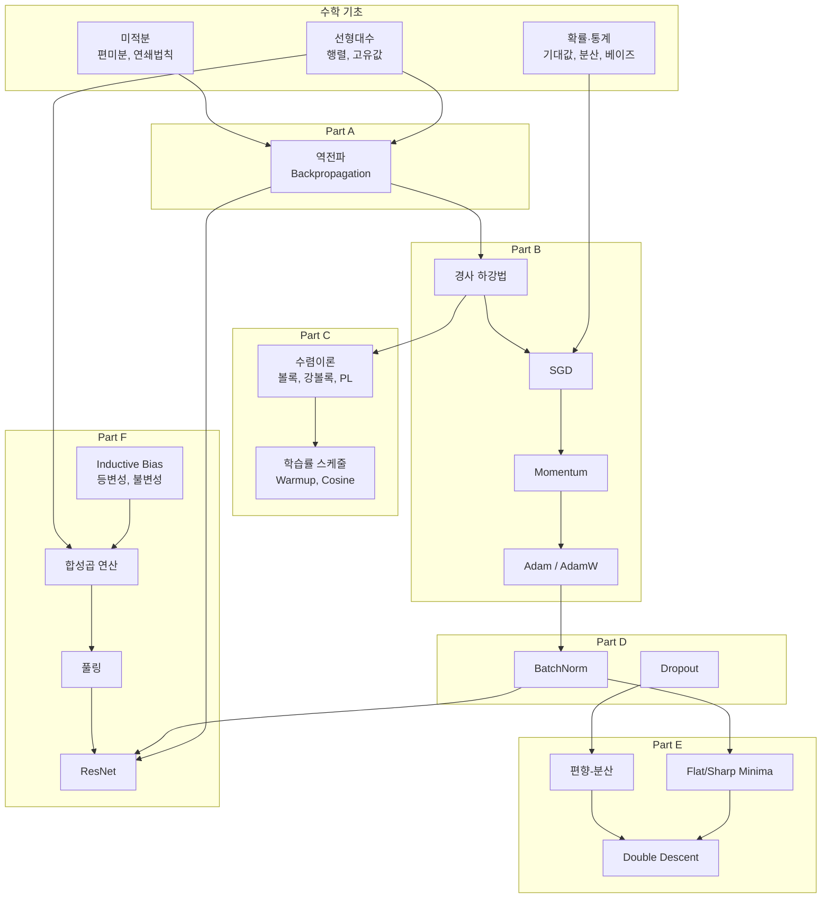

> 이 그래프는 어떤 주제를 공부할 때 어떤 선행 지식이 필요한지를 한눈에 보여줍니다.
> 가장 기초인 미적분/선형대수/확률에서 시작하여, 역전파 → 최적화 → 정규화 → 일반화 이론 → CNN으로 자연스럽게 흘러갑니다.
