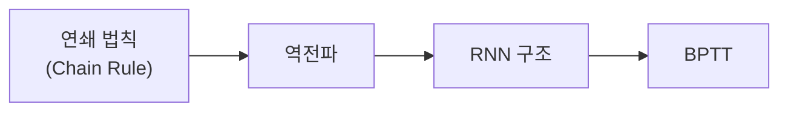
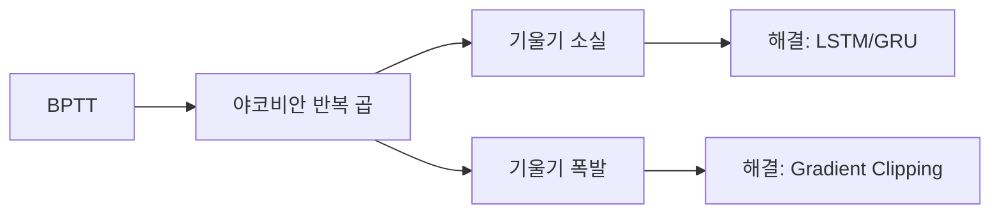
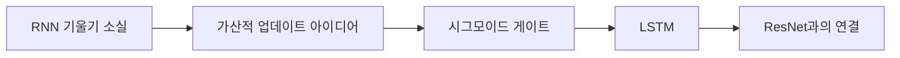
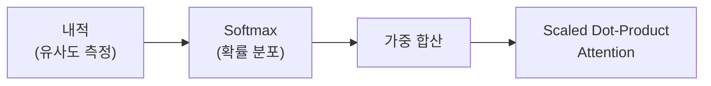
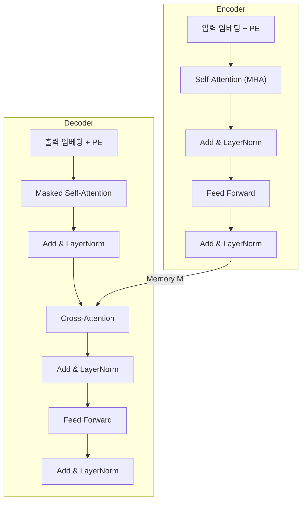

# 06. RNN, 트랜스포머, LLM 완전정복

> **"순서가 있는 데이터를 다루는 법 -- 메모장에서 세계 최강 AI까지"**
>
> 언어, 음악, 주가, 날씨... 세상의 데이터 대부분은 **순서**가 있다.
> 이 순서를 이해하는 기술이 RNN에서 시작해 Transformer를 거쳐 GPT/Claude 같은 LLM으로 진화했다.
> 이 문서는 그 여정을 초등학생부터 대학원생까지, 5단계로 안내한다.

---

## 선행 지식 맵


---

# Part A. RNN과 시퀀스 모델

---

## A1. RNN (Recurrent Neural Network)

### 동기부여

"나는 사과를 먹었다"와 "사과를 나는 먹었다"는 **같은 단어**이지만 뉘앙스가 다르다.
CNN이나 MLP는 입력을 한 덩어리로 보지만, RNN은 **한 단어씩 순서대로** 읽으며 문맥을 쌓아간다.
이것이 번역, 음성 인식, 시계열 예측의 출발점이다.

### 선행 맵


---

### Level ① 초등학생 -- 메모장을 든 로봇

상상해 보자. 로봇이 동화책을 읽고 있다. 로봇은 단어를 하나씩 읽으면서, 작은 **메모장**에 "지금까지 무슨 이야기였지?"를 적어둔다.

- "옛날에" → 메모장: `이야기 시작`
- "공주가" → 메모장: `이야기 시작 + 공주 등장`
- "용을" → 메모장: `공주 이야기 + 용 등장`
- "만났다" → 메모장: `공주가 용을 만남`

이 **메모장**이 바로 RNN의 **은닉 상태(hidden state)**이다.

> **핵심**: 새 단어를 읽을 때마다 메모장을 업데이트한다. 메모장은 항상 같은 크기이다.

---

### Level ② 중학생 -- 수식 없이 구조 이해

RNN의 규칙은 딱 하나이다:

> **새 메모 = 함수(이전 메모, 새 입력)**

이것을 매 시간 단계(time step)마다 반복한다.

| 시점 | 입력 | 이전 메모 | → | 새 메모 |
|------|------|-----------|---|---------|
| t=1 | "나는" | (빈 메모) | → | 메모₁ |
| t=2 | "밥을" | 메모₁ | → | 메모₂ |
| t=3 | "먹었다" | 메모₂ | → | 메모₃ |

**파라미터 공유**: 모든 시점에서 **같은 함수**(같은 가중치)를 사용한다.
→ 문장이 3단어든 100단어든, 모델 크기가 변하지 않는다.

**구조적 변형**:
- **Seq2Vec**: 문장 전체를 읽고 마지막 메모로 분류 (예: 감성 분석)
- **Vec2Seq**: 하나의 입력으로부터 문장 생성 (예: 이미지 캡셔닝)
- **Seq2Seq**: 문장을 읽고 다른 문장 생성 (예: 번역)

---

### Level ③ 고등학생 -- 수식의 첫 만남

**수식 전 해석**: "은닉 상태 $h$는 이전 은닉 상태와 현재 입력을 행렬로 곱하고, tanh로 눌러서 만든다."

$$h_t = \tanh(W_{hh} \, h_{t-1} + W_{hx} \, x_t + b)$$

| 기호 | 의미 | 크기 예시 |
|------|------|-----------|
| $h_t$ | 시점 $t$의 은닉 상태 (메모장) | 512차원 벡터 |
| $x_t$ | 시점 $t$의 입력 (워드 임베딩) | 300차원 벡터 |
| $W_{hh}$ | 은닉→은닉 가중치 | 512×512 행렬 |
| $W_{hx}$ | 입력→은닉 가중치 | 512×300 행렬 |
| $\tanh$ | 활성화 함수 (출력을 -1~1로 제한) | - |

**숫자 예시 → 일반화**:

입력 차원 2, 은닉 차원 2로 작게 해보자.

$$W_{hh} = \begin{bmatrix} 0.5 & 0.1 \\ 0.2 & 0.6 \end{bmatrix}, \quad W_{hx} = \begin{bmatrix} 0.3 & 0.7 \\ 0.4 & 0.2 \end{bmatrix}$$

$h_0 = [0, 0]$, $x_1 = [1, 0]$이면:

$$h_1 = \tanh\left(\begin{bmatrix}0.5 & 0.1\\0.2 & 0.6\end{bmatrix}\begin{bmatrix}0\\0\end{bmatrix} + \begin{bmatrix}0.3 & 0.7\\0.4 & 0.2\end{bmatrix}\begin{bmatrix}1\\0\end{bmatrix}\right) = \tanh\begin{bmatrix}0.3\\0.4\end{bmatrix} = \begin{bmatrix}0.291\\0.380\end{bmatrix}$$

→ 일반화: 어떤 차원이든 **행렬곱 + 비선형 함수**로 메모를 업데이트한다.

출력 예측:
$$p(y_t) = \text{softmax}(W_y \, h_t)$$

이것은 메모장을 보고 "다음에 올 단어의 확률"을 계산하는 것이다.

---

### Level ④ 대학 + PyTorch 코드

```python
import torch
import torch.nn as nn

class SimpleRNN(nn.Module):
    """바닐라 RNN 구현 -- 교육용"""
    def __init__(self, input_dim, hidden_dim, output_dim):
        super().__init__()
        self.hidden_dim = hidden_dim
        # 핵심: 모든 시점에서 같은 가중치를 공유
        self.W_hx = nn.Linear(input_dim, hidden_dim, bias=False)
        self.W_hh = nn.Linear(hidden_dim, hidden_dim, bias=False)
        self.b = nn.Parameter(torch.zeros(hidden_dim))
        self.W_y = nn.Linear(hidden_dim, output_dim)

    def forward(self, x):
        """
        x: (batch, seq_len, input_dim)
        """
        batch_size, seq_len, _ = x.shape
        h = torch.zeros(batch_size, self.hidden_dim, device=x.device)

        outputs = []
        for t in range(seq_len):
            # h_t = tanh(W_hh @ h_{t-1} + W_hx @ x_t + b)
            h = torch.tanh(self.W_hh(h) + self.W_hx(x[:, t, :]) + self.b)
            outputs.append(h)

        # 모든 시점의 은닉 상태 반환
        return torch.stack(outputs, dim=1), h  # (batch, seq_len, hidden), (batch, hidden)

# 사용 예시
rnn = SimpleRNN(input_dim=300, hidden_dim=512, output_dim=10000)
x = torch.randn(32, 20, 300)  # batch=32, 길이=20, 임베딩=300
all_hidden, last_hidden = rnn(x)
print(f"모든 시점 출력: {all_hidden.shape}")   # (32, 20, 512)
print(f"마지막 은닉 상태: {last_hidden.shape}") # (32, 512)
```

**PyTorch 내장 모듈과 비교**:
```python
# 위 코드와 동일한 기능
rnn_builtin = nn.RNN(input_size=300, hidden_size=512, batch_first=True)
output, h_n = rnn_builtin(x)
```

---

### Level ⑤ 대학원 + 논문

**PGM 관점에서의 RNN**: 은닉 상태 $h_t$는 결정론적 상태공간 모델(deterministic SSM)의 **충분통계량(sufficient statistic)**이다. 마르코프 체인 $h_1 \to h_2 \to \cdots \to h_T$를 유도하며, 관측 모델 $p(y_t \mid h_t)$와 결합된다.

**보편 근사 정리**: Elman RNN은 충분한 은닉 유닛이 있으면 임의의 연속 시퀀스-투-시퀀스 함수를 근사할 수 있다 (Schafer & Zimmermann, 2006). 그러나 이는 존재 정리일 뿐, 학습 가능성을 보장하지 않는다.

**$k$차 마르코프 vs RNN 파라미터 비교**:
- 마르코프: $|V|^{k+1}$ → 지수적 폭발
- RNN: $O(d^2 + d \cdot |V|)$ → 고정 크기, $d$는 은닉 차원

> **논문 참조**: Elman, J. (1990). "Finding Structure in Time." *Cognitive Science*, 14(2).

---

### 오개념 경고

| 오개념 | 진실 |
|--------|------|
| "RNN은 가변 길이를 다루려고 만들어졌다" | 핵심은 **파라미터 공유 + 시간 재귀**이다. 가변 길이는 부산물 |
| "은닉 상태가 모든 과거를 기억한다" | 고정 크기 벡터이므로 **정보 압축**이 일어난다. 먼 과거는 손실 |
| "RNN은 시계열에만 쓴다" | 텍스트, 음성, DNA 서열, 음악 등 모든 순차 데이터에 적용 |

---

### 설명하기 훈련

**문제**: "RNN이 왜 필요한지 MLP와 비교해서 설명하시오."

<details>
<summary>모범답안 보기</summary>

MLP는 고정 크기 입력만 받는다. "나는 밥을 먹었다"(4단어)와 "어제 저녁에 나는 친구와 함께 맛있는 밥을 먹었다"(11단어)를 같은 모델로 처리할 수 없다. 또한 MLP는 단어의 순서를 고려하지 않는다.

RNN은 **같은 가중치**를 매 시간 단계에 반복 적용하므로, 시퀀스 길이에 관계없이 처리할 수 있다. 은닉 상태가 이전 정보를 축적하므로 **순서 정보**도 자연스럽게 반영된다. 파라미터 수는 시퀀스 길이와 무관하게 고정이다.

</details>

---

### 수학 → 딥러닝 연결

| 수학 개념 | RNN에서의 역할 |
|-----------|---------------|
| 행렬곱 $Wx$ | 입력/은닉 상태의 선형 변환 |
| tanh | 값을 [-1, 1]로 제한하여 안정성 확보 |
| 재귀 관계식 $a_n = f(a_{n-1})$ | 은닉 상태 업데이트의 수학적 본질 |
| 조건부 확률 $p(y_t \mid h_t)$ | 메모장을 보고 다음 단어 예측 |

---

### 성취 확인 체크리스트

- [ ] RNN의 은닉 상태를 "메모장"에 비유해 설명할 수 있다
- [ ] 파라미터 공유가 왜 중요한지 말할 수 있다
- [ ] $h_t = \tanh(W_{hh} h_{t-1} + W_{hx} x_t)$의 각 항을 설명할 수 있다
- [ ] Seq2Vec, Vec2Seq, Seq2Seq의 차이를 말할 수 있다

---

## A2. BPTT (Backpropagation Through Time)

### 동기부여

RNN을 학습시키려면 "가중치를 어떻게 바꿔야 하는지" 알아야 한다.
시간축을 따라 펼친 뒤 일반 역전파를 적용하는 것이 BPTT이다.
이 과정에서 기울기가 시간을 거슬러 흐르며, 이것이 기울기 소실/폭발 문제의 시작이다.

### 선행 맵



---

### Level ① 초등학생 -- 실수 전달하기

선생님이 "답이 틀렸어"라고 말하면, 그 정보가 맨 마지막 메모부터 처음 메모까지 **거꾸로** 전달된다. "어디서부터 잘못되었나?" 찾는 과정이다.

---

### Level ② 중학생 -- 시간을 펼치기

RNN을 시간축으로 **펼쳐서(unroll)** 보면 아주 깊은 신경망처럼 보인다.

```
x₁ → [RNN] → h₁ → [RNN] → h₂ → [RNN] → h₃
       ↓              ↓              ↓
      y₁             y₂             y₃
```

이 펼쳐진 네트워크에 보통의 역전파를 적용하면, 그것이 BPTT이다.

---

### Level ③ 고등학생 -- 야코비안의 곱

**수식 전 해석**: "손실을 가중치로 미분하려면, 시간축을 따라 기울기를 곱해가야 한다."

$$\frac{\partial L}{\partial W} = \sum_{t=1}^{T} \frac{\partial L_t}{\partial W}$$

시간축을 따른 기울기:

$$\frac{\partial h_t}{\partial h_k} = \prod_{i=k+1}^{t} \frac{\partial h_i}{\partial h_{i-1}}$$

**숫자 예시**: 각 단계에서 기울기가 0.9배로 줄어든다면?
- 1단계: $0.9$
- 10단계: $0.9^{10} = 0.349$
- 50단계: $0.9^{50} = 0.005$
- 100단계: $0.9^{100} = 0.000027$

→ 100단어 전의 정보는 학습에 거의 반영되지 않는다!

---

### Level ④ 대학 + 코드

```python
# BPTT를 PyTorch autograd가 자동으로 처리
# 하지만 truncated BPTT를 수동 구현하면:

def truncated_bptt(model, data, target, k1, k2, optimizer):
    """
    k1: forward step 수 (얼마나 자주 업데이트)
    k2: backward step 수 (얼마나 멀리 역전파)
    """
    hidden = None
    for i in range(0, data.size(1), k1):
        # k1 스텝만큼 forward
        chunk = data[:, i:i+k1]
        if hidden is not None:
            hidden = hidden.detach()  # 기울기 체인 끊기
        output, hidden = model(chunk, hidden)

        # Loss 계산 및 k2 스텝까지 역전파
        loss = criterion(output, target[:, i:i+k1])
        optimizer.zero_grad()
        loss.backward()
        optimizer.step()
```

---

### Level ⑤ 대학원

**야코비안의 정확한 형태**:

$$\frac{\partial h_i}{\partial h_{i-1}} = W_{hh}^\top \cdot \text{diag}(\phi'(W_{hh} h_{i-1} + W_{hx} x_i))$$

이 야코비안의 **최대 특이값(spectral radius)**이 기울기 소실/폭발을 결정한다:

$$\left\|\frac{\partial h_t}{\partial h_k}\right\| \leq \sigma_{\max}(W_{hh})^{t-k} \cdot \max|\phi'|^{t-k}$$

tanh의 경우 $|\phi'| \leq 1$이므로, $\sigma_{\max}(W_{hh}) < 1$이면 기울기는 **지수적으로 소실**한다.

> **논문 참조**: Pascanu, R., Mikolov, T., & Bengio, Y. (2013). "On the difficulty of training recurrent neural networks." *ICML*.

---

### 오개념 경고

| 오개념 | 진실 |
|--------|------|
| "BPTT는 역전파와 다른 알고리즘이다" | RNN을 시간축으로 펼친 뒤 **일반 역전파를 적용**하는 것. 별도 알고리즘이 아니다 |
| "truncated BPTT는 정확한 기울기를 계산한다" | 먼 과거의 기울기를 **잘라내므로** 근사치이다. 하지만 실용적으로 잘 작동 |

---

### 성취 확인 체크리스트

- [ ] BPTT가 "시간축으로 펼친 역전파"임을 설명할 수 있다
- [ ] 야코비안의 반복 곱이 왜 문제인지 설명할 수 있다
- [ ] $0.9^{100} \approx 0.000027$이 의미하는 바를 말할 수 있다

---

## A3. Vanishing / Exploding Gradient (기울기 소실/폭발)

### 동기부여

"The cat, which was sitting on the mat that my grandmother bought last summer, **was** sleeping."

주어 "cat"과 동사 "was"가 멀리 떨어져 있다. RNN이 이 관계를 학습하려면 기울기가 먼 과거까지 전달되어야 하지만, **지수적으로 사라진다**. 이것이 RNN 최대의 한계이다.

### 선행 맵



---

### Level ① 초등학생 -- 전화기 게임

10명이 한 줄로 서서 첫 번째 사람의 말을 전달한다. 마지막 사람에게 도착하면 원래 말과 완전히 달라져 있다. **이것이 기울기 소실**이다.

반대로, 말이 전달될 때마다 점점 과장되어 소리가 엄청 커진다면? **이것이 기울기 폭발**이다.

---

### Level ② 중학생 -- 숫자로 느끼기

매 단계 기울기가 **0.9배**:
| 거리 | 기울기 크기 | 해석 |
|------|-------------|------|
| 1 | 0.9 | 잘 전달됨 |
| 10 | 0.35 | 약해짐 |
| 50 | 0.005 | 거의 사라짐 |
| 100 | 0.000027 | 학습 불가 |

매 단계 기울기가 **1.1배**:
| 거리 | 기울기 크기 | 해석 |
|------|-------------|------|
| 1 | 1.1 | 정상 |
| 10 | 2.6 | 커짐 |
| 50 | 117 | 위험 |
| 100 | 13,781 | 폭발! NaN 발생 |

---

### Level ③ 고등학생 -- 스펙트럼 분석

$$\left\|\frac{\partial h_t}{\partial h_k}\right\| \approx \sigma_{\max}(W_{hh})^{t-k}$$

| 조건 | 결과 |
|------|------|
| $\sigma_{\max}(W_{hh}) < 1$ | 기울기 **지수적 감소** → 소실 |
| $\sigma_{\max}(W_{hh}) = 1$ | 기울기 유지 (이상적) |
| $\sigma_{\max}(W_{hh}) > 1$ | 기울기 **지수적 증가** → 폭발 |

**기울기 폭발의 대처 -- Gradient Clipping**:

$$g \leftarrow \begin{cases} g & \text{if } \|g\| \leq \theta \\ \theta \cdot \frac{g}{\|g\|} & \text{if } \|g\| > \theta \end{cases}$$

기울기 벡터의 크기가 임계값 $\theta$를 넘으면, 방향은 유지하되 크기를 $\theta$로 제한한다.

**기울기 소실은 clipping으로 해결 불가** → 구조적 변경 필요 → **LSTM/GRU**

---

### Level ④ 대학 + 코드

```python
import torch
import torch.nn as nn

# Gradient Clipping 적용
model = nn.RNN(input_size=300, hidden_size=512, batch_first=True)
optimizer = torch.optim.Adam(model.parameters(), lr=0.001)

for batch in dataloader:
    optimizer.zero_grad()
    output, _ = model(batch)
    loss = criterion(output, target)
    loss.backward()

    # 핵심: gradient clipping
    torch.nn.utils.clip_grad_norm_(model.parameters(), max_norm=5.0)

    optimizer.step()

# 기울기 소실 시각화
def visualize_gradient_flow(model):
    """각 시간 단계의 기울기 크기를 추적"""
    grads = []
    for name, param in model.named_parameters():
        if param.grad is not None:
            grads.append(param.grad.norm().item())
    return grads
```

---

### Level ⑤ 대학원

**필요충분 조건의 정밀 분석**:

Bengio et al. (1994)은 기울기 소실이 RNN의 **구조적 문제**임을 증명했다. tanh RNN에서:

$$\left\|\prod_{i=k+1}^{t} W_{hh}^\top \text{diag}(\phi'(\cdot))\right\| \leq (\sigma_{\max}(W_{hh}) \cdot \gamma_\phi)^{t-k}$$

여기서 $\gamma_\phi = \max |\phi'| = 1$ (tanh). 따라서 $\sigma_{\max}(W_{hh}) < 1$이면 기울기 소실은 **불가피**하다.

**근본 해결 아이디어**: 상태 업데이트를 **곱셈적(multiplicative)**에서 **가산적(additive)**으로 바꾸면 기울기 경로에 항등 매핑이 삽입된다:

$$c_t = c_{t-1} + \Delta c_t \quad \Rightarrow \quad \frac{\partial c_t}{\partial c_{t-1}} = I + \frac{\partial \Delta c_t}{\partial c_{t-1}}$$

이것이 LSTM/GRU의 핵심이며, ResNet의 skip connection ($y = x + F(x)$)과 **수학적으로 동일**한 원리이다.

> **논문 참조**: Bengio, Y., Simard, P., & Frasconi, P. (1994). "Learning Long-Term Dependencies with Gradient Descent is Difficult." *IEEE TNN*.

---

### 설명하기 훈련

**문제**: "기울기 소실과 기울기 폭발의 차이, 그리고 각각의 해결법을 설명하시오."

<details>
<summary>모범답안 보기</summary>

**기울기 소실**: 야코비안의 스펙트럼 반경이 1보다 작을 때, 기울기가 시간 단계를 거슬러 갈수록 지수적으로 작아진다. 결과적으로 먼 과거의 입력이 현재 출력에 미치는 영향을 학습할 수 없다. 해결: LSTM/GRU의 가산적 상태 업데이트로 기울기 고속도로를 만든다.

**기울기 폭발**: 스펙트럼 반경이 1보다 클 때, 기울기가 지수적으로 커진다. 파라미터 업데이트가 너무 커서 학습이 발산한다. 해결: Gradient Clipping으로 기울기 크기를 제한한다.

핵심 차이: 폭발은 **증상 치료**(clipping)로 해결 가능하지만, 소실은 **구조 변경**(LSTM/GRU)이 필요하다.

</details>

---

## A4. LSTM (Long Short-Term Memory)

### 동기부여

RNN의 기울기 소실 문제를 근본적으로 해결한 구조.
**셀 상태(cell state)**라는 별도의 "고속도로"를 만들어, 중요한 정보를 먼 미래까지 전달한다.
1997년 Hochreiter & Schmidhuber가 제안했고, 2023년에 노벨상에 비견되는 영예를 안았다.

### 선행 맵



---

### Level ① 초등학생 -- 세 개의 문이 있는 금고

LSTM은 메모장 말고 **금고**도 가지고 있다. 금고에는 세 개의 문이 있다:

1. **잊기 문** (지우개): "이 기억은 더 이상 필요 없어" → 지운다
2. **입력 문** (연필): "이건 중요하니까 기억해야 해" → 적는다
3. **출력 문** (창문): "지금 이 기억이 필요해" → 꺼내 쓴다

금고 속 내용은 쉽게 바뀌지 않으므로, 아주 먼 과거의 기억도 보존할 수 있다!

---

### Level ② 중학생 -- 게이트의 직관

| 게이트 | 역할 | 값 범위 | 비유 |
|--------|------|---------|------|
| Forget gate ($f_t$) | 이전 기억 유지 비율 | 0~1 | 지우개 (0=전부 지움, 1=전부 유지) |
| Input gate ($i_t$) | 새 정보 추가 비율 | 0~1 | 연필 (0=안 씀, 1=전부 씀) |
| Output gate ($o_t$) | 기억 출력 비율 | 0~1 | 창문 (0=안 꺼냄, 1=전부 꺼냄) |

**핵심 직관**: 셀 상태 $c_t$는 **컨베이어 벨트** 위를 지나간다. 게이트가 정보를 선택적으로 추가하고 제거한다. 벨트 자체는 직선이므로 정보가 쉽게 흐른다.

---

### Level ③ 고등학생 -- 수식 완전 분해

**수식 전 해석**: 각 수식을 읽기 전에, 그것이 무엇을 하는지 먼저 말한다.

**① Forget gate** -- "이전 기억을 얼마나 유지할까?"
$$f_t = \sigma(W_f [h_{t-1}, x_t] + b_f)$$

**② Input gate** -- "새 정보를 얼마나 받아들일까?"
$$i_t = \sigma(W_i [h_{t-1}, x_t] + b_i)$$

**③ 후보 기억** -- "새로 만들 기억 내용은?"
$$\tilde{c}_t = \tanh(W_c [h_{t-1}, x_t] + b_c)$$

**④ 셀 상태 업데이트** -- "기억 갱신!"
$$c_t = f_t \odot c_{t-1} + i_t \odot \tilde{c}_t$$

**⑤ Output gate** -- "기억에서 뭘 꺼낼까?"
$$o_t = \sigma(W_o [h_{t-1}, x_t] + b_o)$$

**⑥ 은닉 상태** -- "최종 출력"
$$h_t = o_t \odot \tanh(c_t)$$

| 기호 | 의미 |
|------|------|
| $\sigma$ | 시그모이드 (0~1 사이 값 → "비율" 결정) |
| $\tanh$ | 하이퍼볼릭 탄젠트 (-1~1 사이 값 → "내용" 결정) |
| $\odot$ | 원소별 곱 (각 차원마다 독립적으로 게이팅) |
| $[h_{t-1}, x_t]$ | 이전 은닉 상태와 현재 입력의 연결(concatenation) |

**숫자 예시**: "The cat, which ..., **was** sleeping."

| 시점 | 단어 | $f_t$ | $i_t$ | 셀 상태 변화 |
|------|------|-------|-------|-------------|
| 1 | "The" | - | 높음 | "The" 저장 |
| 2 | "cat" | ≈1 | 높음 | "The cat" (주어 정보 저장) |
| 3-8 | "which..." | ≈1 | ≈0 | 주어 정보 유지, 관계절 무시 |
| 9 | "was" | ≈1 | 중간 | 주어 "cat" 참조하여 단수 동사 선택 |

**기울기 소실 해결의 핵심**:

$$\frac{\partial c_t}{\partial c_{t-1}} = \text{diag}(f_t)$$

$f_t \approx 1$이면 기울기가 **거의 1로 유지**된다! (바닐라 RNN은 $\sigma_{\max}(W_{hh})^{t-k}$로 지수 감소)

이것은 ResNet의 $\frac{\partial (x + F(x))}{\partial x} = I + \frac{\partial F}{\partial x}$와 **동일한 원리**이다.

---

### Level ④ 대학 + PyTorch 코드

```python
import torch
import torch.nn as nn

class LSTMFromScratch(nn.Module):
    """교육용 LSTM 구현"""
    def __init__(self, input_dim, hidden_dim):
        super().__init__()
        self.hidden_dim = hidden_dim
        concat_dim = input_dim + hidden_dim

        # 4개의 게이트를 하나의 행렬로 효율적 계산
        self.gates = nn.Linear(concat_dim, 4 * hidden_dim)

    def forward(self, x):
        batch, seq_len, _ = x.shape
        h = torch.zeros(batch, self.hidden_dim, device=x.device)
        c = torch.zeros(batch, self.hidden_dim, device=x.device)

        outputs = []
        for t in range(seq_len):
            combined = torch.cat([h, x[:, t, :]], dim=1)
            gates = self.gates(combined)

            # 4개 게이트를 한 번에 계산 후 분리
            i, f, g, o = gates.chunk(4, dim=1)

            i = torch.sigmoid(i)  # Input gate
            f = torch.sigmoid(f)  # Forget gate
            g = torch.tanh(g)     # Candidate
            o = torch.sigmoid(o)  # Output gate

            c = f * c + i * g     # Cell state update (가산적!)
            h = o * torch.tanh(c) # Hidden state

            outputs.append(h)

        return torch.stack(outputs, dim=1), (h, c)

# Forget gate bias를 1로 초기화 (실용 팁!)
lstm = LSTMFromScratch(300, 512)
# forget gate bias를 양수로 → 초기에 기억 유지 경향
nn.init.constant_(lstm.gates.bias[512:1024], 1.0)
```

---

### Level ⑤ 대학원

**Forget gate bias 초기화의 수학적 근거**:

$b_f = 1$로 초기화하면 $f_t = \sigma(W_f x + 1) \approx 0.73$이 되어, 학습 초기부터 셀 상태가 보존된다. Jozefowicz et al. (2015)이 실험적으로 검증.

**LSTM과 ResNet의 통합적 이해**:

| | LSTM | ResNet |
|---|---|---|
| 핵심 수식 | $c_t = f_t \odot c_{t-1} + i_t \odot \tilde{c}_t$ | $y = x + F(x)$ |
| 기울기 | $\frac{\partial c_t}{\partial c_{t-1}} = \text{diag}(f_t)$ | $\frac{\partial y}{\partial x} = I + \frac{\partial F}{\partial x}$ |
| 원리 | 가산적 상태 업데이트 | Skip connection |
| 효과 | 기울기 소실 완화 | 깊은 네트워크 학습 가능 |

두 구조 모두 **기울기 경로에 항등 매핑(identity path)**을 삽입하여, 기울기가 변형 없이 흐를 수 있는 "고속도로"를 만든다.

> **논문 참조**: Hochreiter, S. & Schmidhuber, J. (1997). "Long Short-Term Memory." *Neural Computation*, 9(8).

---

## A5. GRU (Gated Recurrent Unit)

### 동기부여

LSTM의 3개 게이트를 2개로 줄이면서도 비슷한 성능을 내는 경량화 버전.
파라미터가 적어 학습이 빠르고, 작은 데이터셋에서 과적합 위험이 낮다.

---

### Level ① 초등학생

LSTM 금고의 문을 3개에서 2개로 줄인 것. 더 단순하지만 거의 비슷하게 잘 작동한다.

---

### Level ② 중학생

| 게이트 | 역할 | LSTM과의 관계 |
|--------|------|--------------|
| Reset gate ($r_t$) | 이전 기억을 얼마나 무시할지 | 새로운 개념 |
| Update gate ($z_t$) | 이전 상태와 새 상태의 혼합 비율 | Forget + Input을 합친 것 |

핵심: $(1-z_t)$가 forget 역할, $z_t$가 input 역할. **하나의 게이트로 둘을 동시에 결정**한다.

---

### Level ③ 고등학생 -- 수식

$$r_t = \sigma(W_r [h_{t-1}, x_t])$$
$$z_t = \sigma(W_z [h_{t-1}, x_t])$$
$$\tilde{h}_t = \tanh(W[r_t \odot h_{t-1}, x_t])$$
$$h_t = (1 - z_t) \odot h_{t-1} + z_t \odot \tilde{h}_t$$

마지막 줄이 핵심이다:
- $z_t = 0$이면: $h_t = h_{t-1}$ → 이전 상태 완전 유지
- $z_t = 1$이면: $h_t = \tilde{h}_t$ → 새 상태로 완전 교체

---

### Level ④ 대학 + 코드

```python
class GRUCell(nn.Module):
    def __init__(self, input_dim, hidden_dim):
        super().__init__()
        self.reset_gate = nn.Linear(input_dim + hidden_dim, hidden_dim)
        self.update_gate = nn.Linear(input_dim + hidden_dim, hidden_dim)
        self.candidate = nn.Linear(input_dim + hidden_dim, hidden_dim)

    def forward(self, x, h_prev):
        combined = torch.cat([h_prev, x], dim=1)
        r = torch.sigmoid(self.reset_gate(combined))
        z = torch.sigmoid(self.update_gate(combined))

        combined_r = torch.cat([r * h_prev, x], dim=1)
        h_tilde = torch.tanh(self.candidate(combined_r))

        h_new = (1 - z) * h_prev + z * h_tilde
        return h_new
```

---

### Level ⑤ 대학원

**LSTM vs GRU 선택 기준**:

| 조건 | 추천 |
|------|------|
| 데이터 풍부, 복잡한 장기 의존성 | LSTM |
| 데이터 부족, 빠른 학습 필요 | GRU |
| 하이퍼파라미터 탐색 시간 제한 | GRU (탐색 공간 작음) |

Chung et al. (2014)의 실험: 태스크에 따라 우열이 갈리며, **일반적으로 유의미한 차이 없음**.

> **논문 참조**: Cho, K. et al. (2014). "Learning Phrase Representations using RNN Encoder-Decoder." *EMNLP*.

---

### LSTM/GRU 비교 요약

| | LSTM | GRU |
|---|---|---|
| 게이트 수 | 3 (forget, input, output) | 2 (reset, update) |
| 상태 | $c_t$ + $h_t$ (2개) | $h_t$만 (1개) |
| 파라미터 | 더 많음 (~33% 더) | 더 적음 |
| 성능 | 복잡한 의존성에 약간 유리 | 대부분 비슷 |

---

### 킬러 요약 -- Part A

> **RNN**: 같은 가중치를 매 시간 반복 → 은닉 상태에 정보 축적
> **BPTT**: 시간축으로 펼쳐서 역전파 → 야코비안 곱 → 소실/폭발
> **기울기 소실**: $\sigma_{\max}(W) < 1$이면 불가피 → 구조 변경 필요
> **LSTM**: 셀 상태의 **가산적 업데이트**로 기울기 고속도로 확보 (= ResNet 원리)
> **GRU**: LSTM의 경량 버전, 2개 게이트로 비슷한 효과

---

# Part B. 트랜스포머와 어텐션

---

## B1. Self-Attention (QKV, Scaled Dot-Product)

### 동기부여

RNN의 두 가지 근본 한계:
1. **순차 처리**: 한 단어씩 읽어야 해서 GPU 병렬화 불가
2. **정보 병목**: 먼 과거의 정보가 고정 크기 벡터에 압축되어 손실

어텐션은 **모든 위치를 동시에 참조**하여 두 문제를 한 번에 해결한다.

### 선행 맵



---

### Level ① 초등학생 -- 도서관 사서

도서관에서 "공룡에 대한 책"을 찾는다고 하자.

- **질문(Query)**: "공룡에 대해 알려줘"
- **책 제목(Key)**: "공룡의 세계", "우주 탐험", "바다 동물"
- **책 내용(Value)**: 각 책의 실제 내용

사서는 질문과 각 책 제목을 비교해서, **관련성 점수**를 매긴다:
- "공룡의 세계": 90점
- "우주 탐험": 10점
- "바다 동물": 5점

그 다음 점수 비율대로 책 내용을 **섞어서** 답을 만든다.
→ 한 권만 고르는 게 아니라, 관련성에 따라 **여러 책을 조합**한다!

---

### Level ② 중학생 -- 세 줄 요약

1. **유사도 계산**: 질문(Q)과 모든 키(K)의 내적으로 "얼마나 관련 있는지" 점수를 매긴다
2. **확률로 변환**: softmax로 점수를 비율(합=1)로 바꾼다
3. **가중 합산**: 비율에 따라 값(V)을 섞어서 최종 답을 만든다

**Self**-Attention이라 불리는 이유: Q, K, V가 모두 **같은 문장**에서 나온다. 문장 내 단어들끼리 서로를 참조한다.

---

### Level ③ 고등학생 -- 수식 완전 분해

**전체 수식**:
$$\text{Attention}(Q, K, V) = \text{softmax}\left(\frac{QK^\top}{\sqrt{d_k}}\right) V$$

**단계별 분해**:

**Step 1. Q, K, V 만들기** -- 같은 입력 $X$에서 세 가지 "관점"을 추출

$$Q = XW^Q, \quad K = XW^K, \quad V = XW^V$$

| 기호 | 의미 | 차원 |
|------|------|------|
| $X$ | 입력 행렬 (토큰들의 임베딩) | $N \times d$ |
| $W^Q, W^K$ | Query/Key 투영 가중치 | $d \times d_k$ |
| $W^V$ | Value 투영 가중치 | $d \times d_v$ |
| $N$ | 시퀀스 길이 (토큰 수) | - |

**Step 2. 유사도 계산** -- $QK^\top$

$(i,j)$ 원소 = $q_i^\top k_j$ = 내적 = **유사도 점수**

**숫자 예시**: "나는 밥을 먹었다" (3토큰, $d_k=2$)

$$Q = \begin{bmatrix} 1 & 0 \\ 0 & 1 \\ 1 & 1 \end{bmatrix}, \quad K = \begin{bmatrix} 1 & 0 \\ 0 & 1 \\ 0.5 & 0.5 \end{bmatrix}$$

$$QK^\top = \begin{bmatrix} 1 & 0 & 0.5 \\ 0 & 1 & 0.5 \\ 1 & 1 & 1 \end{bmatrix}$$

→ "나는"(행1)은 자기 자신과 유사도 1, "밥을"과 0, "먹었다"와 0.5

**Step 3. 스케일링** -- $\div \sqrt{d_k}$

**왜 $\sqrt{d_k}$로 나누는가?**

$q$와 $k$의 각 원소가 평균 0, 분산 1이면:
$$\text{Var}(q^\top k) = \sum_{l=1}^{d_k} \text{Var}(q_l k_l) = d_k$$

$d_k = 64$이면 내적의 표준편차가 $\sqrt{64} = 8$. softmax에 8 같은 큰 값이 들어가면 **거의 one-hot**이 되어 기울기가 소실된다.

$\sqrt{d_k}$로 나누면 분산이 1로 정규화 → softmax가 적절히 부드러운 분포를 유지.

**Step 4. Softmax** -- 확률 분포로 변환

$$\alpha_{ij} = \frac{\exp(s_{ij})}{\sum_k \exp(s_{ik})}, \quad s_{ij} = \frac{q_i^\top k_j}{\sqrt{d_k}}$$

**Step 5. 가중 합산** -- 최종 출력

$$\text{output}_i = \sum_j \alpha_{ij} v_j$$

Value 벡터들의 **볼록 결합(convex combination)**: $\alpha_{ij} \geq 0$, $\sum_j \alpha_{ij} = 1$

---

### Level ④ 대학 + PyTorch 코드

```python
import torch
import torch.nn as nn
import torch.nn.functional as F
import math

def scaled_dot_product_attention(Q, K, V, mask=None):
    """
    Q: (batch, num_heads, seq_len, d_k)
    K: (batch, num_heads, seq_len, d_k)
    V: (batch, num_heads, seq_len, d_v)
    """
    d_k = Q.size(-1)

    # Step 1: 유사도 계산
    scores = torch.matmul(Q, K.transpose(-2, -1))  # (batch, heads, N, N)

    # Step 2: 스케일링
    scores = scores / math.sqrt(d_k)

    # Step 3: 마스킹 (선택적)
    if mask is not None:
        scores = scores.masked_fill(mask == 0, float('-inf'))

    # Step 4: Softmax → 어텐션 가중치
    attn_weights = F.softmax(scores, dim=-1)

    # Step 5: 가중 합산
    output = torch.matmul(attn_weights, V)

    return output, attn_weights

# 테스트
batch, heads, seq_len, d_k = 2, 8, 10, 64
Q = torch.randn(batch, heads, seq_len, d_k)
K = torch.randn(batch, heads, seq_len, d_k)
V = torch.randn(batch, heads, seq_len, d_k)
out, weights = scaled_dot_product_attention(Q, K, V)
print(f"출력 shape: {out.shape}")        # (2, 8, 10, 64)
print(f"가중치 합: {weights.sum(-1)[0,0,0]:.4f}")  # 1.0000
```

---

### Level ⑤ 대학원

**Attention을 kernel smoother로 이해하기**:

Nadaraya-Watson 커널 회귀: $\hat{f}(x) = \sum_j \frac{K(x, x_j)}{\sum_k K(x, x_k)} y_j$

Attention: $\text{out}_i = \sum_j \frac{\exp(q_i^\top k_j / \sqrt{d_k})}{\sum_k \exp(q_i^\top k_k / \sqrt{d_k})} v_j$

차이점: Attention은 **학습된 투영** $W^Q, W^K, W^V$를 통해 커널 함수와 값을 동시에 학습한다. 고정 커널이 아닌 **파라메트릭 커널**이다.

**시간 복잡도 분석**:
- $QK^\top$: $O(N^2 d_k)$ — 이것이 Transformer의 주요 병목
- 메모리: $O(N^2)$ (어텐션 행렬 저장)
- RNN 대비: RNN은 $O(N)$이지만 순차적. Attention은 $O(N^2)$이지만 **완전 병렬**

> **논문 참조**: Vaswani, A. et al. (2017). "Attention Is All You Need." *NeurIPS*.

---

### 오개념 경고

| 오개념 | 진실 |
|--------|------|
| "Q, K, V는 서로 다른 입력에서 온다" | Self-Attention에서는 **모두 같은 입력 $X$**에서 온다. 다른 입력에서 오는 것은 Cross-Attention |
| "$\sqrt{d_k}$는 그냥 정규화" | 내적의 **분산이 $d_k$에 비례**하는 수학적 문제를 해결. softmax 포화 방지 |
| "Attention은 가장 관련 있는 하나를 고른다" | 하나를 고르는 게 아니라 **모든 위치의 가중 합**. soft selection |

---

## B2. Multi-Head Attention (MHA)

### 동기부여

하나의 어텐션은 **한 가지 관점**만 본다. "주어-동사" 관계를 보면 "형용사-명사" 관계를 놓친다.
여러 개의 어텐션을 **병렬로** 실행하면 다양한 관계를 동시에 포착할 수 있다.

---

### Level ① 초등학생 -- 전문가 회의

숙제를 할 때 수학 선생님, 국어 선생님, 과학 선생님에게 **동시에** 물어본다.
각 선생님(head)이 다른 관점에서 조언하고, 모든 조언을 합쳐서 최종 답을 만든다.

---

### Level ② 중학생

1. 입력을 여러 개(보통 8개)의 "관점"으로 나눈다
2. 각 관점별로 독립적인 Attention을 수행한다
3. 모든 결과를 이어붙이고(concatenate), 하나로 합친다

---

### Level ③ 고등학생 -- 수식

$$\text{head}_i = \text{Attention}(XW_i^Q, \; XW_i^K, \; XW_i^V)$$

$$\text{MHA}(X) = \text{Concat}(\text{head}_1, \ldots, \text{head}_h) \; W^O$$

| 기호 | 의미 | 차원 (원 논문) |
|------|------|---------------|
| $h$ | head 수 | 8 |
| $d_k = d_v = d/h$ | 각 head의 차원 | $512/8 = 64$ |
| $W_i^Q, W_i^K$ | $i$번째 head의 Q/K 투영 | $512 \times 64$ |
| $W^O$ | 출력 투영 | $(8 \times 64) \times 512$ |

**왜 차원을 나누는가?** head가 8개이고 각각 64차원이면, 총 연산량은 1개의 512차원 어텐션과 **거의 동일**하다. 추가 비용 없이 다양한 관점을 얻는다!

---

### Level ④ 대학 + 코드

```python
class MultiHeadAttention(nn.Module):
    def __init__(self, d_model, num_heads):
        super().__init__()
        assert d_model % num_heads == 0
        self.d_model = d_model
        self.num_heads = num_heads
        self.d_k = d_model // num_heads

        self.W_q = nn.Linear(d_model, d_model)
        self.W_k = nn.Linear(d_model, d_model)
        self.W_v = nn.Linear(d_model, d_model)
        self.W_o = nn.Linear(d_model, d_model)

    def forward(self, Q, K, V, mask=None):
        batch = Q.size(0)

        # 투영 후 head별로 분리
        Q = self.W_q(Q).view(batch, -1, self.num_heads, self.d_k).transpose(1, 2)
        K = self.W_k(K).view(batch, -1, self.num_heads, self.d_k).transpose(1, 2)
        V = self.W_v(V).view(batch, -1, self.num_heads, self.d_k).transpose(1, 2)

        # 각 head에서 attention 수행
        out, attn = scaled_dot_product_attention(Q, K, V, mask)

        # Concat + 출력 투영
        out = out.transpose(1, 2).contiguous().view(batch, -1, self.d_model)
        return self.W_o(out)
```

---

### Level ⑤ 대학원

각 head $i$의 유사도 행렬: $\Sigma_i = W_i^Q (W_i^K)^\top \in \mathbb{R}^{d \times d}$

이 $\Sigma_i$가 각 head의 **"유사도 개념"**을 정의한다. head 1은 "주어-동사" 관계를, head 2는 "수식어-피수식어" 관계를 학습할 수 있다.

**MHA를 $XW$로 대체하면?** 어텐션 행렬이 사라지고, **입력 의존적 동적 가중치** 결정이 소실된다. 이것이 Attention의 핵심 가치이다.

---

## B3. Positional Encoding

### 동기부여

Attention은 모든 단어를 **동시에** 본다. 카드를 한꺼번에 펼쳐놓은 것과 같다.
→ **순서 정보가 전혀 없다!**
"나는 너를 좋아해"와 "너를 나는 좋아해"를 구분할 수 없다.
→ 각 위치에 **번호표**를 붙여야 한다.

---

### Level ① 초등학생

줄을 설 때 "1번", "2번" 번호표를 나눠주는 것. 이 번호가 없으면 누가 먼저인지 알 수 없다.

---

### Level ② 중학생

수학적 이유: Self-Attention은 **순열 등변(permutation equivariant)**이다.
입력 순서를 바꾸면 출력 순서도 똑같이 바뀐다: $f(\Pi X) = \Pi f(X)$.
→ 순서 자체를 구분하지 못한다.
→ 입력 임베딩에 **위치 벡터**를 더해줘야 한다.

---

### Level ③ 고등학생 -- 사인/코사인 인코딩

$$\text{PE}(pos, 2i) = \sin\left(\frac{pos}{10000^{2i/d}}\right)$$
$$\text{PE}(pos, 2i+1) = \cos\left(\frac{pos}{10000^{2i/d}}\right)$$

| 기호 | 의미 |
|------|------|
| $pos$ | 토큰 위치 (0, 1, 2, ...) |
| $i$ | 임베딩 차원 인덱스 |
| $d$ | 전체 임베딩 차원 |

**직관**: 이진법 시계처럼, 낮은 차원은 빠르게 진동하고 높은 차원은 느리게 진동한다.

**숫자 예시** ($d=4$):
- 위치 0: $[\sin(0), \cos(0), \sin(0), \cos(0)] = [0, 1, 0, 1]$
- 위치 1: $[\sin(1), \cos(1), \sin(0.01), \cos(0.01)] \approx [0.84, 0.54, 0.01, 1.0]$

---

### Level ④ 대학 + 코드

```python
class PositionalEncoding(nn.Module):
    def __init__(self, d_model, max_len=5000):
        super().__init__()
        pe = torch.zeros(max_len, d_model)
        position = torch.arange(0, max_len).unsqueeze(1).float()
        div_term = torch.exp(
            torch.arange(0, d_model, 2).float() * (-math.log(10000.0) / d_model)
        )
        pe[:, 0::2] = torch.sin(position * div_term)
        pe[:, 1::2] = torch.cos(position * div_term)
        self.register_buffer('pe', pe.unsqueeze(0))  # (1, max_len, d_model)

    def forward(self, x):
        return x + self.pe[:, :x.size(1)]
```

---

### Level ⑤ 대학원

**왜 sin/cos인가?** $\text{PE}(pos+k)$를 $\text{PE}(pos)$의 선형 변환으로 표현할 수 있다:

$$\begin{bmatrix} \sin(w(pos+k)) \\ \cos(w(pos+k)) \end{bmatrix} = \begin{bmatrix} \cos(wk) & \sin(wk) \\ -\sin(wk) & \cos(wk) \end{bmatrix} \begin{bmatrix} \sin(w \cdot pos) \\ \cos(w \cdot pos) \end{bmatrix}$$

→ **상대 위치**가 내적에 자연스럽게 인코딩된다.

**현대적 대안**: RoPE (Rotary Position Embedding)는 이 아이디어를 확장하여, Query와 Key에 회전 변환을 적용해 상대 위치를 **내적에 직접** 반영한다. LLaMA, GPT-NeoX 등이 채택.

---

## B4. Encoder / Decoder 전체 구조

### 동기부여

Attention, MHA, PE가 레고 블록이라면, Encoder/Decoder는 이들을 조립한 **완성품**이다.

### 선행 맵



---

### Level ① 초등학생

- **Encoder** = 책을 읽고 이해하는 사람
- **Decoder** = 이해한 내용으로 새 글을 쓰는 사람

---

### Level ② 중학생

**Encoder 한 층의 순서**:
1. Self-Attention → 단어들끼리 관계 파악
2. Add & Norm → 안정화
3. Feed Forward → 각 단어를 더 풍부하게
4. Add & Norm → 안정화

**Decoder 한 층의 순서**:
1. **Masked** Self-Attention → 미래 단어 못 봄
2. Add & Norm
3. **Cross**-Attention → Encoder 출력 참조
4. Add & Norm
5. Feed Forward
6. Add & Norm

---

### Level ③ 고등학생

**Encoder Layer**:
$$x' = \text{LayerNorm}(x + \text{MHA}(x, x, x))$$
$$x'' = \text{LayerNorm}(x' + \text{FFN}(x'))$$

**FFN**: $d_{\text{model}}(512) \to d_{\text{ff}}(2048) \to d_{\text{model}}(512)$

$$\text{FFN}(x) = \text{ReLU}(xW_1 + b_1)W_2 + b_2$$

**Add & Norm의 역할**:
- **Add (잔차 연결)**: 기울기가 깊은 층까지 원활히 전파 (ResNet 원리)
- **LayerNorm**: $\text{LN}(x) = \frac{x - \mu}{\sigma} \cdot \gamma + \beta$ — 학습 안정화

---

### Level ④ 대학 + 코드

```python
class TransformerEncoderLayer(nn.Module):
    def __init__(self, d_model=512, num_heads=8, d_ff=2048, dropout=0.1):
        super().__init__()
        self.self_attn = MultiHeadAttention(d_model, num_heads)
        self.ffn = nn.Sequential(
            nn.Linear(d_model, d_ff),
            nn.ReLU(),
            nn.Dropout(dropout),
            nn.Linear(d_ff, d_model)
        )
        self.norm1 = nn.LayerNorm(d_model)
        self.norm2 = nn.LayerNorm(d_model)
        self.dropout = nn.Dropout(dropout)

    def forward(self, x, mask=None):
        # Sub-layer 1: Self-Attention + Add & Norm
        attn_out = self.self_attn(x, x, x, mask)
        x = self.norm1(x + self.dropout(attn_out))

        # Sub-layer 2: FFN + Add & Norm
        ffn_out = self.ffn(x)
        x = self.norm2(x + self.dropout(ffn_out))
        return x
```

---

### Level ⑤ 대학원

**Pre-LN vs Post-LN**: 원 논문은 Post-LN ($\text{LN}(x + \text{sublayer}(x))$)을 사용했으나, 실제로는 Pre-LN ($x + \text{sublayer}(\text{LN}(x))$)이 학습 안정성이 더 높다. GPT-2 이후 대부분 Pre-LN을 채택.

---

## B5. Masked Attention & Cross-Attention

### 동기부여

번역할 때 Decoder는 아직 쓰지 않은 미래 단어를 보면 안 된다.
또한 Decoder는 Encoder의 출력을 참조해야 한다.
이 두 가지를 각각 Masked Attention과 Cross-Attention이 담당한다.

---

### Level ① 초등학생

- **Masked Attention**: 시험에서 아직 안 푼 문제의 답을 가리는 것
- **Cross-Attention**: 영어 문장을 보면서 한국어로 번역하는 것

---

### Level ② 중학생

**Masked Attention**:
| | 나는 | 밥을 | 먹었다 |
|---|---|---|---|
| 나는 | O | X | X |
| 밥을 | O | O | X |
| 먹었다 | O | O | O |

O = 볼 수 있음, X = 마스킹 → 미래 정보 차단

**Cross-Attention**:
- Q = Decoder의 현재 상태 ("Je suis...")
- K, V = Encoder의 출력 ("I am a student")
- "Je"를 쓸 때 "I"에 집중, "suis"를 쓸 때 "am"에 집중

---

### Level ③ 고등학생

**Masked Self-Attention**:
$$[QK^\top]_{ij} = \begin{cases} q_i^\top k_j & \text{if } j \leq i \\ -\infty & \text{if } j > i \end{cases}$$

softmax 후: $-\infty \to 0$이므로 미래 위치의 가중치가 0이 된다.

**Cross-Attention**:
$$\text{CrossAttn} = \text{MHA}(Q=Y, \; K=M, \; V=M)$$

| 구분 | Self-Attention | Cross-Attention |
|------|---------------|-----------------|
| Q, K, V 출처 | 모두 같은 $X$ | Q: Decoder, K/V: Encoder |
| 의미 | 시퀀스 내부 관계 | 두 시퀀스 간 관계 |
| 행렬 크기 | $N \times N$ | $N_{\text{dec}} \times N_{\text{enc}}$ |

---

### Level ④ 대학 + 코드

```python
def create_causal_mask(seq_len):
    """Masked Self-Attention용 인과적 마스크 생성"""
    mask = torch.triu(torch.ones(seq_len, seq_len), diagonal=1).bool()
    return ~mask  # True = 볼 수 있음, False = 마스킹

# 사용 예시
mask = create_causal_mask(5)
# tensor([[ True, False, False, False, False],
#         [ True,  True, False, False, False],
#         [ True,  True,  True, False, False],
#         [ True,  True,  True,  True, False],
#         [ True,  True,  True,  True,  True]])

class TransformerDecoderLayer(nn.Module):
    def __init__(self, d_model=512, num_heads=8, d_ff=2048):
        super().__init__()
        self.masked_self_attn = MultiHeadAttention(d_model, num_heads)
        self.cross_attn = MultiHeadAttention(d_model, num_heads)
        self.ffn = nn.Sequential(
            nn.Linear(d_model, d_ff), nn.ReLU(), nn.Linear(d_ff, d_model)
        )
        self.norm1 = nn.LayerNorm(d_model)
        self.norm2 = nn.LayerNorm(d_model)
        self.norm3 = nn.LayerNorm(d_model)

    def forward(self, y, memory, tgt_mask=None):
        # 1. Masked Self-Attention (미래 못 봄)
        y2 = self.masked_self_attn(y, y, y, tgt_mask)
        y = self.norm1(y + y2)

        # 2. Cross-Attention (Encoder 참조)
        y2 = self.cross_attn(y, memory, memory)
        y = self.norm2(y + y2)

        # 3. FFN
        y2 = self.ffn(y)
        y = self.norm3(y + y2)
        return y
```

---

## B6. Vision Transformer (ViT)

### 동기부여

"이미지도 시퀀스가 될 수 있다!" — 이미지를 **패치(조각)**로 나누면 각 패치가 하나의 "토큰"이 된다.
Transformer를 이미지에 그대로 적용한 것이 ViT이다.

---

### Level ①~② 요약

이미지를 16x16 조각으로 나눔 → 각 조각을 벡터로 변환 → 앞에 [CLS] 토큰 추가 → Transformer Encoder 통과 → [CLS] 출력으로 분류

---

### Level ③ 구조

1. 이미지 $(H \times W \times C)$ → $N = HW/P^2$개의 $P \times P$ 패치
2. 각 패치를 flatten 후 선형 투영: $x_p \in \mathbb{R}^{P^2 C} \to z \in \mathbb{R}^d$
3. [CLS] 토큰 + Positional Embedding 추가
4. Transformer Encoder $\times L$ 통과
5. [CLS] 토큰 출력 → MLP Head → 분류

**핵심 관찰**: 작은 데이터 → CNN(ResNet) 우세. **대규모 데이터(JFT-300M)** → ViT 압도적.

이유: ViT는 CNN보다 **약한 inductive bias**를 가진다. 데이터가 많으면 bias가 약한 게 유리하다 (bias-variance tradeoff).

---

### Level ④ 코드 스케치

```python
class ViT(nn.Module):
    def __init__(self, img_size=224, patch_size=16, d_model=768,
                 num_heads=12, num_layers=12, num_classes=1000):
        super().__init__()
        num_patches = (img_size // patch_size) ** 2
        patch_dim = 3 * patch_size * patch_size

        self.patch_embed = nn.Linear(patch_dim, d_model)
        self.cls_token = nn.Parameter(torch.randn(1, 1, d_model))
        self.pos_embed = nn.Parameter(torch.randn(1, num_patches + 1, d_model))

        encoder_layer = nn.TransformerEncoderLayer(
            d_model=d_model, nhead=num_heads, batch_first=True
        )
        self.encoder = nn.TransformerEncoder(encoder_layer, num_layers=num_layers)
        self.head = nn.Linear(d_model, num_classes)

    def forward(self, img):
        # 패치 분할 + 임베딩 (간략화)
        patches = img.unfold(2, 16, 16).unfold(3, 16, 16)
        patches = patches.contiguous().view(img.size(0), -1, 3*16*16)
        x = self.patch_embed(patches)

        # [CLS] 토큰 추가
        cls = self.cls_token.expand(img.size(0), -1, -1)
        x = torch.cat([cls, x], dim=1)
        x = x + self.pos_embed

        # Transformer Encoder
        x = self.encoder(x)

        # 분류
        return self.head(x[:, 0])  # [CLS] 토큰만 사용
```

---

### 킬러 요약 -- Part B

> **Self-Attention**: $\text{softmax}(QK^\top/\sqrt{d_k})V$ — 모든 위치를 동시 참조, 동적 가중치
> **Multi-Head**: 여러 관점을 병렬로 학습, 추가 비용 거의 없음
> **Positional Encoding**: 순열 등변성 보완, sin/cos 또는 학습형
> **Encoder**: Self-Attention + FFN + 잔차 + LayerNorm
> **Decoder**: Masked Self-Attn + Cross-Attn + FFN
> **ViT**: 이미지를 패치 토큰으로 → Transformer = 범용 아키텍처

---

# Part C. LLM과 In-Context Learning

---

## C1. BERT와 GPT

### 동기부여

Transformer의 Encoder와 Decoder를 각각 극대화한 것이 BERT와 GPT이다.
이 둘의 차이를 이해하면 현대 AI의 절반을 이해한 것이다.

---

### Level ① 초등학생

- **BERT** = 빈칸 채우기 게임. "나는 ___을 먹었다" → "밥"
- **GPT** = 이어쓰기 게임. "옛날 옛적에..." → "공주가 살았다"

---

### Level ② 중학생

| 구분 | BERT | GPT |
|------|------|-----|
| 방향 | 양방향 (전체 문맥) | 단방향 (왼쪽만) |
| 구조 | Encoder만 | Decoder만 (Masked Attention) |
| 학습 | 빈칸 맞추기 (MLM) | 다음 단어 예측 (CLM) |
| 강점 | 문장 이해/분류 | 문장 생성 |

---

### Level ③ 고등학생

**BERT (Masked Language Model)**:
$$\mathcal{L}_{\text{MLM}} = -\sum_{i \in \mathcal{M}} \log p(x_i \mid x_{\backslash \mathcal{M}}; \theta)$$

토큰의 15%를 [MASK]로 가리고, 양방향 문맥을 보고 원래 토큰을 맞춘다.

**GPT (Causal Language Model)**:
$$\mathcal{L}_{\text{CLM}} = -\sum_{t=1}^{T} \log p(x_t \mid x_{1:t-1}; \theta)$$

왼쪽 문맥만 보고 다음 토큰을 예측한다. Masked Attention으로 미래 차단.

---

### Level ④ 코드

```python
# BERT 스타일 MLM
from transformers import BertForMaskedLM, BertTokenizer

tokenizer = BertTokenizer.from_pretrained('bert-base-uncased')
model = BertForMaskedLM.from_pretrained('bert-base-uncased')

text = "The cat [MASK] on the mat."
inputs = tokenizer(text, return_tensors='pt')
outputs = model(**inputs)
predicted = tokenizer.decode(outputs.logits[0, 3].argmax())
print(f"예측: {predicted}")  # "sat"

# GPT 스타일 CLM
from transformers import GPT2LMHeadModel, GPT2Tokenizer

tokenizer = GPT2Tokenizer.from_pretrained('gpt2')
model = GPT2LMHeadModel.from_pretrained('gpt2')

input_ids = tokenizer.encode("Once upon a time", return_tensors='pt')
output = model.generate(input_ids, max_length=50)
print(tokenizer.decode(output[0]))
```

---

## C2. Next-Token Prediction (다음 토큰 예측)

### 동기부여

GPT의 학습 목표는 놀랍도록 단순하다: **다음 단어 맞추기**.
이 단순한 목표로 문법, 상식, 추론, 코딩까지 배운다.

---

### Level ① 초등학생

"나는 아침에 ___"의 빈칸을 맞추는 게임을 수십억 번 하면, 세상 모든 지식을 저절로 배우게 된다!

---

### Level ② 중학생

$$p(\text{문장}) = p(w_1) \times p(w_2 \mid w_1) \times p(w_3 \mid w_1, w_2) \times \cdots$$

모든 문장의 확률을 **조건부 확률의 곱**으로 분해한다.
각 단계에서 "이전 단어들이 주어졌을 때 다음 단어의 확률"을 최대화한다.

---

### Level ③ 고등학생

**수식 전 해석**: "모든 학습 데이터의 각 위치에서, 이전 토큰들이 주어졌을 때 실제 다음 토큰이 올 확률의 로그를 최대화한다."

$$\mathcal{L} = -\sum_{t=1}^{T} \log p(x_t \mid x_{1:t-1}; \theta)$$

**Cross-Entropy와의 관계**:

$$\text{KL}(p_{\text{data}} \| p_\theta) = \text{CE}(p_{\text{data}}, p_\theta) - \text{Ent}(p_{\text{data}})$$

엔트로피는 상수이므로, **CE 최소화 = KL 최소화 = 모델 분포를 데이터 분포에 맞추기**

---

### Level ④ 코드

```python
import torch
import torch.nn.functional as F

def causal_lm_loss(logits, targets):
    """
    logits: (batch, seq_len, vocab_size)
    targets: (batch, seq_len)
    """
    # 시점 t의 logits로 시점 t+1의 토큰을 예측
    shift_logits = logits[:, :-1, :].contiguous()
    shift_targets = targets[:, 1:].contiguous()

    loss = F.cross_entropy(
        shift_logits.view(-1, shift_logits.size(-1)),
        shift_targets.view(-1)
    )
    return loss
```

---

## C3. Scaling Laws (스케일링 법칙)

### 동기부여

"모델을 10배 키우면 성능이 얼마나 좋아질까?"
스케일링 법칙은 이 질문에 **수학적 답**을 준다.
이것이 GPT-3(175B), GPT-4로의 스케일업을 정당화한 근거이다.

---

### Level ① 초등학생

공부를 2배 더 하면 성적이 조금 오르고, 10배 더 하면 더 오른다. 하지만 100점에 가까울수록 오르기가 어렵다. AI도 마찬가지!

---

### Level ② 중학생

로그-로그 그래프에서 **직선**으로 나타난다:
- 모델 크기 10배 → 성능 일정 비율 향상
- 데이터 10배 → 성능 일정 비율 향상
- 계산량 10배 → 성능 일정 비율 향상

---

### Level ③ 고등학생

$$L(N) \propto N^{-\alpha_N}, \quad L(D) \propto D^{-\alpha_D}, \quad L(C) \propto C^{-\alpha_C}$$

| 기호 | 의미 |
|------|------|
| $L$ | 손실 (낮을수록 좋음) |
| $N$ | 파라미터 수 |
| $D$ | 학습 데이터 크기 (토큰 수) |
| $C$ | 계산량 (FLOPs) |
| $\alpha$ | 스케일링 지수 (경험적) |

**숫자 예시**: $\alpha_N = 0.076$이면, 파라미터 10배 증가 시:
$$L \propto (10N)^{-0.076} = 10^{-0.076} \cdot N^{-0.076} \approx 0.84 \cdot L_{\text{이전}}$$

→ 약 **16% 성능 향상**

**Chinchilla 법칙** (Hoffmann et al., 2022):
파라미터 수 $N$과 데이터 토큰 수 $D$에는 **최적 비율**이 있다:
$$N_{\text{opt}} \propto C^{0.5}, \quad D_{\text{opt}} \propto C^{0.5}$$

→ 단순히 모델만 키우는 것은 비효율. **데이터-파라미터 균형**이 핵심.

---

### Level ⑤ 대학원

Kaplan et al. (2020)의 원래 법칙 vs Chinchilla:

| | Kaplan | Chinchilla |
|---|---|---|
| 최적 비율 | $N \propto C^{0.73}$ | $N \propto C^{0.5}$ |
| 데이터 중요도 | 모델 > 데이터 | 모델 ≈ 데이터 |
| 결론 | 모델을 키워라 | 데이터도 함께 키워라 |

Chinchilla(70B)가 Gopher(280B)보다 우수 → 데이터-파라미터 균형이 증명됨.

> **논문 참조**: Hoffmann, J. et al. (2022). "Training Compute-Optimal Large Language Models." *NeurIPS*.

---

## C4. In-Context Learning (ICL)

### 동기부여

GPT-3의 가장 놀라운 능력: **가중치를 전혀 바꾸지 않고**, 프롬프트에 예시를 넣어주는 것만으로 새로운 태스크를 수행한다.

---

### Level ① 초등학생

시험에서 선생님이 "예시: 2+3=5, 4+1=5"를 보여주면, "3+2=?"도 풀 수 있다.
AI에게도 이렇게 예시를 보여주면, **추가 공부 없이** 새로운 문제를 풀 수 있다!

---

### Level ② 중학생

세 가지 모드:
| 모드 | 예시 수 | 비유 |
|------|---------|------|
| Zero-shot | 0 | 레시피 없이 요리 |
| One-shot | 1 | 레시피 1개 보고 요리 |
| Few-shot | 2~5 | 레시피 여러 개 보고 요리 |

**핵심**: 모델의 가중치는 **전혀 변하지 않는다**. 프롬프트만 바꾼다.

---

### Level ③ 고등학생

**수식 정의**:

데모 $\mathcal{D} = \{(x_1, y_1), \ldots, (x_k, y_k)\}$와 질의 $x_q$가 주어지면:

$$\hat{y} = \arg\max_y \; p(y \mid x_1, y_1, \ldots, x_k, y_k, x_q; \theta)$$

여기서 $\theta$는 **고정(frozen)**이다. Gradient 계산 없음. 학습 시간 = 0.

**충격적 실험 (Min et al., 2022)**:
예시의 라벨을 **무작위로 섞어도** 성능이 크게 떨어지지 않았다!
→ ICL은 "입출력 매핑을 외우는 것"이 아니라, **태스크의 형식과 분포를 파악**하는 것.

---

### Level ④ 코드

```python
from transformers import GPT2LMHeadModel, GPT2Tokenizer

model = GPT2LMHeadModel.from_pretrained('gpt2-large')
tokenizer = GPT2Tokenizer.from_pretrained('gpt2-large')

# Few-shot ICL: 감성 분석
prompt = """Review: "This movie was amazing!" -> Positive
Review: "Terrible waste of time." -> Negative
Review: "The acting was superb and the plot was engaging." ->"""

inputs = tokenizer(prompt, return_tensors='pt')
with torch.no_grad():  # 가중치 업데이트 없음!
    output = model.generate(**inputs, max_new_tokens=5)
print(tokenizer.decode(output[0]))
# "... -> Positive"
```

---

### Level ⑤ 대학원 -- 이론적 해석

**가설 1: 암묵적 경사 하강법**

Akyurek et al. (2022): 단일 선형 attention 층에서 ICL이 최소자승법의 한 스텝과 동치임을 보임.

→ Attention 연산 자체가 암묵적으로 gradient step을 수행한다.

**가설 2: 베이지안 추론**

Xie et al. (2021):

$$p(y \mid x_q, \mathcal{D}) = \int p(y \mid x_q, z) \; p(z \mid \mathcal{D}) \; dz$$

- $z$: 잠재 태스크 개념 (예: "감성 분류")
- $p(z \mid \mathcal{D})$: 데모로부터 추론된 태스크 사후 분포
- 데모가 많을수록 $p(z \mid \mathcal{D})$가 올바른 태스크에 집중

**가설 3: Task Vector**

사전학습 중 다양한 태스크를 학습하면서, 모델 내부에 태스크별 "벡터"가 형성된다. ICL 예시는 이 벡터를 **활성화**하는 역할.

> **논문 참조**:
> - Akyurek, E. et al. (2022). "What learning algorithm is in-context learning?"
> - Xie, S. et al. (2021). "An Explanation of In-context Learning as Implicit Bayesian Inference."

---

### 오개념 경고

| 오개념 | 진실 |
|--------|------|
| "ICL은 모델이 예시에서 새로 학습한다" | 가중치는 **고정**. 사전학습된 능력을 프롬프트로 **활성화**하는 것 |
| "Few-shot에서 라벨이 정확해야 한다" | 형식과 분포가 라벨 정확성보다 중요 (Min et al., 2022) |
| "예시가 많을수록 무조건 좋다" | Context window 한계, "Lost in the Middle" 현상 존재 |
| "LLM은 단순히 큰 모델이다" | 스케일링 법칙 + 데이터 + 학습 목표의 조합이 핵심 |

---

### 설명하기 훈련

**문제**: "ICL에서 가중치가 바뀌지 않는데 어떻게 새로운 태스크를 수행할 수 있는가?"

<details>
<summary>모범답안 보기</summary>

사전학습 과정에서 모델은 다양한 태스크의 패턴을 이미 내재화했다. ICL 예시는 모델에게 "지금 어떤 종류의 태스크를 수행해야 하는지"를 알려주는 **신호** 역할을 한다.

이론적으로는 (1) Attention이 암묵적 gradient descent를 수행한다는 해석, (2) 잠재 태스크 변수 $z$에 대한 베이지안 추론이라는 해석이 있다. 어느 경우든 핵심은: 모델이 "새로 배우는" 것이 아니라, 이미 알고 있는 능력 중 **적절한 것을 선택**하는 것이다.

Min et al. (2022)의 실험이 이를 뒷받침한다 -- 라벨을 무작위로 바꿔도 성능이 유지되는 것은, ICL이 입출력 매핑이 아닌 **형식과 분포**에서 태스크 정보를 추출하기 때문이다.

</details>

---

### 수학 → 딥러닝 연결 (전체)

| 수학 개념 | 딥러닝에서의 역할 |
|-----------|------------------|
| 내적 $q^\top k$ | Attention의 유사도 측정 |
| Softmax | 유사도를 확률 분포로 변환 |
| 볼록 결합 $\sum \alpha_i v_i$ | Value의 가중 합산 → Attention 출력 |
| 분산 $\text{Var}(q^\top k) = d_k$ | $\sqrt{d_k}$ 스케일링의 수학적 근거 |
| 야코비안 반복 곱 | RNN 기울기 소실/폭발의 원인 |
| 항등 매핑 $I$ | LSTM/ResNet의 기울기 고속도로 |
| 조건부 확률 체인 룰 | Next-token prediction의 수학적 기반 |
| KL divergence | 사전학습의 최적화 목표 |
| 거듭제곱 법칙 $N^{-\alpha}$ | 스케일링 법칙 |
| 베이즈 정리 | ICL의 이론적 해석 |

---

### 성취 확인 -- 전체 체크리스트

**Part A: RNN**
- [ ] RNN의 은닉 상태를 비유로 설명할 수 있다
- [ ] BPTT가 "시간 펼치기 + 역전파"임을 안다
- [ ] 기울기 소실의 원인($\sigma_{\max} < 1$)을 설명할 수 있다
- [ ] LSTM의 4단계 (forget, input, candidate, output)를 말할 수 있다
- [ ] LSTM과 ResNet이 같은 원리임을 설명할 수 있다
- [ ] GRU와 LSTM의 차이를 말할 수 있다

**Part B: Transformer**
- [ ] Self-Attention의 4단계 (유사도→스케일→softmax→가중합)를 설명할 수 있다
- [ ] $\sqrt{d_k}$로 나누는 수학적 이유를 말할 수 있다
- [ ] Multi-Head가 왜 "다양한 관점"인지 설명할 수 있다
- [ ] Positional Encoding이 왜 필요한지 말할 수 있다
- [ ] Masked Attention이 autoregressive 생성에 필수인 이유를 안다
- [ ] Cross-Attention에서 Q, K, V의 출처를 구분할 수 있다

**Part C: LLM**
- [ ] BERT와 GPT의 학습 목표 차이를 설명할 수 있다
- [ ] Next-token prediction이 CE 최소화와 같음을 안다
- [ ] 스케일링 법칙에서 $N^{-\alpha}$의 의미를 말할 수 있다
- [ ] ICL에서 가중치가 변하지 않음을 설명할 수 있다
- [ ] ICL에서 라벨보다 형식이 중요한 이유를 설명할 수 있다

---

## 최종 킬러 요약

```
┌─────────────────────────────────────────────────────────────────┐
│                    시퀀스 모델의 진화 계보                         │
│                                                                 │
│  마르코프 체인 ──→ RNN ──→ LSTM/GRU ──→ Transformer ──→ LLM     │
│  (고정 윈도우)  (메모장)  (게이트 금고)  (전체 참조)   (초거대)    │
│                                                                 │
│  핵심 문제:     순서가 있는 데이터를 어떻게 다룰 것인가?           │
│                                                                 │
│  RNN의 한계:    기울기 소실 (야코비안 곱 → 지수 감소)              │
│  LSTM 해결:     가산적 업데이트 (= ResNet skip connection)        │
│  Transformer:   Self-Attention으로 순차 병목 제거                 │
│  LLM:           스케일링 법칙 + Next-token → 창발적 능력 (ICL)    │
│                                                                 │
│  하나의 수식이 현대 AI를 지탱한다:                                 │
│                                                                 │
│    Attention(Q,K,V) = softmax(QK⊤ / √d_k) V                    │
│                                                                 │
└─────────────────────────────────────────────────────────────────┘
```

> **진정한 마스터의 기준**:
>
> 1. LSTM의 $\frac{\partial c_t}{\partial c_{t-1}} = \text{diag}(f_t)$가 왜 기울기 소실을 해결하는지 **야코비안으로 보여줄 수 있는가**
> 2. $\sqrt{d_k}$를 빼면 **구체적으로** 무엇이 발생하는지 분산 계산으로 설명할 수 있는가
> 3. MHA를 $XW$로 대체하면 왜 안 되는지 $\Sigma_i = W_i^Q W_i^{K\top}$으로 설명할 수 있는가
> 4. ICL에서 라벨을 무작위로 바꿔도 성능이 유지되는 이유를 이론적으로 설명할 수 있는가
> 5. 스케일링 법칙에서 Chinchilla가 Kaplan과 다른 결론에 도달한 이유를 말할 수 있는가

---

## 보충: PEFT -- LoRA와 Adapter

### 동기부여

7B 파라미터 모델을 법률 도메인에 맞추고 싶다. 전체를 fine-tuning하면 GPU 메모리가 수십 GB 필요하다.
**전체의 0.1%만 학습하면서 거의 같은 성능**을 내는 방법이 있다면?

---

### Level ① 초등학생

피아노를 잘 치는 사람이 기타를 배울 때, 음악 기초는 이미 알고 있으니 **손가락 위치**만 새로 배우면 된다. AI도 마찬가지 -- 이미 배운 지식은 그대로 두고, 아주 작은 부분만 새로 조정한다.

---

### Level ② 중학생

| 방법 | 비유 | 학습 파라미터 |
|------|------|--------------|
| Full Fine-tuning | 책 전체를 다시 쓰기 | 100% |
| Adapter | 책 사이에 메모지 끼우기 | ~2% |
| LoRA | 책의 여백에 주석 달기 | ~0.1% |
| Frozen (Feature Extractor) | 책은 안 건드리고 목차만 새로 쓰기 | 마지막 층만 |

---

### Level ③ 고등학생

**Adapter** (Houlsby et al., 2019):

각 Transformer 층에 작은 bottleneck MLP를 삽입:

$$\text{Adapter}(x) = x + W_{\text{up}} \cdot \sigma(W_{\text{down}} \cdot x)$$

| 기호 | 의미 | 차원 |
|------|------|------|
| $W_{\text{down}}$ | 차원 축소 | $d \times h$ (예: $64 \times 768$) |
| $W_{\text{up}}$ | 차원 복원 | $h \times d$ (예: $768 \times 64$) |

추가 파라미터: $2 \times 64 \times 768 = 98,304$ (원래 모델 대비 극소량)

**LoRA** (Hu et al., 2021):

가중치 업데이트를 **저랭크 분해**로 표현:

$$W' = W + \Delta W = W + BA$$

| 기호 | 의미 | 차원 |
|------|------|------|
| $W$ | 원래 가중치 (동결) | $h \times h$ |
| $B$ | 저랭크 행렬 | $h \times r$ |
| $A$ | 저랭크 행렬 | $r \times h$ |
| $r$ | 랭크 (보통 4~16) | - |

**숫자 예시**: 7B 모델, $r=8$, $h=4096$
- 전체 파라미터: 7,000,000,000개
- LoRA 파라미터: $\approx$ 4,000,000개 (0.06%)
- 성능: full fine-tuning의 **95% 이상**

**왜 작동하는가?** fine-tuning 과정에서 가중치 업데이트 $\Delta W$의 **본질적 랭크(intrinsic rank)가 매우 낮다**. 즉, 대부분의 변화가 저차원 부분공간에서 일어난다.

---

### Level ④ 코드

```python
import torch
import torch.nn as nn

class LoRALinear(nn.Module):
    """LoRA가 적용된 Linear 층"""
    def __init__(self, original_linear, r=8, alpha=16):
        super().__init__()
        self.original = original_linear
        self.original.weight.requires_grad = False  # 원래 가중치 동결

        d_out, d_in = original_linear.weight.shape
        self.lora_A = nn.Parameter(torch.randn(r, d_in) * 0.01)
        self.lora_B = nn.Parameter(torch.zeros(d_out, r))
        self.scaling = alpha / r

    def forward(self, x):
        # W' = W + (alpha/r) * B @ A
        original_out = self.original(x)
        lora_out = (x @ self.lora_A.T @ self.lora_B.T) * self.scaling
        return original_out + lora_out

# 사용 예시: 기존 모델의 attention 가중치에 LoRA 적용
model = nn.TransformerEncoderLayer(d_model=512, nhead=8)
# self_attn.in_proj_weight에 LoRA 적용
original_linear = model.self_attn.out_proj
model.self_attn.out_proj = LoRALinear(original_linear, r=8)

# 학습 가능한 파라미터만 카운트
trainable = sum(p.numel() for p in model.parameters() if p.requires_grad)
total = sum(p.numel() for p in model.parameters())
print(f"학습 가능: {trainable:,} / 전체: {total:,} ({100*trainable/total:.2f}%)")
```

---

### Level ⑤ 대학원

**PAC-Bayes 관점**: 사전학습된 $\theta_{\text{pre}}$는 informative prior로 작용한다. LoRA는 이 prior 주변의 **저차원 부분공간**에서만 탐색하므로, generalization bound가 타이트해진다:

$$\text{Gen. Error} \leq O\left(\sqrt{\frac{\text{KL}(\theta_{\text{ft}} \| \theta_{\text{pre}})}{n}}\right)$$

LoRA에서 $\text{KL}$ 항은 $\Delta W = BA$의 Frobenius norm에 의존하며, 저랭크 제약이 이를 자연스럽게 정규화한다.

> **논문 참조**: Hu, E. et al. (2021). "LoRA: Low-Rank Adaptation of Large Language Models." *ICLR 2022*.

---

## 보충: 종합 실전 훈련 문제

### 문제 1 (고등학생 수준)

"Attention에서 $\sqrt{d_k}$로 스케일링하지 않으면 어떤 일이 벌어지는지, $d_k = 512$일 때의 구체적 수치를 들어 설명하시오."

<details>
<summary>모범답안 보기</summary>

$q$와 $k$의 각 원소가 평균 0, 분산 1인 독립 확률변수라면, 내적 $q^\top k$의 분산은 $d_k = 512$이다. 표준편차는 $\sqrt{512} \approx 22.6$.

softmax에 $\pm 22.6$ 정도의 값이 입력되면, $\text{softmax}(22.6) \approx 1.0$으로 **거의 one-hot** 분포가 된다. one-hot 분포의 기울기는 $\text{softmax}(z)(1 - \text{softmax}(z)) \approx 0$이므로, **gradient가 소실**되어 학습이 멈춘다.

$\sqrt{512} \approx 22.6$으로 나누면 내적값이 $\pm 1$ 범위로 정규화되어, softmax가 부드러운 분포를 유지하고 학습이 정상 작동한다.

</details>

---

### 문제 2 (대학 수준)

"LSTM의 셀 상태 업데이트 $c_t = f_t \odot c_{t-1} + i_t \odot \tilde{c}_t$가 기울기 소실을 완화하는 이유를 바닐라 RNN과 비교하여 수학적으로 설명하시오."

<details>
<summary>모범답안 보기</summary>

**바닐라 RNN**: $h_t = \tanh(W_{hh} h_{t-1} + W_{hx} x_t)$

기울기: $\frac{\partial h_t}{\partial h_{t-1}} = W_{hh}^\top \text{diag}(\tanh')$

$t-k$ 단계를 거치면: $\prod_{i=k+1}^{t} W_{hh}^\top \text{diag}(\tanh')$

$\sigma_{\max}(W_{hh}) < 1$이면 지수적으로 감소.

**LSTM**: $c_t = f_t \odot c_{t-1} + i_t \odot \tilde{c}_t$

기울기: $\frac{\partial c_t}{\partial c_{t-1}} = \text{diag}(f_t)$

$t-k$ 단계를 거치면: $\prod_{i=k+1}^{t} \text{diag}(f_i)$

$f_i \approx 1$이면 기울기가 **거의 1로 유지**된다. 이는 바닐라 RNN에서 $W_{hh}$ 행렬의 반복 곱이 필요한 것과 달리, LSTM에서는 **스칼라 게이트의 곱**만 관여하며, 이 게이트가 1에 가까울 때 기울기가 보존된다.

핵심: 가산적 업데이트 $c_t = c_{t-1} + \Delta c$의 야코비안에는 **항등 성분**이 존재하며, 이것이 ResNet의 $y = x + F(x) \to \frac{\partial y}{\partial x} = I + \frac{\partial F}{\partial x}$와 동일한 원리이다.

</details>

---

### 문제 3 (대학원 수준)

"In-Context Learning에서 gold label과 random label의 성능 차이가 미미하다는 Min et al. (2022)의 결과를 베이지안 추론 관점에서 해석하시오."

<details>
<summary>모범답안 보기</summary>

Xie et al. (2021)의 베이지안 해석: $p(y \mid x_q, \mathcal{D}) = \int p(y \mid x_q, z) p(z \mid \mathcal{D}) dz$

여기서 $z$는 잠재 태스크 변수이다. $p(z \mid \mathcal{D})$는 데모 $\mathcal{D}$로부터 어떤 태스크인지를 추론한다.

핵심 관찰: $p(z \mid \mathcal{D})$는 라벨뿐 아니라 **입력의 분포, 형식, 토큰 패턴**에서 태스크 정보를 추출한다. 예를 들어 "이 문장은 긍정이야/부정이야" 형식 자체가 감성 분류 태스크임을 강하게 시사한다.

따라서 라벨이 무작위여도, 입력 분포와 형식이 올바르다면 $p(z \mid \mathcal{D})$는 여전히 올바른 태스크에 상당한 확률 질량을 배정한다. 이후 $p(y \mid x_q, z)$는 사전학습 시 내재화된 태스크 수행 능력에 의해 결정되므로, 최종 성능이 크게 떨어지지 않는다.

이는 ICL의 라벨 의존성이 낮고 **형식 의존성이 높다**는 것을 의미하며, 전통적 지도학습과 근본적으로 다른 메커니즘임을 시사한다.

</details>

---

### 문제 4 (통합 문제)

"RNN → LSTM → Transformer → LLM의 발전 과정을 '정보 병목 해소'의 관점에서 하나의 서사로 설명하시오."

<details>
<summary>모범답안 보기</summary>

**RNN**: 고정 크기 은닉 상태 $h_t \in \mathbb{R}^d$에 모든 과거 정보를 압축한다. 시퀀스가 길어지면 초기 정보가 손실되는 **정보 병목** 발생.

**LSTM**: 셀 상태 $c_t$라는 별도 경로를 추가하여, 게이트로 선택적으로 정보를 보존. 병목을 **완화**했지만, 근본적으로 고정 크기 벡터의 한계는 남아있다.

**Seq2Seq + Attention**: Encoder-Decoder에서 $c = h_T^e$라는 고정 벡터 대신, Decoder가 매 시점 Encoder의 **모든 은닉 상태를 참조**. 병목을 **크게 완화**.

**Transformer (Self-Attention)**: 순차 처리를 완전히 제거하고, 모든 위치가 모든 위치를 **직접 참조**. 경로 길이가 $O(T) \to O(1)$로 단축. 병목을 **근본적으로 해결**.

**LLM**: Transformer를 극도로 스케일업하여, 모델 내부에 방대한 지식을 저장. Context window 내의 모든 정보를 활용하여, fine-tuning 없이도 ICL로 새로운 태스크를 수행. 그러나 $O(N^2)$ 복잡도와 "Lost in the Middle"이라는 **새로운 형태의 정보 병목**이 등장.

결론: AI 발전사는 "정보를 얼마나 효율적으로, 얼마나 먼 거리까지 전달할 수 있는가"에 대한 끊임없는 도전이다.

</details>

---

## 추가 학습 자료

### 입문
- Andrej Karpathy, "The Unreasonable Effectiveness of RNNs" (블로그)
- Christopher Olah, "Understanding LSTM Networks" (블로그)
- Jay Alammar, "The Illustrated Transformer" (블로그)
- 3Blue1Brown, Transformer 시각화 영상

### 중급
- Hochreiter & Schmidhuber (1997), "Long Short-Term Memory"
- Vaswani et al. (2017), "Attention Is All You Need"
- Dosovitskiy et al. (2020), "An Image is Worth 16x16 Words" (ViT)
- Hu et al. (2021), "LoRA: Low-Rank Adaptation"

### 전문가
- Bengio et al. (1994), "Learning Long-Term Dependencies is Difficult"
- Kaplan et al. (2020), "Scaling Laws for Neural Language Models"
- Hoffmann et al. (2022), "Training Compute-Optimal LLMs" (Chinchilla)
- Akyurek et al. (2022), "What learning algorithm is in-context learning?"
- von Oswald et al. (2023), "Transformers learn in-context by gradient descent"
