# 생성모델 & 디퓨전 완전정복

> **범위**: Self-Supervised Learning(SimCLR, BYOL, MAE, CLIP), Contrastive Learning(InfoNCE), EBM(에너지함수, 볼츠만분포), GAN(f-divergence, WGAN), VAE(ELBO, Reparameterization), Normalizing Flow, DDPM(순방향/역방향), Score Matching(DSM, NCSN), SDE, Classifier-Free Guidance
>
> **5단계**: ①초등(초등 고학년~중1) ②중등(중2~고1) ③고등(고2~고3) ④대학+Python코드 ⑤대학원+논문

---

## 목차

1. [자기지도학습 (SSL) — SimCLR, BYOL, MAE, CLIP](#part1)
2. [대조학습과 InfoNCE](#part2)
3. [에너지 기반 모델 (EBM)](#part3)
4. [GAN — f-divergence, WGAN](#part4)
5. [VAE — ELBO, Reparameterization Trick](#part5)
6. [Normalizing Flow](#part6)
7. [DDPM — 순방향/역방향 확산](#part7)
8. [Score Matching — DSM, NCSN](#part8)
9. [SDE 프레임워크](#part9)
10. [Classifier-Free Guidance](#part10)
11. [통합 킬러요약](#killer)

---

# PART 1: 자기지도학습 (Self-Supervised Learning) {#part1}

## 동기부여

> 인터넷에는 하루에 수십억 장의 사진이 올라온다. 이 모든 사진에 "고양이", "자동차"라고 라벨을 붙일 수 있을까? 불가능하다. 그래서 **라벨 없이** 스스로 배우는 방법이 필요하다. 이것이 자기지도학습(SSL)이다. Yann LeCun은 "지도학습은 케이크의 아이싱이고, SSL이 케이크 본체"라고 말했다.

## 선행개념 맵

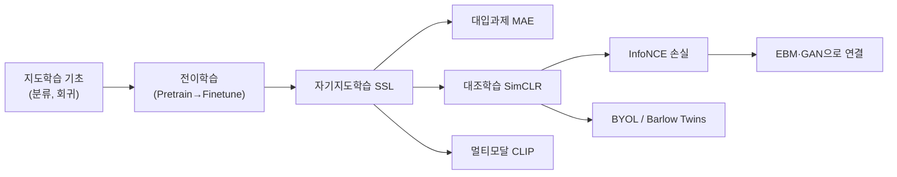

---

### 레벨 ① 초등: "혼자 공부하는 컴퓨터"

**비유**: 직소 퍼즐을 생각해 보자. 완성된 그림(정답)을 아무도 안 보여줬는데, 조각을 맞추다 보면 그림이 뭔지 저절로 알게 된다.

자기지도학습은 컴퓨터가 **스스로 퍼즐을 만들어서 푸는 것**이다.

세 가지 놀이:
1. **가리기 놀이 (MAE)**: 사진 75%를 가리고 "여기 뭐가 있었을까?" 맞추기
2. **변환 맞추기**: 사진을 돌려놓고 "몇 도 돌았는지" 맞추기
3. **짝꿍 찾기 (SimCLR)**: 같은 사진의 두 변형은 "같다!", 다른 사진은 "다르다!"

**SimCLR 쉽게**: 같은 강아지 사진을 하나는 밝게, 하나는 잘라서 만들었다. 컴퓨터에게 "이 둘은 같은 강아지!"라고 알려주고, 고양이 사진과는 "다르다!"라고 알려준다. 이렇게 반복하면 강아지가 뭔지 저절로 이해하게 된다.

**CLIP 쉽게**: 사진과 설명을 짝맞추기 하는 게임이다. "귀여운 강아지" 사진과 "귀여운 강아지"라는 글을 연결한다. 이렇게 배우면 처음 보는 동물도 설명만으로 찾을 수 있다.

**확인 퀴즈**: 자기지도학습은 선생님(라벨)이 없어도 된다. 그럼 도대체 뭘 보고 배울까?
→ 모범: 데이터 자체의 구조! 가린 부분, 돌린 각도, 짝꿍 관계 등을 정답으로 삼아 스스로 만든다.

---

### 레벨 ② 중등: "같은 것은 가깝게, 다른 것은 멀게"

**핵심 아이디어**: 컴퓨터가 사진을 "숫자 벡터"로 바꾼다고 하자. 같은 사진의 변형끼리는 벡터가 가깝고, 다른 사진끼리는 벡터가 멀어지도록 학습한다.

**거리 측정**: 두 벡터 $\mathbf{a}, \mathbf{b}$의 코사인 유사도:

$$\text{sim}(\mathbf{a}, \mathbf{b}) = \frac{\mathbf{a} \cdot \mathbf{b}}{|\mathbf{a}||\mathbf{b}|}$$

- 같은 방향이면 1, 수직이면 0, 반대 방향이면 -1

**숫자 예시**: $\mathbf{a} = (3, 4)$, $\mathbf{b} = (6, 8)$이면:
$$\text{sim} = \frac{3 \times 6 + 4 \times 8}{5 \times 10} = \frac{50}{50} = 1 \quad (\text{완전히 같은 방향})$$

$\mathbf{c} = (-3, 4)$이면:
$$\text{sim} = \frac{3 \times (-3) + 4 \times 4}{5 \times 5} = \frac{7}{25} = 0.28 \quad (\text{좀 다른 방향})$$

**SimCLR 과정**:
1. 원본 사진 하나를 두 가지로 변형 → $\mathbf{x}, \mathbf{x}'$
2. 인코더를 통과시켜 벡터로 변환 → $\mathbf{z}, \mathbf{z}'$
3. $\mathbf{z}$와 $\mathbf{z}'$는 가깝게, 다른 사진의 벡터와는 멀게 학습

**MAE**: 이미지를 패치(작은 조각)로 나누고 75%를 마스킹. 남은 25%만 보고 가려진 부분을 복원. 이미지는 중복이 많아서 75%나 가려야 진짜로 "이해"해야 풀 수 있다.

> **오개념 경고**: "자기지도학습은 라벨이 전혀 없다"는 틀렸다. 라벨이 **있다**. 다만 사람이 아니라 **알고리즘이 자동 생성**한다 (마스킹 위치, 짝꿍 관계 등).

**설명하기 훈련**: "SimCLR에서 왜 배치 크기가 클수록 좋을까?"
→ 모범답안: 배치 안의 다른 이미지들이 "다르다!"의 비교 대상(negative)이 된다. 비교 대상이 많을수록 더 정확하게 "같은 것"과 "다른 것"을 구별할 수 있다.

---

### 레벨 ③ 고등: "N-pair Loss와 Temperature"

**Triplet Loss**에서 출발하자. Anchor $x$, Positive $x^+$ (같은 것), Negative $x^-$ (다른 것):

$$\ell = \max(0, \; \|e - e^+\|^2 - \|e - e^-\|^2 + \epsilon)$$

- $\epsilon$: 마진. Positive가 Negative보다 최소 $\epsilon$만큼 가까워야 loss가 0.

**숫자 먼저**: anchor-positive 거리 = 0.3, anchor-negative 거리 = 0.5, $\epsilon = 0.2$:
$$\ell = \max(0, 0.3 - 0.5 + 0.2) = \max(0, 0) = 0 \quad \text{(이미 충분히 분리)}$$

anchor-negative 거리가 0.4이면:
$$\ell = \max(0, 0.3 - 0.4 + 0.2) = \max(0, 0.1) = 0.1 \quad \text{(마진 부족, loss 발생)}$$

**N-pair Loss (InfoNCE)**는 Triplet의 일반화이다. Negative를 하나가 아니라 $N$개와 동시에 비교:

$$\ell = -\log \frac{\exp(e^\top e^+)}{\exp(e^\top e^+) + \sum_{n=1}^{N} \exp(e^\top e_n^-)}$$

이것은 **softmax의 구조**와 같다. 분자는 positive 유사도, 분모는 positive + 모든 negative 유사도의 합.

**Temperature $\tau$의 역할**: 유사도를 $\tau$로 나눈다.

$$\ell = -\log \frac{\exp(\text{sim}/\tau)}{\sum_k \exp(\text{sim}_k/\tau)}$$

| $\tau$ 값 | 효과 | 비유 |
|-----------|------|------|
| 작다 (0.1) | softmax가 뾰족해짐 → hard negative에 집중 | 돋보기로 세밀하게 |
| 크다 (1.0) | softmax가 완만 → 모든 negative 균등 처리 | 넓게 바라보기 |

**Barlow Twins** — negative 없이 학습:
교차상관행렬 $C = \bar{r}^\top \bar{r}' / N$을 단위행렬로 만든다:
$$\mathcal{L} = \sum_i (1 - C_{ii})^2 + \lambda \sum_{i \neq j} C_{ij}^2$$

- 대각: 같은 차원은 일치시키기 (invariance)
- 비대각: 서로 다른 차원은 독립시키기 (redundancy reduction)

> **오개념 경고**: Barlow Twins는 대조학습(contrastive learning)이 **아니다**. Negative 쌍을 사용하지 않는 **non-contrastive** 방법이다.

**CLIP 수학**:
배치 내 $N$개의 (이미지, 텍스트) 쌍에서 유사도 행렬 $L_{ij} = \cos(I_i, T_j)$를 만들고:
$$\mathcal{L} = \sum_i -\log \text{softmax}(L_{i,:})_i + \sum_j -\log \text{softmax}(L_{:,j})_j$$

대각선(올바른 쌍)의 유사도를 최대화하는 **대칭 cross-entropy**.

**수학 → DL 연결**: N-pair loss를 Taylor 전개하면 **alignment**(positive 유사도 최대화) + **uniformity**(임베딩 균일 분포) + variance 항으로 분해된다 (Wang & Isola, 2020). 이것이 SSL의 이론적 기반이다.

---

### 레벨 ④ 대학 + Python 코드

**SimCLR의 핵심 수식 전체**:

같은 이미지 $x_0$에서 두 변환 $t, t'$:
$$x = t(x_0), \quad x' = t'(x_0)$$
$$h = f_{\text{enc}}(x), \quad h' = f_{\text{enc}}(x')$$
$$z = g_{\text{proj}}(h), \quad z' = g_{\text{proj}}(h')$$

Agreement:
$$\text{agree}_{i,j} = \frac{\exp(\text{sim}(z_i, z_j)/\tau)}{\sum_{k=1}^{2N} \mathbf{1}(k \neq i) \exp(\text{sim}(z_i, z_k)/\tau)}$$

손실:
$$\mathcal{L} = \frac{1}{2N}\sum_{k=1}^{N}[\ell_{2k-1,2k} + \ell_{2k,2k-1}], \quad \ell_{i,j} = -\log \text{agree}_{i,j}$$

**Reparameterization-free collapse 방지 전략 비교**:

| 방법 | Collapse 방지 전략 |
|------|-------------------|
| SimCLR | Negative repulsion (대조) |
| BYOL | Asymmetric architecture (predictor + stop-gradient) |
| Barlow Twins | Feature decorrelation (교차상관 → 단위행렬) |
| SwAV | Clustering 균등화 (Sinkhorn) |
| DINOv2 | Self-distillation (EMA teacher) |

```python
import torch
import torch.nn.functional as F

def simclr_loss(z1: torch.Tensor, z2: torch.Tensor, tau: float = 0.5) -> torch.Tensor:
    """
    SimCLR NT-Xent 손실 함수
    z1, z2: [B, D] — 같은 이미지의 두 augmentation의 projection 벡터
    tau: temperature
    """
    B = z1.size(0)
    # 정규화
    z1 = F.normalize(z1, dim=1)  # [B, D]
    z2 = F.normalize(z2, dim=1)  # [B, D]

    # 전체 벡터 결합: [2B, D]
    z = torch.cat([z1, z2], dim=0)

    # 유사도 행렬: [2B, 2B]
    sim = z @ z.T / tau

    # 자기 자신과의 유사도를 제거 (대각선을 -inf로)
    mask = torch.eye(2 * B, device=z.device).bool()
    sim.masked_fill_(mask, float('-inf'))

    # 각 i에 대해 positive는 i+B (또는 i-B)
    # 레이블: z1[i]의 positive는 z2[i] = z[i+B]
    labels = torch.cat([
        torch.arange(B, 2 * B),
        torch.arange(0, B)
    ], dim=0).to(z.device)

    loss = F.cross_entropy(sim, labels)
    return loss

# 사용 예시
B, D = 256, 128
z1 = torch.randn(B, D)
z2 = torch.randn(B, D)
loss = simclr_loss(z1, z2, tau=0.1)
print(f"SimCLR Loss: {loss.item():.4f}")
```

```python
def barlow_twins_loss(z1: torch.Tensor, z2: torch.Tensor, lambd: float = 5e-3) -> torch.Tensor:
    """
    Barlow Twins 손실 함수
    z1, z2: [B, D] — 같은 이미지의 두 augmentation의 projection 벡터
    """
    B, D = z1.shape

    # 배치 정규화 (평균 0, 표준편차 1)
    z1_norm = (z1 - z1.mean(dim=0)) / (z1.std(dim=0) + 1e-6)
    z2_norm = (z2 - z2.mean(dim=0)) / (z2.std(dim=0) + 1e-6)

    # 교차상관행렬: [D, D]
    C = (z1_norm.T @ z2_norm) / B

    # Invariance: 대각 → 1
    on_diag = ((1 - C.diagonal()) ** 2).sum()
    # Redundancy reduction: 비대각 → 0
    off_diag = (C.fill_diagonal_(0) ** 2).sum()

    loss = on_diag + lambd * off_diag
    return loss
```

---

### 레벨 ⑤ 대학원 + 논문

**Alignment & Uniformity 분해 (Wang & Isola, 2020)**:

N-pair loss를 Taylor 전개하면:
$$\mathcal{L}_{\text{contrastive}} \approx \underbrace{-\mathbb{E}_{(x,x^+)}[f(x)^\top f(x^+)]}_{\text{alignment}} + \underbrace{\log \mathbb{E}_{x,x' \sim p}[\exp(f(x)^\top f(x'))]}_{\text{uniformity}}$$

- **Alignment**: positive 쌍의 특징을 정렬
- **Uniformity**: 전체 특징을 초구면에 균일 분포

**BYOL의 이론적 미스터리**: Negative 없이 왜 collapse하지 않는가?
- Tian et al. (2021) 분석: BatchNorm이 implicit negative repulsion을 제공
- Richemond et al. (2020): BN 제거 시 collapse 발생
- 최근 이해: predictor + stop-gradient가 spectral contraction을 유도하여 non-trivial fixed point로 수렴

**MAML과 SSL의 연결**:
$$\theta_j' = \theta - \alpha \nabla_\theta L_j(\theta) \quad \text{(내부 루프)}$$
$$\theta \leftarrow \theta - \beta \nabla_\theta \frac{1}{J}\sum_j L_j(\theta_j') \quad \text{(외부 루프)}$$

외부 루프의 gradient는 **이중 미분**을 요구: $\nabla_\theta L_j(\theta - \alpha \nabla_\theta L_j(\theta))$. 이것은 Hessian-vector product로 효율적 계산 가능.

**핵심 논문 체인**: SimCLR (Chen 2020) → MoCo v2 (He 2020) → BYOL (Grill 2020) → Barlow Twins (Zbontar 2021) → VICReg (Bardes 2022) → DINOv2 (Oquab 2023)

**성취 확인**: SimCLR의 projection head를 제거하면 downstream 성능이 왜 떨어지는가?
→ Projection head $g$가 augmentation-specific 정보(색상, 크기 등)를 흡수하므로, 인코더 출력 $h$에는 semantic 정보가 더 잘 보존된다. $z = g(h)$에서 contrastive loss를 계산하면 $h$가 augmentation-invariant하면서도 task-relevant한 정보를 유지한다.

**설명하기 훈련 (대학원)**: "BYOL이 negative 없이 collapse하지 않는 이유를 3가지 관점에서 설명하라."
→ 모범답안:
1. **Architectural asymmetry**: predictor가 online network에만 있고, target은 EMA로 천천히 업데이트되므로 trivial solution(모든 출력 동일)이 불안정한 고정점이 됨
2. **Implicit regularization**: BatchNorm이 배치 내 통계를 통해 암묵적 negative repulsion 제공. BN 제거 시 collapse 관찰됨 (Richemond et al., 2020)
3. **Spectral analysis**: stop-gradient + predictor 조합이 covariance matrix의 고유값에 대해 contraction mapping을 유도하여 non-trivial fixed point로 수렴 (Tian et al., 2021)

**실전 사례 연결**:
- **의료 영상**: SimCLR로 라벨 없는 10만 장의 X-ray 사전학습 → 50장 fine-tuning → 정확도 60%→85%
- **제품 검색**: CLIP으로 "빨간색 운동화"같은 텍스트 쿼리로 이미지 검색 (zero-shot)
- **산업 결함**: Barlow Twins로 정상 이미지만으로 사전학습 → 소수 결함 이미지로 분류기 학습

---

# PART 2: 대조학습과 InfoNCE {#part2}

## 동기부여

> "비슷한 것은 가깝게, 다른 것은 멀게" — 이 단순한 원리가 현대 AI의 핵심 학습 신호가 되었다. 대조학습의 손실 함수 InfoNCE는 SimCLR, CLIP, MoCo 등 모든 대조학습의 공통 언어이다.

## 선행개념 맵

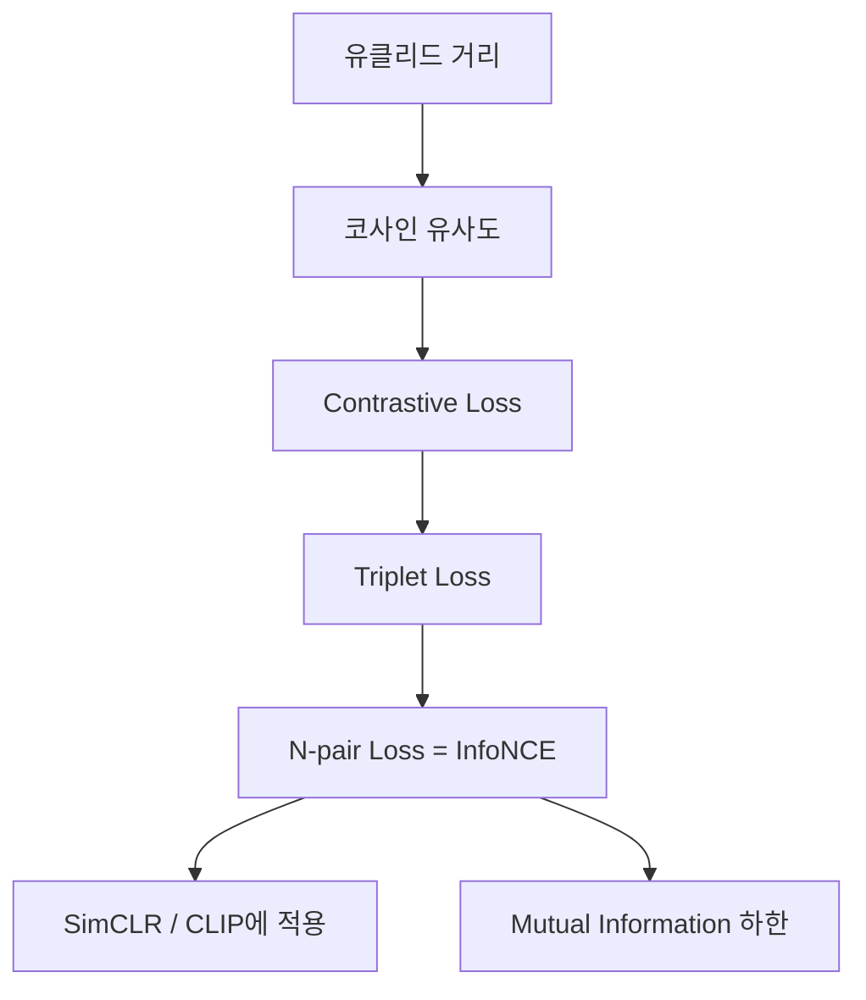

---

### 레벨 ① 초등

**비유**: 학교에서 "나와 닮은 친구"를 찾는 게임.

선생님이 사진 10장을 보여주고, "이 중에서 너랑 가장 닮은 사진은?" 하고 물으면, 나와 닮은 사진을 고르고 나머지는 "아니야"라고 한다.

대조학습은 이 게임을 수십억 번 반복하는 것이다!

---

### 레벨 ② 중등

**거리 메트릭 학습**: 임베딩 $e = f(x)$를 이용해 의미적 거리를 정의:

$$d(x, x') = \left\|\frac{e}{\|e\|} - \frac{e'\|}{\|e'\|}\right\|^2 = 2 - 2\cos(e, e')$$

정규화 벡터의 유클리드 거리 = 코사인 유사도의 단조 변환.

**Contrastive Loss** (Chopra et al., 2005):
$$\ell = \begin{cases} \|e-e'\|^2 & \text{같은 클래스} \\ \max(0, \epsilon - \|e-e'\|^2) & \text{다른 클래스} \end{cases}$$

같은 것은 당기고, 다른 것은 마진 $\epsilon$ 이상으로 밀어낸다.

---

### 레벨 ③ 고등

**InfoNCE의 정보이론적 해석**:

$$\mathcal{L}_{\text{InfoNCE}} = -\mathbb{E}\left[\log \frac{\exp(f(x)^\top f(x^+)/\tau)}{\sum_{k} \exp(f(x)^\top f(x_k)/\tau)}\right]$$

이것은 $x$와 $x^+$ 사이의 **상호정보량(Mutual Information)**의 하한이다:

$$I(X; X^+) \geq \log N - \mathcal{L}_{\text{InfoNCE}}$$

$N$이 클수록(negative가 많을수록) 하한이 타이트해진다.

**$N=1$일 때의 Triplet과의 관계**:
InfoNCE → $-\log \sigma(e^\top e^+ - e^\top e^-)$ = $\text{softplus}(\delta)$ where $\delta = e^\top e^- - e^\top e^+$.
Triplet → $\text{ReLU}(\delta + \epsilon)$.
InfoNCE는 Triplet의 **smooth 버전**이다.

> **오개념 경고**: "Triplet loss와 InfoNCE는 완전히 다른 것" — 아니다. InfoNCE에서 $N=1$이면 Triplet의 smooth 일반화가 된다.

---

### 레벨 ④ 대학 + Python 코드

```python
def info_nce_loss(query: torch.Tensor, positive: torch.Tensor,
                  negatives: torch.Tensor, tau: float = 0.07) -> torch.Tensor:
    """
    InfoNCE 손실
    query: [B, D]
    positive: [B, D]
    negatives: [B, N, D] — N개의 negative
    """
    query = F.normalize(query, dim=-1)
    positive = F.normalize(positive, dim=-1)
    negatives = F.normalize(negatives, dim=-1)

    # positive score: [B, 1]
    pos_score = (query * positive).sum(dim=-1, keepdim=True) / tau

    # negative scores: [B, N]
    neg_score = torch.bmm(negatives, query.unsqueeze(-1)).squeeze(-1) / tau

    # logits: [B, 1+N], 첫 번째가 positive
    logits = torch.cat([pos_score, neg_score], dim=-1)
    labels = torch.zeros(query.size(0), dtype=torch.long, device=query.device)

    return F.cross_entropy(logits, labels)
```

---

### 레벨 ⑤ 대학원 + 논문

**Tight bound 분석**: InfoNCE의 MI 하한은 $\log N$에 의해 상한이 제한된다 (Poole et al., 2019). 이는 배치 크기 $N$이 작으면 높은 MI를 추정할 수 없다는 한계.

**Hard negative mining**: 학습 후반에는 대부분의 negative가 쉬워져 gradient 신호가 약해진다. MoCo의 momentum queue, NNCLR의 nearest-neighbor 전략이 이를 해결.

**성취 확인**: InfoNCE가 $\log N$으로 상한이 제한되는 것이 왜 문제인가?
→ 실제 MI가 $\log N$보다 크면 InfoNCE로는 정확한 추정이 불가능. 배치 크기가 MI 추정의 해상도를 결정한다.

**설명하기 훈련 (고등)**: "InfoNCE에서 temperature $\tau$를 0에 가깝게 하면 어떻게 되는가?"
→ 모범답안: $\tau \to 0$이면 softmax가 argmax에 수렴. 가장 유사한 negative 하나에만 gradient가 집중된다 (hard negative mining과 유사). 학습이 불안정해질 수 있지만, 어려운 negative에 집중하므로 표현의 구분력이 올라간다. 반대로 $\tau \to \infty$이면 모든 negative를 균등하게 처리하여 학습 신호가 약해진다. 실전에서는 $\tau = 0.07 \sim 0.5$ 사이에서 탐색.

**설명하기 훈련 (대학)**: "MoCo의 momentum queue가 SimCLR의 대형 배치를 대체하는 원리는?"
→ 모범답안: SimCLR은 현재 배치 내의 다른 이미지들을 negative로 사용하므로 배치 크기 = negative 수. MoCo는 이전 배치들의 인코더 출력을 **큐(queue)**에 저장하여 negative pool을 유지한다. 인코더가 업데이트되면 큐의 표현과 불일치가 생기는데, **momentum encoder** (현재 인코더의 EMA)로 느리게 업데이트하여 일관성을 유지. 결과적으로 작은 배치로도 65536개의 negative를 사용 가능.

---

# PART 3: 에너지 기반 모델 (EBM) {#part3}

## 동기부여

> 확률 분포를 직접 정의하기는 어렵다. 하지만 "이 데이터가 얼마나 그럴듯한지"를 점수로 매기는 것은 쉽다. EBM은 이 점수(에너지)로 확률 분포를 정의한다. 그리고 이 에너지의 기울기(score function)가 바로 확산모델의 핵심 열쇠이다.

## 선행개념 맵

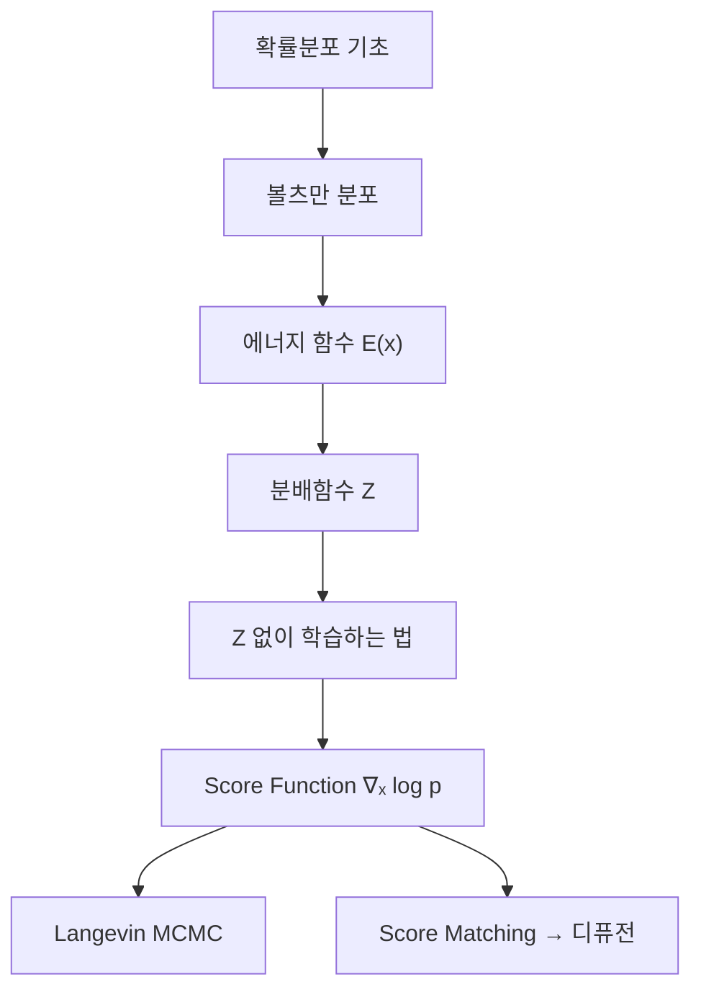

---

### 레벨 ① 초등: "에너지 지도"

산과 골짜기가 있는 지도를 상상해 보자.
- **골짜기**(에너지 낮은 곳) = 진짜 사진들이 모여 있는 곳
- **산꼭대기**(에너지 높은 곳) = 이상한 사진들이 있는 곳

AI가 이 지도를 잘 만들면, 골짜기를 따라가면서 진짜 같은 새 사진을 찾을 수 있다.

**스코어 함수**: 눈을 감고 산에서 내려가야 할 때, 발밑의 경사가 "이쪽이 내리막"이라고 알려준다. 이것이 스코어 함수다 — 확률이 높아지는 방향을 알려주는 나침반.

**확인 퀴즈**: 에너지가 높은 곳에 있는 데이터는 어떤 데이터일까?
→ 모범: 이상한 데이터, 현실에 없는 데이터! 진짜 데이터는 에너지가 낮은 골짜기에 모여 있다.

---

### 레벨 ② 중등: "에너지가 낮으면 확률이 높다"

물리학의 볼츠만 분포에서 영감:

$$p(x) = \frac{e^{-E(x)}}{Z}$$

- $E(x)$: 에너지 함수 (신경망이 계산)
- $Z = \sum_{\text{모든 } x} e^{-E(x)}$: 분배함수 (합이 1이 되게 하는 상수)

**숫자 예시**: 세 가지 상태의 에너지가 $E_A=1, E_B=2, E_C=5$이면:

$$Z = e^{-1} + e^{-2} + e^{-5} = 0.368 + 0.135 + 0.007 = 0.510$$

$$p(A) = \frac{0.368}{0.510} = 0.72, \quad p(B) = 0.26, \quad p(C) = 0.01$$

에너지가 가장 낮은 A의 확률이 가장 높다!

---

### 레벨 ③ 고등: "분배함수 없이 학습하기"

**문제**: $Z = \int e^{-E_\theta(x)} dx$는 고차원에서 계산 불가능.

**핵심 통찰**: 학습(gradient 계산)에는 $Z$의 **값**이 필요 없다. $Z$의 **미분**만 필요하고, 이것은 샘플로 추정 가능:

$$\nabla_\theta \log Z_\theta = -\mathbb{E}_{x \sim p_\theta}[\nabla_\theta E_\theta(x)]$$

따라서 MLE의 gradient는:
$$-\nabla_\theta \ell = -\underbrace{\mathbb{E}_{x \sim p_{\text{data}}}[\nabla_\theta E_\theta(x)]}_{\text{실제 데이터 에너지 ↓}} + \underbrace{\mathbb{E}_{x \sim p_\theta}[\nabla_\theta E_\theta(x)]}_{\text{모델 샘플 에너지 ↑}}$$

**수식 전 해석**: "실제 데이터의 골짜기는 더 깊게 파고, 모델이 만든 가짜 데이터의 골짜기는 메운다."

**Score Function** — $Z$가 완전히 사라지는 마법:
$$s(x) = \nabla_x \log p(x) = -\nabla_x E(x) - \underbrace{\nabla_x \log Z}_{=0 \text{ (x와 무관)}} = -\nabla_x E(x)$$

> **오개념 경고**: "EBM에서 $Z$를 직접 계산해야 한다" — 아니다! Gradient에는 $p_\theta$에서의 **샘플**만 필요하고, score function에서는 $Z$가 완전히 사라진다.

**Langevin MCMC**: score를 이용한 샘플링:
$$x_{t+1} = x_t + \eta \cdot s(x_t) + \sqrt{2\eta} \cdot \epsilon, \quad \epsilon \sim \mathcal{N}(0, I)$$

- 첫째 항: 확률 높은 곳으로 이동 (결정적)
- 둘째 항: 탐색을 위한 노이즈 (확률적)

---

### 레벨 ④ 대학 + Python 코드

**$\nabla_\theta \log Z_\theta$ 유도**:

$$\nabla_\theta \log Z_\theta = \frac{\nabla_\theta Z_\theta}{Z_\theta} = \frac{\int \nabla_\theta e^{-E_\theta(x)} dx}{Z_\theta} = \frac{\int e^{-E_\theta(x)}(-\nabla_\theta E_\theta(x)) dx}{Z_\theta}$$
$$= -\int \frac{e^{-E_\theta(x)}}{Z_\theta} \nabla_\theta E_\theta(x) \, dx = -\mathbb{E}_{x \sim p_\theta}[\nabla_\theta E_\theta(x)]$$

```python
import torch
import torch.nn as nn

class SimpleEBM(nn.Module):
    """간단한 에너지 기반 모델"""
    def __init__(self, input_dim: int = 2, hidden_dim: int = 128):
        super().__init__()
        self.net = nn.Sequential(
            nn.Linear(input_dim, hidden_dim),
            nn.SiLU(),
            nn.Linear(hidden_dim, hidden_dim),
            nn.SiLU(),
            nn.Linear(hidden_dim, 1)  # 에너지 스칼라 출력
        )

    def energy(self, x: torch.Tensor) -> torch.Tensor:
        return self.net(x).squeeze(-1)

    def score(self, x: torch.Tensor) -> torch.Tensor:
        """Score function: -∇_x E(x)"""
        x = x.requires_grad_(True)
        E = self.energy(x)
        grad = torch.autograd.grad(E.sum(), x, create_graph=True)[0]
        return -grad  # score = -∇E


def langevin_sample(model: SimpleEBM, n_samples: int = 500,
                    n_steps: int = 100, step_size: float = 0.01,
                    dim: int = 2) -> torch.Tensor:
    """Langevin MCMC 샘플링"""
    x = torch.randn(n_samples, dim)  # 랜덤 초기화
    for _ in range(n_steps):
        x = x.detach().requires_grad_(True)
        score = model.score(x)
        noise = torch.randn_like(x)
        x = x + step_size * score + (2 * step_size) ** 0.5 * noise
    return x.detach()
```

---

### 레벨 ⑤ 대학원 + 논문

**Contrastive Divergence (CD-k, Hinton 2002)**: $p_\theta$에서 정확히 샘플링하는 대신, $k$번의 MCMC step만 수행. $k=1$이 실용적이지만, gradient 추정이 편향됨.

**Persistent CD**: 이전 배치의 MCMC 체인을 이어서 사용. mixing time 문제를 완화.

**EBM과 Score Matching의 연결**: score $s_\theta(x) = -\nabla_x E_\theta(x)$를 직접 학습하면 $Z_\theta$뿐 아니라 $p_\theta$에서의 샘플링도 불필요 → Score Matching (Hyvarinen, 2005).

**핵심 논문**: "A Tutorial on Energy-Based Learning" (LeCun et al., 2006), "How to Train Your Energy-Based Models" (Song & Kingma, 2021)

**설명하기 훈련 (고등)**: "Langevin MCMC에서 노이즈 항 $\sqrt{2\eta}\epsilon$이 왜 필요한가? 빼면 어떻게 되는가?"
→ 모범답안: 노이즈 없이 score만 따라가면 가장 가까운 mode(골짜기)에만 수렴한다. 노이즈가 있어야 **다양한 mode를 탐색**할 수 있고, 이론적으로 $p_\theta(x)$에서의 정확한 샘플링이 보장된다. 노이즈를 빼면 gradient descent로 에너지 최소점만 찾는 것이 되어 다양성이 사라진다.

**설명하기 훈련 (대학)**: "EBM의 MLE gradient에서 두 번째 항 $\mathbb{E}_{p_\theta}[\nabla_\theta E_\theta]$를 직관적으로 해석하라."
→ 모범답안: 모델이 현재 "그럴듯하다"고 생각하는 영역(모델 샘플)의 에너지를 **올리는** 방향. 실제 데이터 영역의 에너지는 내리고, 모델이 잘못 높은 확률을 부여한 영역의 에너지는 올린다. "진짜는 더 좋게, 가짜는 더 나쁘게" — GAN의 판별자와 동일한 직관.

---

# PART 4: GAN — f-divergence, WGAN {#part4}

## 동기부여

> "위조범과 경찰의 게임"으로 유명한 GAN은 2014년 등장 이후 이미지 생성의 혁명을 이끌었다. 하지만 학습이 불안정하고 mode collapse가 심각했다. WGAN은 "왜 불안정한가"에 대한 수학적 답(f-divergence의 한계)을 제시하고 Wasserstein 거리로 해결했다.

## 선행개념 맵

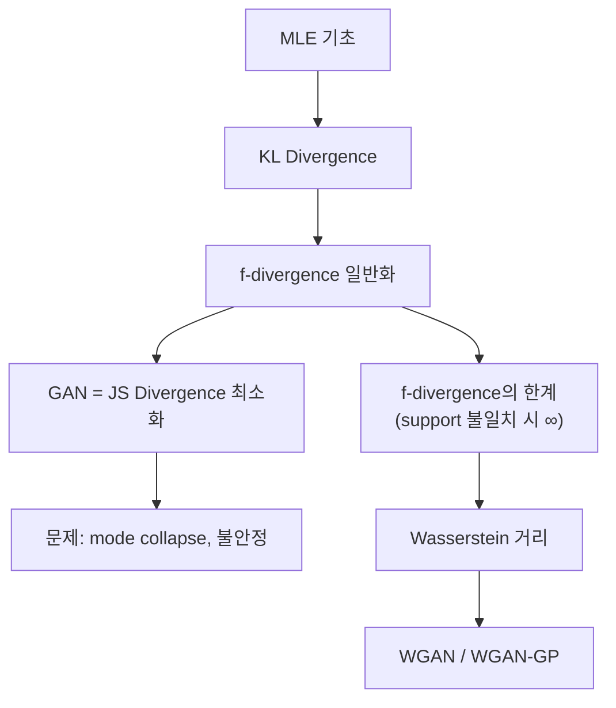

---

### 레벨 ① 초등: "위조범과 경찰"

- **위조범(생성자)**: 가짜 그림을 만든다
- **경찰(판별자)**: 진짜인지 가짜인지 판별한다
- 위조범은 경찰을 속이려 하고, 경찰은 안 속으려 한다
- 이 대결을 반복하면 위조범은 진짜와 구별 불가능한 그림을 만들게 된다!

**확인 퀴즈**: GAN에서 학습이 완벽하게 끝나면 판별자의 정답률은 몇 %일까?
→ 모범: 50%! 생성자가 완벽하면 진짜와 가짜를 구별할 수 없으니 찍는 것과 같다.

---

### 레벨 ② 중등: "Minimax 게임"

$$\min_G \max_D \left[\mathbb{E}_{x \sim p_{\text{data}}}[\log D(x)] + \mathbb{E}_{z \sim \mathcal{N}(0,I)}[\log(1 - D(G(z)))]\right]$$

**판별자 D가 하는 일** ($\max_D$):
- 진짜 데이터 $x$에 대해 $D(x) \to 1$ (높은 $\log D(x)$)
- 가짜 데이터 $G(z)$에 대해 $D(G(z)) \to 0$ (높은 $\log(1-D(G(z)))$)

**생성자 G가 하는 일** ($\min_G$):
- $D(G(z)) \to 1$로 만들어 경찰을 속이기 (낮은 $\log(1-D(G(z)))$)

**숫자 예시**: $D(\text{real}) = 0.9$, $D(\text{fake}) = 0.3$:
$$V = \log 0.9 + \log(1-0.3) = -0.105 + (-0.357) = -0.462$$

$D(\text{fake})$가 0.1이 되면:
$$V = \log 0.9 + \log 0.9 = -0.210 \quad \text{(판별자에게 더 좋음)}$$

---

### 레벨 ③ 고등: "f-divergence와 WGAN"

**GAN의 이론적 의미**: 최적 판별자 하에서 GAN의 생성자 목적함수는 **Jensen-Shannon Divergence** 최소화와 동치:

$$\text{JSD}(p \| q) = \frac{1}{2}\text{KL}(p \| m) + \frac{1}{2}\text{KL}(q \| m), \quad m = \frac{p+q}{2}$$

**f-divergence의 한계**: $D_f(p \| q) = \int q(x) f(p(x)/q(x)) dx$

두 분포의 support가 겹치지 않으면:
- KL → $\infty$ (발산!)
- TV → 0 또는 1 (불연속 점프!)
- **gradient가 사라지거나 폭발** → 학습 불안정

**Wasserstein 거리 (Earth Mover's Distance)**:

$$W(P, Q) = \sup_{\|f\|_L \leq 1} \left[\mathbb{E}_{x \sim P}[f(x)] - \mathbb{E}_{x \sim Q}[f(x)]\right]$$

**핵심 비교** — 분포 $P_\theta$가 직선 위 균일분포, 목표 $P_0$이 $\theta=0$:

| 거리 | $\theta=0$ | $\theta \neq 0$ | 연속? |
|------|-----------|-----------------|------|
| KL | 0 | $\infty$ | X |
| TV | 0 | 1 | X |
| **Wasserstein** | 0 | $|\theta|$ | **O** |

Wasserstein만이 $\theta$에 대해 유의미한 gradient를 준다!

> **오개념 경고**: "KL divergence와 Wasserstein 거리는 교체 가능하다" — 근본적으로 다르다. KL은 support 불일치 시 무한대, Wasserstein은 항상 연속.

**WGAN 목적함수**:
$$\max_\phi \left[\mathbb{E}_{x \sim p_{\text{data}}}[f_\phi(x)] - \mathbb{E}_{z}[f_\phi(G_\theta(z))]\right] \quad \text{s.t.} \; \|f_\phi\|_L \leq 1$$

판별자 → **critic** (확률이 아닌 스코어 출력). Lipschitz 제약은 gradient penalty로 구현.

---

### 레벨 ④ 대학 + Python 코드

**최적 판별자 유도**:
$$D^*(x) = \frac{p_{\text{data}}(x)}{p_{\text{data}}(x) + p_G(x)}$$

이를 GAN 목적함수에 대입하면:
$$V(G, D^*) = 2\text{JSD}(p_{\text{data}} \| p_G) - \log 4$$

```python
import torch
import torch.nn as nn

class Generator(nn.Module):
    def __init__(self, z_dim: int = 64, out_dim: int = 2):
        super().__init__()
        self.net = nn.Sequential(
            nn.Linear(z_dim, 128), nn.ReLU(),
            nn.Linear(128, 128), nn.ReLU(),
            nn.Linear(128, out_dim)
        )

    def forward(self, z):
        return self.net(z)


class Critic(nn.Module):
    """WGAN의 critic (판별자가 아님!)"""
    def __init__(self, in_dim: int = 2):
        super().__init__()
        self.net = nn.Sequential(
            nn.Linear(in_dim, 128), nn.ReLU(),
            nn.Linear(128, 128), nn.ReLU(),
            nn.Linear(128, 1)  # 확률이 아닌 스코어
        )

    def forward(self, x):
        return self.net(x).squeeze(-1)


def wgan_gp_loss(critic, real, fake, lambda_gp: float = 10.0):
    """WGAN-GP 손실 (Gradient Penalty 포함)"""
    # Critic loss: maximize E[f(real)] - E[f(fake)]
    critic_real = critic(real).mean()
    critic_fake = critic(fake).mean()
    wasserstein_dist = critic_real - critic_fake

    # Gradient Penalty
    alpha = torch.rand(real.size(0), 1, device=real.device)
    interpolated = (alpha * real + (1 - alpha) * fake).requires_grad_(True)
    d_interpolated = critic(interpolated)

    gradients = torch.autograd.grad(
        outputs=d_interpolated, inputs=interpolated,
        grad_outputs=torch.ones_like(d_interpolated),
        create_graph=True, retain_graph=True
    )[0]

    grad_norm = gradients.norm(2, dim=1)
    gp = ((grad_norm - 1) ** 2).mean()

    critic_loss = -wasserstein_dist + lambda_gp * gp
    gen_loss = -critic_fake  # 생성자: critic score 최대화

    return critic_loss, gen_loss, wasserstein_dist.item()
```

---

### 레벨 ⑤ 대학원 + 논문

**f-GAN (Nowozin et al., 2016)**: 임의의 f-divergence를 GAN 프레임워크로 최적화. Fenchel conjugate $f^*$를 이용:
$$D_f(P \| Q) = \sup_T \left[\mathbb{E}_P[T(x)] - \mathbb{E}_Q[f^*(T(x))]\right]$$

**Spectral Normalization (Miyato et al., 2018)**: Lipschitz 상수를 각 층의 spectral norm으로 직접 제어. WGAN-GP보다 효율적.

**Mode Collapse 문제**: GAN은 분포의 모든 mode를 커버하지 못하고 일부에만 집중. Wasserstein 거리가 이를 완화하지만 완전히 해결하지는 못함. Diffusion model이 mode coverage에서 우월한 이유.

**성취 확인**: GAN의 최적 판별자를 EBM의 에너지 함수로 해석하면? $D^*(x) = \sigma(-E(x))$ 형태로, GAN의 판별자 학습은 암묵적으로 에너지 함수를 학습하는 것과 같다.

**설명하기 훈련 (중등)**: "GAN에서 mode collapse란 무엇이고 왜 발생하는가?"
→ 모범답안: 생성자가 다양한 이미지를 만들지 못하고 **몇 가지 패턴만 반복**하는 현상. 판별자를 속이기 가장 쉬운 소수의 이미지만 생성하면 되기 때문. 예: 얼굴 생성 시 한 가지 얼굴만 계속 만듦. Wasserstein 거리가 이를 완화하는 이유는, 분포 간 "운반 비용"을 측정하므로 다양한 mode를 커버하도록 유도하기 때문.

**설명하기 훈련 (고등)**: "WGAN에서 critic이 sigmoid 출력을 쓰지 않는 이유는?"
→ 모범답안: GAN의 판별자는 $D(x) \in [0, 1]$로 확률을 출력하지만, WGAN의 critic은 **스코어(실수 값)**를 출력한다. Wasserstein 거리의 Kantorovich-Rubinstein 쌍대 표현에서 $f$는 1-Lipschitz 연속 함수이지 확률이 아니다. sigmoid는 출력 범위를 [0,1]로 제한하여 Lipschitz 함수의 표현력을 불필요하게 제약한다.

**생성모델 Trade-off 요약**:
| 상황 | 추천 모델 | 이유 |
|------|---------|------|
| 빠른 고품질 이미지 | GAN | 한 번의 forward pass로 생성 |
| 잠재 공간 탐색 | VAE | 구조화된 잠재 공간 |
| 밀도 추정 필요 | Flow | 정확한 $\log p(x)$ |
| 최고 품질 + 다양성 | Diffusion | 현재 SOTA |

---

# PART 5: VAE — ELBO, Reparameterization Trick {#part5}

## 동기부여

> VAE는 "압축 복원기"이자 확률적 생성모델이다. 데이터를 잠재 코드로 압축하고 다시 복원하는데, 핵심은 잠재 공간이 **구조화**되어 있어서 새로운 데이터를 생성할 수 있다는 것이다. VAE의 ELBO는 확산모델 ELBO의 출발점이며, Reparameterization Trick은 현대 DL에서 미분 가능 샘플링의 표준이다.

## 선행개념 맵

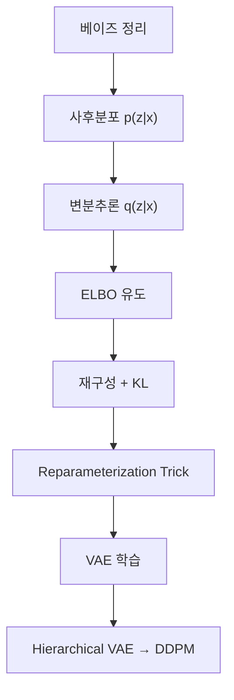

---

### 레벨 ① 초등: "압축 복원기"

그림을 아주 작은 번호(잠재 코드)로 줄였다가, 그 번호로 다시 그림을 만드는 기계. 아무 번호를 넣어도 새로운 그림이 나온다!

**확인 퀴즈**: VAE와 GAN의 가장 큰 차이는 뭘까?
→ 모범: VAE는 "압축했다 복원"이고 GAN은 "위조범과 경찰의 대결". VAE는 확률 계산이 가능하지만(ELBO), GAN은 불가능.

---

### 레벨 ② 중등

VAE는 두 부분:
1. **인코더** $q_\phi(z|x)$: 입력 $x$ → 잠재 변수 $z$의 분포 (평균 $\mu$, 분산 $\sigma^2$)
2. **디코더** $p_\theta(x|z)$: 잠재 변수 $z$ → 복원된 $x$

**왜 "분포"를 출력하나?** 하나의 점이 아니라 "이 근처 어딘가"라고 출력해야 잠재 공간이 빈 곳 없이 꽉 차서 새로운 데이터를 생성할 수 있다.

**손실 = 재구성 오차 + KL 정규화**:
$$\mathcal{L} = \underbrace{\|x - \hat{x}\|^2}_{\text{잘 복원하라}} + \underbrace{\text{KL}(q(z|x) \| \mathcal{N}(0,I))}_{\text{잠재공간을 정규분포에 가깝게}}$$

---

### 레벨 ③ 고등: "ELBO 유도"

**Jensen's Inequality로 유도**:
$$-\log p(x) = -\log \int p(x,z) dz = -\log \mathbb{E}_{z \sim q}\left[\frac{p(x,z)}{q(z|x)}\right] \leq \mathbb{E}_{z \sim q}\left[-\log \frac{p(x,z)}{q(z|x)}\right]$$

정리하면:
$$-\text{ELBO} = \underbrace{\mathbb{E}_q[-\log p_\theta(x|z)]}_{\text{재구성 오차}} + \underbrace{\text{KL}(q_\phi(z|x) \| p(z))}_{\text{정규화}}$$

**등호 조건**: $q_\phi(z|x) = p(z|x)$일 때. 실제로는:
$$\log p(x) = \text{ELBO} + \text{KL}(q_\phi(z|x) \| p(z|x)) \geq \text{ELBO}$$

**KL의 닫힌 형태** ($q = \mathcal{N}(\mu, \text{diag}(\sigma^2))$, $p = \mathcal{N}(0,I)$):
$$\text{KL} = \frac{1}{2}\left[-2\sum_j \log \sigma_j + \|\sigma\|^2 + \|\mu\|^2 - D\right]$$

**숫자 예시**: $D=2$, $\mu=[0.5, -0.3]$, $\sigma=[1.2, 0.8]$:
$$\text{KL} = \frac{1}{2}[-2(\ln 1.2 + \ln 0.8) + (1.44+0.64) + (0.25+0.09) - 2] = 0.251$$

**Reparameterization Trick**:
$$z = \mu + \sigma \odot \varepsilon, \quad \varepsilon \sim \mathcal{N}(0,I)$$

**왜 필수?** $z \sim q_\phi(z|x)$에서 직접 샘플링하면 $\phi$에 대한 gradient를 못 구한다 (샘플링은 미분 불가). $z = \mu + \sigma \odot \varepsilon$로 바꾸면 $z$가 $\phi$의 결정적 함수가 되어 역전파 가능!

> **오개념 경고**: "KL 항은 불필요한 제약이다" — 아니다. KL 없이는 잠재공간이 구조화되지 않아 새로운 샘플 생성이 불가능. KL은 잠재공간을 정규분포에 가깝게 만드는 **핵심 정규화**이다.

> **오개념 경고**: "Reparameterization trick은 단순한 구현 편의이다" — 수학적 **필수 조건**이다. Naive Monte Carlo estimator는 분산이 극도로 높아 실용적이지 않다.

---

### 레벨 ④ 대학 + Python 코드

```python
import torch
import torch.nn as nn
import torch.nn.functional as F

class VAE(nn.Module):
    def __init__(self, input_dim: int = 784, hidden_dim: int = 256, z_dim: int = 20):
        super().__init__()
        # 인코더: x -> (mu, log_var)
        self.encoder = nn.Sequential(
            nn.Linear(input_dim, hidden_dim), nn.ReLU(),
            nn.Linear(hidden_dim, hidden_dim), nn.ReLU(),
        )
        self.fc_mu = nn.Linear(hidden_dim, z_dim)
        self.fc_logvar = nn.Linear(hidden_dim, z_dim)

        # 디코더: z -> x_recon
        self.decoder = nn.Sequential(
            nn.Linear(z_dim, hidden_dim), nn.ReLU(),
            nn.Linear(hidden_dim, hidden_dim), nn.ReLU(),
            nn.Linear(hidden_dim, input_dim), nn.Sigmoid(),
        )

    def encode(self, x):
        h = self.encoder(x)
        return self.fc_mu(h), self.fc_logvar(h)

    def reparameterize(self, mu, log_var):
        """Reparameterization Trick: z = mu + sigma * epsilon"""
        std = torch.exp(0.5 * log_var)      # sigma = exp(0.5 * log(sigma^2))
        eps = torch.randn_like(std)           # epsilon ~ N(0, I)
        return mu + std * eps                 # 미분 가능한 샘플링!

    def decode(self, z):
        return self.decoder(z)

    def forward(self, x):
        mu, log_var = self.encode(x)
        z = self.reparameterize(mu, log_var)
        x_recon = self.decode(z)
        return x_recon, mu, log_var


def vae_loss(x, x_recon, mu, log_var):
    """VAE ELBO 손실 = 재구성 + KL"""
    # 재구성: Binary Cross-Entropy
    recon_loss = F.binary_cross_entropy(x_recon, x, reduction='sum')
    # KL: 닫힌 형태
    kl_loss = -0.5 * torch.sum(1 + log_var - mu.pow(2) - log_var.exp())
    return recon_loss + kl_loss
```

---

### 레벨 ⑤ 대학원 + 논문

**ELBO의 gap 분석**: $\log p(x) = \text{ELBO} + \text{KL}(q \| p(\cdot|x))$. 더 유연한 $q$ (normalizing flow posterior) → gap 감소 → IWAE, VampPrior.

**VAE → Hierarchical VAE → DDPM**:
- VAE: 1단계 인코더-디코더
- Hierarchical VAE: $T$단계 ($z_1, ..., z_T$)
- DDPM: 인코더를 고정 가우시안 노이즈로 설정한 hierarchical VAE

이 관점이 확산모델 이해의 핵심.

**설명하기 훈련 (중등)**: "VAE가 생성하는 이미지가 GAN보다 흐릿한 이유는?"
→ 모범답안: VAE의 재구성 오차(MSE)는 모든 가능한 출력의 **평균**을 선호한다. 고양이 얼굴의 위치가 약간씩 다를 수 있는 여러 가능성을 평균하면 흐릿해진다. GAN의 판별자는 "진짜 같은가?"만 판단하므로 선명한 하나의 출력을 만들도록 유도한다. 이것이 VAE의 구조적 한계이며, 이를 해결하기 위해 VQ-VAE(discrete 잠재공간)나 Diffusion Decoder 등이 제안되었다.

**설명하기 훈련 (고등)**: "ELBO에서 등호가 성립하는 조건 $q_\phi(z|x) = p(z|x)$가 왜 실현 불가능한가?"
→ 모범답안: 진짜 사후분포 $p(z|x) = p(x|z)p(z)/p(x)$를 구하려면 $p(x) = \int p(x|z)p(z)dz$를 계산해야 하는데, 이것이 바로 우리가 계산하고 싶은 marginal likelihood이다. $p(x)$를 알면 VAE가 필요 없다! 따라서 $q_\phi$는 가우시안 같은 단순한 분포로 $p(z|x)$를 근사할 수밖에 없고, 이 근사 오차가 ELBO gap = $\text{KL}(q \| p(\cdot|x))$이다.

**설명하기 훈련 (대학)**: "Reparameterization Trick 없이 $\nabla_\phi \mathbb{E}_{z \sim q_\phi}[f(z)]$를 계산하면?"
→ 모범답안: REINFORCE estimator를 사용: $\nabla_\phi \mathbb{E}_q[f(z)] = \mathbb{E}_q[f(z) \nabla_\phi \log q_\phi(z|x)]$. 이 추정량은 **편향은 없지만 분산이 극도로 높다**. 특히 고차원에서 $\nabla_\phi \log q$의 크기가 커져 수렴이 사실상 불가능. Reparameterization은 분산을 수십~수백 배 줄여 실용적 학습을 가능케 한다. 이것이 VAE (2014)가 이전의 변분추론 시도들과 차별화된 핵심 기여.

**성취 확인**: VAE의 ELBO와 DDPM의 ELBO가 어떻게 연결되는가?
→ DDPM은 인코더 $q(z_t|z_{t-1})$이 고정(학습 안 함)이고, 디코더 $p_\theta(z_{t-1}|z_t)$만 학습하는 $T$-level hierarchical VAE이다. ELBO를 시간 단계별로 분해하면 각 $L_{t-1} = \text{KL}(q(z_{t-1}|z_t,x_0) \| p_\theta(z_{t-1}|z_t))$가 된다.

---

# PART 6: Normalizing Flow {#part6}

## 동기부여

> VAE는 ELBO라는 하한만 최적화하고, GAN은 $p(x)$를 직접 계산할 수 없다. **정확한** $\log p(x)$를 계산하면서도 새로운 데이터를 생성할 수 있는 모델은 없을까? Normalizing Flow가 그 답이다. 단순한 분포를 가역 변환으로 복잡한 분포로 바꾼다.

## 선행개념 맵


---

### 레벨 ① 초등: "모양 바꾸기 마법"

동그란 풍선(단순한 분포)을 여러 번 늘리고 비틀어서 복잡한 동물 모양(복잡한 분포)으로 만든다. 이 과정을 **거꾸로도 할 수 있다**는 것이 핵심!

**확인 퀴즈**: Flow가 VAE, GAN과 다른 가장 큰 장점은?
→ 모범: 확률 $p(x)$를 **정확하게** 계산할 수 있다! VAE는 하한(ELBO)만, GAN은 아예 계산 불가.

---

### 레벨 ② 중등

**Change-of-Variables**: 변환 $x = f(u)$가 가역이면:
$$p_X(x) = p_U(f^{-1}(x)) \cdot |\det J_{f^{-1}}(x)|$$

여기서 $J$는 야코비안(Jacobian) — 변환이 공간을 얼마나 늘이거나 줄이는지를 나타내는 행렬.

**1차원 예시**: $f(u) = 2u + 1$, $u \sim \mathcal{N}(0,1)$이면:
- 역변환: $u = (x-1)/2$
- 야코비안: $|df/du| = 2$, 역야코비안: $|du/dx| = 1/2$
- $p_X(x) = p_U((x-1)/2) \cdot \frac{1}{2}$
- 결과: $x \sim \mathcal{N}(1, 4)$ — 평균 1, 분산 $2^2 = 4$

---

### 레벨 ③ 고등

**로그 확률 (합성 변환)**:
$$\log p_X(x) = \log p_U(g(x)) - \sum_{k=1}^{K} \log |\det f'_k(u_{k-1})|$$

여기서 $g = f_K^{-1} \circ \cdots \circ f_1^{-1}$.

**설계 핵심**: $\det J$를 효율적으로 계산할 수 있는 가역 변환을 사용해야 함.

| Flow 종류 | Jacobian 구조 | 예시 |
|-----------|--------------|------|
| Affine Coupling | 삼각 행렬 → $O(D)$ | RealNVP, GLOW |
| Autoregressive | 삼각 행렬 → $O(D)$ | MAF, IAF |
| Residual | trace 추정 → $O(D)$ | iResNet, FFJORD |

**장점**: 정확한 $\log p(x)$ 계산, 가역성으로 인한 양방향 변환
**단점**: 가역성 제약으로 모델 유연성 제한, 고차원에서 느린 학습

---

### 레벨 ④ 대학 + Python 코드

```python
import torch
import torch.nn as nn

class AffineCouplingLayer(nn.Module):
    """RealNVP 스타일 Affine Coupling Layer"""
    def __init__(self, dim: int, hidden_dim: int = 128):
        super().__init__()
        self.dim = dim
        self.half = dim // 2
        # x의 전반부 → 후반부의 scale, shift 결정
        self.net = nn.Sequential(
            nn.Linear(self.half, hidden_dim), nn.ReLU(),
            nn.Linear(hidden_dim, hidden_dim), nn.ReLU(),
            nn.Linear(hidden_dim, (dim - self.half) * 2)  # scale + shift
        )

    def forward(self, x):
        """x -> z, log_det"""
        x1, x2 = x[:, :self.half], x[:, self.half:]
        params = self.net(x1)
        log_s, t = params.chunk(2, dim=-1)
        z2 = x2 * torch.exp(log_s) + t
        z = torch.cat([x1, z2], dim=-1)
        log_det = log_s.sum(dim=-1)  # 삼각 행렬 → 대각 원소의 합
        return z, log_det

    def inverse(self, z):
        """z -> x (생성 시 사용)"""
        z1, z2 = z[:, :self.half], z[:, self.half:]
        params = self.net(z1)
        log_s, t = params.chunk(2, dim=-1)
        x2 = (z2 - t) * torch.exp(-log_s)
        return torch.cat([z1, x2], dim=-1)


class SimpleFlow(nn.Module):
    def __init__(self, dim: int = 2, n_layers: int = 4):
        super().__init__()
        self.layers = nn.ModuleList([
            AffineCouplingLayer(dim) for _ in range(n_layers)
        ])

    def forward(self, x):
        log_det_total = 0
        z = x
        for layer in self.layers:
            z, log_det = layer(z)
            log_det_total += log_det
        return z, log_det_total

    def log_prob(self, x):
        z, log_det = self.forward(x)
        log_pz = -0.5 * (z ** 2 + torch.log(torch.tensor(2 * 3.14159))).sum(dim=-1)
        return log_pz + log_det  # change-of-variables

    @torch.no_grad()
    def sample(self, n_samples: int):
        z = torch.randn(n_samples, 2)
        x = z
        for layer in reversed(self.layers):
            x = layer.inverse(x)
        return x
```

---

### 레벨 ⑤ 대학원 + 논문

**Continuous Normalizing Flow (Neural ODE)**: 이산 단계 대신 ODE로 연속 변환. $\frac{dx}{dt} = f_\theta(x, t)$, trace 추정으로 log-det 계산. FFJORD (Grathwohl et al., 2019).

**Flow와 Diffusion의 연결**: DDIM은 확산모델의 ODE 해석 → 암묵적 Flow. Probability Flow ODE는 SDE의 결정적 대응물.

**핵심 논문 체인**: NICE (Dinh 2015) → RealNVP (Dinh 2017) → GLOW (Kingma & Dhariwal 2018) → FFJORD (Grathwohl 2019) → Flow Matching (Lipman 2023)

**설명하기 훈련 (고등)**: "Normalizing Flow에서 왜 Jacobian의 행렬식을 계산해야 하는가?"
→ 모범답안: 변환 $f$가 공간을 늘이거나 줄이면 확률 밀도가 변한다. 좁은 공간을 넓게 펴면 밀도가 낮아지고, 넓은 공간을 좁게 압축하면 밀도가 높아진다. Jacobian 행렬식은 이 **부피 변화율**을 정확히 측정한다. 이것이 있어야 변환 후의 정확한 확률을 계산할 수 있다.

**설명하기 훈련 (대학)**: "Affine Coupling Layer에서 왜 입력을 반으로 나누는가?"
→ 모범답안: $x_1$은 그대로 통과시키고 $x_2$만 $x_1$에 의존하는 affine 변환을 적용한다. 이렇게 하면 (1) Jacobian이 삼각 행렬이 되어 행렬식이 대각 원소의 곱 = $O(D)$로 계산 가능, (2) 역변환도 $x_1$을 알면 $x_2$를 바로 복원 가능. 차원의 순서를 번갈아 바꾸는 permutation과 결합하면 모든 차원이 서로 의존하게 된다.

---

# PART 7: DDPM — 순방향/역방향 확산 {#part7}

## 동기부여

> GAN은 빠르지만 mode collapse. VAE는 다양하지만 흐릿하다. DDPM(Denoising Diffusion Probabilistic Models)은 **둘 다 해결**한다. 노이즈를 조금씩 더했다가 조금씩 빼는 것 — 이 단순한 아이디어가 DALL-E, Stable Diffusion, Sora의 핵심이 되었다.

## 선행개념 맵

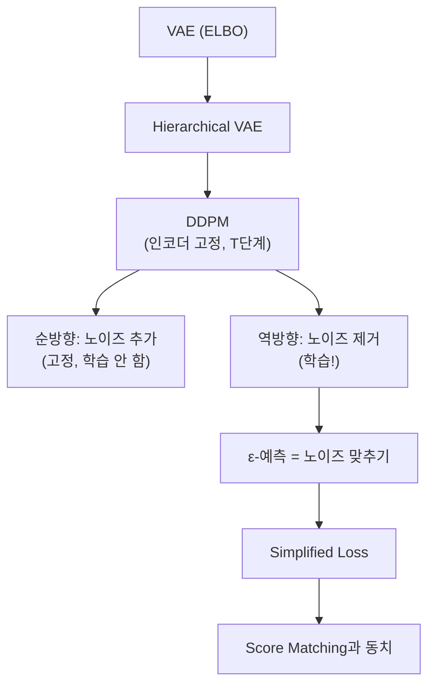

---

### 레벨 ① 초등: "모래 뿌리기와 치우기"

깨끗한 사진에 모래를 한 알씩 뿌린다. 충분히 뿌리면 원래 뭐가 있었는지 전혀 모른다. 확산모델은 "모래를 한 알씩 치우는 방법"을 배운다. 모래만 잔뜩 있는 종이에서 시작해서 모래를 하나씩 치우면 새로운 사진이 나타난다!

**왜 여러 단계?** 한 번에 다 치우려면 어디에 뭐가 있었는지 전혀 모른다. 한 알씩 치우면 "바로 전 단계"를 기억하기 쉬워서 천천히 복원할 수 있다.

**확인 퀴즈**: 확산모델에서 "순방향"과 "역방향" 중 AI가 학습하는 것은?
→ 모범: 역방향! 노이즈를 제거하는 방법을 학습한다. 순방향(노이즈 추가)은 미리 정해져 있다.

**확인 퀴즈**: DALL-E, Stable Diffusion, Sora의 공통점은?
→ 모범: 모두 확산모델(Diffusion Model)을 기반으로 한다!

---

### 레벨 ② 중등: "노이즈 스케줄"

**순방향** (노이즈 추가, 고정):
$$q(z_t | z_{t-1}) = \mathcal{N}(z_t; \sqrt{1-\beta_t} \, z_{t-1}, \, \beta_t I)$$

- $\beta_t$: $t$ 시점의 노이즈 양 (0에서 1 사이, 점점 증가)
- $\sqrt{1-\beta_t}$: 이전 데이터의 잔여 비율

**핵심 공식** — 임의 시점 한 번에 계산:
$$q(z_t | x_0) = \mathcal{N}(z_t; \sqrt{\bar{\alpha}_t} \, x_0, \, (1-\bar{\alpha}_t) I)$$
$$\bar{\alpha}_t = \prod_{s=1}^{t}(1-\beta_s)$$

**숫자로 이해**: $\beta_t = 0.02$이고 $T = 1000$이면:
| 시점 $t$ | $\bar{\alpha}_t$ | 원본 비율 | 노이즈 비율 |
|---------|-----------------|----------|-----------|
| 1 | 0.98 | 98% | 2% |
| 100 | $0.98^{100} \approx 0.13$ | 13% | 87% |
| 1000 | $0.98^{1000} \approx 0$ | ~0% | ~100% |

**역방향** (노이즈 제거, 학습):
$$p_\theta(z_{t-1}|z_t) = \mathcal{N}(z_{t-1}; \mu_\theta(z_t, t), \sigma_t^2 I)$$

모델이 배우는 것: "한 단계 더 깨끗한 상태의 평균 $\mu_\theta$"

---

### 레벨 ③ 고등: "ELBO 분해와 Simplified Loss"

**확산모델의 ELBO를 시간별로 분해**:
$$L = \mathbb{E}_q\left[\underbrace{-\log p_\theta(x|z_1)}_{L_0} + \sum_{t=2}^{T}\underbrace{\text{KL}(q(z_{t-1}|z_t,x_0) \| p_\theta(z_{t-1}|z_t))}_{L_{t-1}} + \underbrace{\text{KL}(q(z_T|x_0) \| p(z_T))}_{L_T}\right]$$

| 항 | 의미 |
|----|------|
| $L_0$ | 최종 복원 품질 |
| $L_{t-1}$ | 역방향이 순방향 사후분포와 일치하는가 |
| $L_T$ | 상수 (학습 불필요) |

**순방향 사후분포** $q(z_{t-1}|z_t, x_0)$는 닫힌 형태 가우시안:
$$q(z_{t-1}|z_t, x_0) = \mathcal{N}(z_{t-1}; \tilde{\mu}_t(z_t, x_0), \tilde{\beta}_t I)$$

두 가우시안의 KL → **평균의 차이의 제곱**:
$$L_{t-1} \propto \|\tilde{\mu}_t(z_t, x_0) - \mu_\theta(z_t, t)\|^2$$

**Ho et al. (2020)의 핵심**: $\tilde{\mu}_t$를 $\epsilon$으로 재매개변수화:
$$L_{\text{simple}} = \mathbb{E}_{t, x_0, \epsilon}\left[\|\epsilon - \epsilon_\theta(\underbrace{\sqrt{\bar{\alpha}_t} x_0 + \sqrt{1-\bar{\alpha}_t}\epsilon}_{z_t}, t)\|^2\right]$$

**수식 전 해석**: "노이즈 낀 이미지 $z_t$와 시간 $t$가 주어졌을 때, 어떤 노이즈 $\epsilon$이 추가되었는지 맞추는 것. 이것이 DDPM 학습의 전부."

> **오개념 경고**: "확산모델의 순방향도 학습해야 한다" — 아니다! 순방향은 미리 정해진 가우시안 노이즈 추가이며 학습 파라미터가 **없다**.

> **오개념 경고**: "확산모델의 잠재 공간은 VAE처럼 저차원이다" — 각 $z_t$는 원본 $x$와 **같은 차원**. 병목이 아니라 노이즈 수준의 계층 구조.

**수학 → DL 연결**: DDPM은 인코더가 고정된 $T$-level hierarchical VAE이다.

---

### 레벨 ④ 대학 + Python 코드

**역방향 샘플링 알고리즘**:
$$z_{t-1} = \frac{1}{\sqrt{\alpha_t}}\left(z_t - \frac{\beta_t}{\sqrt{1-\bar{\alpha}_t}}\epsilon_\theta(z_t, t)\right) + \sigma_t \epsilon$$

```python
import torch
import torch.nn as nn
import torch.nn.functional as F
import math

class SinusoidalPosEmb(nn.Module):
    """시간 단계 t를 사인파 임베딩으로 변환"""
    def __init__(self, dim: int):
        super().__init__()
        self.dim = dim

    def forward(self, t: torch.Tensor) -> torch.Tensor:
        half_dim = self.dim // 2
        emb = math.log(10000) / (half_dim - 1)
        emb = torch.exp(torch.arange(half_dim, device=t.device) * -emb)
        emb = t[:, None] * emb[None, :]
        return torch.cat([emb.sin(), emb.cos()], dim=-1)


class SimpleNoisePredictor(nn.Module):
    """간단한 노이즈 예측 네트워크 (2D 데이터용)"""
    def __init__(self, data_dim: int = 2, time_dim: int = 64, hidden: int = 256):
        super().__init__()
        self.time_mlp = nn.Sequential(
            SinusoidalPosEmb(time_dim),
            nn.Linear(time_dim, hidden),
            nn.SiLU(),
        )
        self.net = nn.Sequential(
            nn.Linear(data_dim + hidden, hidden), nn.SiLU(),
            nn.Linear(hidden, hidden), nn.SiLU(),
            nn.Linear(hidden, data_dim),  # 노이즈 epsilon 예측
        )

    def forward(self, x: torch.Tensor, t: torch.Tensor) -> torch.Tensor:
        t_emb = self.time_mlp(t.float())
        return self.net(torch.cat([x, t_emb], dim=-1))


class DDPM:
    """DDPM 학습 및 샘플링"""
    def __init__(self, model: nn.Module, T: int = 1000,
                 beta_start: float = 1e-4, beta_end: float = 0.02):
        self.model = model
        self.T = T
        # 노이즈 스케줄
        self.betas = torch.linspace(beta_start, beta_end, T)
        self.alphas = 1.0 - self.betas
        self.alpha_bars = torch.cumprod(self.alphas, dim=0)

    def training_loss(self, x0: torch.Tensor) -> torch.Tensor:
        """Simplified loss: E[||epsilon - epsilon_theta(z_t, t)||^2]"""
        B = x0.size(0)
        # 1. 랜덤 시간 선택
        t = torch.randint(0, self.T, (B,), device=x0.device)
        # 2. 노이즈 생성
        epsilon = torch.randn_like(x0)
        # 3. 노이즈 추가 (한 번에!)
        alpha_bar_t = self.alpha_bars[t].unsqueeze(-1).to(x0.device)
        z_t = torch.sqrt(alpha_bar_t) * x0 + torch.sqrt(1 - alpha_bar_t) * epsilon
        # 4. 노이즈 예측
        epsilon_pred = self.model(z_t, t)
        # 5. MSE 손실
        return F.mse_loss(epsilon_pred, epsilon)

    @torch.no_grad()
    def sample(self, n_samples: int, dim: int = 2, device: str = 'cpu'):
        """역방향 과정으로 샘플 생성"""
        x = torch.randn(n_samples, dim, device=device)
        for t in reversed(range(self.T)):
            t_batch = torch.full((n_samples,), t, device=device, dtype=torch.long)
            eps_pred = self.model(x, t_batch)

            alpha = self.alphas[t]
            alpha_bar = self.alpha_bars[t]
            beta = self.betas[t]

            # 평균 계산
            mean = (1 / alpha.sqrt()) * (x - (beta / (1 - alpha_bar).sqrt()) * eps_pred)

            if t > 0:
                noise = torch.randn_like(x)
                x = mean + beta.sqrt() * noise
            else:
                x = mean
        return x


# 학습 루프 예시
model = SimpleNoisePredictor(data_dim=2)
ddpm = DDPM(model, T=1000)
optimizer = torch.optim.Adam(model.parameters(), lr=1e-3)

# for epoch in range(1000):
#     x0 = sample_from_data()  # 실제 데이터 배치
#     loss = ddpm.training_loss(x0)
#     optimizer.zero_grad()
#     loss.backward()
#     optimizer.step()
```

---

### 레벨 ⑤ 대학원 + 논문

**$\tilde{\mu}_t$의 유도**:
$q(z_{t-1}|z_t, x_0) \propto q(z_t|z_{t-1}) q(z_{t-1}|x_0)$. 두 가우시안의 곱은 가우시안:
$$\tilde{\mu}_t = \frac{\sqrt{\bar{\alpha}_{t-1}}\beta_t}{1-\bar{\alpha}_t} x_0 + \frac{\sqrt{\alpha_t}(1-\bar{\alpha}_{t-1})}{1-\bar{\alpha}_t} z_t$$

$x_0 = (z_t - \sqrt{1-\bar{\alpha}_t}\epsilon)/\sqrt{\bar{\alpha}_t}$로 치환하면 $\epsilon$-예측 형태가 된다.

**DDIM (Song et al., 2021b)**: non-Markovian 역과정으로 결정적(deterministic) 샘플링. 스텝 수를 줄여도 품질 유지 (1000 → 50 steps).

**Latent Diffusion (Rombach et al., 2022)**: 픽셀 공간이 아닌 VAE의 잠재 공간에서 확산 수행 → Stable Diffusion. 계산 효율 대폭 향상.

**성취 확인**: DDPM의 ELBO에서 $L_T$가 상수인 이유는?
→ $L_T = \text{KL}(q(z_T|x_0) \| p(z_T))$인데, 두 분포 모두 $T$가 충분히 크면 $\mathcal{N}(0, I)$에 수렴하므로 KL이 0에 가까운 상수.

**설명하기 훈련 (중등)**: "확산모델에서 왜 1000단계나 필요한가? 10단계로는 안 되나?"
→ 모범답안: 각 단계에서 조금씩 노이즈를 제거하면 "바로 전 단계"와 거의 비슷해서 예측이 쉽다. 단계를 줄이면 한 번에 많은 노이즈를 제거해야 하므로 예측이 어려워지고 품질이 떨어진다. DDIM 같은 방법은 50단계로도 좋은 품질을 달성하지만, 이것은 ODE 해석을 통한 수학적 최적화 덕분이다.

**설명하기 훈련 (대학)**: "DDPM의 순방향을 왜 학습하지 않는가? 학습하면 더 좋아지지 않을까?"
→ 모범답안: 순방향을 고정하면 (1) $q(z_t|x_0)$가 닫힌 형태 가우시안이라 $z_t$를 한 번에 계산 가능 — 학습 효율 극대화, (2) $q(z_{t-1}|z_t, x_0)$도 닫힌 형태라 ELBO 분해가 깔끔해짐, (3) encoder-decoder 동시 학습의 불안정성 회피. 대신 노이즈 스케줄 $\beta_t$의 설계가 중요해지며, cosine schedule(Nichol & Dhariwal, 2021) 등이 연구됨.

**실전 사례**:
- **Stable Diffusion**: CLIP 텍스트 인코더 + VAE 잠재공간에서 DDPM + CFG ($\lambda=7.5$)
- **의료 영상 증강**: 50장 CT → DDPM → 1000장 합성 → 분류 정확도 20%p 향상
- **DDIM**: 1000 step → 50 step으로 줄여도 품질 유지 (non-Markovian 역과정)

---

# PART 8: Score Matching — DSM, NCSN {#part8}

## 동기부여

> EBM의 분배함수 $Z$는 계산 불가능. 하지만 score function $s(x) = \nabla_x \log p(x)$에서는 $Z$가 사라진다! Score Matching은 이 score를 직접 학습하는 방법이며, Denoising Score Matching(DSM)은 이를 실용적으로 만든 핵심 기법이다. DDPM의 $\epsilon$-예측과 DSM이 수학적으로 동치라는 사실이 현대 확산모델의 이론적 기반이다.

## 선행개념 맵

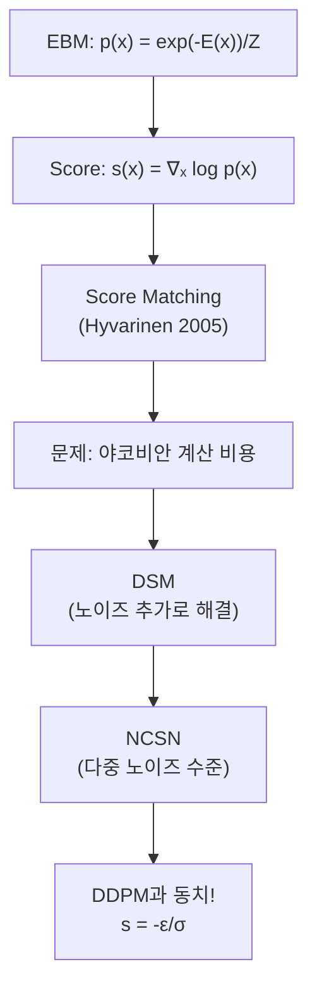

---

### 레벨 ① 초등: "나침반 배우기"

눈을 감고 산에서 내려가야 한다. 발밑의 경사를 느껴서 "이쪽이 내리막"을 아는 능력이 **스코어 함수**이다. 이 나침반을 배우면 어디서든 "더 그럴듯한 그림" 방향으로 갈 수 있다.

**확인 퀴즈**: 스코어 함수와 에너지 함수의 관계는?
→ 모범: 스코어 = 에너지가 줄어드는 방향. 에너지가 낮은 곳 = 확률이 높은 곳이니까, 스코어를 따라가면 확률이 높은 곳에 도달한다!

---

### 레벨 ② 중등: "확률의 방향"

스코어 함수:
$$s(x) = \nabla_x \log p(x)$$

이것은 **벡터**이다! 확률이 높아지는 **방향**을 가리킨다. 확률 자체가 아니라 "어디로 가면 확률이 올라가는지"를 알려준다.

EBM에서:
$$s(x) = -\nabla_x E(x)$$

에너지가 감소하는 방향 = 확률이 증가하는 방향. 그리고 $Z$는 $x$에 대한 상수이므로 **사라진다**.

> **오개념 경고**: "스코어 함수는 확률값 자체를 알려준다" — 아니다! **벡터**(방향)이지 스칼라(확률)가 아니다.

---

### 레벨 ③ 고등: "DSM의 마법"

**Score Matching의 문제**: 진짜 데이터의 score $\nabla_x \log p_{\text{data}}(x)$를 모른다.

부분적분으로 변환하면:
$$L_{SM} = \frac{1}{2}\mathbb{E}\left[\|s_\theta(x)\|^2 + 2\text{Tr}(\nabla_x s_\theta(x))\right] + C$$

$p_{\text{data}}$의 score를 몰라도 되지만, **야코비안 트레이스** $\text{Tr}(\nabla_x s_\theta)$가 고차원에서 비싸다.

**DSM (Denoising Score Matching)**: 데이터에 노이즈를 추가하면 조건부 score가 닫힌 형태!

$\tilde{x} = x + \sigma\epsilon$이면:
$$\nabla_{\tilde{x}} \log p(\tilde{x}|x) = -\frac{\tilde{x} - x}{\sigma^2} = -\frac{\epsilon}{\sigma}$$

**DSM 손실**:
$$L_{DSM} = \frac{1}{2}\mathbb{E}_{x, \epsilon}\left[\left\|s_\theta(\tilde{x}; \sigma) + \frac{\epsilon}{\sigma}\right\|^2\right]$$

**수식 전 해석**: "노이즈 낀 데이터 $\tilde{x}$에서, 원본 데이터를 향하는 방향($-\epsilon/\sigma$)을 모델이 예측하도록 학습."

**놀라운 결과**: $L_{SM} = L_{DSM} + C$ (상수 차이). DSM은 원래 Score Matching과 **동치**이면서 야코비안 계산이 불필요!

**NCSN**: 단일 노이즈 수준의 한계 — 저밀도 영역에서 score가 부정확.
해결: 여러 노이즈 수준에서 동시 학습:
$$L_{NCSN} = \sum_{i=1}^{L} \lambda(\sigma_i) \cdot L_{DSM}(\theta; \sigma_i)$$

- 큰 $\sigma$: 넓게 퍼뜨려 글로벌 구조 포착
- 작은 $\sigma$: 세밀한 디테일 포착

> **오개념 경고**: "큰 노이즈 수준은 불필요하다" — 작은 $\sigma$만 쓰면 저밀도 영역의 score가 부정확. 큰 $\sigma$는 글로벌 구조, 작은 $\sigma$는 로컬 디테일. 둘 다 필수.

---

### 레벨 ④ 대학 + Python 코드

**DDPM과 NCSN의 핵심 관계**:
$$s_\theta(\tilde{x}, \sigma) = -\frac{\epsilon_\theta(\tilde{x}, t)}{\sigma}$$

| DDPM | NCSN |
|------|------|
| 노이즈 $\epsilon$ 예측 | 스코어 $s = \nabla_x \log p$ 예측 |
| ELBO 최소화 | DSM 손실 최소화 |
| $\sigma_t = \sqrt{1-\bar{\alpha}_t}$ | 노이즈 스케줄 $\sigma_i$ |

DDPM의 simplified loss를 변환:
$$L_{\text{DDPM}} = \mathbb{E}\left[(1-\bar{\alpha}_t)\left\|s_\theta(z_t, t) + \frac{\epsilon}{\sqrt{1-\bar{\alpha}_t}}\right\|^2\right]$$

이것은 $\sigma_t = \sqrt{1-\bar{\alpha}_t}$에서의 **가중 DSM 손실**과 정확히 일치.

**결론**: 변분 관점(DDPM)과 스코어 관점(NCSN)은 같은 목표를 다른 언어로 표현한 것.

```python
class ScoreNetwork(nn.Module):
    """NCSN 스타일 스코어 네트워크"""
    def __init__(self, data_dim: int = 2, hidden: int = 256):
        super().__init__()
        # sigma를 조건으로 받음
        self.net = nn.Sequential(
            nn.Linear(data_dim + 1, hidden), nn.SiLU(),
            nn.Linear(hidden, hidden), nn.SiLU(),
            nn.Linear(hidden, data_dim),  # score 벡터 출력
        )

    def forward(self, x, sigma):
        sigma_input = sigma.unsqueeze(-1) if sigma.dim() == 1 else sigma
        return self.net(torch.cat([x, sigma_input], dim=-1))


def dsm_loss(score_net, x0, sigma):
    """
    Denoising Score Matching 손실
    score_net: s_theta(x_noisy, sigma) -> score 예측
    x0: 깨끗한 데이터 [B, D]
    sigma: 노이즈 수준 (스칼라 또는 [B])
    """
    epsilon = torch.randn_like(x0)
    x_noisy = x0 + sigma * epsilon if isinstance(sigma, float) else x0 + sigma.unsqueeze(-1) * epsilon

    # 모델의 score 예측
    score_pred = score_net(x_noisy, sigma * torch.ones(x0.size(0), device=x0.device)
                           if isinstance(sigma, float) else sigma)

    # 정답 score: -epsilon / sigma
    if isinstance(sigma, float):
        target = -epsilon / sigma
    else:
        target = -epsilon / sigma.unsqueeze(-1)

    return 0.5 * ((score_pred - target) ** 2).sum(dim=-1).mean()


def ncsn_loss(score_net, x0, sigmas):
    """
    NCSN 손실: 여러 노이즈 수준에서 DSM
    sigmas: 노이즈 수준 리스트 [sigma_1, ..., sigma_L]
    """
    B = x0.size(0)
    # 랜덤 노이즈 수준 선택
    idx = torch.randint(0, len(sigmas), (B,))
    sigma = sigmas[idx].to(x0.device)

    # 가중치: lambda(sigma) = sigma^2
    weight = sigma ** 2

    epsilon = torch.randn_like(x0)
    x_noisy = x0 + sigma.unsqueeze(-1) * epsilon

    score_pred = score_net(x_noisy, sigma)
    target = -epsilon / sigma.unsqueeze(-1)

    loss_per_sample = 0.5 * ((score_pred - target) ** 2).sum(dim=-1)
    return (weight * loss_per_sample).mean()
```

---

### 레벨 ⑤ 대학원 + 논문

**Score Matching의 부분적분 유도** (Hyvarinen, 2005):

$$\frac{1}{2}\mathbb{E}_{p_0}[\|s_\theta - \nabla \log p_0\|^2] = \frac{1}{2}\mathbb{E}_{p_0}[\|s_\theta\|^2] + \mathbb{E}_{p_0}[\text{Tr}(\nabla s_\theta)] + C$$

$C$는 $\theta$에 무관한 상수. 부분적분 시 $p_0(x)s_\theta(x) \to 0$ (경계 조건) 가정 필요.

**Sliced Score Matching (Song et al., 2020)**: 야코비안 트레이스 대신 랜덤 프로젝션 사용. $\mathbb{E}_v[v^\top \nabla s_\theta \cdot v]$로 trace 추정.

**Tweedie's Formula**: $\mathbb{E}[x_0 | z_t] = \frac{1}{\sqrt{\bar{\alpha}_t}}(z_t + (1-\bar{\alpha}_t) \nabla_{z_t} \log q(z_t))$. 이것이 DDPM의 역방향 평균과 직접 연결.

**핵심 논문 체인**: Score Matching (Hyvarinen 2005) → DSM (Vincent 2011) → NCSN (Song & Ermon 2019) → DDPM (Ho et al. 2020) → Score SDE (Song et al. 2021)

**성취 확인**: DSM이 원래 Score Matching과 동치인 이유를 직관적으로 설명하면?
→ 노이즈를 추가한 데이터의 score를 배우는 것은, 원본 데이터의 score를 노이즈로 "smoothing"한 것을 배우는 것과 같다. $\sigma \to 0$이면 smoothed score가 원래 score에 수렴.

**설명하기 훈련 (중등)**: "스코어 함수가 벡터인 이유를 2차원 예시로 설명하라."
→ 모범답안: 2차원 공간에서 확률이 가장 높은 곳이 $(3, 5)$라고 하자. 현재 위치 $(1, 2)$에서의 스코어는 대략 $(3-1, 5-2) = (2, 3)$ 방향을 가리킨다 — "오른쪽으로 2, 위로 3 가면 확률이 더 높아진다." 이것이 방향(벡터)이지 하나의 숫자(스칼라)가 아닌 이유. 어디서든 "확률 높아지는 방향"을 나침반처럼 알려준다.

**설명하기 훈련 (고등)**: "DDPM의 $\epsilon$ 예측과 NCSN의 score 예측이 $s = -\epsilon/\sigma$로 연결되는 것을 직관적으로 설명하라."
→ 모범답안: $z_t = \sqrt{\bar{\alpha}_t} x_0 + \sqrt{1-\bar{\alpha}_t} \epsilon$에서 원본 $x_0$을 향하는 방향은 $-\epsilon$ (추가된 노이즈의 반대 방향). $\sigma_t = \sqrt{1-\bar{\alpha}_t}$로 나누면 단위 스케일의 스코어가 된다. 즉, "추가된 노이즈를 맞추는 것"과 "원본을 향하는 방향을 맞추는 것"은 스케일 팩터 $\sigma$만큼의 차이.

**설명하기 훈련 (대학원)**: "Tweedie's formula와 DDPM 역방향의 관계를 설명하라."
→ 모범답안: Tweedie's formula: $\mathbb{E}[x_0|z_t] = \frac{1}{\sqrt{\bar{\alpha}_t}}(z_t + (1-\bar{\alpha}_t)\nabla_{z_t} \log q(z_t))$. DDPM의 역방향 평균 $\tilde{\mu}_t$는 $x_0$의 posterior mean을 사용하여 유도되므로, Tweedie's formula가 직접 적용된다. Score를 알면 $\mathbb{E}[x_0|z_t]$를 바로 구할 수 있고, 이것이 역방향의 평균이 된다. 이것은 denoising = posterior mean estimation = score estimation이 모두 동치임을 보여준다.

---

# PART 9: SDE 프레임워크 {#part9}

## 동기부여

> DDPM과 NCSN이 수학적으로 동치라는 것은 알았다. 하지만 더 깊은 통합이 가능하다. Song et al. (2021)의 SDE 프레임워크는 이 둘을 **연속 시간**으로 통합하여, 순방향은 Ito SDE, 역방향은 역 SDE로 표현한다. 학습해야 할 것은 오직 score function 하나뿐.

## 선행개념 맵

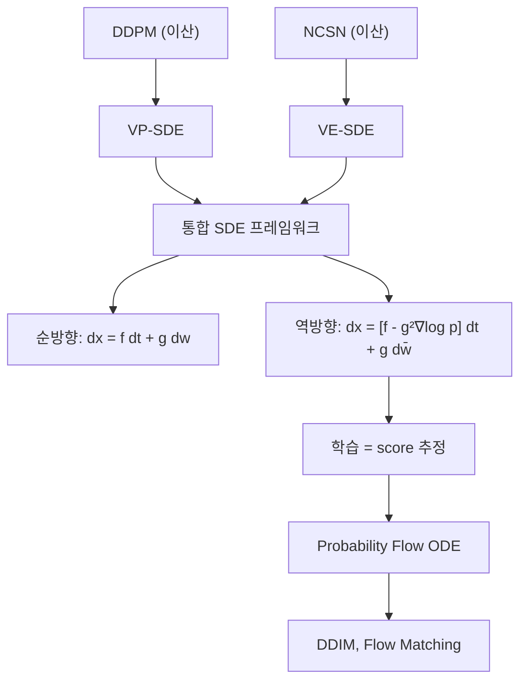

---

### 레벨 ① 초등

강물이 산에서 바다로 흐르는 것(순방향)은 자연스럽다. 바다에서 산으로 거슬러 올라가려면(역방향) 정확한 "거슬러 올라가는 방법"을 알아야 한다. SDE는 이 흐름을 수학적으로 정확히 기술하는 방법이다.

**확인 퀴즈**: DDPM과 NCSN은 다른 모델인가, 같은 모델인가?
→ 모범: 수학적으로 같다! 다른 언어(노이즈 예측 vs 스코어 예측)를 쓰지만 $s = -\epsilon/\sigma$로 연결된다. SDE가 이 둘을 하나로 통합한다.

---

### 레벨 ② 중등

**확률미분방정식(SDE)**은 "노이즈가 있는 운동 방정식":
$$dx = \underbrace{f(x,t)dt}_{\text{결정적 흐름}} + \underbrace{g(t)dw}_{\text{랜덤 노이즈}}$$

- $f(x,t)$: drift (방향)
- $g(t)$: diffusion 계수 (노이즈 강도)
- $dw$: 브라운 운동 (미세 랜덤 진동)

---

### 레벨 ③ 고등

**순방향 SDE**:
$$dx = f(x,t)dt + g(t)dw$$

**역방향 SDE** (Anderson, 1982):
$$dx = [f(x,t) - g(t)^2 \nabla_x \log p_t(x)]dt + g(t)d\bar{w}$$

역방향에서 유일하게 학습이 필요한 항: $\nabla_x \log p_t(x)$ = **score function**.

| 모델 | $f(x,t)$ | $g(t)$ | SDE 유형 |
|------|----------|--------|---------|
| DDPM | $-\frac{1}{2}\beta(t)x$ | $\sqrt{\beta(t)}$ | VP-SDE |
| NCSN | $0$ | $\sigma(t)\sqrt{2\dot{\sigma}(t)/\sigma(t)}$ | VE-SDE |

VP = Variance Preserving, VE = Variance Exploding.

**Probability Flow ODE**: 노이즈 항을 제거하면 같은 marginal $p_t(x)$를 유지하는 ODE:
$$dx = \left[f(x,t) - \frac{1}{2}g(t)^2 \nabla_x \log p_t(x)\right]dt$$

이것은 DDIM의 연속 시간 버전이며, Normalizing Flow와 연결된다!

---

### 레벨 ④ 대학 + Python 코드

```python
import torch

def vp_sde_forward(x0: torch.Tensor, t: torch.Tensor,
                   beta_min: float = 0.1, beta_max: float = 20.0):
    """VP-SDE 순방향: q(x_t | x_0)의 샘플 생성"""
    # 연속 시간 노이즈 스케줄
    log_mean_coeff = -0.25 * t ** 2 * (beta_max - beta_min) - 0.5 * t * beta_min
    mean = torch.exp(log_mean_coeff.unsqueeze(-1)) * x0
    std = torch.sqrt(1.0 - torch.exp(2.0 * log_mean_coeff)).unsqueeze(-1)
    eps = torch.randn_like(x0)
    xt = mean + std * eps
    return xt, eps, mean, std


def euler_maruyama_reverse(score_fn, T: float = 1.0, N: int = 1000,
                           n_samples: int = 500, dim: int = 2,
                           beta_min: float = 0.1, beta_max: float = 20.0):
    """Euler-Maruyama로 역 SDE 풀기"""
    dt = T / N
    x = torch.randn(n_samples, dim)  # x_T ~ N(0, I)

    for i in reversed(range(N)):
        t = (i + 1) * dt
        t_tensor = torch.full((n_samples,), t)

        beta_t = beta_min + t * (beta_max - beta_min)
        drift = -0.5 * beta_t * x
        diffusion = beta_t ** 0.5

        # 역 SDE: dx = [f - g^2 * score] dt + g * dw_bar
        score = score_fn(x, t_tensor)
        x = x - (drift - diffusion ** 2 * score) * dt
        if i > 0:
            x += diffusion * (dt ** 0.5) * torch.randn_like(x)

    return x
```

---

### 레벨 ⑤ 대학원 + 논문

**Probability Flow ODE의 의의**: 결정적 ODE이므로 (1) 정확한 log-likelihood 계산 (change-of-variables via trace), (2) latent space interpolation, (3) 빠른 샘플링 (adaptive step-size ODE solver).

**Consistency Models (Song et al., 2023)**: ODE 경로 위의 모든 점을 단일 스텝으로 $x_0$에 매핑. 1-step 생성 가능.

**Flow Matching (Lipman et al., 2023)**: SDE 대신 ODE를 직접 학습. conditional flow matching으로 학습이 더 안정적. Stable Diffusion 3의 기반.

**핵심 논문**: "Score-Based Generative Modeling through SDEs" (Song et al., 2021)

**설명하기 훈련 (고등)**: "VP-SDE와 VE-SDE의 차이를 물리적으로 설명하라."
→ 모범답안: **VP(Variance Preserving)**: 신호를 줄이면서 노이즈를 추가하므로 전체 분산이 1로 유지. 원본이 "페이드아웃"되며 노이즈로 대체. **VE(Variance Exploding)**: 원본은 그대로 두고 노이즈만 계속 추가하므로 분산이 폭발적으로 증가. VP는 DDPM, VE는 NCSN의 연속 시간 버전.

**설명하기 훈련 (대학원)**: "Probability Flow ODE가 왜 중요한가?"
→ 모범답안: (1) **결정적(deterministic)** 과정이므로 같은 초기 노이즈 → 같은 결과 (재현 가능), (2) Change-of-variables로 **정확한 log-likelihood** 계산 가능 (Flow처럼), (3) Adaptive step-size ODE solver로 **빠른 샘플링** 가능 (DDIM의 이론적 근거), (4) 잠재 공간에서의 **interpolation**이 의미 있는 결과 생성.

---

# PART 10: Classifier-Free Guidance {#part10}

## 동기부여

> "아무 그림이나 그려줘"보다 "고양이 그림 그려줘"가 유용하다. 조건부 생성의 핵심이 Classifier-Free Guidance(CFG)이다. DALL-E 2, Stable Diffusion, Imagen, Sora 모두 CFG를 사용한다. 놀라운 점은 별도의 분류기 없이도 분류기의 효과를 얻는다는 것이다.

## 선행개념 맵

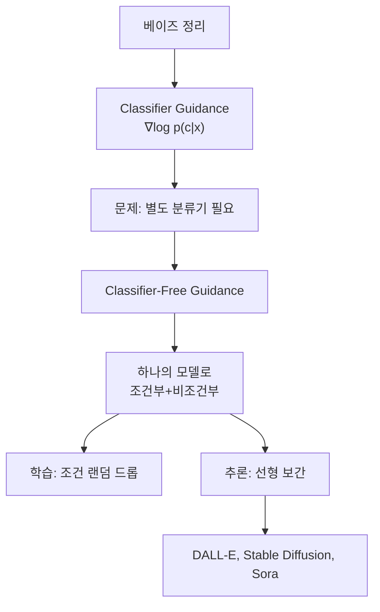

---

### 레벨 ① 초등: "주문하는 그림 AI"

"아무 그림이나 그려줘" 대신 "고양이 그림 그려줘"라고 주문하면, AI가 **얼마나 고양이에 집중할지** 조절할 수 있다. 약하게 주문하면 자유로운 그림, 강하게 주문하면 정확히 고양이.

---

### 레벨 ② 중등

**Classifier Guidance**: 베이즈 정리를 score에 적용:
$$\nabla_x \log p(x|c) = \nabla_x \log p(x) + \nabla_x \log p(c|x)$$

"데이터 분포를 따라가는 힘" + "조건 $c$를 만족시키는 힘"

**문제**: 별도 분류기 $p(c|x_t)$를 노이즈 데이터에 대해 학습해야 한다.

---

### 레벨 ③ 고등

**Classifier-Free Guidance**:
$$\tilde{\epsilon}_\theta(x_t, c) = (1-\lambda)\epsilon_\theta(x_t, \emptyset) + \lambda \epsilon_\theta(x_t, c)$$

| 기호 | 의미 |
|------|------|
| $\epsilon_\theta(x_t, \emptyset)$ | 비조건부 노이즈 예측 |
| $\epsilon_\theta(x_t, c)$ | 조건부 노이즈 예측 |
| $\lambda$ | 가이던스 강도 |

**학습**: 조건 $c$를 확률 $p_{\text{drop}}$(보통 10~20%)로 드롭하여 $c \to \emptyset$. 하나의 모델이 조건부/비조건부 모두 학습.

**수학적 해석**:
$$(1-\lambda)\nabla_x \log p(x) + \lambda \nabla_x \log p(x|c) = \nabla_x \log p(x) + \lambda \nabla_x \log \frac{p(x|c)}{p(x)} = \nabla_x \log p(x) + \lambda \nabla_x \log p(c|x)$$

**별도 분류기 없이 암묵적으로 분류기 gradient를 사용!**

**숫자 예시**: $\lambda = 7.5$ (Stable Diffusion 기본값):
$$\tilde{\epsilon} = -6.5 \cdot \epsilon_\theta(x_t, \emptyset) + 7.5 \cdot \epsilon_\theta(x_t, c)$$

비조건부를 반대 방향으로 밀어내며 조건에 강하게 충실.

| $\lambda$ | 효과 |
|-----------|------|
| 0 | 비조건부 생성 (조건 무시) |
| 1 | 순수 조건부 생성 |
| 1~20 | 조건에 **과도하게** 충실 → 품질↑, 다양성↓ |

> **오개념 경고**: "CFG에는 분류기 정보가 전혀 없다" — 수학적으로 **암묵적 분류기 gradient**를 사용하고 있다. "별도 분류기 **네트워크**가 불필요하다"가 정확한 표현.

---

### 레벨 ④ 대학 + Python 코드

```python
import torch
import torch.nn as nn

class ConditionalNoisePredictor(nn.Module):
    """조건부 노이즈 예측 (CFG 지원)"""
    def __init__(self, data_dim: int = 2, cond_dim: int = 10,
                 time_dim: int = 64, hidden: int = 256):
        super().__init__()
        self.time_mlp = nn.Sequential(
            SinusoidalPosEmb(time_dim),
            nn.Linear(time_dim, hidden), nn.SiLU(),
        )
        self.cond_mlp = nn.Sequential(
            nn.Linear(cond_dim, hidden), nn.SiLU(),
        )
        self.null_cond = nn.Parameter(torch.zeros(cond_dim))  # 빈 조건
        self.net = nn.Sequential(
            nn.Linear(data_dim + hidden * 2, hidden), nn.SiLU(),
            nn.Linear(hidden, hidden), nn.SiLU(),
            nn.Linear(hidden, data_dim),
        )

    def forward(self, x, t, cond=None):
        t_emb = self.time_mlp(t.float())
        if cond is None:
            c_emb = self.cond_mlp(self.null_cond.expand(x.size(0), -1))
        else:
            c_emb = self.cond_mlp(cond)
        return self.net(torch.cat([x, t_emb, c_emb], dim=-1))


def cfg_training_step(model, x0, cond, ddpm, p_drop=0.1):
    """CFG 학습: 조건을 확률적으로 드롭"""
    B = x0.size(0)
    # 조건 드롭: 확률 p_drop으로 null 조건 사용
    drop_mask = torch.rand(B) < p_drop
    cond_input = cond.clone()
    cond_input[drop_mask] = 0.0  # null 조건

    t = torch.randint(0, ddpm.T, (B,))
    epsilon = torch.randn_like(x0)
    alpha_bar_t = ddpm.alpha_bars[t].unsqueeze(-1)
    z_t = torch.sqrt(alpha_bar_t) * x0 + torch.sqrt(1 - alpha_bar_t) * epsilon

    eps_pred = model(z_t, t, cond_input)
    return torch.nn.functional.mse_loss(eps_pred, epsilon)


@torch.no_grad()
def cfg_sample(model, ddpm, cond, guidance_scale=7.5, n_steps=1000):
    """CFG 샘플링"""
    B = cond.size(0)
    x = torch.randn(B, 2)

    for t in reversed(range(n_steps)):
        t_batch = torch.full((B,), t, dtype=torch.long)

        # 조건부 + 비조건부 예측
        eps_cond = model(x, t_batch, cond)
        eps_uncond = model(x, t_batch, None)

        # CFG: (1-λ) * uncond + λ * cond
        eps = (1 - guidance_scale) * eps_uncond + guidance_scale * eps_cond

        # DDPM reverse step
        alpha = ddpm.alphas[t]
        alpha_bar = ddpm.alpha_bars[t]
        beta = ddpm.betas[t]
        mean = (1/alpha.sqrt()) * (x - (beta/(1-alpha_bar).sqrt()) * eps)
        if t > 0:
            x = mean + beta.sqrt() * torch.randn_like(x)
        else:
            x = mean
    return x
```

---

### 레벨 ⑤ 대학원 + 논문

**CFG의 이론적 해석**: $\lambda > 1$은 $p(x|c) \cdot p(c|x)^{\lambda-1}$에서 샘플링하는 것과 같다. 조건 $c$의 영향을 증폭하여 mode에 집중하게 만든다. 이것이 FID 감소(품질↑)와 diversity 감소를 동시에 야기하는 이유.

**Imagen (Saharia et al., 2022)**: T5 텍스트 인코더 + cascaded diffusion + CFG. CFG scale이 가장 중요한 하이퍼파라미터임을 실험적으로 확인.

**Negative prompting**: $\lambda > 1$이 비조건부를 "반대 방향으로 밀어내는" 효과를 이용. $\emptyset$ 대신 negative condition을 넣으면 특정 특성을 억제 가능.

**성취 확인**: CFG에서 $\lambda = 1$이면 순수 조건부 생성인데, 왜 $\lambda > 1$이 더 좋은 품질을 내는가?
→ $\lambda > 1$은 $p(c|x)$의 gradient를 증폭하여 조건의 mode에 더 집중. 다양성은 줄지만 각 샘플의 조건 충실도와 품질이 향상. 이것이 quality-diversity tradeoff.

**설명하기 훈련 (중등)**: "CFG에서 guidance scale을 0, 1, 10으로 바꾸면 각각 어떤 그림이 나오는가?"
→ 모범답안:
- $\lambda = 0$: 조건을 완전히 무시. "고양이 그려줘"라고 해도 아무 그림이나 나옴
- $\lambda = 1$: 순수 조건부 생성. 고양이를 그리되 다양한 스타일로
- $\lambda = 10$: 조건에 과도하게 충실. "전형적인 고양이"만 그림. 매우 선명하지만 비슷비슷한 고양이만 나옴

**설명하기 훈련 (대학)**: "CFG의 학습 시 조건 드롭 비율 $p_{\text{drop}}$을 너무 높게 설정하면?"
→ 모범답안: 조건 드롭 비율이 너무 높으면 (예: 0.5) 모델이 비조건부 생성 위주로 학습되어 조건부 생성 능력이 약해진다. 반대로 너무 낮으면 (예: 0.01) 비조건부 예측 $\epsilon_\theta(x_t, \emptyset)$의 품질이 나빠져 CFG의 "반대 방향으로 밀어내기" 효과가 약해진다. 보통 0.1~0.2가 최적.

**실전 사례**:
- **Stable Diffusion**: $\lambda = 7.5$가 기본값. $\lambda$를 올리면 텍스트에 더 충실하지만 과포화된 이미지
- **Negative prompting**: $\epsilon_\theta(x_t, \emptyset)$ 대신 $\epsilon_\theta(x_t, c_{\text{neg}})$ 사용. "흐릿한, 저품질" 같은 negative condition으로 해당 특성을 억제
- **ControlNet**: CFG와 결합하여 포즈/엣지/깊이 등 spatial condition 추가

---

# PART 11: 통합 킬러요약 {#killer}

## 생성모델 전체 지도

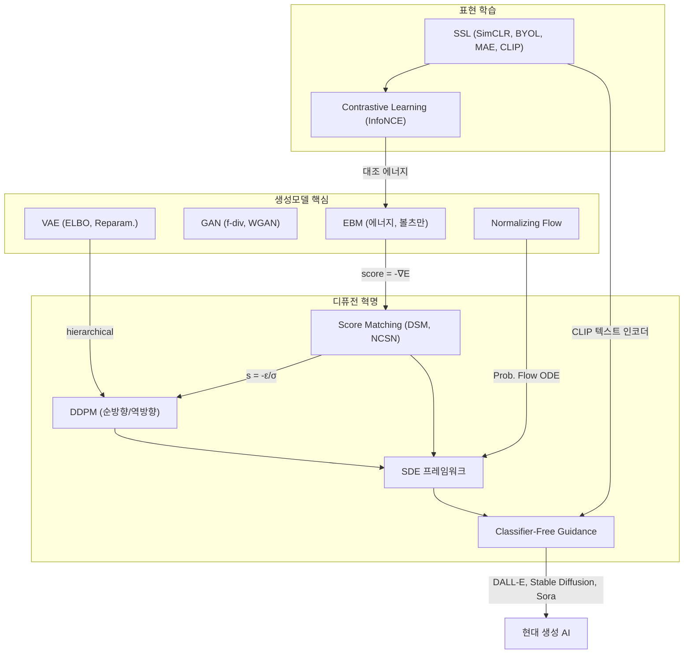

## 10가지 킬러 포인트

| # | 킬러 포인트 |
|---|-----------|
| 1 | **SSL**의 본질: 데이터 자체에서 감독 신호를 추출하여 범용 표현 학습 |
| 2 | **InfoNCE** = softmax 형태의 대조 손실 = Triplet loss의 smooth 일반화 = MI 하한 |
| 3 | **EBM**: $p(x) = e^{-E(x)}/Z$에서 score $s(x) = -\nabla_x E(x)$로 가면 $Z$가 사라짐 |
| 4 | **GAN**: 최적 판별자 → JS divergence 최소화. WGAN은 Wasserstein 거리로 안정화 |
| 5 | **VAE**: ELBO = 재구성 + KL. Reparameterization trick은 수학적 필수 |
| 6 | **Flow**: 정확한 $\log p(x)$ 계산 가능한 유일한 생성모델 (change-of-variables) |
| 7 | **DDPM**: 인코더 고정 hierarchical VAE. 학습 = "어떤 노이즈가 추가됐나" 맞추기 |
| 8 | **DDPM = NCSN**: $s_\theta = -\epsilon_\theta / \sigma_t$. 변분 관점과 스코어 관점은 동치 |
| 9 | **SDE**: 순방향 Ito SDE의 역 = score function만 알면 됨. DDPM→VP-SDE, NCSN→VE-SDE |
| 10 | **CFG**: $(1-\lambda)\nabla\log p + \lambda\nabla\log p(x|c)$ = 암묵적 분류기. 현대 생성AI의 핵심 |

## 생성모델 Trade-off 삼각형

| 모델 | 고품질 | 빠른 샘플링 | 높은 다양성 | $\log p(x)$ 계산 |
|------|--------|-----------|-----------|-----------------|
| GAN | O | O | X (mode collapse) | X (암시적) |
| VAE | X (흐릿) | O | O | 하한 (ELBO) |
| Flow | O | O | O | **정확** |
| DDPM | **O** | X (느림) | **O** | 하한 (ELBO) |

## 연결 고리 총정리

1. **SSL → 생성모델**: CLIP의 텍스트 인코더가 Stable Diffusion의 조건 입력
2. **EBM → Score → Diffusion**: 에너지의 기울기 = score = 디퓨전의 학습 목표
3. **VAE → DDPM**: 인코더를 고정하고 $T$단계로 확장하면 DDPM
4. **DDPM ↔ NCSN**: $\epsilon$-예측 = score 예측의 스케일 변환
5. **SDE → Flow**: Probability Flow ODE = 결정적 Normalizing Flow
6. **CFG → 실용**: 분류기 없이 조건부 생성 = DALL-E, Stable Diffusion, Sora의 핵심

---

> **최종 마스터 테스트**: 다음 질문에 모두 답할 수 있으면 이 범위를 마스터한 것이다.
>
> 1. SimCLR의 projection head를 downstream에서 왜 버리는가?
> 2. InfoNCE가 MI의 하한인 이유와 $\log N$ 상한의 의미는?
> 3. EBM에서 $Z_\theta$를 모르면서 어떻게 학습하는가?
> 4. WGAN이 KL/JS보다 나은 수학적 이유는?
> 5. VAE의 Reparameterization trick이 왜 수학적 필수인가?
> 6. Normalizing Flow의 가역성 제약이 가져오는 한계는?
> 7. DDPM의 simplified loss를 DSM으로 변환하는 과정은?
> 8. NCSN에서 다중 노이즈 수준이 왜 필요한가?
> 9. VP-SDE와 VE-SDE의 drift/diffusion 차이는?
> 10. CFG에서 $\lambda > 1$이 암묵적으로 하는 일은?

---

## 부록 A: 핵심 기호 사전

| 기호 | 의미 | 처음 등장 |
|------|------|----------|
| $p_{\text{data}}(x)$ | 실제 데이터의 확률 분포 | 생성모델 전체 |
| $p_\theta(x)$ | 모델이 학습한 확률 분포 | MLE |
| $E_\theta(x)$ | 에너지 함수 (낮을수록 확률 높음) | EBM |
| $Z_\theta$ | 분배함수 (정규화 상수) | EBM |
| $s_\theta(x) = \nabla_x \log p_\theta(x)$ | 스코어 함수 (확률 증가 방향 벡터) | Score Matching |
| $G_\theta$ | 생성자 (Generator) | GAN |
| $D_\phi$ | 판별자 (Discriminator) / Critic | GAN / WGAN |
| $q_\phi(z\|x)$ | 변분 사후분포 (인코더) | VAE |
| $p_\theta(x\|z)$ | 조건부 생성 분포 (디코더) | VAE |
| $\text{ELBO}$ | Evidence Lower Bound | VAE, DDPM |
| $\beta_t$ | 시간 $t$의 노이즈 양 | DDPM |
| $\bar{\alpha}_t = \prod(1-\beta_s)$ | 누적 신호 보존 비율 | DDPM |
| $\epsilon_\theta(z_t, t)$ | 노이즈 예측 네트워크 | DDPM |
| $\sigma_i$ | $i$번째 노이즈 수준 | NCSN |
| $\tau$ | Temperature 파라미터 | SimCLR, InfoNCE |
| $\lambda$ | 가이던스 강도 | CFG |
| $W(P, Q)$ | Wasserstein 거리 | WGAN |
| $f'(u)$, $\det J$ | 야코비안, 야코비안 행렬식 | Normalizing Flow |

## 부록 B: 전체 학습 로드맵

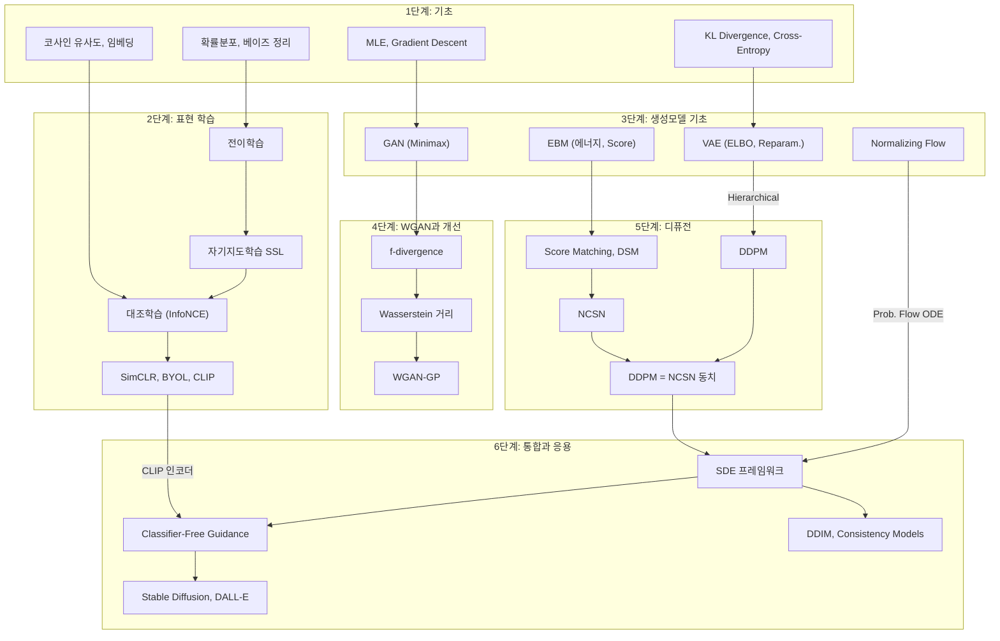

## 부록 C: 논문 필독 리스트

| 순서 | 논문 | 핵심 기여 | 난이도 |
|------|------|----------|--------|
| 1 | SimCLR (Chen et al., 2020) | 대조학습 프레임워크 | ★★☆ |
| 2 | CLIP (Radford et al., 2021) | 멀티모달 대조학습 | ★★☆ |
| 3 | VAE (Kingma & Welling, 2014) | ELBO, Reparameterization | ★★★ |
| 4 | GAN (Goodfellow et al., 2014) | 적대적 학습 | ★★☆ |
| 5 | WGAN (Arjovsky et al., 2017) | Wasserstein 거리 | ★★★ |
| 6 | DDPM (Ho et al., 2020) | Simplified diffusion loss | ★★★ |
| 7 | NCSN (Song & Ermon, 2019) | 다중 스케일 스코어 매칭 | ★★★★ |
| 8 | Score SDE (Song et al., 2021) | SDE 통합 프레임워크 | ★★★★★ |
| 9 | CFG (Ho & Salimans, 2022) | 분류기 없는 가이던스 | ★★★ |
| 10 | Stable Diffusion (Rombach et al., 2022) | 잠재 공간 디퓨전 | ★★★ |

## 부록 D: 오개념 총정리

| # | 오개념 | 진실 |
|---|-------|------|
| 1 | SSL은 라벨이 없다 | 알고리즘이 자동 생성한 라벨이 있다 |
| 2 | SimCLR의 최종 표현은 $z$ | Downstream에는 인코더 출력 $h$를 사용 |
| 3 | Barlow Twins는 대조학습 | Non-contrastive (negative 불필요) |
| 4 | GAN 생성자는 확률분포를 학습 | 암시적 모델 — $p(x)$ 계산 불가 |
| 5 | VAE의 KL은 불필요한 제약 | 잠재공간 구조화의 핵심 정규화 |
| 6 | KL과 Wasserstein은 교체 가능 | 근본적으로 다른 성질 (support 불일치 시) |
| 7 | EBM에서 $Z$를 계산해야 함 | Gradient에는 샘플만 필요, Score에서는 $Z$ 소멸 |
| 8 | Reparam. trick은 구현 편의 | 수학적 필수 (분산 감소) |
| 9 | 확산모델 순방향도 학습 | 완전 고정, 학습 파라미터 없음 |
| 10 | Score는 확률값(스칼라) | 벡터 — 확률 증가 방향 |
| 11 | DDPM과 NCSN은 별개 모델 | $s = -\epsilon/\sigma$로 동치 |
| 12 | CFG에 분류기 정보 없음 | 암묵적 분류기 gradient 사용 |
| 13 | 확산모델 잠재공간은 저차원 | 원본과 같은 차원 (병목 없음) |
| 14 | 큰 노이즈 수준은 불필요 | 글로벌 구조 포착에 필수 |
| 15 | Diffusion은 GAN과 완전히 다름 | Hierarchical VAE의 한 형태, EBM과도 연결 |

---

## 부록 E: 레벨별 학습 가이드

### 초등~중1 (레벨 ①)
- 각 PART의 "레벨 ① 초등" 섹션과 확인 퀴즈만 읽는다
- 목표: "에너지 지도", "위조범과 경찰", "모래 뿌리기"의 비유를 자기 말로 설명할 수 있다
- 핵심 체크: 10개 PART의 비유를 각각 한 문장으로 요약할 수 있는가?
- 소요 시간: 1~2시간

### 중2~고1 (레벨 ②)
- 레벨 ①②를 읽고, 숫자 예시를 따라 계산한다
- 목표: 코사인 유사도, 볼츠만 분포, 노이즈 스케줄의 수치 계산이 가능하다
- 소요 시간: 3~4시간

### 고2~고3 (레벨 ③)
- 레벨 ①②③을 읽고, 오개념 경고를 모두 이해한다
- 목표: InfoNCE, ELBO, DSM, CFG의 수식을 자기 말로 해석할 수 있다
- 소요 시간: 5~6시간

### 대학생 (레벨 ④)
- 전체를 읽고, Python 코드를 직접 실행한다
- 목표: SimCLR, VAE, DDPM, CFG를 코드로 구현할 수 있다
- 소요 시간: 8~10시간

### 대학원생 (레벨 ⑤)
- 전체를 읽고, 논문 필독 리스트를 순서대로 읽는다
- 목표: 최종 마스터 테스트 10문항에 모두 답할 수 있다
- 심화 목표: Score SDE 논문의 Theorem 1 (역 SDE)을 직접 유도할 수 있다
- 연구 확장: Consistency Models, Flow Matching, DiT(Diffusion Transformer) 논문으로 진행
- 소요 시간: 2~3주 (논문 포함)

### 자기 진단 체크리스트

아래 항목 중 자신이 답할 수 있는 개수로 현재 레벨을 진단:

- [ ] SSL이 "라벨 없는 학습"이 아닌 이유 (레벨 ②)
- [ ] 코사인 유사도를 직접 계산 (레벨 ②)
- [ ] InfoNCE가 softmax 구조인 이유 (레벨 ③)
- [ ] EBM에서 $Z$가 score에서 사라지는 유도 (레벨 ③)
- [ ] GAN minimax 목적함수의 각 항 해석 (레벨 ③)
- [ ] VAE ELBO를 Jensen's inequality로 유도 (레벨 ③)
- [ ] Wasserstein 거리가 KL보다 나은 수학적 이유 (레벨 ④)
- [ ] DDPM simplified loss 유도 (레벨 ④)
- [ ] $s = -\epsilon/\sigma$ 동치 관계 유도 (레벨 ④)
- [ ] CFG의 암묵적 분류기 해석 유도 (레벨 ④)
- [ ] VP-SDE / VE-SDE의 drift/diffusion 비교 (레벨 ⑤)
- [ ] Probability Flow ODE와 Normalizing Flow의 연결 (레벨 ⑤)

**0~3개**: 레벨 ①② 복습 필요
**4~6개**: 레벨 ③ 진행 중
**7~9개**: 레벨 ④ 진행 중
**10~12개**: 레벨 ⑤ — 마스터 레벨

---

*이 문서는 18_수학개념_자기지도학습.md, 19_수학개념_생성모델_EBM_GAN.md, 20_수학개념_디퓨전_스코어매칭.md를 기반으로 작성되었습니다.*
